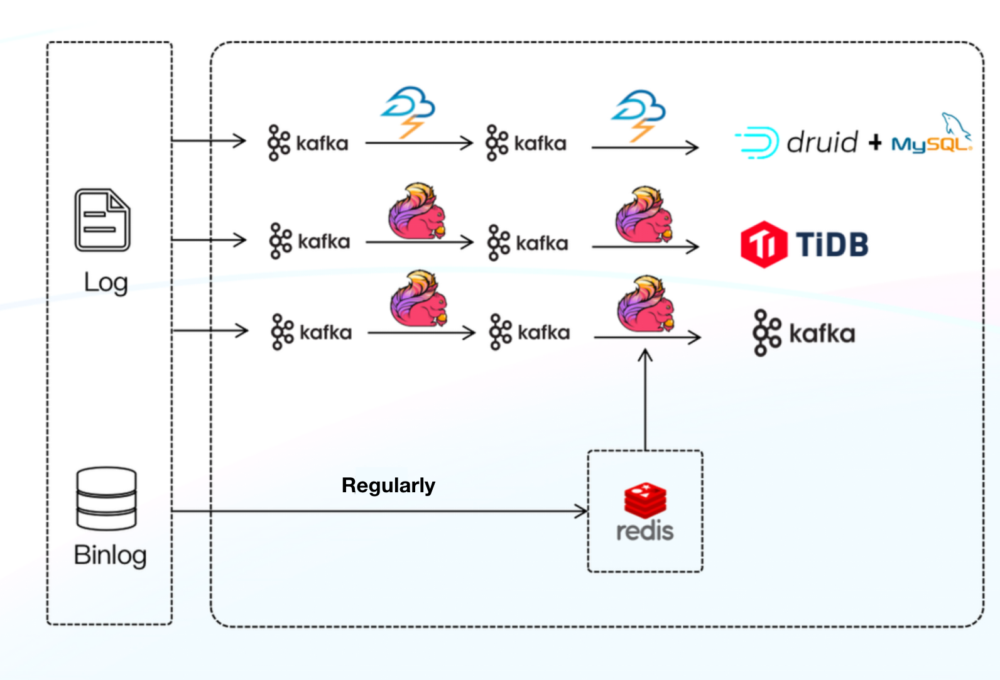
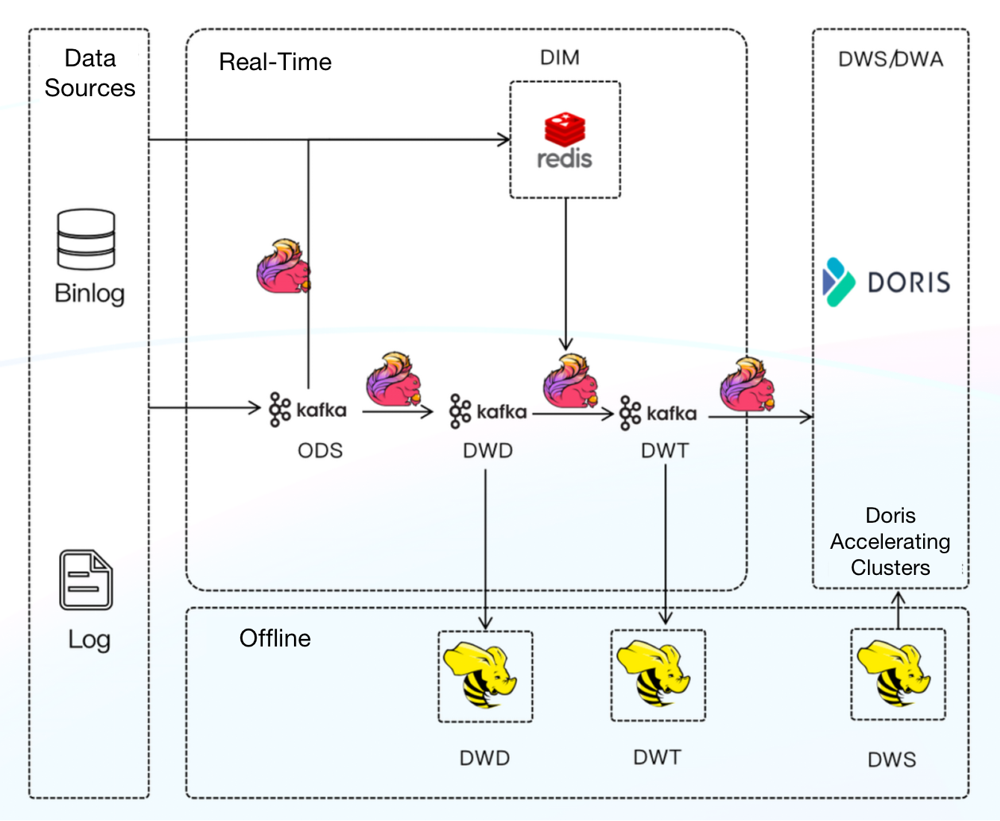
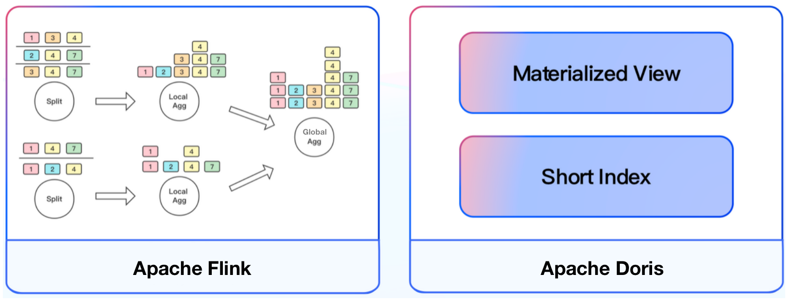
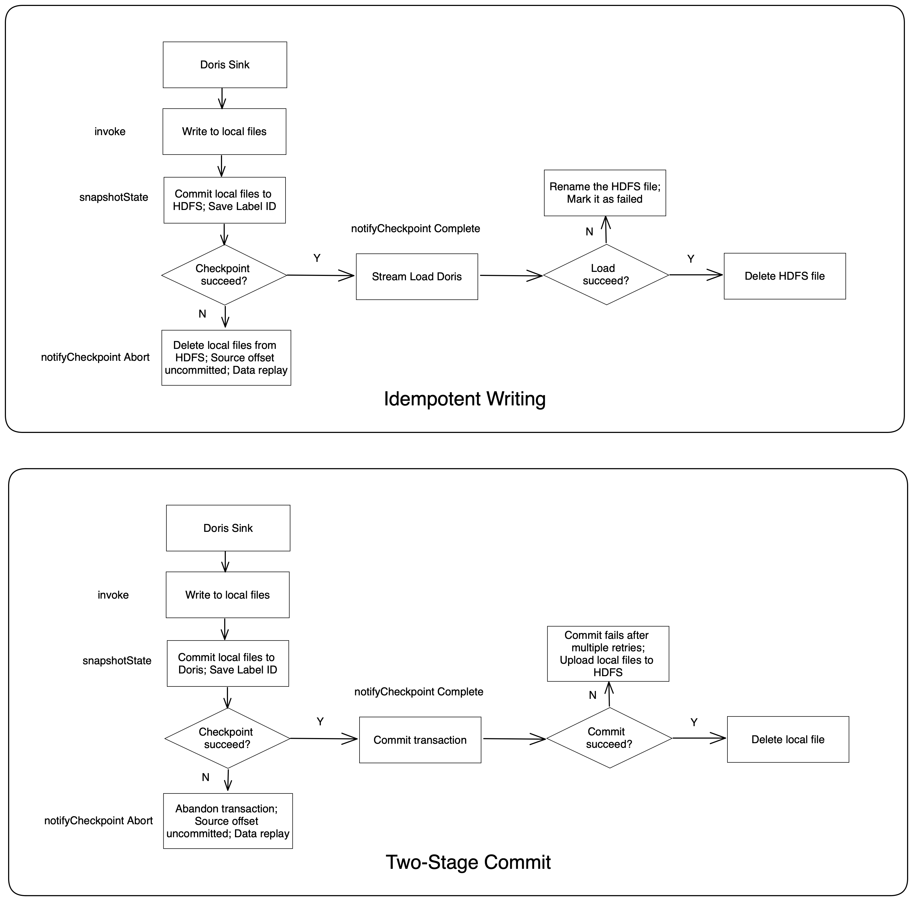
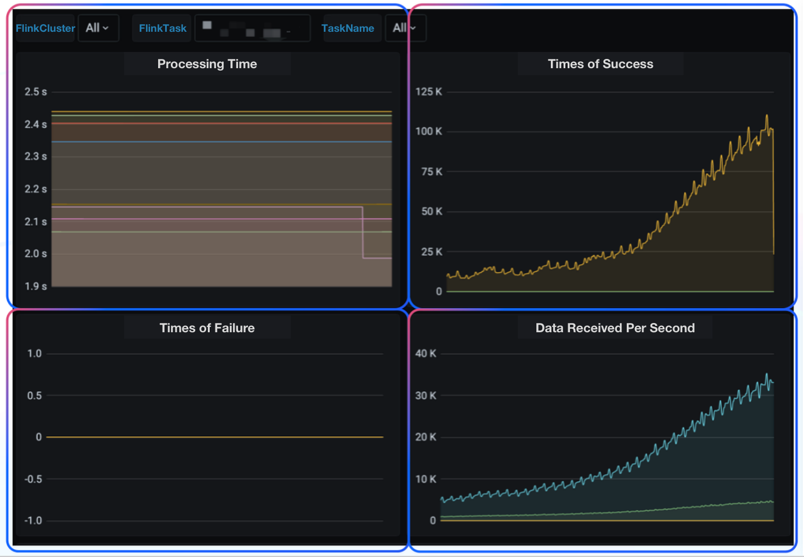

---
{
    'title': 'A/B Testing was a Handful, Until we Found the Replacement for Druid',
    'summary': "The recipe for successful A/B testing is quick computation, no duplication, and no data loss. For that, we used Apache Flink and Apache Doris to build our data platform.",
    'date': '2023-06-01',
    'author': 'Heyu Dou, Xinxin Wang',
    'tags': ['Best Practice'],
}
---

<!-- 
Licensed to the Apache Software Foundation (ASF) under one
or more contributor license agreements.  See the NOTICE file
distributed with this work for additional information
regarding copyright ownership.  The ASF licenses this file
to you under the Apache License, Version 2.0 (the
"License"); you may not use this file except in compliance
with the License.  You may obtain a copy of the License at

  http://www.apache.org/licenses/LICENSE-2.0

Unless required by applicable law or agreed to in writing,
software distributed under the License is distributed on an
"AS IS" BASIS, WITHOUT WARRANTIES OR CONDITIONS OF ANY
KIND, either express or implied.  See the License for the
specific language governing permissions and limitations
under the License.
-->

Unlike normal reporting, A/B testing collects data of a different combination of dimensions every time. It is also a complicated kind of analysis of immense data. In our case, we have a real-time data volume of millions of OPS (Operations Per Second), with each operation involving around 20 data tags and over a dozen dimensions.

For effective A/B testing, as data engineers, we must ensure quick computation as well as high data integrity (which means no duplication and no data loss). I'm sure I'm not the only one to say this: it is hard!

Let me show you our long-term struggle with our previous Druid-based data platform.

## Platform Architecture 1.0

**Components**: Apache Storm + Apache Druid + MySQL

This was our real-time datawarehouse, where Apache Storm was the real-time data processing engine and Apache Druid pre-aggregated the data. However, Druid did not support certain paging and join queries, so we wrote data from Druid to MySQL regularly, making MySQL the "materialized view" of Druid. But that was only a duct tape solution as it couldn't support our ever enlarging real-time data size. So data timeliness was unattainable.

## Platform Architecture 2.0

**Components**: Apache Flink + Apache Druid + TiDB

This time, we replaced Storm with Flink, and MySQL with TiDB. Flink was more powerful in terms of semantics and features, while TiDB, with its distributed capability, was more maintainable than MySQL. But architecture 2.0 was nowhere near our goal of end-to-end data consistency, either, because when processing huge data, enabling TiDB transactions largely slowed down data writing. Plus, Druid itself did not support standard SQL, so there were some learning costs and frictions in usage.

## Platform Architecture 3.0

**Components**: Apache Flink + [Apache Doris](https://github.com/apache/doris)

We replaced Apache Druid with Apache Doris as the OLAP engine, which could also serve as a unified data serving gateway. So in Architecture 3.0, we only need to maintain one set of query logic. And we layered our real-time datawarehouse to increase reusability of real-time data.

Turns out the combination of Flink and Doris was the answer. We can exploit their features to realize quick computation and data consistency. Keep reading and see how we make it happen.

## Quick Computation

As one piece of operation data can be attached to 20 tags, in A/B testing, we compare two groups of data centering only one tag each time. At first, we thought about splitting one piece of operation data (with 20 tags) into 20 pieces of data of only one tag upon data ingestion, and then importing them into Doris for analysis, but that could cause a data explosion and thus huge pressure on our clusters. 

Then we tried moving part of such workload to the computation engine. So we tried and "exploded" the data in Flink, but soon regretted it, because when we aggregated the data using the global hash windows in Flink jobs, the network and CPU usage also "exploded".

Our third shot was to aggregate data locally in Flink right after we split it. As is shown below, we create a window in the memory of one operator for local aggregation; then we further aggregate it using the global hash windows. Since two operators chained together are in one thread, transferring data between operators consumes much less network resources. **The two-step aggregation method, combined with the** **[Aggregate model](https://doris.apache.org/docs/dev/data-table/data-model)** **of Apache Doris, can keep data explosion in a manageable range.**

For convenience in A/B testing, we make the test tag ID the first sorted field in Apache Doris, so we can quickly locate the target data using sorted indexes. To further minimize data processing in queries, we create materialized views with the frequently used dimensions. With constant modification and updates, the materialized views are applicable in 80% of our queries.

To sum up, with the application of sorted index and materialized views, we reduce our query response time to merely seconds in A/B testing.

## Data Integrity Guarantee

Imagine that your algorithm designers worked sweat and tears trying to improve the business, only to find their solution unable to be validated by A/B testing due to data loss. This is an unbearable situation, and we make every effort to avoid it.

### Develop a Sink-to-Doris Component

To ensure end-to-end data integrity, we developed a Sink-to-Doris component. It is built on our own Flink Stream API scaffolding and realized by the idempotent writing of Apache Doris and the two-stage commit mechanism of Apache Flink. On top of it, we have a data protection mechanism against anomalies. 

It is the result of our long-term evolution. We used to ensure data consistency by implementing "one writing for one tag ID". Then we realized we could make good use of the transactions in Apache Doris and the two-stage commit of Apache Flink. 

As is shown above, this is how two-stage commit works to guarantee data consistency:

1. Write data into local files;
2. Stage One: pre-commit data to Apache Doris. Save the Doris transaction ID into status;
3. If checkpoint fails, manually abandon the transaction; if checkpoint succeeds, commit the transaction in Stage Two;
4. If the commit fails after multiple retries, the transaction ID and the relevant data will be saved in HDFS, and we can restore the data via Broker Load.

We make it possible to split a single checkpoint into multiple transactions, so that we can prevent one Stream Load from taking more time than a Flink checkpoint in the event of large data volumes.

### Application Display

This is how we implement Sink-to-Doris. The component has blocked API calls and topology assembly. With simple configuration, we can write data into Apache Doris via Stream Load. 

### Cluster Monitoring

For cluster and host monitoring, we adopted the metrics templates provided by the Apache Doris community. For data monitoring, in addition to the template metrics, we added Stream Load request numbers and loading rates.

Other metrics of our concerns include data writing speed and task processing time. In the case of anomalies, we will receive notifications in the form of phone calls, messages, and emails.

## Key Takeaways

The recipe for successful A/B testing is quick computation and high data integrity. For this purpose, we implement a two-step aggregation method in Apache Flink, utilize the Aggregate model, materialized view, and short indexes of Apache Doris. Then we develop a Sink-to-Doris component, which is realized by the idempotent writing of Apache Doris and the two-stage commit mechanism of Apache Flink.

