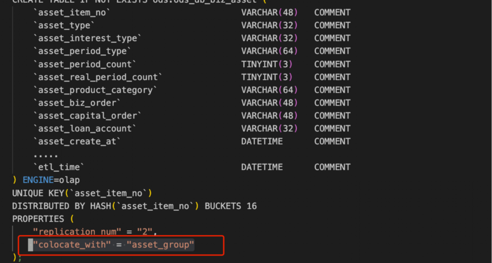
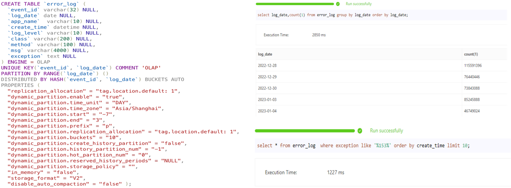
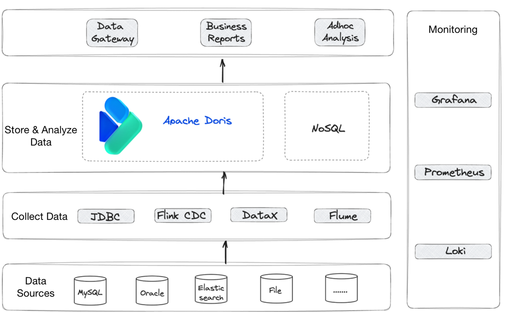

---
{
    'title': 'Choosing an OLAP Engine for Financial Risk Management: What to Consider?',
    'summary': "This post provides reference for what you should take into account when choosing an OLAP engine in a financial scenario.",
    'date': '2023-08-17',
    'author': 'Jianbo Liu',
    'tags': ['Best Practice'],
    "image": '/images/common.png'
}

---

<!-- 
Licensed to the Apache Software Foundation (ASF) under one
or more contributor license agreements.  See the NOTICE file
distributed with this work for additional information
regarding copyright ownership.  The ASF licenses this file
to you under the Apache License, Version 2.0 (the
"License"); you may not use this file except in compliance
with the License.  You may obtain a copy of the License at

  http://www.apache.org/licenses/LICENSE-2.0

Unless required by applicable law or agreed to in writing,
software distributed under the License is distributed on an
"AS IS" BASIS, WITHOUT WARRANTIES OR CONDITIONS OF ANY
KIND, either express or implied.  See the License for the
specific language governing permissions and limitations
under the License.
-->

From a data engineer's point of view, financial risk management is a series of data analysis activities on financial data. The financial sector imposes its unique requirements on data engineering. This post explains them with a use case of Apache Doris, and provides reference for what you should take into account when choosing an OLAP engine in a financial scenario. 

## Data Must Be Combined

The financial data landscape is evolving from standalone to distributed, heterogeneous systems. For example, in this use case scenario, the fintech service provider needs to connect the various transaction processing (TP) systems (MySQL, Oracle, and PostgreSQL) of its partnering banks. Before they adopted an OLAP engine, they were using Kettle to collect data. The ETL tool did not support join queries across different data sources and it could not store data. The ever-enlarging data size at the source end was pushing the system towards latency and instability. That's when they decided to introduce an OLAP engine.

The financial user's main pursuit is quick queries on large data volume with as least engineering and maintenance efforts as possible, so when it comes to the choice of OLAP engines, SQL on Hadoop should be crossed off the list due to its huge ecosystem and complicated components. One reason that they landed on Apache Doris was the metadata management capability. Apache Doris collects metadata of various data sources via API so it is a fit for the case which requires combination of different TP systems. 

## High Concurrency & High Throughput

Financial risk control is based on analysis of large amounts of transaction data. Sometimes analysts identify abnormalities by combining data from different large tables, and often times they need to check a certain data record, which comes in the form of concurrent point queries in the data system. Thus, the OLAP engine should be able to handle both high-throughput queries and high-concurrency queries. 

To speed up the highly concurrent point queries, you can create [Materialized Views](https://doris.apache.org/docs/dev/query-acceleration/materialized-view/) in Apache Doris. A Materialized View is a pre-computed data set stored in Apache Doris so that the system can respond much faster to queries that are frequently conducted. 

To facilitate queries on large tables, you can leverage the [Colocation Join](https://doris.apache.org/docs/dev/query-acceleration/join-optimization/colocation-join/) mechanism. Colocation Join minimizes data transfer between computation nodes to reduce overheads brought by data movement. Thus, it can largely improve query speed when joining large tables.

## Log Analysis

Log analysis is important in financial data processing. Real-time processing and monitoring of logs can expose risks in time. Apache Doris provides data storage and analytics capabilities to make log analysis easier and more efficient. As logs are bulky, Apache Doris can deliver a high data compression rate to lower storage costs. 

Retrieval is a major part of log analysis, so [Apache Doris 2.0](https://doris.apache.org/docs/dev/releasenotes/release-2.0.0) supports inverted index, which is a way to accelerate text searching and equivalence/range queries on numerics and datetime. It allows users to quickly locate the log record that they need among the massive data. The JSON storage feature in Apache Doris is reported to reduce storage costs of user activity logs by 70%, and the variety of parse functions provided can save data engineers from developing their own SQl functions. 

## Easy Maintenance

In addition to the easy deployment, Apache Doris has a few mechanisms that are designed to save maintenance efforts. For example, it ensures high availability of cluster nodes with Systemd, and high availability of data with multi-replica and auto-balancing of replicas, so all maintenance required is to backup metadata on a regular basis. Apache Doris also supports [dynamic partitioning of data](https://doris.apache.org/docs/dev/advanced/partition/dynamic-partition/), which means it will automatically create or delete data partitions according to the rules specified by the user. This saves efforts in partition management and eliminates possible efforts caused by manual management.

## Architecture Overview

This is overall data architecture in the case. The user utilizes Apache Flume for log data collection, and DataX for data update. Data from multiple sources will be collected into Apache Doris to form a data mart, from which analysts extract information to generate reports and dashboards for reference in risk control and business decisions. As for stability of the data mart itself, Grafana and Prometheus are used to monitor memory usage, compaction score and query response time of Apache Doris to make sure it is running well.

