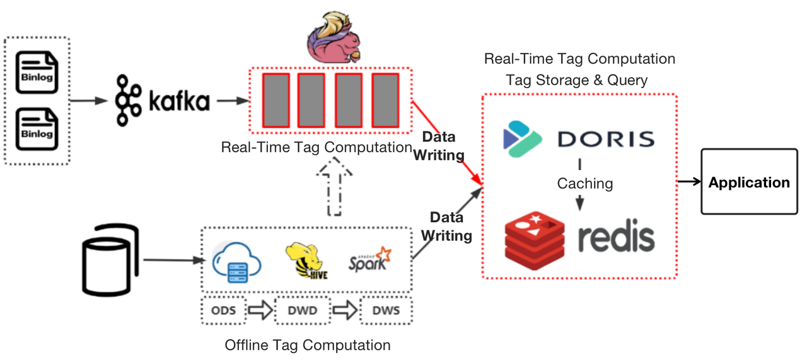
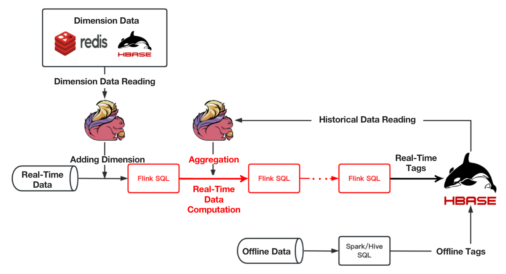

---
{
    'title': 'Zipping up the Lambda Architecture for 40% Faster Performance',
    'summary': "Instead of pooling real-time and offline data after they are fully ready for queries, Douyu engineers use Apache Doris to share part of the pre-query computation burden.",
    'date': '2023-05-05',
    'author': 'Tongyang Han',
    'tags': ['Best Practice'],
}

---

<!-- 
Licensed to the Apache Software Foundation (ASF) under one
or more contributor license agreements.  See the NOTICE file
distributed with this work for additional information
regarding copyright ownership.  The ASF licenses this file
to you under the Apache License, Version 2.0 (the
"License"); you may not use this file except in compliance
with the License.  You may obtain a copy of the License at

  http://www.apache.org/licenses/LICENSE-2.0

Unless required by applicable law or agreed to in writing,
software distributed under the License is distributed on an
"AS IS" BASIS, WITHOUT WARRANTIES OR CONDITIONS OF ANY
KIND, either express or implied.  See the License for the
specific language governing permissions and limitations
under the License.
-->

Author: Tongyang Han, Senior Data Engineer at Douyu

The Lambda architecture has been common practice in big data processing. The concept is to separate stream (real time data) and batch (offline data) processing, and that's exactly what we did. These two types of data of ours were processed in two isolated tubes before they were pooled together and ready for searches and queries.

Then we run into a few problems:

1. **Isolation of real-time and offline data warehouses**
   1.  I know this is kind of the essence of Lambda architecture, but that means we could not reuse real-time data since it was not layered as offline data, so further customized development was required.
2. **Complex Pipeline from Data Sources to Data Application**
   1.  Data had to go through multi-step processing before it reached our data users. As our architecture involved too many components, navigating and maintaining these tech stacks was a lot of work.
3. **Lack of management of real-time data sources**
   1.  In extreme cases, this worked like a data silo and we had no way to find out whether the ingested data was duplicated or reusable.

So we decided to "zip up" the Lambda architecture a little bit. By "zipping up", I mean to introduce an OLAP engine that is capable of processing, storing, and analyzing data, so real-time data and offline data converge a little earlier than they used to. It is not a revolution of Lambda, but a minor change in the choice of components, which made our real-time data processing 40% faster.

## **Zipping up Lambda Architecture**

I am going to elaborate on how this is done using our data tagging process as an example.

Previously, our offline tags were produced by the data warehouse, put into a flat table, and then written in **HBase**, while real-time tags were produced by **Flink**, and put into **HBase** directly. Then **Spark** would work as the computing engine.

The problem with this stemmed from the low computation efficiency of **Flink** and **Spark**. 

- **Real-time tag production**: When computing real-time tags that involve data within a long time range, Flink did not deliver stable performance and consumed more resources than expected. And when a task failed, it would take a really long time for checkpoint recovery.
- **Tag query**: As a tag query engine, Spark could be slow.

As a solution, we replaced **HBase** and **Spark** with **Apache Doris**, a real-time analytic database, and moved part of the computational logic of the foregoing wide-time-range real-time tags from **Flink** to **Apache Doris**.

Instead of putting our flat tables in HBase, we place them in Apache Doris. These tables are divided into partitions based on time sensitivity. Offline tags will be updated daily while real-time tags will be updated in real time. We organize these tables in the Aggregate Model of Apache Doris, which allows partial update of data.

Instead of using Spark for queries, we parse the query rules into SQL for execution in Apache Doris. For pattern matching, we use Redis to cache the hot data from Apache Doris, so the system can respond to such queries much faster.

## **Computational Pipeline of Wide-Time-Range Real-Time Tags**

In some cases, the computation of wide-time-range real-time tags entails the aggregation of historical (offline) data with real-time data. The following figure shows our old computational pipeline for these tags. 

As you can see, it required multiple tasks to finish computing one real-time tag. Also, in complicated aggregations that involve a collection of aggregation operations, any improper resource allocation could lead to back pressure or waste of resources. This adds to the difficulty of task scheduling. The maintenance and stability guarantee of such a long pipeline could be an issue, too.

To improve on that, we decided to move such aggregation workload to Apache Doris.

We have around 400 million customer tags in our system, and each customer is attached with over 300 tags. We divide customers into more than 10,000 groups, and we have to update 5000 of them on a daily basis. The above improvement has sped up the computation of our wide-time-range real-time queries by **40%**.

## Overwrite

To atomically replace data tables and partitions in Apache Doris, we customized the [Doris-Spark-Connector](https://github.com/apache/doris-spark-connector), and added an "Overwrite" mode to the Connector.

When a Spark job is submitted, Apache Doris will call an interface to fetch information of the data tables and partitions.

- If it is a non-partitioned table, we create a temporary table for the target table, ingest data into it, and then perform atomic replacement. If the data ingestion fails, we clear the temporary table;
- If it is a dynamic partitioned table, we create a temporary partition for the target partition, ingest data into it, and then perform atomic replacement. If the data ingestion fails, we clear the temporary partition;
- If it is a non-dynamic partitioned table, we need to extend the Doris-Spark-Connector parameter configuration first. Then we create a temporary partition and take steps as above.

##  Conclusion

One prominent advantage of Lambda architecture is the stability it provides. However, in our practice, the processing of real-time data and offline data sometimes intertwines. For example, the computation of certain real-time tags requires historical (offline) data. Such interaction becomes a root cause of instability. Thus, instead of pooling real-time and offline data after they are fully ready for queries, we use an OLAP engine to share part of the pre-query computation burden and make things faster, simpler, and more cost-effective.
