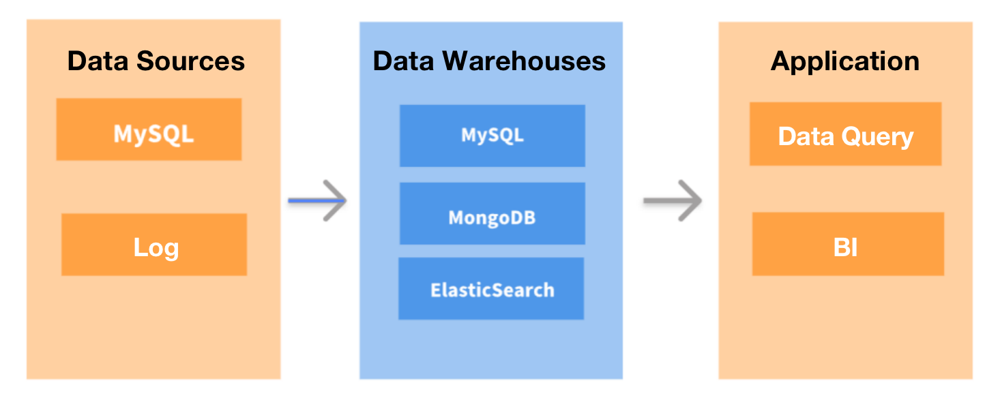
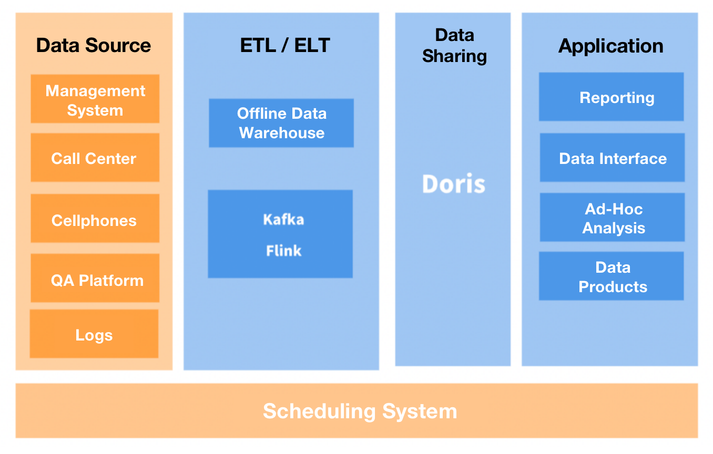
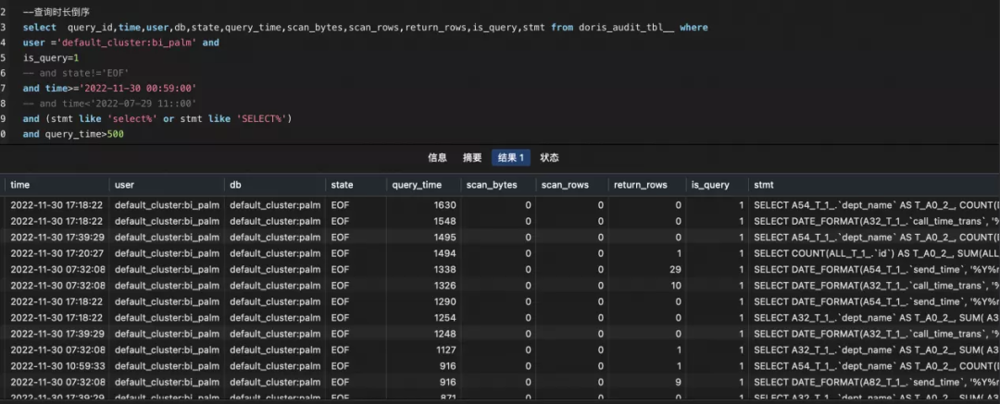

---
{
    'title': 'Best Practice in Duyansoft, Improving Query Speed to Make the Most out of Your Data',
    'summary': "This is about how Duyansoft improved its overall data processing efficiency by optimizing the choice and usage of data warehouses.",
    'date': '2023-02-27',
    'author': 'Junfei Liu',
    'tags': ['Best Practice'],
}
---

<!-- 
Licensed to the Apache Software Foundation (ASF) under one
or more contributor license agreements.  See the NOTICE file
distributed with this work for additional information
regarding copyright ownership.  The ASF licenses this file
to you under the Apache License, Version 2.0 (the
"License"); you may not use this file except in compliance
with the License.  You may obtain a copy of the License at

  http://www.apache.org/licenses/LICENSE-2.0

Unless required by applicable law or agreed to in writing,
software distributed under the License is distributed on an
"AS IS" BASIS, WITHOUT WARRANTIES OR CONDITIONS OF ANY
KIND, either express or implied.  See the License for the
specific language governing permissions and limitations
under the License.
-->

> Author: Junfei Liu, Senior Architect of Duyansoft

The world is getting more and more value out of data, as exemplified by the currently much-talked-about ChatGPT, which I believe is a robotic data analyst. However, in today’s era, what’s more important than the data itself is the ability to locate your wanted information among all the overflowing data quickly. So in this article, I will talk about how I improved overall data processing efficiency by optimizing the choice and usage of data warehouses.

# Too Much Data on My Plate

The choice of data warehouses was never high on my worry list until 2021. I have been working as a data engineer for a Fintech SaaS provider since its incorporation in 2014. In the company’s infancy, we didn’t have too much data to juggle. We only needed a simple tool for OLTP and business reporting, and the traditional databases would cut the mustard.

But as the company grew, the data we received became overwhelmingly large in volume and increasingly diversified in sources. Every day, we had tons of user accounts logging in and sending myriads of requests. It was like collecting water from a thousand taps to put out a million scattered pieces of fire in a building, except that you must bring the exact amount of water needed for each fire spot. Also, we got more and more emails from our colleagues asking if we could make data analysis easier for them. That’s when the company assembled a big data team to tackle the beast.

The first thing we did was to revolutionize our data processing architecture. We used DataHub to collect all our transactional or log data and ingest it into an offline data warehouse for data processing (analyzing, computing. etc.). Then the results would be exported to MySQL and then forwarded to QuickBI to display the reports visually. We also replaced MongoDB with a real-time data warehouse for business queries.

This new architecture worked, but there remained a few pebbles in our shoes:

- **We wanted faster responses.** MySQL could be slow in aggregating large tables, but our product guys requested a query response time of fewer than five seconds. So first, we tried to optimize MySQL. Then we also tried to skip MySQL and directly connect the offline data warehouse with QuickBI, hoping that the combination of query acceleration capability of the former and caching of the latter would do the magic. Still, that five-second goal seemed to be unreachable. There was a time when I believed the only perfect solution was for the product team to hire people with more patience.
- **We wanted less pain in maintaining dimension tables.** The offline data warehouse conducted data synchronization every five minutes, making it not applicable for frequent data updates or deletions scenarios. If we needed to maintain dimension tables in it, we would have to filter and deduplicate the data regularly to ensure data consistency. Out of our trouble-averse instinct, we chose not to do so.
- **We wanted support for point queries of high concurrency.** The real-time database that we previously used required up to 500ms to respond to highly concurrent point queries in both columnar storage and row storage, even after optimization. That was not good enough.

# Hit It Where It Hurts Most

In March, 2022, we started our hunt for a better data warehouse. To our disappointment, there was no one-size-fits-all solution. Most of the tools we looked into were only good at one or a few of the tasks, but if we gathered the best performer for each usage scenario, that would add up to a heavy and messy toolkit, which was against instinct.

So we decided to solve our biggest headache first: slow response, as it was hurting both the experience of our users and our internal work efficiency.

To begin with, we tried to move the largest tables from MySQL to [Apache Doris](https://github.com/apache/doris), a real-time analytical database that supports MySQL protocol. That reduced the query execution time by a factor of eight. Then we tried and used Doris to accommodate more data.

As for now, we are using two Doris clusters: one to handle point queries (high QPS) from our users and the other for internal ad-hoc queries and reporting. As a result, users have reported smoother experience and we can provide more features that are used to be bottlenecked by slow query execution. Moving our dimension tables to Doris also brought less data errors and higher development efficiency.

Both the FE and BE processes of Doris can be scaled out, so tens of PBs of data stored in hundreds of devices can be put into one single cluster. In addition, the two types of processes implement a consistency protocol to ensure service availability and data reliability. This removes dependency on Hadoop and thus saves us the cost of deploying Hadoop clusters.

# Tips

Here are a few of our practices to share with you:

## **Data Model:**

Out of the three Doris data models, we find the Unique Model and the Aggregate Model suit our needs most. For example, we use the Unique Model to ensure data consistency while ingesting dimension tables and original tables and the Aggregate Model to import report data.

## **Data Ingestion:**

For real-time data ingestion, we use the Flink-Doris-Connector: After our business data, the MySQL-based binlogs, is written into Kafka, it will be parsed by Flink and then loaded into Doris in a real-time manner.

For offline data ingestion, we use DataX: This mainly involves the computed report data in our offline data warehouse.

## **Data Management:**

We back up our cluster data in a remote storage system via Broker. Then, it can restore the data from the backups to any Doris cluster if needed via the restore command.

## **Monitoring and Alerting:**

In addition to the various monitoring metrics of Doris, we deployed an audit log plugin to keep a closer eye on certain slow SQL of certain users for optimization.

Slow SQL queries:

Some of our often-used monitoring metrics:

**Tradeoff Between Resource Usage and Real-Time Availability:**

It turned out that using Flink-Doris-Connector for data ingestion can result in high cluster resource usage, so we increased the interval between each data writing from 3s to 10 or 20s, compromising a little bit on the real-time availability of data in exchange for much less resource usage.

# Communication with Developers

We have been in close contact with the open source Doris community all the way from our investigation to our adoption of the data warehouse, and we’ve provided a few suggestions to the developers:

- Enable Flink-Doris-Connector to support simultaneous writing of multiple tables in a single sink.
- Enable Materialized Views to support Join of multiple tables.
- Optimize the underlying compaction of data and reduce resource usage as much as possible.
- Provide optimization suggestions for slow SQL and warnings for abnormal table creation behaviors.

If the perfect data warehouse is not there to be found, I think providing feedback for the second best is a way to help make one. We are also looking into its commercialized version called SelectDB to see if more custom-tailored advanced features can grease the wheels.

# Conclusion

As we set out to find a single data warehouse that could serve all our needs, we ended up finding something less than perfect but good enough to improve our query speed by a wide margin and discovered some surprising features of it along the way. So if you wiggle between different choices, you may bet on the one with the thing you want most badly, and taking care of the rest wouldn’t be so hard.

**Try** [**Apache Doris**](https://github.com/apache/doris) **out!**

It is an open source real-time analytical database based on MPP architecture. It supports both high-concurrency point queries and high-throughput complex analysis. Or you can start your free trial of [**SelectDB**](https://en.selectdb.com/), a cloud-native real-time data warehouse developed based on the Apache Doris open source project by the same key developers.