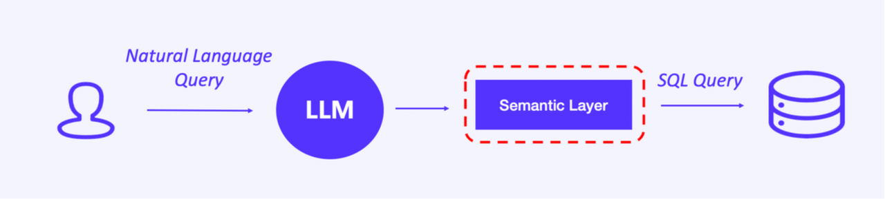
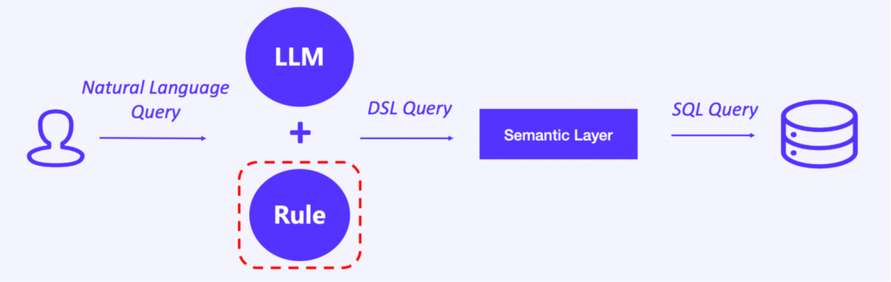
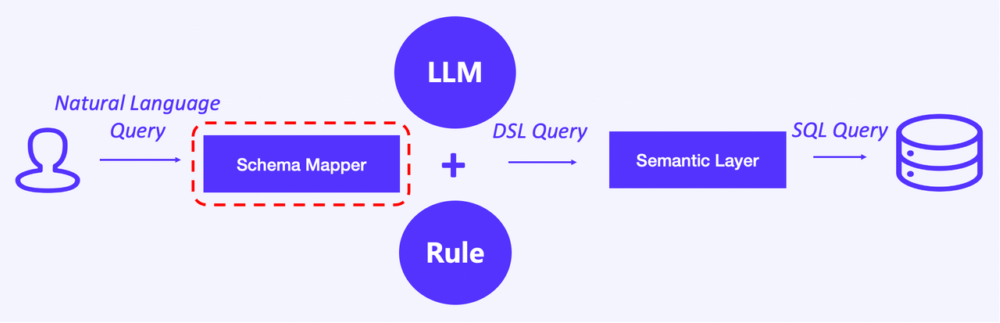
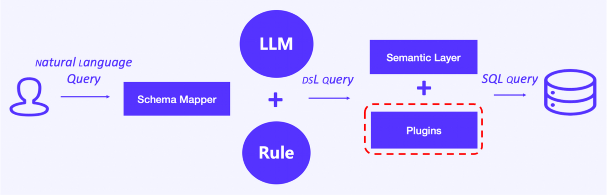
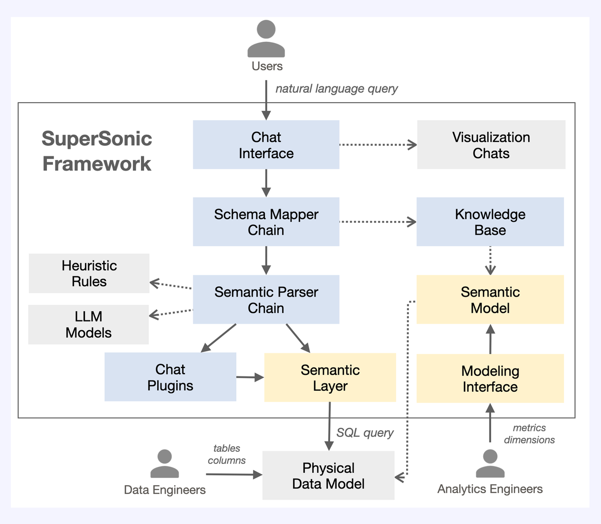
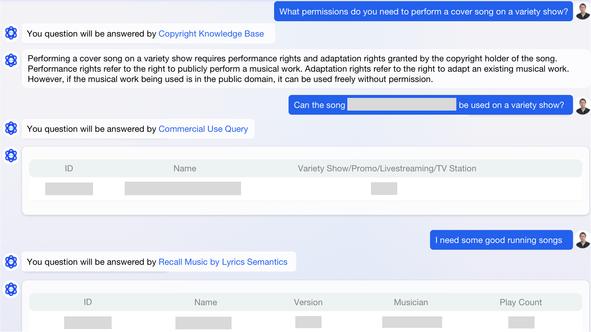
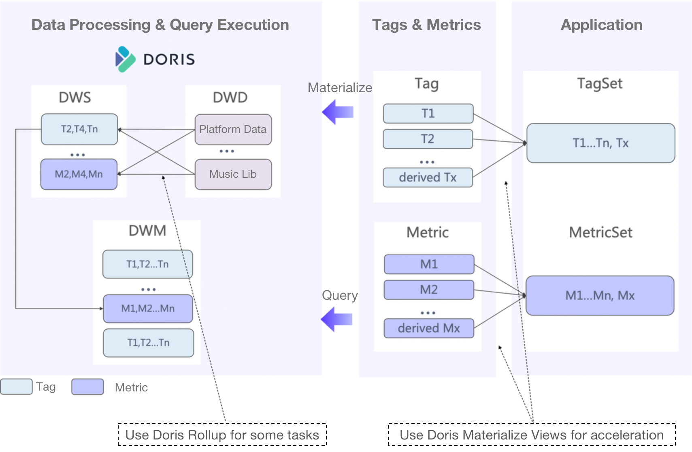

---
{
    'title': 'LLM-Powered OLAP: the Tencent Experience with Apache Doris',
    'summary': "The exploration of a LLM+OLAP solution is a bumpy journey, but phew, it now works well for the Tencent case, and they're writing down every lesson learned to share with you.",
    'date': '2023-08-29',
    'author': 'Jun Zhang & Lei Luo',
    'tags': ['Best Practice'],
}

---

<!-- 
Licensed to the Apache Software Foundation (ASF) under one
or more contributor license agreements.  See the NOTICE file
distributed with this work for additional information
regarding copyright ownership.  The ASF licenses this file
to you under the Apache License, Version 2.0 (the
"License"); you may not use this file except in compliance
with the License.  You may obtain a copy of the License at

  http://www.apache.org/licenses/LICENSE-2.0

Unless required by applicable law or agreed to in writing,
software distributed under the License is distributed on an
"AS IS" BASIS, WITHOUT WARRANTIES OR CONDITIONS OF ANY
KIND, either express or implied.  See the License for the
specific language governing permissions and limitations
under the License.
-->

Six months ago, I wrote about [why we replaced ClickHouse with Apache Doris as an OLAP engine](https://doris.apache.org/blog/Tencent-Data-Engineers-Why-We-Went-from-ClickHouse-to-Apache-Doris) for our data management system. Back then, we were struggling with the auto-generation of SQL statements. As days pass, we have made progresses big enough to be references for you (I think), so here I am again. 

We have adopted Large Language Models (LLM) to empower our Doris-based OLAP services.

## LLM + OLAP

Our incentive was to save our internal staff from the steep learning curve of SQL writing. Thus, we used LLM as an intermediate. It transforms natural language questions into SQL statements and sends the SQLs to the OLAP engine for execution.

Like every AI-related experience, we came across some friction:

1. LLM does not understand data jargons, like "fields", "rows", "columns" and "tables". Instead, they can perfectly translate business terms like "corporate income" and "DAU", which are basically what the fields/rows/columns are about. That means it can work well only if the analysts use the exact right word to refer to the metric they need when typing their questions.
2. The LLM we are using is slow in inference. It takes over 10 seconds to respond. As it charges fees by token, cost-effectiveness becomes a problem.
3. Although the LLM is trained on a large collection of public datasets, it is under-informed of niche knowledge. In our case, the LLM is super unfamiliar with indie songs, so even if the songs are included in our database, the LLM will not able to identify them properly. 
4. Sometimes our input questions require adequate and latest legal, political, financial, and regulatory information, which is hard to be included in a training dataset or knowledge base. We need to connect the LLM to wider info bases in order to perform more diversified tasks.

We knock these problems down one by one.

### 1. A semantic layer

For problem No.1, we introduce a semantic layer between the LLM and the OLAP engine. This layer translates business terms into the corresponding data fields. It can identify data filtering conditions from the various natural language wordings, relate them to the metrics involved, and then generate SQL statements. 

Besides that, the semantic layer can optimize the computation logic. When analysts input a question that involves a complicated query, let's say, a multi-table join, the semantic layer can split that into multiple single-table queries to reduce semantic distortion.

### 2. LLM parsing rules

To increase cost-effectiveness in using LLM, we evaluate the computation complexity of all scenarios, such as metric computation, detailed record retrieval, and user segmentation. Then, we create rules and dedicate the LLM-parsing step to only complicated tasks. That means for the simple computation tasks, it will skip the parsing. 

For example, when an analyst inputs "tell me the earnings of the major musical platforms", the LLM identifies that this question only entails several metrics or dimensions, so it will not further parse it but send it straight for SQL generation and execution. This can largely shorten query response time and reduce API expenses. 

### 3. Schema Mapper and external knowledge base

To empower the LLM with niche knowledge, we added a Schema Mapper upstream from the LLM. The Schema Mapper maps the input question to an external knowledge base, and then the LLM will do parsing.

We are constantly testing and optimizing the Schema Mapper. We categorize and rate content in the external knowledge base, and do various levels of mapping (full-text mapping and fuzzy mapping) to enable better semantic parsing.

### 4. Plugins

We used plugins to connect the LLM to more fields of information, and we have different integration methods for different types of plugins:

- **Embedding local files**: This is especially useful when we need to "teach" the LLM the latest regulatory policies, which are often text files. Firstly, the system vectorizes the local text file, executes semantic searches to find matching or similar terms in the local file, extracts the relevant contents and puts them into the LLM parsing window to generate output. 
- **Third-party plugins**: The marketplace is full of third-party plugins that are designed for all kinds of sectors. With them, the LLM is able to deal with wide-ranging topics. Each plugin has its own prompts and calling function. Once the input question hits a prompt, the relevant plugin will be called.

After we are done with above four optimizations, the SuperSonic framework comes into being.

## The SuperSonic framework

Now let me walk you through this [framework](https://github.com/tencentmusic/supersonic):

- An analyst inputs a question.
- The Schema Mapper maps the question to an external knowledge base.
- If there are matching fields in the external knowledge base, the question will not be parsed by the LLM. Instead, a metric computation formula will trigger the OLAP engine to start querying. If there is no matching field, the question will enter the LLM.
- Based on the pre-defined rules, the LLM rates the complexity level of the question. If it is a simple query, it will go directly to the OLAP engine; if it is a complicated query, it will be semantically parsed and converted to a DSL statement.
- At the Semantic Layer, the DSL statement will be split based on its query scenario. For example, if it is a multi-table join query, this layer will generate multiple single-table query SQL statements.
- If the question involves external knowledge, the LLM will call a third-party plugin.

**Example**

To answer whether a certain song can be performed on variety shows, the system retrieves the OLAP data warehouse for details about the song, and presents it with results from the Commercial Use Query third-party plugin.

## OLAP Architecture

As for the OLAP part of this framework, after several rounds of architectural evolution, this is what our current OLAP pipeline looks like. 

Raw data is sorted into tags and metrics, which are custom-defined by the analysts. The tags and metrics are under unified management in order to avoid inconsistent definitions. Then, they are combined into various tagsets and metricsets for various queries. 

We have drawn two main takeaways for you from our architectural optimization experience.

**1. Streamline the links**

Before we adopted Apache Doris, we used to have ClickHouse to accelerate the computation of tags and metrics, and Elasticsearch to process dimensional data. That's two analytic engines and requires us to adapt the query statements to both of them. It was high-maintenance.

Thus, we replaced ClickHouse with Apache Doris, and utilized the [Elasticsearch Catalog](https://doris.apache.org/docs/dev/lakehouse/multi-catalog/es) functionality to connect Elasticsearch data to Doris. In this way, we make Doris our unified query gateway. 

**2. Split the flat tables**

In early versions of our OLAP architecture, we used to put data into flat tables, which made things tricky. For one thing, flat tables absorbed all the writing latency from upstreams, and that added up to considerable loss in data realtimeliness. For another, 50% of data in a flat table was dimensional data, which was rarely updated. With every new flat table came some bulky dimensional data that consumed lots of storage space. 

Therefore, we split the flat tables into metric tables and dimension tables. As they are updated in different paces, we put them into different data models.

- **Metric tables**: We arrange metric data in the Aggregate Key model of Apache Doris, which means new data will be merged with the old data by way of SUM, MAX, MIN, etc.
- **Dimension tables**: These tables are in the Unique Key model of Apache Doris, which means new data record will replace the old. This can greatly increase performance in our query scenarios.

You might ask, does this cause trouble in queries, since most queries require data from both types of tables? Don't worry, we address that with the Rollup feature of Doris. On the basis of the base tables, we can select the dimensions we need to create Rollup views, which will automatically execute `GROUP BY`. This relieves us of the need to define tags for each Rollup view and largely speed up queries.

## Other Tricks

In our experience with Apache Doris, we also find some other functionalities handy, so I list them here for you, too:

**1. Materialized View**

A Materialized View is a pre-computed dataset. It is a way to accelerate queries when you frequently need to access data of certain dimensions. In these scenarios, we define derived tags and metrics based on the original ones. For example, we create a derived metric by combining Metric 1, Metric 2, and Metric 3: `sum(m1+m2+m3)`. Then, we can create a Materialized View for it. According to the Doris release schedule, version 2.1 will support multi-table Materialized Views, and we look forward to that.

**2. Flink-Doris-Connector**

This is for Exactly-Once guarantee in data ingestion. The Flink-Doris-Connector implements a checkpoint mechanism and two-stage commit, and allows for auto data synchronization from relational databases to Doris.

**3. Compaction**

When the number of aggregation tasks or data volume becomes overwhelming for Flink, there might be huge latency in data compaction. We solve that with Vertical Compaction and Segment Compaction. Vertical Compaction supports loading of only part of the columns, so it can reduce storage consumption when compacting flat tables. Segment Compaction can avoid generating too much segments during data writing, and allows for compaction while writing simultaneously.   

## What's Next

With an aim to reduce costs and increase service availability, we plan to test the newly released Storage-Compute Separation and Cross-Cluster Replication of Doris, and we embrace any ideas and inputs about the SuperSonic framework and the Apache Doris project.
