---
{
'title': 'Doris analysis: Doris Compaction mechanism analysis',
'summary': "This article introduces Doris's compaction mechanism. Doris aggregates different data versions through the compaction mechanism and merges small files into large files, effectively improving query performance.",
'date': '2022-09-12',
'author': 'Apache Doris',
'tags': ['Tech Sharing'],
}
---

<!-- 
Licensed to the Apache Software Foundation (ASF) under one
or more contributor license agreements.  See the NOTICE file
distributed with this work for additional information
regarding copyright ownership.  The ASF licenses this file
to you under the Apache License, Version 2.0 (the
"License"); you may not use this file except in compliance
with the License.  You may obtain a copy of the License at

  http://www.apache.org/licenses/LICENSE-2.0

Unless required by applicable law or agreed to in writing,
software distributed under the License is distributed on an
"AS IS" BASIS, WITHOUT WARRANTIES OR CONDITIONS OF ANY
KIND, either express or implied.  See the License for the
specific language governing permissions and limitations
under the License.
-->

**Lead:**
This article introduces Doris's compaction mechanism.

First, the article analyzes the overall design and architectural principles of compaction from the producer-consumer mode and the permission mechanism submitted by compaction tasks; Then, the size_based strategy of cumulative compaction is introduced in detail; finally, the process of base compaction is explained in depth.

Doris aggregates different data versions through the compaction mechanism and merges small files into large files, effectively improving query performance.

# 1 Foreword

For a single data shard (Tablet), Doris will first write the new data to the memory structure and then flush it to the disk, forming many immutable data files. Then these data files will be stored in a Rowset. The Compaction mechanism of Doris will merge these Rowsets according to a particular strategy, merging small files into large files and improve query performance.

Each Rowset corresponds to a piece of version information, indicating the version range of the current Rowset. The version contains two fields, first and second, where the first shows the start version of the current Rowset (start version), and the second indicates the end version of the current Rowset (end version), as shown in Figure 1-1. Each data import generates a new version of the data, which is stored in a Rowset. The first and second fields in the version information of the Rowsets that have not been compacted are equal. When the compaction is executed, multiple adjacent Rowsets will be merged to generate a Rowset with a more extensive version range. The version information of the merged Rowsets will include the version information of all previous Rowsets.

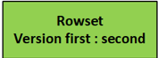

 
Figure 1-1 rowset version

Compaction has two types: base compaction and cumulative compaction. Cumulative compaction will merge multiple newly imported Rowsets into a larger Rowset. Base compaction will combine the Rowsets generated by cumulative compaction into the Base Rowset whose start version is 0, which is a high overhead compaction operation. Cumulative points determine the boundaries of these two compactions. Base compaction will merge all the Rowsets before the cumulative point, and cumulative compaction will select several adjacent Rowsets to merge after the cumulative point, as shown in Figure 1-2.

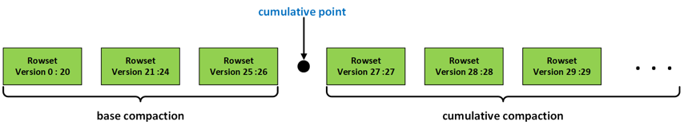

 
Figure 1-2 Compaction schematic

# 2 Architecture

## 2.1 Producer-Consumer Model
The first problem to be solved by the Compaction mechanism is how to select a suitable Tablet for Compaction. The compaction mechanism of Doris adopts the producer-consumer mode. The producer thread continuously produces compaction tasks and submits the built compaction tasks to the compaction thread pool for consumption execution, as shown in Figure 2-1.

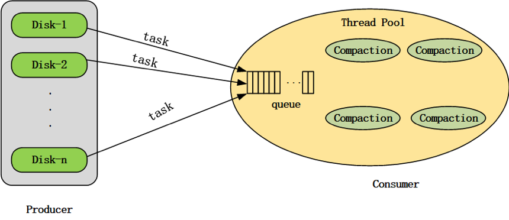

 
Figure 2-1 Compaction producer-consumer model 

When Doris BE is started, a compaction producer thread will be started in the background, and a compaction thread pool will be created at the same time. The producer thread continuously produces compaction tasks.

During a round of task production, a tablet will be selected from each disk to execute the compaction task. If the number of compaction tasks on a disk in the compaction thread pool reaches the upper limit (configured through compaction_task_num_per_disk, the default value is 2), this round of task production will skip the disk. However, suppose a round of the production process does not produce compaction tasks from all disks (the number of tasks for each disk in the compaction thread pool has reached the upper limit). In that case, the producer thread will sleep until the 2-second timeout wakes up or when a compaction task is completed.

During a round of compaction task production, when a single disk task is produced, all tablets on the BE node will be traversed. The tablets that do not meet the conditions will be filtered out first, such as tablets on other disks、 tablets that have been submitted to the compaction thread pool、tablets that are performing alter operations、 tablets that fail to initialize、and tablets whose time interval from the current moment to the last compaction task failure is less than the set threshold (configured through min_compaction_failure_interval_sec , the default value is 600 seconds), and then select the tablet with the highest tablet score from the remaining tablets that meet the conditions to execute the compaction task.

**The tablet score is calculated by the following formula:**

<b><i>tablet_score = k1 * scan_frequency + k2 * compaction_score</b></i>

Among them, k1 and k2 can be dynamically configured by parameters compaction_tablet_scan_frequency_factor (default value is 0) and parameter compaction_tablet_compaction_score_factor (default value is 1). scan_frequency indicates the scan frequency of the tablet in the current period. The calculation method of compaction score will be introduced in detail later in this article.

The frequency of task production can be dynamically configured through the parameter generate_compaction_tasks_min_interval_ms. The default value is 10ms; the producer thread sleeps for 10ms for each round of compaction tasks produced.

The cumulative compaction and base compaction production cycle can be dynamically configured through the parameter cumulative_compaction_rounds_for_each_base_compaction_round. The default value is 9;  every nine rounds of cumulative compaction tasks are produced, and then one round of base compaction tasks will be produced.

Whether to close the task production of the compaction producer can be dynamically configured through the parameter disable_auto_compaction. The default value is false; the task production of the producer is not closed.

## 2.2 Permission Mechanism

The producer's compaction tasks are submitted to the compaction thread pool for execution. To adjust the memory usage of BE node compaction, Doris adds a permission mechanism for compaction task submission, as shown in Figure 2-2.

The system maintains a certain number of compaction permits (configured through the parameter total_permits_for_compaction_score). Each compaction task must apply to the system for permits (permits request) before submitting it to the thread pool. The task can be submitted to the compaction thread pool only after obtaining the permits assigned by the system. After the compaction task is executed in the thread pool, it needs to return its permits to the system (permits release). Suppose the number of currently allocated compaction permits remaining in the system is less than the number of permits required by this compaction task. In that case, the task submission will be blocked (compaction task submission is performed serially, and other tasks that need to be submitted will also be blocked), Until other compaction tasks are executed. Then, the permits are released, and the system has a sufficient number of permits allocated to the current compaction task. Suppose the number of permits required by a compaction task exceeds the total number of permits maintained by the system. In that case, it is allowed to submit the compaction task to the thread pool for execution after all tasks in the thread pool are executed.

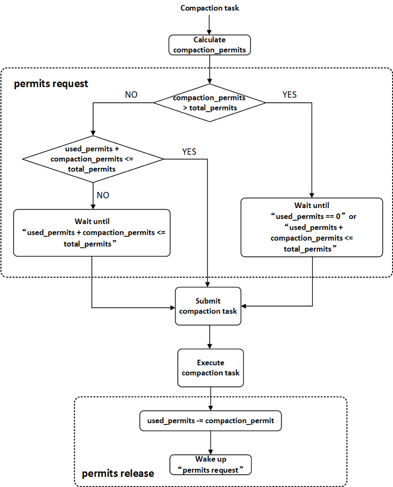

 
Figure 2-2 Permission mechanism for compaction task submission

The memory usage of a single Compaction in Doris is related to the number of segment files merged in this Compaction because a Rowset will contain multiple Segment files, and a Compaction task may include various Rowsets. Therefore, the number of segment files to be merged in the Compaction task is used as the Compaction task's Permits. The memory usage of the BE node Compaction can be adjusted by adjusting the total amount of Compact Permits maintained by the system.

The Compaction task can be summarized into two phases: Compaction Preparation and Compaction Execution, as shown in Figure 2-3. The compaction preparation phase selects Rowsets that need to be version merged from the tablet, and the compaction execution phase performs the Rowsets version merge operation.

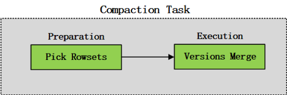

 
Figure 2-3 Two-stage schematic diagram of the Compaction task

In Doris, the preparation phase of the compaction task is executed before the permits request. The Rowsets that need to be merged are selected from the tablet, and the compaction permits are calculated based on the number of segment files to be merged. The execution phase of the compaction task will actually be executed in the thread pool to merge versions, as shown in Figure 2-4.

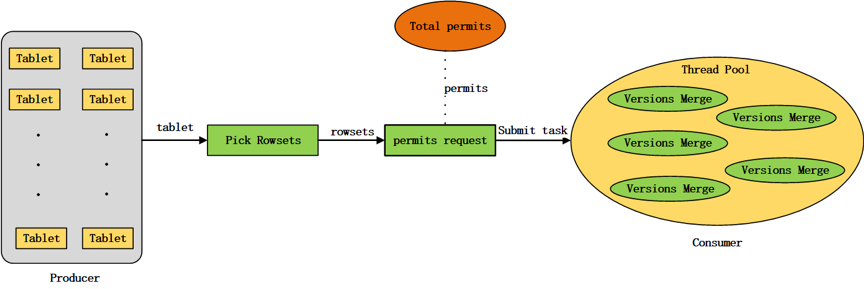

 
Figure 2-4 Schematic diagram of submission and execution of compaction tasks

After the compaction task is submitted to the thread pool, it may wait in the waiting queue of the thread pool for a long time without being scheduled. The current tablet may have a clone operation during this period, resulting in the selection of the compaction preparation stage that needs to be merged, which makes the Rowset also changed. Therefore, at the beginning of the compaction execution phase, it is necessary to determine whether a clone operation has occurred on the tablet while the task is waiting for scheduling. If a clone operation has occurred, the compaction task will exit this time. Otherwise, the Rowsets will be merged.

Doris also provides an HTTP interface that supports manually triggering cumulative compaction or base compaction of a single tablet.

# 3 Cumulative Compaction
Doris' cumulative compaction will select several adjacent Rowsets for merging after cumulative point each time, which includes five steps, namely calculating cumulative point, generating candidate Rowsets, selecting input Rowsets, performing Rowsets merging, and updating cumulative point, such as Figure 3-1. Among them, the first three steps belong to the compaction preparation stage, and the last two belong to the compaction execution stage.

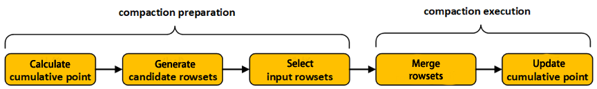

 
Figure 3-1 Flowchart of cumulative compaction execution

There are currently two options for cumulative compaction strategies: num_based cumulative compaction and size_based cumulative compaction. The policy selection of cumulative compaction can be configured through the parameter cumulative_compaction_policy (the default is size_based). num_based cumulative compaction is the selection of compaction based on the number of files in Rowset, and this strategy will be discarded in later versions. The Size_based cumulative compaction strategy determines the choice of compaction by calculating the size of each Rowset, which can significantly reduce the write amplification factor.

The size_based cumulative compaction strategy is described in detail below.

## 3.1  Calculate cumulative point

Rowsets with a version number smaller than the cumulative point will only perform base compaction. In comparison, Rowsets with a version number larger than the cumulative point will only perform cumulative compaction. Moving a Rowset from the cumulative side to the base side (increasing the cumulative point) is called a Promotion.

If the current cumulative point value of the tablet is -1 (initial value), the cumulative point value calculated this time remains unchanged and remains -1; otherwise, perform the following operations to calculate the cumulative point:
1. Sort all rowsets under the tablet in order of version;

2. Doris will decide whether to perform Promotion on a rowset by calculating the promotion size. Calculate the current promotion_size of the tablet according to the size of the base rowset (start version is 0):
   
<b><i>promotion_size = base_rowset_size * ratio</b></i>

   Among them, the ratio value can be configured through cumulative_size_based_promotion_ratio, and the default value is 0.05. promotion_size is limited between cumulative_size_based_promotion_size_mbytes (default value is 1024MB) and cumulative_size_based_promotion_min_size_mbytes (default value is 64MB). The calculation process of promotion size is shown in Figure 3-2.
   

   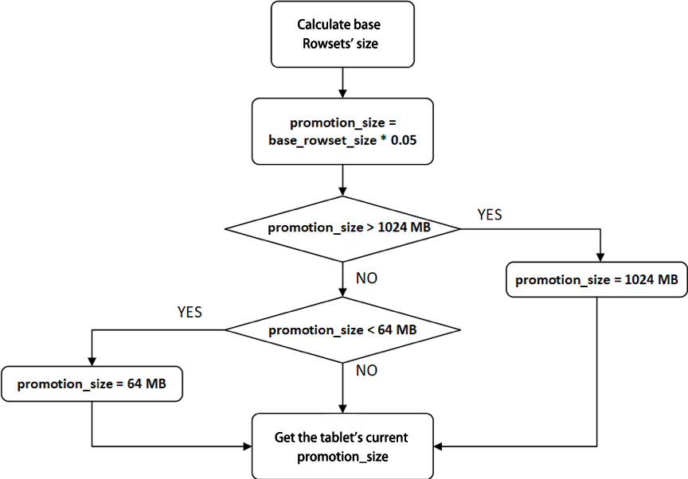
   

    
Figure 3-2 Calculation flow chart of promotion size

3. Starting from the base rowset, traverse each rowset in turn. When the following conditions are encountered, stop the traversal and update the cumulative point of the tablet:
   1. If there is a missing version between the current rowset and the previous rowset, update the cumulative point to end_version+1 of the previous rowset;
   2. The current rowset is not the data deletion version, and the current rowset has not been merged, or there is overlap between the segment files in the current rowset, then update the cumulative point to the start_version of the current rowset;
   3. The current rowset is not the data deletion version, and the size of the current rowset is less than promotion_size, then update the cumulative point to the start_version of the current rowset.

## 3.2  Generate candidate rowsets
Traverse each rowsets sorted by version in the tablet in turn if the version of a rowset is located after the cumulative point; and the creation time of the rowset is more than the set time interval from the current moment (can be configured through cumulative_compaction_skip_window_seconds, the default value is 30 seconds), or the rowset has participated in version merging (the rowset's start_version and end_version are not equal), then the rowset is used as a candidate rowset. Save all candidate rowsets in sequence in the vector candidate rowsets.

## 3.3  Select input rowsets
1. Find the largest sequence of consecutive versions in candidate rowsets.

   Traverse each rowset in candidate rowsets, if there is a missing version between two adjacent rowsets, then use all rowsets before the first missing version in candidate rowsets as new candidate rowsets;
3. Generate input rowsets.

   Traverse each rowset in candidate rowsets, and save the rowsets that have been accessed in the vector input rowsets. When the following conditions are encountered, end traversal:
   1. A rowset is the data deletion version (and last_delete_version is used to record the current data deletion version, the initial value of last_delete_version is -1), and the number of rowsets in the input rowsets is not 0 (if the number of rowsets in the input rowsets is 0, the current rowset is skipped rowset, continue to visit the next rowset);
   2. The sum of the rowset score in the input rowsets (representing the number of segment files in the rowset) reaches the upper threshold (configured through max_cumulative_compaction_num_singleton_deltas, the default value is 1000);
   3. The traversal process is completed normally, and the input rowsets contain all the rowsets in the candidate rowsets.
3. Adjust input rowsets.
   1. If the sum of all rowset sizes in input rowsets reaches promotion_size, then there is no need to adjust input rowsets.
   2. If there is a record of the deleted version of the data (last_delete_version is not -1, that is, the traversal process of generating the input rowsets ends because of the existence of the deleted data version), and the number of rowsets in the input rowsets is not 1, you do not need to adjust the input rowsets; If there is a record of the deleted version of the data, and the number of rowsets in the input rowsets is 1, and there is overlap between the segment files in the rowsets, there is no need to adjust the input rowsets; If there is a record of the deleted version of the data, and the number of rowsets in the input rowsets is 1, and there is no overlap between the segment files in the rowsets, then clear the input rowsets.
   3. If there is no record of the data deletion version (last_delete_version is -1), iterate over the rowsets in the input rowsets. Calculate the size level of the current rowset (current_level) starting from the first rowset, and calculate the level (remain_level) of the sum of the size of the other rowset in the input rowsets except the current rowset, if current_level > remain_level, delete the current rowset from the input rowsets, otherwise, stop the traversal.

**【Note】** The level division is determined by the parameters cumulative_size_based_promotion_size_mbytes (default 1024MB) and cumulative_size_based_compaction_lower_size_mbytes (default 64MB). The highest level value is cumulative_size_based_promotion_size_mbytes / 2; the next level value is 1/2 of the previous level value until the level value is less than cumulative_size_based_compaction_lower_size_mbytes, then the level value of this level is set to 0. The level classification process is shown in Figure 3-3.

   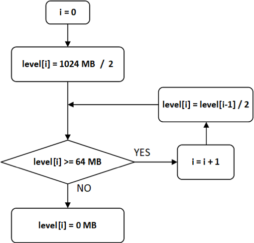
   

    
Figure 3-3 Level classification flow chart

When calculating the level value of a rowset, if level[n-1] > rowset_size >= level[n], then the level value of the rowset is level[n].

## 3.4  Merge rowsets
Merge all rowsets in input rowsets to generate an output rowset. When performing rowsets merging, a Reader and a Rowset Writer are created, and the Rowset Writer corresponds to the output rowset.

In the underlying logic of Reader, each rowset in input rowsets corresponds to a Rowset Reader. The Reader reads the data in the input rowsets row by row according to the sorting rules of the key and then writes the data in the output rowsets through the Rowset Writer. In the aggregation key data model and the unique key data model, data rows with the same key scattered in different Rowsets will be aggregated after merging the rowsets. The cumulative compaction will not actually delete the data rows deleted by the delete operation. This part of the work will be done in the base compaction.

## 3.5  Update cumulative point
Cumulative point needs to be updated after the cumulative compaction is executed.

1. If there is a record of the deleted version of the data (last_delete_version is not -1, that is, the traversal process of generating input rowsets ends due to the existence of the deleted data version), then update the cumulative point to end_version+1 of output_rowset;
2. If there is no record of data deletion version (last_delete_version is -1), judge whether the size of output rowset exceeds promotion_size, if so, update cumulative point to end_version+1 of output_rowset, otherwise, do not update cumulative point.

**【Note】** The cumulative point needs to be calculated once before the cumulative compaction is executed because the base compaction may have occurred after the last cumulative compaction, and the base rowset has changed. Therefore, the promotion size and the cumulative point will also change. The cumulative point is calculated before the cumulative compaction is executed to determine the boundary of this cumulative compaction; The cumulative point is updated after the cumulative compaction is executed to determine the boundary of the next possible base compaction.

## 3.6  Calculate cumulative compaction score
In the compaction producer thread, the cumulative compaction task needs to be produced according to the cumulative compaction score.
If the version of a rowset is located after the cumulative point while traversing all rowsets in the tablet, add the rowset to the vector rowset_to_compact.
1. If the sum of the sizes of all rowsets in rowset_to_compact exceeds promotion_size, the sum of the scores of all rowsets in rowset_to_compact is the cumulative compaction score of the current tablet, which also is the sum of the number of segment files of all rowsets in rowset_to_compact.
2. If the sum of the sizes of all rowsets in rowset_to_compact is less than promotion_size, sort rowsets in rowset_to_compact according to the version, and then traverse each rowset in rowset_to_compact. Calculate the size level (current_level) of the current rowset, and calculate the current rowset in rowset_to_compact. The level of the sum of other rowset sizes (remain_level), if current_level > remain_level, delete the current rowset from the vector rowset_to_compact, otherwise, stop traversing. The sum of the scores of all rowset in rowset_to_compact is the cumulative compaction score of the current tablet.

# 4 Base Compaction
Doris's base compaction will merge all rowsets before cumulative point, which mainly includes three steps: Select input rowsets, check the execution conditions of base compaction, and Merge rowsets, as shown in Figure 4-1. Among them, the first two steps belong to the compaction preparation stage, and the last step belongs to the compaction execution stage.

   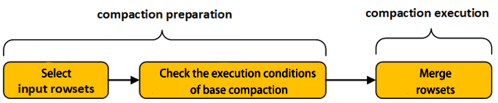
   

    
Figure 4-1 Execution flowchart of base compaction

## 4.1 Select input rowsets
1. 选择input rowsets.依次遍历tablet中的每一个rowset，获取所有版本位于cumulative point之前的rowset作为input rowsets.
2. 对input rowsets中的所有rowset按照版本先后进行排序.

## 4.2 Check the execution conditions of base compaction
Check the following conditions in sequence (as shown in Figure 4-2):
1. Version Continuity Condition

   Traverse the input rowsets to determine whether there is a missing version between two adjacent rowsets. If there is a missing version, the current tablet does not meet the execution conditions of base compaction, and the base compaction task ends; otherwise, check the next condition.
2. rowset overlapping condition

   Traverse the input rowsets, if there is overlapping between different segment files in the rowset, the current tablet does not meet the execution conditions of base compaction, and the base compaction task ends; otherwise, check the next condition.
3. base rowset condition

   If there are only two rowsets in the input rowsets, and the end version of the base rowset (start version is 0) is 1, the current tablet does not meet the execution conditions of the base compaction, and the base compaction task ends; otherwise, the next condition is checked.
4. Quantity condition of rowset

   If the number of rowsets in the input rowsets exceeds the set threshold (configured by base_compaction_num_cumulative_deltas, the default value is 5), the current tablet satisfies the execution condition of base compaction; otherwise, the next condition is checked.
5. rowset size condition

   If the ratio of the sum of the size of the rowset other than the base rowset (start version is 0) in the input rowsets to the size of the base rowset exceeds the set threshold(Configured via base_cumulative_delta_ratio, the default value is 0.3), the current tablet satisfies the execution condition of the base compaction; otherwise, check the next condition.
6. Time condition

   If the time when the current tablet successfully executed base compaction last time exceeds the specified time interval from the current moment (configured through base_compaction_interval_seconds_since_last_operation, the default value is 86400 seconds, that is, 1 day), then the current tablet satisfies the execution conditions of base compaction; Otherwise, the current tablet does not meet the execution conditions of base compaction, and the base compaction task ends.

   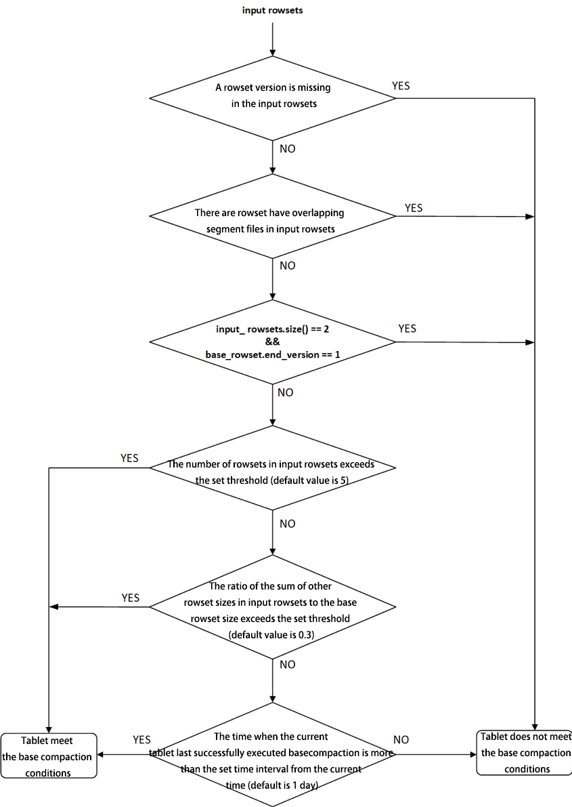
   

    
Figure 4-2 Flowchart for checking the execution conditions of base compaction

## 4.3 Merge rowsets
Merge all rowsets in the input rowsets to generate an output rowset. The process of performing rowsets merging in the cumulative compaction process is the same, and will not be repeated here. It is worth mentioning that the data rows deleted by the delete operation are actually deleted during the base compaction process.

## 4.4 Calculate base compaction score
In the compaction producer thread, the base compaction task needs to be produced according to the base compaction score. Traverse each rowset in the tablet in turn, and the sum of the scores of all rowsets before the cumulative point is the current base compaction score of the tablet, which is also the sum of the number of segment files in the rowset before the cumulative point.

# 5 Summary
This article introduces Doris's compaction mechanism.

First, the article analyzes the overall design and architectural principles of compaction from the producer-consumer mode and the permission mechanism submitted by compaction tasks; Then, the size_based strategy of cumulative compaction is introduced in detail; finally, the process of base compaction is explained in depth.

Currently, in the producer logic of compaction, all tablets are traversed each time to select the appropriate compaction object, which will bring some unnecessary system overhead. However, because the version information of most tablets does not change frequently, there is no need to recalculate each time. Therefore, we will also optimize this problem in the future.