# 快速开始

---
{ 
'title': 'Apache Doris 简介', 
'language': 'zh-CN' 
}
---

## Apache Doris 简介
<!--
Licensed to the Apache Software Foundation (ASF) under one
or more contributor license agreements.  See the NOTICE file
distributed with this work for additional information
regarding copyright ownership.  The ASF licenses this file
to you under the Apache License, Version 2.0 (the
"License"); you may not use this file except in compliance
with the License.  You may obtain a copy of the License at

  http://www.apache.org/licenses/LICENSE-2.0

Unless required by applicable law or agreed to in writing,
software distributed under the License is distributed on an
"AS IS" BASIS, WITHOUT WARRANTIES OR CONDITIONS OF ANY
KIND, either express or implied.  See the License for the
specific language governing permissions and limitations
under the License.
-->

### Apache Doris 的发展

Apache Doris 是一款基于 MPP 架构的高性能、实时的分析型数据库，以高效、简单、统一的特点被人们所熟知，仅需亚秒级响应时间即可返回海量数据下的查询结果，不仅可以支持高并发的点查询场景，也能支持高吞吐的复杂分析场景。基于此，Apache Doris 能够较好的满足报表分析、即席查询、统一数仓构建、湖仓一体等使用场景，用户可以在此之上构建大屏看板、用户行为分析、AB 实验平台、日志检索分析、用户画像分析、订单分析等应用。

Apache Doris 最早是诞生于百度广告报表业务的 Palo 项目，2017 年正式对外开源，2018 年 7 月由百度捐赠给 Apache 基金会进行孵化，之后在 Apache 导师的指导下由孵化器项目管理委员会成员进行孵化和运营。2022 年 6 月，Apache Doris 成功从 Apache 孵化器毕业，正式成为 Apache 顶级项目（Top-Level Project，TLP）。目前 Apache Doris 社区已经聚集了来自不同行业数百家企业的 600 余位贡献者，并且每月活跃贡献者人数也超过 120 位。

Apache Doris 如今在中国乃至全球范围内都拥有着广泛的用户群体，截止目前，Apache Doris 已经在全球超过 4000 家中大型企业的生产环境中得到应用，在中国市值或估值排行前 50 的互联网公司中，有超过 80% 长期使用 Apache Doris，包括百度、美团、小米、京东、字节跳动、阿里巴巴、腾讯、网易、快手、微博等。同时在一些传统行业如金融、消费、电信、工业制造、能源、医疗、政务等领域也有着丰富的应用。在中国几乎所有的云厂商比如阿里云、华为云、天翼云、腾讯云、百度云、火山引擎等都在提供托管的 Apache Doris 的云服务。

### Apache Doris 的使用场景

如下图所示，数据源经过各种数据集成和加工处理后，通常会入库到实时数据仓库 Apache Doris 和离线湖仓（Hive, Iceberg, Hudi 中），Apache Doris 被广泛应用在以下场景中。


- 报表分析
  
  - 实时看板（Dashboards）;
  
  - 面向企业内部分析师和管理者的报表;
  
  - 面向用户或者客户的高并发报表分析（Customer Facing Analytics）。比如面向网站主的站点分析、面向广告主的广告报表，并发通常要求成千上万的 QPS，查询延时要求毫秒级响应。著名的电商公司京东在广告报表中使用 Apache Doris，每天写入 100 亿行数据，查询并发 QPS 上万，99 分位的查询延时 150ms。

- 即席查询（Ad-hoc Query）：面向分析师的自助分析，查询模式不固定，要求较高的吞吐。小米公司基于 Apache Doris 构建了增长分析平台（Growing Analytics，GA），利用用户行为数据对业务进行增长分析，平均查询延时 10s，95 分位的查询延时 30s 以内，每天的 SQL 查询量为数万条。

- 湖仓一体（Data Lakehouse）：通过外表的方式联邦分析位于 Hive、Iceberg、Hudi 等离线湖仓中的数据，在避免数据拷贝的前提下，查询性能大幅提升。

- 日志检索分析：在 Apache Doris 2.0 版本中，支持了倒排索引和全文检索，能够很好的满足日志检索分析的场景，并且依赖其高效的查询引擎和存储引擎，相比传统的日志检索分析的方案可以有 10 倍性价比的优势。

- 统一数仓构建：一个平台满足统一的数据仓库建设需求，简化繁琐的大数据软件栈。海底捞基于 Apache Doris 构建的统一数仓，替换了原来由 Spark、Hive、Kudu、Hbase、Phoenix 组成的旧架构，架构大大简化。

### 整体架构和技术特点

Apache Doris 的**整体架构**非常简单，如下图所示，只有两类进程：

- **Frontend（FE）**：主要负责用户请求的接入、查询解析规划、元数据的管理、节点管理相关工作。
- **Backend（BE）**：主要负责数据存储、查询计划的执行。

这两类进程都是可以横向扩展的，单集群可以支持到数百台机器，数十 PB 的存储容量。并且这两类进程通过一致性协议来保证服务的高可用和数据的高可靠。这种高度集成的架构设计极大地降低了一款分布式系统的运维成本。


#### 使用接口

Apache Doris 采用 MySQL 协议，高度兼容 MySQL 语法，支持标准 SQL，用户可以通过各类客户端工具来访问 Apache Doris，并支持与 BI 工具的无缝对接。Apache Doris 当前支持多种主流的 BI 产品，包括不限于 Smartbi、DataEase、FineBI、Tableau、Power BI、Apache Superset 等，只要支持 MySQL 协议的 BI 工具，Apache Doris 就可以作为数据源提供查询支持。

#### 存储引擎

在**存储引擎**方面，Apache Doris 采用列式存储，按列进行数据的编码压缩和读取，能够实现极高的压缩比，同时减少大量非相关数据的扫描，从而更加有效利用 IO 和 CPU 资源。

Apache Doris 也支持比较丰富的**索引结构**，来减少数据的扫描：

- Sorted Compound Key Index，可以最多指定三个列组成复合排序键，通过该索引，能够有效进行数据裁剪，从而能够更好支持高并发的报表场景

- Min/Max Index：有效过滤数值类型的等值和范围查询

- BloomFilter Index：对高基数列的等值过滤裁剪非常有效

- Inverted Index：能够对任意字段实现快速检索

在**存储模型**方面，Apache Doris 支持多种存储模型，针对不同的场景做了针对性的优化：

- 聚合模型（Aggregate Key Model）：相同 Key 的 Value 列合并，通过提前聚合大幅提升性能

- 主键模型（Unique Key Model）：Key 唯一，相同 Key 的数据覆盖，实现行级别数据更新

- 明细模型（Duplicate Key Model）：明细数据模型，满足事实表的明细存储

Apache Doris 也支持**强一致的物化视图**，物化视图的更新和选择都在系统内自动进行，不需要用户手动选择，从而大幅减少了物化视图维护的代价。

#### 查询引擎

在**查询引擎**方面，Apache Doris 采用 MPP 的模型，节点间和节点内都并行执行，也支持多个大表的分布式 Shuffle Join，从而能够更好应对复杂查询。


**Apache Doris 查询引擎是向量化**的查询引擎，所有的内存结构能够按照列式布局，能够达到大幅减少虚函数调用、提升 Cache 命中率，高效利用 SIMD 指令的效果。在宽表聚合场景下性能是非向量化引擎的 5-10 倍。


**Apache Doris 采用了自适应查询执行（Adaptive Query Execution）技术，** 可以根据 Runtime Statistics 来动态调整执行计划，比如通过 Runtime Filter 技术能够在运行时生成 Filter 推到 Probe 侧，并且能够将 Filter 自动穿透到 Probe 侧最底层的 Scan 节点，从而大幅减少 Probe 的数据量，加速 Join 性能。Apache Doris 的 Runtime Filter 支持 In/Min/Max/Bloom Filter。

在**优化器**方面，Apache Doris 使用 CBO 和 RBO 结合的优化策略，RBO 支持常量折叠、子查询改写、谓词下推等，CBO 支持 Join Reorder。目前 CBO 还在持续优化中，主要集中在更加精准的统计信息收集和推导，更加精准的代价模型预估等方面。


---
{
    "title": "快速体验",
    "language": "zh-CN"
}

---

## 快速体验
<!-- 
Licensed to the Apache Software Foundation (ASF) under one
or more contributor license agreements.  See the NOTICE file
distributed with this work for additional information
regarding copyright ownership.  The ASF licenses this file
to you under the Apache License, Version 2.0 (the
"License"); you may not use this file except in compliance
with the License.  You may obtain a copy of the License at

  http://www.apache.org/licenses/LICENSE-2.0

Unless required by applicable law or agreed to in writing,
software distributed under the License is distributed on an
"AS IS" BASIS, WITHOUT WARRANTIES OR CONDITIONS OF ANY
KIND, either express or implied.  See the License for the
specific language governing permissions and limitations
under the License.
-->

这个简短的指南将告诉你如何下载 Apache Doris 最新稳定版本，在单节点上安装并运行它，包括创建数据库、数据表、导入数据及查询等。

### 环境准备

-   选择一个 x86-64 上的主流 Linux 环境，推荐 CentOS 7.1 或者 Ubuntu 16.04 以上版本。更多运行环境请参考安装部署部分。

-   Java 8 运行环境（非 Oracle JDK 商业授权用户，建议使用免费的 Oracle JDK 8u202，[立即下载](https://www.oracle.com/java/technologies/javase/javase8-archive-downloads.html#license-lightbox)）。

-   建议在 Linux 上新建一个 Doris 用户。请避免使用 Root 用户，以防对操作系统误操作。

### 下载二进制包

从 doris.apache.org 下载相应的 Apache Doris 安装包，并且解压。

```shell

server1:~ doris$ wget https://apache-doris-releases.oss-accelerate.aliyuncs.com/apache-doris-2.0.12-bin-x64.tar.gz

## 解压安装包
server1:~ doris$ tar zxf apache-doris-2.0.12-bin-x64.tar.gz

## 目录重命名为更为简单的 apache-doris 
server1:~ doris$ mv apache-doris-2.0.12-bin-x64 apache-doris
```

### 安装 Doris

#### 配置 FE

FE 的配置文件为 `apache-doris/fe/conf/fe.conf`。下面是一些需要关注的核心配置。除了 JAVA_HOME, 需要手动增加，并且指向你的 JDK8 运行环境。其它配置，可以使用默认值，即可支持单机快速体验。

```Plain
## 增加 JAVA_HOME 配置，指向 JDK8 的运行环境。假如我们 JDK8 位于 /home/doris/jdk8, 则设置如下
JAVA_HOME=/home/doris/jdk8

## FE 监听 IP 的 CIDR 网段。默认设置为空，有 Apache Doris 启动时自动选择一个可用网段。如有多个网段，需要指定一个网段，可以类似设置 priority_networks=192.168.0.0/24
## priority_networks =

## FE 元数据存放的目录，默认是在 DORIS_HOME 下的 doris-meta 目录。已经创建，可以更改为你的元数据存储路径。
## meta_dir = ${DORIS_HOME}/doris-meta
```

#### 启动 FE

在 apache-doris/fe 下，运行下面命令启动 FE。

```shell
## 将 FE 启动成后台运行模式，这样确保退出终端后，进程依旧运行。
server1:apache-doris/fe doris$ ./bin/start_fe.sh --daemon
```

#### 配置 BE

BE 的配置文件为 `apache-doris/be/conf/be.conf`。下面是一些需要关注的核心配置。除了 JAVA_HOME, 需要手动增加，并且指向你的 JDK8 运行环境。其它配置，可以使用默认值，即可支持我们的快速体验。

```Plain
## 增加 JAVA_HOME 配置，指向 JDK8 的运行环境。假如我们 JDK8 位于 /home/doris/jdk8, 则设置如下
JAVA_HOME=/home/doris/jdk8

## BE 监听 IP 的 CIDR 网段。默认设置为空，有 Apache Doris 启动时自动选择一个可用网段。如有多个网段，需要指定一个网段，可以类似设置 priority_networks=192.168.0.0/24
## priority_networks =

## BE 数据存放的目录，默认是在 DORIS_HOME 下的 storage 下，默认已经创建，可以更改为你的数据存储路径
## storage_root_path = ${DORIS_HOME}/storage
```

#### 启动 BE

在 apache-doris/be 下，运行下面命令启动 BE。

```shell
## 将 BE 启动成后台运行模式，这样确保退出终端后，进程依旧运行。
server1:apache-doris/be doris$ ./bin/start_be.sh --daemon
```

#### 连接 Apache Doris FE

通过 MySQL 客户端来连接 Apache Doris FE，下载免安装的 [MySQL 客户端](https://dev.mysql.com/downloads/mysql/)。

解压刚才下载的 MySQL 客户端，在 `bin/` 目录下可以找到 `mysql` 命令行工具。然后执行下面的命令连接 Apache Doris。

```shell
mysql -uroot -P9030 -h127.0.0.1
```

> 注意
> 
> -   这里使用的 Root 用户是 Apache Doris 内置的超级管理员用户，具体的用户权限查看 [认证和鉴权](#)
> -   -P：这里是我们连接 Apache Doris 的查询端口，默认端口是 9030，对应的是 fe.conf 里的 `query_port`
> -   -h：这里是我们连接的 FE IP 地址，如果你的客户端和 FE 安装在同一个节点可以使用 127.0.0.1。
> 


#### 将 BE 节点添加到集群

在 MySQL 客户端执行类似下面的 SQL，将 BE 添加到集群中

```sql
 ALTER SYSTEM ADD BACKEND "be_host_ip:heartbeat_service_port";
```

> 注意
> 
> 1.  be_host_ip：要添加 BE 的 IP 地址
> 
> 2.  heartbeat_service_port：要添加 BE 的心跳上报端口，可以查看 `be.conf` 里的 `heartbeat_service_port`，默认是 `9050`。
> 
> 3.  通过 show backends 语句可以查看新添加的 BE 节点。
> 


#### 修改 Root 用户和 Admin 用户的密码

在 MySQL 客户端，执行类似下面的 SQL，为 Root 用户和 Admin 用户设置新密码

```sql
mysql> SET PASSWORD FOR 'root' = PASSWORD('doris-root-password');                                                                                                                                                                                   
Query OK, 0 rows affected (0.01 sec)                                                                                                                                                                                                       
                                                                                                                                                                                                                                           
mysql> SET PASSWORD FOR 'admin' = PASSWORD('doris-admin-password');                                                                                                                                                                                 
Query OK, 0 rows affected (0.00 sec)        
```


> Root 用户和 Admin 用户的区别
> 
> Root 用户和 Admin 用户都属于 Apache Doris 安装完默认存在的 2 个账户。其中 Root 用户拥有整个集群的超级权限，可以对集群完成各种管理操作，比如添加节点，去除节点。Admin 用户没有管理权限，是集群中的 Superuser，拥有除集群管理相关以外的所有权限。建议只有在需要对集群进行运维管理超级权限时才使用 Root 权限。


### 建库建表

#### 连接 Apache Doris

使用 Admin 账户连接 Apache Doris FE。

```shell
mysql -uadmin -P9030 -h127.0.0.1
```


> 如果是在 FE 的同一台机器上的 MySQL 客户端连接 127.0.0.1, 不需要输入密码。


#### 创建数据库和数据表

```sql
create database demo;

use demo; 
create table mytable
(
    k1 TINYINT,
    k2 DECIMAL(10, 2) DEFAULT "10.05",    
    k3 CHAR(10) COMMENT "string column",    
    k4 INT NOT NULL DEFAULT "1" COMMENT "int column"
) 
COMMENT "my first table"
DISTRIBUTED BY HASH(k1) BUCKETS 1
PROPERTIES ('replication_num' = '1');
```

#### 导入数据

将以下示例数据，保存在本地的 data.csv：

```Plaintext
1,0.14,a1,20
2,1.04,b2,21
3,3.14,c3,22
4,4.35,d4,23
```

通过 Stream Load 方式将上面保存到文件中的数据导入到刚才创建的表里。

```shell
curl  --location-trusted -u admin:admin_password -T data.csv -H "column_separator:," http://127.0.0.1:8030/api/demo/mytable/_stream_load
```

-   -T data.csv : 要导入的数据文件名

-   -u admin:admin_password : Admin 账户与密码

-   127.0.0.1:8030 : 分别是 FE 的 IP 和 http_port

执行成功之后我们可以看到下面的返回信息：

```shell
{                                                     
    "TxnId": 30,                                  
    "Label": "a56d2861-303a-4b50-9907-238fea904363",        
    "Comment": "",                                       
    "TwoPhaseCommit": "false",                           
    "Status": "Success",                                 
    "Message": "OK",                                    
    "NumberTotalRows": 4,                                
    "NumberLoadedRows": 4,                               
    "NumberFilteredRows": 0,                             
    "NumberUnselectedRows": 0,                          
    "LoadBytes": 52,                                     
    "LoadTimeMs": 206,                                    
    "BeginTxnTimeMs": 13,                                
    "StreamLoadPutTimeMs": 141,                           
    "ReadDataTimeMs": 0,                                 
    "WriteDataTimeMs": 7,                                
    "CommitAndPublishTimeMs": 42                         
} 
```

-   `NumberLoadedRows`: 表示已经导入的数据记录数

-   `NumberTotalRows`: 表示要导入的总数据量

-   `Status`: Success 表示导入成功

#### 查询数据

在 MySQL 客户端中，执行如下 SQL，可以查询到刚才导入的数据：

```sql
mysql> select * from mytable;                                                                                                                                                                                                              
+------+------+------+------+                                                                                                                                                                                                              
| k1   | k2   | k3   | k4   |                                                                                                                                                                                                              
+------+------+------+------+                                                                                                                                                                                                              
|    1 | 0.14 | a1   |   20 |                                                                                                                                                                                                              
|    2 | 1.04 | b2   |   21 |                                                                                                                                                                                                              
|    3 | 3.14 | c3   |   22 |                                                                                                                                                                                                              
|    4 | 4.35 | d4   |   23 |                                                                                                                                                                                                              
+------+------+------+------+                                                                                                                                                                                                              
4 rows in set (0.01 sec)       
```

### 停止 Apache Doris

#### 停止 FE

在 apache-doris/fe 下，运行下面命令停止 FE。

```shell
server1:apache-doris/fe doris$ ./bin/stop_fe.sh
```

#### 停止 BE

在 apache-doris/be 下，运行下面命令停止 BE。

```shell
server1:apache-doris/be doris$ ./bin/stop_be.sh
```


# 使用指南

## Doris 介绍

---
{ 
'title': 'Doris 介绍', 
'language': 'zh-CN' 
}
---

### Doris 介绍
<!--
Licensed to the Apache Software Foundation (ASF) under one
or more contributor license agreements.  See the NOTICE file
distributed with this work for additional information
regarding copyright ownership.  The ASF licenses this file
to you under the Apache License, Version 2.0 (the
"License"); you may not use this file except in compliance
with the License.  You may obtain a copy of the License at

  http://www.apache.org/licenses/LICENSE-2.0

Unless required by applicable law or agreed to in writing,
software distributed under the License is distributed on an
"AS IS" BASIS, WITHOUT WARRANTIES OR CONDITIONS OF ANY
KIND, either express or implied.  See the License for the
specific language governing permissions and limitations
under the License.
-->


Apache Doris 是一个基于 MPP 架构的高性能、实时的分析型数据库，以极速易用的特点被人们所熟知，仅需亚秒级响应时间即可返回海量数据下的查询结果，不仅可以支持高并发的点查询场景，也能支持高吞吐的复杂分析场景。基于此，Apache Doris 能够较好的满足报表分析、即席查询、统一数仓构建、湖仓一体等使用场景，用户可以在此之上构建用户行为分析、AB 实验平台、日志检索分析、用户画像分析、订单分析等应用。

Apache Doris 最早是诞生于百度广告报表业务的 Palo 项目，2017 年正式对外开源，2018 年 7 月由百度捐赠给 Apache 基金会进行孵化，之后在 Apache 导师的指导下由孵化器项目管理委员会成员进行孵化和运营。目前 Apache Doris 社区已经聚集了来自不同行业数百家企业的 400 余位贡献者，并且每月活跃贡献者人数也超过 100 位。2022 年 6 月，Apache Doris 成功从 Apache 孵化器毕业，正式成为 Apache 顶级项目（Top-Level Project，TLP）

Apache Doris 如今在中国乃至全球范围内都拥有着广泛的用户群体，截止目前，Apache Doris 已经在全球超过 2000 家企业的生产环境中得到应用，在中国市值或估值排行前 50 的互联网公司中，有超过 80% 长期使用 Apache Doris，包括百度、美团、小米、京东、字节跳动、腾讯、网易、快手、微博、贝壳等。同时在一些传统行业如金融、能源、制造、电信等领域也有着丰富的应用。

### 使用场景

如下图所示，数据源经过各种数据集成和加工处理后，通常会入库到实时数仓 Doris 和离线湖仓（Hive, Iceberg, Hudi 中），Apache Doris 被广泛应用在以下场景中。


-   报表分析

    -   实时看板（Dashboards）
    -   面向企业内部分析师和管理者的报表
    -   面向用户或者客户的高并发报表分析（Customer Facing Analytics）。比如面向网站主的站点分析、面向广告主的广告报表，并发通常要求成千上万的 QPS，查询延时要求毫秒级响应。著名的电商公司京东在广告报表中使用 Apache Doris，每天写入 100 亿行数据，查询并发 QPS 上万，99 分位的查询延时 150ms。

-   即席查询（Ad-hoc Query）：面向分析师的自助分析，查询模式不固定，要求较高的吞吐。小米公司基于 Doris 构建了增长分析平台（Growing Analytics，GA），利用用户行为数据对业务进行增长分析，平均查询延时 10s，95 分位的查询延时 30s 以内，每天的 SQL 查询量为数万条。

-   统一数仓构建：一个平台满足统一的数据仓库建设需求，简化繁琐的大数据软件栈。海底捞基于 Doris 构建的统一数仓，替换了原来由 Spark、Hive、Kudu、Hbase、Phoenix 组成的旧架构，架构大大简化。

-   数据湖联邦查询：通过外表的方式联邦分析位于 Hive、Iceberg、Hudi 中的数据，在避免数据拷贝的前提下，查询性能大幅提升。

### 技术概述

Doris**整体架构**如下图所示，Doris 架构非常简单，只有两类进程

-   **Frontend（FE）**，主要负责用户请求的接入、查询解析规划、元数据的管理、节点管理相关工作。

-   **Backend（BE）**，主要负责数据存储、查询计划的执行。

这两类进程都是可以横向扩展的，单集群可以支持到数百台机器，数十 PB 的存储容量。并且这两类进程通过一致性协议来保证服务的高可用和数据的高可靠。这种高度集成的架构设计极大的降低了一款分布式系统的运维成本。


在**使用接口**方面，Doris 采用 MySQL 协议，高度兼容 MySQL 语法，支持标准 SQL，用户可以通过各类客户端工具来访问 Doris，并支持与 BI 工具的无缝对接。

在**存储引擎**方面，Doris 采用列式存储，按列进行数据的编码压缩和读取，能够实现极高的压缩比，同时减少大量非相关数据的扫描，从而更加有效利用 IO 和 CPU 资源。

Doris 也支持比较丰富的索引结构，来减少数据的扫描：

-   Sorted Compound Key Index，可以最多指定三个列组成复合排序键，通过该索引，能够有效进行数据裁剪，从而能够更好支持高并发的报表场景

-   Z-order Index：使用 Z-order 索引，可以高效对数据模型中的任意字段组合进行范围查询

-   Min/Max：有效过滤数值类型的等值和范围查询

-   Bloom Filter：对高基数列的等值过滤裁剪非常有效

-   Invert Index：能够对任意字段实现快速检索

在存储模型方面，Doris 支持多种存储模型，针对不同的场景做了针对性的优化：

-   Aggregate Key 模型：相同 Key 的 Value 列合并，通过提前聚合大幅提升性能

-   Unique Key 模型：Key 唯一，相同 Key 的数据覆盖，实现行级别数据更新

-   Duplicate Key 模型：明细数据模型，满足事实表的明细存储

Doris 也支持强一致的物化视图，物化视图的更新和选择都在系统内自动进行，不需要用户手动选择，从而大幅减少了物化视图维护的代价。

在**查询引擎**方面，Doris 采用 MPP 的模型，节点间和节点内都并行执行，也支持多个大表的分布式 Shuffle Join，从而能够更好应对复杂查询。


**Doris 查询引擎是向量化**的查询引擎，所有的内存结构能够按照列式布局，能够达到大幅减少虚函数调用、提升 Cache 命中率，高效利用 SIMD 指令的效果。在宽表聚合场景下性能是非向量化引擎的 5-10 倍。


**Doris 采用了 Adaptive Query Execution 技术，** 可以根据 Runtime Statistics 来动态调整执行计划，比如通过 Runtime Filter 技术能够在运行时生成 Filter 推到 Probe 侧，并且能够将 Filter 自动穿透到 Probe 侧最底层的 Scan 节点，从而大幅减少 Probe 的数据量，加速 Join 性能。Doris 的 Runtime Filter 支持 In/Min/Max/Bloom Filter。

在**优化器**方面 Doris 使用 CBO 和 RBO 结合的优化策略，RBO 支持常量折叠、子查询改写、谓词下推等，CBO 支持 Join Reorder。目前 CBO 还在持续优化中，主要集中在更加精准的统计信息收集和推导，更加精准的代价模型预估等方面。


## 安装部署

---
{
    "title": "标准部署",
    "language": "zh-CN"
}
---

### 标准部署
<!-- 
Licensed to the Apache Software Foundation (ASF) under one
or more contributor license agreements.  See the NOTICE file
distributed with this work for additional information
regarding copyright ownership.  The ASF licenses this file
to you under the Apache License, Version 2.0 (the
"License"); you may not use this file except in compliance
with the License.  You may obtain a copy of the License at

  http://www.apache.org/licenses/LICENSE-2.0

Unless required by applicable law or agreed to in writing,
software distributed under the License is distributed on an
"AS IS" BASIS, WITHOUT WARRANTIES OR CONDITIONS OF ANY
KIND, either express or implied.  See the License for the
specific language governing permissions and limitations
under the License.
-->


该文档主要介绍了部署 Doris 所需软硬件环境、建议的部署方式、集群扩容缩容，以及集群搭建到运行过程中的常见问题。  
在阅读本文档前，请先根据编译文档编译 Doris。

#### 软硬件需求

##### 概述

Doris 作为一款开源的 MPP 架构 OLAP 数据库，能够运行在绝大多数主流的商用服务器上。为了能够充分运用 MPP 架构的并发优势，以及 Doris 的高可用特性，我们建议 Doris 的部署遵循以下需求：

###### Linux 操作系统版本需求

| Linux 系统 | 版本 |
|---|---|
| CentOS | 7.1 及以上 |
| Ubuntu | 16.04 及以上 |

###### 软件需求

| 软件 | 版本 |
|---|---|
| Java | 1.8 及以上 |
| GCC  | 4.8.2 及以上 |

###### 操作系统安装要求

####### 设置系统最大打开文件句柄数

```
vi /etc/security/limits.conf 
* soft nofile 65536
* hard nofile 65536
```

####### 时钟同步

Doris 的元数据要求时间精度要小于5000ms，所以所有集群所有机器要进行时钟同步，避免因为时钟问题引发的元数据不一致导致服务出现异常。

####### 关闭交换分区（swap）

Linux交换分区会给Doris带来很严重的性能问题，需要在安装之前禁用交换分区

####### Linux文件系统

ext4和xfs文件系统均支持。

###### 开发测试环境

| 模块 | CPU | 内存 | 磁盘 | 网络 | 实例数量 |
|---|---|---|---|---|---|
| Frontend | 8核+ | 8GB+ | SSD 或 SATA，10GB+ * | 千兆网卡 | 1 |
| Backend | 8核+ | 16GB+ | SSD 或 SATA，50GB+ * | 千兆网卡 | 1-3 * |

###### 生产环境

| 模块 | CPU | 内存 | 磁盘 | 网络 | 实例数量（最低要求） |
|---|---|---|---|---|------------|
| Frontend | 16核+ | 64GB+ | SSD 或 RAID 卡，100GB+ * | 万兆网卡 | 1-3 *      |
| Backend | 16核+ | 64GB+ | SSD 或 SATA，100G+ * | 万兆网卡 | 3 *        |

> 注1：
> 1. FE 的磁盘空间主要用于存储元数据，包括日志和 image。通常从几百 MB 到几个 GB 不等。
> 2. BE 的磁盘空间主要用于存放用户数据，总磁盘空间按用户总数据量 * 3（3副本）计算，然后再预留额外 40% 的空间用作后台 compaction 以及一些中间数据的存放。
> 3. 一台机器上可以部署多个 BE 实例，但是**只能部署一个 FE**。如果需要 3 副本数据，那么至少需要 3 台机器各部署一个 BE 实例（而不是1台机器部署3个BE实例）。**多个FE所在服务器的时钟必须保持一致（允许最多5秒的时钟偏差）**
> 4. 测试环境也可以仅适用一个 BE 进行测试。实际生产环境，BE 实例数量直接决定了整体查询延迟。
> 5. 所有部署节点关闭 Swap。

> 注2：FE 节点的数量
> 1. FE 角色分为 Follower 和 Observer，（Leader 为 Follower 组中选举出来的一种角色，以下统称 Follower）。
> 2. FE 节点数据至少为1（1 个 Follower）。当部署 1 个 Follower 和 1 个 Observer 时，可以实现读高可用。当部署 3 个 Follower 时，可以实现读写高可用（HA）。
> 3. Follower 的数量**必须**为奇数，Observer 数量随意。
> 4. 根据以往经验，当集群可用性要求很高时（比如提供在线业务），可以部署 3 个 Follower 和 1-3 个 Observer。如果是离线业务，建议部署 1 个 Follower 和 1-3 个 Observer。

* **通常我们建议 10 ~ 100 台左右的机器，来充分发挥 Doris 的性能（其中 3 台部署 FE（HA），剩余的部署 BE）**
* **当然，Doris的性能与节点数量及配置正相关。在最少4台机器（一台 FE，三台 BE，其中一台 BE 混部一个 Observer FE 提供元数据备份），以及较低配置的情况下，依然可以平稳的运行 Doris。**
* **如果 FE 和 BE 混部，需注意资源竞争问题，并保证元数据目录和数据目录分属不同磁盘。**

###### Broker 部署

Broker 是用于访问外部数据源（如 hdfs）的进程。通常，在每台机器上部署一个 broker 实例即可。

###### 网络需求

Doris 各个实例直接通过网络进行通讯。以下表格展示了所有需要的端口

| 实例名称    | 端口名称                  | 默认端口    | 通讯方向                      | 说明                                           |
|------------|-------------------------|------------|------------------------------| ----------------------------------------------|
| BE         | be_port                 | 9060       | FE --> BE                    | BE 上 thrift server 的端口，用于接收来自 FE 的请求 |
| BE         | webserver_port          | 8040       | BE <--> BE, Client <--> FE   | BE 上的 http server 的端口                      |
| BE         | heartbeat\_service_port | 9050       | FE --> BE                    | BE 上心跳服务端口（thrift），用于接收来自 FE 的心跳   |
| BE         | brpc\_port              | 8060       | FE <--> BE, BE <--> BE       | BE 上的 brpc 端口，用于 BE 之间通讯               |
| FE         | http_port               | 8030       | FE <--> FE，用户 <--> FE      |FE 上的 http server 端口                         |
| FE         | rpc_port                | 9020       | BE --> FE, FE <--> FE        | FE 上的 thrift server 端口，每个fe的配置需要保持一致|
| FE         | query_port              | 9030       | 用户 <--> FE                  | FE 上的 mysql server 端口                       |
| FE         | edit\_log_port          | 9010       | FE <--> FE                   | FE 上的 bdbje 之间通信用的端口                    |
| Broker     | broker\_ipc_port        | 8000       | FE --> Broker, BE --> Broker | Broker 上的 thrift server，用于接收请求           |

> 注：
> 1. 当部署多个 FE 实例时，要保证 FE 的 http\_port 配置相同。
> 2. 部署前请确保各个端口在应有方向上的访问权限。

###### IP 绑定

因为有多网卡的存在，或因为安装过 docker 等环境导致的虚拟网卡的存在，同一个主机可能存在多个不同的 ip。当前 Doris 并不能自动识别可用 IP。所以当遇到部署主机上有多个 IP 时，必须通过 priority\_networks 配置项来强制指定正确的 IP。

priority\_networks 是 FE 和 BE 都有的一个配置，配置项需写在 fe.conf 和 be.conf 中。该配置项用于在 FE 或 BE 启动时，告诉进程应该绑定哪个IP。示例如下：

`priority_networks=10.1.3.0/24`

这是一种 [CIDR](https://en.wikipedia.org/wiki/Classless_Inter-Domain_Routing) 的表示方法。FE 或 BE 会根据这个配置项来寻找匹配的IP，作为自己的 localIP。

**注意**：当配置完 priority\_networks 并启动 FE 或 BE 后，只是保证了 FE 或 BE 自身的 IP 进行了正确的绑定。而在使用 ADD BACKEND 或 ADD FRONTEND 语句中，也需要指定和 priority\_networks 配置匹配的 IP，否则集群无法建立。举例：

BE 的配置为：`priority_networks=10.1.3.0/24`

但是在 ADD BACKEND 时使用的是：`ALTER SYSTEM ADD BACKEND "192.168.0.1:9050";`

则 FE 和 BE 将无法正常通信。

这时，必须 DROP 掉这个添加错误的 BE，重新使用正确的 IP 执行 ADD BACKEND。

FE 同理。

BROKER 当前没有，也不需要 priority\_networks 这个选项。Broker 的服务默认绑定在 0.0.0.0 上。只需在 ADD BROKER 时，执行正确可访问的 BROKER IP 即可。

###### 表名大小写敏感性设置

doris默认为表名大小写敏感，如有表名大小写不敏感的需求需在集群初始化时进行设置。表名大小写敏感性在集群初始化完成后不可再修改。

详细参见 [变量](#变量) 中关于`lower_case_table_names`变量的介绍。

#### 集群部署

##### 手动部署

###### FE 部署

* 拷贝 FE 部署文件到指定节点

  将源码编译生成的 output 下的 fe 文件夹拷贝到 FE 的节点指定部署路径下并进入该目录。

* 配置 FE

    1. 配置文件为 conf/fe.conf。其中注意：`meta_dir`是元数据存放位置。默认值为 `${DORIS_HOME}/doris-meta`。需**手动创建**该目录。

       **注意：生产环境强烈建议单独指定目录不要放在Doris安装目录下，最好是单独的磁盘（如果有SSD最好），测试开发环境可以使用默认配置**

    2. fe.conf 中 JAVA_OPTS 默认 java 最大堆内存为 4GB，**建议生产环境调整至 8G 以上**。

* 启动FE

  `bin/start_fe.sh --daemon`

  FE进程启动进入后台执行。日志默认存放在 log/ 目录下。如启动失败，可以通过查看 log/fe.log 或者 log/fe.out 查看错误信息。

* 如需部署多 FE，请参见 "FE 扩容和缩容" 章节

###### BE 部署

* 拷贝 BE 部署文件到所有要部署 BE 的节点

  将源码编译生成的 output 下的 be 文件夹拷贝到 BE 的节点的指定部署路径下。

  > 注意：`output/be/lib/debug_info/` 目录下为调试信息文件，文件较大，但实际运行不需要这些文件，可以不部署。

* 修改所有 BE 的配置

  修改 be/conf/be.conf。主要是配置 `storage_root_path`：数据存放目录。默认在be/storage下，需要**手动创建**该目录。多个路径之间使用英文状态的分号 `;` 分隔（**最后一个目录后不要加 `;`**）。  
  可以通过路径区别存储目录的介质，HDD或SSD。可以添加容量限制在每个路径的末尾，通过英文状态逗号`,`隔开。如果用户不是SSD和HDD磁盘混合使用的情况，不需要按照如下示例一和示例二的配置方法配置，只需指定存储目录即可；也不需要修改FE的默认存储介质配置  

  示例1如下：

  **注意：如果是SSD磁盘要在目录后面加上`.SSD`,HDD磁盘在目录后面加`.HDD`**

  `storage_root_path=/home/disk1/doris.HDD;/home/disk2/doris.SSD;/home/disk2/doris`

  **说明**

    - /home/disk1/doris.HDD ： 表示存储介质是HDD;
    - /home/disk2/doris.SSD： 表示存储介质是SSD；
    - /home/disk2/doris： 表示存储介质是HDD（默认）

  示例2如下：

  **注意：不论HDD磁盘目录还是SSD磁盘目录，都无需添加后缀，storage_root_path参数里指定medium即可**

  `storage_root_path=/home/disk1/doris,medium:HDD;/home/disk2/doris,medium:SSD`

  **说明**

    - /home/disk1/doris,medium:HDD： 表示存储介质是HDD;
    - /home/disk2/doris,medium:SSD： 表示存储介质是SSD;

* BE webserver_port端口配置

  如果 be 部署在 hadoop 集群中，注意调整 be.conf 中的 `webserver_port = 8040` ,以免造成端口冲突

* 配置 JAVA_HOME 环境变量

  <version since="1.2.0"></version>  

  由于从 1.2 版本开始支持 Java UDF 函数，BE 依赖于 Java 环境。所以要预先配置 `JAVA_HOME` 环境变量，也可以在 `start_be.sh` 启动脚本第一行添加 `export JAVA_HOME=your_java_home_path` 来添加环境变量。

* 安装 Java UDF 函数

   <version since="1.2.0">安装Java UDF 函数</version>  
   
   因为从 1.2 版本开始支持 Java UDF 函数，需要从官网下载 Java UDF 函数的 JAR 包放到 BE 的 lib 目录下，否则可能会启动失败。

* 在 FE 中添加所有 BE 节点

  BE 节点需要先在 FE 中添加，才可加入集群。可以使用 mysql-client([下载MySQL 5.7](https://dev.mysql.com/downloads/mysql/5.7.html)) 连接到 FE：

  `./mysql-client -h fe_host -P query_port -uroot`

  其中 fe_host 为 FE 所在节点 ip；query_port 在 fe/conf/fe.conf 中的；默认使用 root 账户，无密码登录。

  登录后，执行以下命令来添加每一个 BE：

  `ALTER SYSTEM ADD BACKEND "be_host:heartbeat-service_port";`

  其中 be_host 为 BE 所在节点 ip；heartbeat_service_port 在 be/conf/be.conf 中。

* 启动 BE

  `bin/start_be.sh --daemon`

  BE 进程将启动并进入后台执行。日志默认存放在 be/log/ 目录下。如启动失败，可以通过查看 be/log/be.log 或者 be/log/be.out 查看错误信息。

* 查看BE状态

  使用 mysql-client 连接到 FE，并执行 `SHOW PROC '/backends';` 查看 BE 运行情况。如一切正常，`isAlive` 列应为 `true`。

###### （可选）FS_Broker 部署

Broker 以插件的形式，独立于 Doris 部署。如果需要从第三方存储系统导入数据，需要部署相应的 Broker，默认提供了读取 HDFS 、对象存储的 fs_broker。fs_broker 是无状态的，建议每一个 FE 和 BE 节点都部署一个 Broker。

* 拷贝源码 fs_broker 的 output 目录下的相应 Broker 目录到需要部署的所有节点上。建议和 BE 或者 FE 目录保持同级。

* 修改相应 Broker 配置

  在相应 broker/conf/ 目录下对应的配置文件中，可以修改相应配置。

* 启动 Broker

  `bin/start_broker.sh --daemon`

* 添加 Broker

  要让 Doris 的 FE 和 BE 知道 Broker 在哪些节点上，通过 sql 命令添加 Broker 节点列表。

  使用 mysql-client 连接启动的 FE，执行以下命令：

  `ALTER SYSTEM ADD BROKER broker_name "broker_host1:broker_ipc_port1","broker_host2:broker_ipc_port2",...;`

  其中 broker_host 为 Broker 所在节点 ip；broker_ipc_port 在 Broker 配置文件中的conf/apache_hdfs_broker.conf。

* 查看 Broker 状态

  使用 mysql-client 连接任一已启动的 FE，执行以下命令查看 Broker 状态：`SHOW PROC "/brokers";`

**注：在生产环境中，所有实例都应使用守护进程启动，以保证进程退出后，会被自动拉起，如 [Supervisor](http://supervisord.org/)。如需使用守护进程启动，在 0.9.0 及之前版本中，需要修改各个 start_xx.sh 脚本，去掉最后的 & 符号**。从 0.10.0 版本开始，直接调用 `sh start_xx.sh` 启动即可。也可参考 [这里](https://www.cnblogs.com/lenmom/p/9973401.html)


#### 常见问题

##### 进程相关

1. 如何确定 FE 进程启动成功

   FE 进程启动后，会首先加载元数据，根据 FE 角色的不同，在日志中会看到 ```transfer from UNKNOWN to MASTER/FOLLOWER/OBSERVER```。最终会看到 ```thrift server started``` 日志，并且可以通过 mysql 客户端连接到 FE，则表示 FE 启动成功。

   也可以通过如下连接查看是否启动成功：  
   `http://fe_host:fe_http_port/api/bootstrap`

   如果返回：  
   `{"status":"OK","msg":"Success"}`

   则表示启动成功，其余情况，则可能存在问题。

   > 注：如果在 fe.log 中查看不到启动失败的信息，也许在 fe.out 中可以看到。

2. 如何确定 BE 进程启动成功

   BE 进程启动后，如果之前有数据，则可能有数分钟不等的数据索引加载时间。

   如果是 BE 的第一次启动，或者该 BE 尚未加入任何集群，则 BE 日志会定期滚动 ```waiting to receive first heartbeat from frontend``` 字样。表示 BE 还未通过 FE 的心跳收到 Master 的地址，正在被动等待。这种错误日志，在 FE 中 ADD BACKEND 并发送心跳后，就会消失。如果在接到心跳后，又重复出现 ```master client, get client from cache failed.host: , port: 0, code: 7``` 字样，说明 FE 成功连接了 BE，但 BE 无法主动连接 FE。可能需要检查 BE 到 FE 的 rpc_port 的连通性。

   如果 BE 已经被加入集群，日志中应该每隔 5 秒滚动来自 FE 的心跳日志：```get heartbeat, host: xx.xx.xx.xx, port: 9020, cluster id: xxxxxx```，表示心跳正常。

   其次，日志中应该每隔 10 秒滚动 ```finish report task success. return code: 0``` 的字样，表示 BE 向 FE 的通信正常。

   同时，如果有数据查询，应该能看到不停滚动的日志，并且有 ```execute time is xxx``` 日志，表示 BE 启动成功，并且查询正常。

   也可以通过如下连接查看是否启动成功：  
   `http://be_host:be_http_port/api/health`

   如果返回：  
   `{"status": "OK","msg": "To Be Added"}`

   则表示启动成功，其余情况，则可能存在问题。

   > 注：如果在 be.INFO 中查看不到启动失败的信息，也许在 be.out 中可以看到。

3. 搭建系统后，如何确定 FE、BE 连通性正常

   首先确认 FE 和 BE 进程都已经单独正常启动，并确认已经通过 `ADD BACKEND` 或者 `ADD FOLLOWER/OBSERVER` 语句添加了所有节点。

   如果心跳正常，BE 的日志中会显示 ```get heartbeat, host: xx.xx.xx.xx, port: 9020, cluster id: xxxxxx```。如果心跳失败，在 FE 的日志中会出现 ```backend[10001] got Exception: org.apache.thrift.transport.TTransportException``` 类似的字样，或者其他 thrift 通信异常日志，表示 FE 向 10001 这个 BE 的心跳失败。这里需要检查 FE 向 BE host 的心跳端口的连通性。

   如果 BE 向 FE 的通信正常，则 BE 日志中会显示 ```finish report task success. return code: 0``` 的字样。否则会出现 ```master client, get client from cache failed``` 的字样。这种情况下，需要检查 BE 向 FE 的 rpc_port 的连通性。

4. Doris 各节点认证机制

   除了 Master FE 以外，其余角色节点（Follower FE，Observer FE，Backend），都需要通过 `ALTER SYSTEM ADD` 语句先注册到集群，然后才能加入集群。

   Master FE 在第一次启动时，会在 doris-meta/image/VERSION 文件中生成一个 cluster_id。

   FE 在第一次加入集群时，会首先从 Master FE 获取这个文件。之后每次 FE 之间的重新连接（FE 重启），都会校验自身 cluster id 是否与已存在的其它 FE 的 cluster id 相同。如果不同，则该 FE 会自动退出。

   BE 在第一次接收到 Master FE 的心跳时，会从心跳中获取到 cluster id，并记录到数据目录的 `cluster_id` 文件中。之后的每次心跳都会比对 FE 发来的 cluster id。如果 cluster id 不相等，则 BE 会拒绝响应 FE 的心跳。

   心跳中同时会包含 Master FE 的 ip。当 FE 切主时，新的 Master FE 会携带自身的 ip 发送心跳给 BE，BE 会更新自身保存的 Master FE 的 ip。

   > **priority\_network**
   >
   > priority\_network 是 FE 和 BE 都有一个配置，其主要目的是在多网卡的情况下，协助 FE 或 BE 识别自身 ip 地址。priority\_network 采用 CIDR 表示法：[RFC 4632](https://tools.ietf.org/html/rfc4632)
   >
   > 当确认 FE 和 BE 连通性正常后，如果仍然出现建表 Timeout 的情况，并且 FE 的日志中有 `backend does not found. host: xxx.xxx.xxx.xxx` 字样的错误信息。则表示 Doris 自动识别的 IP 地址有问题，需要手动设置 priority\_network 参数。
   >
   > 出现这个问题的主要原因是：当用户通过 `ADD BACKEND` 语句添加 BE 后，FE 会识别该语句中指定的是 hostname 还是 IP。如果是 hostname，则 FE 会自动将其转换为 IP 地址并存储到元数据中。当 BE 在汇报任务完成信息时，会携带自己的 IP 地址。而如果 FE 发现 BE 汇报的 IP 地址和元数据中不一致时，就会出现如上错误。
   >
   > 这个错误的解决方法：1）分别在 FE 和 BE 设置 **priority\_network** 参数。通常 FE 和 BE 都处于一个网段，所以该参数设置为相同即可。2）在 `ADD BACKEND` 语句中直接填写 BE 正确的 IP 地址而不是 hostname，以避免 FE 获取到错误的 IP 地址。

5. BE 进程文件句柄数

   BE进程文件句柄数，受min_file_descriptor_number/max_file_descriptor_number两个参数控制。

   如果不在[min_file_descriptor_number, max_file_descriptor_number]区间内，BE进程启动会出错，可以使用ulimit进行设置。

   min_file_descriptor_number的默认值为65536。

   max_file_descriptor_number的默认值为131072.

   举例而言：ulimit -n 65536; 表示将文件句柄设成65536。

   启动BE进程之后，可以通过 cat /proc/$pid/limits 查看进程实际生效的句柄数

   如果使用了supervisord，遇到句柄数错误，可以通过修改supervisord的minfds参数解决。

```shell
   vim /etc/supervisord.conf
   
   minfds=65535                 ; (min. avail startup file descriptors;default 1024)
```


### Docker 部署

---
{
"title": "构建 Docker Image",
"language": "zh-CN"
}
---

#### 构建 Docker Image
<!-- 
Licensed to the Apache Software Foundation (ASF) under one
or more contributor license agreements.  See the NOTICE file
distributed with this work for additional information
regarding copyright ownership.  The ASF licenses this file
to you under the Apache License, Version 2.0 (the
"License"); you may not use this file except in compliance
with the License.  You may obtain a copy of the License at

  http://www.apache.org/licenses/LICENSE-2.0

Unless required by applicable law or agreed to in writing,
software distributed under the License is distributed on an
"AS IS" BASIS, WITHOUT WARRANTIES OR CONDITIONS OF ANY
KIND, either express or implied.  See the License for the
specific language governing permissions and limitations
under the License.
-->


该文档主要介绍了如何通过 Dockerfile 来制作 Apache Doris 的运行镜像，以便于在容器化编排工具或者快速测试过程中可迅速拉取一个 Apache Doris Image 来完成集群的创建。

##### 软硬件要求

###### 概述

Docker 镜像在制作前要提前准备好制作机器，该机器的平台架构决定了制作以后的 Docker Image 适用的平台架构，如 X86_64 机器，需要下载 X86_64 的 Doris 二进制程序，制作以后的 Image 仅可在 X86_64 平台上运行。ARM 平台（M1 视同为 ARM）同理。

###### 硬件要求

最低配置：2C 4G

推荐配置：4C 16G

###### 软件要求

Docker Version：20.10 及以后版本

##### Docker Image 构建

Dockerfile 脚本编写需要注意以下几点：

> 1. 基础父镜像选用经过 Docker-Hub 认证的 OpenJDK 官方镜像，版本用 JDK 1.8 版本
> 2. 应用程序默认使用官方提供的二进制包进行下载，勿使用来源不明的二进制包
> 3. 需要内嵌脚本来完成 FE 的启动、多 FE 注册、状态检查和 BE 的启动、注册 BE 至 FE、状态检查等任务流程
> 4. 应用程序在 Docker 内启动时不应使用 `--daemon` 的方式启动，否则在 K8S 等编排工具部署过程中会有异常

由于 Apache Doris 1.2 版本开始，开始支持 JavaUDF 能力，故而 BE 也需要有 JDK 环境，推荐的镜像如下：

| Doris 程序 | 推荐基础父镜像    |
| ---------- | ----------------- |
| Frontend   | openjdk:8u342-jdk |
| Backend    | openjdk:8u342-jdk |
| Broker     | openjdk:8u342-jdk |

###### 脚本前期准备

编译 Docker Image 的 Dockerfile 脚本中，关于 Apache Doris 程序二进制包的加载方式，有两种：

1. 通过 wget / curl 在编译时执行下载命令，随后完成 docker build 制作过程
2. 提前下载二进制包至编译目录，然后通过 ADD 或者 COPY 命令加载至 docker build 过程中

使用前者会让 Docker Image Size 更小，但是如果构建失败的话可能下载操作会重复进行，导致构建时间过长，而后者更适用于网络环境不是很好的构建环境。

**综上，本文档的示例以第二种方式为准，若有第一种诉求，可根据自己需求定制修改即可。**

###### 准备二进制包

需要注意的是，如有定制化开发需求，则需要自己修改源码后进行[编译](#)打包，然后放置至构建目录即可。

若无特殊需求，直接[下载](https://doris.apache.org/zh-CN/download)官网提供的二进制包即可。

###### 构建步骤

####### 构建 FE

构建环境目录如下：

```sql
└── docker-build                                                // 构建根目录 
    └── fe                                                      // FE 构建目录
        ├── dockerfile                                          // dockerfile 脚本
        └── resource                                            // 资源目录
            ├── init_fe.sh                                      // 启动及注册脚本
            └── apache-doris-x.x.x-bin-fe.tar.gz                // 二进制程序包
```

1. 创建构建环境目录

```shell
   mkdir -p ./docker-build/fe/resource
```

2. 下载[官方二进制包](https://doris.apache.org/zh-CN/download)/编译的二进制包

   拷贝二进制包至 `./docker-build/fe/resource` 目录下

3. 编写 FE 的 Dockerfile 脚本

```powershell
   # 选择基础镜像
   FROM openjdk:8u342-jdk
   
   # 设置环境变量
   ENV JAVA_HOME="/usr/local/openjdk-8/" \
       PATH="/opt/apache-doris/fe/bin:$PATH"
   
   # 下载软件至镜像内，可根据需要替换
   ADD ./resource/apache-doris-fe-${x.x.x}-bin.tar.gz /opt/
   
   RUN apt-get update && \
       apt-get install -y default-mysql-client && \
       apt-get clean && \
       mkdir /opt/apache-doris && \
       cd /opt && \
       mv apache-doris-fe-${x.x.x}-bin /opt/apache-doris/fe
   
   ADD ./resource/init_fe.sh /opt/apache-doris/fe/bin
   RUN chmod 755 /opt/apache-doris/fe/bin/init_fe.sh
   
   ENTRYPOINT ["/opt/apache-doris/fe/bin/init_fe.sh"]
```

   编写后命名为 `Dockerfile` 并保存至 `./docker-build/fe` 目录下

4. 编写 FE 的执行脚本

   可参考复制 [init_fe.sh](https://github.com/apache/doris/tree/master/docker/runtime/fe/resource/init_fe.sh) 的内容

   编写后命名为 `init_fe.sh` 并保存至 `./docker-build/fe/resouce` 目录下

5. 执行构建

   需要注意的是，`${tagName}` 需替换为你想要打包命名的 tag 名称，如：`apache-doris:1.1.3-fe`

   构建 FE：

```shell
   cd ./docker-build/fe
   docker build . -t ${fe-tagName}
```


####### 构建 BE

1. 创建构建环境目录

```shell
mkdir -p ./docker-build/be/resource
```
2. 构建环境目录如下：

```sql
   └── docker-build                                                // 构建根目录 
       └── be                                                      // BE 构建目录
           ├── dockerfile                                          // dockerfile 脚本
           └── resource                                            // 资源目录
               ├── init_be.sh                                      // 启动及注册脚本
               └── apache-doris-x.x.x-bin-x86_64/arm-be.tar.gz     // 二进制程序包
```

3. 编写 BE 的 Dockerfile 脚本

```powershell
   # 选择基础镜像
   FROM openjdk:8u342-jdk
   
   # 设置环境变量
   ENV JAVA_HOME="/usr/local/openjdk-8/" \
       PATH="/opt/apache-doris/be/bin:$PATH"
   
   # 下载软件至镜像内，可根据需要替换
   ADD ./resource/apache-doris-be-${x.x.x}-bin-x86_64.tar.gz /opt/
   
   RUN apt-get update && \
       apt-get install -y default-mysql-client && \
       apt-get clean && \
       mkdir /opt/apache-doris && \
       cd /opt && \
       mv apache-doris-be-${x.x.x}-bin-x86_64 /opt/apache-doris/be
   
   ADD ./resource/init_be.sh /opt/apache-doris/be/bin
   RUN chmod 755 /opt/apache-doris/be/bin/init_be.sh
   
   ENTRYPOINT ["/opt/apache-doris/be/bin/init_be.sh"]
```

   编写后命名为 `Dockerfile` 并保存至 `./docker-build/be` 目录下

4. 编写 BE 的执行脚本

   可参考复制 [init_be.sh](https://github.com/apache/doris/tree/master/docker/runtime/be/resource/init_be.sh) 的内容

   编写后命名为 `init_be.sh` 并保存至 `./docker-build/be/resouce` 目录下

5. 执行构建

   需要注意的是，`${tagName}` 需替换为你想要打包命名的 tag 名称，如：`apache-doris:1.1.3-be`

   构建 BE：

```shell
   cd ./docker-build/be
   docker build . -t ${be-tagName}
```

   构建完成后，会有 `Success` 字样提示，这时候通过以下命令可查看刚构建完成的 Image 镜像

```shell
   docker images
```

####### 构建 Broker

1.  创建构建环境目录

```shell
mkdir -p ./docker-build/broker/resource
```

2. 构建环境目录如下：

```sql
   └── docker-build                                                // 构建根目录 
       └── broker                                                  // BROKER 构建目录
           ├── dockerfile                                          // dockerfile 脚本
           └── resource                                            // 资源目录
               ├── init_broker.sh                                  // 启动及注册脚本
               └── apache-doris-x.x.x-bin-broker.tar.gz            // 二进制程序包
```

3. 编写 Broker 的 Dockerfile 脚本

```powershell
   # 选择基础镜像
   FROM openjdk:8u342-jdk
   
   # 设置环境变量
   ENV JAVA_HOME="/usr/local/openjdk-8/" \
       PATH="/opt/apache-doris/broker/bin:$PATH"
   
   # 下载软件至镜像内，此处 broker 目录被同步压缩至 FE 的二进制包，需要自行解压重新打包，可根据需要替换
   ADD ./resource/apache_hdfs_broker.tar.gz /opt/
   
   RUN apt-get update && \
       apt-get install -y default-mysql-client && \
       apt-get clean && \
       mkdir /opt/apache-doris && \
       cd /opt && \
       mv apache_hdfs_broker /opt/apache-doris/broker
   
   ADD ./resource/init_broker.sh /opt/apache-doris/broker/bin
   RUN chmod 755 /opt/apache-doris/broker/bin/init_broker.sh
   
   ENTRYPOINT ["/opt/apache-doris/broker/bin/init_broker.sh"]
```

   编写后命名为 `Dockerfile` 并保存至 `./docker-build/broker` 目录下

4. 编写 BE 的执行脚本

   可参考复制 [init_broker.sh](https://github.com/apache/doris/tree/master/docker/runtime/broker/resource/init_broker.sh) 的内容

   编写后命名为 `init_broker.sh` 并保存至 `./docker-build/broker/resouce` 目录下

5. 执行构建

   需要注意的是，`${tagName}` 需替换为你想要打包命名的 tag 名称，如：`apache-doris:1.1.3-broker`

   构建 Broker：

```shell
   cd ./docker-build/broker
   docker build . -t ${broker-tagName}
```

   构建完成后，会有 `Success` 字样提示，这时候通过以下命令可查看刚构建完成的 Image 镜像

```shell
   docker images
```

##### 推送镜像至 DockerHub 或私有仓库

登录 DockerHub 账号

```
docker login
```

登录成功会提示 `Success` 相关提示，随后推送至仓库即可

```shell
docker push ${tagName}
```


---
{
"title": "部署 Docker 集群",
"language": "zh-CN"
}
---

#### 部署 Docker 集群
<!-- 
Licensed to the Apache Software Foundation (ASF) under one
or more contributor license agreements.  See the NOTICE file
distributed with this work for additional information
regarding copyright ownership.  The ASF licenses this file
to you under the Apache License, Version 2.0 (the
"License"); you may not use this file except in compliance
with the License.  You may obtain a copy of the License at

  http://www.apache.org/licenses/LICENSE-2.0

Unless required by applicable law or agreed to in writing,
software distributed under the License is distributed on an
"AS IS" BASIS, WITHOUT WARRANTIES OR CONDITIONS OF ANY
KIND, either express or implied.  See the License for the
specific language governing permissions and limitations
under the License.
-->


##### 背景说明

本篇将简述如何通过 `docker run` 或 `docker-compose up` 命令快速构建一套完整的 Doris 测试集群。

##### 适用场景

建议在 SIT 或者 DEV 环境中使用 Doris Docker 来简化部署的流程。

如在新版本中想测试某一个功能点，可以使用 Doris Docker 部署一个 Playground 环境。或者在调试的过程中要复现某个问题时，也可以使用 docker 环境来模拟。

在生产环境上，当前暂时尽量避免使用容器化的方案进行 Doris 部署。

##### 软件环境

| 软件           | 版本        |
| -------------- | ----------- |
| Docker         | 20.0 及以上 |
| docker-compose | 2.10 及以上 |

##### 硬件环境

| 配置类型 | 硬件信息 | 最大运行集群规模 |
| -------- | -------- | ---------------- |
| 最低配置 | 2C 4G    | 1FE 1BE          |
| 推荐配置 | 4C 16G   | 3FE 3BE          |

##### 前期环境准备

需在宿主机执行如下命令

```shell
sysctl -w vm.max_map_count=2000000
```

##### Docker Compose

不同平台需要使用不同 Image 镜像，本篇以 `X86_64` 平台为例。

###### 网络模式说明

Doris Docker 适用的网络模式有两种。

1. 适合跨多节点部署的 HOST 模式，这种模式适合每个节点部署 1FE 1BE。
2. 适合单节点部署多 Doris 进程的子网网桥模式，这种模式适合单节点部署（推荐），若要多节点混部需要做更多组件部署（不推荐）。

为便于展示，本章节仅演示子网网桥模式编写的脚本。

###### 接口说明

从 `Apache Doris 1.2.1 Docker Image` 版本起，各个进程镜像接口列表如下：

| 进程名         | 接口名         | 接口定义          | 接口示例             |
| -------------- |-------------|---------------|------------------|
| FE\| BE\         | BROKER        | FE_SERVERS       | FE 节点主要信息     | fe1:172.20.80.2:9010,fe2:172.20.80.3:9010,fe3:172.20.80.4:9010 |
| FE             | FE_ID       | FE 节点 ID      | 1                |
| BE             | BE_ADDR     | BE 节点主要信息     | 172.20.80.5:9050 |
| BE             | NODE_ROLE   | BE 节点类型       | computation      |
| BROKER         | BROKER_ADDR | BROKER 节点主要信息 | 172.20.80.6:8000 |

注意，以上接口必须填写信息，否则进程无法启动。

> FE_SERVERS 接口规则为：`FE_NAME:FE_HOST:FE_EDIT_LOG_PORT[,FE_NAME:FE_HOST:FE_EDIT_LOG_PORT]`
>
> FE_ID 接口规则为：`1-9` 的整数，其中 `1` 号 FE 为 Master 节点。
>
> BE_ADDR 接口规则为：`BE_HOST:BE_HEARTBEAT_SERVICE_PORT`
>
> NODE_ROLE 接口规则为：`computation` 或为空，其中为空或为其他值时表示节点类型为 `mix` 类型
>
> BROKER_ADDR 接口规则为：`BROKER_HOST:BROKER_IPC_PORT`

###### 脚本模板

####### Docker Run 命令

创建子网网桥

``` shell
docker network create --driver bridge --subnet=172.20.80.0/24 doris-network
```

1FE & 1BE 命令模板

```shell
docker run -itd \
--name=fe \
--env FE_SERVERS="fe1:172.20.80.2:9010" \
--env FE_ID=1 \
-p 8030:8030 \
-p 9030:9030 \
-v /data/fe/doris-meta:/opt/apache-doris/fe/doris-meta \
-v /data/fe/conf:/opt/apache-doris/fe/conf \
-v /data/fe/log:/opt/apache-doris/fe/log \
--network=doris-network \
--ip=172.20.80.2 \
apache/doris:1.2.1-fe-x86_64

docker run -itd \
--name=be \
--env FE_SERVERS="fe1:172.20.80.2:9010" \
--env BE_ADDR="172.20.80.3:9050" \
-p 8040:8040 \
-v /data/be/storage:/opt/apache-doris/be/storage \
-v /data/be/conf:/opt/apache-doris/be/conf \
-v /data/be/log:/opt/apache-doris/be/log \
--network=doris-network \
--ip=172.20.80.3 \
apache/doris:1.2.1-be-x86_64
```

3FE & 3BE Run 命令模板如有需要[点击此处](https://github.com/apache/doris/tree/master/docker/runtime/docker-compose-demo/build-cluster/rum-command/3fe_3be.sh)访问下载。

####### Docker Compose 脚本

1FE & 1BE 模板

``` yaml
version: '3'
services:
  docker-fe:
    image: "apache/doris:1.2.1-fe-x86_64"
    container_name: "doris-fe"
    hostname: "fe"
    environment:
      - FE_SERVERS=fe1:172.20.80.2:9010
      - FE_ID=1
    ports:
      - 8030:8030
      - 9030:9030
    volumes:
      - /data/fe/doris-meta:/opt/apache-doris/fe/doris-meta
      - /data/fe/conf:/opt/apache-doris/fe/conf
      - /data/fe/log:/opt/apache-doris/fe/log
    networks:
      doris_net:
        ipv4_address: 172.20.80.2
  docker-be:
    image: "apache/doris:1.2.1-be-x86_64"
    container_name: "doris-be"
    hostname: "be"
    depends_on:
      - docker-fe
    environment:
      - FE_SERVERS=fe1:172.20.80.2:9010
      - BE_ADDR=172.20.80.3:9050
    ports:
      - 8040:8040
    volumes:
      - /data/be/storage:/opt/apache-doris/be/storage
      - /data/be/conf:/opt/apache-doris/be/conf
      - /data/be/script:/docker-entrypoint-initdb.d
      - /data/be/log:/opt/apache-doris/be/log
    networks:
      doris_net:
        ipv4_address: 172.20.80.3
networks:
  doris_net:
    ipam:
      config:
        - subnet: 172.20.80.0/16
```

3FE & 3BE Docker Compose 脚本模板如有需要[点击此处](https://github.com/apache/doris/tree/master/docker/runtime/docker-compose-demo/build-cluster/docker-compose/3fe_3be/docker-compose.yaml)访问下载。

##### 部署 Doris Docker

部署方式二选一即可：

1. 执行 `docker run` 命令创建集群
2. 保存 `docker-compose.yaml` 脚本，同目录下执行 `docker-compose up -d` 命令创建集群

###### 特例说明

MacOS 由于内部实现容器的方式不同，在部署时宿主机直接修改 `max_map_count` 值可能无法成功，需要先创建以下容器：

```shel
docker run -it --privileged --pid=host --name=change_count debian nsenter -t 1 -m -u -n -i sh
```

容器创建成功执行以下命令：

```shell
sysctl -w vm.max_map_count=2000000
```

然后 `exit` 退出，创建 Doris Docker 集群。


---
{
  "title": "Kubernetes 部署",
  "language": "zh-CN"
}
---

### Kubernetes 部署
<!-- 
Licensed to the Apache Software Foundation (ASF) under one
or more contributor license agreements.  See the NOTICE file
distributed with this work for additional information
regarding copyright ownership.  The ASF licenses this file
to you under the Apache License, Version 2.0 (the
"License"); you may not use this file except in compliance
with the License.  You may obtain a copy of the License at

  http://www.apache.org/licenses/LICENSE-2.0

Unless required by applicable law or agreed to in writing,
software distributed under the License is distributed on an
"AS IS" BASIS, WITHOUT WARRANTIES OR CONDITIONS OF ANY
KIND, either express or implied.  See the License for the
specific language governing permissions and limitations
under the License.
-->


 

#### 环境准备

- 安装 k8s
- 构建或下载doris镜像
    - 构建镜像 [构建 Docker Image](#) 
    - 下载镜像 https://hub.docker.com/r/apache/doris/tags
- 创建或下载doris on k8s的yml文件
    - https://github.com/apache/doris/blob/master/docker/runtime/k8s/doris_follower.yml
    - https://github.com/apache/doris/blob/master/docker/runtime/k8s/doris_be.yml
    - https://github.com/apache/doris/blob/master/docker/runtime/k8s/doris_cn.yml

#### 启动集群
启动 FE（角色类型为 Follower）：`kubectl create -f doris_follower.yml` 

启动 BE ：`kubectl create -f doris_be.yml` 

启动 BE（角色类型为 Compute Node）：`kubectl create -f doris_cn.yml`

#### 扩缩容

- FE
  - 目前不支持扩缩容，建议按需初始化1个或者3个节点
- BE
  - 命令：`kubectl scale statefulset doris-be-cluster1 --replicas=4`
- BE(角色类型为 Compute Node)
  - 命令：`kubectl scale statefulset doris-cn-cluster1 --replicas=4`

#### 验证

使用 mysql-client 连接到 FE，执行 `show backends`，`show frontends`等操作查看各节点状态

#### k8s简易操作命令

- 首次执行yml文件 `kubectl create -f xxx.yml`
- 修改yml文件后执行 `kubectl apply -f xxx.yml`
- 删除yml定义的所有资源 `kubectl delete -f xxx.yml`
- 查看pod列表 `kubectl get pods`
- 进入容器 `kubectl exec -it xxx（podName） -- /bin/sh`
- 查看日志 `kubectl logs xxx（podName）`
- 查看ip和端口信息 `kubectl get ep`
- [更多k8s知识](https://kubernetes.io)

#### 常见问题

- 数据怎么持久化？

  用户需要自行挂载pvc，持久化元数据信息，数据信息或者日志信息等
- 怎么安全缩容BE节点？

  BE:当前缩容之前需要用户手动执行[ALTER-SYSTEM-DECOMMISSION-BACKEND](#)

  BE(角色类型为 Compute Node): 不存储数据文件，可以直接进行缩容，[关于计算节点](#)
- FE启动报错"failed to init statefulSetName"

  doris_follower.yml的环境变量 statefulSetName和serviceName必须成对出现，比如配置了CN_SERVICE，就必须配置CN_STATEFULSET


## 数据表设计

---
{
    "title": "数据模型",
    "language": "zh-CN"
}
---

### 数据模型
<!-- 
Licensed to the Apache Software Foundation (ASF) under one
or more contributor license agreements.  See the NOTICE file
distributed with this work for additional information
regarding copyright ownership.  The ASF licenses this file
to you under the Apache License, Version 2.0 (the
"License"); you may not use this file except in compliance
with the License.  You may obtain a copy of the License at

  http://www.apache.org/licenses/LICENSE-2.0

Unless required by applicable law or agreed to in writing,
software distributed under the License is distributed on an
"AS IS" BASIS, WITHOUT WARRANTIES OR CONDITIONS OF ANY
KIND, either express or implied.  See the License for the
specific language governing permissions and limitations
under the License.
-->


本文档主要从逻辑层面，描述 Doris 的数据模型，以帮助用户更好的使用 Doris 应对不同的业务场景。

#### 基本概念

在 Doris 中，数据以表（Table）的形式进行逻辑上的描述。
一张表包括行（Row）和列（Column）。Row 即用户的一行数据。Column 用于描述一行数据中不同的字段。

Column 可以分为两大类：Key 和 Value。从业务角度看，Key 和 Value 可以分别对应维度列和指标列。

Doris 的数据模型主要分为3类:

- Aggregate
- Unique
- Duplicate

下面我们分别介绍。

#### Aggregate 模型

我们以实际的例子来说明什么是聚合模型，以及如何正确的使用聚合模型。

##### 示例1：导入数据聚合

假设业务有如下数据表模式：

| ColumnName      | Type        | AggregationType | Comment              |
| --------------- | ----------- | --------------- | -------------------- |
| user_id         | LARGEINT    |                 | 用户id               |
| date            | DATE        |                 | 数据灌入日期         |
| city            | VARCHAR(20) |                 | 用户所在城市         |
| age             | SMALLINT    |                 | 用户年龄             |
| sex             | TINYINT     |                 | 用户性别             |
| last_visit_date | DATETIME    | REPLACE         | 用户最后一次访问时间 |
| cost            | BIGINT      | SUM             | 用户总消费           |
| max_dwell_time  | INT         | MAX             | 用户最大停留时间     |
| min_dwell_time  | INT         | MIN             | 用户最小停留时间     |

如果转换成建表语句则如下（省略建表语句中的 Partition 和 Distribution 信息）

```sql
CREATE TABLE IF NOT EXISTS example_db.example_tbl
(
    `user_id` LARGEINT NOT NULL COMMENT "用户id",
    `date` DATE NOT NULL COMMENT "数据灌入日期时间",
    `city` VARCHAR(20) COMMENT "用户所在城市",
    `age` SMALLINT COMMENT "用户年龄",
    `sex` TINYINT COMMENT "用户性别",
    `last_visit_date` DATETIME REPLACE DEFAULT "1970-01-01 00:00:00" COMMENT "用户最后一次访问时间",
    `cost` BIGINT SUM DEFAULT "0" COMMENT "用户总消费",
    `max_dwell_time` INT MAX DEFAULT "0" COMMENT "用户最大停留时间",
    `min_dwell_time` INT MIN DEFAULT "99999" COMMENT "用户最小停留时间"
)
AGGREGATE KEY(`user_id`, `date`, `city`, `age`, `sex`)
DISTRIBUTED BY HASH(`user_id`) BUCKETS 1
PROPERTIES (
"replication_allocation" = "tag.location.default: 1"
);
```

可以看到，这是一个典型的用户信息和访问行为的事实表。
在一般星型模型中，用户信息和访问行为一般分别存放在维度表和事实表中。这里我们为了更加方便的解释 Doris 的数据模型，将两部分信息统一存放在一张表中。

表中的列按照是否设置了 `AggregationType`，分为 Key (维度列) 和 Value（指标列）。没有设置 `AggregationType` 的，如 `user_id`、`date`、`age` ... 等称为 **Key**，而设置了 `AggregationType` 的称为 **Value**。

当我们导入数据时，对于 Key 列相同的行会聚合成一行，而 Value 列会按照设置的 `AggregationType` 进行聚合。 `AggregationType` 目前有以下四种聚合方式：

1. SUM：求和，多行的 Value 进行累加。
2. REPLACE：替代，下一批数据中的 Value 会替换之前导入过的行中的 Value。
3. MAX：保留最大值。
4. MIN：保留最小值。

假设我们有以下导入数据（原始数据）：

| user_id | date       | city | age  | sex  | last_visit_date     | cost | max_dwell_time | min_dwell_time |
| ------- | ---------- | ---- | ---- | ---- | ------------------- | ---- | -------------- | -------------- |
| 10000   | 2017-10-01 | 北京 | 20   | 0    | 2017-10-01 06:00:00 | 20   | 10             | 10             |
| 10000   | 2017-10-01 | 北京 | 20   | 0    | 2017-10-01 07:00:00 | 15   | 2              | 2              |
| 10001   | 2017-10-01 | 北京 | 30   | 1    | 2017-10-01 17:05:45 | 2    | 22             | 22             |
| 10002   | 2017-10-02 | 上海 | 20   | 1    | 2017-10-02 12:59:12 | 200  | 5              | 5              |
| 10003   | 2017-10-02 | 广州 | 32   | 0    | 2017-10-02 11:20:00 | 30   | 11             | 11             |
| 10004   | 2017-10-01 | 深圳 | 35   | 0    | 2017-10-01 10:00:15 | 100  | 3              | 3              |
| 10004   | 2017-10-03 | 深圳 | 35   | 0    | 2017-10-03 10:20:22 | 11   | 6              | 6              |

我们假设这是一张记录用户访问某商品页面行为的表。我们以第一行数据为例，解释如下：

| 数据                | 说明                                   |
| ------------------- | -------------------------------------- |
| 10000               | 用户id，每个用户唯一识别id             |
| 2017-10-01          | 数据入库时间，精确到日期               |
| 北京                | 用户所在城市                           |
| 20                  | 用户年龄                               |
| 0                   | 性别男（1 代表女性）                   |
| 2017-10-01 06:00:00 | 用户本次访问该页面的时间，精确到秒     |
| 20                  | 用户本次访问产生的消费                 |
| 10                  | 用户本次访问，驻留该页面的时间         |
| 10                  | 用户本次访问，驻留该页面的时间（冗余） |

那么当这批数据正确导入到 Doris 中后，Doris 中最终存储如下：

| user_id | date       | city | age  | sex  | last_visit_date     | cost | max_dwell_time | min_dwell_time |
| ------- | ---------- | ---- | ---- | ---- | ------------------- | ---- | -------------- | -------------- |
| 10000   | 2017-10-01 | 北京 | 20   | 0    | 2017-10-01 07:00:00 | 35   | 10             | 2              |
| 10001   | 2017-10-01 | 北京 | 30   | 1    | 2017-10-01 17:05:45 | 2    | 22             | 22             |
| 10002   | 2017-10-02 | 上海 | 20   | 1    | 2017-10-02 12:59:12 | 200  | 5              | 5              |
| 10003   | 2017-10-02 | 广州 | 32   | 0    | 2017-10-02 11:20:00 | 30   | 11             | 11             |
| 10004   | 2017-10-01 | 深圳 | 35   | 0    | 2017-10-01 10:00:15 | 100  | 3              | 3              |
| 10004   | 2017-10-03 | 深圳 | 35   | 0    | 2017-10-03 10:20:22 | 11   | 6              | 6              |

可以看到，用户 10000 只剩下了一行**聚合后**的数据。而其余用户的数据和原始数据保持一致。这里先解释下用户 10000 聚合后的数据：

前5列没有变化，从第6列 `last_visit_date` 开始：

- `2017-10-01 07:00:00`：因为 `last_visit_date` 列的聚合方式为 REPLACE，所以 `2017-10-01 07:00:00` 替换了 `2017-10-01 06:00:00` 保存了下来。

  > 注：在同一个导入批次中的数据，对于 REPLACE 这种聚合方式，替换顺序不做保证。如在这个例子中，最终保存下来的，也有可能是 `2017-10-01 06:00:00`。而对于不同导入批次中的数据，可以保证，后一批次的数据会替换前一批次。

- `35`：因为 `cost` 列的聚合类型为 SUM，所以由 20 + 15 累加获得 35。

- `10`：因为 `max_dwell_time` 列的聚合类型为 MAX，所以 10 和 2 取最大值，获得 10。

- `2`：因为 `min_dwell_time` 列的聚合类型为 MIN，所以 10 和 2 取最小值，获得 2。

经过聚合，Doris 中最终只会存储聚合后的数据。换句话说，即明细数据会丢失，用户不能够再查询到聚合前的明细数据了。

##### 示例2：保留明细数据

接示例1，我们将表结构修改如下：

| ColumnName      | Type        | AggregationType | Comment                |
| --------------- | ----------- | --------------- | ---------------------- |
| user_id         | LARGEINT    |                 | 用户id                 |
| date            | DATE        |                 | 数据灌入日期           |
| timestamp       | DATETIME    |                 | 数据灌入时间，精确到秒 |
| city            | VARCHAR(20) |                 | 用户所在城市           |
| age             | SMALLINT    |                 | 用户年龄               |
| sex             | TINYINT     |                 | 用户性别               |
| last_visit_date | DATETIME    | REPLACE         | 用户最后一次访问时间   |
| cost            | BIGINT      | SUM             | 用户总消费             |
| max_dwell_time  | INT         | MAX             | 用户最大停留时间       |
| min_dwell_time  | INT         | MIN             | 用户最小停留时间       |

即增加了一列 `timestamp`，记录精确到秒的数据灌入时间。
同时，将`AGGREGATE KEY`设置为`AGGREGATE KEY(user_id, date, timestamp, city, age, sex)`

导入数据如下：

| user_id | date       | timestamp           | city | age  | sex  | last_visit_date     | cost | max_dwell_time | min_dwell_time |
| ------- | ---------- | ------------------- | ---- | ---- | ---- | ------------------- | ---- | -------------- | -------------- |
| 10000   | 2017-10-01 | 2017-10-01 08:00:05 | 北京 | 20   | 0    | 2017-10-01 06:00:00 | 20   | 10             | 10             |
| 10000   | 2017-10-01 | 2017-10-01 09:00:05 | 北京 | 20   | 0    | 2017-10-01 07:00:00 | 15   | 2              | 2              |
| 10001   | 2017-10-01 | 2017-10-01 18:12:10 | 北京 | 30   | 1    | 2017-10-01 17:05:45 | 2    | 22             | 22             |
| 10002   | 2017-10-02 | 2017-10-02 13:10:00 | 上海 | 20   | 1    | 2017-10-02 12:59:12 | 200  | 5              | 5              |
| 10003   | 2017-10-02 | 2017-10-02 13:15:00 | 广州 | 32   | 0    | 2017-10-02 11:20:00 | 30   | 11             | 11             |
| 10004   | 2017-10-01 | 2017-10-01 12:12:48 | 深圳 | 35   | 0    | 2017-10-01 10:00:15 | 100  | 3              | 3              |
| 10004   | 2017-10-03 | 2017-10-03 12:38:20 | 深圳 | 35   | 0    | 2017-10-03 10:20:22 | 11   | 6              | 6              |

那么当这批数据正确导入到 Doris 中后，Doris 中最终存储如下：

| user_id | date       | timestamp           | city | age  | sex  | last_visit_date     | cost | max_dwell_time | min_dwell_time |
| ------- | ---------- | ------------------- | ---- | ---- | ---- | ------------------- | ---- | -------------- | -------------- |
| 10000   | 2017-10-01 | 2017-10-01 08:00:05 | 北京 | 20   | 0    | 2017-10-01 06:00:00 | 20   | 10             | 10             |
| 10000   | 2017-10-01 | 2017-10-01 09:00:05 | 北京 | 20   | 0    | 2017-10-01 07:00:00 | 15   | 2              | 2              |
| 10001   | 2017-10-01 | 2017-10-01 18:12:10 | 北京 | 30   | 1    | 2017-10-01 17:05:45 | 2    | 22             | 22             |
| 10002   | 2017-10-02 | 2017-10-02 13:10:00 | 上海 | 20   | 1    | 2017-10-02 12:59:12 | 200  | 5              | 5              |
| 10003   | 2017-10-02 | 2017-10-02 13:15:00 | 广州 | 32   | 0    | 2017-10-02 11:20:00 | 30   | 11             | 11             |
| 10004   | 2017-10-01 | 2017-10-01 12:12:48 | 深圳 | 35   | 0    | 2017-10-01 10:00:15 | 100  | 3              | 3              |
| 10004   | 2017-10-03 | 2017-10-03 12:38:20 | 深圳 | 35   | 0    | 2017-10-03 10:20:22 | 11   | 6              | 6              |

我们可以看到，存储的数据，和导入数据完全一样，没有发生任何聚合。这是因为，这批数据中，因为加入了 `timestamp` 列，所有行的 Key 都**不完全相同**。也就是说，只要保证导入的数据中，每一行的 Key 都不完全相同，那么即使在聚合模型下，Doris 也可以保存完整的明细数据。

##### 示例3：导入数据与已有数据聚合

接示例1。假设现在表中已有数据如下：

| user_id | date       | city | age  | sex  | last_visit_date     | cost | max_dwell_time | min_dwell_time |
| ------- | ---------- | ---- | ---- | ---- | ------------------- | ---- | -------------- | -------------- |
| 10000   | 2017-10-01 | 北京 | 20   | 0    | 2017-10-01 07:00:00 | 35   | 10             | 2              |
| 10001   | 2017-10-01 | 北京 | 30   | 1    | 2017-10-01 17:05:45 | 2    | 22             | 22             |
| 10002   | 2017-10-02 | 上海 | 20   | 1    | 2017-10-02 12:59:12 | 200  | 5              | 5              |
| 10003   | 2017-10-02 | 广州 | 32   | 0    | 2017-10-02 11:20:00 | 30   | 11             | 11             |
| 10004   | 2017-10-01 | 深圳 | 35   | 0    | 2017-10-01 10:00:15 | 100  | 3              | 3              |
| 10004   | 2017-10-03 | 深圳 | 35   | 0    | 2017-10-03 10:20:22 | 11   | 6              | 6              |

我们再导入一批新的数据：

| user_id | date       | city | age  | sex  | last_visit_date     | cost | max_dwell_time | min_dwell_time |
| ------- | ---------- | ---- | ---- | ---- | ------------------- | ---- | -------------- | -------------- |
| 10004   | 2017-10-03 | 深圳 | 35   | 0    | 2017-10-03 11:22:00 | 44   | 19             | 19             |
| 10005   | 2017-10-03 | 长沙 | 29   | 1    | 2017-10-03 18:11:02 | 3    | 1              | 1              |

那么当这批数据正确导入到 Doris 中后，Doris 中最终存储如下：

| user_id | date       | city | age  | sex  | last_visit_date     | cost | max_dwell_time | min_dwell_time |
| ------- | ---------- | ---- | ---- | ---- | ------------------- | ---- | -------------- | -------------- |
| 10000   | 2017-10-01 | 北京 | 20   | 0    | 2017-10-01 07:00:00 | 35   | 10             | 2              |
| 10001   | 2017-10-01 | 北京 | 30   | 1    | 2017-10-01 17:05:45 | 2    | 22             | 22             |
| 10002   | 2017-10-02 | 上海 | 20   | 1    | 2017-10-02 12:59:12 | 200  | 5              | 5              |
| 10003   | 2017-10-02 | 广州 | 32   | 0    | 2017-10-02 11:20:00 | 30   | 11             | 11             |
| 10004   | 2017-10-01 | 深圳 | 35   | 0    | 2017-10-01 10:00:15 | 100  | 3              | 3              |
| 10004   | 2017-10-03 | 深圳 | 35   | 0    | 2017-10-03 11:22:00 | 55   | 19             | 6              |
| 10005   | 2017-10-03 | 长沙 | 29   | 1    | 2017-10-03 18:11:02 | 3    | 1              | 1              |

可以看到，用户 10004 的已有数据和新导入的数据发生了聚合。同时新增了 10005 用户的数据。

数据的聚合，在 Doris 中有如下三个阶段发生：

1. 每一批次数据导入的 ETL 阶段。该阶段会在每一批次导入的数据内部进行聚合。
2. 底层 BE 进行数据 Compaction 的阶段。该阶段，BE 会对已导入的不同批次的数据进行进一步的聚合。
3. 数据查询阶段。在数据查询时，对于查询涉及到的数据，会进行对应的聚合。

数据在不同时间，可能聚合的程度不一致。比如一批数据刚导入时，可能还未与之前已存在的数据进行聚合。但是对于用户而言，用户**只能查询到**聚合后的数据。即不同的聚合程度对于用户查询而言是透明的。用户需始终认为数据以**最终的完成的聚合程度**存在，而**不应假设某些聚合还未发生**。（可参阅**聚合模型的局限性**一节获得更多详情。）

#### Unique 模型

在某些多维分析场景下，用户更关注的是如何保证 Key 的唯一性，即如何获得 Primary Key 唯一性约束。因此，我们引入了 Unique 数据模型。在1.2版本之前，该模型本质上是聚合模型的一个特例，也是一种简化的表结构表示方式。由于聚合模型的实现方式是读时合并（merge on read)，因此在一些聚合查询上性能不佳（参考后续章节[聚合模型的局限性](#聚合模型的局限性)的描述），在1.2版本我们引入了Unique模型新的实现方式，写时合并（merge on write），通过在写入时做一些额外的工作，实现了最优的查询性能。写时合并将在未来替换读时合并成为Unique模型的默认实现方式，两者将会短暂的共存一段时间。下面将对两种实现方式分别举例进行说明。

##### 读时合并（与聚合模型相同的实现方式）

| ColumnName    | Type         | IsKey | Comment      |
| ------------- | ------------ | ----- | ------------ |
| user_id       | BIGINT       | Yes   | 用户id       |
| username      | VARCHAR(50)  | Yes   | 用户昵称     |
| city          | VARCHAR(20)  | No    | 用户所在城市 |
| age           | SMALLINT     | No    | 用户年龄     |
| sex           | TINYINT      | No    | 用户性别     |
| phone         | LARGEINT     | No    | 用户电话     |
| address       | VARCHAR(500) | No    | 用户住址     |
| register_time | DATETIME     | No    | 用户注册时间 |

这是一个典型的用户基础信息表。这类数据没有聚合需求，只需保证主键唯一性。（这里的主键为 user_id + username）。那么我们的建表语句如下：

```sql
CREATE TABLE IF NOT EXISTS example_db.example_tbl
(
    `user_id` LARGEINT NOT NULL COMMENT "用户id",
    `username` VARCHAR(50) NOT NULL COMMENT "用户昵称",
    `city` VARCHAR(20) COMMENT "用户所在城市",
    `age` SMALLINT COMMENT "用户年龄",
    `sex` TINYINT COMMENT "用户性别",
    `phone` LARGEINT COMMENT "用户电话",
    `address` VARCHAR(500) COMMENT "用户地址",
    `register_time` DATETIME COMMENT "用户注册时间"
)
UNIQUE KEY(`user_id`, `username`)
DISTRIBUTED BY HASH(`user_id`) BUCKETS 1
PROPERTIES (
"replication_allocation" = "tag.location.default: 1"
);
```

而这个表结构，完全同等于以下使用聚合模型描述的表结构：

| ColumnName    | Type         | AggregationType | Comment      |
| ------------- | ------------ | --------------- | ------------ |
| user_id       | BIGINT       |                 | 用户id       |
| username      | VARCHAR(50)  |                 | 用户昵称     |
| city          | VARCHAR(20)  | REPLACE         | 用户所在城市 |
| age           | SMALLINT     | REPLACE         | 用户年龄     |
| sex           | TINYINT      | REPLACE         | 用户性别     |
| phone         | LARGEINT     | REPLACE         | 用户电话     |
| address       | VARCHAR(500) | REPLACE         | 用户住址     |
| register_time | DATETIME     | REPLACE         | 用户注册时间 |

及建表语句：

```sql
CREATE TABLE IF NOT EXISTS example_db.example_tbl
(
    `user_id` LARGEINT NOT NULL COMMENT "用户id",
    `username` VARCHAR(50) NOT NULL COMMENT "用户昵称",
    `city` VARCHAR(20) REPLACE COMMENT "用户所在城市",
    `age` SMALLINT REPLACE COMMENT "用户年龄",
    `sex` TINYINT REPLACE COMMENT "用户性别",
    `phone` LARGEINT REPLACE COMMENT "用户电话",
    `address` VARCHAR(500) REPLACE COMMENT "用户地址",
    `register_time` DATETIME REPLACE COMMENT "用户注册时间"
)
AGGREGATE KEY(`user_id`, `username`)
DISTRIBUTED BY HASH(`user_id`) BUCKETS 1
PROPERTIES (
"replication_allocation" = "tag.location.default: 1"
);
```

即Unique 模型的读时合并实现完全可以用聚合模型中的 REPLACE 方式替代。其内部的实现方式和数据存储方式也完全一样。这里不再继续举例说明。

<version since="1.2">

##### 写时合并

Unqiue模型的写时合并实现，与聚合模型就是完全不同的两种模型了，查询性能更接近于duplicate模型，在有主键约束需求的场景上相比聚合模型有较大的查询性能优势，尤其是在聚合查询以及需要用索引过滤大量数据的查询中。

在 1.2.0 版本中，作为一个新的feature，写时合并默认关闭，用户可以通过添加下面的property来开启

```
"enable_unique_key_merge_on_write" = "true"
```

仍然以上面的表为例，建表语句为

```sql
CREATE TABLE IF NOT EXISTS example_db.example_tbl
(
    `user_id` LARGEINT NOT NULL COMMENT "用户id",
    `username` VARCHAR(50) NOT NULL COMMENT "用户昵称",
    `city` VARCHAR(20) COMMENT "用户所在城市",
    `age` SMALLINT COMMENT "用户年龄",
    `sex` TINYINT COMMENT "用户性别",
    `phone` LARGEINT COMMENT "用户电话",
    `address` VARCHAR(500) COMMENT "用户地址",
    `register_time` DATETIME COMMENT "用户注册时间"
)
UNIQUE KEY(`user_id`, `username`)
DISTRIBUTED BY HASH(`user_id`) BUCKETS 1
PROPERTIES (
"replication_allocation" = "tag.location.default: 1",
"enable_unique_key_merge_on_write" = "true"
);
```

使用这种建表语句建出来的表结构，与聚合模型就完全不同了：

| ColumnName    | Type         | AggregationType | Comment      |
| ------------- | ------------ | --------------- | ------------ |
| user_id       | BIGINT       |                 | 用户id       |
| username      | VARCHAR(50)  |                 | 用户昵称     |
| city          | VARCHAR(20)  | NONE            | 用户所在城市 |
| age           | SMALLINT     | NONE            | 用户年龄     |
| sex           | TINYINT      | NONE            | 用户性别     |
| phone         | LARGEINT     | NONE            | 用户电话     |
| address       | VARCHAR(500) | NONE            | 用户住址     |
| register_time | DATETIME     | NONE            | 用户注册时间 |

在开启了写时合并选项的Unique表上，数据在导入阶段就会去将被覆盖和被更新的数据进行标记删除，同时将新的数据写入新的文件。在查询的时候，所有被标记删除的数据都会在文件级别被过滤掉，读取出来的数据就都是最新的数据，消除掉了读时合并中的数据聚合过程，并且能够在很多情况下支持多种谓词的下推。因此在许多场景都能带来比较大的性能提升，尤其是在有聚合查询的情况下。

【注意】
1. 新的Merge-on-write实现默认关闭，且只能在建表时通过指定property的方式打开。
2. 旧的Merge-on-read的实现无法无缝升级到新版本的实现（数据组织方式完全不同），如果需要改为使用写时合并的实现版本，需要手动执行`insert into unique-mow-table select * from source table`.
3. 在Unique模型上独有的delete sign 和 sequence col，在写时合并的新版实现中仍可以正常使用，用法没有变化。

</version>

#### Duplicate 模型

在某些多维分析场景下，数据既没有主键，也没有聚合需求。因此，我们引入 Duplicate 数据模型来满足这类需求。举例说明。

| ColumnName | Type          | SortKey | Comment      |
| ---------- | ------------- | ------- | ------------ |
| timestamp  | DATETIME      | Yes     | 日志时间     |
| type       | INT           | Yes     | 日志类型     |
| error_code | INT           | Yes     | 错误码       |
| error_msg  | VARCHAR(1024) | No      | 错误详细信息 |
| op_id      | BIGINT        | No      | 负责人id     |
| op_time    | DATETIME      | No      | 处理时间     |

建表语句如下：

```sql
CREATE TABLE IF NOT EXISTS example_db.example_tbl
(
    `timestamp` DATETIME NOT NULL COMMENT "日志时间",
    `type` INT NOT NULL COMMENT "日志类型",
    `error_code` INT COMMENT "错误码",
    `error_msg` VARCHAR(1024) COMMENT "错误详细信息",
    `op_id` BIGINT COMMENT "负责人id",
    `op_time` DATETIME COMMENT "处理时间"
)
DUPLICATE KEY(`timestamp`, `type`, `error_code`)
DISTRIBUTED BY HASH(`type`) BUCKETS 1
PROPERTIES (
"replication_allocation" = "tag.location.default: 1"
);
```

这种数据模型区别于 Aggregate 和 Unique 模型。数据完全按照导入文件中的数据进行存储，不会有任何聚合。即使两行数据完全相同，也都会保留。 而在建表语句中指定的 DUPLICATE KEY，只是用来指明底层数据按照那些列进行排序。（更贴切的名称应该为 “Sorted Column”，这里取名 “DUPLICATE KEY” 只是用以明确表示所用的数据模型。关于 “Sorted Column”的更多解释，可以参阅[前缀索引](#)）。在 DUPLICATE KEY 的选择上，我们建议适当的选择前 2-4 列就可以。

这种数据模型适用于既没有聚合需求，又没有主键唯一性约束的原始数据的存储。更多使用场景，可参阅**聚合模型的局限性**小节。

#### 聚合模型的局限性

这里我们针对 Aggregate 模型，来介绍下聚合模型的局限性。

在聚合模型中，模型对外展现的，是**最终聚合后的**数据。也就是说，任何还未聚合的数据（比如说两个不同导入批次的数据），必须通过某种方式，以保证对外展示的一致性。我们举例说明。

假设表结构如下：

| ColumnName | Type     | AggregationType | Comment      |
| ---------- | -------- | --------------- | ------------ |
| user_id    | LARGEINT |                 | 用户id       |
| date       | DATE     |                 | 数据灌入日期 |
| cost       | BIGINT   | SUM             | 用户总消费   |

假设存储引擎中有如下两个已经导入完成的批次的数据：

**batch 1**

| user_id | date       | cost |
| ------- | ---------- | ---- |
| 10001   | 2017-11-20 | 50   |
| 10002   | 2017-11-21 | 39   |

**batch 2**

| user_id | date       | cost |
| ------- | ---------- | ---- |
| 10001   | 2017-11-20 | 1    |
| 10001   | 2017-11-21 | 5    |
| 10003   | 2017-11-22 | 22   |

可以看到，用户 10001 分属在两个导入批次中的数据还没有聚合。但是为了保证用户只能查询到如下最终聚合后的数据：

| user_id | date       | cost |
| ------- | ---------- | ---- |
| 10001   | 2017-11-20 | 51   |
| 10001   | 2017-11-21 | 5    |
| 10002   | 2017-11-21 | 39   |
| 10003   | 2017-11-22 | 22   |

我们在查询引擎中加入了聚合算子，来保证数据对外的一致性。

另外，在聚合列（Value）上，执行与聚合类型不一致的聚合类查询时，要注意语意。比如我们在如上示例中执行如下查询：

```
SELECT MIN(cost) FROM table;
```

得到的结果是 5，而不是 1。

同时，这种一致性保证，在某些查询中，会极大的降低查询效率。

我们以最基本的 count(*) 查询为例：

```
SELECT COUNT(*) FROM table;
```

在其他数据库中，这类查询都会很快的返回结果。因为在实现上，我们可以通过如“导入时对行进行计数，保存 count 的统计信息”，或者在查询时“仅扫描某一列数据，获得 count 值”的方式，只需很小的开销，即可获得查询结果。但是在 Doris 的聚合模型中，这种查询的开销**非常大**。

我们以刚才的数据为例：

**batch 1**

| user_id | date       | cost |
| ------- | ---------- | ---- |
| 10001   | 2017-11-20 | 50   |
| 10002   | 2017-11-21 | 39   |

**batch 2**

| user_id | date       | cost |
| ------- | ---------- | ---- |
| 10001   | 2017-11-20 | 1    |
| 10001   | 2017-11-21 | 5    |
| 10003   | 2017-11-22 | 22   |

因为最终的聚合结果为：

| user_id | date       | cost |
| ------- | ---------- | ---- |
| 10001   | 2017-11-20 | 51   |
| 10001   | 2017-11-21 | 5    |
| 10002   | 2017-11-21 | 39   |
| 10003   | 2017-11-22 | 22   |

所以，`select count(*) from table;` 的正确结果应该为 **4**。但如果我们只扫描 `user_id` 这一列，如果加上查询时聚合，最终得到的结果是 **3**（10001, 10002, 10003）。而如果不加查询时聚合，则得到的结果是 **5**（两批次一共5行数据）。可见这两个结果都是不对的。

为了得到正确的结果，我们必须同时读取 `user_id` 和 `date` 这两列的数据，**再加上查询时聚合**，才能返回 **4** 这个正确的结果。也就是说，在 count(*) 查询中，Doris 必须扫描所有的 AGGREGATE KEY 列（这里就是 `user_id` 和 `date`），并且聚合后，才能得到语意正确的结果。当聚合列非常多时，count(*) 查询需要扫描大量的数据。

因此，当业务上有频繁的 count(*) 查询时，我们建议用户通过增加一个**值恒为 1 的，聚合类型为 SUM 的列来模拟 count(\*)**。如刚才的例子中的表结构，我们修改如下：

| ColumnName | Type   | AggregateType | Comment       |
| ---------- | ------ | ------------- | ------------- |
| user_id    | BIGINT |               | 用户id        |
| date       | DATE   |               | 数据灌入日期  |
| cost       | BIGINT | SUM           | 用户总消费    |
| count      | BIGINT | SUM           | 用于计算count |

增加一个 count 列，并且导入数据中，该列值**恒为 1**。则 `select count(*) from table;` 的结果等价于 `select sum(count) from table;`。而后者的查询效率将远高于前者。不过这种方式也有使用限制，就是用户需要自行保证，不会重复导入 AGGREGATE KEY 列都相同的行。否则，`select sum(count) from table;` 只能表述原始导入的行数，而不是 `select count(*) from table;` 的语义。

另一种方式，就是 **将如上的 `count` 列的聚合类型改为 REPLACE，且依然值恒为 1**。那么 `select sum(count) from table;` 和 `select count(*) from table;` 的结果将是一致的。并且这种方式，没有导入重复行的限制。

##### Unique模型的写时合并实现

Unique模型的写时合并实现没有聚合模型的局限性，还是以刚才的数据为例，写时合并为每次导入的rowset增加了对应的delete bitmap，来标记哪些数据被覆盖。第一批数据导入后状态如下

**batch 1**

| user_id | date       | cost | delete bit |
| ------- | ---------- | ---- | ---------- |
| 10001   | 2017-11-20 | 50   | false      |
| 10002   | 2017-11-21 | 39   | false      |

当第二批数据导入完成后，第一批数据中重复的行就会被标记为已删除，此时两批数据状态如下

**batch 1**

| user_id | date       | cost | delete bit |
| ------- | ---------- | ---- | ---------- |
| 10001   | 2017-11-20 | 50   | **true**   |
| 10002   | 2017-11-21 | 39   | false      |

**batch 2**

| user_id | date       | cost | delete bit |
| ------- | ---------- | ---- | ---------- |
| 10001   | 2017-11-20 | 1    | false      |
| 10001   | 2017-11-21 | 5    | false      |
| 10003   | 2017-11-22 | 22   | false      |

在查询时，所有在delete bitmap中被标记删除的数据都不会读出来，因此也无需进行做任何数据聚合，上述数据中有效的行数为4行，查询出的结果也应该是4行，也就可以采取开销最小的方式来获取结果，即前面提到的“仅扫描某一列数据，获得 count 值”的方式。

在测试环境中，count(*) 查询在Unique模型的写时合并实现上的性能，相比聚合模型有10倍以上的提升。

##### Duplicate 模型

Duplicate 模型没有聚合模型的这个局限性。因为该模型不涉及聚合语意，在做 count(*) 查询时，任意选择一列查询，即可得到语意正确的结果。

#### key 列
Duplicate、Aggregate、Unique 模型，都会在建表指定 key 列，然而实际上是有所区别的：对于 Duplicate 模型，表的key列，可以认为只是 “排序列”，并非起到唯一标识的作用。而 Aggregate、Unique 模型这种聚合类型的表，key 列是兼顾 “排序列” 和 “唯一标识列”，是真正意义上的“ key 列”。

#### 数据模型的选择建议

因为数据模型在建表时就已经确定，且**无法修改**。所以，选择一个合适的数据模型**非常重要**。

1. Aggregate 模型可以通过预聚合，极大地降低聚合查询时所需扫描的数据量和查询的计算量，非常适合有固定模式的报表类查询场景。但是该模型对 count(*) 查询很不友好。同时因为固定了 Value 列上的聚合方式，在进行其他类型的聚合查询时，需要考虑语意正确性。
2. Unique 模型针对需要唯一主键约束的场景，可以保证主键唯一性约束。但是无法利用 ROLLUP 等预聚合带来的查询优势。
   1. 对于聚合查询有较高性能需求的用户，推荐使用自1.2版本加入的写时合并实现。
   2. Unique 模型仅支持整行更新，如果用户既需要唯一主键约束，又需要更新部分列（例如将多张源表导入到一张 doris 表的情形），则可以考虑使用 Aggregate 模型，同时将非主键列的聚合类型设置为 REPLACE_IF_NOT_NULL。具体的用法可以参考[语法手册](#create-table)
3. Duplicate 适合任意维度的 Ad-hoc 查询。虽然同样无法利用预聚合的特性，但是不受聚合模型的约束，可以发挥列存模型的优势（只读取相关列，而不需要读取所有 Key 列）。


---
{
    "title": "数据划分",
    "language": "zh-CN"
}
---

### 数据划分
<!-- 
Licensed to the Apache Software Foundation (ASF) under one
or more contributor license agreements.  See the NOTICE file
distributed with this work for additional information
regarding copyright ownership.  The ASF licenses this file
to you under the Apache License, Version 2.0 (the
"License"); you may not use this file except in compliance
with the License.  You may obtain a copy of the License at

  http://www.apache.org/licenses/LICENSE-2.0

Unless required by applicable law or agreed to in writing,
software distributed under the License is distributed on an
"AS IS" BASIS, WITHOUT WARRANTIES OR CONDITIONS OF ANY
KIND, either express or implied.  See the License for the
specific language governing permissions and limitations
under the License.
-->


本文档主要介绍 Doris 的建表和数据划分，以及建表操作中可能遇到的问题和解决方法。

#### 基本概念

在 Doris 中，数据都以表（Table）的形式进行逻辑上的描述。

##### Row & Column

一张表包括行（Row）和列（Column）：

- Row：即用户的一行数据；

- Column：用于描述一行数据中不同的字段。

  Column 可以分为两大类：Key 和 Value。从业务角度看，Key 和 Value 可以分别对应维度列和指标列。从聚合模型的角度来说，Key 列相同的行，会聚合成一行。其中 Value 列的聚合方式由用户在建表时指定。关于更多聚合模型的介绍，可以参阅 [Doris 数据模型](#)。

##### Tablet & Partition

在 Doris 的存储引擎中，用户数据被水平划分为若干个数据分片（Tablet，也称作数据分桶）。每个 Tablet 包含若干数据行。各个 Tablet 之间的数据没有交集，并且在物理上是独立存储的。

多个 Tablet 在逻辑上归属于不同的分区（Partition）。一个 Tablet 只属于一个 Partition。而一个 Partition 包含若干个 Tablet。因为 Tablet 在物理上是独立存储的，所以可以视为 Partition 在物理上也是独立。Tablet 是数据移动、复制等操作的最小物理存储单元。

若干个 Partition 组成一个 Table。Partition 可以视为是逻辑上最小的管理单元。数据的导入与删除，仅能针对一个 Partition 进行。

#### 数据划分

我们以一个建表操作来说明 Doris 的数据划分。

Doris 的建表是一个同步命令，SQL 执行完成即返回结果，命令返回成功即表示建表成功。具体建表语法可以参考[CREATE TABLE](#create-table)，也可以通过 `HELP CREATE TABLE;` 查看更多帮助。

本小节通过一个例子，来介绍 Doris 的建表方式。

```sql
-- Range Partition

CREATE TABLE IF NOT EXISTS example_db.example_range_tbl
(
    `user_id` LARGEINT NOT NULL COMMENT "用户id",
    `date` DATE NOT NULL COMMENT "数据灌入日期时间",
    `timestamp` DATETIME NOT NULL COMMENT "数据灌入的时间戳",
    `city` VARCHAR(20) COMMENT "用户所在城市",
    `age` SMALLINT COMMENT "用户年龄",
    `sex` TINYINT COMMENT "用户性别",
    `last_visit_date` DATETIME REPLACE DEFAULT "1970-01-01 00:00:00" COMMENT "用户最后一次访问时间",
    `cost` BIGINT SUM DEFAULT "0" COMMENT "用户总消费",
    `max_dwell_time` INT MAX DEFAULT "0" COMMENT "用户最大停留时间",
    `min_dwell_time` INT MIN DEFAULT "99999" COMMENT "用户最小停留时间"
)
ENGINE=OLAP
AGGREGATE KEY(`user_id`, `date`, `timestamp`, `city`, `age`, `sex`)
PARTITION BY RANGE(`date`)
(
    PARTITION `p201701` VALUES LESS THAN ("2017-02-01"),
    PARTITION `p201702` VALUES LESS THAN ("2017-03-01"),
    PARTITION `p201703` VALUES LESS THAN ("2017-04-01"),
    PARTITION `p2018` VALUES [("2018-01-01"), ("2019-01-01"))
)
DISTRIBUTED BY HASH(`user_id`) BUCKETS 16
PROPERTIES
(
    "replication_num" = "3",
    "storage_medium" = "SSD",
    "storage_cooldown_time" = "2018-01-01 12:00:00"
);


-- List Partition

CREATE TABLE IF NOT EXISTS example_db.example_list_tbl
(
    `user_id` LARGEINT NOT NULL COMMENT "用户id",
    `date` DATE NOT NULL COMMENT "数据灌入日期时间",
    `timestamp` DATETIME NOT NULL COMMENT "数据灌入的时间戳",
    `city` VARCHAR(20) NOT NULL COMMENT "用户所在城市",
    `age` SMALLINT COMMENT "用户年龄",
    `sex` TINYINT COMMENT "用户性别",
    `last_visit_date` DATETIME REPLACE DEFAULT "1970-01-01 00:00:00" COMMENT "用户最后一次访问时间",
    `cost` BIGINT SUM DEFAULT "0" COMMENT "用户总消费",
    `max_dwell_time` INT MAX DEFAULT "0" COMMENT "用户最大停留时间",
    `min_dwell_time` INT MIN DEFAULT "99999" COMMENT "用户最小停留时间"
)
ENGINE=olap
AGGREGATE KEY(`user_id`, `date`, `timestamp`, `city`, `age`, `sex`)
PARTITION BY LIST(`city`)
(
    PARTITION `p_cn` VALUES IN ("Beijing", "Shanghai", "Hong Kong"),
    PARTITION `p_usa` VALUES IN ("New York", "San Francisco"),
    PARTITION `p_jp` VALUES IN ("Tokyo")
)
DISTRIBUTED BY HASH(`user_id`) BUCKETS 16
PROPERTIES
(
    "replication_num" = "3",
    "storage_medium" = "SSD",
    "storage_cooldown_time" = "2018-01-01 12:00:00"
);

```

##### 列定义

这里我们只以 AGGREGATE KEY 数据模型为例进行说明。更多数据模型参阅 [Doris 数据模型](#)。

列的基本类型，可以通过在 mysql-client 中执行 `HELP CREATE TABLE;` 查看。

AGGREGATE KEY 数据模型中，所有没有指定聚合方式（SUM、REPLACE、MAX、MIN）的列视为 Key 列。而其余则为 Value 列。

定义列时，可参照如下建议：

1. Key 列必须在所有 Value 列之前。
2. 尽量选择整型类型。因为整型类型的计算和查找效率远高于字符串。
3. 对于不同长度的整型类型的选择原则，遵循 **够用即可**。
4. 对于 VARCHAR 和 STRING 类型的长度，遵循 **够用即可**。

##### 分区和分桶

Doris 支持两层的数据划分。第一层是 Partition，支持 Range 和 List 的划分方式。第二层是 Bucket（Tablet），仅支持 Hash 的划分方式。

也可以仅使用一层分区。使用一层分区时，只支持 Bucket 划分。下面我们来分别介绍下分区以及分桶：

1. **Partition**

   - Partition 列可以指定一列或多列，分区列必须为 KEY 列。多列分区的使用方式在后面 **多列分区** 小结介绍。
   - 不论分区列是什么类型，在写分区值时，都需要加双引号。
   - 分区数量理论上没有上限。
   - 当不使用 Partition 建表时，系统会自动生成一个和表名同名的，全值范围的 Partition。该 Partition 对用户不可见，并且不可删改。
   - 创建分区时**不可添加范围重叠**的分区。

   **Range 分区**

   - 分区列通常为时间列，以方便的管理新旧数据。

   - Partition 支持通过 `VALUES LESS THAN (...)` 仅指定上界，系统会将前一个分区的上界作为该分区的下界，生成一个左闭右开的区间。也支持通过 `VALUES [...)` 指定上下界，生成一个左闭右开的区间。
   
<version since="1.2.0">
   
   - 同时，也支持通过`FROM(...) TO (...) INTERVAL ...` 来批量创建分区。
   
</version>
   
   - 通过 `VALUES [...)` 同时指定上下界比较容易理解。这里举例说明，当使用 `VALUES LESS THAN (...)` 语句进行分区的增删操作时，分区范围的变化情况：

     - 如上 `example_range_tbl` 示例，当建表完成后，会自动生成如下 3 个分区：

```text
       p201701: [MIN_VALUE,  2017-02-01)
       p201702: [2017-02-01, 2017-03-01)
       p201703: [2017-03-01, 2017-04-01)
```

     - 当我们增加一个分区 p201705 VALUES LESS THAN ("2017-06-01")，分区结果如下：

```text
       p201701: [MIN_VALUE,  2017-02-01)
       p201702: [2017-02-01, 2017-03-01)
       p201703: [2017-03-01, 2017-04-01)
       p201705: [2017-04-01, 2017-06-01)
```

     - 此时我们删除分区 p201703，则分区结果如下：

```text
       p201701: [MIN_VALUE,  2017-02-01)
       p201702: [2017-02-01, 2017-03-01)
       p201705: [2017-04-01, 2017-06-01)
```

       > 注意到 p201702 和 p201705 的分区范围并没有发生变化，而这两个分区之间，出现了一个空洞：[2017-03-01, 2017-04-01)。即如果导入的数据范围在这个空洞范围内，是无法导入的。

     - 继续删除分区 p201702，分区结果如下：

```text
       p201701: [MIN_VALUE,  2017-02-01)
       p201705: [2017-04-01, 2017-06-01)
```

       > 空洞范围变为：[2017-02-01, 2017-04-01)

     - 现在增加一个分区 p201702new VALUES LESS THAN ("2017-03-01")，分区结果如下：

```text
       p201701:    [MIN_VALUE,  2017-02-01)
       p201702new: [2017-02-01, 2017-03-01)
       p201705:    [2017-04-01, 2017-06-01)
```

       > 可以看到空洞范围缩小为：[2017-03-01, 2017-04-01)

     - 现在删除分区 p201701，并添加分区 p201612 VALUES LESS THAN ("2017-01-01")，分区结果如下：

```text
       p201612:    [MIN_VALUE,  2017-01-01)
       p201702new: [2017-02-01, 2017-03-01)
       p201705:    [2017-04-01, 2017-06-01) 
```

       > 即出现了一个新的空洞：[2017-01-01, 2017-02-01)

   综上，分区的删除不会改变已存在分区的范围。删除分区可能出现空洞。通过 `VALUES LESS THAN` 语句增加分区时，分区的下界紧接上一个分区的上界。

   Range 分区除了上述我们看到的单列分区，也支持**多列分区**，示例如下：

```text
   PARTITION BY RANGE(`date`, `id`)
   (
       PARTITION `p201701_1000` VALUES LESS THAN ("2017-02-01", "1000"),
       PARTITION `p201702_2000` VALUES LESS THAN ("2017-03-01", "2000"),
       PARTITION `p201703_all`  VALUES LESS THAN ("2017-04-01")
   )
```
   
   在以上示例中，我们指定 `date`(DATE 类型) 和 `id`(INT 类型) 作为分区列。以上示例最终得到的分区如下：
   
```
   * p201701_1000:    [(MIN_VALUE,  MIN_VALUE), ("2017-02-01", "1000")   )
   * p201702_2000:    [("2017-02-01", "1000"),  ("2017-03-01", "2000")   )
   * p201703_all:     [("2017-03-01", "2000"),  ("2017-04-01", MIN_VALUE)) 
```
   
   注意，最后一个分区用户缺省只指定了 `date` 列的分区值，所以 `id` 列的分区值会默认填充 `MIN_VALUE`。当用户插入数据时，分区列值会按照顺序依次比较，最终得到对应的分区。举例如下：
   
```
   * 数据  -->  分区
   * 2017-01-01, 200     --> p201701_1000
   * 2017-01-01, 2000    --> p201701_1000
   * 2017-02-01, 100     --> p201701_1000
   * 2017-02-01, 2000    --> p201702_2000
   * 2017-02-15, 5000    --> p201702_2000
   * 2017-03-01, 2000    --> p201703_all
   * 2017-03-10, 1       --> p201703_all
   * 2017-04-01, 1000    --> 无法导入
   * 2017-05-01, 1000    --> 无法导入
```
<version since="1.2.0">

   Range 分区同样支持**批量分区**，通过语句 `FROM ("2022-01-03") TO ("2022-01-06") INTERVAL 1 DAY` 批量创建按天划分的分区：2022-01-03 到 2022-01-06（不含 2022-01-06 日），分区结果如下：

```text
   p20220103:    [2022-01-03,  2022-01-04)
   p20220104:    [2022-01-04,  2022-01-05)
   p20220105:    [2022-01-05,  2022-01-06)
```

</version>

   **List 分区**

   - 分区列支持 `BOOLEAN, TINYINT, SMALLINT, INT, BIGINT, LARGEINT, DATE, DATETIME, CHAR, VARCHAR` 数据类型，分区值为枚举值。只有当数据为目标分区枚举值其中之一时，才可以命中分区。

   - Partition 支持通过 `VALUES IN (...)` 来指定每个分区包含的枚举值。

   - 下面通过示例说明，进行分区的增删操作时，分区的变化。

     - 如上 `example_list_tbl` 示例，当建表完成后，会自动生成如下 3 个分区：

```text
       p_cn: ("Beijing", "Shanghai", "Hong Kong")
       p_usa: ("New York", "San Francisco")
       p_jp: ("Tokyo")
```

     - 当我们增加一个分区 p_uk VALUES IN ("London")，分区结果如下：

```text
       p_cn: ("Beijing", "Shanghai", "Hong Kong")
       p_usa: ("New York", "San Francisco")
       p_jp: ("Tokyo")
       p_uk: ("London")
```

     - 当我们删除分区 p_jp，分区结果如下：

```text
       p_cn: ("Beijing", "Shanghai", "Hong Kong")
       p_usa: ("New York", "San Francisco")
       p_uk: ("London")
```

   List 分区也支持**多列分区**，示例如下：

```text
   PARTITION BY LIST(`id`, `city`)
   (
       PARTITION `p1_city` VALUES IN (("1", "Beijing"), ("1", "Shanghai")),
       PARTITION `p2_city` VALUES IN (("2", "Beijing"), ("2", "Shanghai")),
       PARTITION `p3_city` VALUES IN (("3", "Beijing"), ("3", "Shanghai"))
   )
```
   
   在以上示例中，我们指定 `id`(INT 类型) 和 `city`(VARCHAR 类型) 作为分区列。以上示例最终得到的分区如下：
   
```text
   * p1_city: [("1", "Beijing"), ("1", "Shanghai")]
   * p2_city: [("2", "Beijing"), ("2", "Shanghai")]
   * p3_city: [("3", "Beijing"), ("3", "Shanghai")]
```
   
   当用户插入数据时，分区列值会按照顺序依次比较，最终得到对应的分区。举例如下：
   
```text
   * 数据  --->  分区
   * 1, Beijing     ---> p1_city
   * 1, Shanghai    ---> p1_city
   * 2, Shanghai    ---> p2_city
   * 3, Beijing     ---> p3_city
   * 1, Tianjin     ---> 无法导入
   * 4, Beijing     ---> 无法导入
```

2. **Bucket**

   - 如果使用了 Partition，则 `DISTRIBUTED ...` 语句描述的是数据在**各个分区内**的划分规则。如果不使用 Partition，则描述的是对整个表的数据的划分规则。
   - 分桶列可以是多列，Aggregate 和 Unique 模型必须为 Key 列，Duplicate 模型可以是 key 列和 value 列。分桶列可以和 Partition 列相同或不同。
   - 分桶列的选择，是在 **查询吞吐** 和 **查询并发** 之间的一种权衡：
     1. 如果选择多个分桶列，则数据分布更均匀。如果一个查询条件不包含所有分桶列的等值条件，那么该查询会触发所有分桶同时扫描，这样查询的吞吐会增加，单个查询的延迟随之降低。这个方式适合大吞吐低并发的查询场景。
     2. 如果仅选择一个或少数分桶列，则对应的点查询可以仅触发一个分桶扫描。此时，当多个点查询并发时，这些查询有较大的概率分别触发不同的分桶扫描，各个查询之间的 IO 影响较小（尤其当不同桶分布在不同磁盘上时），所以这种方式适合高并发的点查询场景。
   - AutoBucket: 根据数据量，计算分桶数。对于分区表，可以根据历史分区的数据量、机器数、盘数，确定一个分桶。
   - 分桶的数量理论上没有上限。

3. **关于 Partition 和 Bucket 的数量和数据量的建议。**

   - 一个表的 Tablet 总数量等于 (Partition num * Bucket num)。
   - 一个表的 Tablet 数量，在不考虑扩容的情况下，推荐略多于整个集群的磁盘数量。
   - 单个 Tablet 的数据量理论上没有上下界，但建议在 1G - 10G 的范围内。如果单个 Tablet 数据量过小，则数据的聚合效果不佳，且元数据管理压力大。如果数据量过大，则不利于副本的迁移、补齐，且会增加 Schema Change 或者 Rollup 操作失败重试的代价（这些操作失败重试的粒度是 Tablet）。
   - 当 Tablet 的数据量原则和数量原则冲突时，建议优先考虑数据量原则。
   - 在建表时，每个分区的 Bucket 数量统一指定。但是在动态增加分区时（`ADD PARTITION`），可以单独指定新分区的 Bucket 数量。可以利用这个功能方便的应对数据缩小或膨胀。
   - 一个 Partition 的 Bucket 数量一旦指定，不可更改。所以在确定 Bucket 数量时，需要预先考虑集群扩容的情况。比如当前只有 3 台 host，每台 host 有 1 块盘。如果 Bucket 的数量只设置为 3 或更小，那么后期即使再增加机器，也不能提高并发度。
   - 举一些例子：假设在有 10 台 BE，每台 BE 一块磁盘的情况下。如果一个表总大小为 500MB，则可以考虑 4-8 个分片。5GB：8-16 个分片。50GB：32 个分片。500GB：建议分区，每个分区大小在 50GB 左右，每个分区 16-32 个分片。5TB：建议分区，每个分区大小在 50GB 左右，每个分区 16-32 个分片。

   > 注：表的数据量可以通过 [`SHOW DATA`](#show-data) 命令查看，结果除以副本数，即表的数据量。

4. **关于 Random Distribution 的设置以及使用场景。**   
    - 如果 OLAP 表没有更新类型的字段，将表的数据分桶模式设置为 RANDOM，则可以避免严重的数据倾斜 (数据在导入表对应的分区的时候，单次导入作业每个 batch 的数据将随机选择一个 tablet 进行写入)。
    - 当表的分桶模式被设置为 RANDOM 时，因为没有分桶列，无法根据分桶列的值仅对几个分桶查询，对表进行查询的时候将对命中分区的全部分桶同时扫描，该设置适合对表数据整体的聚合查询分析而不适合高并发的点查询。
    - 如果 OLAP 表的是 Random Distribution 的数据分布，那么在数据导入的时候可以设置单分片导入模式（将 `load_to_single_tablet` 设置为 true），那么在大数据量的导入的时候，一个任务在将数据写入对应的分区时将只写入一个分片，这样将能提高数据导入的并发度和吞吐量，减少数据导入和 Compaction
    导致的写放大问题，保障集群的稳定性。 

###### 复合分区与单分区

复合分区

- 第一级称为 Partition，即分区。用户可以指定某一维度列作为分区列（当前只支持整型和时间类型的列），并指定每个分区的取值范围。
- 第二级称为 Distribution，即分桶。用户可以指定一个或多个维度列以及桶数对数据进行 HASH 分布 或者不指定分桶列设置成 Random Distribution 对数据进行随机分布。

以下场景推荐使用复合分区

- 有时间维度或类似带有有序值的维度，可以以这类维度列作为分区列。分区粒度可以根据导入频次、分区数据量等进行评估。
- 历史数据删除需求：如有删除历史数据的需求（比如仅保留最近 N 天的数据）。使用复合分区，可以通过删除历史分区来达到目的。也可以通过在指定分区内发送 DELETE 语句进行数据删除。
- 解决数据倾斜问题：每个分区可以单独指定分桶数量。如按天分区，当每天的数据量差异很大时，可以通过指定分区的分桶数，合理划分不同分区的数据，分桶列建议选择区分度大的列。

用户也可以不使用复合分区，即使用单分区。则数据只做 HASH 分布。

##### PROPERTIES

在建表语句的最后 PROPERTIES 中，关于 PROPERTIES 中可以设置的相关参数，我们可以查看[CREATE TABLE](#create-table)中查看详细的介绍。

##### ENGINE

本示例中，ENGINE 的类型是 olap，即默认的 ENGINE 类型。在 Doris 中，只有这个 ENGINE 类型是由 Doris 负责数据管理和存储的。其他 ENGINE 类型，如 mysql、broker、es 等等，本质上只是对外部其他数据库或系统中的表的映射，以保证 Doris 可以读取这些数据。而 Doris 本身并不创建、管理和存储任何非 olap ENGINE 类型的表和数据。

##### 其他

```text
`IF NOT EXISTS` 表示如果没有创建过该表，则创建。注意这里只判断表名是否存在，而不会判断新建表结构是否与已存在的表结构相同。所以如果存在一个同名但不同构的表，该命令也会返回成功，但并不代表已经创建了新的表和新的结构。
```

#### 常见问题

##### 建表操作常见问题

1. 如果在较长的建表语句中出现语法错误，可能会出现语法错误提示不全的现象。这里罗列可能的语法错误供手动纠错：

   - 语法结构错误。请仔细阅读 `HELP CREATE TABLE;`，检查相关语法结构。
   - 保留字。当用户自定义名称遇到保留字时，需要用反引号 `` 引起来。建议所有自定义名称使用这个符号引起来。
   - 中文字符或全角字符。非 utf8 编码的中文字符，或隐藏的全角字符（空格，标点等）会导致语法错误。建议使用带有显示不可见字符的文本编辑器进行检查。

2. `Failed to create partition [xxx] . Timeout`

   Doris 建表是按照 Partition 粒度依次创建的。当一个 Partition 创建失败时，可能会报这个错误。即使不使用 Partition，当建表出现问题时，也会报 `Failed to create partition`，因为如前文所述，Doris 会为没有指定 Partition 的表创建一个不可更改的默认的 Partition。

   当遇到这个错误是，通常是 BE 在创建数据分片时遇到了问题。可以参照以下步骤排查：

   - 在 fe.log 中，查找对应时间点的 `Failed to create partition` 日志。在该日志中，会出现一系列类似 `{10001-10010}` 字样的数字对。数字对的第一个数字表示 Backend ID，第二个数字表示 Tablet ID。如上这个数字对，表示 ID 为 10001 的 Backend 上，创建 ID 为 10010 的 Tablet 失败了。
   - 前往对应 Backend 的 be.INFO 日志，查找对应时间段内，tablet id 相关的日志，可以找到错误信息。
   - 以下罗列一些常见的 tablet 创建失败错误，包括但不限于：
     - BE 没有收到相关 task，此时无法在 be.INFO 中找到 tablet id 相关日志或者 BE 创建成功，但汇报失败。以上问题，请参阅 [安装与部署](#标准部署) 检查 FE 和 BE 的连通性。
     - 预分配内存失败。可能是表中一行的字节长度超过了 100KB。
     - `Too many open files`。打开的文件句柄数超过了 Linux 系统限制。需修改 Linux 系统的句柄数限制。

   如果创建数据分片时超时，也可以通过在 fe.conf 中设置 `tablet_create_timeout_second=xxx` 以及 `max_create_table_timeout_second=xxx` 来延长超时时间。其中 `tablet_create_timeout_second` 默认是 1 秒，`max_create_table_timeout_second` 默认是 60 秒，总体的超时时间为 min(tablet_create_timeout_second * replication_num, max_create_table_timeout_second)，具体参数设置可参阅 [FE 配置项](#fe-配置项) 。

3. 建表命令长时间不返回结果。

   Doris 的建表命令是同步命令。该命令的超时时间目前设置的比较简单，即（tablet num * replication num）秒。如果创建较多的数据分片，并且其中有分片创建失败，则可能导致等待较长超时后，才会返回错误。

   正常情况下，建表语句会在几秒或十几秒内返回。如果超过一分钟，建议直接取消掉这个操作，前往 FE 或 BE 的日志查看相关错误。

#### 更多帮助

关于数据划分更多的详细说明，我们可以在[CREATE TABLE](#create-table)命令手册中查阅，也可以在 Mysql 客户端下输入 `HELP CREATE TABLE;` 获取更多的帮助信息。


---
{
    "title": "使用指南",
    "language": "zh-CN"
}
---

### 使用指南
<!-- 
Licensed to the Apache Software Foundation (ASF) under one
or more contributor license agreements.  See the NOTICE file
distributed with this work for additional information
regarding copyright ownership.  The ASF licenses this file
to you under the Apache License, Version 2.0 (the
"License"); you may not use this file except in compliance
with the License.  You may obtain a copy of the License at

  http://www.apache.org/licenses/LICENSE-2.0

Unless required by applicable law or agreed to in writing,
software distributed under the License is distributed on an
"AS IS" BASIS, WITHOUT WARRANTIES OR CONDITIONS OF ANY
KIND, either express or implied.  See the License for the
specific language governing permissions and limitations
under the License.
-->


Doris 采用 MySQL 协议进行通信，用户可通过 MySQL client 或者 MySQL JDBC连接到 Doris 集群。选择 MySQL client 版本时建议采用5.1 之后的版本，因为 5.1 之前不能支持长度超过 16 个字符的用户名。本文以 MySQL client 为例，通过一个完整的流程向用户展示 Doris 的基本使用方法。

#### 创建用户

下载免安装的 [MySQL 客户端](https://doris-build-hk.oss-cn-hongkong.aliyuncs.com/mysql-client/mysql-5.7.22-linux-glibc2.12-x86_64.tar.gz)。

##### Root用户登录与密码修改

Doris 内置 root，密码默认为空。

>备注：
>
>Doris 提供的默认 root 
>
>root 用户默认拥有集群所有权限。同时拥有 Grant_priv 和 Node_priv 的用户，可以将该权限赋予其他用户，拥有节点变更权限，包括 FE、BE、BROKER 节点的添加、删除、下线等操作。
>
>关于权限这块的具体说明可以参照[权限管理](#权限管理)

启动完 Doris 程序之后，可以通过 root 或 admin 用户连接到 Doris 集群。 使用下面命令即可登录 Doris，登录后进入到Doris对应的Mysql命令行操作界面：

```shell
[root@doris ~]# mysql  -h FE_HOST -P9030 -uroot
Welcome to the MySQL monitor.  Commands end with ; or \g.
Your MySQL connection id is 41
Server version: 5.1.0 Doris version 1.0.0-preview2-b48ee2734

Copyright (c) 2000, 2022, Oracle and/or its affiliates.

Oracle is a registered trademark of Oracle Corporation and/or its
affiliates. Other names may be trademarks of their respective
owners.

Type 'help;' or '\h' for help. Type '\c' to clear the current input statement.

mysql> 
```

> `FE_HOST` 是任一FE节点的IP地址，`9030` 是fe.conf 中的 query_port 配置；

登录后，可以通过以下命令修改root密码：

```mysql
mysql> SET PASSWORD FOR 'root' = PASSWORD('your_password');
Query OK, 0 rows affected (0.00 sec)
```

> `your_password`是为`root`用户设置的新密码，可以随意设置，建议设置为强密码增加安全性，下次登录就用新密码登录。

##### 创建新用户

我们可以通过下面的命令创建一个普通用户`test`：

```shell
mysql> CREATE USER 'test' IDENTIFIED BY 'test_passwd';
Query OK, 0 rows affected (0.00 sec)
```

后续登录时就可以通过下面链接命令登录：

```shell
[root@doris ~]# mysql -h FE_HOST -P9030 -utest -ptest_passwd
```

> 注意：新创建的普通用户默认没有任何权限，权限授予可以参考后面的权限授予。

#### 数据表的创建与数据导入

##### 创建数据库

初始可以通过 root 或 admin 用户创建数据库：

```sql
CREATE DATABASE example_db;
```

> 所有命令都可以使用 `HELP command;` 查看到详细的语法帮助，如：`HELP CREATE DATABASE;`。也可以查阅官网 [SHOW CREATE DATABASE](#show-create-database) 命令手册。
>
> 如果不清楚命令的全名，可以使用 "help 命令某一字段" 进行模糊查询。如键入 'HELP CREATE'，可以匹配到 `CREATE DATABASE`, `CREATE TABLE`, `CREATE USER` 等命令。
>
> ```sql
> mysql> HELP CREATE;
> Many help items for your request exist.
> To make a more specific request, please type 'help <item>',
> where <item> is one of the following
> topics:
>    CREATE CLUSTER
>    CREATE DATABASE
>    CREATE ENCRYPTKEY
>    CREATE FILE
>    CREATE FUNCTION
>    CREATE INDEX
>    CREATE MATERIALIZED VIEW
>    CREATE REPOSITORY
>    CREATE RESOURCE
>    CREATE ROLE
>    CREATE SYNC JOB
>    CREATE TABLE
>    CREATE USER
>    CREATE VIEW
>    ROUTINE LOAD
>    SHOW CREATE FUNCTION
>    SHOW CREATE ROUTINE LOAD
> ```

数据库创建完成之后，可以通过 [SHOW DATABASES](#show-databases) 查看数据库信息。

```sql
mysql> SHOW DATABASES;
+--------------------+
| Database           |
+--------------------+
| example_db         |
| information_schema |
+--------------------+
2 rows in set (0.00 sec)
```

>information_schema数据库是为了兼容MySQL协议而存在，实际中信息可能不是很准确，所以关于具体数据库的信息建议通过直接查询相应数据库而获得。

##### 账户授权

example_db 创建完成之后，可以通过 root/admin 账户使用[GRANT](#grant)命令将 example_db 读写权限授权给普通账户，如 test。授权之后采用 test 账户登录就可以操作 example_db 数据库了。

```sql
mysql> GRANT ALL ON example_db TO test;
Query OK, 0 rows affected (0.01 sec)
```

##### 建表

使用 [CREATE TABLE](#create-table) 命令建立一个表(Table)。更多详细参数可以 `HELP CREATE TABLE;`		

首先，我们需要使用[USE](#use)命令来切换数据库：

```sql
mysql> USE example_db;
Database changed
```

Doris支持[复合分区和单分区](#)两种建表方式。下面以聚合模型为例，分别演示如何创建两种分区的数据表。

###### 单分区

建立一个名字为 table1 的逻辑表。分桶列为 siteid，桶数为 10。

这个表的 schema 如下：

- siteid：类型是INT（4字节）, 默认值为10
- citycode：类型是SMALLINT（2字节）
- username：类型是VARCHAR, 最大长度为32, 默认值为空字符串
- pv：类型是BIGINT（8字节）, 默认值是0; 这是一个指标列, Doris内部会对指标列做聚合操作, 这个列的聚合方法是求和（SUM）

建表语句如下：

```sql
CREATE TABLE table1
(
    siteid INT DEFAULT '10',
    citycode SMALLINT,
    username VARCHAR(32) DEFAULT '',
    pv BIGINT SUM DEFAULT '0'
)
AGGREGATE KEY(siteid, citycode, username)
DISTRIBUTED BY HASH(siteid) BUCKETS 10
PROPERTIES("replication_num" = "1");
```

###### 多分区

建立一个名字为 table2 的逻辑表。

这个表的 schema 如下：

- event_day：类型是DATE，无默认值
- siteid：类型是INT（4字节）, 默认值为10
- citycode：类型是SMALLINT（2字节）
- username：类型是VARCHAR, 最大长度为32, 默认值为空字符串
- pv：类型是BIGINT（8字节）, 默认值是0; 这是一个指标列, Doris 内部会对指标列做聚合操作, 这个列的聚合方法是求和（SUM）

我们使用 event_day 列作为分区列，建立3个分区: p201706, p201707, p201708

- p201706：范围为 [最小值, 2017-07-01)
- p201707：范围为 [2017-07-01, 2017-08-01)
- p201708：范围为 [2017-08-01, 2017-09-01)

> 注意区间为左闭右开。

每个分区使用 siteid 进行哈希分桶，桶数为10

建表语句如下:

```sql
CREATE TABLE table2
(
    event_day DATE,
    siteid INT DEFAULT '10',
    citycode SMALLINT,
    username VARCHAR(32) DEFAULT '',
    pv BIGINT SUM DEFAULT '0'
)
AGGREGATE KEY(event_day, siteid, citycode, username)
PARTITION BY RANGE(event_day)
(
    PARTITION p201706 VALUES LESS THAN ('2017-07-01'),
    PARTITION p201707 VALUES LESS THAN ('2017-08-01'),
    PARTITION p201708 VALUES LESS THAN ('2017-09-01')
)
DISTRIBUTED BY HASH(siteid) BUCKETS 10
PROPERTIES("replication_num" = "1");
```

数据表创建完成后，可以查看 example_db 中表的信息:

```sql
mysql> SHOW TABLES;
+----------------------+
| Tables_in_example_db |
+----------------------+
| table1               |
| table2               |
+----------------------+
2 rows in set (0.01 sec)

mysql> DESC table1;
+----------+-------------+------+-------+---------+-------+
| Field    | Type        | Null | Key   | Default | Extra |
+----------+-------------+------+-------+---------+-------+
| siteid   | int(11)     | Yes  | true  | 10      |       |
| citycode | smallint(6) | Yes  | true  | N/A     |       |
| username | varchar(32) | Yes  | true  |         |       |
| pv       | bigint(20)  | Yes  | false | 0       | SUM   |
+----------+-------------+------+-------+---------+-------+
4 rows in set (0.00 sec)

mysql> DESC table2;
+-----------+-------------+------+-------+---------+-------+
| Field     | Type        | Null | Key   | Default | Extra |
+-----------+-------------+------+-------+---------+-------+
| event_day | date        | Yes  | true  | N/A     |       |
| siteid    | int(11)     | Yes  | true  | 10      |       |
| citycode  | smallint(6) | Yes  | true  | N/A     |       |
| username  | varchar(32) | Yes  | true  |         |       |
| pv        | bigint(20)  | Yes  | false | 0       | SUM   |
+-----------+-------------+------+-------+---------+-------+
5 rows in set (0.00 sec)
```

>注意事项：

> 1. 上述表通过设置 replication_num 建的都是单副本的表，Doris建议用户采用默认的 3 副本设置，以保证高可用。
> 2. 可以对多分区表动态的增删分区，详见 `HELP ALTER TABLE;` 中 Partition 相关部分。
> 3. 数据导入可以导入指定的 Partition，详见 `HELP LOAD;`。
> 4. 可以动态修改表的 Schema，详见`HELP ALTER TABLE;`。
> 5. 可以对 Table 增加上卷表（Rollup）以提高查询性能，这部分可以参见高级使用指南关于 Rollup 的描述。
> 6. 表的列的Null属性默认为true，会对查询性能有一定的影响。

##### 导入数据

Doris 支持多种数据导入方式。具体可以参阅 [数据导入](#导入总览) 文档。这里我们使用流式导入和 Broker 导入做示例。

###### 流式导入

流式导入通过 HTTP 协议向 Doris 传输数据，可以不依赖其他系统或组件直接导入本地数据。详细语法帮助可以参阅 `HELP STREAM LOAD;`。

示例1：以 "table1_20170707" 为 Label，使用本地文件 table1_data 导入 table1 表。

```shell
curl --location-trusted -u test:test_passwd -H "label:table1_20170707" -H "column_separator:," -T table1_data http://FE_HOST:8030/api/example_db/table1/_stream_load
```

> 1. FE_HOST 是任一 FE 所在节点 IP，8030 为 fe.conf 中的 http_port。
> 2. 可以使用任一 BE 的 IP，以及 be.conf 中的 webserver_port 进行导入。如：`BE_HOST:8040`

本地文件 `table1_data` 以 `,` 作为数据之间的分隔，具体内容如下：

```text
1,1,jim,2
2,1,grace,2
3,2,tom,2
4,3,bush,3
5,3,helen,3
```

示例2: 以 "table2_20170707" 为 Label，使用本地文件 table2_data 导入 table2 表。

```shell
curl --location-trusted -u test:test -H "label:table2_20170707" -H "column_separator:|" -T table2_data http://127.0.0.1:8030/api/example_db/table2/_stream_load
```

本地文件 `table2_data` 以 `|` 作为数据之间的分隔，具体内容如下：

```text
2017-07-03|1|1|jim|2
2017-07-05|2|1|grace|2
2017-07-12|3|2|tom|2
2017-07-15|4|3|bush|3
2017-07-12|5|3|helen|3
```

> 注意事项：
>
> 1. 采用流式导入建议文件大小限制在 10GB 以内，过大的文件会导致失败重试代价变大。
> 2. label：Label 的主要作用是唯一标识一个导入任务，并且能够保证相同的 Label 仅会被成功导入一次，具体可以查看 [数据导入事务及原子性 ](#数据导入事务及原子性)。
> 3. 流式导入是同步命令。命令返回成功则表示数据已经导入，返回失败表示这批数据没有导入。

###### Broker 导入

Broker 导入通过部署的 Broker 进程，读取外部存储上的数据进行导入。更多帮助请参阅 `HELP BROKER LOAD;`

示例：以 "table1_20170708" 为 Label，将 HDFS 上的文件导入 table1 表

```sql
LOAD LABEL table1_20170708
(
    DATA INFILE("hdfs://your.namenode.host:port/dir/table1_data")
    INTO TABLE table1
)
WITH BROKER hdfs 
(
    "username"="hdfs_user",
    "password"="hdfs_password"
)
PROPERTIES
(
    "timeout"="3600",
    "max_filter_ratio"="0.1"
);
```

Broker 导入是异步命令。以上命令执行成功只表示提交任务成功。导入是否成功需要通过 `SHOW LOAD;` 查看。如：

```sql
SHOW LOAD WHERE LABEL = "table1_20170708";
```

返回结果中，`State` 字段为 `FINISHED` 则表示导入成功。

关于 `SHOW LOAD` 的更多说明，可以参阅 `HELP SHOW LOAD;`

异步的导入任务在结束前可以取消：

```sql
CANCEL LOAD WHERE LABEL = "table1_20170708";
```

#### 数据的查询

##### 简单查询

查询示例:

```sql
mysql> SELECT * FROM table1 LIMIT 3;
+--------+----------+----------+------+
| siteid | citycode | username | pv   |
+--------+----------+----------+------+
|      2 |        1 | 'grace'  |    2 |
|      5 |        3 | 'helen'  |    3 |
|      3 |        2 | 'tom'    |    2 |
+--------+----------+----------+------+
3 rows in set (0.01 sec)

mysql> SELECT * FROM table1 ORDER BY citycode;
+--------+----------+----------+------+
| siteid | citycode | username | pv   |
+--------+----------+----------+------+
|      2 |        1 | 'grace'  |    2 |
|      1 |        1 | 'jim'    |    2 |
|      3 |        2 | 'tom'    |    2 |
|      4 |        3 | 'bush'   |    3 |
|      5 |        3 | 'helen'  |    3 |
+--------+----------+----------+------+
5 rows in set (0.01 sec)
```

##### SELECT * EXCEPT

<version since="1.2">

`SELECT * EXCEPT` 语句指定要从结果中排除的一个或多个列的名称。输出中将忽略所有匹配的列名称。

```sql
MySQL> SELECT * except (username, citycode) FROM table1;
+--------+------+
| siteid | pv   |
+--------+------+
|      2 |    2 |
|      5 |    3 |
|      3 |    2 |
+--------+------+
3 rows in set (0.01 sec)
```

**注意**：`SELECT * EXCEPT` 不会排除没有名称的列。

</version>

##### Join 查询

查询示例:

```sql
mysql> SELECT SUM(table1.pv) FROM table1 JOIN table2 WHERE table1.siteid = table2.siteid;
+--------------------+
| sum(`table1`.`pv`) |
+--------------------+
|                 12 |
+--------------------+
1 row in set (0.20 sec)
```

##### 子查询

查询示例:

```sql
mysql> SELECT SUM(pv) FROM table2 WHERE siteid IN (SELECT siteid FROM table1 WHERE siteid > 2);
+-----------+
| sum(`pv`) |
+-----------+
|         8 |
+-----------+
1 row in set (0.13 sec)
```

#### 表结构变更

使用 [ALTER TABLE COLUMN](#alter-table-column) 命令可以修改表的 Schema，包括如下修改：

- 增加列
- 删除列
- 修改列类型
- 改变列顺序

以下通过使用示例说明表结构变更：

原表 table1 的 Schema 如下:

```text
+----------+-------------+------+-------+---------+-------+
| Field    | Type        | Null | Key   | Default | Extra |
+----------+-------------+------+-------+---------+-------+
| siteid   | int(11)     | No   | true  | 10      |       |
| citycode | smallint(6) | No   | true  | N/A     |       |
| username | varchar(32) | No   | true  |         |       |
| pv       | bigint(20)  | No   | false | 0       | SUM   |
+----------+-------------+------+-------+---------+-------+
```

我们新增一列 uv，类型为 BIGINT，聚合类型为 SUM，默认值为 0:

```sql
ALTER TABLE table1 ADD COLUMN uv BIGINT SUM DEFAULT '0' after pv;
```

提交成功后，可以通过以下命令查看作业进度:

```sql
SHOW ALTER TABLE COLUMN;
```

当作业状态为 `FINISHED`，则表示作业完成。新的 Schema 已生效。

ALTER TABLE 完成之后, 可以通过 `DESC TABLE` 查看最新的 Schema。

```sql
mysql> DESC table1;
+----------+-------------+------+-------+---------+-------+
| Field    | Type        | Null | Key   | Default | Extra |
+----------+-------------+------+-------+---------+-------+
| siteid   | int(11)     | No   | true  | 10      |       |
| citycode | smallint(6) | No   | true  | N/A     |       |
| username | varchar(32) | No   | true  |         |       |
| pv       | bigint(20)  | No   | false | 0       | SUM   |
| uv       | bigint(20)  | No   | false | 0       | SUM   |
+----------+-------------+------+-------+---------+-------+
5 rows in set (0.00 sec)
```

可以使用以下命令取消当前正在执行的作业:

```sql
CANCEL ALTER TABLE COLUMN FROM table1;
```

更多帮助，可以参阅 `HELP ALTER TABLE`。

#### Rollup

Rollup 可以理解为 Table 的一个物化索引结构。**物化** 是因为其数据在物理上独立存储，而 **索引** 的意思是，Rollup可以调整列顺序以增加前缀索引的命中率，也可以减少key列以增加数据的聚合度。

使用[ALTER TABLE ROLLUP](#alter-table-rollup)可以进行Rollup的各种变更操作。

以下举例说明

原表table1的Schema如下:

```text
+----------+-------------+------+-------+---------+-------+
| Field    | Type        | Null | Key   | Default | Extra |
+----------+-------------+------+-------+---------+-------+
| siteid   | int(11)     | No   | true  | 10      |       |
| citycode | smallint(6) | No   | true  | N/A     |       |
| username | varchar(32) | No   | true  |         |       |
| pv       | bigint(20)  | No   | false | 0       | SUM   |
| uv       | bigint(20)  | No   | false | 0       | SUM   |`
+----------+-------------+------+-------+---------+-------+
```

对于 table1 明细数据是 siteid, citycode, username 三者构成一组 key，从而对 pv 字段进行聚合；如果业务方经常有看城市 pv 总量的需求，可以建立一个只有 citycode, pv 的rollup。

```sql
ALTER TABLE table1 ADD ROLLUP rollup_city(citycode, pv);
```

提交成功后，可以通过以下命令查看作业进度：

```sql
SHOW ALTER TABLE ROLLUP;
```

当作业状态为 `FINISHED`，则表示作业完成。

Rollup 建立完成之后可以使用 `DESC table1 ALL` 查看表的 Rollup 信息。

```sql
mysql> desc table1 all;
+-------------+----------+-------------+------+-------+--------+-------+
| IndexName   | Field    | Type        | Null | Key   | Default | Extra |
+-------------+----------+-------------+------+-------+---------+-------+
| table1      | siteid   | int(11)     | No   | true  | 10      |       |
|             | citycode | smallint(6) | No   | true  | N/A     |       |
|             | username | varchar(32) | No   | true  |         |       |
|             | pv       | bigint(20)  | No   | false | 0       | SUM   |
|             | uv       | bigint(20)  | No   | false | 0       | SUM   |
|             |          |             |      |       |         |       |
| rollup_city | citycode | smallint(6) | No   | true  | N/A     |       |
|             | pv       | bigint(20)  | No   | false | 0       | SUM   |
+-------------+----------+-------------+------+-------+---------+-------+
8 rows in set (0.01 sec)
```

可以使用以下命令取消当前正在执行的作业:

```sql
CANCEL ALTER TABLE ROLLUP FROM table1;
```

Rollup 建立之后，查询不需要指定 Rollup 进行查询。还是指定原有表进行查询即可。程序会自动判断是否应该使用 Rollup。是否命中 Rollup可以通过 `EXPLAIN your_sql;` 命令进行查看。

更多帮助，可以参阅 `HELP ALTER TABLE`。

#### 物化视图

物化视图是一种以空间换时间的数据分析加速技术。Doris 支持在基础表之上建立物化视图。比如可以在明细数据模型的表上建立基于部分列的聚合视图，这样可以同时满足对明细数据和聚合数据的快速查询。

同时，Doris 能够自动保证物化视图和基础表的数据一致性，并且在查询时自动匹配合适的物化视图，极大降低用户的数据维护成本，为用户提供一个一致且透明的查询加速体验。

关于物化视图的具体介绍，可参阅 [物化视图](#物化视图)

#### 数据表的查询

##### 内存限制

为了防止用户的一个查询可能因为消耗内存过大。查询进行了内存控制，一个查询任务，在单个 BE 节点上默认使用不超过 2GB 内存。

用户在使用时，如果发现报 `Memory limit exceeded` 错误，一般是超过内存限制了。

遇到内存超限时，用户应该尽量通过优化自己的 sql 语句来解决。

如果确切发现2GB内存不能满足，可以手动设置内存参数。

显示查询内存限制:

```sql
mysql> SHOW VARIABLES LIKE "%mem_limit%";
+---------------+------------+
| Variable_name | Value      |
+---------------+------------+
| exec_mem_limit| 2147483648 |
+---------------+------------+
1 row in set (0.00 sec)
```

`exec_mem_limit` 的单位是 byte，可以通过 `SET` 命令改变 `exec_mem_limit` 的值。如改为 8GB。

```sql
mysql> SET exec_mem_limit = 8589934592;
Query OK, 0 rows affected (0.00 sec)
mysql> SHOW VARIABLES LIKE "%mem_limit%";
+---------------+------------+
| Variable_name | Value      |
+---------------+------------+
| exec_mem_limit| 8589934592 |
+---------------+------------+
1 row in set (0.00 sec)
```

> - 以上该修改为 session 级别，仅在当前连接 session 内有效。断开重连则会变回默认值。
> - 如果需要修改全局变量，可以这样设置：`SET GLOBAL exec_mem_limit = 8589934592;`。设置完成后，断开 session 重新登录，参数将永久生效。

##### 查询超时

当前默认查询时间设置为最长为 300 秒，如果一个查询在 300 秒内没有完成，则查询会被 Doris 系统 cancel 掉。用户可以通过这个参数来定制自己应用的超时时间，实现类似 wait(timeout) 的阻塞方式。

查看当前超时设置:

```sql
mysql> SHOW VARIABLES LIKE "%query_timeout%";
+---------------+-------+
| Variable_name | Value |
+---------------+-------+
| QUERY_TIMEOUT | 300   |
+---------------+-------+
1 row in set (0.00 sec)
```

修改超时时间到1分钟:

```sql
mysql>  SET query_timeout = 60;
Query OK, 0 rows affected (0.00 sec)
```

> - 当前超时的检查间隔为 5 秒，所以小于 5 秒的超时不会太准确。
> - 以上修改同样为 session 级别。可以通过 `SET GLOBAL` 修改全局有效。

##### Broadcast/Shuffle Join

系统默认实现 Join 的方式，是将小表进行条件过滤后，将其广播到大表所在的各个节点上，形成一个内存 Hash 表，然后流式读出大表的数据进行Hash Join。但是如果当小表过滤后的数据量无法放入内存的话，此时 Join 将无法完成，通常的报错应该是首先造成内存超限。

如果遇到上述情况，建议显式指定 Shuffle Join，也被称作 Partitioned Join。即将小表和大表都按照 Join 的 key 进行 Hash，然后进行分布式的 Join。这个对内存的消耗就会分摊到集群的所有计算节点上。

Doris会自动尝试进行 Broadcast Join，如果预估小表过大则会自动切换至 Shuffle Join。注意，如果此时显式指定了 Broadcast Join，则会强制执行 Broadcast Join。

使用 Broadcast Join（默认）:

```sql
mysql> select sum(table1.pv) from table1 join table2 where table1.siteid = 2;
+--------------------+
| sum(`table1`.`pv`) |
+--------------------+
|                 10 |
+--------------------+
1 row in set (0.20 sec)
```

使用 Broadcast Join（显式指定）:

```sql
mysql> select sum(table1.pv) from table1 join [broadcast] table2 where table1.siteid = 2;
+--------------------+
| sum(`table1`.`pv`) |
+--------------------+
|                 10 |
+--------------------+
1 row in set (0.20 sec)
```

使用 Shuffle Join:

```sql
mysql> select sum(table1.pv) from table1 join [shuffle] table2 where table1.siteid = 2;
+--------------------+
| sum(`table1`.`pv`) |
+--------------------+
|                 10 |
+--------------------+
1 row in set (0.15 sec)
```

##### 查询重试和高可用

当部署多个 FE 节点时，用户可以在多个 FE 之上部署负载均衡层来实现 Doris 的高可用。

具体安装部署及使用方式请参照 [负载均衡](#负载均衡)

#### 数据更新和删除

Doris 支持通过两种方式对已导入的数据进行删除。一种是通过 DELETE FROM 语句，指定 WHERE 条件对数据进行删除。这种方式比较通用，适合频率较低的定时删除任务。

另一种删除方式仅针对 Unique 主键唯一模型，通过导入数据的方式将需要删除的主键行数据进行导入。Doris 内部会通过删除标记位对数据进行最终的物理删除。这种删除方式适合以实时的方式对数据进行删除。

关于删除和更新操作的具体说明，可参阅 [数据更新](#数据更新) 相关文档。


---
{
    "title": "Rollup与查询",
    "language": "zh-CN"
}
---

### Rollup与查询
<!-- 
Licensed to the Apache Software Foundation (ASF) under one
or more contributor license agreements.  See the NOTICE file
distributed with this work for additional information
regarding copyright ownership.  The ASF licenses this file
to you under the Apache License, Version 2.0 (the
"License"); you may not use this file except in compliance
with the License.  You may obtain a copy of the License at

  http://www.apache.org/licenses/LICENSE-2.0

Unless required by applicable law or agreed to in writing,
software distributed under the License is distributed on an
"AS IS" BASIS, WITHOUT WARRANTIES OR CONDITIONS OF ANY
KIND, either express or implied.  See the License for the
specific language governing permissions and limitations
under the License.
-->


ROLLUP 在多维分析中是“上卷”的意思，即将数据按某种指定的粒度进行进一步聚合。

#### 基本概念

在 Doris 中，我们将用户通过建表语句创建出来的表称为 Base 表（Base Table）。Base 表中保存着按用户建表语句指定的方式存储的基础数据。

在 Base 表之上，我们可以创建任意多个 ROLLUP 表。这些 ROLLUP 的数据是基于 Base 表产生的，并且在物理上是**独立存储**的。

ROLLUP 表的基本作用，在于在 Base 表的基础上，获得更粗粒度的聚合数据。

下面我们用示例详细说明在不同数据模型中的 ROLLUP 表及其作用。

#####  Aggregate 和 Unique 模型中的 ROLLUP

因为 Unique 只是 Aggregate 模型的一个特例，所以这里我们不加以区别。

1. 示例1：获得每个用户的总消费

接 **[数据模型Aggregate 模型](#)**小节的**示例2**，Base 表结构如下：

| ColumnName      | Type        | AggregationType | Comment                |
| --------------- | ----------- | --------------- | ---------------------- |
| user_id         | LARGEINT    |                 | 用户id                 |
| date            | DATE        |                 | 数据灌入日期           |
| timestamp       | DATETIME    |                 | 数据灌入时间，精确到秒 |
| city            | VARCHAR(20) |                 | 用户所在城市           |
| age             | SMALLINT    |                 | 用户年龄               |
| sex             | TINYINT     |                 | 用户性别               |
| last_visit_date | DATETIME    | REPLACE         | 用户最后一次访问时间   |
| cost            | BIGINT      | SUM             | 用户总消费             |
| max_dwell_time  | INT         | MAX             | 用户最大停留时间       |
| min_dwell_time  | INT         | MIN             | 用户最小停留时间       |

存储的数据如下：

| user_id | date       | timestamp           | city | age  | sex  | last_visit_date     | cost | max_dwell_time | min_dwell_time |
| ------- | ---------- | ------------------- | ---- | ---- | ---- | ------------------- | ---- | -------------- | -------------- |
| 10000   | 2017-10-01 | 2017-10-01 08:00:05 | 北京 | 20   | 0    | 2017-10-01 06:00:00 | 20   | 10             | 10             |
| 10000   | 2017-10-01 | 2017-10-01 09:00:05 | 北京 | 20   | 0    | 2017-10-01 07:00:00 | 15   | 2              | 2              |
| 10001   | 2017-10-01 | 2017-10-01 18:12:10 | 北京 | 30   | 1    | 2017-10-01 17:05:45 | 2    | 22             | 22             |
| 10002   | 2017-10-02 | 2017-10-02 13:10:00 | 上海 | 20   | 1    | 2017-10-02 12:59:12 | 200  | 5              | 5              |
| 10003   | 2017-10-02 | 2017-10-02 13:15:00 | 广州 | 32   | 0    | 2017-10-02 11:20:00 | 30   | 11             | 11             |
| 10004   | 2017-10-01 | 2017-10-01 12:12:48 | 深圳 | 35   | 0    | 2017-10-01 10:00:15 | 100  | 3              | 3              |
| 10004   | 2017-10-03 | 2017-10-03 12:38:20 | 深圳 | 35   | 0    | 2017-10-03 10:20:22 | 11   | 6              | 6              |

在此基础上，我们创建一个 ROLLUP：

| ColumnName |
| ---------- |
| user_id    |
| cost       |

该 ROLLUP 只包含两列：user_id 和 cost。则创建完成后，该 ROLLUP 中存储的数据如下：

| user_id | cost |
| ------- | ---- |
| 10000   | 35   |
| 10001   | 2    |
| 10002   | 200  |
| 10003   | 30   |
| 10004   | 111  |

可以看到，ROLLUP 中仅保留了每个 user_id，在 cost 列上的 SUM 的结果。那么当我们进行如下查询时:

```sql
SELECT user_id, sum(cost) FROM table GROUP BY user_id;
```

Doris 会自动命中这个 ROLLUP 表，从而只需扫描极少的数据量，即可完成这次聚合查询。

1. 示例2：获得不同城市，不同年龄段用户的总消费、最长和最短页面驻留时间

紧接示例1。我们在 Base 表基础之上，再创建一个 ROLLUP：

| ColumnName     | Type        | AggregationType | Comment          |
| -------------- | ----------- | --------------- | ---------------- |
| city           | VARCHAR(20) |                 | 用户所在城市     |
| age            | SMALLINT    |                 | 用户年龄         |
| cost           | BIGINT      | SUM             | 用户总消费       |
| max_dwell_time | INT         | MAX             | 用户最大停留时间 |
| min_dwell_time | INT         | MIN             | 用户最小停留时间 |

则创建完成后，该 ROLLUP 中存储的数据如下：

| city | age  | cost | max_dwell_time | min_dwell_time |
| ---- | ---- | ---- | -------------- | -------------- |
| 北京 | 20   | 35   | 10             | 2              |
| 北京 | 30   | 2    | 22             | 22             |
| 上海 | 20   | 200  | 5              | 5              |
| 广州 | 32   | 30   | 11             | 11             |
| 深圳 | 35   | 111  | 6              | 3              |

当我们进行如下这些查询时:

```sql
mysql> SELECT city, age, sum(cost), max(max_dwell_time), min(min_dwell_time) FROM table GROUP BY city, age;
mysql> SELECT city, sum(cost), max(max_dwell_time), min(min_dwell_time) FROM table GROUP BY city;
mysql> SELECT city, age, sum(cost), min(min_dwell_time) FROM table GROUP BY city, age;
```

Doris 执行这些sql时会自动命中这个 ROLLUP 表。

##### Duplicate 模型中的 ROLLUP

因为 Duplicate 模型没有聚合的语意。所以该模型中的 ROLLUP，已经失去了“上卷”这一层含义。而仅仅是作为调整列顺序，以命中前缀索引的作用。我们将在[前缀索引](#)详细介绍前缀索引，以及如何使用ROLLUP改变前缀索引，以获得更好的查询效率。

#### ROLLUP 调整前缀索引

因为建表时已经指定了列顺序，所以一个表只有一种前缀索引。这对于使用其他不能命中前缀索引的列作为条件进行的查询来说，效率上可能无法满足需求。因此，我们可以通过创建 ROLLUP 来人为的调整列顺序。举例说明：

Base 表结构如下：

| ColumnName     | Type         |
| -------------- | ------------ |
| user_id        | BIGINT       |
| age            | INT          |
| message        | VARCHAR(100) |
| max_dwell_time | DATETIME     |
| min_dwell_time | DATETIME     |

我们可以在此基础上创建一个 ROLLUP 表：

| ColumnName     | Type         |
| -------------- | ------------ |
| age            | INT          |
| user_id        | BIGINT       |
| message        | VARCHAR(100) |
| max_dwell_time | DATETIME     |
| min_dwell_time | DATETIME     |

可以看到，ROLLUP 和 Base 表的列完全一样，只是将 user_id 和 age 的顺序调换了。那么当我们进行如下查询时：

```sql
mysql> SELECT * FROM table where age=20 and message LIKE "%error%";
```

会优先选择 ROLLUP 表，因为 ROLLUP 的前缀索引匹配度更高。

#### ROLLUP使用说明

- ROLLUP 最根本的作用是提高某些查询的查询效率（无论是通过聚合来减少数据量，还是修改列顺序以匹配前缀索引）。因此 ROLLUP 的含义已经超出了 “上卷” 的范围。这也是为什么我们在源代码中，将其命名为 Materialized Index（物化索引）的原因。
- ROLLUP 是附属于 Base 表的，可以看做是 Base 表的一种辅助数据结构。用户可以在 Base 表的基础上，创建或删除 ROLLUP，但是不能在查询中显式的指定查询某 ROLLUP。是否命中 ROLLUP 完全由 Doris 系统自动决定。
- ROLLUP 的数据是独立物理存储的。因此，创建的 ROLLUP 越多，占用的磁盘空间也就越大。同时对导入速度也会有影响（导入的ETL阶段会自动产生所有 ROLLUP 的数据），但是不会降低查询效率（只会更好）。
- ROLLUP 的数据更新与 Base 表是完全同步的。用户无需关心这个问题。
- ROLLUP 中列的聚合方式，与 Base 表完全相同。在创建 ROLLUP 无需指定，也不能修改。
- 查询能否命中 ROLLUP 的一个必要条件（非充分条件）是，查询所涉及的**所有列**（包括 select list 和 where 中的查询条件列等）都存在于该 ROLLUP 的列中。否则，查询只能命中 Base 表。
- 某些类型的查询（如 count(*)）在任何条件下，都无法命中 ROLLUP。具体参见接下来的 **聚合模型的局限性** 一节。
- 可以通过 `EXPLAIN your_sql;` 命令获得查询执行计划，在执行计划中，查看是否命中 ROLLUP。
- 可以通过 `DESC tbl_name ALL;` 语句显示 Base 表和所有已创建完成的 ROLLUP。

#### 查询

在 Doris 里 Rollup 作为一份聚合物化视图，其在查询中可以起到两个作用：

- 索引
- 聚合数据（仅用于聚合模型，即aggregate key）

但是为了命中 Rollup 需要满足一定的条件，并且可以通过执行计划中 ScanNode 节点的 PreAggregation 的值来判断是否可以命中 Rollup，以及 Rollup 字段来判断命中的是哪一张 Rollup 表。

##### 索引

前面的[前缀索引](#)中已经介绍过 Doris 的前缀索引，即 Doris 会把 Base/Rollup 表中的前 36 个字节（有 varchar 类型则可能导致前缀索引不满 36 个字节，varchar 会截断前缀索引，并且最多使用 varchar 的 20 个字节）在底层存储引擎单独生成一份排序的稀疏索引数据(数据也是排序的，用索引定位，然后在数据中做二分查找)，然后在查询的时候会根据查询中的条件来匹配每个 Base/Rollup 的前缀索引，并且选择出匹配前缀索引最长的一个 Base/Rollup。

```text
       -----> 从左到右匹配
+----+----+----+----+----+----+
| c1 | c2 | c3 | c4 | c5 |... |
```

如上图，取查询中 where 以及 on 上下推到 ScanNode 的条件，从前缀索引的第一列开始匹配，检查条件中是否有这些列，有则累计匹配的长度，直到匹配不上或者36字节结束（varchar类型的列只能匹配20个字节，并且会匹配不足36个字节截断前缀索引），然后选择出匹配长度最长的一个 Base/Rollup，下面举例说明，创建了一张Base表以及四张rollup：

```text
+---------------+-------+--------------+------+-------+---------+-------+
| IndexName     | Field | Type         | Null | Key   | Default | Extra |
+---------------+-------+--------------+------+-------+---------+-------+
| test          | k1    | TINYINT      | Yes  | true  | N/A     |       |
|               | k2    | SMALLINT     | Yes  | true  | N/A     |       |
|               | k3    | INT          | Yes  | true  | N/A     |       |
|               | k4    | BIGINT       | Yes  | true  | N/A     |       |
|               | k5    | DECIMAL(9,3) | Yes  | true  | N/A     |       |
|               | k6    | CHAR(5)      | Yes  | true  | N/A     |       |
|               | k7    | DATE         | Yes  | true  | N/A     |       |
|               | k8    | DATETIME     | Yes  | true  | N/A     |       |
|               | k9    | VARCHAR(20)  | Yes  | true  | N/A     |       |
|               | k10   | DOUBLE       | Yes  | false | N/A     | MAX   |
|               | k11   | FLOAT        | Yes  | false | N/A     | SUM   |
|               |       |              |      |       |         |       |
| rollup_index1 | k9    | VARCHAR(20)  | Yes  | true  | N/A     |       |
|               | k1    | TINYINT      | Yes  | true  | N/A     |       |
|               | k2    | SMALLINT     | Yes  | true  | N/A     |       |
|               | k3    | INT          | Yes  | true  | N/A     |       |
|               | k4    | BIGINT       | Yes  | true  | N/A     |       |
|               | k5    | DECIMAL(9,3) | Yes  | true  | N/A     |       |
|               | k6    | CHAR(5)      | Yes  | true  | N/A     |       |
|               | k7    | DATE         | Yes  | true  | N/A     |       |
|               | k8    | DATETIME     | Yes  | true  | N/A     |       |
|               | k10   | DOUBLE       | Yes  | false | N/A     | MAX   |
|               | k11   | FLOAT        | Yes  | false | N/A     | SUM   |
|               |       |              |      |       |         |       |
| rollup_index2 | k9    | VARCHAR(20)  | Yes  | true  | N/A     |       |
|               | k2    | SMALLINT     | Yes  | true  | N/A     |       |
|               | k1    | TINYINT      | Yes  | true  | N/A     |       |
|               | k3    | INT          | Yes  | true  | N/A     |       |
|               | k4    | BIGINT       | Yes  | true  | N/A     |       |
|               | k5    | DECIMAL(9,3) | Yes  | true  | N/A     |       |
|               | k6    | CHAR(5)      | Yes  | true  | N/A     |       |
|               | k7    | DATE         | Yes  | true  | N/A     |       |
|               | k8    | DATETIME     | Yes  | true  | N/A     |       |
|               | k10   | DOUBLE       | Yes  | false | N/A     | MAX   |
|               | k11   | FLOAT        | Yes  | false | N/A     | SUM   |
|               |       |              |      |       |         |       |
| rollup_index3 | k4    | BIGINT       | Yes  | true  | N/A     |       |
|               | k5    | DECIMAL(9,3) | Yes  | true  | N/A     |       |
|               | k6    | CHAR(5)      | Yes  | true  | N/A     |       |
|               | k1    | TINYINT      | Yes  | true  | N/A     |       |
|               | k2    | SMALLINT     | Yes  | true  | N/A     |       |
|               | k3    | INT          | Yes  | true  | N/A     |       |
|               | k7    | DATE         | Yes  | true  | N/A     |       |
|               | k8    | DATETIME     | Yes  | true  | N/A     |       |
|               | k9    | VARCHAR(20)  | Yes  | true  | N/A     |       |
|               | k10   | DOUBLE       | Yes  | false | N/A     | MAX   |
|               | k11   | FLOAT        | Yes  | false | N/A     | SUM   |
|               |       |              |      |       |         |       |
| rollup_index4 | k4    | BIGINT       | Yes  | true  | N/A     |       |
|               | k6    | CHAR(5)      | Yes  | true  | N/A     |       |
|               | k5    | DECIMAL(9,3) | Yes  | true  | N/A     |       |
|               | k1    | TINYINT      | Yes  | true  | N/A     |       |
|               | k2    | SMALLINT     | Yes  | true  | N/A     |       |
|               | k3    | INT          | Yes  | true  | N/A     |       |
|               | k7    | DATE         | Yes  | true  | N/A     |       |
|               | k8    | DATETIME     | Yes  | true  | N/A     |       |
|               | k9    | VARCHAR(20)  | Yes  | true  | N/A     |       |
|               | k10   | DOUBLE       | Yes  | false | N/A     | MAX   |
|               | k11   | FLOAT        | Yes  | false | N/A     | SUM   |
+---------------+-------+--------------+------+-------+---------+-------+
```

这五张表的前缀索引分别为

```text
Base(k1 ,k2, k3, k4, k5, k6, k7)

rollup_index1(k9)

rollup_index2(k9)

rollup_index3(k4, k5, k6, k1, k2, k3, k7)

rollup_index4(k4, k6, k5, k1, k2, k3, k7)
```

能用的上前缀索引的列上的条件需要是 `=` `<` `>` `<=` `>=` `in` `between` 这些并且这些条件是并列的且关系使用 `and` 连接，对于`or`、`!=` 等这些不能命中，然后看以下查询：

```sql
SELECT * FROM test WHERE k1 = 1 AND k2 > 3;
```

有 k1 以及 k2 上的条件，检查只有 Base 的第一列含有条件里的 k1，所以匹配最长的前缀索引即 test，explain一下：

```text
|   0:OlapScanNode                                                                                                                                                                                                                                                                                                                                                                                                 
|      TABLE: test                                                                                                                                                                                                                                                                                                                                                                                                  
|      PREAGGREGATION: OFF. Reason: No AggregateInfo                                                                                                                                                                                                                                                                                                                                                                
|      PREDICATES: `k1` = 1, `k2` > 3                                                                                                                                                                                                                                                                                                                                                                               
|      partitions=1/1                                                                                                                                                                                                                                                                                                                                                                                               
|      rollup: test                                                                                                                                                                                                                                                                                                                                                                                                 
|      buckets=1/10                                                                                                                                                                                                                                                                                                                                                                                                 
|      cardinality=-1                                                                                                                                                                                                                                                                                                                                                                                               
|      avgRowSize=0.0                                                                                                                                                                                                                                                                                                                                                                                               
|      numNodes=0                                                                                                                                                                                                                                                                                                                                                                                                   
|      tuple ids: 0
```

再看以下查询：

```sql
SELECT * FROM test WHERE k4 = 1 AND k5 > 3;
```

有 k4 以及 k5 的条件，检查 rollup_index3、rollup_index4 的第一列含有 k4，但是 rollup_index3 的第二列含有k5，所以匹配的前缀索引最长。

```text
|   0:OlapScanNode                                                                                                                                                                                                                                                                                                                                                                                                
|      TABLE: test                                                                                                                                                                                                                                                                                                                                                                                                  
|      PREAGGREGATION: OFF. Reason: No AggregateInfo                                                                                                                                                                                                                                                                                                                                                                
|      PREDICATES: `k4` = 1, `k5` > 3                                                                                                                                                                                                                                                                                                                                                                              
|      partitions=1/1                                                                                                                                                                                                                                                                                                                                                                                               
|      rollup: rollup_index3                                                                                                                                                                                                                                                                                                                                                                                        
|      buckets=10/10                                                                                                                                                                                                                                                                                                                                                                                                
|      cardinality=-1                                                                                                                                                                                                                                                                                                                                                                                               
|      avgRowSize=0.0                                                                                                                                                                                                                                                                                                                                                                                               
|      numNodes=0                                                                                                                                                                                                                                                                                                                                                                                                   
|      tuple ids: 0
```

现在我们尝试匹配含有 varchar 列上的条件，如下：

```sql
SELECT * FROM test WHERE k9 IN ("xxx", "yyyy") AND k1 = 10;
```

有 k9 以及 k1 两个条件，rollup_index1 以及 rollup_index2 的第一列都含有 k9，按理说这里选择这两个 rollup 都可以命中前缀索引并且效果是一样的随机选择一个即可（因为这里 varchar 刚好20个字节，前缀索引不足36个字节被截断），但是当前策略这里还会继续匹配 k1，因为 rollup_index1 的第二列为 k1，所以选择了 rollup_index1，其实后面的 k1 条件并不会起到加速的作用。(如果对于前缀索引外的条件需要其可以起到加速查询的目的，可以通过建立 Bloom Filter 过滤器加速。一般对于字符串类型建立即可，因为 Doris 针对列存在 Block 级别对于整型、日期已经有 Min/Max 索引) 以下是 explain 的结果。

```text
|   0:OlapScanNode                                                                                                                                                                                                                                                                                                                                                                                                  
|      TABLE: test                                                                                                                                                                                                                                                                                                                                                                                                  
|      PREAGGREGATION: OFF. Reason: No AggregateInfo                                                                                                                                                                                                                                                                                                                                                                
|      PREDICATES: `k9` IN ('xxx', 'yyyy'), `k1` = 10                                                                                                                                                                                                                                                                                                                                                               
|      partitions=1/1                                                                                                                                                                                                                                                                                                                                                                                               
|      rollup: rollup_index1                                                                                                                                                                                                                                                                                                                                                                                        
|      buckets=1/10                                                                                                                                                                                                                                                                                                                                                                                                 
|      cardinality=-1                                                                                                                                                                                                                                                                                                                                                                                               
|      avgRowSize=0.0                                                                                                                                                                                                                                                                                                                                                                                               
|      numNodes=0                                                                                                                                                                                                                                                                                                                                                                                                   
|      tuple ids: 0
```

最后看一个多张Rollup都可以命中的查询：

```sql
SELECT * FROM test WHERE k4 < 1000 AND k5 = 80 AND k6 >= 10000;
```

有 k4,k5,k6 三个条件，rollup_index3 以及 rollup_index4 的前3列分别含有这三列，所以两者匹配的前缀索引长度一致，选取两者都可以，当前默认的策略为选取了比较早创建的一张 rollup，这里为 rollup_index3。

```text
|   0:OlapScanNode                                                                                                                                                                                                                                                                                                                                                                                                  
|      TABLE: test                                                                                                                                                                                                                                                                                                                                                                                                  
|      PREAGGREGATION: OFF. Reason: No AggregateInfo                                                                                                                                                                                                                                                                                                                                                                
|      PREDICATES: `k4` < 1000, `k5` = 80, `k6` >= 10000.0                                                                                                                                                                                                                                                                                                                                                          
|      partitions=1/1                                                                                                                                                                                                                                                                                                                                                                                               
|      rollup: rollup_index3                                                                                                                                                                                                                                                                                                                                                                                        
|      buckets=10/10                                                                                                                                                                                                                                                                                                                                                                                                
|      cardinality=-1                                                                                                                                                                                                                                                                                                                                                                                               
|      avgRowSize=0.0                                                                                                                                                                                                                                                                                                                                                                                               
|      numNodes=0                                                                                                                                                                                                                                                                                                                                                                                                   
|      tuple ids: 0
```

如果稍微修改上面的查询为：

```
SELECT * FROM test WHERE k4 < 1000 AND k5 = 80 OR k6 >= 10000;
```

则这里的查询不能命中前缀索引。（甚至 Doris 存储引擎内的任何 Min/Max,BloomFilter 索引都不能起作用)

##### 聚合数据

当然一般的聚合物化视图其聚合数据的功能是必不可少的，这类物化视图对于聚合类查询或报表类查询都有非常大的帮助，要命中聚合物化视图需要下面一些前提：

1. 查询或者子查询中涉及的所有列都存在一张独立的 Rollup 中。
2. 如果查询或者子查询中有 Join，则 Join 的类型需要是 Inner join。

以下是可以命中Rollup的一些聚合查询的种类，

| 列类型 查询类型 | Sum   | Distinct/Count Distinct | Min   | Max   | APPROX_COUNT_DISTINCT |
| --------------- | ----- | ----------------------- | ----- | ----- | --------------------- |
| Key             | false | true                    | true  | true  | true                  |
| Value(Sum)      | true  | false                   | false | false | false                 |
| Value(Replace)  | false | false                   | false | false | false                 |
| Value(Min)      | false | false                   | true  | false | false                 |
| Value(Max)      | false | false                   | false | true  | false                 |

如果符合上述条件，则针对聚合模型在判断命中 Rollup 的时候会有两个阶段：

1. 首先通过条件匹配出命中前缀索引索引最长的 Rollup 表，见上述索引策略。
2. 然后比较 Rollup 的行数，选择最小的一张 Rollup。

如下 Base 表以及 Rollup：

```text
+-------------+-------+--------------+------+-------+---------+-------+
| IndexName   | Field | Type         | Null | Key   | Default | Extra |
+-------------+-------+--------------+------+-------+---------+-------+
| test_rollup | k1    | TINYINT      | Yes  | true  | N/A     |       |
|             | k2    | SMALLINT     | Yes  | true  | N/A     |       |
|             | k3    | INT          | Yes  | true  | N/A     |       |
|             | k4    | BIGINT       | Yes  | true  | N/A     |       |
|             | k5    | DECIMAL(9,3) | Yes  | true  | N/A     |       |
|             | k6    | CHAR(5)      | Yes  | true  | N/A     |       |
|             | k7    | DATE         | Yes  | true  | N/A     |       |
|             | k8    | DATETIME     | Yes  | true  | N/A     |       |
|             | k9    | VARCHAR(20)  | Yes  | true  | N/A     |       |
|             | k10   | DOUBLE       | Yes  | false | N/A     | MAX   |
|             | k11   | FLOAT        | Yes  | false | N/A     | SUM   |
|             |       |              |      |       |         |       |
| rollup2     | k1    | TINYINT      | Yes  | true  | N/A     |       |
|             | k2    | SMALLINT     | Yes  | true  | N/A     |       |
|             | k3    | INT          | Yes  | true  | N/A     |       |
|             | k10   | DOUBLE       | Yes  | false | N/A     | MAX   |
|             | k11   | FLOAT        | Yes  | false | N/A     | SUM   |
|             |       |              |      |       |         |       |
| rollup1     | k1    | TINYINT      | Yes  | true  | N/A     |       |
|             | k2    | SMALLINT     | Yes  | true  | N/A     |       |
|             | k3    | INT          | Yes  | true  | N/A     |       |
|             | k4    | BIGINT       | Yes  | true  | N/A     |       |
|             | k5    | DECIMAL(9,3) | Yes  | true  | N/A     |       |
|             | k10   | DOUBLE       | Yes  | false | N/A     | MAX   |
|             | k11   | FLOAT        | Yes  | false | N/A     | SUM   |
+-------------+-------+--------------+------+-------+---------+-------+
```

看以下查询：

```sql
SELECT SUM(k11) FROM test_rollup WHERE k1 = 10 AND k2 > 200 AND k3 in (1,2,3);
```

首先判断查询是否可以命中聚合的 Rollup表，经过查上面的图是可以的，然后条件中含有 k1,k2,k3 三个条件，这三个条件 test_rollup、rollup1、rollup2 的前三列都含有，所以前缀索引长度一致，然后比较行数显然 rollup2 的聚合程度最高行数最少所以选取 rollup2。

```text
|   0:OlapScanNode                                          |
|      TABLE: test_rollup                                   |
|      PREAGGREGATION: ON                                   |
|      PREDICATES: `k1` = 10, `k2` > 200, `k3` IN (1, 2, 3) |
|      partitions=1/1                                       |
|      rollup: rollup2                                      |
|      buckets=1/10                                         |
|      cardinality=-1                                       |
|      avgRowSize=0.0                                       |
|      numNodes=0                                           |
|      tuple ids: 0                                         |
```


---
{
    "title": "最佳实践",
    "language": "zh-CN"
}
---

### 最佳实践
<!-- 
Licensed to the Apache Software Foundation (ASF) under one
or more contributor license agreements.  See the NOTICE file
distributed with this work for additional information
regarding copyright ownership.  The ASF licenses this file
to you under the Apache License, Version 2.0 (the
"License"); you may not use this file except in compliance
with the License.  You may obtain a copy of the License at

  http://www.apache.org/licenses/LICENSE-2.0

Unless required by applicable law or agreed to in writing,
software distributed under the License is distributed on an
"AS IS" BASIS, WITHOUT WARRANTIES OR CONDITIONS OF ANY
KIND, either express or implied.  See the License for the
specific language governing permissions and limitations
under the License.
-->


#### 建表

##### 数据模型选择

Doris 数据模型上目前分为三类: AGGREGATE KEY, UNIQUE KEY, DUPLICATE KEY。三种模型中数据都是按KEY进行排序。

###### AGGREGATE KEY

AGGREGATE KEY相同时，新旧记录进行聚合，目前支持的聚合函数有SUM, MIN, MAX, REPLACE。

AGGREGATE KEY模型可以提前聚合数据, 适合报表和多维分析业务。

```sql
CREATE TABLE site_visit
(
    siteid      INT,
    city        SMALLINT,
    username    VARCHAR(32),
    pv BIGINT   SUM DEFAULT '0'
)
AGGREGATE KEY(siteid, city, username)
DISTRIBUTED BY HASH(siteid) BUCKETS 10;
```

###### UNIQUE KEY

UNIQUE KEY 相同时，新记录覆盖旧记录。在1.2版本之前，UNIQUE KEY 实现上和 AGGREGATE KEY 的 REPLACE 聚合方法一样，二者本质上相同，自1.2版本我们给UNIQUE KEY引入了merge on write实现，该实现有更好的聚合查询性能。适用于有更新需求的分析业务。

```sql
CREATE TABLE sales_order
(
    orderid     BIGINT,
    status      TINYINT,
    username    VARCHAR(32),
    amount      BIGINT DEFAULT '0'
)
UNIQUE KEY(orderid)
DISTRIBUTED BY HASH(orderid) BUCKETS 10;
```

###### DUPLICATE KEY

只指定排序列，相同的行不会合并。适用于数据无需提前聚合的分析业务。

```sql
CREATE TABLE session_data
(
    visitorid   SMALLINT,
    sessionid   BIGINT,
    visittime   DATETIME,
    city        CHAR(20),
    province    CHAR(20),
    ip          varchar(32),
    brower      CHAR(20),
    url         VARCHAR(1024)
)
DUPLICATE KEY(visitorid, sessionid)
DISTRIBUTED BY HASH(sessionid, visitorid) BUCKETS 10;
```

##### 大宽表与 Star Schema

业务方建表时, 为了和前端业务适配, 往往不对维度信息和指标信息加以区分, 而将 Schema 定义成大宽表，这种操作对于数据库其实不是那么友好，我们更建议用户采用星型模型。

- Schema 中字段数比较多, 聚合模型中可能 key 列比较多, 导入过程中需要排序的列会增加。
- 维度信息更新会反应到整张表中，而更新的频率直接影响查询的效率。

使用过程中，建议用户尽量使用 Star Schema 区分维度表和指标表。频繁更新的维度表也可以放在 MySQL 外部表中。而如果只有少量更新, 可以直接放在 Doris 中。在 Doris 中存储维度表时，可对维度表设置更多的副本，提升 Join 的性能。

##### 分区和分桶

Doris 支持两级分区存储, 第一层为分区(partition)，目前支持 RANGE 分区和 LIST 分区两种类型, 第二层为 HASH 分桶(bucket)。

###### 分区(partition)

分区用于将数据划分成不同区间, 逻辑上可以理解为将原始表划分成了多个子表。可以方便的按分区对数据进行管理，例如，删除数据时，更加迅速。

####### RANGE分区

业务上，多数用户会选择采用按时间进行partition, 让时间进行partition有以下好处：

* 可区分冷热数据
* 可用上Doris分级存储(SSD + SATA)的功能

####### LIST分区

业务上，用户可以选择城市或者其他枚举值进行partition。

###### HASH分桶(bucket)

根据hash值将数据划分成不同的 bucket。

* 建议采用区分度大的列做分桶, 避免出现数据倾斜
* 为方便数据恢复, 建议单个 bucket 的 size 不要太大, 保持在 10GB 以内, 所以建表或增加 partition 时请合理考虑 bucket 数目, 其中不同 partition 可指定不同的 buckets 数。

##### 稀疏索引和 Bloom Filter

Doris对数据进行有序存储, 在数据有序的基础上为其建立稀疏索引,索引粒度为 block(1024行)。

稀疏索引选取 schema 中固定长度的前缀作为索引内容, 目前 Doris 选取 36 个字节的前缀作为索引。

- 建表时建议将查询中常见的过滤字段放在 Schema 的前面, 区分度越大，频次越高的查询字段越往前放。
- 这其中有一个特殊的地方,就是 varchar 类型的字段。varchar 类型字段只能作为稀疏索引的最后一个字段。索引会在 varchar 处截断, 因此 varchar 如果出现在前面，可能索引的长度可能不足 36 个字节。具体可以参阅 [数据模型](#)、[ROLLUP 及查询](#)。
- 除稀疏索引之外, Doris还提供bloomfilter索引, bloomfilter索引对区分度比较大的列过滤效果明显。 如果考虑到varchar不能放在稀疏索引中, 可以建立bloomfilter索引。

##### Rollup

Rollup 本质上可以理解为原始表(Base Table)的一个物化索引。建立 Rollup 时可只选取 Base Table 中的部分列作为 Schema。Schema 中的字段顺序也可与 Base Table 不同。

下列情形可以考虑建立 Rollup：

###### Base Table 中数据聚合度不高。

这一般是因 Base Table 有区分度比较大的字段而导致。此时可以考虑选取部分列，建立 Rollup。

如对于 `site_visit` 表：

```text
site_visit(siteid, city, username, pv)
```

siteid 可能导致数据聚合度不高，如果业务方经常根据城市统计pv需求，可以建立一个只有 city, pv 的 Rollup：

```sql
ALTER TABLE site_visit ADD ROLLUP rollup_city(city, pv);
```

###### Base Table 中的前缀索引无法命中

这一般是 Base Table 的建表方式无法覆盖所有的查询模式。此时可以考虑调整列顺序，建立 Rollup。

如对于 session_data 表：

```text
session_data(visitorid, sessionid, visittime, city, province, ip, brower, url)
```

如果除了通过 visitorid 分析访问情况外，还有通过 brower, province 分析的情形，可以单独建立 Rollup。

```sql
ALTER TABLE session_data ADD ROLLUP rollup_brower(brower,province,ip,url) DUPLICATE KEY(brower,province);
```

#### Schema Change

用户可以通过 Schema Change 操作来修改已存在表的 Schema。目前 Doris 支持以下几种修改:

- 增加、删除列
- 修改列类型
- 调整列顺序
- 增加、修改 Bloom Filter
- 增加、删除 bitmap index

具体请参照 [Schema 变更](#schema-变更)


### 索引

---
{
    "title": "索引概述",
    "language": "zh-CN"
}
---

#### 索引概述
<!-- 
Licensed to the Apache Software Foundation (ASF) under one
or more contributor license agreements.  See the NOTICE file
distributed with this work for additional information
regarding copyright ownership.  The ASF licenses this file
to you under the Apache License, Version 2.0 (the
"License"); you may not use this file except in compliance
with the License.  You may obtain a copy of the License at

  http://www.apache.org/licenses/LICENSE-2.0

Unless required by applicable law or agreed to in writing,
software distributed under the License is distributed on an
"AS IS" BASIS, WITHOUT WARRANTIES OR CONDITIONS OF ANY
KIND, either express or implied.  See the License for the
specific language governing permissions and limitations
under the License.
-->


索引用于帮助快速过滤或查找数据。

目前 Doris 主要支持两类索引：
1. 内建的智能索引，包括前缀索引和 ZoneMap 索引。
2. 用户手动创建的二级索引，包括 [bloomfilter索引](#) 和 [bitmap索引](#)。

其中 ZoneMap 索引是在列存格式上，对每一列自动维护的索引信息，包括 Min/Max，Null 值个数等等。这种索引对用户透明。

##### 前缀索引

不同于传统的数据库设计，Doris 不支持在任意列上创建索引。Doris 这类 MPP 架构的 OLAP 数据库，通常都是通过提高并发，来处理大量数据的。

本质上，Doris 的数据存储在类似 SSTable（Sorted String Table）的数据结构中。该结构是一种有序的数据结构，可以按照指定的列进行排序存储。在这种数据结构上，以排序列作为条件进行查找，会非常的高效。

在 Aggregate、Unique 和 Duplicate 三种数据模型中。底层的数据存储，是按照各自建表语句中，AGGREGATE KEY、UNIQUE KEY 和 DUPLICATE KEY 中指定的列进行排序存储的。

而前缀索引，即在排序的基础上，实现的一种根据给定前缀列，快速查询数据的索引方式。

##### 示例

我们将一行数据的前 **36 个字节** 作为这行数据的前缀索引。当遇到 VARCHAR 类型时，前缀索引会直接截断。我们举例说明：

1. 以下表结构的前缀索引为 user_id(8 Bytes) + age(4 Bytes) + message(prefix 20 Bytes)。

   | ColumnName     | Type         |
   | -------------- | ------------ |
   | user_id        | BIGINT       |
   | age            | INT          |
   | message        | VARCHAR(100) |
   | max_dwell_time | DATETIME     |
   | min_dwell_time | DATETIME     |

2. 以下表结构的前缀索引为 user_name(20 Bytes)。即使没有达到 36 个字节，因为遇到 VARCHAR，所以直接截断，不再往后继续。

   | ColumnName     | Type         |
   | -------------- | ------------ |
   | user_name      | VARCHAR(20)  |
   | age            | INT          |
   | message        | VARCHAR(100) |
   | max_dwell_time | DATETIME     |
   | min_dwell_time | DATETIME     |

当我们的查询条件，是**前缀索引的前缀**时，可以极大的加快查询速度。比如在第一个例子中，我们执行如下查询：

```sql
SELECT * FROM table WHERE user_id=1829239 and age=20;
```

该查询的效率会**远高于**如下查询：

```sql
SELECT * FROM table WHERE age=20;
```

所以在建表时，**正确的选择列顺序，能够极大地提高查询效率**。

##### 通过 Rollup 来调整前缀索引

因为建表时已经指定了列顺序，所以一个表只有一种前缀索引。这对于使用其他不能命中前缀索引的列作为条件进行的查询来说，效率上可能无法满足需求。因此，我们可以通过创建 ROLLUP 来人为的调整列顺序。详情可参考 [ROLLUP](#)。


---
{
    "title": "BloomFilter索引",
    "language": "zh-CN"
}
---

#### BloomFilter索引
<!--
Licensed to the Apache Software Foundation (ASF) under one
or more contributor license agreements.  See the NOTICE file
distributed with this work for additional information
regarding copyright ownership.  The ASF licenses this file
to you under the Apache License, Version 2.0 (the
"License"); you may not use this file except in compliance
with the License.  You may obtain a copy of the License at

  http://www.apache.org/licenses/LICENSE-2.0

Unless required by applicable law or agreed to in writing,
software distributed under the License is distributed on an
"AS IS" BASIS, WITHOUT WARRANTIES OR CONDITIONS OF ANY
KIND, either express or implied.  See the License for the
specific language governing permissions and limitations
under the License.
-->


BloomFilter是由Bloom在1970年提出的一种多哈希函数映射的快速查找算法。通常应用在一些需要快速判断某个元素是否属于集合，但是并不严格要求100%正确的场合，BloomFilter有以下特点：

- 空间效率高的概率型数据结构，用来检查一个元素是否在一个集合中。
- 对于一个元素检测是否存在的调用，BloomFilter会告诉调用者两个结果之一：可能存在或者一定不存在。
- 缺点是存在误判，告诉你可能存在，不一定真实存在。

布隆过滤器实际上是由一个超长的二进制位数组和一系列的哈希函数组成。二进制位数组初始全部为0，当给定一个待查询的元素时，这个元素会被一系列哈希函数计算映射出一系列的值，所有的值在位数组的偏移量处置为1。

下图所示出一个 m=18, k=3 （m是该Bit数组的大小，k是Hash函数的个数）的Bloom Filter示例。集合中的 x、y、z 三个元素通过 3 个不同的哈希函数散列到位数组中。当查询元素w时，通过Hash函数计算之后因为有一个比特为0，因此w不在该集合中。


那么怎么判断某个元素是否在集合中呢？同样是这个元素经过哈希函数计算后得到所有的偏移位置，若这些位置全都为1，则判断这个元素在这个集合中，若有一个不为1，则判断这个元素不在这个集合中。就是这么简单！

##### Doris BloomFilter索引及使用使用场景

举个例子：如果要查找一个占用100字节存储空间大小的短行，一个64KB的HFile数据块应该包含(64 * 1024)/100 = 655.53 = ~700行，如果仅能在整个数据块的起始行键上建立索引，那么它是无法给你提供细粒度的索引信息的。因为要查找的行数据可能会落在该数据块的行区间上，也可能行数据没在该数据块上，也可能是表中根本就不存在该行数据，也或者是行数据在另一个HFile里，甚至在MemStore里。以上这几种情况，都会导致从磁盘读取数据块时带来额外的IO开销，也会滥用数据块的缓存，当面对一个巨大的数据集且处于高并发读时，会严重影响性能。

因此，HBase提供了布隆过滤器，它允许你对存储在每个数据块的数据做一个反向测试。当某行被请求时，通过布隆过滤器先检查该行是否不在这个数据块，布隆过滤器要么确定回答该行不在，要么回答它不知道。这就是为什么我们称它是反向测试。布隆过滤器同样也可以应用到行里的单元上，当访问某列标识符时可以先使用同样的反向测试。

但布隆过滤器也不是没有代价。存储这个额外的索引层次会占用额外的空间。布隆过滤器随着它们的索引对象数据增长而增长，所以行级布隆过滤器比列标识符级布隆过滤器占用空间要少。当空间不是问题时，它们可以帮助你榨干系统的性能潜力。
Doris的BloomFilter索引可以通过建表的时候指定，或者通过表的ALTER操作来完成。Bloom Filter本质上是一种位图结构，用于快速的判断一个给定的值是否在一个集合中。这种判断会产生小概率的误判。即如果返回false，则一定不在这个集合内。而如果范围true，则有可能在这个集合内。

BloomFilter索引也是以Block为粒度创建的。每个Block中，指定列的值作为一个集合生成一个BloomFilter索引条目，用于在查询是快速过滤不满足条件的数据。

下面我们通过实例来看看Doris怎么创建BloomFilter索引。

##### 创建BloomFilter索引

Doris BloomFilter索引的创建是通过在建表语句的PROPERTIES里加上"bloom_filter_columns"="k1,k2,k3",这个属性，k1,k2,k3是你要创建的BloomFilter索引的Key列名称，例如下面我们对表里的saler_id,category_id创建了BloomFilter索引。

```sql
CREATE TABLE IF NOT EXISTS sale_detail_bloom  (
    sale_date date NOT NULL COMMENT "销售时间",
    customer_id int NOT NULL COMMENT "客户编号",
    saler_id int NOT NULL COMMENT "销售员",
    sku_id int NOT NULL COMMENT "商品编号",
    category_id int NOT NULL COMMENT "商品分类",
    sale_count int NOT NULL COMMENT "销售数量",
    sale_price DECIMAL(12,2) NOT NULL COMMENT "单价",
    sale_amt DECIMAL(20,2)  COMMENT "销售总金额"
)
Duplicate  KEY(sale_date, customer_id,saler_id,sku_id,category_id)
PARTITION BY RANGE(sale_date)
(
PARTITION P_202111 VALUES [('2021-11-01'), ('2021-12-01'))
)
DISTRIBUTED BY HASH(saler_id) BUCKETS 10
PROPERTIES (
"replication_num" = "3",
"bloom_filter_columns"="saler_id,category_id",
"dynamic_partition.enable" = "true",
"dynamic_partition.time_unit" = "MONTH",
"dynamic_partition.time_zone" = "Asia/Shanghai",
"dynamic_partition.start" = "-2147483648",
"dynamic_partition.end" = "2",
"dynamic_partition.prefix" = "P_",
"dynamic_partition.replication_num" = "3",
"dynamic_partition.buckets" = "3"
);
```

##### 查看BloomFilter索引

查看我们在表上建立的BloomFilter索引是使用:

```sql
SHOW CREATE TABLE <table_name>;
```

##### 删除BloomFilter索引

删除索引即为将索引列从bloom_filter_columns属性中移除：

```sql
ALTER TABLE <db.table_name> SET ("bloom_filter_columns" = "");
```

##### 修改BloomFilter索引

修改索引即为修改表的bloom_filter_columns属性：

```sql
ALTER TABLE <db.table_name> SET ("bloom_filter_columns" = "k1,k3");
```

##### **Doris BloomFilter使用场景**

满足以下几个条件时可以考虑对某列建立Bloom Filter 索引：

1. 首先BloomFilter适用于非前缀过滤。
2. 查询会根据该列高频过滤，而且查询条件大多是 in 和 = 过滤。
3. 不同于Bitmap, BloomFilter适用于高基数列。比如UserID。因为如果创建在低基数的列上，比如 “性别” 列，则每个Block几乎都会包含所有取值，导致BloomFilter索引失去意义。

##### **Doris BloomFilter使用注意事项**

1. 不支持对Tinyint、Float、Double 类型的列建Bloom Filter索引。
2. Bloom Filter索引只对 in 和 = 过滤查询有加速效果。
3. 如果要查看某个查询是否命中了Bloom Filter索引，可以通过查询的Profile信息查看。


---
{
    "title": "Bitmap 索引",
    "language": "zh-CN"
}
---

#### Bitmap 索引
<!-- 
Licensed to the Apache Software Foundation (ASF) under one
or more contributor license agreements.  See the NOTICE file
distributed with this work for additional information
regarding copyright ownership.  The ASF licenses this file
to you under the Apache License, Version 2.0 (the
"License"); you may not use this file except in compliance
with the License.  You may obtain a copy of the License at

  http://www.apache.org/licenses/LICENSE-2.0

Unless required by applicable law or agreed to in writing,
software distributed under the License is distributed on an
"AS IS" BASIS, WITHOUT WARRANTIES OR CONDITIONS OF ANY
KIND, either express or implied.  See the License for the
specific language governing permissions and limitations
under the License.
-->


用户可以通过创建bitmap index 加速查询 本文档主要介绍如何创建 index 作业，以及创建 index 的一些注意事项和常见问题。

##### 名词解释

- bitmap index：位图索引，是一种快速数据结构，能够加快查询速度

##### 原理介绍

创建和删除本质上是一个 schema change 的作业，具体细节可以参照 [Schema Change](#schema-变更)。

##### 语法

###### 创建索引

在table1 上为siteid 创建bitmap 索引

```sql
CREATE INDEX [IF NOT EXISTS] index_name ON table1 (siteid) USING BITMAP COMMENT 'balabala';
```

###### 查看索引

展示指定 table_name 的下索引

```sql
SHOW INDEX FROM example_db.table_name;
```

###### 删除索引

删除指定 table_name 的下索引

```sql
DROP INDEX [IF EXISTS] index_name ON [db_name.]table_name;
```

##### 注意事项

- 目前索引仅支持 bitmap 类型的索引。
- bitmap 索引仅在单列上创建。
- bitmap 索引能够应用在 `Duplicate`、`Uniq`  数据模型的所有列和 `Aggregate`模型的key列上。
- bitmap 索引支持的数据类型如下:
  - `TINYINT`
  - `SMALLINT`
  - `INT`
  - `BIGINT`
  - `CHAR`
  - `VARCHAR`
  - `DATE`
  - `DATETIME`
  - `LARGEINT`
  - `DECIMAL`
  - `BOOL`
- bitmap索引仅在 Segment V2 下生效。当创建 index 时，表的存储格式将默认转换为 V2 格式。

##### 更多帮助

关于 bitmap索引 使用的更多详细语法及最佳实践，请参阅 [CREARE INDEX](#create-index) / [SHOW INDEX](#show-index) / [DROP INDEX](#drop-index) 命令手册，你也可以在 MySql 客户端命令行下输入 `HELP CREATE INDEX` /  `HELP SHOW INDEX` / `HELP DROP INDEX`。


## 数据操作

### 数据导入

---
{
    "title": "导入总览",
    "language": "zh-CN"
}
---

#### 导入总览
<!-- 
Licensed to the Apache Software Foundation (ASF) under one
or more contributor license agreements.  See the NOTICE file
distributed with this work for additional information
regarding copyright ownership.  The ASF licenses this file
to you under the Apache License, Version 2.0 (the
"License"); you may not use this file except in compliance
with the License.  You may obtain a copy of the License at

  http://www.apache.org/licenses/LICENSE-2.0

Unless required by applicable law or agreed to in writing,
software distributed under the License is distributed on an
"AS IS" BASIS, WITHOUT WARRANTIES OR CONDITIONS OF ANY
KIND, either express or implied.  See the License for the
specific language governing permissions and limitations
under the License.
-->


##### 支持的数据源

Doris 提供多种数据导入方案，可以针对不同的数据源进行选择不同的数据导入方式。

###### 按场景划分

| 数据源                               | 导入方式                                                     |
|-----------------------------------|----------------------------------------------------------|
| 对象存储（S3）,HDFS                     | [使用 Broker 导入数据](#) |
| 本地文件                              | [导入本地数据](#)             |
| Kafka                             | [订阅 Kafka 数据](#)               |
| Mysql,PostgreSQL,Oracle,SQLServer | [通过外部表同步数据](#)      |
| 通过 JDBC 导入                          | [使用 JDBC 同步数据](#)               |
| 导入 JSON 格式数据                        | [JSON 格式数据导入](#)           |
| MySQL Binlog                      | [Binlog Load](#)        |
| AutoMQ                            | [AutoMQ Load](#automq-load)            |

###### 按导入方式划分

| 导入方式名称 | 使用方式                                                     |
| ------------ | ------------------------------------------------------------ |
| Spark Load   | [通过 Spark 导入外部数据](#) |
| Broker Load  | [通过 Broker 导入外部存储数据](#) |
| Stream Load  | [流式导入数据 (本地文件及内存数据)](#) |
| Routine Load | [导入 Kafka 数据](#)       |
| Binlog Load  | [采集 MySQL Binlog 导入数据](#) |
| Insert Into  | [外部表通过 INSERT 方式导入数据](#) |
| S3 Load      | [S3 协议的对象存储数据导入](#) |

##### 支持的数据格式

不同的导入方式支持的数据格式略有不同。

| 导入方式     | 支持的格式                |
| ------------ | ----------------------- |
| Broker Load  | parquet、orc、csv、gzip |
| Stream Load  | csv、json、parquet、orc |
| Routine Load | csv、json               |
| MySQL Load   | csv                    |

##### 导入说明

Apache Doris 的数据导入实现有以下共性特征，这里分别介绍，以帮助大家更好的使用数据导入功能

##### 导入的原子性保证

Doris 的每一个导入作业，不论是使用 Broker Load 进行批量导入，还是使用 INSERT 语句进行单条导入，都是一个完整的事务操作。导入事务可以保证一批次内的数据原子生效，不会出现部分数据写入的情况。

同时，一个导入作业都会有一个 Label。这个 Label 是在一个数据库（Database）下唯一的，用于唯一标识一个导入作业。Label 可以由用户指定，部分导入功能也会由系统自动生成。

Label 是用于保证对应的导入作业，仅能成功导入一次。一个被成功导入的 Label，再次使用时，会被拒绝并报错 `Label already used`。通过这个机制，可以在 Doris 侧做到 `At-Most-Once` 语义。如果结合上游系统的 `At-Least-Once` 语义，则可以实现导入数据的 `Exactly-Once` 语义。

关于原子性保证的最佳实践，可以参阅 导入事务和原子性。

##### 同步及异步导入

导入方式分为同步和异步。对于同步导入方式，返回结果即表示导入成功还是失败。而对于异步导入方式，返回成功仅代表作业提交成功，不代表数据导入成功，需要使用对应的命令查看导入作业的运行状态。

##### 导入 Array 类型

向量化场景才能支持 Array 函数，非向量化场景不支持。

如果想要应用 Array 函数导入数据，则应先启用向量化功能；然后需要根据 Array 函数的参数类型将输入参数列转换为 Array 类型；最后，就可以继续使用 Array 函数了。

例如以下导入，需要先将列 b14 和列 a13 先 cast 成`array<string>`类型，再运用`array_union`函数。

```sql
LOAD LABEL label_03_14_49_34_898986_19090452100 ( 
  DATA INFILE("hdfs://test.hdfs.com:9000/user/test/data/sys/load/array_test.data") 
  INTO TABLE `test_array_table` 
  COLUMNS TERMINATED BY "|" (`k1`, `a1`, `a2`, `a3`, `a4`, `a5`, `a6`, `a7`, `a8`, `a9`, `a10`, `a11`, `a12`, `a13`, `b14`) 
  SET(a14=array_union(cast(b14 as array<string>), cast(a13 as array<string>))) WHERE size(a2) > 270) 
  WITH BROKER "hdfs" ("username"="test_array", "password"="") 
  PROPERTIES( "max_filter_ratio"="0.8" );
```


#### 按场景导入

---
{
    "title": "导入本地数据",
    "language": "zh-CN"
}

---

##### 导入本地数据
<!-- 
Licensed to the Apache Software Foundation (ASF) under one
or more contributor license agreements.  See the NOTICE file
distributed with this work for additional information
regarding copyright ownership.  The ASF licenses this file
to you under the Apache License, Version 2.0 (the
"License"); you may not use this file except in compliance
with the License.  You may obtain a copy of the License at

  http://www.apache.org/licenses/LICENSE-2.0

Unless required by applicable law or agreed to in writing,
software distributed under the License is distributed on an
"AS IS" BASIS, WITHOUT WARRANTIES OR CONDITIONS OF ANY
KIND, either express or implied.  See the License for the
specific language governing permissions and limitations
under the License.
-->


本文档主要介绍如何从客户端导入本地的数据。

目前 Doris 支持从本地导入数据的模式为 [Stream Load](#)。下文介绍了使用 Stream Load 导入本地数据的方法。

###### 使用 Stream Load 导入本地数据

Stream Load 用于将本地文件导入到 Doris 中。

不同于其他命令的提交方式，Stream Load 是通过 HTTP 协议与 Doris 进行连接交互的。

该方式中涉及 HOST:PORT 应为 HTTP 协议端口。

- BE 的 HTTP 协议端口，默认为 8040。
- FE 的 HTTP 协议端口，默认为 8030。但须保证客户端所在机器网络能够联通 BE 所在机器。

本文文档我们以 [curl](https://curl.se/docs/manpage.html) 命令为例演示如何进行数据导入。

文档最后，我们给出一个使用 Java 导入数据的代码示例。

####### 导入数据

Stream Load 的请求体如下：

```text
PUT /api/{db}/{table}/_stream_load
```

1. 创建一张表

   通过 `CREATE TABLE` 命令在`demo`创建一张表用于存储待导入的数据。具体的导入方式请查阅 [CREATE TABLE](#create-table) 命令手册。示例如下：

```sql
   CREATE TABLE IF NOT EXISTS load_local_file_test
   (
       id INT,
       age TINYINT,
       name VARCHAR(50)
   )
   unique key(id)
   DISTRIBUTED BY HASH(id) BUCKETS 3;
```

2. 导入数据

   执行以下 curl 命令导入本地文件：

```text
    curl -u user:passwd -H "label:load_local_file_test" -T /path/to/local/demo.txt http://host:port/api/demo/load_local_file_test/_stream_load
```

   - user:passwd 为在 Doris 中创建的用户。初始用户为 admin / root，密码初始状态下为空。
   - host:port 为 BE 的 HTTP 协议端口，默认是 8040，可以在 Doris 集群 WEB UI 页面查看。
   - label: 可以在 Header 中指定 Label 唯一标识这个导入任务。

   关于 Stream Load 命令的更多高级操作，请参阅 [Stream Load](#stream-load) 命令文档。

3. 等待导入结果

   Stream Load 命令是同步命令，返回成功即表示导入成功。如果导入数据较大，可能需要较长的等待时间。示例如下：

```json
   {
       "TxnId": 1003,
       "Label": "load_local_file_test",
       "Status": "Success",
       "Message": "OK",
       "NumberTotalRows": 1000000,
       "NumberLoadedRows": 1000000,
       "NumberFilteredRows": 1,
       "NumberUnselectedRows": 0,
       "LoadBytes": 40888898,
       "LoadTimeMs": 2144,
       "BeginTxnTimeMs": 1,
       "StreamLoadPutTimeMs": 2,
       "ReadDataTimeMs": 325,
       "WriteDataTimeMs": 1933,
       "CommitAndPublishTimeMs": 106,
       "ErrorURL": "http://192.168.1.1:8042/api/_load_error_log?file=__shard_0/error_log_insert_stmt_db18266d4d9b4ee5-abb00ddd64bdf005_db18266d4d9b4ee5_abb00ddd64bdf005"
   }
```

   - `Status` 字段状态为 `Success` 即表示导入成功。
   - 其他字段的详细介绍，请参阅 [Stream Load](#stream-load) 命令文档。

####### 导入建议

- Stream Load 只能导入本地文件。
- 建议一个导入请求的数据量控制在 1 - 2 GB 以内。如果有大量本地文件，可以分批并发提交。

####### Java 代码示例

这里通过一个简单的 JAVA 示例来执行 Stream Load：

```java
package demo.doris;

import org.apache.commons.codec.binary.Base64;
import org.apache.http.HttpHeaders;
import org.apache.http.client.methods.CloseableHttpResponse;
import org.apache.http.client.methods.HttpPut;
import org.apache.http.entity.FileEntity;
import org.apache.http.impl.client.CloseableHttpClient;
import org.apache.http.impl.client.DefaultRedirectStrategy;
import org.apache.http.impl.client.HttpClientBuilder;
import org.apache.http.impl.client.HttpClients;
import org.apache.http.util.EntityUtils;

import java.io.File;
import java.io.IOException;
import java.nio.charset.StandardCharsets;

/*
这是一个 Doris Stream Load 示例，需要依赖
<dependency>
    <groupId>org.apache.httpcomponents</groupId>
    <artifactId>httpclient</artifactId>
    <version>4.5.13</version>
</dependency>
 */
public class DorisStreamLoader {
    //可以选择填写 FE 地址以及 FE 的 http_port，但须保证客户端和 BE 节点的连通性。
    private final static String HOST = "your_host";
    private final static int PORT = 8040;
    private final static String DATABASE = "db1";   // 要导入的数据库
    private final static String TABLE = "tbl1";     // 要导入的表
    private final static String USER = "root";      // Doris 用户名
    private final static String PASSWD = "";        // Doris 密码
    private final static String LOAD_FILE_NAME = "/path/to/1.txt"; // 要导入的本地文件路径

    private final static String loadUrl = String.format("http://%s:%s/api/%s/%s/_stream_load",
            HOST, PORT, DATABASE, TABLE);

    private final static HttpClientBuilder httpClientBuilder = HttpClients
            .custom()
            .setRedirectStrategy(new DefaultRedirectStrategy() {
                @Override
                protected boolean isRedirectable(String method) {
                    // 如果连接目标是 FE，则需要处理 307 redirect。
                    return true;
                }
            });

    public void load(File file) throws Exception {
        try (CloseableHttpClient client = httpClientBuilder.build()) {
            HttpPut put = new HttpPut(loadUrl);
            put.setHeader(HttpHeaders.EXPECT, "100-continue");
            put.setHeader(HttpHeaders.AUTHORIZATION, basicAuthHeader(USER, PASSWD));

            // 可以在 Header 中设置 stream load 相关属性，这里我们设置 label 和 column_separator。
            put.setHeader("label","label1");
            put.setHeader("column_separator",",");

            // 设置导入文件。
            // 这里也可以使用 StringEntity 来传输任意数据。
            FileEntity entity = new FileEntity(file);
            put.setEntity(entity);

            try (CloseableHttpResponse response = client.execute(put)) {
                String loadResult = "";
                if (response.getEntity() != null) {
                    loadResult = EntityUtils.toString(response.getEntity());
                }

                final int statusCode = response.getStatusLine().getStatusCode();
                if (statusCode != 200) {
                    throw new IOException(
                            String.format("Stream load failed. status: %s load result: %s", statusCode, loadResult));
                }

                System.out.println("Get load result: " + loadResult);
            }
        }
    }

    private String basicAuthHeader(String username, String password) {
        final String tobeEncode = username + ":" + password;
        byte[] encoded = Base64.encodeBase64(tobeEncode.getBytes(StandardCharsets.UTF_8));
        return "Basic " + new String(encoded);
    }

    public static void main(String[] args) throws Exception{
        DorisStreamLoader loader = new DorisStreamLoader();
        File file = new File(LOAD_FILE_NAME);
        loader.load(file);
    }
}
```


>注意：这里 http client 的版本要是 4.5.13
> ```xml
><dependency>
>    <groupId>org.apache.httpcomponents</groupId>
>    <artifactId>httpclient</artifactId>
>    <version>4.5.13</version>
></dependency>
> ```


---
{
    "title": "外部存储数据导入",
    "language": "zh-CN"
}
---

##### 外部存储数据导入
<!-- 
Licensed to the Apache Software Foundation (ASF) under one
or more contributor license agreements.  See the NOTICE file
distributed with this work for additional information
regarding copyright ownership.  The ASF licenses this file
to you under the Apache License, Version 2.0 (the
"License"); you may not use this file except in compliance
with the License.  You may obtain a copy of the License at

  http://www.apache.org/licenses/LICENSE-2.0

Unless required by applicable law or agreed to in writing,
software distributed under the License is distributed on an
"AS IS" BASIS, WITHOUT WARRANTIES OR CONDITIONS OF ANY
KIND, either express or implied.  See the License for the
specific language governing permissions and limitations
under the License.
-->


本文档主要介绍如何导入外部系统中存储的数据。例如（HDFS，所有支持S3协议的对象存储）

###### HDFS LOAD

####### 准备工作

上传需要导入的文件到HDFS上，具体命令可参阅[HDFS上传命令](https://hadoop.apache.org/docs/r3.3.2/hadoop-project-dist/hadoop-common/FileSystemShell.html#put)

####### 开始导入

Hdfs load 创建导入语句，导入方式和[Broker Load](#broker-load) 基本相同，只需要将 `WITH BROKER broker_name ()` 语句替换成如下部分

```
  LOAD LABEL db_name.label_name 
  (data_desc, ...)
  WITH HDFS
  [PROPERTIES (key1=value1, ... )]
```


1. 创建一张表

   通过 `CREATE TABLE` 命令在`demo`创建一张表用于存储待导入的数据。具体的导入方式请查阅 [CREATE TABLE](#create-table) 命令手册。示例如下：

```sql
   CREATE TABLE IF NOT EXISTS load_hdfs_file_test
   (
       id INT,
       age TINYINT,
       name VARCHAR(50)
   )
   unique key(id)
   DISTRIBUTED BY HASH(id) BUCKETS 3;
```
   
2. 导入数据执行以下命令导入HDFS文件：

```sql
   LOAD LABEL demo.label_20220402
       (
       DATA INFILE("hdfs://host:port/tmp/test_hdfs.txt")
       INTO TABLE `load_hdfs_file_test`
       COLUMNS TERMINATED BY "\t"            
       (id,age,name)
       )
       with HDFS (
       "fs.defaultFS"="hdfs://testFs",
       "hdfs_user"="user"
       )
       PROPERTIES
       (
       "timeout"="1200",
       "max_filter_ratio"="0.1"
       );
```
    关于参数介绍，请参阅[Broker Load](#broker-load)，HA集群的创建语法，通过`HELP BROKER LOAD`查看
  
3. 查看导入状态
   
   Broker load 是一个异步的导入方式，具体导入结果可以通过[SHOW LOAD](#show-load)命令查看
   
```
   mysql> show load order by createtime desc limit 1\G;
   *************************** 1. row ***************************
            JobId: 41326624
            Label: broker_load_2022_04_15
            State: FINISHED
         Progress: ETL:100%; LOAD:100%
             Type: BROKER
          EtlInfo: unselected.rows=0; dpp.abnorm.ALL=0; dpp.norm.ALL=27
         TaskInfo: cluster:N/A; timeout(s):1200; max_filter_ratio:0.1
         ErrorMsg: NULL
       CreateTime: 2022-04-01 18:59:06
     EtlStartTime: 2022-04-01 18:59:11
    EtlFinishTime: 2022-04-01 18:59:11
    LoadStartTime: 2022-04-01 18:59:11
   LoadFinishTime: 2022-04-01 18:59:11
              URL: NULL
       JobDetails: {"Unfinished backends":{"5072bde59b74b65-8d2c0ee5b029adc0":[]},"ScannedRows":27,"TaskNumber":1,"All backends":{"5072bde59b74b65-8d2c0ee5b029adc0":[36728051]},"FileNumber":1,"FileSize":5540}
   1 row in set (0.01 sec)
```
   
   


###### S3 LOAD

从0.14 版本开始，Doris 支持通过S3协议直接从支持S3协议的在线存储系统导入数据。

下面主要介绍如何导入 AWS S3 中存储的数据。也支持导入其他支持S3协议的对象存储系统导入。

####### 适用场景

* 源数据在 支持S3协议的存储系统中，如 S3 等。
* 数据量在 几十到百GB 级别。

####### 准备工作
1. 准本AK 和 SK
   首先需要找到或者重新生成 AWS `Access keys`，可以在 AWS console 的 `My Security Credentials` 找到生成方式， 如下图所示：
   [AK_SK](./static/images/aws_ak_sk.png)
   选择 `Create New Access Key` 注意保存生成 AK和SK.
2. 准备 REGION 和 ENDPOINT
   REGION 可以在创建桶的时候选择也可以在桶列表中查看到。ENDPOINT 可以通过如下页面通过 REGION 查到 [AWS 文档](https://docs.aws.amazon.com/general/latest/gr/s3.html#s3_region)

其他云存储系统可以相应的文档找到与S3兼容的相关信息

####### 开始导入
导入方式和 [Broker Load](#broker-load) 基本相同，只需要将 `WITH BROKER broker_name ()` 语句替换成如下部分
```
    WITH S3
    (
        "AWS_ENDPOINT" = "AWS_ENDPOINT",
        "AWS_ACCESS_KEY" = "AWS_ACCESS_KEY",
        "AWS_SECRET_KEY"="AWS_SECRET_KEY",
        "AWS_REGION" = "AWS_REGION"
    )
```

完整示例如下
```
    LOAD LABEL example_db.example_label_1
    (
        DATA INFILE("s3://your_bucket_name/your_file.txt")
        INTO TABLE load_test
        COLUMNS TERMINATED BY ","
    )
    WITH S3
    (
        "AWS_ENDPOINT" = "AWS_ENDPOINT",
        "AWS_ACCESS_KEY" = "AWS_ACCESS_KEY",
        "AWS_SECRET_KEY"="AWS_SECRET_KEY",
        "AWS_REGION" = "AWS_REGION"
    )
    PROPERTIES
    (
        "timeout" = "3600"
    );
```

####### 常见问题

1. S3 SDK 默认使用 `virtual-hosted style` 方式。但某些对象存储系统可能没开启或没支持 `virtual-hosted style` 方式的访问，此时我们可以添加 `use_path_style` 参数来强制使用 `path style` 方式：

```
  WITH S3
  (
        "AWS_ENDPOINT" = "AWS_ENDPOINT",
        "AWS_ACCESS_KEY" = "AWS_ACCESS_KEY",
        "AWS_SECRET_KEY"="AWS_SECRET_KEY",
        "AWS_REGION" = "AWS_REGION",
        "use_path_style" = "true"
  )
```

<version since="1.2">

2. 支持使用临时秘钥（TOKEN) 访问所有支持 S3 协议的对象存储，用法如下：

```
  WITH S3
  (
        "AWS_ENDPOINT" = "AWS_ENDPOINT",
        "AWS_ACCESS_KEY" = "AWS_TEMP_ACCESS_KEY",
        "AWS_SECRET_KEY" = "AWS_TEMP_SECRET_KEY",
        "AWS_TOKEN" = "AWS_TEMP_TOKEN",
        "AWS_REGION" = "AWS_REGION"
  )
```

</version>


---
{
    "title": "订阅Kafka日志",
    "language": "zh-CN"
}

---

##### 订阅Kafka日志
<!-- 
Licensed to the Apache Software Foundation (ASF) under one
or more contributor license agreements.  See the NOTICE file
distributed with this work for additional information
regarding copyright ownership.  The ASF licenses this file
to you under the Apache License, Version 2.0 (the
"License"); you may not use this file except in compliance
with the License.  You may obtain a copy of the License at

  http://www.apache.org/licenses/LICENSE-2.0

Unless required by applicable law or agreed to in writing,
software distributed under the License is distributed on an
"AS IS" BASIS, WITHOUT WARRANTIES OR CONDITIONS OF ANY
KIND, either express or implied.  See the License for the
specific language governing permissions and limitations
under the License.
-->


用户可以通过提交例行导入作业，直接订阅Kafka中的消息数据，以近实时的方式进行数据同步。

Doris 自身能够保证不丢不重的订阅 Kafka 中的消息，即 `Exactly-Once` 消费语义。

###### 订阅 Kafka 消息

订阅 Kafka 消息使用了 Doris 中的例行导入（Routine Load）功能。

用户首先需要创建一个**例行导入作业**。作业会通过例行调度，不断地发送一系列的**任务**，每个任务会消费一定数量 Kafka 中的消息。

请注意以下使用限制：

1. 支持无认证的 Kafka 访问，以及通过 SSL 方式认证的 Kafka 集群。
2. 支持的消息格式如下：
   - csv 文本格式。每一个 message 为一行，且行尾**不包含**换行符。
   - Json 格式，详见 [导入 Json 格式数据](#)。
3. 仅支持 Kafka 0.10.0.0(含) 以上版本。

####### 访问 SSL 认证的 Kafka 集群

例行导入功能支持无认证的 Kafka 集群，以及通过 SSL 认证的 Kafka 集群。

访问 SSL 认证的 Kafka 集群需要用户提供用于认证 Kafka Broker 公钥的证书文件（ca.pem）。如果 Kafka 集群同时开启了客户端认证，则还需提供客户端的公钥（client.pem）、密钥文件（client.key），以及密钥密码。这里所需的文件需要先通过 `CREAE FILE` 命令上传到 Doris 中，并且 catalog 名称为 `kafka`。`CREATE FILE` 命令的具体帮助可以参见 [CREATE FILE](#create-file) 命令手册。这里给出示例：

- 上传文件

```sql
  CREATE FILE "ca.pem" PROPERTIES("url" = "https://example_url/kafka-key/ca.pem", "catalog" = "kafka");
  CREATE FILE "client.key" PROPERTIES("url" = "https://example_urlkafka-key/client.key", "catalog" = "kafka");
  CREATE FILE "client.pem" PROPERTIES("url" = "https://example_url/kafka-key/client.pem", "catalog" = "kafka");
```

上传完成后，可以通过 [SHOW FILES](#show-file) 命令查看已上传的文件。

####### 创建例行导入作业

创建例行导入任务的具体命令，请参阅 [ROUTINE LOAD](#create-routine-load) 命令手册。这里给出示例：

1. 访问无认证的 Kafka 集群

```sql
   CREATE ROUTINE LOAD demo.my_first_routine_load_job ON test_1
   COLUMNS TERMINATED BY ","
   PROPERTIES
   (
       "max_batch_interval" = "20",
       "max_batch_rows" = "300000",
       "max_batch_size" = "209715200",
   )
   FROM KAFKA
   (
       "kafka_broker_list" = "broker1:9092,broker2:9092,broker3:9092",
       "kafka_topic" = "my_topic",
       "property.group.id" = "xxx",
       "property.client.id" = "xxx",
       "property.kafka_default_offsets" = "OFFSET_BEGINNING"
   );
```
   
   - `max_batch_interval/max_batch_rows/max_batch_size` 用于控制一个子任务的运行周期。一个子任务的运行周期由最长运行时间、最多消费行数和最大消费数据量共同决定。

2. 访问 SSL 认证的 Kafka 集群

```sql
   CREATE ROUTINE LOAD demo.my_first_routine_load_job ON test_1
   COLUMNS TERMINATED BY ",",
   PROPERTIES
   (
       "max_batch_interval" = "20",
       "max_batch_rows" = "300000",
       "max_batch_size" = "209715200",
   )
   FROM KAFKA
   (
      "kafka_broker_list"= "broker1:9091,broker2:9091",
      "kafka_topic" = "my_topic",
      "property.security.protocol" = "ssl",
      "property.ssl.ca.location" = "FILE:ca.pem",
      "property.ssl.certificate.location" = "FILE:client.pem",
      "property.ssl.key.location" = "FILE:client.key",
      "property.ssl.key.password" = "abcdefg"
   );
```

####### 查看导入作业状态

查看**作业**状态的具体命令和示例请参阅 [SHOW ROUTINE LOAD](#show-routine-load) 命令文档。

查看某个作业的**任务**运行状态的具体命令和示例请参阅 [SHOW ROUTINE LOAD TASK](#show-routine-load-task) 命令文档。

只能查看当前正在运行中的任务，已结束和未开始的任务无法查看。

####### 修改作业属性

用户可以修改已经创建的作业的部分属性。具体说明请参阅 [ALTER ROUTINE LOAD](#alter-routine-load) 命令手册。

####### 作业控制

用户可以通过 `STOP/PAUSE/RESUME` 三个命令来控制作业的停止，暂停和重启。

具体命令请参阅 [STOP ROUTINE LOAD](#stop-routine-load)，[PAUSE ROUTINE LOAD](#pause-routine-load)，[RESUME ROUTINE LOAD](#resume-routine-load) 命令文档。

###### 更多帮助

关于 ROUTINE LOAD 的更多详细语法和最佳实践，请参阅 [ROUTINE LOAD](#create-routine-load) 命令手册。


---
{
    "title": "通过外部表同步数据",
    "language": "zh-CN"
}

---

##### 通过外部表同步数据
<!-- 
Licensed to the Apache Software Foundation (ASF) under one
or more contributor license agreements.  See the NOTICE file
distributed with this work for additional information
regarding copyright ownership.  The ASF licenses this file
to you under the Apache License, Version 2.0 (the
"License"); you may not use this file except in compliance
with the License.  You may obtain a copy of the License at

  http://www.apache.org/licenses/LICENSE-2.0

Unless required by applicable law or agreed to in writing,
software distributed under the License is distributed on an
"AS IS" BASIS, WITHOUT WARRANTIES OR CONDITIONS OF ANY
KIND, either express or implied.  See the License for the
specific language governing permissions and limitations
under the License.
-->


Doris 可以创建外部表。创建完成后，可以通过 SELECT 语句直接查询外部表的数据，也可以通过 `INSERT INTO SELECT` 的方式导入外部表的数据。

Doris 外部表目前支持的数据源包括：

- MySQL
- Oracle
- PostgreSQL
- SQLServer
- Hive 
- Iceberg
- ElasticSearch

本文档主要介绍如何创建通过 ODBC 协议访问的外部表，以及如何导入这些外部表的数据。

###### 创建外部表

创建 ODBC 外部表的详细介绍请参阅 [CREATE EXTERNAL TABLE](#) 语法帮助手册。

这里仅通过示例说明使用方式。

1. 创建 ODBC Resource

   ODBC Resource 的目的是用于统一管理外部表的连接信息。

```sql
   CREATE EXTERNAL RESOURCE `oracle_test_odbc`
   PROPERTIES (
       "type" = "odbc_catalog",
       "host" = "192.168.0.10",
       "port" = "8086",
       "user" = "oracle",
       "password" = "oracle",
       "database" = "oracle",
       "odbc_type" = "oracle",
       "driver" = "Oracle"
   );
```

这里我们创建了一个名为 `oracle_test_odbc` 的 Resource，其类型为 `odbc_catalog`，表示这是一个用于存储 ODBC 信息的 Resource。`odbc_type` 为 `oracle`，表示这个 OBDC Resource 是用于连接 Oracle 数据库的。关于其他类型的资源，具体可参阅 [资源管理](#资源管理) 文档。

2. 创建外部表

```sql
CREATE EXTERNAL TABLE `ext_oracle_demo` (
  `k1` decimal(9, 3) NOT NULL COMMENT "",
  `k2` char(10) NOT NULL COMMENT "",
  `k3` datetime NOT NULL COMMENT "",
  `k5` varchar(20) NOT NULL COMMENT "",
  `k6` double NOT NULL COMMENT ""
) ENGINE=ODBC
COMMENT "ODBC"
PROPERTIES (
    "odbc_catalog_resource" = "oracle_test_odbc",
    "database" = "oracle",
    "table" = "baseall"
);
```

这里我们创建一个 `ext_oracle_demo` 外部表，并引用了之前创建的 `oracle_test_odbc` Resource

###### 导入数据

1. 创建 Doris 表

   这里我们创建一张 Doris 的表，列信息和上一步创建的外部表 `ext_oracle_demo` 一样：

```sql
   CREATE TABLE `doris_oralce_tbl` (
     `k1` decimal(9, 3) NOT NULL COMMENT "",
     `k2` char(10) NOT NULL COMMENT "",
     `k3` datetime NOT NULL COMMENT "",
     `k5` varchar(20) NOT NULL COMMENT "",
     `k6` double NOT NULL COMMENT ""
   )
   COMMENT "Doris Table"
   DISTRIBUTED BY HASH(k1) BUCKETS 2
   PROPERTIES (
       "replication_num" = "1"
   );
```

   关于创建 Doris 表的详细说明，请参阅 [CREATE-TABLE](#create-table) 语法帮助。

2. 导入数据 (从 `ext_oracle_demo`表 导入到 `doris_oralce_tbl` 表)

   

```sql
   INSERT INTO doris_oralce_tbl SELECT k1,k2,k3 FROM ext_oracle_demo limit 100;
```

   INSERT 命令是同步命令，返回成功，即表示导入成功。

###### 注意事项

- 必须保证外部数据源与 Doris 集群是可以互通，包括BE节点和外部数据源的网络是互通的。
- ODBC 外部表本质上是通过单一 ODBC 客户端访问数据源，因此并不合适一次性导入大量的数据，建议分批多次导入。

###### 更多帮助

关于 CREATE EXTERNAL TABLE 的更多详细语法和最佳实践，请参阅 [CREATE EXTERNAL TABLE](#) 命令手册。


---
{
    "title": "使用 Insert 方式同步数据",
    "language": "zh-CN"
}

---

##### 使用 Insert 方式同步数据
<!-- 
Licensed to the Apache Software Foundation (ASF) under one
or more contributor license agreements.  See the NOTICE file
distributed with this work for additional information
regarding copyright ownership.  The ASF licenses this file
to you under the Apache License, Version 2.0 (the
"License"); you may not use this file except in compliance
with the License.  You may obtain a copy of the License at

  http://www.apache.org/licenses/LICENSE-2.0

Unless required by applicable law or agreed to in writing,
software distributed under the License is distributed on an
"AS IS" BASIS, WITHOUT WARRANTIES OR CONDITIONS OF ANY
KIND, either express or implied.  See the License for the
specific language governing permissions and limitations
under the License.
-->


用户可以通过 MySQL 协议，使用 INSERT 语句进行数据导入。

INSERT 语句的使用方式和 MySQL 等数据库中 INSERT 语句的使用方式类似。 INSERT 语句支持以下两种语法：

```sql
* INSERT INTO table SELECT ...
* INSERT INTO table VALUES(...)
```

这里我们仅介绍第二种方式。关于 INSERT 命令的详细说明，请参阅 [INSERT](#insert) 命令文档。

###### 单次写入

单次写入是指用户直接执行一个 INSERT 命令。示例如下：

```sql
INSERT INTO example_tbl (col1, col2, col3) VALUES (1000, "test", 3.25);
```

对于 Doris 来说，一个 INSERT 命令就是一个完整的导入事务。

因此不论是导入一条数据，还是多条数据，我们都不建议在生产环境使用这种方式进行数据导入。高频次的 INSERT 操作会导致在存储层产生大量的小文件，会严重影响系统性能。

该方式仅用于线下简单测试或低频少量的操作。

或者可以使用以下方式进行批量的插入操作：

```sql
INSERT INTO example_tbl VALUES
(1000, "baidu1", 3.25)
(2000, "baidu2", 4.25)
(3000, "baidu3", 5.25);
```

我们建议一批次插入条数在尽量大，比如几千甚至一万条一次。或者可以通过下面的程序的方式，使用 PreparedStatement 来进行批量插入。

###### JDBC 示例

这里我们给出一个简单的 JDBC 批量 INSERT 代码示例：

```java
package demo.doris;

import java.sql.Connection;
import java.sql.DriverManager;
import java.sql.PreparedStatement;
import java.sql.SQLException;

public class DorisJDBCDemo {

    private static final String JDBC_DRIVER = "com.mysql.jdbc.Driver";
    private static final String DB_URL_PATTERN = "jdbc:mysql://%s:%d/%s?rewriteBatchedStatements=true";
    private static final String HOST = "127.0.0.1"; // Leader Node host
    private static final int PORT = 9030;   // query_port of Leader Node
    private static final String DB = "demo";
    private static final String TBL = "test_1";
    private static final String USER = "admin";
    private static final String PASSWD = "my_pass";

    private static final int INSERT_BATCH_SIZE = 10000;

    public static void main(String[] args) {
        insert();
    }

    private static void insert() {
        // 注意末尾不要加 分号 ";"
        String query = "insert into " + TBL + " values(?, ?)";
        // 设置 Label 以做到幂等。
        // String query = "insert into " + TBL + " WITH LABEL my_label values(?, ?)";

        Connection conn = null;
        PreparedStatement stmt = null;
        String dbUrl = String.format(DB_URL_PATTERN, HOST, PORT, DB);
        try {
            Class.forName(JDBC_DRIVER);
            conn = DriverManager.getConnection(dbUrl, USER, PASSWD);
            stmt = conn.prepareStatement(query);

            for (int i =0; i < INSERT_BATCH_SIZE; i++) {
                stmt.setInt(1, i);
                stmt.setInt(2, i * 100);
                stmt.addBatch();
            }

            int[] res = stmt.executeBatch();
            System.out.println(res);
        } catch (Exception e) {
            e.printStackTrace();
        } finally {
            try {
                if (stmt != null) {
                    stmt.close();
                }
            } catch (SQLException se2) {
                se2.printStackTrace();
            }
            try {
                if (conn != null) conn.close();
            } catch (SQLException se) {
                se.printStackTrace();
            }
        }
    }
}
```

请注意以下几点：

1. JDBC 连接串需添加 `rewriteBatchedStatements=true` 参数，并使用 `PreparedStatement` 方式。

   目前 Doris 暂不支持服务器端的 PrepareStatemnt，所以 JDBC Driver 会在客户端进行批量 Prepare。

   `rewriteBatchedStatements=true` 会确保 Driver 执行批处理。并最终形成如下形式的 INSERT 语句发往 Doris：

```sql
   INSERT INTO example_tbl VALUES
   (1000, "baidu1", 3.25)
   (2000, "baidu2", 4.25)
   (3000, "baidu3", 5.25);
```

2. 批次大小

   因为是在客户端进行批量处理，所以一批次过大的话，会占用客户端的内存资源，需关注。

   Doris 后续会支持服务端的 PrepareStatemnt，敬请期待。

3. 导入原子性

   和其他到导入方式一样，INSERT 操作本身也支持原子性。每一个 INSERT 操作都是一个导入事务，能够保证一个 INSERT 中的所有数据原子性的写入。

   前面提到，我们建议在使用 INSERT 导入数据时，采用 ”批“ 的方式进行导入，而不是单条插入。

   同时，我们可以为每次 INSERT 操作设置一个 Label。通过 [Label 机制](#) 可以保证操作的幂等性和原子性，最终做到数据的不丢不重。关于 INSERT 中 Label 的具体用法，可以参阅 [INSERT](#insert) 文档。


---
{
    "title": "数据导入事务及原子性",
    "language": "zh-CN"
}
---

##### 数据导入事务及原子性
<!-- 
Licensed to the Apache Software Foundation (ASF) under one
or more contributor license agreements.  See the NOTICE file
distributed with this work for additional information
regarding copyright ownership.  The ASF licenses this file
to you under the Apache License, Version 2.0 (the
"License"); you may not use this file except in compliance
with the License.  You may obtain a copy of the License at

  http://www.apache.org/licenses/LICENSE-2.0

Unless required by applicable law or agreed to in writing,
software distributed under the License is distributed on an
"AS IS" BASIS, WITHOUT WARRANTIES OR CONDITIONS OF ANY
KIND, either express or implied.  See the License for the
specific language governing permissions and limitations
under the License.
-->


Doris 中的所有导入操作都有原子性保证，即一个导入作业中的数据要么全部成功，要么全部失败。不会出现仅部分数据导入成功的情况。

在 [BROKER LOAD](#broker-load) 中我们也可以实现多表的原子性导入。

对于表所附属的 [物化视图](#物化视图)，也同时保证和基表的原子性和一致性。

###### Label 机制

Doris 的导入作业都可以设置一个 Label。这个 Label 通常是用户自定义的、具有一定业务逻辑属性的字符串。

Label 的主要作用是唯一标识一个导入任务，并且能够保证相同的 Label 仅会被成功导入一次。

Label 机制可以保证导入数据的不丢不重。如果上游数据源能够保证 At-Least-Once 语义，则配合 Doris 的 Label 机制，能够保证 Exactly-Once 语义。

Label 在一个数据库下具有唯一性。Label 的保留期限默认是 3 天。即 3 天后，已完成的 Label 会被自动清理，之后 Label 可以被重复使用。

###### 最佳实践

Label 通常被设置为 `业务逻辑+时间` 的格式。如 `my_business1_20220330_125000`。

这个 Label 通常用于表示：业务 `my_business1` 这个业务在 `2022-03-30 12:50:00` 产生的一批数据。通过这种 Label 设定，业务上可以通过 Label 查询导入任务状态，来明确的获知该时间点批次的数据是否已经导入成功。如果没有成功，则可以使用这个 Label 继续重试导入。


---
{
    "title": "导入的数据转换、列映射及过滤",
    "language": "zh-CN"
}
---

##### 导入的数据转换、列映射及过滤
<!-- 
Licensed to the Apache Software Foundation (ASF) under one
or more contributor license agreements.  See the NOTICE file
distributed with this work for additional information
regarding copyright ownership.  The ASF licenses this file
to you under the Apache License, Version 2.0 (the
"License"); you may not use this file except in compliance
with the License.  You may obtain a copy of the License at

  http://www.apache.org/licenses/LICENSE-2.0

Unless required by applicable law or agreed to in writing,
software distributed under the License is distributed on an
"AS IS" BASIS, WITHOUT WARRANTIES OR CONDITIONS OF ANY
KIND, either express or implied.  See the License for the
specific language governing permissions and limitations
under the License.
-->


###### 支持的导入方式

- [BROKER LOAD](#broker-load)

```sql
  LOAD LABEL example_db.label1
  (
      DATA INFILE("bos://bucket/input/file")
      INTO TABLE `my_table`
      (k1, k2, tmpk3)
      PRECEDING FILTER k1 = 1
      SET (
          k3 = tmpk3 + 1
      )
      WHERE k1 > k2
  )
  WITH BROKER bos
  (
      ...
  );
```

- [STREAM LOAD](#stream-load)

```shell
  curl
  --location-trusted
  -u user:passwd
  -H "columns: k1, k2, tmpk3, k3 = tmpk3 + 1"
  -H "where: k1 > k2"
  -T file.txt
  http://host:port/api/testDb/testTbl/_stream_load
```

- [ROUTINE LOAD](#create-routine-load)

```sql
  CREATE ROUTINE LOAD example_db.label1 ON my_table
  COLUMNS(k1, k2, tmpk3, k3 = tmpk3 + 1),
  PRECEDING FILTER k1 = 1,
  WHERE k1 > k2
  ...
```

以上导入方式都支持对源数据进行列映射、转换和过滤操作：

- 前置过滤：对读取到的原始数据进行一次过滤。

```text
  PRECEDING FILTER k1 = 1
```

- 映射：定义源数据中的列。如果定义的列名和表中的列相同，则直接映射为表中的列。如果不同，则这个被定义的列可以用于之后的转换操作。如上面示例中的：

```text
  (k1, k2, tmpk3)
```

- 转换：将第一步中经过映射的列进行转换，可以使用内置表达式、函数、自定义函数进行转化，并重新映射到表中对应的列上。如上面示例中的：

```text
  k3 = tmpk3 + 1
```

- 后置过滤：对经过映射和转换后的列，通过表达式进行过滤。被过滤的数据行不会导入到系统中。如上面示例中的：

```text
  WHERE k1 > k2
```

###### 列映射

列映射的目的主要是描述导入文件中各个列的信息，相当于为源数据中的列定义名称。通过描述列映射关系，我们可以将于表中列顺序不同、列数量不同的源文件导入到 Doris 中。下面我们通过示例说明：

假设源文件有4列，内容如下（表头列名仅为方便表述，实际并无表头）：

| 列1  | 列2  | 列3       | 列4  |
| ---- | ---- | --------- | ---- |
| 1    | 100  | beijing   | 1.1  |
| 2    | 200  | shanghai  | 1.2  |
| 3    | 300  | guangzhou | 1.3  |
| 4    | `\N` | chongqing | 1.4  |

> 注：`\N` 在源文件中表示 null。

1. 调整映射顺序

   假设表中有 `k1,k2,k3,k4` 4列。我们希望的导入映射关系如下：

```text
   列1 -> k1
   列2 -> k3
   列3 -> k2
   列4 -> k4
```

   则列映射的书写顺序应如下：

```text
   (k1, k3, k2, k4)
```

2. 源文件中的列数量多于表中的列

   假设表中有 `k1,k2,k3` 3列。我们希望的导入映射关系如下：

```text
   列1 -> k1
   列2 -> k3
   列3 -> k2
```

   则列映射的书写顺序应如下：

```text
   (k1, k3, k2, tmpk4)
```

   其中 `tmpk4` 为一个自定义的、表中不存在的列名。Doris 会忽略这个不存在的列名。

3. 源文件中的列数量少于表中的列，使用默认值填充

   假设表中有 `k1,k2,k3,k4,k5` 5列。我们希望的导入映射关系如下：

```text
   列1 -> k1
   列2 -> k3
   列3 -> k2
```

   这里我们仅使用源文件中的前3列。`k4,k5` 两列希望使用默认值填充。

   则列映射的书写顺序应如下：

```text
   (k1, k3, k2)
```

   如果 `k4,k5` 列有默认值，则会填充默认值。否则如果是 `nullable` 的列，则会填充 `null` 值。否则，导入作业会报错。

###### 列前置过滤

前置过滤是对读取到的原始数据进行一次过滤。目前仅支持 BROKER LOAD 和 ROUTINE LOAD。

前置过滤有以下应用场景：

1. 转换前做过滤

   希望在列映射和转换前做过滤的场景。能够先行过滤掉部分不需要的数据。

2. 过滤列不存在于表中，仅作为过滤标识

   比如源数据中存储了多张表的数据（或者多张表的数据写入了同一个 Kafka 消息队列）。数据中每行有一列表名来标识该行数据属于哪个表。用户可以通过前置过滤条件来筛选对应的表数据进行导入。

###### 列转换

列转换功能允许用户对源文件中列值进行变换。目前 Doris 支持使用绝大部分内置函数、用户自定义函数进行转换。

> 注：自定义函数隶属于某一数据库下，在使用自定义函数进行转换时，需要用户对这个数据库有读权限。

转换操作通常是和列映射一起定义的。即先对列进行映射，再进行转换。下面我们通过示例说明：

假设源文件有4列，内容如下（表头列名仅为方便表述，实际并无表头）：

| 列1  | 列2  | 列3       | 列4  |
| ---- | ---- | --------- | ---- |
| 1    | 100  | beijing   | 1.1  |
| 2    | 200  | shanghai  | 1.2  |
| 3    | 300  | guangzhou | 1.3  |
| `\N` | 400  | chongqing | 1.4  |

1. 将源文件中的列值经转换后导入表中

   假设表中有 `k1,k2,k3,k4` 4列。我们希望的导入映射和转换关系如下：

```text
   列1       -> k1
   列2 * 100 -> k3
   列3       -> k2
   列4       -> k4
```

   则列映射的书写顺序应如下：

```text
   (k1, tmpk3, k2, k4, k3 = tmpk3 * 100)
```

   这里相当于我们将源文件中的第2列命名为 `tmpk3`，同时指定表中 `k3` 列的值为 `tmpk3 * 100`。最终表中的数据如下：

   | k1   | k2        | k3    | k4   |
   | ---- | --------- | ----- | ---- |
   | 1    | beijing   | 10000 | 1.1  |
   | 2    | shanghai  | 20000 | 1.2  |
   | 3    | guangzhou | 30000 | 1.3  |
   | null | chongqing | 40000 | 1.4  |

2. 通过 case when 函数，有条件的进行列转换。

   假设表中有 `k1,k2,k3,k4` 4列。我们希望对于源数据中的 `beijing, shanghai, guangzhou, chongqing` 分别转换为对应的地区id后导入：

```text
   列1                  -> k1
   列2                  -> k2
   列3 进行地区id转换后    -> k3
   列4                  -> k4
```

   则列映射的书写顺序应如下：

```text
   (k1, k2, tmpk3, k4, k3 = case tmpk3 when "beijing" then 1 when "shanghai" then 2 when "guangzhou" then 3 when "chongqing" then 4 else null end)
```

   最终表中的数据如下：

   | k1   | k2   | k3   | k4   |
   | ---- | ---- | ---- | ---- |
   | 1    | 100  | 1    | 1.1  |
   | 2    | 200  | 2    | 1.2  |
   | 3    | 300  | 3    | 1.3  |
   | null | 400  | 4    | 1.4  |

3. 将源文件中的 null 值转换成 0 导入。同时也进行示例2中的地区id转换。

   假设表中有 `k1,k2,k3,k4` 4列。在对地区id转换的同时，我们也希望对于源数据中 k1 列的 null 值转换成 0 导入：

```text
   列1 如果为null 则转换成0   -> k1
   列2                      -> k2
   列3                      -> k3
   列4                      -> k4
```

   则列映射的书写顺序应如下：

```text
   (tmpk1, k2, tmpk3, k4, k1 = ifnull(tmpk1, 0), k3 = case tmpk3 when "beijing" then 1 when "shanghai" then 2 when "guangzhou" then 3 when "chongqing" then 4 else null end)
```

   最终表中的数据如下：

   | k1   | k2   | k3   | k4   |
   | ---- | ---- | ---- | ---- |
   | 1    | 100  | 1    | 1.1  |
   | 2    | 200  | 2    | 1.2  |
   | 3    | 300  | 3    | 1.3  |
   | 0    | 400  | 4    | 1.4  |

###### 列过滤

经过列映射和转换后，我们可以通过过滤条件将不希望导入到Doris中的数据进行过滤。下面我们通过示例说明：

假设源文件有4列，内容如下（表头列名仅为方便表述，实际并无表头）：

| 列1  | 列2  | 列3       | 列4  |
| ---- | ---- | --------- | ---- |
| 1    | 100  | beijing   | 1.1  |
| 2    | 200  | shanghai  | 1.2  |
| 3    | 300  | guangzhou | 1.3  |
| `\N` | 400  | chongqing | 1.4  |

1. 在列映射和转换缺省的情况下，直接过滤

   假设表中有 `k1,k2,k3,k4` 4列。我们可以在缺省列映射和转换的情况下，直接定义过滤条件。如我们希望只导入源文件中第4列为大于 1.2 的数据行，则过滤条件如下：

```text
   where k4 > 1.2
```

   最终表中的数据如下：

   | k1   | k2   | k3        | k4   |
   | ---- | ---- | --------- | ---- |
   | 3    | 300  | guangzhou | 1.3  |
   | null | 400  | chongqing | 1.4  |

   缺省情况下，Doris 会按照顺序进行列映射，因此源文件中的第4列自动被映射到表中的 `k4` 列。

2. 对经过列转换的数据进行过滤

   假设表中有 `k1,k2,k3,k4` 4列。在 **列转换** 示例中，我们将省份名称转换成了id。这里我们想过滤掉 id 为 3 的数据。则转换、过滤条件如下：

```text
   (k1, k2, tmpk3, k4, k3 = case tmpk3 when "beijing" then 1 when "shanghai" then 2 when "guangzhou" then 3 when "chongqing" then 4 else null end)
   where k3 != 3
```

   最终表中的数据如下：

   | k1   | k2   | k3   | k4   |
   | ---- | ---- | ---- | ---- |
   | 1    | 100  | 1    | 1.1  |
   | 2    | 200  | 2    | 1.2  |
   | null | 400  | 4    | 1.4  |

   这里我们看到，执行过滤时的列值，为经过映射和转换后的最终列值，而不是原始数据。

3. 多条件过滤

   假设表中有 `k1,k2,k3,k4` 4列。我们想过滤掉 `k1` 列为 `null` 的数据，同时过滤掉 `k4` 列小于 1.2 的数据，则过滤条件如下：

```text
   where k1 is not null and k4 >= 1.2
```

   最终表中的数据如下：

   | k1   | k2   | k3   | k4   |
   | ---- | ---- | ---- | ---- |
   | 2    | 200  | 2    | 1.2  |
   | 3    | 300  | 3    | 1.3  |

####### 数据质量问题和过滤阈值

导入作业中被处理的数据行可以分为如下三种：

1. Filtered Rows

   因数据质量不合格而被过滤掉的数据。数据质量不合格包括类型错误、精度错误、字符串长度超长、文件列数不匹配等数据格式问题，以及因没有对应的分区而被过滤掉的数据行。

2. Unselected Rows

   这部分为因 `preceding filter` 或 `where` 列过滤条件而被过滤掉的数据行。

3. Loaded Rows

   被正确导入的数据行。

Doris 的导入任务允许用户设置最大错误率（`max_filter_ratio`）。如果导入的数据的错误率低于阈值，则这些错误行将被忽略，其他正确的数据将被导入。

错误率的计算方式为：

```text
#####Filtered Rows / (#Filtered Rows + #Loaded Rows)
```

也就是说 `Unselected Rows` 不会参与错误率的计算。


---
{
    "title": "导入严格模式",
    "language": "zh-CN"
}
---

##### 导入严格模式
<!-- 
Licensed to the Apache Software Foundation (ASF) under one
or more contributor license agreements.  See the NOTICE file
distributed with this work for additional information
regarding copyright ownership.  The ASF licenses this file
to you under the Apache License, Version 2.0 (the
"License"); you may not use this file except in compliance
with the License.  You may obtain a copy of the License at

  http://www.apache.org/licenses/LICENSE-2.0

Unless required by applicable law or agreed to in writing,
software distributed under the License is distributed on an
"AS IS" BASIS, WITHOUT WARRANTIES OR CONDITIONS OF ANY
KIND, either express or implied.  See the License for the
specific language governing permissions and limitations
under the License.
-->


严格模式（strict_mode）为导入操作中的一个参数配置。该参数会影响某些数值的导入行为和最终导入的数据。

本文档主要说明如何设置严格模式，以及严格模式产生的影响。

###### 如何设置

严格模式默认情况下都为 False，即关闭状态。

不同的导入方式设置严格模式的方式不尽相同。

1. [BROKER LOAD](#broker-load)

```sql
   LOAD LABEL example_db.label1
   (
       DATA INFILE("bos://my_bucket/input/file.txt")
       INTO TABLE `my_table`
       COLUMNS TERMINATED BY ","
   )
   WITH BROKER bos
   (
       "bos_endpoint" = "http://bj.bcebos.com",
       "bos_accesskey" = "xxxxxxxxxxxxxxxxxxxxxxxxxx",
       "bos_secret_accesskey"="yyyyyyyyyyyyyyyyyyyyyyyyyy"
   )
   PROPERTIES
   (
       "strict_mode" = "true"
   )
```

2. [STREAM LOAD](#stream-load)

```shell
   curl --location-trusted -u user:passwd \
   -H "strict_mode: true" \
   -T 1.txt \
   http://host:port/api/example_db/my_table/_stream_load
```

3. [ROUTINE LOAD](#create-routine-load)

```sql
   CREATE ROUTINE LOAD example_db.test_job ON my_table
   PROPERTIES
   (
       "strict_mode" = "true"
   ) 
   FROM KAFKA
   (
       "kafka_broker_list" = "broker1:9092,broker2:9092,broker3:9092",
       "kafka_topic" = "my_topic"
   );
```

4. [INSERT](#insert)

   通过[会话变量](#变量)设置：

```sql
   SET enable_insert_strict = true;
   INSERT INTO my_table ...;
```

###### 严格模式的作用

严格模式的意思是，对于导入过程中的列类型转换进行严格过滤。

严格过滤的策略如下：

对于列类型转换来说，如果开启严格模式，则错误的数据将被过滤。这里的错误数据是指：原始数据并不为 `null`，而在进行列类型转换后结果为 `null` 的这一类数据。

这里说指的 `列类型转换`，并不包括用函数计算得出的 `null` 值。

对于导入的某列类型包含范围限制的，如果原始数据能正常通过类型转换，但无法通过范围限制的，严格模式对其也不产生影响。例如：如果类型是 `decimal(1,0)`, 原始数据为 10，则属于可以通过类型转换但不在列声明的范围内。这种数据 strict 对其不产生影响。

1. 以列类型为 TinyInt 来举例：

   | 原始数据类型 | 原始数据举例  | 转换为 TinyInt 后的值 | 严格模式   | 结果             |
   | ------------ | ------------- | --------------------- | ---------- | ---------------- |
   | 空值         | `\N`            | NULL                  | 开启或关闭 | NULL             |
   | 非空值       | "abc" or 2000 | NULL                  | 开启       | 非法值（被过滤） |
   | 非空值       | "abc"         | NULL                  | 关闭       | NULL             |
   | 非空值       | 1             | 1                     | 开启或关闭 | 正确导入         |

   > 说明：
   >
   > 1. 表中的列允许导入空值
   > 2. `abc` 及 `2000` 在转换为 TinyInt 后，会因类型或精度问题变为 NULL。在严格模式开启的情况下，这类数据将会被过滤。而如果是关闭状态，则会导入 `null`。

2. 以列类型为 Decimal(1,0) 举例

   | 原始数据类型 | 原始数据举例 | 转换为 Decimal 后的值 | 严格模式   | 结果             |
   | ------------ | ------------ | --------------------- | ---------- | ---------------- |
   | 空值         | `\N`           | null                  | 开启或关闭 | NULL             |
   | 非空值       | aaa          | NULL                  | 开启       | 非法值（被过滤） |
   | 非空值       | aaa          | NULL                  | 关闭       | NULL             |
   | 非空值       | 1 or 10      | 1 or 10               | 开启或关闭 | 正确导入         |

   > 说明：
   >
   > 1. 表中的列允许导入空值
   > 2. `abc` 在转换为 Decimal 后，会因类型问题变为 NULL。在严格模式开启的情况下，这类数据将会被过滤。而如果是关闭状态，则会导入 `null`。
   > 3. `10` 虽然是一个超过范围的值，但是因为其类型符合 decimal 的要求，所以严格模式对其不产生影响。`10` 最后会在其他导入处理流程中被过滤。但不会被严格模式过滤。


#### 按方式导入

---
{
    "title": "Binlog Load",
    "language": "zh-CN"
}
---

##### Binlog Load
<!-- 
Licensed to the Apache Software Foundation (ASF) under one
or more contributor license agreements.  See the NOTICE file
distributed with this work for additional information
regarding copyright ownership.  The ASF licenses this file
to you under the Apache License, Version 2.0 (the
"License"); you may not use this file except in compliance
with the License.  You may obtain a copy of the License at

  http://www.apache.org/licenses/LICENSE-2.0

Unless required by applicable law or agreed to in writing,
software distributed under the License is distributed on an
"AS IS" BASIS, WITHOUT WARRANTIES OR CONDITIONS OF ANY
KIND, either express or implied.  See the License for the
specific language governing permissions and limitations
under the License.
-->


Binlog Load提供了一种使Doris增量同步用户在Mysql数据库的对数据更新操作的CDC(Change Data Capture)功能。

###### 适用场景

- INSERT/UPDATE/DELETE支持
- 过滤Query
- 暂不兼容DDL语句

###### 基本原理

当前版本设计中，Binlog Load需要依赖canal作为中间媒介，让canal伪造成一个从节点去获取Mysql主节点上的Binlog并解析，再由Doris去获取Canal上解析好的数据，主要涉及Mysql端、Canal端以及Doris端，总体数据流向如下：

```text
+---------------------------------------------+
|                    Mysql                    |
+----------------------+----------------------+
                       | Binlog
+----------------------v----------------------+
|                 Canal Server                |
+-------------------+-----^-------------------+
               Get  |     |  Ack
+-------------------|-----|-------------------+
| FE                |     |                   |
| +-----------------|-----|----------------+  |
| | Sync Job        |     |                |  |
| |    +------------v-----+-----------+    |  |
| |    | Canal Client                 |    |  |
| |    |   +-----------------------+  |    |  |
| |    |   |       Receiver        |  |    |  |
| |    |   +-----------------------+  |    |  |
| |    |   +-----------------------+  |    |  |
| |    |   |       Consumer        |  |    |  |
| |    |   +-----------------------+  |    |  |
| |    +------------------------------+    |  |
| +----+---------------+--------------+----+  |
|      |               |              |       |
| +----v-----+   +-----v----+   +-----v----+  |
| | Channel1 |   | Channel2 |   | Channel3 |  |
| | [Table1] |   | [Table2] |   | [Table3] |  |
| +----+-----+   +-----+----+   +-----+----+  |
|      |               |              |       |
|   +--|-------+   +---|------+   +---|------+|
|  +---v------+|  +----v-----+|  +----v-----+||
| +----------+|+ +----------+|+ +----------+|+|
| |   Task   |+  |   Task   |+  |   Task   |+ |
| +----------+   +----------+   +----------+  |
+----------------------+----------------------+
     |                 |                  |
+----v-----------------v------------------v---+
|                 Coordinator                 |
|                     BE                      |
+----+-----------------+------------------+---+
     |                 |                  |
+----v---+         +---v----+        +----v---+
|   BE   |         |   BE   |        |   BE   |
+--------+         +--------+        +--------+
```

如上图，用户向FE提交一个数据同步作业。

FE会为每个数据同步作业启动一个canal client，来向canal server端订阅并获取数据。

client中的receiver将负责通过Get命令接收数据，每获取到一个数据batch，都会由consumer根据对应表分发到不同的channel，每个channel都会为此数据batch产生一个发送数据的子任务Task。

在FE上，一个Task是channel向BE发送数据的子任务，里面包含分发到当前channel的同一个batch的数据。

channel控制着单个表事务的开始、提交、终止。一个事务周期内，一般会从consumer获取到多个batch的数据，因此会产生多个向BE发送数据的子任务Task，在提交事务成功前，这些Task不会实际生效。

满足一定条件时（比如超过一定时间、达到提交最大数据大小），consumer将会阻塞并通知各个channel提交事务。

当且仅当所有channel都提交成功，才会通过Ack命令通知canal并继续获取并消费数据。

如果有任意channel提交失败，将会重新从上一次消费成功的位置获取数据并再次提交（已提交成功的channel不会再次提交以保证幂等性）。

整个数据同步作业中，FE通过以上流程不断的从canal获取数据并提交到BE，来完成数据同步。

###### 配置Mysql端

在Mysql Cluster模式的主从同步中，二进制日志文件(Binlog)记录了主节点上的所有数据变化，数据在Cluster的多个节点间同步、备份都要通过Binlog日志进行，从而提高集群的可用性。架构通常由一个主节点(负责写)和一个或多个从节点(负责读)构成，所有在主节点上发生的数据变更将会复制给从节点。

**注意：目前必须要使用Mysql 5.7及以上的版本才能支持Binlog Load功能。**

要打开mysql的二进制binlog日志功能，则需要编辑my.cnf配置文件设置一下。

```text
[mysqld]
log-bin = mysql-bin # 开启 binlog
binlog-format=ROW # 选择 ROW 模式
```

####### Mysql端说明

在Mysql上，Binlog命名格式为mysql-bin.000001、mysql-bin.000002... ，满足一定条件时mysql会去自动切分Binlog日志：

1. mysql重启了
2. 客户端输入命令flush logs
3. binlog文件大小超过1G

要定位Binlog的最新的消费位置，可以通过binlog文件名和position(偏移量)。

例如，各个从节点上会保存当前消费到的binlog位置，方便随时断开连接、重新连接和继续消费。

```text
---------------------                                ------------------
|       Slave       |              read              |      Master       |
| FileName/Position | <<<--------------------------- |    Binlog Files   |
---------------------                                ------------------
```

对于主节点来说，它只负责写入Binlog，多个从节点可以同时连接到一台主节点上，消费Binlog日志的不同部分，互相之间不会影响。

Binlog日志支持两种主要格式(此外还有混合模式mixed-based):

```text
statement-based格式: Binlog只保存主节点上执行的sql语句，从节点将其复制到本地重新执行
row-based格式:       Binlog会记录主节点的每一行所有列的数据的变更信息，从节点会复制并执行每一行的变更到本地
```

第一种格式只写入了执行的sql语句，虽然日志量会很少，但是有下列缺点

1. 没有保存每一行实际的数据
2. 在主节点上执行的UDF、随机、时间函数会在从节点上结果不一致
3. limit语句执行顺序可能不一致

因此我们需要选择第二种格式，才能从Binlog日志中解析出每一行数据。

在row-based格式下，Binlog会记录每一条binlog event的时间戳，server id，偏移量等信息，如下面一条带有两条insert语句的事务:

```text
begin;
insert into canal_test.test_tbl values (3, 300);
insert into canal_test.test_tbl values (4, 400);
commit;
```

对应将会有四条binlog event，其中一条begin event，两条insert event，一条commit event：

```text
SET TIMESTAMP=1538238301/*!*/; 
BEGIN
/*!*/.
##### at 211935643
##### at 211935698
#####180930 0:25:01 server id 1 end_log_pos 211935698 Table_map: 'canal_test'.'test_tbl' mapped to number 25 
#####180930 0:25:01 server id 1 end_log_pos 211935744 Write_rows: table-id 25 flags: STMT_END_F
...
'/*!*/;
####### INSERT INTO canal_test.test_tbl
####### SET
####### @1=1
####### @2=100
##### at 211935744
#####180930 0:25:01 server id 1 end_log_pos 211935771 Xid = 2681726641
...
'/*!*/;
####### INSERT INTO canal_test.test_tbl
####### SET
####### @1=2
####### @2=200
##### at 211935771
#####180930 0:25:01 server id 1 end_log_pos 211939510 Xid = 2681726641 
COMMIT/*!*/;
```

如上图所示，每条Insert event中包含了修改的数据。在进行Delete/Update操作时，一条event还能包含多行数据，使得Binlog日志更加的紧密。

####### 开启GTID模式 [可选]

一个全局事务Id(global transaction identifier)标识出了一个曾在主节点上提交过的事务，在全局都是唯一有效的。开启了Binlog后，GTID会被写入到Binlog文件中，与事务一一对应。

要打开mysql的GTID模式，则需要编辑my.cnf配置文件设置一下

```text
gtid-mode=on // 开启gtid模式
enforce-gtid-consistency=1 // 强制gtid和事务的一致性
```

在GTID模式下，主服务器可以不需要Binlog的文件名和偏移量，就能很方便的追踪事务、恢复数据、复制副本。

在GTID模式下，由于GTID的全局有效性，从节点将不再需要通过保存文件名和偏移量来定位主节点上的Binlog位置，而通过数据本身就可以定位了。在进行数据同步中，从节点会跳过执行任意被识别为已执行的GTID事务。

GTID的表现形式为一对坐标, `source_id`标识出主节点，`transaction_id`表示此事务在主节点上执行的顺序(最大263-1)。

```text
GTID = source_id:transaction_id
```

例如，在同一主节点上执行的第23个事务的gtid为

```text
3E11FA47-71CA-11E1-9E33-C80AA9429562:23
```

###### 配置Canal端

canal是属于阿里巴巴otter项目下的一个子项目，主要用途是基于 MySQL 数据库增量日志解析，提供增量数据订阅和消费，用于解决跨机房同步的业务场景，建议使用canal 1.1.5及以上版本，[下载地址](https://github.com/alibaba/canal/releases)，下载完成后，请按以下步骤完成部署。

1. 解压canal deployer

2. 在conf文件夹下新建目录并重命名，作为instance的根目录，目录名即后文提到的destination

3. 修改instance配置文件（可拷贝conf/example/instance.properties）

```text
   vim conf/{your destination}/instance.properties
```

```text
   ## canal instance serverId
   canal.instance.mysql.slaveId = 1234
   ## mysql adress
   canal.instance.master.address = 127.0.0.1:3306 
   ## mysql username/password
   canal.instance.dbUsername = canal
   canal.instance.dbPassword = canal
```

4. 启动

```text
   sh bin/startup.sh
```

5. 验证启动成功

```text
   cat logs/{your destination}/{your destination}.log
```

```text
   2013-02-05 22:50:45.636 [main] INFO  c.a.o.c.i.spring.support.PropertyPlaceholderConfigurer - Loading properties file from class path resource [canal.properties]
   2013-02-05 22:50:45.641 [main] INFO  c.a.o.c.i.spring.support.PropertyPlaceholderConfigurer - Loading properties file from class path resource [xxx/instance.properties]
   2013-02-05 22:50:45.803 [main] INFO  c.a.otter.canal.instance.spring.CanalInstanceWithSpring - start CannalInstance for 1-xxx 
   2013-02-05 22:50:45.810 [main] INFO  c.a.otter.canal.instance.spring.CanalInstanceWithSpring - start successful....
```

####### Canal端说明

canal通过伪造自己的mysql dump协议，去伪装成一个从节点，获取主节点的Binlog日志并解析。

canal server上可启动多个instance，一个instance可看作一个从节点，每个instance由下面几个部分组成：

```text
-------------------------------------------------
|  Server                                       |
|  -------------------------------------------- |
|  |  Instance 1                              | |
|  |  -----------   -----------  -----------  | |
|  |  |  Parser |   |  Sink   |  | Store   |  | |
|  |  -----------   -----------  -----------  | |
|  |  -----------------------------------     | |
|  |  |             MetaManager         |     | |
|  |  -----------------------------------     | |
|  -------------------------------------------- |
-------------------------------------------------
```

- parser：数据源接入，模拟slave协议和master进行交互，协议解析
- sink：parser和store链接器，进行数据过滤，加工，分发的工作
- store：数据存储
- meta manager：元数据管理模块

每个instance都有自己在cluster内的唯一标识，即server Id。

在canal server内，instance用字符串表示，此唯一字符串被记为destination，canal client需要通过destination连接到对应的instance。

**注意：canal client和canal instance是一一对应的**，Binlog Load已限制多个数据同步作业不能连接到同一个destination。

数据在instance内的流向是binlog -> parser -> sink -> store。

instance通过parser模块解析binlog日志，解析出来的数据缓存在store里面，当用户向FE提交一个数据同步作业时，会启动一个canal client订阅并获取对应instance中的store内的数据。

store实际上是一个环形的队列，用户可以自行配置它的长度和存储空间。


store通过三个指针去管理队列内的数据：

1. get指针：get指针代表客户端最后获取到的位置。
2. ack指针：ack指针记录着最后消费成功的位置。
3. put指针：代表sink模块最后写入store成功的位置。

```text
canal client异步获取store中数据

       get 0        get 1       get 2                    put
         |            |           |         ......        |
         v            v           v                       v
--------------------------------------------------------------------- store环形队列
         ^            ^
         |            |
       ack 0        ack 1
```

canal client调用get命令时，canal server会产生数据batch发送给client，并右移get指针，client可以获取多个batch，直到get指针赶上put指针为止。

当消费数据成功时，client会返回ack + batch Id通知已消费成功了，并右移ack指针，store会从队列中删除此batch的数据，腾出空间来从上游sink模块获取数据，并右移put指针。

当数据消费失败时，client会返回rollback通知消费失败，store会将get指针重置左移到ack指针位置，使下一次client获取的数据能再次从ack指针处开始。

和Mysql中的从节点一样，canal也需要去保存client最新消费到的位置。canal中所有元数据(如GTID、Binlog位置)都是由MetaManager去管理的，目前元数据默认以json格式持久化在instance根目录下的meta.dat文件内

###### 基本操作

####### 配置目标表属性

用户需要先在Doris端创建好与Mysql端对应的目标表

Binlog Load只能支持Unique类型的目标表，且必须激活目标表的Batch Delete功能。

开启Batch Delete的方法可以参考[ALTER TABLE PROPERTY](#alter-table-property)中的批量删除功能。

示例：

```text
--create Mysql table
CREATE TABLE `demo.source_test` (
  `id` int(11) NOT NULL COMMENT "",
  `name` int(11) NOT NULL COMMENT ""
) ENGINE=InnoDB DEFAULT CHARSET=utf8mb4 COLLATE=utf8mb4_0900_ai_ci;


-- create Doris table
CREATE TABLE `target_test` (
  `id` int(11) NOT NULL COMMENT "",
  `name` int(11) NOT NULL COMMENT ""
) ENGINE=OLAP
UNIQUE KEY(`id`)
COMMENT "OLAP"
DISTRIBUTED BY HASH(`id`) BUCKETS 8;

-- enable batch delete
ALTER TABLE target_test ENABLE FEATURE "BATCH_DELETE";
```
**！！Doris表结构和Mysql表结构字段顺序必须保持一致！！**

####### 创建同步作业

```text
CREATE SYNC `demo`.`job`
(
FROM `demo`.`source_test1` INTO `target_test`
(id,name)
)
FROM BINLOG
(
"type" = "canal",
"canal.server.ip" = "127.0.0.1",
"canal.server.port" = "11111",
"canal.destination" = "xxx",
"canal.username" = "canal",
"canal.password" = "canal"
);
```

创建数据同步作业的详细语法可以连接到 Doris 后，[CREATE SYNC JOB](#create-sync-job) 查看语法帮助。这里主要详细介绍，创建作业时的注意事项。

语法：
```
CREATE SYNC [db.]job_name
 (
        channel_desc, 
        channel_desc
        ...
 )
binlog_desc
```
- job_name

  `job_name`是数据同步作业在当前数据库内的唯一标识，相同`job_name`的作业只能有一个在运行。

- channel_desc

  `channel_desc`用来定义任务下的数据通道，可表示mysql源表到doris目标表的映射关系。在设置此项时，如果存在多个映射关系，必须满足mysql源表应该与doris目标表是一一对应关系，其他的任何映射关系（如一对多关系），检查语法时都被视为不合法。

- column_mapping

  `column_mapping`主要指mysql源表和doris目标表的列之间的映射关系，如果不指定，FE会默认源表和目标表的列按顺序一一对应。但是我们依然建议显式的指定列的映射关系，这样当目标表的结构发生变化（比如增加一个 nullable 的列），数据同步作业依然可以进行。否则，当发生上述变动后，因为列映射关系不再一一对应，导入将报错。

- binlog_desc

  `binlog_desc`中的属性定义了对接远端Binlog地址的一些必要信息，目前可支持的对接类型只有canal方式，所有的配置项前都需要加上canal前缀。

  1. `canal.server.ip`: canal server的地址
  2. `canal.server.port`: canal server的端口
  3. `canal.destination`: 前文提到的instance的字符串标识
  4. `canal.batchSize`: 每批从canal server处获取的batch大小的最大值，默认8192
  5. `canal.username`: instance的用户名
  6. `canal.password`: instance的密码
  7. `canal.debug`: 设置为true时，会将batch和每一行数据的详细信息都打印出来，会影响性能。

####### 查看作业状态

查看作业状态的具体命令和示例可以通过 [SHOW SYNC JOB](#show-sync-job) 命令查看。

返回结果集的参数意义如下：

- State

  作业当前所处的阶段。作业状态之间的转换如下图所示：

```text
                     +-------------+
         create job  |  PENDING    |    resume job
         +-----------+             <-------------+
         |           +-------------+             |
    +----v-------+                       +-------+----+
    |  RUNNING   |     pause job         |  PAUSED    |
    |            +----------------------->            |
    +----+-------+     run error         +-------+----+
         |           +-------------+             |
         |           | CANCELLED   |             |
         +----------->             <-------------+
        stop job     +-------------+    stop job
        system error
```

  作业提交之后状态为PENDING，由FE调度执行启动canal client后状态变成RUNNING，用户可以通过 STOP/PAUSE/RESUME 三个命令来控制作业的停止，暂停和恢复，操作后作业状态分别为CANCELLED/PAUSED/RUNNING。

  作业的最终阶段只有一个CANCELLED，当作业状态变为CANCELLED后，将无法再次恢复。当作业发生了错误时，若错误是不可恢复的，状态会变成CANCELLED，否则会变成PAUSED。

- Channel

  作业所有源表到目标表的映射关系。

- Status

  当前binlog的消费位置(若设置了GTID模式，会显示GTID)，以及doris端执行时间相比mysql端的延迟时间。

- JobConfig

  对接的远端服务器信息，如canal server的地址与连接instance的destination

####### 控制作业

用户可以通过 STOP/PAUSE/RESUME 三个命令来控制作业的停止，暂停和恢复。可以通过 [STOP SYNC JOB](#stop-sync-job) ; [PAUSE SYNC JOB](#pause-sync-job); 以及 [RESUME SYNC JOB](#resume-sync-job); 


###### 相关参数

####### CANAL配置

下面配置属于canal端的配置，主要通过修改 conf 目录下的 canal.properties 调整配置值。

- `canal.ip`

  canal server的ip地址

- `canal.port`

  canal server的端口

- `canal.instance.memory.buffer.size`

  canal端的store环形队列的队列长度，必须设为2的幂次方，默认长度16384。此值等于canal端能缓存event数量的最大值，也直接决定了Doris端一个事务内所能容纳的最大event数量。建议将它改的足够大，防止Doris端一个事务内能容纳的数据量上限太小，导致提交事务太过频繁造成数据的版本堆积。

- `canal.instance.memory.buffer.memunit`

  canal端默认一个event所占的空间，默认空间为1024 bytes。此值乘上store环形队列的队列长度等于store的空间最大值，比如store队列长度为16384，则store的空间为16MB。但是，一个event的实际大小并不等于此值，而是由这个event内有多少行数据和每行数据的长度决定的，比如一张只有两列的表的insert event只有30字节，但delete event可能达到数千字节，这是因为通常delete event的行数比insert event多。

####### FE配置

下面配置属于数据同步作业的系统级别配置，主要通过修改 fe.conf 来调整配置值。

- `sync_commit_interval_second`

  提交事务的最大时间间隔。若超过了这个时间channel中还有数据没有提交，consumer会通知channel提交事务。

- `min_sync_commit_size`

```
  提交事务需满足的最小event数量。若Fe接收到的event数量小于它，会继续等待下一批数据直到时间超过了`sync_commit_interval_second `为止。默认值是10000个events，如果你想修改此配置，请确保此值小于canal端的`canal.instance.memory.buffer.size`配置（默认16384），否则在ack前Fe会尝试获取比store队列长度更多的event，导致store队列阻塞至超时为止。
```

- `min_bytes_sync_commit`

  提交事务需满足的最小数据大小。若Fe接收到的数据大小小于它，会继续等待下一批数据直到时间超过了`sync_commit_interval_second`为止。默认值是15MB，如果你想修改此配置，请确保此值小于canal端的`canal.instance.memory.buffer.size`和`canal.instance.memory.buffer.memunit`的乘积（默认16MB），否则在ack前Fe会尝试获取比store空间更大的数据，导致store队列阻塞至超时为止。

- `max_bytes_sync_commit`

  提交事务时的数据大小的最大值。若Fe接收到的数据大小大于它，会立即提交事务并发送已积累的数据。默认值是64MB，如果你想修改此配置，请确保此值大于canal端的`canal.instance.memory.buffer.size`和`canal.instance.memory.buffer.memunit`的乘积（默认16MB）和`min_bytes_sync_commit`。

- `max_sync_task_threads_num`

  数据同步作业线程池中的最大线程数量。此线程池整个FE中只有一个，用于处理FE中所有数据同步作业向BE发送数据的任务task，线程池的实现在`SyncTaskPool`类。

###### 常见问题

1. 修改表结构是否会影响数据同步作业？

   会影响。数据同步作业并不能禁止`alter table`的操作，当表结构发生了变化，如果列的映射无法匹配，可能导致作业发生错误暂停，建议通过在数据同步作业中显式指定列映射关系，或者通过增加 Nullable 列或带 Default 值的列来减少这类问题。

2. 删除了数据库后数据同步作业还会继续运行吗？

   不会。删除数据库后的几秒日志中可能会出现找不到元数据的错误，之后该数据同步作业会被FE的定时调度检查时停止。

3. 多个数据同步作业可以配置相同的`ip:port + destination`吗？

   不能。创建数据同步作业时会检查`ip:port + destination`与已存在的作业是否重复，防止出现多个作业连接到同一个instance的情况。

4. 为什么数据同步时浮点类型的数据精度在Mysql端和Doris端不一样？

   Doris本身浮点类型的精度与Mysql不一样。可以选择用Decimal类型代替

###### 更多帮助

关于 Binlog Load 使用的更多详细语法及最佳实践，请参阅 [Binlog Load](#create-sync-job) 命令手册，你也可以在 MySql 客户端命令行下输入 `HELP BINLOG` 获取更多帮助信息。


---
{
    "title": "Broker Load",
    "language": "zh-CN"
}
---

##### Broker Load
<!-- 
Licensed to the Apache Software Foundation (ASF) under one
or more contributor license agreements.  See the NOTICE file
distributed with this work for additional information
regarding copyright ownership.  The ASF licenses this file
to you under the Apache License, Version 2.0 (the
"License"); you may not use this file except in compliance
with the License.  You may obtain a copy of the License at

  http://www.apache.org/licenses/LICENSE-2.0

Unless required by applicable law or agreed to in writing,
software distributed under the License is distributed on an
"AS IS" BASIS, WITHOUT WARRANTIES OR CONDITIONS OF ANY
KIND, either express or implied.  See the License for the
specific language governing permissions and limitations
under the License.
-->


Broker load 是一个异步的导入方式，支持的数据源取决于 [Broker](#broker) 进程支持的数据源。

因为 Doris 表里的数据是有序的，所以 Broker load 在导入数据的时是要利用doris 集群资源对数据进行排序，相对于 Spark load 来完成海量历史数据迁移，对 Doris 的集群资源占用要比较大，这种方式是在用户没有 Spark 这种计算资源的情况下使用，如果有 Spark 计算资源建议使用   [Spark load](#spark-load)。

用户需要通过 MySQL 协议 创建 [Broker load](#broker-load) 导入，并通过查看导入命令检查导入结果。

###### 适用场景

* 源数据在 Broker 可以访问的存储系统中，如 HDFS。
* 数据量在 几十到百GB 级别。

###### 基本原理

用户在提交导入任务后，FE 会生成对应的 Plan 并根据目前 BE 的个数和文件的大小，将 Plan 分给 多个 BE 执行，每个 BE 执行一部分导入数据。

BE 在执行的过程中会从 Broker 拉取数据，在对数据 transform 之后将数据导入系统。所有 BE 均完成导入，由 FE 最终决定导入是否成功。

```
                 +
                 | 1. user create broker load
                 v
            +----+----+
            |         |
            |   FE    |
            |         |
            +----+----+
                 |
                 | 2. BE etl and load the data
    +--------------------------+
    |            |             |
+---v---+     +--v----+    +---v---+
|       |     |       |    |       |
|  BE   |     |  BE   |    |   BE  |
|       |     |       |    |       |
+---+-^-+     +---+-^-+    +--+-^--+
    | |           | |         | |
    | |           | |         | | 3. pull data from broker
+---v-+-+     +---v-+-+    +--v-+--+
|       |     |       |    |       |
|Broker |     |Broker |    |Broker |
|       |     |       |    |       |
+---+-^-+     +---+-^-+    +---+-^-+
    | |           | |          | |
+---v-+-----------v-+----------v-+-+
|       HDFS/BOS/AFS cluster       |
|                                  |
+----------------------------------+

```

###### 开始导入

下面我们通过几个实际的场景示例来看 [Broker Load](#broker-load) 的使用

####### Hive 分区表的数据导入

1. 创建 Hive 表

```sql
######数据格式是：默认，分区字段是：day
CREATE TABLE `ods_demo_detail`(
  `id` string, 
  `store_id` string, 
  `company_id` string, 
  `tower_id` string, 
  `commodity_id` string, 
  `commodity_name` string, 
  `commodity_price` double, 
  `member_price` double, 
  `cost_price` double, 
  `unit` string, 
  `quantity` double, 
  `actual_price` double
)
PARTITIONED BY (day string)
row format delimited fields terminated by ','
lines terminated by '\n'
```

然后使用 Hive 的 Load 命令将你的数据导入到 Hive 表中

```
load data local inpath '/opt/custorm' into table ods_demo_detail;
```

2. 创建 Doris 表，具体建表语法参照：[CREATE TABLE](#create-table)

```
CREATE TABLE `doris_ods_test_detail` (
  `rq` date NULL,
  `id` varchar(32) NOT NULL,
  `store_id` varchar(32) NULL,
  `company_id` varchar(32) NULL,
  `tower_id` varchar(32) NULL,
  `commodity_id` varchar(32) NULL,
  `commodity_name` varchar(500) NULL,
  `commodity_price` decimal(10, 2) NULL,
  `member_price` decimal(10, 2) NULL,
  `cost_price` decimal(10, 2) NULL,
  `unit` varchar(50) NULL,
  `quantity` int(11) NULL,
  `actual_price` decimal(10, 2) NULL
) ENGINE=OLAP
UNIQUE KEY(`rq`, `id`, `store_id`)
PARTITION BY RANGE(`rq`)
(
PARTITION P_202204 VALUES [('2022-04-01'), ('2022-05-01')))
DISTRIBUTED BY HASH(`store_id`) BUCKETS 1
PROPERTIES (
"replication_allocation" = "tag.location.default: 3",
"dynamic_partition.enable" = "true",
"dynamic_partition.time_unit" = "MONTH",
"dynamic_partition.start" = "-2147483648",
"dynamic_partition.end" = "2",
"dynamic_partition.prefix" = "P_",
"dynamic_partition.buckets" = "1",
"in_memory" = "false",
"storage_format" = "V2"
);
```

3. 开始导入数据

   具体语法参照： [Broker Load](#broker-load) 
```sql
LOAD LABEL broker_load_2022_03_23
(
    DATA INFILE("hdfs://192.168.20.123:8020/user/hive/warehouse/ods.db/ods_demo_detail/*/*")
    INTO TABLE doris_ods_test_detail
    COLUMNS TERMINATED BY ","
  (id,store_id,company_id,tower_id,commodity_id,commodity_name,commodity_price,member_price,cost_price,unit,quantity,actual_price) 
    COLUMNS FROM PATH AS (`day`)
   SET 
   (rq = str_to_date(`day`,'%Y-%m-%d'),id=id,store_id=store_id,company_id=company_id,tower_id=tower_id,commodity_id=commodity_id,commodity_name=commodity_name,commodity_price=commodity_price,member_price=member_price,cost_price=cost_price,unit=unit,quantity=quantity,actual_price=actual_price)
	)
WITH BROKER "broker_name_1" 
	( 
	  "username" = "hdfs", 
	  "password" = "" 
	)
PROPERTIES
(
    "timeout"="1200",
    "max_filter_ratio"="0.1"
);
```
####### Hive 分区表导入(ORC格式)

1. 创建Hive分区表，ORC格式

```sql
#####数据格式:ORC 分区:day
CREATE TABLE `ods_demo_orc_detail`(
  `id` string, 
  `store_id` string, 
  `company_id` string, 
  `tower_id` string, 
  `commodity_id` string, 
  `commodity_name` string, 
  `commodity_price` double, 
  `member_price` double, 
  `cost_price` double, 
  `unit` string, 
  `quantity` double, 
  `actual_price` double
)
PARTITIONED BY (day string)
row format delimited fields terminated by ','
lines terminated by '\n'
STORED AS ORC
```

2. 创建Doris表，这里的建表语句和上面的Doris建表语句一样，请参考上面的.

3. 使用 Broker Load 导入数据

```sql
   LOAD LABEL dish_2022_03_23
   (
       DATA INFILE("hdfs://10.220.147.151:8020/user/hive/warehouse/ods.db/ods_demo_orc_detail/*/*")
       INTO TABLE doris_ods_test_detail
       COLUMNS TERMINATED BY ","
       FORMAT AS "orc"
   (id,store_id,company_id,tower_id,commodity_id,commodity_name,commodity_price,member_price,cost_price,unit,quantity,actual_price) 
       COLUMNS FROM PATH AS (`day`)
      SET 
      (rq = str_to_date(`day`,'%Y-%m-%d'),id=id,store_id=store_id,company_id=company_id,tower_id=tower_id,commodity_id=commodity_id,commodity_name=commodity_name,commodity_price=commodity_price,member_price=member_price,cost_price=cost_price,unit=unit,quantity=quantity,actual_price=actual_price)
   	)
   WITH BROKER "broker_name_1" 
   	( 
   	  "username" = "hdfs", 
   	  "password" = "" 
   	)
   PROPERTIES
   (
       "timeout"="1200",
       "max_filter_ratio"="0.1"
   );
```

   **注意：**

   -  `FORMAT AS "orc"` : 这里我们指定了要导入的数据格式
   - `SET` : 这里我们定义了 Hive 表和 Doris 表之间的字段映射关系及字段转换的一些操作

####### HDFS文件系统数据导入

我们继续以上面创建好的 Doris 表为例，演示通过 Broker Load 从 HDFS 上导入数据。

导入作业的语句如下：

```sql
LOAD LABEL demo.label_20220402
        (
            DATA INFILE("hdfs://10.220.147.151:8020/tmp/test_hdfs.txt")
            INTO TABLE `ods_dish_detail_test`
            COLUMNS TERMINATED BY "\t"            (id,store_id,company_id,tower_id,commodity_id,commodity_name,commodity_price,member_price,cost_price,unit,quantity,actual_price)
        ) 
        with HDFS (
            "fs.defaultFS"="hdfs://10.220.147.151:8020",
            "hadoop.username"="root"
        )
        PROPERTIES
        (
            "timeout"="1200",
            "max_filter_ratio"="0.1"
        );
```

这里的具体 参数可以参照：  [Broker](#broker)  及 [Broker Load](#broker-load) 文档

###### 查看导入状态

我们可以通过下面的命令查看上面导入任务的状态信息，

具体的查看导入状态的语法参考 [SHOW LOAD](#show-load)

```sql
mysql> show load order by createtime desc limit 1\G;
*************************** 1. row ***************************
         JobId: 41326624
         Label: broker_load_2022_03_23
         State: FINISHED
      Progress: ETL:100%; LOAD:100%
          Type: BROKER
       EtlInfo: unselected.rows=0; dpp.abnorm.ALL=0; dpp.norm.ALL=27
      TaskInfo: cluster:N/A; timeout(s):1200; max_filter_ratio:0.1
      ErrorMsg: NULL
    CreateTime: 2022-04-01 18:59:06
  EtlStartTime: 2022-04-01 18:59:11
 EtlFinishTime: 2022-04-01 18:59:11
 LoadStartTime: 2022-04-01 18:59:11
LoadFinishTime: 2022-04-01 18:59:11
           URL: NULL
    JobDetails: {"Unfinished backends":{"5072bde59b74b65-8d2c0ee5b029adc0":[]},"ScannedRows":27,"TaskNumber":1,"All backends":{"5072bde59b74b65-8d2c0ee5b029adc0":[36728051]},"FileNumber":1,"FileSize":5540}
1 row in set (0.01 sec)
```

###### 取消导入

当 Broker load 作业状态不为 CANCELLED 或 FINISHED 时，可以被用户手动取消。取消时需要指定待取消导入任务的 Label 。取消导入命令语法可执行 [CANCEL LOAD](#cancel-load) 查看。

例如：撤销数据库 demo 上， label 为 broker_load_2022_03_23 的导入作业

```sql
CANCEL LOAD FROM demo WHERE LABEL = "broker_load_2022_03_23";
```

###### 相关系统配置

#######  Broker 参数

Broker Load 需要借助 Broker 进程访问远端存储，不同的 Broker 需要提供不同的参数，具体请参阅 [Broker文档](#broker) 。

####### FE 配置

下面几个配置属于 Broker load 的系统级别配置，也就是作用于所有 Broker load 导入任务的配置。主要通过修改 `fe.conf`来调整配置值。

- min_bytes_per_broker_scanner/max_bytes_per_broker_scanner/max_broker_concurrency

  前两个配置限制了单个 BE 处理的数据量的最小和最大值。第三个配置限制了一个作业的最大的导入并发数。最小处理的数据量，最大并发数，源文件的大小和当前集群 BE 的个数 **共同决定了本次导入的并发数**。

```text
  本次导入并发数 = Math.min(源文件大小/min_bytes_per_broker_scanner，max_broker_concurrency，当前BE节点个数 * load_parallelism)
  本次导入单个BE的处理量 = 源文件大小/本次导入的并发数
```

  通常一个导入作业支持的最大数据量为 `max_bytes_per_broker_scanner * BE 节点数`。如果需要导入更大数据量，则需要适当调整 `max_bytes_per_broker_scanner` 参数的大小。

  默认配置：

```text
  参数名：min_bytes_per_broker_scanner， 默认 64MB，单位bytes。
  参数名：max_broker_concurrency， 默认 10。
  参数名：max_bytes_per_broker_scanner，默认 3G，单位bytes。
```

###### 最佳实践

####### 应用场景

使用 Broker load 最适合的场景就是原始数据在文件系统（HDFS，BOS，AFS）中的场景。其次，由于 Broker load 是单次导入中唯一的一种异步导入的方式，所以如果用户在导入大文件中，需要使用异步接入，也可以考虑使用 Broker load。

####### 数据量

这里仅讨论单个 BE 的情况，如果用户集群有多个 BE 则下面标题中的数据量应该乘以 BE 个数来计算。比如：如果用户有3个 BE，则 3G 以下（包含）则应该乘以 3，也就是 9G 以下（包含）。

- 3G 以下（包含）

  用户可以直接提交 Broker load 创建导入请求。

- 3G 以上

  由于单个导入 BE 最大的处理量为 3G，超过 3G 的待导入文件就需要通过调整 Broker load 的导入参数来实现大文件的导入。

  1. 根据当前 BE 的个数和原始文件的大小修改单个 BE 的最大扫描量和最大并发数。

```text
     修改 fe.conf 中配置
     max_broker_concurrency = BE 个数
     当前导入任务单个 BE 处理的数据量 = 原始文件大小 / max_broker_concurrency
     max_bytes_per_broker_scanner >= 当前导入任务单个 BE 处理的数据量
     
     比如一个 100G 的文件，集群的 BE 个数为 10 个
     max_broker_concurrency = 10
     max_bytes_per_broker_scanner >= 10G = 100G / 10
```

     修改后，所有的 BE 会并发的处理导入任务，每个 BE 处理原始文件的一部分。

     *注意：上述两个 FE 中的配置均为系统配置，也就是说其修改是作用于所有的 Broker load的任务的。*

  2. 在创建导入的时候自定义当前导入任务的 timeout 时间

```text
     当前导入任务单个 BE 处理的数据量 / 用户 Doris 集群最慢导入速度(MB/s) >= 当前导入任务的 timeout 时间 >= 当前导入任务单个 BE 处理的数据量 / 10M/s
     
     比如一个 100G 的文件，集群的 BE 个数为 10个
     timeout >= 1000s = 10G / 10M/s
```

  3. 当用户发现第二步计算出的 timeout 时间超过系统默认的导入最大超时时间 4小时

     这时候不推荐用户将导入最大超时时间直接改大来解决问题。单个导入时间如果超过默认的导入最大超时时间4小时，最好是通过切分待导入文件并且分多次导入来解决问题。主要原因是：单次导入超过4小时的话，导入失败后重试的时间成本很高。

     可以通过如下公式计算出 Doris 集群期望最大导入文件数据量：

```text
     期望最大导入文件数据量 = 14400s * 10M/s * BE 个数
     比如：集群的 BE 个数为 10个
     期望最大导入文件数据量 = 14400s * 10M/s * 10 = 1440000M ≈ 1440G
     
     注意：一般用户的环境可能达不到 10M/s 的速度，所以建议超过 500G 的文件都进行文件切分，再导入。
```

####### 作业调度

系统会限制一个集群内，正在运行的 Broker Load 作业数量，以防止同时运行过多的 Load 作业。

首先， FE 的配置参数：`desired_max_waiting_jobs` 会限制一个集群内，未开始或正在运行（作业状态为 PENDING 或 LOADING）的 Broker Load 作业数量。默认为 100。如果超过这个阈值，新提交的作业将会被直接拒绝。

一个 Broker Load 作业会被分为 pending task 和 loading task 阶段。其中 pending task 负责获取导入文件的信息，而 loading task 会发送给BE执行具体的导入任务。

FE 的配置参数 `async_pending_load_task_pool_size` 用于限制同时运行的 pending task 的任务数量。也相当于控制了实际正在运行的导入任务数量。该参数默认为 10。也就是说，假设用户提交了100个Load作业，同时只会有10个作业会进入 LOADING 状态开始执行，而其他作业处于 PENDING 等待状态。

FE 的配置参数 `async_loading_load_task_pool_size` 用于限制同时运行的 loading task 的任务数量。一个 Broker Load 作业会有 1 个 pending task 和多个 loading task （等于 LOAD 语句中 DATA INFILE 子句的个数）。所以 `async_loading_load_task_pool_size` 应该大于等于 `async_pending_load_task_pool_size`。

####### 性能分析

可以在提交 LOAD 作业前，先执行 `set enable_profile=true` 打开会话变量。然后提交导入作业。待导入作业完成后，可以在 FE 的 web 页面的 `Queris` 标签中查看到导入作业的 Profile。

可以查看 [SHOW LOAD PROFILE](#show-load-profile) 帮助文档，获取更多使用帮助信息。

这个 Profile 可以帮助分析导入作业的运行状态。

当前只有作业成功执行后，才能查看 Profile

###### 常见问题

- 导入报错：`Scan bytes per broker scanner exceed limit:xxx`

  请参照文档中最佳实践部分，修改 FE 配置项 `max_bytes_per_broker_scanner` 和 `max_broker_concurrency`

- 导入报错：`failed to send batch` 或 `TabletWriter add batch with unknown id`

  适当修改 `query_timeout` 和 `streaming_load_rpc_max_alive_time_sec`。

  streaming_load_rpc_max_alive_time_sec：

  在导入过程中，Doris 会为每一个 Tablet 开启一个 Writer，用于接收数据并写入。这个参数指定了 Writer 的等待超时时间。如果在这个时间内，Writer 没有收到任何数据，则 Writer 会被自动销毁。当系统处理速度较慢时，Writer 可能长时间接收不到下一批数据，导致导入报错：`TabletWriter add batch with unknown id`。此时可适当增大这个配置。默认为 600 秒

- 导入报错：`LOAD_RUN_FAIL; msg:Invalid Column Name:xxx`

  如果是PARQUET或者ORC格式的数据,需要再文件头的列名与doris表中的列名一致，如 :

```text
  (tmp_c1,tmp_c2)
  SET
  (
      id=tmp_c2,
      name=tmp_c1
  )
```

  代表获取在 parquet 或 orc 中以(tmp_c1, tmp_c2)为列名的列，映射到 doris 表中的(id, name)列。如果没有设置set, 则以column中的列作为映射。

  注：如果使用某些 hive 版本直接生成的 orc 文件，orc 文件中的表头并非 hive meta 数据，而是（_col0, _col1, _col2, ...）, 可能导致 Invalid Column Name 错误，那么则需要使用 set 进行映射

###### 更多帮助

关于 Broker Load 使用的更多详细语法及最佳实践，请参阅 [Broker Load](#broker-load) 命令手册，你也可以在 MySql 客户端命令行下输入 `HELP BROKER LOAD` 获取更多帮助信息。


---
{
    "title": "Routine Load",
    "language": "zh-CN"
}
---

##### Routine Load
<!--
Licensed to the Apache Software Foundation (ASF) under one
or more contributor license agreements.  See the NOTICE file
distributed with this work for additional information
regarding copyright ownership.  The ASF licenses this file
to you under the Apache License, Version 2.0 (the
"License"); you may not use this file except in compliance
with the License.  You may obtain a copy of the License at

  http://www.apache.org/licenses/LICENSE-2.0

Unless required by applicable law or agreed to in writing,
software distributed under the License is distributed on an
"AS IS" BASIS, WITHOUT WARRANTIES OR CONDITIONS OF ANY
KIND, either express or implied.  See the License for the
specific language governing permissions and limitations
under the License.
-->


例行导入（Routine Load）功能，支持用户提交一个常驻的导入任务，通过不断的从指定的数据源读取数据，将数据导入到 Doris 中。

本文档主要介绍该功能的实现原理、使用方式以及最佳实践。

###### 基本原理

```text
         +---------+
         |  Client |
         +----+----+
              |
+-----------------------------+
| FE          |               |
| +-----------v------------+  |
| |                        |  |
| |   Routine Load Job     |  |
| |                        |  |
| +---+--------+--------+--+  |
|     |        |        |     |
| +---v--+ +---v--+ +---v--+  |
| | task | | task | | task |  |
| +--+---+ +---+--+ +---+--+  |
|    |         |        |     |
+-----------------------------+
     |         |        |
     v         v        v
 +---+--+   +--+---+   ++-----+
 |  BE  |   |  BE  |   |  BE  |
 +------+   +------+   +------+
```

如上图，Client 向 FE 提交一个Routine Load 作业。

1. FE 通过 JobScheduler 将一个导入作业拆分成若干个 Task。每个 Task 负责导入指定的一部分数据。Task 被 TaskScheduler 分配到指定的 BE 上执行。

2. 在 BE 上，一个 Task 被视为一个普通的导入任务，通过 Stream Load 的导入机制进行导入。导入完成后，向 FE 汇报。

3. FE 中的 JobScheduler 根据汇报结果，继续生成后续新的 Task，或者对失败的 Task 进行重试。

4. 整个 Routine Load 作业通过不断的产生新的 Task，来完成数据不间断的导入。


###### Kafka例行导入

当前我们仅支持从 Kafka 进行例行导入。该部分会详细介绍 Kafka 例行导入使用方式和最佳实践。

####### 使用限制

1. 支持无认证的 Kafka 访问，以及通过 SSL 方式认证的 Kafka 集群。
2. 支持的消息格式为 csv， json 文本格式。csv 每一个 message 为一行，且行尾**不包含**换行符。
3. 默认支持 Kafka 0.10.0.0(含) 以上版本。如果要使用 Kafka 0.10.0.0 以下版本 (0.9.0, 0.8.2, 0.8.1, 0.8.0)，需要修改 be 的配置，将 kafka_broker_version_fallback 的值设置为要兼容的旧版本，或者在创建routine load的时候直接设置 property.broker.version.fallback的值为要兼容的旧版本，使用旧版本的代价是routine load 的部分新特性可能无法使用，如根据时间设置 kafka 分区的 offset。

####### 创建任务

创建例行导入任务的详细语法可以连接到 Doris 后，查看[CREATE ROUTINE LOAD](#create-routine-load)命令手册，或者执行 `HELP ROUTINE LOAD;` 查看语法帮助。

下面我们以几个例子说明如何创建Routine Load任务：

1. 为example_db 的 example_tbl 创建一个名为 test1 的 Kafka 例行导入任务。指定列分隔符和 group.id 和 client.id，并且自动默认消费所有分区，且从有数据的位置（OFFSET_BEGINNING）开始订阅。 

```sql
CREATE ROUTINE LOAD example_db.test1 ON example_tbl
        COLUMNS TERMINATED BY ",",
        COLUMNS(k1, k2, k3, v1, v2, v3 = k1 * 100)
        PROPERTIES
        (
            "desired_concurrent_number"="3",
            "max_batch_interval" = "20",
            "max_batch_rows" = "300000",
            "max_batch_size" = "209715200",
            "strict_mode" = "false"
        )
        FROM KAFKA
        (
            "kafka_broker_list" = "broker1:9092,broker2:9092,broker3:9092",
            "kafka_topic" = "my_topic",
            "property.group.id" = "xxx",
            "property.client.id" = "xxx",
            "property.kafka_default_offsets" = "OFFSET_BEGINNING"
        );
```

2. 以 **严格模式** 为 example_db 的 example_tbl 创建一个名为 test1 的 Kafka 例行导入任务；

```sql
CREATE ROUTINE LOAD example_db.test1 ON example_tbl
        COLUMNS(k1, k2, k3, v1, v2, v3 = k1 * 100),
        WHERE k1 > 100 and k2 like "%doris%"
        PROPERTIES
        (
            "desired_concurrent_number"="3",
            "max_batch_interval" = "20",
            "max_batch_rows" = "300000",
            "max_batch_size" = "209715200",
            "strict_mode" = "true"
        )
        FROM KAFKA
        (
            "kafka_broker_list" = "broker1:9092,broker2:9092,broker3:9092",
            "kafka_topic" = "my_topic",
            "kafka_partitions" = "0,1,2,3",
            "kafka_offsets" = "101,0,0,200"
        );

```

3. 导入Json格式数据使用示例

   Routine Load导入的json格式仅支持以下两种

   第一种只有一条记录，且为json对象：

```json
   {"category":"a9jadhx","author":"test","price":895}
```

   第二种为json数组，数组中可含多条记录

```json
   [
       {   
           "category":"11",
           "author":"4avc",
           "price":895,
           "timestamp":1589191587
       },
       {
           "category":"22",
           "author":"2avc",
           "price":895,
           "timestamp":1589191487
       },
       {
           "category":"33",
           "author":"3avc",
           "price":342,
           "timestamp":1589191387
       }
   ]
```
   
   创建待导入的Doris数据表
   
```sql
   CREATE TABLE `example_tbl` (
      `category` varchar(24) NULL COMMENT "",
      `author` varchar(24) NULL COMMENT "",
      `timestamp` bigint(20) NULL COMMENT "",
      `dt` int(11) NULL COMMENT "",
      `price` double REPLACE
   ) ENGINE=OLAP
   AGGREGATE KEY(`category`,`author`,`timestamp`,`dt`)
   COMMENT "OLAP"
   PARTITION BY RANGE(`dt`)
   (
     PARTITION p0 VALUES [("-2147483648"), ("20200509")),
   	PARTITION p20200509 VALUES [("20200509"), ("20200510")),
   	PARTITION p20200510 VALUES [("20200510"), ("20200511")),
   	PARTITION p20200511 VALUES [("20200511"), ("20200512"))
   )
   DISTRIBUTED BY HASH(`category`,`author`,`timestamp`) BUCKETS 4
   PROPERTIES (
       "replication_num" = "1"
   );
```
   
   以简单模式导入json数据
   
```sql
   CREATE ROUTINE LOAD example_db.test_json_label_1 ON table1
   COLUMNS(category,price,author)
   PROPERTIES
   (
   	"desired_concurrent_number"="3",
   	"max_batch_interval" = "20",
   	"max_batch_rows" = "300000",
   	"max_batch_size" = "209715200",
   	"strict_mode" = "false",
   	"format" = "json"
   )
   FROM KAFKA
   (
   	"kafka_broker_list" = "broker1:9092,broker2:9092,broker3:9092",
   	"kafka_topic" = "my_topic",
   	"kafka_partitions" = "0,1,2",
   	"kafka_offsets" = "0,0,0"
    );
```
   
   精准导入json格式数据
   
```sql
   CREATE ROUTINE LOAD example_db.test1 ON example_tbl
   COLUMNS(category, author, price, timestamp, dt=from_unixtime(timestamp, '%Y%m%d'))
   PROPERTIES
   (
       "desired_concurrent_number"="3",
       "max_batch_interval" = "20",
       "max_batch_rows" = "300000",
       "max_batch_size" = "209715200",
       "strict_mode" = "false",
       "format" = "json",
       "jsonpaths" = "[\"$.category\",\"$.author\",\"$.price\",\"$.timestamp\"]",
       "strip_outer_array" = "true"
   )
   FROM KAFKA
   (
       "kafka_broker_list" = "broker1:9092,broker2:9092,broker3:9092",
       "kafka_topic" = "my_topic",
       "kafka_partitions" = "0,1,2",
       "kafka_offsets" = "0,0,0"
   );
```

**注意：** 表里的分区字段 `dt`  在我们的数据里并没有，而是在我们Routine load 语句里通过 `dt=from_unixtime(timestamp, '%Y%m%d')` 转换出来的


**strict mode 与 source data 的导入关系**

这里以列类型为 TinyInt 来举例

> 注：当表中的列允许导入空值时

| source data | source data example | string to int | strict_mode   | result                 |
| ----------- | ------------------- | ------------- | ------------- | ---------------------- |
| 空值        | `\N`                  | N/A           | true or false | NULL                   |
| not null    | aaa or 2000         | NULL          | true          | invalid data(filtered) |
| not null    | aaa                 | NULL          | false         | NULL                   |
| not null    | 1                   | 1             | true or false | correct data           |

这里以列类型为 Decimal(1,0) 举例

> 注：当表中的列允许导入空值时

| source data | source data example | string to int | strict_mode   | result                 |
| ----------- | ------------------- | ------------- | ------------- | ---------------------- |
| 空值        | `\N`                  | N/A           | true or false | NULL                   |
| not null    | aaa                 | NULL          | true          | invalid data(filtered) |
| not null    | aaa                 | NULL          | false         | NULL                   |
| not null    | 1 or 10             | 1             | true or false | correct data           |

> 注意：10 虽然是一个超过范围的值，但是因为其类型符合 decimal的要求，所以 strict mode对其不产生影响。10 最后会在其他 ETL 处理流程中被过滤。但不会被 strict mode 过滤。

**访问 SSL 认证的 Kafka 集群**

访问 SSL 认证的 Kafka 集群需要用户提供用于认证 Kafka Broker 公钥的证书文件（ca.pem）。如果 Kafka 集群同时开启了客户端认证，则还需提供客户端的公钥（client.pem）、密钥文件（client.key），以及密钥密码。这里所需的文件需要先通过 `CREAE FILE` 命令上传到 Doris 中，**并且 catalog 名称为 `kafka`**。`CREATE FILE` 命令的具体帮助可以参见 `HELP CREATE FILE;`。这里给出示例：

1. 上传文件

```sql
   CREATE FILE "ca.pem" PROPERTIES("url" = "https://example_url/kafka-key/ca.pem", "catalog" = "kafka");
   CREATE FILE "client.key" PROPERTIES("url" = "https://example_urlkafka-key/client.key", "catalog" = "kafka");
   CREATE FILE "client.pem" PROPERTIES("url" = "https://example_url/kafka-key/client.pem", "catalog" = "kafka");
```

2. 创建例行导入作业

```sql
   CREATE ROUTINE LOAD db1.job1 on tbl1
   PROPERTIES
   (
       "desired_concurrent_number"="1"
   )
   FROM KAFKA
   (
       "kafka_broker_list"= "broker1:9091,broker2:9091",
       "kafka_topic" = "my_topic",
       "property.security.protocol" = "ssl",
       "property.ssl.ca.location" = "FILE:ca.pem",
       "property.ssl.certificate.location" = "FILE:client.pem",
       "property.ssl.key.location" = "FILE:client.key",
       "property.ssl.key.password" = "abcdefg"
   );
```

> Doris 通过 Kafka 的 C++ API `librdkafka` 来访问 Kafka 集群。`librdkafka` 所支持的参数可以参阅
>
> [https://github.com/edenhill/librdkafka/blob/master/CONFIGURATION.md](https://github.com/edenhill/librdkafka/blob/master/CONFIGURATION.md)

**访问 Kerberos 认证的 Kafka 集群**

<version since="1.2">

访问开启kerberos认证的Kafka集群，需要增加以下配置：

   - security.protocol=SASL_PLAINTEXT : 使用 SASL plaintext
   - sasl.kerberos.service.name=$SERVICENAME : 设置 broker servicename
   - sasl.kerberos.keytab=/etc/security/keytabs/${CLIENT_NAME}.keytab : 设置 keytab 本地文件路径
   - sasl.kerberos.principal=${CLIENT_NAME}/${CLIENT_HOST} : 设置 Doris 连接 Kafka 时使用的 Kerberos 主体

1. 创建例行导入作业

```sql
   CREATE ROUTINE LOAD db1.job1 on tbl1
   PROPERTIES (
   "desired_concurrent_number"="1",
    )
   FROM KAFKA
   (
       "kafka_broker_list" = "broker1:9092,broker2:9092",
       "kafka_topic" = "my_topic",
       "property.security.protocol" = "SASL_PLAINTEXT",
       "property.sasl.kerberos.service.name" = "kafka",
       "property.sasl.kerberos.keytab" = "/etc/krb5.keytab",
       "property.sasl.kerberos.principal" = "doris@YOUR.COM"
   );
```

**注意：**
- 若要使 Doris 访问开启kerberos认证方式的Kafka集群，需要在 Doris 集群所有运行节点上部署 Kerberos 客户端 kinit，并配置 krb5.conf，填写KDC 服务信息等。
- 配置 property.sasl.kerberos.keytab 的值需要指定 keytab 本地文件的绝对路径，并允许 Doris 进程访问该本地文件。

</version>

####### 查看作业状态

查看**作业**状态的具体命令和示例可以通过 `HELP SHOW ROUTINE LOAD;` 命令查看。

查看**任务**运行状态的具体命令和示例可以通过 `HELP SHOW ROUTINE LOAD TASK;` 命令查看。

只能查看当前正在运行中的任务，已结束和未开始的任务无法查看。

####### 修改作业属性

用户可以修改已经创建的作业。具体说明可以通过 `HELP ALTER ROUTINE LOAD;` 命令查看或参阅 [ALTER ROUTINE LOAD](#alter-routine-load)。

####### 作业控制

用户可以通过 `STOP/PAUSE/RESUME` 三个命令来控制作业的停止，暂停和重启。可以通过 `HELP STOP ROUTINE LOAD;` `HELP PAUSE ROUTINE LOAD;` 以及 `HELP RESUME ROUTINE LOAD;` 三个命令查看帮助和示例。

###### 其他说明

1. 例行导入作业和 ALTER TABLE 操作的关系

   - 例行导入不会阻塞 SCHEMA CHANGE 和 ROLLUP 操作。但是注意如果 SCHEMA CHANGE 完成后，列映射关系无法匹配，则会导致作业的错误数据激增，最终导致作业暂停。建议通过在例行导入作业中显式指定列映射关系，以及通过增加 Nullable 列或带 Default 值的列来减少这类问题。
   - 删除表的 Partition 可能会导致导入数据无法找到对应的 Partition，作业进入暂停。

2. 例行导入作业和其他导入作业的关系（LOAD, DELETE, INSERT）

   - 例行导入和其他 LOAD 作业以及 INSERT 操作没有冲突。
   - 当执行 DELETE 操作时，对应表分区不能有任何正在执行的导入任务。所以在执行 DELETE 操作前，可能需要先暂停例行导入作业，并等待已下发的 task 全部完成后，才可以执行 DELETE。

3. 例行导入作业和 DROP DATABASE/TABLE 操作的关系

   当例行导入对应的 database 或 table 被删除后，作业会自动 CANCEL。

4. kafka 类型的例行导入作业和 kafka topic 的关系

   当用户在创建例行导入声明的 `kafka_topic` 在kafka集群中不存在时。

   - 如果用户 kafka 集群的 broker 设置了 `auto.create.topics.enable = true`，则 `kafka_topic` 会先被自动创建，自动创建的 partition 个数是由**用户方的kafka集群**中的 broker 配置 `num.partitions` 决定的。例行作业会正常的不断读取该 topic 的数据。
   - 如果用户 kafka 集群的 broker 设置了 `auto.create.topics.enable = false`, 则 topic 不会被自动创建，例行作业会在没有读取任何数据之前就被暂停，状态为 `PAUSED`。

   所以，如果用户希望当 kafka topic 不存在的时候，被例行作业自动创建的话，只需要将**用户方的kafka集群**中的 broker 设置 `auto.create.topics.enable = true` 即可。

5. 在网络隔离的环境中可能出现的问题 在有些环境中存在网段和域名解析的隔离措施，所以需要注意

   1. 创建Routine load 任务中指定的 Broker list 必须能够被Doris服务访问
   2. Kafka 中如果配置了`advertised.listeners`, `advertised.listeners` 中的地址必须能够被Doris服务访问

6. 关于指定消费的 Partition 和 Offset

   Doris 支持指定 Partition 和 Offset 开始消费。新版中还支持了指定时间点进行消费的功能。这里说明下对应参数的配置关系。

   有三个相关参数：

   - `kafka_partitions`：指定待消费的 partition 列表，如："0, 1, 2, 3"。
   - `kafka_offsets`：指定每个分区的起始offset，必须和 `kafka_partitions` 列表个数对应。如："1000, 1000, 2000, 2000"
   - `property.kafka_default_offset`：指定分区默认的起始offset。

   在创建导入作业时，这三个参数可以有以下组合：

| 组合             | kafka_partitions             | kafka_offsets       | property.kafka_default_offset                             | 行为                                                                                                                                   |
|-----------------|------------------------------|---------------------|-----------------------------------------------------------| ---------------------------------------------------------------------------------------------------------------------------------------|
| 1    | No               | No            | No                            | 系统会自动查找topic对应的所有分区并从 OFFSET_END 开始消费             |
| 2    | No               | No            | Yes                           | 系统会自动查找topic对应的所有分区并从 default offset 指定的位置开始消费&nbsp;&nbsp;&nbsp;&nbsp;&nbsp;&nbsp;&nbsp;&nbsp;&nbsp;&nbsp;&nbsp;&nbsp;&nbsp;&nbsp;&nbsp;&nbsp;&nbsp;&nbsp;&nbsp;&nbsp;&nbsp;&nbsp;&nbsp;&nbsp;&nbsp;&nbsp;&nbsp;&nbsp;&nbsp;&nbsp;&nbsp;&nbsp;&nbsp;&nbsp; |
| 3    | Yes              | No            | No                            | 系统会从指定分区的 OFFSET_END 开始消费                              |
| 4    | Yes              | Yes           | No                            | 系统会从指定分区的指定offset 处开始消费                              |
| 5    | Yes              | No            | Yes                           | 系统会从指定分区，default offset 指定的位置开始消费                  |


7. STOP和PAUSE的区别

   FE会自动定期清理STOP状态的ROUTINE LOAD，而PAUSE状态的则可以再次被恢复启用。

###### 相关参数

一些系统配置参数会影响例行导入的使用。

1. max_routine_load_task_concurrent_num

   FE 配置项，默认为 5，可以运行时修改。该参数限制了一个例行导入作业最大的子任务并发数。建议维持默认值。设置过大，可能导致同时并发的任务数过多，占用集群资源。

2. max_routine_load_task_num_per_be

   FE 配置项，默认为5，可以运行时修改。该参数限制了每个 BE 节点最多并发执行的子任务个数。建议维持默认值。如果设置过大，可能导致并发任务数过多，占用集群资源。

3. max_routine_load_job_num

   FE 配置项，默认为100，可以运行时修改。该参数限制的例行导入作业的总数，包括 NEED_SCHEDULED, RUNNING, PAUSE 这些状态。超过后，不能在提交新的作业。

4. max_consumer_num_per_group

   BE 配置项，默认为 3。该参数表示一个子任务中最多生成几个 consumer 进行数据消费。对于 Kafka 数据源，一个 consumer 可能消费一个或多个 kafka partition。假设一个任务需要消费 6 个 kafka partition，则会生成 3 个 consumer，每个 consumer 消费 2 个 partition。如果只有 2 个 partition，则只会生成 2 个 consumer，每个 consumer 消费 1 个 partition。

5. max_tolerable_backend_down_num FE 配置项，默认值是0。在满足某些条件下，Doris可PAUSED的任务重新调度，即变成RUNNING。该参数为0代表只有所有BE节点是alive状态才允许重新调度。

6. period_of_auto_resume_min FE 配置项，默认是5分钟。Doris重新调度，只会在5分钟这个周期内，最多尝试3次. 如果3次都失败则锁定当前任务，后续不在进行调度。但可通过人为干预，进行手动恢复。

###### 更多帮助

关于 **Routine Load** 使用的更多详细语法，可以在Mysql客户端命令行下输入 `HELP ROUTINE LOAD` 获取更多帮助信息。


---
{
    "title": "Spark Load",
    "language": "zh-CN"
}
---

##### Spark Load
<!-- 
Licensed to the Apache Software Foundation (ASF) under one
or more contributor license agreements.  See the NOTICE file
distributed with this work for additional information
regarding copyright ownership.  The ASF licenses this file
to you under the Apache License, Version 2.0 (the
"License"); you may not use this file except in compliance
with the License.  You may obtain a copy of the License at

  http://www.apache.org/licenses/LICENSE-2.0

Unless required by applicable law or agreed to in writing,
software distributed under the License is distributed on an
"AS IS" BASIS, WITHOUT WARRANTIES OR CONDITIONS OF ANY
KIND, either express or implied.  See the License for the
specific language governing permissions and limitations
under the License.
-->


Spark Load 通过外部的 Spark 资源实现对导入数据的预处理，提高 Doris 大数据量的导入性能并且节省 Doris 集群的计算资源。主要用于初次迁移，大数据量导入 Doris 的场景。

Spark Load 是利用了 Spark 集群的资源对要导入的数据的进行了排序，Doris BE 直接写文件，这样能大大降低 Doris 集群的资源使用，对于历史海量数据迁移降低 Doris 集群资源使用及负载有很好的效果。

如果用户在没有 Spark 集群这种资源的情况下，又想方便、快速的完成外部存储历史数据的迁移，可以使用 [Broker Load](#broker-load) 。相对 Spark Load 导入，Broker Load 对 Doris 集群的资源占用会更高。

Spark Load 是一种异步导入方式，用户需要通过 MySQL 协议创建 Spark 类型导入任务，并通过 `SHOW LOAD` 查看导入结果。

###### 适用场景

- 源数据在 Spark 可以访问的存储系统中，如 HDFS。
- 数据量在 几十 GB 到 TB 级别。

###### 基本原理

####### 基本流程

用户通过 MySQL 客户端提交 Spark 类型导入任务，FE 记录元数据并返回用户提交成功。

Spark Load 任务的执行主要分为以下 5 个阶段。

1. FE 调度提交 ETL 任务到 Spark 集群执行。
2. Spark 集群执行 ETL 完成对导入数据的预处理，包括全局字典构建（ Bitmap 类型）、分区、排序、聚合等。
3. ETL 任务完成后，FE 获取预处理过的每个分片的数据路径，并调度相关的 BE 执行 Push 任务。
4. BE 通过 Broker 读取数据，转化为 Doris 底层存储格式。
5. FE 调度生效版本，完成导入任务。

```text
                 +
                 | 0. User create spark load job
            +----v----+
            |   FE    |---------------------------------+
            +----+----+                                 |
                 | 3. FE send push tasks                |
                 | 5. FE publish version                |
    +------------+------------+                         |
    |            |            |                         |
+---v---+    +---v---+    +---v---+                     |
|  BE   |    |  BE   |    |  BE   |                     |1. FE submit Spark ETL job
+---^---+    +---^---+    +---^---+                     |
    |4. BE push with broker   |                         |
+---+---+    +---+---+    +---+---+                     |
|Broker |    |Broker |    |Broker |                     |
+---^---+    +---^---+    +---^---+                     |
    |            |            |                         |
+---+------------+------------+---+ 2.ETL +-------------v---------------+
|               HDFS              +------->       Spark cluster         |
|                                 <-------+                             |
+---------------------------------+       +-----------------------------+
```

###### 全局字典

####### 适用场景

目前 Doris 中 Bitmap 列是使用类库 `Roaringbitmap` 实现的，而 `Roaringbitmap` 的输入数据类型只能是整型，因此如果要在导入流程中实现对于 Bitmap 列的预计算，那么就需要将输入数据的类型转换成整型。

在 Doris 现有的导入流程中，全局字典的数据结构是基于 Hive 表实现的，保存了原始值到编码值的映射。

####### 构建流程

1. 读取上游数据源的数据，生成一张 Hive 临时表，记为 `hive_table`。
2. 从 `hive_table `中抽取待去重字段的去重值，生成一张新的 Hive 表，记为 `distinct_value_table`。
3. 新建一张全局字典表，记为 `dict_table` ，一列为原始值，一列为编码后的值。
4. 将 `distinct_value_table` 与 `dict_table` 做 Left Join，计算出新增的去重值集合，然后对这个集合使用窗口函数进行编码，此时去重列原始值就多了一列编码后的值，最后将这两列的数据写回 `dict_table`。
5. 将 `dict_table `与 `hive_table` 进行 Join，完成 `hive_table` 中原始值替换成整型编码值的工作。
6. `hive_table `会被下一步数据预处理的流程所读取，经过计算后导入到 Doris 中。

###### 数据预处理（DPP）

####### 基本流程

1. 从数据源读取数据，上游数据源可以是 HDFS 文件，也可以是 Hive 表。
2. 对读取到的数据进行字段映射，表达式计算以及根据分区信息生成分桶字段 `bucket_id`。
3. 根据 Doris 表的 Rollup 元数据生成 RollupTree。
4. 遍历 RollupTree，进行分层的聚合操作，下一个层级的 Rollup 可以由上一个层的 Rollup 计算得来。
5. 每次完成聚合计算后，会对数据根据 `bucket_id `进行分桶然后写入 HDFS 中。
6. 后续 Broker 会拉取 HDFS 中的文件然后导入 Doris Be 中。

###### Hive Bitmap UDF

Spark 支持将 Hive 生成的 Bitmap 数据直接导入到 Doris。详见 [hive-bitmap-udf 文档](#hive-bitmap-udf)

###### 基本操作

####### 配置 ETL 集群

Spark 作为一种外部计算资源在 Doris 中用来完成 ETL 工作，未来可能还有其他的外部资源会加入到 Doris 中使用，如 Spark/GPU 用于查询，HDFS/S3 用于外部存储，MapReduce 用于 ETL 等，因此我们引入 Resource Management 来管理 Doris 使用的这些外部资源。

提交 Spark 导入任务之前，需要配置执行 ETL 任务的 Spark 集群。

```sql
-- create spark resource
CREATE EXTERNAL RESOURCE resource_name
PROPERTIES
(
  type = spark,
  spark_conf_key = spark_conf_value,
  working_dir = path,
  broker = broker_name,
  broker.property_key = property_value,
  broker.hadoop.security.authentication = kerberos,
  broker.kerberos_principal = doris@YOUR.COM,
  broker.kerberos_keytab = /home/doris/my.keytab
  broker.kerberos_keytab_content = ASDOWHDLAWIDJHWLDKSALDJSDIWALD
)

-- drop spark resource
DROP RESOURCE resource_name

-- show resources
SHOW RESOURCES
SHOW PROC "/resources"

-- privileges
GRANT USAGE_PRIV ON RESOURCE resource_name TO user_identity
GRANT USAGE_PRIV ON RESOURCE resource_name TO ROLE role_name

REVOKE USAGE_PRIV ON RESOURCE resource_name FROM user_identity
REVOKE USAGE_PRIV ON RESOURCE resource_name FROM ROLE role_name
```

**创建资源**

`resource_name` 为 Doris 中配置的 Spark 资源的名字。

`PROPERTIES` 是 Spark 资源相关参数，如下：

- `type`：资源类型，必填，目前仅支持 Spark。
- Spark 相关参数如下：
  - `spark.master`: 必填，目前支持 Yarn，Spark://host:port。
  - `spark.submit.deployMode`: Spark 程序的部署模式，必填，支持 Cluster、Client 两种。
  - `spark.hadoop.fs.defaultFS`: Master 为 Yarn 时必填。
- YARN RM 相关参数如下：
  - 如果 Spark 为单点 RM，则需要配置`spark.hadoop.yarn.resourcemanager.address`，表示单点 ResourceManager 地址。
  - 如果 Spark 为 RM-HA，则需要配置（其中 hostname 和 address 任选一个配置）：
    - `spark.hadoop.yarn.resourcemanager.ha.enabled`: ResourceManager 启用 HA，设置为 True。
    - `spark.hadoop.yarn.resourcemanager.ha.rm-ids`: ResourceManager 逻辑 ID 列表。
    - `spark.hadoop.yarn.resourcemanager.hostname.rm-id`: 对于每个 rm-id，指定 ResourceManager 对应的主机名。
    - `spark.hadoop.yarn.resourcemanager.address.rm-id`: 对于每个 rm-id，指定 host:port 以供客户端提交作业。
- HDFS HA 相关参数如下：
  - `spark.hadoop.fs.defaultFS`, HDFS 客户端默认路径前缀
  - `spark.hadoop.dfs.nameservices`, HDFS 集群逻辑名称
  - `spark.hadoop.dfs.ha.namenodes.nameservices01` , nameservice 中每个 NameNode 的唯一标识符
  - `spark.hadoop.dfs.namenode.rpc-address.nameservices01.mynamenode1`, 每个 NameNode 的完全限定的 RPC 地址
  - `spark.hadoop.dfs.namenode.rpc-address.nameservices01.mynamenode2`, 每个 NameNode 的完全限定的 RPC 地址
  - `spark.hadoop.dfs.client.failover.proxy.provider` = `org.apache.hadoop.hdfs.server.namenode.ha.ConfiguredFailoverProxyProvider`, 设置实现类
- `working_dir`: ETL 使用的目录。Spark 作为 ETL 资源使用时必填。例如：hdfs://host:port/tmp/doris。
  - 其他参数为可选，参考 http://spark.apache.org/docs/latest/configuration.html
- `working_dir`: ETL 使用的目录。Spark 作为 ETL 资源使用时必填。例如：hdfs://host:port/tmp/doris。
- `broker.hadoop.security.authentication`：指定认证方式为 Kerberos。
- `broker.kerberos_principal`：指定 Kerberos 的 Principal。
- `broker.kerberos_keytab`：指定 Kerberos 的 Keytab 文件路径。该文件必须为 Broker 进程所在服务器上的文件的绝对路径，并且可以被 Broker 进程访问。
- `broker.kerberos_keytab_content`：指定 Kerberos 中 Keytab 文件内容经过 Base64 编码之后的内容。这个跟 `broker.kerberos_keytab` 配置二选一即可。
- `broker`: Broker 名字。Spark 作为 ETL 资源使用时必填。需要使用 `ALTER SYSTEM ADD BROKER` 命令提前完成配置。
  - `broker.property_key`: Broker 读取 ETL 生成的中间文件时需要指定的认证信息等。
- `env`: 指定 Spark 环境变量,支持动态设置,比如当认证 Hadoop 认为方式为 Simple 时，设置 Hadoop 用户名和密码
  - `env.HADOOP_USER_NAME`: 访问 Hadoop 用户名
  - `env.HADOOP_USER_PASSWORD`:密码

示例：

```sql
-- yarn cluster 模式
CREATE EXTERNAL RESOURCE "spark0"
PROPERTIES
(
  "type" = "spark",
  "spark.master" = "yarn",
  "spark.submit.deployMode" = "cluster",
  "spark.jars" = "xxx.jar,yyy.jar",
  "spark.files" = "/tmp/aaa,/tmp/bbb",
  "spark.executor.memory" = "1g",
  "spark.yarn.queue" = "queue0",
  "spark.hadoop.yarn.resourcemanager.address" = "127.0.0.1:9999",
  "spark.hadoop.fs.defaultFS" = "hdfs://127.0.0.1:10000",
  "working_dir" = "hdfs://127.0.0.1:10000/tmp/doris",
  "broker" = "broker0",
  "broker.username" = "user0",
  "broker.password" = "password0"
);

-- spark standalone client 模式
CREATE EXTERNAL RESOURCE "spark1"
PROPERTIES
(
  "type" = "spark",
  "spark.master" = "spark://127.0.0.1:7777",
  "spark.submit.deployMode" = "client",
  "working_dir" = "hdfs://127.0.0.1:10000/tmp/doris",
  "broker" = "broker1"
);

-- yarn HA 模式
CREATE EXTERNAL RESOURCE sparkHA
PROPERTIES
(
  "type" = "spark",
  "spark.master" = "yarn",
  "spark.submit.deployMode" = "cluster",
  "spark.executor.memory" = "1g",
  "spark.yarn.queue" = "default",
  "spark.hadoop.yarn.resourcemanager.ha.enabled" = "true",
  "spark.hadoop.yarn.resourcemanager.ha.rm-ids" = "rm1,rm2",
  "spark.hadoop.yarn.resourcemanager.address.rm1" = "xxxx:8032",
  "spark.hadoop.yarn.resourcemanager.address.rm2" = "xxxx:8032",
  "spark.hadoop.fs.defaultFS" = "hdfs://nameservices01",
  "spark.hadoop.dfs.nameservices" = "nameservices01",
  "spark.hadoop.dfs.ha.namenodes.nameservices01" = "mynamenode1,mynamenode2",
  "spark.hadoop.dfs.namenode.rpc-address.nameservices01.mynamenode1" = "xxxx:8020",
  "spark.hadoop.dfs.namenode.rpc-address.nameservices01.mynamenode2" = "xxxx:8020",
  "spark.hadoop.dfs.client.failover.proxy.provider" = "org.apache.hadoop.hdfs.server.namenode.ha.ConfiguredFailoverProxyProvider",
  "working_dir" = "hdfs://nameservices01/doris_prd_data/sinan/spark_load/",
  "broker" = "broker_name",
  "broker.username" = "username",
  "broker.password" = "",
  "broker.dfs.nameservices" = "nameservices01",
  "broker.dfs.ha.namenodes.HDFS4001273" = "mynamenode1, mynamenode2",
  "broker.dfs.namenode.rpc-address.nameservices01.mynamenode1" = "xxxx:8020",
  "broker.dfs.namenode.rpc-address.nameservices01.mynamenode2" = "xxxx:8020",
  "broker.dfs.client.failover.proxy.provider.nameservices01" = "org.apache.hadoop.hdfs.server.namenode.ha.ConfiguredFailoverProxyProvider"
);

```

**Spark Load 支持 Kerberos 认证**

如果是 Spark Load 访问带有 Kerberos 认证的 Hadoop 集群资源，我们只需要在创建 Spark resource 的时候指定以下参数即可：

- `broker.hadoop.security.authentication`：指定认证方式为 Kerberos。
- `broker.kerberos_principal`：指定 Kerberos 的 Principal。
- `broker.kerberos_keytab`：指定 Kerberos 的 Keytab 文件路径。该文件必须为 Broker 进程所在服务器上的文件的绝对路径。并且可以被 Broker 进程访问。
- `broker.kerberos_keytab_content`：指定 Kerberos 中 Keytab 文件内容经过 Base64 编码之后的内容。这个跟 `kerberos_keytab` 配置二选一即可。

示例：

```sql
CREATE EXTERNAL RESOURCE "spark_on_kerberos"
PROPERTIES
(
  "type" = "spark",
  "spark.master" = "yarn",
  "spark.submit.deployMode" = "cluster",
  "spark.jars" = "xxx.jar,yyy.jar",
  "spark.files" = "/tmp/aaa,/tmp/bbb",
  "spark.executor.memory" = "1g",
  "spark.yarn.queue" = "queue0",
  "spark.hadoop.yarn.resourcemanager.address" = "127.0.0.1:9999",
  "spark.hadoop.fs.defaultFS" = "hdfs://127.0.0.1:10000",
  "working_dir" = "hdfs://127.0.0.1:10000/tmp/doris",
  "broker" = "broker0",
  "broker.hadoop.security.authentication" = "kerberos",
  "broker.kerberos_principal" = "doris@YOUR.COM",
  "broker.kerberos_keytab" = "/home/doris/my.keytab"
);
```

**查看资源**

普通账户只能看到自己有 USAGE_PRIV 使用权限的资源。

Root 和 Admin 账户可以看到所有的资源。

**资源权限**

资源权限通过 GRANT REVOKE 来管理，目前仅支持 USAGE_PRIV 使用权限。

可以将 USAGE_PRIV 权限赋予某个用户或者某个角色，角色的使用与之前一致。

```sql
-- 授予spark0资源的使用权限给用户user0
GRANT USAGE_PRIV ON RESOURCE "spark0" TO "user0"@"%";

-- 授予spark0资源的使用权限给角色role0
GRANT USAGE_PRIV ON RESOURCE "spark0" TO ROLE "role0";

-- 授予所有资源的使用权限给用户user0
GRANT USAGE_PRIV ON RESOURCE * TO "user0"@"%";

-- 授予所有资源的使用权限给角色role0
GRANT USAGE_PRIV ON RESOURCE * TO ROLE "role0";

-- 撤销用户user0的spark0资源使用权限
REVOKE USAGE_PRIV ON RESOURCE "spark0" FROM "user0"@"%";
```

####### 配置 Spark 客户端

FE 底层通过执行 spark-submit 的命令去提交 Spark 任务，因此需要为 FE 配置 Spark 客户端，建议使用 2.4.5 或以上的 Spark2 官方版本，[Spark 下载地址](https://archive.apache.org/dist/spark/)，下载完成后，请按步骤完成以下配置。

**配置 SPARK_HOME 环境变量**

将 Spark 客户端放在 FE 同一台机器上的目录下，并在 FE 的配置文件配置 `spark_home_default_dir` 项指向此目录，此配置项默认为 FE 根目录下的 `lib/spark2x ` 路径，此项不可为空。

**配置 Spark 依赖包**

将 Spark 客户端下的 jars 文件夹内所有 jar 包归档打包成一个 Zip 文件，并在 FE 的配置文件配置 `spark_resource_path` 项指向此 Zip 文件，若此配置项为空，则FE会尝试寻找 FE 根目录下的 `lib/spark2x/jars/spark-2x.zip` 文件，若没有找到则会报文件不存在的错误。

当提交 Spark Load 任务时，会将归档好的依赖文件上传至远端仓库，默认仓库路径挂在 `working_dir/{cluster_id}` 目录下，并以`__spark_repository__{resource_name} `命名，表示集群内的一个 Resource 对应一个远端仓库，远端仓库目录结构参考如下:

```text
__spark_repository__spark0/
    |-__archive_1.0.0/
    |        |-__lib_990325d2c0d1d5e45bf675e54e44fb16_spark-dpp-1.0.0-jar-with-dependencies.jar
    |        |-__lib_7670c29daf535efe3c9b923f778f61fc_spark-2x.zip
    |-__archive_1.1.0/
    |        |-__lib_64d5696f99c379af2bee28c1c84271d5_spark-dpp-1.1.0-jar-with-dependencies.jar
    |        |-__lib_1bbb74bb6b264a270bc7fca3e964160f_spark-2x.zip
    |-__archive_1.2.0/
    |        |-...
```

除了 Spark 依赖(默认以 `spark-2x.zip `命名)，FE 还会上传 DPP 的依赖包至远端仓库，若此次 Spark Load 提交的所有依赖文件都已存在远端仓库，那么就不需要在上传依赖，省下原来每次重复上传大量文件的时间。

####### 配置 Yarn 客户端

FE 底层通过执行 Yarn 命令去获取正在运行的 Application 的状态以及杀死 Application，因此需要为 FE 配置 Yarn 客户端，建议使用 2.5.2 或以上的 Hadoop2 官方版本，[Hadoop 下载地址](https://archive.apache.org/dist/hadoop/common/) ，下载完成后，请按步骤完成以下配置。

**配置 Yarn 可执行文件路径**

将下载好的 Yarn 客户端放在 FE 同一台机器的目录下，并在 FE 配置文件配置 `yarn_client_path` 项指向 Yarn 的二进制可执行文件，默认为 FE 根目录下的 `lib/yarn-client/hadoop/bin/yarn` 路径。

(可选) 当 FE 通过 Yarn 客户端去获取 Application 的状态或者杀死 Application 时，默认会在 FE 根目录下的 `lib/yarn-config` 路径下生成执行 Yarn 命令所需的配置文件，此路径可通过在 FE 配置文件配置 `yarn_config_dir` 项修改，目前生成的配置文件包括 `core-site.xml` 和`yarn-site.xml`。

####### 创建导入

语法：

```sql
LOAD LABEL load_label
    (data_desc, ...)
    WITH RESOURCE resource_name 
    [resource_properties]
    [PROPERTIES (key1=value1, ... )]

* load_label:
	db_name.label_name

* data_desc:
    DATA INFILE ('file_path', ...)
    [NEGATIVE]
    INTO TABLE tbl_name
    [PARTITION (p1, p2)]
    [COLUMNS TERMINATED BY separator ]
    [(col1, ...)]
    [COLUMNS FROM PATH AS (col2, ...)]
    [SET (k1=f1(xx), k2=f2(xx))]
    [WHERE predicate]
    
    DATA FROM TABLE hive_external_tbl
    [NEGATIVE]
    INTO TABLE tbl_name
    [PARTITION (p1, p2)]
    [SET (k1=f1(xx), k2=f2(xx))]
    [WHERE predicate]

* resource_properties:
    (key2=value2, ...)
```

示例1：上游数据源为 HDFS 文件的情况

```sql
LOAD LABEL db1.label1
(
    DATA INFILE("hdfs://abc.com:8888/user/palo/test/ml/file1")
    INTO TABLE tbl1
    COLUMNS TERMINATED BY ","
    (tmp_c1,tmp_c2)
    SET
    (
        id=tmp_c2,
        name=tmp_c1
    ),
    DATA INFILE("hdfs://abc.com:8888/user/palo/test/ml/file2")
    INTO TABLE tbl2
    COLUMNS TERMINATED BY ","
    (col1, col2)
    where col1 > 1
)
WITH RESOURCE 'spark0'
(
    "spark.executor.memory" = "2g",
    "spark.shuffle.compress" = "true"
)
PROPERTIES
(
    "timeout" = "3600"
);
```

示例2：上游数据源是 Hive 表的情况

```sql
step 1:新建 Hive 外部表
CREATE EXTERNAL TABLE hive_t1
(
    k1 INT,
    K2 SMALLINT,
    k3 varchar(50),
    uuid varchar(100)
)
ENGINE=hive
properties
(
"database" = "tmp",
"table" = "t1",
"hive.metastore.uris" = "thrift://0.0.0.0:8080"
);

step 2: 提交 Load 命令，要求导入的 Doris 表中的列必须在 Hive 外部表中存在。
LOAD LABEL db1.label1
(
    DATA FROM TABLE hive_t1
    INTO TABLE tbl1
    SET
    (
		uuid=bitmap_dict(uuid)
    )
)
WITH RESOURCE 'spark0'
(
    "spark.executor.memory" = "2g",
    "spark.shuffle.compress" = "true"
)
PROPERTIES
(
    "timeout" = "3600"
);
```

示例3：上游数据源是 Hive binary 类型情况

```sql
step 1:新建 Hive 外部表
CREATE EXTERNAL TABLE hive_t1
(
    k1 INT,
    K2 SMALLINT,
    k3 varchar(50),
    uuid varchar(100) // Hive 中的类型为 binary
)
ENGINE=hive
properties
(
"database" = "tmp",
"table" = "t1",
"hive.metastore.uris" = "thrift://0.0.0.0:8080"
);

step 2: 提交 Load 命令，要求导入的 Doris 表中的列必须在 Hive 外部表中存在。
LOAD LABEL db1.label1
(
    DATA FROM TABLE hive_t1
    INTO TABLE tbl1
    SET
    (
		uuid=binary_bitmap(uuid)
    )
)
WITH RESOURCE 'spark0'
(
    "spark.executor.memory" = "2g",
    "spark.shuffle.compress" = "true"
)
PROPERTIES
(
    "timeout" = "3600"
);
```

示例4： 导入 Hive 分区表的数据

```sql
--Hive 建表语句
create table test_partition(
	id int,
	name string,
	age int
)
partitioned by (dt string)
row format delimited fields terminated by ','
stored as textfile;

--Doris 建表语句
CREATE TABLE IF NOT EXISTS test_partition_04
(
	dt date,
	id int,
	name string,
	age int
)
UNIQUE KEY(`dt`, `id`)
DISTRIBUTED BY HASH(`id`) BUCKETS 1
PROPERTIES (
	"replication_allocation" = "tag.location.default: 1"
);
--Spark Load 语句
CREATE EXTERNAL RESOURCE "spark_resource"
PROPERTIES
(
"type" = "spark",
"spark.master" = "yarn",
"spark.submit.deployMode" = "cluster",
"spark.executor.memory" = "1g",
"spark.yarn.queue" = "default",
"spark.hadoop.yarn.resourcemanager.address" = "localhost:50056",
"spark.hadoop.fs.defaultFS" = "hdfs://localhost:9000",
"working_dir" = "hdfs://localhost:9000/tmp/doris",
"broker" = "broker_01"
);
LOAD LABEL demo.test_hive_partition_table_18
(
    DATA INFILE("hdfs://localhost:9000/user/hive/warehouse/demo.db/test/dt=2022-08-01/*")
    INTO TABLE test_partition_04
    COLUMNS TERMINATED BY ","
    FORMAT AS "csv"
    (id,name,age)
    COLUMNS FROM PATH AS (`dt`)
    SET
    (
        dt=dt,
        id=id,
        name=name,
        age=age
    )
)
WITH RESOURCE 'spark_resource'
(
    "spark.executor.memory" = "1g",
    "spark.shuffle.compress" = "true"
)
PROPERTIES
(
    "timeout" = "3600"
);
```


创建导入的详细语法执行 `HELP SPARK LOAD` 查看语法帮助。这里主要介绍 Spark Load 的创建导入语法中参数意义和注意事项。

**Label**

导入任务的标识。每个导入任务，都有一个在单 Database 内部唯一的 Label。具体规则与 [`Broker Load`](#) 一致。

**数据描述类参数**

目前支持的数据源有 CSV 和 Hive Table。其他规则与 [`Broker Load`](#) 一致。

**导入作业参数**

导入作业参数主要指的是 Spark Load 创建导入语句中的属于 `opt_properties` 部分的参数。导入作业参数是作用于整个导入作业的。规则与 [`Broker Load`](#) 一致。

**Spark资源参数**

Spark 资源需要提前配置到 Doris 系统中并且赋予用户 USAGE_PRIV 权限后才能使用 Spark Load。

当用户有临时性的需求，比如增加任务使用的资源而修改 Spark Configs，可以在这里设置，设置仅对本次任务生效，并不影响 Doris 集群中已有的配置。

```sql
WITH RESOURCE 'spark0'
(
  "spark.driver.memory" = "1g",
  "spark.executor.memory" = "3g"
)
```

**数据源为 Hive 表时的导入**

目前如果期望在导入流程中将 Hive 表作为数据源，那么需要先新建一张类型为 Hive 的外部表， 然后提交导入命令时指定外部表的表名即可。

**导入流程构建全局字典**

适用于 Doris 表聚合列的数据类型为 Bitmap 类型。 在 Load 命令中指定需要构建全局字典的字段即可，格式为：`Doris 字段名称=bitmap_dict(Hive 表字段名称)` 需要注意的是目前只有在上游数据源为 Hive 表时才支持全局字典的构建。

** Hive binary（bitmap）类型列的导入**

适用于 Doris 表聚合列的数据类型为 Bitmap 类型，且数据源 Hive 表中对应列的数据类型为 binary（通过 FE 中 spark-dpp 中的 `org.apache.doris.load.loadv2.dpp.BitmapValue` 类序列化）类型。 无需构建全局字典，在 Load 命令中指定相应字段即可，格式为：`Doris 字段名称= binary_bitmap( Hive 表字段名称)` 同样，目前只有在上游数据源为 Hive 表时才支持 binary（ bitmap ）类型的数据导入 Hive bitmap 使用可参考 [hive-bitmap-udf](#hive-bitmap-udf) 。

####### 查看导入

Spark Load 导入方式同 Broker Load 一样都是异步的，所以用户必须将创建导入的 Label 记录，并且在**查看导入命令中使用 Label 来查看导入结果**。查看导入命令在所有导入方式中是通用的，具体语法可执行 `HELP SHOW LOAD` 查看。

示例：

```sql
mysql> show load order by createtime desc limit 1\G
*************************** 1. row ***************************
         JobId: 76391
         Label: label1
         State: FINISHED
      Progress: ETL:100%; LOAD:100%
          Type: SPARK
       EtlInfo: unselected.rows=4; dpp.abnorm.ALL=15; dpp.norm.ALL=28133376
      TaskInfo: cluster:cluster0; timeout(s):10800; max_filter_ratio:5.0E-5
      ErrorMsg: N/A
    CreateTime: 2019-07-27 11:46:42
  EtlStartTime: 2019-07-27 11:46:44
 EtlFinishTime: 2019-07-27 11:49:44
 LoadStartTime: 2019-07-27 11:49:44
LoadFinishTime: 2019-07-27 11:50:16
           URL: http://1.1.1.1:8089/proxy/application_1586619723848_0035/
    JobDetails: {"ScannedRows":28133395,"TaskNumber":1,"FileNumber":1,"FileSize":200000}
```

返回结果集中参数意义可以参考 [Broker Load](#)。不同点如下：

- State

  导入任务当前所处的阶段。任务提交之后状态为 PENDING，提交 Spark ETL 之后状态变为 ETL，ETL 完成之后 FE 调度 BE 执行 push 操作状态变为 LOADING，push 完成并且版本生效后状态变为 FINISHED。

  导入任务的最终阶段有两个：CANCELLED 和 FINISHED，当 Load Job 处于这两个阶段时导入完成。其中 CANCELLED 为导入失败，FINISHED 为导入成功。

- Progress

  导入任务的进度描述。分为两种进度：ETL 和 LOAD，对应了导入流程的两个阶段 ETL 和 LOADING。

  LOAD 的进度范围为：0~100%。

  `LOAD 进度 = 当前已完成所有 Replica 导入的 Tablet 个数 / 本次导入任务的总 Tablet 个数 * 100%`

  **如果所有导入表均完成导入，此时 LOAD 的进度为 99%** 导入进入到最后生效阶段，整个导入完成后，LOAD 的进度才会改为 100%。

  导入进度并不是线性的。所以如果一段时间内进度没有变化，并不代表导入没有在执行。

- Type

  导入任务的类型。Spark load 为 SPARK。

- CreateTime/EtlStartTime/EtlFinishTime/LoadStartTime/LoadFinishTime

  这几个值分别代表导入创建的时间，ETL 阶段开始的时间，ETL 阶段完成的时间，LOADING 阶段开始的时间和整个导入任务完成的时间。

- JobDetails

  显示一些作业的详细运行状态，ETL 结束的时候更新。包括导入文件的个数、总大小（字节）、子任务个数、已处理的原始行数等。

  `{"ScannedRows":139264,"TaskNumber":1,"FileNumber":1,"FileSize":940754064}`

- URL

  可复制输入到浏览器，跳转至相应 Application 的 Web 界面

####### 查看 Spark Launcher 提交日志

有时用户需要查看 Spark 任务提交过程中产生的详细日志，日志默认保存在FE根目录下 `log/spark_launcher_log` 路径下，并以 `spark_launcher_{load_job_id}_{label}.log `命名，日志会在此目录下保存一段时间，当FE元数据中的导入信息被清理时，相应的日志也会被清理，默认保存时间为3天。

####### 取消导入

当 Spark Load 作业状态不为 CANCELLED 或 FINISHED 时，可以被用户手动取消。取消时需要指定待取消导入任务的 Label 。取消导入命令语法可执行  `HELP CANCEL LOAD` 查看。

###### 相关系统配置

####### FE 配置

下面配置属于 Spark Load 的系统级别配置，也就是作用于所有 Spark Load 导入任务的配置。主要通过修改 `fe.conf`来调整配置值。

- `enable_spark_load`

  开启 Spark Load 和创建 Resource 功能。默认为 False，关闭此功能。

- `spark_load_default_timeout_second`

  任务默认超时时间为 259200 秒（3 天）。

- `spark_home_default_dir`

  Spark 客户端路径 (`fe/lib/spark2x`) 。

- `spark_resource_path`

  打包好的 Spark 依赖文件路径（默认为空）。

- `spark_launcher_log_dir`

  Spark 客户端的提交日志存放的目录（`fe/log/spark_launcher_log`）。

- `yarn_client_path`

  Yarn 二进制可执行文件路径 (`fe/lib/yarn-client/hadoop/bin/yarn`) 。

- `yarn_config_dir`

  Yarn 配置文件生成路径 (`fe/lib/yarn-config`) 。

###### 最佳实践

####### 应用场景

使用 Spark Load 最适合的场景就是原始数据在文件系统（HDFS）中，数据量在 几十 GB 到 TB 级别。小数据量还是建议使用  [Stream Load](#) 或者 [Broker Load](#)。

###### 常见问题

- 现在 Spark Load 还不支持 Doris 表字段是 String 类型的导入，如果你的表字段有 String 类型的请改成 Varchar 类型，不然会导入失败，提示 `type:ETL_QUALITY_UNSATISFIED; msg:quality not good enough to cancel`
- 使用 Spark Load 时没有在 Spark 客户端的 `spark-env.sh` 配置 `HADOOP_CONF_DIR` 环境变量。

如果 `HADOOP_CONF_DIR` 环境变量没有设置，会报 `When running with master 'yarn' either HADOOP_CONF_DIR or YARN_CONF_DIR must be set in the environment.` 错误。

- 使用 Spark Load 时`spark_home_default_dir`配置项没有指定 Spark 客户端根目录。

提交 Spark Job 时用到 spark-submit 命令，如果 `spark_home_default_dir` 设置错误，会报 `Cannot run program "xxx/bin/spark-submit": error=2, No such file or directory` 错误。

- 使用 Spark Load 时 `spark_resource_path` 配置项没有指向打包好的 zip 文件。

如果 `spark_resource_path `没有设置正确，会报 `File xxx/jars/spark-2x.zip does not exist` 错误。

- 使用 Spark Load 时 `yarn_client_path` 配置项没有指定 Yarn 的可执行文件。

如果 `yarn_client_path `没有设置正确，会报 `yarn client does not exist in path: xxx/yarn-client/hadoop/bin/yarn` 错误

- 使用 Spark Load 时没有在 Yarn 客户端的 `hadoop-config.sh` 配置 `JAVA_HOME` 环境变量。

如果 `JAVA_HOME` 环境变量没有设置，会报 `yarn application kill failed. app id: xxx, load job id: xxx, msg: which: no xxx/lib/yarn-client/hadoop/bin/yarn in ((null))  Error: JAVA_HOME is not set and could not be found` 错误

###### 更多帮助

关于**Spark Load** 使用的更多详细语法，可以在 MySQL 客户端命令行下输入 `HELP SPARK LOAD` 获取更多帮助信息。


---
{
    "title": "Stream load",
    "language": "zh-CN"
}
---

##### Stream load
<!--
Licensed to the Apache Software Foundation (ASF) under one
or more contributor license agreements.  See the NOTICE file
distributed with this work for additional information
regarding copyright ownership.  The ASF licenses this file
to you under the Apache License, Version 2.0 (the
"License"); you may not use this file except in compliance
with the License.  You may obtain a copy of the License at

  http://www.apache.org/licenses/LICENSE-2.0

Unless required by applicable law or agreed to in writing,
software distributed under the License is distributed on an
"AS IS" BASIS, WITHOUT WARRANTIES OR CONDITIONS OF ANY
KIND, either express or implied.  See the License for the
specific language governing permissions and limitations
under the License.
-->


Stream load 是一个同步的导入方式，用户通过发送 HTTP 协议发送请求将本地文件或数据流导入到 Doris 中。Stream load 同步执行导入并返回导入结果。用户可直接通过请求的返回体判断本次导入是否成功。

Stream load 主要适用于导入本地文件，或通过程序导入数据流中的数据。

###### 基本原理

下图展示了 Stream load 的主要流程，省略了一些导入细节。

```text
                         ^      +
                         |      |
                         |      | 1A. User submit load to FE
                         |      |
                         |   +--v-----------+
                         |   | FE           |
5. Return result to user |   +--+-----------+
                         |      |
                         |      | 2. Redirect to BE
                         |      |
                         |   +--v-----------+
                         +---+Coordinator BE| 1B. User submit load to BE
                             +-+-----+----+-+
                               |     |    |
                         +-----+     |    +-----+
                         |           |          | 3. Distrbute data
                         |           |          |
                       +-v-+       +-v-+      +-v-+
                       |BE |       |BE |      |BE |
                       +---+       +---+      +---+
```

Stream load 中，Doris 会选定一个节点作为 Coordinator 节点。该节点负责接数据并分发数据到其他数据节点。

用户通过 HTTP 协议提交导入命令。如果提交到 FE，则 FE 会通过 HTTP redirect 指令将请求转发给某一个 BE。用户也可以直接提交导入命令给某一指定 BE。

导入的最终结果由 Coordinator BE 返回给用户。

###### 支持数据格式

目前 Stream Load 支持数据格式：CSV（文本）、JSON

<version since="1.2"> 1.2+ 支持 PARQUET 和 ORC</version>

###### 基本操作

####### 创建导入

Stream Load 通过 HTTP 协议提交和传输数据。这里通过 `curl` 命令展示如何提交导入。

用户也可以通过其他 HTTP client 进行操作。

```shell
curl --location-trusted -u user:passwd [-H ""...] -T data.file -XPUT http://fe_host:http_port/api/{db}/{table}/_stream_load

##### Header 中支持属性见下面的 ‘导入任务参数’ 说明
##### 格式为: -H "key1:value1"
```

示例：

```shell
curl --location-trusted -u root -T date -H "label:123" http://abc.com:8030/api/test/date/_stream_load
```

创建导入的详细语法帮助执行 `HELP STREAM LOAD` 查看，下面主要介绍创建 Stream Load 的部分参数意义。

**签名参数**

- user/passwd

  Stream load 由于创建导入的协议使用的是 HTTP 协议，通过 Basic access authentication 进行签名。Doris 系统会根据签名验证用户身份和导入权限。

**导入任务参数**

Stream Load 由于使用的是 HTTP 协议，所以所有导入任务有关的参数均设置在 Header 中。下面主要介绍了 Stream Load 导入任务参数的部分参数意义。

- label

  导入任务的标识。每个导入任务，都有一个在单 database 内部唯一的 label。label 是用户在导入命令中自定义的名称。通过这个 label，用户可以查看对应导入任务的执行情况。

  label 的另一个作用，是防止用户重复导入相同的数据。**强烈推荐用户同一批次数据使用相同的 label。这样同一批次数据的重复请求只会被接受一次，保证了 At-Most-Once**

  当 label 对应的导入作业状态为 CANCELLED 时，该 label 可以再次被使用。

- column_separator

  用于指定导入文件中的列分隔符，默认为`\t`。如果是不可见字符，则需要加`\x`作为前缀，使用十六进制来表示分隔符。

  如 hive 文件的分隔符`\x01`，需要指定为`-H "column_separator:\x01"`。

  可以使用多个字符的组合作为列分隔符。

- line_delimiter

  用于指定导入文件中的换行符，默认为`\n`。

  可以使用做多个字符的组合作为换行符。

- max_filter_ratio

  导入任务的最大容忍率，默认为 0 容忍，取值范围是 0~1。当导入的错误率超过该值，则导入失败。

  如果用户希望忽略错误的行，可以通过设置这个参数大于 0，来保证导入可以成功。

  计算公式为：

  `(dpp.abnorm.ALL / (dpp.abnorm.ALL + dpp.norm.ALL ) ) > max_filter_ratio`

  `dpp.abnorm.ALL` 表示数据质量不合格的行数。如类型不匹配，列数不匹配，长度不匹配等等。

  `dpp.norm.ALL` 指的是导入过程中正确数据的条数。可以通过 `SHOW LOAD` 命令查询导入任务的正确数据量。

  原始文件的行数 = `dpp.abnorm.ALL + dpp.norm.ALL`

- where

  导入任务指定的过滤条件。Stream load 支持对原始数据指定 where 语句进行过滤。被过滤的数据将不会被导入，也不会参与 filter ratio 的计算，但会被计入`num_rows_unselected`。

- Partitions

  待导入表的 Partition 信息，如果待导入数据不属于指定的 Partition 则不会被导入。这些数据将计入 `dpp.abnorm.ALL`

- columns

  待导入数据的函数变换配置，目前 Stream load 支持的函数变换方法包含列的顺序变化以及表达式变换，其中表达式变换的方法与查询语句的一致。

- format

  指定导入数据格式，支持 csv、json，默认是 csv
  
  <version since="1.2"> format </version> 1.2 支持 csv_with_names(支持 csv 文件行首过滤)、csv_with_names_and_types(支持 csv 文件前两行过滤)、parquet、orc

```text
  列顺序变换例子：原始数据有三列 (src_c1,src_c2,src_c3), 目前 doris 表也有三列（dst_c1,dst_c2,dst_c3）

  如果原始表的 src_c1 列对应目标表 dst_c1 列，原始表的 src_c2 列对应目标表 dst_c2 列，原始表的 src_c3 列对应目标表 dst_c3 列，则写法如下：
  columns: dst_c1, dst_c2, dst_c3

  如果原始表的 src_c1 列对应目标表 dst_c2 列，原始表的 src_c2 列对应目标表 dst_c3 列，原始表的 src_c3 列对应目标表 dst_c1 列，则写法如下：
  columns: dst_c2, dst_c3, dst_c1

  表达式变换例子：原始文件有两列，目标表也有两列（c1,c2）但是原始文件的两列均需要经过函数变换才能对应目标表的两列，则写法如下：
  columns: tmp_c1, tmp_c2, c1 = year(tmp_c1), c2 = month(tmp_c2)
  其中 tmp_*是一个占位符，代表的是原始文件中的两个原始列。
```

- exec_mem_limit

  导入内存限制。默认为 2GB，单位为字节。

- strict_mode

  Stream Load 导入可以开启 strict mode 模式。开启方式为在 HEADER 中声明 `strict_mode=true` 。默认的 strict mode 为关闭。

  strict mode 模式的意思是：对于导入过程中的列类型转换进行严格过滤。严格过滤的策略如下：

  1. 对于列类型转换来说，如果 strict mode 为 true，则错误的数据将被 filter。这里的错误数据是指：原始数据并不为空值，在参与列类型转换后结果为空值的这一类数据。
  2. 对于导入的某列由函数变换生成时，strict mode 对其不产生影响。
  3. 对于导入的某列类型包含范围限制的，如果原始数据能正常通过类型转换，但无法通过范围限制的，strict mode 对其也不产生影响。例如：如果类型是 decimal(1,0), 原始数据为 10，则属于可以通过类型转换但不在列声明的范围内。这种数据 strict 对其不产生影响。

- merge_type 数据的合并类型，一共支持三种类型 APPEND、DELETE、MERGE 其中，APPEND 是默认值，表示这批数据全部需要追加到现有数据中，DELETE 表示删除与这批数据 key 相同的所有行，MERGE 语义 需要与 DELETE 条件联合使用，表示满足 DELETE 条件的数据按照 DELETE 语义处理其余的按照 APPEND 语义处理

- two_phase_commit

  Stream load 导入可以开启两阶段事务提交模式：在 Stream load 过程中，数据写入完成即会返回信息给用户，此时数据不可见，事务状态为`PRECOMMITTED`，用户手动触发 commit 操作之后，数据才可见。

- enable_profile

  <version since="1.2.4">
  </version>

  当 `enable_profile` 为 true 时，Stream Load profile 将会打印到日志中。否则不会打印。

  示例：

  1. 发起 stream load 预提交操作
```shell
  curl  --location-trusted -u user:passwd -H "two_phase_commit:true" -T test.txt http://fe_host:http_port/api/{db}/{table}/_stream_load
  {
      "TxnId": 18036,
      "Label": "55c8ffc9-1c40-4d51-b75e-f2265b3602ef",
      "TwoPhaseCommit": "true",
      "Status": "Success",
      "Message": "OK",
      "NumberTotalRows": 100,
      "NumberLoadedRows": 100,
      "NumberFilteredRows": 0,
      "NumberUnselectedRows": 0,
      "LoadBytes": 1031,
      "LoadTimeMs": 77,
      "BeginTxnTimeMs": 1,
      "StreamLoadPutTimeMs": 1,
      "ReadDataTimeMs": 0,
      "WriteDataTimeMs": 58,
      "CommitAndPublishTimeMs": 0
  }
```
  2. 对事务触发 commit 操作
  注意 1) 请求发往 fe 或 be 均可
  注意 2) commit 的时候可以省略 url 中的 `{table}`
```shell
  curl -X PUT --location-trusted -u user:passwd  -H "txn_id:18036" -H "txn_operation:commit"  http://fe_host:http_port/api/{db}/{table}/_stream_load_2pc
  {
      "status": "Success",
      "msg": "transaction [18036] commit successfully."
  }
```
  3. 对事务触发 abort 操作
  注意 1) 请求发往 fe 或 be 均可
  注意 2) abort 的时候可以省略 url 中的 `{table}`
```shell
  curl -X PUT --location-trusted -u user:passwd  -H "txn_id:18037" -H "txn_operation:abort"  http://fe_host:http_port/api/{db}/{table}/_stream_load_2pc
  {
      "status": "Success",
      "msg": "transaction [18037] abort successfully."
  }
```


####### 返回结果

由于 Stream load 是一种同步的导入方式，所以导入的结果会通过创建导入的返回值直接返回给用户。

示例：

```text
{
    "TxnId": 1003,
    "Label": "b6f3bc78-0d2c-45d9-9e4c-faa0a0149bee",
    "Status": "Success",
    "ExistingJobStatus": "FINISHED", // optional
    "Message": "OK",
    "NumberTotalRows": 1000000,
    "NumberLoadedRows": 1000000,
    "NumberFilteredRows": 1,
    "NumberUnselectedRows": 0,
    "LoadBytes": 40888898,
    "LoadTimeMs": 2144,
    "BeginTxnTimeMs": 1,
    "StreamLoadPutTimeMs": 2,
    "ReadDataTimeMs": 325,
    "WriteDataTimeMs": 1933,
    "CommitAndPublishTimeMs": 106,
    "ErrorURL": "http://192.168.1.1:8042/api/_load_error_log?file=__shard_0/error_log_insert_stmt_db18266d4d9b4ee5-abb00ddd64bdf005_db18266d4d9b4ee5_abb00ddd64bdf005"
}
```

下面主要解释了 Stream load 导入结果参数：

- TxnId：导入的事务 ID。用户可不感知。

- Label：导入 Label。由用户指定或系统自动生成。

- Status：导入完成状态。

  "Success"：表示导入成功。

  "Publish Timeout"：该状态也表示导入已经完成，只是数据可能会延迟可见，无需重试。

  "Label Already Exists"：Label 重复，需更换 Label。

  "Fail"：导入失败。

- ExistingJobStatus：已存在的 Label 对应的导入作业的状态。

  这个字段只有在当 Status 为 "Label Already Exists" 时才会显示。用户可以通过这个状态，知晓已存在 Label 对应的导入作业的状态。"RUNNING" 表示作业还在执行，"FINISHED" 表示作业成功。

- Message：导入错误信息。

- NumberTotalRows：导入总处理的行数。

- NumberLoadedRows：成功导入的行数。

- NumberFilteredRows：数据质量不合格的行数。

- NumberUnselectedRows：被 where 条件过滤的行数。

- LoadBytes：导入的字节数。

- LoadTimeMs：导入完成时间。单位毫秒。

- BeginTxnTimeMs：向 Fe 请求开始一个事务所花费的时间，单位毫秒。

- StreamLoadPutTimeMs：向 Fe 请求获取导入数据执行计划所花费的时间，单位毫秒。

- ReadDataTimeMs：读取数据所花费的时间，单位毫秒。

- WriteDataTimeMs：执行写入数据操作所花费的时间，单位毫秒。

- CommitAndPublishTimeMs：向 Fe 请求提交并且发布事务所花费的时间，单位毫秒。

- ErrorURL：如果有数据质量问题，通过访问这个 URL 查看具体错误行。

> 注意：由于 Stream load 是同步的导入方式，所以并不会在 Doris 系统中记录导入信息，用户无法异步的通过查看导入命令看到 Stream load。使用时需监听创建导入请求的返回值获取导入结果。

####### 取消导入

用户无法手动取消 Stream Load，Stream Load 在超时或者导入错误后会被系统自动取消。

####### 查看 Stream Load

用户可以通过 `show stream load` 来查看已经完成的 stream load 任务。

默认 BE 是不记录 Stream Load 的记录，如果你要查看需要在 BE 上启用记录，配置参数是：`enable_stream_load_record=true` ，具体怎么配置请参照 [BE 配置项](https://doris.apache.org/zh-CN/docs/admin-manual/config/be-config)

###### 相关系统配置

####### FE 配置

- stream_load_default_timeout_second

  导入任务的超时时间 (以秒为单位)，导入任务在设定的 timeout 时间内未完成则会被系统取消，变成 CANCELLED。

  默认的 timeout 时间为 600 秒。如果导入的源文件无法在规定时间内完成导入，用户可以在 stream load 请求中设置单独的超时时间。

  或者调整 FE 的参数`stream_load_default_timeout_second` 来设置全局的默认超时时间。

####### BE 配置

- streaming_load_max_mb

  Stream load 的最大导入大小，默认为 10G，单位是 MB。如果用户的原始文件超过这个值，则需要调整 BE 的参数 `streaming_load_max_mb`。

###### 最佳实践

####### 应用场景

使用 Stream load 的最合适场景就是原始文件在内存中或者在磁盘中。其次，由于 Stream load 是一种同步的导入方式，所以用户如果希望用同步方式获取导入结果，也可以使用这种导入。

####### 数据量

由于 Stream load 的原理是由 BE 发起的导入并分发数据，建议的导入数据量在 1G 到 10G 之间。由于默认的最大 Stream load 导入数据量为 10G，所以如果要导入超过 10G 的文件需要修改 BE 的配置 `streaming_load_max_mb`

```text
比如：待导入文件大小为 15G
修改 BE 配置 streaming_load_max_mb 为 16000 即可。
```

Stream load 的默认超时为 600 秒，按照 Doris 目前最大的导入限速来看，约超过 3G 的文件就需要修改导入任务默认超时时间了。

```text
导入任务超时时间 = 导入数据量 / 10M/s（具体的平均导入速度需要用户根据自己的集群情况计算）
例如：导入一个 10G 的文件
timeout = 1000s 等于 10G / 10M/s
```

####### 完整例子

数据情况：数据在发送导入请求端的本地磁盘路径 /home/store_sales 中，导入的数据量约为 15G，希望导入到数据库 bj_sales 的表 store_sales 中。

集群情况：Stream load 的并发数不受集群大小影响。

- step1: 导入文件大小是否超过默认的最大导入大小 10G

```text
  修改 BE conf
  streaming_load_max_mb = 16000
```

- step2: 计算大概的导入时间是否超过默认 timeout 值

```text
  导入时间 ≈ 15000 / 10 = 1500s
  超过了默认的 timeout 时间，需要修改 FE 的配置
  stream_load_default_timeout_second = 1500
```

- step3：创建导入任务

```shell
  curl --location-trusted -u user:password -T /home/store_sales -H "label:abc" http://abc.com:8030/api/bj_sales/store_sales/_stream_load
```

###### 常见问题

- Label Already Exists

  Stream load 的 Label 重复排查步骤如下：

  1. 是否和其他导入方式已经存在的导入 Label 冲突：

     由于 Doris 系统中导入的 Label 不区分导入方式，所以存在其他导入方式使用了相同 Label 的问题。

     通过 `SHOW LOAD WHERE LABEL = “xxx”`，其中 xxx 为重复的 Label 字符串，查看是否已经存在一个 FINISHED 导入的 Label 和用户申请创建的 Label 相同。

  2. 是否 Stream load 同一个作业被重复提交了

     由于 Stream load 是 HTTP 协议提交创建导入任务，一般各个语言的 HTTP Client 均会自带请求重试逻辑。Doris 系统在接受到第一个请求后，已经开始操作 Stream load，但是由于没有及时返回给 Client 端结果，Client 端会发生再次重试创建请求的情况。这时候 Doris 系统由于已经在操作第一个请求，所以第二个请求已经就会被报 Label Already Exists 的情况。

     排查上述可能的方法：使用 Label 搜索 FE Master 的日志，看是否存在同一个 Label 出现了两次 `redirect load action to destination=` 的情况。如果有就说明，请求被 Client 端重复提交了。

     建议用户根据当前请求的数据量，计算出大致导入的时间，并根据导入超时时间，将 Client 端的请求超时间改成大于导入超时时间的值，避免请求被 Client 端多次提交。

  3. Connection reset 异常

     在社区版 0.14.0 及之前的版本在启用 Http V2 之后出现 connection reset 异常，因为 Web 容器内置的是 tomcat，Tomcat 在 307 (Temporary Redirect) 是有坑的，对这个协议实现是有问题的，所有在使用 Stream load 导入大数据量的情况下会出现 connect reset 异常，这个是因为 tomcat 在做 307 跳转之前就开始了数据传输，这样就造成了 BE 收到的数据请求的时候缺少了认证信息，之后将内置容器改成了 Jetty 解决了这个问题，如果你遇到这个问题，请升级你的 Doris 或者禁用 Http V2（`enable_http_server_v2=false`）。

     升级以后同时升级你程序的 http client 版本到 `4.5.13`，在你的 pom.xml 文件中引入下面的依赖

```xml
         <dependency>
           <groupId>org.apache.httpcomponents</groupId>
           <artifactId>httpclient</artifactId>
           <version>4.5.13</version>
         </dependency>
```
- 用户在开启 BE 上的 Stream Load 记录后，查询不到记录

  这是因为拉取速度慢造成的，可以尝试调整下面的参数：
  
  1. 调大 BE 配置 `stream_load_record_batch_size`，这个配置表示每次从 BE 上最多拉取多少条 Stream load 的记录数，默认值为 50 条，可以调大到 500 条。
  2. 调小 FE 的配置 `fetch_stream_load_record_interval_second`，这个配置表示获取 Stream load 记录间隔，默认每 120 秒拉取一次，可以调整到 60 秒。
  3. 如果要保存更多的 Stream load 记录（不建议，占用 FE 更多的资源）可以将 FE 的配置 `max_stream_load_record_size` 调大，默认是 5000 条。

###### 更多帮助

关于 Stream Load 使用的更多详细语法及最佳实践，请参阅 [Stream Load](#stream-load) 命令手册，你也可以在 MySql 客户端命令行下输入 `HELP STREAM LOAD` 获取更多帮助信息。


---
{
 "title": "S3 Load",
 "language": "zh-CN"
}
---

##### S3 Load
<!-- 
Licensed to the Apache Software Foundation (ASF) under one
or more contributor license agreements.  See the NOTICE file
distributed with this work for additional information
regarding copyright ownership.  The ASF licenses this file
to you under the Apache License, Version 2.0 (the
"License"); you may not use this file except in compliance
with the License.  You may obtain a copy of the License at

  http://www.apache.org/licenses/LICENSE-2.0

Unless required by applicable law or agreed to in writing,
software distributed under the License is distributed on an
"AS IS" BASIS, WITHOUT WARRANTIES OR CONDITIONS OF ANY
KIND, either express or implied.  See the License for the
specific language governing permissions and limitations
under the License.
-->


从0.14 版本开始，Doris 支持通过 S3 协议直接从支持 S3 协议的在线存储系统导入数据。

本文档主要介绍如何导入 AWS S3 中存储的数据。也支持导入其他支持 S3 协议的对象存储系统导入，如百度云的 BOS、阿里云的OSS和腾讯云的 COS 等。

###### 适用场景

- 源数据在 支持 S3 协议的存储系统中，如 S3,BOS 等。
- 数据量在 几十到百 GB 级别。

###### 准备工作

1. 准备AK 和 SK 首先需要找到或者重新生成 AWS `Access keys`，可以在 AWS console 的 `My Security Credentials` 找到生成方式， 如下图所示： [AK_SK](https://doris.apache.org/images/aws_ak_sk.png) 选择 `Create New Access Key` 注意保存生成 AK和SK.
2. 准备 REGION 和 ENDPOINT REGION 可以在创建桶的时候选择也可以在桶列表中查看到。ENDPOINT 可以通过如下页面通过 REGION 查到  [AWS 文档](https://docs.aws.amazon.com/general/latest/gr/s3.html#s3_region)。

其他云存储系统可以相应的文档找到与 S3 兼容的相关信息。

###### 开始导入

导入方式和 [Broker Load](#)  基本相同，只需要将 `WITH BROKER broker_name ()` 语句替换成如下部分

```text
    WITH S3
    (
        "AWS_ENDPOINT" = "AWS_ENDPOINT",
        "AWS_ACCESS_KEY" = "AWS_ACCESS_KEY",
        "AWS_SECRET_KEY"="AWS_SECRET_KEY",
        "AWS_REGION" = "AWS_REGION"
    )
```

完整示例如下

```sql
    LOAD LABEL example_db.example_label_1
    (
        DATA INFILE("s3://your_bucket_name/your_file.txt")
        INTO TABLE load_test
        COLUMNS TERMINATED BY ","
    )
    WITH S3
    (
        "AWS_ENDPOINT" = "AWS_ENDPOINT",
        "AWS_ACCESS_KEY" = "AWS_ACCESS_KEY",
        "AWS_SECRET_KEY"="AWS_SECRET_KEY",
        "AWS_REGION" = "AWS_REGION"
    )
    PROPERTIES
    (
        "timeout" = "3600"
    );
```

###### 常见问题

1. S3 SDK 默认使用 virtual-hosted style 方式。但某些对象存储系统可能没开启或没支持 virtual-hosted style 方式的访问，此时我们可以添加 `use_path_style` 参数来强制使用 path style 方式：

```text
  WITH S3
  (
        "AWS_ENDPOINT" = "AWS_ENDPOINT",
        "AWS_ACCESS_KEY" = "AWS_ACCESS_KEY",
        "AWS_SECRET_KEY"="AWS_SECRET_KEY",
        "AWS_REGION" = "AWS_REGION",
        "use_path_style" = "true"
  )
```

<version since="1.2">

2. 支持使用临时秘钥（TOKEN) 访问所有支持 S3 协议的对象存储，用法如下：

```
  WITH S3
  (
        "AWS_ENDPOINT" = "AWS_ENDPOINT",
        "AWS_ACCESS_KEY" = "AWS_TEMP_ACCESS_KEY",
        "AWS_SECRET_KEY" = "AWS_TEMP_SECRET_KEY",
        "AWS_TOKEN" = "AWS_TEMP_TOKEN",
        "AWS_REGION" = "AWS_REGION"
  )
```

</version>


---
{
    "title": "Insert Into",
    "language": "zh-CN"
}
---

##### Insert Into
<!-- 
Licensed to the Apache Software Foundation (ASF) under one
or more contributor license agreements.  See the NOTICE file
distributed with this work for additional information
regarding copyright ownership.  The ASF licenses this file
to you under the Apache License, Version 2.0 (the
"License"); you may not use this file except in compliance
with the License.  You may obtain a copy of the License at

  http://www.apache.org/licenses/LICENSE-2.0

Unless required by applicable law or agreed to in writing,
software distributed under the License is distributed on an
"AS IS" BASIS, WITHOUT WARRANTIES OR CONDITIONS OF ANY
KIND, either express or implied.  See the License for the
specific language governing permissions and limitations
under the License.
-->


Insert Into 语句的使用方式和 MySQL 等数据库中 Insert Into 语句的使用方式类似。但在 Doris 中，所有的数据写入都是一个独立的导入作业。所以这里将 Insert Into 也作为一种导入方式介绍。

主要的 Insert Into 命令包含以下两种；

* INSERT INTO tbl SELECT ...
* INSERT INTO tbl (col1, col2, ...) VALUES (1, 2, ...), (1,3, ...);

其中第二种命令仅用于 Demo，不要使用在测试或生产环境中。

###### 导入操作及返回结果

Insert Into 命令需要通过 MySQL 协议提交，创建导入请求会同步返回导入结果。

以下是两个 Insert Into 的使用示例：

```sql
INSERT INTO tbl2 WITH LABEL label1 SELECT * FROM tbl3;
INSERT INTO tbl1 VALUES ("qweasdzxcqweasdzxc"), ("a");
```

> 注意：当需要使用 `CTE(Common Table Expressions)` 作为 insert 操作中的查询部分时，必须指定 `WITH LABEL` 和 column list 部分或者对`CTE`进行包装。示例：
>
> ```sql
> INSERT INTO tbl1 WITH LABEL label1
> WITH cte1 AS (SELECT * FROM tbl1), cte2 AS (SELECT * FROM tbl2)
> SELECT k1 FROM cte1 JOIN cte2 WHERE cte1.k1 = 1;
> 
> 
> INSERT INTO tbl1 (k1)
> WITH cte1 AS (SELECT * FROM tbl1), cte2 AS (SELECT * FROM tbl2)
> SELECT k1 FROM cte1 JOIN cte2 WHERE cte1.k1 = 1;
>
> INSERT INTO tbl1 (k1)
> select * from (
> WITH cte1 AS (SELECT * FROM tbl1), cte2 AS (SELECT * FROM tbl2)
> SELECT k1 FROM cte1 JOIN cte2 WHERE cte1.k1 = 1) as ret
> ```

具体的参数说明，你可以参照 [INSERT INTO](#insert) 命令或者执行`HELP INSERT` 来查看其帮助文档以便更好的使用这种导入方式。

Insert Into 本身就是一个 SQL 命令，其**返回结果**会根据执行结果的不同，分为以下几种：

1. 结果集为空

   如果 insert 对应 select 语句的结果集为空，则返回如下：

```sql
   mysql> insert into tbl1 select * from empty_tbl;
   Query OK, 0 rows affected (0.02 sec)
```

   `Query OK` 表示执行成功。`0 rows affected` 表示没有数据被导入。

2. 结果集不为空

   在结果集不为空的情况下。返回结果分为如下几种情况：

   1. Insert 执行成功并可见：

```sql
      mysql> insert into tbl1 select * from tbl2;
      Query OK, 4 rows affected (0.38 sec)
      {'label':'insert_8510c568-9eda-4173-9e36-6adc7d35291c', 'status':'visible', 'txnId':'4005'}
      
      mysql> insert into tbl1 with label my_label1 select * from tbl2;
      Query OK, 4 rows affected (0.38 sec)
      {'label':'my_label1', 'status':'visible', 'txnId':'4005'}
      
      mysql> insert into tbl1 select * from tbl2;
      Query OK, 2 rows affected, 2 warnings (0.31 sec)
      {'label':'insert_f0747f0e-7a35-46e2-affa-13a235f4020d', 'status':'visible', 'txnId':'4005'}
      
      mysql> insert into tbl1 select * from tbl2;
      Query OK, 2 rows affected, 2 warnings (0.31 sec)
      {'label':'insert_f0747f0e-7a35-46e2-affa-13a235f4020d', 'status':'committed', 'txnId':'4005'}
```

      `Query OK` 表示执行成功。`4 rows affected` 表示总共有 4 行数据被导入。`2 warnings` 表示被过滤的行数。

      同时会返回一个 json 串：

```
      {'label':'my_label1', 'status':'visible', 'txnId':'4005'}
      {'label':'insert_f0747f0e-7a35-46e2-affa-13a235f4020d', 'status':'committed', 'txnId':'4005'}
      {'label':'my_label1', 'status':'visible', 'txnId':'4005', 'err':'some other error'}
```

      `label` 为用户指定的 label 或自动生成的 label。Label 是该 Insert Into 导入作业的标识。每个导入作业，都有一个在单 database 内部唯一的 Label。

      `status` 表示导入数据是否可见。如果可见，显示 `visible`，如果不可见，显示 `committed`。

      `txnId` 为这个 insert 对应的导入事务的 id。

      `err` 字段会显示一些其他非预期错误。

      当需要查看被过滤的行时，用户可以通过[SHOW LOAD](#show-load)语句

```sql
      show load where label="xxx";
```

      返回结果中的 URL 可以用于查询错误的数据，具体见后面 **查看错误行** 小结。
              
      **数据不可见是一个临时状态，这批数据最终是一定可见的**

      可以通过[SHOW TRANSACTION](#show-transaction)语句查看这批数据的可见状态：

```sql
      show transaction where id=4005;
```

      返回结果中的 `TransactionStatus` 列如果为 `visible`，则表述数据可见。

   2. Insert 执行失败

      执行失败表示没有任何数据被成功导入，并返回如下：

```sql
      mysql> insert into tbl1 select * from tbl2 where k1 = "a";
      ERROR 1064 (HY000): all partitions have no load data. url: http://10.74.167.16:8042/api/_load_error_log?file=__shard_2/error_log_insert_stmt_ba8bb9e158e4879-ae8de8507c0bf8a2_ba8bb9e158e4879_ae8de8507c0bf8a2
```

      其中 `ERROR 1064 (HY000): all partitions have no load data` 显示失败原因。后面的 url 可以用于查询错误的数据，具体见后面 **查看错误行** 小结。

**综上，对于 insert 操作返回结果的正确处理逻辑应为：**

1. 如果返回结果为 `ERROR 1064 (HY000)`，则表示导入失败。
2. 如果返回结果为 `Query OK`，则表示执行成功。
   1. 如果 `rows affected` 为 0，表示结果集为空，没有数据被导入。
   2. 如果 `rows affected` 大于 0：
      1. 如果 `status` 为 `committed`，表示数据还不可见。需要通过 `show transaction` 语句查看状态直到 `visible`
      2. 如果 `status` 为 `visible`，表示数据导入成功。
   3. 如果 `warnings` 大于 0，表示有数据被过滤，可以通过 `show load` 语句获取 url 查看被过滤的行。

####### SHOW LAST INSERT

在上一小节中我们介绍了如何根据 insert 操作的返回结果进行后续处理。但一些语言的 mysql 类库中很难获取返回结果的中的 json 字符串。因此，Doris 还提供了 `SHOW LAST INSERT` 命令来显式的获取最近一次 insert 操作的结果。

当执行完一个 insert 操作后，可以在同一 session 连接中执行 `SHOW LAST INSERT`。该命令会返回最近一次 insert 操作的结果，如：

```sql
mysql> show last insert\G
*************************** 1. row ***************************
    TransactionId: 64067
            Label: insert_ba8f33aea9544866-8ed77e2844d0cc9b
         Database: default_cluster:db1
            Table: t1
TransactionStatus: VISIBLE
       LoadedRows: 2
     FilteredRows: 0
```

该命令会返回 insert 以及对应事务的详细信息。因此，用户可以在每次执行完 insert 操作后，继续执行 `show last insert` 命令来获取 insert 的结果。

> 注意：该命令只会返回在同一 session 连接中，最近一次 insert 操作的结果。如果连接断开或更换了新的连接，则将返回空集。

###### 相关系统配置

####### FE 配置

+ timeout

  导入任务的超时时间 (以秒为单位)，导入任务在设定的 timeout 时间内未完成则会被系统取消，变成 CANCELLED。

  目前 Insert Into 并不支持自定义导入的 timeout 时间，所有 Insert Into 导入的超时时间是统一的，默认的 timeout 时间为 1 小时。如果导入的源文件无法在规定时间内完成导入，则需要调整 FE 的参数```insert_load_default_timeout_second```。
  
   
  同时 Insert Into 语句受到 Session 变量 `insert_timeout`的限制。可以通过 `SET insert_timeout = xxx;` 来增加超时时间，单位是秒。

####### Session 变量

+ enable\_insert\_strict

  Insert Into 导入本身不能控制导入可容忍的错误率。用户只能通过 `enable_insert_strict` 这个 Session 参数用来控制。

  当该参数设置为 false 时，表示至少有一条数据被正确导入，则返回成功。如果有失败数据，则还会返回一个 Label。

  当该参数设置为 true 时，表示如果有一条数据错误，则导入失败。

  默认为 false。可通过 `SET enable_insert_strict = true;` 来设置。 

+ query\_timeout

  Insert Into 本身也是一个 SQL 命令，Insert Into 语句受到 Session 变量 `insert_timeout` 的限制。可以通过 `SET insert_timeout = xxx;` 来增加超时时间，单位是秒。

###### 最佳实践

####### 应用场景

1. 用户希望仅导入几条假数据，验证一下 Doris 系统的功能。此时适合使用 [INSERT INTO VALUES](#insert) 的语法，这里语法和 MySql 语法一样。
2. 用户希望将已经在 Doris 表中的数据进行 ETL 转换并导入到一个新的 Doris 表中，此时适合使用 INSERT INTO SELECT 语法。
3. 用户可以创建一种外部表，如 MySQL 外部表映射一张 MySQL 系统中的表。或者创建 [Broker](#broker-load) 外部表来映射 HDFS 上的数据文件。然后通过 INSERT INTO SELECT 语法将外部表中的数据导入到 Doris 表中存储。

####### 数据量

Insert Into 对数据量没有限制，大数据量导入也可以支持。但 Insert Into 有默认的超时时间，用户预估的导入数据量过大，就需要修改系统的 Insert Into 导入超时时间。

```
导入数据量 = 36G 约≤ 3600s * 10M/s 
其中 10M/s 是最大导入限速，用户需要根据当前集群情况计算出平均的导入速度来替换公式中的 10M/s
```

####### 完整例子

用户有一张表 store\_sales 在数据库 sales 中，用户又创建了一张表叫 bj\_store\_sales 也在数据库 sales 中，用户希望将 store\_sales 中销售记录在 bj 的数据导入到这张新建的表 bj\_store\_sales 中。导入的数据量约为：10G。

```sql
store_sales schema：
(id, total, user_id, sale_timestamp, region)

bj_store_sales schema:
(id, total, user_id, sale_timestamp)
```

集群情况：用户当前集群的平均导入速度约为 5M/s

+ Step1: 判断是否要修改 Insert Into 的默认超时时间

```
  计算导入的大概时间
  10G / 5M/s = 2000s
  
  修改 FE 配置
  insert_load_default_timeout_second = 2000
```

+ Step2：创建导入任务

  由于用户是希望将一张表中的数据做 ETL 并导入到目标表中，所以应该使用 Insert into query\_stmt 方式导入。

```sql
  INSERT INTO bj_store_sales WITH LABEL `label` SELECT id, total, user_id, sale_timestamp FROM store_sales where region = "bj";
```

###### 常见问题

* 查看错误行

  由于 Insert Into 无法控制错误率，只能通过 `enable_insert_strict` 设置为完全容忍错误数据或完全忽略错误数据。因此如果 `enable_insert_strict` 设为 true，则 Insert Into 可能会失败。而如果 `enable_insert_strict` 设为 false，则可能出现仅导入了部分合格数据的情况。

  当返回结果中提供了 url 字段时，可以通过以下命令查看错误行：

```SHOW LOAD WARNINGS ON "url";```

  示例：

```SHOW LOAD WARNINGS ON "http://ip:port/api/_load_error_log?file=__shard_13/error_log_insert_stmt_d2cac0a0a16d482d-9041c949a4b71605_d2cac0a0a16d482d_9041c949a4b71605";```

  错误的原因通常如：源数据列长度超过目的数据列长度、列类型不匹配、分区不匹配、列顺序不匹配等等。

###### 更多帮助

关于 **Insert Into** 使用的更多详细语法，请参阅 [INSERT INTO](#insert) 命令手册，也可以在 Mysql 客户端命令行下输入 `HELP INSERT` 获取更多帮助信息。


---
{
    "title": "JSON 格式数据导入",
    "language": "zh-CN"
}
---

##### JSON 格式数据导入
<!-- 
Licensed to the Apache Software Foundation (ASF) under one
or more contributor license agreements.  See the NOTICE file
distributed with this work for additional information
regarding copyright ownership.  The ASF licenses this file
to you under the Apache License, Version 2.0 (the
"License"); you may not use this file except in compliance
with the License.  You may obtain a copy of the License at

  http://www.apache.org/licenses/LICENSE-2.0

Unless required by applicable law or agreed to in writing,
software distributed under the License is distributed on an
"AS IS" BASIS, WITHOUT WARRANTIES OR CONDITIONS OF ANY
KIND, either express or implied.  See the License for the
specific language governing permissions and limitations
under the License.
-->


Doris 支持导入 JSON 格式的数据。本文档主要说明在进行 JSON 格式数据导入时的注意事项。

###### 支持的导入方式

目前只有以下导入方式支持 JSON 格式的数据导入：

- 通过 [S3 表函数](#s3) 导入语句：insert into table select * from S3();
- 将本地 JSON 格式的文件通过 [STREAM LOAD](#) 方式导入。
- 通过 [ROUTINE LOAD](#) 订阅并消费 Kafka 中的 JSON 格式消息。

暂不支持其他方式的 JSON 格式数据导入。

###### 支持的 JSON 格式

当前仅支持以下两种 JSON 格式：

1. 以 Array 表示的多行数据

   以 Array 为根节点的 JSON 格式。Array 中的每个元素表示要导入的一行数据，通常是一个 Object。示例如下：

```json
   [
       { "id": 123, "city" : "beijing"},
       { "id": 456, "city" : "shanghai"},
       ...
   ]
```

```json
   [
       { "id": 123, "city" : { "name" : "beijing", "region" : "haidian"}},
       { "id": 456, "city" : { "name" : "beijing", "region" : "chaoyang"}},
       ...
   ]
```

   这种方式通常用于 Stream Load 导入方式，以便在一批导入数据中表示多行数据。

   这种方式必须配合设置 `strip_outer_array=true` 使用。Doris 在解析时会将数组展开，然后依次解析其中的每一个 Object 作为一行数据。

2. 以 Object 表示的单行数据

   以 Object 为根节点的 JSON 格式。整个 Object 即表示要导入的一行数据。示例如下：

```json
   { "id": 123, "city" : "beijing"}
```

```json
   { "id": 123, "city" : { "name" : "beijing", "region" : "haidian" }}
```

   这种方式通常用于 Routine Load 导入方式，如表示 Kafka 中的一条消息，即一行数据。
   
2. 以固定分隔符分隔的多行 Object 数据

   Object 表示的一行数据即表示要导入的一行数据，示例如下：

```json
   { "id": 123, "city" : "beijing"}
   { "id": 456, "city" : "shanghai"}
   ...
```
   
   这种方式通常用于 Stream Load 导入方式，以便在一批导入数据中表示多行数据。

   这种方式必须配合设置 `read_json_by_line=true` 使用，特殊分隔符还需要指定`line_delimiter`参数，默认`\n`。Doris 在解析时会按照分隔符分隔，然后解析其中的每一行 Object 作为一行数据。

####### streaming_load_json_max_mb 参数

一些数据格式，如 JSON，无法进行拆分处理，必须读取全部数据到内存后才能开始解析，因此，这个值用于限制此类格式数据单次导入最大数据量。

默认值为 100，单位 MB，可参考[BE 配置项](#be-配置项)修改这个参数

####### fuzzy_parse 参数

在 [STREAM LOAD](#stream-load)中，可以添加 `fuzzy_parse` 参数来加速 JSON 数据的导入效率。

这个参数通常用于导入 **以 Array 表示的多行数据** 这种格式，所以一般要配合 `strip_outer_array=true` 使用。

这个功能要求 Array 中的每行数据的**字段顺序完全一致**。Doris 仅会根据第一行的字段顺序做解析，然后以下标的形式访问之后的数据。该方式可以提升 3-5X 的导入效率。

###### JSON Path

Doris 支持通过 JSON Path 抽取 JSON 中指定的数据。

**注：因为对于 Array 类型的数据，Doris 会先进行数组展开，最终按照 Object 格式进行单行处理。所以本文档之后的示例都以单个 Object 格式的 Json 数据进行说明。**

- 不指定 JSON Path

  如果没有指定 JSON Path，则 Doris 会默认使用表中的列名查找 Object 中的元素。示例如下：

  表中包含两列：`id`, `city`

  JSON 数据如下：

```json
  { "id": 123, "city" : "beijing"}
```

  则 Doris 会使用 `id`, `city` 进行匹配，得到最终数据 `123` 和 `beijing`。

  如果 JSON 数据如下：

```json
  { "id": 123, "name" : "beijing"}
```

  则使用 `id`, `city` 进行匹配，得到最终数据 `123` 和 `null`。

- 指定 JSON Path

  通过一个 JSON 数据的形式指定一组 JSON Path。数组中的每个元素表示一个要抽取的列。示例如下：

```json
  ["$.id", "$.name"]
```

```json
  ["$.id.sub_id", "$.name[0]", "$.city[0]"]
```

  Doris 会使用指定的 JSON Path 进行数据匹配和抽取。

- 匹配非基本类型

  前面的示例最终匹配到的数值都是基本类型，如整型、字符串等。Doris 当前暂不支持复合类型，如 Array、Map 等。所以当匹配到一个非基本类型时，Doris 会将该类型转换为 JSON 格式的字符串，并以字符串类型进行导入。示例如下：

  JSON 数据为：

```json
  { "id": 123, "city" : { "name" : "beijing", "region" : "haidian" }}
```

  JSON Path 为 `["$.city"]`。则匹配到的元素为：

```json
  { "name" : "beijing", "region" : "haidian" }
```

  该元素会被转换为字符串进行后续导入操作：

```json
  "{'name':'beijing','region':'haidian'}"
```

- 匹配失败

  当匹配失败时，将会返回 `null`。示例如下：

  JSON 数据为：

```json
  { "id": 123, "name" : "beijing"}
```

  JSON Path 为 `["$.id", "$.info"]`。则匹配到的元素为 `123` 和 `null`。

  Doris 当前不区分 JSON 数据中表示的 null 值，和匹配失败时产生的 null 值。假设 JSON 数据为：

```json
  { "id": 123, "name" : null }
```

  则使用以下两种 JSON Path 会获得相同的结果：`123` 和 `null`。

```json
  ["$.id", "$.name"]
```

```json
  ["$.id", "$.info"]
```

- 完全匹配失败

  为防止一些参数设置错误导致的误操作。Doris 在尝试匹配一行数据时，如果所有列都匹配失败，则会认为这个是一个错误行。假设 JSON 数据为：

```json
  { "id": 123, "city" : "beijing" }
```

  如果 JSON Path 错误的写为（或者不指定 JSON Path 时，表中的列不包含 `id` 和 `city`）：

```json
  ["$.ad", "$.infa"]
```

  则会导致完全匹配失败，则该行会标记为错误行，而不是产出 `null, null`。

###### JSON Path 和 Columns

JSON Path 用于指定如何对 JSON 格式中的数据进行抽取，而 Columns 指定列的映射和转换关系。两者可以配合使用。

换句话说，相当于通过 JSON Path，将一个 JSON 格式的数据，按照 JSON Path 中指定的列顺序进行了列的重排。之后，可以通过 Columns，将这个重排后的源数据和表的列进行映射。举例如下：

数据内容：

```json
{"k1" : 1, "k2": 2}
```

表结构：

```
k2 int, k1 int
```

导入语句 1（以 Stream Load 为例）：

```shell
curl -v --location-trusted -u root: -H "format: json" -H "jsonpaths: [\"$.k2\", \"$.k1\"]" -T example.json http://127.0.0.1:8030/api/db1/tbl1/_stream_load
```

导入语句 1 中，仅指定了 JSON Path，没有指定 Columns。其中 JSON Path 的作用是将 JSON 数据按照 JSON Path 中字段的顺序进行抽取，之后会按照表结构的顺序进行写入。最终导入的数据结果如下：

```text
+------+------+
| k1   | k2   |
+------+------+
|    2 |    1 |
+------+------+
```

会看到，实际的 k1 列导入了 JSON 数据中的 "k2" 列的值。这是因为，JSON 中字段名称并不等同于表结构中字段的名称。我们需要显式的指定这两者之间的映射关系。

导入语句 2：

```shell
curl -v --location-trusted -u root: -H "format: json" -H "jsonpaths: [\"$.k2\", \"$.k1\"]" -H "columns: k2, k1" -T example.json http://127.0.0.1:8030/api/db1/tbl1/_stream_load
```

相比如导入语句 1，这里增加了 Columns 字段，用于描述列的映射关系，按 `k2, k1` 的顺序。即按 JSON Path 中字段的顺序抽取后，指定第一列为表中 k2 列的值，而第二列为表中 k1 列的值。最终导入的数据结果如下：

```text
+------+------+
| k1   | k2   |
+------+------+
|    1 |    2 |
+------+------+
```

当然，如其他导入一样，可以在 Columns 中进行列的转换操作。示例如下：

```shell
curl -v --location-trusted -u root: -H "format: json" -H "jsonpaths: [\"$.k2\", \"$.k1\"]" -H "columns: k2, tmp_k1, k1 = tmp_k1 * 100" -T example.json http://127.0.0.1:8030/api/db1/tbl1/_stream_load
```

上述示例会将 k1 的值乘以 100 后导入。最终导入的数据结果如下：

```text
+------+------+
| k1   | k2   |
+------+------+
|  100 |    2 |
+------+------+
```

###### JSON root

Doris 支持通过 JSON root 抽取 JSON 中指定的数据。

**注：因为对于 Array 类型的数据，Doris 会先进行数组展开，最终按照 Object 格式进行单行处理。所以本文档之后的示例都以单个 Object 格式的 Json 数据进行说明。**

- 不指定 JSON root

  如果没有指定 JSON root，则 Doris 会默认使用表中的列名查找 Object 中的元素。示例如下：

  表中包含两列：`id`, `city`

  JSON 数据为：

```json
  { "id": 123, "name" : { "id" : "321", "city" : "shanghai" }}
```

  则 Doris 会使用 id, city 进行匹配，得到最终数据 123 和 null。

- 指定 JSON root

  通过 json_root 指定 JSON 数据的根节点。Doris 将通过 json_root 抽取根节点的元素进行解析。默认为空。

  指定 JSON root `-H "json_root: $.name"`。则匹配到的元素为：

```json
  { "id" : "321", "city" : "shanghai" }
```

  该元素会被当作新 JSON 进行后续导入操作，得到最终数据 321 和 shanghai

###### NULL 和 Default 值

示例数据如下：

```json
[
    {"k1": 1, "k2": "a"},
    {"k1": 2},
    {"k1": 3, "k2": "c"}
]
```

表结构为：`k1 int null, k2 varchar(32) null default "x"`

导入语句如下：

```shell
curl -v --location-trusted -u root: -H "format: json" -H "strip_outer_array: true" -T example.json http://127.0.0.1:8030/api/db1/tbl1/_stream_load
```

用户可能期望的导入结果如下，即对于缺失的列，填写默认值。

```text
+------+------+
| k1   | k2   |
+------+------+
|    1 |    a |
+------+------+
|    2 |    x |
+------+------+
|    3 |    c |
+------+------+
```

但实际的导入结果如下，即对于缺失的列，补上了 NULL。

```text
+------+------+
| k1   | k2   |
+------+------+
|    1 |    a |
+------+------+
|    2 | NULL |
+------+------+
|    3 |    c |
+------+------+
```

这是因为通过导入语句中的信息，Doris 并不知道“缺失的列是表中的 k2 列”。如果要对以上数据按照期望结果导入，则导入语句如下：

```shell
curl -v --location-trusted -u root: -H "format: json" -H "strip_outer_array: true" -H "jsonpaths: [\"$.k1\", \"$.k2\"]" -H "columns: k1, tmp_k2, k2 = ifnull(tmp_k2, 'x')" -T example.json http://127.0.0.1:8030/api/db1/tbl1/_stream_load
```

###### 应用示例

####### Stream Load

因为 JSON 格式的不可拆分特性，所以在使用 Stream Load 导入 JSON 格式的文件时，文件内容会被全部加载到内存后，才开始处理。因此，如果文件过大的话，可能会占用较多的内存。

假设表结构为：

```text
id      INT     NOT NULL,
city    VARHCAR NULL,
code    INT     NULL
```

1. 导入单行数据 1

```json
   {"id": 100, "city": "beijing", "code" : 1}
```

   - 不指定 JSON Path

```shell
     curl --location-trusted -u user:passwd -H "format: json" -T data.json http://localhost:8030/api/db1/tbl1/_stream_load
```

     导入结果：

```text
     100     beijing     1
```

   - 指定 JSON Path

```shell
     curl --location-trusted -u user:passwd -H "format: json" -H "jsonpaths: [\"$.id\",\"$.city\",\"$.code\"]" -T data.json http://localhost:8030/api/db1/tbl1/_stream_load
```

     导入结果：

```text
     100     beijing     1
```

2. 导入单行数据 2

```json
   {"id": 100, "content": {"city": "beijing", "code" : 1}}
```

   - 指定 JSON Path

```shell
     curl --location-trusted -u user:passwd -H "format: json" -H "jsonpaths: [\"$.id\",\"$.content.city\",\"$.content.code\"]" -T data.json http://localhost:8030/api/db1/tbl1/_stream_load
```

     导入结果：

```text
     100     beijing     1
```

3. 以 Array 形式导入多行数据

```json
   [
       {"id": 100, "city": "beijing", "code" : 1},
       {"id": 101, "city": "shanghai"},
       {"id": 102, "city": "tianjin", "code" : 3},
       {"id": 103, "city": "chongqing", "code" : 4},
       {"id": 104, "city": ["zhejiang", "guangzhou"], "code" : 5},
       {
           "id": 105,
           "city": {
               "order1": ["guangzhou"]
           }, 
           "code" : 6
       }
   ]
```

   - 指定 JSON Path

```shell
     curl --location-trusted -u user:passwd -H "format: json" -H "jsonpaths: [\"$.id\",\"$.city\",\"$.code\"]" -H "strip_outer_array: true" -T data.json http://localhost:8030/api/db1/tbl1/_stream_load
```

     导入结果：

```text
     100     beijing                     1
     101     shanghai                    NULL
     102     tianjin                     3
     103     chongqing                   4
     104     ["zhejiang","guangzhou"]    5
     105     {"order1":["guangzhou"]}    6
```

4. 以多行 Object 形式导入多行数据

```json
      {"id": 100, "city": "beijing", "code" : 1}
      {"id": 101, "city": "shanghai"}
      {"id": 102, "city": "tianjin", "code" : 3}
      {"id": 103, "city": "chongqing", "code" : 4}
```

StreamLoad 导入：

```shell
curl --location-trusted -u user:passwd -H "format: json" -H "read_json_by_line: true" -T data.json http://localhost:8030/api/db1/tbl1/_stream_load
```

导入结果：

```
100     beijing                     1
101     shanghai                    NULL
102     tianjin                     3
103     chongqing                   4
```

5. 对导入数据进行转换

数据依然是示例 3 中的多行数据，现需要对导入数据中的 `code` 列加 1 后导入。

```shell
curl --location-trusted -u user:passwd -H "format: json" -H "jsonpaths: [\"$.id\",\"$.city\",\"$.code\"]" -H "strip_outer_array: true" -H "columns: id, city, tmpc, code=tmpc+1" -T data.json http://localhost:8030/api/db1/tbl1/_stream_load
```

导入结果：

```text
100     beijing                     2
101     shanghai                    NULL
102     tianjin                     4
103     chongqing                   5
104     ["zhejiang","guangzhou"]    6
105     {"order1":["guangzhou"]}    7
```

6. 使用 JSON 导入 Array 类型
由于 RapidJSON 处理 decimal 和 largeint 数值会导致精度问题，所以我们建议使用 JSON 字符串来导入数据到`array<decimal>` 或 `array<largeint>`列。

```json
{"k1": 39, "k2": ["-818.2173181"]}
```

```json
{"k1": 40, "k2": ["10000000000000000000.1111111222222222"]}
```

```shell
curl --location-trusted -u root:  -H "max_filter_ratio:0.01" -H "format:json" -H "timeout:300" -T test_decimal.json http://localhost:8035/api/example_db/array_test_decimal/_stream_load
```

导入结果：
```
MySQL > select * from array_test_decimal;
+------+----------------------------------+
| k1   | k2                               |
+------+----------------------------------+
|   39 | [-818.2173181]                   |
|   40 | [100000000000000000.001111111]   |
+------+----------------------------------+
```


```json
{"k1": 999, "k2": ["76959836937749932879763573681792701709", "26017042825937891692910431521038521227"]}
```

```shell
curl --location-trusted -u root:  -H "max_filter_ratio:0.01" -H "format:json" -H "timeout:300" -T test_largeint.json http://localhost:8035/api/example_db/array_test_largeint/_stream_load
```

导入结果：
```
MySQL > select * from array_test_largeint;
+------+------------------------------------------------------------------------------------+
| k1   | k2                                                                                 |
+------+------------------------------------------------------------------------------------+
|  999 | [76959836937749932879763573681792701709, 26017042825937891692910431521038521227]   |
+------+------------------------------------------------------------------------------------+
```

####### Routine Load

Routine Load 对 JSON 数据的处理原理和 Stream Load 相同。在此不再赘述。

对于 Kafka 数据源，每个 Massage 中的内容被视作一个完整的 JSON 数据。如果一个 Massage 中是以 Array 格式的表示的多行数据，则会导入多行，而 Kafka 的 offset 只会增加 1。而如果一个 Array 格式的 JSON 表示多行数据，但是因为 JSON 格式错误导致解析 JSON 失败，则错误行只会增加 1（因为解析失败，实际上 Doris 无法判断其中包含多少行数据，只能按一行错误数据记录）


### 导出

---
{
    "title": "数据导出",
    "language": "zh-CN"
}
---

#### 数据导出
<!-- 
Licensed to the Apache Software Foundation (ASF) under one
or more contributor license agreements.  See the NOTICE file
distributed with this work for additional information
regarding copyright ownership.  The ASF licenses this file
to you under the Apache License, Version 2.0 (the
"License"); you may not use this file except in compliance
with the License.  You may obtain a copy of the License at

  http://www.apache.org/licenses/LICENSE-2.0

Unless required by applicable law or agreed to in writing,
software distributed under the License is distributed on an
"AS IS" BASIS, WITHOUT WARRANTIES OR CONDITIONS OF ANY
KIND, either express or implied.  See the License for the
specific language governing permissions and limitations
under the License.
-->


数据导出（Export）是 Doris 提供的一种将数据导出的功能。该功能可以将用户指定的表或分区的数据，以文本的格式，通过 Broker 进程导出到远端存储上，如 HDFS / 对象存储（支持 S3 协议）等。

本文档主要介绍 Export 的基本原理、使用方式、最佳实践以及注意事项。

##### 原理

用户提交一个 Export 作业后。Doris 会统计这个作业涉及的所有 Tablet。然后对这些 Tablet 进行分组，每组生成一个特殊的查询计划。该查询计划会读取所包含的 Tablet 上的数据，然后通过 Broker 将数据写到远端存储指定的路径中，也可以通过 S3 协议直接导出到支持 S3 协议的远端存储上。

总体的调度方式如下：

```
+--------+
| Client |
+---+----+
    |  1. Submit Job
    |
+---v--------------------+
| FE                     |
|                        |
| +-------------------+  |
| | ExportPendingTask |  |
| +-------------------+  |
|                        | 2. Generate Tasks
| +--------------------+ |
| | ExportExporingTask | |
| +--------------------+ |
|                        |
| +-----------+          |     +----+   +------+   +---------+
| | QueryPlan +----------------> BE +--->Broker+--->         |
| +-----------+          |     +----+   +------+   | Remote  |
| +-----------+          |     +----+   +------+   | Storage |
| | QueryPlan +----------------> BE +--->Broker+--->         |
| +-----------+          |     +----+   +------+   +---------+
+------------------------+         3. Execute Tasks

```

1. 用户提交一个 Export 作业到 FE。
2. FE 的 Export 调度器会通过两阶段来执行一个 Export 作业：
  1. PENDING：FE 生成 ExportPendingTask，向 BE 发送 snapshot 命令，对所有涉及到的 Tablet 做一个快照。并生成多个查询计划。
  2. EXPORTING：FE 生成 ExportExportingTask，开始执行查询计划。

###### 查询计划拆分

Export 作业会生成多个查询计划，每个查询计划负责扫描一部分 Tablet。每个查询计划扫描的 Tablet 个数由 FE 配置参数 `export_tablet_num_per_task` 指定，默认为 5。即假设一共 100 个 Tablet，则会生成 20 个查询计划。用户也可以在提交作业时，通过作业属性 `tablet_num_per_task` 指定这个数值。

一个作业的多个查询计划顺序执行。

###### 查询计划执行

一个查询计划扫描多个分片，将读取的数据以行的形式组织，每 1024 行为一个 batch，调用 Broker 写入到远端存储上。

查询计划遇到错误会整体自动重试 3 次。如果一个查询计划重试 3 次依然失败，则整个作业失败。

Doris 会首先在指定的远端存储的路径中，建立一个名为 `__doris_export_tmp_12345` 的临时目录（其中 `12345` 为作业 id）。导出的数据首先会写入这个临时目录。每个查询计划会生成一个文件，文件名示例：

`export-data-c69fcf2b6db5420f-a96b94c1ff8bccef-1561453713822`

其中 `c69fcf2b6db5420f-a96b94c1ff8bccef` 为查询计划的 query id。`1561453713822` 为文件生成的时间戳。

当所有数据都导出后，Doris 会将这些文件 rename 到用户指定的路径中。

###### Broker 参数

Export 需要借助 Broker 进程访问远端存储，不同的 Broker 需要提供不同的参数，具体请参阅 [Broker 文档](#broker)

##### 开始导出

Export 的详细用法可参考 [SHOW EXPORT](#show-export) 。

###### 导出到 HDFS

```sql
EXPORT TABLE db1.tbl1 
PARTITION (p1,p2)
[WHERE [expr]]
TO "hdfs://host/path/to/export/" 
PROPERTIES
(
    "label" = "mylabel",
    "column_separator"=",",
    "columns" = "col1,col2",
    "exec_mem_limit"="2147483648",
    "timeout" = "3600"
)
WITH BROKER "hdfs"
(
    "username" = "user",
    "password" = "passwd"
);
```

* `label`：本次导出作业的标识。后续可以使用这个标识查看作业状态。
* `column_separator`：列分隔符。默认为 `\t`。支持不可见字符，比如 `'\x07'`。
* `columns`：要导出的列，使用英文状态逗号隔开，如果不填这个参数默认是导出表的所有列。
* `line_delimiter`：行分隔符。默认为 `\n`。支持不可见字符，比如 `'\x07'`。
* `exec_mem_limit`：表示 Export 作业中，一个查询计划在单个 BE 上的内存使用限制。默认 2GB。单位字节。
* `timeout`：作业超时时间。默认 2 小时。单位秒。
* `tablet_num_per_task`：每个查询计划分配的最大分片数。默认为 5。

###### 导出到对象存储

通过 s3 协议直接将数据导出到指定的存储。

```sql

EXPORT TABLE test TO "s3://bucket/path/to/export/dir/" WITH S3  (
        "AWS_ENDPOINT" = "http://host",
        "AWS_ACCESS_KEY" = "AK",
        "AWS_SECRET_KEY"="SK",
        "AWS_REGION" = "region"
    );
```

- `AWS_ACCESS_KEY`/`AWS_SECRET_KEY`：是您访问对象存储的 ACCESS_KEY/SECRET_KEY
- `AWS_ENDPOINT`：Endpoint 表示对象存储对外服务的访问域名。
- `AWS_REGION`：表示对象存储数据中心所在的地域。


###### 查看导出状态

提交作业后，可以通过  [SHOW EXPORT](#show-export) 命令查询导出作业状态。结果举例如下：

```sql
mysql> show EXPORT\G;
*************************** 1. row ***************************
     JobId: 14008
     State: FINISHED
  Progress: 100%
  TaskInfo: {"partitions":["*"],"exec mem limit":2147483648,"column separator":",","line delimiter":"\n","tablet num":1,"broker":"hdfs","coord num":1,"db":"default_cluster:db1","tbl":"tbl3"}
      Path: hdfs://host/path/to/export/
CreateTime: 2019-06-25 17:08:24
 StartTime: 2019-06-25 17:08:28
FinishTime: 2019-06-25 17:08:34
   Timeout: 3600
  ErrorMsg: NULL
1 row in set (0.01 sec)
```

* JobId：作业的唯一 ID
* State：作业状态：
  * PENDING：作业待调度
  * EXPORTING：数据导出中
  * FINISHED：作业成功
  * CANCELLED：作业失败
* Progress：作业进度。该进度以查询计划为单位。假设一共 10 个查询计划，当前已完成 3 个，则进度为 30%。
* TaskInfo：以 Json 格式展示的作业信息：
  * db：数据库名
  * tbl：表名
  * partitions：指定导出的分区。`*` 表示所有分区。
  * exec mem limit：查询计划内存使用限制。单位字节。
  * column separator：导出文件的列分隔符。
  * line delimiter：导出文件的行分隔符。
  * tablet num：涉及的总 Tablet 数量。
  * broker：使用的 broker 的名称。
  * coord num：查询计划的个数。
* Path：远端存储上的导出路径。
* CreateTime/StartTime/FinishTime：作业的创建时间、开始调度时间和结束时间。
* Timeout：作业超时时间。单位是秒。该时间从 CreateTime 开始计算。
* ErrorMsg：如果作业出现错误，这里会显示错误原因。

###### 取消导出任务

<version since="1.2.2"></version>

提交作业后，可以通过  [CANCEL EXPORT](#cancel-export) 命令取消导出作业。取消命令举例如下：

```sql
CANCEL EXPORT
FROM example_db
WHERE LABEL like "%example%";
```

##### 最佳实践

###### 查询计划的拆分

一个 Export 作业有多少查询计划需要执行，取决于总共有多少 Tablet，以及一个查询计划最多可以分配多少个 Tablet。因为多个查询计划是串行执行的，所以如果让一个查询计划处理更多的分片，则可以减少作业的执行时间。但如果查询计划出错（比如调用 Broker 的 RPC 失败，远端存储出现抖动等），过多的 Tablet 会导致一个查询计划的重试成本变高。所以需要合理安排查询计划的个数以及每个查询计划所需要扫描的分片数，在执行时间和执行成功率之间做出平衡。一般建议一个查询计划扫描的数据量在 3-5 GB 内（一个表的 Tablet 的大小以及个数可以通过 `SHOW TABLETS FROM tbl_name;` 语句查看。）。

###### exec\_mem\_limit

通常一个 Export 作业的查询计划只有 `扫描`-`导出` 两部分，不涉及需要太多内存的计算逻辑。所以通常 2GB 的默认内存限制可以满足需求。但在某些场景下，比如一个查询计划，在同一个 BE 上需要扫描的 Tablet 过多，或者 Tablet 的数据版本过多时，可能会导致内存不足。此时需要通过这个参数设置更大的内存，比如 4GB、8GB 等。

##### 注意事项

* 不建议一次性导出大量数据。一个 Export 作业建议的导出数据量最大在几十 GB。过大的导出会导致更多的垃圾文件和更高的重试成本。
* 如果表数据量过大，建议按照分区导出。
* 在 Export 作业运行过程中，如果 FE 发生重启或切主，则 Export 作业会失败，需要用户重新提交。
* 如果 Export 作业运行失败，在远端存储中产生的 `__doris_export_tmp_xxx` 临时目录，以及已经生成的文件不会被删除，需要用户手动删除。
* 如果 Export 作业运行成功，在远端存储中产生的 `__doris_export_tmp_xxx` 目录，根据远端存储的文件系统语义，可能会保留，也可能会被清除。比如对象存储（支持 S3 协议）中，通过 rename 操作将一个目录中的最后一个文件移走后，该目录也会被删除。如果该目录没有被清除，用户可以手动清除。
* 当 Export 运行完成后（成功或失败），FE 发生重启或切主，则  [SHOW EXPORT](#show-export) 展示的作业的部分信息会丢失，无法查看。
* Export 作业只会导出 Base 表的数据，不会导出 Rollup Index 的数据。
* Export 作业会扫描数据，占用 IO 资源，可能会影响系统的查询延迟。

##### 相关配置

###### FE

* `export_checker_interval_second`：Export 作业调度器的调度间隔，默认为 5 秒。设置该参数需重启 FE。
* `export_running_job_num_limit`：正在运行的 Export 作业数量限制。如果超过，则作业将等待并处于 PENDING 状态。默认为 5，可以运行时调整。
* `export_task_default_timeout_second`：Export 作业默认超时时间。默认为 2 小时。可以运行时调整。
* `export_tablet_num_per_task`：一个查询计划负责的最大分片数。默认为 5。
* `label`：用户手动指定的 EXPORT 任务 label，如果不指定会自动生成一个 label。

##### 更多帮助

关于 Export 使用的更多详细语法及最佳实践，请参阅 [Export](#export) 命令手册，你也可以在 MySql 客户端命令行下输入 `HELP EXPORT` 获取更多帮助信息。


---
{
    "title": "导出查询结果集",
    "language": "zh-CN"
}
---

#### 导出查询结果集
<!--
Licensed to the Apache Software Foundation (ASF) under one
or more contributor license agreements.  See the NOTICE file
distributed with this work for additional information
regarding copyright ownership.  The ASF licenses this file
to you under the Apache License, Version 2.0 (the
"License"); you may not use this file except in compliance
with the License.  You may obtain a copy of the License at

  http://www.apache.org/licenses/LICENSE-2.0

Unless required by applicable law or agreed to in writing,
software distributed under the License is distributed on an
"AS IS" BASIS, WITHOUT WARRANTIES OR CONDITIONS OF ANY
KIND, either express or implied.  See the License for the
specific language governing permissions and limitations
under the License.
-->


本文档介绍如何使用 [SELECT INTO OUTFILE](#outfile) 命令进行查询结果的导出操作。

##### 示例

###### 导出到HDFS

将简单查询结果导出到文件 `hdfs://path/to/result.txt`，指定导出格式为 CSV。

```sql
SELECT * FROM tbl
INTO OUTFILE "hdfs://path/to/result_"
FORMAT AS CSV
PROPERTIES
(
    "broker.name" = "my_broker",
    "column_separator" = ",",
    "line_delimiter" = "\n"
);
```

###### 导出到本地文件 

导出到本地文件时需要先在fe.conf中配置`enable_outfile_to_local=true`

```sql
select * from tbl1 limit 10 
INTO OUTFILE "file:///home/work/path/result_";
```

更多用法可查看[OUTFILE文档](#outfile)。

##### 并发导出

默认情况下，查询结果集的导出是非并发的，也就是单点导出。如果用户希望查询结果集可以并发导出，需要满足以下条件：

1. session variable 'enable_parallel_outfile' 开启并发导出: ```set enable_parallel_outfile = true;```
2. 导出方式为 S3 , 或者 HDFS， 而不是使用 broker
3. 查询可以满足并发导出的需求，比如顶层不包含 sort 等单点节点。（后面会举例说明，哪种属于不可并发导出结果集的查询）

满足以上三个条件，就能触发并发导出查询结果集了。并发度 = ```be_instacne_num * parallel_fragment_exec_instance_num```

###### 如何验证结果集被并发导出

用户通过 session 变量设置开启并发导出后，如果想验证当前查询是否能进行并发导出，则可以通过下面这个方法。

```sql
explain select xxx from xxx where xxx  into outfile "s3://xxx" format as csv properties ("AWS_ENDPOINT" = "xxx", ...);
```

对查询进行 explain 后，Doris 会返回该查询的规划，如果你发现 ```RESULT FILE SINK``` 出现在 ```PLAN FRAGMENT 1``` 中，就说明导出并发开启成功了。
如果 ```RESULT FILE SINK``` 出现在 ```PLAN FRAGMENT 0``` 中，则说明当前查询不能进行并发导出 (当前查询不同时满足并发导出的三个条件)。

```
并发导出的规划示例：
+-----------------------------------------------------------------------------+
| Explain String                                                              |
+-----------------------------------------------------------------------------+
| PLAN FRAGMENT 0                                                             |
|  OUTPUT EXPRS:<slot 2> | <slot 3> | <slot 4> | <slot 5>                     |
|   PARTITION: UNPARTITIONED                                                  |
|                                                                             |
|   RESULT SINK                                                               |
|                                                                             |
|   1:EXCHANGE                                                                |
|                                                                             |
| PLAN FRAGMENT 1                                                             |
|  OUTPUT EXPRS:`k1` + `k2`                                                   |
|   PARTITION: HASH_PARTITIONED: `default_cluster:test`.`multi_tablet`.`k1`   |
|                                                                             |
|   RESULT FILE SINK                                                          |
|   FILE PATH: s3://ml-bd-repo/bpit_test/outfile_1951_                        |
|   STORAGE TYPE: S3                                                          |
|                                                                             |
|   0:OlapScanNode                                                            |
|      TABLE: multi_tablet                                                    |
+-----------------------------------------------------------------------------+
```

##### 返回结果

导出命令为同步命令。命令返回，即表示操作结束。同时会返回一行结果来展示导出的执行结果。

如果正常导出并返回，则结果如下：

```sql
mysql> select * from tbl1 limit 10 into outfile "file:///home/work/path/result_";
+------------+-----------+----------+--------------------------------------------+
| FileNumber | TotalRows | FileSize | URL                                        |
+------------+-----------+----------+--------------------------------------------+
|          1 |         2 |        8 | file:///192.168.1.10/home/work/path/result_|
|            |           |          | {fragment_instance_id}                     |      
+------------+-----------+----------+--------------------------------------------+
1 row in set (0.05 sec)
```

* FileNumber：最终生成的文件个数。
* TotalRows：结果集行数。
* FileSize：导出文件总大小。单位字节。
* URL：如果是导出到本地磁盘，则这里显示具体导出到哪个 Compute Node。

如果进行了并发导出，则会返回多行数据。

```sql
+------------+-----------+----------+--------------------------------------------+
| FileNumber | TotalRows | FileSize | URL                                        |                                                             
+------------+-----------+----------+--------------------------------------------+
|          1 |         3 |        7 | file:///192.168.1.10/home/work/path/result_|
|            |           |          |  {fragment_instance_id}                    |
|            |           |          |                                            |
|          1 |         2 |        4 | file:///192.168.1.11/home/work/path/result_|
|            |           |          | {fragment_instance_id}                     |     
+------------+-----------+----------+--------------------------------------------+

2 rows in set (2.218 sec)
```

如果执行错误，则会返回错误信息，如：

```sql
mysql> SELECT * FROM tbl INTO OUTFILE ...
ERROR 1064 (HY000): errCode = 2, detailMessage = Open broker writer failed ...
```

##### 注意事项

* 如果不开启并发导出，查询结果是由单个 BE 节点，单线程导出的。因此导出时间和导出结果集大小正相关。开启并发导出可以降低导出的时间。
* 导出命令不会检查文件及文件路径是否存在。是否会自动创建路径、或是否会覆盖已存在文件，完全由远端存储系统的语义决定。
* 如果在导出过程中出现错误，可能会有导出文件残留在远端存储系统上。Doris 不会清理这些文件。需要用户手动清理。
* 导出命令的超时时间同查询的超时时间。可以通过 `SET query_timeout=xxx` 进行设置。
* 对于结果集为空的查询，依然会产生一个大小为0的文件。
* 文件切分会保证一行数据完整的存储在单一文件中。因此文件的大小并不严格等于 `max_file_size`。
* 对于部分输出为非可见字符的函数，如 BITMAP、HLL 类型，输出为 `\N`，即 NULL。
* 目前部分地理信息函数，如 `ST_Point` 的输出类型为 VARCHAR，但实际输出值为经过编码的二进制字符。当前这些函数会输出乱码。对于地理函数，请使用 `ST_AsText` 进行输出。

##### 更多帮助

关于 OUTFILE 使用的更多详细语法及最佳实践，请参阅 [OUTFILE](#outfile) 命令手册，你也可以在 MySql 客户端命令行下输入 `HELP OUTFILE` 获取更多帮助信息。


---
{
    "title": "Mysqldump导出表结构或数据",
    "language": "zh-CN"
}
---

#### Mysqldump导出表结构或数据
<!-- 
Licensed to the Apache Software Foundation (ASF) under one
or more contributor license agreements.  See the NOTICE file
distributed with this work for additional information
regarding copyright ownership.  The ASF licenses this file
to you under the Apache License, Version 2.0 (the
"License"); you may not use this file except in compliance
with the License.  You may obtain a copy of the License at

  http://www.apache.org/licenses/LICENSE-2.0

Unless required by applicable law or agreed to in writing,
software distributed under the License is distributed on an
"AS IS" BASIS, WITHOUT WARRANTIES OR CONDITIONS OF ANY
KIND, either express or implied.  See the License for the
specific language governing permissions and limitations
under the License.
-->


Doris 在0.15 之后的版本已经支持通过`mysqldump` 工具导出数据或者表结构

##### 使用示例
###### 导出
1. 导出 test 数据库中的 table1 表：`mysqldump -h127.0.0.1 -P9030 -uroot --no-tablespaces --databases test --tables table1`
2. 导出 test 数据库中的 table1 表结构：`mysqldump -h127.0.0.1 -P9030 -uroot --no-tablespaces --databases test --tables table1 --no-data`
3. 导出 test1, test2 数据库中所有表：`mysqldump -h127.0.0.1 -P9030 -uroot --no-tablespaces --databases test1 test2`
4. 导出所有数据库和表 `mysqldump -h127.0.0.1 -P9030 -uroot --no-tablespaces --all-databases`
   更多的使用参数可以参考`mysqldump` 的使用手册
###### 导入
`mysqldump` 导出的结果可以重定向到文件中，之后可以通过 source 命令导入到Doris 中 `source filename.sql`
##### 注意
1. 由于Doris  中没有mysql 里的 tablespace 概念，因此在使用mysqldump 时要加上 `--no-tablespaces` 参数
2. 使用mysqldump 导出数据和表结构仅用于开发测试或者数据量很小的情况，请勿用于大数据量的生产环境


### 数据更新及删除

---
{
    "title": "批量删除",
    "language": "zh-CN"
}
---

#### 批量删除
<!-- 
Licensed to the Apache Software Foundation (ASF) under one
or more contributor license agreements.  See the NOTICE file
distributed with this work for additional information
regarding copyright ownership.  The ASF licenses this file
to you under the Apache License, Version 2.0 (the
"License"); you may not use this file except in compliance
with the License.  You may obtain a copy of the License at

  http://www.apache.org/licenses/LICENSE-2.0

Unless required by applicable law or agreed to in writing,
software distributed under the License is distributed on an
"AS IS" BASIS, WITHOUT WARRANTIES OR CONDITIONS OF ANY
KIND, either express or implied.  See the License for the
specific language governing permissions and limitations
under the License.
-->


目前Doris 支持 [Broker Load](#)，[Routine Load](#)， [Stream Load](#) 等多种导入方式，对于数据的删除目前只能通过delete语句进行删除，使用delete 语句的方式删除时，每执行一次delete 都会生成一个新的数据版本，如果频繁删除会严重影响查询性能，并且在使用delete方式删除时，是通过生成一个空的rowset来记录删除条件实现，每次读取都要对删除条件进行过滤，同样在条件较多时会对性能造成影响。对比其他的系统，greenplum 的实现方式更像是传统数据库产品，snowflake 通过merge 语法实现。

对于类似于cdc数据导入的场景，数据中insert和delete一般是穿插出现的，面对这种场景我们目前的导入方式也无法满足，即使我们能够分离出insert和delete虽然可以解决导入的问题，但是仍然解决不了删除的问题。使用批量删除功能可以解决这些个别场景的需求。数据导入有三种合并方式：

1. APPEND: 数据全部追加到现有数据中；
2. DELETE: 删除所有与导入数据key 列值相同的行(当表存在[`sequence`](#)列时，需要同时满足主键相同以及sequence列的大小逻辑才能正确删除，详见下边用例4)；
3. MERGE: 根据 DELETE ON 的决定 APPEND 还是 DELETE。

##### 基本原理

通过增加一个隐藏列`__DORIS_DELETE_SIGN__`实现，因为我们只是在unique 模型上做批量删除，因此只需要增加一个类型为bool 聚合函数为replace 的隐藏列即可。在be 各种聚合写入流程都和正常列一样，读取方案有两个：

在fe遇到 * 等扩展时去掉`__DORIS_DELETE_SIGN__`，并且默认加上 `__DORIS_DELETE_SIGN__ != true` 的条件， be 读取时都会加上一列进行判断，通过条件确定是否删除。

###### 导入

导入时在fe 解析时将隐藏列的值设置成 `DELETE ON` 表达式的值，其他的聚合行为和replace的聚合列相同。

###### 读取

读取时在所有存在隐藏列的olapScanNode上增加`__DORIS_DELETE_SIGN__ != true` 的条件，be 不感知这一过程，正常执行。

###### Cumulative Compaction

Cumulative Compaction 时将隐藏列看作正常的列处理，Compaction逻辑没有变化。

###### Base Compaction

Base Compaction 时要将标记为删除的行的删掉，以减少数据占用的空间。

##### 启用批量删除支持

启用批量删除支持有一下两种形式：

1. 通过在fe 配置文件中增加`enable_batch_delete_by_default=true` 重启fe 后新建表的都支持批量删除，此选项默认为false；
2. 对于没有更改上述fe 配置或对于以存在的不支持批量删除功能的表，可以使用如下语句： `ALTER TABLE tablename ENABLE FEATURE "BATCH_DELETE"` 来启用批量删除。本操作本质上是一个schema change 操作，操作立即返回，可以通过`show alter table column` 来确认操作是否完成。

那么如何确定一个表是否支持批量删除，可以通过 设置一个session variable 来显示隐藏列 `SET show_hidden_columns=true` ，之后使用`desc tablename`，如果输出中有`__DORIS_DELETE_SIGN__` 列则支持，如果没有则不支持。

##### 语法说明

导入的语法设计方面主要是增加一个指定删除标记列的字段的colum映射，并且需要在导入的数据中增加一列，各种导入方式设置的语法如下

###### Stream Load

`Stream Load` 的写法在header 中的 columns 字段增加一个设置删除标记列的字段， 示例 `-H "columns: k1, k2, label_c3" -H "merge_type: [MERGE|APPEND|DELETE]" -H "delete: label_c3=1"`。

###### Broker Load

`Broker Load` 的写法在 `PROPERTIES` 处设置删除标记列的字段，语法如下：

```sql
LOAD LABEL db1.label1
(
    [MERGE|APPEND|DELETE] DATA INFILE("hdfs://abc.com:8888/user/palo/test/ml/file1")
    INTO TABLE tbl1
    COLUMNS TERMINATED BY ","
    (tmp_c1,tmp_c2, label_c3)
    SET
    (
        id=tmp_c2,
        name=tmp_c1,
    )
    [DELETE ON label_c3=true]
)
WITH BROKER 'broker'
(
    "username"="user",
    "password"="pass"
)
PROPERTIES
(
    "timeout" = "3600"
);
```

###### Routine Load

`Routine Load`的写法在  `columns`字段增加映射，映射方式同上，语法如下：

```sql
CREATE ROUTINE LOAD example_db.test1 ON example_tbl 
 [WITH MERGE|APPEND|DELETE]
 COLUMNS(k1, k2, k3, v1, v2, label),
 WHERE k1 > 100 and k2 like "%doris%"
 [DELETE ON label=true]
 PROPERTIES
 (
     "desired_concurrent_number"="3",
     "max_batch_interval" = "20",
     "max_batch_rows" = "300000",
     "max_batch_size" = "209715200",
     "strict_mode" = "false"
 )
 FROM KAFKA
 (
     "kafka_broker_list" = "broker1:9092,broker2:9092,broker3:9092",
     "kafka_topic" = "my_topic",
     "kafka_partitions" = "0,1,2,3",
     "kafka_offsets" = "101,0,0,200"
 );
```

##### 注意事项

1. 由于除`Stream Load` 外的导入操作在doris 内部有可能乱序执行，因此在使用`MERGE` 方式导入时如果不是`Stream Load`，需要与 load sequence 一起使用，具体的 语法可以参照[`sequence`](#)列 相关的文档；
2. `DELETE ON` 条件只能与 MERGE 一起使用。
3. 如果在执行导入作业前按上文所述开启了`SET show_hidden_columns = true`的session variable来查看表是否支持批量删除, 按示例完成DELETE/MERGE的导入作业后, 如果在同一个session中执行`select count(*) from xxx`等语句时, 需要执行`SET show_hidden_columns = false`或者开启新的session, 避免查询结果中包含那些被批量删除的记录, 导致结果与预期不符.

##### 使用示例

###### 查看是否启用批量删除支持

```sql
mysql> SET show_hidden_columns=true;
Query OK, 0 rows affected (0.00 sec)

mysql> DESC test;
+-----------------------+--------------+------+-------+---------+---------+
| Field                 | Type         | Null | Key   | Default | Extra   |
+-----------------------+--------------+------+-------+---------+---------+
| name                  | VARCHAR(100) | No   | true  | NULL    |         |
| gender                | VARCHAR(10)  | Yes  | false | NULL    | REPLACE |
| age                   | INT          | Yes  | false | NULL    | REPLACE |
| __DORIS_DELETE_SIGN__ | TINYINT      | No   | false | 0       | REPLACE |
+-----------------------+--------------+------+-------+---------+---------+
4 rows in set (0.00 sec)
```

###### Stream Load使用示例

1. 正常导入数据：

```shell
curl --location-trusted -u root: -H "column_separator:," -H "columns: siteid, citycode, username, pv" -H "merge_type: APPEND"  -T ~/table1_data http://127.0.0.1:8130/api/test/table1/_stream_load
```

其中的APPEND 条件可以省略，与下面的语句效果相同：

```shell
curl --location-trusted -u root: -H "column_separator:," -H "columns: siteid, citycode, username, pv" -T ~/table1_data http://127.0.0.1:8130/api/test/table1/_stream_load
```

2. 将与导入数据key 相同的数据全部删除

```shell
curl --location-trusted -u root: -H "column_separator:," -H "columns: siteid, citycode, username, pv" -H "merge_type: DELETE"  -T ~/table1_data http://127.0.0.1:8130/api/test/table1/_stream_load
```

假设导入表中原有数据为:

```text
+--------+----------+----------+------+
| siteid | citycode | username | pv   |
+--------+----------+----------+------+
|      3 |        2 | tom      |    2 |
|      4 |        3 | bush     |    3 |
|      5 |        3 | helen    |    3 |
+--------+----------+----------+------+
```

导入数据为：

```text
3,2,tom,0
```

导入后数据变成:

```text
+--------+----------+----------+------+
| siteid | citycode | username | pv   |
+--------+----------+----------+------+
|      4 |        3 | bush     |    3 |
|      5 |        3 | helen    |    3 |
+--------+----------+----------+------+
```

3. 将导入数据中与`site_id=1` 的行的key列相同的行

```shell
curl --location-trusted -u root: -H "column_separator:," -H "columns: siteid, citycode, username, pv" -H "merge_type: MERGE" -H "delete: siteid=1"  -T ~/table1_data http://127.0.0.1:8130/api/test/table1/_stream_load
```

假设导入前数据为：

```text
+--------+----------+----------+------+
| siteid | citycode | username | pv   |
+--------+----------+----------+------+
|      4 |        3 | bush     |    3 |
|      5 |        3 | helen    |    3 |
|      1 |        1 | jim      |    2 |
+--------+----------+----------+------+
```

导入数据为：

```text
2,1,grace,2
3,2,tom,2
1,1,jim,2
```

导入后为：

```text
+--------+----------+----------+------+
| siteid | citycode | username | pv   |
+--------+----------+----------+------+
|      4 |        3 | bush     |    3 |
|      2 |        1 | grace    |    2 |
|      3 |        2 | tom      |    2 |
|      5 |        3 | helen    |    3 |
+--------+----------+----------+------+
```

4. 当存在sequence列时，将与导入数据key 相同的数据全部删除

```shell
curl --location-trusted -u root: -H "column_separator:," -H "columns: name, gender, age" -H "function_column.sequence_col: age" -H "merge_type: DELETE"  -T ~/table1_data http://127.0.0.1:8130/api/test/table1/_stream_load
```

当unique表设置了sequence列时，在相同key列下，sequence列的值会作为REPLACE聚合函数替换顺序的依据，较大值可以替换较小值。
当对这种表基于`__DORIS_DELETE_SIGN__`进行删除标记时，需要保证key相同和sequence列值要大于等于当前值。

假设有表，结构如下
```sql
mysql> SET show_hidden_columns=true;
Query OK, 0 rows affected (0.00 sec)

mysql> DESC table1;
+------------------------+--------------+------+-------+---------+---------+
| Field                  | Type         | Null | Key   | Default | Extra   |
+------------------------+--------------+------+-------+---------+---------+
| name                   | VARCHAR(100) | No   | true  | NULL    |         |
| gender                 | VARCHAR(10)  | Yes  | false | NULL    | REPLACE |
| age                    | INT          | Yes  | false | NULL    | REPLACE |
| __DORIS_DELETE_SIGN__  | TINYINT      | No   | false | 0       | REPLACE |
| __DORIS_SEQUENCE_COL__ | INT          | Yes  | false | NULL    | REPLACE |
+------------------------+--------------+------+-------+---------+---------+
4 rows in set (0.00 sec)
```

假设导入表中原有数据为:

```text
+-------+--------+------+
| name  | gender | age  |
+-------+--------+------+
| li    | male   |   10 |
| wang  | male   |   14 |
| zhang | male   |   12 |
+-------+--------+------+
```

当导入数据为：
```text
li,male,10
```

导入后数据后会变成:
```text
+-------+--------+------+
| name  | gender | age  |
+-------+--------+------+
| wang  | male   |   14 |
| zhang | male   |   12 |
+-------+--------+------+
```
会发现数据
```text
li,male,10
```
被删除成功。

但是假如导入数据为：
```text
li,male,9
```

导入后数据会变成:
```text
+-------+--------+------+
| name  | gender | age  |
+-------+--------+------+
| li    | male   |   10 |
| wang  | male   |   14 |
| zhang | male   |   12 |
+-------+--------+------+
```

会看到数据
```text
li,male,10
```
并没有被删除，这是因为在底层的依赖关系上，会先判断key相同的情况，对外展示sequence列的值大的行数据，然后在看该行的`__DORIS_DELETE_SIGN__`值是否为1，如果为1则不会对外展示，如果为0，则仍会读出来。

**当导入数据中同时存在数据写入和删除时（例如Flink CDC场景中），使用seq列可以有效的保证当数据乱序到达时的一致性，避免后到达的一个旧版本的删除操作，误删掉了先到达的新版本的数据。**

---
{
    "title": "数据更新",
    "language": "zh-CN"
}
---

#### 数据更新
<!--
Licensed to the Apache Software Foundation (ASF) under one
or more contributor license agreements.  See the NOTICE file
distributed with this work for additional information
regarding copyright ownership.  The ASF licenses this file
to you under the Apache License, Version 2.0 (the
"License"); you may not use this file except in compliance
with the License.  You may obtain a copy of the License at

  http://www.apache.org/licenses/LICENSE-2.0

Unless required by applicable law or agreed to in writing,
software distributed under the License is distributed on an
"AS IS" BASIS, WITHOUT WARRANTIES OR CONDITIONS OF ANY
KIND, either express or implied.  See the License for the
specific language governing permissions and limitations
under the License.
-->


本文主要讲述如果我们需要修改或更新Doris中的数据，如何使用UPDATE命令来操作。数据更新对Doris的版本有限制，只能在Doris **Version 0.15.x +**  才可以使用。

##### 适用场景

- 对满足某些条件的行，修改他的取值；
- 点更新，小范围更新，待更新的行最好是整个表的非常小的一部分；
- update 命令只能在 Unique 数据模型的表中执行。

##### 基本原理

利用查询引擎自身的 where 过滤逻辑，从待更新表中筛选出需要被更新的行。再利用 Unique 模型自带的 Value 列新数据替换旧数据的逻辑，将待更新的行变更后，再重新插入到表中，从而实现行级别更新。

###### 同步

Update 语法在Doris中是一个同步语法，即 Update 语句执行成功，更新操作也就完成了，数据是可见的。

###### 性能

Update 语句的性能和待更新的行数以及 condition 的检索效率密切相关。

- 待更新的行数：待更新的行数越多，Update 语句的速度就会越慢。这和导入的原理是一致的。 Doris 的更新比较合适偶发更新的场景，比如修改个别行的值。 Doris 并不适合大批量的修改数据。大批量修改会使得 Update 语句运行时间很久。
- condition 的检索效率：Doris 的 Update 实现原理是先将满足 condition 的行读取处理，所以如果 condition 的检索效率高，则 Update 的速度也会快。 condition 列最好能命中索引或者分区分桶裁剪，这样 Doris 就不需要扫全表，可以快速定位到需要更新的行，从而提升更新效率。 **强烈不推荐 condition 列中包含 UNIQUE 模型的 value 列**。

###### 并发控制

默认情况下，并不允许同一时间对同一张表并发进行多个 Update 操作。

主要原因是，Doris 目前支持的是行更新，这意味着，即使用户声明的是 `SET v2 = 1`，实际上，其他所有的 Value 列也会被覆盖一遍（尽管值没有变化）。

这就会存在一个问题，如果同时有两个 Update 操作对同一行进行更新，那么其行为可能是不确定的，也就是可能存在脏数据。

但在实际应用中，如果用户自己可以保证即使并发更新，也不会同时对同一行进行操作的话，就可以手动打开并发限制。通过修改 FE 配置 `enable_concurrent_update`，当配置值为 true 时，则对更新并发无限制。
>注：开启配置后，会有一定的性能风险，可参考上面的性能小节部分，提升更新效率。

##### 使用风险

由于 Doris 目前支持的是行更新，并且采用的是读取后再写入的两步操作，则如果 Update 语句和其他导入或 Delete 语句刚好修改的是同一行时，存在不确定的数据结果。

所以用户在使用的时候，一定要注意**用户侧自己**进行 Update 语句和其他 DML 语句的并发控制。

##### 使用示例

假设 Doris 中存在一张订单表，其中 订单id 是 Key 列，订单状态，订单金额是 Value 列。数据状态如下：

| 订单id | 订单金额 | 订单状态 |
| ------ | -------- | -------- |
| 1      | 100      | 待付款   |

```sql
+----------+--------------+--------------+
| order_id | order_amount | order_status |
+----------+--------------+--------------+
| 1        |          100 | 待付款       |
+----------+--------------+--------------+
1 row in set (0.01 sec)
```

这时候，用户点击付款后，Doris 系统需要将订单id 为 '1' 的订单状态变更为 '待发货'，就需要用到 Update 功能。

```sql
mysql> UPDATE test_order SET order_status = '待发货' WHERE order_id = 1;
Query OK, 1 row affected (0.11 sec)
{'label':'update_20ae22daf0354fe0-b5aceeaaddc666c5', 'status':'VISIBLE', 'txnId':'33', 'queryId':'20ae22daf0354fe0-b5aceeaaddc666c5'}
```

更新后结果如下

```sql
+----------+--------------+--------------+
| order_id | order_amount | order_status |
+----------+--------------+--------------+
| 1        |          100 | 待发货       |
+----------+--------------+--------------+
1 row in set (0.01 sec)
```

用户执行 UPDATE 命令后，系统会进行如下三步：

- 第一步：读取满足 WHERE 订单id=1 的行 （1，100，'待付款'）

- 第二步：变更该行的订单状态，从'待付款'改为'待发货' （1，100，'待发货'）

-  第三步：将更新后的行再插入回表中，从而达到更新的效果。 

  |订单id | 订单金额| 订单状态| 
  |---|---|---| 
  | 1 | 100| 待付款 | 
  | 1 | 100 | 待发货 | 
  
由于表 test_order 是 UNIQUE 模型，所以相同 Key 的行，之后后者才会生效，所以最终效果如下： 
  
  |订单id | 订单金额| 订单状态| 
  |---|---|---| 
  | 1 | 100 | 待发货 |

##### 更新Key列
目前Update操作只支持更新Value列，Key列的更新可参考[使用FlinkCDC更新Key列](#flink-doris-connector)

##### 更多帮助

关于 **数据更新** 使用的更多详细语法，请参阅 [update](#update) 命令手册，也可以在Mysql客户端命令行下输入 `HELP UPDATE` 获取更多帮助信息。


---
{
    "title": "Delete 操作",
    "language": "zh-CN"
}
---

#### Delete 操作
<!-- 
Licensed to the Apache Software Foundation (ASF) under one
or more contributor license agreements.  See the NOTICE file
distributed with this work for additional information
regarding copyright ownership.  The ASF licenses this file
to you under the Apache License, Version 2.0 (the
"License"); you may not use this file except in compliance
with the License.  You may obtain a copy of the License at

  http://www.apache.org/licenses/LICENSE-2.0

Unless required by applicable law or agreed to in writing,
software distributed under the License is distributed on an
"AS IS" BASIS, WITHOUT WARRANTIES OR CONDITIONS OF ANY
KIND, either express or implied.  See the License for the
specific language governing permissions and limitations
under the License.
-->


Delete不同于其他导入方式，它是一个同步过程，与Insert into相似，所有的Delete操作在Doris中是一个独立的导入作业，一般Delete语句需要指定表和分区以及删除的条件来筛选要删除的数据，并将会同时删除base表和rollup表的数据。

##### 语法

delete操作的语法详见官网 [DELETE](#delete) 语法。

##### 返回结果

Delete命令是一个SQL命令，返回结果是同步的，分为以下几种：

1. 执行成功

   如果Delete顺利执行完成并可见，将返回下列结果，`Query OK`表示成功

```sql
   mysql> delete from test_tbl PARTITION p1 where k1 = 1;
   Query OK, 0 rows affected (0.04 sec)
   {'label':'delete_e7830c72-eb14-4cb9-bbb6-eebd4511d251', 'status':'VISIBLE', 'txnId':'4005'}
```

2. 提交成功，但未可见

   Doris的事务提交分为两步：提交和发布版本，只有完成了发布版本步骤，结果才对用户是可见的。若已经提交成功了，那么就可以认为最终一定会发布成功，Doris会尝试在提交完后等待发布一段时间，如果超时后即使发布版本还未完成也会优先返回给用户，提示用户提交已经完成。若如果Delete已经提交并执行，但是仍未发布版本和可见，将返回下列结果

```sql
   mysql> delete from test_tbl PARTITION p1 where k1 = 1;
   Query OK, 0 rows affected (0.04 sec)
   {'label':'delete_e7830c72-eb14-4cb9-bbb6-eebd4511d251', 'status':'COMMITTED', 'txnId':'4005', 'err':'delete job is committed but may be taking effect later' }
```

   结果会同时返回一个json字符串：

   `affected rows`：表示此次删除影响的行，由于Doris的删除目前是逻辑删除，因此对于这个值是恒为0；

   `label`：自动生成的 label，是该导入作业的标识。每个导入作业，都有一个在单 database 内部唯一的 Label；

   `status`：表示数据删除是否可见，如果可见则显示`VISIBLE`，如果不可见则显示`COMMITTED`；

   `txnId`：这个Delete job对应的事务id；

   `err`：字段会显示一些本次删除的详细信息。

3. 提交失败，事务取消

   如果Delete语句没有提交成功，将会被Doris自动中止，返回下列结果

```sql
   mysql> delete from test_tbl partition p1 where k1 > 80;
   ERROR 1064 (HY000): errCode = 2, detailMessage = {错误原因}
```

   示例：

   比如说一个超时的删除，将会返回timeout时间和未完成的`(tablet=replica)`

```sql
   mysql> delete from test_tbl partition p1 where k1 > 80;
   ERROR 1064 (HY000): errCode = 2, detailMessage = failed to delete replicas from job: 4005, Unfinished replicas:10000=60000, 10001=60000, 10002=60000
```

   **综上，对于Delete操作返回结果的正确处理逻辑为：**

   1. 如果返回结果为`ERROR 1064 (HY000)`，则表示删除失败；
   2. 如果返回结果为`Query OK`，则表示删除执行成功；
      - 如果`status`为`COMMITTED`，表示数据仍不可见，用户可以稍等一段时间再用`show delete`命令查看结果；
      - 如果`status`为`VISIBLE`，表示数据删除成功。

##### Delete操作相关FE配置

**TIMEOUT配置**

总体来说，Doris的删除作业的超时时间限制在30秒到5分钟时间内，具体时间可通过下面配置项调整

- `tablet_delete_timeout_second`

  delete自身的超时时间是可受指定分区下tablet的数量弹性改变的，此项配置为平均一个tablet所贡献的timeout时间，默认值为2。

  假设此次删除所指定分区下有5个tablet，那么可提供给delete的timeout时间为10秒，由于低于最低超时时间30秒，因此最终超时时间为30秒。

- `load_straggler_wait_second`

  如果用户预估的数据量确实比较大，使得5分钟的上限不足时，用户可以通过此项调整timeout上限，默认值为300。

  **TIMEOUT的具体计算规则为(秒)**

  `TIMEOUT = MIN(load_straggler_wait_second, MAX(30, tablet_delete_timeout_second * tablet_num))`

- `query_timeout`

  因为delete本身是一个SQL命令，因此删除语句也会受session限制，timeout还受Session中的`query_timeout`值影响，可以通过`SET query_timeout = xxx`来增加超时时间，单位是秒。

**IN谓词配置**

- `max_allowed_in_element_num_of_delete`

  如果用户在使用in谓词时需要占用的元素比较多，用户可以通过此项调整允许携带的元素上限，默认值为1024。

##### 查看历史记录

用户可以通过show delete语句查看历史上已执行完成的删除记录。

语法如下

```sql
SHOW DELETE [FROM db_name]
```

使用示例

```sql
mysql> show delete from test_db;
+-----------+---------------+---------------------+-----------------+----------+
| TableName | PartitionName | CreateTime          | DeleteCondition | State    |
+-----------+---------------+---------------------+-----------------+----------+
| empty_tbl | p3            | 2020-04-15 23:09:35 | k1 EQ "1"       | FINISHED |
| test_tbl  | p4            | 2020-04-15 23:09:53 | k1 GT "80"      | FINISHED |
+-----------+---------------+---------------------+-----------------+----------+
2 rows in set (0.00 sec)
```

##### 注意事项

- 不同于 Insert into 命令，delete 不能手动指定`label`，有关 label 的概念可以查看[Insert Into](#) 文档。

##### 更多帮助

关于 **delete** 使用的更多详细语法，请参阅 [delete](#delete) 命令手册，也可以在Mysql客户端命令行下输入 `HELP DELETE` 获取更多帮助信息。


---
{
    "title": "sequence 列",
    "language": "zh-CN"
}
---

#### sequence 列
<!-- 
Licensed to the Apache Software Foundation (ASF) under one
or more contributor license agreements.  See the NOTICE file
distributed with this work for additional information
regarding copyright ownership.  The ASF licenses this file
to you under the Apache License, Version 2.0 (the
"License"); you may not use this file except in compliance
with the License.  You may obtain a copy of the License at

  http://www.apache.org/licenses/LICENSE-2.0

Unless required by applicable law or agreed to in writing,
software distributed under the License is distributed on an
"AS IS" BASIS, WITHOUT WARRANTIES OR CONDITIONS OF ANY
KIND, either express or implied.  See the License for the
specific language governing permissions and limitations
under the License.
-->


Uniq模型主要针对需要唯一主键的场景，可以保证主键唯一性约束，但是由于使用REPLACE聚合方式，在同一批次中导入的数据，替换顺序不做保证，详细介绍可以参考[数据模型](#数据模型)。替换顺序无法保证则无法确定最终导入到表中的具体数据，存在了不确定性。

为了解决这个问题，Doris支持了sequence列，通过用户在导入时指定sequence列，相同key列下，REPLACE聚合类型的列将按照sequence列的值进行替换，较大值可以替换较小值，反之则无法替换。该方法将顺序的确定交给了用户，由用户控制替换顺序。

sequence列目前只支持Uniq模型。

##### 适用场景

Sequence列只能在Uniq数据模型下使用。

##### 基本原理

通过增加一个隐藏列`__DORIS_SEQUENCE_COL__`实现，该列的类型由用户在建表时指定，在导入时确定该列具体值，并依据该值对REPLACE列进行替换。

###### 建表

创建Uniq表时，将按照用户指定类型自动添加一个隐藏列`__DORIS_SEQUENCE_COL__`。

###### 导入

导入时，fe在解析的过程中将隐藏列的值设置成 `order by` 表达式的值(broker load和routine load)，或者`function_column.sequence_col`表达式的值(stream load)，value列将按照该值进行替换。隐藏列`__DORIS_SEQUENCE_COL__`的值既可以设置为数据源中一列，也可以是表结构中的一列。

###### 读取

请求包含value列时需要额外读取`__DORIS_SEQUENCE_COL__`列，该列用于在相同key列下，REPLACE聚合函数替换顺序的依据，较大值可以替换较小值，反之则不能替换。

###### Cumulative Compaction

Cumulative Compaction 时和读取过程原理相同。

###### Base Compaction

Base Compaction 时读取过程原理相同。

##### 使用语法

Sequence列建表时有两种方式，一种是建表时设置`sequence_col`属性，一种是建表时设置`sequence_type`属性。

###### 设置`sequence_col`（推荐）

创建Uniq表时，指定sequence列到表中其他column的映射

```text
PROPERTIES (
    "function_column.sequence_col" = 'column_name',
);
```
sequence_col用来指定sequence列到表中某一列的映射，该列可以为整型和时间类型（DATE、DATETIME），创建后不能更改该列的类型。

导入方式和没有sequence列时一样，使用相对比较简单，推荐使用。

###### 设置`sequence_type`

创建Uniq表时，指定sequence列类型

```text
PROPERTIES (
    "function_column.sequence_type" = 'Date',
);
```

sequence_type用来指定sequence列的类型，可以为整型和时间类型（DATE、DATETIME）。

导入时需要指定sequence列到其他列的映射。

**Stream Load**

stream load 的写法是在header中的`function_column.sequence_col`字段添加隐藏列对应的source_sequence的映射， 示例

```shell
curl --location-trusted -u root -H "columns: k1,k2,source_sequence,v1,v2" -H "function_column.sequence_col: source_sequence" -T testData http://host:port/api/testDb/testTbl/_stream_load
```

**Broker Load**

在`ORDER BY` 处设置隐藏列映射的source_sequence字段

```sql
LOAD LABEL db1.label1
(
    DATA INFILE("hdfs://host:port/user/data/*/test.txt")
    INTO TABLE `tbl1`
    COLUMNS TERMINATED BY ","
    (k1,k2,source_sequence,v1,v2)
    ORDER BY source_sequence
)
WITH BROKER 'broker'
(
    "username"="user",
    "password"="pass"
)
PROPERTIES
(
    "timeout" = "3600"
);
```

**Routine Load**

映射方式同上，示例如下

```sql
   CREATE ROUTINE LOAD example_db.test1 ON example_tbl 
    [WITH MERGE|APPEND|DELETE]
    COLUMNS(k1, k2, source_sequence, v1, v2),
    WHERE k1 > 100 and k2 like "%doris%"
    [ORDER BY source_sequence]
    PROPERTIES
    (
        "desired_concurrent_number"="3",
        "max_batch_interval" = "20",
        "max_batch_rows" = "300000",
        "max_batch_size" = "209715200",
        "strict_mode" = "false"
    )
    FROM KAFKA
    (
        "kafka_broker_list" = "broker1:9092,broker2:9092,broker3:9092",
        "kafka_topic" = "my_topic",
        "kafka_partitions" = "0,1,2,3",
        "kafka_offsets" = "101,0,0,200"
    );
```

##### 启用sequence column支持

在新建表时如果设置了`function_column.sequence_col`或者`function_column.sequence_type` ，则新建表将支持sequence column。 对于一个不支持sequence column的表，如果想要使用该功能，可以使用如下语句： `ALTER TABLE example_db.my_table ENABLE FEATURE "SEQUENCE_LOAD" WITH PROPERTIES ("function_column.sequence_type" = "Date")` 来启用。 如果不确定一个表是否支持sequence column，可以通过设置一个session variable来显示隐藏列 `SET show_hidden_columns=true` ，之后使用`desc tablename`，如果输出中有`__DORIS_SEQUENCE_COL__` 列则支持，如果没有则不支持。

##### 使用示例

下面以Stream Load为例为示例来展示使用方式：

1. 创建支持sequence column的表

创建unique模型的test_table数据表，并指定sequence列映射到表中的modify_date列。

```sql
CREATE TABLE test.test_table
(
    user_id bigint,
    date date,
    group_id bigint,
    modify_date date,
    keyword VARCHAR(128)
)
UNIQUE KEY(user_id, date, group_id)
DISTRIBUTED BY HASH (user_id) BUCKETS 32
PROPERTIES(
    "function_column.sequence_col" = 'modify_date',
    "replication_num" = "1",
    "in_memory" = "false"
);
```

表结构如下：

```sql
MySQL > desc test_table;
+-------------+--------------+------+-------+---------+---------+
| Field       | Type         | Null | Key   | Default | Extra   |
+-------------+--------------+------+-------+---------+---------+
| user_id     | BIGINT       | No   | true  | NULL    |         |
| date        | DATE         | No   | true  | NULL    |         |
| group_id    | BIGINT       | No   | true  | NULL    |         |
| modify_date | DATE         | No   | false | NULL    | REPLACE |
| keyword     | VARCHAR(128) | No   | false | NULL    | REPLACE |
+-------------+--------------+------+-------+---------+---------+
```

2. 正常导入数据：

导入如下数据

```text
1       2020-02-22      1       2020-02-21      a
1       2020-02-22      1       2020-02-22      b
1       2020-02-22      1       2020-03-05      c
1       2020-02-22      1       2020-02-26      d
1       2020-02-22      1       2020-02-23      e
1       2020-02-22      1       2020-02-24      b
```

此处以stream load为例

```shell
curl --location-trusted -u root: -T testData http://host:port/api/test/test_table/_stream_load
```

结果为

```sql
MySQL > select * from test_table;
+---------+------------+----------+-------------+---------+
| user_id | date       | group_id | modify_date | keyword |
+---------+------------+----------+-------------+---------+
|       1 | 2020-02-22 |        1 | 2020-03-05  | c       |
+---------+------------+----------+-------------+---------+
```

在这次导入中，因sequence column的值（也就是modify_date中的值）中'2020-03-05'为最大值，所以keyword列中最终保留了c。

3. 替换顺序的保证

上述步骤完成后，接着导入如下数据

```text
1       2020-02-22      1       2020-02-22      a
1       2020-02-22      1       2020-02-23      b
```

查询数据

```sql
MySQL [test]> select * from test_table;
+---------+------------+----------+-------------+---------+
| user_id | date       | group_id | modify_date | keyword |
+---------+------------+----------+-------------+---------+
|       1 | 2020-02-22 |        1 | 2020-03-05  | c       |
+---------+------------+----------+-------------+---------+
```
在这次导入的数据中，会比较所有已导入数据的sequence column（也就是modify_date)，其中'2020-03-05'为最大值，所以keyword列中最终保留了c。

再尝试导入如下数据

```text
1       2020-02-22      1       2020-02-22      a
1       2020-02-22      1       2020-03-23      w
```

查询数据

```sql
MySQL [test]> select * from test_table;
+---------+------------+----------+-------------+---------+
| user_id | date       | group_id | modify_date | keyword |
+---------+------------+----------+-------------+---------+
|       1 | 2020-02-22 |        1 | 2020-03-23  | w       |
+---------+------------+----------+-------------+---------+
```

此时就可以替换表中原有的数据。综上，在导入过程中，会比较所有批次的sequence列值，选择值最大的记录导入Doris表中。


## 进阶使用

### 表结构变更

---
{
    "title": "Schema 变更",
    "language": "zh-CN"
}
---

#### Schema 变更
<!-- 
Licensed to the Apache Software Foundation (ASF) under one
or more contributor license agreements.  See the NOTICE file
distributed with this work for additional information
regarding copyright ownership.  The ASF licenses this file
to you under the Apache License, Version 2.0 (the
"License"); you may not use this file except in compliance
with the License.  You may obtain a copy of the License at

  http://www.apache.org/licenses/LICENSE-2.0

Unless required by applicable law or agreed to in writing,
software distributed under the License is distributed on an
"AS IS" BASIS, WITHOUT WARRANTIES OR CONDITIONS OF ANY
KIND, either express or implied.  See the License for the
specific language governing permissions and limitations
under the License.
-->


用户可以通过 Schema Change 操作来修改已存在表的 Schema。目前 Doris 支持以下几种修改：

- 增加、删除列
- 修改列类型
- 调整列顺序
- 增加、修改 Bloom Filter
- 增加、删除 bitmap index

本文档主要介绍如何创建 Schema Change 作业，以及进行 Schema Change 的一些注意事项和常见问题。

##### 名词解释

- Base Table：基表。每一个表被创建时，都对应一个基表。
- Rollup：基于基表或者其他 Rollup 创建出来的上卷表。
- Index：物化索引。Rollup 或 Base Table 都被称为物化索引。
- Transaction：事务。每一个导入任务都是一个事务，每个事务有一个唯一递增的 Transaction ID。

##### 原理介绍

执行 Schema Change 的基本过程，是通过原 Index 的数据，生成一份新 Schema 的 Index 的数据。其中主要需要进行两部分数据转换，一是已存在的历史数据的转换，二是在 Schema Change 执行过程中，新到达的导入数据的转换。

```text
+----------+
| Load Job |
+----+-----+
     |
     | Load job generates both origin and new index data
     |
     |      +------------------+ +---------------+
     |      | Origin Index     | | Origin Index  |
     +------> New Incoming Data| | History Data  |
     |      +------------------+ +------+--------+
     |                                  |
     |                                  | Convert history data
     |                                  |
     |      +------------------+ +------v--------+
     |      | New Index        | | New Index     |
     +------> New Incoming Data| | History Data  |
            +------------------+ +---------------+
```

在开始转换历史数据之前，Doris 会获取一个最新的 Transaction ID。并等待这个 Transaction ID 之前的所有导入事务完成。这个 Transaction ID 成为分水岭。意思是，Doris 保证在分水岭之后的所有导入任务，都会同时为原 Index 和新 Index 生成数据。这样当历史数据转换完成后，可以保证新的 Index 中的数据是完整的。

##### 创建作业

创建 Schema Change 的具体语法可以查看帮助 [ALTER TABLE COLUMN](#alter-table-column) 中 Schema Change 部分的说明。

Schema Change 的创建是一个异步过程，作业提交成功后，用户需要通过 `SHOW ALTER TABLE COLUMN` 命令来查看作业进度。

##### 查看作业

`SHOW ALTER TABLE COLUMN` 可以查看当前正在执行或已经完成的 Schema Change 作业。当一次 Schema Change 作业涉及到多个 Index 时，该命令会显示多行，每行对应一个 Index。举例如下：

```sql
mysql> SHOW ALTER TABLE COLUMN\G;
*************************** 1. row ***************************
        JobId: 20021
    TableName: tbl1
   CreateTime: 2019-08-05 23:03:13
   FinishTime: 2019-08-05 23:03:42
    IndexName: tbl1
      IndexId: 20022
OriginIndexId: 20017
SchemaVersion: 2:792557838
TransactionId: 10023
        State: FINISHED
          Msg: 
     Progress: NULL
      Timeout: 86400
1 row in set (0.00 sec)
```

- JobId：每个 Schema Change 作业的唯一 ID。
- TableName：Schema Change 对应的基表的表名。
- CreateTime：作业创建时间。
- FinishedTime：作业结束时间。如未结束，则显示 "N/A"。
- IndexName：本次修改所涉及的某一个 Index 的名称。
- IndexId：新的 Index 的唯一 ID。
- OriginIndexId：旧的 Index 的唯一 ID。
- SchemaVersion：以 M:N 的格式展示。其中 M 表示本次 Schema Change 变更的版本，N 表示对应的 Hash 值。每次 Schema Change，版本都会递增。
- TransactionId：转换历史数据的分水岭 transaction ID。
- State：作业所在阶段。
  - PENDING：作业在队列中等待被调度。
  - WAITING_TXN：等待分水岭 transaction ID 之前的导入任务完成。
  - RUNNING：历史数据转换中。
  - FINISHED：作业成功。
  - CANCELLED：作业失败。
- Msg：如果作业失败，这里会显示失败信息。
- Progress：作业进度。只有在 RUNNING 状态才会显示进度。进度是以 M/N 的形式显示。其中 N 为 Schema Change 涉及的总副本数。M 为已完成历史数据转换的副本数。
- Timeout：作业超时时间。单位秒。

##### 取消作业

在作业状态不为 FINISHED 或 CANCELLED 的情况下，可以通过以下命令取消 Schema Change 作业：

```sql
CANCEL ALTER TABLE COLUMN FROM tbl_name;
```

##### 最佳实践

Schema Change 可以在一个作业中，对多个 Index 进行不同的修改。举例如下：

源 Schema：

```text
+-----------+-------+------+------+------+---------+-------+
| IndexName | Field | Type | Null | Key  | Default | Extra |
+-----------+-------+------+------+------+---------+-------+
| tbl1      | k1    | INT  | No   | true | N/A     |       |
|           | k2    | INT  | No   | true | N/A     |       |
|           | k3    | INT  | No   | true | N/A     |       |
|           |       |      |      |      |         |       |
| rollup2   | k2    | INT  | No   | true | N/A     |       |
|           |       |      |      |      |         |       |
| rollup1   | k1    | INT  | No   | true | N/A     |       |
|           | k2    | INT  | No   | true | N/A     |       |
+-----------+-------+------+------+------+---------+-------+
```

可以通过以下命令给 rollup1 和 rollup2 都加入一列 k4，并且再给 rollup2 加入一列 k5：

```sql
ALTER TABLE tbl1
ADD COLUMN k4 INT default "1" to rollup1,
ADD COLUMN k4 INT default "1" to rollup2,
ADD COLUMN k5 INT default "1" to rollup2;
```

完成后，Schema 变为：

```text
+-----------+-------+------+------+------+---------+-------+
| IndexName | Field | Type | Null | Key  | Default | Extra |
+-----------+-------+------+------+------+---------+-------+
| tbl1      | k1    | INT  | No   | true | N/A     |       |
|           | k2    | INT  | No   | true | N/A     |       |
|           | k3    | INT  | No   | true | N/A     |       |
|           | k4    | INT  | No   | true | 1       |       |
|           | k5    | INT  | No   | true | 1       |       |
|           |       |      |      |      |         |       |
| rollup2   | k2    | INT  | No   | true | N/A     |       |
|           | k4    | INT  | No   | true | 1       |       |
|           | k5    | INT  | No   | true | 1       |       |
|           |       |      |      |      |         |       |
| rollup1   | k1    | INT  | No   | true | N/A     |       |
|           | k2    | INT  | No   | true | N/A     |       |
|           | k4    | INT  | No   | true | 1       |       |
+-----------+-------+------+------+------+---------+-------+
```

可以看到，Base 表 tbl1 也自动加入了 k4, k5 列。即给任意 rollup 增加的列，都会自动加入到 Base 表中。

同时，不允许向 Rollup 中加入 Base 表已经存在的列。如果用户需要这样做，可以重新建立一个包含新增列的 Rollup，之后再删除原 Rollup。

###### 修改 Key 列

修改表的 Key 列是通过 `key` 关键字完成，下面我们通过一个例子来看。

**这个用法只针对 Duplicate key 表的 key 列**

源 Schema :

```text
+-----------+-------+-------------+------+------+---------+-------+
| IndexName | Field | Type        | Null | Key  | Default | Extra |
+-----------+-------+-------------+------+------+---------+-------+
| tbl1      | k1    | INT         | No   | true | N/A     |       |
|           | k2    | INT         | No   | true | N/A     |       |
|           | k3    | varchar(20) | No   | true | N/A     |       |
|           | k4    | INT         | No   | false| N/A     |       |
+-----------+-------+-------------+------+------+---------+-------+
```

修改语句如下，我们将 k3 列的长度改成 50


```sql
alter table example_tbl modify column k3 varchar(50) key null comment 'to 50'
```

完成后，Schema 变为：
```text
+-----------+-------+-------------+------+------+---------+-------+
| IndexName | Field | Type        | Null | Key  | Default | Extra |
+-----------+-------+-------------+------+------+---------+-------+
| tbl1      | k1    | INT         | No   | true | N/A     |       |
|           | k2    | INT         | No   | true | N/A     |       |
|           | k3    | varchar(50) | No   | true | N/A     |       |
|           | k4    | INT         | No   | false| N/A     |       |
+-----------+-------+-------------+------+------+---------+-------+
```

因为 Schema Chanage 作业是异步操作，同一个表同时只能进行一个 Schema chanage 作业，查看作业运行情况，可以通过下面这个命令

```sql
SHOW ALTER TABLE COLUMN\G;
```

##### 注意事项

- 一张表在同一时间只能有一个 Schema Change 作业在运行。

- Schema Change 操作不阻塞导入和查询操作。

- 分区列和分桶列不能修改。

- 如果 Schema 中有 REPLACE 方式聚合的 value 列，则不允许删除 Key 列。

  如果删除 Key 列，Doris 无法决定 REPLACE 列的取值。

  Unique 数据模型表的所有非 Key 列都是 REPLACE 聚合方式。

- 在新增聚合类型为 SUM 或者 REPLACE 的 value 列时，该列的默认值对历史数据没有含义。

  因为历史数据已经失去明细信息，所以默认值的取值并不能实际反映聚合后的取值。

- 当修改列类型时，除 Type 以外的字段都需要按原列上的信息补全。

  如修改列 `k1 INT SUM NULL DEFAULT "1"` 类型为 BIGINT，则需执行命令如下：

  `ALTER TABLE tbl1 MODIFY COLUMN `k1` BIGINT SUM NULL DEFAULT "1";`

  注意，除新的列类型外，如聚合方式，Nullable 属性，以及默认值都要按照原信息补全。

- 不支持修改列名称、聚合类型、Nullable 属性、默认值以及列注释。

##### 常见问题

- Schema Change 的执行速度

  目前 Schema Change 执行速度按照最差效率估计约为 10MB/s。保守起见，用户可以根据这个速率来设置作业的超时时间。

- 提交作业报错 `Table xxx is not stable. ...`

  Schema Change 只有在表数据完整且非均衡状态下才可以开始。如果表的某些数据分片副本不完整，或者某些副本正在进行均衡操作，则提交会被拒绝。

  数据分片副本是否完整，可以通过以下命令查看：

  `ADMIN SHOW REPLICA STATUS FROM tbl WHERE STATUS != "OK";`

  如果有返回结果，则说明有副本有问题。通常系统会自动修复这些问题，用户也可以通过以下命令优先修复这个表：

  `ADMIN REPAIR TABLE tbl1;`

  用户可以通过以下命令查看是否有正在运行的均衡任务：

  `SHOW PROC "/cluster_balance/pending_tablets";`

  可以等待均衡任务完成，或者通过以下命令临时禁止均衡操作：

  `ADMIN SET FRONTEND CONFIG ("disable_balance" = "true");`

##### 相关配置

###### FE 配置

- `alter_table_timeout_second`：作业默认超时时间，86400 秒。

###### BE 配置

- `alter_tablet_worker_count`：在 BE 端用于执行历史数据转换的线程数。默认为 3。如果希望加快 Schema Change 作业的速度，可以适当调大这个参数后重启 BE。但过多的转换线程可能会导致 IO 压力增加，影响其他操作。该线程和 Rollup 作业共用。

##### 更多帮助

关于 Schema Change 使用的更多详细语法及最佳实践，请参阅 [ALTER TABLE COLUMN](#alter-table-column) 命令手册，你也可以在 MySql 客户端命令行下输入 `HELP ALTER TABLE COLUMN`  获取更多帮助信息。


---
{
    "title": "替换表",
    "language": "zh-CN"
}
---

#### 替换表
<!-- 
Licensed to the Apache Software Foundation (ASF) under one
or more contributor license agreements.  See the NOTICE file
distributed with this work for additional information
regarding copyright ownership.  The ASF licenses this file
to you under the Apache License, Version 2.0 (the
"License"); you may not use this file except in compliance
with the License.  You may obtain a copy of the License at

  http://www.apache.org/licenses/LICENSE-2.0

Unless required by applicable law or agreed to in writing,
software distributed under the License is distributed on an
"AS IS" BASIS, WITHOUT WARRANTIES OR CONDITIONS OF ANY
KIND, either express or implied.  See the License for the
specific language governing permissions and limitations
under the License.
-->


在 0.14 版本中，Doris 支持对两个表进行原子的替换操作。 该操作仅适用于 OLAP 表。

分区级别的替换操作，请参阅 [临时分区文档](#)

##### 语法说明

```text
ALTER TABLE [db.]tbl1 REPLACE WITH TABLE tbl2
[PROPERTIES('swap' = 'true')];
```

将表 tbl1 替换为表 tbl2。

如果 `swap` 参数为 `true`，则替换后，名称为 `tbl1` 表中的数据为原 `tbl2` 表中的数据。而名称为 `tbl2` 表中的数据为原 `tbl1` 表中的数据。即两张表数据发生了互换。

如果 `swap` 参数为 `false`，则替换后，名称为 `tbl1` 表中的数据为原 `tbl2` 表中的数据。而名称为 `tbl2` 表被删除。

##### 原理

替换表功能，实际上是将以下操作集合变成一个原子操作。

假设要将表 A 替换为表 B，且 `swap` 为 `true`，则操作如下：

1. 将表 B 重名为表 A。
2. 将表 A 重名为表 B。

如果 `swap` 为 `false`，则操作如下：

1. 删除表 A。
2. 将表 B 重名为表 A。

##### 注意事项

1. `swap` 参数默认为 `true`。即替换表操作相当于将两张表数据进行交换。
2. 如果设置 `swap` 参数为 `false`，则被替换的表（表A）将被删除，且无法恢复。
3. 替换操作仅能发生在两张 OLAP 表之间，且不会检查两张表的表结构是否一致。
4. 替换操作不会改变原有的权限设置。因为权限检查以表名称为准。

##### 最佳实践

1. 原子的覆盖写操作

   某些情况下，用户希望能够重写某张表的数据，但如果采用先删除再导入的方式进行，在中间会有一段时间无法查看数据。这时，用户可以先使用 `CREATE TABLE LIKE` 语句创建一个相同结构的新表，将新的数据导入到新表后，通过替换操作，原子的替换旧表，以达到目的。分区级别的原子覆盖写操作，请参阅 [临时分区文档](#)。


### Doris 表分区

---
{
    "title": "动态分区",
    "language": "zh-CN"
}
---

#### 动态分区
<!-- 
Licensed to the Apache Software Foundation (ASF) under one
or more contributor license agreements.  See the NOTICE file
distributed with this work for additional information
regarding copyright ownership.  The ASF licenses this file
to you under the Apache License, Version 2.0 (the
"License"); you may not use this file except in compliance
with the License.  You may obtain a copy of the License at

  http://www.apache.org/licenses/LICENSE-2.0

Unless required by applicable law or agreed to in writing,
software distributed under the License is distributed on an
"AS IS" BASIS, WITHOUT WARRANTIES OR CONDITIONS OF ANY
KIND, either express or implied.  See the License for the
specific language governing permissions and limitations
under the License.
-->


动态分区是在 Doris 0.12 版本中引入的新功能。旨在对表级别的分区实现生命周期管理(TTL)，减少用户的使用负担。

目前实现了动态添加分区及动态删除分区的功能。

动态分区只支持 Range 分区。

##### 原理

在某些使用场景下，用户会将表按照天进行分区划分，每天定时执行例行任务，这时需要使用方手动管理分区，否则可能由于使用方没有创建分区导致数据导入失败，这给使用方带来了额外的维护成本。

通过动态分区功能，用户可以在建表时设定动态分区的规则。FE 会启动一个后台线程，根据用户指定的规则创建或删除分区。用户也可以在运行时对现有规则进行变更。

##### 使用方式

动态分区的规则可以在建表时指定，或者在运行时进行修改。当前仅支持对单分区列的分区表设定动态分区规则。

- 建表时指定：

```sql
  CREATE TABLE tbl1
  (...)
  PROPERTIES
  (
      "dynamic_partition.prop1" = "value1",
      "dynamic_partition.prop2" = "value2",
      ...
  )
```

- 运行时修改

```sql
  ALTER TABLE tbl1 SET
  (
      "dynamic_partition.prop1" = "value1",
      "dynamic_partition.prop2" = "value2",
      ...
  )
```

###### 动态分区规则参数

动态分区的规则参数都以 `dynamic_partition.` 为前缀：

- `dynamic_partition.enable`

  是否开启动态分区特性。可指定为 `TRUE` 或 `FALSE`。如果不填写，默认为 `TRUE`。如果为 `FALSE`，则 Doris 会忽略该表的动态分区规则。

- `dynamic_partition.time_unit`

  动态分区调度的单位。可指定为 `HOUR`、`DAY`、`WEEK`、`MONTH`。分别表示按小时、按天、按星期、按月进行分区创建或删除。

  当指定为 `HOUR` 时，动态创建的分区名后缀格式为 `yyyyMMddHH`，例如`2020032501`。小时为单位的分区列数据类型不能为 DATE。

  当指定为 `DAY` 时，动态创建的分区名后缀格式为 `yyyyMMdd`，例如`20200325`。

  当指定为 `WEEK` 时，动态创建的分区名后缀格式为`yyyy_ww`。即当前日期属于这一年的第几周，例如 `2020-03-25` 创建的分区名后缀为 `2020_13`, 表明目前为2020年第13周。

  当指定为 `MONTH` 时，动态创建的分区名后缀格式为 `yyyyMM`，例如 `202003`。

- `dynamic_partition.time_zone`

  动态分区的时区，如果不填写，则默认为当前机器的系统的时区，例如 `Asia/Shanghai`，如果想获取当前支持的时区设置，可以参考 `https://en.wikipedia.org/wiki/List_of_tz_database_time_zones`。

- `dynamic_partition.start`

  动态分区的起始偏移，为负数。根据 `time_unit` 属性的不同，以当天（星期/月）为基准，分区范围在此偏移之前的分区将会被删除。如果不填写，则默认为 `-2147483648`，即不删除历史分区。

- `dynamic_partition.end`

  动态分区的结束偏移，为正数。根据 `time_unit` 属性的不同，以当天（星期/月）为基准，提前创建对应范围的分区。

- `dynamic_partition.prefix`

  动态创建的分区名前缀。

- `dynamic_partition.buckets`

  动态创建的分区所对应的分桶数量。

- `dynamic_partition.replication_num`

  动态创建的分区所对应的副本数量，如果不填写，则默认为该表创建时指定的副本数量。

- `dynamic_partition.start_day_of_week`

  当 `time_unit` 为 `WEEK` 时，该参数用于指定每周的起始点。取值为 1 到 7。其中 1 表示周一，7 表示周日。默认为 1，即表示每周以周一为起始点。

- `dynamic_partition.start_day_of_month`

  当 `time_unit` 为 `MONTH` 时，该参数用于指定每月的起始日期。取值为 1 到 28。其中 1 表示每月1号，28 表示每月28号。默认为 1，即表示每月以1号位起始点。暂不支持以29、30、31号为起始日，以避免因闰年或闰月带来的歧义。

- `dynamic_partition.create_history_partition`

  默认为 false。当置为 true 时，Doris 会自动创建所有分区，具体创建规则见下文。同时，FE 的参数 `max_dynamic_partition_num` 会限制总分区数量，以避免一次性创建过多分区。当期望创建的分区个数大于 `max_dynamic_partition_num` 值时，操作将被禁止。

  当不指定 `start` 属性时，该参数不生效。

- `dynamic_partition.history_partition_num`

  当 `create_history_partition` 为 `true` 时，该参数用于指定创建历史分区数量。默认值为 -1， 即未设置。

- `dynamic_partition.hot_partition_num`

  指定最新的多少个分区为热分区。对于热分区，系统会自动设置其 `storage_medium` 参数为SSD，并且设置 `storage_cooldown_time`。
  
  **注意：若存储路径下没有 SSD 磁盘路径，配置该参数会导致动态分区创建失败。**

  `hot_partition_num` 是往前 n 天和未来所有分区

  我们举例说明。假设今天是 2021-05-20，按天分区，动态分区的属性设置为：hot_partition_num=2, end=3, start=-3。则系统会自动创建以下分区，并且设置 `storage_medium` 和 `storage_cooldown_time` 参数：

```text
  p20210517：["2021-05-17", "2021-05-18") storage_medium=HDD storage_cooldown_time=9999-12-31 23:59:59
  p20210518：["2021-05-18", "2021-05-19") storage_medium=HDD storage_cooldown_time=9999-12-31 23:59:59
  p20210519：["2021-05-19", "2021-05-20") storage_medium=SSD storage_cooldown_time=2021-05-21 00:00:00
  p20210520：["2021-05-20", "2021-05-21") storage_medium=SSD storage_cooldown_time=2021-05-22 00:00:00
  p20210521：["2021-05-21", "2021-05-22") storage_medium=SSD storage_cooldown_time=2021-05-23 00:00:00
  p20210522：["2021-05-22", "2021-05-23") storage_medium=SSD storage_cooldown_time=2021-05-24 00:00:00
  p20210523：["2021-05-23", "2021-05-24") storage_medium=SSD storage_cooldown_time=2021-05-25 00:00:00
```

- `dynamic_partition.reserved_history_periods`

  需要保留的历史分区的时间范围。当`dynamic_partition.time_unit` 设置为 "DAY/WEEK/MONTH" 时，需要以 `[yyyy-MM-dd,yyyy-MM-dd],[...,...]` 格式进行设置。当`dynamic_partition.time_unit` 设置为 "HOUR" 时，需要以 `[yyyy-MM-dd HH:mm:ss,yyyy-MM-dd HH:mm:ss],[...,...]` 的格式来进行设置。如果不设置，默认为 `"NULL"`。

  我们举例说明。假设今天是 2021-09-06，按天分类，动态分区的属性设置为：

  `time_unit="DAY/WEEK/MONTH", end=3, start=-3, reserved_history_periods="[2020-06-01,2020-06-20],[2020-10-31,2020-11-15]"`。

  则系统会自动保留：

```text
  ["2020-06-01","2020-06-20"],
  ["2020-10-31","2020-11-15"]
```

  或者

  `time_unit="HOUR", end=3, start=-3, reserved_history_periods="[2020-06-01 00:00:00,2020-06-01 03:00:00]"`.

  则系统会自动保留：

```text
  ["2020-06-01 00:00:00","2020-06-01 03:00:00"]
```

  这两个时间段的分区。其中，`reserved_history_periods` 的每一个 `[...,...]` 是一对设置项，两者需要同时被设置，且第一个时间不能大于第二个时间。

- `dynamic_partition.storage_medium`

  <version since="1.2.3"></version>

  指定创建的动态分区的默认存储介质。默认是 HDD，可选择 SSD。

  注意，当设置为SSD时，`hot_partition_num` 属性将不再生效，所有分区将默认为 SSD 存储介质并且冷却时间为 9999-12-31 23:59:59。

####### 创建历史分区规则

当 `create_history_partition` 为 `true`，即开启创建历史分区功能时，Doris 会根据 `dynamic_partition.start` 和 `dynamic_partition.history_partition_num` 来决定创建历史分区的个数。

假设需要创建的历史分区数量为 `expect_create_partition_num`，根据不同的设置具体数量如下：

1. `create_history_partition` = `true`
   - `dynamic_partition.history_partition_num` 未设置，即 -1.
     `expect_create_partition_num` = `end` - `start`;
   - `dynamic_partition.history_partition_num` 已设置
     `expect_create_partition_num` = `end` - max(`start`, `-histoty_partition_num`);
2. `create_history_partition` = `false`
   不会创建历史分区，`expect_create_partition_num` = `end` - 0;

当 `expect_create_partition_num` 大于 `max_dynamic_partition_num`（默认500）时，禁止创建过多分区。

**举例说明：**

1. 假设今天是 2021-05-20，按天分区，动态分区的属性设置为：`create_history_partition=true, end=3, start=-3, history_partition_num=1`，则系统会自动创建以下分区：

```text
   p20210519
   p20210520
   p20210521
   p20210522
   p20210523
```

2. `history_partition_num=5`，其余属性与 1 中保持一直，则系统会自动创建以下分区：

```text
   p20210517
   p20210518
   p20210519
   p20210520
   p20210521
   p20210522
   p20210523
```

3. `history_partition_num=-1` 即不设置历史分区数量，其余属性与 1 中保持一直，则系统会自动创建以下分区：

```text
   p20210517
   p20210518
   p20210519
   p20210520
   p20210521
   p20210522
   p20210523
```

######  注意事项

动态分区使用过程中，如果因为一些意外情况导致 `dynamic_partition.start` 和 `dynamic_partition.end` 之间的某些分区丢失，那么当前时间与 `dynamic_partition.end` 之间的丢失分区会被重新创建，`dynamic_partition.start`与当前时间之间的丢失分区不会重新创建。

##### 示例

1. 表 tbl1 分区列 k1 类型为 DATE，创建一个动态分区规则。按天分区，只保留最近7天的分区，并且预先创建未来3天的分区。

```sql
   CREATE TABLE tbl1
   (
       k1 DATE,
       ...
   )
   PARTITION BY RANGE(k1) ()
   DISTRIBUTED BY HASH(k1)
   PROPERTIES
   (
       "dynamic_partition.enable" = "true",
       "dynamic_partition.time_unit" = "DAY",
       "dynamic_partition.start" = "-7",
       "dynamic_partition.end" = "3",
       "dynamic_partition.prefix" = "p",
       "dynamic_partition.buckets" = "32"
   );
```

   假设当前日期为 2020-05-29。则根据以上规则，tbl1 会产生以下分区：

```text
   p20200529: ["2020-05-29", "2020-05-30")
   p20200530: ["2020-05-30", "2020-05-31")
   p20200531: ["2020-05-31", "2020-06-01")
   p20200601: ["2020-06-01", "2020-06-02")
```

   在第二天，即 2020-05-30，会创建新的分区 `p20200602: ["2020-06-02", "2020-06-03")`

   在 2020-06-06 时，因为 `dynamic_partition.start` 设置为 7，则将删除7天前的分区，即删除分区 `p20200529`。

2. 表 tbl1 分区列 k1 类型为 DATETIME，创建一个动态分区规则。按星期分区，只保留最近2个星期的分区，并且预先创建未来2个星期的分区。

```sql
   CREATE TABLE tbl1
   (
       k1 DATETIME,
       ...
   )
   PARTITION BY RANGE(k1) ()
   DISTRIBUTED BY HASH(k1)
   PROPERTIES
   (
       "dynamic_partition.enable" = "true",
       "dynamic_partition.time_unit" = "WEEK",
       "dynamic_partition.start" = "-2",
       "dynamic_partition.end" = "2",
       "dynamic_partition.prefix" = "p",
       "dynamic_partition.buckets" = "8"
   );
```

   假设当前日期为 2020-05-29，是 2020 年的第 22 周。默认每周起始为星期一。则根于以上规则，tbl1 会产生以下分区：

```text
   p2020_22: ["2020-05-25 00:00:00", "2020-06-01 00:00:00")
   p2020_23: ["2020-06-01 00:00:00", "2020-06-08 00:00:00")
   p2020_24: ["2020-06-08 00:00:00", "2020-06-15 00:00:00")
```

   其中每个分区的起始日期为当周的周一。同时，因为分区列 k1 的类型为 DATETIME，则分区值会补全时分秒部分，且皆为 0。

   在 2020-06-15，即第25周时，会删除2周前的分区，即删除 `p2020_22`。

   在上面的例子中，假设用户指定了周起始日为 `"dynamic_partition.start_day_of_week" = "3"`，即以每周三为起始日。则分区如下：

```text
   p2020_22: ["2020-05-27 00:00:00", "2020-06-03 00:00:00")
   p2020_23: ["2020-06-03 00:00:00", "2020-06-10 00:00:00")
   p2020_24: ["2020-06-10 00:00:00", "2020-06-17 00:00:00")
```

   即分区范围为当周的周三到下周的周二。

   - 注：2019-12-31 和 2020-01-01 在同一周内，如果分区的起始日期为 2019-12-31，则分区名为 `p2019_53`，如果分区的起始日期为 2020-01-01，则分区名为 `p2020_01`。

3. 表 tbl1 分区列 k1 类型为 DATE，创建一个动态分区规则。按月分区，不删除历史分区，并且预先创建未来2个月的分区。同时设定以每月3号为起始日。

```sql
   CREATE TABLE tbl1
   (
       k1 DATE,
       ...
   )
   PARTITION BY RANGE(k1) ()
   DISTRIBUTED BY HASH(k1)
   PROPERTIES
   (
       "dynamic_partition.enable" = "true",
       "dynamic_partition.time_unit" = "MONTH",
       "dynamic_partition.end" = "2",
       "dynamic_partition.prefix" = "p",
       "dynamic_partition.buckets" = "8",
       "dynamic_partition.start_day_of_month" = "3"
   );
```

   假设当前日期为 2020-05-29。则根于以上规则，tbl1 会产生以下分区：

```text
   p202005: ["2020-05-03", "2020-06-03")
   p202006: ["2020-06-03", "2020-07-03")
   p202007: ["2020-07-03", "2020-08-03")
```

   因为没有设置 `dynamic_partition.start`，则不会删除历史分区。

   假设今天为 2020-05-20，并设置以每月28号为起始日，则分区范围为：

```text
   p202004: ["2020-04-28", "2020-05-28")
   p202005: ["2020-05-28", "2020-06-28")
   p202006: ["2020-06-28", "2020-07-28")
```

##### 修改动态分区属性

通过如下命令可以修改动态分区的属性：

```sql
ALTER TABLE tbl1 SET
(
    "dynamic_partition.prop1" = "value1",
    ...
);
```

某些属性的修改可能会产生冲突。假设之前分区粒度为 DAY，并且已经创建了如下分区：

```text
p20200519: ["2020-05-19", "2020-05-20")
p20200520: ["2020-05-20", "2020-05-21")
p20200521: ["2020-05-21", "2020-05-22")
```

如果此时将分区粒度改为 MONTH，则系统会尝试创建范围为 `["2020-05-01", "2020-06-01")` 的分区，而该分区的分区范围和已有分区冲突，所以无法创建。而范围为 `["2020-06-01", "2020-07-01")` 的分区可以正常创建。因此，2020-05-22 到 2020-05-30 时间段的分区，需要自行填补。

###### 查看动态分区表调度情况

通过以下命令可以进一步查看当前数据库下，所有动态分区表的调度情况：

```sql
mysql> SHOW DYNAMIC PARTITION TABLES;
+-----------+--------+----------+-------------+------+--------+---------+-----------+
| TableName | Enable | TimeUnit | Start       | End  | Prefix | Buckets | StartOf   |
+-----------+--------+----------+-------------+------+--------+---------+-----------+
| d3        | true   | WEEK     | -3          | 3    | p      | 1       | MONDAY    |
| d5        | true   | DAY      | -7          | 3    | p      | 32      | N/A       |
| d4        | true   | WEEK     | -3          | 3    | p      | 1       | WEDNESDAY |
| d6        | true   | MONTH    | -2147483648 | 2    | p      | 8       | 3rd       |
| d2        | true   | DAY      | -3          | 3    | p      | 32      | N/A       |
| d7        | true   | MONTH    | -2147483648 | 5    | p      | 8       | 24th      |
+-----------+--------+----------+-------------+------+--------+---------+-----------+
+----------------+---------------------+--------+------------------------+
| LastUpdateTime | LastSchedulerTime   | State  | LastCreatePartitionMsg |
+----------------+---------------------+--------+------------------------+
| N/A            | 2020-05-25 14:29:24 | NORMAL | N/A                    |
| N/A            | 2020-05-25 14:29:24 | NORMAL | N/A                    |
| N/A            | 2020-05-25 14:29:24 | NORMAL | N/A                    |
| N/A            | 2020-05-25 14:29:24 | NORMAL | N/A                    |
| N/A            | 2020-05-25 14:29:24 | NORMAL | N/A                    |
| N/A            | 2020-05-25 14:29:24 | NORMAL | N/A                    |
+----------------+---------------------+--------+------------------------+
+----------------------+-------------------------+
| LastDropPartitionMsg | ReservedHistoryPeriods  |
+----------------------+-------------------------+
| N/A                  | [2021-12-01,2021-12-31] |
| N/A                  | NULL                    |
| N/A                  | NULL                    |
| N/A                  | NULL                    |
| N/A                  | NULL                    |
| N/A                  | NULL                    |
+----------------------+-------------------------+

7 rows in set (0.02 sec)
```

- LastUpdateTime: 最后一次修改动态分区属性的时间
- LastSchedulerTime: 最后一次执行动态分区调度的时间
- State: 最后一次执行动态分区调度的状态
- LastCreatePartitionMsg: 最后一次执行动态添加分区调度的错误信息
- LastDropPartitionMsg: 最后一次执行动态删除分区调度的错误信息

##### 高级操作

###### FE 配置项

- dynamic_partition_enable

  是否开启 Doris 的动态分区功能。默认为 false，即关闭。该参数只影响动态分区表的分区操作，不影响普通表。可以通过修改 fe.conf 中的参数并重启 FE 生效。也可以在运行时执行以下命令生效：

  MySQL 协议：

  `ADMIN SET FRONTEND CONFIG ("dynamic_partition_enable" = "true")`

  HTTP 协议：

  `curl --location-trusted -u username:password -XGET http://fe_host:fe_http_port/api/_set_config?dynamic_partition_enable=true`

  若要全局关闭动态分区，则设置此参数为 false 即可。

- dynamic_partition_check_interval_seconds

  动态分区线程的执行频率，默认为600(10分钟)，即每10分钟进行一次调度。可以通过修改 fe.conf 中的参数并重启 FE 生效。也可以在运行时执行以下命令修改：

  MySQL 协议：

  `ADMIN SET FRONTEND CONFIG ("dynamic_partition_check_interval_seconds" = "7200")`

  HTTP 协议：

  `curl --location-trusted -u username:password -XGET http://fe_host:fe_http_port/api/_set_config?dynamic_partition_check_interval_seconds=432000`

  ### 动态分区表与手动分区表相互转换

  对于一个表来说，动态分区和手动分区可以自由转换，但二者不能同时存在，有且只有一种状态。

  #### 手动分区转换为动态分区

  如果一个表在创建时未指定动态分区，可以通过 `ALTER TABLE` 在运行时修改动态分区相关属性来转化为动态分区，具体示例可以通过 `HELP ALTER TABLE` 查看。

  开启动态分区功能后，Doris 将不再允许用户手动管理分区，会根据动态分区属性来自动管理分区。

>   **注意**：如果已设定 `dynamic_partition.start`，分区范围在动态分区起始偏移之前的历史分区将会被删除。

  #### 动态分区转换为手动分区

  通过执行 `ALTER TABLE tbl_name SET ("dynamic_partition.enable" = "false")` 即可关闭动态分区功能，将其转换为手动分区表。

  关闭动态分区功能后，Doris 将不再自动管理分区，需要用户手动通过 `ALTER TABLE` 的方式创建或删除分区。


##### 常见问题

1. 创建动态分区表后提示 `Could not create table with dynamic partition when fe config dynamic_partition_enable is false`

   由于动态分区的总开关，也就是 FE 的配置 `dynamic_partition_enable` 为 false，导致无法创建动态分区表。

   这时候请修改 FE 的配置文件，增加一行 `dynamic_partition_enable=true`，并重启 FE。或者执行命令 ADMIN SET FRONTEND CONFIG ("dynamic_partition_enable" = "true") 将动态分区开关打开即可。

2. 关于动态分区的副本设置

    动态分区是由系统内部的调度逻辑自动创建的。在自动创建分区时，所使用的分区属性（包括分区的副本数等），都是单独使用 `dynamic_partition` 前缀的属性，而不是使用表的默认属性。举例说明：

```
    CREATE TABLE tbl1 (
    `k1` int,
    `k2` date
    )
    PARTITION BY RANGE(k2)()
    DISTRIBUTED BY HASH(k1) BUCKETS 3
    PROPERTIES
    (
    "dynamic_partition.enable" = "true",
    "dynamic_partition.time_unit" = "DAY",
    "dynamic_partition.end" = "3",
    "dynamic_partition.prefix" = "p",
    "dynamic_partition.buckets" = "32",
    "dynamic_partition.replication_num" = "1",
    "dynamic_partition.start" = "-3",
    "replication_num" = "3"
    );
```

    这个示例中，没有创建任何初始分区（PARTITION BY 子句中的分区定义为空），并且设置了 `DISTRIBUTED BY HASH(k1) BUCKETS 3`, `"replication_num" = "3"`, `"dynamic_partition.replication_num" = "1"` 和 `"dynamic_partition.buckets" = "32"`。

    我们将前两个参数成为表的默认参数，而后两个参数成为动态分区专用参数。

    当系统自动创建分区时，会使用分桶数 32 和 副本数 1 这两个配置（即动态分区专用参数）。而不是分桶数 3 和 副本数 3 这两个配置。

    当用户通过 `ALTER TABLE tbl1 ADD PARTITION` 语句手动添加分区时，则会使用分桶数 3 和 副本数 3 这两个配置（即表的默认参数）。

    即动态分区使用一套独立的参数设置。只有当没有设置动态分区专用参数时，才会使用表的默认参数。如下：

```
    CREATE TABLE tbl2 (
    `k1` int,
    `k2` date
    )
    PARTITION BY RANGE(k2)()
    DISTRIBUTED BY HASH(k1) BUCKETS 3
    PROPERTIES
    (
    "dynamic_partition.enable" = "true",
    "dynamic_partition.time_unit" = "DAY",
    "dynamic_partition.end" = "3",
    "dynamic_partition.prefix" = "p",
    "dynamic_partition.start" = "-3",
    "dynamic_partition.buckets" = "32",
    "replication_num" = "3"
    );
```
    
    这个示例中，没有单独指定 `dynamic_partition.replication_num`，则动态分区会使用表的默认参数，即 `"replication_num" = "3"`。

    而如下示例：

```
    CREATE TABLE tbl3 (
    `k1` int,
    `k2` date
    )
    PARTITION BY RANGE(k2)(
        PARTITION p1 VALUES LESS THAN ("2019-10-10")
    )
    DISTRIBUTED BY HASH(k1) BUCKETS 3
    PROPERTIES
    (
    "dynamic_partition.enable" = "true",
    "dynamic_partition.time_unit" = "DAY",
    "dynamic_partition.end" = "3",
    "dynamic_partition.prefix" = "p",
    "dynamic_partition.start" = "-3",
    "dynamic_partition.buckets" = "32",
    "dynamic_partition.replication_num" = "1",
    "replication_num" = "3"
    );
```

    这个示例中，有一个手动创建的分区 p1。这个分区会使用表的默认设置，即分桶数 3 和副本数 3。而后续系统自动创建的动态分区，依然会使用动态分区专用参数，即分桶数 32 和副本数 1。

##### 更多帮助

关于动态分区使用的更多详细语法及最佳实践，请参阅 [SHOW DYNAMIC PARTITION](#show-dynamic-partition) 命令手册，你也可以在 MySql 客户端命令行下输入 `HELP ALTER TABLE` 获取更多帮助信息。


---
{
    "title": "临时分区",
    "language": "zh-CN"
}
---

#### 临时分区
<!-- 
Licensed to the Apache Software Foundation (ASF) under one
or more contributor license agreements.  See the NOTICE file
distributed with this work for additional information
regarding copyright ownership.  The ASF licenses this file
to you under the Apache License, Version 2.0 (the
"License"); you may not use this file except in compliance
with the License.  You may obtain a copy of the License at

  http://www.apache.org/licenses/LICENSE-2.0

Unless required by applicable law or agreed to in writing,
software distributed under the License is distributed on an
"AS IS" BASIS, WITHOUT WARRANTIES OR CONDITIONS OF ANY
KIND, either express or implied.  See the License for the
specific language governing permissions and limitations
under the License.
-->


在 0.12 版本中，Doris 支持了临时分区功能。

临时分区是归属于某一分区表的。只有分区表可以创建临时分区。

##### 规则

- 临时分区的分区列和正式分区相同，且不可修改。
- 一张表所有临时分区之间的分区范围不可重叠，但临时分区的范围和正式分区范围可以重叠。
- 临时分区的分区名称不能和正式分区以及其他临时分区重复。

##### 支持的操作

临时分区支持添加、删除、替换操作。

###### 添加临时分区

可以通过 `ALTER TABLE ADD TEMPORARY PARTITION` 语句对一个表添加临时分区：

```text
ALTER TABLE tbl1 ADD TEMPORARY PARTITION tp1 VALUES LESS THAN("2020-02-01");

ALTER TABLE tbl2 ADD TEMPORARY PARTITION tp1 VALUES [("2020-01-01"), ("2020-02-01"));

ALTER TABLE tbl1 ADD TEMPORARY PARTITION tp1 VALUES LESS THAN("2020-02-01")
("replication_num" = "1")
DISTRIBUTED BY HASH(k1) BUCKETS 5;

ALTER TABLE tbl3 ADD TEMPORARY PARTITION tp1 VALUES IN ("Beijing", "Shanghai");

ALTER TABLE tbl4 ADD TEMPORARY PARTITION tp1 VALUES IN ((1, "Beijing"), (1, "Shanghai"));

ALTER TABLE tbl3 ADD TEMPORARY PARTITION tp1 VALUES IN ("Beijing", "Shanghai")
("replication_num" = "1")
DISTRIBUTED BY HASH(k1) BUCKETS 5;
```

通过 `HELP ALTER TABLE;` 查看更多帮助和示例。

添加操作的一些说明：

- 临时分区的添加和正式分区的添加操作相似。临时分区的分区范围独立于正式分区。
- 临时分区可以独立指定一些属性。包括分桶数、副本数、存储介质等信息。

###### 删除临时分区

可以通过 `ALTER TABLE DROP TEMPORARY PARTITION` 语句删除一个表的临时分区：

```text
ALTER TABLE tbl1 DROP TEMPORARY PARTITION tp1;
```

通过 `HELP ALTER TABLE;` 查看更多帮助和示例。

删除操作的一些说明：

- 删除临时分区，不影响正式分区的数据。

###### 替换分区

可以通过 `ALTER TABLE REPLACE PARTITION` 语句将一个表的正式分区替换为临时分区。

```text
ALTER TABLE tbl1 REPLACE PARTITION (p1) WITH TEMPORARY PARTITION (tp1);

ALTER TABLE tbl1 REPLACE PARTITION (p1, p2) WITH TEMPORARY PARTITION (tp1, tp2, tp3);

ALTER TABLE tbl1 REPLACE PARTITION (p1, p2) WITH TEMPORARY PARTITION (tp1, tp2)
PROPERTIES (
    "strict_range" = "false",
    "use_temp_partition_name" = "true"
);
```

通过 `HELP ALTER TABLE;` 查看更多帮助和示例。

替换操作有两个特殊的可选参数：

1. `strict_range`

   默认为 true。

   对于 Range 分区，当该参数为 true 时，表示要被替换的所有正式分区的范围并集需要和替换的临时分区的范围并集完全相同。当置为 false 时，只需要保证替换后，新的正式分区间的范围不重叠即可。

   对于 List 分区，该参数恒为 true。要被替换的所有正式分区的枚举值必须和替换的临时分区枚举值完全相同。

   下面举例说明：

   - 示例1

     待替换的分区 p1, p2, p3 的范围 (=> 并集)：

```text
     [10, 20), [20, 30), [40, 50) => [10, 30), [40, 50)
```

     替换分区 tp1, tp2 的范围(=> 并集)：

```text
     [10, 30), [40, 45), [45, 50) => [10, 30), [40, 50)
```

     范围并集相同，则可以使用 tp1 和 tp2 替换 p1, p2, p3。

   - 示例2

     待替换的分区 p1 的范围 (=> 并集)：

```text
     [10, 50) => [10, 50)
```

     替换分区 tp1, tp2 的范围(=> 并集)：

```text
     [10, 30), [40, 50) => [10, 30), [40, 50)
```

     范围并集不相同，如果 `strict_range` 为 true，则不可以使用 tp1 和 tp2 替换 p1。如果为 false，且替换后的两个分区范围 `[10, 30), [40, 50)` 和其他正式分区不重叠，则可以替换。

   - 示例3

     待替换的分区 p1, p2 的枚举值(=> 并集)：

```text
     (1, 2, 3), (4, 5, 6) => (1, 2, 3, 4, 5, 6)
```

     替换分区 tp1, tp2, tp3 的枚举值(=> 并集)：

```text
     (1, 2, 3), (4), (5, 6) => (1, 2, 3, 4, 5, 6)
```

     枚举值并集相同，可以使用 tp1，tp2，tp3 替换 p1，p2

   - 示例4

     待替换的分区 p1, p2，p3 的枚举值(=> 并集)：

```text
     (("1","beijing"), ("1", "shanghai")), (("2","beijing"), ("2", "shanghai")), (("3","beijing"), ("3", "shanghai")) => (("1","beijing"), ("1", "shanghai"), ("2","beijing"), ("2", "shanghai"), ("3","beijing"), ("3", "shanghai"))
```

     替换分区 tp1, tp2 的枚举值(=> 并集)：

```text
     (("1","beijing"), ("1", "shanghai")), (("2","beijing"), ("2", "shanghai"), ("3","beijing"), ("3", "shanghai")) => (("1","beijing"), ("1", "shanghai"), ("2","beijing"), ("2", "shanghai"), ("3","beijing"), ("3", "shanghai"))
```

     枚举值并集相同，可以使用 tp1，tp2 替换 p1，p2，p3

2. `use_temp_partition_name`

   默认为 false。当该参数为 false，并且待替换的分区和替换分区的个数相同时，则替换后的正式分区名称维持不变。如果为 true，则替换后，正式分区的名称为替换分区的名称。下面举例说明：

   - 示例1

```text
     ALTER TABLE tbl1 REPLACE PARTITION (p1) WITH TEMPORARY PARTITION (tp1);
```

     `use_temp_partition_name` 默认为 false，则在替换后，分区的名称依然为 p1，但是相关的数据和属性都替换为 tp1 的。

     如果 `use_temp_partition_name` 默认为 true，则在替换后，分区的名称为 tp1。p1 分区不再存在。

   - 示例2

```text
     ALTER TABLE tbl1 REPLACE PARTITION (p1, p2) WITH TEMPORARY PARTITION (tp1);
```

     `use_temp_partition_name` 默认为 false，但因为待替换分区的个数和替换分区的个数不同，则该参数无效。替换后，分区名称为 tp1，p1 和 p2 不再存在。

替换操作的一些说明：

- 分区替换成功后，被替换的分区将被删除且不可恢复。

##### 临时分区的导入和查询

用户可以将数据导入到临时分区，也可以指定临时分区进行查询。

1. 导入临时分区

   根据导入方式的不同，指定导入临时分区的语法稍有差别。这里通过示例进行简单说明

```text
   INSERT INTO tbl TEMPORARY PARTITION(tp1, tp2, ...) SELECT ....
```

```text
   curl --location-trusted -u root: -H "label:123" -H "temporary_partitions: tp1, tp2, ..." -T testData http://host:port/api/testDb/testTbl/_stream_load    
```

```text
   LOAD LABEL example_db.label1
   (
   DATA INFILE("hdfs://hdfs_host:hdfs_port/user/palo/data/input/file")
   INTO TABLE `my_table`
   TEMPORARY PARTITION (tp1, tp2, ...)
   ...
   )
   WITH BROKER hdfs ("username"="hdfs_user", "password"="hdfs_password");
```

```text
   CREATE ROUTINE LOAD example_db.test1 ON example_tbl
   COLUMNS(k1, k2, k3, v1, v2, v3 = k1 * 100),
   TEMPORARY PARTITIONS(tp1, tp2, ...),
   WHERE k1 > 100
   PROPERTIES
   (...)
   FROM KAFKA
   (...);
```

2. 查询临时分区

```text
   SELECT ... FROM
   tbl1 TEMPORARY PARTITION(tp1, tp2, ...)
   JOIN
   tbl2 TEMPORARY PARTITION(tp1, tp2, ...)
   ON ...
   WHERE ...;
```

##### 和其他操作的关系

######  DROP

- 使用 Drop 操作直接删除数据库或表后，可以通过 Recover 命令恢复数据库或表（限定时间内），但临时分区不会被恢复。
- 使用 Alter 命令删除正式分区后，可以通过 Recover 命令恢复分区（限定时间内）。操作正式分区和临时分区无关。
- 使用 Alter 命令删除临时分区后，无法通过 Recover 命令恢复临时分区。

###### TRUNCATE

- 使用 Truncate 命令清空表，表的临时分区会被删除，且不可恢复。
- 使用 Truncate 命令清空正式分区时，不影响临时分区。
- 不可使用 Truncate 命令清空临时分区。

###### ALTER

- 当表存在临时分区时，无法使用 Alter 命令对表进行 Schema Change、Rollup 等变更操作。
- 当表在进行变更操作时，无法对表添加临时分区。

##### 最佳实践

1. 原子的覆盖写操作

   某些情况下，用户希望能够重写某一分区的数据，但如果采用先删除再导入的方式进行，在中间会有一段时间无法查看数据。这时，用户可以先创建一个对应的临时分区，将新的数据导入到临时分区后，通过替换操作，原子的替换原有分区，以达到目的。对于非分区表的原子覆盖写操作，请参阅[替换表文档](#替换表)

2. 修改分桶数

   某些情况下，用户在创建分区时使用了不合适的分桶数。则用户可以先创建一个对应分区范围的临时分区，并指定新的分桶数。然后通过 `INSERT INTO` 命令将正式分区的数据导入到临时分区中，通过替换操作，原子的替换原有分区，以达到目的。

3. 合并或分割分区

   某些情况下，用户希望对分区的范围进行修改，比如合并两个分区，或将一个大分区分割成多个小分区。则用户可以先建立对应合并或分割后范围的临时分区，然后通过 `INSERT INTO` 命令将正式分区的数据导入到临时分区中，通过替换操作，原子的替换原有分区，以达到目的。


### 数据缓存

---
{
    "title": "分区缓存",
    "language": "zh-CN"
}
---

#### 分区缓存
<!-- 
Licensed to the Apache Software Foundation (ASF) under one
or more contributor license agreements.  See the NOTICE file
distributed with this work for additional information
regarding copyright ownership.  The ASF licenses this file
to you under the Apache License, Version 2.0 (the
"License"); you may not use this file except in compliance
with the License.  You may obtain a copy of the License at

  http://www.apache.org/licenses/LICENSE-2.0

Unless required by applicable law or agreed to in writing,
software distributed under the License is distributed on an
"AS IS" BASIS, WITHOUT WARRANTIES OR CONDITIONS OF ANY
KIND, either express or implied.  See the License for the
specific language governing permissions and limitations
under the License.
-->


##### 需求场景

大部分数据分析场景是写少读多，数据写入一次，多次频繁读取，比如一张报表涉及的维度和指标，数据在凌晨一次性计算好，但每天有数百甚至数千次的页面访问，因此非常适合把结果集缓存起来。在数据分析或BI应用中，存在下面的业务场景：

- **高并发场景**，Doris可以较好的支持高并发，但单台服务器无法承载太高的QPS
- **复杂图表的看板**，复杂的Dashboard或者大屏类应用，数据来自多张表，每个页面有数十个查询，虽然每个查询只有数十毫秒，但是总体查询时间会在数秒
- **趋势分析**，给定日期范围的查询，指标按日显示，比如查询最近7天内的用户数的趋势，这类查询数据量大，查询范围广，查询时间往往需要数十秒
- **用户重复查询**，如果产品没有防重刷机制，用户因手误或其他原因重复刷新页面，导致提交大量的重复的SQL

以上四种场景，在应用层的解决方案，把查询结果放到Redis中，周期性的更新缓存或者用户手工刷新缓存，但是这个方案有如下问题：

- **数据不一致**，无法感知数据的更新，导致用户经常看到旧的数据
- **命中率低**，缓存整个查询结果，如果数据实时写入，缓存频繁失效，命中率低且系统负载较重
- **额外成本**，引入外部缓存组件，会带来系统复杂度，增加额外成本

##### 解决方案

本分区缓存策略可以解决上面的问题，优先保证数据一致性，在此基础上细化缓存粒度，提升命中率，因此有如下特点：

- 用户无需担心数据一致性，通过版本来控制缓存失效，缓存的数据和从BE中查询的数据是一致的
- 没有额外的组件和成本，缓存结果存储在BE的内存中，用户可以根据需要调整缓存内存大小
- 实现了两种缓存策略，SQLCache和PartitionCache，后者缓存粒度更细
- 用一致性哈希解决BE节点上下线的问题，BE中的缓存算法是改进的LRU

##### SQLCache

SQLCache按SQL的签名、查询的表的分区ID、分区最新版本来存储和获取缓存。三者组合确定一个缓存数据集，任何一个变化了，如SQL有变化，如查询字段或条件不一样，或数据更新后版本变化了，会导致命中不了缓存。

如果多张表Join，使用最近更新的分区ID和最新的版本号，如果其中一张表更新了，会导致分区ID或版本号不一样，也一样命中不了缓存。

SQLCache，更适合T+1更新的场景，凌晨数据更新，首次查询从BE中获取结果放入到缓存中，后续相同查询从缓存中获取。实时更新数据也可以使用，但是可能存在命中率低的问题，可以参考如下PartitionCache。

##### PartitionCache

###### 设计原理

1. SQL可以并行拆分，Q = Q1 ∪ Q2 ... ∪ Qn，R= R1 ∪ R2 ... ∪ Rn，Q为查询语句，R为结果集
2. 拆分为只读分区和可更新分区，只读分区缓存，更新分区不缓存

如上，查询最近7天的每天用户数，如按日期分区，数据只写当天分区，当天之外的其他分区的数据，都是固定不变的，在相同的查询SQL下，查询某个不更新分区的指标都是固定的。如下，在2020-03-09当天查询前7天的用户数，2020-03-03至2020-03-07的数据来自缓存，2020-03-08第一次查询来自分区，后续的查询来自缓存，2020-03-09因为当天在不停写入，所以来自分区。

因此，查询N天的数据，数据更新最近的D天，每天只是日期范围不一样相似的查询，只需要查询D个分区即可，其他部分都来自缓存，可以有效降低集群负载，减少查询时间。

```sql
MySQL [(none)]> SELECT eventdate,count(userid) FROM testdb.appevent WHERE eventdate>="2020-03-03" AND eventdate<="2020-03-09" GROUP BY eventdate ORDER BY eventdate;
+------------+-----------------+
| eventdate  | count(`userid`) |
+------------+-----------------+
| 2020-03-03 |              15 |
| 2020-03-04 |              20 |
| 2020-03-05 |              25 |
| 2020-03-06 |              30 |
| 2020-03-07 |              35 |
| 2020-03-08 |              40 | //第一次来自分区，后续来自缓存
| 2020-03-09 |              25 | //来自分区
+------------+-----------------+
7 rows in set (0.02 sec)
```

在PartitionCache中，缓存第一级Key是去掉了分区条件后的SQL的128位MD5签名，下面是改写后的待签名的SQL：

```sql
SELECT eventdate,count(userid) FROM testdb.appevent GROUP BY eventdate ORDER BY eventdate;
```

缓存的第二级Key是查询结果集的分区字段的内容，比如上面查询结果的eventdate列的内容，二级Key的附属信息是分区的版本号和版本更新时间。

下面演示上面SQL在2020-03-09当天第一次执行的流程：

1. 从缓存中获取数据

```text
+------------+-----------------+
| 2020-03-03 |              15 |
| 2020-03-04 |              20 |
| 2020-03-05 |              25 |
| 2020-03-06 |              30 |
| 2020-03-07 |              35 |
+------------+-----------------+
```

1. 从BE中获取数据的SQL和数据

```sql
SELECT eventdate,count(userid) FROM testdb.appevent WHERE eventdate>="2020-03-08" AND eventdate<="2020-03-09" GROUP BY eventdate ORDER BY eventdate;

+------------+-----------------+
| 2020-03-08 |              40 |
+------------+-----------------+
| 2020-03-09 |              25 | 
+------------+-----------------+
```

1. 最后发送给终端的数据

```text
+------------+-----------------+
| eventdate  | count(`userid`) |
+------------+-----------------+
| 2020-03-03 |              15 |
| 2020-03-04 |              20 |
| 2020-03-05 |              25 |
| 2020-03-06 |              30 |
| 2020-03-07 |              35 |
| 2020-03-08 |              40 |
| 2020-03-09 |              25 |
+------------+-----------------+
```

1. 发送给缓存的数据

```text
+------------+-----------------+
| 2020-03-08 |              40 |
+------------+-----------------+
```

Partition缓存，适合按日期分区，部分分区实时更新，查询SQL较为固定。

分区字段也可以是其他字段，但是需要保证只有少量分区更新。

###### 一些限制

- 只支持OlapTable，其他存储如MySQL的表没有版本信息，无法感知数据是否更新
- 只支持按分区字段分组，不支持按其他字段分组，按其他字段分组，该分组数据都有可能被更新，会导致缓存都失效
- 只支持结果集的前半部分、后半部分以及全部命中缓存，不支持结果集被缓存数据分割成几个部分

##### 使用方式

###### 开启SQLCache

确保fe.conf的cache_enable_sql_mode=true（默认是true）

```text
vim fe/conf/fe.conf
cache_enable_sql_mode=true
```

在MySQL命令行中设置变量

```sql
MySQL [(none)]> set [global] enable_sql_cache=true;
```

注：global是全局变量，不加指当前会话变量

###### 开启PartitionCache

确保fe.conf的cache_enable_partition_mode=true(默认是true)

```text
vim fe/conf/fe.conf
cache_enable_partition_mode=true
```

在MySQL命令行中设置变量

```sql
MySQL [(none)]> set [global] enable_partition_cache=true;
```

如果同时开启了两个缓存策略，下面的参数，需要注意一下:

```text
cache_last_version_interval_second=900
```

如果分区的最新版本的时间离现在的间隔，大于cache_last_version_interval_second，则会优先把整个查询结果缓存。如果小于这个间隔，如果符合PartitionCache的条件，则按PartitionCache数据。

###### 监控

FE的监控项：

```text
query_table            //Query中有表的数量
query_olap_table       //Query中有Olap表的数量
cache_mode_sql         //识别缓存模式为sql的Query数量
cache_hit_sql          //模式为sql的Query命中Cache的数量
query_mode_partition   //识别缓存模式为Partition的Query数量
cache_hit_partition    //通过Partition命中的Query数量
partition_all          //Query中扫描的所有分区
partition_hit          //通过Cache命中的分区数量

Cache命中率     = （cache_hit_sql + cache_hit_partition) / query_olap_table
Partition命中率 = partition_hit / partition_all
```

BE的监控项：

```text
query_cache_memory_total_byte       //Cache内存大小
query_query_cache_sql_total_count   //Cache的SQL的数量
query_cache_partition_total_count   //Cache分区数量

SQL平均数据大小       = cache_memory_total / cache_sql_total
Partition平均数据大小 = cache_memory_total / cache_partition_total
```

其他监控： 可以从Grafana中查看BE节点的CPU和内存指标，Query统计中的Query Percentile等指标，配合Cache参数的调整来达成业务目标。

###### 优化参数

FE的配置项cache_result_max_row_count，查询结果集放入缓存的最大行数，可以根据实际情况调整，但建议不要设置过大，避免过多占用内存，超过这个大小的结果集不会被缓存。

```text
vim fe/conf/fe.conf
cache_result_max_row_count=3000
```

BE最大分区数量cache_max_partition_count，指每个SQL对应的最大分区数，如果是按日期分区，能缓存2年多的数据，假如想保留更长时间的缓存，请把这个参数设置得更大，同时修改cache_result_max_row_count的参数。

```text
vim be/conf/be.conf
cache_max_partition_count=1024
```

BE中缓存内存设置，有两个参数query_cache_max_size和query_cache_elasticity_size两部分组成（单位MB），内存超过query_cache_max_size + cache_elasticity_size会开始清理，并把内存控制到query_cache_max_size以下。可以根据BE节点数量，节点内存大小，和缓存命中率来设置这两个参数。

```text
query_cache_max_size_mb=256
query_cache_elasticity_size_mb=128
```

计算方法：

假如缓存10000个Query，每个Query缓存1000行，每行是128个字节，分布在10台BE上，则每个BE需要约128M内存
（10000 * 1000 * 128/10）。

##### 未尽事项

- T+1的数据，是否也可以用Partition缓存? 目前不支持
- 类似的SQL，之前查询了2个指标，现在查询3个指标，是否可以利用2个指标的缓存？ 目前不支持
- 按日期分区，但是需要按周维度汇总数据，是否可用PartitionCache？ 目前不支持


---
{
    "title": "自动分桶",
    "language": "zh-CN"
}
---

### 自动分桶
<!-- 
Licensed to the Apache Software Foundation (ASF) under one
or more contributor license agreements.  See the NOTICE file
distributed with this work for additional information
regarding copyright ownership.  The ASF licenses this file
to you under the Apache License, Version 2.0 (the
"License"); you may not use this file except in compliance
with the License.  You may obtain a copy of the License at

  http://www.apache.org/licenses/LICENSE-2.0

Unless required by applicable law or agreed to in writing,
software distributed under the License is distributed on an
"AS IS" BASIS, WITHOUT WARRANTIES OR CONDITIONS OF ANY
KIND, either express or implied.  See the License for the
specific language governing permissions and limitations
under the License.
-->


<version since="1.2.2">

DISTRIBUTED BY ... BUCKETS auto

</version>

用户经常设置不合适的bucket，导致各种问题，这里提供一种方式，来自动设置分桶数。暂时而言只对olap表生效

### 实现

以往创建分桶时需要手动设定分桶数，而自动分桶推算功能是 Apache Doris 可以动态地推算分桶个数，使得分桶数始终保持在一个合适范围内，让用户不再操心桶数的细枝末节。
首先说明一点，为了方便阐述该功能，该部分会将桶拆分为两个时期的桶，即初始分桶以及后续分桶；这里的初始和后续只是本文为了描述清楚该功能而采用的术语，Apache Doris 分桶本身没有初始和后续之分。
从上文中创建分桶一节我们知道，BUCKET_DESC 非常简单，但是需要指定分桶个数；而在自动分桶推算功能上，BUCKET_DESC 的语法直接将分桶数改成"Auto"，并新增一个 Properties 配置即可：

```sql
-- 旧版本指定分桶个数的创建语法
DISTRIBUTED BY HASH(site) BUCKETS 20

-- 新版本使用自动分桶推算的创建语法
DISTRIBUTED BY HASH(site) BUCKETS AUTO
properties("estimate_partition_size" = "100G")
```

新增的配置参数 estimate_partition_size 表示一个单分区的数据量。该参数是可选的，如果没有给出则 Doris 会将 estimate_partition_size 的默认值取为 10GB。
从上文中已经得知，一个分桶在物理层面就是一个Tablet，为了获得最好的性能，建议 Tablet 的大小在 1GB - 10GB 的范围内。那么自动分桶推算是如何保证 Tablet 大小处于这个范围内的呢？总结起来不外乎几个原则：

- 若是整体数据量较小，则分桶数不要设置过多
- 若是整体数据量较大，则应使桶数跟总的磁盘块数相关，充分利用每台 BE 机器和每块磁盘的能力


> estimate_partition_size属性不支持alter操作


初始分桶推算
从原则出发，理解自动分桶推算功能的详细逻辑就变得简单了：
首先来看初始分桶

1. 先根据数据量得出一个桶数 N。首先使用 estimate_partition_size 的值除以 5（按文本格式存入 Doris 中有 5 比 1 的数据压缩比计算），得到的结果为：

- (, 100MB)，则取 N=1
- [100MB, 1GB)，则取 N=2
- [1GB, )，则每GB 一个分桶

2. 根据 BE 节点数以及每个 BE 节点的磁盘容量，计算出桶数 M。其中每个 BE 节点算 1，每 50G 的磁盘容量算 1，那么 M 的计算规则为：
   M = BE 节点数 *( 一块磁盘块大小 / 50GB)* 磁盘块数
  例如有 3 台 BE，每台 BE 都有 4 块 500GB 的磁盘，那么 M = 3 *(500GB / 50GB)* 4 = 120
3. 得到最终的分桶个数计算逻辑：
先计算一个中间值 x = min(M, N, 128)，
如果 x < N并且x < BE节点个数，则最终分桶为 y 即 BE 节点个数；否则最终分桶数为 x

上述过程伪代码表现形式为：

```
int N = 计算N值;
int M = 计算M值;

int y = BE节点个数;
int x = min(M, N, 128);

if (x < N && x < y) {
  return y;
}
return x;
```

有了上述算法，咱们再引入一些例子来更好地理解这部分逻辑：

```
case1:
数据量 100 MB，10 台 BE 机器，2TB *3 块盘
数据量 N = 1
BE 磁盘 M = 10* (2TB/50GB) * 3 = 1230
x = min(M, N, 128) =  1
最终: 1

case2:
数据量 1GB, 3 台 BE 机器，500GB *2块盘
数据量 N = 2
BE 磁盘 M = 3* (500GB/50GB) * 2 = 60
x = min(M, N, 128) =  2
最终: 2

case3:
数据量100GB，3台BE机器，500GB *2块盘
数据量N = 20
BE磁盘M = 3* (500GB/50GB) * 2 = 60
x = min(M, N, 128) =  20
最终: 20

case4:
数据量500GB，3台BE机器，1TB *1块盘
数据量N = 100
BE磁盘M = 3* (1TB /50GB) * 1 = 60
x = min(M, N, 128) =  63
最终: 63

case5:
数据量500GB，10台BE机器，2TB *3块盘
数据量 N =  100
BE磁盘 M = 10* (2TB / 50GB) * 3 = 1230
x = min(M, N, 128) =  100
最终: 100

case 6:
数据量1TB，10台BE机器，2TB *3块盘
数据量 N =  205
BE磁盘M = 10* (2TB / 50GB) * 3 = 1230
x = min(M, N, 128) =  128
最终: 128

case 7:
数据量500GB，1台BE机器，100TB *1块盘
数据量 N = 100
BE磁盘M =  1* (100TB / 50GB) * 1 = 2048
x = min(M, N, 128) =  100
最终: 100

case 8:
数据量1TB, 200台BE机器，4TB *7块盘
数据量 N = 205
BE磁盘M = 200* (4TB / 50GB) * 7 = 114800
x = min(M, N, 128) =  128
最终: 200
```

可以看到，详细逻辑与原则是匹配的。
后续分桶推算
上述是关于初始分桶的计算逻辑，后续分桶数因为已经有了一定的分区数据，可以根据已有的分区数据量来进行评估。后续分桶数会根据最多前 7 个分区数据量的 EMA[1]（短期指数移动平均线）值，作为estimate_partition_size 进行评估。此时计算分桶有两种计算方式，假设以天来分区，往前数第一天分区大小为 S7，往前数第二天分区大小为 S6，依次类推到 S1；

1. 如果 7 天内的分区数据每日严格递增，则此时会取趋势值

有6个delta值，分别是

```
S7 - S6 = delta1,
S6 - S5 = delta2,
...
S2 - S1 = delta6
```

由此得到ema(delta)值：
那么，今天的estimate_partition_size = S7 + ema(delta)

2. 非第一种的情况，此时直接取前几天的EMA平均值

> 今天的estimate_partition_size = EMA(S1, ..., S7)

根据上述算法，初始分桶个数以及后续分桶个数都能被计算出来。跟之前只能指定固定分桶数不同，由于业务数据的变化，有可能前面分区的分桶数和后面分区的分桶数不一样，这对用户是透明的，用户无需关心每一分区具体的分桶数是多少，而这一自动推算的功能会让分桶数更加合理。

### 说明

开启autobucket之后，在`show create table`的时候看到的schema也是`BUCKETS AUTO`.如果想要查看确切的bucket数，可以通过`show partitions from ${table};`来查看。


---
{
    "title": "Broker",
    "language": "zh-CN"
}
---

### Broker
<!-- 
Licensed to the Apache Software Foundation (ASF) under one
or more contributor license agreements.  See the NOTICE file
distributed with this work for additional information
regarding copyright ownership.  The ASF licenses this file
to you under the Apache License, Version 2.0 (the
"License"); you may not use this file except in compliance
with the License.  You may obtain a copy of the License at

  http://www.apache.org/licenses/LICENSE-2.0

Unless required by applicable law or agreed to in writing,
software distributed under the License is distributed on an
"AS IS" BASIS, WITHOUT WARRANTIES OR CONDITIONS OF ANY
KIND, either express or implied.  See the License for the
specific language governing permissions and limitations
under the License.
-->


Broker 是 Doris 集群中一种可选进程，主要用于支持 Doris 读写远端存储上的文件和目录。目前支持以下远端存储：

- Apache HDFS
- 阿里云 OSS
- 腾讯云 CHDFS
- 腾讯云 GFS (1.2.0 版本支持)
- 华为云 OBS (1.2.0 版本后支持)
- 亚马逊 S3
- JuiceFS (2.0.0 版本支持)

Broker 通过提供一个 RPC 服务端口来提供服务，是一个无状态的 Java 进程，负责为远端存储的读写操作封装一些类 POSIX 的文件操作，如 open，pread，pwrite 等等。除此之外，Broker 不记录任何其他信息，所以包括远端存储的连接信息、文件信息、权限信息等等，都需要通过参数在 RPC 调用中传递给 Broker 进程，才能使得 Broker 能够正确读写文件。

Broker 仅作为一个数据通路，并不参与任何计算，因此仅需占用较少的内存。通常一个 Doris 系统中会部署一个或多个 Broker 进程。并且相同类型的 Broker 会组成一个组，并设定一个 **名称（Broker name）**。

Broker 在 Doris 系统架构中的位置如下：

```text
+----+   +----+
| FE |   | BE |
+-^--+   +--^-+
  |         |
  |         |
+-v---------v-+
|   Broker    |
+------^------+
       |
       |
+------v------+
|HDFS/BOS/AFS |
+-------------+
```

本文档主要介绍 Broker 在访问不同远端存储时需要的参数，如连接信息、权限认证信息等等。

#### 支持的存储系统

不同的 Broker 类型支持不同的存储系统。

1. 社区版 HDFS
   - 支持简单认证访问
   - 支持通过 kerberos 认证访问
   - 支持 HDFS HA 模式访问
2. 对象存储
   - 所有支持S3协议的对象存储

1. [Broker Load](#broker-load)
2. [数据导出（Export）](#数据导出)
3. [数据备份](#数据备份)

#### Broker 信息

Broker 的信息包括 **名称（Broker name）** 和 **认证信息** 两部分。通常的语法格式如下：

```text
WITH BROKER "broker_name" 
(
    "username" = "xxx",
    "password" = "yyy",
    "other_prop" = "prop_value",
    ...
);
```

##### 名称

通常用户需要通过操作命令中的 `WITH BROKER "broker_name"` 子句来指定一个已经存在的 Broker Name。Broker Name 是用户在通过 `ALTER SYSTEM ADD BROKER` 命令添加 Broker 进程时指定的一个名称。一个名称通常对应一个或多个 Broker 进程。Doris 会根据名称选择可用的 Broker 进程。用户可以通过 `SHOW BROKER` 命令查看当前集群中已经存在的 Broker。

**注：Broker Name 只是一个用户自定义名称，不代表 Broker 的类型。**

##### 认证信息

不同的 Broker 类型，以及不同的访问方式需要提供不同的认证信息。认证信息通常在 `WITH BROKER "broker_name"` 之后的 Property Map 中以 Key-Value 的方式提供。

###### Apache HDFS

1. 简单认证

   简单认证即 Hadoop 配置 `hadoop.security.authentication` 为 `simple`。

   使用系统用户访问 HDFS。或者在 Broker 启动的环境变量中添加：`HADOOP_USER_NAME`。

```text
   (
       "username" = "user",
       "password" = ""
   );
```

   密码置空即可。

2. Kerberos 认证

   该认证方式需提供以下信息：

   - `hadoop.security.authentication`：指定认证方式为 kerberos。
   - `kerberos_principal`：指定 kerberos 的 principal。
   - `kerberos_keytab`：指定 kerberos 的 keytab 文件路径。该文件必须为 Broker 进程所在服务器上的文件的绝对路径。并且可以被 Broker 进程访问。
   - `kerberos_keytab_content`：指定 kerberos 中 keytab 文件内容经过 base64 编码之后的内容。这个跟 `kerberos_keytab` 配置二选一即可。

   示例如下：

```text
   (
       "hadoop.security.authentication" = "kerberos",
       "kerberos_principal" = "doris@YOUR.COM",
       "kerberos_keytab" = "/home/doris/my.keytab"
   )
```

```text
   (
       "hadoop.security.authentication" = "kerberos",
       "kerberos_principal" = "doris@YOUR.COM",
       "kerberos_keytab_content" = "ASDOWHDLAWIDJHWLDKSALDJSDIWALD"
   )
```

   如果采用Kerberos认证方式，则部署Broker进程的时候需要[krb5.conf (opens new window)](https://web.mit.edu/kerberos/krb5-1.12/doc/admin/conf_files/krb5_conf.html)文件， krb5.conf文件包含Kerberos的配置信息，通常，您应该将krb5.conf文件安装在目录/etc中。您可以通过设置环境变量KRB5_CONFIG覆盖默认位置。 krb5.conf文件的内容示例如下：

```text
   [libdefaults]
       default_realm = DORIS.HADOOP
       default_tkt_enctypes = des3-hmac-sha1 des-cbc-crc
       default_tgs_enctypes = des3-hmac-sha1 des-cbc-crc
       dns_lookup_kdc = true
       dns_lookup_realm = false
   
   [realms]
       DORIS.HADOOP = {
           kdc = kerberos-doris.hadoop.service:7005
       }
```

3. HDFS HA 模式

   这个配置用于访问以 HA 模式部署的 HDFS 集群。

   - `dfs.nameservices`：指定 hdfs 服务的名字，自定义，如："dfs.nameservices" = "my_ha"。
   - `dfs.ha.namenodes.xxx`：自定义 namenode 的名字,多个名字以逗号分隔。其中 xxx 为 `dfs.nameservices` 中自定义的名字，如： "dfs.ha.namenodes.my_ha" = "my_nn"。
   - `dfs.namenode.rpc-address.xxx.nn`：指定 namenode 的rpc地址信息。其中 nn 表示 `dfs.ha.namenodes.xxx` 中配置的 namenode 的名字，如："dfs.namenode.rpc-address.my_ha.my_nn" = "host:port"。
   - `dfs.client.failover.proxy.provider.[nameservice ID]`：指定 client 连接 namenode 的 provider，默认为：org.apache.hadoop.hdfs.server.namenode.ha.ConfiguredFailoverProxyProvider。

   示例如下：

```text
   (
       "dfs.nameservices" = "my_ha",
       "dfs.ha.namenodes.my_ha" = "my_namenode1, my_namenode2",
       "dfs.namenode.rpc-address.my_ha.my_namenode1" = "nn1_host:rpc_port",
       "dfs.namenode.rpc-address.my_ha.my_namenode2" = "nn2_host:rpc_port",
       "dfs.client.failover.proxy.provider.my_ha" = "org.apache.hadoop.hdfs.server.namenode.ha.ConfiguredFailoverProxyProvider"
   )
```

   HA 模式可以和前面两种认证方式组合，进行集群访问。如通过简单认证访问 HA HDFS：

```text
   (
       "username"="user",
       "password"="passwd",
       "dfs.nameservices" = "my_ha",
       "dfs.ha.namenodes.my_ha" = "my_namenode1, my_namenode2",
       "dfs.namenode.rpc-address.my_ha.my_namenode1" = "nn1_host:rpc_port",
       "dfs.namenode.rpc-address.my_ha.my_namenode2" = "nn2_host:rpc_port",
       "dfs.client.failover.proxy.provider.my_ha" = "org.apache.hadoop.hdfs.server.namenode.ha.ConfiguredFailoverProxyProvider"
   )
```

   关于HDFS集群的配置可以写入hdfs-site.xml文件中，用户使用Broker进程读取HDFS集群的信息时，只需要填写集群的文件路径名和认证信息即可。

###### 腾讯云 CHDFS

同 Apache HDFS

###### 阿里云 OSS

```
(
    "fs.oss.accessKeyId" = "",
    "fs.oss.accessKeySecret" = "",
    "fs.oss.endpoint" = ""
)
```

###### 华为云 OBS

```
(
    "fs.obs.access.key" = "xx",
    "fs.obs.secret.key" = "xx",
    "fs.obs.endpoint" = "xx"
)
```

###### 亚马逊 S3

```
(
    "fs.s3a.access.key" = "xx",
    "fs.s3a.secret.key" = "xx",
    "fs.s3a.endpoint" = "xx"
)
```

###### JuiceFS

```
(
    "fs.defaultFS" = "jfs://xxx/",
    "fs.jfs.impl" = "io.juicefs.JuiceFileSystem",
    "fs.AbstractFileSystem.jfs.impl" = "io.juicefs.JuiceFS",
    "juicefs.meta" = "xxx",
    "juicefs.access-log" = "xxx"
)
```

### 最佳实践

---
{
    "title": "查询分析",
    "language": "zh-CN"
}
---

#### 查询分析
<!-- 
Licensed to the Apache Software Foundation (ASF) under one
or more contributor license agreements.  See the NOTICE file
distributed with this work for additional information
regarding copyright ownership.  The ASF licenses this file
to you under the Apache License, Version 2.0 (the
"License"); you may not use this file except in compliance
with the License.  You may obtain a copy of the License at

  http://www.apache.org/licenses/LICENSE-2.0

Unless required by applicable law or agreed to in writing,
software distributed under the License is distributed on an
"AS IS" BASIS, WITHOUT WARRANTIES OR CONDITIONS OF ANY
KIND, either express or implied.  See the License for the
specific language governing permissions and limitations
under the License.
-->


Doris 提供了一个图形化的命令以帮助用户更方便的分析一个具体的查询或导入。本文介绍如何使用该功能。

##### 查询计划树

SQL 是一个描述性语言，用户通过一个 SQL 来描述想获取的数据。而一个 SQL 的具体执行方式依赖于数据库的实现。而查询规划器就是用来决定数据库如何具体执行一个 SQL 的。

比如用户指定了一个 Join 算子，则查询规划器需要决定具体的 Join 算法，比如是 Hash Join，还是 Merge Sort Join；是使用 Shuffle 还是 Broadcast；Join 顺序是否需要调整以避免笛卡尔积；以及确定最终的在哪些节点执行等等。

Doris 的查询规划过程是先将一个 SQL 语句转换成一个单机执行计划树。

```text
     ┌----┐
     │Sort│
     └----┘
        │
  ┌-----------┐
  │Aggregation│
  └-----------┘
        │
     ┌----┐
     │Join│
     └----┘
    ┌---┴---┐
┌------┐ ┌------┐
│Scan-1│ │Scan-2│
└------┘ └------┘
```

之后，查询规划器会根据具体的算子执行方式、数据的具体分布，将单机查询计划转换为分布式查询计划。分布式查询计划是由多个 Fragment 组成的，每个 Fragment 负责查询计划的一部分，各个 Fragment 之间会通过 ExchangeNode 算子进行数据的传输。

```text
        ┌----┐
        │Sort│
        │F1  │
        └----┘
           │
     ┌-----------┐
     │Aggregation│
     │F1         │
     └-----------┘
           │
        ┌----┐
        │Join│
        │F1  │
        └----┘
    ┌------┴----┐
┌------┐ ┌------------┐
│Scan-1│ │ExchangeNode│
│F1    │ │F1          │
└------┘ └------------┘
                │
          ┌--------------┐
          │DataStreamDink│
          │F2            │
          └--------------┘
                │
            ┌------┐
            │Scan-2│
            │F2    │
            └------┘
```

如上图，我们将单机计划分成了两个 Fragment：F1 和 F2。两个 Fragment 之间通过一个 ExchangeNode 节点传输数据。

而一个 Fragment 会进一步的划分为多个 Instance。Instance 是最终具体的执行实例。划分成多个 Instance 有助于充分利用机器资源，提升一个 Fragment 的执行并发度。

##### 查看查询计划

可以通过以下三种命令查看一个 SQL 的执行计划。

- `EXPLAIN GRAPH select ...;` 或者 `DESC GRAPH select ...;`
- `EXPLAIN select ...;`
- `EXPLAIN VERBOSE select ...;`

其中第一个命令以图形化的方式展示一个查询计划，这个命令可以比较直观的展示查询计划的树形结构，以及 Fragment 的划分情况：

```sql
mysql> explain graph select tbl1.k1, sum(tbl1.k2) from tbl1 join tbl2 on tbl1.k1 = tbl2.k1 group by tbl1.k1 order by tbl1.k1;
+------------------------------------------------------------------+
| Explain String                                                   |
+------------------------------------------------------------------+
|                                                                  |
|              ┌---------------┐                                   |
|              │[9: ResultSink]│                                   |
|              │[Fragment: 4]  │                                   |
|              │RESULT SINK    │                                   |
|              └---------------┘                                   |
|                      │                                           |
|           ┌---------------------┐                                |
|           │[9: MERGING-EXCHANGE]│                                |
|           │[Fragment: 4]        │                                |
|           └---------------------┘                                |
|                      │                                           |
|            ┌-------------------┐                                 |
|            │[9: DataStreamSink]│                                 |
|            │[Fragment: 3]      │                                 |
|            │STREAM DATA SINK   │                                 |
|            │  EXCHANGE ID: 09  │                                 |
|            │  UNPARTITIONED    │                                 |
|            └-------------------┘                                 |
|                      │                                           |
|               ┌-------------┐                                    |
|               │[4: TOP-N]   │                                    |
|               │[Fragment: 3]│                                    |
|               └-------------┘                                    |
|                      │                                           |
|      ┌-------------------------------┐                           |
|      │[8: AGGREGATE (merge finalize)]│                           |
|      │[Fragment: 3]                  │                           |
|      └-------------------------------┘                           |
|                      │                                           |
|               ┌-------------┐                                    |
|               │[7: EXCHANGE]│                                    |
|               │[Fragment: 3]│                                    |
|               └-------------┘                                    |
|                      │                                           |
|            ┌-------------------┐                                 |
|            │[7: DataStreamSink]│                                 |
|            │[Fragment: 2]      │                                 |
|            │STREAM DATA SINK   │                                 |
|            │  EXCHANGE ID: 07  │                                 |
|            │  HASH_PARTITIONED │                                 |
|            └-------------------┘                                 |
|                      │                                           |
|     ┌---------------------------------┐                          |
|     │[3: AGGREGATE (update serialize)]│                          |
|     │[Fragment: 2]                    │                          |
|     │STREAMING                        │                          |
|     └---------------------------------┘                          |
|                      │                                           |
|     ┌---------------------------------┐                          |
|     │[2: HASH JOIN]                   │                          |
|     │[Fragment: 2]                    │                          |
|     │join op: INNER JOIN (PARTITIONED)│                          |
|     └---------------------------------┘                          |
|           ┌----------┴----------┐                                |
|    ┌-------------┐       ┌-------------┐                         |
|    │[5: EXCHANGE]│       │[6: EXCHANGE]│                         |
|    │[Fragment: 2]│       │[Fragment: 2]│                         |
|    └-------------┘       └-------------┘                         |
|           │                     │                                |
| ┌-------------------┐ ┌-------------------┐                      |
| │[5: DataStreamSink]│ │[6: DataStreamSink]│                      |
| │[Fragment: 0]      │ │[Fragment: 1]      │                      |
| │STREAM DATA SINK   │ │STREAM DATA SINK   │                      |
| │  EXCHANGE ID: 05  │ │  EXCHANGE ID: 06  │                      |
| │  HASH_PARTITIONED │ │  HASH_PARTITIONED │                      |
| └-------------------┘ └-------------------┘                      |
|           │                     │                                |
|  ┌-----------------┐   ┌-----------------┐                       |
|  │[0: OlapScanNode]│   │[1: OlapScanNode]│                       |
|  │[Fragment: 0]    │   │[Fragment: 1]    │                       |
|  │TABLE: tbl1      │   │TABLE: tbl2      │                       |
|  └-----------------┘   └-----------------┘                       |
+------------------------------------------------------------------+
```

从图中可以看出，查询计划树被分为了5个 Fragment：0、1、2、3、4。如 `OlapScanNode` 节点上的 `[Fragment: 0]` 表示这个节点属于 Fragment 0。每个Fragment之间都通过 DataStreamSink 和 ExchangeNode 进行数据传输。

图形命令仅展示简化后的节点信息，如果需要查看更具体的节点信息，如下推到节点上的过滤条件等，则需要通过第二个命令查看更详细的文字版信息：

```sql
mysql> explain select tbl1.k1, sum(tbl1.k2) from tbl1 join tbl2 on tbl1.k1 = tbl2.k1 group by tbl1.k1 order by tbl1.k1;
+----------------------------------------------------------------------------------+
| Explain String                                                                   |
+----------------------------------------------------------------------------------+
| PLAN FRAGMENT 0                                                                  |
|  OUTPUT EXPRS:<slot 5> <slot 3> `tbl1`.`k1` | <slot 6> <slot 4> sum(`tbl1`.`k2`) |
|   PARTITION: UNPARTITIONED                                                       |
|                                                                                  |
|   RESULT SINK                                                                    |
|                                                                                  |
|   9:MERGING-EXCHANGE                                                             |
|      limit: 65535                                                                |
|                                                                                  |
| PLAN FRAGMENT 1                                                                  |
|  OUTPUT EXPRS:                                                                   |
|   PARTITION: HASH_PARTITIONED: <slot 3> `tbl1`.`k1`                              |
|                                                                                  |
|   STREAM DATA SINK                                                               |
|     EXCHANGE ID: 09                                                              |
|     UNPARTITIONED                                                                |
|                                                                                  |
|   4:TOP-N                                                                        |
|   |  order by: <slot 5> <slot 3> `tbl1`.`k1` ASC                                 |
|   |  offset: 0                                                                   |
|   |  limit: 65535                                                                |
|   |                                                                              |
|   8:AGGREGATE (merge finalize)                                                   |
|   |  output: sum(<slot 4> sum(`tbl1`.`k2`))                                      |
|   |  group by: <slot 3> `tbl1`.`k1`                                              |
|   |  cardinality=-1                                                              |
|   |                                                                              |
|   7:EXCHANGE                                                                     |
|                                                                                  |
| PLAN FRAGMENT 2                                                                  |
|  OUTPUT EXPRS:                                                                   |
|   PARTITION: HASH_PARTITIONED: `tbl1`.`k1`                                       |
|                                                                                  |
|   STREAM DATA SINK                                                               |
|     EXCHANGE ID: 07                                                              |
|     HASH_PARTITIONED: <slot 3> `tbl1`.`k1`                                       |
|                                                                                  |
|   3:AGGREGATE (update serialize)                                                 |
|   |  STREAMING                                                                   |
|   |  output: sum(`tbl1`.`k2`)                                                    |
|   |  group by: `tbl1`.`k1`                                                       |
|   |  cardinality=-1                                                              |
|   |                                                                              |
|   2:HASH JOIN                                                                    |
|   |  join op: INNER JOIN (PARTITIONED)                                           |
|   |  runtime filter: false                                                       |
|   |  hash predicates:                                                            |
|   |  colocate: false, reason: table not in the same group                        |
|   |  equal join conjunct: `tbl1`.`k1` = `tbl2`.`k1`                              |
|   |  cardinality=2                                                               |
|   |                                                                              |
|   |----6:EXCHANGE                                                                |
|   |                                                                              |
|   5:EXCHANGE                                                                     |
|                                                                                  |
| PLAN FRAGMENT 3                                                                  |
|  OUTPUT EXPRS:                                                                   |
|   PARTITION: RANDOM                                                              |
|                                                                                  |
|   STREAM DATA SINK                                                               |
|     EXCHANGE ID: 06                                                              |
|     HASH_PARTITIONED: `tbl2`.`k1`                                                |
|                                                                                  |
|   1:OlapScanNode                                                                 |
|      TABLE: tbl2                                                                 |
|      PREAGGREGATION: ON                                                          |
|      partitions=1/1                                                              |
|      rollup: tbl2                                                                |
|      tabletRatio=3/3                                                             |
|      tabletList=105104776,105104780,105104784                                    |
|      cardinality=1                                                               |
|      avgRowSize=4.0                                                              |
|      numNodes=6                                                                  |
|                                                                                  |
| PLAN FRAGMENT 4                                                                  |
|  OUTPUT EXPRS:                                                                   |
|   PARTITION: RANDOM                                                              |
|                                                                                  |
|   STREAM DATA SINK                                                               |
|     EXCHANGE ID: 05                                                              |
|     HASH_PARTITIONED: `tbl1`.`k1`                                                |
|                                                                                  |
|   0:OlapScanNode                                                                 |
|      TABLE: tbl1                                                                 |
|      PREAGGREGATION: ON                                                          |
|      partitions=1/1                                                              |
|      rollup: tbl1                                                                |
|      tabletRatio=3/3                                                             |
|      tabletList=105104752,105104763,105104767                                    |
|      cardinality=2                                                               |
|      avgRowSize=8.0                                                              |
|      numNodes=6                                                                  |
+----------------------------------------------------------------------------------+
```

第三个命令`EXPLAIN VERBOSE select ...;`相比第二个命令可以查看更详细的执行计划信息。

```sql
mysql> explain verbose select tbl1.k1, sum(tbl1.k2) from tbl1 join tbl2 on tbl1.k1 = tbl2.k1 group by tbl1.k1 order by tbl1.k1;
+-----------------------------------------------------------------------------------+
| Explain String                                                                    |
+-----------------------------------------------------------------------------------+
| PLAN FRAGMENT 0                                                                   |
|   OUTPUT EXPRS:<slot 5> <slot 3> `tbl1`.`k1` | <slot 6> <slot 4> sum(`tbl1`.`k2`) |
|   PARTITION: UNPARTITIONED                                                        |
|                                                                                   |
|   VRESULT SINK                                                                    |
|                                                                                   |
|   6:VMERGING-EXCHANGE                                                             |
|      limit: 65535                                                                 |
|      tuple ids: 3                                                                 |
|                                                                                   |
| PLAN FRAGMENT 1                                                                   |
|                                                                                   |
|   PARTITION: HASH_PARTITIONED: `default_cluster:test`.`tbl1`.`k2`                 |
|                                                                                   |
|   STREAM DATA SINK                                                                |
|     EXCHANGE ID: 06                                                               |
|     UNPARTITIONED                                                                 |
|                                                                                   |
|   4:VTOP-N                                                                        |
|   |  order by: <slot 5> <slot 3> `tbl1`.`k1` ASC                                  |
|   |  offset: 0                                                                    |
|   |  limit: 65535                                                                 |
|   |  tuple ids: 3                                                                 |
|   |                                                                               |
|   3:VAGGREGATE (update finalize)                                                  |
|   |  output: sum(<slot 8>)                                                        |
|   |  group by: <slot 7>                                                           |
|   |  cardinality=-1                                                               |
|   |  tuple ids: 2                                                                 |
|   |                                                                               |
|   2:VHASH JOIN                                                                    |
|   |  join op: INNER JOIN(BROADCAST)[Tables are not in the same group]             |
|   |  equal join conjunct: CAST(`tbl1`.`k1` AS DATETIME) = `tbl2`.`k1`             |
|   |  runtime filters: RF000[in_or_bloom] <- `tbl2`.`k1`                           |
|   |  cardinality=0                                                                |
|   |  vec output tuple id: 4  |  tuple ids: 0 1                                    |
|   |                                                                               |
|   |----5:VEXCHANGE                                                                |
|   |       tuple ids: 1                                                            |
|   |                                                                               |
|   0:VOlapScanNode                                                                 |
|      TABLE: tbl1(null), PREAGGREGATION: OFF. Reason: the type of agg on           |
|      StorageEngine's Key                                                          |
|      column should only be MAX or MIN.agg expr: sum(`tbl1`.`k2`)                  |
|      runtime filters: RF000[in_or_bloom] -> CAST(`tbl1`.`k1` AS DATETIME)         |
|      partitions=0/1, tablets=0/0, tabletList=                                     |
|      cardinality=0, avgRowSize=20.0, numNodes=1                                   |
|      tuple ids: 0                                                                 |
|                                                                                   |
| PLAN FRAGMENT 2                                                                   |
|                                                                                   |
|   PARTITION: HASH_PARTITIONED: `default_cluster:test`.`tbl2`.`k2`                 |
|                                                                                   |
|   STREAM DATA SINK                                                                |
|     EXCHANGE ID: 05                                                               |
|     UNPARTITIONED                                                                 |
|                                                                                   |
|   1:VOlapScanNode                                                                 |
|      TABLE: tbl2(null), PREAGGREGATION: OFF. Reason: null                         |
|      partitions=0/1, tablets=0/0, tabletList=                                     |
|      cardinality=0, avgRowSize=16.0, numNodes=1                                   |
|      tuple ids: 1                                                                 |
|                                                                                   |
| Tuples:                                                                           |
| TupleDescriptor{id=0, tbl=tbl1, byteSize=32, materialized=true}                   |
|   SlotDescriptor{id=0, col=k1, type=DATE}                                         |
|     parent=0                                                                      |
|     materialized=true                                                             |
|     byteSize=16                                                                   |
|     byteOffset=16                                                                 |
|     nullIndicatorByte=0                                                           |
|     nullIndicatorBit=-1                                                           |
|     slotIdx=1                                                                     |
|                                                                                   |
|   SlotDescriptor{id=2, col=k2, type=INT}                                          |
|     parent=0                                                                      |
|     materialized=true                                                             |
|     byteSize=4                                                                    |
|     byteOffset=0                                                                  |
|     nullIndicatorByte=0                                                           |
|     nullIndicatorBit=-1                                                           |
|     slotIdx=0                                                                     |
|                                                                                   |
|                                                                                   |
| TupleDescriptor{id=1, tbl=tbl2, byteSize=16, materialized=true}                   |
|   SlotDescriptor{id=1, col=k1, type=DATETIME}                                     |
|     parent=1                                                                      |
|     materialized=true                                                             |
|     byteSize=16                                                                   |
|     byteOffset=0                                                                  |
|     nullIndicatorByte=0                                                           |
|     nullIndicatorBit=-1                                                           |
|     slotIdx=0                                                                     |
|                                                                                   |
|                                                                                   |
| TupleDescriptor{id=2, tbl=null, byteSize=32, materialized=true}                   |
|   SlotDescriptor{id=3, col=null, type=DATE}                                       |
|     parent=2                                                                      |
|     materialized=true                                                             |
|     byteSize=16                                                                   |
|     byteOffset=16                                                                 |
|     nullIndicatorByte=0                                                           |
|     nullIndicatorBit=-1                                                           |
|     slotIdx=1                                                                     |
|                                                                                   |
|   SlotDescriptor{id=4, col=null, type=BIGINT}                                     |
|     parent=2                                                                      |
|     materialized=true                                                             |
|     byteSize=8                                                                    |
|     byteOffset=0                                                                  |
|     nullIndicatorByte=0                                                           |
|     nullIndicatorBit=-1                                                           |
|     slotIdx=0                                                                     |
|                                                                                   |
|                                                                                   |
| TupleDescriptor{id=3, tbl=null, byteSize=32, materialized=true}                   |
|   SlotDescriptor{id=5, col=null, type=DATE}                                       |
|     parent=3                                                                      |
|     materialized=true                                                             |
|     byteSize=16                                                                   |
|     byteOffset=16                                                                 |
|     nullIndicatorByte=0                                                           |
|     nullIndicatorBit=-1                                                           |
|     slotIdx=1                                                                     |
|                                                                                   |
|   SlotDescriptor{id=6, col=null, type=BIGINT}                                     |
|     parent=3                                                                      |
|     materialized=true                                                             |
|     byteSize=8                                                                    |
|     byteOffset=0                                                                  |
|     nullIndicatorByte=0                                                           |
|     nullIndicatorBit=-1                                                           |
|     slotIdx=0                                                                     |
|                                                                                   |
|                                                                                   |
| TupleDescriptor{id=4, tbl=null, byteSize=48, materialized=true}                   |
|   SlotDescriptor{id=7, col=k1, type=DATE}                                         |
|     parent=4                                                                      |
|     materialized=true                                                             |
|     byteSize=16                                                                   |
|     byteOffset=16                                                                 |
|     nullIndicatorByte=0                                                           |
|     nullIndicatorBit=-1                                                           |
|     slotIdx=1                                                                     |
|                                                                                   |
|   SlotDescriptor{id=8, col=k2, type=INT}                                          |
|     parent=4                                                                      |
|     materialized=true                                                             |
|     byteSize=4                                                                    |
|     byteOffset=0                                                                  |
|     nullIndicatorByte=0                                                           |
|     nullIndicatorBit=-1                                                           |
|     slotIdx=0                                                                     |
|                                                                                   |
|   SlotDescriptor{id=9, col=k1, type=DATETIME}                                     |
|     parent=4                                                                      |
|     materialized=true                                                             |
|     byteSize=16                                                                   |
|     byteOffset=32                                                                 |
|     nullIndicatorByte=0                                                           |
|     nullIndicatorBit=-1                                                           |
|     slotIdx=2                                                                     |
+-----------------------------------------------------------------------------------+
160 rows in set (0.00 sec)
```


> 查询计划中显示的信息还在不断规范和完善中，我们将在后续的文章中详细介绍。

##### 查看查询 Profile

用户可以通过以下命令打开会话变量 `is_report_success`：

```sql
SET is_report_success=true;
```

然后执行查询，则 Doris 会产生该查询的一个 Profile。Profile 包含了一个查询各个节点的具体执行情况，有助于我们分析查询瓶颈。

执行完查询后，我们可以通过如下命令先获取 Profile 列表：

```sql
mysql> show query profile "/"\G
*************************** 1. row ***************************
   QueryId: c257c52f93e149ee-ace8ac14e8c9fef9
      User: root
 DefaultDb: default_cluster:db1
       SQL: select tbl1.k1, sum(tbl1.k2) from tbl1 join tbl2 on tbl1.k1 = tbl2.k1 group by tbl1.k1 order by tbl1.k1
 QueryType: Query
 StartTime: 2021-04-08 11:30:50
   EndTime: 2021-04-08 11:30:50
 TotalTime: 9ms
QueryState: EOF
```

这个命令会列出当前保存的所有 Profile。每行对应一个查询。我们可以选择我们想看的 Profile 对应的 QueryId，查看具体情况。

查看一个Profile分为3个步骤：

1. 查看整体执行计划树

   这一步主要用于从整体分析执行计划，并查看每个Fragment的执行耗时。

```sql
   mysql> show query profile "/c257c52f93e149ee-ace8ac14e8c9fef9"\G
   *************************** 1. row ***************************
   Fragments:
                ┌ - - - - - - - - - - -┐
                │[-1: DataBufferSender]│
                │Fragment: 0           │
                │MaxActiveTime: 6.626ms│
                └ - - - - - - - - - - -┘
                            │
                  ┌ - - - - - - - - -┐
                  │[9: EXCHANGE_NODE]│
                  │Fragment: 0       │
                  └ - - - - - - - - -┘
                            │
                ┌ - - - - - - - - - - -┐
                │[9: DataStreamSender] │
                │Fragment: 1           │
                │MaxActiveTime: 5.449ms│
                └ - - - - - - - - - - -┘
                            │
                    ┌ - - - - - - -┐
                    │[4: SORT_NODE]│
                    │Fragment: 1   │
                    └ - - - - - - -┘
                           ┌┘
                ┌ - - - - - - - - - - ┐
                │[8: AGGREGATION_NODE]│
                │Fragment: 1          │
                └ - - - - - - - - - - ┘
                           └┐
                  ┌ - - - - - - - - -┐
                  │[7: EXCHANGE_NODE]│
                  │Fragment: 1       │
                  └ - - - - - - - - -┘
                            │
                ┌ - - - - - - - - - - -┐
                │[7: DataStreamSender] │
                │Fragment: 2           │
                │MaxActiveTime: 3.505ms│
                └ - - - - - - - - - - -┘
                           ┌┘
                ┌ - - - - - - - - - - ┐
                │[3: AGGREGATION_NODE]│
                │Fragment: 2          │
                └ - - - - - - - - - - ┘
                           │
                 ┌ - - - - - - - - - ┐
                 │[2: HASH_JOIN_NODE]│
                 │Fragment: 2        │
                 └ - - - - - - - - - ┘
              ┌-----------┴-----------┐
    ┌ - - - - - - - - -┐      ┌ - - - - - - - - -┐
    │[5: EXCHANGE_NODE]│      │[6: EXCHANGE_NODE]│
    │Fragment: 2       │      │Fragment: 2       │
    └ - - - - - - - - -┘      └ - - - - - - - - -┘
              │                         │
   ┌ - - - - - - - - - - ┐ ┌ - - - - - - - - - - - -┐
   │[5: DataStreamSender]│ │[6: DataStreamSender]   │
   │Fragment: 4          │ │Fragment: 3             │
   │MaxActiveTime: 1.87ms│ │MaxActiveTime: 636.767us│
   └ - - - - - - - - - - ┘ └ - - - - - - - - - - - -┘
              │                        ┌┘
    ┌ - - - - - - - - - ┐    ┌ - - - - - - - - - ┐
    │[0: OLAP_SCAN_NODE]│    │[1: OLAP_SCAN_NODE]│
    │Fragment: 4        │    │Fragment: 3        │
    └ - - - - - - - - - ┘    └ - - - - - - - - - ┘
              │                        │
       ┌ - - - - - - ┐          ┌ - - - - - - ┐
       │[OlapScanner]│          │[OlapScanner]│
       │Fragment: 4  │          │Fragment: 3  │
       └ - - - - - - ┘          └ - - - - - - ┘
              │                        │
     ┌ - - - - - - - - ┐      ┌ - - - - - - - - ┐
     │[SegmentIterator]│      │[SegmentIterator]│
     │Fragment: 4      │      │Fragment: 3      │
     └ - - - - - - - - ┘      └ - - - - - - - - ┘
   
   1 row in set (0.02 sec)
```

   如上图，每个节点都标注了自己所属的 Fragment，并且在每个 Fragment 的 Sender节点，标注了该 Fragment 的执行耗时。这个耗时，是Fragment下所有 Instance 执行耗时中最长的一个。这个有助于我们从整体角度发现最耗时的 Fragment。

2. 查看具体 Fragment 下的 Instance 列表

   比如我们发现 Fragment 1 耗时最长，则可以继续查看 Fragment 1 的 Instance 列表：
   
```sql
   mysql> show query profile "/c257c52f93e149ee-ace8ac14e8c9fef9/1";
   +-----------------------------------+-------------------+------------+
   | Instances                         | Host              | ActiveTime |
   +-----------------------------------+-------------------+------------+
   | c257c52f93e149ee-ace8ac14e8c9ff03 | 10.200.00.01:9060 | 5.449ms    |
   | c257c52f93e149ee-ace8ac14e8c9ff05 | 10.200.00.02:9060 | 5.367ms    |
   | c257c52f93e149ee-ace8ac14e8c9ff04 | 10.200.00.03:9060 | 5.358ms    |
   +-----------------------------------+-------------------+------------+ 
```
   
   这里展示了 Fragment 1 上所有的 3 个 Instance 所在的执行节点和耗时。

1. 查看具体 Instance

   我们可以继续查看某一个具体的 Instance 上各个算子的详细 Profile：

```sql
   mysql> show query profile "/c257c52f93e149ee-ace8ac14e8c9fef9/1/c257c52f93e149ee-ace8ac14e8c9ff03"\G
   *************************** 1. row ***************************
   Instance:
    +---------------------------------------+
    │[9: DataStreamSender]                  │
    │(Active: 37.222us, non-child: 0.40)    │
    │  - Counters:                          │
    │      - BytesSent: 0.00                │
    │      - IgnoreRows: 0                  │
    │      - OverallThroughput: 0.0 /sec    │
    │      - PeakMemoryUsage: 8.00 KB       │
    │      - SerializeBatchTime: 0ns        │
    │      - UncompressedRowBatchSize: 0.00 │
    +---------------------------------------+
                        └┐
                         │
       +----------------------------------+
       │[4: SORT_NODE]                    │
       │(Active: 5.421ms, non-child: 0.71)│
       │  - Counters:                     │
       │      - PeakMemoryUsage: 12.00 KB │
       │      - RowsReturned: 0           │
       │      - RowsReturnedRate: 0       │
       +----------------------------------+
                        ┌┘
                        │
      +-----------------------------------+
      │[8: AGGREGATION_NODE]              │
      │(Active: 5.355ms, non-child: 10.68)│
      │  - Counters:                      │
      │      - BuildTime: 3.701us         │
      │      - GetResultsTime: 0ns        │
      │      - HTResize: 0                │
      │      - HTResizeTime: 1.211us      │
      │      - HashBuckets: 0             │
      │      - HashCollisions: 0          │
      │      - HashFailedProbe: 0         │
      │      - HashFilledBuckets: 0       │
      │      - HashProbe: 0               │
      │      - HashTravelLength: 0        │
      │      - LargestPartitionPercent: 0 │
      │      - MaxPartitionLevel: 0       │
      │      - NumRepartitions: 0         │
      │      - PartitionsCreated: 16      │
      │      - PeakMemoryUsage: 34.02 MB  │
      │      - RowsProcessed: 0           │
      │      - RowsRepartitioned: 0       │
      │      - RowsReturned: 0            │
      │      - RowsReturnedRate: 0        │
      │      - SpilledPartitions: 0       │
      +-----------------------------------+
                        └┐
                         │
   +------------------------------------------+
   │[7: EXCHANGE_NODE]                        │
   │(Active: 4.360ms, non-child: 46.84)       │
   │  - Counters:                             │
   │      - BytesReceived: 0.00               │
   │      - ConvertRowBatchTime: 387ns        │
   │      - DataArrivalWaitTime: 4.357ms      │
   │      - DeserializeRowBatchTimer: 0ns     │
   │      - FirstBatchArrivalWaitTime: 4.356ms│
   │      - PeakMemoryUsage: 0.00             │
   │      - RowsReturned: 0                   │
   │      - RowsReturnedRate: 0               │
   │      - SendersBlockedTotalTimer(*): 0ns  │
   +------------------------------------------+
```

   上图展示了 Fragment 1 中，Instance c257c52f93e149ee-ace8ac14e8c9ff03 的各个算子的具体 Profile。

通过以上3个步骤，我们可以逐步排查一个SQL的性能瓶颈。


---
{
    "title": "导入分析",
    "language": "zh-CN"
}
---

#### 导入分析
<!-- 
Licensed to the Apache Software Foundation (ASF) under one
or more contributor license agreements.  See the NOTICE file
distributed with this work for additional information
regarding copyright ownership.  The ASF licenses this file
to you under the Apache License, Version 2.0 (the
"License"); you may not use this file except in compliance
with the License.  You may obtain a copy of the License at

  http://www.apache.org/licenses/LICENSE-2.0

Unless required by applicable law or agreed to in writing,
software distributed under the License is distributed on an
"AS IS" BASIS, WITHOUT WARRANTIES OR CONDITIONS OF ANY
KIND, either express or implied.  See the License for the
specific language governing permissions and limitations
under the License.
-->


Doris 提供了一个图形化的命令以帮助用户更方便的分析一个具体的导入。本文介绍如何使用该功能。

> 该功能目前仅针对 Broker Load 的分析。

##### 导入计划树

如果你对 Doris 的查询计划树还不太了解，请先阅读之前的文章 [DORIS/最佳实践/查询分析](#)。

一个 [Broker Load](#broker-load) 请求的执行过程，也是基于 Doris 的查询框架的。一个Broker Load 作业会根据导入请求中 DATA INFILE 子句的个数讲作业拆分成多个子任务。每个子任务可以视为是一个独立的导入执行计划。一个导入计划的组成只会有一个 Fragment，其组成如下：

```sql
┌─────────────┐
│OlapTableSink│
└─────────────┘
        │
┌──────────────┐
│BrokerScanNode│
└──────────────┘
```

BrokerScanNode 主要负责去读源数据并发送给 OlapTableSink，而 OlapTableSink 负责将数据按照分区分桶规则发送到对应的节点，由对应的节点负责实际的数据写入。

而这个导入执行计划的 Fragment 会根据导入源文件的数量、BE节点的数量等参数，划分成一个或多个 Instance。每个 Instance 负责一部分数据导入。

多个子任务的执行计划是并发执行的，而一个执行计划的多个 Instance 也是并行执行。

##### 查看导入 Profile

用户可以通过以下命令打开会话变量 `is_report_success`：

```sql
SET is_report_success=true;
```

然后提交一个 Broker Load 导入请求，并等到导入执行完成。Doris 会产生该导入的一个 Profile。Profile 包含了一个导入各个子任务、Instance 的执行详情，有助于我们分析导入瓶颈。

> 目前不支持查看未执行成功的导入作业的 Profile。

我们可以通过如下命令先获取 Profile 列表：

```sql
mysql> show load profile "/"\G
*************************** 1. row ***************************
                 JobId: 20010
               QueryId: 980014623046410a-af5d36f23381017f
                  User: root
             DefaultDb: default_cluster:test
                   SQL: LOAD LABEL xxx
             QueryType: Load
             StartTime: 2023-03-07 19:48:24
               EndTime: 2023-03-07 19:50:45
             TotalTime: 2m21s
            QueryState: N/A
               TraceId:
          AnalysisTime: NULL
              PlanTime: NULL
          ScheduleTime: NULL
       FetchResultTime: NULL
       WriteResultTime: NULL
WaitAndFetchResultTime: NULL
*************************** 2. row ***************************
                 JobId: N/A
               QueryId: 7cc2d0282a7a4391-8dd75030185134d8
                  User: root
             DefaultDb: default_cluster:test
                   SQL: insert into xxx
             QueryType: Load
             StartTime: 2023-03-07 19:49:15
               EndTime: 2023-03-07 19:49:15
             TotalTime: 102ms
            QueryState: OK
               TraceId:
          AnalysisTime: 825.277us
              PlanTime: 4.126ms
          ScheduleTime: N/A
       FetchResultTime: 0ns
       WriteResultTime: 0ns
WaitAndFetchResultTime: N/A
```

这个命令会列出当前保存的所有导入 Profile。每行对应一个导入。其中 QueryId 列为导入作业的 ID。这个 ID 也可以通过 SHOW LOAD 语句查看拿到。我们可以选择我们想看的 Profile 对应的 QueryId，查看具体情况。

**查看一个Profile分为3个步骤：**

1. 查看子任务总览

   通过以下命令查看有导入作业的子任务概况：

   

```sql
   mysql> show load profile "/980014623046410a-af5d36f23381017f";
   +-----------------------------------+------------+
   | TaskId                            | ActiveTime |
   +-----------------------------------+------------+
   | 980014623046410a-af5d36f23381017f | 3m14s      |
   +-----------------------------------+------------+
```

   如上图，表示 `980014623046410a-af5d36f23381017f` 这个导入作业总共有一个子任务，其中 ActiveTime 表示这个子任务中耗时最长的 Instance 的执行时间。

2. 查看指定子任务的 Instance 概况

   当我们发现一个子任务耗时较长时，可以进一步查看该子任务的各个 Instance 的执行耗时：

   

```sql
   mysql> show load profile "/980014623046410a-af5d36f23381017f/980014623046410a-af5d36f23381017f";
   +-----------------------------------+------------------+------------+
   | Instances                         | Host             | ActiveTime |
   +-----------------------------------+------------------+------------+
   | 980014623046410a-88e260f0c43031f2 | 10.81.85.89:9067 | 3m7s       |
   | 980014623046410a-88e260f0c43031f3 | 10.81.85.89:9067 | 3m6s       |
   | 980014623046410a-88e260f0c43031f4 | 10.81.85.89:9067 | 3m10s      |
   | 980014623046410a-88e260f0c43031f5 | 10.81.85.89:9067 | 3m14s      |
   +-----------------------------------+------------------+------------+
```

   这里展示了 980014623046410a-af5d36f23381017f 这个子任务的四个 Instance 耗时，并且还展示了 Instance 所在的执行节点。

3. 查看具体 Instance

   我们可以继续查看某一个具体的 Instance 上各个算子的详细 Profile：

   

```sql
   mysql> show load profile "/980014623046410a-af5d36f23381017f/980014623046410a-af5d36f23381017f/980014623046410a-88e260f0c43031f5"\G
   *************************** 1. row ***************************
   Instance:
         ┌-----------------------------------------┐
         │[-1: OlapTableSink]                      │
         │(Active: 2m17s, non-child: 70.91)        │
         │  - Counters:                            │
         │      - CloseWaitTime: 1m53s             │
         │      - ConvertBatchTime: 0ns            │
         │      - MaxAddBatchExecTime: 1m46s       │
         │      - NonBlockingSendTime: 3m11s       │
         │      - NumberBatchAdded: 782            │
         │      - NumberNodeChannels: 1            │
         │      - OpenTime: 743.822us              │
         │      - RowsFiltered: 0                  │
         │      - RowsRead: 1.599729M (1599729)    │
         │      - RowsReturned: 1.599729M (1599729)│
         │      - SendDataTime: 11s761ms           │
         │      - TotalAddBatchExecTime: 1m46s     │
         │      - ValidateDataTime: 9s802ms        │
         └-----------------------------------------┘
                              │
   ┌-----------------------------------------------------┐
   │[0: BROKER_SCAN_NODE]                                │
   │(Active: 56s537ms, non-child: 29.06)                 │
   │  - Counters:                                        │
   │      - BytesDecompressed: 0.00                      │
   │      - BytesRead: 5.77 GB                           │
   │      - DecompressTime: 0ns                          │
   │      - FileReadTime: 34s263ms                       │
   │      - MaterializeTupleTime(*): 45s54ms             │
   │      - NumDiskAccess: 0                             │
   │      - PeakMemoryUsage: 33.03 MB                    │
   │      - RowsRead: 1.599729M (1599729)                │
   │      - RowsReturned: 1.599729M (1599729)            │
   │      - RowsReturnedRate: 28.295K /sec               │
   │      - TotalRawReadTime(*): 1m20s                   │
   │      - TotalReadThroughput: 30.39858627319336 MB/sec│
   │      - WaitScannerTime: 56s528ms                    │
   └-----------------------------------------------------┘
```

   上图展示了子任务 980014623046410a-af5d36f23381017f 中，Instance 980014623046410a-88e260f0c43031f5 的各个算子的具体 Profile。

通过以上3个步骤，我们可以逐步排查一个导入任务的执行瓶颈。


---
{
    "title": "如何开启Debug日志",
    "language": "zh-CN"
}
---

#### 如何开启Debug日志
<!-- 
Licensed to the Apache Software Foundation (ASF) under one
or more contributor license agreements.  See the NOTICE file
distributed with this work for additional information
regarding copyright ownership.  The ASF licenses this file
to you under the Apache License, Version 2.0 (the
"License"); you may not use this file except in compliance
with the License.  You may obtain a copy of the License at

  http://www.apache.org/licenses/LICENSE-2.0

Unless required by applicable law or agreed to in writing,
software distributed under the License is distributed on an
"AS IS" BASIS, WITHOUT WARRANTIES OR CONDITIONS OF ANY
KIND, either express or implied.  See the License for the
specific language governing permissions and limitations
under the License.
-->


Doris 的 FE 和 BE 节点的系统运行日志默认为 INFO 级别。通常可以满足对系统行为的分析和基本问题的定位。但是某些情况下，可能需要开启 DEBUG 级别的日志来进一步排查问题。本文档主要介绍如何开启 FE、BE节点的 DEBUG 日志级别。

>不建议将日志级别调整为 WARN 或更高级别，这不利于系统行为的分析和问题的定位。

>开启 DEBUG 日志可能会导致大量日志产生，**生产环境请谨慎开启**。

##### 开启 FE Debug 日志

FE 的 Debug 级别日志可以通过修改配置文件开启，也可以通过界面或 API 在运行时打开。

1. 通过配置文件开启

   在 fe.conf 中添加配置项 `sys_log_verbose_modules`。举例如下：

```text
   # 仅开启类 org.apache.doris.catalog.Catalog 的 Debug 日志
   sys_log_verbose_modules=org.apache.doris.catalog.Catalog
   
   # 开启包 org.apache.doris.catalog 下所有类的 Debug 日志
   sys_log_verbose_modules=org.apache.doris.catalog
   
   # 开启包 org 下所有类的 Debug 日志
   sys_log_verbose_modules=org
```

   添加配置项并重启 FE 节点，即可生效。

2. 通过 FE UI 界面

   通过 UI 界面可以在运行时修改日志级别。无需重启 FE 节点。在浏览器打开 FE 节点的 http 端口（默认为 8030），并登陆 UI 界面。之后点击上方导航栏的 `Log` 标签。

   

   我们在 Add 输入框中可以输入包名或者具体的类名，可以打开对应的 Debug 日志。如输入 `org.apache.doris.catalog.Catalog` 则可以打开 Catalog 类的 Debug 日志：

   

   你也可以在 Delete 输入框中输入包名或者具体的类名，来关闭对应的 Debug 日志。

   > 这里的修改只会影响对应的 FE 节点的日志级别。不会影响其他 FE 节点的日志级别。

3. 通过 API 修改

   通过以下 API 也可以在运行时修改日志级别。无需重启 FE 节点。

```shell
   curl -X POST -uuser:passwd fe_host:http_port/rest/v1/log?add_verbose=org.apache.doris.catalog.Catalog
```

   其中用户名密码为登陆 Doris 的 root 或 admin 用户。`add_verbose` 参数指定要开启 Debug 日志的包名或类名。若成功则返回：

```json
   {
       "msg": "success", 
       "code": 0, 
       "data": {
           "LogConfiguration": {
               "VerboseNames": "org,org.apache.doris.catalog.Catalog", 
               "AuditNames": "slow_query,query,load", 
               "Level": "INFO"
           }
       }, 
       "count": 0
   }
```

   也可以通过以下 API 关闭 Debug 日志：

```shell
   curl -X POST -uuser:passwd fe_host:http_port/rest/v1/log?del_verbose=org.apache.doris.catalog.Catalog
```

   `del_verbose` 参数指定要关闭 Debug 日志的包名或类名。

##### 开启 BE Debug 日志

BE 的 Debug 日志目前仅支持通过配置文件修改并重启 BE 节点以生效。

```text
sys_log_verbose_modules=plan_fragment_executor,olap_scan_node
sys_log_verbose_level=3
```

`sys_log_verbose_modules` 指定要开启的文件名，可以通过通配符 * 指定。比如：

```text
sys_log_verbose_modules=*
```

表示开启所有 DEBUG 日志。

`sys_log_verbose_level` 表示 DEBUG 的级别。数字越大，则 DEBUG 日志越详细。取值范围在 1-10。

---
{
    "title": "Compaction",
    "language": "zh-CN"
}
---

#### Compaction
<!-- 
Licensed to the Apache Software Foundation (ASF) under one
or more contributor license agreements.  See the NOTICE file
distributed with this work for additional information
regarding copyright ownership.  The ASF licenses this file
to you under the Apache License, Version 2.0 (the
"License"); you may not use this file except in compliance
with the License.  You may obtain a copy of the License at

  http://www.apache.org/licenses/LICENSE-2.0

Unless required by applicable law or agreed to in writing,
software distributed under the License is distributed on an
"AS IS" BASIS, WITHOUT WARRANTIES OR CONDITIONS OF ANY
KIND, either express or implied.  See the License for the
specific language governing permissions and limitations
under the License.
-->


Doris 通过类似 LSM-Tree 的结构写入数据，在后台通过 Compaction 机制不断将小文件合并成有序的大文件，同时也会处理数据的删除、更新等操作。适当的调整 Compaction 的策略，可以极大地提升导入效率和查询效率。
Doris 提供如下2种compaction方式进行调优：


##### Vertical compaction

<version since="1.2.2">
</version>

Vertical compaction 是 Doris 1.2.2 版本中实现的新的 Compaction 算法，用于解决大宽表场景下的 Compaction 执行效率和资源开销问题。可以有效降低Compaction的内存开销，并提升 Compaction 的执行速度。
实际测试中，Vertical compaction 使用内存仅为原有compaction算法的1/10，同时compaction速率提升15%。

Vertical compaction中将按行合并的方式改变为按列组合并，每次参与合并的粒度变成列组，降低单次compaction内部参与的数据量，减少compaction期间的内存使用。

开启和配置方法(BE 配置)：
- `enable_vertical_compaction = true` 可以开启该功能
- `vertical_compaction_num_columns_per_group = 5` 每个列组包含的列个数，经测试，默认5列一组compaction的效率及内存使用较友好
- `vertical_compaction_max_segment_size` 用于配置vertical compaction之后落盘文件的大小，默认值268435456(字节)


##### Segment compaction
Segment compaction 主要应对单批次大数据量的导入场景。和 Vertical compaction 的触发机制不同，Segment compaction 是在导入过程中，针对一批次数据内，多个 Segment 进行的合并操作。这种机制可以有效减少最终生成的 Segment 数量，避免 -238 （OLAP_ERR_TOO_MANY_SEGMENTS）错误的出现。
Segment compaction 有以下特点：

- 可以减少导入产生的 segment 数量
- 合并过程与导入过程并行，不会额外增加导入时间
- 导入过程中的内存和计算资源的使用量会有增加，但因为平摊在整个导入过程中所以涨幅较低
- 经过 Segment compaction 后的数据在进行后续查询以及标准 compaction 时会有资源和性能上的优势

开启和配置方法(BE 配置)：
- `enable_segcompaction = true` 可以使能该功能
- `segcompaction_threshold_segment_num` 用于配置合并的间隔。默认 10 表示每生成 10 个 segment 文件将会进行一次 segment compaction。一般设置为 10 - 30，过大的值会增加 segment compaction 的内存用量。

如有以下场景或问题，建议开启此功能：
- 导入大量数据触发 OLAP_ERR_TOO_MANY_SEGMENTS (errcode -238) 错误导致导入失败。此时建议打开 segment compaction 的功能，在导入过程中对 segment 进行合并控制最终的数量。
- 导入过程中产生大量的小文件：虽然导入数据量不大，但因为低基数数据，或因为内存紧张触发 memtable 提前下刷，产生大量小 segment  文件也可能会触发 OLAP_ERR_TOO_MANY_SEGMENTS 导致导入失败。此时建议打开该功能。
- 导入大量数据后立即进行查询：刚导入完成、标准 compaction 还没有完成工作时，此时 segment 文件过多会影响后续查询效率。如果用户有导入后立即查询的需求，建议打开该功能。
- 导入后标准 compaction 压力大：segment compaction 本质上是把标准 compaction 的一部分压力放在了导入过程中进行处理，此时建议打开该功能。

不建议使用的情况：
- 导入操作本身已经耗尽了内存资源时，不建议使用 segment compaction 以免进一步增加内存压力使导入失败。

关于 segment compaction 的实现和测试结果可以查阅[此链接](https://github.com/apache/doris/pull/12866)。


---
{
    "title": "资源管理",
    "language": "zh-CN"
}
---

### 资源管理
<!-- 
Licensed to the Apache Software Foundation (ASF) under one
or more contributor license agreements.  See the NOTICE file
distributed with this work for additional information
regarding copyright ownership.  The ASF licenses this file
to you under the Apache License, Version 2.0 (the
"License"); you may not use this file except in compliance
with the License.  You may obtain a copy of the License at

  http://www.apache.org/licenses/LICENSE-2.0

Unless required by applicable law or agreed to in writing,
software distributed under the License is distributed on an
"AS IS" BASIS, WITHOUT WARRANTIES OR CONDITIONS OF ANY
KIND, either express or implied.  See the License for the
specific language governing permissions and limitations
under the License.
-->


为了节省Doris集群内的计算、存储资源，Doris需要引入一些其他外部资源来完成相关的工作，如Spark/GPU用于查询，HDFS/S3用于外部存储，Spark/MapReduce用于ETL, 通过ODBC连接外部存储等，因此我们引入资源管理机制来管理Doris使用的这些外部资源。

#### 基本概念

一个资源包含名字、类型等基本信息，名字为全局唯一，不同类型的资源包含不同的属性，具体参考各资源的介绍。

资源的创建和删除只能由拥有 `admin` 权限的用户进行操作。一个资源隶属于整个Doris集群。拥有 `admin` 权限的用户可以将使用权限`usage_priv` 赋给普通用户。可参考`HELP GRANT`或者权限文档。

#### 具体操作

资源管理主要有三个命令：`CREATE RESOURCE`，`DROP RESOURCE`和`SHOW RESOURCES`，分别为创建、删除和查看资源。这三个命令的具体语法可以通过MySQL客户端连接到 Doris 后，执行 `HELP cmd` 的方式查看帮助。

1. CREATE RESOURCE

   该语句用于创建资源。具体操作可参考 [CREATE RESOURCE](#create-resource)。

2. DROP RESOURCE

   该命令可以删除一个已存在的资源。具体操作见 [DROP RESOURCE](#drop-resource) 。

3. SHOW RESOURCES

   该命令可以查看用户有使用权限的资源。具体操作见  [SHOW RESOURCES](#show-resources)。

#### 支持的资源

目前Doris能够支持

- Spark资源 : 完成ETL工作。
- ODBC资源：查询和导入外部表的数据

下面将分别展示两种资源的使用方式。

##### Spark

###### 参数

####### Spark 相关参数如下：

`spark.master`: 必填，目前支持yarn，spark://host:port。

`spark.submit.deployMode`: Spark 程序的部署模式，必填，支持 cluster，client 两种。

`spark.hadoop.yarn.resourcemanager.address`: master为yarn时必填。

`spark.hadoop.fs.defaultFS`: master为yarn时必填。

其他参数为可选，参考http://spark.apache.org/docs/latest/configuration.html

####### 如果Spark用于ETL，还需要指定以下参数：

`working_dir`: ETL 使用的目录。spark作为ETL资源使用时必填。例如：hdfs://host:port/tmp/doris。

`broker`: broker 名字。spark作为ETL资源使用时必填。需要使用`ALTER SYSTEM ADD BROKER` 命令提前完成配置。

- `broker.property_key`: broker读取ETL生成的中间文件时需要指定的认证信息等。

###### 示例

创建 yarn cluster 模式，名为 spark0 的 Spark 资源。

```sql
CREATE EXTERNAL RESOURCE "spark0"
PROPERTIES
(
  "type" = "spark",
  "spark.master" = "yarn",
  "spark.submit.deployMode" = "cluster",
  "spark.jars" = "xxx.jar,yyy.jar",
  "spark.files" = "/tmp/aaa,/tmp/bbb",
  "spark.executor.memory" = "1g",
  "spark.yarn.queue" = "queue0",
  "spark.hadoop.yarn.resourcemanager.address" = "127.0.0.1:9999",
  "spark.hadoop.fs.defaultFS" = "hdfs://127.0.0.1:10000",
  "working_dir" = "hdfs://127.0.0.1:10000/tmp/doris",
  "broker" = "broker0",
  "broker.username" = "user0",
  "broker.password" = "password0"
);
```

##### ODBC

###### 参数

####### ODBC 相关参数如下：

`type`: 必填，且必须为`odbc_catalog`。作为resource的类型标识。

`user`: 外部表的账号，必填。

`password`: 外部表的密码，必填。

`host`: 外部表的连接ip地址，必填。

`port`: 外部表的连接端口，必填。

`odbc_type`: 标示外部表的类型，当前doris支持`mysql`与`oracle`，未来可能支持更多的数据库。引用该resource的ODBC外表必填，旧的mysql外表选填。

`driver`: 标示外部表使用的driver动态库，引用该resource的ODBC外表必填，旧的mysql外表选填。

具体如何使用可以，可以参考[ODBC of Doris](#odbc-外表)

###### 示例

创建oracle的odbc resource，名为 odbc_oracle 的 odbc_catalog的 资源。

```sql
CREATE EXTERNAL RESOURCE `oracle_odbc`
PROPERTIES (
"type" = "odbc_catalog",
"host" = "192.168.0.1",
"port" = "8086",
"user" = "test",
"password" = "test",
"database" = "test",
"odbc_type" = "oracle",
"driver" = "Oracle 19 ODBC driver"
);
```


---
{
    "title": "BITMAP精准去重",
    "language": "zh-CN"
}
---

### BITMAP精准去重
<!-- 
Licensed to the Apache Software Foundation (ASF) under one
or more contributor license agreements.  See the NOTICE file
distributed with this work for additional information
regarding copyright ownership.  The ASF licenses this file
to you under the Apache License, Version 2.0 (the
"License"); you may not use this file except in compliance
with the License.  You may obtain a copy of the License at

  http://www.apache.org/licenses/LICENSE-2.0

Unless required by applicable law or agreed to in writing,
software distributed under the License is distributed on an
"AS IS" BASIS, WITHOUT WARRANTIES OR CONDITIONS OF ANY
KIND, either express or implied.  See the License for the
specific language governing permissions and limitations
under the License.
-->


#### 背景

Doris原有的Bitmap聚合函数设计比较通用，但对亿级别以上bitmap大基数的交并集计算性能较差。排查后端be的bitmap聚合函数逻辑，发现主要有两个原因。一是当bitmap基数较大时，如bitmap大小超过1g，网络/磁盘IO处理时间比较长；二是后端be实例在scan数据后全部传输到顶层节点进行求交和并运算，给顶层单节点带来压力，成为处理瓶颈。

解决思路是将bitmap列的值按照range划分，不同range的值存储在不同的分桶中，保证了不同分桶的bitmap值是正交的。当查询时，先分别对不同分桶中的正交bitmap进行聚合计算，然后顶层节点直接将聚合计算后的值合并汇总，并输出。如此会大大提高计算效率，解决了顶层单节点计算瓶颈问题。

#### 使用指南

1. 建表，增加hid列，表示bitmap列值id范围, 作为hash分桶列
2. 使用场景

##### Create table

建表时需要使用聚合模型，数据类型是 bitmap , 聚合函数是 bitmap_union

```sql
CREATE TABLE `user_tag_bitmap` (
  `tag` bigint(20) NULL COMMENT "用户标签",
  `hid` smallint(6) NULL COMMENT "分桶id",
  `user_id` bitmap BITMAP_UNION NULL COMMENT ""
) ENGINE=OLAP
AGGREGATE KEY(`tag`, `hid`)
COMMENT "OLAP"
DISTRIBUTED BY HASH(`hid`) BUCKETS 3
```

表schema增加hid列，表示id范围, 作为hash分桶列。

注：hid数和BUCKETS要设置合理，hid数设置至少是BUCKETS的5倍以上，以使数据hash分桶尽量均衡

##### Data Load

```sql
LOAD LABEL user_tag_bitmap_test
(
DATA INFILE('hdfs://abc')
INTO TABLE user_tag_bitmap
COLUMNS TERMINATED BY ','
(tmp_tag, tmp_user_id)
SET (
tag = tmp_tag,
hid = ceil(tmp_user_id/5000000),
user_id = to_bitmap(tmp_user_id)
)
)
注意：5000000这个数不固定，可按需调整
...
```

数据格式：

```text
11111111,1
11111112,2
11111113,3
11111114,4
...
```

注：第一列代表用户标签，由中文转换成数字

load数据时，对用户bitmap值range范围纵向切割，例如，用户id在1-5000000范围内的hid值相同，hid值相同的行会分配到一个分桶内，如此每个分桶内到的bitmap都是正交的。可以利用桶内bitmap值正交特性，进行交并集计算，计算结果会被shuffle至top节点聚合。

注：正交bitmap函数不能用在分区表，因为分区表分区内正交，分区之间的数据是无法保证正交的，则计算结果也是无法预估的。

###### bitmap_orthogonal_intersect

求bitmap交集函数

语法：

orthogonal_bitmap_intersect(bitmap_column, column_to_filter, filter_values)

参数：

第一个参数是Bitmap列，第二个参数是用来过滤的维度列，第三个参数是变长参数，含义是过滤维度列的不同取值

说明：

查询规划上聚合分2层，在第一层be节点（update、serialize）先按filter_values为key进行hash聚合，然后对所有key的bitmap求交集，结果序列化后发送至第二层be节点(merge、finalize)，在第二层be节点对所有来源于第一层节点的bitmap值循环求并集

样例：

```sql
select BITMAP_COUNT(orthogonal_bitmap_intersect(user_id, tag, 13080800, 11110200)) from user_tag_bitmap  where tag in (13080800, 11110200);
```

###### orthogonal_bitmap_intersect_count

求bitmap交集count函数,语法同原版intersect_count，但实现不同

语法：

orthogonal_bitmap_intersect_count(bitmap_column, column_to_filter, filter_values)

参数：

第一个参数是Bitmap列，第二个参数是用来过滤的维度列，第三个参数开始是变长参数，含义是过滤维度列的不同取值

说明：

查询规划聚合上分2层，在第一层be节点（update、serialize）先按filter_values为key进行hash聚合，然后对所有key的bitmap求交集，再对交集结果求count，count值序列化后发送至第二层be节点（merge、finalize），在第二层be节点对所有来源于第一层节点的count值循环求sum

###### orthogonal_bitmap_union_count

求bitmap并集count函数，语法同原版bitmap_union_count，但实现不同。

语法：

orthogonal_bitmap_union_count(bitmap_column)

参数：

参数类型是bitmap，是待求并集count的列

说明：

查询规划上分2层，在第一层be节点（update、serialize）对所有bitmap求并集，再对并集的结果bitmap求count，count值序列化后发送至第二层be节点（merge、finalize），在第二层be节点对所有来源于第一层节点的count值循环求sum

##### 使用场景

符合对bitmap进行正交计算的场景，如在用户行为分析中，计算留存，漏斗，用户画像等。

人群圈选：

```sql
 select orthogonal_bitmap_intersect_count(user_id, tag, 13080800, 11110200) from user_tag_bitmap where tag in (13080800, 11110200);
 注：13080800、11110200代表用户标签
```

计算user_id的去重值：

```sql
select orthogonal_bitmap_union_count(user_id) from user_tag_bitmap where tag in (13080800, 11110200);
```


---
{
    "title": "使用HLL近似去重",
    "language": "zh-CN"
}
---

### 使用HLL近似去重
<!-- 
Licensed to the Apache Software Foundation (ASF) under one
or more contributor license agreements.  See the NOTICE file
distributed with this work for additional information
regarding copyright ownership.  The ASF licenses this file
to you under the Apache License, Version 2.0 (the
"License"); you may not use this file except in compliance
with the License.  You may obtain a copy of the License at

  http://www.apache.org/licenses/LICENSE-2.0

Unless required by applicable law or agreed to in writing,
software distributed under the License is distributed on an
"AS IS" BASIS, WITHOUT WARRANTIES OR CONDITIONS OF ANY
KIND, either express or implied.  See the License for the
specific language governing permissions and limitations
under the License.
-->

#### HLL 近似去重

在实际的业务场景中，随着业务数据量越来越大，对数据去重的压力也越来越大，当数据达到一定规模之后，使用精准去重的成本也越来越高，在业务可以接受的情况下，通过近似算法来实现快速去重降低计算压力是一个非常好的方式，本文主要介绍 Doris 提供的 HyperLogLog（简称 HLL）是一种近似去重算法。

HLL 的特点是具有非常优异的空间复杂度 O(mloglogn)，时间复杂度为 O(n)，并且计算结果的误差可控制在 1%—2% 左右，误差与数据集大小以及所采用的哈希函数有关。

#### 什么是 HyperLogLog

它是 LogLog 算法的升级版，作用是能够提供不精确的去重计数。其数学基础为**伯努利试验**。

假设硬币拥有正反两面，一次的上抛至落下，最终出现正反面的概率都是50%。一直抛硬币，直到它出现正面为止，我们记录为一次完整的试验。

那么对于多次的伯努利试验，假设这个多次为n次。就意味着出现了n次的正面。假设每次伯努利试验所经历了的抛掷次数为k。第一次伯努利试验，次数设为k1，以此类推，第n次对应的是kn。

其中，对于这n次伯努利试验中，必然会有一个最大的抛掷次数k，例如抛了12次才出现正面，那么称这个为k_max，代表抛了最多的次数。

伯努利试验容易得出有以下结论：

- n 次伯努利过程的投掷次数都不大于 k_max。
- n 次伯努利过程，至少有一次投掷次数等于 k_max

最终结合极大似然估算的方法，发现在n和k_max中存在估算关联：n = 2 ^ k_max。**当我们只记录了k_max时，即可估算总共有多少条数据，也就是基数。**

假设试验结果如下：

- 第1次试验: 抛了3次才出现正面，此时 k=3，n=1
- 第2次试验: 抛了2次才出现正面，此时 k=2，n=2
- 第3次试验: 抛了6次才出现正面，此时 k=6，n=3
- 第n次试验：抛了12次才出现正面，此时我们估算， n = 2^12

取上面例子中前三组试验，那么 k_max = 6，最终 n=3，我们放进估算公式中去，明显： 3 ≠ 2^6 。也即是说，当试验次数很小的时候，这种估算方法的误差是很大的。

这三组试验，我们称为一轮的估算。如果只是进行一轮的话，当 n 足够大的时候，估算的误差率会相对减少，但仍然不够小。

#### Doris HLL 函数

HLL 是基于 HyperLogLog 算法的工程实现，用于保存 HyperLogLog 计算过程的中间结果，它只能作为表的 value 列类型、通过聚合来不断的减少数据量，以此

来实现加快查询的目的，基于它得到的是一个估算结果，误差大概在1%左右，hll 列是通过其它列或者导入数据里面的数据生成的，导入的时候通过 hll_hash 函数

来指定数据中哪一列用于生成 hll 列，它常用于替代 count distinct，通过结合 rollup 在业务上用于快速计算uv等

**HLL_UNION_AGG(hll)**

此函数为聚合函数，用于计算满足条件的所有数据的基数估算。

**HLL_CARDINALITY(hll)**

此函数用于计算单条hll列的基数估算

**HLL_HASH(column_name)**

生成HLL列类型，用于insert或导入的时候，导入的使用见相关说明

#### 如何使用 Doris HLL

1. 使用 HLL 去重的时候，需要在建表语句中将目标列类型设置成HLL，聚合函数设置成HLL_UNION
2. HLL类型的列不能作为 Key 列使用
3. 用户不需要指定长度及默认值，长度根据数据聚合程度系统内控制

##### 创建一张含有 hll 列的表

```sql
create table test_hll(
	dt date,
	id int,
	name char(10),
	province char(10),
	os char(10),
	pv hll hll_union
)
Aggregate KEY (dt,id,name,province,os)
distributed by hash(id) buckets 10
PROPERTIES(
	"replication_num" = "1",
	"in_memory"="false"
);
```

##### 导入数据

1. Stream load 导入

```
   curl --location-trusted -u root: -H "label:label_test_hll_load" \
       -H "column_separator:," \
       -H "columns:dt,id,name,province,os, pv=hll_hash(id)" -T test_hll.csv http://fe_IP:8030/api/demo/test_hll/_stream_load
```

   示例数据如下（test_hll.csv）：

```
   2022-05-05,10001,测试01,北京,windows
   2022-05-05,10002,测试01,北京,linux
   2022-05-05,10003,测试01,北京,macos
   2022-05-05,10004,测试01,河北,windows
   2022-05-06,10001,测试01,上海,windows
   2022-05-06,10002,测试01,上海,linux
   2022-05-06,10003,测试01,江苏,macos
   2022-05-06,10004,测试01,陕西,windows
```

   导入结果如下

```
   # curl --location-trusted -u root: -H "label:label_test_hll_load"     -H "column_separator:,"     -H "columns:dt,id,name,province,os, pv=hll_hash(id)" -T test_hll.csv http://127.0.0.1:8030/api/demo/test_hll/_stream_load
   
   {
       "TxnId": 693,
       "Label": "label_test_hll_load",
       "TwoPhaseCommit": "false",
       "Status": "Success",
       "Message": "OK",
       "NumberTotalRows": 8,
       "NumberLoadedRows": 8,
       "NumberFilteredRows": 0,
       "NumberUnselectedRows": 0,
       "LoadBytes": 320,
       "LoadTimeMs": 23,
       "BeginTxnTimeMs": 0,
       "StreamLoadPutTimeMs": 1,
       "ReadDataTimeMs": 0,
       "WriteDataTimeMs": 9,
       "CommitAndPublishTimeMs": 11
   }
```

2. Broker Load

```
LOAD LABEL demo.test_hlllabel
 (
    DATA INFILE("hdfs://hdfs_host:hdfs_port/user/doris_test_hll/data/input/file")
    INTO TABLE `test_hll`
    COLUMNS TERMINATED BY ","
    (dt,id,name,province,os)
    SET (
      pv = HLL_HASH(id)
    )
 );
```

#### 查询数据

HLL 列不允许直接查询原始值，只能通过 HLL 的聚合函数进行查询。

1. 求总的PV

```sql
   mysql> select HLL_UNION_AGG(pv) from test_hll;
   +---------------------+
   | hll_union_agg(`pv`) |
   +---------------------+
   |                   4 |
   +---------------------+
   1 row in set (0.00 sec)
```

   等价于：

```sql
   mysql> SELECT COUNT(DISTINCT pv) FROM test_hll;
   +----------------------+
   | count(DISTINCT `pv`) |
   +----------------------+
   |                    4 |
   +----------------------+
   1 row in set (0.01 sec)
```

2. 求每一天的PV

```sql
   mysql> select HLL_UNION_AGG(pv) from test_hll group by dt;
   +---------------------+
   | hll_union_agg(`pv`) |
   +---------------------+
   |                   4 |
   |                   4 |
   +---------------------+
   2 rows in set (0.01 sec)
```

---
{
    "title": "变量",
    "language": "zh-CN"
}
---

### 变量
<!-- 
Licensed to the Apache Software Foundation (ASF) under one
or more contributor license agreements.  See the NOTICE file
distributed with this work for additional information
regarding copyright ownership.  The ASF licenses this file
to you under the Apache License, Version 2.0 (the
"License"); you may not use this file except in compliance
with the License.  You may obtain a copy of the License at

  http://www.apache.org/licenses/LICENSE-2.0

Unless required by applicable law or agreed to in writing,
software distributed under the License is distributed on an
"AS IS" BASIS, WITHOUT WARRANTIES OR CONDITIONS OF ANY
KIND, either express or implied.  See the License for the
specific language governing permissions and limitations
under the License.
-->


本文档主要介绍当前支持的变量（variables）。

Doris 中的变量参考 MySQL 中的变量设置。但部分变量仅用于兼容一些 MySQL 客户端协议，并不产生其在 MySQL 数据库中的实际意义。

#### 变量设置与查看

##### 查看

可以通过 `SHOW VARIABLES [LIKE 'xxx'];` 查看所有或指定的变量。如：

```sql
SHOW VARIABLES;
SHOW VARIABLES LIKE '%time_zone%';
```

##### 设置

部分变量可以设置全局生效或仅当前会话生效。

注意，在 1.1 版本之前，设置全局生效后，后续新的会话连接中会沿用设置值，但当前会话中的值不变。
而在 1.1 版本（含）之后，设置全局生效后，后续新的会话连接中会沿用设置值，当前会话中的值也会改变。

仅当前会话生效，通过 `SET var_name=xxx;` 语句来设置。如：

```sql
SET exec_mem_limit = 137438953472;
SET forward_to_master = true;
SET time_zone = "Asia/Shanghai";
```

全局生效，通过 `SET GLOBAL var_name=xxx;` 设置。如：

```sql
SET GLOBAL exec_mem_limit = 137438953472
```

> 注1：只有 ADMIN 用户可以设置变量的全局生效。

既支持当前会话生效又支持全局生效的变量包括：

- `time_zone`
- `wait_timeout`
- `sql_mode`
- `enable_profile`
- `query_timeout`
- `insert_timeout` 
- `exec_mem_limit`
- `batch_size`
- `allow_partition_column_nullable`
- `insert_visible_timeout_ms`
- `enable_fold_constant_by_be`

只支持全局生效的变量包括：

- `default_rowset_type`
- `default_password_lifetime`
- `password_history`
- `validate_password_policy`

同时，变量设置也支持常量表达式。如：

```sql
SET exec_mem_limit = 10 * 1024 * 1024 * 1024;
SET forward_to_master = concat('tr', 'u', 'e');
```

##### 在查询语句中设置变量

在一些场景中，我们可能需要对某些查询有针对性的设置变量。 通过使用SET_VAR提示可以在查询中设置会话变量（在单个语句内生效）。例子：

```sql
SELECT /*+ SET_VAR(exec_mem_limit = 8589934592) */ name FROM people ORDER BY name;
SELECT /*+ SET_VAR(query_timeout = 1, enable_partition_cache=true) */ sleep(3);
```

注意注释必须以/*+ 开头，并且只能跟随在SELECT之后。

#### 支持的变量

- `SQL_AUTO_IS_NULL`

  用于兼容 JDBC 连接池 C3P0。 无实际作用。

- `auto_increment_increment`

  用于兼容 MySQL 客户端。无实际作用。

- `autocommit`

  用于兼容 MySQL 客户端。无实际作用。

- `auto_broadcast_join_threshold`

  执行连接时将向所有节点广播的表的最大字节大小，通过将此值设置为 -1 可以禁用广播。

  系统提供了两种 Join 的实现方式，`broadcast join` 和 `shuffle join`。

  `broadcast join` 是指将小表进行条件过滤后，将其广播到大表所在的各个节点上，形成一个内存 Hash 表，然后流式读出大表的数据进行 Hash Join。

  `shuffle join` 是指将小表和大表都按照 Join 的 key 进行 Hash，然后进行分布式的 Join。

  当小表的数据量较小时，`broadcast join` 拥有更好的性能。反之，则shuffle join拥有更好的性能。

  系统会自动尝试进行 Broadcast Join，也可以显式指定每个join算子的实现方式。系统提供了可配置的参数 `auto_broadcast_join_threshold`，指定使用 `broadcast join` 时，hash table 使用的内存占整体执行内存比例的上限，取值范围为0到1，默认值为0.8。当系统计算hash table使用的内存会超过此限制时，会自动转换为使用 `shuffle join`

  这里的整体执行内存是：查询优化器做估算的一个比例

  >注意：
  >
  >不建议用这个参数来调整，如果必须要使用某一种join，建议使用hint，比如 join[shuffle]

- `batch_size`

  用于指定在查询执行过程中，各个节点传输的单个数据包的行数。默认一个数据包的行数为 1024 行，即源端节点每产生 1024 行数据后，打包发给目的节点。

  较大的行数，会在扫描大数据量场景下提升查询的吞吐，但可能会在小查询场景下增加查询延迟。同时，也会增加查询的内存开销。建议设置范围 1024 至 4096。

- `character_set_client`

  用于兼容 MySQL 客户端。无实际作用。

- `character_set_connection`

  用于兼容 MySQL 客户端。无实际作用。

- `character_set_results`

  用于兼容 MySQL 客户端。无实际作用。

- `character_set_server`

  用于兼容 MySQL 客户端。无实际作用。

- `codegen_level`

  用于设置 LLVM codegen 的等级。（当前未生效）。

- `collation_connection`

  用于兼容 MySQL 客户端。无实际作用。

- `collation_database`

  用于兼容 MySQL 客户端。无实际作用。

- `collation_server`

  用于兼容 MySQL 客户端。无实际作用。

- `have_query_cache`

  用于兼容 MySQL 客户端。无实际作用。

- `default_order_by_limit`

  用于控制 OrderBy 以后返回的默认条数。默认值为 -1，默认返回查询后的最大条数，上限为 long 数据类型的 MAX_VALUE 值。

- `delete_without_partition`

  设置为 true 时。当使用 delete 命令删除分区表数据时，可以不指定分区。delete 操作将会自动应用到所有分区。

  但注意，自动应用到所有分区可能到导致 delete 命令耗时触发大量子任务导致耗时较长。如无必要，不建议开启。

- `disable_colocate_join`

  控制是否启用 [Colocation Join](#colocation-join) 功能。默认为 false，表示启用该功能。true 表示禁用该功能。当该功能被禁用后，查询规划将不会尝试执行 Colocation Join。

- `enable_bucket_shuffle_join`

  控制是否启用 [Bucket Shuffle Join](#bucket-shuffle-join) 功能。默认为 true，表示启用该功能。false 表示禁用该功能。当该功能被禁用后，查询规划将不会尝试执行 Bucket Shuffle Join。

- `disable_streaming_preaggregations`

  控制是否开启流式预聚合。默认为 false，即开启。当前不可设置，且默认开启。

- `enable_insert_strict`

  用于设置通过 INSERT 语句进行数据导入时，是否开启 `strict` 模式。默认为 false，即不开启 `strict` 模式。关于该模式的介绍，可以参阅 [这里](#insert-into)。

- `enable_spilling`

  用于设置是否开启大数据量落盘排序。默认为 false，即关闭该功能。当用户未指定 ORDER BY 子句的 LIMIT 条件，同时设置 `enable_spilling` 为 true 时，才会开启落盘排序。该功能启用后，会使用 BE 数据目录下 `doris-scratch/` 目录存放临时的落盘数据，并在查询结束后，清空临时数据。

  该功能主要用于使用有限的内存进行大数据量的排序操作。

  注意，该功能为实验性质，不保证稳定性，请谨慎开启。

- `exec_mem_limit`

  用于设置单个查询的内存限制。默认为 2GB，单位为B/K/KB/M/MB/G/GB/T/TB/P/PB, 默认为B。

  该参数用于限制一个查询计划中，单个查询计划的实例所能使用的内存。一个查询计划可能有多个实例，一个 BE 节点可能执行一个或多个实例。所以该参数并不能准确限制一个查询在整个集群的内存使用，也不能准确限制一个查询在单一 BE 节点上的内存使用。具体需要根据生成的查询计划判断。

  通常只有在一些阻塞节点（如排序节点、聚合节点、Join 节点）上才会消耗较多的内存，而其他节点（如扫描节点）中，数据为流式通过，并不会占用较多的内存。

  当出现 `Memory Exceed Limit` 错误时，可以尝试指数级增加该参数，如 4G、8G、16G 等。

- `forward_to_master`

  用户设置是否将一些show 类命令转发到 Master FE 节点执行。默认为 `true`，即转发。Doris 中存在多个 FE 节点，其中一个为 Master 节点。通常用户可以连接任意 FE 节点进行全功能操作。但部分信息查看指令，只有从 Master FE 节点才能获取详细信息。

  如 `SHOW BACKENDS;` 命令，如果不转发到 Master FE 节点，则仅能看到节点是否存活等一些基本信息，而转发到 Master FE 则可以获取包括节点启动时间、最后一次心跳时间等更详细的信息。

  当前受该参数影响的命令如下：

  1. `SHOW FRONTENDS;`

     转发到 Master 可以查看最后一次心跳信息。

  2. `SHOW BACKENDS;`

     转发到 Master 可以查看启动时间、最后一次心跳信息、磁盘容量信息。

  3. `SHOW BROKER;`

     转发到 Master 可以查看启动时间、最后一次心跳信息。

  4. `SHOW TABLET;`/`ADMIN SHOW REPLICA DISTRIBUTION;`/`ADMIN SHOW REPLICA STATUS;`

     转发到 Master 可以查看 Master FE 元数据中存储的 tablet 信息。正常情况下，不同 FE 元数据中 tablet 信息应该是一致的。当出现问题时，可以通过这个方法比较当前 FE 和 Master FE 元数据的差异。

  5. `SHOW PROC;`

     转发到 Master 可以查看 Master FE 元数据中存储的相关 PROC 的信息。主要用于元数据比对。

- `init_connect`

  用于兼容 MySQL 客户端。无实际作用。

- `interactive_timeout`

  用于兼容 MySQL 客户端。无实际作用。

- `enable_profile`

  用于设置是否需要查看查询的 profile。默认为 false，即不需要 profile。

  默认情况下，只有在查询发生错误时，BE 才会发送 profile 给 FE，用于查看错误。正常结束的查询不会发送 profile。发送 profile 会产生一定的网络开销，对高并发查询场景不利。 当用户希望对一个查询的 profile 进行分析时，可以将这个变量设为 true 后，发送查询。查询结束后，可以通过在当前连接的 FE 的 web 页面查看到 profile：

  `fe_host:fe_http_port/query`

  其中会显示最近100条，开启 `enable_profile` 的查询的 profile。

- `language`

  用于兼容 MySQL 客户端。无实际作用。

- `license`

  显示 Doris 的 License。无其他作用。

- `lower_case_table_names`

  用于控制用户表表名大小写是否敏感。

  值为 0 时，表名大小写敏感。默认为0。

  值为 1 时，表名大小写不敏感，doris在存储和查询时会将表名转换为小写。
  优点是在一条语句中可以使用表名的任意大小写形式，下面的sql是正确的：

```sql
  mysql> show tables;  
  +------------------+
  | Tables_in_testdb |
  +------------------+
  | cost             |
  +------------------+
  
  mysql> select * from COST where COst.id < 100 order by cost.id;
```

  缺点是建表后无法获得建表语句中指定的表名，`show tables` 查看的表名为指定表名的小写。

  值为 2 时，表名大小写不敏感，doris存储建表语句中指定的表名，查询时转换为小写进行比较。 优点是`show tables` 查看的表名为建表语句中指定的表名；
  缺点是同一语句中只能使用表名的一种大小写形式，例如对`cost` 表使用表名 `COST` 进行查询：

```sql
  mysql> select * from COST where COST.id < 100 order by COST.id;
```

  该变量兼容MySQL。需在集群初始化时通过fe.conf 指定 `lower_case_table_names=`进行配置，集群初始化完成后无法通过`set` 语句修改该变量，也无法通过重启、升级集群修改该变量。

  information_schema中的系统视图表名不区分大小写，当`lower_case_table_names`值为 0 时，表现为 2。

- `max_allowed_packet`

  用于兼容 JDBC 连接池 C3P0。对 Doris 本身无实际作用。如遇到 `Packet for query is too large (1,514,085 > 1,048,576). You can change this value on the server by setting the 'max_allowed_packet' variable.` 错误，可使用 `set GLOBAL max_allowed_packet = 1548576` 调大。

- `max_pushdown_conditions_per_column`

  该变量的具体含义请参阅 [BE 配置项](#be-配置项) 中 `max_pushdown_conditions_per_column` 的说明。该变量默认置为 -1，表示使用 `be.conf` 中的配置值。如果设置大于 0，则当前会话中的查询会使用该变量值，而忽略 `be.conf` 中的配置值。

- `max_scan_key_num`

  该变量的具体含义请参阅 [BE 配置项](#be-配置项) 中 `doris_max_scan_key_num` 的说明。该变量默认置为 -1，表示使用 `be.conf` 中的配置值。如果设置大于 0，则当前会话中的查询会使用该变量值，而忽略 `be.conf` 中的配置值。

- `net_buffer_length`

  用于兼容 MySQL 客户端。无实际作用。

- `net_read_timeout`

  用于兼容 MySQL 客户端。无实际作用。

- `net_write_timeout`

  用于兼容 MySQL 客户端。无实际作用。

- `parallel_exchange_instance_num`

  用于设置执行计划中，一个上层节点接收下层节点数据所使用的 exchange node 数量。默认为 -1，即表示 exchange node 数量等于下层节点执行实例的个数（默认行为）。当设置大于0，并且小于下层节点执行实例的个数，则 exchange node 数量等于设置值。

  在一个分布式的查询执行计划中，上层节点通常有一个或多个 exchange node 用于接收来自下层节点在不同 BE 上的执行实例的数据。通常 exchange node 数量等于下层节点执行实例数量。

  在一些聚合查询场景下，如果底层需要扫描的数据量较大，但聚合之后的数据量很小，则可以尝试修改此变量为一个较小的值，可以降低此类查询的资源开销。如在 DUPLICATE KEY 明细模型上进行聚合查询的场景。

- `parallel_fragment_exec_instance_num`

  针对扫描节点，设置其在每个 BE 节点上，执行实例的个数。默认为 1。

  一个查询计划通常会产生一组 scan range，即需要扫描的数据范围。这些数据分布在多个 BE 节点上。一个 BE 节点会有一个或多个 scan range。默认情况下，每个 BE 节点的一组 scan range 只由一个执行实例处理。当机器资源比较充裕时，可以将增加该变量，让更多的执行实例同时处理一组 scan range，从而提升查询效率。

  而 scan 实例的数量决定了上层其他执行节点，如聚合节点，join 节点的数量。因此相当于增加了整个查询计划执行的并发度。修改该参数会对大查询效率提升有帮助，但较大数值会消耗更多的机器资源，如CPU、内存、磁盘IO。

- `query_cache_size`

  用于兼容 MySQL 客户端。无实际作用。

- `query_cache_type`

  用于兼容 JDBC 连接池 C3P0。 无实际作用。

- `query_timeout`

  用于设置查询超时。该变量会作用于当前连接中所有的查询语句，对于 INSERT 语句推荐使用insert_timeout。默认为 5 分钟，单位为秒。

- `insert_timeout`
   用于设置针对 INSERT 语句的超时。该变量仅作用于 INSERT 语句，建议在 INSERT 行为易持续较长时间的场景下设置。默认为 4 小时，单位为秒。由于旧版本用户会通过延长 query_timeout 来防止 INSERT 语句超时，insert_timeout 在 query_timeout 大于自身的情况下将会失效, 以兼容旧版本用户的习惯。

- `resource_group`

  暂不使用。

- `send_batch_parallelism`

  用于设置执行 InsertStmt 操作时发送批处理数据的默认并行度，如果并行度的值超过 BE 配置中的 `max_send_batch_parallelism_per_job`，那么作为协调点的 BE 将使用 `max_send_batch_parallelism_per_job` 的值。

- `sql_mode`

  用于指定 SQL 模式，以适应某些 SQL 方言，关于 SQL 模式，可参阅[这里](#)。

- `sql_safe_updates`

  用于兼容 MySQL 客户端。无实际作用。

- `sql_select_limit`

  用于兼容 MySQL 客户端。无实际作用。

- `system_time_zone`

  显示当前系统时区。不可更改。

- `time_zone`

  用于设置当前会话的时区。时区会对某些时间函数的结果产生影响。关于时区，可以参阅 [这里](#)。

- `tx_isolation`

  用于兼容 MySQL 客户端。无实际作用。

- `tx_read_only`

  用于兼容 MySQL 客户端。无实际作用。

- `transaction_read_only`

  用于兼容 MySQL 客户端。无实际作用。

- `transaction_isolation`

  用于兼容 MySQL 客户端。无实际作用。

- `version`

  用于兼容 MySQL 客户端。无实际作用。

- `performance_schema`

  用于兼容 8.0.16及以上版本的MySQL JDBC。无实际作用。

- `version_comment`

  用于显示 Doris 的版本。不可更改。

- `wait_timeout`

  用于设置空闲连接的连接时长。当一个空闲连接在该时长内与 Doris 没有任何交互，则 Doris 会主动断开这个链接。默认为 8 小时，单位为秒。

- `default_rowset_type`

  用于设置计算节点存储引擎默认的存储格式。当前支持的存储格式包括：alpha/beta。

- `use_v2_rollup`

  用于控制查询使用segment v2存储格式的rollup索引获取数据。该变量用于上线segment v2的时候，进行验证使用；其他情况，不建议使用。

- `rewrite_count_distinct_to_bitmap_hll`

  是否将 bitmap 和 hll 类型的 count distinct 查询重写为 bitmap_union_count 和 hll_union_agg 。

- `prefer_join_method`

  在选择join的具体实现方式是broadcast join还是shuffle join时，如果broadcast join cost和shuffle join cost相等时，优先选择哪种join方式。

  目前该变量的可选值为"broadcast" 或者 "shuffle"。

- `allow_partition_column_nullable`

  建表时是否允许分区列为NULL。默认为true，表示允许为NULL。false 表示分区列必须被定义为NOT NULL

- `insert_visible_timeout_ms`

  在执行insert语句时，导入动作(查询和插入)完成后，还需要等待事务提交，使数据可见。此参数控制等待数据可见的超时时间，默认为10000，最小为1000。

- `enable_exchange_node_parallel_merge`

  在一个排序的查询之中，一个上层节点接收下层节点有序数据时，会在exchange node上进行对应的排序来保证最终的数据是有序的。但是单线程进行多路数据归并时，如果数据量过大，会导致exchange node的单点的归并瓶颈。

  Doris在这部分进行了优化处理，如果下层的数据节点过多。exchange node会启动多线程进行并行归并来加速排序过程。该参数默认为False，即表示 exchange node 不采取并行的归并排序，来减少额外的CPU和内存消耗。

- `extract_wide_range_expr`

  用于控制是否开启 「宽泛公因式提取」的优化。取值有两种：true 和 false 。默认情况下开启。

- `enable_fold_constant_by_be`

  用于控制常量折叠的计算方式。默认是 `false`，即在 `FE` 进行计算；若设置为 `true`，则通过 `RPC` 请求经 `BE` 计算。

- `cpu_resource_limit`

  用于限制一个查询的资源开销。这是一个实验性质的功能。目前的实现是限制一个查询在单个节点上的scan线程数量。限制了scan线程数，从底层返回的数据速度变慢，从而限制了查询整体的计算资源开销。假设设置为 2，则一个查询在单节点上最多使用2个scan线程。

  该参数会覆盖 `parallel_fragment_exec_instance_num` 的效果。即假设 `parallel_fragment_exec_instance_num` 设置为4，而该参数设置为2。则单个节点上的4个执行实例会共享最多2个扫描线程。

  该参数会被 user property 中的 `cpu_resource_limit` 配置覆盖。

  默认 -1，即不限制。

- `disable_join_reorder`

  用于关闭所有系统自动的 join reorder 算法。取值有两种：true 和 false。默认行况下关闭，也就是采用系统自动的 join reorder 算法。设置为 true 后，系统会关闭所有自动排序的算法，采用 SQL 原始的表顺序，执行 join

- `return_object_data_as_binary` 用于标识是否在select 结果中返回bitmap/hll 结果。在 select into outfile 语句中，如果导出文件格式为csv 则会将 bimap/hll 数据进行base64编码，如果是parquet 文件格式 将会把数据作为byte array 存储。下面将展示 Java 的例子，更多的示例可查看[samples](https://github.com/apache/doris/tree/master/samples/read_bitmap).

```java
try (Connection conn = DriverManager.getConnection("jdbc:mysql://127.0.0.1:9030/test?user=root");
             Statement stmt = conn.createStatement()
) {
    stmt.execute("set return_object_data_as_binary=true"); // IMPORTANT!!!
    ResultSet rs = stmt.executeQuery("select uids from t_bitmap");
    while(rs.next()){
        byte[] bytes = rs.getBytes(1);
        RoaringBitmap bitmap32 = new RoaringBitmap();
        switch(bytes[0]) {
            case 0: // for empty bitmap
                break;
            case 1: // for only 1 element in bitmap32
                bitmap32.add(ByteBuffer.wrap(bytes,1,bytes.length-1)
                        .order(ByteOrder.LITTLE_ENDIAN)
                        .getInt());
                break;
            case 2: // for more than 1 elements in bitmap32
                bitmap32.deserialize(ByteBuffer.wrap(bytes,1,bytes.length-1));
                break;
            // for more details, see https://github.com/apache/doris/tree/master/samples/read_bitmap
        }
    }
}
```

- `block_encryption_mode`
可以通过该参数控制块加密模式，默认值为空。
当为空时，使用 AES 算法加密相当于使用 `AES_128_ECB`, 当使用 SM4 算法加密时相当于 `SM4_128_ECB`。

可选值：

```text
  AES_128_ECB,
  AES_192_ECB,
  AES_256_ECB,
  AES_128_CBC,
  AES_192_CBC,
  AES_256_CBC,
  AES_128_CFB,
  AES_192_CFB,
  AES_256_CFB,
  AES_128_CFB1,
  AES_192_CFB1,
  AES_256_CFB1,
  AES_128_CFB8,
  AES_192_CFB8,
  AES_256_CFB8,
  AES_128_CFB128,
  AES_192_CFB128,
  AES_256_CFB128,
  AES_128_CTR,
  AES_192_CTR,
  AES_256_CTR,
  AES_128_OFB,
  AES_192_OFB,
  AES_256_OFB,
  SM4_128_ECB,
  SM4_128_CBC,
  SM4_128_CFB128,
  SM4_128_OFB,
  SM4_128_CTR,
```

- `enable_infer_predicate`

    用于控制是否进行谓词推导。取值有两种：true 和 false。默认情况下关闭，系统不在进行谓词推导，采用原始的谓词进行相关操作。设置为 true 后，进行谓词扩展。

- `trim_tailing_spaces_for_external_table_query`

    用于控制查询Hive外表时是否过滤掉字段末尾的空格。默认为false。

* `skip_storage_engine_merge`

    用于调试目的。在向量化执行引擎中，当发现读取Aggregate Key模型或者Unique Key模型的数据结果有问题的时候，把此变量的值设置为`true`，将会把Aggregate Key模型或者Unique Key模型的数据当成Duplicate Key模型读取。

* `skip_delete_predicate`

	用于调试目的。在向量化执行引擎中，当发现读取表的数据结果有误的时候，把此变量的值设置为`true`，将会把被删除的数据当成正常数据读取。

* `skip_delete_bitmap`

    用于调试目的。在Unique Key MoW表中，当发现读取表的数据结果有误的时候，把此变量的值设置为`true`，将会把被delete bitmap标记删除的数据当成正常数据读取。

* `skip_missing_version`

     有些极端场景下，表的 Tablet 下的所有的所有副本都有版本缺失，使得这些 Tablet 没有办法被恢复，导致整张表都不能查询。这个变量可以用来控制查询的行为，打设置为`true`时，查询会忽略 FE partition 中记录的 visibleVersion，使用 replica version。如果 Be 上的 Replica 有缺失的版本，则查询会直接跳过这些缺失的版本，只返回仍存在版本的数据。此外，查询将会总是选择所有存活的 BE 中所有 Replica 里 lastSuccessVersion 最大的那一个，这样可以尽可能的恢复更多的数据。这个变量应该只在上述紧急情况下才被设置为`true`，仅用于临时让表恢复查询。注意，此变量与 use_fix_replica 变量冲突，当 use_fix_replica 变量不等于 -1 时，此变量会不起作用

* `default_password_lifetime`

 	默认的密码过期时间。默认值为 0，即表示不过期。单位为天。该参数只有当用户的密码过期属性为 DEFAULT 值时，才启用。如：
 	
```
 	CREATE USER user1 IDENTIFIED BY "12345" PASSWORD_EXPIRE DEFAULT;
 	ALTER USER user1 PASSWORD_EXPIRE DEFAULT;
```
* `password_history`

	默认的历史密码次数。默认值为0，即不做限制。该参数只有当用户的历史密码次数属性为 DEFAULT 值时，才启用。如：

```
 	CREATE USER user1 IDENTIFIED BY "12345" PASSWORD_HISTORY DEFAULT;
 	ALTER USER user1 PASSWORD_HISTORY DEFAULT;
```
	
* `validate_password_policy`

	密码强度校验策略。默认为 `NONE` 或 `0`，即不做校验。可以设置为 `STRONG` 或 `2`。当设置为 `STRONG` 或 `2` 时，通过 `ALTER USER` 或 `SET PASSWORD` 命令设置密码时，密码必须包含“大写字母”，“小写字母”，“数字”和“特殊字符”中的3项，并且长度必须大于等于8。特殊字符包括：`~!@#$%^&*()_+|<>,.?/:;'[]{}"`。

* `group_concat_max_len`

    为了兼容某些BI工具能正确获取和设置该变量，变量值实际并没有作用。

* `rewrite_or_to_in_predicate_threshold`

    默认的改写OR to IN的OR数量阈值。默认值为2，即表示有2个OR的时候，如果可以合并，则会改写成IN。

*   `group_by_and_having_use_alias_first`

    指定group by和having语句是否优先使用列的别名，而非从From语句里寻找列的名字。默认为false。

* `enable_file_cache`

    控制是否启用block file cache。该变量只有在be.conf中enable_file_cache=true时才有效，如果be.conf中enable_file_cache=false，则block file cache一直处于禁用状态。
	
* `topn_opt_limit_threshold`

    设置topn优化的limit阈值 (例如：SELECT * FROM t ORDER BY k LIMIT n). 如果limit的n小于等于阈值，topn相关优化（动态过滤下推、两阶段获取结果、按key的顺序读数据）会自动启用，否则会禁用。默认值是1024。

* `drop_table_if_ctas_failed`

    控制create table as select在写入发生错误时是否删除已创建的表，默认为true。

* `show_user_default_role`

     

    控制是否在 `show roles` 的结果里显示每个用户隐式对应的角色。默认为 false。

* `use_fix_replica`

    使用固定的replica进行查询，该值表示固定使用第几小的replica，默认为-1表示不启用。

* `dry_run_query`

     

    如果设置为true，对于查询请求，将不再返回实际结果集，而仅返回行数。默认为 false。

    该参数可以用于测试返回大量数据集时，规避结果集传输的耗时，重点关注底层查询执行的耗时。

```
    mysql> select * from bigtable;
    +--------------+
    | ReturnedRows |
    +--------------+
    | 10000000     |
    +--------------+
```
 
* `enable_strong_consistency_read`

  用以开启强一致读。Doris 默认支持同一个会话内的强一致性，即同一个会话内对数据的变更操作是实时可见的。如需要会话间的强一致读，则需将此变量设置为true。

***

###### 关于语句执行超时控制的补充说明

* 控制手段

    目前doris支持通过`variable`和`user property`两种体系来进行超时控制。其中均包含`qeury_timeout`和`insert_timeout`。

* 优先次序

    超时生效的优先级次序是：`session variable` > `user property` > `global variable` > `default value`

    较高优先级的变量未设置时，会自动采用下一个优先级的数值。

* 相关语义

    `query_timeout`用于控制所有语句的超时，`insert_timeout`特定用于控制 INSERT 语句的超时，在执行 INSERT 语句时，超时时间会取
    
    `query_timeout`和`insert_timeout`中的最大值。

    `user property`中的`query_timeout`和`insert_timeout`只能由 ADMIN 用户对目标用户予以指定，其语义在于改变被指定用户的默认超时时间，
    
    并且不具备`quota`语义。

* 注意事项

    `user property`设置的超时时间需要客户端重连后触发。


---
{
    "title": "时区",
    "language": "zh-CN"
}
---

### 时区
<!-- 
Licensed to the Apache Software Foundation (ASF) under one
or more contributor license agreements.  See the NOTICE file
distributed with this work for additional information
regarding copyright ownership.  The ASF licenses this file
to you under the Apache License, Version 2.0 (the
"License"); you may not use this file except in compliance
with the License.  You may obtain a copy of the License at

  http://www.apache.org/licenses/LICENSE-2.0

Unless required by applicable law or agreed to in writing,
software distributed under the License is distributed on an
"AS IS" BASIS, WITHOUT WARRANTIES OR CONDITIONS OF ANY
KIND, either express or implied.  See the License for the
specific language governing permissions and limitations
under the License.
-->


Doris 支持多时区设置

#### 基本概念

Doris 内部存在多个时区相关参数

- system_time_zone : 当服务器启动时，会根据机器设置时区自动设置，设置后不可修改。
- time_zone : 服务器当前时区，区分session级别和global级别

#### 具体操作

1. show variables like '%time_zone%'

   查看当前时区相关配置

2. SET time_zone = 'Asia/Shanghai'

   该命令可以设置session级别的时区，连接断开后失效

3. SET global time_zone = 'Asia/Shanghai'

   该命令可以设置global级别的时区参数，fe会将参数持久化，连接断开后不失效

##### 时区的影响

时区设置会影响对时区敏感的时间值的显示和存储。

包括NOW()或CURTIME()等时间函数显示的值，也包括show load, show backends中的时间值。

但不会影响 create table 中时间类型分区列的 less than 值，也不会影响存储为 date/datetime 类型的值的显示。

受时区影响的函数：

- `FROM_UNIXTIME`：给定一个 UTC 时间戳，返回指定时区的日期时间：如 `FROM_UNIXTIME(0)`， 返回 CST 时区：`1970-01-01 08:00:00`。
- `UNIX_TIMESTAMP`：给定一个指定时区日期时间，返回 UTC 时间戳：如 CST 时区 `UNIX_TIMESTAMP('1970-01-01 08:00:00')`，返回 `0`。
- `CURTIME`：返回指定时区时间。
- `NOW`：返指定地时区日期时间。
- `CONVERT_TZ`：将一个日期时间从一个指定时区转换到另一个指定时区。

#### 使用限制

时区值可以使用几种格式给出，不区分大小写:

- 表示UTC偏移量的字符串，如'+10:00'或'-6:00'
- 标准时区格式，如"Asia/Shanghai"、"America/Los_Angeles"
- 不支持缩写时区格式，如"MET"、"CTT"。因为缩写时区在不同场景下存在歧义，不建议使用。
- 为了兼容Doris，支持CST缩写时区，内部会将CST转移为"Asia/Shanghai"的中国标准时区

#### 时区格式列表

[List of tz database time zones](https://en.wikipedia.org/wiki/List_of_tz_database_time_zones)


---
{
    "title": "文件管理器",
    "language": "zh-CN"
}
---

### 文件管理器
<!-- 
Licensed to the Apache Software Foundation (ASF) under one
or more contributor license agreements.  See the NOTICE file
distributed with this work for additional information
regarding copyright ownership.  The ASF licenses this file
to you under the Apache License, Version 2.0 (the
"License"); you may not use this file except in compliance
with the License.  You may obtain a copy of the License at

  http://www.apache.org/licenses/LICENSE-2.0

Unless required by applicable law or agreed to in writing,
software distributed under the License is distributed on an
"AS IS" BASIS, WITHOUT WARRANTIES OR CONDITIONS OF ANY
KIND, either express or implied.  See the License for the
specific language governing permissions and limitations
under the License.
-->


Doris 中的一些功能需要使用一些用户自定义的文件。比如用于访问外部数据源的公钥、密钥文件、证书文件等等。文件管理器提供这样一个功能，能够让用户预先上传这些文件并保存在 Doris 系统中，然后可以在其他命令中引用或访问。

#### 名词解释

- BDBJE：Oracle Berkeley DB Java Edition。FE 中用于持久化元数据的分布式嵌入式数据库。
- SmallFileMgr：文件管理器。负责创建并维护用户的文件。

#### 基本概念

文件是指用户创建并保存在 Doris 中的文件。

一个文件由 `数据库名称（database）`、`分类（catalog）` 和 `文件名（file_name）` 共同定位。同时每个文件也有一个全局唯一的 id（file_id），作为系统内的标识。

文件的创建和删除只能由拥有 `admin` 权限的用户进行操作。一个文件隶属于一个数据库。对某一数据库拥有访问权限（查询、导入、修改等等）的用户都可以使用该数据库下创建的文件。

#### 具体操作

文件管理主要有三个命令：`CREATE FILE`，`SHOW FILE` 和 `DROP FILE`，分别为创建、查看和删除文件。这三个命令的具体语法可以通过连接到 Doris 后，执行 `HELP cmd;` 的方式查看帮助。

##### CREATE FILE

该语句用于创建并上传一个文件到 Doris 集群，具体操作可查看 [CREATE FILE](#create-file) 。

Examples:

```sql
1. 创建文件 ca.pem ，分类为 kafka

    CREATE FILE "ca.pem"
    PROPERTIES
    (
        "url" = "https://test.bj.bcebos.com/kafka-key/ca.pem",
        "catalog" = "kafka"
    );

2. 创建文件 client.key，分类为 my_catalog

    CREATE FILE "client.key"
    IN my_database
    PROPERTIES
    (
        "url" = "https://test.bj.bcebos.com/kafka-key/client.key",
        "catalog" = "my_catalog",
        "md5" = "b5bb901bf10f99205b39a46ac3557dd9"
    );
```

##### SHOW FILE

该语句可以查看已经创建成功的文件，具体操作可查看 [SHOW FILE](#show-file)。

Examples:

```sql
1. 查看数据库 my_database 中已上传的文件

    SHOW FILE FROM my_database;
```

##### DROP FILE

该语句可以查看可以删除一个已经创建的文件，具体操作可查看 [DROP FILE](#drop-file)。

Examples:

```sql
1. 删除文件 ca.pem

    DROP FILE "ca.pem" properties("catalog" = "kafka");
```

#### 实现细节

##### 创建和删除文件

当用户执行 `CREATE FILE` 命令后，FE 会从给定的 URL 下载文件。并将文件的内容以 Base64 编码的形式直接保存在 FE 的内存中。同时会将文件内容以及文件相关的元信息持久化在 BDBJE 中。所有被创建的文件，其元信息和文件内容都会常驻于 FE 的内存中。如果 FE 宕机重启，也会从 BDBJE 中加载元信息和文件内容到内存中。当文件被删除时，会直接从 FE 内存中删除相关信息，同时也从 BDBJE 中删除持久化的信息。

##### 文件的使用

如果是 FE 端需要使用创建的文件，则 SmallFileMgr 会直接将 FE 内存中的数据保存为本地文件，存储在指定的目录中，并返回本地的文件路径供使用。

如果是 BE 端需要使用创建的文件，BE 会通过 FE 的 http 接口 `/api/get_small_file` 将文件内容下载到 BE 上指定的目录中，供使用。同时，BE 也会在内存中记录当前已经下载过的文件的信息。当 BE 请求一个文件时，会先查看本地文件是否存在并校验。如果校验通过，则直接返回本地文件路径。如果校验失败，则会删除本地文件，重新从 FE 下载。当 BE 重启时，会预先加载本地的文件到内存中。

#### 使用限制

因为文件元信息和内容都存储于 FE 的内存中。所以默认仅支持上传大小在 1MB 以内的文件。并且总文件数量限制为 100 个。可以通过下一小节介绍的配置项进行修改。

#### 相关配置

1. FE 配置

   - `small_file_dir`：用于存放上传文件的路径，默认为 FE 运行目录的 `small_files/` 目录下。
   - `max_small_file_size_bytes`：单个文件大小限制，单位为字节。默认为 1MB。大于该配置的文件创建将会被拒绝。
   - `max_small_file_number`：一个 Doris 集群支持的总文件数量。默认为 100。当创建的文件数超过这个值后，后续的创建将会被拒绝。

   > 如果需要上传更多文件或提高单个文件的大小限制，可以通过 `ADMIN SET CONFIG` 命令修改 `max_small_file_size_bytes` 和 `max_small_file_number` 参数。但文件数量和大小的增加，会导致 FE 内存使用量的增加。

2. BE 配置

   - `small_file_dir`：用于存放从 FE 下载的文件的路径，默认为 BE 运行目录的 `lib/small_files/` 目录下。


#### 更多帮助

关于文件管理器使用的更多详细语法及最佳实践，请参阅 [CREATE FILE](#create-file) 、[DROP FILE](#drop-file) 和 [SHOW FILE](#show-file) 命令手册，你也可以在 MySql 客户端命令行下输入 `HELP CREATE FILE` 、`HELP DROP FILE`和`HELP SHOW FILE`  获取更多帮助信息。


---
{
    "title": "冷热分离",
    "language": "zh-CN"
}
---

### 冷热分离
<!-- 
Licensed to the Apache Software Foundation (ASF) under one
or more contributor license agreements.  See the NOTICE file
distributed with this work for additional information
regarding copyright ownership.  The ASF licenses this file
to you under the Apache License, Version 2.0 (the
"License"); you may not use this file except in compliance
with the License.  You may obtain a copy of the License at

  http://www.apache.org/licenses/LICENSE-2.0

Unless required by applicable law or agreed to in writing,
software distributed under the License is distributed on an
"AS IS" BASIS, WITHOUT WARRANTIES OR CONDITIONS OF ANY
KIND, either express or implied.  See the License for the
specific language governing permissions and limitations
under the License.
-->


#### 需求场景

未来一个很大的使用场景是类似于es日志存储，日志场景下通常会按照日期来切割数据，很多数据是冷数据，查询很少，需要降低这类数据的存储成本。从节约存储成本角度考虑
1. 各云厂商普通云盘的价格都比对象存储贵
2. 在doris集群实际线上使用中，普通云盘的利用率无法达到100%
3. 云盘不是按需付费，而对象存储可以做到按需付费
4. 基于普通云盘做高可用，需要实现多副本，某副本异常要做副本迁移。而将数据放到对象存储上则不存在此类问题，因为对象存储是共享的。

#### 解决方案
在Partition级别上设置freeze time，表示多久这个Partition会被freeze，并且定义freeze之后存储的remote storage的位置。在be上daemon线程会周期性的判断表是否需要freeze，若freeze后会将数据上传到s3上。

冷热分离支持所有doris功能，只是把部分数据放到对象存储上，以节省成本，不牺牲功能。因此有如下特点：

- 冷数据放到对象存储上，用户无需担心数据一致性和数据安全性问题
- 灵活的freeze策略，冷却远程存储property可以应用到表和partition级别
- 用户查询数据，无需关注数据分布位置，若数据不在本地，会拉取对象上的数据，并cache到be本地
- 副本clone优化，若存储数据在对象上，则副本clone的时候不用去拉取存储数据到本地
- 远程对象空间回收recycler，若表、分区被删除，或者冷热分离过程中异常情况产生的空间浪费，则会有recycler线程周期性的回收，节约存储资源
- cache优化，将访问过的冷数据cache到be本地，达到非冷热分离的查询性能
- be线程池优化，区分数据来源是本地还是对象存储，防止读取对象延时影响查询性能
- 新建的物化视图也会继承相同partition的存储策略

#### Storage policy的使用

存储策略是使用冷热分离功能的入口，用户只需要在建表或使用doris过程中，给表或分区关联上storage policy，即可以使用冷热分离的功能。

  创建S3 RESOURCE的时候，会进行S3远端的链接校验，以保证RESOURCE创建的正确。

此外，需要新增fe配置：`enable_storage_policy=true`

例如：

```
CREATE RESOURCE "remote_s3"
PROPERTIES
(
    "type" = "s3",
    "AWS_ENDPOINT" = "bj.s3.com",
    "AWS_REGION" = "bj",
    "AWS_BUCKET" = "test-bucket",
    "AWS_ROOT_PATH" = "path/to/root",
    "AWS_ACCESS_KEY" = "bbb",
    "AWS_SECRET_KEY" = "aaaa",
    "AWS_MAX_CONNECTIONS" = "50",
    "AWS_REQUEST_TIMEOUT_MS" = "3000",
    "AWS_CONNECTION_TIMEOUT_MS" = "1000"
);

CREATE STORAGE POLICY test_policy
PROPERTIES(
    "storage_resource" = "remote_s3",
    "cooldown_ttl" = "1d"
);

CREATE TABLE IF NOT EXISTS create_table_use_created_policy 
(
    k1 BIGINT,
    k2 LARGEINT,
    v1 VARCHAR(2048)
)
UNIQUE KEY(k1)
DISTRIBUTED BY HASH (k1) BUCKETS 3
PROPERTIES(
    "storage_policy" = "test_policy"
);
```
或者对一个已存在的表，关联storage policy
```
ALTER TABLE create_table_not_have_policy set ("storage_policy" = "test_policy");
```
或者对一个已存在的partition，关联storage policy
```
ALTER TABLE create_table_partition MODIFY PARTITION (*) SET("storage_policy"="test_policy");
```
具体可以参考docs目录下[resource](#create-resource)、 [policy](#create-policy)、 [create table](#create-table)、 [alter table](#alter-table-column)等文档，里面有详细介绍

##### 一些限制

- 单表或单partition只能关联一个storage policy，关联后不能drop掉storage policy
- storage policy关联的对象信息不支持修改数据存储path的信息，比如bucket、endpoint、root_path等信息
- storage policy目前只支持创建和修改，不支持删除

#### 冷数据占用对象大小
方式一：
通过show proc '/backends'可以查看到每个be上传到对象的大小，RemoteUsedCapacity项

方式二：
通过show tablets from tableName可以查看到表的每个tablet占用的对象大小，RemoteDataSize项

#### 冷数据的cache
上文提到冷数据为了优化查询的性能和对象存储资源节省，引入了cache的概念。在冷却后首次命中，Doris会将已经冷却的数据又重新加载到be的本地磁盘，cache有以下特性：
- cache实际存储于be磁盘，不占用内存空间。
- cache可以限制膨胀，通过LRU进行数据的清理
- be参数`file_cache_alive_time_sec`可以设置cache数据再未被访问后的最大保存时间，默认是604800，即一周。
- be参数`file_cache_max_size_per_disk` 可以设置cache占用磁盘大小，一旦超过这个设置，会删除最久未访问cache，默认是0，单位：字节，即不限制大小。
- be参数`file_cache_type` 可选项`sub_file_cache`（切分远端文件进行本地缓存）和`whole_file_cache`（整个远端文件进行本地缓存），默认为""，即不缓存文件，需要缓存的时候请设置此参数。


#### 未尽事项

- 数据被cooldown后，又有新数据update或导入等，compaction目前没有处理
- 数据被cooldown后，schema change操作，目前不支持


---
{
    "title": "计算节点",
    "language": "zh-CN"
}
---

### 计算节点
<!-- 
Licensed to the Apache Software Foundation (ASF) under one
or more contributor license agreements.  See the NOTICE file
distributed with this work for additional information
regarding copyright ownership.  The ASF licenses this file
to you under the Apache License, Version 2.0 (the
"License"); you may not use this file except in compliance
with the License.  You may obtain a copy of the License at

  http://www.apache.org/licenses/LICENSE-2.0

Unless required by applicable law or agreed to in writing,
software distributed under the License is distributed on an
"AS IS" BASIS, WITHOUT WARRANTIES OR CONDITIONS OF ANY
KIND, either express or implied.  See the License for the
specific language governing permissions and limitations
under the License.
-->


<version since="1.2.1">
</version>

#### 需求场景
目前Doris是一个典型Share-Nothing的架构, 通过绑定数据和计算资源在同一个节点获得非常好的性能表现.
但随着Doris计算引擎性能持续提高, 越来越多的用户也开始选择使用Doris直接查询数据湖数据.
这类场景是一种Share-Disk场景, 数据往往存储在远端的HDFS/S3上, 计算在Doris中, Doris通过网络获取数据, 然后在内存完成计算.
而如果这两个负载都混合在同一个集群时, 对于目前Doris的架构就会出现以下不足:
1. 资源隔离差, 两个负载对集群的响应要求不一, 混合部署会有相互的影响.
2. 集群扩容时, 数据湖查询只需要扩容计算资源, 而目前只能存储计算一起扩容, 导致磁盘使用率变低.
3. 扩容效率差, 扩容后会启动Tablet数据的迁移, 整体过程比较漫长. 而数据湖查询有着明显的高峰低谷, 需要小时级弹性能力.

#### 解决方案
实现一种专门用于联邦计算的BE节点角色: `计算节点`, 计算节点专门处理数据湖这类远程的联邦查询.
原来的BE节点类型称为`混合节点`, 这类节点既能做SQL查询, 又有Tablet数据存储管理.
而`计算节点`只能做SQL查询, 它不会保存任何数据.

有了计算节点后, 集群部署拓扑也会发生变: 混合节点用于OLAP类型表的数据计算, 这个节点根据存储的需求而扩容, 而计算节点用于联邦查询, 该节点类型随着计算负载而扩容.

此外, 计算节点由于没有存储, 因此在部署时, 计算节点可以混部在HDD磁盘机器或者部署在容器之中.

#### Compute Node的使用

##### 配置
在BE的配置文件be.conf中添加配置项:
```
be_node_role=computation
```

该配置项默认为`mix`, 即原来的BE节点类型, 设置为`computation`后, 该节点为计算节点.

可以通过`show backend\G`命令看到其中`NodeRole`字段的值, 如果是`mix`, 则为混合节点, 如果是`computation`, 则为计算节点

```sql
*************************** 1. row ***************************
              BackendId: 10010
                Cluster: default_cluster
                     IP: 10.248.181.219
          HeartbeatPort: 9050
                 BePort: 9060
               HttpPort: 8040
               BrpcPort: 8060
          LastStartTime: 2022-11-30 23:01:40
          LastHeartbeat: 2022-12-05 15:01:18
                  Alive: true
   SystemDecommissioned: false
  ClusterDecommissioned: false
              TabletNum: 753
       DataUsedCapacity: 1.955 GB
          AvailCapacity: 202.987 GB
          TotalCapacity: 491.153 GB
                UsedPct: 58.67 %
         MaxDiskUsedPct: 58.67 %
     RemoteUsedCapacity: 0.000
                    Tag: {"location" : "default"}
                 ErrMsg:
                Version: doris-0.0.0-trunk-80baca264
                 Status: {"lastSuccessReportTabletsTime":"2022-12-05 15:00:38","lastStreamLoadTime":-1,"isQueryDisabled":false,"isLoadDisabled":false}
HeartbeatFailureCounter: 0
               NodeRole: computation
```

##### 使用

在 fe.conf 中添加配置项

```
prefer_compute_node_for_external_table=true
min_backend_num_for_external_table=3
```

> 参数说明请参阅：[FE 配置项](#fe-配置项)

当查询时使用[MultiCatalog](#多源数据目录)功能时, 查询会优先调度到计算节点。

##### 一些限制

- 计算节点由配置项控制, 但不要将混合类型节点, 修改配置为计算节点.

#### 未尽事项

- 计算外溢: Doris内表查询, 当集群负载高的时候, 上层(TableScan之外)算子调度到计算节点中.
- 优雅下线: 当节点下线的时候, 任务新任务自动调度到其他节点; 等待老任务后全部完成后节点再下线; 老任务无法按时结束时, 能够让任务能够自己结束.


---
{
    "title": "列转行",
    "language": "zh-CN"
}
---

### 列转行
<!-- 
Licensed to the Apache Software Foundation (ASF) under one
or more contributor license agreements.  See the NOTICE file
distributed with this work for additional information
regarding copyright ownership.  The ASF licenses this file
to you under the Apache License, Version 2.0 (the
"License"); you may not use this file except in compliance
with the License.  You may obtain a copy of the License at

  http://www.apache.org/licenses/LICENSE-2.0

Unless required by applicable law or agreed to in writing,
software distributed under the License is distributed on an
"AS IS" BASIS, WITHOUT WARRANTIES OR CONDITIONS OF ANY
KIND, either express or implied.  See the License for the
specific language governing permissions and limitations
under the License.
-->


与生成器函数（例如 `EXPLODE`）结合使用，将生成包含一个或多个行的虚拟表。 `LATERAL VIEW` 将行应用于每个原始输出行。

#### 语法

```sql
LATERAL VIEW generator_function ( expression [, ...] ) table_identifier AS column_identifier [, ...]
```

#### 参数

- generator_function

  生成器函数（EXPLODE、EXPLODE_SPLIT 等）。

- table_identifier

  `generator_function` 的别名。

- column_identifier

  列出列别名 `generator_function`，它可用于输出行。 列标识符的数目必须与 generator 函数返回的列数匹配。

#### 示例

```sql
CREATE TABLE `person` (
  `id` int(11) NULL,
  `name` text NULL,
  `age` int(11) NULL,
  `class` int(11) NULL,
  `address` text NULL
) ENGINE=OLAP
UNIQUE KEY(`id`)
COMMENT 'OLAP'
DISTRIBUTED BY HASH(`id`) BUCKETS 1
PROPERTIES (
"replication_allocation" = "tag.location.default: 1",
"in_memory" = "false",
"storage_format" = "V2",
"disable_auto_compaction" = "false"
);

INSERT INTO person VALUES
    (100, 'John', 30, 1, 'Street 1'),
    (200, 'Mary', NULL, 1, 'Street 2'),
    (300, 'Mike', 80, 3, 'Street 3'),
    (400, 'Dan', 50, 4, 'Street 4');

mysql> SELECT * FROM person
    ->     LATERAL VIEW EXPLODE(ARRAY(30, 60)) tableName AS c_age;
+------+------+------+-------+----------+-------+
| id   | name | age  | class | address  | c_age |
+------+------+------+-------+----------+-------+
|  100 | John |   30 |     1 | Street 1 |    30 |
|  100 | John |   30 |     1 | Street 1 |    60 |
|  200 | Mary | NULL |     1 | Street 2 |    30 |
|  200 | Mary | NULL |     1 | Street 2 |    60 |
|  300 | Mike |   80 |     3 | Street 3 |    30 |
|  300 | Mike |   80 |     3 | Street 3 |    60 |
|  400 | Dan  |   50 |     4 | Street 4 |    30 |
|  400 | Dan  |   50 |     4 | Street 4 |    60 |
+------+------+------+-------+----------+-------+
8 rows in set (0.12 sec)

```


## 查询加速

---
{
    "title": "物化视图",
    "language": "zh-CN"
}
---

### 物化视图
<!--
Licensed to the Apache Software Foundation (ASF) under one
or more contributor license agreements.  See the NOTICE file
distributed with this work for additional information
regarding copyright ownership.  The ASF licenses this file
to you under the Apache License, Version 2.0 (the
"License"); you may not use this file except in compliance
with the License.  You may obtain a copy of the License at

  http://www.apache.org/licenses/LICENSE-2.0

Unless required by applicable law or agreed to in writing,
software distributed under the License is distributed on an
"AS IS" BASIS, WITHOUT WARRANTIES OR CONDITIONS OF ANY
KIND, either express or implied.  See the License for the
specific language governing permissions and limitations
under the License.
-->


物化视图是将预先计算（根据定义好的 SELECT 语句）好的数据集，存储在 Doris 中的一个特殊的表。

物化视图的出现主要是为了满足用户，既能对原始明细数据的任意维度分析，也能快速的对固定维度进行分析查询。

#### 适用场景

- 分析需求覆盖明细数据查询以及固定维度查询两方面。
- 查询仅涉及表中的很小一部分列或行。
- 查询包含一些耗时处理操作，比如：时间很久的聚合操作等。
- 查询需要匹配不同前缀索引。

#### 优势

- 对于那些经常重复的使用相同的子查询结果的查询性能大幅提升。
- Doris 自动维护物化视图的数据，无论是新的导入，还是删除操作都能保证 base 表和物化视图表的数据一致性。无需任何额外的人工维护成本。
- 查询时，会自动匹配到最优物化视图，并直接从物化视图中读取数据。

*自动维护物化视图的数据会造成一些维护开销，会在后面的物化视图的局限性中展开说明。*

#### 物化视图 VS Rollup

在没有物化视图功能之前，用户一般都是使用 Rollup 功能通过预聚合方式提升查询效率的。但是 Rollup 具有一定的局限性，他不能基于明细模型做预聚合。

物化视图则在覆盖了 Rollup 的功能的同时，还能支持更丰富的聚合函数。所以物化视图其实是 Rollup 的一个超集。

也就是说，之前 [ALTER TABLE ADD ROLLUP](#alter-table-rollup) 语法支持的功能现在均可以通过 [CREATE MATERIALIZED VIEW](#create-materialized-view) 实现。

#### 使用物化视图

Doris 系统提供了一整套对物化视图的 DDL 语法，包括创建，查看，删除。DDL 的语法和 PostgreSQL, Oracle 都是一致的。

##### 创建物化视图

这里首先你要根据你的查询语句的特点来决定创建一个什么样的物化视图。这里并不是说你的物化视图定义和你的某个查询语句一模一样就最好。这里有两个原则：

1. 从查询语句中**抽象**出，多个查询共有的分组和聚合方式作为物化视图的定义。
2. 不需要给所有维度组合都创建物化视图。

首先第一个点，一个物化视图如果抽象出来，并且多个查询都可以匹配到这张物化视图。这种物化视图效果最好。因为物化视图的维护本身也需要消耗资源。

如果物化视图只和某个特殊的查询很贴合，而其他查询均用不到这个物化视图。则会导致这张物化视图的性价比不高，既占用了集群的存储资源，还不能为更多的查询服务。

所以用户需要结合自己的查询语句，以及数据维度信息去抽象出一些物化视图的定义。

第二点就是，在实际的分析查询中，并不会覆盖到所有的维度分析。所以给常用的维度组合创建物化视图即可，从而到达一个空间和时间上的平衡。

创建物化视图是一个异步的操作，也就是说用户成功提交创建任务后，Doris 会在后台对存量的数据进行计算，直到创建成功。

具体的语法可查看[CREATE MATERIALIZED VIEW](#create-materialized-view) 。


<version since="2.0.0"></version>

在`Doris 2.0`版本中我们对物化视图的做了一些增强 (在本文的`最佳实践4`中有具体描述)。我们建议用户在正式的生产环境中使用物化视图前，先在测试环境中确认是预期中的查询能否命中想要创建的物化视图。

如果不清楚如何验证一个查询是否命中物化视图，可以阅读本文的`最佳实践1`。

与此同时，我们不建议用户在同一张表上建多个形态类似的物化视图，这可能会导致多个物化视图之间的冲突使得查询命中失败。（当然，这些可能出现的问题都可以在测试环境中验证）

##### 支持聚合函数

目前物化视图创建语句支持的聚合函数有：

- SUM, MIN, MAX (Version 0.12)
- COUNT, BITMAP_UNION, HLL_UNION (Version 0.13)

##### 更新策略

为保证物化视图表和 Base 表的数据一致性，Doris 会将导入，删除等对 base 表的操作都同步到物化视图表中。并且通过增量更新的方式来提升更新效率。通过事务方式来保证原子性。

比如如果用户通过 INSERT 命令插入数据到 base 表中，则这条数据会同步插入到物化视图中。当 base 表和物化视图表均写入成功后，INSERT 命令才会成功返回。

##### 查询自动匹配

物化视图创建成功后，用户的查询不需要发生任何改变，也就是还是查询的 base 表。Doris 会根据当前查询的语句去自动选择一个最优的物化视图，从物化视图中读取数据并计算。

用户可以通过 EXPLAIN 命令来检查当前查询是否使用了物化视图。

物化视图中的聚合和查询中聚合的匹配关系：

| 物化视图聚合 | 查询中聚合                                             |
| ------------ | ------------------------------------------------------ |
| sum          | sum                                                    |
| min          | min                                                    |
| max          | max                                                    |
| count        | count                                                  |
| bitmap_union | bitmap_union, bitmap_union_count, count(distinct)      |
| hll_union    | hll_raw_agg, hll_union_agg, ndv, approx_count_distinct |

其中 bitmap 和 hll 的聚合函数在查询匹配到物化视图后，查询的聚合算子会根据物化视图的表结构进行改写。详细见实例 2。

##### 查询物化视图

查看当前表都有哪些物化视图，以及他们的表结构都是什么样的。通过下面命令：

```sql
MySQL [test]> desc mv_test all;

+-----------+---------------+-----------------+----------+------+-------+---------+------------+
| IndexName | IndexKeysType | Field           | Type     | Null | Key   | Default | Extra        
+-----------+---------------+-----------------+----------+------+-------+---------+------------+
| mv_test   | DUP_KEYS      | k1              | INT      | Yes  | true  | NULL    |              
|           |               | k2              | BIGINT   | Yes  | true  | NULL    |             
|           |               | k3              | LARGEINT | Yes  | true  | NULL    |             
|           |               | k4              | SMALLINT | Yes  | false | NULL    | NONE        
|           |               |                 |          |      |       |         |             
| mv_2      | AGG_KEYS      | k2              | BIGINT   | Yes  | true  | NULL    |            
|           |               | k4              | SMALLINT | Yes  | false | NULL    | MIN        
|           |               | k1              | INT      | Yes  | false | NULL    | MAX         
|           |               |                 |          |      |       |         |             
| mv_3      | AGG_KEYS      | k1              | INT      | Yes  | true  | NULL    |              
|           |               | to_bitmap(`k2`) | BITMAP   | No   | false |         | BITMAP_UNION 
|           |               |                 |          |      |       |         |             
| mv_1      | AGG_KEYS      | k4              | SMALLINT | Yes  | true  | NULL    |          
|           |               | k1              | BIGINT   | Yes  | false | NULL    | SUM         
|           |               | k3              | LARGEINT | Yes  | false | NULL    | SUM        
|           |               | k2              | BIGINT   | Yes  | false | NULL    | MIN    
+-----------+---------------+-----------------+----------+------+-------+---------+------------+   
```

可以看到当前 `mv_test` 表一共有三张物化视图：mv_1, mv_2 和 mv_3，以及他们的表结构。

##### 删除物化视图

如果用户不再需要物化视图，则可以通过命令删除物化视图。

具体的语法可查看[DROP MATERIALIZED VIEW](#drop-materialized-view) 

##### 查看已创建的物化视图

用户可以通过命令查看已创建的物化视图的

具体的语法可查看[SHOW CREATE MATERIALIZED VIEW](#show-create-materialized-view)

##### 取消创建物化视图

```text
 CANCEL ALTER TABLE MATERIALIZED VIEW FROM db_name.table_name
```

#### 最佳实践 1

使用物化视图一般分为以下几个步骤：

1. 创建物化视图
2. 异步检查物化视图是否构建完成
3. 查询并自动匹配物化视图

**首先是第一步：创建物化视图**


假设用户有一张销售记录明细表，存储了每个交易的交易 id，销售员，售卖门店，销售时间，以及金额。建表语句和插入数据语句为：

```sql
create table sales_records(record_id int, seller_id int, store_id int, sale_date date, sale_amt bigint) distributed by hash(record_id) properties("replication_num" = "1");
insert into sales_records values(1,1,1,"2020-02-02",1);
```

这张 `sales_records` 的表结构如下：

```sql
MySQL [test]> desc sales_records;
+-----------+--------+------+-------+---------+-------+
| Field     | Type   | Null | Key   | Default | Extra |
+-----------+--------+------+-------+---------+-------+
| record_id | INT    | Yes  | true  | NULL    |       |
| seller_id | INT    | Yes  | true  | NULL    |       |
| store_id  | INT    | Yes  | true  | NULL    |       |
| sale_date | DATE   | Yes  | false | NULL    | NONE  |
| sale_amt  | BIGINT | Yes  | false | NULL    | NONE  |
+-----------+--------+------+-------+---------+-------+
```

这时候如果用户经常对不同门店的销售量进行一个分析查询，则可以给这个 `sales_records` 表创建一张以售卖门店分组，对相同售卖门店的销售额求和的一个物化视图。创建语句如下：

```sql
MySQL [test]> create materialized view store_amt as select store_id, sum(sale_amt) from sales_records group by store_id;
```

后端返回下图，则说明创建物化视图任务提交成功。

```sql
Query OK, 0 rows affected (0.012 sec)
```

**第二步：检查物化视图是否构建完成**

由于创建物化视图是一个异步的操作，用户在提交完创建物化视图任务后，需要异步的通过命令检查物化视图是否构建完成。命令如下：

```sql
SHOW ALTER TABLE ROLLUP FROM db_name; (Version 0.12)
SHOW ALTER TABLE MATERIALIZED VIEW FROM db_name; (Version 0.13)
```

这个命令中 `db_name` 是一个参数，你需要替换成自己真实的 db 名称。命令的结果是显示这个 db 的所有创建物化视图的任务。结果如下：


```sql
| JobId | TableName     | CreateTime     | FinishedTime     | BaseIndexName | RollupIndexName | RollupId | TransactionId | State     | Msg | Progress | Timeout |


| 22036 | sales_records | 2020-07-30 20:04:28 | 2020-07-30 20:04:57 | sales_records | store_amt    | 22037    | 5008     | FINISHED  |     | NULL     | 86400   |
```

其中 TableName 指的是物化视图的数据来自于哪个表，RollupIndexName 指的是物化视图的名称叫什么。其中比较重要的指标是 State。

当创建物化视图任务的 State 已经变成 FINISHED 后，就说明这个物化视图已经创建成功了。这就意味着，查询的时候有可能自动匹配到这张物化视图了。

**第三步：查询**

当创建完成物化视图后，用户再查询不同门店的销售量时，就会直接从刚才创建的物化视图 `store_amt` 中读取聚合好的数据。达到提升查询效率的效果。

用户的查询依旧指定查询 `sales_records` 表，比如：

```sql
SELECT store_id, sum(sale_amt) FROM sales_records GROUP BY store_id;
```

上面查询就能自动匹配到 `store_amt`。用户可以通过下面命令，检验当前查询是否匹配到了合适的物化视图。

```sql
EXPLAIN SELECT store_id, sum(sale_amt) FROM sales_records GROUP BY store_id;
+----------------------------------------------------------------------------------------------+
| Explain String                                                                               |
+----------------------------------------------------------------------------------------------+
| PLAN FRAGMENT 0                                                                              |
|   OUTPUT EXPRS:                                                                              |
|     <slot 4> `default_cluster:test`.`sales_records`.`mv_store_id`                            |
|     <slot 5> sum(`default_cluster:test`.`sales_records`.`mva_SUM__`sale_amt``)               |
|   PARTITION: UNPARTITIONED                                                                   |
|                                                                                              |
|   VRESULT SINK                                                                               |
|                                                                                              |
|   4:VEXCHANGE                                                                                |
|      offset: 0                                                                               |
|                                                                                              |
| PLAN FRAGMENT 1                                                                              |
|                                                                                              |
|   PARTITION: HASH_PARTITIONED: <slot 4> `default_cluster:test`.`sales_records`.`mv_store_id` |
|                                                                                              |
|   STREAM DATA SINK                                                                           |
|     EXCHANGE ID: 04                                                                          |
|     UNPARTITIONED                                                                            |
|                                                                                              |
|   3:VAGGREGATE (merge finalize)                                                              |
|   |  output: sum(<slot 5> sum(`default_cluster:test`.`sales_records`.`mva_SUM__`sale_amt``)) |
|   |  group by: <slot 4> `default_cluster:test`.`sales_records`.`mv_store_id`                 |
|   |  cardinality=-1                                                                          |
|   |                                                                                          |
|   2:VEXCHANGE                                                                                |
|      offset: 0                                                                               |
|                                                                                              |
| PLAN FRAGMENT 2                                                                              |
|                                                                                              |
|   PARTITION: HASH_PARTITIONED: `default_cluster:test`.`sales_records`.`record_id`            |
|                                                                                              |
|   STREAM DATA SINK                                                                           |
|     EXCHANGE ID: 02                                                                          |
|     HASH_PARTITIONED: <slot 4> `default_cluster:test`.`sales_records`.`mv_store_id`          |
|                                                                                              |
|   1:VAGGREGATE (update serialize)                                                            |
|   |  STREAMING                                                                               |
|   |  output: sum(`default_cluster:test`.`sales_records`.`mva_SUM__`sale_amt``)               |
|   |  group by: `default_cluster:test`.`sales_records`.`mv_store_id`                          |
|   |  cardinality=-1                                                                          |
|   |                                                                                          |
|   0:VOlapScanNode                                                                            |
|      TABLE: default_cluster:test.sales_records(store_amt), PREAGGREGATION: ON                |
|      partitions=1/1, tablets=10/10, tabletList=50028,50030,50032 ...                         |
|      cardinality=1, avgRowSize=1520.0, numNodes=1                                            |
+----------------------------------------------------------------------------------------------+
```
从最底部的`test.sales_records(store_amt)`可以表明这个查询命中了`store_amt`这个物化视图。值得注意的是，如果表中没有数据，那么可能不会命中物化视图。

#### 最佳实践 2 PV,UV

业务场景：计算广告的 UV，PV。

假设用户的原始广告点击数据存储在 Doris，那么针对广告 PV, UV 查询就可以通过创建 `bitmap_union` 的物化视图来提升查询速度。

通过下面语句首先创建一个存储广告点击数据明细的表，包含每条点击的点击时间，点击的是什么广告，通过什么渠道点击，以及点击的用户是谁。

```sql
create table advertiser_view_record(time date, advertiser varchar(10), channel varchar(10), user_id int) distributed by hash(time) properties("replication_num" = "1");
insert into advertiser_view_record values("2020-02-02",'a','a',1);
```

原始的广告点击数据表结构为：

```sql
MySQL [test]> desc advertiser_view_record;
+------------+-------------+------+-------+---------+-------+
| Field      | Type        | Null | Key   | Default | Extra |
+------------+-------------+------+-------+---------+-------+
| time       | DATE        | Yes  | true  | NULL    |       |
| advertiser | VARCHAR(10) | Yes  | true  | NULL    |       |
| channel    | VARCHAR(10) | Yes  | false | NULL    | NONE  |
| user_id    | INT         | Yes  | false | NULL    | NONE  |
+------------+-------------+------+-------+---------+-------+
4 rows in set (0.001 sec)
```

1. 创建物化视图

   由于用户想要查询的是广告的 UV 值，也就是需要对相同广告的用户进行一个精确去重，则查询一般为：

```sql
   SELECT advertiser, channel, count(distinct user_id) FROM advertiser_view_record GROUP BY advertiser, channel;
```

   针对这种求 UV 的场景，我们就可以创建一个带 `bitmap_union` 的物化视图从而达到一个预先精确去重的效果。

   在 Doris 中，`count(distinct)` 聚合的结果和 `bitmap_union_count`聚合的结果是完全一致的。而`bitmap_union_count` 等于 `bitmap_union` 的结果求 count，所以如果查询中**涉及到 `count(distinct)` 则通过创建带 `bitmap_union` 聚合的物化视图方可加快查询**。

   针对这个 case，则可以创建一个根据广告和渠道分组，对 `user_id` 进行精确去重的物化视图。

```sql
   MySQL [test]> create materialized view advertiser_uv as select advertiser, channel, bitmap_union(to_bitmap(user_id)) from advertiser_view_record group by advertiser, channel;
   Query OK, 0 rows affected (0.012 sec)
```

   *注意：因为本身 user_id 是一个 INT 类型，所以在 Doris 中需要先将字段通过函数 `to_bitmap` 转换为 bitmap 类型然后才可以进行 `bitmap_union` 聚合。*

   创建完成后，广告点击明细表和物化视图表的表结构如下：

```
	MySQL [test]> desc advertiser_view_record all;
	+------------------------+---------------+----------------------+-------------+------+-----+
	| IndexName              | IndexKeysType | Field                | Type        | Null | Key   | Default | Extra        |
	+------------------------+---------------+----------------------+-------------+------+-----+
	| advertiser_view_record | DUP_KEYS      | time                 | DATE        | Yes  | true  | NULL    |              |
	|                        |               | advertiser           | VARCHAR(10) | Yes  | true  | NULL    |              |
	|                        |               | channel              | VARCHAR(10) | Yes  | false | NULL    | NONE         |
	|                        |               | user_id              | INT         | Yes  | false | NULL    | NONE         |
	|                        |               |                      |             |      |       |         |              |
	| advertiser_uv          | AGG_KEYS      | advertiser           | VARCHAR(10) | Yes  | true  | NULL    |              |
	|                        |               | channel              | VARCHAR(10) | Yes  | true  | NULL    |              |
	|                        |               | to_bitmap(`user_id`) | BITMAP      | No   | false |         | BITMAP_UNION |
	+------------------------+---------------+----------------------+-------------+------+-----+
```

2. 查询自动匹配

   当物化视图表创建完成后，查询广告 UV 时，Doris 就会自动从刚才创建好的物化视图 `advertiser_uv` 中查询数据。比如原始的查询语句如下：

```sql
   SELECT advertiser, channel, count(distinct user_id) FROM advertiser_view_record GROUP BY advertiser, channel;
```

   在选中物化视图后，实际的查询会转化为：

```sql
   SELECT advertiser, channel, bitmap_union_count(to_bitmap(user_id)) FROM advertiser_uv GROUP BY advertiser, channel;
```

   通过 EXPLAIN 命令可以检验到 Doris 是否匹配到了物化视图：

```sql
   mysql [test]>explain SELECT advertiser, channel, count(distinct user_id)
               FROM  advertiser_view_record GROUP BY advertiser, channel;
   +------------------------------------------------------------------------------------------+
   | Explain String                                                                           |
   +------------------------------------------------------------------------------------------+
   | PLAN FRAGMENT 0                                                                          |
   |   OUTPUT EXPRS:                                                                          |
   |     <slot 9> `default_cluster:test`.`advertiser_view_record`.`mv_advertiser`             |
   |     <slot 10> `default_cluster:test`.`advertiser_view_record`.`mv_channel`               |
   |     <slot 11> bitmap_union_count(`default_cluster:test`.`advertiser_view_record`         |
   |        .`mva_BITMAP_UNION__to_bitmap_with_check(`user_id`)`)                             |
   |   PARTITION: UNPARTITIONED                                                               |
   |                                                                                          |
   |   VRESULT SINK                                                                           |
   |                                                                                          |
   |   4:VEXCHANGE                                                                            |
   |      offset: 0                                                                           |
   |                                                                                          |
   | PLAN FRAGMENT 1                                                                          |
   |                                                                                          |
   |   PARTITION: HASH_PARTITIONED: <slot 6> `default_cluster:test`.`advertiser_view_record`  |
   |   .`mv_advertiser`, <slot 7> `default_cluster:test`.`advertiser_view_record`.`mv_channel`|
   |                                                                                          |
   |   STREAM DATA SINK                                                                       |
   |     EXCHANGE ID: 04                                                                      |
   |     UNPARTITIONED                                                                        |
   |                                                                                          |
   |   3:VAGGREGATE (merge finalize)                                                          |
   |     output: bitmap_union_count(<slot 8> bitmap_union_count(`default_cluster:test`        |
   |        .`advertiser_view_record`.`mva_BITMAP_UNION__to_bitmap_with_check(`user_id`)`))   |
   |     group by: <slot 6> `default_cluster:test`.`advertiser_view_record`.`mv_advertiser`,  |
   |         <slot 7> `default_cluster:test`.`advertiser_view_record`.`mv_channel`            |
   |   |  cardinality=-1                                                                      |
   |   |                                                                                      |
   |   2:VEXCHANGE                                                                            |
   |      offset: 0                                                                           |
   |                                                                                          |
   | PLAN FRAGMENT 2                                                                          |
   |                                                                                          |
   |   PARTITION: HASH_PARTITIONED: `default_cluster:test`.`advertiser_view_record`.`time`    |
   |                                                                                          |
   |   STREAM DATA SINK                                                                       |
   |     EXCHANGE ID: 02                                                                      |
   |     HASH_PARTITIONED: <slot 6> `default_cluster:test`.`advertiser_view_record`           |
   |   .`mv_advertiser`,<slot 7> `default_cluster:test`.`advertiser_view_record`.`mv_channel` |
   |                                                                                          |
   |   1:VAGGREGATE (update serialize)                                                        |
   |   |  STREAMING                                                                           |
   |   |  output: bitmap_union_count(`default_cluster:test`.`advertiser_view_record`          |
   |         .`mva_BITMAP_UNION__to_bitmap_with_check(`user_id`)`)                            |
   |   |  group by: `default_cluster:test`.`advertiser_view_record`.`mv_advertiser`,          |
   |         `default_cluster:test` .`advertiser_view_record`.`mv_channel`                    |
   |   |  cardinality=-1                                                                      |
   |   |                                                                                      |
   |   0:VOlapScanNode                                                                        |
   |      TABLE: default_cluster:test.advertiser_view_record(advertiser_uv), PREAGGREGATION: ON
   |      partitions=1/1, tablets=10/10, tabletList=50075,50077,50079 ...                     |
   |      cardinality=0, avgRowSize=48.0, numNodes=1                                          |
   +------------------------------------------------------------------------------------------+
```

   在 EXPLAIN 的结果中，首先可以看到`VOlapScanNode`命中了`advertiser_uv`。也就是说，查询会直接扫描物化视图的数据。说明匹配成功。

   其次对于 `user_id` 字段求 `count(distinct)` 被改写为求 `bitmap_union_count(to_bitmap)`。也就是通过 bitmap 的方式来达到精确去重的效果。

#### 最佳实践 3

业务场景：匹配更丰富的前缀索引

用户的原始表有（k1, k2, k3）三列。其中 k1, k2 为前缀索引列。这时候如果用户查询条件中包含 `where k1=1 and k2=2` 就能通过索引加速查询。

但是有些情况下，用户的过滤条件无法匹配到前缀索引，比如 `where k3=3`。则无法通过索引提升查询速度。

创建以 k3 作为第一列的物化视图就可以解决这个问题。

1. 创建物化视图

```sql
   CREATE MATERIALIZED VIEW mv_1 as SELECT k3, k2, k1 FROM tableA ORDER BY k3;
```

   通过上面语法创建完成后，物化视图中既保留了完整的明细数据，且物化视图的前缀索引为 k3 列。表结构如下：

```sql
   MySQL [test]> desc tableA all;
   +-----------+---------------+-------+------+------+-------+---------+-------+
   | IndexName | IndexKeysType | Field | Type | Null | Key   | Default | Extra |
   +-----------+---------------+-------+------+------+-------+---------+-------+
   | tableA    | DUP_KEYS      | k1    | INT  | Yes  | true  | NULL    |       |
   |           |               | k2    | INT  | Yes  | true  | NULL    |       |
   |           |               | k3    | INT  | Yes  | true  | NULL    |       |
   |           |               |       |      |      |       |         |       |
   | mv_1      | DUP_KEYS      | k3    | INT  | Yes  | true  | NULL    |       |
   |           |               | k2    | INT  | Yes  | false | NULL    | NONE  |
   |           |               | k1    | INT  | Yes  | false | NULL    | NONE  |
   +-----------+---------------+-------+------+------+-------+---------+-------+
```

2. 查询匹配

   这时候如果用户的查询存在 k3 列的过滤条件是，比如：

```sql
   select k1, k2, k3 from table A where k3=3;
```

   这时候查询就会直接从刚才创建的 mv_1 物化视图中读取数据。物化视图对 k3 是存在前缀索引的，查询效率也会提升。

#### 最佳实践 4

<version since="2.0.0"></version>

在`Doris 2.0`中，我们对物化视图所支持的表达式做了一些增强，本示例将主要体现新版本物化视图对各种表达式的支持。

1. 创建一个 base 表并插入一些数据。
```sql
create table d_table (
   k1 int null,
   k2 int not null,
   k3 bigint null,
   k4 varchar(100) null
)
duplicate key (k1,k2,k3)
distributed BY hash(k1) buckets 3
properties("replication_num" = "1");

insert into d_table select 1,1,1,'2020-02-20';
insert into d_table select 2,2,2,'2021-02-20';
insert into d_table select 3,-3,null,'2022-02-20';
```

2. 创建一些物化视图。
```sql
create materialized view k1a2p2ap3ps as select abs(k1)+k2+1,sum(abs(k2+2)+k3+3) from d_table group by abs(k1)+k2+1;
create materialized view kymd as select year(k4),month(k4),day(k4) from d_table;
```

3. 用一些查询测试是否成功命中物化视图。
```sql
select abs(k1)+k2+1,sum(abs(k2+2)+k3+3) from d_table group by abs(k1)+k2+1; // 命中k1a2p2ap3ps
select bin(abs(k1)+k2+1),sum(abs(k2+2)+k3+3) from d_table group by bin(abs(k1)+k2+1); // 命中k1a2p2ap3ps
select year(k4),month(k4),day(k4) from d_table; // 命中kymd
select year(k4)+month(k4)+day(k4) from d_table where year(k4) = 2020; // 命中kymd
```

#### 局限性

1. 物化视图的聚合函数的参数不支持表达式仅支持单列，比如：sum(a+b) 不支持。(2.0 后支持)
2. 如果删除语句的条件列，在物化视图中存在，则不能进行删除操作。如果一定要删除数据，则需要先将物化视图删除，然后方可删除数据。
3. 单表上过多的物化视图会影响导入的效率：导入数据时，物化视图和 base 表数据是同步更新的，如果一张表的物化视图表超过 10 张，则有可能导致导入速度很慢。这就像单次导入需要同时导入 10 张表数据是一样的。
4. 相同列，不同聚合函数，不能同时出现在一张物化视图中，比如：select sum(a), min(a) from table 不支持。(2.0 后支持)
5. 物化视图针对 Unique Key 数据模型，只能改变列顺序，不能起到聚合的作用，所以在 Unique Key 模型上不能通过创建物化视图的方式对数据进行粗粒度聚合操作

#### 异常错误

1. DATA_QUALITY_ERROR: "The data quality does not satisfy, please check your data" 由于数据质量问题或者 Schema Change 内存使用超出限制导致物化视图创建失败。如果是内存问题，调大`memory_limitation_per_thread_for_schema_change_bytes`参数即可。注意：bitmap 类型仅支持正整型，如果原始数据中存在负数，会导致物化视图创建失败


#### 更多帮助

关于物化视图使用的更多详细语法及最佳实践，请参阅 [CREATE MATERIALIZED VIEW](#create-materialized-view) 和 [DROP MATERIALIZED VIEW](#drop-materialized-view) 命令手册，你也可以在 MySql 客户端命令行下输入 `HELP CREATE MATERIALIZED VIEW` 和`HELP DROP MATERIALIZED VIEW`  获取更多帮助信息。


### Join 优化

---
{
    "title": "Bucket Shuffle Join",
    "language": "zh-CN"
}
---

#### Bucket Shuffle Join
<!-- 
Licensed to the Apache Software Foundation (ASF) under one
or more contributor license agreements.  See the NOTICE file
distributed with this work for additional information
regarding copyright ownership.  The ASF licenses this file
to you under the Apache License, Version 2.0 (the
"License"); you may not use this file except in compliance
with the License.  You may obtain a copy of the License at

  http://www.apache.org/licenses/LICENSE-2.0

Unless required by applicable law or agreed to in writing,
software distributed under the License is distributed on an
"AS IS" BASIS, WITHOUT WARRANTIES OR CONDITIONS OF ANY
KIND, either express or implied.  See the License for the
specific language governing permissions and limitations
under the License.
-->


Bucket Shuffle Join 是在 Doris 0.14 版本中正式加入的新功能。旨在为某些 Join 查询提供本地性优化，来减少数据在节点间的传输耗时，来加速查询。

它的设计、实现和效果可以参阅 [ISSUE 4394](https://github.com/apache/incubator-doris/issues/4394)。

##### 名词解释

- 左表：Join查询时，左边的表。进行Probe操作。可被Join Reorder调整顺序。
- 右表：Join查询时，右边的表。进行Build操作。可被Join Reorder调整顺序。

##### 原理

Doris支持的常规分布式Join方式包括了shuffle join 和broadcast join。这两种join都会导致不小的网络开销:

举个例子，当前存在A表与B表的Join查询，它的Join方式为HashJoin，不同Join类型的开销如下：

- **Broadcast Join**: 如果根据数据分布，查询规划出A表有3个执行的HashJoinNode，那么需要将B表全量的发送到3个HashJoinNode，那么它的网络开销是`3B`，它的内存开销也是`3B`。
- **Shuffle Join**: Shuffle Join会将A，B两张表的数据根据哈希计算分散到集群的节点之中，所以它的网络开销为 `A + B`，内存开销为`B`。

在FE之中保存了Doris每个表的数据分布信息，如果join语句命中了表的数据分布列，我们应该使用数据分布信息来减少join语句的网络与内存开销，这就是Bucket Shuffle Join的思路来源。


上面的图片展示了Bucket Shuffle Join的工作原理。SQL语句为 A表 join B表，并且join的等值表达式命中了A的数据分布列。而Bucket Shuffle Join会根据A表的数据分布信息，将B表的数据发送到对应的A表的数据存储计算节点。Bucket Shuffle Join开销如下：

- 网络开销： `B < min(3B, A + B)`
- 内存开销： `B <= min(3B, B)`

可见，相比于Broadcast Join与Shuffle Join， Bucket Shuffle Join有着较为明显的性能优势。减少数据在节点间的传输耗时和Join时的内存开销。相对于Doris原有的Join方式，它有着下面的优点

- 首先，Bucket-Shuffle-Join降低了网络与内存开销，使一些Join查询具有了更好的性能。尤其是当FE能够执行左表的分区裁剪与桶裁剪时。
- 其次，同时与Colocate Join不同，它对于表的数据分布方式并没有侵入性，这对于用户来说是透明的。对于表的数据分布没有强制性的要求，不容易导致数据倾斜的问题。
- 最后，它可以为Join Reorder提供更多可能的优化空间。

##### 使用方式

###### 设置Session变量

将session变量`enable_bucket_shuffle_join`设置为`true`，则FE在进行查询规划时就会默认将能够转换为Bucket Shuffle Join的查询自动规划为Bucket Shuffle Join。

```sql
set enable_bucket_shuffle_join = true;
```

在FE进行分布式查询规划时，优先选择的顺序为 Colocate Join -> Bucket Shuffle Join -> Broadcast Join -> Shuffle Join。但是如果用户显式hint了Join的类型，如：

```sql
select * from test join [shuffle] baseall on test.k1 = baseall.k1;
```

则上述的选择优先顺序则不生效。

该session变量在0.14版本默认为`true`, 而0.13版本需要手动设置为`true`。

###### 查看Join的类型

可以通过`explain`命令来查看Join是否为Bucket Shuffle Join：

```sql
|   2:HASH JOIN                                                                                                                                                                                                                                                                                                                                                                                                                                                                                                                                                                                                                                                                                                                                                                                                                                      |
|   |  join op: INNER JOIN (BUCKET_SHUFFLE)                                                                                                                                                                                                                                                                                                                                                                                                                                                                                                                                                                                                                                                                                                                                                                                                          |
|   |  hash predicates:                                                                                                                                                                                                                                                                                                                                                                                                                                                                                                                                                                                                                                                                                                                                                                                                                              |
|   |  colocate: false, reason: table not in the same group                                                                                                                                                                                                                                                                                                                                                                                                                                                                                                                                                                                                                                                                                                                                                                                          |
|   |  equal join conjunct: `test`.`k1` = `baseall`.`k1`                                         
```

在Join类型之中会指明使用的Join方式为：`BUCKET_SHUFFLE`。

##### Bucket Shuffle Join的规划规则

在绝大多数场景之中，用户只需要默认打开session变量的开关就可以透明的使用这种Join方式带来的性能提升，但是如果了解Bucket Shuffle Join的规划规则，可以帮助我们利用它写出更加高效的SQL。

- Bucket Shuffle Join只生效于Join条件为等值的场景，原因与Colocate Join类似，它们都依赖hash来计算确定的数据分布。
- 在等值Join条件之中包含两张表的分桶列，当左表的分桶列为等值的Join条件时，它有很大概率会被规划为Bucket Shuffle Join。
- 由于不同的数据类型的hash值计算结果不同，所以Bucket Shuffle Join要求左表的分桶列的类型与右表等值join列的类型需要保持一致，否则无法进行对应的规划。
- Bucket Shuffle Join只作用于Doris原生的OLAP表，对于ODBC，MySQL，ES等外表，当其作为左表时是无法规划生效的。
- 对于分区表，由于每一个分区的数据分布规则可能不同，所以Bucket Shuffle Join只能保证左表为单分区时生效。所以在SQL执行之中，需要尽量使用`where`条件使分区裁剪的策略能够生效。
- 假如左表为Colocate的表，那么它每个分区的数据分布规则是确定的，Bucket Shuffle Join能在Colocate表上表现更好。


---
{
    "title": "Colocation Join",
    "language": "zh-CN"
}
---

#### Colocation Join
<!-- 
Licensed to the Apache Software Foundation (ASF) under one
or more contributor license agreements.  See the NOTICE file
distributed with this work for additional information
regarding copyright ownership.  The ASF licenses this file
to you under the Apache License, Version 2.0 (the
"License"); you may not use this file except in compliance
with the License.  You may obtain a copy of the License at

  http://www.apache.org/licenses/LICENSE-2.0

Unless required by applicable law or agreed to in writing,
software distributed under the License is distributed on an
"AS IS" BASIS, WITHOUT WARRANTIES OR CONDITIONS OF ANY
KIND, either express or implied.  See the License for the
specific language governing permissions and limitations
under the License.
-->


Colocation Join 是在 Doris 0.9 版本中引入的新功能。旨在为某些 Join 查询提供本地性优化，来减少数据在节点间的传输耗时，加速查询。

最初的设计、实现和效果可以参阅 [ISSUE 245](https://github.com/apache/incubator-doris/issues/245)。

Colocation Join 功能经过一次改版，设计和使用方式和最初设计稍有不同。本文档主要介绍 Colocation Join 的原理、实现、使用方式和注意事项。

##### 名词解释

- Colocation Group（CG）：一个 CG 中会包含一张及以上的 Table。在同一个 Group 内的 Table 有着相同的 Colocation Group Schema，并且有着相同的数据分片分布。
- Colocation Group Schema（CGS）：用于描述一个 CG 中的 Table，和 Colocation 相关的通用 Schema 信息。包括分桶列类型，分桶数以及副本数等。

##### 原理

Colocation Join 功能，是将一组拥有相同 CGS 的 Table 组成一个 CG。并保证这些 Table 对应的数据分片会落在同一个 BE 节点上。使得当 CG 内的表进行分桶列上的 Join 操作时，可以通过直接进行本地数据 Join，减少数据在节点间的传输耗时。

一个表的数据，最终会根据分桶列值 Hash、对桶数取模的后落在某一个分桶内。假设一个 Table 的分桶数为 8，则共有 `[0, 1, 2, 3, 4, 5, 6, 7]` 8 个分桶（Bucket），我们称这样一个序列为一个 `BucketsSequence`。每个 Bucket 内会有一个或多个数据分片（Tablet）。当表为单分区表时，一个 Bucket 内仅有一个 Tablet。如果是多分区表，则会有多个。

为了使得 Table 能够有相同的数据分布，同一 CG 内的 Table 必须保证以下属性相同：

1. 分桶列和分桶数

   分桶列，即在建表语句中 `DISTRIBUTED BY HASH(col1, col2, ...)` 中指定的列。分桶列决定了一张表的数据通过哪些列的值进行 Hash 划分到不同的 Tablet 中。同一 CG 内的 Table 必须保证分桶列的类型和数量完全一致，并且桶数一致，才能保证多张表的数据分片能够一一对应的进行分布控制。

2. 副本数

   同一个 CG 内所有表的所有分区（Partition）的副本数必须一致。如果不一致，可能出现某一个 Tablet 的某一个副本，在同一个 BE 上没有其他的表分片的副本对应。

同一个 CG 内的表，分区的个数、范围以及分区列的类型不要求一致。

在固定了分桶列和分桶数后，同一个 CG 内的表会拥有相同的 BucketsSequence。而副本数决定了每个分桶内的 Tablet 的多个副本，存放在哪些 BE 上。假设 BucketsSequence 为 `[0, 1, 2, 3, 4, 5, 6, 7]`，BE 节点有 `[A, B, C, D]` 4个。则一个可能的数据分布如下：

```text
+---+ +---+ +---+ +---+ +---+ +---+ +---+ +---+
| 0 | | 1 | | 2 | | 3 | | 4 | | 5 | | 6 | | 7 |
+---+ +---+ +---+ +---+ +---+ +---+ +---+ +---+
| A | | B | | C | | D | | A | | B | | C | | D |
|   | |   | |   | |   | |   | |   | |   | |   |
| B | | C | | D | | A | | B | | C | | D | | A |
|   | |   | |   | |   | |   | |   | |   | |   |
| C | | D | | A | | B | | C | | D | | A | | B |
+---+ +---+ +---+ +---+ +---+ +---+ +---+ +---+
```

CG 内所有表的数据都会按照上面的规则进行统一分布，这样就保证了，分桶列值相同的数据都在同一个 BE 节点上，可以进行本地数据 Join。

##### 使用方式

###### 建表

建表时，可以在 `PROPERTIES` 中指定属性 `"colocate_with" = "group_name"`，表示这个表是一个 Colocation Join 表，并且归属于一个指定的 Colocation Group。

示例：

```sql
CREATE TABLE tbl (k1 int, v1 int sum)
DISTRIBUTED BY HASH(k1)
BUCKETS 8
PROPERTIES(
    "colocate_with" = "group1"
);
```

如果指定的 Group 不存在，则 Doris 会自动创建一个只包含当前这张表的 Group。如果 Group 已存在，则 Doris 会检查当前表是否满足 Colocation Group Schema。如果满足，则会创建该表，并将该表加入 Group。同时，表会根据已存在的 Group 中的数据分布规则创建分片和副本。 Group 归属于一个 Database，Group 的名字在一个 Database 内唯一。在内部存储是 Group 的全名为 `dbId_groupName`，但用户只感知 groupName。

<version since="dev">

2.0 版本中，Doris 支持了跨Database的 Group。在建表时，需使用关键词 `__global__` 作为 Group 名称的前缀。如：

```
CREATE TABLE tbl (k1 int, v1 int sum)
DISTRIBUTED BY HASH(k1)
BUCKETS 8
PROPERTIES(
    "colocate_with" = "__global__group1"
);
```

`__global__` 前缀的 Group 不再归属于一个 Database，其名称也是全局唯一的。

通过创建 Global Group，可以实现跨 Database 的 Colocate Join。

</version>

###### 删表

当 Group 中最后一张表彻底删除后（彻底删除是指从回收站中删除。通常，一张表通过 `DROP TABLE` 命令删除后，会在回收站默认停留一天的时间后，再删除），该 Group 也会被自动删除。

###### 查看 Group

以下命令可以查看集群内已存在的 Group 信息。

```sql
SHOW PROC '/colocation_group';

+-------------+--------------+--------------+------------+----------------+----------+----------+
| GroupId     | GroupName    | TableIds     | BucketsNum | ReplicationNum | DistCols | IsStable |
+-------------+--------------+--------------+------------+----------------+----------+----------+
| 10005.10008 | 10005_group1 | 10007, 10040 | 10         | 3              | int(11)  | true     |
+-------------+--------------+--------------+------------+----------------+----------+----------+
```

- GroupId： 一个 Group 的全集群唯一标识，前半部分为 db id，后半部分为 group id。
- GroupName： Group 的全名。
- TabletIds： 该 Group 包含的 Table 的 id 列表。
- BucketsNum： 分桶数。
- ReplicationNum： 副本数。
- DistCols： Distribution columns，即分桶列类型。
- IsStable： 该 Group 是否稳定（稳定的定义，见 `Colocation 副本均衡和修复` 一节）。

通过以下命令可以进一步查看一个 Group 的数据分布情况：

```sql
SHOW PROC '/colocation_group/10005.10008';

+-------------+---------------------+
| BucketIndex | BackendIds          |
+-------------+---------------------+
| 0           | 10004, 10002, 10001 |
| 1           | 10003, 10002, 10004 |
| 2           | 10002, 10004, 10001 |
| 3           | 10003, 10002, 10004 |
| 4           | 10002, 10004, 10003 |
| 5           | 10003, 10002, 10001 |
| 6           | 10003, 10004, 10001 |
| 7           | 10003, 10004, 10002 |
+-------------+---------------------+
```

- BucketIndex： 分桶序列的下标。
- BackendIds： 分桶中数据分片所在的 BE 节点 id 列表。

> 以上命令需要 ADMIN 权限。暂不支持普通用户查看。

###### 修改表 Colocate Group 属性

可以对一个已经创建的表，修改其 Colocation Group 属性。示例：

```sql
ALTER TABLE tbl SET ("colocate_with" = "group2");
```

- 如果该表之前没有指定过 Group，则该命令检查 Schema，并将该表加入到该 Group（Group 不存在则会创建）。
- 如果该表之前有指定其他 Group，则该命令会先将该表从原有 Group 中移除，并加入新 Group（Group 不存在则会创建）。

也可以通过以下命令，删除一个表的 Colocation 属性：

```sql
ALTER TABLE tbl SET ("colocate_with" = "");
```

###### 其他相关操作

当对一个具有 Colocation 属性的表进行增加分区（ADD PARTITION）、修改副本数时，Doris 会检查修改是否会违反 Colocation Group Schema，如果违反则会拒绝。

##### Colocation 副本均衡和修复

Colocation 表的副本分布需要遵循 Group 中指定的分布，所以在副本修复和均衡方面和普通分片有所区别。

Group 自身有一个 Stable 属性，当 Stable 为 true 时，表示当前 Group 内的表的所有分片没有正在进行变动，Colocation 特性可以正常使用。当 Stable 为 false 时（Unstable），表示当前 Group 内有部分表的分片正在做修复或迁移，此时，相关表的 Colocation Join 将退化为普通 Join。

###### 副本修复

副本只能存储在指定的 BE 节点上。所以当某个 BE 不可用时（宕机、Decommission 等），需要寻找一个新的 BE 进行替换。Doris 会优先寻找负载最低的 BE 进行替换。替换后，该 Bucket 内的所有在旧 BE 上的数据分片都要做修复。迁移过程中，Group 被标记为 Unstable。

###### 副本均衡

Doris 会尽力将 Colocation 表的分片均匀分布在所有 BE 节点上。对于普通表的副本均衡，是以单副本为粒度的，即单独为每一个副本寻找负载较低的 BE 节点即可。而 Colocation 表的均衡是 Bucket 级别的，即一个 Bucket 内的所有副本都会一起迁移。我们采用一个简单的均衡算法，即在不考虑副本实际大小，而只根据副本数量，将 BucketsSequence 均匀的分布在所有 BE 上。具体算法可以参阅 `ColocateTableBalancer.java` 中的代码注释。

> 注1：当前的 Colocation 副本均衡和修复算法，对于异构部署的 Doris 集群效果可能不佳。所谓异构部署，即 BE 节点的磁盘容量、数量、磁盘类型（SSD 和 HDD）不一致。在异构部署情况下，可能出现小容量的 BE 节点和大容量的 BE 节点存储了相同的副本数量。
>
> 注2：当一个 Group 处于 Unstable 状态时，其中的表的 Join 将退化为普通 Join。此时可能会极大降低集群的查询性能。如果不希望系统自动均衡，可以设置 FE 的配置项 `disable_colocate_balance` 来禁止自动均衡。然后在合适的时间打开即可。（具体参阅 `高级操作` 一节）

##### 查询

对 Colocation 表的查询方式和普通表一样，用户无需感知 Colocation 属性。如果 Colocation 表所在的 Group 处于 Unstable 状态，将自动退化为普通 Join。

举例说明：

表1：

```sql
CREATE TABLE `tbl1` (
    `k1` date NOT NULL COMMENT "",
    `k2` int(11) NOT NULL COMMENT "",
    `v1` int(11) SUM NOT NULL COMMENT ""
) ENGINE=OLAP
AGGREGATE KEY(`k1`, `k2`)
PARTITION BY RANGE(`k1`)
(
    PARTITION p1 VALUES LESS THAN ('2019-05-31'),
    PARTITION p2 VALUES LESS THAN ('2019-06-30')
)
DISTRIBUTED BY HASH(`k2`) BUCKETS 8
PROPERTIES (
    "colocate_with" = "group1"
);
```

表2：

```sql
CREATE TABLE `tbl2` (
    `k1` datetime NOT NULL COMMENT "",
    `k2` int(11) NOT NULL COMMENT "",
    `v1` double SUM NOT NULL COMMENT ""
) ENGINE=OLAP
AGGREGATE KEY(`k1`, `k2`)
DISTRIBUTED BY HASH(`k2`) BUCKETS 8
PROPERTIES (
    "colocate_with" = "group1"
);
```

查看查询计划：

```sql
DESC SELECT * FROM tbl1 INNER JOIN tbl2 ON (tbl1.k2 = tbl2.k2);

+----------------------------------------------------+
| Explain String                                     |
+----------------------------------------------------+
| PLAN FRAGMENT 0                                    |
|  OUTPUT EXPRS:`tbl1`.`k1` |                        |
|   PARTITION: RANDOM                                |
|                                                    |
|   RESULT SINK                                      |
|                                                    |
|   2:HASH JOIN                                      |
|   |  join op: INNER JOIN                           |
|   |  hash predicates:                              |
|   |  colocate: true                                |
|   |    `tbl1`.`k2` = `tbl2`.`k2`                   |
|   |  tuple ids: 0 1                                |
|   |                                                |
|   |----1:OlapScanNode                              |
|   |       TABLE: tbl2                              |
|   |       PREAGGREGATION: OFF. Reason: null        |
|   |       partitions=0/1                           |
|   |       rollup: null                             |
|   |       buckets=0/0                              |
|   |       cardinality=-1                           |
|   |       avgRowSize=0.0                           |
|   |       numNodes=0                               |
|   |       tuple ids: 1                             |
|   |                                                |
|   0:OlapScanNode                                   |
|      TABLE: tbl1                                   |
|      PREAGGREGATION: OFF. Reason: No AggregateInfo |
|      partitions=0/2                                |
|      rollup: null                                  |
|      buckets=0/0                                   |
|      cardinality=-1                                |
|      avgRowSize=0.0                                |
|      numNodes=0                                    |
|      tuple ids: 0                                  |
+----------------------------------------------------+
```

如果 Colocation Join 生效，则 Hash Join 节点会显示 `colocate: true`。

如果没有生效，则查询计划如下：

```sql
+----------------------------------------------------+
| Explain String                                     |
+----------------------------------------------------+
| PLAN FRAGMENT 0                                    |
|  OUTPUT EXPRS:`tbl1`.`k1` |                        |
|   PARTITION: RANDOM                                |
|                                                    |
|   RESULT SINK                                      |
|                                                    |
|   2:HASH JOIN                                      |
|   |  join op: INNER JOIN (BROADCAST)               |
|   |  hash predicates:                              |
|   |  colocate: false, reason: group is not stable  |
|   |    `tbl1`.`k2` = `tbl2`.`k2`                   |
|   |  tuple ids: 0 1                                |
|   |                                                |
|   |----3:EXCHANGE                                  |
|   |       tuple ids: 1                             |
|   |                                                |
|   0:OlapScanNode                                   |
|      TABLE: tbl1                                   |
|      PREAGGREGATION: OFF. Reason: No AggregateInfo |
|      partitions=0/2                                |
|      rollup: null                                  |
|      buckets=0/0                                   |
|      cardinality=-1                                |
|      avgRowSize=0.0                                |
|      numNodes=0                                    |
|      tuple ids: 0                                  |
|                                                    |
| PLAN FRAGMENT 1                                    |
|  OUTPUT EXPRS:                                     |
|   PARTITION: RANDOM                                |
|                                                    |
|   STREAM DATA SINK                                 |
|     EXCHANGE ID: 03                                |
|     UNPARTITIONED                                  |
|                                                    |
|   1:OlapScanNode                                   |
|      TABLE: tbl2                                   |
|      PREAGGREGATION: OFF. Reason: null             |
|      partitions=0/1                                |
|      rollup: null                                  |
|      buckets=0/0                                   |
|      cardinality=-1                                |
|      avgRowSize=0.0                                |
|      numNodes=0                                    |
|      tuple ids: 1                                  |
+----------------------------------------------------+
```

HASH JOIN 节点会显示对应原因：`colocate: false, reason: group is not stable`。同时会有一个 EXCHANGE 节点生成。

##### 高级操作

###### FE 配置项

- disable_colocate_relocate

  是否关闭 Doris 的自动 Colocation 副本修复。默认为 false，即不关闭。该参数只影响 Colocation 表的副本修复，不影响普通表。

- disable_colocate_balance

  是否关闭 Doris 的自动 Colocation 副本均衡。默认为 false，即不关闭。该参数只影响 Colocation 表的副本均衡，不影响普通表。

以上参数可以动态修改，设置方式请参阅 `HELP ADMIN SHOW CONFIG;` 和 `HELP ADMIN SET CONFIG;`。

- disable_colocate_join

  是否关闭 Colocation Join 功能。在 0.10 及之前的版本，默认为 true，即关闭。在之后的某个版本中将默认为 false，即开启。

- use_new_tablet_scheduler

  在 0.10 及之前的版本中，新的副本调度逻辑与 Colocation Join 功能不兼容，所以在 0.10 及之前版本，如果 `disable_colocate_join = false`，则需设置 `use_new_tablet_scheduler = false`，即关闭新的副本调度器。之后的版本中，`use_new_tablet_scheduler` 将衡为 true。

###### HTTP Restful API

Doris 提供了几个和 Colocation Join 有关的 HTTP Restful API，用于查看和修改 Colocation Group。

该 API 实现在 FE 端，使用 `fe_host:fe_http_port` 进行访问。需要 ADMIN 权限。

1. 查看集群的全部 Colocation 信息

```text
   GET /api/colocate
   
   返回以 Json 格式表示内部 Colocation 信息。
   
   {
       "msg": "success",
   	"code": 0,
   	"data": {
   		"infos": [
   			["10003.12002", "10003_group1", "10037, 10043", "1", "1", "int(11)", "true"]
   		],
   		"unstableGroupIds": [],
   		"allGroupIds": [{
   			"dbId": 10003,
   			"grpId": 12002
   		}]
   	},
   	"count": 0
   }
```

2. 将 Group 标记为 Stable 或 Unstable

   - 标记为 Stable

```text
     POST /api/colocate/group_stable?db_id=10005&group_id=10008
     
     返回：200
```

   - 标记为 Unstable

```text
     DELETE /api/colocate/group_stable?db_id=10005&group_id=10008
     
     返回：200
```

3. 设置 Group 的数据分布

   该接口可以强制设置某一 Group 的数分布。

```text
   POST /api/colocate/bucketseq?db_id=10005&group_id=10008
   
   Body:
   [[10004,10002],[10003,10002],[10002,10004],[10003,10002],[10002,10004],[10003,10002],[10003,10004],[10003,10004],[10003,10004],[10002,10004]]
   
   返回 200
```

   其中 Body 是以嵌套数组表示的 BucketsSequence 以及每个 Bucket 中分片分布所在 BE 的 id。

   注意，使用该命令，可能需要将 FE 的配置 `disable_colocate_relocate` 和 `disable_colocate_balance` 设为 true。即关闭系统自动的 Colocation 副本修复和均衡。否则可能在修改后，会被系统自动重置。


---
{
    "title": "Runtime Filter",
    "language": "zh-CN"
}
---

#### Runtime Filter
<!-- 
Licensed to the Apache Software Foundation (ASF) under one
or more contributor license agreements.  See the NOTICE file
distributed with this work for additional information
regarding copyright ownership.  The ASF licenses this file
to you under the Apache License, Version 2.0 (the
"License"); you may not use this file except in compliance
with the License.  You may obtain a copy of the License at

  http://www.apache.org/licenses/LICENSE-2.0

Unless required by applicable law or agreed to in writing,
software distributed under the License is distributed on an
"AS IS" BASIS, WITHOUT WARRANTIES OR CONDITIONS OF ANY
KIND, either express or implied.  See the License for the
specific language governing permissions and limitations
under the License.
-->


Runtime Filter 是在 Doris 0.15 版本中正式加入的新功能。旨在为某些 Join 查询在运行时动态生成过滤条件，来减少扫描的数据量，避免不必要的I/O和网络传输，从而加速查询。

它的设计、实现和效果可以参阅 [ISSUE 6116](https://github.com/apache/incubator-doris/issues/6116)。

##### 名词解释

- 左表：Join查询时，左边的表。进行Probe操作。可被Join Reorder调整顺序。
- 右表：Join查询时，右边的表。进行Build操作。可被Join Reorder调整顺序。
- Fragment：FE会将具体的SQL语句的执行转化为对应的Fragment并下发到BE进行执行。BE上执行对应Fragment，并将结果汇聚返回给FE。
- Join on clause: `A join B on A.a=B.b`中的`A.a=B.b`，在查询规划时基于此生成join conjuncts，包含join Build和Probe使用的expr，其中Build expr在Runtime Filter中称为src expr，Probe expr在Runtime Filter中称为target expr。

##### 原理

Runtime Filter在查询规划时生成，在HashJoinNode中构建，在ScanNode中应用。

举个例子，当前存在T1表与T2表的Join查询，它的Join方式为HashJoin，T1是一张事实表，数据行数为100000，T2是一张维度表，数据行数为2000，Doris join的实际情况是:

```text
|          >      HashJoinNode     <
|         |                         |
|         | 100000                  | 2000
|         |                         |
|   OlapScanNode              OlapScanNode
|         ^                         ^   
|         | 100000                  | 2000
|        T1                        T2
|
```

显而易见对T2扫描数据要远远快于T1，如果我们主动等待一段时间再扫描T1，等T2将扫描的数据记录交给HashJoinNode后，HashJoinNode根据T2的数据计算出一个过滤条件，比如T2数据的最大和最小值，或者构建一个Bloom Filter，接着将这个过滤条件发给等待扫描T1的ScanNode，后者应用这个过滤条件，将过滤后的数据交给HashJoinNode，从而减少probe hash table的次数和网络开销，这个过滤条件就是Runtime Filter，效果如下:

```text
|          >      HashJoinNode     <
|         |                         |
|         | 6000                    | 2000
|         |                         |
|   OlapScanNode              OlapScanNode
|         ^                         ^   
|         | 100000                  | 2000
|        T1                        T2
|
```

如果能将过滤条件（Runtime Filter）下推到存储引擎，则某些情况下可以利用索引来直接减少扫描的数据量，从而大大减少扫描耗时，效果如下:

```text
|          >      HashJoinNode     <
|         |                         |
|         | 6000                    | 2000
|         |                         |
|   OlapScanNode              OlapScanNode
|         ^                         ^   
|         | 6000                    | 2000
|        T1                        T2
|
```

可见，和谓词下推、分区裁剪不同，Runtime Filter是在运行时动态生成的过滤条件，即在查询运行时解析join on clause确定过滤表达式，并将表达式广播给正在读取左表的ScanNode，从而减少扫描的数据量，进而减少probe hash table的次数，避免不必要的I/O和网络传输。

Runtime Filter主要用于大表join小表的优化，如果左表的数据量太小，或者右表的数据量太大，则Runtime Filter可能不会取得预期效果。

##### 使用方式

###### Runtime Filter查询选项

与Runtime Filter相关的查询选项信息，请参阅以下部分:

- 第一个查询选项是调整使用的Runtime Filter类型，大多数情况下，您只需要调整这一个选项，其他选项保持默认即可。
  - `runtime_filter_type`: 包括Bloom Filter、MinMax Filter、IN predicate、IN Or Bloom Filter、Bitmap Filter，默认会使用IN Or Bloom Filter，部分情况下同时使用Bloom Filter、MinMax Filter、IN predicate时性能更高。
- 其他查询选项通常仅在某些特定场景下，才需进一步调整以达到最优效果。通常只在性能测试后，针对资源密集型、运行耗时足够长且频率足够高的查询进行优化。
  - `runtime_filter_mode`: 用于调整Runtime Filter的下推策略，包括OFF、LOCAL、GLOBAL三种策略，默认设置为GLOBAL策略
  - `runtime_filter_wait_time_ms`: 左表的ScanNode等待每个Runtime Filter的时间，默认1000ms
  - `runtime_filters_max_num`: 每个查询可应用的Runtime Filter中Bloom Filter的最大数量，默认10
  - `runtime_bloom_filter_min_size`: Runtime Filter中Bloom Filter的最小长度，默认1048576（1M）
  - `runtime_bloom_filter_max_size`: Runtime Filter中Bloom Filter的最大长度，默认16777216（16M）
  - `runtime_bloom_filter_size`: Runtime Filter中Bloom Filter的默认长度，默认2097152（2M）
  - `runtime_filter_max_in_num`: 如果join右表数据行数大于这个值，我们将不生成IN predicate，默认102400

下面对查询选项做进一步说明。

####### 1.runtime_filter_type

使用的Runtime Filter类型。

**类型**: 数字(1, 2, 4, 8, 16)或者相对应的助记符字符串(IN, BLOOM_FILTER, MIN_MAX, `IN_OR_BLOOM_FILTER`, BITMAP_FILTER)，默认8(`IN_OR_BLOOM_FILTER`)，使用多个时用逗号分隔，注意需要加引号，或者将任意多个类型的数字相加，例如:

```sql
set runtime_filter_type="BLOOM_FILTER,IN,MIN_MAX";
```

等价于:

```sql
set runtime_filter_type=7;
```

**使用注意事项**

- **IN or Bloom Filter**: 根据右表在执行过程中的真实行数，由系统自动判断使用 IN predicate 还是 Bloom Filter
  - 默认在右表数据行数少于102400时会使用IN predicate（可通过session变量中的`runtime_filter_max_in_num`调整），否则使用Bloom filter。
- **Bloom Filter**: 有一定的误判率，导致过滤的数据比预期少一点，但不会导致最终结果不准确，在大部分情况下Bloom Filter都可以提升性能或对性能没有显著影响，但在部分情况下会导致性能降低。
  - Bloom Filter构建和应用的开销较高，所以当过滤率较低时，或者左表数据量较少时，Bloom Filter可能会导致性能降低。
  - 目前只有左表的Key列应用Bloom Filter才能下推到存储引擎，而测试结果显示Bloom Filter不下推到存储引擎时往往会导致性能降低。
  - 目前Bloom Filter仅在ScanNode上使用表达式过滤时有短路(short-circuit)逻辑，即当假阳性率过高时，不继续使用Bloom Filter，但当Bloom Filter下推到存储引擎后没有短路逻辑，所以当过滤率较低时可能导致性能降低。
- **MinMax Filter**: 包含最大值和最小值，从而过滤小于最小值和大于最大值的数据，MinMax Filter的过滤效果与join on clause中Key列的类型和左右表数据分布有关。
  - 当join on clause中Key列的类型为int/bigint/double等时，极端情况下，如果左右表的最大最小值相同则没有效果，反之右表最大值小于左表最小值，或右表最小值大于左表最大值，则效果最好。
  - 当join on clause中Key列的类型为varchar等时，应用MinMax Filter往往会导致性能降低。
- **IN predicate**: 根据join on clause中Key列在右表上的所有值构建IN predicate，使用构建的IN predicate在左表上过滤，相比Bloom Filter构建和应用的开销更低，在右表数据量较少时往往性能更高。
  - 目前IN predicate已实现合并方法。
  - 当同时指定In predicate和其他filter，并且in的过滤数值没达到runtime_filter_max_in_num时，会尝试把其他filter去除掉。原因是In predicate是精确的过滤条件，即使没有其他filter也可以高效过滤，如果同时使用则其他filter会做无用功。目前仅在Runtime filter的生产者和消费者处于同一个fragment时才会有去除非in filter的逻辑。
- **Bitmap Filter**:
  - 当前仅当[in subquery](#in)操作中的子查询返回bitmap列时会使用bitmap filter.
  - 当前只在仅在向量化引擎中支持bitmap filter.

####### 2.runtime_filter_mode

用于控制Runtime Filter在instance之间传输的范围。

**类型**: 数字(0, 1, 2)或者相对应的助记符字符串(OFF, LOCAL, GLOBAL)，默认2(GLOBAL)。

**使用注意事项**

LOCAL：相对保守，构建的Runtime Filter只能在同一个instance（查询执行的最小单元）上同一个Fragment中使用，即Runtime Filter生产者（构建Filter的HashJoinNode）和消费者（使用RuntimeFilter的ScanNode）在同一个Fragment，比如broadcast join的一般场景；

GLOBAL：相对激进，除满足LOCAL策略的场景外，还可以将Runtime Filter合并后通过网络传输到不同instance上的不同Fragment中使用，比如Runtime Filter生产者和消费者在不同Fragment，比如shuffle join。

大多数情况下GLOBAL策略可以在更广泛的场景对查询进行优化，但在有些shuffle join中生成和合并Runtime Filter的开销超过给查询带来的性能优势，可以考虑更改为LOCAL策略。

如果集群中涉及的join查询不会因为Runtime Filter而提高性能，您可以将设置更改为OFF，从而完全关闭该功能。

在不同Fragment上构建和应用Runtime Filter时，需要合并Runtime Filter的原因和策略可参阅 [ISSUE 6116(opens new window)](https://github.com/apache/incubator-doris/issues/6116)

####### 3.runtime_filter_wait_time_ms

Runtime Filter的等待耗时。

**类型**: 整数，默认1000，单位ms

**使用注意事项**

在开启Runtime Filter后，左表的ScanNode会为每一个分配给自己的Runtime Filter等待一段时间再扫描数据，即如果ScanNode被分配了3个Runtime Filter，那么它最多会等待3000ms。

因为Runtime Filter的构建和合并均需要时间，ScanNode会尝试将等待时间内到达的Runtime Filter下推到存储引擎，如果超过等待时间后，ScanNode会使用已经到达的Runtime Filter直接开始扫描数据。

如果Runtime Filter在ScanNode开始扫描之后到达，则ScanNode不会将该Runtime Filter下推到存储引擎，而是对已经从存储引擎扫描上来的数据，在ScanNode上基于该Runtime Filter使用表达式过滤，之前已经扫描的数据则不会应用该Runtime Filter，这样得到的中间数据规模会大于最优解，但可以避免严重的裂化。

如果集群比较繁忙，并且集群上有许多资源密集型或长耗时的查询，可以考虑增加等待时间，以避免复杂查询错过优化机会。如果集群负载较轻，并且集群上有许多只需要几秒的小查询，可以考虑减少等待时间，以避免每个查询增加1s的延迟。

####### 4.runtime_filters_max_num

每个查询生成的Runtime Filter中Bloom Filter数量的上限。

**类型**: 整数，默认10

**使用注意事项** 目前仅对Bloom Filter的数量进行限制，因为相比MinMax Filter和IN predicate，Bloom Filter构建和应用的代价更高。

如果生成的Bloom Filter超过允许的最大数量，则保留选择性大的Bloom Filter，选择性大意味着预期可以过滤更多的行。这个设置可以防止Bloom Filter耗费过多的内存开销而导致潜在的问题。

```text
选择性=(HashJoinNode Cardinality / HashJoinNode left child Cardinality)
-- 因为目前FE拿到Cardinality不准，所以这里Bloom Filter计算的选择性与实际不准，因此最终可能只是随机保留了部分Bloom Filter。
```

仅在对涉及大表间join的某些长耗时查询进行调优时，才需要调整此查询选项。

####### 5.Bloom Filter长度相关参数

包括`runtime_bloom_filter_min_size`、`runtime_bloom_filter_max_size`、`runtime_bloom_filter_size`，用于确定Runtime Filter使用的Bloom Filter数据结构的大小（以字节为单位）。

**类型**: 整数

**使用注意事项** 因为需要保证每个HashJoinNode构建的Bloom Filter长度相同才能合并，所以目前在FE查询规划时计算Bloom Filter的长度。

如果能拿到join右表统计信息中的数据行数(Cardinality)，会尝试根据Cardinality估计Bloom Filter的最佳大小，并四舍五入到最接近的2的幂(以2为底的log值)。如果无法拿到右表的Cardinality，则会使用默认的Bloom Filter长度`runtime_bloom_filter_size`。`runtime_bloom_filter_min_size`和`runtime_bloom_filter_max_size`用于限制最终使用的Bloom Filter长度最小和最大值。

更大的Bloom Filter在处理高基数的输入集时更有效，但需要消耗更多的内存。假如查询中需要过滤高基数列（比如含有数百万个不同的取值），可以考虑增加`runtime_bloom_filter_size`的值进行一些基准测试，这有助于使Bloom Filter过滤的更加精准，从而获得预期的性能提升。

Bloom Filter的有效性取决于查询的数据分布，因此通常仅对一些特定查询额外调整其Bloom Filter长度，而不是全局修改，一般仅在对涉及大表间join的某些长耗时查询进行调优时，才需要调整此查询选项。

###### 查看query生成的Runtime Filter

`explain`命令可以显示的查询计划中包括每个Fragment使用的join on clause信息，以及Fragment生成和使用Runtime Filter的注释，从而确认是否将Runtime Filter应用到了期望的join on clause上。

- 生成Runtime Filter的Fragment包含的注释例如`runtime filters: filter_id[type] <- table.column`。
- 使用Runtime Filter的Fragment包含的注释例如`runtime filters: filter_id[type] -> table.column`。

下面例子中的查询使用了一个ID为RF000的Runtime Filter。

```sql
CREATE TABLE test (t1 INT) DISTRIBUTED BY HASH (t1) BUCKETS 2 PROPERTIES("replication_num" = "1");
INSERT INTO test VALUES (1), (2), (3), (4);

CREATE TABLE test2 (t2 INT) DISTRIBUTED BY HASH (t2) BUCKETS 2 PROPERTIES("replication_num" = "1");
INSERT INTO test2 VALUES (3), (4), (5);

EXPLAIN SELECT t1 FROM test JOIN test2 where test.t1 = test2.t2;
+-------------------------------------------------------------------+
| Explain String                                                    |
+-------------------------------------------------------------------+
| PLAN FRAGMENT 0                                                   |
|  OUTPUT EXPRS:`t1`                                                |
|                                                                   |
|   4:EXCHANGE                                                      |
|                                                                   |
| PLAN FRAGMENT 1                                                   |
|  OUTPUT EXPRS:                                                    |
|   PARTITION: HASH_PARTITIONED: `default_cluster:ssb`.`test`.`t1`  |
|                                                                   |
|   2:HASH JOIN                                                     |
|   |  join op: INNER JOIN (BUCKET_SHUFFLE)                         |
|   |  equal join conjunct: `test`.`t1` = `test2`.`t2`              |
|   |  runtime filters: RF000[in] <- `test2`.`t2`                   |
|   |                                                               |
|   |----3:EXCHANGE                                                 |
|   |                                                               |
|   0:OlapScanNode                                                  |
|      TABLE: test                                                  |
|      runtime filters: RF000[in] -> `test`.`t1`                    |
|                                                                   |
| PLAN FRAGMENT 2                                                   |
|  OUTPUT EXPRS:                                                    |
|   PARTITION: HASH_PARTITIONED: `default_cluster:ssb`.`test2`.`t2` |
|                                                                   |
|   1:OlapScanNode                                                  |
|      TABLE: test2                                                 |
+-------------------------------------------------------------------+
-- 上面`runtime filters`的行显示了`PLAN FRAGMENT 1`的`2:HASH JOIN`生成了ID为RF000的IN predicate，
-- 其中`test2`.`t2`的key values仅在运行时可知，
-- 在`0:OlapScanNode`使用了该IN predicate用于在读取`test`.`t1`时过滤不必要的数据。

SELECT t1 FROM test JOIN test2 where test.t1 = test2.t2; 
-- 返回2行结果[3, 4];

-- 通过query的profile（set enable_profile=true;）可以查看查询内部工作的详细信息，
-- 包括每个Runtime Filter是否下推、等待耗时、以及OLAP_SCAN_NODE从prepare到接收到Runtime Filter的总时长。
RuntimeFilter:in:
    -  HasPushDownToEngine:  true
    -  AWaitTimeCost:  0ns
    -  EffectTimeCost:  2.76ms

-- 此外，在profile的OLAP_SCAN_NODE中还可以查看Runtime Filter下推后的过滤效果和耗时。
    -  RowsVectorPredFiltered:  9.320008M  (9320008)
    -  VectorPredEvalTime:  364.39ms
```

##### Runtime Filter的规划规则

1. 只支持对join on clause中的等值条件生成Runtime Filter，不包括Null-safe条件，因为其可能会过滤掉join左表的null值。
2. 不支持将Runtime Filter下推到left outer、full outer、anti join的左表；
3. 不支持src expr或target expr是常量；
4. 不支持src expr和target expr相等；
5. 不支持src expr的类型等于`HLL`或者`BITMAP`；
6. 目前仅支持将Runtime Filter下推给OlapScanNode；
7. 不支持target expr包含NULL-checking表达式，比如`COALESCE/IFNULL/CASE`，因为当outer join上层其他join的join on clause包含NULL-checking表达式并生成Runtime Filter时，将这个Runtime Filter下推到outer join的左表时可能导致结果不正确；
8. 不支持target expr中的列（slot）无法在原始表中找到某个等价列；
9. 不支持列传导，这包含两种情况：
   - 一是例如join on clause包含A.k = B.k and B.k = C.k时，目前C.k只可以下推给B.k，而不可以下推给A.k；
   - 二是例如join on clause包含A.a + B.b = C.c，如果A.a可以列传导到B.a，即A.a和B.a是等价的列，那么可以用B.a替换A.a，然后可以尝试将Runtime Filter下推给B（如果A.a和B.a不是等价列，则不能下推给B，因为target expr必须与唯一一个join左表绑定）；
10. Target expr和src expr的类型必须相等，因为Bloom Filter基于hash，若类型不等则会尝试将target expr的类型转换为src expr的类型；
11. 不支持`PlanNode.Conjuncts`生成的Runtime Filter下推，与HashJoinNode的`eqJoinConjuncts`和`otherJoinConjuncts`不同，`PlanNode.Conjuncts`生成的Runtime Filter在测试中发现可能会导致错误的结果，例如`IN`子查询转换为join时，自动生成的join on clause将保存在`PlanNode.Conjuncts`中，此时应用Runtime Filter可能会导致结果缺少一些行。

---
{
    "title": "Doris Join 优化原理",
    "language": "zh-CN"
}


---

#### Doris Join 优化原理
<!-- 
Licensed to the Apache Software Foundation (ASF) under one
or more contributor license agreements.  See the NOTICE file
distributed with this work for additional information
regarding copyright ownership.  The ASF licenses this file
to you under the Apache License, Version 2.0 (the
"License"); you may not use this file except in compliance
with the License.  You may obtain a copy of the License at

  http://www.apache.org/licenses/LICENSE-2.0

Unless required by applicable law or agreed to in writing,
software distributed under the License is distributed on an
"AS IS" BASIS, WITHOUT WARRANTIES OR CONDITIONS OF ANY
KIND, either express or implied.  See the License for the
specific language governing permissions and limitations
under the License.
-->


Doris 支持两种物理算子，一类是 **Hash Join**，另一类是 **Nest Loop Join**。

- Hash Join：在右表上根据等值 Join 列建立哈希表，左表流式的利用哈希表进行 Join 计算，它的限制是只能适用于等值 Join。
- Nest Loop Join：通过两个 for 循环，很直观。然后它适用的场景就是不等值的 Join，例如：大于小于或者是需要求笛卡尔积的场景。它是一个通用的 Join 算子，但是性能表现差。

作为分布式的 MPP 数据库，在 Join 的过程中是需要进行数据的 Shuffle。数据需要进行拆分调度，才能保证最终的 Join 结果是正确的。举个简单的例子，假设关系 S 和 R 进行 Join，N 表示参与 Join 计算的节点的数量；T 则表示关系的 Tuple 数目。


##### Doris Shuffle 方式

Doris 支持 4 种 Shuffle 方式

1. Broadcast Join

   它要求把右表全量的数据都发送到左表上，即每一个参与 Join 的节点，它都拥有右表全量的数据，也就是 T(R)。

   它适用的场景是比较通用的，同时能够支持 Hash Join 和 Nest loop Join，它的网络开销 N * T(R)。

   

   左表数据不移动，右表数据发送到左表数据的扫描节点。

2. Shuffle Join

   当进行 Hash Join 时候，可以通过 Join 列计算对应的 Hash 值，并进行 Hash 分桶。

   它的网络开销则是：T（R） + T（N），但它只能支持 Hash Join，因为它是根据 Join 的条件也去做计算分桶的。

   

   左右表数据根据分区，计算的结果发送到不同的分区节点上。

3. Bucket Shuffle Join

   Doris 的表数据本身是通过 Hash 计算分桶的，所以就可以利用表本身的分桶列的性质来进行 Join 数据的 Shuffle。假如两张表需要做 Join，并且 Join 列是左表的分桶列，那么左表的数据其实可以不用去移动右表通过左表的数据分桶发送数据就可以完成  Join  的计算。

   它的网络开销则是：T（R）相当于只 Shuffle 右表的数据就可以了。

   

   左表数据不移动，右表数据根据分区计算的结果发送到左表扫表的节点

4. Colocate

   它与 Bucket Shuffle Join 相似，相当于在数据导入的时候，根据预设的 Join 列的场景已经做好了数据的 Shuffle。那么实际查询的时候就可以直接进行 Join 计算而不需要考虑数据的 Shuffle 问题了。

   

   数据已经预先分区，直接在本地进行 Join 计算

###### 四种 Shuffle 方式对比

| Shuffle 方式    | 网络开销    | 物理算子                   | 适用场景                                                     |
| -------------- | ----------- | -------------------------- | ------------------------------------------------------------ |
| BroadCast      | N * T(R)    | Hash Join / Nest Loop Join | 通用                                                         |
| Shuffle        | T(S) + T(R) | Hash Join                  | 通用                                                         |
| Bucket Shuffle | T(R)        | Hash Join                  | Join 条件中存在左表的分布式列，且左表执行时为单分区           |
| Colocate       | 0           | Hash Join                  | Join 条件中存在左表的分布式列，且左右表同属于一个 Colocate Group |

N：参与 Join 计算的 Instance 个数

T(关系) : 关系的 Tuple 数目

上面这 4 种方式灵活度是从高到低的，它对这个数据分布的要求是越来越严格，但 Join 计算的性能也是越来越好的。

##### Runtime Filter  Join 优化

Doris 在进行 Hash Join 计算时会在右表构建一个哈希表，左表流式的通过右表的哈希表从而得出 Join 结果。而 RuntimeFilter 就是充分利用了右表的 Hash 表，在右表生成哈希表的时候，同时生成一个基于哈希表数据的一个过滤条件，然后下推到左表的数据扫描节点。通过这样的方式，Doris 可以在运行时进行数据过滤。

假如左表是一张大表，右表是一张小表，那么利用右表生成的过滤条件就可以把绝大多数在 Join 层要过滤的数据在数据读取时就提前过滤，这样就能大幅度的提升 Join 查询的性能。

当前 Doris 支持三种类型 RuntimeFilter

- 一种是 IN，很好理解，将一个 hashset 下推到数据扫描节点。
- 第二种就是 BloomFilter，就是利用哈希表的数据构造一个 BloomFilter，然后把这个 BloomFilter 下推到查询数据的扫描节点。
- 最后一种就是 MinMax，就是个 Range 范围，通过右表数据确定 Range 范围之后，下推给数据扫描节点。

Runtime Filter 适用的场景有两个要求：

- 第一个要求就是左表大右表小，因为构建 Runtime Filter 是需要承担计算成本的，包括一些内存的开销。
- 第二个要求就是左右表 Join 出来的结果很少，说明这个 Join 可以过滤掉左表的绝大部分数据。

当符合上面两个条件的情况下，开启 Runtime Filter 就能收获比较好的效果

当 Join 列为左表的 Key 列时，RuntimeFilter 会下推到存储引擎。Doris 本身支持延迟物化，

延迟物化简单来说是这样的：假如需要扫描 A、B、C 三列，在 A 列上有一个过滤条件：A 等于 2，要扫描 100 行的话，可以先把 A 列的 100 行扫描出来，再通过 A = 2 这个过滤条件过滤。之后通过过滤完成后的结果，再去读取 B、C 列，这样就能极大的降低数据的读取 IO。所以说 Runtime Filter 如果在 Key 列上生成，同时利用 Doris 本身的延迟物化来进一步提升查询的性能。

###### Runtime Filter 类型

Doris 提供了三种不同的 Runtime Filter 类型：

- **IN** 的优点是过滤效果明显，且快速。它的缺点首先第一个它只适用于 BroadCast，第二，它右表超过一定数据量的时候就失效了，当前 Doris 目前配置的是 1024，即右表如果大于 1024，IN 的 Runtime Filter 就直接失效了。
- **MinMax** 的优点是开销比较小。它的缺点就是对数值列还有比较好的效果，但对于非数值列，基本上就没什么效果。
- **Bloom Filter** 的特点就是通用，适用于各种类型、效果也比较好。缺点就是它的配置比较复杂并且计算较高。


##### Join Reorder

数据库一旦涉及到多表 Join，Join 的顺序对整个 Join 查询的性能是影响很大的。假设有三张表 Join，参考下面这张图，左边是 a 表跟 b 张表先做 Join，中间结果的有 2000 行，然后与 c 表再进行 Join 计算。

接下来看右图，把 Join 的顺序调整了一下。把 a 表先与 c 表 Join，生成的中间结果只有 100，然后最终再与 b 表 Join 计算。最终的 Join 结果是一样的，但是它生成的中间结果有 20 倍的差距，这就会产生一个很大的性能 Diff 了。


Doris 目前支持基于规则的 Join Reorder 算法。它的逻辑是：

- 让大表、跟小表尽量做 Join，它生成的中间结果是尽可能小的。
- 把有条件的 Join 表往前放，也就是说尽量让有条件的 Join 表进行过滤
- Hash Join 的优先级高于 Nest Loop Join，因为 Hash join 本身是比 Nest Loop Join 快很多的。

##### Doris Join 调优方法

Doris Join 调优的方法：

- 利用 Doris 本身提供的 Profile，去定位查询的瓶颈。Profile 会记录 Doris 整个查询当中各种信息，这是进行性能调优的一手资料。
- 了解 Doris 的 Join 机制，这也是第二部分跟大家分享的内容。知其然知其所以然、了解它的机制，才能分析它为什么比较慢。
- 利用 Session 变量去改变 Join 的一些行为，从而实现 Join 的调优。
- 查看 Query Plan 去分析这个调优是否生效。

上面的 4 步基本上完成了一个标准的 Join 调优流程，接着就是实际去查询验证它，看看效果到底怎么样。

如果前面 4 种方式串联起来之后，还是不奏效。这时候可能就需要去做 Join 语句的改写，或者是数据分布的调整、需要重新去 Recheck 整个数据分布是否合理，包括查询 Join 语句，可能需要做一些手动的调整。当然这种方式是心智成本是比较高的，也就是说要在尝试前面方式不奏效的情况下，才需要去做进一步的分析。

##### 调优案例实战

###### 案例一

一个四张表 Join 的查询，通过 Profile 的时候发现第二个 Join 耗时很高，耗时 14 秒。


进一步分析 Profile 之后，发现 BuildRows，就是右表的数据量是大概 2500 万。而 ProbeRows（ProbeRows 是左表的数据量）只有 1 万多。这种场景下右表是远远大于左表，这显然是个不合理的情况。这显然说明 Join 的顺序出现了一些问题。这时候尝试改变 Session 变量，开启 Join Reorder。

```
set enable_cost_based_join_reorder = true
```

这次耗时从 14 秒降到了 4 秒，性能提升了 3 倍多。

此时再 Check Profile 的时候，左右表的顺序已经调整正确，即右表是小表，左表是大表。基于小表去构建哈希表，开销是很小的，这就是典型的一个利用 Join Reorder 去提升 Join 性能的一个场景


###### 案例二

存在一个慢查询，查看 Profile 之后，整个 Join 节点耗时大概 44 秒。它的右表有 1000 万，左表有 6000 万，最终返回的结果也只有 6000 万。


这里可以大致的估算出过滤率是很高的，那为什么 Runtime Filter 没有生效呢？通过 Query Plan 去查看它，发现它只开启了 IN 的 Runtime Filter。


当右表超过 1024 行的话，IN 是不生效的，所以根本起不到什么过滤的效果，所以尝试调整 RuntimeFilter 的类型。

这里改为了 BloomFilter，左表的 6000 万条数据过滤了 5900 万条。基本上 99% 的数据都被过滤掉了，这个效果是很显著的。查询也从原来的 44 秒降到了 13 秒，性能提升了大概也是三倍多。

###### 案例三

下面是一个比较极端的 Case，通过一些环境变量调优也没有办法解决，因为它涉及到 SQL Rewrite，所以这里列出来了原始的 SQL。

```sql
select 100.00 * sum (case
        when P_type like 'PROMOS'
        then 1 extendedprice * (1 - 1 discount)
        else 0
        end ) / sum(1 extendedprice * (1 - 1 discount)) as promo revenue
from lineitem, part
where
    1_partkey = p_partkey
    and 1_shipdate >= date '1997-06-01'
    and 1 shipdate < date '1997-06-01' + interval '1' month
```

这个 Join 查询是很简单的，单纯的一个左右表的 Join。当然它上面有一些过滤条件，打开 Profile 的时候，发现整个查询 Hash Join 执行了三分多钟，它是一个 BroadCast 的 Join，它的右表有 2 亿条，左表只有 70 万。在这种情况下选择了 Broadcast Join 是不合理的，这相当于要把 2 亿条做一个 Hash Table，然后用 70 万条遍历两亿条的 Hash Table，这显然是不合理的。


为什么会产生不合理的 Join 顺序呢？其实这个左表是一个 10 亿条级别的大表，它上面加了两个过滤条件，加完这两个过滤条件之后，10 亿条的数据就剩 70 万条了。但 Doris 目前没有一个好的统计信息收集的框架，所以它不知道这个过滤条件的过滤率到底怎么样。所以这个 Join 顺序安排的时候，就选择了错误的 Join 的左右表顺序，导致它的性能是极其低下的。

下图是改写完成之后的一个 SQL 语句，在 Join 后面添加了一个 Join Hint，在 Join 后面加一个方括号，然后把需要的 Join 方式写入。这里选择了 Shuffle Join，可以看到右边它实际查询计划里面看到这个数据确实是做了 Partition，原先 3 分钟的耗时通过这样的改写完之后只剩下 7 秒，性能提升明显


##### Doris Join 调优建议

最后我们总结 Doris Join 优化调优的四点建议：

- 第一点：在做 Join 的时候，要尽量选择同类型或者简单类型的列，同类型的话就减少它的数据 Cast，简单类型本身 Join 计算就很快。
- 第二点：尽量选择 Key 列进行 Join，原因前面在 Runtime Filter 的时候也介绍了，Key 列在延迟物化上能起到一个比较好的效果。
- 第三点：大表之间的 Join，尽量让它 Colocation，因为大表之间的网络开销是很大的，如果需要去做 Shuffle 的话，代价是很高的。
- 第四点：合理的使用 Runtime Filter，它在 Join 过滤率高的场景下效果是非常显著的。但是它并不是万灵药，而是有一定副作用的，所以需要根据具体的 SQL 的粒度做开关。
- 最后：要涉及到多表 Join 的时候，需要去判断 Join 的合理性。尽量保证左表为大表，右表为小表，然后 Hash Join 会优于 Nest Loop Join。必要的时可以通过 SQL Rewrite，利用 Hint 去调整 Join 的顺序。


### 分析慢查询

---
{
    "title": "获取 Profile",
    "language": "zh-CN"
}
---

#### 获取 Profile
<!-- 
Licensed to the Apache Software Foundation (ASF) under one
or more contributor license agreements.  See the NOTICE file
distributed with this work for additional information
regarding copyright ownership.  The ASF licenses this file
to you under the Apache License, Version 2.0 (the
"License"); you may not use this file except in compliance
with the License.  You may obtain a copy of the License at
  http://www.apache.org/licenses/LICENSE-2.0
Unless required by applicable law or agreed to in writing,
software distributed under the License is distributed on an
"AS IS" BASIS, WITHOUT WARRANTIES OR CONDITIONS OF ANY
KIND, either express or implied.  See the License for the
specific language governing permissions and limitations
under the License.
-->


##### 背景

我们时常遇到对应 SQL 执行时间不及预期的情况，为了优化 SQL 达到预期查询时延，通过 Profile 我们能够看出可以做哪些优化。现在说明在不同环境下应该如何拿到对应 Query 的 Profile。

##### 请求

`HTTP://FE_IP:HTTP_PORT`
`GET /API/Profile`


##### Doris 集群能够正常访问外网

1. 开启 Profile 上报参数 enable_profile

   该参数开启的是 session 变量，此变量不建议全局开启。

```
    --开启变量
    mysql> set enable_profile=true;
    Query OK, 0 rows affected (0.00 sec)
    
    --确认变量是否正常开启
    mysql> show variables like '%profile%';
    +----------------+-------+---------------+---------+
    | Variable_name  | Value | Default_Value | Changed |
    +----------------+-------+---------------+---------+
    | enable_profile | true  | false         | 1       |
    +----------------+-------+---------------+---------+
    1 row in set (0.00 sec)
```

2. 执行对应 Query

   集群在多个 FE 的情况下，需要到开启 Profile 上报参数的 FE 上执行对应 Query, 参数并没有全局生效。

```
    --开启变量
    mysql> set enable_profile=true;
    Query OK, 0 rows affected (0.00 sec)
    --确认变量是否正常开启
    mysql> show variables like '%profile%';
    +----------------+-------+---------------+---------+
    | Variable_name  | Value | Default_Value | Changed |
    +----------------+-------+---------------+---------+
    | enable_profile | true  | false         | 1       |
    +----------------+-------+---------------+---------+
    1 row in set (0.00 sec)
    
    --执行对应 Query
    mysql> select id,name from test.test where name like "%RuO%";
    +---------------------------+--------------------------------------------------------------+
    | id                        | name                 |
    +---------------------------+--------------------------------------------------------------+
    | 1ZWXYGbb8nr5Pi29J4cEMyEMb | ZN1nqzBRSl1rTrr99rnX1aplxhRuOUTLw6so7rzjlRQ317gTPxh0dHljmrARD
    JjH7FjRkJW9c7YuUBmWikq7eNgmFKJPreWirDrGrFzUYH4eP6kDtSA3UTnNIIj |
    +---------------------------+--------------------------------------------------------------+
    1 row in set (0.01 sec)
```

3. 获取 Profile

   集群在多个 FE 的情况下，需要访问执行对应 Query 的 FE HTTP 界面 ( HTTP://FE_IP:HTTP_PORT ) 的 QueryProfile 页面，点击对应 Profile ID 查看对应 Profile，还可以在 Profile 界面下载对应 Profile。

   
   

##### Doris 集群访问外网受到限制

集群不能正常访问外网时，需要通过 API 的方式拿到对应 Profile (HTTP://FE_IP:HTTP_PORT/API/Profile?Query_ID=),IP 和端口是指执行对应 Query 的 FE 对应 IP 和端口。此时获取对应 Query 的 Profile 步骤前两步和正常访问外网时是一样的，第三步获取 Profile 时会有差别。

**获取 Porfile**

- 找到对应 Query ID

```
    --根据对应 Query 找到 Profile ID
    mysql> show query profile "/";
    +-----------------------------------+-------------------------------------------------------+
    | Profile ID                        | Task Type | Start Time          | End Time            | Total | Task State | User | Default Db | Sql Statement  |
    +-----------------------------------+-------------------------------------------------------+
    | 1b0bb22689734d30-bbe56e17c2ff21dc | QUERY     | 2024-02-28 11:00:17 | 2024-02-28 11:00:17 | 7ms   | EOF        | root |            | select id,name from test.test where name like "%RuO%" |
    | 202fb174510c4772-965289e8f7f0cf10 | QUERY     | 2024-02-25 19:39:20 | 2024-02-25 19:39:20 | 19ms  | EOF        | root |            | select id,name from test.test where name like "%KJ%"  |
    +-------------------------------------------------------------------------------------------+
    2 rows in set (0.00 sec)
```

- 查询 Profile 并将 Profile 重定向到一个文本中

```
    模板：CURL -X GET -u user:password http://fe_ip:http_port/api/profile?query_id=1b0bb22689734d30-bbe56e17c2ff21dc > test.profile
    
    [user@VM-10-6-centos profile]$ curl -X GET -u root:root http://127.0.0.1:8030/api/profile?query_id=1b0bb22689734d30-bbe56e17c2ff21dc > test.profile
      % Total    % Received % Xferd  Average Speed   Time    Time     Time  Current
                                     Dload  Upload   Total   Spent    Left  Speed
    100  1211    0  1211    0     0   168k      0 --:--:-- --:--:-- --:--:--  168k
```

- 返回的 Profile 换行符为 `\ \n` 分析起来很不方便，可以在文本编辑工具中将 `\ \n` 替换为 `\n`

```
    [user@VM-10-6-centos profile]$ cat test.profile
    {"msg":"success","code":0,"data":{"profile":"Query:\n  Summary:\n     
    - Profile ID: 1b0bb22689734d30-bbe56e17c2ff21dc\n     - Task Type: QUERY\n     
    - Start Time: 2024-02-28 11:00:17\n     - End Time: 2024-02-28 11:00:17\n     
    - Total: 7ms\n     - Task State: EOF\n     - User: root\n     - Default Db: \n     
    - Sql Statement: select id,name from test.test where name like \"%RuO%\"\n  Execution Summary:\n     
    - Workload Group: \n     - Analysis Time: 1ms\n     
    - Plan Time: 2ms\n       - JoinReorder Time: N/A\n       
    - CreateSingleNode Time: N/A\n       - QueryDistributed Time: N/A\n       
    - Init Scan Node Time: N/A\n       - Finalize Scan Node Time: N/A\n         
    - Get Splits Time: N/A\n           - Get PARTITIONS Time: N/A\n           
    - Get PARTITION FILES Time: N/A\n         - Create Scan Range Time: N/A\n     
    - Schedule Time: N/A\n     - Fetch Result Time: 0ms\n     - Write Result Time: 0ms\n     
    - Wait and Fetch Result Time: N/A\n     - Doris Version: doris-2.0.4-rc06-003a815b63\n     
    - Is Nereids: Yes\n     - Is Pipeline: Yes\n     - Is Cached: Yes\n     
    - Total Instances Num: 0\n     - Instances Num Per BE: \n     
    - Parallel Fragment Exec Instance Num: 48\n     - Trace ID: \n"},"count":0}
```
- 替换后的效果如下

```
    {"msg":"success","code":0,"data":{"profile":"Query:
      Summary:
         - Profile ID: 1b0bb22689734d30-bbe56e17c2ff21dc
         - Task Type: QUERY
         - Start Time: 2024-02-28 11:00:17
         - End Time: 2024-02-28 11:00:17
         - Total: 7ms
         - Task State: EOF
         - User: root
         - Default Db: 
         - Sql Statement: select id,name from test.test where name like \"%RuO%\"
      Execution Summary:
         - Workload Group: 
         - Analysis Time: 1ms
         - Plan Time: 2ms
           - JoinReorder Time: N/A
           - CreateSingleNode Time: N/A
           - QueryDistributed Time: N/A
           - Init Scan Node Time: N/A
           - Finalize Scan Node Time: N/A
             - Get Splits Time: N/A
               - Get PARTITIONS Time: N/A
               - Get PARTITION FILES Time: N/A
             - Create Scan Range Time: N/A
         - Schedule Time: N/A
         - Fetch Result Time: 0ms
         - Write Result Time: 0ms
         - Wait and Fetch Result Time: N/A
         - Doris Version: doris-2.0.4-rc06-003a815b63
         - Is Nereids: Yes
         - Is Pipeline: Yes
         - Is Cached: Yes
         - Total Instances Num: 0
         - Instances Num Per BE: 
         - Parallel Fragment Exec Instance Num: 48
         - Trace ID: 
    "},"count":0}
```

## 数据湖分析

### 多源数据目录

---
{
    "title": "多源数据目录",
    "language": "zh-CN"
}
---

#### 多源数据目录
<!-- 
Licensed to the Apache Software Foundation (ASF) under one
or more contributor license agreements.  See the NOTICE file
distributed with this work for additional information
regarding copyright ownership.  The ASF licenses this file
to you under the Apache License, Version 2.0 (the
"License"); you may not use this file except in compliance
with the License.  You may obtain a copy of the License at

  http://www.apache.org/licenses/LICENSE-2.0

Unless required by applicable law or agreed to in writing,
software distributed under the License is distributed on an
"AS IS" BASIS, WITHOUT WARRANTIES OR CONDITIONS OF ANY
KIND, either express or implied.  See the License for the
specific language governing permissions and limitations
under the License.
-->


<version since="1.2.0">

多源数据目录（Multi-Catalog）是 Doris 1.2.0 版本中推出的功能，旨在能够更方便对接外部数据目录，以增强 Doris 的数据湖分析和联邦数据查询能力。

在之前的 Doris 版本中，用户数据只有两个层级：Database 和 Table。当我们需要连接一个外部数据目录时，我们只能在 Database 或 Table 层级进行对接。比如通过 `create external table` 的方式创建一个外部数据目录中的表的映射，或通过 `create external database` 的方式映射一个外部数据目录中的 Database。如果外部数据目录中的 Database 或 Table 非常多，则需要用户手动进行一一映射，使用体验不佳。

而新的 Multi-Catalog 功能在原有的元数据层级上，新增一层 Catalog，构成 Catalog -> Database -> Table 的三层元数据层级。其中，Catalog 可以直接对应到外部数据目录。目前支持的外部数据目录包括：

1. Hive
2. Iceberg
3. Hudi
4. Elasticsearch
5. JDBC: 对接数据库访问的标准接口 (JDBC) 来访问各式数据库的数据。

该功能将作为之前外表连接方式（External Table）的补充和增强，帮助用户进行快速的多数据目录联邦查询。

</version>

##### 基础概念

1. Internal Catalog

    Doris 原有的 Database 和 Table 都将归属于 Internal Catalog。Internal Catalog 是内置的默认 Catalog，用户不可修改或删除。

2. External Catalog

    可以通过 [CREATE CATALOG](#create-catalog) 命令创建一个 External Catalog。创建后，可以通过 [SHOW CATALOGS](#show-catalogs) 命令查看已创建的 Catalog。

3. 切换 Catalog

    用户登录 Doris 后，默认进入 Internal Catalog，因此默认的使用和之前版本并无差别，可以直接使用 `SHOW DATABASES`，`USE DB` 等命令查看和切换数据库。
    
    用户可以通过 [SWITCH](#switch) 命令切换 Catalog。如：
    
```
    SWITCH internal;
    SWITCH hive_catalog;
```
    
    切换后，可以直接通过 `SHOW DATABASES`，`USE DB` 等命令查看和切换对应 Catalog 中的 Database。Doris 会自动通过 Catalog 中的 Database 和 Table。用户可以像使用 Internal Catalog 一样，对 External Catalog 中的数据进行查看和访问。
    
    当前，Doris 只支持对 External Catalog 中的数据进行只读访问。
    
4. 删除 Catalog

    External Catalog 中的 Database 和 Table 都是只读的。但是可以删除 Catalog（Internal Catalog 无法删除）。可以通过 [DROP CATALOG](#drop-catalog) 命令删除一个 External Catalog。
    
    该操作仅会删除 Doris 中该 Catalog 的映射信息，并不会修改或变更任何外部数据目录的内容。
    
5. Resource

	Resource 是一组配置的集合。用户可以通过 [CREATE RESOURCE](#create-resource) 命令创建一个 Resource。之后可以在创建 Catalog 时使用这个 Resource。
	
	一个 Resource 可以被多个 Catalog 使用，以复用其中的配置。

##### 连接示例

###### 连接 Hive

这里我们通过连接一个 Hive 集群说明如何使用 Catalog 功能。

更多关于 Hive 的说明，请参阅：[Hive Catalog](#)

1. 创建 Catalog

```sql
	CREATE CATALOG hive PROPERTIES (
	    'type'='hms',
	    'hive.metastore.uris' = 'thrift://172.21.0.1:7004'
	);
```
	
	> [CREATE CATALOG 语法帮助](#create-catalog)
	
2. 查看 Catalog

	创建后，可以通过 `SHOW CATALOGS` 命令查看 catalog：
	
```
	mysql> SHOW CATALOGS;
	+-----------+-------------+----------+
	| CatalogId | CatalogName | Type     |
	+-----------+-------------+----------+
	|     10024 | hive        | hms      |
	|         0 | internal    | internal |
	+-----------+-------------+----------+
```
	
	> [SHOW CATALOGS 语法帮助](#show-catalogs)
	
	> 可以通过 [SHOW CREATE CATALOG](#show-create-catalog) 查看创建 Catalog 的语句。
	
	> 可以通过 [ALTER CATALOG](#alter-catalog) 修改 Catalog 的属性。
	
3. 切换 Catalog

	通过 `SWITCH` 命令切换到 hive catalog，并查看其中的数据库：

```
	mysql> SWITCH hive;
	Query OK, 0 rows affected (0.00 sec)
	
	mysql> SHOW DATABASES;
	+-----------+
	| Database  |
	+-----------+
	| default   |
	| random    |
	| ssb100    |
	| tpch1     |
	| tpch100   |
	| tpch1_orc |
	+-----------+
```
	
	> [SWITCH 语法帮助](#switch)

4. 使用 Catalog

	切换到 Catalog 后，则可以正常使用内部数据源的功能。
	
	如切换到 tpch100 数据库，并查看其中的表：
	
```
	mysql> USE tpch100;
	Database changed
	
	mysql> SHOW TABLES;
	+-------------------+
	| Tables_in_tpch100 |
	+-------------------+
	| customer          |
	| lineitem          |
	| nation            |
	| orders            |
	| part              |
	| partsupp          |
	| region            |
	| supplier          |
	+-------------------+
```
	
	查看 lineitem 表的 schema：
	
```
	mysql> DESC lineitem;
	+-----------------+---------------+------+------+---------+-------+
	| Field           | Type          | Null | Key  | Default | Extra |
	+-----------------+---------------+------+------+---------+-------+
	| l_shipdate      | DATE          | Yes  | true | NULL    |       |
	| l_orderkey      | BIGINT        | Yes  | true | NULL    |       |
	| l_linenumber    | INT           | Yes  | true | NULL    |       |
	| l_partkey       | INT           | Yes  | true | NULL    |       |
	| l_suppkey       | INT           | Yes  | true | NULL    |       |
	| l_quantity      | DECIMAL(15,2) | Yes  | true | NULL    |       |
	| l_extendedprice | DECIMAL(15,2) | Yes  | true | NULL    |       |
	| l_discount      | DECIMAL(15,2) | Yes  | true | NULL    |       |
	| l_tax           | DECIMAL(15,2) | Yes  | true | NULL    |       |
	| l_returnflag    | TEXT          | Yes  | true | NULL    |       |
	| l_linestatus    | TEXT          | Yes  | true | NULL    |       |
	| l_commitdate    | DATE          | Yes  | true | NULL    |       |
	| l_receiptdate   | DATE          | Yes  | true | NULL    |       |
	| l_shipinstruct  | TEXT          | Yes  | true | NULL    |       |
	| l_shipmode      | TEXT          | Yes  | true | NULL    |       |
	| l_comment       | TEXT          | Yes  | true | NULL    |       |
	+-----------------+---------------+------+------+---------+-------+
```
	
	查询示例：
	
```
	mysql> SELECT l_shipdate, l_orderkey, l_partkey FROM lineitem limit 10;
	+------------+------------+-----------+
	| l_shipdate | l_orderkey | l_partkey |
	+------------+------------+-----------+
	| 1998-01-21 |   66374304 |    270146 |
	| 1997-11-17 |   66374304 |    340557 |
	| 1997-06-17 |   66374400 |   6839498 |
	| 1997-08-21 |   66374400 |  11436870 |
	| 1997-08-07 |   66374400 |  19473325 |
	| 1997-06-16 |   66374400 |   8157699 |
	| 1998-09-21 |   66374496 |  19892278 |
	| 1998-08-07 |   66374496 |   9509408 |
	| 1998-10-27 |   66374496 |   4608731 |
	| 1998-07-14 |   66374592 |  13555929 |
	+------------+------------+-----------+
```
	
	也可以和其他数据目录中的表进行关联查询：
	
```
	mysql> SELECT l.l_shipdate FROM hive.tpch100.lineitem l WHERE l.l_partkey IN (SELECT p_partkey FROM internal.db1.part) LIMIT 10;
	+------------+
	| l_shipdate |
	+------------+
	| 1993-02-16 |
	| 1995-06-26 |
	| 1995-08-19 |
	| 1992-07-23 |
	| 1998-05-23 |
	| 1997-07-12 |
	| 1994-03-06 |
	| 1996-02-07 |
	| 1997-06-01 |
	| 1996-08-23 |
	+------------+
```

	这里我们通过 `catalog.database.table` 这种全限定的方式标识一张表，如：`internal.db1.part`。
	
	其中 `catalog` 和 `database` 可以省略，缺省使用当前 SWITCH 和 USE 后切换的 catalog 和 database。
	
	可以通过 INSERT INTO 命令，将 hive catalog 中的表数据，插入到 interal catalog 中的内部表，从而达到**导入外部数据目录数据**的效果：
	
```
	mysql> SWITCH internal;
	Query OK, 0 rows affected (0.00 sec)
	
	mysql> USE db1;
	Database changed
	
	mysql> INSERT INTO part SELECT * FROM hive.tpch100.part limit 1000;
	Query OK, 1000 rows affected (0.28 sec)
	{'label':'insert_212f67420c6444d5_9bfc184bf2e7edb8', 'status':'VISIBLE', 'txnId':'4'}
```

###### 连接 Iceberg

详见 [Iceberg Catalog](#)

###### 连接 Hudi

详见 [Hudi Catalog](#)

###### 连接 Elasticsearch

详见 [Elasticsearch Catalog](#)

###### 连接 JDBC

详见 [JDBC Catalog](#)

##### 列类型映射

用户创建 Catalog 后，Doris 会自动同步数据目录的数据库和表，针对不同的数据目录和数据表格式，Doris 会进行以下列映射关系。

<version since="1.2.2">

对于当前无法映射到 Doris 列类型的外表类型，如 `UNION`, `INTERVAL` 等。Doris 会将列类型映射为 UNSUPPORTED 类型。对于 UNSUPPORTED 类型的查询，示例如下：

假设同步后的表 schema 为：

```
k1 INT,
k2 INT,
k3 UNSUPPORTED,
k4 INT
```

```
select * from table;                // Error: Unsupported type 'UNSUPPORTED_TYPE' in '`k3`
select * except(k3) from table;     // Query OK.
select k1, k3 from table;           // Error: Unsupported type 'UNSUPPORTED_TYPE' in '`k3`
select k1, k4 from table;           // Query OK.
```

</version>

不同的数据源的列映射规则，请参阅不同数据源的文档。

##### 权限管理

使用 Doris 对 External Catalog 中库表进行访问，并不受外部数据目录自身的权限控制，而是依赖 Doris 自身的权限访问管理功能。

Doris 的权限管理功能提供了对 Catalog 层级的扩展，具体可参阅 [权限管理](#权限管理) 文档。

##### 指定需要同步的数据库

通过在 Catalog 配置中设置 `include_database_list` 和 `exclude_database_list` 可以指定需要同步的数据库。

`include_database_list`: 支持只同步指定的多个 database，以','分隔。默认为''，同步所有 database。db 名称是大小写敏感的。

`exclude_database_list`: 支持指定不需要同步的多个 database，以','分割。默认为''，即不做任何过滤，同步所有 database。db 名称是大小写敏感的。

> 当 `include_database_list` 和 `exclude_database_list` 有重合的 database 配置时，`exclude_database_list`会优先生效。
>
> 连接 JDBC 时，上述 2 个配置需要和配置 `only_specified_database` 搭配使用，详见 [JDBC](#)

##### 元数据更新

###### 手动刷新

默认情况下，外部数据源的元数据变动，如创建、删除表，加减列等操作，不会同步给 Doris。

用户需要通过 [REFRESH CATALOG](#refresh) 命令手动刷新元数据。

###### 自动刷新

<version since="1.2.2"></version>

####### Hive Metastore

自动刷新目前仅支持 Hive Metastore 元数据服务。通过让 FE 节点定时读取 HMS 的 notification event 来感知 Hive 表元数据的变更情况，目前支持处理如下 event：

| 事件             | 事件行为和对应的动作 																								  |
|-----------------|-------------------------------------------------------------------------------------------------------------------|
| CREATE DATABASE | 在对应数据目录下创建数据库。 																						   |
| DROP DATABASE   | 在对应数据目录下删除数据库。 																						   |
| ALTER DATABASE  | 此事件的影响主要有更改数据库的属性信息，注释及默认存储位置等，这些改变不影响 doris 对外部数据目录的查询操作，因此目前会忽略此 event。  | 
| CREATE TABLE    | 在对应数据库下创建表。 																								  |
| DROP TABLE      | 在对应数据库下删除表，并失效表的缓存。 																					 |
| ALTER TABLE     | 如果是重命名，先删除旧名字的表，再用新名字创建表，否则失效该表的缓存。 														  |
| ADD PARTITION   | 在对应表缓存的分区列表里添加分区。 																					  	|
| DROP PARTITION  | 在对应表缓存的分区列表里删除分区，并失效该分区的缓存。 																		|
| ALTER PARTITION | 如果是重命名，先删除旧名字的分区，再用新名字创建分区，否则失效该分区的缓存。 													|

> 当导入数据导致文件变更，分区表会走 ALTER PARTITION event 逻辑，不分区表会走 ALTER TABLE event 逻辑。
> 
> 如果绕过 HMS 直接操作文件系统的话，HMS 不会生成对应事件，doris 因此也无法感知

该特性在 fe.conf 中有如下参数：

1. `enable_hms_events_incremental_sync`: 是否开启元数据自动增量同步功能，默认关闭。
2. `hms_events_polling_interval_ms`: 读取 event 的间隔时间，默认值为 10000，单位：毫秒。
3. `hms_events_batch_size_per_rpc`: 每次读取 event 的最大数量，默认值为 500。

如果想使用该特性，需要更改 HMS 的 hive-site.xml 并重启 HMS：

```
<property>
    <name>hive.metastore.event.db.notification.api.auth</name>
    <value>false</value>
</property>
<property>
    <name>hive.metastore.dml.events</name>
    <value>true</value>
</property>
<property>
    <name>hive.metastore.transactional.event.listeners</name>
    <value>org.apache.hive.hcatalog.listener.DbNotificationListener</value>
</property>

```

> 使用建议：无论是之前已经创建好的 catalog 现在想改为自动刷新，还是新创建的 catalog，都只需要把 `enable_hms_events_incremental_sync` 设置为 true，重启 fe 节点，无需重启之前或之后再手动刷新元数据。

<version since="dev">

####### 定时刷新

在创建 catalog 时，在 properties 中指定刷新时间参数`metadata_refresh_interval_sec`，以秒为单位，若在创建 catalog 时设置了该参数，FE 的 master 节点会根据参数值定时刷新该 catalog。目前支持三种类型

- hms：Hive MetaStore
- es：Elasticsearch
- jdbc：数据库访问的标准接口 (JDBC)

####### 举例

```
-- 设置 catalog 刷新间隔为 20 秒
CREATE CATALOG es PROPERTIES (
    "type"="es",
    "hosts"="http://127.0.0.1:9200",
    "metadata_refresh_interval_sec"="20"
);
```

</version>


---
{
    "title": "Hive",
    "language": "zh-CN"
}
---

#### Hive
<!-- 
Licensed to the Apache Software Foundation (ASF) under one
or more contributor license agreements.  See the NOTICE file
distributed with this work for additional information
regarding copyright ownership.  The ASF licenses this file
to you under the Apache License, Version 2.0 (the
"License"); you may not use this file except in compliance
with the License.  You may obtain a copy of the License at

  http://www.apache.org/licenses/LICENSE-2.0

Unless required by applicable law or agreed to in writing,
software distributed under the License is distributed on an
"AS IS" BASIS, WITHOUT WARRANTIES OR CONDITIONS OF ANY
KIND, either express or implied.  See the License for the
specific language governing permissions and limitations
under the License.
-->


通过连接 Hive Metastore，或者兼容 Hive Metatore 的元数据服务，Doris 可以自动获取 Hive 的库表信息，并进行数据查询。

除了 Hive 外，很多其他系统也会使用 Hive Metastore 存储元数据。所以通过 Hive Catalog，我们不仅能访问 Hive，也能访问使用 Hive Metastore 作为元数据存储的系统。如 Iceberg、Hudi 等。

##### 使用须知

1. 将 core-site.xml，hdfs-site.xml 和 hive-site.xml  放到 FE 和 BE 的 conf 目录下。优先读取 conf 目录下的 hadoop 配置文件，再读取环境变量 `HADOOP_CONF_DIR` 的相关配置文件。 
2. hive 支持 1/2/3 版本。
3. 支持 Managed Table 和 External Table。
4. 可以识别 Hive Metastore 中存储的 hive、iceberg、hudi 元数据。
5. 支持数据存储在 Juicefs 上的 hive 表，用法如下（需要把juicefs-hadoop-x.x.x.jar放在 fe/lib/ 和 apache_hdfs_broker/lib/ 下）。
6. 支持数据存储在 CHDFS 上的 hive 表。需配置环境：
   1. 把chdfs_hadoop_plugin_network-x.x.jar 放在 fe/lib/ 和 apache_hdfs_broker/lib/ 下
   2. 将 hive 所在 Hadoop 集群的 core-site.xml 和 hdfs-site.xml 复制到 fe/conf/ 和 apache_hdfs_broker/conf 目录下

<version since="dev">

7. 支持数据存在在 GooseFS(GFS) 上的 hive、iceberg表。需配置环境：
   1. 把 goosefs-x.x.x-client.jar 放在 fe/lib/ 和 apache_hdfs_broker/lib/ 下
   2. 创建 catalog 时增加属性：'fs.AbstractFileSystem.gfs.impl' = 'com.qcloud.cos.goosefs.hadoop.GooseFileSystem'， 'fs.gfs.impl' = 'com.qcloud.cos.goosefs.hadoop.FileSystem'
   
</version>

8. 如果 Hadoop 节点配置了 hostname，请确保添加对应的映射关系到 /etc/hosts 文件。

##### 创建 Catalog

```sql
CREATE CATALOG hive PROPERTIES (
    'type'='hms',
    'hive.metastore.uris' = 'thrift://172.21.0.1:7004',
    'hadoop.username' = 'hive',
    'dfs.nameservices'='your-nameservice',
    'dfs.ha.namenodes.your-nameservice'='nn1,nn2',
    'dfs.namenode.rpc-address.your-nameservice.nn1'='172.21.0.2:4007',
    'dfs.namenode.rpc-address.your-nameservice.nn2'='172.21.0.3:4007',
    'dfs.client.failover.proxy.provider.your-nameservice'='org.apache.hadoop.hdfs.server.namenode.ha.ConfiguredFailoverProxyProvider'
);
```

除了 `type` 和 `hive.metastore.uris` 两个必须参数外，还可以通过更多参数来传递连接所需要的信息。
	
如提供 HDFS HA 信息，示例如下：
	
```sql
CREATE CATALOG hive PROPERTIES (
    'type'='hms',
    'hive.metastore.uris' = 'thrift://172.21.0.1:7004',
    'hadoop.username' = 'hive',
    'dfs.nameservices'='your-nameservice',
    'dfs.ha.namenodes.your-nameservice'='nn1,nn2',
    'dfs.namenode.rpc-address.your-nameservice.nn1'='172.21.0.2:4007',
    'dfs.namenode.rpc-address.your-nameservice.nn2'='172.21.0.3:4007',
    'dfs.client.failover.proxy.provider.your-nameservice'='org.apache.hadoop.hdfs.server.namenode.ha.ConfiguredFailoverProxyProvider'
);
```

同时提供 HDFS HA 信息和 Kerberos 认证信息，示例如下：
	
```sql
CREATE CATALOG hive PROPERTIES (
    'type'='hms',
    'hive.metastore.uris' = 'thrift://172.21.0.1:7004',
    'hive.metastore.sasl.enabled' = 'true',
    'hive.metastore.kerberos.principal' = 'your-hms-principal',
    'dfs.nameservices'='your-nameservice',
    'dfs.namenode.rpc-address.your-nameservice.nn1'='172.21.0.2:4007',
    'dfs.namenode.rpc-address.your-nameservice.nn2'='172.21.0.3:4007',
    'dfs.client.failover.proxy.provider.your-nameservice'='org.apache.hadoop.hdfs.server.namenode.ha.ConfiguredFailoverProxyProvider',
    'hadoop.security.authentication' = 'kerberos',
    'hadoop.kerberos.keytab' = '/your-keytab-filepath/your.keytab',   
    'hadoop.kerberos.principal' = 'your-principal@YOUR.COM',
    'yarn.resourcemanager.principal' = 'your-rm-principal'
);
```

请在所有的 `BE`、`FE` 节点下放置 `krb5.conf` 文件和 `keytab` 认证文件，`keytab` 认证文件路径和配置保持一致，`krb5.conf` 文件默认放置在 `/etc/krb5.conf` 路径。
`hive.metastore.kerberos.principal` 的值需要和所连接的 hive metastore 的同名属性保持一致，可从 `hive-site.xml` 中获取。

提供 Hadoop KMS 加密传输信息，示例如下：
	
```sql
CREATE CATALOG hive PROPERTIES (
    'type'='hms',
    'hive.metastore.uris' = 'thrift://172.21.0.1:7004',
    'dfs.encryption.key.provider.uri' = 'kms://http@kms_host:kms_port/kms'
);
```

hive数据存储在JuiceFS，示例如下：

```sql
CREATE CATALOG hive PROPERTIES (
    'type'='hms',
    'hive.metastore.uris' = 'thrift://172.21.0.1:7004',
    'hadoop.username' = 'root',
    'fs.jfs.impl' = 'io.juicefs.JuiceFileSystem',
    'fs.AbstractFileSystem.jfs.impl' = 'io.juicefs.JuiceFS',
    'juicefs.meta' = 'xxx'
);
```

hive元数据存储在Glue，数据存储在S3，示例如下：

```sql
CREATE CATALOG hive PROPERTIES (
    "type"="hms",
    "hive.metastore.type" = "glue",
    "aws.region" = "us-east-1",
    "aws.glue.access-key" = "ak",
    "aws.glue.secret-key" = "sk",
    "AWS_ENDPOINT" = "s3.us-east-1.amazonaws.com",
    "AWS_REGION" = "us-east-1",
    "AWS_ACCESS_KEY" = "ak",
    "AWS_SECRET_KEY" = "sk",
    "use_path_style" = "true"
);
```

在 1.2.1 版本之后，我们也可以将这些信息通过创建一个 Resource 统一存储，然后在创建 Catalog 时使用这个 Resource。示例如下：
	
```sql
#### 1. 创建 Resource
CREATE RESOURCE hms_resource PROPERTIES (
    'type'='hms',
    'hive.metastore.uris' = 'thrift://172.21.0.1:7004',
    'hadoop.username' = 'hive',
    'dfs.nameservices'='your-nameservice',
    'dfs.ha.namenodes.your-nameservice'='nn1,nn2',
    'dfs.namenode.rpc-address.your-nameservice.nn1'='172.21.0.2:4007',
    'dfs.namenode.rpc-address.your-nameservice.nn2'='172.21.0.3:4007',
    'dfs.client.failover.proxy.provider.your-nameservice'='org.apache.hadoop.hdfs.server.namenode.ha.ConfiguredFailoverProxyProvider'
);
	
#### 2. 创建 Catalog 并使用 Resource，这里的 Key Value 信息会覆盖 Resource 中的信息。
CREATE CATALOG hive WITH RESOURCE hms_resource PROPERTIES(
	'key' = 'value'
);
```
 

创建 Catalog 时可以采用参数 `file.meta.cache.ttl-second` 来设置 File Cache 自动失效时间，也可以将该值设置为 0 来禁用 File Cache。时间单位为：秒。示例如下：

```sql
CREATE CATALOG hive PROPERTIES (
    'type'='hms',
    'hive.metastore.uris' = 'thrift://172.21.0.1:7004',
    'hadoop.username' = 'hive',
    'dfs.nameservices'='your-nameservice',
    'dfs.ha.namenodes.your-nameservice'='nn1,nn2',
    'dfs.namenode.rpc-address.your-nameservice.nn1'='172.21.0.2:4007',
    'dfs.namenode.rpc-address.your-nameservice.nn2'='172.21.0.3:4007',
    'dfs.client.failover.proxy.provider.your-nameservice'='org.apache.hadoop.hdfs.server.namenode.ha.ConfiguredFailoverProxyProvider',
    'file.meta.cache.ttl-second' = '60'
);
```

我们也可以直接将 hive-site.xml 放到 FE 和 BE 的 conf 目录下，系统也会自动读取 hive-site.xml 中的信息。信息覆盖的规则如下：
	
* Resource 中的信息覆盖 hive-site.xml 中的信息。
* CREATE CATALOG PROPERTIES 中的信息覆盖 Resource 中的信息。

###### Hive 版本

Doris 可以正确访问不同 Hive 版本中的 Hive Metastore。在默认情况下，Doris 会以 Hive 2.3 版本的兼容接口访问 Hive Metastore。你也可以在创建 Catalog 时指定 hive 的版本。如访问 Hive 1.1.0 版本：

```sql
CREATE CATALOG hive PROPERTIES (
    'type'='hms',
    'hive.metastore.uris' = 'thrift://172.21.0.1:7004',
    'hive.version' = '1.1.0'
);
```

##### 列类型映射

适用于 Hive/Iceberge/Hudi

| HMS Type                                | Doris Type                              | Comment                                      |
|-----------------------------------------|-----------------------------------------|----------------------------------------------|
| boolean                                 | boolean                                 |                                              |
| tinyint                                 | tinyint                                 |                                              |
| smallint                                | smallint                                |                                              |
| int                                     | int                                     |                                              |
| bigint                                  | bigint                                  |                                              |
| date                                    | date                                    |                                              |
| timestamp                               | datetime                                |                                              |
| float                                   | float                                   |                                              |
| double                                  | double                                  |                                              |
| char                                    | char                                    |                                              |
| varchar                                 | varchar                                 |                                              |
| decimal                                 | decimal                                 |                                              |
| `array<type>`                           | `array<type>`                           | 支持array嵌套，如 `array<array<int>>`          |
| `map<KeyType, ValueType>`               | `map<KeyType, ValueType>`               | 暂不支持嵌套，KeyType 和 ValueType 需要为基础类型 |
| `struct<col1: Type1, col2: Type2, ...>` | `struct<col1: Type1, col2: Type2, ...>` | 暂不支持嵌套，Type1, Type2, ... 需要为基础类型    |
| other                                   | unsupported                             |                                              |

##### 使用Ranger进行权限校验

<version since="dev">

Apache Ranger是一个用来在Hadoop平台上进行监控，启用服务，以及全方位数据安全访问管理的安全框架。

目前doris支持ranger的库、表、列权限，不支持加密、行权限等。

</version>

###### 环境配置

连接开启 Ranger 权限校验的 Hive Metastore 需要增加配置 & 配置环境：
1. 创建 Catalog 时增加：

```sql
"access_controller.properties.ranger.service.name" = "hive",
"access_controller.class" = "org.apache.doris.catalog.authorizer.RangerHiveAccessControllerFactory",
```
2. 配置所有 FE 环境：
    
   1. 将 HMS conf 目录下的配置文件ranger-hive-audit.xml,ranger-hive-security.xml,ranger-policymgr-ssl.xml复制到 <doris_home>/conf 目录下。

   2. 修改 ranger-hive-security.xml 的属性,参考配置如下：

```sql
    <?xml version="1.0" encoding="UTF-8"?>
    <?xml-stylesheet type="text/xsl" href="configuration.xsl"?>
    <configuration>
        #The directory for caching permission data, needs to be writable
        <property>
            <name>ranger.plugin.hive.policy.cache.dir</name>
            <value>/mnt/datadisk0/zhangdong/rangerdata</value>
        </property>
        #The time interval for periodically pulling permission data
        <property>
            <name>ranger.plugin.hive.policy.pollIntervalMs</name>
            <value>30000</value>
        </property>
    
        <property>
            <name>ranger.plugin.hive.policy.rest.client.connection.timeoutMs</name>
            <value>60000</value>
        </property>
    
        <property>
            <name>ranger.plugin.hive.policy.rest.client.read.timeoutMs</name>
            <value>60000</value>
        </property>
    
        <property>
            <name>ranger.plugin.hive.policy.rest.ssl.config.file</name>
            <value></value>
        </property>
    
        <property>
            <name>ranger.plugin.hive.policy.rest.url</name>
            <value>http://172.21.0.32:6080</value>
        </property>
    
        <property>
            <name>ranger.plugin.hive.policy.source.impl</name>
            <value>org.apache.ranger.admin.client.RangerAdminRESTClient</value>
        </property>
    
        <property>
            <name>ranger.plugin.hive.service.name</name>
            <value>hive</value>
        </property>
    
        <property>
            <name>xasecure.hive.update.xapolicies.on.grant.revoke</name>
            <value>true</value>
        </property>
    
    </configuration>
```
   3. 为获取到 Ranger 鉴权本身的日志，可在 <doris_home>/conf 目录下添加配置文件 log4j.properties。

   4. 重启 FE。

###### 最佳实践

1.在ranger端创建用户user1并授权db1.table1.col1的查询权限

2.在ranger端创建角色role1并授权db1.table1.col2的查询权限

3.在doris创建同名用户user1，user1将直接拥有db1.table1.col1的查询权限

4.在doris创建同名角色role1，并将role1分配给user1，user1将同时拥有db1.table1.col1和col2的查询权限


---
{
    "title": "Iceberg",
    "language": "zh-CN"
}
---

#### Iceberg
<!-- 
Licensed to the Apache Software Foundation (ASF) under one
or more contributor license agreements.  See the NOTICE file
distributed with this work for additional information
regarding copyright ownership.  The ASF licenses this file
to you under the Apache License, Version 2.0 (the
"License"); you may not use this file except in compliance
with the License.  You may obtain a copy of the License at

  http://www.apache.org/licenses/LICENSE-2.0

Unless required by applicable law or agreed to in writing,
software distributed under the License is distributed on an
"AS IS" BASIS, WITHOUT WARRANTIES OR CONDITIONS OF ANY
KIND, either express or implied.  See the License for the
specific language governing permissions and limitations
under the License.
-->


##### 使用限制

1. 支持 Iceberg V1/V2 表格式。
2. V2 格式仅支持 Position Delete 方式，不支持 Equality Delete。
3. 支持 Parquet 文件格式

<version since="dev">

3. 支持数据存在在 GooseFS(GFS) 上的 iceberg表。需配置环境：
    1. 把goosefs-x.x.x-client.jar 放在 fe/lib/ 和 apache_hdfs_broker/lib/ 下
    2. 创建 catalog 时增加属性：'fs.AbstractFileSystem.gfs.impl' = 'com.qcloud.cos.goosefs.hadoop.GooseFileSystem'， 'fs.gfs.impl' = 'com.qcloud.cos.goosefs.hadoop.FileSystem'

</version>

##### 创建 Catalog

###### 基于Hive Metastore创建Catalog

和 Hive Catalog 基本一致，这里仅给出简单示例。其他示例可参阅 [Hive Catalog](#)。

```sql
CREATE CATALOG iceberg PROPERTIES (
    'type'='hms',
    'hive.metastore.uris' = 'thrift://172.21.0.1:7004',
    'hadoop.username' = 'hive',
    'dfs.nameservices'='your-nameservice',
    'dfs.ha.namenodes.your-nameservice'='nn1,nn2',
    'dfs.namenode.rpc-address.your-nameservice.nn1'='172.21.0.2:4007',
    'dfs.namenode.rpc-address.your-nameservice.nn2'='172.21.0.3:4007',
    'dfs.client.failover.proxy.provider.your-nameservice'='org.apache.hadoop.hdfs.server.namenode.ha.ConfiguredFailoverProxyProvider'
);
```

###### 基于Iceberg API创建Catalog

<version since="dev">

使用Iceberg API访问元数据的方式，支持Hive、REST、Glue等服务作为Iceberg的Catalog。

</version>

####### Hive Metastore作为元数据服务

```sql
CREATE CATALOG iceberg PROPERTIES (
    'type'='iceberg',
    'iceberg.catalog.type'='hms',
    'hive.metastore.uris' = 'thrift://172.21.0.1:7004',
    'hadoop.username' = 'hive',
    'dfs.nameservices'='your-nameservice',
    'dfs.ha.namenodes.your-nameservice'='nn1,nn2',
    'dfs.namenode.rpc-address.your-nameservice.nn1'='172.21.0.2:4007',
    'dfs.namenode.rpc-address.your-nameservice.nn2'='172.21.0.3:4007',
    'dfs.client.failover.proxy.provider.your-nameservice'='org.apache.hadoop.hdfs.server.namenode.ha.ConfiguredFailoverProxyProvider'
);
```

####### Glue Catalog作为元数据服务

```sql
CREATE CATALOG glue PROPERTIES (
"type"="iceberg",
"iceberg.catalog.type" = "glue",
"glue.endpoint" = "https://glue.us-east-1.amazonaws.com",
"warehouse" = "s3://bucket/warehouse",
"AWS_ENDPOINT" = "s3.us-east-1.amazonaws.com",
"AWS_REGION" = "us-east-1",
"AWS_ACCESS_KEY" = "ak",
"AWS_SECRET_KEY" = "sk",
"use_path_style" = "true"
);
```

`glue.endpoint`: Glue Endpoint. 参阅：[AWS Glue endpoints and quotas](https://docs.aws.amazon.com/general/latest/gr/glue.html).

`warehouse`: Glue Warehouse Location. Glue Catalog的根路径，用于指定数据存放位置。

属性详情参见 [Iceberg Glue Catalog](https://iceberg.apache.org/docs/latest/aws/#glue-catalog)

- REST Catalog作为元数据服务

该方式需要预先提供REST服务，用户需实现获取Iceberg元数据的REST接口。

```sql
CREATE CATALOG iceberg PROPERTIES (
    'type'='iceberg',
    'iceberg.catalog.type'='rest',
    'uri' = 'http://172.21.0.1:8181',
);
```

若数据存放在S3上，properties中可以使用以下参数

```
"AWS_ACCESS_KEY" = "ak"
"AWS_SECRET_KEY" = "sk"
"AWS_REGION" = "region-name"
"AWS_ENDPOINT" = "http://endpoint-uri"
"AWS_CREDENTIALS_PROVIDER" = "provider-class-name" // 可选，默认凭证类基于BasicAWSCredentials实现。
```

##### 列类型映射

| Iceberg Type                               | Doris Type   |
|--------------------------------------------|--------------|
| boolean                                    | boolean      |
| int                                        | int          |
| long                                       | bigint       |
| float                                      | float        |
| double                                     | double       |
| decimal(p,s)                               | decimal(p,s) |
| date                                       | date         |
| uuid                                       | string       |
| timestamp (Timestamp without timezone)     | datetime(6)  |
| timestamptz (Timestamp with timezone)      | datetime(6)  |
| string                                     | string       |
| fixed(L)                                   | char(L)      |
| binary                                     | string       |
| list                                       | array        |
| struct                                     | 不支持        |
| map                                        | 不支持        |
| time                                       | 不支持        |

##### Time Travel

<version since="1.2.2">

支持读取 Iceberg 表指定的 Snapshot。

</version>

每一次对iceberg表的写操作都会产生一个新的快照。

默认情况下，读取请求只会读取最新版本的快照。

可以使用 `FOR TIME AS OF` 和 `FOR VERSION AS OF` 语句，根据快照 ID 或者快照产生的时间读取历史版本的数据。示例如下：

`SELECT * FROM iceberg_tbl FOR TIME AS OF "2022-10-07 17:20:37";`

`SELECT * FROM iceberg_tbl FOR VERSION AS OF 868895038966572;`

另外，可以使用 [iceberg_meta](#) 表函数查询指定表的 snapshot 信息。


---
{
    "title": "Hudi",
    "language": "zh-CN"
}
---

#### Hudi
<!-- 
Licensed to the Apache Software Foundation (ASF) under one
or more contributor license agreements.  See the NOTICE file
distributed with this work for additional information
regarding copyright ownership.  The ASF licenses this file
to you under the Apache License, Version 2.0 (the
"License"); you may not use this file except in compliance
with the License.  You may obtain a copy of the License at

  http://www.apache.org/licenses/LICENSE-2.0

Unless required by applicable law or agreed to in writing,
software distributed under the License is distributed on an
"AS IS" BASIS, WITHOUT WARRANTIES OR CONDITIONS OF ANY
KIND, either express or implied.  See the License for the
specific language governing permissions and limitations
under the License.
-->


##### 使用限制

1. Hudi 目前仅支持 Copy On Write 表的 Snapshot Query，以及 Merge On Read 表的 Read Optimized Query。后续将支持 Incremental Query 和 Merge On Read 表的 Snapshot Query。
2. 目前仅支持 Hive Metastore 类型的 Catalog。所以使用方式和 Hive Catalog 基本一致。后续版本将支持其他类型的 Catalog。

##### 创建 Catalog

和 Hive Catalog 基本一致，这里仅给出简单示例。其他示例可参阅 [Hive Catalog](#)。

```sql
CREATE CATALOG hudi PROPERTIES (
    'type'='hms',
    'hive.metastore.uris' = 'thrift://172.21.0.1:7004',
    'hadoop.username' = 'hive',
    'dfs.nameservices'='your-nameservice',
    'dfs.ha.namenodes.your-nameservice'='nn1,nn2',
    'dfs.namenode.rpc-address.your-nameservice.nn1'='172.21.0.2:4007',
    'dfs.namenode.rpc-address.your-nameservice.nn2'='172.21.0.3:4007',
    'dfs.client.failover.proxy.provider.your-nameservice'='org.apache.hadoop.hdfs.server.namenode.ha.ConfiguredFailoverProxyProvider'
);
```

##### 列类型映射

和 Hive Catalog 一致，可参阅 [Hive Catalog](#) 中 **列类型映射** 一节。


---
{
    "title": "Elasticsearch",
    "language": "zh-CN"
}
---

#### Elasticsearch
<!-- 
Licensed to the Apache Software Foundation (ASF) under one
or more contributor license agreements.  See the NOTICE file
distributed with this work for additional information
regarding copyright ownership.  The ASF licenses this file
to you under the Apache License, Version 2.0 (the
"License"); you may not use this file except in compliance
with the License.  You may obtain a copy of the License at

  http://www.apache.org/licenses/LICENSE-2.0

Unless required by applicable law or agreed to in writing,
software distributed under the License is distributed on an
"AS IS" BASIS, WITHOUT WARRANTIES OR CONDITIONS OF ANY
KIND, either express or implied.  See the License for the
specific language governing permissions and limitations
under the License.
-->


Elasticsearch Catalog 除了支持自动映射 ES 元数据外，也可以利用 Doris 的分布式查询规划能力和 ES(Elasticsearch) 的全文检索能力相结合，提供更完善的 OLAP 分析场景解决方案：

1. ES 中的多 index 分布式 Join 查询。
2. Doris 和 ES 中的表联合查询，更复杂的全文检索过滤。

##### 使用限制

1. 支持 Elasticsearch 5.x 及以上版本。

##### 创建 Catalog

```sql
CREATE CATALOG es PROPERTIES (
    "type"="es",
    "hosts"="http://127.0.0.1:9200"
);
```

因为 Elasticsearch 没有 Database 的概念，所以连接 ES 后，会自动生成一个唯一的 Database：`default_db`。

并且在通过 SWITCH 命令切换到 ES Catalog 后，会自动切换到 `default_db`。无需再执行 `USE default_db` 命令。

###### 参数说明

参数               | 是否必须 | 默认值 | 说明                                                                                             |
----------------- | ------- | ----- |-------------------------------------------------------------------------------------------------|
`hosts`           | 是       |       | ES 地址，可以是一个或多个，也可以是 ES 的负载均衡地址                                                  |
`user`            | 否       |  空   | ES 用户名                                                                                        |
`password`        | 否       | 空    | 对应用户的密码信息                                                                                 |
`doc_value_scan`  | 否       | true  | 是否开启通过 ES/Lucene 列式存储获取查询字段的值                                                       |
`keyword_sniff`   | 否       | true  | 是否对 ES 中字符串分词类型 text.fields 进行探测，通过 keyword 进行查询。设置为 false 会按照分词后的内容匹配 |
`nodes_discovery` | 否       | true  | 是否开启 ES 节点发现，默认为 true，在网络隔离环境下设置为 false，只连接指定节点                            |
`ssl`             | 否       | false | ES 是否开启 https 访问模式，目前在 fe/be 实现方式为信任所有                                            |
`mapping_es_id`   | 否       | false | 是否映射 ES 索引中的 `_id` 字段                                                                    |
`like_push_down`  | 否       | true  | 是否将 like 转化为 wildchard 下推到 ES，会增加 ES cpu 消耗                                           |

> 1. 认证方式目前仅支持 Http Basic 认证，并且需要确保该用户有访问: `/_cluster/state/、_nodes/http` 等路径和 index 的读权限; 集群未开启安全认证，用户名和密码不需要设置。
> 
> 2. 5.x 和 6.x 中一个 index 中的多个 type 默认取第一个。

##### 列类型映射

| ES Type       | Doris Type  | Comment                                                       |
|---------------|-------------|---------------------------------------------------------------|
| null          | null        |                                                               |
| boolean       | boolean     |                                                               |
| byte          | tinyint     |                                                               |
| short         | smallint    |                                                               |
| integer       | int         |                                                               |
| long          | bigint      |                                                               |
| unsigned_long | largeint    |                                                               |
| float         | float       |                                                               |
| half_float    | float       |                                                               | 
| double        | double      |                                                               | 
| scaled_float  | double      |                                                               |
| date          | date        | 仅支持 default/yyyy-MM-dd HH:mm:ss/yyyy-MM-dd/epoch_millis 格式 |
| keyword       | string      |                                                               |
| text          | string      |                                                               |
| ip            | string      |                                                               |
| nested        | string      |                                                               |
| object        | string      |                                                               |
| other         | unsupported |                                                               |

<version since="dev">

###### Array 类型

Elasticsearch 没有明确的数组类型，但是它的某个字段可以含有[0个或多个值](https://www.elastic.co/guide/en/elasticsearch/reference/current/array.html)。
为了表示一个字段是数组类型，可以在索引映射的[_meta](https://www.elastic.co/guide/en/elasticsearch/reference/current/mapping-meta-field.html)部分添加特定的`doris`结构注释。
对于 Elasticsearch 6.x 及之前版本，请参考[_meta](https://www.elastic.co/guide/en/elasticsearch/reference/6.8/mapping-meta-field.html)。

举例说明，假设有一个索引`doc`包含以下的数据结构：

```json
{
  "array_int_field": [1, 2, 3, 4],
  "array_string_field": ["doris", "is", "the", "best"],
  "id_field": "id-xxx-xxx",
  "timestamp_field": "2022-11-12T12:08:56Z",
  "array_object_field": [
    {
      "name": "xxx",
      "age": 18
    }
  ]
}
```

该结构的数组字段可以通过使用以下命令将字段属性定义添加到目标索引映射的`_meta.doris`属性来定义。

```shell
#### ES 7.x and above
curl -X PUT "localhost:9200/doc/_mapping?pretty" -H 'Content-Type:application/json' -d '
{
    "_meta": {
        "doris":{
            "array_fields":[
                "array_int_field",
                "array_string_field",
                "array_object_field"
            ]
        }
    }
}'

#### ES 6.x and before
curl -X PUT "localhost:9200/doc/_mapping?pretty" -H 'Content-Type: application/json' -d '
{
    "_doc": {
        "_meta": {
            "doris":{
                "array_fields":[
                    "array_int_field",
                    "array_string_field",
                    "array_object_field"
                ]
            }
    }
    }
}
```

`array_fields`：用来表示是数组类型的字段。

</version>

##### 最佳实践

###### 过滤条件下推

ES Catalog 支持过滤条件的下推: 过滤条件下推给ES，这样只有真正满足条件的数据才会被返回，能够显著的提高查询性能和降低Doris和Elasticsearch的CPU、memory、IO使用量

下面的操作符(Operators)会被优化成如下ES Query:

| SQL syntax      | ES 5.x+ syntax               | 
|-----------------| :---------------------------:|
| =               | term query                   |
| in              | terms query                  |
| > , < , >= , ⇐  | range query                  |
| and             | bool.filter                  |
| or              | bool.should                  |
| not             | bool.must_not                |
| not in          | bool.must_not + terms query  |
| is\_not\_null   | exists query                 |
| is\_null        | bool.must_not + exists query |
| esquery         | ES原生json形式的QueryDSL       |

###### 启用列式扫描优化查询速度(enable\_docvalue\_scan=true)

设置 `"enable_docvalue_scan" = "true"`

开启后Doris从ES中获取数据会遵循以下两个原则：

* **尽力而为**: 自动探测要读取的字段是否开启列式存储(doc_value: true)，如果获取的字段全部有列存，Doris会从列式存储中获取所有字段的值
* **自动降级**: 如果要获取的字段只要有一个字段没有列存，所有字段的值都会从行存`_source`中解析获取

**优势**

默认情况下，Doris On ES会从行存也就是`_source`中获取所需的所有列，`_source`的存储采用的行式+json的形式存储，在批量读取性能上要劣于列式存储，尤其在只需要少数列的情况下尤为明显，只获取少数列的情况下，docvalue的性能大约是_source性能的十几倍

**注意**

1. `text`类型的字段在ES中是没有列式存储，因此如果要获取的字段值有`text`类型字段会自动降级为从`_source`中获取
2. 在获取的字段数量过多的情况下(`>= 25`)，从`docvalue`中获取字段值的性能会和从`_source`中获取字段值基本一样

###### 探测keyword类型字段

设置 `"enable_keyword_sniff" = "true"`

在ES中可以不建立index直接进行数据导入，这时候ES会自动创建一个新的索引，针对字符串类型的字段ES会创建一个既有`text`类型的字段又有`keyword`类型的字段，这就是ES的multi fields特性，mapping如下：

```
"k4": {
   "type": "text",
   "fields": {
      "keyword": {   
         "type": "keyword",
         "ignore_above": 256
      }
   }
}
```

对k4进行条件过滤时比如=，Doris On ES会将查询转换为ES的TermQuery

SQL过滤条件：

```
k4 = "Doris On ES"
```

转换成ES的query DSL为：

```
"term" : {
    "k4": "Doris On ES"

}
```

因为k4的第一字段类型为`text`，在数据导入的时候就会根据k4设置的分词器(如果没有设置，就是standard分词器)进行分词处理得到doris、on、es三个Term，如下ES analyze API分析：

```
POST /_analyze
{
  "analyzer": "standard",
  "text": "Doris On ES"
}
```
分词的结果是：

```
{
   "tokens": [
      {
         "token": "doris",
         "start_offset": 0,
         "end_offset": 5,
         "type": "<ALPHANUM>",
         "position": 0
      },
      {
         "token": "on",
         "start_offset": 6,
         "end_offset": 8,
         "type": "<ALPHANUM>",
         "position": 1
      },
      {
         "token": "es",
         "start_offset": 9,
         "end_offset": 11,
         "type": "<ALPHANUM>",
         "position": 2
      }
   ]
}
```
查询时使用的是：

```
"term" : {
    "k4": "Doris On ES"
}
```
`Doris On ES`这个term匹配不到词典中的任何term，不会返回任何结果，而启用`enable_keyword_sniff: true`会自动将`k4 = "Doris On ES"`转换成`k4.keyword = "Doris On ES"`来完全匹配SQL语义，转换后的ES query DSL为:

```
"term" : {
    "k4.keyword": "Doris On ES"
}
```

`k4.keyword` 的类型是`keyword`，数据写入ES中是一个完整的term，所以可以匹配

###### 开启节点自动发现, 默认为true(nodes\_discovery=true)

设置 `"nodes_discovery" = "true"`

当配置为true时，Doris将从ES找到所有可用的相关数据节点(在上面分配的分片)。如果ES数据节点的地址没有被Doris BE访问，则设置为false。ES集群部署在与公共Internet隔离的内网，用户通过代理访问

###### ES集群是否开启https访问模式

设置 `"ssl" = "true"`

目前会fe/be实现方式为信任所有，这是临时解决方案，后续会使用真实的用户配置证书

###### 查询用法

完成在Doris中建立ES外表后，除了无法使用Doris中的数据模型(rollup、预聚合、物化视图等)外并无区别

####### 基本查询

```
select * from es_table where k1 > 1000 and k3 ='term' or k4 like 'fu*z_'
```

####### 扩展的 esquery(field, QueryDSL)

通过`esquery(field, QueryDSL)`函数将一些无法用sql表述的query如match_phrase、geoshape等下推给ES进行过滤处理，`esquery`的第一个列名参数用于关联`index`，第二个参数是ES的基本`Query DSL`的json表述，使用花括号`{}`包含，json的`root key`有且只能有一个，如 `match_phrase`、`geo_shape`、`bool` 等

`match_phrase` 查询：

```
select * from es_table where esquery(k4, '{
        "match_phrase": {
           "k4": "doris on es"
        }
    }');
```

`geo` 相关查询：

```
select * from es_table where esquery(k4, '{
      "geo_shape": {
         "location": {
            "shape": {
               "type": "envelope",
               "coordinates": [
                  [
                     13,
                     53
                  ],
                  [
                     14,
                     52
                  ]
               ]
            },
            "relation": "within"
         }
      }
   }');
```

`bool` 查询：

```
select * from es_table where esquery(k4, ' {
         "bool": {
            "must": [
               {
                  "terms": {
                     "k1": [
                        11,
                        12
                     ]
                  }
               },
               {
                  "terms": {
                     "k2": [
                        100
                     ]
                  }
               }
            ]
         }
      }');
```

###### 时间类型字段使用建议

> 仅 ES 外表适用，ES Catalog 中自动映射日期类型为 Date 或 Datetime

在ES中，时间类型的字段使用十分灵活，但是在 ES 外表中如果对时间类型字段的类型设置不当，则会造成过滤条件无法下推

创建索引时对时间类型格式的设置做最大程度的格式兼容:

```
 "dt": {
     "type": "date",
     "format": "yyyy-MM-dd HH:mm:ss||yyyy-MM-dd||epoch_millis"
 }
```

在Doris中建立该字段时建议设置为`date`或`datetime`,也可以设置为`varchar`类型, 使用如下SQL语句都可以直接将过滤条件下推至ES：

```
select * from doe where k2 > '2020-06-21';

select * from doe where k2 < '2020-06-21 12:00:00'; 

select * from doe where k2 < 1593497011; 

select * from doe where k2 < now();

select * from doe where k2 < date_format(now(), '%Y-%m-%d');
```

注意:

* 在ES中如果不对时间类型的字段设置`format`, 默认的时间类型字段格式为

```
strict_date_optional_time||epoch_millis
```

* 导入到ES的日期字段如果是时间戳需要转换成`ms`, ES内部处理时间戳都是按照`ms`进行处理的, 否则 ES 外表会出现显示错误

###### 获取ES元数据字段 `_id`

导入文档在不指定 `_id` 的情况下，ES会给每个文档分配一个全局唯一的 `_id` 即主键, 用户也可以在导入时为文档指定一个含有特殊业务意义的 `_id`;

如果需要在 ES 外表中获取该字段值，建表时可以增加类型为`varchar`的`_id`字段：

```
CREATE EXTERNAL TABLE `doe` (
  `_id` varchar COMMENT "",
  `city`  varchar COMMENT ""
) ENGINE=ELASTICSEARCH
PROPERTIES (
"hosts" = "http://127.0.0.1:8200",
"user" = "root",
"password" = "root",
"index" = "doe"
}
```

如果需要在 ES Catalog 中获取该字段值，请设置 `"mapping_es_id" = "true"`

注意:

1. `_id` 字段的过滤条件仅支持`=`和`in`两种
2. `_id` 字段必须为 `varchar` 类型

##### 常见问题

1. 是否支持X-Pack认证的ES集群

   支持所有使用HTTP Basic认证方式的ES集群

2. 一些查询比请求ES慢很多

   是，比如_count相关的query等，ES内部会直接读取满足条件的文档个数相关的元数据，不需要对真实的数据进行过滤

3. 聚合操作是否可以下推

   目前Doris On ES不支持聚合操作如sum, avg, min/max 等下推，计算方式是批量流式的从ES获取所有满足条件的文档，然后在Doris中进行计算


##### 附录

###### Doris 查询 ES 原理

```
+----------------------------------------------+
|                                              |
| Doris      +------------------+              |
|            |       FE         +--------------+-------+
|            |                  |  Request Shard Location
|            +--+-------------+-+              |       |
|               ^             ^                |       |
|               |             |                |       |
|  +-------------------+ +------------------+  |       |
|  |            |      | |    |             |  |       |
|  | +----------+----+ | | +--+-----------+ |  |       |
|  | |      BE       | | | |      BE      | |  |       |
|  | +---------------+ | | +--------------+ |  |       |
+----------------------------------------------+       |
   |        |          | |        |         |          |
   |        |          | |        |         |          |
   |    HTTP SCROLL    | |    HTTP SCROLL   |          |
+-----------+---------------------+------------+       |
|  |        v          | |        v         |  |       |
|  | +------+--------+ | | +------+-------+ |  |       |
|  | |               | | | |              | |  |       |
|  | |   DataNode    | | | |   DataNode   +<-----------+
|  | |               | | | |              | |  |       |
|  | |               +<--------------------------------+
|  | +---------------+ | | |--------------| |  |       |
|  +-------------------+ +------------------+  |       |
|   Same Physical Node                         |       |
|                                              |       |
|           +-----------------------+          |       |
|           |                       |          |       |
|           |      MasterNode       +<-----------------+
| ES        |                       |          |
|           +-----------------------+          |
+----------------------------------------------+


```

1. FE会请求建表指定的主机，获取所有节点的HTTP端口信息以及index的shard分布信息等，如果请求失败会顺序遍历host列表直至成功或完全失败

2. 查询时会根据FE得到的一些节点信息和index的元数据信息，生成查询计划并发给对应的BE节点

3. BE节点会根据`就近原则`即优先请求本地部署的ES节点，BE通过`HTTP Scroll`方式流式的从ES index的每个分片中并发的从`_source`或`docvalue`中获取数据

4. Doris计算完结果后，返回给用户


---
{
    "title": "JDBC",
    "language": "zh-CN"
}
---

#### JDBC
<!-- 
Licensed to the Apache Software Foundation (ASF) under one
or more contributor license agreements.  See the NOTICE file
distributed with this work for additional information
regarding copyright ownership.  The ASF licenses this file
to you under the Apache License, Version 2.0 (the
"License"); you may not use this file except in compliance
with the License.  You may obtain a copy of the License at

  http://www.apache.org/licenses/LICENSE-2.0

Unless required by applicable law or agreed to in writing,
software distributed under the License is distributed on an
"AS IS" BASIS, WITHOUT WARRANTIES OR CONDITIONS OF ANY
KIND, either express or implied.  See the License for the
specific language governing permissions and limitations
under the License.
-->


JDBC Catalog 通过标准 JDBC 协议，连接其他数据源。

连接后，Doris 会自动同步数据源下的 Database 和 Table 的元数据，以便快速访问这些外部数据。

##### 使用限制

1. 支持 MySQL、PostgreSQL、Oracle、SQLServer、Clickhouse、Doris、SAP HANA、Trino、OceanBase

##### 创建 Catalog

1. MySQL

> 提示
> 该功能自 Apache Doris  1.2 版本起支持


```sql
CREATE CATALOG jdbc_mysql PROPERTIES (
    "type"="jdbc",
    "user"="root",
    "password"="123456",
    "jdbc_url" = "jdbc:mysql://127.0.0.1:3306/demo",
    "driver_url" = "mysql-connector-java-5.1.47.jar",
    "driver_class" = "com.mysql.jdbc.Driver"
)
```

2. PostgreSQL

> 提示
> 该功能自 Apache Doris  1.2.2 版本起支持


```sql
CREATE CATALOG jdbc_postgresql PROPERTIES (
    "type"="jdbc",
    "user"="root",
    "password"="123456",
    "jdbc_url" = "jdbc:postgresql://127.0.0.1:5449/demo",
    "driver_url" = "postgresql-42.5.1.jar",
    "driver_class" = "org.postgresql.Driver"
);
```

映射 PostgreSQL 时，Doris 的一个 Database 对应于 PostgreSQL 中指定 Catalog 下的一个 Schema（如示例中 `jdbc_url` 参数中 "demo"下的 schemas）。而 Doris 的 Database 下的 Table 则对应于 PostgreSQL 中，Schema 下的 Tables。即映射关系如下：

| Doris    | PostgreSQL |
|----------|------------|
| Catalog  | Database   | 
| Database | Schema     |
| Table    | Table      |

> Doris 通过 sql 语句`select nspname from pg_namespace where has_schema_privilege('<UserName>', nspname, 'USAGE');` 来获得 PG user 能够访问的所有 schema 并将其映射为 Doris 的 database

3. Oracle

> 提示
> 该功能自 Apache Doris  1.2.2 版本起支持


```sql
CREATE CATALOG jdbc_oracle PROPERTIES (
    "type"="jdbc",
    "user"="root",
    "password"="123456",
    "jdbc_url" = "jdbc:oracle:thin:@127.0.0.1:1521:helowin",
    "driver_url" = "ojdbc6.jar",
    "driver_class" = "oracle.jdbc.driver.OracleDriver"
);
```

映射 Oracle 时，Doris 的一个 Database 对应于 Oracle 中的一个 User。而 Doris 的 Database 下的 Table 则对应于 Oracle 中，该 User 下的有权限访问的 Table。即映射关系如下：

| Doris    | Oracle   |
|----------|----------|
| Catalog  | Database | 
| Database | User     |
| Table    | Table    |

4. Clickhouse

> 提示
> 该功能自 Apache Doris  1.2.2 版本起支持


```sql
CREATE CATALOG jdbc_clickhouse PROPERTIES (
    "type"="jdbc",
    "user"="root",
    "password"="123456",
    "jdbc_url" = "jdbc:clickhouse://127.0.0.1:8123/demo",
    "driver_url" = "clickhouse-jdbc-0.3.2-patch11-all.jar",
    "driver_class" = "com.clickhouse.jdbc.ClickHouseDriver"
);
```

5. SQLServer


> 提示
> 该功能自 Apache Doris  1.2.2 版本起支持


```sql
CREATE CATALOG sqlserver_catalog PROPERTIES (
    "type"="jdbc",
    "user"="SA",
    "password"="Doris123456",
    "jdbc_url" = "jdbc:sqlserver://localhost:1433;DataBaseName=doris_test",
    "driver_url" = "mssql-jdbc-11.2.3.jre8.jar",
    "driver_class" = "com.microsoft.sqlserver.jdbc.SQLServerDriver"
);
```

映射 SQLServer 时，Doris 的一个 Database 对应于 SQLServer 中指定 Database（如示例中 `jdbc_url` 参数中的 "doris_test"）下的一个 Schema。而 Doris 的 Database 下的 Table 则对应于 SQLServer 中，Schema 下的 Tables。即映射关系如下：

| Doris    | SQLServer |
|----------|-----------|
| Catalog  | Database  | 
| Database | Schema    |
| Table    | Table     |

6. Doris


> 提示
> 该功能自 Apache Doris  1.2.3 版本起支持


Jdbc Catalog 也支持连接另一个 Doris 数据库：

```sql
CREATE CATALOG doris_catalog PROPERTIES (
    "type"="jdbc",
    "user"="root",
    "password"="123456",
    "jdbc_url" = "jdbc:mysql://127.0.0.1:9030?useSSL=false",
    "driver_url" = "mysql-connector-java-5.1.47.jar",
    "driver_class" = "com.mysql.jdbc.Driver"
);
```

目前 Jdbc Catalog 连接一个 Doris 数据库只支持用 5.x 版本的 jdbc jar 包。如果使用 8.x jdbc jar 包，可能会出现列类型无法匹配问题。

7. SAP HANA


> 提示
> 该功能自 Apache Doris  1.2.3 版本起支持


```sql
CREATE CATALOG hana_catalog PROPERTIES (
    "type"="jdbc",
    "user"="SYSTEM",
    "password"="SAPHANA",
    "jdbc_url" = "jdbc:sap://localhost:31515/TEST",
    "driver_url" = "ngdbc.jar",
    "driver_class" = "com.sap.db.jdbc.Driver"
)
```

| Doris    | SAP HANA |
|----------|----------|
| Catalog  | Database | 
| Database | Schema   |
| Table    | Table    |

8. Trino


> 提示
> 该功能自 Apache Doris  1.2.4 版本起支持


```sql
CREATE CATALOG trino_catalog PROPERTIES (
    "type"="jdbc",
    "user"="hadoop",
    "password"="",
    "jdbc_url" = "jdbc:trino://localhost:9000/hive",
    "driver_url" = "trino-jdbc-389.jar",
    "driver_class" = "io.trino.jdbc.TrinoDriver"
);
```

映射 Trino 时，Doris 的 Database 对应于 Trino 中指定 Catalog（如示例中 `jdbc_url` 参数中的 "hive"）下的一个 Schema。而 Doris 的 Database 下的 Table 则对应于 Trino 中 Schema 下的 Tables。即映射关系如下：

| Doris    | Trino   |
|----------|---------|
| Catalog  | Catalog | 
| Database | Schema  |
| Table    | Table   |

9. OceanBase

 

```sql
CREATE CATALOG jdbc_oceanbase_mysql PROPERTIES (
    "type"="jdbc",
    "user"="root",
    "password"="123456",
    "jdbc_url" = "jdbc:oceanbase://127.0.0.1:2881/demo",
    "driver_url" = "oceanbase-client-2.4.2.jar",
    "driver_class" = "com.oceanbase.jdbc.Drive",
    "oceanbase_mode" = "mysql"
)

CREATE CATALOG jdbc_oceanbase_oracle PROPERTIES (
    "type"="jdbc",
    "user"="root",
    "password"="123456",
    "jdbc_url" = "jdbc:oceanbase://127.0.0.1:2881/demo",
    "driver_url" = "oceanbase-client-2.4.2.jar",
    "driver_class" = "com.oceanbase.jdbc.Drive",
    "oceanbase_mode" = "oracle"
)
```

###### 参数说明

| 参数                        | 是否必须 | 默认值     | 说明                                                               |
|---------------------------|------|---------|------------------------------------------------------------------- |
| `user`                    | 是    |         | 对应数据库的用户名                                                         |
| `password`                | 是    |         | 对应数据库的密码                                                          |
| `jdbc_url`                | 是    |         | JDBC 连接串                                                          |
| `driver_url`              | 是    |         | JDBC Driver Jar 包名称*                                              |
| `driver_class`            | 是    |         | JDBC Driver Class 名称                                              |
| `only_specified_database` | 否    | "false" | 指定是否只同步指定的 database                                               |
| `lower_case_table_names`  | 否    | "false" | 是否以小写的形式同步 jdbc 外部数据源的表名                                            |
| `oceanbase_mode`          | 否    | ""      | 当连接的外部数据源为 OceanBase 时，必须为其指定模式为 mysql 或 oracle                        |
| `include_database_list`   | 否    | ""      | 当 only_specified_database=true 时，指定同步多个 database，以','分隔。db 名称是大小写敏感的。 |
| `exclude_database_list`   | 否    | ""      | 当 only_specified_database=true 时，指定不需要同步的多个 database，以','分割。db 名称是大小写敏感的。|

> `driver_url` 可以通过以下三种方式指定：
> 
> 1. 文件名。如 `mysql-connector-java-5.1.47.jar`。需将 Jar 包预先存放在 FE 和 BE 部署目录的 `jdbc_drivers/` 目录下。系统会自动在这个目录下寻找。该目录的位置，也可以由 fe.conf 和 be.conf 中的 `jdbc_drivers_dir` 配置修改。
> 
> 2. 本地绝对路径。如 `file:///path/to/mysql-connector-java-5.1.47.jar`。需将 Jar 包预先存放在所有 FE/BE 节点指定的路径下。
> 
> 3. Http 地址。如：`https://doris-community-test-1308700295.cos.ap-hongkong.myqcloud.com/jdbc_driver/mysql-connector-java-5.1.47.jar`。系统会从这个 http 地址下载 Driver 文件。仅支持无认证的 http 服务。

> `only_specified_database`:
> 在 jdbc 连接时可以指定链接到哪个 database/schema, 如：mysql 中 jdbc_url 中可以指定 database, pg 的 jdbc_url 中可以指定 currentSchema。
>
> `include_database_list`:
> 当`only_specified_database=true`时，指定需要同步的 database，以','分割。默认为''，即不做任何过滤，同步所有 database。db 名称是大小写敏感的
>
> `exclude_database_list`:
> 当`only_specified_database=true`时，指定不需要同步的多个 database，以','分割。默认为''，即不做任何过滤，同步所有 database。db 名称是大小写敏感的。
>
> 当 `include_database_list` 和 `exclude_database_list` 有重合的 database 配置时，`exclude_database_list`会优先生效。
>
> 如果使用该参数时连接 oracle 数据库，要求使用 ojdbc8.jar 以上版本 jar 包。

##### 数据查询

```sql
select * from mysql_catalog.mysql_database.mysql_table where k1 > 1000 and k3 ='term';
```
由于可能存在使用数据库内部的关键字作为字段名，为解决这种状况下仍能正确查询，所以在 SQL 语句中，会根据各个数据库的标准自动在字段名与表名上加上转义符。例如 MYSQL(``)、PostgreSQL("")、SQLServer([])、ORACLE("")，所以此时可能会造成字段名的大小写敏感，具体可以通过 explain sql，查看转义后下发到各个数据库的查询语句。

##### 数据写入


> 提示
> 该功能自 Apache Doris  1.2.2 版本起支持


在 Doris 中建立 JDBC Catalog 后，可以通过 insert into 语句直接写入数据，也可以将 Doris 执行完查询之后的结果写入 JDBC Catalog，或者是从一个 JDBC 外表将数据导入另一个 JDBC 外表。


示例：

```sql
insert into mysql_catalog.mysql_database.mysql_table values(1, "doris");
insert into mysql_catalog.mysql_database.mysql_table select * from table;
```
###### 事务

Doris 的数据是由一组 batch 的方式写入外部表的，如果中途导入中断，之前写入数据可能需要回滚。所以 JDBC 外表支持数据写入时的事务，事务的支持需要通过设置 session variable: `enable_odbc_transcation `。

```sql
set enable_odbc_transcation = true; 
```

事务保证了 JDBC 外表数据写入的原子性，但是一定程度上会降低数据写入的性能，可以考虑酌情开启该功能。

##### 列类型映射

###### MySQL

| MYSQL Type                                                                                                                                            | Doris Type  | Comment                                     |
|-------------------------------------------------------------------------------------------------------------------------------------------------------|-------------|---------------------------------------------|
| BOOLEAN                                                                                                                                               | BOOLEAN     |                                             |
| TINYINT                                                                                                                                               | TINYINT     |                                             |
| SMALLINT                                                                                                                                              | SMALLINT    |                                             |
| MEDIUMINT                                                                                                                                             | INT         |                                             |
| INT                                                                                                                                                   | INT         |                                             |
| BIGINT                                                                                                                                                | BIGINT      |                                             |
| UNSIGNED TINYINT                                                                                                                                      | SMALLINT    | Doris 没有 UNSIGNED 数据类型，所以扩大一个数量级 |
| UNSIGNED MEDIUMINT                                                                                                                                    | INT         | Doris 没有 UNSIGNED 数据类型，所以扩大一个数量级 | 
| UNSIGNED INT                                                                                                                                          | BIGINT      | Doris 没有 UNSIGNED 数据类型，所以扩大一个数量级 |
| UNSIGNED BIGINT                                                                                                                                       | LARGEINT    |                                             |
| FLOAT                                                                                                                                                 | FLOAT       |                                             |
| DOUBLE                                                                                                                                                | DOUBLE      |                                             |
| DECIMAL                                                                                                                                               | DECIMAL     |                                             |
| DATE                                                                                                                                                  | DATE        |                                             |
| TIMESTAMP                                                                                                                                             | DATETIME    |                                             |
| DATETIME                                                                                                                                              | DATETIME    |                                             |
| YEAR                                                                                                                                                  | SMALLINT    |                                             |
| TIME                                                                                                                                                  | STRING      |                                             |
| CHAR                                                                                                                                                  | CHAR        |                                             |
| VARCHAR                                                                                                                                               | VARCHAR     |                                             |
| TINYTEXT、TEXT、MEDIUMTEXT、LONGTEXT、TINYBLOB、BLOB、MEDIUMBLOB、LONGBLOB、TINYSTRING、STRING、MEDIUMSTRING、LONGSTRING、BINARY、VARBINARY、JSON、SET、BIT | STRING      |                                             |
| Other                                                                                                                                                 | UNSUPPORTED |                                             |

###### PostgreSQL

 POSTGRESQL Type                          | Doris Type  | Comment                                                               |
|-----------------------------------------|-------------|-----------------------------------------------------------------------|
| boolean                                 | BOOLEAN     |                                                                       |
| smallint/int2                           | SMALLINT    |                                                                       | 
| integer/int4                            | INT         |                                                                       |
| bigint/int8                             | BIGINT      |                                                                       |
| decimal/numeric                         | DECIMAL     |                                                                       |
| real/float4                             | FLOAT       |                                                                       |
| double precision                        | DOUBLE      |                                                                       |
| smallserial                             | SMALLINT    |                                                                       |
| serial                                  | INT         |                                                                       |
| bigserial                               | BIGINT      |                                                                       |
| char                                    | CHAR        |                                                                       |
| varchar/text                            | STRING      |                                                                       |
| timestamp                               | DATETIME    |                                                                       |
| date                                    | DATE        |                                                                       |
| time                                    | STRING      |                                                                       |
| interval                                | STRING      |                                                                       |
| point/line/lseg/box/path/polygon/circle | STRING      |                                                                       |
| cidr/inet/macaddr                       | STRING      |                                                                       |
| bit/bit(n)/bit varying(n)               | STRING      | `bit`类型映射为 doris 的`STRING`类型，读出的数据是`true/false`, 而不是`1/0` |
| uuid/josnb                              | STRING      |                                                                       |
| Other                                   | UNSUPPORTED |                                                                       |

###### Oracle

| ORACLE Type                       | Doris Type                           | Comment                                                                                                                                        |
|-----------------------------------|--------------------------------------|-----------------------------------------------------------------------------------------------------------------------------------------------—｜
| number(p) / number(p,0)           | TINYINT/SMALLINT/INT/BIGINT/LARGEINT | Doris 会根据 p 的大小来选择对应的类型：`p < 3` -> `TINYINT`; `p < 5` -> `SMALLINT`; `p < 10` -> `INT`; `p < 19` -> `BIGINT`; `p > 19` -> `LARGEINT` |
| number(p,s), [ if(s>0 && p>s) ]   | DECIMAL(p,s)                         |                                                                                                                                                |
| number(p,s), [ if(s>0 && p < s) ] | DECIMAL(s,s)                         |                                                                                                                                                |
| number(p,s), [ if(s<0) ]          | TINYINT/SMALLINT/INT/BIGINT/LARGEINT | s<0 的情况下，Doris 会将 p 设置为 p+\|s\|，并进行和 number(p) / number(p,0) 一样的映射                                                                |
| number                            |                                      | Doris 目前不支持未指定 p 和 s 的 oracle 类型                                                                                                       |
| decimal                           | DECIMAL                              |                                                                                                                                                |
| float/real                        | DOUBLE                               |                                                                                                                                                |
| DATE                              | DATETIME                             |                                                                                                                                                |
| TIMESTAMP                         | DATETIME                             |                                                                                                                                                |
| CHAR/NCHAR                        | STRING                               |                                                                                                                                                |
| VARCHAR2/NVARCHAR2                | STRING                               |                                                                                                                                                |
| LONG/ RAW/ LONG RAW/ INTERVAL     | STRING                               |                                                                                                                                                |
| Other                             | UNSUPPORTED                          |                                                                                                                                                |

###### SQLServer

| SQLServer Type                         | Doris Type    | Comment                                                  |
|----------------------------------------|---------------|----------------------------------------------------------|
| bit                                    | BOOLEAN       |                                                          |
| tinyint                                | SMALLINT      | SQLServer 的 tinyint 是无符号数，所以映射为 Doris 的 SMALLINT |
| smallint                               | SMALLINT      |                                                          |
| int                                    | INT           |                                                          |
| bigint                                 | BIGINT        |                                                          |
| real                                   | FLOAT         |                                                          |
| float                                  | DOUBLE        |                                                          |
| money                                  | DECIMAL(19,4) |                                                          |
| smallmoney                             | DECIMAL(10,4) |                                                          |
| decimal/numeric                        | DECIMAL       |                                                          |
| date                                   | DATE          |                                                          |
| datetime/datetime2/smalldatetime       | DATETIMEV2    |                                                          |
| char/varchar/text/nchar/nvarchar/ntext | STRING        |                                                          |
| binary/varbinary                       | STRING        |                                                          |
| time/datetimeoffset                    | STRING        |                                                          |
| Other                                  | UNSUPPORTED   |                                                          |


###### Clickhouse

| ClickHouse Type                                      | Doris Type                  | Comment                                                                                  |
|------------------------------------------------------|-----------------------------|------------------------------------------------------------------------------------------|
| Bool                                                 | BOOLEAN                     |                                                                                          |
| String                                               | STRING                      |                                                                                          |
| Date/Date32                                          | DATEV2                      | Jdbc Catlog 连接 ClickHouse 时默认使用 DATEV2 类型                                          |
| DateTime/DateTime64                                  | DATETIMEV2                  | Jdbc Catlog 连接 ClickHouse 时默认使用 DATETIMEV2 类型                                      |
| Float32                                              | FLOAT                       |                                                                                          |
| Float64                                              | DOUBLE                      |                                                                                          |
| Int8                                                 | TINYINT                     |                                                                                          |
| Int16/UInt8                                          | SMALLINT                    | Doris 没有 UNSIGNED 数据类型，所以扩大一个数量级                                              |
| Int32/UInt16                                         | INT                         | Doris 没有 UNSIGNED 数据类型，所以扩大一个数量级                                              |
| Int64/Uint32                                         | BIGINT                      | Doris 没有 UNSIGNED 数据类型，所以扩大一个数量级                                              |
| Int128/UInt64                                        | LARGEINT                    | Doris 没有 UNSIGNED 数据类型，所以扩大一个数量级                                              |
| Int256/UInt128/UInt256                               | STRING                      | Doris 没有这个数量级的数据类型，采用 STRING 处理                                               |
| DECIMAL                                              | DECIMAL/DECIMALV3/STRING    | 将根据 Doris DECIMAL 字段的（precision, scale）和`enable_decimal_conversion`开关选择用何种类型  |
| Enum/IPv4/IPv6/UUID                                  | STRING                      | 在显示上 IPv4,IPv6 会额外在数据最前面显示一个`/`,需要自己用`split_part`函数处理                   |
|   Array                                              | ARRAY                       | Array 内部类型适配逻辑参考上述类型，不支持嵌套类型                                               |
| Other                                                | UNSUPPORTED                 |                                                                                           |

###### Doris

| Doris Type            | Jdbc Catlog Doris Type    | Comment                                                                               |
|-----------------------|---------------------------|-----------------------------------------------------------------------------------------|
| BOOLEAN               | BOOLEAN                   | |
| TINYINT               | TINYINT                   | |
| SMALLINT              | SMALLINT                  | |
| INT                   | INT                       | |
| BIGINT                | BIGINT                    | |
| LARGEINT              | LARGEINT                  | |
| FLOAT                 | FLOAT                     | |
| DOUBLE                | DOUBLE                    | |
| DECIMAL / DECIMALV3   | DECIMAL/DECIMALV3/STRING | 将根据 Doris DECIMAL 字段的（precision, scale）和`enable_decimal_conversion`开关选择用何种类型 |
| DATE                  | DATEV2                   | Jdbc Catlog 连接 Doris 时默认使用 DATEV2 类型                                                |
| DATEV2                | DATEV2                    |  |
| DATETIME              | DATETIMEV2                | Jdbc Catlog 连接 Doris 时默认使用 DATETIMEV2 类型                                            |
| DATETIMEV2            | DATETIMEV2               | |
| CHAR                  | CHAR                      | |
| VARCHAR               | VARCHAR                   | |
| STRING                | STRING                    | |
| TEXT                  | STRING                    | |
| Other                 | UNSUPPORTED               |

###### SAP HANA

| SAP HANA Type  | Doris Type               | Comment                                                                               |
|----------------|--------------------------|---------------------------------------------------------------------------------------|
| BOOLEAN        | BOOLEAN                  |                                                                                       |
| TINYINT        | TINYINT                  |                                                                                       |
| SMALLINT       | SMALLINT                 |                                                                                       |
| INTERGER       | INT                      |                                                                                       |
| BIGINT         | BIGINT                   |                                                                                       |
| SMALLDECIMAL   | DECIMALV3                |                                                                                       |
| DECIMAL        | DECIMAL/DECIMALV3/STRING | 将根据 Doris DECIMAL 字段的（precision, scale）和`enable_decimal_conversion`开关选择用何种类型 |
| REAL           | FLOAT                    |                                                                                       |
| DOUBLE         | DOUBLE                   |                                                                                       |
| DATE           | DATEV2                   | Jdbc Catlog 连接 HANA 时默认使用 DATEV2 类型                                                  |
| TIME           | TEXT                     |                                                                                       |
| TIMESTAMP      | DATETIMEV2               | Jdbc Catlog 连接 HANA 时默认使用 DATETIMEV2 类型                                              |
| SECONDDATE     | DATETIMEV2               | Jdbc Catlog 连接 HANA 时默认使用 DATETIMEV2 类型                                              |
| VARCHAR        | TEXT                     |                                                                                       |
| NVARCHAR       | TEXT                     |                                                                                       |
| ALPHANUM       | TEXT                     |                                                                                       |
| SHORTTEXT      | TEXT                     |                                                                                       |
| CHAR           | CHAR                     |                                                                                       |
| NCHAR          | CHAR                     |                                                                                       |

###### Trino

| Trino Type                                           | Doris Type                     | Comment                                                                   |
|------------------------------------------------------|-------------------------------|---------------------------------------------------------------------------|
| boolean                                              | BOOLEAN                       |                                                                           |
| tinyint                                              | TINYINT                       |                                                                           |
| smallint                                             | SMALLINT                      |                                                                           |
| integer                                              | INT                           |                                                                           |
| bigint                                               | BIGINT                        |                                                                           |
| decimal                                              | DECIMAL/DECIMALV3/STRING      | 将根据 Doris DECIMAL 字段的（precision, scale）和`enable_decimal_conversion`开关选择用何种类型|
| real                                                 | FLOAT                         |                                                                           |
| double                                               | DOUBLE                        |                                                                           |
| date                                                 | DATE/DATEV2                   | Jdbc Catlog 连接 Trino 时默认使用 DATEV2 类型                                      |
| timestamp                                            | DATETIME/DATETIMEV2           | Jdbc Catlog 连接 Trino 时默认使用 DATETIMEV2 类型                                  |
| varchar                                              | TEXT                          |                                                                           |
| char                                                 | CHAR                          |                                                                           |
|   array                                              | ARRAY                         | Array 内部类型适配逻辑参考上述类型，不支持嵌套类型                                  |
| others                                               | UNSUPPORTED                   |                                                                           |

**Note:**
目前仅针对 Trino 连接的 Hive 做了测试，其他的 Trino 连接的数据源暂时未测试。

###### OceanBase

MySQL 模式请参考 [MySQL 类型映射](#MySQL)
Oracle 模式请参考 [Oracle 类型映射](#Oracle)

##### 常见问题

1. 除了 MySQL,Oracle,PostgreSQL,SQLServer,ClickHouse,SAP HANA,Trino,OceanBase 是否能够支持更多的数据库

    目前 Doris 只适配了 MySQL,Oracle,PostgreSQL,SQLServer,ClickHouse,SAP HANA,Trino,OceanBase. 关于其他的数据库的适配工作正在规划之中，原则上来说任何支持 JDBC 访问的数据库都能通过 JDBC 外表来访问。如果您有访问其他外表的需求，欢迎修改代码并贡献给 Doris。

2. 读写 MySQL 外表的 emoji 表情出现乱码

    Doris 进行 jdbc 外表连接时，由于 mysql 之中默认的 utf8 编码为 utf8mb3，无法表示需要 4 字节编码的 emoji 表情。这里需要在建立 mysql 外表时设置对应列的编码为 utf8mb4，设置服务器编码为 utf8mb4,JDBC Url 中的 characterEncoding 不配置.（该属性不支持 utf8mb4，配置了非 utf8mb4 将导致无法写入表情，因此要留空，不配置）

    可全局修改配置项
    
```
    修改 mysql 目录下的 my.ini 文件（linux 系统为 etc 目录下的 my.cnf 文件）
    [client]
    default-character-set=utf8mb4
    
    [mysql]
    设置 mysql 默认字符集
    default-character-set=utf8mb4
    
    [mysqld]
    设置 mysql 字符集服务器
    character-set-server=utf8mb4
    collation-server=utf8mb4_unicode_ci
    init_connect='SET NAMES utf8mb4
    
    修改对应表与列的类型
    ALTER TABLE table_name MODIFY  colum_name  VARCHAR(100) CHARACTER SET utf8mb4 COLLATE utf8mb4_unicode_ci;
    ALTER TABLE table_name CHARSET=utf8mb4;
    SET NAMES utf8mb4
```

3. 读 MySQL 外表时，DateTime="0000:00:00 00:00:00"异常报错："CAUSED BY: DataReadException: Zero date value prohibited"

    这是因为 JDBC 中对于该非法的 DateTime 默认处理为抛出异常，可以通过参数 `zeroDateTimeBehavior`控制该行为。
    
    可选参数为：`EXCEPTION`,`CONVERT_TO_NULL`,`ROUND`, 分别为：异常报错，转为 NULL 值，转为 "0001-01-01 00:00:00";
    
    可在 url 中添加：`"jdbc_url"="jdbc:mysql://IP:PORT/doris_test?zeroDateTimeBehavior=convertToNull"`

4. 读取 MySQL 外表或其他外表时，出现加载类失败

    如以下异常：
 
```
    failed to load driver class com.mysql.jdbc.driver in either of hikariconfig class loader
```
 
    这是因为在创建 resource 时，填写的 driver_class 不正确，需要正确填写，如上方例子为大小写问题，应填写为 `"driver_class" = "com.mysql.jdbc.Driver"`

5. 读取 MySQL 问题出现通信链路异常

    如果出现如下报错：

```
    ERROR 1105 (HY000): errCode = 2, detailMessage = PoolInitializationException: Failed to initialize pool: Communications link failure
    
    The last packet successfully received from the server was 7 milliseconds ago.  The last packet sent successfully to the server was 4 milliseconds ago.
    CAUSED BY: CommunicationsException: Communications link failure
        
    The last packet successfully received from the server was 7 milliseconds ago.  The last packet sent successfully to the server was 4 milliseconds ago.
    CAUSED BY: SSLHandshakeExcepti
```
    
    可查看 be 的 be.out 日志
    
    如果包含以下信息：
    
```
    WARN: Establishing SSL connection without server's identity verification is not recommended. 
    According to MySQL 5.5.45+, 5.6.26+ and 5.7.6+ requirements SSL connection must be established by default if explicit option isn't set. 
    For compliance with existing applications not using SSL the verifyServerCertificate property is set to 'false'. 
    You need either to explicitly disable SSL by setting useSSL=false, or set useSSL=true and provide truststore for server certificate verification.
```

    可在创建 Catalog 的 `jdbc_url` 把 JDBC 连接串最后增加 `?useSSL=false` ,如 `"jdbc_url" = "jdbc:mysql://127.0.0.1:3306/test?useSSL=false"`

6. 查询 MYSQL 的数据库报 OutOfMemoryError 的错误

    为减少内存的使用，在获取结果集时，每次仅获取 batchSize 的大小，这样一批一批的获取结果。而 MYSQL 默认是一次将结果全部加载到内存，
    设置的按批获取无法生效，需要主动显示的在 URL 中指定："jdbc_url"="jdbc:mysql://IP:PORT/doris_test?useCursorFetch=true"

7. 在使用 JDBC 查询过程中时，如果出现"CAUSED BY: SQLException OutOfMemoryError" 类似的错误

    如果 MYSQL 已经主动设置 useCursorFetch，可以在 be.conf 中修改 jvm_max_heap_size 的值，尝试增大 JVM 的内存，目前默认值为 1024M。

8. 使用 JDBC 查询 MYSQL 大数据量时，如果查询偶尔能够成功，偶尔会报如下错误，且出现该错误时 MYSQL 的连接被全部断开，无法连接到 MYSQL SERVER，过段时间后 mysql 又恢复正常，但是之前的连接都没了：

```
    ERROR 1105 (HY000): errCode = 2, detailMessage = [INTERNAL_ERROR]UdfRuntimeException: JDBC executor sql has error:
    CAUSED BY: CommunicationsException: Communications link failure
    The last packet successfully received from the server was 4,446 milliseconds ago. The last packet sent successfully to the server was 4,446 milliseconds ago.
```

    出现上述现象时，可能是 Mysql Server 自身的内存或 CPU 资源被耗尽导致 Mysql 服务不可用，可以尝试增大 Mysql Server 的内存或 CPU 配置。
 


---
{
    "title": "阿里云 DLF",
    "language": "zh-CN"
}
---

#### 阿里云 DLF
<!-- 
Licensed to the Apache Software Foundation (ASF) under one
or more contributor license agreements.  See the NOTICE file
distributed with this work for additional information
regarding copyright ownership.  The ASF licenses this file
to you under the Apache License, Version 2.0 (the
"License"); you may not use this file except in compliance
with the License.  You may obtain a copy of the License at

  http://www.apache.org/licenses/LICENSE-2.0

Unless required by applicable law or agreed to in writing,
software distributed under the License is distributed on an
"AS IS" BASIS, WITHOUT WARRANTIES OR CONDITIONS OF ANY
KIND, either express or implied.  See the License for the
specific language governing permissions and limitations
under the License.
-->


阿里云 Data Lake Formation(DLF) 是阿里云上的统一元数据管理服务。兼容 Hive Metastore 协议。

> [什么是 Data Lake Formation](https://www.aliyun.com/product/bigdata/dlf)

因此我们也可以和访问 Hive Metastore 一样，连接并访问 DLF。

##### 连接 DLF

###### 方式一：创建 Hive Catalog 连接 DLF

```sql
CREATE CATALOG hive_with_dlf PROPERTIES (
   "type"="hms",
   "dlf.catalog.proxyMode" = "DLF_ONLY",
   "hive.metastore.type" = "dlf",
   "dlf.catalog.endpoint" = "dlf.cn-beijing.aliyuncs.com",
   "dlf.catalog.region" = "cn-beijing",
   "dlf.catalog.uid" = "uid",
   "dlf.catalog.accessKeyId" = "ak",
   "dlf.catalog.accessKeySecret" = "sk"
);
```

其中 `type` 固定为 `hms`。如果需要公网访问阿里云对象存储的数据，可以设置 `"dlf.catalog.accessPublic"="true"`

* `dlf.catalog.endpoint`：DLF Endpoint，参阅：[DLF Region 和 Endpoint 对照表](https://www.alibabacloud.com/help/zh/data-lake-formation/latest/regions-and-endpoints)
* `dlf.catalog.region`：DLF Region，参阅：[DLF Region 和 Endpoint 对照表](https://www.alibabacloud.com/help/zh/data-lake-formation/latest/regions-and-endpoints)
* `dlf.catalog.uid`：阿里云账号。即阿里云控制台右上角个人信息的“云账号 ID”。
* `dlf.catalog.accessKeyId`：AccessKey。可以在 [阿里云控制台](https://ram.console.aliyun.com/manage/ak) 中创建和管理。
* `dlf.catalog.accessKeySecret`：SecretKey。可以在 [阿里云控制台](https://ram.console.aliyun.com/manage/ak) 中创建和管理。

其他配置项为固定值，无需改动。

之后，可以像正常的 Hive MetaStore 一样，访问 DLF 下的元数据。

同 Hive Catalog 一样，支持访问 DLF 中的 Hive/Iceberg/Hudi 的元数据信息。

###### 方式二：配置 Hive Conf 连接 DLF

1. 创建 hive-site.xml 文件，并将其放置在 `fe/conf` 目录下。

```
 <?xml version="1.0"?>
 <configuration>
     <!--Set to use dlf client-->
     <property>
         <name>hive.metastore.type</name>
         <value>dlf</value>
     </property>
     <property>
         <name>dlf.catalog.endpoint</name>
         <value>dlf-vpc.cn-beijing.aliyuncs.com</value>
     </property>
     <property>
         <name>dlf.catalog.region</name>
         <value>cn-beijing</value>
     </property>
     <property>
         <name>dlf.catalog.proxyMode</name>
         <value>DLF_ONLY</value>
     </property>
     <property>
         <name>dlf.catalog.uid</name>
         <value>20000000000000000</value>
     </property>
     <property>
         <name>dlf.catalog.accessKeyId</name>
         <value>XXXXXXXXXXXXXXX</value>
     </property>
     <property>
         <name>dlf.catalog.accessKeySecret</name>
         <value>XXXXXXXXXXXXXXXXX</value>
     </property>
 </configuration>
```

2. 重启 FE，Doris 会读取和解析 fe/conf/hive-site.xml。并通过 `CREATE CATALOG` 语句创建 catalog。

```sql
CREATE CATALOG hive_with_dlf PROPERTIES (
   "type"="hms",
    "hive.metastore.uris" = "thrift://127.0.0.1:9083"
)
```

其中 `type` 固定为 `hms`。`hive.metastore.uris` 的值随意填写即可，实际不会使用。但需要按照标准 hive metastore thrift uri 格式填写。
   


---
{
    "title": "常见问题",
    "language": "zh-CN"
}
---

#### 常见问题
<!-- 
Licensed to the Apache Software Foundation (ASF) under one
or more contributor license agreements.  See the NOTICE file
distributed with this work for additional information
regarding copyright ownership.  The ASF licenses this file
to you under the Apache License, Version 2.0 (the
"License"); you may not use this file except in compliance
with the License.  You may obtain a copy of the License at

  http://www.apache.org/licenses/LICENSE-2.0

Unless required by applicable law or agreed to in writing,
software distributed under the License is distributed on an
"AS IS" BASIS, WITHOUT WARRANTIES OR CONDITIONS OF ANY
KIND, either express or implied.  See the License for the
specific language governing permissions and limitations
under the License.
-->


1. 通过 Hive Metastore 访问 Iceberg 表报错：`failed to get schema` 或 `Storage schema reading not supported`

	在 Hive 的 lib/ 目录放上 `iceberg` 运行时有关的 jar 包。

	在 `hive-site.xml` 配置：
	
```
	metastore.storage.schema.reader.impl=org.apache.hadoop.hive.metastore.SerDeStorageSchemaReader
```

	配置完成后需要重启Hive Metastore。

2. 连接 Kerberos 认证的 Hive Metastore 报错：`GSS initiate failed`

    通常是因为 Kerberos 认证信息填写不正确导致的，可以通过以下步骤排查：

    1. 1.2.1 之前的版本中，Doris 依赖的 libhdfs3 库没有开启 gsasl。请更新至 1.2.2 之后的版本。
    2. 确认对各个组件，设置了正确的 keytab 和 principal，并确认 keytab 文件存在于所有 FE、BE 节点上。

        1. `hadoop.kerberos.keytab`/`hadoop.kerberos.principal`：用于 Hadoop hdfs 访问，填写 hdfs 对应的值。
        2. `hive.metastore.kerberos.principal`：用于 hive metastore。

    3. 尝试将 principal 中的 ip 换成域名（不要使用默认的 `_HOST` 占位符）
    4. 确认 `/etc/krb5.conf` 文件存在于所有 FE、BE 节点上。
	
3. 访问 HDFS 3.x 时报错：`java.lang.VerifyError: xxx`

   1.2.1 之前的版本中，Doris 依赖的 Hadoop 版本为 2.8。需更新至 2.10.2。或更新 Doris 至 1.2.2 之后的版本。

4. 使用 KMS 访问 HDFS 时报错：`java.security.InvalidKeyException: Illegal key size`

   升级 JDK 版本到 >= Java 8 u162 的版本。或者下载安装 JDK 相应的 JCE Unlimited Strength Jurisdiction Policy Files。

5. 查询 ORC 格式的表，FE 报错 `Could not obtain block` 或 `Caused by: java.lang.NoSuchFieldError: types`

   对于 ORC 文件，在默认情况下，FE 会访问 HDFS 获取文件信息，进行文件切分。部分情况下，FE 可能无法访问到 HDFS。可以通过添加以下参数解决：

   `"hive.exec.orc.split.strategy" = "BI"`

   其他选项：HYBRID（默认），ETL。

6. 通过 JDBC Catalog 连接 SQLServer 报错：`unable to find valid certification path to requested target`

   请在 `jdbc_url` 中添加 `trustServerCertificate=true` 选项。

7. 通过 JDBC Catalog 连接 MySQL 数据库，中文字符乱码，或中文字符条件查询不正确

   请在 `jdbc_url` 中添加 `useUnicode=true&characterEncoding=utf-8`

   > 注：1.2.3 版本后，使用 JDBC Catalog 连接 MySQL 数据库，会自动添加这些参数。

8. 通过 JDBC Catalog 连接 MySQL 数据库报错：`Establishing SSL connection without server's identity verification is not recommended`

   请在 `jdbc_url` 中添加 `useSSL=true`

9. 连接 Hive Catalog 报错：`Caused by: java.lang.NullPointerException`

    如 fe.log 中有如下堆栈：

```
    Caused by: java.lang.NullPointerException
        at org.apache.hadoop.hive.ql.security.authorization.plugin.AuthorizationMetaStoreFilterHook.getFilteredObjects(AuthorizationMetaStoreFilterHook.java:78) ~[hive-exec-3.1.3-core.jar:3.1.3]
        at org.apache.hadoop.hive.ql.security.authorization.plugin.AuthorizationMetaStoreFilterHook.filterDatabases(AuthorizationMetaStoreFilterHook.java:55) ~[hive-exec-3.1.3-core.jar:3.1.3]
        at org.apache.hadoop.hive.metastore.HiveMetaStoreClient.getAllDatabases(HiveMetaStoreClient.java:1548) ~[doris-fe.jar:3.1.3]
        at org.apache.hadoop.hive.metastore.HiveMetaStoreClient.getAllDatabases(HiveMetaStoreClient.java:1542) ~[doris-fe.jar:3.1.3]
        at sun.reflect.NativeMethodAccessorImpl.invoke0(Native Method) ~[?:1.8.0_181]
```

    可以尝试在 `create catalog` 语句中添加 `"metastore.filter.hook" = "org.apache.hadoop.hive.metastore.DefaultMetaStoreFilterHookImpl"` 解决。

10. 通过 Hive Catalog 连接 Hive 数据库报错：`RemoteException: SIMPLE authentication is not enabled.  Available:[TOKEN, KERBEROS]`

   如果在 `show databases` 和 `show tables` 都是没问题的情况下，查询的时候出现上面的错误，我们需要进行下面两个操作：
- fe/conf、be/conf 目录下需放置 core-site.xml 和 hdfs-site.xml
   - BE 节点执行 Kerberos 的 kinit 然后重启 BE ，然后再去执行查询即可.


11. 如果创建 Hive Catalog 后能正常`show tables`，但查询时报`java.net.UnknownHostException: xxxxx`

    可以在 CATALOG 的 PROPERTIES 中添加
```
    'fs.defaultFS' = 'hdfs://<your_nameservice_or_actually_HDFS_IP_and_port>'
```

12. 在hive上可以查到hudi表分区字段的值，但是在doris查不到。

    doris和hive目前查询hudi的方式不一样，doris需要在hudi表结构的avsc文件里添加上分区字段,如果没加，就会导致doris查询partition_val为空（即使设置了hoodie.datasource.hive_sync.partition_fields=partition_val也不可以）
```
    {
        "type": "record",
        "name": "record",
        "fields": [{
            "name": "partition_val",
            "type": [
                "null",
                "string"
                ],
            "doc": "Preset partition field, empty string when not partitioned",
            "default": null
            },
            {
            "name": "name",
            "type": "string",
            "doc": "名称"
            },
            {
            "name": "create_time",
            "type": "string",
            "doc": "创建时间"
            }
        ]
    }
```

13. Hive 1.x 的 orc 格式的表可能会遇到底层 orc 文件 schema 中列名为 `_col0`，`_col1`，`_col2`... 这类系统列名，此时需要在 catalog 配置中添加 `hive.version` 为 1.x.x，这样就会使用 hive 表中的列名进行映射。

```sql
    CREATE CATALOG hive PROPERTIES (
        'hive.version' = '1.x.x'
    );
```

14. 使用JDBC Catalog将MySQL数据同步到Doris中，日期数据同步错误。需要校验下MySQL的版本是否与MySQL的驱动包是否对应，比如MySQL8以上需要使用驱动com.mysql.cj.jdbc.Driver。

15. 在Catalog中配置Kerberos时，如果报错`SIMPLE authentication is not enabled. Available:[TOKEN, KERBEROS]`，那么需要将`core-site.xml`文件放到`"${DORIS_HOME}/be/conf"`目录下。
    
    如果访问HDFS报错`No common protection layer between client and server`，检查客户端和服务端的`hadoop.rpc.protection`属性，使他们保持一致。
    
```
        <?xml version="1.0" encoding="UTF-8"?>
        <?xml-stylesheet type="text/xsl" href="configuration.xsl"?>
        
        <configuration>
        
            <property>
                <name>hadoop.security.authentication</name>
                <value>kerberos</value>
            </property>
            
        </configuration>
```

16. 在Catalog中配置Kerberos时，报错`Unable to obtain password from user`的解决方法：
    - 用到的principal必须在klist中存在，使用`klist -kt your.keytab`检查。
    - 检查catalog配置是否正确，比如漏配`yarn.resourcemanager.principal`。
    - 若上述检查没问题，则当前系统yum或者其他包管理软件安装的JDK版本存在不支持的加密算法，建议自行安装JDK并设置`JAVA_HOME`环境变量。

17. 查询配置了Kerberos的外表，遇到该报错：`GSSException: No valid credentials provided (Mechanism level: Failed to find any Kerberos Ticket)`，一般重启FE和BE能够解决该问题。
    - 重启所有节点前可在`"${DORIS_HOME}/be/conf/be.conf"`中的JAVA_OPTS参数里配置`-Djavax.security.auth.useSubjectCredsOnly=false`，通过底层机制去获取JAAS credentials信息，而不是应用程序。
    - 在[JAAS Troubleshooting](https://docs.oracle.com/javase/8/docs/technotes/guides/security/jgss/tutorials/Troubleshooting.html)中可获取更多常见JAAS报错的解决方法。

18. 使用Catalog查询表数据时发现与Hive Metastore相关的报错：`Invalid method name`，需要设置`hive.version`参数。

```sql
    CREATE CATALOG hive PROPERTIES (
        'hive.version' = '1.x.x'
    );
```

19. `BlockMissingExcetpion: Could not obtain block: BP-XXXXXXXXX No live nodes contain current block`

    可能的处理方式有：
    - 通过 `hdfs fsck file -files -blocks -locations` 来查看具体该文件是否健康。
    - 通过 `telnet` 来检查与 datanode 的连通性。
    - 查看 datanode 日志。

    如果出现以下错误：

    `org.apache.hadoop.hdfs.server.datanode.DataNode: Failed to read expected SASL data transfer protection handshake from client at /XXX.XXX.XXX.XXX:XXXXX. Perhaps the client is running an older version of Hadoop which does not support SASL data transfer protection`
    则为当前 hdfs 开启了加密传输方式，而客户端未开启导致的错误。

    使用下面的任意一种解决方案即可:
    - 拷贝 hdfs-site.xml 以及 core-site.xml 到 be/conf 和 fe/conf 目录。(推荐)
    - 在 hdfs-site.xml 找到相应的配置 `dfs.data.transfer.protection`，并且在 catalog 里面设置该参数。


### 外部表

---
{
    "title": "Elasticsearch 外表",
    "language": "zh-CN"
}
---

#### Elasticsearch 外表
<!-- 
Licensed to the Apache Software Foundation (ASF) under one
or more contributor license agreements.  See the NOTICE file
distributed with this work for additional information
regarding copyright ownership.  The ASF licenses this file
to you under the Apache License, Version 2.0 (the
"License"); you may not use this file except in compliance
with the License.  You may obtain a copy of the License at

  http://www.apache.org/licenses/LICENSE-2.0

Unless required by applicable law or agreed to in writing,
software distributed under the License is distributed on an
"AS IS" BASIS, WITHOUT WARRANTIES OR CONDITIONS OF ANY
KIND, either express or implied.  See the License for the
specific language governing permissions and limitations
under the License.
-->


<version deprecated="1.2.2">

推荐使用 [ES Catalog](#) 功能访问 ES，1.2.2版本后将不再维护该功能。

</version>

Doris-On-ES将Doris的分布式查询规划能力和ES(Elasticsearch)的全文检索能力相结合，提供更完善的OLAP分析场景解决方案：

1. ES中的多index分布式Join查询
2. Doris和ES中的表联合查询，更复杂的全文检索过滤

本文档主要介绍该功能的实现原理、使用方式等。

##### 名词解释

###### Doris相关
* FE：Frontend，Doris 的前端节点,负责元数据管理和请求接入
* BE：Backend，Doris 的后端节点,负责查询执行和数据存储

###### ES相关
* DataNode：ES的数据存储与计算节点
* MasterNode：ES的Master节点，管理元数据、节点、数据分布等
* scroll：ES内置的数据集游标特性，用来对数据进行流式扫描和过滤
* _source: 导入时传入的原始JSON格式文档内容
* doc_values: ES/Lucene 中字段的列式存储定义
* keyword: 字符串类型字段，ES/Lucene不会对文本内容进行分词处理
* text: 字符串类型字段，ES/Lucene会对文本内容进行分词处理，分词器需要用户指定，默认为standard英文分词器


##### 使用方法

###### 创建ES索引

```
PUT test
{
   "settings": {
      "index": {
         "number_of_shards": "1",
         "number_of_replicas": "0"
      }
   },
   "mappings": {
      "doc": { // ES 7.x版本之后创建索引时不需要指定type，会有一个默认且唯一的`_doc` type
         "properties": {
            "k1": {
               "type": "long"
            },
            "k2": {
               "type": "date"
            },
            "k3": {
               "type": "keyword"
            },
            "k4": {
               "type": "text",
               "analyzer": "standard"
            },
            "k5": {
               "type": "float"
            }
         }
      }
   }
}
```

###### ES索引导入数据

```
POST /_bulk
{"index":{"_index":"test","_type":"doc"}}
{ "k1" : 100, "k2": "2020-01-01", "k3": "Trying out Elasticsearch", "k4": "Trying out Elasticsearch", "k5": 10.0}
{"index":{"_index":"test","_type":"doc"}}
{ "k1" : 100, "k2": "2020-01-01", "k3": "Trying out Doris", "k4": "Trying out Doris", "k5": 10.0}
{"index":{"_index":"test","_type":"doc"}}
{ "k1" : 100, "k2": "2020-01-01", "k3": "Doris On ES", "k4": "Doris On ES", "k5": 10.0}
{"index":{"_index":"test","_type":"doc"}}
{ "k1" : 100, "k2": "2020-01-01", "k3": "Doris", "k4": "Doris", "k5": 10.0}
{"index":{"_index":"test","_type":"doc"}}
{ "k1" : 100, "k2": "2020-01-01", "k3": "ES", "k4": "ES", "k5": 10.0}
```

###### Doris中创建ES外表

具体建表语法参照：[CREATE TABLE](#create-table)

```
CREATE EXTERNAL TABLE `test` // 不指定schema，自动拉取es mapping进行建表 
ENGINE=ELASTICSEARCH 
PROPERTIES (
"hosts" = "http://192.168.0.1:8200,http://192.168.0.2:8200",
"index" = "test",
"type" = "doc",
"user" = "root",
"password" = "root"
);

CREATE EXTERNAL TABLE `test` (
  `k1` bigint(20) COMMENT "",
  `k2` datetime COMMENT "",
  `k3` varchar(20) COMMENT "",
  `k4` varchar(100) COMMENT "",
  `k5` float COMMENT ""
) ENGINE=ELASTICSEARCH // ENGINE必须是Elasticsearch
PROPERTIES (
"hosts" = "http://192.168.0.1:8200,http://192.168.0.2:8200",
"index" = "test",
"type" = "doc",
"user" = "root",
"password" = "root"
);
```

参数说明：

参数          | 说明
-------------|--------------------------------------------------------------
**hosts**    | ES集群地址，可以是一个或多个，也可以是ES前端的负载均衡地址
**index**    | 对应的ES的index名字，支持alias，如果使用doc_value，需要使用真实的名称
**type**     | index的type，ES 7.x及以后的版本不传此参数
**user**     | ES集群用户名
**password** | 对应用户的密码信息

* ES 7.x之前的集群请注意在建表的时候选择正确的**索引类型type**
* 认证方式目前仅支持Http Basic认证，并且需要确保该用户有访问: /\_cluster/state/、\_nodes/http等路径和index的读权限; 集群未开启安全认证，用户名和密码不需要设置
* Doris表中的列名需要和ES中的字段名完全匹配，字段类型应该保持一致
*  **ENGINE**必须是 **Elasticsearch**

######## 过滤条件下推
`Doris On ES`一个重要的功能就是过滤条件的下推: 过滤条件下推给ES，这样只有真正满足条件的数据才会被返回，能够显著的提高查询性能和降低Doris和Elasticsearch的CPU、memory、IO使用量

下面的操作符(Operators)会被优化成如下ES Query:

| SQL syntax     | ES 5.x+ syntax               | 
|----------------|:----------------------------:|
| =              | term query                   |
| in             | terms query                  |
| > , < , >= , ⇐ | range query                  |
| and            | bool.filter                  |
| or             | bool.should                  |
| not            | bool.must_not                |
| not in         | bool.must_not + terms query  |
| is\_not\_null  | exists query                 |
| is\_null       | bool.must_not + exists query |
| esquery        | ES原生json形式的QueryDSL       |

######## 数据类型映射

Doris vs ES  |  byte | short | integer | long | float | double| keyword | text | date
------------- | ------------- | ------  | ---- | ----- | ----  | ------ | ----| --- | --- |
tinyint  | &radic; |  |  |  |   |   |   |   |
smallint | &radic; | &radic; |  | |   |   |   |   |
int | &radic; |  &radic; | &radic; | |   |   |   |   |
bigint | &radic;  | &radic;  | &radic;  | &radic; |   |   |   |   |
float |   |   |   |   | &radic; |   |   |   |
double |   |   |   |   |   | &radic; |   |   |
char |   |   |   |   |   |   | &radic; | &radic; |
varchar |  |   |   |   |   |   | &radic; | &radic; |
date |   |   |   |   |   |   |   |   | &radic;|  
datetime |   |   |   |   |   |   |   |   | &radic;|  


###### 启用列式扫描优化查询速度(enable\_docvalue\_scan=true)

```
CREATE EXTERNAL TABLE `test` (
  `k1` bigint(20) COMMENT "",
  `k2` datetime COMMENT "",
  `k3` varchar(20) COMMENT "",
  `k4` varchar(100) COMMENT "",
  `k5` float COMMENT ""
) ENGINE=ELASTICSEARCH
PROPERTIES (
"hosts" = "http://192.168.0.1:8200,http://192.168.0.2:8200",
"index" = "test",
"user" = "root",
"password" = "root",
"enable_docvalue_scan" = "true"
);
```

参数说明：

参数 | 说明
---|---
**enable\_docvalue\_scan** | 是否开启通过ES/Lucene列式存储获取查询字段的值，默认为false

开启后Doris从ES中获取数据会遵循以下两个原则：

* **尽力而为**: 自动探测要读取的字段是否开启列式存储(doc_value: true)，如果获取的字段全部有列存，Doris会从列式存储中获取所有字段的值
* **自动降级**: 如果要获取的字段只要有一个字段没有列存，所有字段的值都会从行存`_source`中解析获取

######## 优势：

默认情况下，Doris On ES会从行存也就是`_source`中获取所需的所有列，`_source`的存储采用的行式+json的形式存储，在批量读取性能上要劣于列式存储，尤其在只需要少数列的情况下尤为明显，只获取少数列的情况下，docvalue的性能大约是_source性能的十几倍

######## 注意
1. `text`类型的字段在ES中是没有列式存储，因此如果要获取的字段值有`text`类型字段会自动降级为从`_source`中获取
2. 在获取的字段数量过多的情况下(`>= 25`)，从`docvalue`中获取字段值的性能会和从`_source`中获取字段值基本一样


###### 探测keyword类型字段(enable\_keyword\_sniff=true)

```
CREATE EXTERNAL TABLE `test` (
  `k1` bigint(20) COMMENT "",
  `k2` datetime COMMENT "",
  `k3` varchar(20) COMMENT "",
  `k4` varchar(100) COMMENT "",
  `k5` float COMMENT ""
) ENGINE=ELASTICSEARCH
PROPERTIES (
"hosts" = "http://192.168.0.1:8200,http://192.168.0.2:8200",
"index" = "test",
"user" = "root",
"password" = "root",
"enable_keyword_sniff" = "true"
);
```

参数说明：

参数                        | 说明
---------------------------|------------------------------------------------------------------------------------------------------
**enable\_keyword\_sniff** | 是否对ES中字符串类型分词类型(**text**) `fields` 进行探测，获取额外的未分词(**keyword**)字段名(multi-fields机制)

在ES中可以不建立index直接进行数据导入，这时候ES会自动创建一个新的索引，针对字符串类型的字段ES会创建一个既有`text`类型的字段又有`keyword`类型的字段，这就是ES的multi fields特性，mapping如下：

```
"k4": {
   "type": "text",
   "fields": {
      "keyword": {   
         "type": "keyword",
         "ignore_above": 256
      }
   }
}
```
对k4进行条件过滤时比如=，Doris On ES会将查询转换为ES的TermQuery

SQL过滤条件：

```
k4 = "Doris On ES"
```

转换成ES的query DSL为：

```
"term" : {
    "k4": "Doris On ES"

}
```

因为k4的第一字段类型为`text`，在数据导入的时候就会根据k4设置的分词器(如果没有设置，就是standard分词器)进行分词处理得到doris、on、es三个Term，如下ES analyze API分析：

```
POST /_analyze
{
  "analyzer": "standard",
  "text": "Doris On ES"
}
```
分词的结果是：

```
{
   "tokens": [
      {
         "token": "doris",
         "start_offset": 0,
         "end_offset": 5,
         "type": "<ALPHANUM>",
         "position": 0
      },
      {
         "token": "on",
         "start_offset": 6,
         "end_offset": 8,
         "type": "<ALPHANUM>",
         "position": 1
      },
      {
         "token": "es",
         "start_offset": 9,
         "end_offset": 11,
         "type": "<ALPHANUM>",
         "position": 2
      }
   ]
}
```
查询时使用的是：

```
"term" : {
    "k4": "Doris On ES"
}
```
`Doris On ES`这个term匹配不到词典中的任何term，不会返回任何结果，而启用`enable_keyword_sniff: true`会自动将`k4 = "Doris On ES"`转换成`k4.keyword = "Doris On ES"`来完全匹配SQL语义，转换后的ES query DSL为:

```
"term" : {
    "k4.keyword": "Doris On ES"
}
```

`k4.keyword` 的类型是`keyword`，数据写入ES中是一个完整的term，所以可以匹配

###### 开启节点自动发现, 默认为true(nodes\_discovery=true)

```
CREATE EXTERNAL TABLE `test` (
  `k1` bigint(20) COMMENT "",
  `k2` datetime COMMENT "",
  `k3` varchar(20) COMMENT "",
  `k4` varchar(100) COMMENT "",
  `k5` float COMMENT ""
) ENGINE=ELASTICSEARCH
PROPERTIES (
"hosts" = "http://192.168.0.1:8200,http://192.168.0.2:8200",
"index" = "test",
"user" = "root",
"password" = "root",
"nodes_discovery" = "true"
);
```

参数说明：

参数 | 说明
---|---
**nodes\_discovery** | 是否开启es节点发现，默认为true

当配置为true时，Doris将从ES找到所有可用的相关数据节点(在上面分配的分片)。如果ES数据节点的地址没有被Doris BE访问，则设置为false。ES集群部署在与公共Internet隔离的内网，用户通过代理访问

###### ES集群是否开启https访问模式，如果开启应设置为`true`，默认为false(http\_ssl\_enabled=true)

```
CREATE EXTERNAL TABLE `test` (
  `k1` bigint(20) COMMENT "",
  `k2` datetime COMMENT "",
  `k3` varchar(20) COMMENT "",
  `k4` varchar(100) COMMENT "",
  `k5` float COMMENT ""
) ENGINE=ELASTICSEARCH
PROPERTIES (
"hosts" = "http://192.168.0.1:8200,http://192.168.0.2:8200",
"index" = "test",
"user" = "root",
"password" = "root",
"http_ssl_enabled" = "true"
);
```

参数说明：

参数 | 说明
---|---
**http\_ssl\_enabled** | ES集群是否开启https访问模式

目前会fe/be实现方式为信任所有，这是临时解决方案，后续会使用真实的用户配置证书

###### 查询用法

完成在Doris中建立ES外表后，除了无法使用Doris中的数据模型(rollup、预聚合、物化视图等)外并无区别

####### 基本查询

```
select * from es_table where k1 > 1000 and k3 ='term' or k4 like 'fu*z_'
```

####### 扩展的esquery(field, QueryDSL)
通过`esquery(field, QueryDSL)`函数将一些无法用sql表述的query如match_phrase、geoshape等下推给ES进行过滤处理，`esquery`的第一个列名参数用于关联`index`，第二个参数是ES的基本`Query DSL`的json表述，使用花括号`{}`包含，json的`root key`有且只能有一个，如match_phrase、geo_shape、bool等

match_phrase查询：

```
select * from es_table where esquery(k4, '{
        "match_phrase": {
           "k4": "doris on es"
        }
    }');
```
geo相关查询：

```
select * from es_table where esquery(k4, '{
      "geo_shape": {
         "location": {
            "shape": {
               "type": "envelope",
               "coordinates": [
                  [
                     13,
                     53
                  ],
                  [
                     14,
                     52
                  ]
               ]
            },
            "relation": "within"
         }
      }
   }');
```

bool查询：

```
select * from es_table where esquery(k4, ' {
         "bool": {
            "must": [
               {
                  "terms": {
                     "k1": [
                        11,
                        12
                     ]
                  }
               },
               {
                  "terms": {
                     "k2": [
                        100
                     ]
                  }
               }
            ]
         }
      }');
```


##### 原理

```
+----------------------------------------------+
|                                              |
| Doris      +------------------+              |
|            |       FE         +--------------+-------+
|            |                  |  Request Shard Location
|            +--+-------------+-+              |       |
|               ^             ^                |       |
|               |             |                |       |
|  +-------------------+ +------------------+  |       |
|  |            |      | |    |             |  |       |
|  | +----------+----+ | | +--+-----------+ |  |       |
|  | |      BE       | | | |      BE      | |  |       |
|  | +---------------+ | | +--------------+ |  |       |
+----------------------------------------------+       |
   |        |          | |        |         |          |
   |        |          | |        |         |          |
   |    HTTP SCROLL    | |    HTTP SCROLL   |          |
+-----------+---------------------+------------+       |
|  |        v          | |        v         |  |       |
|  | +------+--------+ | | +------+-------+ |  |       |
|  | |               | | | |              | |  |       |
|  | |   DataNode    | | | |   DataNode   +<-----------+
|  | |               | | | |              | |  |       |
|  | |               +<--------------------------------+
|  | +---------------+ | | |--------------| |  |       |
|  +-------------------+ +------------------+  |       |
|   Same Physical Node                         |       |
|                                              |       |
|           +-----------------------+          |       |
|           |                       |          |       |
|           |      MasterNode       +<-----------------+
| ES        |                       |          |
|           +-----------------------+          |
+----------------------------------------------+


```

1. 创建ES外表后，FE会请求建表指定的主机，获取所有节点的HTTP端口信息以及index的shard分布信息等，如果请求失败会顺序遍历host列表直至成功或完全失败

2. 查询时会根据FE得到的一些节点信息和index的元数据信息，生成查询计划并发给对应的BE节点

3. BE节点会根据`就近原则`即优先请求本地部署的ES节点，BE通过`HTTP Scroll`方式流式的从ES index的每个分片中并发的从`_source`或`docvalue`中获取数据

4. Doris计算完结果后，返回给用户

##### 最佳实践

###### 时间类型字段使用建议

在ES中，时间类型的字段使用十分灵活，但是在Doris On ES中如果对时间类型字段的类型设置不当，则会造成过滤条件无法下推

创建索引时对时间类型格式的设置做最大程度的格式兼容:

```
 "dt": {
     "type": "date",
     "format": "yyyy-MM-dd HH:mm:ss||yyyy-MM-dd||epoch_millis"
 }
```

在Doris中建立该字段时建议设置为`date`或`datetime`,也可以设置为`varchar`类型, 使用如下SQL语句都可以直接将过滤条件下推至ES：

```
select * from doe where k2 > '2020-06-21';

select * from doe where k2 < '2020-06-21 12:00:00'; 

select * from doe where k2 < 1593497011; 

select * from doe where k2 < now();

select * from doe where k2 < date_format(now(), '%Y-%m-%d');
```

注意:

* 在ES中如果不对时间类型的字段设置`format`, 默认的时间类型字段格式为

```
strict_date_optional_time||epoch_millis
```

* 导入到ES的日期字段如果是时间戳需要转换成`ms`, ES内部处理时间戳都是按照`ms`进行处理的, 否则Doris On ES会出现显示错误

###### 获取ES元数据字段`_id`

导入文档在不指定`_id`的情况下ES会给每个文档分配一个全局唯一的`_id`即主键, 用户也可以在导入时为文档指定一个含有特殊业务意义的`_id`; 如果需要在Doris On ES中获取该字段值，建表时可以增加类型为`varchar`的`_id`字段：

```
CREATE EXTERNAL TABLE `doe` (
  `_id` varchar COMMENT "",
  `city`  varchar COMMENT ""
) ENGINE=ELASTICSEARCH
PROPERTIES (
"hosts" = "http://127.0.0.1:8200",
"user" = "root",
"password" = "root",
"index" = "doe"
}
```

注意:

1. `_id`字段的过滤条件仅支持`=`和`in`两种
2. `_id`字段只能是`varchar`类型

##### Q&A

1. Doris On ES对ES的版本要求

   ES主版本大于5，ES在2.x之前和5.x之后数据的扫描方式不同，目前支持仅5.x之后的

2. 是否支持X-Pack认证的ES集群

   支持所有使用HTTP Basic认证方式的ES集群
3. 一些查询比请求ES慢很多

   是，比如_count相关的query等，ES内部会直接读取满足条件的文档个数相关的元数据，不需要对真实的数据进行过滤

4. 聚合操作是否可以下推

   目前Doris On ES不支持聚合操作如sum, avg, min/max 等下推，计算方式是批量流式的从ES获取所有满足条件的文档，然后在Doris中进行计算


---
{
    "title": "JDBC 外表",
    "language": "zh-CN"
}
---

#### JDBC 外表
<!-- 
Licensed to the Apache Software Foundation (ASF) under one
or more contributor license agreements.  See the NOTICE file
distributed with this work for additional information
regarding copyright ownership.  The ASF licenses this file
to you under the Apache License, Version 2.0 (the
"License"); you may not use this file except in compliance
with the License.  You may obtain a copy of the License at

  http://www.apache.org/licenses/LICENSE-2.0

Unless required by applicable law or agreed to in writing,
software distributed under the License is distributed on an
"AS IS" BASIS, WITHOUT WARRANTIES OR CONDITIONS OF ANY
KIND, either express or implied.  See the License for the
specific language governing permissions and limitations
under the License.
-->


<version deprecated="1.2.2">

推荐使用 [JDBC Catalog](#) 访问 JDBC 外表，1.2.2 版本后将不再维护该功能。

</version>

<version since="1.2.0">

JDBC External Table Of Doris 提供了 Doris 通过数据库访问的标准接口 (JDBC) 来访问外部表，外部表省去了繁琐的数据导入工作，让 Doris 可以具有了访问各式数据库的能力，并借助 Doris 本身的 OLAP 的能力来解决外部表的数据分析问题：

1. 支持各种数据源接入 Doris
2. 支持 Doris 与各种数据源中的表联合查询，进行更加复杂的分析操作

本文档主要介绍该功能的使用方式等。

</version>

###### Doris 中创建 JDBC 的外表

具体建表语法参照：[CREATE TABLE](#create-table)

####### 1. 通过 JDBC_Resource 来创建 JDBC 外表 

```sql
CREATE EXTERNAL RESOURCE jdbc_resource
properties (
    "type"="jdbc",
    "user"="root",
    "password"="123456",
    "jdbc_url"="jdbc:mysql://192.168.0.1:3306/test?useCursorFetch=true",
    "driver_url"="http://IP:port/mysql-connector-java-5.1.47.jar",
    "driver_class"="com.mysql.jdbc.Driver"
);
     
CREATE EXTERNAL TABLE `baseall_mysql` (
  `k1` tinyint(4) NULL,
  `k2` smallint(6) NULL,
  `k3` int(11) NULL,
  `k4` bigint(20) NULL,
  `k5` decimal(9, 3) NULL
) ENGINE=JDBC
PROPERTIES (
"resource" = "jdbc_resource",
"table" = "baseall",
"table_type"="mysql"
);
```

参数说明：

| 参数              | 说明                                                                                                                                          |
| ---------------- | --------------------------------------------------------------------------------------------------------------------------------------------- |
| **type**         | "jdbc", 必填项标志资源类型                                                                                                                       |
| **user**         | 访问外表数据库所使的用户名                                                                                                                        |
| **password**     | 该用户对应的密码信息                                                                                                                             |
| **jdbc_url**     | JDBC 的 URL 协议，包括数据库类型，IP 地址，端口号和数据库名，不同数据库协议格式不一样。例如 mysql: "jdbc:mysql://127.0.0.1:3306/test?useCursorFetch=true"。|
| **driver_class** | 访问外表数据库的驱动包类名，例如 mysql 是:com.mysql.jdbc.Driver.                                                                                    |
| **driver_url**   | 用于下载访问外部数据库的 jar 包驱动 URL。`http://IP:port/mysql-connector-java-5.1.47.jar`。本地单机测试时，可将 jar 包放在本地路径下，"driver_url"="file:///home/disk1/pathTo/mysql-connector-java-5.1.47.jar",多机时需保证具有完全相同的路径信息。 |
| **resource**     | 在 Doris 中建立外表时依赖的资源名，对应上步创建资源时的名字。                                                                                          |
| **table**        | 在 Doris 中建立外表时，与外部数据库相映射的表名。                                                                                                    |
| **table_type**   | 在 Doris 中建立外表时，该表来自那个数据库。例如 mysql,postgresql,sqlserver,oracle                                                                    |

> **注意：**
>
> 如果你是本地路径方式，这里数据库驱动依赖的 jar 包，FE、BE 节点都要放置

<version since="1.2.1">

> 在 1.2.1 及之后的版本中，可以将 driver 放到 FE/BE 的 `jdbc_drivers` 目录下，并直接指定文件名，如：`"driver_url" = "mysql-connector-java-5.1.47.jar"`。系统会自动在 `jdbc_drivers` 目录寻找文件。

</version>

###### 查询用法

```
select * from mysql_table where k1 > 1000 and k3 ='term';
```
由于可能存在使用数据库内部的关键字作为字段名，为解决这种状况下仍能正确查询，所以在 SQL 语句中，会根据各个数据库的标准自动在字段名与表名上加上转义符。例如 MYSQL(``)、PostgreSQL("")、SQLServer([])、ORACLE("")，所以此时可能会造成字段名的大小写敏感，具体可以通过 explain sql，查看转义后下发到各个数据库的查询语句。

###### 数据写入

在 Doris 中建立 JDBC 外表后，可以通过 insert into 语句直接写入数据，也可以将 Doris 执行完查询之后的结果写入 JDBC 外表，或者是从一个 JDBC 外表将数据导入另一个 JDBC 外表。


```
insert into mysql_table values(1, "doris");
insert into mysql_table select * from table;
```
####### 事务

Doris 的数据是由一组 batch 的方式写入外部表的，如果中途导入中断，之前写入数据可能需要回滚。所以 JDBC 外表支持数据写入时的事务，事务的支持需要通过设置 session variable: `enable_odbc_transcation `(ODBC 事务也受此变量控制)。

```
set enable_odbc_transcation = true; 
```

事务保证了 JDBC 外表数据写入的原子性，但是一定程度上会降低数据写入的性能，可以考虑酌情开启该功能。

####### 1.Mysql 测试

| Mysql 版本 | Mysql JDBC 驱动版本              |
| --------- | ------------------------------- |
| 8.0.30    | mysql-connector-java-5.1.47.jar |

####### 2.PostgreSQL 测试
| PostgreSQL 版本 | PostgreSQL JDBC 驱动版本 |
| -------------- | ----------------------- |
| 14.5           | postgresql-42.5.0.jar   |

```sql
CREATE EXTERNAL RESOURCE jdbc_pg
properties (
    "type"="jdbc",
    "user"="postgres",
    "password"="123456",
    "jdbc_url"="jdbc:postgresql://127.0.0.1:5442/postgres?currentSchema=doris_test",
    "driver_url"="http://127.0.0.1:8881/postgresql-42.5.0.jar",
    "driver_class"="org.postgresql.Driver"
);

CREATE EXTERNAL TABLE `ext_pg` (
  `k1` int
) ENGINE=JDBC
PROPERTIES (
    "resource" = "jdbc_pg",
    "table" = "pg_tbl",
    "table_type"="postgresql"
);
```

####### 3.SQLServer 测试
| SQLserver 版本 | SQLserver JDBC 驱动版本     |
| ------------- | -------------------------- |
| 2022          | mssql-jdbc-11.2.0.jre8.jar |

####### 4.oracle 测试
| Oracle 版本 | Oracle JDBC 驱动版本 |
| ---------- | ------------------- |
| 11         | ojdbc6.jar          |

目前只测试了这一个版本其他版本测试后补充

####### 5.ClickHouse 测试
| ClickHouse 版本 | ClickHouse JDBC 驱动版本                   |
|--------------|---------------------------------------|
| 22           | clickhouse-jdbc-0.3.2-patch11-all.jar |
| 22           | clickhouse-jdbc-0.4.1-all.jar         |

####### 6.Sap Hana 测试

| Sap Hana 版本 | Sap Hana JDBC 驱动版本 |
|------------|-------------------|
| 2.0        | ngdbc.jar         |

```sql
CREATE EXTERNAL RESOURCE jdbc_hana
properties (
    "type"="jdbc",
    "user"="SYSTEM",
    "password"="SAPHANA",
    "jdbc_url" = "jdbc:sap://localhost:31515/TEST",
    "driver_url" = "file:///path/to/ngdbc.jar",
    "driver_class" = "com.sap.db.jdbc.Driver"
);

CREATE EXTERNAL TABLE `ext_hana` (
  `k1` int
) ENGINE=JDBC
PROPERTIES (
    "resource" = "jdbc_hana",
    "table" = "TEST.HANA",
    "table_type"="sap_hana"
);
```

####### 7.Trino 测试

| Trino 版本 | Trino JDBC 驱动版本     |
|----------|--------------------|
| 389      | trino-jdbc-389.jar |

```sql
CREATE EXTERNAL RESOURCE jdbc_trino
properties (
    "type"="jdbc",
    "user"="hadoop",
    "password"="",
    "jdbc_url" = "jdbc:trino://localhost:8080/hive",
    "driver_url" = "file:///path/to/trino-jdbc-389.jar",
    "driver_class" = "io.trino.jdbc.TrinoDriver"
);

CREATE EXTERNAL TABLE `ext_trino` (
  `k1` int
) ENGINE=JDBC
PROPERTIES (
    "resource" = "jdbc_trino",
    "table" = "hive.test",
    "table_type"="trino"
);
```

####### 8.OceanBase 测试

| OceanBase 版本 | OceanBase JDBC 驱动版本 |
|--------------|--------------------|
| 3.2.3        | oceanbase-client-2.4.2.jar |

```sql
CREATE EXTERNAL RESOURCE jdbc_oceanbase
properties (
    "type"="jdbc",
    "user"="root",
    "password"="",
    "jdbc_url" = "jdbc:oceanbase://localhost:2881/test",
    "driver_url" = "file:///path/to/oceanbase-client-2.4.2.jar",
    "driver_class" = "com.oceanbase.jdbc.Driver",
    "oceanbase_mode" = "mysql" or "oracle"
);

CREATE EXTERNAL TABLE `ext_oceanbase` (
  `k1` int
) ENGINE=JDBC
PROPERTIES (
    "resource" = "jdbc_oceanbase",
    "table" = "test.test",
    "table_type"="oceanbase"
);
```
> **注意：**
>
> 在创建 OceanBase 外表时，只需在创建 Resource 时指定`oceanbase_mode`参数，创建外表的 table_type 为 oceanbase。

##### 类型匹配

各个数据库之间数据类型存在不同，这里列出了各个数据库中的类型和 Doris 之中数据类型匹配的情况。

###### MySQL

|  MySQL   |  Doris   |
| :------: | :------: |
| BOOLEAN  | BOOLEAN  |
| BIT(1)   | BOOLEAN  |
| TINYINT  | TINYINT  |
| SMALLINT | SMALLINT |
|   INT    |   INT    |
|  BIGINT  |  BIGINT  |
|BIGINT UNSIGNED|LARGEINT|
| VARCHAR  | VARCHAR  |
|   DATE   |   DATE   |
|  FLOAT   |  FLOAT   |
| DATETIME | DATETIME |
|  DOUBLE  |  DOUBLE  |
| DECIMAL  | DECIMAL  |


###### PostgreSQL

|    PostgreSQL    |  Doris   |
| :--------------: | :------: |
|     BOOLEAN      | BOOLEAN  |
|     SMALLINT     | SMALLINT |
|       INT        |   INT    |
|      BIGINT      |  BIGINT  |
|     VARCHAR      | VARCHAR  |
|       DATE       |   DATE   |
|    TIMESTAMP     | DATETIME |
|       REAL       |  FLOAT   |
|      FLOAT       |  DOUBLE  |
|     DECIMAL      | DECIMAL  |

###### Oracle

|  Oracle  |  Doris   |
| :------: | :------: |
| VARCHAR  | VARCHAR  |
|   DATE   | DATETIME |
| SMALLINT | SMALLINT |
|   INT    |   INT    |
|   REAL   |   DOUBLE |
|   FLOAT  |   DOUBLE |
|  NUMBER  | DECIMAL  |


###### SQL server

| SQLServer |  Doris   |
| :-------: | :------: |
|    BIT    | BOOLEAN  |
|  TINYINT  | TINYINT  |
| SMALLINT  | SMALLINT |
|    INT    |   INT    |
|  BIGINT   |  BIGINT  |
|  VARCHAR  | VARCHAR  |
|   DATE    |   DATE   |
| DATETIME  | DATETIME |
|   REAL    |  FLOAT   |
|   FLOAT   |  DOUBLE  |
|  DECIMAL  | DECIMAL  |

###### ClickHouse

|                        ClickHouse                        |          Doris           |
|:--------------------------------------------------------:|:------------------------:|
|                         Boolean                          |         BOOLEAN          |
|                          String                          |          STRING          |
|                       Date/Date32                        |       DATE/DATEV2        |
|                   DateTime/DateTime64                    |   DATETIME/DATETIMEV2    |
|                         Float32                          |          FLOAT           |
|                         Float64                          |          DOUBLE          |
|                           Int8                           |         TINYINT          |
|                       Int16/UInt8                        |         SMALLINT         |
|                       Int32/UInt16                       |           INT            |
|                       Int64/Uint32                       |          BIGINT          |
|                      Int128/UInt64                       |         LARGEINT         |
|                  Int256/UInt128/UInt256                  |          STRING          |
|                         Decimal                          | DECIMAL/DECIMALV3/STRING |
|                   Enum/IPv4/IPv6/UUID                    |          STRING          |
|   Array(T)   |        ARRAY\<T\>        |

**注意：**

-   对于 ClickHouse 里的 Array 类型，可用 Doris 的 Array 类型来匹配，Array 内的基础类型匹配参考基础类型匹配规则即可，不支持嵌套 Array 
- 对于 ClickHouse 里的一些特殊类型，如 UUID,IPv4,IPv6,Enum8 可以用 Doris 的 Varchar/String 类型来匹配，但是在显示上 IPv4,IPv6 会额外在数据最前面显示一个`/`,需要自己用`split_part`函数处理
- 对于 ClickHouse 的 Geo 类型 Point，无法进行匹配

###### SAP HANA

|   SAP_HANA   |        Doris        |
|:------------:|:-------------------:|
|   BOOLEAN    |       BOOLEAN       |
|   TINYINT    |       TINYINT       |
|   SMALLINT   |      SMALLINT       |
|   INTERGER   |         INT         |
|    BIGINT    |       BIGINT        |
| SMALLDECIMAL |  DECIMAL/DECIMALV3  |
|   DECIMAL    |  DECIMAL/DECIMALV3  |
|     REAL     |        FLOAT        |
|    DOUBLE    |       DOUBLE        |
|     DATE     |     DATE/DATEV2     |
|     TIME     |        TEXT         |
|  TIMESTAMP   | DATETIME/DATETIMEV2 |
|  SECONDDATE  | DATETIME/DATETIMEV2 |
|   VARCHAR    |        TEXT         |
|   NVARCHAR   |        TEXT         |
|   ALPHANUM   |        TEXT         |
|  SHORTTEXT   |        TEXT         |
|     CHAR     |        CHAR         |
|    NCHAR     |        CHAR         |

###### Trino

|   Trino   |        Doris        |
|:---------:|:-------------------:|
|  boolean  |       BOOLEAN       |
|  tinyint  |       TINYINT       |
| smallint  |      SMALLINT       |
|  integer  |         INT         |
|  bigint   |       BIGINT        |
|  decimal  |  DECIMAL/DECIMALV3  |
|   real    |        FLOAT        |
|  double   |       DOUBLE        |
|   date    |     DATE/DATEV2     |
| timestamp | DATETIME/DATETIMEV2 |
|  varchar  |        TEXT         |
|   char    |        CHAR         |
|   array   |        ARRAY        |
|  others   |     UNSUPPORTED     |

###### OceanBase

MySQL 模式请参考 [MySQL 类型映射](#MySQL)
Oracle 模式请参考 [Oracle 类型映射](#Oracle)

##### Q&A

请参考 [JDBC Catalog](#) 中的 常见问题一节。


---
{
    "title": "ODBC 外表",
    "language": "zh-CN"
}
---

#### ODBC 外表
<!-- 
Licensed to the Apache Software Foundation (ASF) under one
or more contributor license agreements.  See the NOTICE file
distributed with this work for additional information
regarding copyright ownership.  The ASF licenses this file
to you under the Apache License, Version 2.0 (the
"License"); you may not use this file except in compliance
with the License.  You may obtain a copy of the License at

  http://www.apache.org/licenses/LICENSE-2.0

Unless required by applicable law or agreed to in writing,
software distributed under the License is distributed on an
"AS IS" BASIS, WITHOUT WARRANTIES OR CONDITIONS OF ANY
KIND, either express or implied.  See the License for the
specific language governing permissions and limitations
under the License.
-->


<version deprecated="1.2.0">

请使用 [JDBC Catalog](#) 功能访问外表，1.2.0版本后将不再维护该功能。

</version>

ODBC External Table Of Doris 提供了Doris通过数据库访问的标准接口(ODBC)来访问外部表，外部表省去了繁琐的数据导入工作，让Doris可以具有了访问各式数据库的能力，并借助Doris本身的OLAP的能力来解决外部表的数据分析问题：

1. 支持各种数据源接入Doris
2. 支持Doris与各种数据源中的表联合查询，进行更加复杂的分析操作
3. 通过insert into将Doris执行的查询结果写入外部的数据源

本文档主要介绍该功能的实现原理、使用方式等。

##### 名词解释

###### Doris相关
* FE：Frontend，Doris 的前端节点,负责元数据管理和请求接入
* BE：Backend，Doris 的后端节点,负责查询执行和数据存储

##### 使用方法

###### Doris中创建ODBC的外表

具体建表语法参照：[CREATE TABLE](#create-table)

####### 1. 不使用Resource创建ODBC的外表

```
CREATE EXTERNAL TABLE `baseall_oracle` (
  `k1` decimal(9, 3) NOT NULL COMMENT "",
  `k2` char(10) NOT NULL COMMENT "",
  `k3` datetime NOT NULL COMMENT "",
  `k5` varchar(20) NOT NULL COMMENT "",
  `k6` double NOT NULL COMMENT ""
) ENGINE=ODBC
COMMENT "ODBC"
PROPERTIES (
"host" = "192.168.0.1",
"port" = "8086",
"user" = "test",
"password" = "test",
"database" = "test",
"table" = "baseall",
"driver" = "Oracle 19 ODBC driver",
"odbc_type" = "oracle"
);
```

####### 2. 通过ODBC_Resource来创建ODBC外表 (推荐使用的方式)
```sql
CREATE EXTERNAL RESOURCE `oracle_odbc`
PROPERTIES (
"type" = "odbc_catalog",
"host" = "192.168.0.1",
"port" = "8086",
"user" = "test",
"password" = "test",
"database" = "test",
"odbc_type" = "oracle",
"driver" = "Oracle 19 ODBC driver"
);
     
CREATE EXTERNAL TABLE `baseall_oracle` (
  `k1` decimal(9, 3) NOT NULL COMMENT "",
  `k2` char(10) NOT NULL COMMENT "",
  `k3` datetime NOT NULL COMMENT "",
  `k5` varchar(20) NOT NULL COMMENT "",
  `k6` double NOT NULL COMMENT ""
) ENGINE=ODBC
COMMENT "ODBC"
PROPERTIES (
"odbc_catalog_resource" = "oracle_odbc",
"database" = "test",
"table" = "baseall"
);
```
参数说明：

参数 | 说明
---|---
**hosts** | 外表数据库的IP地址
**port** | 外表数据库的服务端口号
**driver** | ODBC外表的Driver名，该名字需要和be/conf/odbcinst.ini中的Driver名一致。
**odbc_type** | 外表数据库的类型，当前支持oracle, mysql, postgresql
**user** | 外表数据库的用户名
**password** | 对应用户的密码信息
**charset** | 数据库连接使用的字符集（对sqlserver无效）

备注：
`PROPERTIES` 中除了可以添加上述参数之外，还支持每个数据库的ODBC driver 实现的专用参数，比如mysql 的`sslverify`、sqlserver 的`ClientCharset`等

>注意：
>
>如果你是SQL Server 2017 及之后的版本，因为SQL Server 2017及之后版本默认开启了安全认证，你需要在定义 ODBC Resources的时候加上 `"TrustServerCertificate"="Yes"`

######## ODBC Driver的安装和配置

各大主流数据库都会提供ODBC的访问Driver，用户可以执行参照参照各数据库官方推荐的方式安装对应的ODBC Driver LiB库。


安装完成之后，查找对应的数据库的Driver Lib库的路径，并且修改be/conf/odbcinst.ini的配置：
```
[MySQL Driver]
Description     = ODBC for MySQL
Driver          = /usr/lib64/libmyodbc8w.so
FileUsage       = 1 
```
* 上述配置`[]`里的对应的是Driver名，在建立外部表时需要保持外部表的Driver名和配置文件之中的一致。
* `Driver=`  这个要根据实际BE安装Driver的路径来填写，本质上就是一个动态库的路径，这里需要保证该动态库的前置依赖都被满足。

**切记，这里要求所有的BE节点都安装上相同的Driver，并且安装路径相同，同时有相同的be/conf/odbcinst.ini的配置。**


###### 查询用法

完成在Doris中建立ODBC外表后，除了无法使用Doris中的数据模型(rollup、预聚合、物化视图等)外，与普通的Doris表并无区别


```
select * from oracle_table where k1 > 1000 and k3 ='term' or k4 like '%doris';
```

###### 数据写入

在Doris中建立ODBC外表后，可以通过insert into语句直接写入数据，也可以将Doris执行完查询之后的结果写入ODBC外表，或者是从一个ODBC外表将数据导入另一个ODBC外表。


```
insert into oracle_table values(1, "doris");
insert into oracle_table select * from postgre_table;
```
####### 事务

Doris的数据是由一组batch的方式写入外部表的，如果中途导入中断，之前写入数据可能需要回滚。所以ODBC外表支持数据写入时的事务，事务的支持需要通过session variable：`enable_odbc_transcation `设置。

```
set enable_odbc_transcation = true; 
```

事务保证了ODBC外表数据写入的原子性，但是一定程度上会降低数据写入的性能，可以考虑酌情开启该功能。

##### 数据库ODBC版本对应关系

###### Centos操作系统

使用的unixODBC版本是：2.3.1，Doris 0.15，centos 7.9，全部使用yum方式安装。

####### 1.mysql

| Mysql版本 | Mysql ODBC版本 |
| --------- | -------------- |
| 8.0.27    | 8.0.27,8.026   |
| 5.7.36    | 5.3.11,5.3.13  |
| 5.6.51    | 5.3.11,5.3.13  |
| 5.5.62    | 5.3.11,5.3.13  |

####### 2.PostgreSQL

PostgreSQL的yum 源 rpm包地址：

```
https://download.postgresql.org/pub/repos/yum/reporpms/EL-7-x86_64/pgdg-redhat-repo-latest.noarch.rpm
```

这里面包含PostgreSQL从9.x 到 14.x的全部版本，包括对应的ODBC版本，可以根据需要选择安装。

| PostgreSQL版本 | PostgreSQL ODBC版本          |
| -------------- | ---------------------------- |
| 12.9           | postgresql12-odbc-13.02.0000 |
| 13.5           | postgresql13-odbc-13.02.0000 |
| 14.1           | postgresql14-odbc-13.02.0000 |
| 9.6.24         | postgresql96-odbc-13.02.0000 |
| 10.6           | postgresql10-odbc-13.02.0000 |
| 11.6           | postgresql11-odbc-13.02.0000 |

####### 3.Oracle

| Oracle版本                                                   | Oracle ODBC版本                            |
| ------------------------------------------------------------ | ------------------------------------------ |
| Oracle Database 11g Enterprise Edition Release 11.2.0.1.0 - 64bit Production | oracle-instantclient19.13-odbc-19.13.0.0.0 |
| Oracle Database 12c Standard Edition Release 12.2.0.1.0 - 64bit Production | oracle-instantclient19.13-odbc-19.13.0.0.0 |
| Oracle Database 18c Enterprise Edition Release 18.0.0.0.0 - Production | oracle-instantclient19.13-odbc-19.13.0.0.0 |
| Oracle Database 19c Enterprise Edition Release 19.0.0.0.0 - Production | oracle-instantclient19.13-odbc-19.13.0.0.0 |
| Oracle Database 21c Enterprise Edition Release 21.0.0.0.0 - Production | oracle-instantclient19.13-odbc-19.13.0.0.0 |

Oracle ODBC驱动版本下载地址：

```
https://download.oracle.com/otn_software/linux/instantclient/1913000/oracle-instantclient19.13-sqlplus-19.13.0.0.0-2.x86_64.rpm
https://download.oracle.com/otn_software/linux/instantclient/1913000/oracle-instantclient19.13-devel-19.13.0.0.0-2.x86_64.rpm
https://download.oracle.com/otn_software/linux/instantclient/1913000/oracle-instantclient19.13-odbc-19.13.0.0.0-2.x86_64.rpm
https://download.oracle.com/otn_software/linux/instantclient/1913000/oracle-instantclient19.13-basic-19.13.0.0.0-2.x86_64.rpm
```

####### 4.SQLServer

| SQLServer版本 | SQLServer ODBC版本 |
| --------- | -------------- |
| SQL Server 2016 Enterprise | freetds-1.2.21 |

目前只测试了这一个版本其他版本测试后补充

###### Ubuntu操作系统

使用的unixODBC版本是：2.3.4，Doris 0.15，Ubuntu 20.04

####### 1.Mysql

| Mysql版本 | Mysql ODBC版本 |
| --------- | -------------- |
| 8.0.27    | 8.0.11,5.3.13  |

目前只测试了这一个版本其他版本测试后补充

####### 2.PostgreSQL

| PostgreSQL版本 | PostgreSQL ODBC版本 |
| -------------- | ------------------- |
| 12.9           | psqlodbc-12.02.0000 |

其他版本只要下载和数据库大版本相符合的ODBC驱动版本，问题不大，这块后续会持续补充其他版本在Ubuntu系统下的测试结果。

####### 3.Oracle

同上Centos操作系统的Oracle数据库及ODBC对应关系，在ubuntu下安装rpm软件包使用下面方式。

为了在ubuntu下可以进行安装rpm包，我们还需要安装一个alien，这是一个可以将rpm包转换成deb安装包的工具

```
sudo apt-get install alien
```

然后执行安装上面四个包

```
sudo alien -i  oracle-instantclient19.13-basic-19.13.0.0.0-2.x86_64.rpm
sudo alien -i  oracle-instantclient19.13-devel-19.13.0.0.0-2.x86_64.rpm
sudo alien -i  oracle-instantclient19.13-odbc-19.13.0.0.0-2.x86_64.rpm
sudo alien -i  oracle-instantclient19.13-sqlplus-19.13.0.0.0-2.x86_64.rpm
```

####### 4.SQLServer

| SQLServer版本 | SQLServer ODBC版本 |
| --------- | -------------- |
| SQL Server 2016 Enterprise | freetds-1.2.21 |

目前只测试了这一个版本其他版本测试后补充


##### 类型匹配

各个数据库之间数据类型存在不同，这里列出了各个数据库中的类型和Doris之中数据类型匹配的情况。

###### MySQL

|  MySQL  | Doris  |             替换方案              |
| :------: | :----: | :-------------------------------: |
|  BOOLEAN  | BOOLEAN  |                         |
|   CHAR   |  CHAR  |            当前仅支持UTF8编码            |
| VARCHAR | VARCHAR |       当前仅支持UTF8编码       |
|   DATE   |  DATE  |                                   |
|  FLOAT   |  FLOAT  |                                   |
|   TINYINT   | TINYINT |  |
|   SMALLINT  | SMALLINT |  |
|   INT  | INT |  |
|   BIGINT  | BIGINT |  |
|   DOUBLE  | DOUBLE |  |
|   DATETIME  | DATETIME |  |
|   DECIMAL  | DECIMAL |  |

###### PostgreSQL

|  PostgreSQL  | Doris  |             替换方案              |
| :------: | :----: | :-------------------------------: |
|  BOOLEAN  | BOOLEAN  |                         |
|   CHAR   |  CHAR  |            当前仅支持UTF8编码            |
| VARCHAR | VARCHAR |       当前仅支持UTF8编码       |
|   DATE   |  DATE  |                                   |
|  REAL   |  FLOAT  |                                   |
|   SMALLINT  | SMALLINT |  |
|   INT  | INT |  |
|   BIGINT  | BIGINT |  |
|   DOUBLE  | DOUBLE |  |
|   TIMESTAMP  | DATETIME |  |
|   DECIMAL  | DECIMAL |  |

###### Oracle

|  Oracle  | Doris  |             替换方案              |
| :------: | :----: | :-------------------------------: |
|  不支持 | BOOLEAN  |          Oracle可用number(1) 替换boolean               |
|   CHAR   |  CHAR  |                       |
| VARCHAR | VARCHAR |              |
|   DATE   |  DATE  |                                   |
|  FLOAT   |  FLOAT  |                                   |
|  无   | TINYINT | Oracle可由NUMMBER替换 |
|   SMALLINT  | SMALLINT |  |
|   INT  | INT |  |
|   无  | BIGINT |  Oracle可由NUMMBER替换 |
|   无  | DOUBLE | Oracle可由NUMMBER替换 |
|   DATETIME  | DATETIME |  |
|   NUMBER  | DECIMAL |  |

###### SQLServer

| SQLServer  | Doris  |             替换方案              |
| :------: | :----: | :-------------------------------: |
|  BOOLEAN  | BOOLEAN  |                         |
|   CHAR   |  CHAR  |            当前仅支持UTF8编码            |
| VARCHAR | VARCHAR |       当前仅支持UTF8编码       |
|   DATE   |  DATE  |                                   |
|  REAL   |  FLOAT  |                                   |
|   TINYINT   | TINYINT |  |
|   SMALLINT  | SMALLINT |  |
|   INT  | INT |  |
|   BIGINT  | BIGINT |  |
|   FLOAT  | DOUBLE |  |
|   DATETIME/DATETIME2  | DATETIME |  |
|   DECIMAL/NUMERIC | DECIMAL |  |

##### 最佳实践

适用于少数据量的同步

例如Mysql中一张表有100万数据，想同步到doris，就可以采用ODBC的方式将数据映射过来，在使用[insert into](#insert-into) 方式将数据同步到Doris中，如果想同步大批量数据，可以分批次使用[insert into](#insert-into)同步（不建议使用）

##### Q&A

1. 与原先的MySQL外表的关系

   在接入ODBC外表之后，原先的访问MySQL外表的方式将被逐渐弃用。如果之前没有使用过MySQL外表，建议新接入的MySQL表直接使用ODBC的MySQL外表。

2. 除了MySQL,Oracle,PostgreSQL,SQLServer是否能够支持更多的数据库

   目前Doris只适配了MySQL,Oracle,PostgreSQL,SQLServer，关于其他的数据库的适配工作正在规划之中，原则上来说任何支持ODBC访问的数据库都能通过ODBC外表来访问。如果您有访问其他外表的需求，欢迎修改代码并贡献给Doris。

3. 什么场合适合通过外表访问

   通常在外表数据量较小，少于100W条时，可以通过外部表的方式访问。由于外表无法发挥Doris在存储引擎部分的能力和会带来额外的网络开销，所以建议根据实际对查询的访问时延要求来确定是否通过外部表访问还是将数据导入Doris之中。

4. 通过Oracle访问出现乱码

   尝试在BE启动脚本之中添加如下参数：`export NLS_LANG=AMERICAN_AMERICA.AL32UTF8`， 并重新启动所有BE

5. ANSI Driver or Unicode Driver ？

   当前ODBC支持ANSI 与 Unicode 两种Driver形式，当前Doris只支持Unicode Driver。如果强行使用ANSI Driver可能会导致查询结果出错。

6. 报错 `driver connect Err: 01000 [unixODBC][Driver Manager]Can't open lib 'Xxx' : file not found (0)`

   没有在每一个BE上安装好对应数据的Driver，或者是没有在be/conf/odbcinst.ini配置正确的路径，亦或是建表是Driver名与be/conf/odbcinst.ini不同

7. 报错 `Fail to convert odbc value 'PALO ' TO INT on column:'A'`

   ODBC外表的A列类型转换出错，说明外表的实际列与ODBC的映射列的数据类型不同，需要修改列的类型映射

8. 同时使用旧的MySQL表与ODBC外表的Driver时出现程序Crash

   这个是MySQL数据库的Driver与现有Doris依赖MySQL外表的兼容问题。推荐解决的方式如下：
    * 方式1：通过ODBC外表替换旧的MySQL外表，并重新编译BE，关闭WITH_MYSQL的选项
    * 方式2：不使用最新8.X的MySQL的ODBC Driver，而是使用5.X的MySQL的ODBC Driver

9. 过滤条件下推
   当前ODBC外表支持过滤条件下推，目前MySQL的外表是能够支持所有条件下推的。其他的数据库的函数与Doris不同会导致下推查询失败。目前除MySQL外表之外，其他的数据库不支持函数调用的条件下推。Doris是否将所需过滤条件下推，可以通过`explain` 查询语句进行确认。

10. 报错`driver connect Err: xxx`

    通常是连接数据库失败，Err部分代表了不同的数据库连接失败的报错。这种情况通常是配置存在问题。可以检查是否错配了ip地址，端口或账号密码。
    
11. 读写mysql外表的emoji表情出现乱码

    Doris进行odbc外表连接时，默认采用的编码为utf8，由于mysql之中默认的utf8编码为utf8mb3，无法表示需要4字节编码的emoji表情。这里需要在建立mysql外表时设置`charset`=`utf8mb4`，便可以正常读写emoji表情😀。

12. 读写sqlserver外表的编码配置

    由于sqlserver的odbc外表连接时，无法直接通过`charset`来配置编码，用户可以使用`ClientCharset`（for freetds）配置项来设置, 比如 "ClientCharset" = "UTF-8"。


---
{
    "title": "Hive 外表",
    "language": "zh-CN"
}
---

#### Hive 外表
<!-- 
Licensed to the Apache Software Foundation (ASF) under one
or more contributor license agreements.  See the NOTICE file
distributed with this work for additional information
regarding copyright ownership.  The ASF licenses this file
to you under the Apache License, Version 2.0 (the
"License"); you may not use this file except in compliance
with the License.  You may obtain a copy of the License at

  http://www.apache.org/licenses/LICENSE-2.0

Unless required by applicable law or agreed to in writing,
software distributed under the License is distributed on an
"AS IS" BASIS, WITHOUT WARRANTIES OR CONDITIONS OF ANY
KIND, either express or implied.  See the License for the
specific language governing permissions and limitations
under the License.
-->


<version deprecated="1.2.0">

推荐使用 [Hive Catalog](#) 访问 Hive，1.2.0版本后将不再维护该功能。
 
</version>

Hive External Table of Doris 提供了 Doris 直接访问 Hive 外部表的能力，外部表省去了繁琐的数据导入工作，并借助 Doris 本身的 OLAP 的能力来解决 Hive 表的数据分析问题：

1. 支持 Hive 数据源接入Doris
2. 支持 Doris 与 Hive 数据源中的表联合查询，进行更加复杂的分析操作
3. 支持 访问开启 kerberos 的 Hive 数据源
4. 支持 访问数据存储在腾讯 CHDFS 上的 Hive 数据源
 
本文档主要介绍该功能的使用方式和注意事项等。

##### 名词解释

###### Doris 相关

* FE：Frontend，Doris 的前端节点,负责元数据管理和请求接入
* BE：Backend，Doris 的后端节点,负责查询执行和数据存储

##### 使用方法

###### Doris 中创建 Hive 的外表

```sql
-- 语法
CREATE [EXTERNAL] TABLE table_name (
  col_name col_type [NULL | NOT NULL] [COMMENT "comment"]
) ENGINE=HIVE
[COMMENT "comment"]
PROPERTIES (
  'property_name'='property_value',
  ...
);

-- 例子1：创建 Hive 集群中 hive_db 下的 hive_table 表
CREATE TABLE `t_hive` (
  `k1` int NOT NULL COMMENT "",
  `k2` char(10) NOT NULL COMMENT "",
  `k3` datetime NOT NULL COMMENT "",
  `k5` varchar(20) NOT NULL COMMENT "",
  `k6` double NOT NULL COMMENT ""
) ENGINE=HIVE
COMMENT "HIVE"
PROPERTIES (
'hive.metastore.uris' = 'thrift://192.168.0.1:9083',
'database' = 'hive_db',
'table' = 'hive_table'
);

-- 例子2：创建 Hive 集群中 hive_db 下的 hive_table 表,HDFS使用HA配置
CREATE TABLE `t_hive` (
  `k1` int NOT NULL COMMENT "",
  `k2` char(10) NOT NULL COMMENT "",
  `k3` datetime NOT NULL COMMENT "",
  `k5` varchar(20) NOT NULL COMMENT "",
  `k6` double NOT NULL COMMENT ""
) ENGINE=HIVE
COMMENT "HIVE"
PROPERTIES (
'hive.metastore.uris' = 'thrift://192.168.0.1:9083',
'database' = 'hive_db',
'table' = 'hive_table',
'dfs.nameservices'='hacluster',
'dfs.ha.namenodes.hacluster'='n1,n2',
'dfs.namenode.rpc-address.hacluster.n1'='192.168.0.1:8020',
'dfs.namenode.rpc-address.hacluster.n2'='192.168.0.2:8020',
'dfs.client.failover.proxy.provider.hacluster'='org.apache.hadoop.hdfs.server.namenode.ha.ConfiguredFailoverProxyProvider'
);

-- 例子3：创建 Hive 集群中 hive_db 下的 hive_table 表, HDFS使用HA配置并开启kerberos认证方式
CREATE TABLE `t_hive` (
  `k1` int NOT NULL COMMENT "",
  `k2` char(10) NOT NULL COMMENT "",
  `k3` datetime NOT NULL COMMENT "",
  `k5` varchar(20) NOT NULL COMMENT "",
  `k6` double NOT NULL COMMENT ""
) ENGINE=HIVE
COMMENT "HIVE"
PROPERTIES (
'hive.metastore.uris' = 'thrift://192.168.0.1:9083',
'database' = 'hive_db',
'table' = 'hive_table',
'dfs.nameservices'='hacluster',
'dfs.ha.namenodes.hacluster'='n1,n2',
'dfs.namenode.rpc-address.hacluster.n1'='192.168.0.1:8020',
'dfs.namenode.rpc-address.hacluster.n2'='192.168.0.2:8020',
'dfs.client.failover.proxy.provider.hacluster'='org.apache.hadoop.hdfs.server.namenode.ha.ConfiguredFailoverProxyProvider',
'dfs.namenode.kerberos.principal'='hadoop/_HOST@REALM.COM'
'hadoop.security.authentication'='kerberos',
'hadoop.kerberos.principal'='doris_test@REALM.COM',
'hadoop.kerberos.keytab'='/path/to/doris_test.keytab'
);

-- 例子4：创建 Hive 集群中 hive_db 下的 hive_table 表, Hive数据存储在S3上
CREATE TABLE `t_hive` (
  `k1` int NOT NULL COMMENT "",
  `k2` char(10) NOT NULL COMMENT "",
  `k3` datetime NOT NULL COMMENT "",
  `k5` varchar(20) NOT NULL COMMENT "",
  `k6` double NOT NULL COMMENT ""
) ENGINE=HIVE
COMMENT "HIVE"
PROPERTIES (
'hive.metastore.uris' = 'thrift://192.168.0.1:9083',
'database' = 'hive_db',
'table' = 'hive_table',
'AWS_ACCESS_KEY' = 'your_access_key',
'AWS_SECRET_KEY' = 'your_secret_key',
'AWS_ENDPOINT' = 's3.us-east-1.amazonaws.com',
'AWS_REGION' = 'us-east-1'
);

```

####### 参数说明：

- 外表列
    - 列名要于 Hive 表一一对应
    - 列的顺序需要与 Hive 表一致
    - 必须包含 Hive 表中的全部列
    - Hive 表分区列无需指定，与普通列一样定义即可。
- ENGINE 需要指定为 HIVE
- PROPERTIES 属性：
    - `hive.metastore.uris`：Hive Metastore 服务地址
    - `database`：挂载 Hive 对应的数据库名
    - `table`：挂载 Hive 对应的表名
    - `hadoop.username`: 访问hdfs用户名,当认证为simple时需要
    - `dfs.nameservices`：name service名称，与hdfs-site.xml保持一致
    - `dfs.ha.namenodes.[nameservice ID]：namenode的id列表,与hdfs-site.xml保持一致
    - `dfs.namenode.rpc-address.[nameservice ID].[name node ID]`：Name node的rpc地址，数量与namenode数量相同，与hdfs-site.xml保持一致
    - `dfs.client.failover.proxy.provider.[nameservice ID] `：HDFS客户端连接活跃namenode的java类，通常是"org.apache.hadoop.hdfs.server.namenode.ha.ConfiguredFailoverProxyProvider"

- 访问开启kerberos的Hive数据源，需要为Hive外表额外配置如下 PROPERTIES 属性：
    - `hadoop.security.authentication`：认证方式请设置为 kerberos，默认为simple
    - `dfs.namenode.kerberos.principal`：HDFS namenode 服务的Kerberos 主体
    - `hadoop.kerberos.principal`：设置 Doris 连接 HDFS 时使用的 Kerberos 主体
    - `hadoop.kerberos.keytab`：设置 keytab 本地文件路径
    - `AWS_ACCESS_KEY`: AWS账户的access key id.
    - `AWS_SECRET_KEY`: AWS账户的secret access key.
    - `AWS_ENDPOINT`: S3 endpoint. 例如：s3.us-east-1.amazonaws.com
    - `AWS_REGION`: AWS区域. 例如：us-east-1

**注意：**
- 若要使 Doris 访问开启kerberos认证方式的hadoop集群，需要在 Doris 集群所有运行节点上部署 Kerberos 客户端 kinit，并配置 krb5.conf，填写KDC 服务信息等。
- PROPERTIES 属性 `hadoop.kerberos.keytab` 的值需要指定 keytab 本地文件的绝对路径，并允许 Doris 进程访问该本地文件。
- 关于HDFS集群的配置可以写入hdfs-site.xml文件中，该配置文件在fe和be的conf目录下，用户创建Hive表时，不需要再填写HDFS集群配置的相关信息。

##### 类型匹配

支持的 Hive 列类型与 Doris 对应关系如下表：

|  Hive  | Doris  |             描述              |
| :------: | :----: | :-------------------------------: |
|   BOOLEAN  | BOOLEAN  |                         |
|   CHAR   |  CHAR  |            当前仅支持UTF8编码            |
|   VARCHAR | VARCHAR |       当前仅支持UTF8编码       |
|   TINYINT   | TINYINT |  |
|   SMALLINT  | SMALLINT |  |
|   INT  | INT |  |
|   BIGINT  | BIGINT |  |
|   FLOAT   |  FLOAT  |                                   |
|   DOUBLE  | DOUBLE |  |
|   DECIMAL  | DECIMAL |  |
|   DATE   |  DATE  |                                   |
|   TIMESTAMP  | DATETIME | Timestamp 转成 Datetime 会损失精度 |

**注意：**
- Hive 表 Schema 变更**不会自动同步**，需要在 Doris 中重建 Hive 外表。
- 当前 Hive 的存储格式仅支持 Text，Parquet 和 ORC 类型
- 当前默认支持的 Hive 版本为 `2.3.7、3.1.2`，未在其他版本进行测试。后续后支持更多版本。

###### 查询用法

完成在 Doris 中建立 Hive 外表后，除了无法使用 Doris 中的数据模型(rollup、预聚合、物化视图等)外，与普通的 Doris OLAP 表并无区别

```sql
select * from t_hive where k1 > 1000 and k3 ='term' or k4 like '%doris';
```


---
{
    "title": "文件分析",
    "language": "zh-CN"
}
---

### 文件分析
<!-- 
Licensed to the Apache Software Foundation (ASF) under one
or more contributor license agreements.  See the NOTICE file
distributed with this work for additional information
regarding copyright ownership.  The ASF licenses this file
to you under the Apache License, Version 2.0 (the
"License"); you may not use this file except in compliance
with the License.  You may obtain a copy of the License at

  http://www.apache.org/licenses/LICENSE-2.0

Unless required by applicable law or agreed to in writing,
software distributed under the License is distributed on an
"AS IS" BASIS, WITHOUT WARRANTIES OR CONDITIONS OF ANY
KIND, either express or implied.  See the License for the
specific language governing permissions and limitations
under the License.
-->


通过 Table Value Function 功能，Doris 可以直接将对象存储或 HDFS 上的文件作为 Table 进行查询分析。并且支持自动的列类型推断。

#### 使用方式

更多使用方式可参阅 Table Value Function 文档：

* [S3](#s3)：支持 S3 兼容的对象存储上的文件分析。
* [HDFS](#hdfs)：支持 HDFS 上的文件分析。

这里我们通过 S3 Table Value Function 举例说明如何进行文件分析。

##### 自动推断文件列类型

```
MySQL [(none)]> DESC FUNCTION s3(
    "URI" = "http://127.0.0.1:9312/test2/test.snappy.parquet",
    "ACCESS_KEY"= "minioadmin",
    "SECRET_KEY" = "minioadmin",
    "Format" = "parquet",
    "use_path_style"="true");
+---------------+--------------+------+-------+---------+-------+
| Field         | Type         | Null | Key   | Default | Extra |
+---------------+--------------+------+-------+---------+-------+
| p_partkey     | INT          | Yes  | false | NULL    | NONE  |
| p_name        | TEXT         | Yes  | false | NULL    | NONE  |
| p_mfgr        | TEXT         | Yes  | false | NULL    | NONE  |
| p_brand       | TEXT         | Yes  | false | NULL    | NONE  |
| p_type        | TEXT         | Yes  | false | NULL    | NONE  |
| p_size        | INT          | Yes  | false | NULL    | NONE  |
| p_container   | TEXT         | Yes  | false | NULL    | NONE  |
| p_retailprice | DECIMAL(9,0) | Yes  | false | NULL    | NONE  |
| p_comment     | TEXT         | Yes  | false | NULL    | NONE  |
+---------------+--------------+------+-------+---------+-------+
```
	
这里我们定义了一个 S3 Table Value Function：
	
```
s3(
    "URI" = "http://127.0.0.1:9312/test2/test.snappy.parquet",
    "ACCESS_KEY"= "minioadmin",
    "SECRET_KEY" = "minioadmin",
    "Format" = "parquet",
    "use_path_style"="true")
```

其中指定了文件的路径、连接信息、认证信息等。

之后，通过 `DESC FUNCTION` 语法可以查看这个文件的 Schema。

可以看到，对于 Parquet 文件，Doris 会根据文件内的元信息自动推断列类型。

目前支持对 Parquet、ORC、CSV、Json 格式进行分析和列类型推断。

**CSV Schema**

 

在默认情况下，对 CSV 格式文件，所有列类型均为 String。可以通过 `csv_schema` 属性单独指定列名和列类型。Doris 会使用指定的列类型进行文件读取。格式如下：

`name1:type1;name2:type2;...`

对于格式不匹配的列（比如文件中为字符串，用户定义为 int），或缺失列（比如文件中有4列，用户定义了5列），则这些列将返回null。

当前支持的列类型为：

| 名称 | 映射类型 |
| --- | --- |
|tinyint |tinyint |
|smallint |smallint |
|int |int |
| bigint | bigint |
| largeint | largeint |
| float| float |
| double| double|
| decimal(p,s) | decimalv3(p,s) |
| date | datev2 |
| datetime | datetimev2 |
| char |string |
|varchar |string |
|string|string |
|boolean| boolean |

示例：

```
s3 (
    'URI' = 'https://bucket1/inventory.dat',
    'ACCESS_KEY'= 'ak',
    'SECRET_KEY' = 'sk',
    'FORMAT' = 'csv',
    'column_separator' = '|',
    'csv_schema' = 'k1:int;k2:int;k3:int;k4:decimal(38,10)',
    'use_path_style'='true'
)
```

##### 查询分析

你可以使用任意的 SQL 语句对这个文件进行分析

```
SELECT * FROM s3(
    "URI" = "http://127.0.0.1:9312/test2/test.snappy.parquet",
    "ACCESS_KEY"= "minioadmin",
    "SECRET_KEY" = "minioadmin",
    "Format" = "parquet",
    "use_path_style"="true")
LIMIT 5;
+-----------+------------------------------------------+----------------+----------+-------------------------+--------+-------------+---------------+---------------------+
| p_partkey | p_name                                   | p_mfgr         | p_brand  | p_type                  | p_size | p_container | p_retailprice | p_comment           |
+-----------+------------------------------------------+----------------+----------+-------------------------+--------+-------------+---------------+---------------------+
|         1 | goldenrod lavender spring chocolate lace | Manufacturer#1 | Brand#13 | PROMO BURNISHED COPPER  |      7 | JUMBO PKG   |           901 | ly. slyly ironi     |
|         2 | blush thistle blue yellow saddle         | Manufacturer#1 | Brand#13 | LARGE BRUSHED BRASS     |      1 | LG CASE     |           902 | lar accounts amo    |
|         3 | spring green yellow purple cornsilk      | Manufacturer#4 | Brand#42 | STANDARD POLISHED BRASS |     21 | WRAP CASE   |           903 | egular deposits hag |
|         4 | cornflower chocolate smoke green pink    | Manufacturer#3 | Brand#34 | SMALL PLATED BRASS      |     14 | MED DRUM    |           904 | p furiously r       |
|         5 | forest brown coral puff cream            | Manufacturer#3 | Brand#32 | STANDARD POLISHED TIN   |     15 | SM PKG      |           905 |  wake carefully     |
+-----------+------------------------------------------+----------------+----------+-------------------------+--------+-------------+---------------+---------------------+
```

Table Value Function 可以出现在 SQL 中，Table 能出现的任意位置。如 CTE 的 WITH 子句中，FROM 子句中。
这样，你可以把文件当做一张普通的表进行任意分析。

 

你也可以用过 `CREATE VIEW` 语句为 Table Value Function 创建一个逻辑视图。这样，你可以想其他视图一样，对这个 Table Value Function 进行访问、权限管理等操作，也可以让其他用户访问这个 Table Value Function。

```
CREATE VIEW v1 AS 
SELECT * FROM s3(
    "URI" = "http://127.0.0.1:9312/test2/test.snappy.parquet",
    "ACCESS_KEY"= "minioadmin",
    "SECRET_KEY" = "minioadmin",
    "Format" = "parquet",
    "use_path_style"="true");

DESC v1;

SELECT * FROM v1;

GRANT SELECT_PRIV ON db1.v1 TO user1;
```

##### 数据导入

配合 `INSERT INTO SELECT` 语法，我们可以方便将文件导入到 Doris 表中进行更快速的分析：

```
// 1. 创建doris内部表
CREATE TABLE IF NOT EXISTS test_table
(
    id int,
    name varchar(50),
    age int
)
DISTRIBUTED BY HASH(id) BUCKETS 4
PROPERTIES("replication_num" = "1");

// 2. 使用 S3 Table Value Function 插入数据
INSERT INTO test_table (id,name,age)
SELECT cast(id as INT) as id, name, cast (age as INT) as age
FROM s3(
    "uri" = "${uri}",
    "ACCESS_KEY"= "${ak}",
    "SECRET_KEY" = "${sk}",
    "format" = "${format}",
    "strip_outer_array" = "true",
    "read_json_by_line" = "true",
    "use_path_style" = "true");
```


---
{
    "title": "文件缓存",
    "language": "zh-CN"
}
---

### 文件缓存
<!-- 
Licensed to the Apache Software Foundation (ASF) under one
or more contributor license agreements.  See the NOTICE file
distributed with this work for additional information
regarding copyright ownership.  The ASF licenses this file
to you under the Apache License, Version 2.0 (the
"License"); you may not use this file except in compliance
with the License.  You may obtain a copy of the License at

  http://www.apache.org/licenses/LICENSE-2.0

Unless required by applicable law or agreed to in writing,
software distributed under the License is distributed on an
"AS IS" BASIS, WITHOUT WARRANTIES OR CONDITIONS OF ANY
KIND, either express or implied.  See the License for the
specific language governing permissions and limitations
under the License.
-->


<version since="dev">

文件缓存(File Cache)通过缓存最近访问的远端存储系统(HDFS 或对象存储)的数据文件，加速后续访问相同数据的查询。在频繁访问相同数据的查询场景中，File Cache 可以避免重复的远端数据访问开销，提升热点数据的查询分析性能和稳定性。

</version>

#### 原理

File Cache 将访问的远程数据缓存到本地的 BE 节点。原始的数据文件会根据访问的 IO 大小切分为 Block，Block 被存储到本地文件 `cache_path/hash(filepath).substr(0, 3)/hash(filepath)/offset` 中，并在 BE 节点中保存 Block 的元信息。当访问相同的远程文件时，doris 会检查本地缓存中是否存在该文件的缓存数据，并根据 Block 的 offset 和 size，确认哪些数据从本地 Block 读取，哪些数据从远程拉起，并缓存远程拉取的新数据。BE 节点重启的时候，扫描 `cache_path` 目录，恢复 Block 的元信息。当缓存大小达到阈值上限的时候，按照 LRU 原则清理长久未访问的 Block。

#### 使用方式

File Cache 默认关闭，需要在 FE 和 BE 中设置相关参数进行开启。

##### FE 配置

单个会话中开启 File Cache:

```
SET enable_file_cache = true;
```
全局开启 File Cache:

```
SET GLOBAL enable_file_cache = true;
```

##### BE 配置
添加参数到 BE 节点的配置文件 conf/be.conf 中，并重启 BE 节点让配置生效。

|  参数                               | 说明                                      |
|  --------------------------------  | ----------------------------------------- |
| `enable_file_cache`                | 是否启用 File Cache，默认 false             |
| `file_cache_max_file_segment_size` | 单个 Block 的大小上限，默认 4MB，需要大于 4096 |
| `file_cache_path`                  | 缓存目录的相关配置，json格式，例子: `[{"path": "/path/to/file_cache1", "total_size":53687091200,"query_limit": "10737418240"},{"path": "/path/to/file_cache2", "total_size":53687091200,"query_limit": "10737418240"},{"path": "/path/to/file_cache3", "total_size":53687091200,"query_limit": "10737418240"}]`。`path` 是缓存的保存路径，`total_size` 是缓存的大小上限，`query_limit` 是单个查询能够使用的最大缓存大小。          |
| `enable_file_cache_query_limit`    | 是否限制单个 query 使用的缓存大小，默认 false  |
| `clear_file_cache`                 | BE 重启时是否删除之前的缓存数据，默认 false    |

##### 查看 File Cache 命中情况

执行 `set enable_profile=true` 打开会话变量，可以在 FE 的 web 页面的 Queris 标签中查看到作业的 Profile。File Cache 相关的指标如下:
```
-  FileCache:
  -  IOHitCacheNum:  552
  -  IOTotalNum:  835
  -  ReadFromFileCacheBytes:  19.98  MB
  -  ReadFromWriteCacheBytes:  0.00  
  -  ReadTotalBytes:  29.52  MB
  -  WriteInFileCacheBytes:  915.77  MB
  -  WriteInFileCacheNum:  283 
```

- `IOTotalNum`:  远程访问的次数
- `IOHitCacheNum`: 命中缓存的次数
- `ReadFromFileCacheBytes`: 从缓存文件中读取的数据量
- `ReadTotalBytes`: 总共读取的数据量
- `SkipCacheBytes`: 创建缓存文件失败，或者缓存文件被删，需要再次从远程读取的数据量
- `WriteInFileCacheBytes`: 保存到缓存文件中的数据量
- `WriteInFileCacheNum`: 保存的 Block 数量，所以 `WriteInFileCacheBytes`/`WriteInFileCacheBytes` 为 Block 的平均大小

`IOHitCacheNum` / `IOTotalNum` 等于1，表示缓存完全命中

`ReadFromFileCacheBytes` / `ReadTotalBytes` 等于1，表示缓存完全命中


## 管理手册

### 集群管理

---
{
    "title": "集群升级",
    "language": "zh-CN"
}
---

#### 集群升级
<!-- 
Licensed to the Apache Software Foundation (ASF) under one
or more contributor license agreements.  See the NOTICE file
distributed with this work for additional information
regarding copyright ownership.  The ASF licenses this file
to you under the Apache License, Version 2.0 (the
"License"); you may not use this file except in compliance
with the License.  You may obtain a copy of the License at

  http://www.apache.org/licenses/LICENSE-2.0

Unless required by applicable law or agreed to in writing,
software distributed under the License is distributed on an
"AS IS" BASIS, WITHOUT WARRANTIES OR CONDITIONS OF ANY
KIND, either express or implied.  See the License for the
specific language governing permissions and limitations
under the License.
-->


Doris 可以通过滚动升级的方式，平滑进行升级。建议按照以下步骤进行安全升级。

**文中的出现的BE二进制文件名称 `doris_be`，在之前的版本中为 `palo_be`。**

> **注：**
>
> 1. Doris不支持跨两位版本号进行升级，例如：不能从0.13直接升级到0.15，只能通过0.13.x -> 0.14.x -> 0.15.x，三位版本号可以跨版本升级，比如从0.13.15可以直接升级到0.14.13.1，不必一定要升级0.14.7 或者 0.14.12.1这种版本
> 1. 以下方式均建立在高可用部署的情况下。即数据 3 副本，FE 高可用情况下。

##### 前置工作

1. 关闭集群副本修复和均衡功能

   升级过程中会有节点重启，所以可能会触发不必要的集群均衡和副本修复逻辑。可以先通过以下命令关闭：

```
   # 关闭副本均衡逻辑。关闭后，不会再触发普通表副本的均衡操作。
   $ mysql-client > admin set frontend config("disable_balance" = "true");
   
   # 关闭 colocation 表的副本均衡逻辑。关闭后，不会再触发 colocation 表的副本重分布操作。
   $ mysql-client > admin set frontend config("disable_colocate_balance" = "true");
   
   # 关闭副本调度逻辑。关闭后，所有已产生的副本修复和均衡任务不会再被调度。
   $ mysql-client > admin set frontend config("disable_tablet_scheduler" = "true");
```

   当集群升级完毕后，在通过以上命令将对应配置设为原值即可。

2. **重要！！在升级之前需要备份元数据（整个目录都需要备份）！！**

##### 测试 BE 升级正确性

1. 任意选择一个 BE 节点，部署最新的 doris_be 二进制文件。

2. 重启 BE 节点，通过 BE 日志 be.INFO，查看是否启动成功。

3. 如果启动失败，可以先排查原因。如果错误不可恢复，可以直接通过 DROP BACKEND 删除该 BE、清理数据后，使用上一个版本的 doris_be 重新启动 BE。然后重新 ADD BACKEND。（**该方法会导致丢失一个数据副本，请务必确保3副本完整的情况下，执行这个操作！！！**）

4. 安装 Java UDF 函数

   <version since="1.2.0">安装 Java UDF 函数： </version>, 因为从1.2 版本开始支持Java UDF 函数，需要从官网下载 Java UDF 函数的 JAR 包放到 BE 的 lib 目录下，否则可能会启动失败。


##### 测试 FE 元数据兼容性

0. **重要！!元数据兼容性异常很可能导致数据无法恢复！！**
1. 单独使用新版本部署一个测试用的 FE 进程（建议在自己本地的开发机，或者BE节点。如果在Follower或者Observer节点上，需要停止启动的进程,但是不建议在Follower或者Observer节点上测试）。
2. 修改测试用的 FE 的配置文件 fe.conf，将所有端口设置为**与线上不同**。
3. 在 fe.conf 添加配置：cluster_id=123456
4. 在 fe.conf 添加配置：metadata_failure_recovery=true
5. 拷贝线上环境 Master FE 的元数据目录 doris-meta 到测试环境
6. 将拷贝到测试环境中的 doris-meta/image/VERSION 文件中的 cluster_id 修改为 123456（即与第3步中相同）
7. 在测试环境中，运行 sh bin/start_fe.sh 启动 FE
8. 通过 FE 日志 fe.log 观察是否启动成功。
9. 如果启动成功，运行 sh bin/stop_fe.sh 停止测试环境的 FE 进程。
10. **以上 2-6 步的目的是防止测试环境的FE启动后，错误连接到线上环境中。**

**注：**
1.1.x 版本升级 1.2.x 版本时，需要先删除已有的原生 UDF ；否则会导致FE启动失败；并且1.2版本开始不再对原生 UDF提供支持，请使用 [Java UDF](#)。

##### 升级准备

1. 在完成数据正确性验证后，将 BE 和 FE 新版本的二进制文件分发到各自目录下。
2. 原则上版本升级需要替换 FE 和 BE 的 lib 目录以及 bin 目录，和除 conf 目录、数据目录（FE 的 doris-meta，BE 的 storage）、log 目录外的其他目录。

##### 滚动升级

1. 确认新版本的文件部署完成后。逐台重启 FE 和 BE 实例即可。
2. 建议逐台重启 BE 后，再逐台重启 FE。因为通常 Doris 保证 FE 到 BE 的向后兼容性，即老版本的 FE 可以访问新版本的 BE。但可能不支持老版本的 BE 访问新版本的 FE。
3. 建议确认前一个实例启动成功后，再重启下一个实例。实例启动成功的标识，请参阅安装部署文档。

##### 关于版本回滚
因为数据库是一个有状态的服务，所以在大多数情况下，Doris 无法支持版本回滚（版本降级）。在某些情况下，可以支持 3 位或 4 位版本的回滚，但不会支持 2 位版本的回滚。
所以建议通过先升级部分节点并观察业务运行情况的方式（灰度升级）来降低升级风险。

**非法的回滚操作可能导致数据丢失和损坏。**


---
{
    "title": "弹性扩缩容",
    "language": "zh-CN"
}

---

#### 弹性扩缩容
<!--
Licensed to the Apache Software Foundation (ASF) under one
or more contributor license agreements.  See the NOTICE file
distributed with this work for additional information
regarding copyright ownership.  The ASF licenses this file
to you under the Apache License, Version 2.0 (the
"License"); you may not use this file except in compliance
with the License.  You may obtain a copy of the License at

  http://www.apache.org/licenses/LICENSE-2.0

Unless required by applicable law or agreed to in writing,
software distributed under the License is distributed on an
"AS IS" BASIS, WITHOUT WARRANTIES OR CONDITIONS OF ANY
KIND, either express or implied.  See the License for the
specific language governing permissions and limitations
under the License.
-->


Doris 可以很方便的扩容和缩容 FE、BE、Broker 实例。

##### FE 扩容和缩容

可以通过将 FE 扩容至 3 个以上节点来实现 FE 的高可用。

用户可以通过 mysql 客户端登陆 Master FE。通过:

`SHOW PROC '/frontends';`

来查看当前 FE 的节点情况。

也可以通过前端页面连接：```http://fe_hostname:fe_http_port/frontend``` 或者 ```http://fe_hostname:fe_http_port/system?path=//frontends``` 来查看 FE 节点的情况。

以上方式，都需要 Doris 的 root 用户权限。

FE 节点的扩容和缩容过程，不影响当前系统运行。

###### 增加 FE 节点

FE 分为 Follower 和 Observer 两种角色，其中 Follower 角色会选举出一个 Follower 节点作为 Master。 默认一个集群，只能有一个 Master 状态的 Follower 角色，可以有多个 Follower 和 Observer，同时需保证 Follower 角色为奇数个。其中所有 Follower 角色组成一个选举组，如果 Master 状态的 Follower 宕机，则剩下的 Follower 会自动选出新的 Master，保证写入高可用。Observer 同步 Master 的数据，但是不参加选举。如果只部署一个 FE，则 FE 默认就是 Master。

第一个启动的 FE 自动成为 Master。在此基础上，可以添加若干 Follower 和 Observer。

####### 配置及启动 Follower 或 Observer

这里 Follower 和 Observer 的配置同 Master 的配置。

首先第一次启动时，需执行以下命令：

`./bin/start_fe.sh --helper leader_fe_host:edit_log_port --daemon`

其中 leader\_fe\_host 为 Master 所在节点 ip, edit\_log\_port 在 Master 的配置文件 fe.conf 中。--helper 参数仅在 follower 和 observer 第一次启动时才需要。

####### 将 Follower 或 Observer 加入到集群

添加 Follower 或 Observer。使用 mysql-client 连接到已启动的 FE，并执行：

`ALTER SYSTEM ADD FOLLOWER "follower_host:edit_log_port";`

或

`ALTER SYSTEM ADD OBSERVER "observer_host:edit_log_port";`

其中 follower\_host和observer\_host 为 Follower 或 Observer 所在节点 ip，edit\_log\_port 在其配置文件 fe.conf 中。

查看 Follower 或 Observer 运行状态。使用 mysql-client 连接到任一已启动的 FE，并执行：SHOW PROC '/frontends'; 可以查看当前已加入集群的 FE 及其对应角色。

> FE 扩容注意事项：
> 1. Follower FE（包括 Master）的数量必须为奇数，建议最多部署 3 个组成高可用（HA）模式即可。
> 2. 当 FE 处于高可用部署时（1个 Master，2个 Follower），我们建议通过增加 Observer FE 来扩展 FE 的读服务能力。当然也可以继续增加 Follower FE，但几乎是不必要的。
> 3. 通常一个 FE 节点可以应对 10-20 台 BE 节点。建议总的 FE 节点数量在 10 个以下。而通常 3 个即可满足绝大部分需求。
> 4. helper 不能指向 FE 自身，必须指向一个或多个已存在并且正常运行中的 Master/Follower FE。

###### 删除 FE 节点

使用以下命令删除对应的 FE 节点：

```ALTER SYSTEM DROP FOLLOWER[OBSERVER] "fe_host:edit_log_port";```

> FE 缩容注意事项：
> 1. 删除 Follower FE 时，确保最终剩余的 Follower（包括 Master）节点为奇数。

##### BE 扩容和缩容

用户可以通过 mysql-client 登陆 Master FE。通过:

```SHOW PROC '/backends';```

来查看当前 BE 的节点情况。

也可以通过前端页面连接：```http://fe_hostname:fe_http_port/backend``` 或者 ```http://fe_hostname:fe_http_port/system?path=//backends``` 来查看 BE 节点的情况。

以上方式，都需要 Doris 的 root 用户权限。

BE 节点的扩容和缩容过程，不影响当前系统运行以及正在执行的任务，并且不会影响当前系统的性能。数据均衡会自动进行。根据集群现有数据量的大小，集群会在几个小时到1天不等的时间内，恢复到负载均衡的状态。集群负载情况，可以参见 [Tablet 负载均衡文档](#)。

###### 增加 BE 节点

BE 节点的增加方式同 **BE 部署** 一节中的方式，通过 `ALTER SYSTEM ADD BACKEND` 命令增加 BE 节点。

> BE 扩容注意事项：
> 1. BE 扩容后，Doris 会自动根据负载情况，进行数据均衡，期间不影响使用。

###### 删除 BE 节点

删除 BE 节点有两种方式：DROP 和 DECOMMISSION

DROP 语句如下：

```ALTER SYSTEM DROP BACKEND "be_host:be_heartbeat_service_port";```

**注意：DROP BACKEND 会直接删除该 BE，并且其上的数据将不能再恢复！！！所以我们强烈不推荐使用 DROP BACKEND 这种方式删除 BE 节点。当你使用这个语句时，会有对应的防误操作提示。**

DECOMMISSION 语句如下：

```ALTER SYSTEM DECOMMISSION BACKEND "be_host:be_heartbeat_service_port";```

> DECOMMISSION 命令说明：
> 1. 该命令用于安全删除 BE 节点。命令下发后，Doris 会尝试将该 BE 上的数据向其他 BE 节点迁移，当所有数据都迁移完成后，Doris 会自动删除该节点。
> 2. 该命令是一个异步操作。执行后，可以通过 ```SHOW PROC '/backends';``` 看到该 BE 节点的 `SystemDecommissioned` 状态为 true。表示该节点正在进行下线。
> 3. 该命令**不一定执行成功**。比如剩余 BE 存储空间不足以容纳下线 BE 上的数据，或者剩余机器数量不满足最小副本数时，该命令都无法完成，并且 BE 会一直处于 `SystemDecommissioned` 为 true 的状态。
> 4. DECOMMISSION 的进度，可以通过 ```SHOW PROC '/backends';``` 中的 TabletNum 查看，如果正在进行，TabletNum 将不断减少。
> 5. 该操作可以通过:  
> 		```CANCEL DECOMMISSION BACKEND "be_host:be_heartbeat_service_port";```  
> 	命令取消。取消后，该 BE 上的数据将维持当前剩余的数据量。后续 Doris 重新进行负载均衡

**对于多租户部署环境下，BE 节点的扩容和缩容，请参阅 [多租户设计文档](#)。**

##### Broker 扩容缩容

Broker 实例的数量没有硬性要求。通常每台物理机部署一个即可。Broker 的添加和删除可以通过以下命令完成：

```ALTER SYSTEM ADD BROKER broker_name "broker_host:broker_ipc_port";```
```ALTER SYSTEM DROP BROKER broker_name "broker_host:broker_ipc_port";```
```ALTER SYSTEM DROP ALL BROKER broker_name;```

Broker 是无状态的进程，可以随意启停。当然，停止后，正在其上运行的作业会失败，重试即可。


---
{
    "title": "负载均衡",
    "language": "zh-CN"
}

---

#### 负载均衡
<!--
Licensed to the Apache Software Foundation (ASF) under one
or more contributor license agreements.  See the NOTICE file
distributed with this work for additional information
regarding copyright ownership.  The ASF licenses this file
to you under the Apache License, Version 2.0 (the
"License"); you may not use this file except in compliance
with the License.  You may obtain a copy of the License at

  http://www.apache.org/licenses/LICENSE-2.0

Unless required by applicable law or agreed to in writing,
software distributed under the License is distributed on an
"AS IS" BASIS, WITHOUT WARRANTIES OR CONDITIONS OF ANY
KIND, either express or implied.  See the License for the
specific language governing permissions and limitations
under the License.
-->


当部署多个 FE 节点时，用户可以在多个 FE 之上部署负载均衡层来实现 Doris 的高可用。

##### 代码实现

自己在应用层代码进行重试和负载均衡。比如发现一个连接挂掉，就自动在其他连接上进行重试。应用层代码重试需要应用自己配置多个 doris 前端节点地址。

##### JDBC Connector

如果使用 mysql jdbc connector 来连接 Doris，可以使用 jdbc 的自动重试机制:

```
jdbc:mysql:loadbalance://[host:port],[host:port].../[database][?propertyName1][=propertyValue1][&propertyName2][=propertyValue
```

详细可以参考[Mysql官网文档](https://dev.mysql.com/doc/connector-j/5.1/en/connector-j-usagenotes-j2ee-concepts-managing-load-balanced-connections.html)

##### ProxySQL 方式

ProxySQL是灵活强大的MySQL代理层, 是一个能实实在在用在生产环境的MySQL中间件，可以实现读写分离，支持 Query 路由功能，支持动态指定某个 SQL 进行 cache，支持动态加载配置、故障切换和一些 SQL的过滤功能。

Doris 的 FE 进程负责接收用户连接和查询请求，其本身是可以横向扩展且高可用的，但是需要用户在多个 FE 上架设一层 proxy，来实现自动的连接负载均衡。

###### 安装ProxySQL （yum方式）

```shell
配置yum源
#### vim /etc/yum.repos.d/proxysql.repo
[proxysql_repo]
name= ProxySQL YUM repository
baseurl=http://repo.proxysql.com/ProxySQL/proxysql-1.4.x/centos/\$releasever
gpgcheck=1
gpgkey=http://repo.proxysql.com/ProxySQL/repo_pub_key
 
执行安装
#### yum clean all
#### yum makecache
#### yum -y install proxysql
查看版本  
#### proxysql --version
ProxySQL version 1.4.13-15-g69d4207, codename Truls
设置开机自启动
#### systemctl enable proxysql
#### systemctl start proxysql      
#### systemctl status proxysql
启动后会监听两个端口， 默认为6032和6033。6032端口是ProxySQL的管理端口，6033是ProxySQL对外提供服务的端口 (即连接到转发后端的真正数据库的转发端口)。
#### netstat -tunlp
Active Internet connections (only servers)
Proto Recv-Q Send-Q Local Address           Foreign Address         State       PID/Program name  
tcp        0      0 0.0.0.0:6032            0.0.0.0:*               LISTEN      23940/proxysql    
tcp        0      0 0.0.0.0:6033            0.0.0.0:*               LISTEN
```

###### ProxySQL 配置

ProxySQL 有配置文件 `/etc/proxysql.cnf` 和配置数据库文件`/var/lib/proxysql/proxysql.db`。**这里需要特别注意**：如果存在如果存在`"proxysql.db"`文件(在`/var/lib/proxysql`目录下)，则 ProxySQL 服务只有在第一次启动时才会去读取`proxysql.cnf文件`并解析；后面启动会就不会读取`proxysql.cnf`文件了！如果想要让proxysql.cnf 文件里的配置在重启 proxysql 服务后生效(即想要让 proxysql 重启时读取并解析 proxysql.cnf配置文件)，则需要先删除 `/var/lib/proxysql/proxysql.db`数据库文件，然后再重启 proxysql 服务。这样就相当于初始化启动 proxysql 服务了，会再次生产一个纯净的 proxysql.db 数据库文件(如果之前配置了 proxysql 相关路由规则等，则就会被抹掉)

####### 查看及修改配置文件

这里主要是几个参数，在下面已经注释出来了，可以根据自己的需要进行修改

```
#### egrep -v "^#|^$" /etc/proxysql.cnf
datadir="/var/lib/proxysql"         #数据目录
admin_variables=
{
        admin_credentials="admin:admin"  #连接管理端的用户名与密码
        mysql_ifaces="0.0.0.0:6032"    #管理端口，用来连接proxysql的管理数据库
}
mysql_variables=
{
        threads=4                #指定转发端口开启的线程数量
        max_connections=2048
        default_query_delay=0
        default_query_timeout=36000000
        have_compress=true
        poll_timeout=2000
        interfaces="0.0.0.0:6033"    #指定转发端口，用于连接后端mysql数据库的，相当于代理作用
        default_schema="information_schema"
        stacksize=1048576
        server_version="5.5.30"        #指定后端mysql的版本
        connect_timeout_server=3000
        monitor_username="monitor"
        monitor_password="monitor"
        monitor_history=600000
        monitor_connect_interval=60000
        monitor_ping_interval=10000
        monitor_read_only_interval=1500
        monitor_read_only_timeout=500
        ping_interval_server_msec=120000
        ping_timeout_server=500
        commands_stats=true
        sessions_sort=true
        connect_retries_on_failure=10
}
mysql_servers =
(
)
mysql_users:
(
)
mysql_query_rules:
(
)
scheduler=
(
)
mysql_replication_hostgroups=
(
)
```

####### 连接 ProxySQL 管理端口测试

```sql
#### mysql -uadmin -padmin -P6032 -hdoris01
查看main库（默认登陆后即在此库）的global_variables表信息
MySQL [(none)]> show databases;
+-----+---------------+-------------------------------------+
| seq | name          | file                                |
+-----+---------------+-------------------------------------+
| 0   | main          |                                     |
| 2   | disk          | /var/lib/proxysql/proxysql.db       |
| 3   | stats         |                                     |
| 4   | monitor       |                                     |
| 5   | stats_history | /var/lib/proxysql/proxysql_stats.db |
+-----+---------------+-------------------------------------+
5 rows in set (0.000 sec)
MySQL [(none)]> use main;
Reading table information for completion of table and column names
You can turn off this feature to get a quicker startup with -A
 
Database changed
MySQL [main]> show tables;
+--------------------------------------------+
| tables                                     |
+--------------------------------------------+
| global_variables                           |
| mysql_collations                           |
| mysql_group_replication_hostgroups         |
| mysql_query_rules                          |
| mysql_query_rules_fast_routing             |
| mysql_replication_hostgroups               |
| mysql_servers                              |
| mysql_users                                |
| proxysql_servers                           |
| runtime_checksums_values                   |
| runtime_global_variables                   |
| runtime_mysql_group_replication_hostgroups |
| runtime_mysql_query_rules                  |
| runtime_mysql_query_rules_fast_routing     |
| runtime_mysql_replication_hostgroups       |
| runtime_mysql_servers                      |
| runtime_mysql_users                        |
| runtime_proxysql_servers                   |
| runtime_scheduler                          |
| scheduler                                  |
+--------------------------------------------+
20 rows in set (0.000 sec)

```

####### ProxySQL 配置后端 Doris FE

使用 insert 语句添加主机到 mysql_servers 表中，其中：hostgroup_id 为10表示写组，为20表示读组，我们这里不需要读写分离，无所谓随便设置哪一个都可以。

```sql
[root@mysql-proxy ~]# mysql -uadmin -padmin -P6032 -h127.0.0.1
............
MySQL [(none)]> insert into mysql_servers(hostgroup_id,hostname,port) values(10,'192.168.9.211',9030);
Query OK, 1 row affected (0.000 sec)
  
MySQL [(none)]> insert into mysql_servers(hostgroup_id,hostname,port) values(10,'192.168.9.212',9030);
Query OK, 1 row affected (0.000 sec)
  
MySQL [(none)]> insert into mysql_servers(hostgroup_id,hostname,port) values(10,'192.168.9.213',9030);
Query OK, 1 row affected (0.000 sec)
 
如果在插入过程中，出现报错：
ERROR 1045 (#2800): UNIQUE constraint failed: mysql_servers.hostgroup_id, mysql_servers.hostname, mysql_servers.port
 
说明可能之前就已经定义了其他配置，可以清空这张表 或者 删除对应host的配置
MySQL [(none)]> select * from mysql_servers;
MySQL [(none)]> delete from mysql_servers;
Query OK, 6 rows affected (0.000 sec)

查看这3个节点是否插入成功，以及它们的状态。
MySQL [(none)]> select * from mysql_servers\G;
*************************** 1. row ***************************
       hostgroup_id: 10
           hostname: 192.168.9.211
               port: 9030
             status: ONLINE
             weight: 1
        compression: 0
    max_connections: 1000
max_replication_lag: 0
            use_ssl: 0
     max_latency_ms: 0
            comment:
*************************** 2. row ***************************
       hostgroup_id: 10
           hostname: 192.168.9.212
               port: 9030
             status: ONLINE
             weight: 1
        compression: 0
    max_connections: 1000
max_replication_lag: 0
            use_ssl: 0
     max_latency_ms: 0
            comment:
*************************** 3. row ***************************
       hostgroup_id: 10
           hostname: 192.168.9.213
               port: 9030
             status: ONLINE
             weight: 1
        compression: 0
    max_connections: 1000
max_replication_lag: 0
            use_ssl: 0
     max_latency_ms: 0
            comment:
6 rows in set (0.000 sec)
  
ERROR: No query specified
  
如上修改后，加载到RUNTIME，并保存到disk，下面两步非常重要，不然退出以后你的配置信息就没了，必须保存
MySQL [(none)]> load mysql servers to runtime;
Query OK, 0 rows affected (0.006 sec)
  
MySQL [(none)]> save mysql servers to disk;
Query OK, 0 rows affected (0.348 sec)
```

####### 监控Doris FE节点配置

添 doris fe 节点之后，还需要监控这些后端节点。对于后端多个FE高可用负载均衡环境来说，这是必须的，因为 ProxySQL 需要通过每个节点的 read_only 值来自动调整

它们是属于读组还是写组。

首先在后端master主数据节点上创建一个用于监控的用户名

```sql
在doris fe master主数据库节点行执行：
#### mysql -P9030 -uroot -p 
mysql> create user monitor@'192.168.9.%' identified by 'P@ssword1!';
Query OK, 0 rows affected (0.03 sec)
mysql> grant ADMIN_PRIV on *.* to monitor@'192.168.9.%';
Query OK, 0 rows affected (0.02 sec)
 
然后回到mysql-proxy代理层节点上配置监控
#### mysql -uadmin -padmin -P6032 -h127.0.0.1
MySQL [(none)]> set mysql-monitor_username='monitor';
Query OK, 1 row affected (0.000 sec)
 
MySQL [(none)]> set mysql-monitor_password='P@ssword1!';
Query OK, 1 row affected (0.000 sec)
 
修改后，加载到RUNTIME，并保存到disk
MySQL [(none)]> load mysql variables to runtime;
Query OK, 0 rows affected (0.001 sec)
 
MySQL [(none)]> save mysql variables to disk;
Query OK, 94 rows affected (0.079 sec)
 
验证监控结果：ProxySQL监控模块的指标都保存在monitor库的log表中。
以下是连接是否正常的监控(对connect指标的监控)：
注意：可能会有很多connect_error，这是因为没有配置监控信息时的错误，配置后如果connect_error的结果为NULL则表示正常。
MySQL [(none)]> select * from mysql_server_connect_log;
+---------------+------+------------------+-------------------------+---------------+
| hostname      | port | time_start_us    | connect_success_time_us | connect_error |
+---------------+------+------------------+-------------------------+---------------+
| 192.168.9.211 | 9030 | 1548665195883957 | 762                     | NULL          |
| 192.168.9.212 | 9030 | 1548665195894099 | 399                     | NULL          |
| 192.168.9.213 | 9030 | 1548665195904266 | 483                     | NULL          |
| 192.168.9.211 | 9030 | 1548665255883715 | 824                     | NULL          |
| 192.168.9.212 | 9030 | 1548665255893942 | 656                     | NULL          |
| 192.168.9.211 | 9030 | 1548665495884125 | 615                     | NULL          |
| 192.168.9.212 | 9030  | 1548665495894254 | 441                     | NULL          |
| 192.168.9.213 | 9030 | 1548665495904479 | 638                     | NULL          |
| 192.168.9.211 | 9030 | 1548665512917846 | 487                     | NULL          |
| 192.168.9.212 | 9030 | 1548665512928071 | 994                     | NULL          |
| 192.168.9.213 | 9030 | 1548665512938268 | 613                     | NULL          |
+---------------+------+------------------+-------------------------+---------------+
20 rows in set (0.000 sec)
以下是对心跳信息的监控(对ping指标的监控)
MySQL [(none)]> select * from mysql_server_ping_log;
+---------------+------+------------------+----------------------+------------+
| hostname      | port | time_start_us    | ping_success_time_us | ping_error |
+---------------+------+------------------+----------------------+------------+
| 192.168.9.211 | 9030 | 1548665195883407 | 98                   | NULL       |
| 192.168.9.212 | 9030 | 1548665195885128 | 119                  | NULL       |
...........
| 192.168.9.213 | 9030 | 1548665415889362 | 106                  | NULL       |
| 192.168.9.213 | 9030 | 1548665562898295 | 97                   | NULL       |
+---------------+------+------------------+----------------------+------------+
110 rows in set (0.001 sec)
 
read_only日志此时也为空(正常来说，新环境配置时，这个只读日志是为空的)
MySQL [(none)]> select * from mysql_server_read_only_log;
Empty set (0.000 sec)

3个节点都在hostgroup_id=10的组中。
现在，将刚才mysql_replication_hostgroups表的修改加载到RUNTIME生效。
MySQL [(none)]> load mysql servers to runtime;
Query OK, 0 rows affected (0.003 sec)
 
MySQL [(none)]> save mysql servers to disk;
Query OK, 0 rows affected (0.361 sec)

现在看结果
MySQL [(none)]> select hostgroup_id,hostname,port,status,weight from mysql_servers;
+--------------+---------------+------+--------+--------+
| hostgroup_id | hostname      | port | status | weight |
+--------------+---------------+------+--------+--------+
| 10           | 192.168.9.211 | 9030 | ONLINE | 1      |
| 20           | 192.168.9.212 | 9030 | ONLINE | 1      |
| 20           | 192.168.9.213 | 9030 | ONLINE | 1      |
+--------------+---------------+------+--------+--------+
3 rows in set (0.000 sec)
```

####### 配置Doris用户

上面的所有配置都是关于后端 Doris FE 节点的，现在可以配置关于 SQL 语句的，包括：发送 SQL 语句的用户、SQL 语句的路由规则、SQL 查询的缓存、SQL 语句的重写等等。

本小节是 SQL 请求所使用的用户配置，例如 root 用户。这要求我们需要先在后端 Doris FE 节点添加好相关用户。这里以 root 和 doris 两个用户名为例.

```sql
首先，在Doris FE master主数据库节点上执行：
#### mysql -P9030 -uroot -p
.........
mysql> create user doris@'%' identified by 'P@ssword1!';
Query OK, 0 rows affected, 1 warning (0.04 sec)
 
mysql> grant ADMIN_PRIV on *.* to doris@'%';
Query OK, 0 rows affected, 1 warning (0.03 sec)
 
 
然后回到mysql-proxy代理层节点，配置mysql_users表，将刚才的两个用户添加到该表中。
admin> insert into mysql_users(username,password,default_hostgroup) values('root','',10);
Query OK, 1 row affected (0.001 sec)
  
admin> insert into mysql_users(username,password,default_hostgroup) values('doris','P@ssword1!',10);
Query OK, 1 row affected (0.000 sec)

加载用户到运行环境中，并将用户信息保存到磁盘
admin> load mysql users to runtime;
Query OK, 0 rows affected (0.001 sec)
  
admin> save mysql users to disk;
Query OK, 0 rows affected (0.108 sec)
  
mysql_users表有不少字段，最主要的三个字段为username、password和default_hostgroup：
-  username：前端连接ProxySQL，以及ProxySQL将SQL语句路由给MySQL所使用的用户名。
-  password：用户名对应的密码。可以是明文密码，也可以是hash密码。如果想使用hash密码，可以先在某个MySQL节点上执行
   select password(PASSWORD)，然后将加密结果复制到该字段。
-  default_hostgroup：该用户名默认的路由目标。例如，指定root用户的该字段值为10时，则使用root用户发送的SQL语句默认
   情况下将路由到hostgroup_id=10组中的某个节点。
 
admin> select * from mysql_users\G
*************************** 1. row ***************************
              username: root
              password: 
                active: 1
               use_ssl: 0
     default_hostgroup: 10
        default_schema: NULL
         schema_locked: 0
transaction_persistent: 1
          fast_forward: 0
               backend: 1
              frontend: 1
       max_connections: 10000
*************************** 2. row ***************************
              username: doris
              password: P@ssword1!
                active: 1
               use_ssl: 0
     default_hostgroup: 10
        default_schema: NULL
         schema_locked: 0
transaction_persistent: 1
          fast_forward: 0
               backend: 1
              frontend: 1
       max_connections: 10000
2 rows in set (0.000 sec)
  
虽然这里没有详细介绍mysql_users表，但只有active=1的用户才是有效的用户。

MySQL [(none)]> load mysql users to runtime;
Query OK, 0 rows affected (0.001 sec)
 
MySQL [(none)]> save mysql users to disk;
Query OK, 0 rows affected (0.123 sec)

这样就可以通过sql客户端，使用doris的用户名密码去连接了ProxySQL了
```

#######  通过 ProxySQL 连接 Doris 进行测试

下面，分别使用 root 用户和 doris 用户测试下它们是否能路由到默认的 hostgroup_id=10 (它是一个写组)读数据。下面是通过转发端口 6033 连接的，连接的是转发到后端真正的数据库!

```sql
####mysql -uroot -p -P6033 -hdoris01 -e "show databases;"
Enter password: 
ERROR 9001 (HY000) at line 1: Max connect timeout reached while reaching hostgroup 10 after 10000ms
这个时候发现出错，并没有转发到后端真正的doris fe上
通过日志看到有set autocommit=0 这样开启事务
检查配置发现：
mysql-forward_autocommit=false
mysql-autocommit_false_is_transaction=false
我们这里不需要读写分离，只需要将这两个参数通过下面语句直接搞成true就可以了
mysql> UPDATE global_variables SET variable_value='true' WHERE variable_name='mysql-forward_autocommit';
Query OK, 1 row affected (0.00 sec)

mysql> UPDATE global_variables SET variable_value='true' WHERE variable_name='mysql-autocommit_false_is_transaction';
Query OK, 1 row affected (0.01 sec)

mysql>  LOAD MYSQL VARIABLES TO RUNTIME;
Query OK, 0 rows affected (0.00 sec)

mysql> SAVE MYSQL VARIABLES TO DISK;
Query OK, 98 rows affected (0.12 sec)

然后我们在重新试一下，显示成功
[root@doris01 ~]# mysql -udoris -pP@ssword1! -P6033 -h192.168.9.211  -e "show databases;"
Warning: Using a password on the command line interface can be insecure.
+--------------------+
| Database           |
+--------------------+
| doris_audit_db     |
| information_schema |
| retail             |
+--------------------+
```

OK，到此就结束了，你就可以用 Mysql 客户端，JDBC 等任何连接 mysql 的方式连接 ProxySQL 去操作你的 doris 了

##### Nginx TCP反向代理方式

###### 概述

Nginx能够实现HTTP、HTTPS协议的负载均衡，也能够实现TCP协议的负载均衡。那么，问题来了，可不可以通过Nginx实现Apache Doris数据库的负载均衡呢？答案是：可以。接下来，就让我们一起探讨下如何使用Nginx实现Apache Doris的负载均衡。

###### 环境准备

**注意：使用Nginx实现Apache Doris数据库的负载均衡，前提是要搭建Apache Doris的环境，Apache Doris FE的IP和端口分别如下所示, 这里我是用一个FE来做演示的，多个FE只需要在配置里添加多个FE的IP地址和端口即可**

通过Nginx访问MySQL的Apache Doris和端口如下所示。

```
IP: 172.31.7.119 
端口: 9030
```

###### 安装依赖

```shell
sudo apt-get install build-essential
sudo apt-get install libpcre3 libpcre3-dev 
sudo apt-get install zlib1g-dev
sudo apt-get install openssl libssl-dev
```

###### 安装Nginx

```shell
sudo wget http://nginx.org/download/nginx-1.18.0.tar.gz
sudo tar zxvf nginx-1.18.0.tar.gz
cd nginx-1.18.0
sudo ./configure --prefix=/usr/local/nginx --with-stream --with-http_ssl_module --with-http_gzip_static_module --with-http_stub_status_module
sudo make && make install
```

###### 配置反向代理

这里是新建了一个配置文件

```shell
vim /usr/local/nginx/conf/default.conf
```

然后在里面加上下面的内容

```shell
events {
worker_connections 1024;
}
stream {
  upstream mysqld {
      hash $remote_addr consistent;
      server 172.31.7.119:9030 weight=1 max_fails=2 fail_timeout=60s;
      ##注意这里如果是多个FE，加载这里就行了
  }
  ###这里是配置代理的端口，超时时间等
  server {
      listen 6030;
      proxy_connect_timeout 300s;
      proxy_timeout 300s;
      proxy_pass mysqld;
  }
}
```

###### 启动Nginx

指定配置文件启动

```
cd /usr/local/nginx
/usr/local/nginx/sbin/nginx -c conf.d/default.conf
```

###### 验证

```
mysql -uroot -P6030 -h172.31.7.119
```

参数解释:-u   指定Doris用户名-p   指定Doris密码,我这里密码是空，所以没有-h   指定Nginx代理服务器IP-P   指定端口

```sql
mysql -uroot -P6030 -h172.31.7.119
Welcome to the MySQL monitor.  Commands end with ; or \g.
Your MySQL connection id is 13
Server version: 5.1.0 Doris version 0.15.1-rc09-Unknown

Copyright (c) 2000, 2022, Oracle and/or its affiliates.

Oracle is a registered trademark of Oracle Corporation and/or its
affiliates. Other names may be trademarks of their respective
owners.

Type 'help;' or '\h' for help. Type '\c' to clear the current input statement.

mysql> show databases;
+--------------------+
| Database           |
+--------------------+
| information_schema |
| test               |
+--------------------+
2 rows in set (0.00 sec)

mysql> use test;
Reading table information for completion of table and column names
You can turn off this feature to get a quicker startup with -A

Database changed
mysql> show tables;
+------------------+
| Tables_in_test   |
+------------------+
| dwd_product_live |
+------------------+
1 row in set (0.00 sec)
mysql> desc dwd_product_live;
+-----------------+---------------+------+-------+---------+---------+
| Field           | Type          | Null | Key   | Default | Extra   |
+-----------------+---------------+------+-------+---------+---------+
| dt              | DATE          | Yes  | true  | NULL    |         |
| proId           | BIGINT        | Yes  | true  | NULL    |         |
| authorId        | BIGINT        | Yes  | true  | NULL    |         |
| roomId          | BIGINT        | Yes  | true  | NULL    |         |
| proTitle        | VARCHAR(1024) | Yes  | false | NULL    | REPLACE |
| proLogo         | VARCHAR(1024) | Yes  | false | NULL    | REPLACE |
| shopId          | BIGINT        | Yes  | false | NULL    | REPLACE |
| shopTitle       | VARCHAR(1024) | Yes  | false | NULL    | REPLACE |
| profrom         | INT           | Yes  | false | NULL    | REPLACE |
| proCategory     | BIGINT        | Yes  | false | NULL    | REPLACE |
| proPrice        | DECIMAL(18,2) | Yes  | false | NULL    | REPLACE |
| couponPrice     | DECIMAL(18,2) | Yes  | false | NULL    | REPLACE |
| livePrice       | DECIMAL(18,2) | Yes  | false | NULL    | REPLACE |
| volume          | BIGINT        | Yes  | false | NULL    | REPLACE |
| addedTime       | BIGINT        | Yes  | false | NULL    | REPLACE |
| offTimeUnix     | BIGINT        | Yes  | false | NULL    | REPLACE |
| offTime         | BIGINT        | Yes  | false | NULL    | REPLACE |
| createTime      | BIGINT        | Yes  | false | NULL    | REPLACE |
| createTimeUnix  | BIGINT        | Yes  | false | NULL    | REPLACE |
| amount          | DECIMAL(18,2) | Yes  | false | NULL    | REPLACE |
| views           | BIGINT        | Yes  | false | NULL    | REPLACE |
| commissionPrice | DECIMAL(18,2) | Yes  | false | NULL    | REPLACE |
| proCostPrice    | DECIMAL(18,2) | Yes  | false | NULL    | REPLACE |
| proCode         | VARCHAR(1024) | Yes  | false | NULL    | REPLACE |
| proStatus       | INT           | Yes  | false | NULL    | REPLACE |
| status          | INT           | Yes  | false | NULL    | REPLACE |
| maxPrice        | DECIMAL(18,2) | Yes  | false | NULL    | REPLACE |
| liveView        | BIGINT        | Yes  | false | NULL    | REPLACE |
| firstCategory   | BIGINT        | Yes  | false | NULL    | REPLACE |
| secondCategory  | BIGINT        | Yes  | false | NULL    | REPLACE |
| thirdCategory   | BIGINT        | Yes  | false | NULL    | REPLACE |
| fourCategory    | BIGINT        | Yes  | false | NULL    | REPLACE |
| minPrice        | DECIMAL(18,2) | Yes  | false | NULL    | REPLACE |
| liveVolume      | BIGINT        | Yes  | false | NULL    | REPLACE |
| liveClick       | BIGINT        | Yes  | false | NULL    | REPLACE |
| extensionId     | VARCHAR(128)  | Yes  | false | NULL    | REPLACE |
| beginTime       | BIGINT        | Yes  | false | NULL    | REPLACE |
| roomTitle       | TEXT          | Yes  | false | NULL    | REPLACE |
| beginTimeUnix   | BIGINT        | Yes  | false | NULL    | REPLACE |
| nickname        | TEXT          | Yes  | false | NULL    | REPLACE |
+-----------------+---------------+------+-------+---------+---------+
40 rows in set (0.06 sec)
```


---
{
"title": "FQDN",
"language": "zh-CN"
}
---

#### FQDN
<!--
Licensed to the Apache Software Foundation (ASF) under one
or more contributor license agreements.  See the NOTICE file
distributed with this work for additional information
regarding copyright ownership.  The ASF licenses this file
to you under the Apache License, Version 2.0 (the
"License"); you may not use this file except in compliance
with the License.  You may obtain a copy of the License at

  http://www.apache.org/licenses/LICENSE-2.0

Unless required by applicable law or agreed to in writing,
software distributed under the License is distributed on an
"AS IS" BASIS, WITHOUT WARRANTIES OR CONDITIONS OF ANY
KIND, either express or implied.  See the License for the
specific language governing permissions and limitations
under the License.
-->


 

本文介绍如何启用基于 FQDN（Fully Qualified Domain Name，完全限定域名 ）使用 Apache Doris。FQDN 是 Internet 上特定计算机或主机的完整域名。

Doris 支持 FQDN 之后，各节点之间通信完全基于 FQDN。添加各类节点时应直接指定 FQDN，例如添加 BE 节点的命令为`ALTER SYSTEM ADD BACKEND "be_host:heartbeat_service_port"`，

"be_host" 此前是 BE 节点的 IP，启动 FQDN 后，be_host 应指定 BE 节点的 FQDN。

##### 前置条件

1. fe.conf 文件 设置 `enable_fqdn_mode = true`。
2. 集群中的所有机器都必须配置有主机名。
3. 必须在集群中每台机器的 `/etc/hosts` 文件中指定集群中其他机器对应的 IP 地址和 FQDN。
4. /etc/hosts 文件中不能有重复的 IP 地址。

##### 最佳实践

###### 新集群启用 FQDN

1. 准备机器，例如想部署 3FE 3BE 的集群，可以准备 6 台机器。
2. 每台机器执行`host`返回结果都唯一，假设六台机器的执行结果分别为 fe1,fe2,fe3,be1,be2,be3。
3. 在 6 台机器的`/etc/hosts` 中配置 6 个 FQDN 对应的真实 IP，例如:
```
   172.22.0.1 fe1
   172.22.0.2 fe2
   172.22.0.3 fe3
   172.22.0.4 be1
   172.22.0.5 be2
   172.22.0.6 be3
```
4. 验证：可以在 FE1 上 `ping fe2` 等，能解析出正确的 IP 并且能 Ping 通，代表网络环境可用。
5. 每个 FE 节点的 fe.conf 设置 `enable_fqdn_mode = true`。
6. 参考[标准部署](#标准部署)

###### K8s 部署 Doris

Pod 意外重启后，K8s 不能保证 Pod 的 IP 不发生变化，但是能保证域名不变，基于这一特性，Doris 开启 FQDN 时，能保证 Pod 意外重启后，还能正常提供服务。

K8s 部署 Doris 的方法请参考[K8s 部署doris](#kubernetes-部署)

###### 服务器变更 IP

按照'新集群启用 FQDN'部署好集群后，如果想变更机器的 IP，无论是切换网卡，或者是更换机器，只需要更改各机器的`/etc/hosts`即可。

###### 旧集群启用 FQDN

前提条件：当前程序支持`ALTER SYSTEM MODIFY FRONTEND "<fe_ip>:<edit_log_port>" HOSTNAME "<fe_hostname>"`语法，
如果不支持，需要升级到支持该语法的版本

接下来按照如下步骤操作：

1. 逐一对 Follower、Observer 节点进行以下操作(最后操作 Master 节点)：

    1. 停止节点。
    2. 检查节点是否停止。通过 MySQL 客户端执行`show frontends`，查看该 FE 节点的 Alive 状态直至变为 false
    3. 为节点设置 FQDN: `ALTER SYSTEM MODIFY FRONTEND "<fe_ip>:<edit_log_port>" HOSTNAME "<fe_hostname>"`
    4. 修改节点配置。修改 FE 根目录中的`conf/fe.conf`文件，添加配置：`enable_fqdn_mode = true`
    5. 启动节点。
    
2. BE 节点启用 FQDN 只需要通过 MySQL 执行以下命令，不需要对 BE 执行重启操作。

   `ALTER SYSTEM MODIFY BACKEND "<backend_ip>:<backend_port>" HOSTNAME "<be_hostname>"`


##### 常见问题

- 配置项 enable_fqdn_mode 可以随意更改么？
 
  不能随意更改，更改该配置要按照'旧集群启用 FQDN'进行操作。


### 数据管理

---
{
    "title": "数据备份",
    "language": "zh-CN"
}
---

#### 数据备份
<!--
Licensed to the Apache Software Foundation (ASF) under one
or more contributor license agreements.  See the NOTICE file
distributed with this work for additional information
regarding copyright ownership.  The ASF licenses this file
to you under the Apache License, Version 2.0 (the
"License"); you may not use this file except in compliance
with the License.  You may obtain a copy of the License at

  http://www.apache.org/licenses/LICENSE-2.0

Unless required by applicable law or agreed to in writing,
software distributed under the License is distributed on an
"AS IS" BASIS, WITHOUT WARRANTIES OR CONDITIONS OF ANY
KIND, either express or implied.  See the License for the
specific language governing permissions and limitations
under the License.
-->


Doris 支持将当前数据以文件的形式，通过 broker 备份到远端存储系统中。之后可以通过 恢复 命令，从远端存储系统中将数据恢复到任意 Doris 集群。通过这个功能，Doris 可以支持将数据定期的进行快照备份。也可以通过这个功能，在不同集群间进行数据迁移。

该功能需要 Doris 版本 0.8.2+

使用该功能，需要部署对应远端存储的 broker。如 BOS、HDFS 等。可以通过 `SHOW BROKER;` 查看当前部署的 broker。

##### 简要原理说明

备份操作是将指定表或分区的数据，直接以 Doris 存储的文件的形式，上传到远端仓库中进行存储。当用户提交 Backup 请求后，系统内部会做如下操作：

1. 快照及快照上传

   快照阶段会对指定的表或分区数据文件进行快照。之后，备份都是对快照进行操作。在快照之后，对表进行的更改、导入等操作都不再影响备份的结果。快照只是对当前数据文件产生一个硬链，耗时很少。快照完成后，会开始对这些快照文件进行逐一上传。快照上传由各个 Backend 并发完成。

2. 元数据准备及上传

   数据文件快照上传完成后，Frontend 会首先将对应元数据写成本地文件，然后通过 broker 将本地元数据文件上传到远端仓库。完成最终备份作业

3. 动态分区表说明

   如果该表是动态分区表，备份之后会自动禁用动态分区属性，在做恢复的时候需要手动将该表的动态分区属性启用，命令如下：

```sql
   ALTER TABLE tbl1 SET ("dynamic_partition.enable"="true")
```

4. 备份和恢复操作都不会保留表的 `colocate_with` 属性。

##### 开始备份

1. 创建一个 hdfs 的远程仓库 example_repo：

```sql
   CREATE REPOSITORY `example_repo`
   WITH BROKER `hdfs_broker`
   ON LOCATION "hdfs://hadoop-name-node:54310/path/to/repo/"
   PROPERTIES
   (
      "username" = "user",
      "password" = "password"
   );
```

2. 创建一个 s3 的远程仓库 : s3_repo

```
   CREATE REPOSITORY `s3_repo`
   WITH S3
   ON LOCATION "s3://bucket_name/test"
   PROPERTIES
   (
       "AWS_ENDPOINT" = "http://xxxx.xxxx.com",
       "AWS_ACCESS_KEY" = "xxxx",
       "AWS_SECRET_KEY"="xxx",
       "AWS_REGION" = "xxx"
   ); 
```

   >注意：
   >
   >ON LOCATION 这里后面跟的是 Bucket Name

2. 全量备份 example_db 下的表 example_tbl 到仓库 example_repo 中：

```sql
   BACKUP SNAPSHOT example_db.snapshot_label1
   TO example_repo
   ON (example_tbl)
   PROPERTIES ("type" = "full");
```

3. 全量备份 example_db 下，表 example_tbl 的 p1, p2 分区，以及表 example_tbl2 到仓库 example_repo 中：

```sql
   BACKUP SNAPSHOT example_db.snapshot_label2
   TO example_repo
   ON
   (
      example_tbl PARTITION (p1,p2),
      example_tbl2
   );
```

4. 查看最近 backup 作业的执行情况：

```sql
   mysql> show BACKUP\G;
   *************************** 1. row ***************************
                  JobId: 17891847
           SnapshotName: snapshot_label1
                 DbName: example_db
                  State: FINISHED
             BackupObjs: [default_cluster:example_db.example_tbl]
             CreateTime: 2022-04-08 15:52:29
   SnapshotFinishedTime: 2022-04-08 15:52:32
     UploadFinishedTime: 2022-04-08 15:52:38
           FinishedTime: 2022-04-08 15:52:44
        UnfinishedTasks:
               Progress:
             TaskErrMsg:
                 Status: [OK]
                Timeout: 86400
   1 row in set (0.01 sec)
```

5. 查看远端仓库中已存在的备份

```sql
   mysql> SHOW SNAPSHOT ON example_repo WHERE SNAPSHOT = "snapshot_label1";
   +-----------------+---------------------+--------+
   | Snapshot        | Timestamp           | Status |
   +-----------------+---------------------+--------+
   | snapshot_label1 | 2022-04-08-15-52-29 | OK     |
   +-----------------+---------------------+--------+
   1 row in set (0.15 sec)
```

BACKUP 的更多用法可参考 [这里](#backup)。

##### 最佳实践

###### 备份

当前我们支持最小分区（Partition）粒度的全量备份（增量备份有可能在未来版本支持）。如果需要对数据进行定期备份，首先需要在建表时，合理的规划表的分区及分桶，比如按时间进行分区。然后在之后的运行过程中，按照分区粒度进行定期的数据备份。

###### 数据迁移

用户可以先将数据备份到远端仓库，再通过远端仓库将数据恢复到另一个集群，完成数据迁移。因为数据备份是通过快照的形式完成的，所以，在备份作业的快照阶段之后的新的导入数据，是不会备份的。因此，在快照完成后，到恢复作业完成这期间，在原集群上导入的数据，都需要在新集群上同样导入一遍。

建议在迁移完成后，对新旧两个集群并行导入一段时间。完成数据和业务正确性校验后，再将业务迁移到新的集群。

##### 重点说明

1. 备份恢复相关的操作目前只允许拥有 ADMIN 权限的用户执行。
2. 一个 Database 内，只允许有一个正在执行的备份或恢复作业。
3. 备份和恢复都支持最小分区（Partition）级别的操作，当表的数据量很大时，建议按分区分别执行，以降低失败重试的代价。
4. 因为备份恢复操作，操作的都是实际的数据文件。所以当一个表的分片过多，或者一个分片有过多的小版本时，可能即使总数据量很小，依然需要备份或恢复很长时间。用户可以通过 `SHOW PARTITIONS FROM table_name;` 和 `SHOW TABLETS FROM table_name;` 来查看各个分区的分片数量，以及各个分片的文件版本数量，来预估作业执行时间。文件数量对作业执行的时间影响非常大，所以建议在建表时，合理规划分区分桶，以避免过多的分片。
5. 当通过 `SHOW BACKUP` 或者 `SHOW RESTORE` 命令查看作业状态时。有可能会在 `TaskErrMsg` 一列中看到错误信息。但只要 `State` 列不为 `CANCELLED`，则说明作业依然在继续。这些 Task 有可能会重试成功。当然，有些 Task 错误，也会直接导致作业失败。
   常见的`TaskErrMsg`错误如下：
      Q1：备份到 HDFS，状态显示 UPLOADING，TaskErrMsg 错误信息：[13333: Close broker writer failed, broker:TNetworkAddress(hostname=10.10.0.0,port=8000) msg:errors while close file output stream, cause by: DataStreamer Exception: ]
      这个一般是网络通信问题，查看broker日志，看某个ip 或者端口不通，如果是云服务，则需要查看是否访问了内网，如果是，则可以在borker/conf文件夹下添加hdfs-site.xml，还需在hdfs-site.xml配置文件下添加dfs.client.use.datanode.hostname=true，并在broker节点上配置HADOOP集群的主机名映射。
6. 如果恢复作业是一次覆盖操作（指定恢复数据到已经存在的表或分区中），那么从恢复作业的 `COMMIT` 阶段开始，当前集群上被覆盖的数据有可能不能再被还原。此时如果恢复作业失败或被取消，有可能造成之前的数据已损坏且无法访问。这种情况下，只能通过再次执行恢复操作，并等待作业完成。因此，我们建议，如无必要，尽量不要使用覆盖的方式恢复数据，除非确认当前数据已不再使用。

##### 相关命令

和备份恢复功能相关的命令如下。以下命令，都可以通过 mysql-client 连接 Doris 后，使用 `help cmd;` 的方式查看详细帮助。

1. CREATE REPOSITORY

   创建一个远端仓库路径，用于备份或恢复。该命令需要借助 Broker 进程访问远端存储，不同的 Broker 需要提供不同的参数，具体请参阅 [Broker 文档](#)，也可以直接通过 S3 协议备份到支持 AWS S3 协议的远程存储上去，也可以直接备份到 HDFS，具体参考 [创建远程仓库文档](#create-repository)

2. BACKUP

   执行一次备份操作。

3. SHOW BACKUP

   查看最近一次 backup 作业的执行情况，包括：

   - JobId：本次备份作业的 id。
   - SnapshotName：用户指定的本次备份作业的名称（Label）。
   - DbName：备份作业对应的 Database。
   - State：备份作业当前所在阶段：
     - PENDING：作业初始状态。
     - SNAPSHOTING：正在进行快照操作。
     - UPLOAD_SNAPSHOT：快照结束，准备上传。
     - UPLOADING：正在上传快照。
     - SAVE_META：正在本地生成元数据文件。
     - UPLOAD_INFO：上传元数据文件和本次备份作业的信息。
     - FINISHED：备份完成。
     - CANCELLED：备份失败或被取消。
   - BackupObjs：本次备份涉及的表和分区的清单。
   - CreateTime：作业创建时间。
   - SnapshotFinishedTime：快照完成时间。
   - UploadFinishedTime：快照上传完成时间。
   - FinishedTime：本次作业完成时间。
   - UnfinishedTasks：在 `SNAPSHOTTING`，`UPLOADING` 等阶段，会有多个子任务在同时进行，这里展示的当前阶段，未完成的子任务的 task id。
   - TaskErrMsg：如果有子任务执行出错，这里会显示对应子任务的错误信息。
   - Status：用于记录在整个作业过程中，可能出现的一些状态信息。
   - Timeout：作业的超时时间，单位是秒。

4. SHOW SNAPSHOT

   查看远端仓库中已存在的备份。

   - Snapshot：备份时指定的该备份的名称（Label）。
   - Timestamp：备份的时间戳。
   - Status：该备份是否正常。

   如果在 `SHOW SNAPSHOT` 后指定了 where 子句，则可以显示更详细的备份信息。

   - Database：备份时对应的 Database。
   - Details：展示了该备份完整的数据目录结构。

5. CANCEL BACKUP

   取消当前正在执行的备份作业。

6. DROP REPOSITORY

   删除已创建的远端仓库。删除仓库，仅仅是删除该仓库在 Doris 中的映射，不会删除实际的仓库数据。

##### 更多帮助

 关于 BACKUP 使用的更多详细语法及最佳实践，请参阅 [BACKUP](#backup) 命令手册，你也可以在 MySql 客户端命令行下输入 `HELP BACKUP` 获取更多帮助信息。


---
{
    "title": "数据恢复",
    "language": "zh-CN"
}
---

#### 数据恢复
<!--
Licensed to the Apache Software Foundation (ASF) under one
or more contributor license agreements.  See the NOTICE file
distributed with this work for additional information
regarding copyright ownership.  The ASF licenses this file
to you under the Apache License, Version 2.0 (the
"License"); you may not use this file except in compliance
with the License.  You may obtain a copy of the License at

  http://www.apache.org/licenses/LICENSE-2.0

Unless required by applicable law or agreed to in writing,
software distributed under the License is distributed on an
"AS IS" BASIS, WITHOUT WARRANTIES OR CONDITIONS OF ANY
KIND, either express or implied.  See the License for the
specific language governing permissions and limitations
under the License.
-->


Doris 支持将当前数据以文件的形式，通过 broker 备份到远端存储系统中。之后可以通过 恢复 命令，从远端存储系统中将数据恢复到任意 Doris 集群。通过这个功能，Doris 可以支持将数据定期的进行快照备份。也可以通过这个功能，在不同集群间进行数据迁移。

该功能需要 Doris 版本 0.8.2+

使用该功能，需要部署对应远端存储的 broker。如 BOS、HDFS 等。可以通过 `SHOW BROKER;` 查看当前部署的 broker。

##### 简要原理说明

恢复操作需要指定一个远端仓库中已存在的备份，然后将这个备份的内容恢复到本地集群中。当用户提交 Restore 请求后，系统内部会做如下操作：

1. 在本地创建对应的元数据

   这一步首先会在本地集群中，创建恢复对应的表分区等结构。创建完成后，该表可见，但是不可访问。

2. 本地snapshot

   这一步是将上一步创建的表做一个快照。这其实是一个空快照（因为刚创建的表是没有数据的），其目的主要是在 Backend 上产生对应的快照目录，用于之后接收从远端仓库下载的快照文件。

3. 下载快照

   远端仓库中的快照文件，会被下载到对应的上一步生成的快照目录中。这一步由各个 Backend 并发完成。

4. 生效快照

   快照下载完成后，我们要将各个快照映射为当前本地表的元数据。然后重新加载这些快照，使之生效，完成最终的恢复作业。

##### 开始恢复

1. 从 example_repo 中恢复备份 snapshot_1 中的表 backup_tbl 到数据库 example_db1，时间版本为 "2018-05-04-16-45-08"。恢复为 1 个副本：

```sql
    RESTORE SNAPSHOT example_db1.`snapshot_1`
    FROM `example_repo`
    ON ( `backup_tbl` )
    PROPERTIES
    (
        "backup_timestamp"="2022-04-08-15-52-29",
        "replication_num" = "1"
    );
```

2. 从 example_repo 中恢复备份 snapshot_2 中的表 backup_tbl 的分区 p1,p2，以及表 backup_tbl2 到数据库 example_db1，并重命名为 new_tbl，时间版本为 "2018-05-04-17-11-01"。默认恢复为 3 个副本：

```sql
    RESTORE SNAPSHOT example_db1.`snapshot_2`
    FROM `example_repo`
    ON
    (
        `backup_tbl` PARTITION (`p1`, `p2`),
        `backup_tbl2` AS `new_tbl`
    )
    PROPERTIES
    (
        "backup_timestamp"="2022-04-08-15-55-43"
    );
```

3. 查看 restore 作业的执行情况:

```sql
   mysql> SHOW RESTORE\G;
   *************************** 1. row ***************************
                  JobId: 17891851
                  Label: snapshot_label1
              Timestamp: 2022-04-08-15-52-29
                 DbName: default_cluster:example_db1
                  State: FINISHED
              AllowLoad: false
         ReplicationNum: 3
            RestoreObjs: {
     "name": "snapshot_label1",
     "database": "example_db",
     "backup_time": 1649404349050,
     "content": "ALL",
     "olap_table_list": [
       {
         "name": "backup_tbl",
         "partition_names": [
           "p1",
           "p2"
         ]
       }
     ],
     "view_list": [],
     "odbc_table_list": [],
     "odbc_resource_list": []
   }
             CreateTime: 2022-04-08 15:59:01
       MetaPreparedTime: 2022-04-08 15:59:02
   SnapshotFinishedTime: 2022-04-08 15:59:05
   DownloadFinishedTime: 2022-04-08 15:59:12
           FinishedTime: 2022-04-08 15:59:18
        UnfinishedTasks:
               Progress:
             TaskErrMsg:
                 Status: [OK]
                Timeout: 86400
   1 row in set (0.01 sec)
```

RESTORE的更多用法可参考 [这里](#restore)。

##### 相关命令

和备份恢复功能相关的命令如下。以下命令，都可以通过 mysql-client 连接 Doris 后，使用 `help cmd;` 的方式查看详细帮助。

1. CREATE REPOSITORY

   创建一个远端仓库路径，用于备份或恢复。该命令需要借助 Broker 进程访问远端存储，不同的 Broker 需要提供不同的参数，具体请参阅 [Broker文档](#broker)，也可以直接通过S3 协议备份到支持AWS S3协议的远程存储上去，也可以直接备份到HDFS，具体参考 [创建远程仓库文档](#create-repository)

2. RESTORE

   执行一次恢复操作。

3. SHOW RESTORE

   查看最近一次 restore 作业的执行情况，包括：

   - JobId：本次恢复作业的 id。
   - Label：用户指定的仓库中备份的名称（Label）。
   - Timestamp：用户指定的仓库中备份的时间戳。
   - DbName：恢复作业对应的 Database。
   - State：恢复作业当前所在阶段：
     - PENDING：作业初始状态。
     - SNAPSHOTING：正在进行本地新建表的快照操作。
     - DOWNLOAD：正在发送下载快照任务。
     - DOWNLOADING：快照正在下载。
     - COMMIT：准备生效已下载的快照。
     - COMMITTING：正在生效已下载的快照。
     - FINISHED：恢复完成。
     - CANCELLED：恢复失败或被取消。
   - AllowLoad：恢复期间是否允许导入。
   - ReplicationNum：恢复指定的副本数。
   - RestoreObjs：本次恢复涉及的表和分区的清单。
   - CreateTime：作业创建时间。
   - MetaPreparedTime：本地元数据生成完成时间。
   - SnapshotFinishedTime：本地快照完成时间。
   - DownloadFinishedTime：远端快照下载完成时间。
   - FinishedTime：本次作业完成时间。
   - UnfinishedTasks：在 `SNAPSHOTTING`，`DOWNLOADING`, `COMMITTING` 等阶段，会有多个子任务在同时进行，这里展示的当前阶段，未完成的子任务的 task id。
   - TaskErrMsg：如果有子任务执行出错，这里会显示对应子任务的错误信息。
   - Status：用于记录在整个作业过程中，可能出现的一些状态信息。
   - Timeout：作业的超时时间，单位是秒。

4. CANCEL RESTORE

   取消当前正在执行的恢复作业。

5. DROP REPOSITORY

   删除已创建的远端仓库。删除仓库，仅仅是删除该仓库在 Doris 中的映射，不会删除实际的仓库数据。

##### 常见错误

1. RESTORE报错：[20181: invalid md5 of downloaded file:/data/doris.HDD/snapshot/20220607095111.862.86400/19962/668322732/19962.hdr, expected: f05b63cca5533ea0466f62a9897289b5, get: d41d8cd98f00b204e9800998ecf8427e]

   备份和恢复的表的副本数不一致导致的，执行恢复命令时需指定副本个数，具体命令请参阅[RESTORE](#restore) 命令手册

2. RESTORE报错：[COMMON_ERROR, msg: Could not set meta version to 97 since it is lower than minimum required version 100]

   备份和恢复不是同一个版本导致的，使用指定的 meta_version 来读取之前备份的元数据。注意，该参数作为临时方案，仅用于恢复老版本 Doris 备份的数据。最新版本的备份数据中已经包含 meta version，无需再指定，针对上述错误具体解决方案指定meta_version = 100，具体命令请参阅[RESTORE](#restore) 命令手册

##### 更多帮助

关于 RESTORE 使用的更多详细语法及最佳实践，请参阅 [RESTORE](#restore) 命令手册，你也可以在 MySql 客户端命令行下输入 `HELP RESTORE` 获取更多帮助信息。


---
{
    "title": "数据删除恢复",
    "language": "zh-CN"
}
---

#### 数据删除恢复
<!--
Licensed to the Apache Software Foundation (ASF) under one
or more contributor license agreements.  See the NOTICE file
distributed with this work for additional information
regarding copyright ownership.  The ASF licenses this file
to you under the Apache License, Version 2.0 (the
"License"); you may not use this file except in compliance
with the License.  You may obtain a copy of the License at

  http://www.apache.org/licenses/LICENSE-2.0

Unless required by applicable law or agreed to in writing,
software distributed under the License is distributed on an
"AS IS" BASIS, WITHOUT WARRANTIES OR CONDITIONS OF ANY
KIND, either express or implied.  See the License for the
specific language governing permissions and limitations
under the License.
-->


Doris为了避免误操作造成的灾难，支持对误删除的数据库/表/分区进行数据恢复，在drop table或者 drop database之后，Doris不会立刻对数据进行物理删除，而是在 Trash 中保留一段时间（默认1天，可通过fe.conf中`catalog_trash_expire_second`参数配置），管理员可以通过RECOVER命令对误删除的数据进行恢复。

##### 开始数据恢复

1.恢复名为 example_db 的 database

```sql
RECOVER DATABASE example_db;
```

2.恢复名为 example_tbl 的 table

```sql
RECOVER TABLE example_db.example_tbl;
```

3.恢复表 example_tbl 中名为 p1 的 partition

```sql
RECOVER PARTITION p1 FROM example_tbl;
```

##### 更多帮助

关于 RECOVER 使用的更多详细语法及最佳实践，请参阅 [RECOVER](#recover) 命令手册，你也可以在 MySql 客户端命令行下输入 `HELP RECOVER` 获取更多帮助信息。


---
{
    "title": "SQL拦截",
    "language": "zh-CN"
}
---

### SQL拦截
<!-- 
Licensed to the Apache Software Foundation (ASF) under one
or more contributor license agreements.  See the NOTICE file
distributed with this work for additional information
regarding copyright ownership.  The ASF licenses this file
to you under the Apache License, Version 2.0 (the
"License"); you may not use this file except in compliance
with the License.  You may obtain a copy of the License at

  http://www.apache.org/licenses/LICENSE-2.0

Unless required by applicable law or agreed to in writing,
software distributed under the License is distributed on an
"AS IS" BASIS, WITHOUT WARRANTIES OR CONDITIONS OF ANY
KIND, either express or implied.  See the License for the
specific language governing permissions and limitations
under the License.
-->


该功能仅用于限制查询语句，并且不会限制 explain 语句的执行。
支持按用户配置SQL黑名单:

1. 通过正则匹配的方式拒绝指定SQL

2. 通过设置partition_num, tablet_num, cardinality, 检查一个查询是否达到其中一个限制
- partition_num, tablet_num, cardinality 可以一起设置，一旦一个查询达到其中一个限制，查询将会被拦截

#### 规则

对SQL规则增删改查
- 创建SQL阻止规则，更多创建语法请参阅[CREATE SQL BLOCK RULE](#create-sql-block-rule)
    - sql：匹配规则(基于正则匹配,特殊字符需要转译)，可选，默认值为 "NULL"
    - sqlHash: sql hash值，用于完全匹配，我们会在`fe.audit.log`打印这个值，可选，这个参数和sql只能二选一，默认值为 "NULL"
    - partition_num: 一个扫描节点会扫描的最大partition数量，默认值为0L
    - tablet_num: 一个扫描节点会扫描的最大tablet数量，默认值为0L
    - cardinality: 一个扫描节点粗略的扫描行数，默认值为0L
    - global：是否全局(所有用户)生效，默认为false
    - enable：是否开启阻止规则，默认为true
```sql
CREATE SQL_BLOCK_RULE test_rule 
PROPERTIES(
  "sql"="select \\* from order_analysis",
  "global"="false",
  "enable"="true",
  "sqlHash"=""
)
```
>注意：
>
>这里sql 语句最后不要带分号

当我们去执行刚才我们定义在规则里的sql时就会返回异常错误，示例如下：

```sql
mysql> select * from order_analysis;
ERROR 1064 (HY000): errCode = 2, detailMessage = sql match regex sql block rule: order_analysis_rule
```

- 创建 test_rule2，将最大扫描的分区数量限制在30个，最大扫描基数限制在100亿行，示例如下：
```sql
CREATE SQL_BLOCK_RULE test_rule2 PROPERTIES("partition_num" = "30", "cardinality"="10000000000","global"="false","enable"="true")
```

- 查看已配置的SQL阻止规则，不指定规则名则为查看所有规则，具体语法请参阅 [SHOW SQL BLOCK RULE](#show-sql-block-rule)

```sql
SHOW SQL_BLOCK_RULE [FOR RULE_NAME]
```
- 修改SQL阻止规则，允许对sql/sqlHash/partition_num/tablet_num/cardinality/global/enable等每一项进行修改，具体语法请参阅[ALTER SQL BLOCK  RULE](#alter-sql-block-rule)
    - sql 和 sqlHash 不能同时被设置。这意味着，如果一个rule设置了sql或者sqlHash，则另一个属性将无法被修改
    - sql/sqlHash 和 partition_num/tablet_num/cardinality 不能同时被设置。举个例子，如果一个rule设置了partition_num，那么sql或者sqlHash将无法被修改
```sql
ALTER SQL_BLOCK_RULE test_rule PROPERTIES("sql"="select \\* from test_table","enable"="true")
```

```
ALTER SQL_BLOCK_RULE test_rule2 PROPERTIES("partition_num" = "10","tablet_num"="300","enable"="true")
```

- 删除SQL阻止规则，支持多规则，以`,`隔开，具体语法请参阅 [DROP SQL BLOCK RULR](#drop-sql-block-rule)
```
DROP SQL_BLOCK_RULE test_rule1,test_rule2
```

#### 用户规则绑定
如果配置global=false，则需要配置指定用户的规则绑定，多个规则使用`,`分隔
```sql
SET PROPERTY [FOR 'jack'] 'sql_block_rules' = 'test_rule1,test_rule2'
```


---
{
    "title": "查询分析",
    "language": "zh-CN"
}
---

### 查询分析
<!-- 
Licensed to the Apache Software Foundation (ASF) under one
or more contributor license agreements.  See the NOTICE file
distributed with this work for additional information
regarding copyright ownership.  The ASF licenses this file
to you under the Apache License, Version 2.0 (the
"License"); you may not use this file except in compliance
with the License.  You may obtain a copy of the License at

  http://www.apache.org/licenses/LICENSE-2.0

Unless required by applicable law or agreed to in writing,
software distributed under the License is distributed on an
"AS IS" BASIS, WITHOUT WARRANTIES OR CONDITIONS OF ANY
KIND, either express or implied.  See the License for the
specific language governing permissions and limitations
under the License.
-->


本文档主要介绍Doris在查询执行的统计结果。利用这些统计的信息，可以更好的帮助我们了解Doris的执行情况，并有针对性的进行相应**Debug与调优工作**。

也可以参考如下语法在命令行中查看导入和查询的 Profile：

- [SHOW QUERY PROFILE](#show-query-profile)
- [SHOW LOAD PROFILE](#show-load-profile)

#### 名词解释

* FE：Frontend，Doris 的前端节点。负责元数据管理和请求接入。
* BE：Backend，Doris 的后端节点。负责查询执行和数据存储。
* Fragment：FE会将具体的SQL语句的执行转化为对应的Fragment并下发到BE进行执行。BE上执行对应Fragment，并将结果汇聚返回给FE。

#### 基本原理

FE将查询计划拆分成为Fragment下发到BE进行任务执行。BE在执行Fragment时记录了**运行状态时的统计值**，并将Fragment执行的统计信息输出到日志之中。 FE也可以通过开关将各个Fragment记录的这些统计值进行搜集，并在FE的Web页面上打印结果。

#### 操作流程

通过Mysql命令，将FE上的Report的开关打开

```
mysql> set enable_profile=true; 
```

之后执行对应的SQL语句之后（旧版本为`is_report_success`），在FE的Web页面就可以看到对应SQL语句执行的Report信息：


这里会列出最新执行完成的**100条语句**，我们可以通过Profile查看详细的统计信息。
```
Query:
  Summary:
    Query ID: 9664061c57e84404-85ae111b8ba7e83a
    Start Time: 2020-05-02 10:34:57
    End Time: 2020-05-02 10:35:08
    Total: 10s323ms
    Query Type: Query
    Query State: EOF
    Doris Version: trunk
    User: root
    Default Db: default_cluster:test
    Sql Statement: select max(Bid_Price) from quotes group by Symbol
```
这里详尽的列出了**查询的ID，执行时间，执行语句**等等的总结信息。接下来内容是打印从BE收集到的各个Fragment的详细信息。
```
    Fragment 0:
      Instance 9664061c57e84404-85ae111b8ba7e83d (host=TNetworkAddress(hostname:192.168.0.1, port:9060)):(Active: 10s270ms, % non-child: 0.14%)
         - MemoryLimit: 2.00 GB
         - BytesReceived: 168.08 KB
         - PeakUsedReservation: 0.00 
         - SendersBlockedTimer: 0ns
         - DeserializeRowBatchTimer: 501.975us
         - PeakMemoryUsage: 577.04 KB
         - RowsProduced: 8.322K (8322)
        EXCHANGE_NODE (id=4):(Active: 10s256ms, % non-child: 99.35%)
           - ConvertRowBatchTime: 180.171us
           - PeakMemoryUsage: 0.00 
           - RowsReturned: 8.322K (8322)
           - MemoryUsed: 0.00 
           - RowsReturnedRate: 811
```
这里列出了Fragment的ID；```hostname```指的是执行Fragment的BE节点；```Active：10s270ms```表示该节点的执行总时间；```non-child: 0.14%```表示执行节点自身的执行时间（不包含子节点的执行时间）占总时间的百分比；

`PeakMemoryUsage`表示`EXCHANGE_NODE`内存使用的峰值；`RowsReturned`表示`EXCHANGE_NODE`结果返回的行数；`RowsReturnedRate`=`RowsReturned`/`ActiveTime`；这三个统计信息在其他`NODE`中的含义相同。

后续依次打印子节点的统计信息，**这里可以通过缩进区分节点之间的父子关系**。

#### Profile参数解析
BE端收集的统计信息较多，下面列出了各个参数的对应含义：

###### `Fragment`
   - AverageThreadTokens: 执行Fragment使用线程数目，不包含线程池的使用情况
   - Buffer Pool PeakReservation: Buffer Pool使用的内存的峰值
   - MemoryLimit: 查询时的内存限制
   - PeakMemoryUsage: 整个Instance在查询时内存使用的峰值
   - RowsProduced: 处理列的行数

###### `BlockMgr`
  - BlocksCreated: BlockMgr创建的Blocks数目
  - BlocksRecycled: 重用的Blocks数目
  - BytesWritten: 总的落盘写数据量
  - MaxBlockSize: 单个Block的大小
  - TotalReadBlockTime: 读Block的总耗时

###### `DataStreamSender`
   - BytesSent: 发送的总数据量 = 接受者 * 发送数据量
   - IgnoreRows: 过滤的行数
   - LocalBytesSent: 数据在Exchange过程中，记录本机节点的自发自收数据量
   - OverallThroughput: 总的吞吐量 = BytesSent / 时间
   - SerializeBatchTime: 发送数据序列化消耗的时间
   - UncompressedRowBatchSize: 发送数据压缩前的RowBatch的大小

###### `ODBC_TABLE_SINK`
   - NumSentRows: 写入外表的总行数
   - TupleConvertTime: 发送数据序列化为Insert语句的耗时
   - ResultSendTime: 通过ODBC Driver写入的耗时

###### `EXCHANGE_NODE`
  - BytesReceived: 通过网络接收的数据量大小
  - MergeGetNext: 当下层节点存在排序时，会在EXCHANGE NODE进行统一的归并排序，输出有序结果。该指标记录了Merge排序的总耗时，包含了MergeGetNextBatch耗时。
  - MergeGetNextBatch：Merge节点取数据的耗时，如果为单层Merge排序，则取数据的对象为网络队列。若为多层Merge排序取数据对象为Child Merger。
  - ChildMergeGetNext: 当下层的发送数据的Sender过多时，单线程的Merge会成为性能瓶颈，Doris会启动多个Child Merge线程并行归并排序。记录了Child Merge的排序耗时  该数值是多个线程的累加值。
  - ChildMergeGetNextBatch: Child Merge节点从取数据的耗时，如果耗时过大，可能的瓶颈为下层的数据发送节点。 
  - DataArrivalWaitTime: 等待Sender发送数据的总时间
  - FirstBatchArrivalWaitTime: 等待第一个batch从Sender获取的时间
  - DeserializeRowBatchTimer: 反序列化网络数据的耗时
  - SendersBlockedTotalTimer(*): DataStreamRecv的队列的内存被打满，Sender端等待的耗时
  - ConvertRowBatchTime: 接收数据转为RowBatch的耗时
  - RowsReturned: 接收行的数目
  - RowsReturnedRate: 接收行的速率

###### `SORT_NODE`
  - InMemorySortTime: 内存之中的排序耗时
  - InitialRunsCreated: 初始化排序的趟数（如果内存排序的话，该数为1）
  - SortDataSize: 总的排序数据量
  - MergeGetNext: MergeSort从多个sort_run获取下一个batch的耗时 (仅在落盘时计时）
  - MergeGetNextBatch: MergeSort提取下一个sort_run的batch的耗时 (仅在落盘时计时）
  - TotalMergesPerformed: 进行外排merge的次数

###### `AGGREGATION_NODE`
  - PartitionsCreated: 聚合查询拆分成Partition的个数
  - GetResultsTime: 从各个partition之中获取聚合结果的时间
  - HTResizeTime:  HashTable进行resize消耗的时间
  - HTResize:  HashTable进行resize的次数
  - HashBuckets:  HashTable中Buckets的个数
  - HashBucketsWithDuplicate:  HashTable有DuplicateNode的Buckets的个数
  - HashCollisions:  HashTable产生哈希冲突的次数
  - HashDuplicateNodes:  HashTable出现Buckets相同DuplicateNode的个数
  - HashFailedProbe:  HashTable Probe操作失败的次数
  - HashFilledBuckets:  HashTable填入数据的Buckets数目
  - HashProbe:  HashTable查询的次数
  - HashTravelLength:  HashTable查询时移动的步数

###### `HASH_JOIN_NODE`
  - ExecOption: 对右孩子构造HashTable的方式（同步or异步），Join中右孩子可能是表或子查询，左孩子同理
  - BuildBuckets: HashTable中Buckets的个数
  - BuildRows: HashTable的行数
  - BuildTime: 构造HashTable的耗时
  - LoadFactor: HashTable的负载因子（即非空Buckets的数量）
  - ProbeRows: 遍历左孩子进行Hash Probe的行数
  - ProbeTime: 遍历左孩子进行Hash Probe的耗时，不包括对左孩子RowBatch调用GetNext的耗时
  - PushDownComputeTime: 谓词下推条件计算耗时
  - PushDownTime: 谓词下推的总耗时，Join时对满足要求的右孩子，转为左孩子的in查询

###### `CROSS_JOIN_NODE`
  - ExecOption: 对右孩子构造RowBatchList的方式（同步or异步）
  - BuildRows: RowBatchList的行数（即右孩子的行数）
  - BuildTime: 构造RowBatchList的耗时
  - LeftChildRows: 左孩子的行数
  - LeftChildTime: 遍历左孩子，和右孩子求笛卡尔积的耗时，不包括对左孩子RowBatch调用GetNext的耗时

###### `UNION_NODE`
  - MaterializeExprsEvaluateTime: Union两端字段类型不一致时，类型转换表达式计算及物化结果的耗时

###### `ANALYTIC_EVAL_NODE`
  - EvaluationTime: 分析函数（窗口函数）计算总耗时
  - GetNewBlockTime: 初始化时申请一个新的Block的耗时，Block用来缓存Rows窗口或整个分区，用于分析函数计算
  - PinTime: 后续申请新的Block或将写入磁盘的Block重新读取回内存的耗时
  - UnpinTime: 对暂不需要使用的Block或当前操作符内存压力大时，将Block的数据刷入磁盘的耗时

###### `OLAP_SCAN_NODE`

`OLAP_SCAN_NODE` 节点负责具体的数据扫描任务。一个 `OLAP_SCAN_NODE` 会生成一个或多个 `OlapScanner` 。每个 Scanner 线程负责扫描部分数据。

查询中的部分或全部谓词条件会推送给 `OLAP_SCAN_NODE`。这些谓词条件中一部分会继续下推给存储引擎，以便利用存储引擎的索引进行数据过滤。另一部分会保留在 `OLAP_SCAN_NODE` 中，用于过滤从存储引擎中返回的数据。

`OLAP_SCAN_NODE` 节点的 Profile 通常用于分析数据扫描的效率，依据调用关系分为 `OLAP_SCAN_NODE`、`OlapScanner`、`SegmentIterator` 三层。

一个典型的 `OLAP_SCAN_NODE` 节点的 Profile 如下。部分指标会因存储格式的不同（V1 或 V2）而有不同含义。

```
OLAP_SCAN_NODE (id=0):(Active: 1.2ms, % non-child: 0.00%)
  - BytesRead: 265.00 B                 # 从数据文件中读取到的数据量。假设读取到了是10个32位整型，则数据量为 10 * 4B = 40 Bytes。这个数据仅表示数据在内存中全展开的大小，并不代表实际的 IO 大小。 
  - NumDiskAccess: 1                    # 该 ScanNode 节点涉及到的磁盘数量。
  - NumScanners: 20                     # 该 ScanNode 生成的 Scanner 数量。
  - PeakMemoryUsage: 0.00               # 查询时内存使用的峰值，暂未使用
  - RowsRead: 7                         # 从存储引擎返回到 Scanner 的行数，不包括经 Scanner 过滤的行数。
  - RowsReturned: 7                     # 从 ScanNode 返回给上层节点的行数。
  - RowsReturnedRate: 6.979K /sec       # RowsReturned/ActiveTime
  - TabletCount : 20                    # 该 ScanNode 涉及的 Tablet 数量。
  - TotalReadThroughput: 74.70 KB/sec   # BytesRead除以该节点运行的总时间（从Open到Close），对于IO受限的查询，接近磁盘的总吞吐量。
  - ScannerBatchWaitTime: 426.886us     # 用于统计transfer 线程等待scaner 线程返回rowbatch的时间。
  - ScannerWorkerWaitTime: 17.745us     # 用于统计scanner thread 等待线程池中可用工作线程的时间。
  OlapScanner:
    - BlockConvertTime: 8.941us         # 将向量化Block转换为行结构的 RowBlock 的耗时。向量化 Block 在 V1 中为 VectorizedRowBatch，V2中为 RowBlockV2。
    - BlockFetchTime: 468.974us         # Rowset Reader 获取 Block 的时间。
    - ReaderInitTime: 5.475ms           # OlapScanner 初始化 Reader 的时间。V1 中包括组建 MergeHeap 的时间。V2 中包括生成各级 Iterator 并读取第一组Block的时间。
    - RowsDelFiltered: 0                # 包括根据 Tablet 中存在的 Delete 信息过滤掉的行数，以及 unique key 模型下对被标记的删除行过滤的行数。
    - RowsPushedCondFiltered: 0         # 根据传递下推的谓词过滤掉的条件，比如 Join 计算中从 BuildTable 传递给 ProbeTable 的条件。该数值不准确，因为如果过滤效果差，就不再过滤了。
    - ScanTime: 39.24us                 # 从 ScanNode 返回给上层节点的时间。
    - ShowHintsTime_V1: 0ns             # V2 中无意义。V1 中读取部分数据来进行 ScanRange 的切分。
    SegmentIterator:
      - BitmapIndexFilterTimer: 779ns   # 利用 bitmap 索引过滤数据的耗时。
      - BlockLoadTime: 415.925us        # SegmentReader(V1) 或 SegmentIterator(V2) 获取 block 的时间。
      - BlockSeekCount: 12              # 读取 Segment 时进行 block seek 的次数。
      - BlockSeekTime: 222.556us        # 读取 Segment 时进行 block seek 的耗时。
      - BlocksLoad: 6                   # 读取 Block 的数量
      - CachedPagesNum: 30              # 仅 V2 中，当开启 PageCache 后，命中 Cache 的 Page 数量。
      - CompressedBytesRead: 0.00       # V1 中，从文件中读取的解压前的数据大小。V2 中，读取到的没有命中 PageCache 的 Page 的压缩前的大小。
      - DecompressorTimer: 0ns          # 数据解压耗时。
      - IOTimer: 0ns                    # 实际从操作系统读取数据的 IO 时间。
      - IndexLoadTime_V1: 0ns           # 仅 V1 中，读取 Index Stream 的耗时。
      - NumSegmentFiltered: 0           # 在生成 Segment Iterator 时，通过列统计信息和查询条件，完全过滤掉的 Segment 数量。
      - NumSegmentTotal: 6              # 查询涉及的所有 Segment 数量。
      - RawRowsRead: 7                  # 存储引擎中读取的原始行数。详情见下文。
      - RowsBitmapIndexFiltered: 0      # 仅 V2 中，通过 Bitmap 索引过滤掉的行数。
      - RowsBloomFilterFiltered: 0      # 仅 V2 中，通过 BloomFilter 索引过滤掉的行数。
      - RowsKeyRangeFiltered: 0         # 仅 V2 中，通过 SortkeyIndex 索引过滤掉的行数。
      - RowsStatsFiltered: 0            # V2 中，通过 ZoneMap 索引过滤掉的行数，包含删除条件。V1 中还包含通过 BloomFilter 过滤掉的行数。
      - RowsConditionsFiltered: 0       # 仅 V2 中，通过各种列索引过滤掉的行数。
      - RowsVectorPredFiltered: 0       # 通过向量化条件过滤操作过滤掉的行数。
      - TotalPagesNum: 30               # 仅 V2 中，读取的总 Page 数量。
      - UncompressedBytesRead: 0.00     # V1 中为读取的数据文件解压后的大小（如果文件无需解压，则直接统计文件大小）。V2 中，仅统计未命中 PageCache 的 Page 解压后的大小（如果Page无需解压，直接统计Page大小）
      - VectorPredEvalTime: 0ns         # 向量化条件过滤操作的耗时。
      - ShortPredEvalTime: 0ns          # 短路谓词过滤操作的耗时。
      - PredColumnReadTime: 0ns         # 谓词列读取的耗时。
      - LazyReadTime: 0ns               # 非谓词列读取的耗时。
      - OutputColumnTime: 0ns           # 物化列的耗时。
```

通过 Profile 中数据行数相关指标可以推断谓词条件下推和索引使用情况。以下仅针对 Segment V2 格式数据读取流程中的 Profile 进行说明。Segment V1 格式中，这些指标的含义略有不同。

  - 当读取一个 V2 格式的 Segment 时，若查询存在 key_ranges（前缀key组成的查询范围），首先通过 SortkeyIndex 索引过滤数据，过滤的行数记录在 `RowsKeyRangeFiltered`。
  - 之后，对查询条件中含有 bitmap 索引的列，使用 Bitmap 索引进行精确过滤，过滤的行数记录在 `RowsBitmapIndexFiltered`。
  - 之后，按查询条件中的等值（eq，in，is）条件，使用BloomFilter索引过滤数据，记录在 `RowsBloomFilterFiltered`。`RowsBloomFilterFiltered` 的值是 Segment 的总行数（而不是Bitmap索引过滤后的行数）和经过 BloomFilter 过滤后剩余行数的差值，因此 BloomFilter 过滤的数据可能会和 Bitmap 过滤的数据有重叠。
  - 之后，按查询条件和删除条件，使用 ZoneMap 索引过滤数据，记录在 `RowsStatsFiltered`。
  - `RowsConditionsFiltered` 是各种索引过滤的行数，包含了 `RowsBloomFilterFiltered` 和 `RowsStatsFiltered` 的值。
  - 至此 Init 阶段完成，Next 阶段删除条件过滤的行数，记录在 `RowsDelFiltered`。因此删除条件实际过滤的行数，分别记录在 `RowsStatsFiltered` 和 `RowsDelFiltered` 中。
  - `RawRowsRead` 是经过上述过滤后，最终需要读取的行数。
  - `RowsRead` 是最终返回给 Scanner 的行数。`RowsRead` 通常小于 `RawRowsRead`，是因为从存储引擎返回到 Scanner，可能会经过一次数据聚合。如果 `RawRowsRead` 和 `RowsRead` 差距较大，则说明大量的行被聚合，而聚合可能比较耗时。
  - `RowsReturned` 是 ScanNode 最终返回给上层节点的行数。`RowsReturned` 通常也会小于`RowsRead`。因为在 Scanner 上会有一些没有下推给存储引擎的谓词条件，会进行一次过滤。如果 `RowsRead` 和 `RowsReturned` 差距较大，则说明很多行在 Scanner 中进行了过滤。这说明很多选择度高的谓词条件并没有推送给存储引擎。而在 Scanner 中的过滤效率会比在存储引擎中过滤效率差。

通过以上指标，可以大致分析出存储引擎处理的行数以及最终过滤后的结果行数大小。通过 `Rows***Filtered` 这组指标，也可以分析查询条件是否下推到了存储引擎，以及不同索引的过滤效果。此外还可以通过以下几个方面进行简单的分析。
    
  - `OlapScanner` 下的很多指标，如 `IOTimer`，`BlockFetchTime` 等都是所有 Scanner 线程指标的累加，因此数值可能会比较大。并且因为 Scanner 线程是异步读取数据的，所以这些累加指标只能反映 Scanner 累加的工作时间，并不直接代表 ScanNode 的耗时。ScanNode 在整个查询计划中的耗时占比为 `Active` 字段记录的值。有时会出现比如 `IOTimer` 有几十秒，而 `Active` 实际只有几秒钟。这种情况通常因为：
    - `IOTimer` 为多个 Scanner 的累加时间，而 Scanner 数量较多。
    - 上层节点比较耗时。比如上层节点耗时 100秒，而底层 ScanNode 只需 10秒。则反映在 `Active` 的字段可能只有几毫秒。因为在上层处理数据的同时，ScanNode 已经异步的进行了数据扫描并准备好了数据。当上层节点从 ScanNode 获取数据时，可以获取到已经准备好的数据，因此 Active 时间很短。
  - `NumScanners` 表示 Scanner 提交到线程池的Task个数，由 `RuntimeState` 中的线程池调度，`doris_scanner_thread_pool_thread_num` 和 `doris_scanner_thread_pool_queue_size` 两个参数分别控制线程池的大小和队列长度。线程数过多或过少都会影响查询效率。同时可以用一些汇总指标除以线程数来大致的估算每个线程的耗时。
  - `TabletCount` 表示需要扫描的 tablet 数量。数量过多可能意味着需要大量的随机读取和数据合并操作。
  - `UncompressedBytesRead` 间接反映了读取的数据量。如果该数值较大，说明可能有大量的 IO 操作。
  - `CachedPagesNum` 和 `TotalPagesNum` 可以查看命中 PageCache 的情况。命中率越高，说明 IO 和解压操作耗时越少。

###### `Buffer pool`
 - AllocTime: 内存分配耗时
 - CumulativeAllocationBytes: 累计内存分配的量
 - CumulativeAllocations: 累计的内存分配次数
 - PeakReservation: Reservation的峰值
 - PeakUnpinnedBytes: unpin的内存数据量
 - PeakUsedReservation: Reservation的内存使用量
 - ReservationLimit: BufferPool的Reservation的限制量


---
{
    "title": "链路追踪",
    "language": "zh-CN"
}
---

### 链路追踪
<!-- 
Licensed to the Apache Software Foundation (ASF) under one
or more contributor license agreements.  See the NOTICE file
distributed with this work for additional information
regarding copyright ownership.  The ASF licenses this file
to you under the Apache License, Version 2.0 (the
"License"); you may not use this file except in compliance
with the License.  You may obtain a copy of the License at

  http://www.apache.org/licenses/LICENSE-2.0

Unless required by applicable law or agreed to in writing,
software distributed under the License is distributed on an
"AS IS" BASIS, WITHOUT WARRANTIES OR CONDITIONS OF ANY
KIND, either express or implied.  See the License for the
specific language governing permissions and limitations
under the License.
-->


链路追踪（tracing）记录了一次请求在系统中的执行的生命周期，包括请求及其子过程调用链路、执行时间及统计信息，可用于慢查询定位、性能瓶颈分析等。

> 注意
> 该功能只维护于 Doris 1.2 版本，自 Doris 2.0 版本起已不再支持。


#### 原理

Doris 负责收集 traces，并导出到第三方链路分析系统，由链路分析系统负责 traces 的展示和存储。

#### 快速搭建
Doris 目前支持直接将 traces 导出到 [zipkin](https://zipkin.io/) 中。

##### 部署 zipkin

```
curl -sSL https://zipkin.io/quickstart.sh | bash -s
java -jar zipkin.jar
```

##### 配置及启动 Doris

###### 添加配置到 fe.conf

```

enable_tracing = true

### 配置traces导出到zipkin
trace_export_url = http://127.0.0.1:9411/api/v2/spans
```

###### 添加配置到 be.conf
```
### 开启链路追踪。
enable_tracing = true

### 配置traces导出到zipkin。
trace_export_url = http://127.0.0.1:9411/api/v2/spans

### 可选。缓存span的队列大小。span数量达到队列容量一半时将触发一次span导出，队列满后到达队列的span将被丢弃。
max_span_queue_size=2048

### 可选。单次导出span的最大数量。
max_span_export_batch_size=512

### 可选。导出span的最大间隔时间。
export_span_schedule_delay_millis=500
```

###### 启动 fe 和 be
```
sh fe/bin/start_fe.sh --daemon
sh be/bin/start_be.sh --daemon
```

##### 执行查询
```
...
```

##### 查看 zipkin UI

浏览器打开`http://127.0.0.1:9411/zipkin/` 可查看查询链路。

#### 使用 opentelemetry collector

使用 opentelemetry collector 可将 traces 导出到其他系统例如 zipkin、jaeger、skywalking，或者数据库系统和文件中。详情参考 [collector exporter](https://github.com/open-telemetry/opentelemetry-collector-contrib/tree/main/exporter) 。

同时 opentelemetry collector 提供了丰富的算子用来处理 traces。例如[过滤 spans](https://github.com/open-telemetry/opentelemetry-collector-contrib/tree/main/processor/filterprocessor) 、[尾采样](#)。详情参考[collector processor](https://github.com/open-telemetry/opentelemetry-collector-contrib/tree/main/processor)。

traces 导出的路径：doris -> collector -> zipkin 等。

##### 部署 opentelemetry collector

opentelemetry 发布了 collector [core](https://github.com/open-telemetry/opentelemetry-collector) 和 [contrib](https://github.com/open-telemetry/opentelemetry-collector-contrib), contrib 提供了更丰富的功能，这里以 contrib 版举例。

###### 下载 collector

下载 otelcol-contrib，可在官网下载[更多平台预编译版](https://github.com/open-telemetry/opentelemetry-collector-releases/releases)

```
wget https://github.com/open-telemetry/opentelemetry-collector-releases/releases/download/v0.55.0/otelcol-contrib_0.55.0_linux_amd64.tar.gz

tar -zxvf otelcol-contrib_0.55.0_linux_amd64.tar.gz
```

###### 生成配置文件

collector 配置文件分为 5 部分：`receivers`、`processors`、`exporters`、`extensions`、`service`。其中 receivers、processors、exporters 分别定义了接收、处理、导出数据的方式；extensions 是可选的，用于扩展主要用于不涉及处理遥测数据的任务；service 指定在 collector 中使用哪些组件。可参考 [collector configuration](https://opentelemetry.io/docs/collector/deployment/)。

下面配置文件使用 otlp(OpenTelemetry Protocol) 协议接收 traces 数据，进行批处理并过滤掉时间超过 50ms 的 traces, 最终导出到 zipkin 和文件中。
```
cat > otel-collector-config.yaml << EOF
receivers:
  otlp:
    protocols:
      http:

exporters:
  zipkin:
    endpoint: "http://10.81.85.90:8791/api/v2/spans"
  file:
    path: ./filename.json

processors:
  batch:
  tail_sampling:
    policies:
      {
        name: duration_policy,
        type: latency,
        latency: {threshold_ms: 50}
      }

extensions:

service:
  pipelines:
    traces:
      receivers: [otlp]
      processors: [batch, tail_sampling]
      exporters: [zipkin, file]
EOF
```

###### 启动 collector

```
nohup ./otelcol-contrib --config=otel-collector-config.yaml &
```

##### 配置及启动 Doris

###### 添加配置到 fe.conf

```
### 开启链路追踪
enable_tracing = true

### 启用opentelemetry collector。
trace_exporter = collector

### 配置traces导出到collector，4318为collector otlp http默认端口。
trace_export_url = http://127.0.0.1:4318/v1/traces
```

###### 添加配置到 be.conf
```
### 开启链路追踪。
enable_tracing = true

### 启用opentelemetry collector。
trace_exporter = collector

### 配置traces导出到collector，4318为collector otlp http默认端口。
trace_export_url = http://127.0.0.1:4318/v1/traces

### 可选。缓存span的队列大小。span数量达到队列容量一半时将触发一次span导出，队列满后到达队列的span将被丢弃。
max_span_queue_size=2048

### 可选。单次导出span的最大数量。
max_span_export_batch_size=512

### 可选。导出span的最大间隔时间。
export_span_schedule_delay_millis=500
```

###### 启动 fe 和 be
```
sh fe/bin/start_fe.sh --daemon
sh be/bin/start_be.sh --daemon
```

##### 执行查询
```
...
```
##### 查看 traces
```
...
```


---
{
    "title": "性能优化",
    "language": "zh-CN"
}
---

### 性能优化
<!-- 
Licensed to the Apache Software Foundation (ASF) under one
or more contributor license agreements.  See the NOTICE file
distributed with this work for additional information
regarding copyright ownership.  The ASF licenses this file
to you under the Apache License, Version 2.0 (the
"License"); you may not use this file except in compliance
with the License.  You may obtain a copy of the License at

  http://www.apache.org/licenses/LICENSE-2.0

Unless required by applicable law or agreed to in writing,
software distributed under the License is distributed on an
"AS IS" BASIS, WITHOUT WARRANTIES OR CONDITIONS OF ANY
KIND, either express or implied.  See the License for the
specific language governing permissions and limitations
under the License.
-->

---
{
    "title": "SSL密钥证书配置",
    "language": "zh-CN"
}
---

### SSL密钥证书配置
<!--
Licensed to the Apache Software Foundation (ASF) under one
or more contributor license agreements.  See the NOTICE file
distributed with this work for additional information
regarding copyright ownership.  The ASF licenses this file
to you under the Apache License, Version 2.0 (the
"License"); you may not use this file except in compliance
with the License.  You may obtain a copy of the License at

  http://www.apache.org/licenses/LICENSE-2.0

Unless required by applicable law or agreed to in writing,
software distributed under the License is distributed on an
"AS IS" BASIS, WITHOUT WARRANTIES OR CONDITIONS OF ANY
KIND, either express or implied.  See the License for the
specific language governing permissions and limitations
under the License.
-->


Doris开启SSL功能需要配置CA密钥证书和Server端密钥证书，如需开启双向认证，还需生成Client端密钥证书：
* 默认的CA密钥证书文件位于`Doris/fe/mysql_ssl_default_certificate/ca_certificate.p12`，默认密码为`doris`，您可以通过修改FE配置文件`conf/fe.conf`，添加`mysql_ssl_default_ca_certificate = /path/to/your/certificate`修改CA密钥证书文件，同时也可以通过`mysql_ssl_default_ca_certificate_password = your_password`添加对应您自定义密钥证书文件的密码。
* 默认的Server端密钥证书文件位于`Doris/fe/mysql_ssl_default_certificate/server_certificate.p12`，默认密码为`doris`，您可以通过修改FE配置文件`conf/fe.conf`，添加`mysql_ssl_default_server_certificate = /path/to/your/certificate`修改Server端密钥证书文件，同时也可以通过`mysql_ssl_default_server_certificate_password = your_password`添加对应您自定义密钥证书文件的密码。
* 默认生成了一份Client端的密钥证书，分别存放在`Doris/fe/mysql_ssl_default_certificate/client-key.pem`和`Doris/fe/mysql_ssl_default_certificate/client_certificate/`。

#### 自定义密钥证书文件

除了Doris默认的证书文件，您也可以通过`openssl`生成自定义的证书文件。步骤参考[mysql生成ssl证书](https://dev.mysql.com/doc/refman/8.0/en/creating-ssl-files-using-openssl.html)
具体如下：
1. 生成CA、Server端和Client端的密钥和证书
```
### 生成CA certificate
openssl genrsa 2048 > ca-key.pem
openssl req -new -x509 -nodes -days 3600 \
        -key ca-key.pem -out ca.pem

### 生成server certificate, 并用上述CA签名
### server-cert.pem = public key, server-key.pem = private key
openssl req -newkey rsa:2048 -days 3600 \
        -nodes -keyout server-key.pem -out server-req.pem
openssl rsa -in server-key.pem -out server-key.pem
openssl x509 -req -in server-req.pem -days 3600 \
        -CA ca.pem -CAkey ca-key.pem -set_serial 01 -out server-cert.pem

### 生成client certificate, 并用上述CA签名
### client-cert.pem = public key, client-key.pem = private key
openssl req -newkey rsa:2048 -days 3600 \
        -nodes -keyout client-key.pem -out client-req.pem
openssl rsa -in client-key.pem -out client-key.pem
openssl x509 -req -in client-req.pem -days 3600 \
        -CA ca.pem -CAkey ca-key.pem -set_serial 01 -out client-cert.pem
```

2.验证创建的证书。

```shell
openssl verify -CAfile ca.pem server-cert.pem client-cert.pem
```

3.将您的CA密钥和证书和Sever端密钥和证书分别合并到 PKCS#12 (P12) 包中。

```shell
### 打包CA密钥和证书
openssl pkcs12 -inkey ca-key.pem -in ca.pem -export -out ca_certificate.p12

### 打包Server端密钥和证书
openssl pkcs12 -inkey server-key.pem -in server-cert.pem -export -out server_certificate.p12
```

>[参考文档](https://www.ibm.com/docs/en/api-connect/2018.x?topic=overview-generating-self-signed-certificate-using-openssl)


---
{
    "title": "FE SSL 密钥证书配置",
    "language": "zh-CN"
}
---

### FE SSL 密钥证书配置
<!--
Licensed to the Apache Software Foundation (ASF) under one
or more contributor license agreements.  See the NOTICE file
distributed with this work for additional information
regarding copyright ownership.  The ASF licenses this file
to you under the Apache License, Version 2.0 (the
"License"); you may not use this file except in compliance
with the License.  You may obtain a copy of the License at

  http://www.apache.org/licenses/LICENSE-2.0

Unless required by applicable law or agreed to in writing,
software distributed under the License is distributed on an
"AS IS" BASIS, WITHOUT WARRANTIES OR CONDITIONS OF ANY
KIND, either express or implied.  See the License for the
specific language governing permissions and limitations
under the License.
-->


SSL 密钥证书配置

Doris FE 接口开启 SSL 功能需要配置密钥证书，步骤如下：

1.购买或生成自签名 SSL 证书，生产环境建议使用 CA 颁发的证书

2.将 SSL 证书复制到指定路径下，默认路径为 `${DORIS_HOME}/conf/ssl/`，用户也可以自己指定路径

3.修改 FE 配置文件 `conf/fe.conf`，注意以下参数与购买或生成的 SSL 证书保持一致
    设置 `enable_https = true` 开启 https 功能，默认为 `false`
    设置证书路径 `key_store_path`，默认为 `${DORIS_HOME}/conf/ssl/doris_ssl_certificate.keystore`
    设置证书密码 `key_store_password`，默认为空
    设置证书类型 `key_store_type` ，默认为 `JKS`
    设置证书别名 `key_store_alias`，默认为 `doris_ssl_certificate`


### 运维监控

#### Monitor

---
{
    "title": "监控指标",
    "language": "zh-CN"
}
---

##### 监控指标
<!--
Licensed to the Apache Software Foundation (ASF) under one
or more contributor license agreements.  See the NOTICE file
distributed with this work for additional information
regarding copyright ownership.  The ASF licenses this file
to you under the Apache License, Version 2.0 (the
"License"); you may not use this file except in compliance
with the License.  You may obtain a copy of the License at

  http://www.apache.org/licenses/LICENSE-2.0

Unless required by applicable law or agreed to in writing,
software distributed under the License is distributed on an
"AS IS" BASIS, WITHOUT WARRANTIES OR CONDITIONS OF ANY
KIND, either express or implied.  See the License for the
specific language governing permissions and limitations
under the License.
-->


Doris 的 FE 进程和 BE 进程都提供了完备的监控指标。监控指标可以分为两类：

1. 进程监控：主要展示 Doris 进程本身的一些监控值。
2. 节点监控：主要展示 Doris 进程所在节点机器本身的监控，如 CPU、内存、IO、网络等等。

可以通过访问 FE 或 BE 节点的 http 端口获取当前监控。如：

```
curl http://fe_host:http_port/metrics
curl http://be_host:webserver_port/metrics
```

默认返回 Prometheus 兼容格式的监控指标，如：

```
doris_fe_cache_added{type="partition"} 0
doris_fe_cache_added{type="sql"} 0
doris_fe_cache_hit{type="partition"} 0
doris_fe_cache_hit{type="sql"} 0
doris_fe_connection_total 2
```

如需获取 Json 格式的监控指标，请访问：

```
curl http://fe_host:http_port/metrics?type=json
curl http://be_host:webserver_port/metrics?type=json
```

###### 监控等级和最佳实践

**表格中的最后一列标注了监控项的重要等级。P0 表示最重要，数值越大，重要性越低。**

绝大多数监控指标类型为 Counter。即累计值。你可通过间隔采集（如每15秒）监控值，并计算单位时间的斜率，来获得有效信息。

如可以通过计算 `doris_fe_query_err` 的斜率来获取查询错误率（error per second）。

> 欢迎完善此表格以提供更全面有效的监控指标。

###### FE 监控指标

####### 进程监控

|名称                                   | 标签                             | 单位          | 含义                                                                    | 说明                       | 等级  |
|--------------------------------------|---------------------------------|---------------|------------------------------------------------------------------------|---------------------------|-------|
|`doris_fe_cache_added`                |{type="partition"}                      | Num    | 新增的 Partition Cache 数量累计值                                         | |
|                                      |{type="sql"}                            | Num    | 新增的 SQL Cache 数量累计值                                               | |
|`doris_fe_cache_hit`                  |{type="partition"}                      | Num    | 命中 Partition Cache 的计数                                               | |
|                                      |{type="sql"}                            | Num    | 命中 SQL Cache 的计数                                                     | |
|`doris_fe_connection_total`           |                                        | Num    | 当前FE的MySQL端口连接数                                                   | 用于监控查询连接数。如果连接数超限，则新的连接将无法接入 | P0 |
|`doris_fe_counter_hit_sql_block_rule` |                                        | Num    | 被 SQL BLOCK RULE 拦截的查询数量                                          |  | |
|`doris_fe_edit_log_clean`             | {type="failed"}                        | Num    | 清理历史元数据日志失败的次数                                                | 不应失败，如失败，需人工介入 | P0|
|                                      | {type="success"}                       | Num    | 清理历史元数据日志成功的次数                                                 | |
|`doris_fe_edit_log`                   | {type="accumulated_bytes"}     | 字节    | 元数据日志写入量的累计值                                                     | 通过计算斜率可以获得写入速率，来观察是否元数据写入有延迟 | P0 |
|                                      | {type="current_bytes"}         | 字节    | 元数据日志当前值                                                           | 用于监控editlog 大小。如果大小超限，需人工介入 | P0 |
|                                      | {type="read"}                          | Num    | 元数据日志读取次数的计数                                                      | 通过斜率观察元数据读取频率是否正常 |P0 |
|                                      | {type="write"}                         | Num    | 元数据日志写入次数的计数                                                      |通过斜率观察元数据写入频率是否正常  |P0 |
|                                      | {type="current"}                       | Num    | 元数据日志当前数量                                                            |用于监控editlog 数量。如果数量超限，需人工介入  |P0 |
|`doris_fe_editlog_write_latency_ms`   |                                        | 毫秒    | 元数据日志写入延迟的百分位统计。如 {quantile="0.75"} 表示 75 分位的写入延迟        | |
|`doris_fe_image_clean`                |{type="failed"}                         | Num    | 清理历史元数据镜像文件失败的次数                                                | 不应失败，如失败，需人工介入 | P0|
|                                      |{type="success"}                        | Num    | 清理历史元数据镜像文件成功的次数                                                | |
|`doris_fe_image_push`                 |{type="failed"}                         | Num    | 将元数据镜像文件推送给其他FE节点的失败的次数                                      | |
|                                      |{type="success"}                        | Num    | 将元数据镜像文件推送给其他FE节点的成功的次数                                      | |
|`doris_fe_image_write`                |{type="failed"}                         | Num    | 生成元数据镜像文件失败的次数                                                    | 不应失败，如失败，需人工介入 | P0|
|                                      |{type="success"}                        | Num    | 生成元数据镜像文件成功的次数                                                    | |
|`doris_fe_job`                        |                                        | Num    | 当前不同作业类型以及不同作业状态的计数。如 {job="load", type="INSERT", state="LOADING"} 表示类型为 INSERT 的导入作业，处于 LOADING 状态的作业个数| 可以根据需要，观察不同类型的作业在集群中的数量 | P0 |
|`doris_fe_max_journal_id`             |                                        | Num    | 当前FE节点最大元数据日志ID。如果是Master FE，则是当前写入的最大ID，如果是非Master FE，则代表当前回放的元数据日志最大ID | 用于观察多个FE之间的 id 是否差距过大。过大则表示元数据同步出现问题 | P0 |
|`doris_fe_max_tablet_compaction_score`|                                        | Num    | 所有BE节点中最大的 compaction score 值。                                         | 该值可以观测当前集群最大的 compaction score，以判断是否过高。如过高则可能出现查询或写入延迟 | P0 |
|`doris_fe_qps`                        |                                        | Num/Sec| 当前FE每秒查询数量（仅统计查询请求）                                           | QPS | P0 |
|`doris_fe_query_err`                  |                                        | Num    | 错误查询的累积值                                                                | |
|`doris_fe_query_err_rate`             |                                        | Num/Sec| 每秒错误查询数                                                              | 观察集群是否出现查询错误 | P0 |
|`doris_fe_query_latency_ms`           |                                        | 毫秒    | 查询请求延迟的百分位统计。如 {quantile="0.75"} 表示 75 分位的查询延迟                 | 详细观察各分位查询延迟 | P0 |
|`doris_fe_query_latency_ms_db`        |                                        | 毫秒    | 各个DB的查询请求延迟的百分位统计。如 {quantile="0.75",db="test"} 表示DB test 75 分位的查询延迟 | 详细观察各DB各分位查询延迟 | P0 |
|`doris_fe_query_olap_table`           |                                        | Num    | 查询内部表（OlapTable）的请求个数统计                   | |
|`doris_fe_query_total`                |                                        | Num    | 所有查询请求的累积计数 | |
|`doris_fe_report_queue_size`          |                                        | Num    | BE的各种定期汇报任务在FE端的队列长度 | 该值反映了汇报任务在 Master FE 节点上的阻塞程度，数值越大，表示FE处理能力不足 | P0|
|`doris_fe_request_total`              |                                        | Num    | 所有通过 MySQL 端口接收的操作请求（包括查询和其他语句）| |
|`doris_fe_routine_load_error_rows`    |                                        | Num    | 统计集群内所有 Routine Load 作业的错误行数总和 | |
|`doris_fe_routine_load_receive_bytes` |                                        | 字节    | 统计集群内所有 Routine Load 作业接收的数据量大小 | |
|`doris_fe_routine_load_rows`          |                                        | Num    | 统计集群内所有 Routine Load 作业接收的数据行数 | |
|`doris_fe_rps`                        |                                        | Num    | 当前FE每秒请求数量（包含查询以及其他各类语句） | 和 QPS 配合来查看集群处理请求的量 | P0 |
|`doris_fe_scheduled_tablet_num`       |                                        | Num    | Master FE节点正在调度的 tablet 数量。包括正在修复的副本和正在均衡的副本 | 该数值可以反映当前集群，正在迁移的 tablet 数量。如果长时间有值，说明集群不稳定 | P0 |
|`doris_fe_tablet_max_compaction_score`|                                        | Num    | 各个BE节点汇报的 compaction core。如 {backend="172.21.0.1:9556"} 表示 "172.21.0.1:9556" 这个BE的汇报值|  |
|`doris_fe_tablet_num`                 |                                        | Num    | 各个BE节点当前tablet总数。如 {backend="172.21.0.1:9556"} 表示 "172.21.0.1:9556" 这个BE的当前tablet数量 | 可以查看 tablet 分布是否均匀以及绝对值是否合理 | P0|
|`doris_fe_tablet_status_count`        |                                        | Num    | 统计 Master FE 节点 Tablet调度器所调度的 tablet 数量的累计值。| |
|                                      | {type="added"}                         | Num    | 统计 Master FE 节点 Tablet调度器所调度的 tablet 数量的累计值。 "added" 表示被调度过的 tablet 数量 | |
|                                      | {type="in_sched"}                      | Num    | 同上。表示被重复调度的 tablet 数量 |该值如果增长较快，则说明有tablet长时间处于不健康状态，导致被调度器反复调度 |
|                                      | {type="not_ready"}                     | Num    |同上。表示尚未满足调度触发条件的tablet数量。| 该值如果增长较快，说明有大量 tablet 处于不健康状态但又无法被调度 |
|                                      | {type="total"}                         | Num    |同上。表示累积的被检查过（但不一定被调度）的tablet数量。| |
|                                      | {type="unhealthy"}                     | Num    | 同上。表示累积的被检查过的不健康的 tablet 数量。| |
|`doris_fe_thread_pool`                |                                        | Num    | 统计各类线程池的工作线程数和排队情况。`"active_thread_num"` 表示正在执行的任务数。`"pool_size"` 表示线程池总线程数量。`"task_in_queue"` 表示正在排队的任务数| |
|                                      | {name="agent-task-pool"}               | Num    | Master FE 用于发送 Agent Task 到 BE的线程池 | |
|                                      | {name="connect-scheduler-check-timer"} | Num    | 用于检查MySQL空闲连接是否超时的线程池 | |
|                                      | {name="connect-scheduler-pool"}        | Num    | 用于接收MySQL连接请求的线程池 | |
|                                      | {name="mysql-nio-pool"}                | Num    | NIO MySQL Server 用于处理任务的线程池 | |
|                                      | {name="export-exporting-job-pool"}     | Num    | exporting状态的export作业的调度线程池 | |
|                                      | {name="export-pending-job-pool"}       | Num    | pending状态的export作业的调度线程池| |
|                                      | {name="heartbeat-mgr-pool"}            | Num    | Master FE 用于处理各个节点心跳的线程池| |
|                                      | {name="loading-load-task-scheduler"}   | Num    | Master FE 用于调度Broker Load作业中，loading task的调度线程池| |
|                                      | {name="pending-load-task-scheduler"}   | Num    | Master FE 用于调度Broker Load作业中，pending task的调度线程池| |
|                                      | {name="schema-change-pool"}            | Num    | Master FE 用于调度 schema change 作业的线程池 | |
|                                      | {name="thrift-server-pool"}            | Num    | FE 端ThriftServer的工作线程池。对应 fe.conf 中 `rpc_port`。用于和BE进行交互。 ||
|`doris_fe_txn_counter`                |                                        | Num    | 统计各个状态的导入事务的数量的累计值| 可以观测导入事务的执行情况。 | P0 |
|                                      | {type="begin"}                         | Num    | 提交的事务数量 | |
|                                      |{type="failed"}                         | Num    | 失败的事务数量| |
|                                      | {type="reject"}                        | Num    | 被拒绝的事务数量。（如当前运行事务数大于阈值，则新的事务会被拒绝）| |
|                                      | {type="succes"}                        | Num    | 成功的事务数量| |
|`doris_fe_txn_status`                 |                                        | Num    | 统计当前处于各个状态的导入事务的数量。如 {type="committed"} 表示处于 committed 状态的事务的数量 | 可以观测各个状态下导入事务的数量，来判断是否有堆积 | P0 |
|`doris_fe_query_instance_num`         |                                        | Num    | 指定用户当前正在请求的fragment instance数目。如 {user="test_u"} 表示用户 test_u 当前正在请求的 instance 数目 |该数值可以用于观测指定用户是否占用过多查询资源| P0 |
|`doris_fe_query_instance_begin`       |                                        | Num    | 指定用户请求开始的fragment instance数目。如 {user="test_u"} 表示用户 test_u 开始请求的 instance 数目 |该数值可以用于观测指定用户是否提交了过多查询| P0 |
|`doris_fe_query_rpc_total`            |                                        | Num    | 发往指定BE的RPC次数。如 {be="192.168.10.1"} 表示发往ip为 192.168.10.1 的BE的RPC次数 |该数值可以观测是否向某个BE提交了过多RPC| |
|`doris_fe_query_rpc_failed`           |                                        | Num    | 发往指定BE的RPC失败次数。如 {be="192.168.10.1"} 表示发往ip为 192.168.10.1 的BE的RPC失败次数 |该数值可以观测某个BE是否存在RPC问题| |
|`doris_fe_query_rpc_size`             |                                        | Num    | 指定BE的RPC数据大小。如 {be="192.168.10.1"} 表示发往ip为 192.168.10.1 的BE的RPC数据字节数 |该数值可以观测是否向某个BE提交了过大的RPC| |
|`doris_fe_txn_exec_latency_ms`        |                                        | 毫秒    | 事务执行耗时的百分位统计。如 {quantile="0.75"} 表示 75 分位的事务执行耗时 | 详细观察各分位事务执行耗时 | P0 |
|`doris_fe_txn_publish_latency_ms`     |                                        | 毫秒    | 事务publish耗时的百分位统计。如 {quantile="0.75"} 表示 75 分位的事务publish耗时 | 详细观察各分位事务publish耗时 | P0 |
|`doris_fe_txn_num`                    |                                        | Num    | 指定DB正在执行的事务数。如 {db="test"} 表示DB test 当前正在执行的事务数 |该数值可以观测某个DB是否提交了大量事务| P0 |
|`doris_fe_publish_txn_num`            |                                        | Num    | 指定DB正在publish的事务数。如 {db="test"} 表示DB test 当前正在publish的事务数 |该数值可以观测某个DB的publish事务数量| P0 |
|`doris_fe_txn_replica_num`            |                                        | Num    | 指定DB正在执行的事务打开的副本数。如 {db="test"} 表示DB test 当前正在执行的事务打开的副本数 |该数值可以观测某个DB是否打开了过多的副本，可能会影响其他事务执行| P0 |
|`doris_fe_thrift_rpc_total`           |                                        | Num    | FE thrift接口各个方法接收的RPC请求次数。如 {method="report"} 表示 report 方法接收的RPC请求次数 |该数值可以观测某个thrift rpc方法的负载| |
|`doris_fe_thrift_rpc_latency_ms`      |                                        | 毫秒    | FE thrift接口各个方法接收的RPC请求耗时。如 {method="report"} 表示 report 方法接收的RPC请求耗时 |该数值可以观测某个thrift rpc方法的负载| |
|`doris_fe_external_schema_cache`      | {catalog="hive"}                       | Num     | 指定 External Catalog 对应的 schema cache 的数量 |||
|`doris_fe_hive_meta_cache`            | {catalog="hive"}                       | Num     | |||
|                                      | `{type="partition_value"}`             | Num     | 指定 External Hive Metastore Catalog 对应的 partition value cache 的数量 |||
|                                      | `{type="partition"}`                   | Num     | 指定 External Hive Metastore Catalog 对应的 partition cache 的数量 |||
|                                      | `{type="file"}`                        | Num     | 指定 External Hive Metastore Catalog 对应的 file cache 的数量 |||

####### JVM 监控

|名称                     | 标签              |单位     | 含义                                                          | 说明                          | 等级      |
|------------------------|------------------|---------|--------------------------------------------------------------|------------------------------|----------|
|`jvm_heap_size_bytes`| | 字节 | JVM 内存监控。标签包含 max, used, committed，分别对应最大值，已使用和已申请的内存 | 观测JVM内存使用情况 | P0 |
|`jvm_non_heap_size_bytes`| | 字节 | JVM 堆外内存统计| |
|`jvm_old_gc`| | | 老年代 GC 监控。| 观测是否出现长时间的 FullGC | P0 |
| |{type="count"}  | Num | 老年代 GC 次数累计值| |
| |{type="time"}  | 毫秒 | 老年代 GC 耗时累计值| |
|`jvm_old_size_bytes`| | 字节| JVM 老年代内存统计 | | P0 |
|`jvm_thread`| | Num| JVM 线程数统计 | 观测 JVM 线程数是否合理| P0|
|`jvm_young_gc`| | |新生代 GC 监控 | |
| |{type="count"}  | Num | 新生代 GC 次数累计值| |
| |{type="time"}  | 毫秒 | 新生代 GC 耗时累计值| |
|`jvm_young_size_bytes`| | 字节|JVM 新生代内存统计 | | P0 |

####### 机器监控

|名称                 | 标签                    |单位    | 含义                                     | 说明     | 等级     | 
|--------------------|------------------------|--------|-----------------------------------------|----------|---------|
|`system_meminfo`| | 字节| FE节点机器的内存监控。采集自 `/proc/meminfo`。包括 `buffers`，`cached`, `memory_available`, `memory_free`, `memory_total` | |
|`system_snmp`| | FE节点机器的网络监控。采集自 `/proc/net/snmp`。 | | |
||`{name="tcp_in_errs"}` | Num| tcp包接收错误的次数| |
||`{name="tcp_in_segs"}` | Num | tcp包发送的个数 | |
|| `{name="tcp_out_segs"}`| Num | tcp包发送的个数 | |
||`{name="tcp_retrans_segs"}` | Num | tcp包重传的个数 | |

###### BE 监控指标

####### 进程监控

|名称                      | 标签                   |单位     | 含义                         | 说明                | 等级    |
|-------------------------|-----------------------|---------|-----------------------------|---------------------|--------|
|`doris_be_active_scan_context_count`| | Num | 展示当前由外部直接打开的scanner的个数 | |
|`doris_be_add_batch_task_queue_size`| | Num | 记录导入时，接收batch的线程池的队列大小 |如果大于0，则表示导入任务的接收端出现积压 | P0|
|`agent_task_queue_size`| | Num | 展示各个 Agent Task 处理队列的长度，如 `{type="CREATE_TABLE"}` 表示 CREATE_TABLE 任务队列的长度 | |
|`doris_be_brpc_endpoint_stub_count`| | Num | 已创建的 brpc stub 的数量，这些 stub 用于 BE 之间的交互 | |
|`doris_be_brpc_function_endpoint_stub_count`| | Num | 已创建的 brpc stub 的数量，这些 stub 用于和 Remote RPC 之间交互 | |
|`doris_be_cache_capacity`| |  | 记录指定 LRU Cache 的容量 | |
|`doris_be_cache_usage`| |  | 记录指定 LRU Cache 的使用量 | 用于观测内存占用情况 | P0|
|`doris_be_cache_usage_ratio`| |  | 记录指定 LRU Cache 的使用率 | |
|`doris_be_cache_lookup_count`| |  | 记录指定 LRU Cache 被查找的次数 | |
|`doris_be_cache_hit_count`| |  | 记录指定 LRU Cache 的命中次数 | |
|`doris_be_cache_hit_ratio`| |  | 记录指定 LRU Cache 的命中率 | 用于观测cache是否有效 | P0|
|| {name="DataPageCache"} | 字节 | DataPageCache 用于缓存数据的 Data Page | 数据Cache，直接影响查询效率 | P0|
|| {name="IndexPageCache"} | Num| IndexPageCache 用于缓存数据的 Index Page | 索引Cache，直接影响查询效率 | P0|
|| {name="LastestSuccessChannelCache"} | Num| LastestSuccessChannelCache 用于缓存导入接收端的 LoadChannel | |
|| {name="SegmentCache"} | Num | SegmentCache 用于缓存已打开的 Segment，如索引信息 | |
|`doris_be_chunk_pool_local_core_alloc_count`| | Num | ChunkAllocator中，从绑定的 core 的内存队列中分配内存的次数 | |
|`doris_be_chunk_pool_other_core_alloc_count`| | Num | ChunkAllocator中，从其他的 core 的内存队列中分配内存的次数 | |
|`doris_be_chunk_pool_reserved_bytes`| | 字节 | ChunkAllocator 中预留的内存大小 | |
|`doris_be_chunk_pool_system_alloc_cost_ns`| | 纳秒 | SystemAllocator 申请内存的耗时累计值 | 通过斜率可以观测内存分配的耗时| P0|
|`doris_be_chunk_pool_system_alloc_count`| | Num | SystemAllocator 申请内存的次数 | |
|`doris_be_chunk_pool_system_free_cost_ns`| | 纳秒 |SystemAllocator 释放内存的耗时累计值 | 通过斜率可以观测内存释放的耗时| P0|
|`doris_be_chunk_pool_system_free_count`| | Num | SystemAllocator 释放内存的次数 | |
|`doris_be_compaction_bytes_total`| |字节| compaction处理的数据量的累计值 | 记录的是 compaction 任务中，input rowset 的 disk size。通过斜率可以观测 compaction的速率 | P0|
| |{type="base"} |字节 | Base Compaction 的数据量累计 | |
| |{type="cumulative"} |字节 | Cumulative Compaction 的数据量累计 | |
|`doris_be_compaction_deltas_total`| |Num| compaction处理的 rowset 个数的累计值 | 记录的是 compaction 任务中，input rowset 的 个数 |
| |{type="base"} |Num | Base Compaction 处理的 rowset 个数累计 | |
| |{type="cumulative"} |Num | Cumulative Compaction 处理的 rowset 个数累计 | |
|`doris_be_disks_compaction_num`| | Num| 指定数据目录上正在执行的 compaction 任务数。如 `{path="/path1/"}` 表示`/path1` 目录上正在执行的任务数 | 用于观测各个磁盘上的 compaction 任务数是否合理 | P0 |
|`doris_be_disks_compaction_score`| | Num| 指定数据目录上正在执行的 compaction 令牌数。如 `{path="/path1/"}` 表示`/path1` 目录上正在执行的令牌数 | |
|`doris_be_compaction_used_permits`| | Num | Compaction 任务已使用的令牌数量 | 用于反映Compaction的资源消耗量 |
|`doris_be_compaction_waitting_permits`| | Num | 正在等待Compaction令牌的数量 | |
|`doris_be_data_stream_receiver_count`|  | Num | 数据接收端 Receiver 的数量 | FIXME：向量化引擎此指标缺失 |
|`doris_be_disks_avail_capacity`| | 字节 | 指定数据目录所在磁盘的剩余空间。如 `{path="/path1/"}` 表示 `/path1` 目录所在磁盘的剩余空间 |  | P0 |
|`doris_be_disks_local_used_capacity`| |字节|指定数据目录所在磁盘的本地已使用空间 | |
|`doris_be_disks_remote_used_capacity`| | 字节| 指定数据目录所在磁盘的对应的远端目录的已使用空间| |
|`doris_be_disks_state`| | 布尔 | 指定数据目录的磁盘状态。1 表示正常。0 表示异常 | |
|`doris_be_disks_total_capacity`| | 字节 | 定数据目录所在磁盘的总容量| 配合 `doris_be_disks_avail_capacity` 计算磁盘使用率 | P0 |
|`doris_be_engine_requests_total`| | Num | BE 上各类任务执行状态的累计值| |
|| {status="failed",type="xxx"}  | Num | xxx 类型的任务的失败次数的累计值| |
|| {status="failed",type="xxx"} | Num | xxx 类型的任务的总次数的累计值。| 可以按需监控各类任务的失败次数 | P0 |
|| `{status="skip",type="report_all_tablets"}` | Num | xxx 类型任务被跳过执行的次数的累计值 | |
|`doris_be_fragment_endpoint_count`| | Num| 同 | FIXME: 同 `doris_be_data_stream_receiver_count` 数目。并且向量化引擎缺失 |
|`doris_be_fragment_request_duration_us`| | 微秒| 所有 fragment intance 的执行时间累计 | 通过斜率观测 instance 的执行耗时 | P0 |
|`doris_be_fragment_requests_total`| | Num | 执行过的 fragment instance 的数量累计 | |
|`doris_be_load_channel_count`| | Num | 当前打开的 load channel 个数  | 数值越大，说明当前正在执行的导入任务越多 | P0 |
|`doris_be_local_bytes_read_total`| | 字节 | 由 `LocalFileReader` 读取的字节数 | | P0 |
|`doris_be_local_bytes_written_total`| | 字节 | 由 `LocalFileWriter` 写入的字节数 | | P0 |
|`doris_be_local_file_reader_total`| | Num| 打开的 `LocalFileReader` 的累计计数 | |
|`doris_be_local_file_open_reading`| | Num | 当前打开的 `LocalFileReader` 个数 | |
|`doris_be_local_file_writer_total`| | Num | 打开的 `LocalFileWriter` 的累计计数。| |
|`doris_be_mem_consumption`| | 字节 | 指定模块的当前内存开销。如 {type="compaction"} 表示 compaction 模块的当前总内存开销。 | 值取自相同 type 的 MemTracker。FIXME |
|`doris_be_memory_allocated_bytes`| | 字节 | BE 进程物理内存大小，取自 `/proc/self/status/VmRSS` | | P0 |
|`doris_be_memory_jemalloc`| | 字节 | Jemalloc stats, 取自 `je_mallctl`。 | 含义参考：https://jemalloc.net/jemalloc.3.html | P0 |
|`doris_be_memory_pool_bytes_total`| | 字节| 所有 MemPool 当前占用的内存大小。统计值，不代表真实内存使用。| |
|`doris_be_memtable_flush_duration_us`| | 微秒 | memtable写入磁盘的耗时累计值 | 通过斜率可以观测写入延迟 | P0 |
|`doris_be_memtable_flush_total`| | Num | memtable写入磁盘的个数累计值| 通过斜率可以计算写入文件的频率 | P0 |
|`doris_be_meta_request_duration`| | 微秒| 访问 RocksDB 中的 meta 的耗时累计 | 通过斜率观测 BE 元数据读写延迟 | P0 |
||{type="read"} | 微秒| 读取耗时 | |
||{type="write"} | 微秒| 写入耗时 | |
|`doris_be_meta_request_total`| |Num | 访问 RocksDB 中的 meta 的次数累计 | 通过斜率观测 BE 元数据访问频率 | P0 |
||{type="read"} | Num| 读取次数 | |
||{type="write"} | Num| 写入次数 | |
|`doris_be_plan_fragment_count`| | Num | 当前已接收的 fragment instance 的数量 | 观测是否出现 instance 堆积 | P0 |
|`doris_be_process_fd_num_limit_hard`| |Num| BE 进程的文件句柄数硬限。通过 `/proc/pid/limits` 采集 | |
|`doris_be_process_fd_num_limit_soft`| |Num| BE 进程的文件句柄数软限。通过 `/proc/pid/limits` 采集 | |
|`doris_be_process_fd_num_used`| |Num| BE 进程已使用的文件句柄数。通过 `/proc/pid/limits` 采集 | |
|`doris_be_process_thread_num`| | Num | BE 进程线程数。通过 `/proc/pid/task` 采集 | | P0 |
|`doris_be_query_cache_memory_total_byte`| | 字节 | Query Cache 占用字节数 | |
|`doris_be_query_cache_partition_total_count`| | Num | 当前 Partition Cache 缓存个数 | |
|`doris_be_query_cache_sql_total_count`| | Num | 当前 SQL Cache 缓存个数 | |
|`doris_be_query_scan_bytes`| | 字节 | 读取数据量的累计值。这里只统计读取 Olap 表的数据量 | |
|`doris_be_query_scan_bytes_per_second`| | 字节/秒 | 根据 `doris_be_query_scan_bytes` 计算得出的读取速率 | 观测查询速率 | P0|
|`doris_be_query_scan_rows`| | Num | 读取行数的累计值。这里只统计读取 Olap 表的数据量。并且是 RawRowsRead（部分数据行可能被索引跳过，并没有真正读取，但仍会记录到这个值中） | 通过斜率观测查询速率 | P0 |
|`doris_be_result_block_queue_count`| | Num | 当前查询结果缓存中的 fragment instance 个数 | 该队列仅用于被外部系统直接读取时使用。如 Spark on Doris 通过 external scan 查询数据 |
|`doris_be_result_buffer_block_count`| | Num | 当前查询结果缓存中的 query 个数 | 该数值反映当前 BE 中有多少查询的结果正在等待 FE 消费| P0|
|`doris_be_routine_load_task_count`| | Num | 当前正在执行的 routine load task 个数| |
|`doris_be_rowset_count_generated_and_in_use`| | Num | 自上次启动后，新增的并且正在使用的 rowset id 个数。 | |
|`doris_be_s3_bytes_read_total`| | Num | `S3FileReader` 的打开累计次数 | |
|`doris_be_s3_file_open_reading`| | Num | 当前打开的 `S3FileReader` 个数 | |
|`doris_be_s3_bytes_read_total`| | 字节 | `S3FileReader` 读取字节数累计值  | |
|`doris_be_scanner_thread_pool_queue_size`| | Num | 用于 OlapScanner 的线程池的当前排队数量 | 大于零则表示 Scanner 开始堆积 | P0|
|`doris_be_segment_read`| `{type="segment_read_total"}` | Num | 读取的segment的个数累计值 | |
|`doris_be_segment_read`| `{type="segment_row_total"}` | Num | 读取的segment的行数累计值 | 该数值也包含了被索引过滤的行数。相当于读取的segment个数 * 每个segment的总行数 |
|`doris_be_send_batch_thread_pool_queue_size`| | Num | 导入时用于发送数据包的线程池的排队个数 | 大于0则表示有堆积 | P0 |
|`doris_be_send_batch_thread_pool_thread_num`| | Num| 导入时用于发送数据包的线程池的线程数 | |
|`doris_be_small_file_cache_count`| |Num| 当前BE缓存的小文件数量 | |
|`doris_be_streaming_load_current_processing`| | Num | 当前正在运行的 stream load 任务数| 仅包含 curl 命令发送的任务 |
|`doris_be_streaming_load_duration_ms`| | 毫秒 | 所有stream load 任务执行时间的耗时累计值 | |
|`doris_be_streaming_load_requests_total`| | Num | stream load 任务数的累计值 | 通过斜率可观测任务提交频率 | P0 |
|`doris_be_stream_load_pipe_count`| | Num | 当前 stream load 数据管道的个数| 包括 stream load 和 routine load 任务 |
|`doris_be_stream_load`| {type="load_rows"} | Num | stream load 最终导入的行数累计值| 包括 stream load 和 routine load 任务 | P0 |
|`doris_be_stream_load`| {type="receive_bytes"}|字节 | stream load 接收的字节数累计值| 包括 stream load 从 http 接收的数据，以及 routine load 从kafka 读取的数据| P0 |
|`doris_be_tablet_base_max_compaction_score`| | Num | 当前最大的 Base Compaction Score | 该数值实时变化，有可能丢失峰值数据。数值越高，表示 compaction 堆积越严重 | P0 |
|`doris_be_tablet_base_max_compaction_score`| | Num | 同上。当前最大的 Cumulative Compaction Score | |
|`doris_be_tablet_version_num_distribution`| | Num | tablet version 数量的直方。| 用于反映 tablet version 数量的分布 | P0 |
|`doris_be_thrift_connections_total`| | Num | 创建过的 thrift 连接数的累计值。如 `{name="heartbeat"}` 表示心跳服务的连接数累计| 此数值为 BE 作为服务端的 thrift server 的连接 |
|`doris_be_thrift_current_connections`| | Num | 当前 thrift 连接数。如 `{name="heartbeat"}` 表示心跳服务的当前连接数。| 同上 |
|`doris_be_thrift_opened_clients`| |Num| 当前已打开的 thrift 客户端的数量。如 `{name="frontend"}` 表示访问 FE 服务的客户端数量 | |
|`doris_be_thrift_used_clients`| | Num | 当前正在使用的 thrift 客户端的数量。如 `{name="frontend"}` 表示正在用于访问 FE 服务的客户端数量 | |
|`doris_be_timeout_canceled_fragment_count`| | Num | 因超时而被取消的 fragment instance 数量累计值| 这个值可能会被重复记录。比如部分 fragment instance 被多次取消| P0 |
|`doris_be_stream_load_txn_request`| {type="begin"}| Num | stream load 开始事务数的累计值 | 包括 stream load 和 routine load 任务 |
|`doris_be_stream_load_txn_request `| {type="commit"}| Num|  stream load 执行成功的事务数的累计值| 同上|
|`doris_be_stream_load_txn_request `| {type="rollback"}| | stream load 执行失败的事务数的累计值 |同上 |
|`doris_be_unused_rowsets_count`| | Num | 当前已废弃的rowset的个数| 这些rowset正常情况下会被定期删除 |
|`doris_be_upload_fail_count`| | Num | 冷热分离功能，上传到远端存储失败的rowset的次数累计值| |
|`doris_be_upload_rowset_count`| | Num | 冷热分离功能，上传到远端存储成功的rowset的次数累计值| |
|`doris_be_upload_total_byte`| | | 字节 | 冷热分离功能，上传到远端存储成功的rowset数据量累计值| |
|`doris_be_load_bytes`| | 字节|通过 tablet sink 发送的数量累计 | 可观测导入数据量 | P0 |
|`doris_be_load_rows`| | Num | 通过 tablet sink 发送的行数累计| 可观测导入数据量 | P0 |
|`fragment_thread_pool_queue_size`| | Num | 当前查询执行线程池等待队列的长度 | 如果大于零，则说明查询线程已耗尽，查询会出现堆积 | P0 |
|`doris_be_all_rowsets_num`| | Num | 当前所有 rowset 的个数 | | P0 |
|`doris_be_all_segments_num`| | Num | 当前所有 segment 的个数 | | P0 |
|`doris_be_heavy_work_max_threads`| | Num | brpc heavy线程池线程个数| | p0 |
|`doris_be_light_work_max_threads`| | Num | brpc light线程池线程个数| | p0 | 
|`doris_be_heavy_work_pool_queue_size`| | Num | brpc heavy线程池队列最大长度,超过则阻塞提交work| | p0 |
|`doris_be_light_work_pool_queue_size`| | Num | brpc light线程池队列最大长度,超过则阻塞提交work| | p0 |
|`doris_be_heavy_work_active_threads`| | Num | brpc heavy线程池活跃线程数| | p0 |
|`doris_be_light_work_active_threads`| | Num | brpc light线程池活跃线程数| | p0 |

####### 机器监控

|名称                      | 标签                   |单位     | 含义                         | 说明                | 等级    |
|-------------------------|-----------------------|---------|-----------------------------|---------------------|--------|
|`doris_be_cpu`| | Num | CPU 相关监控指标，从 `/proc/stat` 采集。会分别采集每个逻辑核的各项数值。如 `{device="cpu0",mode="nice"}` 表示 cpu0 的 nice 值 | 可计算得出 CPU 使用率 | P0|
|`doris_be_disk_bytes_read`| |字节| 磁盘读取量累计值。从 `/proc/diskstats` 采集。会分别采集每块磁盘的数值。如 `{device="vdd"}` 表示 vvd 盘的数值 | | |
|`doris_be_disk_bytes_written`| | 字节 | 磁盘写入量累计值。采集方式同上 | |
|`doris_be_disk_io_time_ms`| |字节 | 采集方式同上| 可计算得出 IO Util | P0 |
|`doris_be_disk_io_time_weigthed`| | 字节|采集方式同上| |
|`doris_be_disk_reads_completed`| |字节 |采集方式同上 | |
|`doris_be_disk_read_time_ms`| | 字节|采集方式同上| |
|`doris_be_disk_writes_completed`| | 字节|采集方式同上| |
|`doris_be_disk_write_time_ms`| | 字节|采集方式同上 | |
|`doris_be_fd_num_limit`| | Num | 系统文件句柄限制上限。从 `/proc/sys/fs/file-nr` 采集| |
|`doris_be_fd_num_used`| | Num | 系统已使用文件句柄数。 从 `/proc/sys/fs/file-nr` 采集 | |
|`doris_be_file_created_total`| | Num | 本地文件创建次数累计 | 所有调用 `local_file_writer` 并最终 close 的文件计数 |
|`doris_be_load_average`| | Num | 机器 Load Avg 指标监控。如 {mode="15_minutes"} 为 15 分钟 Load Avg| 观测整机负载 | P0 |
|`doris_be_max_disk_io_util_percent`| | 百分比 | 计算得出的所有磁盘中，最大的 IO UTIL 的磁盘的数值 | | P0 |
|`doris_be_max_network_receive_bytes_rate`| | 字节/秒 | 计算得出的所有网卡中，最大的接收速率| | P0 |
|`doris_be_max_network_send_bytes_rate`| | 字节/秒 | 计算得出的所有网卡中，最大的发送速率| | P0 |
|`doris_be_memory_pgpgin`| | 字节 | 系统从磁盘写到内存页的数据量 | |
|`doris_be_memory_pgpgout`| | 字节 | 系统内存页写入磁盘的数据量 | |
|`doris_be_memory_pswpin`| | 字节 | 系统从磁盘换入到内存的数量| 通常情况下，swap应该关闭，因此这个数值应该是0|
|`doris_be_memory_pswpout`| | 字节 | 系统从内存换入到磁盘的数量| 通常情况下，swap应该关闭，因此这个数值应该是0|
|`doris_be_network_receive_bytes`| | 字节| 各个网卡的接收字节累计。采集自 `/proc/net/dev` | |
|`doris_be_network_receive_packets`| | Num| 各个网卡的接收包个数累计。采集自 `/proc/net/dev` | |
|`doris_be_network_send_bytes`| | 字节| 各个网卡的发送字节累计。采集自 `/proc/net/dev` | |
|`doris_be_network_send_packets`| | Num| 各个网卡的发送包个数累计。采集自 `/proc/net/dev` | |
|`doris_be_proc`| `{mode="ctxt_switch"}` | Num | CPU 上下文切换的累计值。采集自 `/proc/stat` | 观测是否有异常的上下文切换 | P0 |
|`doris_be_proc `| `{mode="interrupt"}` | Num |CPU 中断次数的累计值。采集自 `/proc/stat` | |
|`doris_be_proc`| `{mode="procs_blocked"}` | Num | 系统当前被阻塞的进程数（如等待IO）。采集自 `/proc/stat` | |
|`doris_be_proc`| `{mode="procs_running"}` | Num | 系统当前正在执行的进程数。采集自 `/proc/stat` | |
|`doris_be_snmp_tcp_in_errs`| | Num| tcp包接收错误的次数。采集自 `/proc/net/snmp`| 可观测网络错误如重传、丢包等。需和其他 snmp 指标配合使用 | P0
|`doris_be_snmp_tcp_in_segs`| | Num | tcp包发送的个数。 采集自 `/proc/net/snmp`| |
|`doris_be_snmp_tcp_out_segs`| | Num | tcp包发送的个数。采集自 `/proc/net/snmp`| |
|`doris_be_snmp_tcp_retrans_segs`| | Num | tcp包重传的个数。采集自 `/proc/net/snmp`| |


---
{
    "title": "监控和报警",
    "language": "zh-CN"
}
---

##### 监控和报警
<!-- 
Licensed to the Apache Software Foundation (ASF) under one
or more contributor license agreements.  See the NOTICE file
distributed with this work for additional information
regarding copyright ownership.  The ASF licenses this file
to you under the Apache License, Version 2.0 (the
"License"); you may not use this file except in compliance
with the License.  You may obtain a copy of the License at

  http://www.apache.org/licenses/LICENSE-2.0

Unless required by applicable law or agreed to in writing,
software distributed under the License is distributed on an
"AS IS" BASIS, WITHOUT WARRANTIES OR CONDITIONS OF ANY
KIND, either express or implied.  See the License for the
specific language governing permissions and limitations
under the License.
-->


本文档主要介绍 Doris 的监控项及如何采集、展示监控项。以及如何配置报警（TODO）

Dashboard 模板点击下载

| Doris 版本    | Dashboard 版本                                                               |
|--------------|----------------------------------------------------------------------------|
| 1.2.x        | [revision 5](https://grafana.com/api/dashboards/9734/revisions/5/download) |

Dashboard 模板会不定期更新。更新模板的方式见最后一小节。

欢迎提供更优的 dashboard。

###### 组件

Doris 使用 [Prometheus](https://prometheus.io/) 和 [Grafana](https://grafana.com/) 进项监控项的采集和展示。


1. Prometheus
    
    Prometheus 是一款开源的系统监控和报警套件。它可以通过 Pull 或 Push 采集被监控系统的监控项，存入自身的时序数据库中。并且通过丰富的多维数据查询语言，满足用户的不同数据展示需求。

2. Grafana
    
    Grafana 是一款开源的数据分析和展示平台。支持包括 Prometheus 在内的多个主流时序数据库源。通过对应的数据库查询语句，从数据源中获取展现数据。通过灵活可配置的 Dashboard，快速的将这些数据以图表的形式展示给用户。

> 注：本文档仅提供一种使用 Prometheus 和 Grafana 进行 Doris 监控数据采集和展示的方式。原则上不开发、维护这些组件。更多关于这些组件的详细介绍，请移步对应官方文档进行查阅。

###### 监控数据

Doris 的监控数据通过 Frontend 和 Backend 的 http 接口向外暴露。监控数据以 Key-Value 的文本形式对外展现。每个 Key 还可能有不同的 Label 加以区分。当用户搭建好 Doris 后，可以在浏览器，通过以下接口访问到节点的监控数据：

* Frontend: `fe_host:fe_http_port/metrics`
* Backend: `be_host:be_web_server_port/metrics`
* Broker: 暂不提供

用户将看到如下监控项结果（示例为 FE 部分监控项）：

```
##### HELP  jvm_heap_size_bytes jvm heap stat
##### TYPE  jvm_heap_size_bytes gauge
jvm_heap_size_bytes{type="max"} 8476557312
jvm_heap_size_bytes{type="committed"} 1007550464
jvm_heap_size_bytes{type="used"} 156375280
##### HELP  jvm_non_heap_size_bytes jvm non heap stat
##### TYPE  jvm_non_heap_size_bytes gauge
jvm_non_heap_size_bytes{type="committed"} 194379776
jvm_non_heap_size_bytes{type="used"} 188201864
##### HELP  jvm_young_size_bytes jvm young mem pool stat
##### TYPE  jvm_young_size_bytes gauge
jvm_young_size_bytes{type="used"} 40652376
jvm_young_size_bytes{type="peak_used"} 277938176
jvm_young_size_bytes{type="max"} 907345920
##### HELP  jvm_old_size_bytes jvm old mem pool stat
##### TYPE  jvm_old_size_bytes gauge
jvm_old_size_bytes{type="used"} 114633448
jvm_old_size_bytes{type="peak_used"} 114633448
jvm_old_size_bytes{type="max"} 7455834112
##### HELP  jvm_young_gc jvm young gc stat
##### TYPE  jvm_young_gc gauge
jvm_young_gc{type="count"} 247
jvm_young_gc{type="time"} 860
##### HELP  jvm_old_gc jvm old gc stat
##### TYPE  jvm_old_gc gauge
jvm_old_gc{type="count"} 3
jvm_old_gc{type="time"} 211
##### HELP  jvm_thread jvm thread stat
##### TYPE  jvm_thread gauge
jvm_thread{type="count"} 162
jvm_thread{type="peak_count"} 205
jvm_thread{type="new_count"} 0
jvm_thread{type="runnable_count"} 48
jvm_thread{type="blocked_count"} 1
jvm_thread{type="waiting_count"} 41
jvm_thread{type="timed_waiting_count"} 72
jvm_thread{type="terminated_count"} 0
...
```

这是一个以 [Prometheus 格式](https://prometheus.io/docs/practices/naming/) 呈现的监控数据。我们以其中一个监控项为例进行说明：

```
##### HELP  jvm_heap_size_bytes jvm heap stat
##### TYPE  jvm_heap_size_bytes gauge
jvm_heap_size_bytes{type="max"} 8476557312
jvm_heap_size_bytes{type="committed"} 1007550464
jvm_heap_size_bytes{type="used"} 156375280
```

1. "#" 开头的行为注释行。其中 HELP 为该监控项的描述说明；TYPE 表示该监控项的数据类型，示例中为 Gauge，即标量数据。还有 Counter、Histogram 等数据类型。具体可见 [Prometheus 官方文档](https://prometheus.io/docs/practices/instrumentation/#counter-vs.-gauge,-summary-vs.-histogram) 。
2. `jvm_heap_size_bytes` 即监控项的名称（Key）；`type="max"` 即为一个名为 `type` 的 Label，值为 `max`。一个监控项可以有多个 Label。
3. 最后的数字，如 `8476557312`，即为监控数值。

###### 监控架构

整个监控架构如下图所示：


1. 黄色部分为 Prometheus 相关组件。Prometheus Server 为 Prometheus 的主进程，目前 Prometheus 通过 Pull 的方式访问 Doris 节点的监控接口，然后将时序数据存入时序数据库 TSDB 中（TSDB 包含在 Prometheus 进程中，无需单独部署）。Prometheus 也支持通过搭建 [Push Gateway](https://github.com/prometheus/pushgateway) 的方式，允许被监控系统将监控数据通过 Push 的方式推到 Push Gateway, 再由 Prometheus Server 通过 Pull 的方式从 Push Gateway 中获取数据。
2. [Alert Manager](https://github.com/prometheus/alertmanager) 为 Prometheus 报警组件，需单独部署（暂不提供方案，可参照官方文档自行搭建）。通过 Alert Manager，用户可以配置报警策略，接收邮件、短信等报警。
3. 绿色部分为 Grafana 相关组件。Grafana Server 为 Grafana 的主进程。启动后，用户可以通过 Web 页面对 Grafana 进行配置，包括数据源的设置、用户设置、Dashboard 绘制等。这里也是最终用户查看监控数据的地方。


###### 开始搭建

请在完成 Doris 的部署后，开始搭建监控系统。

####### Prometheus

1. 在 [Prometheus 官网](https://prometheus.io/download/) 下载最新版本的 Prometheus。这里我们以 2.43.0-linux-amd64 版本为例。
2. 在准备运行监控服务的机器上，解压下载后的 tar 文件。
3. 打开配置文件 prometheus.yml。这里我们提供一个示例配置并加以说明（配置文件为 yml 格式，一定注意统一的缩进和空格）：

    这里我们使用最简单的静态文件的方式进行监控配置。Prometheus 支持多种 [服务发现](https://prometheus.io/docs/prometheus/latest/configuration/configuration/) 方式，可以动态的感知节点的加入和删除。
 
```
    # my global config
    global:
      scrape_interval:     15s # 全局的采集间隔，默认是 1m，这里设置为 15s
      evaluation_interval: 15s # 全局的规则触发间隔，默认是 1m，这里设置 15s
    
    # Alertmanager configuration
    alerting:
      alertmanagers:
      - static_configs:
        - targets:
          # - alertmanager:9093
    
    # A scrape configuration containing exactly one endpoint to scrape:
    # Here it's Prometheus itself.
    scrape_configs:
      # The job name is added as a label `job=<job_name>` to any timeseries scraped from this config.
      - job_name: 'DORIS_CLUSTER' # 每一个 Doris 集群，我们称为一个 job。这里可以给 job 取一个名字，作为 Doris 集群在监控系统中的名字。
        metrics_path: '/metrics' # 这里指定获取监控项的 restful api。配合下面的 targets 中的 host:port，Prometheus 最终会通过 host:port/metrics_path 来采集监控项。
        static_configs: # 这里开始分别配置 FE 和 BE 的目标地址。所有的 FE 和 BE 都分别写入各自的 group 中。
          - targets: ['fe_host1:8030', 'fe_host2:8030', 'fe_host3:8030']
            labels:
              group: fe # 这里配置了 fe 的 group，该 group 中包含了 3 个 Frontends
    
          - targets: ['be_host1:8040', 'be_host2:8040', 'be_host3:8040']
            labels:
              group: be # 这里配置了 be 的 group，该 group 中包含了 3 个 Backends
    
      - job_name: 'DORIS_CLUSTER_2' # 我们可以在一个 Prometheus 中监控多个 Doris 集群，这里开始另一个 Doris 集群的配置。配置同上，以下略。
        metrics_path: '/metrics'
        static_configs: 
          - targets: ['fe_host1:8030', 'fe_host2:8030', 'fe_host3:8030']
            labels:
              group: fe 
    
          - targets: ['be_host1:8040', 'be_host2:8040', 'be_host3:8040']
            labels:
              group: be 
                  
```

4. 启动 Prometheus

    通过以下命令启动 Prometheus：
    
    `nohup ./prometheus --web.listen-address="0.0.0.0:8181" &`
    
    该命令将后台运行 Prometheus，并指定其 web 端口为 8181。启动后，即开始采集数据，并将数据存放在 data 目录中。
    
5. 停止 Prometheus
    
    目前没有发现正式的进程停止方式，直接 kill -9 即可。当然也可以将 Prometheus 设为一种 service，以 service 的方式启停。
    
6. 访问 Prometheus

    Prometheus 可以通过 web 页面进行简单的访问。通过浏览器打开 8181 端口，即可访问 Prometheus 的页面。点击导航栏中，`Status` -> `Targets`，可以看到所有分组 Job 的监控主机节点。正常情况下，所有节点都应为 `UP`，表示数据采集正常。点击某一个 `Endpoint`，即可看到当前的监控数值。如果节点状态不为 UP，可以先访问 Doris 的 metrics 接口（见前文）检查是否可以访问，或查询 Prometheus 相关文档尝试解决。
    
7. 至此，一个简单的 Prometheus 已经搭建、配置完毕。更多高级使用方式，请参阅 [官方文档](https://prometheus.io/docs/introduction/overview/)

####### Grafana

1. 在 [Grafana 官网](https://grafana.com/grafana/download) 下载最新版本的 Grafana。这里我们以 8.5.22.linux-amd64 版本为例。

2. 在准备运行监控服务的机器上，解压下载后的 tar 文件。

3. 打开配置文件 conf/defaults.ini。这里我们仅列举需要改动的配置项，其余配置可使用默认。

```
    # Path to where grafana can store temp files, sessions, and the sqlite3 db (if that is used)
    data = data
    
    # Directory where grafana can store logs
    logs = data/log
    
    # Protocol (http, https, socket)
    protocal = http
    
    # The ip address to bind to, empty will bind to all interfaces
    http_addr =
    
    # The http port to use
    http_port = 8182
```

4. 启动 Grafana

    通过以下命令启动 Grafana
    
    `nohup ./bin/grafana-server &`
    
    该命令将后台运行 Grafana，访问端口为上面配置的 8182
    
5. 停止 Grafana

    目前没有发现正式的进程停止方式，直接 kill -9 即可。当然也可以将 Grafana 设为一种 service，以 service 的方式启停。
    
6. 访问 Grafana

    通过浏览器，打开 8182 端口，可以开始访问 Grafana 页面。默认用户名密码为 admin。
    
7. 配置 Grafana

    初次登陆，需要根据提示设置数据源（data source）。我们这里的数据源，即上一步配置的 Prometheus。
    
    数据源配置的 Setting 页面说明如下：
    
    1. Name: 数据源的名称，自定义，比如 doris_monitor_data_source
    2. Type: 选择 Prometheus
    3. URL: 填写 Prometheus 的 web 地址，如 http://host:8181
    4. Access: 这里我们选择 Server 方式，即通过 Grafana 进程所在服务器，访问 Prometheus。
    5. 其余选项默认即可。
    6. 点击最下方 `Save & Test`，如果显示 `Data source is working`，即表示数据源可用。
    7. 确认数据源可用后，点击左边导航栏的 + 号，开始添加 Dashboard。这里我们已经准备好了 Doris 的 Dashboard 模板（本文档开头）。下载完成后，点击上方的 `New dashboard`->`Import dashboard`->`Upload .json File`，将下载的 json 文件导入。
    8. 导入后，可以命名 Dashboard，默认是 `Doris Overview`。同时，需要选择数据源，这里选择之前创建的 `doris_monitor_data_source`
    9. 点击 `Import`，即完成导入。之后，可以看到 Doris 的 Dashboard 展示。

8. 至此，一个简单的 Grafana 已经搭建、配置完毕。更多高级使用方式，请参阅 [官方文档](http://docs.grafana.org/)


###### Dashboard 说明

这里我们简要介绍 Doris Dashboard。Dashboard 的内容可能会随版本升级，不断变化，本文档不保证是最新的 Dashboard 说明。

1. 顶栏

    
    
    * 左上角为 Dashboard 名称。
    * 右上角显示当前监控时间范围，可以下拉选择不同的时间范围，还可以指定定时刷新页面间隔。
    * cluster\_name: 即 Prometheus 配置文件中的各个 job\_name，代表一个 Doris 集群。选择不同的 cluster，下方的图表将展示对应集群的监控信息。
    * fe_master: 对应集群的 Master Frontend 节点。
    * fe_instance: 对应集群的所有 Frontend 节点。选择不同的 Frontend，下方的图表将展示对应 Frontend 的监控信息。
    * be_instance: 对应集群的所有 Backend 节点。选择不同的 Backend，下方的图表将展示对应 Backend 的监控信息。
    * interval: 有些图表展示了速率相关的监控项，这里可选择以多大间隔进行采样计算速率（注：15s 间隔可能导致一些图表无法显示）。
    
2. Row

    

    Grafana 中，Row 的概念，即一组图表的集合。如上图中的 Overview、Cluster Overview 即两个不同的 Row。可以通过点击 Row，对 Row 进行折叠。当前 Dashboard 有如下 Rows（持续更新中）：
    
    1. Overview: 所有 Doris 集群的汇总展示。
    2. Cluster Overview: 选定集群的汇总展示。
    3. Query Statistic: 选定集群的查询相关监控。
    4. FE JVM: 选定 Frontend 的 JVM 监控。
    5. BE: 选定集群的 Backends 的汇总展示。
    6. BE Task: 选定集群的 Backends 任务信息的展示。

3. 图表

    

    一个典型的图标分为以下几部分：
    
    1. 鼠标悬停左上角的 i 图标，可以查看该图表的说明。
    2. 点击下方的图例，可以单独查看某一监控项。再次点击，则显示所有。
    3. 在图表中拖拽可以选定时间范围。
    4. 标题的 [] 中显示选定的集群名称。
    5. 一些数值对应左边的 Y 轴，一些对应右边的，可以通过图例末尾的 `-right` 区分。
    6. 点击图表名称->`Edit`，可以对图表进行编辑。

###### Dashboard 更新

1. 点击 Grafana 左边栏的 `+`，点击 `Dashboard`。
2. 点击左上角的 `New dashboard`，在点击右侧出现的 `Import dashboard`。
3. 点击 `Upload .json File`，选择最新的模板文件。
4. 选择数据源
5. 点击 `Import(Overwrite)`，完成模板更新。


---
{
    "title": "磁盘空间管理",
    "language": "zh-CN"
}
---

#### 磁盘空间管理
<!-- 
Licensed to the Apache Software Foundation (ASF) under one
or more contributor license agreements.  See the NOTICE file
distributed with this work for additional information
regarding copyright ownership.  The ASF licenses this file
to you under the Apache License, Version 2.0 (the
"License"); you may not use this file except in compliance
with the License.  You may obtain a copy of the License at

  http://www.apache.org/licenses/LICENSE-2.0

Unless required by applicable law or agreed to in writing,
software distributed under the License is distributed on an
"AS IS" BASIS, WITHOUT WARRANTIES OR CONDITIONS OF ANY
KIND, either express or implied.  See the License for the
specific language governing permissions and limitations
under the License.
-->


本文档主要介绍和磁盘存储空间有关的系统参数和处理策略。

Doris 的数据磁盘空间如果不加以控制，会因磁盘写满而导致进程挂掉。因此我们监测磁盘的使用率和剩余空间，通过设置不同的警戒水位，来控制 Doris 系统中的各项操作，尽量避免发生磁盘被写满的情况。

##### 名词解释

- Data Dir：数据目录，在 BE 配置文件 `be.conf` 的 `storage_root_path` 中指定的各个数据目录。通常一个数据目录对应一个磁盘、因此下文中 **磁盘** 也指代一个数据目录。

##### 基本原理

BE 定期（每隔一分钟）会向 FE 汇报一次磁盘使用情况。FE 记录这些统计值，并根据这些统计值，限制不同的操作请求。

在 FE 中分别设置了 **高水位（High Watermark）** 和 **危险水位（Flood Stage）** 两级阈值。危险水位高于高水位。当磁盘使用率高于高水位时，Doris 会限制某些操作的执行（如副本均衡等）。而如果高于危险水位，则会禁止某些操作的执行（如导入）。

同时，在 BE 上也设置了 **危险水位（Flood Stage）**。考虑到 FE 并不能完全及时的检测到 BE 上的磁盘使用情况，以及无法控制某些 BE 自身运行的操作（如 Compaction）。因此 BE 上的危险水位用于 BE 主动拒绝和停止某些操作，达到自我保护的目的。

##### FE 参数

**高水位：**

```text
storage_high_watermark_usage_percent 默认 85 (85%)。
storage_min_left_capacity_bytes 默认 2GB。
```

当磁盘空间使用率**大于** `storage_high_watermark_usage_percent`，**或者** 磁盘空间剩余大小**小于** `storage_min_left_capacity_bytes` 时，该磁盘不会再被作为以下操作的目的路径：

- Tablet 均衡操作（Balance）
- Colocation 表数据分片的重分布（Relocation）
- Decommission

**危险水位：**

```text
storage_flood_stage_usage_percent 默认 95 (95%)。
storage_flood_stage_left_capacity_bytes 默认 1GB。
```

当磁盘空间使用率**大于** `storage_flood_stage_usage_percent`，**并且** 磁盘空间剩余大小**小于** `storage_flood_stage_left_capacity_bytes` 时，该磁盘不会再被作为以下操作的目的路径，并禁止某些操作：

- Tablet 均衡操作（Balance）
- Colocation 表数据分片的重分布（Relocation）
- 副本补齐
- 恢复操作（Restore）
- 数据导入（Load/Insert）

##### BE 参数

**危险水位：**

```text
capacity_used_percent_flood_stage 默认 95 (95%)。
capacity_min_left_bytes_flood_stage 默认 1GB。
```

当磁盘空间使用率**大于** `storage_flood_stage_usage_percent`，**并且** 磁盘空间剩余大小**小于** `storage_flood_stage_left_capacity_bytes` 时，该磁盘上的以下操作会被禁止：

- Base/Cumulative Compaction。
- 数据写入。包括各种导入操作。
- Clone Task。通常发生于副本修复或均衡时。
- Push Task。发生在 Hadoop 导入的 Loading 阶段，下载文件。
- Alter Task。Schema Change 或 Rollup 任务。
- Download Task。恢复操作的 Downloading 阶段。

##### 磁盘空间释放

当磁盘空间高于高水位甚至危险水位后，很多操作都会被禁止。此时可以尝试通过以下方式减少磁盘使用率，恢复系统。

- 删除表或分区

  通过删除表或分区的方式，能够快速降低磁盘空间使用率，恢复集群。**注意：只有 `DROP` 操作可以达到快速降低磁盘空间使用率的目的，`DELETE` 操作不可以。**

```text
  DROP TABLE tbl;
  ALTER TABLE tbl DROP PARTITION p1;
```

- 扩容 BE

  扩容后，数据分片会自动均衡到磁盘使用率较低的 BE 节点上。扩容操作会根据数据量及节点数量不同，在数小时或数天后使集群到达均衡状态。

- 修改表或分区的副本

  可以将表或分区的副本数降低。比如默认 3 副本可以降低为 2 副本。该方法虽然降低了数据的可靠性，但是能够快速的降低磁盘使用率，使集群恢复正常。该方法通常用于紧急恢复系统。请在恢复后，通过扩容或删除数据等方式，降低磁盘使用率后，将副本数恢复为 3。

  修改副本操作为瞬间生效，后台会自动异步的删除多余的副本。

```text
  ALTER TABLE tbl MODIFY PARTITION p1 SET("replication_num" = "2");
```

- 删除多余文件

  当 BE 进程已经因为磁盘写满而挂掉并无法启动时（此现象可能因 FE 或 BE 检测不及时而发生）。需要通过删除数据目录下的一些临时文件，保证 BE 进程能够启动。以下目录中的文件可以直接删除：

  - log/：日志目录下的日志文件。
  - snapshot/: 快照目录下的快照文件。
  - trash/：回收站中的文件。

  **这种操作会对 [从 BE 回收站中恢复数据](#) 产生影响。**

  如果 BE 还能够启动，则可以使用`ADMIN CLEAN TRASH ON(BackendHost:BackendHeartBeatPort);`来主动清理临时文件，会清理 **所有** trash 文件和过期 snapshot 文件，**这将影响从回收站恢复数据的操作** 。

  如果不手动执行`ADMIN CLEAN TRASH`，系统仍将会在几分钟至几十分钟内自动执行清理，这里分为两种情况：

  - 如果磁盘占用未达到 **危险水位 (Flood Stage)** 的 90%，则会清理过期 trash 文件和过期 snapshot 文件，此时会保留一些近期文件而不影响恢复数据。
  - 如果磁盘占用已达到 **危险水位 (Flood Stage)** 的 90%，则会清理 **所有** trash 文件和过期 snapshot 文件， **此时会影响从回收站恢复数据的操作** 。自动执行的时间间隔可以通过配置项中的`max_garbage_sweep_interval`和`min_garbage_sweep_interval`更改。

  出现由于缺少 trash 文件而导致恢复失败的情况时，可能返回如下结果：

```text
  {"status": "Fail","msg": "can find tablet path in trash"}
```

- 删除数据文件（危险！！！）

  当以上操作都无法释放空间时，需要通过删除数据文件来释放空间。数据文件在指定数据目录的 `data/` 目录下。删除数据分片（Tablet）必须先确保该 Tablet 至少有一个副本是正常的，否则**删除唯一副本会导致数据丢失**。假设我们要删除 id 为 12345 的 Tablet：

  - 找到 Tablet 对应的目录，通常位于 `data/shard_id/tablet_id/` 下。如：

    `data/0/12345/`

  - 记录 tablet id 和 schema hash。其中 schema hash 为上一步目录的下一级目录名。如下为 352781111：

    `data/0/12345/352781111`

  - 删除数据目录：

    `rm -rf data/0/12345/`

  - 删除 Tablet 元数据（具体参考 [Tablet 元数据管理工具](#)）

    `./lib/meta_tool --operation=delete_header --root_path=/path/to/root_path --tablet_id=12345 --schema_hash= 352781111`


---
{
    "title": "数据副本管理",
    "language": "zh-CN"
}
---

#### 数据副本管理
<!-- 
Licensed to the Apache Software Foundation (ASF) under one
or more contributor license agreements.  See the NOTICE file
distributed with this work for additional information
regarding copyright ownership.  The ASF licenses this file
to you under the Apache License, Version 2.0 (the
"License"); you may not use this file except in compliance
with the License.  You may obtain a copy of the License at

  http://www.apache.org/licenses/LICENSE-2.0

Unless required by applicable law or agreed to in writing,
software distributed under the License is distributed on an
"AS IS" BASIS, WITHOUT WARRANTIES OR CONDITIONS OF ANY
KIND, either express or implied.  See the License for the
specific language governing permissions and limitations
under the License.
-->


从 0.9.0 版本开始，Doris 引入了优化后的副本管理策略，同时支持了更为丰富的副本状态查看工具。本文档主要介绍 Doris 数据副本均衡、修复方面的调度策略，以及副本管理的运维方法。帮助用户更方便的掌握和管理集群中的副本状态。

> Colocation 属性的表的副本修复和均衡可以参阅[这里](#colocation-join)

##### 名词解释

1. Tablet：Doris 表的逻辑分片，一个表有多个分片。
2. Replica：分片的副本，默认一个分片有3个副本。
3. Healthy Replica：健康副本，副本所在 Backend 存活，且副本的版本完整。
4. TabletChecker（TC）：是一个常驻的后台线程，用于定期扫描所有的 Tablet，检查这些 Tablet 的状态，并根据检查结果，决定是否将 tablet 发送给 TabletScheduler。
5. TabletScheduler（TS）：是一个常驻的后台线程，用于处理由 TabletChecker 发来的需要修复的 Tablet。同时也会进行集群副本均衡的工作。
6. TabletSchedCtx（TSC）：是一个 tablet 的封装。当 TC 选择一个 tablet 后，会将其封装为一个 TSC，发送给 TS。
7. Storage Medium：存储介质。Doris 支持对分区粒度指定不同的存储介质，包括 SSD 和 HDD。副本调度策略也是针对不同的存储介质分别调度的。

```

              +--------+              +-----------+
              |  Meta  |              |  Backends |
              +---^----+              +------^----+
                  | |                        | 3. Send clone tasks
 1. Check tablets | |                        |
           +--------v------+        +-----------------+
           | TabletChecker +--------> TabletScheduler |
           +---------------+        +-----------------+
                   2. Waiting to be scheduled


```

上图是一个简化的工作流程。


##### 副本状态

一个 Tablet 的多个副本，可能因为某些情况导致状态不一致。Doris 会尝试自动修复这些状态不一致的副本，让集群尽快从错误状态中恢复。

**一个 Replica 的健康状态有以下几种：**

1. BAD

    即副本损坏。包括但不限于磁盘故障、BUG等引起的副本不可恢复的损毁状态。
    
2. VERSION\_MISSING

    版本缺失。Doris 中每一批次导入都对应一个数据版本。而一个副本的数据由多个连续的版本组成。而由于导入错误、延迟等原因，可能导致某些副本的数据版本不完整。
    
3. HEALTHY

    健康副本。即数据正常的副本，并且副本所在的 BE 节点状态正常（心跳正常且不处于下线过程中）
    

**一个 Tablet 的健康状态由其所有副本的状态决定，有以下几种：**

1. REPLICA\_MISSING
   
    副本缺失。即存活副本数小于期望副本数。
    
2. VERSION\_INCOMPLETE

    存活副本数大于等于期望副本数，但其中健康副本数小于期望副本数。

3. REPLICA\_RELOCATING

    拥有等于 replication num 的版本完整的存活副本数，但是部分副本所在的 BE 节点处于 unavailable 状态（比如 decommission 中）
    
4. REPLICA\_MISSING\_IN\_CLUSTER

    当使用多 cluster 方式时，健康副本数大于等于期望副本数，但在对应 cluster 内的副本数小于期望副本数。
    
5. REDUNDANT

    副本冗余。健康副本都在对应 cluster 内，但数量大于期望副本数。或者有多余的 unavailable 副本。

6. FORCE\_REDUNDANT

    这是一个特殊状态。只会出现在当已存在副本数大于等于可用节点数，可用节点数大于等于期望副本数，并且存活的副本数小于期望副本数。这种情况下，需要先删除一个副本，以保证有可用节点用于创建新副本。
    
7. COLOCATE\_MISMATCH

    针对 Colocation 属性的表的分片状态。表示分片副本与 Colocation Group 的指定的分布不一致。

8. COLOCATE\_REDUNDANT

    针对 Colocation 属性的表的分片状态。表示 Colocation 表的分片副本冗余。
    
9. HEALTHY

    健康分片，即条件[1-8]都不满足。
    
##### 副本修复

TabletChecker 作为常驻的后台进程，会定期检查所有分片的状态。对于非健康状态的分片，将会交给 TabletScheduler 进行调度和修复。修复的实际操作，都由 BE 上的 clone 任务完成。FE 只负责生成这些 clone 任务。

> 注1：副本修复的主要思想是先通过创建或补齐使得分片的副本数达到期望值，然后再删除多余的副本。
> 
> 注2：一个 clone 任务就是完成从一个指定远端 BE 拷贝指定数据到指定目的端 BE 的过程。

针对不同的状态，我们采用不同的修复方式：

1. REPLICA\_MISSING/REPLICA\_RELOCATING

    选择一个低负载的，可用的 BE 节点作为目的端。选择一个健康副本作为源端。clone 任务会从源端拷贝一个完整的副本到目的端。对于副本补齐，我们会直接选择一个可用的 BE 节点，而不考虑存储介质。
    
2. VERSION\_INCOMPLETE

    选择一个相对完整的副本作为目的端。选择一个健康副本作为源端。clone 任务会从源端尝试拷贝缺失的版本到目的端的副本。
    
3. REPLICA\_MISSING\_IN\_CLUSTER

    这种状态处理方式和 REPLICA\_MISSING 相同。
    
4. REDUNDANT

    通常经过副本修复后，分片会有冗余的副本。我们选择一个冗余副本将其删除。冗余副本的选择遵从以下优先级：
    1. 副本所在 BE 已经下线
    2. 副本已损坏
    3. 副本所在 BE 失联或在下线中
    4. 副本处于 CLONE 状态（该状态是 clone 任务执行过程中的一个中间状态）
    5. 副本有版本缺失
    6. 副本所在 cluster 不正确
    7. 副本所在 BE 节点负载高

5. FORCE\_REDUNDANT

    不同于 REDUNDANT，因为此时虽然存活的副本数小于期望副本数，但是因为已经没有额外的可用节点用于创建新的副本了。所以此时必须先删除一个副本，以腾出一个可用节点用于创建新的副本。
    删除副本的顺序同 REDUNDANT。
    
6. COLOCATE\_MISMATCH

    从 Colocation Group 中指定的副本分布 BE 节点中选择一个作为目的节点进行副本补齐。

7. COLOCATE\_REDUNDANT

    删除一个非 Colocation Group 中指定的副本分布 BE 节点上的副本。

Doris 在选择副本节点时，不会将同一个 Tablet 的副本部署在同一个 host 的不同 BE 上。保证了即使同一个 host 上的所有 BE 都挂掉，也不会造成全部副本丢失。

###### 调度优先级

TabletScheduler 里等待被调度的分片会根据状态不同，赋予不同的优先级。优先级高的分片将会被优先调度。目前有以下几种优先级。
    
1. VERY\_HIGH

    * REDUNDANT。对于有副本冗余的分片，我们优先处理。虽然逻辑上来讲，副本冗余的紧急程度最低，但是因为这种情况处理起来最快且可以快速释放资源（比如磁盘空间等），所以我们优先处理。
    * FORCE\_REDUNDANT。同上。

2. HIGH

    * REPLICA\_MISSING 且多数副本缺失（比如3副本丢失了2个）
    * VERSION\_INCOMPLETE 且多数副本的版本缺失
    * COLOCATE\_MISMATCH 我们希望 Colocation 表相关的分片能够尽快修复完成。
    * COLOCATE\_REDUNDANT

3. NORMAL

    * REPLICA\_MISSING 但多数存活（比如3副本丢失了1个）
    * VERSION\_INCOMPLETE 但多数副本的版本完整
    * REPLICA\_RELOCATING 且多数副本需要 relocate（比如3副本有2个）

4. LOW

    * REPLICA\_MISSING\_IN\_CLUSTER
    * REPLICA\_RELOCATING 但多数副本 stable

###### 手动优先级

系统会自动判断调度优先级。但是有些时候，用户希望某些表或分区的分片能够更快的被修复。因此我们提供一个命令，用户可以指定某个表或分区的分片被优先修复：

`ADMIN REPAIR TABLE tbl [PARTITION (p1, p2, ...)];`

这个命令，告诉 TC，在扫描 Tablet 时，对需要优先修复的表或分区中的有问题的 Tablet，给予 VERY\_HIGH 的优先级。
    
> 注：这个命令只是一个 hint，并不能保证一定能修复成功，并且优先级也会随 TS 的调度而发生变化。并且当 Master FE 切换或重启后，这些信息都会丢失。

可以通过以下命令取消优先级：

`ADMIN CANCEL REPAIR TABLE tbl [PARTITION (p1, p2, ...)];`

###### 优先级调度

优先级保证了损坏严重的分片能够优先被修复，提高系统可用性。但是如果高优先级的修复任务一直失败，则会导致低优先级的任务一直得不到调度。因此，我们会根据任务的运行状态，动态的调整任务的优先级，保证所有任务都有机会被调度到。

* 连续5次调度失败（如无法获取资源，无法找到合适的源端或目的端等），则优先级会被下调。
* 持续 30 分钟未被调度，则上调优先级。 
* 同一 tablet 任务的优先级至少间隔 5 分钟才会被调整一次。

同时为了保证初始优先级的权重，我们规定，初始优先级为 VERY\_HIGH 的，最低被下调到 NORMAL。而初始优先级为 LOW 的，最多被上调为 HIGH。这里的优先级调整，也会调整用户手动设置的优先级。

##### 副本均衡

Doris 会自动进行集群内的副本均衡。目前支持两种均衡策略，负载/分区。负载均衡适合需要兼顾节点磁盘使用率和节点副本数量的场景；而分区均衡会使每个分区的副本都均匀分布在各个节点，避免热点，适合对分区读写要求比较高的场景。但是，分区均衡不考虑磁盘使用率，使用分区均衡时需要注意磁盘的使用情况。 策略只能在fe启动前配置[tablet_rebalancer_type](#)  ，不支持运行时切换。

###### 负载均衡

负载均衡的主要思想是，对某些分片，先在低负载的节点上创建一个副本，然后再删除这些分片在高负载节点上的副本。同时，因为不同存储介质的存在，在同一个集群内的不同 BE 节点上，可能存在一种或两种存储介质。我们要求存储介质为 A 的分片在均衡后，尽量依然存储在存储介质 A 中。所以我们根据存储介质，对集群的 BE 节点进行划分。然后针对不同的存储介质的 BE 节点集合，进行负载均衡调度。

同样，副本均衡会保证不会将同一个 Tablet 的副本部署在同一个 host 的 BE 上。

####### BE 节点负载

我们用 ClusterLoadStatistics（CLS）表示一个 cluster 中各个 Backend 的负载均衡情况。TabletScheduler 根据这个统计值，来触发集群均衡。我们当前通过 **磁盘使用率** 和 **副本数量** 两个指标，为每个BE计算一个 loadScore，作为 BE 的负载分数。分数越高，表示该 BE 的负载越重。

磁盘使用率和副本数量各有一个权重系数，分别为 **capacityCoefficient** 和 **replicaNumCoefficient**，其 **和衡为1**。其中 capacityCoefficient 会根据实际磁盘使用率动态调整。当一个 BE 的总体磁盘使用率在 50% 以下，则 capacityCoefficient 值为 0.5，如果磁盘使用率在 75%（可通过 FE 配置项 `capacity_used_percent_high_water` 配置）以上，则值为 1。如果使用率介于 50% ~ 75% 之间，则该权重系数平滑增加，公式为：

`capacityCoefficient= 2 * 磁盘使用率 - 0.5`

该权重系数保证当磁盘使用率过高时，该 Backend 的负载分数会更高，以保证尽快降低这个 BE 的负载。

TabletScheduler 会每隔 20s 更新一次 CLS。

###### 分区均衡

分区均衡的主要思想是，将每个分区的在各个 Backend 上的 replica 数量差（即 partition skew），减少到最小。因此只考虑副本个数，不考虑磁盘使用率。
为了尽量少的迁移次数，分区均衡使用二维贪心的策略，优先均衡partition skew最大的分区，均衡分区时会尽量选择，可以使整个 cluster 的在各个 Backend 上的 replica 数量差（即 cluster skew/total skew）减少的方向。

####### skew 统计

skew 统计信息由`ClusterBalanceInfo`表示，其中，`partitionInfoBySkew`以 partition skew 为key排序，便于找到max partition skew；`beByTotalReplicaCount`则是以 Backend 上的所有 replica 个数为key排序。`ClusterBalanceInfo`同样保持在CLS中, 同样 20s 更新一次。

max partition skew 的分区可能有多个，采用随机的方式选择一个分区计算。

###### 均衡策略

TabletScheduler 在每轮调度时，都会通过 LoadBalancer 来选择一定数目的健康分片作为 balance 的候选分片。在下一次调度时，会尝试根据这些候选分片，进行均衡调度。

##### 资源控制

无论是副本修复还是均衡，都是通过副本在各个 BE 之间拷贝完成的。如果同一台 BE 同一时间执行过多的任务，则会带来不小的 IO 压力。因此，Doris 在调度时控制了每个节点上能够执行的任务数目。最小的资源控制单位是磁盘（即在 be.conf 中指定的一个数据路径）。我们默认为每块磁盘配置两个 slot 用于副本修复。一个 clone 任务会占用源端和目的端各一个 slot。如果 slot 数目为零，则不会再对这块磁盘分配任务。该 slot 个数可以通过 FE 的 `schedule_slot_num_per_path` 参数配置。 

另外，我们默认为每块磁盘提供 2 个单独的 slot 用于均衡任务。目的是防止高负载的节点因为 slot 被修复任务占用，而无法通过均衡释放空间。

##### 副本状态查看

副本状态查看主要是查看副本的状态，以及副本修复和均衡任务的运行状态。这些状态大部分都**仅存在于** Master FE 节点中。因此，以下命令需直连到 Master FE 执行。

###### 副本状态

1. 全局状态检查

    通过 `SHOW PROC '/cluster_health/tablet_health';` 命令可以查看整个集群的副本状态。

```
    +-------+--------------------------------+-----------+------------+-------------------+
    | DbId  | DbName                         | TabletNum | HealthyNum | ReplicaMissingNum | 
    +-------+--------------------------------+-----------+------------+-------------------+
    | 10005 | default_cluster:doris_audit_db | 84        | 84         | 0                 |
    | 13402 | default_cluster:ssb1           | 709       | 708        | 1                 |
    | 10108 | default_cluster:tpch1          | 278       | 278        | 0                 |
    | Total | 3                              | 1071      | 1070       | 1                 |
    +-------+--------------------------------+-----------+------------+-------------------+
    +----------------------+----------------------+--------------+----------------------------+
    | VersionIncompleteNum | ReplicaRelocatingNum | RedundantNum | ReplicaMissingInClusterNum |
    +----------------------+----------------------+--------------+----------------------------+
    | 0                    | 0                    | 0            | 0                          |
    +----------------------+----------------------+--------------+----------------------------+
    | 0                    | 0                    | 0            | 0                          |
    +----------------------+----------------------+--------------+----------------------------+
    | 0                    | 0                    | 0            | 0                          |
    +----------------------+----------------------+--------------+----------------------------+
    | 0                    | 0                    | 0            | 0                          |
    +----------------------+----------------------+--------------+----------------------------+
    +-------------------------+-------------------+---------------------+----------------------+
    | ReplicaMissingForTagNum | ForceRedundantNum | ColocateMismatchNum | ColocateRedundantNum |
    +-------------------------+-------------------+---------------------+----------------------+
    | 0                       | 0                 | 0                   | 0                    |          
    +-------------------------+-------------------+---------------------+----------------------+
    | 0                       | 0                 | 0                   | 0                    |          
    +-------------------------+-------------------+---------------------+----------------------+
    | 0                       | 0                 | 0                   | 0                    |          
    +-------------------------+-------------------+---------------------+----------------------+
    | 0                       | 0                 | 0                   | 0                    |          
    +-------------------------+-------------------+---------------------+----------------------+    
    +----------------------+------------------+-----------------------------+-----------------+
    | NeedFurtherRepairNum | UnrecoverableNum | ReplicaCompactionTooSlowNum | InconsistentNum |
    +----------------------+------------------+-----------------------------+-----------------+
    | 0                    | 0                | 0                           | 0               |
    +----------------------+------------------+-----------------------------+-----------------+
    | 0                    | 0                | 0                           | 0               |
    +----------------------+------------------+-----------------------------+-----------------+
    | 0                    | 0                | 0                           | 0               |
    +----------------------+------------------+-----------------------------+-----------------+
    | 0                    | 0                | 0                           | 0               |
    +----------------------+------------------+-----------------------------+-----------------+
    +-------------+------------+
    | OversizeNum | CloningNum |
    +-------------+------------+
    | 0           | 0          |
    +-------------+------------+
    | 0           | 0          |
    +-------------+------------+
    | 0           | 0          |
    +-------------+------------+
    | 0           | 0          |
    +-------------+------------+
```

    其中 `HealthyNum` 列显示了对应的 Database 中，有多少 Tablet 处于健康状态。`ReplicaCompactionTooSlowNum` 列显示了对应的 Database 中，有多少 Tablet的 处于副本版本数过多的状态， `InconsistentNum` 列显示了对应的 Database 中，有多少 Tablet 处于副本不一致的状态。最后一行 `Total` 行对整个集群进行了统计。正常情况下 `TabletNum` 和 `HealthNum` 应该相等。如果不相等，可以进一步查看具体有哪些 Tablet。如上图中，ssb1 数据库有 1 个 Tablet 状态不健康，则可以使用以下命令查看具体是哪一个 Tablet。
    
    `SHOW PROC '/cluster_health/tablet_health/13402';`
    
    其中 `13402` 为对应的 DbId。

```
   | ReplicaMissingTablets | VersionIncompleteTablets | ReplicaRelocatingTablets | RedundantTablets | ReplicaMissingInClusterTablets | ReplicaMissingForTagTablets | ForceRedundantTablets | ColocateMismatchTablets | ColocateRedundantTablets | NeedFurtherRepairTablets | UnrecoverableTablets | ReplicaCompactionTooSlowTablets | InconsistentTablets | OversizeTablets |

   | 14679                 |                          |                          |                  |                                |                             |                       |                         |                          |                          |                      |                                 |                     |                 |
```

    上图会显示具体的不健康的 Tablet ID（14679），该 Tablet 处于 ReplicaMissing 的状态。后面我们会介绍如何查看一个具体的 Tablet 的各个副本的状态。
    
2. 表（分区）级别状态检查
   
    用户可以通过以下命令查看指定表或分区的副本状态，并可以通过 WHERE 语句对状态进行过滤。如查看表 tbl1 中，分区 p1 和 p2 上状态为 OK 的副本：
    
    `ADMIN SHOW REPLICA STATUS FROM tbl1 PARTITION (p1, p2) WHERE STATUS = "OK";`
    
```
    +----------+-----------+-----------+---------+-------------------+--------------------+
    | TabletId | ReplicaId | BackendId | Version | LastFailedVersion | LastSuccessVersion | CommittedVersion | SchemaHash | VersionNum | IsBad | State  | Status |
    +----------+-----------+-----------+---------+-------------------+--------------------+
    | 29502429 | 29502432  | 10006     | 2       | -1                | 2                  | 1                | -1         | 2          | false | NORMAL | OK     |
    | 29502429 | 36885996  | 10002     | 2       | -1                | -1                 | 1                | -1         | 2          | false | NORMAL | OK     |
    | 29502429 | 48100551  | 10007     | 2       | -1                | -1                 | 1                | -1         | 2          | false | NORMAL | OK     |
    | 29502433 | 29502434  | 10001     | 2       | -1                | 2                  | 1                | -1         | 2          | false | NORMAL | OK     |
    | 29502433 | 44900737  | 10004     | 2       | -1                | -1                 | 1                | -1         | 2          | false | NORMAL | OK     |
    | 29502433 | 48369135  | 10006     | 2       | -1                | -1                 | 1                | -1         | 2          | false | NORMAL | OK     |
    +----------+-----------+-----------+---------+-------------------+--------------------+
```

    这里会展示所有副本的状态。其中 `IsBad` 列为 `true` 则表示副本已经损坏。而 `Status` 列则会显示另外的其他状态。具体的状态说明，可以通过 `HELP ADMIN SHOW REPLICA STATUS;` 查看帮助。
    
    `ADMIN SHOW REPLICA STATUS` 命令主要用于查看副本的健康状态。用户还可以通过以下命令查看指定表中副本的一些额外信息：
    
    `SHOW TABLETS FROM tbl1;`
    
```
    +----------+-----------+-----------+------------+---------+-------------+-------------------+
    | TabletId | ReplicaId | BackendId | SchemaHash | Version | VersionHash | LstSuccessVersion | LstSuccessVersionHash | LstFailedVersion | LstFailedVersionHash | LstFailedTime | DataSize | RowCount | State  | LstConsistencyCheckTime | CheckVersion |     CheckVersionHash | VersionCount | PathHash             | MetaUrl              | CompactionStatus     |
    +----------+-----------+-----------+------------+---------+-------------+-------------------+
    | 29502429 | 29502432  | 10006     | 1421156361 | 2       | 0           | 2                 | 0                     | -1               | 0                    | N/A           | 784      | 0        | NORMAL | N/A                     | -1           |     -1               | 2            | -5822326203532286804 | url                  | url                  |
    | 29502429 | 36885996  | 10002     | 1421156361 | 2       | 0           | -1                | 0                     | -1               | 0                    | N/A           | 784      | 0        | NORMAL | N/A                     | -1           |     -1               | 2            | -1441285706148429853 | url                  | url                  |
    | 29502429 | 48100551  | 10007     | 1421156361 | 2       | 0           | -1                | 0                     | -1               | 0                    | N/A           | 784      | 0        | NORMAL | N/A                     | -1           |     -1               | 2            | -4784691547051455525 | url                  | url                  |
    +----------+-----------+-----------+------------+---------+-------------+-------------------+  
```
    
    上图展示了包括副本大小、行数、版本数量、所在数据路径等一些额外的信息。
    
    > 注：这里显示的 `State` 列的内容不代表副本的健康状态，而是副本处于某种任务下的状态，比如 CLONE、SCHEMA\_CHANGE、ROLLUP 等。

    此外，用户也可以通过以下命令，查看指定表或分区的副本分布情况，来检查副本分布是否均匀。
    
    `ADMIN SHOW REPLICA DISTRIBUTION FROM tbl1;`
    
```
    +-----------+------------+-------+---------+
    | BackendId | ReplicaNum | Graph | Percent |
    +-----------+------------+-------+---------+
    | 10000     | 7          |       | 7.29 %  |
    | 10001     | 9          |       | 9.38 %  |
    | 10002     | 7          |       | 7.29 %  |
    | 10003     | 7          |       | 7.29 %  |
    | 10004     | 9          |       | 9.38 %  |
    | 10005     | 11         | >     | 11.46 % |
    | 10006     | 18         | >     | 18.75 % |
    | 10007     | 15         | >     | 15.62 % |
    | 10008     | 13         | >     | 13.54 % |
    +-----------+------------+-------+---------+
```
    
    这里分别展示了表 tbl1 的副本在各个 BE 节点上的个数、百分比，以及一个简单的图形化显示。
    
4. Tablet 级别状态检查

    当我们要定位到某个具体的 Tablet 时，可以使用如下命令来查看一个具体的 Tablet 的状态。如查看 ID 为 29502553 的 tablet：
    
    `SHOW TABLET 29502553;`

```
    +------------------------+-----------+---------------+-----------+----------+----------+
    | DbName                 | TableName | PartitionName | IndexName | DbId     | TableId  | PartitionId | IndexId  | IsSync | DetailCmd                                                                 |
    +------------------------+-----------+---------------+-----------+----------+----------+
    | default_cluster:test   | test      | test          | test      | 29502391 | 29502428 | 29502427    | 29502428 | true   | SHOW PROC '/dbs/29502391/29502428/partitions/29502427/29502428/29502553'; |
    +------------------------+-----------+---------------+-----------+----------+----------+
```
    
    上图显示了这个 tablet 所对应的数据库、表、分区、上卷表等信息。用户可以复制 `DetailCmd` 命令中的命令继续执行：
    
    `SHOW PROC '/dbs/29502391/29502428/partitions/29502427/29502428/29502553';`
    
```
    +-----------+-----------+---------+-------------+-------------------+-----------------------+
    | ReplicaId | BackendId | Version | VersionHash | LstSuccessVersion | LstSuccessVersionHash | LstFailedVersion | LstFailedVersionHash | LstFailedTime | SchemaHash | DataSize | RowCount | State  | IsBad | VersionCount | PathHash             | MetaUrl  | CompactionStatus |
    +-----------+-----------+---------+-------------+-------------------+-----------------------+
    | 43734060  | 10004     | 2       | 0           | -1                | 0                     | -1               | 0                    | N/A           | -1         | 784      | 0        | NORMAL | false | 2            | -8566523878520798656 | url      | url              |
    | 29502555  | 10002     | 2       | 0           | 2                 | 0                     | -1               | 0                    | N/A           | -1         | 784      | 0        | NORMAL | false | 2            | 1885826196444191611  | url      | url              |
    | 39279319  | 10007     | 2       | 0           | -1                | 0                     | -1               | 0                    | N/A           | -1         | 784      | 0        | NORMAL | false | 2            | 1656508631294397870  | url      | url              |
    +-----------+-----------+---------+-------------+-------------------+-----------------------+
```

    上图显示了对应 Tablet 的所有副本情况。这里显示的内容和 `SHOW TABLETS FROM tbl1;` 的内容相同。但这里可以清楚的知道，一个具体的 Tablet 的所有副本的状态。

###### 副本调度任务

1. 查看等待被调度的任务

    `SHOW PROC '/cluster_balance/pending_tablets';`

```
    +----------+--------+-----------------+---------+----------+----------+-------+---------+
    | TabletId | Type   | Status          | State   | OrigPrio | DynmPrio | SrcBe | SrcPath | DestBe | DestPath | Timeout | Create              | LstSched            | LstVisit            | Finished | Rate | FailedSched | FailedRunning | LstAdjPrio          | VisibleVer | VisibleVerHash      | CmtVer | CmtVerHash          | ErrMsg                        |
    +----------+--------+-----------------+---------+----------+----------+-------+---------+
    | 4203036  | REPAIR | REPLICA_MISSING | PENDING | HIGH     | LOW      | -1    | -1      | -1     | -1       | 0       | 2019-02-21 15:00:20 | 2019-02-24 11:18:41 | 2019-02-24 11:18:41 | N/A      | N/A  | 2           | 0             | 2019-02-21 15:00:43 | 1          | 0                   | 2      | 0                   | unable to find source replica |
    +----------+--------+-----------------+---------+----------+----------+-------+---------+
```

    各列的具体含义如下：
    
    * TabletId：等待调度的 Tablet 的 ID。一个调度任务只针对一个 Tablet
    * Type：任务类型，可以是 REPAIR（修复） 或 BALANCE（均衡）
    * Status：该 Tablet 当前的状态，如 REPLICA\_MISSING（副本缺失）
    * State：该调度任务的状态，可能为 PENDING/RUNNING/FINISHED/CANCELLED/TIMEOUT/UNEXPECTED
    * OrigPrio：初始的优先级
    * DynmPrio：当前动态调整后的优先级
    * SrcBe：源端 BE 节点的 ID
    * SrcPath：源端 BE 节点的路径的 hash 值
    * DestBe：目的端 BE 节点的 ID
    * DestPath：目的端 BE 节点的路径的 hash 值
    * Timeout：当任务被调度成功后，这里会显示任务的超时时间，单位秒
    * Create：任务被创建的时间
    * LstSched：上一次任务被调度的时间
    * LstVisit：上一次任务被访问的时间。这里“被访问”指包括被调度，任务执行汇报等和这个任务相关的被处理的时间点
    * Finished：任务结束时间
    * Rate：clone 任务的数据拷贝速率
    * FailedSched：任务调度失败的次数
    * FailedRunning：任务执行失败的次数
    * LstAdjPrio：上一次优先级调整的时间
    * CmtVer/CmtVerHash/VisibleVer/VisibleVerHash：用于执行 clone 任务的 version 信息
    * ErrMsg：任务被调度和运行过程中，出现的错误信息

2. 查看正在运行的任务

    `SHOW PROC '/cluster_balance/running_tablets';`
    
    其结果中各列的含义和 `pending_tablets` 相同。
    
3. 查看已结束任务

    `SHOW PROC '/cluster_balance/history_tablets';`

    我们默认只保留最近 1000 个完成的任务。其结果中各列的含义和 `pending_tablets` 相同。如果 `State` 列为 `FINISHED`，则说明任务正常完成。如果为其他，则可以根据 `ErrMsg` 列的错误信息查看具体原因。
    
##### 集群负载及调度资源查看

1. 集群负载

    通过以下命令可以查看集群当前的负载情况：
    
    `SHOW PROC '/cluster_balance/cluster_load_stat/location_default';`
    
    首先看到的是对不同存储介质的划分：
    
```
    +---------------+
    | StorageMedium |
    +---------------+
    | HDD           |
    | SSD           |
    +---------------+
```
    
    点击某一种存储介质，可以看到包含该存储介质的 BE 节点的均衡状态：
    
    `SHOW PROC '/cluster_balance/cluster_load_stat/location_default/HDD';`
    
```
    +----------+-----------------+-----------+---------------+----------------+-------------+
    | BeId     | Cluster         | Available | UsedCapacity  | Capacity       | UsedPercent | ReplicaNum | CapCoeff | ReplCoeff | Score              | Class |
    +----------+-----------------+-----------+---------------+----------------+-------------+
    | 10003    | default_cluster | true      | 3477875259079 | 19377459077121 | 17.948      | 493477     | 0.5      | 0.5       | 0.9284678149967587 | MID   |
    | 10002    | default_cluster | true      | 3607326225443 | 19377459077121 | 18.616      | 496928     | 0.5      | 0.5       | 0.948660871419998  | MID   |
    | 10005    | default_cluster | true      | 3523518578241 | 19377459077121 | 18.184      | 545331     | 0.5      | 0.5       | 0.9843539990641831 | MID   |
    | 10001    | default_cluster | true      | 3535547090016 | 19377459077121 | 18.246      | 558067     | 0.5      | 0.5       | 0.9981869446537612 | MID   |
    | 10006    | default_cluster | true      | 3636050364835 | 19377459077121 | 18.764      | 547543     | 0.5      | 0.5       | 1.0011489897614072 | MID   |
    | 10004    | default_cluster | true      | 3506558163744 | 15501967261697 | 22.620      | 468957     | 0.5      | 0.5       | 1.0228319835582569 | MID   |
    | 10007    | default_cluster | true      | 4036460478905 | 19377459077121 | 20.831      | 551645     | 0.5      | 0.5       | 1.057279369420761  | MID   |
    | 10000    | default_cluster | true      | 4369719923760 | 19377459077121 | 22.551      | 547175     | 0.5      | 0.5       | 1.0964036415787461 | MID   |
    +----------+-----------------+-----------+---------------+----------------+-------------+
```
    
    其中一些列的含义如下：

    * Available：为 true 表示 BE 心跳正常，且没有处于下线中
    * UsedCapacity：字节，BE 上已使用的磁盘空间大小
    * Capacity：字节，BE 上总的磁盘空间大小
    * UsedPercent：百分比，BE 上的磁盘空间使用率
    * ReplicaNum：BE 上副本数量
    * CapCoeff/ReplCoeff：磁盘空间和副本数的权重系数
    * Score：负载分数。分数越高，负载越重
    * Class：根据负载情况分类，LOW/MID/HIGH。均衡调度会将高负载节点上的副本迁往低负载节点

    用户可以进一步查看某个 BE 上各个路径的使用率，比如 ID 为 10001 这个 BE：

    `SHOW PROC '/cluster_balance/cluster_load_stat/location_default/HDD/10001';`

```
    +------------------+------------------+---------------+---------------+---------+--------+
    | RootPath         | DataUsedCapacity | AvailCapacity | TotalCapacity | UsedPct | State  | PathHash             |
    +------------------+------------------+---------------+---------------+---------+--------+
    | /home/disk4/palo | 498.757 GB       | 3.033 TB      | 3.525 TB      | 13.94 % | ONLINE | 4883406271918338267  |
    | /home/disk3/palo | 704.200 GB       | 2.832 TB      | 3.525 TB      | 19.65 % | ONLINE | -5467083960906519443 |
    | /home/disk1/palo | 512.833 GB       | 3.007 TB      | 3.525 TB      | 14.69 % | ONLINE | -7733211489989964053 |
    | /home/disk2/palo | 881.955 GB       | 2.656 TB      | 3.525 TB      | 24.65 % | ONLINE | 4870995507205544622  |
    | /home/disk5/palo | 694.992 GB       | 2.842 TB      | 3.525 TB      | 19.36 % | ONLINE | 1916696897889786739  |
    +------------------+------------------+---------------+---------------+---------+--------+
```

    这里显示了指定 BE 上，各个数据路径的磁盘使用率情况。
    
2. 调度资源

    用户可以通过以下命令，查看当前各个节点的 slot 使用情况：
    
    `SHOW PROC '/cluster_balance/working_slots';`

```
    +----------+----------------------+------------+------------+-------------+
    | BeId     | PathHash             | AvailSlots | TotalSlots | BalanceSlot | AvgRate              |
    +----------+----------------------+------------+------------+-------------+
    | 10000    | 8110346074333016794  | 2          | 2          | 2           | 2.459007474009069E7  |
    | 10000    | -5617618290584731137 | 2          | 2          | 2           | 2.4730105014001578E7 |
    | 10001    | 4883406271918338267  | 2          | 2          | 2           | 1.6711402709780257E7 |
    | 10001    | -5467083960906519443 | 2          | 2          | 2           | 2.7540126380326536E7 |
    | 10002    | 9137404661108133814  | 2          | 2          | 2           | 2.417217089806745E7  |
    | 10002    | 1885826196444191611  | 2          | 2          | 2           | 1.6327378456676323E7 |
    +----------+----------------------+------------+------------+-------------+
```

    这里以数据路径为粒度，展示了当前 slot 的使用情况。其中 `AvgRate` 为历史统计的该路径上 clone 任务的拷贝速率，单位是字节/秒。
    
3. 优先修复查看

    以下命令，可以查看通过 `ADMIN REPAIR TABLE` 命令设置的优先修复的表或分区。
    
    `SHOW PROC '/cluster_balance/priority_repair';`
    
    其中 `RemainingTimeMs` 表示，这些优先修复的内容，将在这个时间后，被自动移出优先修复队列。以防止优先修复一直失败导致资源被占用。
    
###### 调度器统计状态查看

我们收集了 TabletChecker 和 TabletScheduler 在运行过程中的一些统计信息，可以通过以下命令查看：

`SHOW PROC '/cluster_balance/sched_stat';`

```
+---------------------------------------------------+-------------+
| Item                                              | Value       |
+---------------------------------------------------+-------------+
| num of tablet check round                         | 12041       |
| cost of tablet check(ms)                          | 7162342     |
| num of tablet checked in tablet checker           | 18793506362 |
| num of unhealthy tablet checked in tablet checker | 7043900     |
| num of tablet being added to tablet scheduler     | 1153        |
| num of tablet schedule round                      | 49538       |
| cost of tablet schedule(ms)                       | 49822       |
| num of tablet being scheduled                     | 4356200     |
| num of tablet being scheduled succeeded           | 320         |
| num of tablet being scheduled failed              | 4355594     |
| num of tablet being scheduled discard             | 286         |
| num of tablet priority upgraded                   | 0           |
| num of tablet priority downgraded                 | 1096        |
| num of clone task                                 | 230         |
| num of clone task succeeded                       | 228         |
| num of clone task failed                          | 2           |
| num of clone task timeout                         | 2           |
| num of replica missing error                      | 4354857     |
| num of replica version missing error              | 967         |
| num of replica relocating                         | 0           |
| num of replica redundant error                    | 90          |
| num of replica missing in cluster error           | 0           |
| num of balance scheduled                          | 0           |
+---------------------------------------------------+-------------+
```

各行含义如下：

* num of tablet check round：Tablet Checker 检查次数
* cost of tablet check(ms)：Tablet Checker 检查总耗时
* num of tablet checked in tablet checker：Tablet Checker 检查过的 tablet 数量
* num of unhealthy tablet checked in tablet checker：Tablet Checker 检查过的不健康的 tablet 数量
* num of tablet being added to tablet scheduler：被提交到 Tablet Scheduler 中的 tablet 数量
* num of tablet schedule round：Tablet Scheduler 运行次数
* cost of tablet schedule(ms)：Tablet Scheduler 运行总耗时
* num of tablet being scheduled：被调度的 Tablet 总数量
* num of tablet being scheduled succeeded：被成功调度的 Tablet 总数量
* num of tablet being scheduled failed：调度失败的 Tablet 总数量
* num of tablet being scheduled discard：调度失败且被抛弃的 Tablet 总数量
* num of tablet priority upgraded：优先级上调次数
* num of tablet priority downgraded：优先级下调次数
* num of clone task：生成的 clone 任务数量
* num of clone task succeeded：clone 任务成功的数量
* num of clone task failed：clone 任务失败的数量
* num of clone task timeout：clone 任务超时的数量
* num of replica missing error：检查的状态为副本缺失的 tablet 的数量
* num of replica version missing error：检查的状态为版本缺失的 tablet 的数量（该统计值包括了 num of replica relocating 和 num of replica missing in cluster error）
* num of replica relocating：检查的状态为 replica relocating 的 tablet 的数量
* num of replica redundant error：检查的状态为副本冗余的 tablet 的数量
* num of replica missing in cluster error：检查的状态为不在对应 cluster 的 tablet 的数量
* num of balance scheduled：均衡调度的次数

> 注：以上状态都只是历史累加值。我们也在 FE 的日志中，定期打印了这些统计信息，其中括号内的数值表示自上次统计信息打印依赖，各个统计值的变化数量。

##### 相关配置说明

###### 可调整参数

以下可调整参数均为 fe.conf 中可配置参数。

* use\_new\_tablet\_scheduler

    * 说明：是否启用新的副本调度方式。新的副本调度方式即本文档介绍的副本调度方式。
    * 默认值：true
    * 重要性：高

* tablet\_repair\_delay\_factor\_second

    * 说明：对于不同的调度优先级，我们会延迟不同的时间后开始修复。以防止因为例行重启、升级等过程中，产生大量不必要的副本修复任务。此参数为一个基准系数。对于 HIGH 优先级，延迟为 基准系数 * 1；对于 NORMAL 优先级，延迟为 基准系数 * 2；对于 LOW 优先级，延迟为 基准系数 * 3。即优先级越低，延迟等待时间越长。如果用户想尽快修复副本，可以适当降低该参数。
    * 默认值：60秒
    * 重要性：高

* schedule\_slot\_num\_per\_path
  
    * 说明：默认分配给每块磁盘用于副本修复的 slot 数目。该数目表示一块磁盘能同时运行的副本修复任务数。如果想以更快的速度修复副本，可以适当调高这个参数。单数值越高，可能对 IO 影响越大。
    * 默认值：2
    * 重要性：高

* balance\_load\_score\_threshold

    * 说明：集群均衡的阈值。默认为 0.1，即 10%。当一个 BE 节点的 load score，不高于或不低于平均 load score 的 10% 时，我们认为这个节点是均衡的。如果想让集群负载更加平均，可以适当调低这个参数。
    * 默认值：0.1
    * 重要性：中

* storage\_high\_watermark\_usage\_percent 和 storage\_min\_left\_capacity\_bytes

    * 说明：这两个参数，分别表示一个磁盘的最大空间使用率上限，以及最小的空间剩余下限。当一块磁盘的空间使用率大于上限，或者剩余空间小于下限时，该磁盘将不再作为均衡调度的目的地址。
    * 默认值：0.85 和 1048576000 （1GB）
    * 重要性：中
    
* disable\_balance

    * 说明：控制是否关闭均衡功能。当副本处于均衡过程中时，有些功能，如 ALTER TABLE 等将会被禁止。而均衡可能持续很长时间。因此，如果用户希望尽快进行被禁止的操作。可以将该参数设为 true，以关闭均衡调度。
    * 默认值：false
    * 重要性：中

以下可调整参数均为 be.conf 中可配置参数。

* clone\_worker\_count

    * 说明：影响副本均衡的速度。在磁盘压力不大的情况下，可以通过调整该参数来加快副本均衡。
    * 默认值：3
    * 重要性：中

###### 不可调整参数

以下参数暂不支持修改，仅作说明。

* TabletChecker 调度间隔

    TabletChecker 每20秒进行一次检查调度。
    
* TabletScheduler 调度间隔

    TabletScheduler 每5秒进行一次调度
    
* TabletScheduler 每批次调度个数

    TabletScheduler 每次调度最多 50 个 tablet。
    
* TabletScheduler 最大等待调度和运行中任务数

    最大等待调度任务数和运行中任务数为 2000。当超过 2000 后，TabletChecker 将不再产生新的调度任务给 TabletScheduler。
    
* TabletScheduler 最大均衡任务数

    最大均衡任务数为 500。当超过 500 后，将不再产生新的均衡任务。
    
* 每块磁盘用于均衡任务的 slot 数目

    每块磁盘用于均衡任务的 slot 数目为2。这个 slot 独立于用于副本修复的 slot。
    
* 集群均衡情况更新间隔

    TabletScheduler 每隔 20 秒会重新计算一次集群的 load score。
    
* Clone 任务的最小和最大超时时间

    一个 clone 任务超时时间范围是 3min ~ 2hour。具体超时时间通过 tablet 的大小计算。计算公式为 (tablet size) / (5MB/s)。当一个 clone 任务运行失败 3 次后，该任务将终止。
    
* 动态优先级调整策略

    优先级最小调整间隔为 5min。当一个 tablet 调度失败5次后，会调低优先级。当一个 tablet 30min 未被调度时，会调高优先级。

##### 相关问题

* 在某些情况下，默认的副本修复和均衡策略可能会导致网络被打满（多发生在千兆网卡，且每台 BE 的磁盘数量较多的情况下）。此时需要调整一些参数来减少同时进行的均衡和修复任务数。

* 目前针对 Colocate Table 的副本的均衡策略无法保证同一个 Tablet 的副本不会分布在同一个 host 的 BE 上。但 Colocate Table 的副本的修复策略会检测到这种分布错误并校正。但可能会出现，校正后，均衡策略再次认为副本不均衡而重新均衡。从而导致在两种状态间不停交替，无法使 Colocate Group 达成稳定。针对这种情况，我们建议在使用 Colocate 属性时，尽量保证集群是同构的，以减小副本分布在同一个 host 上的概率。

##### 最佳实践

###### 控制并管理集群的副本修复和均衡进度

在大多数情况下，通过默认的参数配置，Doris 都可以自动的进行副本修复和集群均衡。但是某些情况下，我们需要通过人工介入调整参数，来达到一些特殊的目的。如优先修复某个表或分区、禁止集群均衡以降低集群负载、优先修复非 colocation 的表数据等等。

本小节主要介绍如何通过修改参数，来控制并管理集群的副本修复和均衡进度。

1. 删除损坏副本

    某些情况下，Doris 可能无法自动检测某些损坏的副本，从而导致查询或导入在损坏的副本上频繁报错。此时我们需要手动删除已损坏的副本。该方法可以适用于：删除版本数过高导致 -235 错误的副本、删除文件已损坏的副本等等。
    
    首先，找到副本对应的 tablet id，假设为 10001。通过 `show tablet 10001;` 并执行其中的 `show proc` 语句可以查看对应的 tablet 的各个副本详情。
    
    假设需要删除的副本的 backend id 是 20001。则执行以下语句将副本标记为 `bad`：
    
```
    ADMIN SET REPLICA STATUS PROPERTIES("tablet_id" = "10001", "backend_id" = "20001", "status" = "bad");
```
    
    此时，再次通过 `show proc` 语句可以看到对应的副本的 `IsBad` 列值为 `true`。
    
    被标记为 `bad` 的副本不会再参与导入和查询。同时副本修复逻辑会自动补充一个新的副本。
    
2. 优先修复某个表或分区

    `help admin repair table;` 查看帮助。该命令会尝试优先修复指定表或分区的tablet。
    
3. 停止均衡任务

    均衡任务会占用一定的网络带宽和IO资源。如果希望停止新的均衡任务的产生，可以通过以下命令：
    
```
    ADMIN SET FRONTEND CONFIG ("disable_balance" = "true");
```

4. 停止所有副本调度任务

    副本调度任务包括均衡和修复任务。这些任务都会占用一定的网络带宽和IO资源。可以通过以下命令停止所有副本调度任务（不包括已经在运行的，包括 colocation 表和普通表）：
    
```
    ADMIN SET FRONTEND CONFIG ("disable_tablet_scheduler" = "true");
```

5. 停止所有 colocation 表的副本调度任务。

    colocation 表的副本调度和普通表是分开独立运行的。某些情况下，用户可能希望先停止对 colocation 表的均衡和修复工作，而将集群资源用于普通表的修复，则可以通过以下命令：
    
```
    ADMIN SET FRONTEND CONFIG ("disable_colocate_balance" = "true");
```

6. 使用更保守的策略修复副本

    Doris 在检测到副本缺失、BE宕机等情况下，会自动修复副本。但为了减少一些抖动导致的错误（如BE短暂宕机），Doris 会延迟触发这些任务。
    
    * `tablet_repair_delay_factor_second` 参数。默认 60 秒。根据修复任务优先级的不同，会推迟 60秒、120秒、180秒后开始触发修复任务。可以通过以下命令延长这个时间，这样可以容忍更长的异常时间，以避免触发不必要的修复任务：

```
    ADMIN SET FRONTEND CONFIG ("tablet_repair_delay_factor_second" = "120");
```

7. 使用更保守的策略触发 colocation group 的重分布

    colocation group 的重分布可能伴随着大量的 tablet 迁移。`colocate_group_relocate_delay_second` 用于控制重分布的触发延迟。默认 1800秒。如果某台 BE 节点可能长时间下线，可以尝试调大这个参数，以避免不必要的重分布：
    
```
    ADMIN SET FRONTEND CONFIG ("colocate_group_relocate_delay_second" = "3600");
```

8. 更快速的副本均衡

    Doris 的副本均衡逻辑会先增加一个正常副本，然后在删除老的副本，已达到副本迁移的目的。而在删除老副本时，Doris会等待这个副本上已经开始执行的导入任务完成，以避免均衡任务影响导入任务。但这样会降低均衡逻辑的执行速度。此时可以通过修改以下参数，让 Doris 忽略这个等待，直接删除老副本：
    
```
    ADMIN SET FRONTEND CONFIG ("enable_force_drop_redundant_replica" = "true");
```

    这种操作可能会导致均衡期间部分导入任务失败（需要重试），但会显著加速均衡速度。
    
总体来讲，当我们需要将集群快速恢复到正常状态时，可以考虑按照以下思路处理：

1. 找到导致高优任务报错的tablet，将有问题的副本置为 bad。
2. 通过 `admin repair` 语句高优修复某些表。
3. 停止副本均衡逻辑以避免占用集群资源，等集群恢复后，再开启即可。
4. 使用更保守的策略触发修复任务，以应对 BE 频繁宕机导致的雪崩效应。
5. 按需关闭 colocation 表的调度任务，集中集群资源修复其他高优数据。


---
{
    "title": "Tablet 元数据管理工具",
    "language": "zh-CN"
}
---

#### Tablet 元数据管理工具
<!-- 
Licensed to the Apache Software Foundation (ASF) under one
or more contributor license agreements.  See the NOTICE file
distributed with this work for additional information
regarding copyright ownership.  The ASF licenses this file
to you under the Apache License, Version 2.0 (the
"License"); you may not use this file except in compliance
with the License.  You may obtain a copy of the License at

  http://www.apache.org/licenses/LICENSE-2.0

Unless required by applicable law or agreed to in writing,
software distributed under the License is distributed on an
"AS IS" BASIS, WITHOUT WARRANTIES OR CONDITIONS OF ANY
KIND, either express or implied.  See the License for the
specific language governing permissions and limitations
under the License.
-->


##### 背景

在最新版本的代码中，我们在 BE 端引入了 RocksDB，用于存储 tablet 的元信息，以解决之前通过 header 文件的方式存储元信息，带来的各种功能和性能方面的问题。当前每一个数据目录（root\_path），都会有一个对应的 RocksDB 实例，其中以 key-value 的方式，存放对应 root\_path 上的所有 tablet 的元数据。

为了方便进行这些元数据的维护，我们提供了在线的 http 接口方式和离线的 meta\_tool 工具以完成相关的管理操作。

其中 http 接口仅用于在线的查看 tablet 的元数据，可以在 BE 进程运行的状态下使用。

而 meta\_tool 工具则仅用于离线的各类元数据管理操作，必须先停止BE进程后，才可使用。

meta\_tool 工具存放在 BE 的 lib/ 目录下。

##### 操作

###### 查看 Tablet Meta

查看 Tablet Meta 信息可以分为在线方法和离线方法

####### 在线

访问 BE 的 http 接口，获取对应的 Tablet Meta 信息：

api：

`http://{host}:{port}/api/meta/header/{tablet_id}`


> host: BE 的 hostname
> 
> port: BE 的 http 端口
> 
> tablet_id: tablet id

举例：
    
`http://be_host:8040/api/meta/header/14156`

最终查询成功的话，会将 Tablet Meta 以 json 形式返回。

####### 离线

基于 meta\_tool 工具获取某个盘上的 Tablet Meta。

命令：

```
./lib/meta_tool --root_path=/path/to/root_path --operation=get_meta --tablet_id=xxx --schema_hash=xxx
```

> root_path: 在 be.conf 中配置的对应的 root_path 路径。

结果也是按照 json 的格式展现 Tablet Meta。

###### 加载 header

加载 header 的功能是为了完成实现 tablet 人工迁移而提供的。该功能是基于 json 格式的 Tablet Meta 实现的，所以如果涉及 shard 字段、version 信息的更改，可以直接在 Tablet Meta 的 json 内容中更改。然后使用以下的命令进行加载。

命令：

```
./lib/meta_tool --operation=load_meta --root_path=/path/to/root_path --json_meta_path=path
```

###### 删除 header

为了实现从某个 be 的某个盘中删除某个 tablet 元数据的功能。可以单独删除一个 tablet 的元数据，或者批量删除一组 tablet 的元数据。

删除单个tablet元数据：

```
./lib/meta_tool --operation=delete_meta --root_path=/path/to/root_path --tablet_id=xxx --schema_hash=xxx
```

删除一组tablet元数据：

```
./lib/meta_tool --operation=batch_delete_meta --tablet_file=/path/to/tablet_file.txt
```

其中 `tablet_file.txt` 中的每一行表示一个 tablet 的信息。格式为：

`root_path,tablet_id,schema_hash`

每一行各个列用逗号分隔。

`tablet_file` 文件示例：

```
/output/be/data/,14217,352781111
/output/be/data/,14219,352781111
/output/be/data/,14223,352781111
/output/be/data/,14227,352781111
/output/be/data/,14233,352781111
/output/be/data/,14239,352781111
```

批量删除会跳过 `tablet_file` 中 tablet 信息格式不正确的行。并在执行完成后，显示成功删除的数量和错误数量。

###### 展示 pb 格式的 TabletMeta

这个命令是为了查看旧的基于文件的管理的PB格式的 Tablet Meta，以 json 的格式展示 Tablet Meta。

命令：

```
./lib/meta_tool --operation=show_meta --root_path=/path/to/root_path --pb_header_path=path
```

###### 展示 pb 格式的 Segment meta

这个命令是为了查看SegmentV2 的segment meta信息，以json 形式展示出来

命令：

```
./meta_tool --operation=show_segment_footer --file=/path/to/segment/file

```


---
{
    "title": "Tablet 本地调试",
    "language": "zh-CN"
}
---

#### Tablet 本地调试
<!-- 
Licensed to the Apache Software Foundation (ASF) under one
or more contributor license agreements.  See the NOTICE file
distributed with this work for additional information
regarding copyright ownership.  The ASF licenses this file
to you under the Apache License, Version 2.0 (the
"License"); you may not use this file except in compliance
with the License.  You may obtain a copy of the License at

  http://www.apache.org/licenses/LICENSE-2.0

Unless required by applicable law or agreed to in writing,
software distributed under the License is distributed on an
"AS IS" BASIS, WITHOUT WARRANTIES OR CONDITIONS OF ANY
KIND, either express or implied.  See the License for the
specific language governing permissions and limitations
under the License.
-->


Doris线上运行过程中，因为各种原因，可能出现各种各样的bug。例如：副本不一致，数据存在版本diff等。

这时候需要将线上的tablet的副本数据拷贝到本地环境进行复现，然后进行问题定位。

##### 1. 获取有问题的 Tablet 的信息

可以通过 BE 日志确认 tablet id，然后通过以下命令获取信息（假设 tablet id 为 10020）。

获获取 tablet 所在的 DbId/TableId/PartitionId 等信息。

```
mysql> show tablet 10020\G
*************************** 1. row ***************************
       DbName: default_cluster:db1
    TableName: tbl1
PartitionName: tbl1
    IndexName: tbl1
         DbId: 10004
      TableId: 10016
  PartitionId: 10015
      IndexId: 10017
       IsSync: true
        Order: 1
    DetailCmd: SHOW PROC '/dbs/10004/10016/partitions/10015/10017/10020';
```

执行上一步中的 `DetailCmd` 获取 BackendId/SchemHash 等信息。

```
mysql>  SHOW PROC '/dbs/10004/10016/partitions/10015/10017/10020'\G
*************************** 1. row ***************************
        ReplicaId: 10021
        BackendId: 10003
          Version: 3
LstSuccessVersion: 3
 LstFailedVersion: -1
    LstFailedTime: NULL
       SchemaHash: 785778507
    LocalDataSize: 780
   RemoteDataSize: 0
         RowCount: 2
            State: NORMAL
            IsBad: false
     VersionCount: 3
         PathHash: 7390150550643804973
          MetaUrl: http://192.168.10.1:8040/api/meta/header/10020
 CompactionStatus: http://192.168.10.1:8040/api/compaction/show?tablet_id=10020
```

创建 tablet 快照并获取建表语句

```
mysql> admin copy tablet 10020 properties("backend_id" = "10003", "version" = "2")\G
*************************** 1. row ***************************
         TabletId: 10020
        BackendId: 10003
               Ip: 192.168.10.1
             Path: /path/to/be/storage/snapshot/20220830101353.2.3600
ExpirationMinutes: 60
  CreateTableStmt: CREATE TABLE `tbl1` (
  `k1` int(11) NULL,
  `k2` int(11) NULL
) ENGINE=OLAP
DUPLICATE KEY(`k1`, `k2`)
DISTRIBUTED BY HASH(k1) BUCKETS 1
PROPERTIES (
"replication_num" = "1",
"version_info" = "2"
);
```

`admin copy tablet` 命令可以为指定的 tablet 生成对应副本和版本的快照文件。快照文件存储在 `Ip` 字段所示节点的 `Path` 目录下。

该目下会有一个 tablet id 命名的目录，将这个目录整体打包后备用。（注意，该目录最多保留 60 分钟，之后会自动删除）。

```
cd /path/to/be/storage/snapshot/20220830101353.2.3600
tar czf 10020.tar.gz 10020/
```

该命令还会同时生成这个 tablet 对应的建表语句。注意，这个建表语句并不是原始的建表语句，他的分桶数和副本数都是1，并且指定了 `versionInfo` 字段。该建表语句是用于之后在本地加载 tablet 时使用的。

至此，我们已经获取到所有必要的信息，清单如下：

1. 打包好的 tablet 数据，如 10020.tar.gz。
2. 建表语句。

##### 2. 本地加载 Tablet

1. 搭建本地调试环境

    在本地部署一个单节点的Doris集群（1FE、1BE），部署版本和线上集群保持一致。如线上部署的版本是DORIS-1.1.1, 本地环境也同样部署DORIS-1.1.1的版本。

2. 建表

    使用上一步中得到的建表语句，在本地环境中创建一张表。

3. 获取新建的表的 tablet 的信息

    因为新建表的分桶数和副本数都为1，所以只会有一个一副本的 tablet：
    
```
    mysql> show tablets from tbl1\G
    *************************** 1. row ***************************
                   TabletId: 10017
                  ReplicaId: 10018
                  BackendId: 10003
                 SchemaHash: 44622287
                    Version: 1
          LstSuccessVersion: 1
           LstFailedVersion: -1
              LstFailedTime: NULL
              LocalDataSize: 0
             RemoteDataSize: 0
                   RowCount: 0
                      State: NORMAL
    LstConsistencyCheckTime: NULL
               CheckVersion: -1
               VersionCount: -1
                   PathHash: 7390150550643804973
                    MetaUrl: http://192.168.10.1:8040/api/meta/header/10017
           CompactionStatus: http://192.168.10.1:8040/api/compaction/show?tablet_id=10017
```
    
```
    mysql> show tablet 10017\G
    *************************** 1. row ***************************
           DbName: default_cluster:db1
        TableName: tbl1
    PartitionName: tbl1
        IndexName: tbl1
             DbId: 10004
          TableId: 10015
      PartitionId: 10014
          IndexId: 10016
           IsSync: true
            Order: 0
        DetailCmd: SHOW PROC '/dbs/10004/10015/partitions/10014/10016/10017';
```
    
    这里我们要记录如下信息：
    
    * TableId
    * PartitionId
    * TabletId
    * SchemaHash

    同时，我们还需要到调试环境BE节点的数据目录下，确认新的 tablet 所在的 shard id：
    
```
    cd /path/to/storage/data/*/10017 && pwd
```
    
    这个命令会进入 10017 这个 tablet 所在目录并展示路径。这里我们会看到类似如下的路径：
    
```
    /path/to/storage/data/0/10017
```
    
    其中 `0` 既是 shard id。
    
4. 修改 Tablet 数据

    解压第一步中获取到的 tablet 数据包。编辑器打开其中的 10017.hdr.json 文件，并修改以下字段为上一步中获取到的信息：
    
```
    "table_id":10015
    "partition_id":10014
    "tablet_id":10017
    "schema_hash":44622287
    "shard_id":0
```

5. 加载新 tablet

    首先，停止调试环境的 BE 进程（./bin/stop_be.sh）。然后将 10017.hdr.json 文件同级目录所在的所有 .dat 文件，拷贝到 `/path/to/storage/data/0/10017/44622287` 目录下。这个目录既是在第3步中，我们获取到的调试环境tablet所在目录。`10017/44622287` 分别是 tablet id 和 schema hash。
    
    通过 `meta_tool` 工具删除原来的 tablet meta。该工具位于 `be/lib` 目录下。
    
```
    ./lib/meta_tool --root_path=/path/to/storage --operation=delete_meta --tablet_id=10017 --schema_hash=44622287
```
    
    其中 `/path/to/storage` 为 BE 的数据根目录。如删除成功，会出现 delete successfully 日志。
    
    通过 `meta_tool` 工具加载新的 tablet meta。
    
```
    ./lib/meta_tool --root_path=/path/to/storage --operation=load_meta --json_meta_path=/path/to/10017.hdr.json
```
    
    如加载成功，会出现 load successfully 日志。
    
6. 验证

    重新启动调试环境的 BE 进程(./bin/start_be.sh)。对表进行查询，如果正确，则可以查询出加载的 tablet的数据，或复现线上问题。


---
{
    "title": "Tablet 恢复工具",
    "language": "zh-CN"
}
---

#### Tablet 恢复工具
<!-- 
Licensed to the Apache Software Foundation (ASF) under one
or more contributor license agreements.  See the NOTICE file
distributed with this work for additional information
regarding copyright ownership.  The ASF licenses this file
to you under the Apache License, Version 2.0 (the
"License"); you may not use this file except in compliance
with the License.  You may obtain a copy of the License at

  http://www.apache.org/licenses/LICENSE-2.0

Unless required by applicable law or agreed to in writing,
software distributed under the License is distributed on an
"AS IS" BASIS, WITHOUT WARRANTIES OR CONDITIONS OF ANY
KIND, either express or implied.  See the License for the
specific language governing permissions and limitations
under the License.
-->


##### 从 BE 回收站中恢复数据

用户在使用Doris的过程中，可能会发生因为一些误操作或者线上bug，导致一些有效的tablet被删除（包括元数据和数据）。为了防止在这些异常情况出现数据丢失，Doris提供了回收站机制，来保护用户数据。用户删除的tablet数据不会被直接删除，会被放在回收站中存储一段时间，在一段时间之后会有定时清理机制将过期的数据删除。回收站中的数据包括：tablet的data文件(.dat)，tablet的索引文件(.idx)和tablet的元数据文件(.hdr)。数据将会存放在如下格式的路径：

```
/root_path/trash/time_label/tablet_id/schema_hash/
```

* `root_path`：对应BE节点的某个数据根目录。
* `trash`：回收站的目录。
* `time_label`：时间标签，为了回收站中数据目录的唯一性，同时记录数据时间，使用时间标签作为子目录。

当用户发现线上的数据被误删除，需要从回收站中恢复被删除的tablet，需要用到这个tablet数据恢复功能。

BE提供http接口和 `restore_tablet_tool.sh` 脚本实现这个功能，支持单tablet操作（single mode）和批量操作模式（batch mode）。

* 在single mode下，支持单个tablet的数据恢复。
* 在batch mode下，支持批量tablet的数据恢复。

###### 操作

####### single mode

1. http请求方式

    BE中提供单个tablet数据恢复的http接口，接口如下：
    
```
    curl -X POST "http://be_host:be_webserver_port/api/restore_tablet?tablet_id=11111\&schema_hash=12345"
```
    
    成功的结果如下：
    
```
    {"status": "Success", "msg": "OK"}
```
    
    失败的话，会返回相应的失败原因，一种可能的结果如下：
    
```
    {"status": "Failed", "msg": "create link path failed"}
```

2. 脚本方式

    `restore_tablet_tool.sh` 可用来实现单tablet数据恢复的功能。
    
```
    sh tools/restore_tablet_tool.sh -b "http://127.0.0.1:8040" -t 12345 -s 11111
    sh tools/restore_tablet_tool.sh --backend "http://127.0.0.1:8040" --tablet_id 12345 --schema_hash 11111
```

####### batch mode

批量恢复模式用于实现恢复多个tablet数据的功能。

使用的时候需要预先将恢复的tablet id和schema hash按照逗号分隔的格式放在一个文件中，一个tablet一行。

格式如下：

```
12345,11111
12346,11111
12347,11111
```

然后如下的命令进行恢复(假设文件名为：`tablets.txt`)：

```
sh restore_tablet_tool.sh -b "http://127.0.0.1:8040" -f tablets.txt
sh restore_tablet_tool.sh --backend "http://127.0.0.1:8040" --file tablets.txt
```

##### 修复缺失或损坏的 Tablet

在某些极特殊情况下，如代码BUG、或人为误操作等，可能导致部分分片的全部副本都丢失。这种情况下，数据已经实质性的丢失。但是在某些场景下，业务依然希望能够在即使有数据丢失的情况下，保证查询正常不报错，降低用户层的感知程度。此时，我们可以通过使用空白Tablet填充丢失副本的功能，来保证查询能够正常执行。

**注：该操作仅用于规避查询因无法找到可查询副本导致报错的问题，无法恢复已经实质性丢失的数据**

1. 查看 Master FE 日志 `fe.log`

    如果出现数据丢失的情况，则日志中会有类似如下日志：
    
```
    backend [10001] invalid situation. tablet[20000] has few replica[1], replica num setting is [3]
```

    这个日志表示，Tablet 20000 的所有副本已损坏或丢失。
    
2. 使用空白副本填补缺失副本

    当确认数据已经无法恢复后，可以通过执行以下命令，生成空白副本。
    
```
    ADMIN SET FRONTEND CONFIG ("recover_with_empty_tablet" = "true");
```

    * 注：可以先通过 `ADMIN SHOW FRONTEND CONFIG;` 命令查看当前版本是否支持该参数。

3. 设置完成几分钟后，应该会在 Master FE 日志 `fe.log` 中看到如下日志：

```
    tablet 20000 has only one replica 20001 on backend 10001 and it is lost. create an empty replica to recover it.
```

    该日志表示系统已经创建了一个空白 Tablet 用于填补缺失副本。
    
4. 通过查询来判断是否已经修复成功。

5. 全部修复成功后，通过以下命令关闭 `recover_with_empty_tablet` 参数：

```
    ADMIN SET FRONTEND CONFIG ("recover_with_empty_tablet" = "false");
```


---
{
    "title": "元数据运维",
    "language": "zh-CN"
}
---

#### 元数据运维
<!-- 
Licensed to the Apache Software Foundation (ASF) under one
or more contributor license agreements.  See the NOTICE file
distributed with this work for additional information
regarding copyright ownership.  The ASF licenses this file
to you under the Apache License, Version 2.0 (the
"License"); you may not use this file except in compliance
with the License.  You may obtain a copy of the License at

  http://www.apache.org/licenses/LICENSE-2.0

Unless required by applicable law or agreed to in writing,
software distributed under the License is distributed on an
"AS IS" BASIS, WITHOUT WARRANTIES OR CONDITIONS OF ANY
KIND, either express or implied.  See the License for the
specific language governing permissions and limitations
under the License.
-->


本文档主要介绍在实际生产环境中，如何对 Doris 的元数据进行管理。包括 FE 节点建议的部署方式、一些常用的操作方法、以及常见错误的解决方法。

在阅读本文当前，请先阅读 [Doris 元数据设计文档](#) 了解 Doris 元数据的工作原理。

##### 重要提示

* 当前元数据的设计是无法向后兼容的。即如果新版本有新增的元数据结构变动（可以查看 FE 代码中的 `FeMetaVersion.java` 文件中是否有新增的 VERSION），那么在升级到新版本后，通常是无法再回滚到旧版本的。所以，在升级 FE 之前，请务必按照 [升级文档](#集群升级) 中的操作，测试元数据兼容性。

##### 元数据目录结构

我们假设在 fe.conf 中指定的 `meta_dir` 的路径为 `/path/to/doris-meta`。那么一个正常运行中的 Doris 集群，元数据的目录结构应该如下：

```
/path/to/doris-meta/
            |-- bdb/
            |   |-- 00000000.jdb
            |   |-- je.config.csv
            |   |-- je.info.0
            |   |-- je.info.0.lck
            |   |-- je.lck
            |   `-- je.stat.csv
            `-- image/
                |-- ROLE
                |-- VERSION
                `-- image.xxxx
```

1. bdb 目录

    我们将 [bdbje](https://www.oracle.com/technetwork/database/berkeleydb/overview/index-093405.html) 作为一个分布式的 kv 系统，存放元数据的 journal。这个 bdb 目录相当于 bdbje 的 “数据目录”。
    
    其中 `.jdb` 后缀的是 bdbje 的数据文件。这些数据文件会随着元数据 journal 的不断增多而越来越多。当 Doris 定期做完 image 后，旧的日志就会被删除。所以正常情况下，这些数据文件的总大小从几 MB 到几 GB 不等（取决于使用 Doris 的方式，如导入频率等）。当数据文件的总大小大于 10GB，则可能需要怀疑是否是因为 image 没有成功，或者分发 image 失败导致的历史 journal 一直无法删除。
    
    `je.info.0` 是 bdbje 的运行日志。这个日志中的时间是 UTC+0 时区的。我们可能在后面的某个版本中修复这个问题。通过这个日志，也可以查看一些 bdbje 的运行情况。

2. image 目录

    image 目录用于存放 Doris 定期生成的元数据镜像文件。通常情况下，你会看到有一个 `image.xxxxx` 的镜像文件。其中 `xxxxx` 是一个数字。这个数字表示该镜像包含 `xxxxx` 号之前的所有元数据 journal。而这个文件的生成时间（通过 `ls -al` 查看即可）通常就是镜像的生成时间。
    
    你也可能会看到一个 `image.ckpt` 文件。这是一个正在生成的元数据镜像。通过 `du -sh` 命令应该可以看到这个文件大小在不断变大，说明镜像内容正在写入这个文件。当镜像写完后，会自动重名为一个新的 `image.xxxxx` 并替换旧的 image 文件。
    
    只有角色为 Master 的 FE 才会主动定期生成 image 文件。每次生成完后，都会推送给其他非 Master 角色的 FE。当确认其他所有 FE 都收到这个 image 后，Master FE 会删除 bdbje 中旧的元数据 journal。所以，如果 image 生成失败，或者 image 推送给其他 FE 失败时，都会导致 bdbje 中的数据不断累积。
    
    `ROLE` 文件记录了 FE 的类型（FOLLOWER 或 OBSERVER），是一个文本文件。
    
    `VERSION` 文件记录了这个 Doris 集群的 cluster id，以及用于各个节点之间访问认证的 token，也是一个文本文件。
    
    `ROLE` 文件和 `VERSION` 文件只可能同时存在，或同时不存在（如第一次启动时）。

##### 基本操作

###### 启动单节点 FE

单节点 FE 是最基本的一种部署方式。一个完整的 Doris 集群，至少需要一个 FE 节点。当只有一个 FE 节点时，这个节点的类型为 Follower，角色为 Master。

1. 第一次启动

    1. 假设在 fe.conf 中指定的 `meta_dir` 的路径为 `/path/to/doris-meta`。
    2. 确保 `/path/to/doris-meta` 已存在，权限正确，且目录为空。
    3. 直接通过 `sh bin/start_fe.sh` 即可启动。
    4. 启动后，你应该可以在 fe.log 中看到如下日志：
    
        * Palo FE starting...
        * image does not exist: /path/to/doris-meta/image/image.0
        * transfer from INIT to UNKNOWN
        * transfer from UNKNOWN to MASTER
        * the very first time to open bdb, dbname is 1
        * start fencing, epoch number is 1
        * finish replay in xxx msec
        * QE service start
        * thrift server started

        以上日志不一定严格按照这个顺序，但基本类似。

    5. 单节点 FE 的第一次启动通常不会遇到问题。如果你没有看到以上日志，一般来说是没有仔细按照文档步骤操作，请仔细阅读相关 wiki。

2. 重启

    1. 直接使用 `sh bin/start_fe.sh` 可以重新启动已经停止的 FE 节点。
    2. 重启后，你应该可以在 fe.log 中看到如下日志：

        * Palo FE starting...
        * finished to get cluster id: xxxx, role: FOLLOWER and node name: xxxx
        * 如果重启前还没有 image 产生，则会看到：
            * image does not exist: /path/to/doris-meta/image/image.0
            
        * 如果重启前有 image 产生，则会看到：
            * start load image from /path/to/doris-meta/image/image.xxx. is ckpt: false
            * finished load image in xxx ms

        * transfer from INIT to UNKNOWN
        * replayed journal id is xxxx, replay to journal id is yyyy
        * transfer from UNKNOWN to MASTER
        * finish replay in xxx msec
        * master finish replay journal, can write now.
        * begin to generate new image: image.xxxx
        *  start save image to /path/to/doris-meta/image/image.ckpt. is ckpt: true
        *  finished save image /path/to/doris-meta/image/image.ckpt in xxx ms. checksum is xxxx
        *  push image.xxx to other nodes. totally xx nodes, push successed xx nodes
        * QE service start
        * thrift server started

        以上日志不一定严格按照这个顺序，但基本类似。
    
3. 常见问题

    对于单节点 FE 的部署，启停通常不会遇到什么问题。如果有问题，请先参照相关 wiki，仔细核对你的操作步骤。

###### 添加 FE

添加 FE 流程在 [弹性扩缩容](#弹性扩缩容) 有详细介绍，不再赘述。这里主要说明一些注意事项，以及常见问题。

1. 注意事项

    * 在添加新的 FE 之前，一定先确保当前的 Master FE 运行正常（连接是否正常，JVM 是否正常，image 生成是否正常，bdbje 数据目录是否过大等等）
    * 第一次启动新的 FE，一定确保添加了 `--helper` 参数指向 Master FE。再次启动时可不用添加 `--helper`。（如果指定了 `--helper`，FE 会直接询问 helper 节点自己的角色，如果没有指定，FE会尝试从 `doris-meta/image/` 目录下的 `ROLE` 和 `VERSION` 文件中获取信息）。
    * 第一次启动新的 FE，一定确保这个 FE 的 `meta_dir` 已经创建、权限正确且为空。
    * 启动新的 FE，和执行 `ALTER SYSTEM ADD FOLLOWER/OBSERVER` 语句在元数据添加 FE，这两个操作的顺序没有先后要求。如果先启动了新的 FE，而没有执行语句，则新的 FE 日志中会一直滚动 `current node is not added to the group. please add it first.` 字样。当执行语句后，则会进入正常流程。
    * 请确保前一个 FE 添加成功后，再添加下一个 FE。
    * 建议直接连接到 MASTER FE 执行 `ALTER SYSTEM ADD FOLLOWER/OBSERVER` 语句。

2. 常见问题

    1. this node is DETACHED
    
        当第一次启动一个待添加的 FE 时，如果 Master FE 上的 doris-meta/bdb 中的数据很大，则可能在待添加的 FE 日志中看到 `this node is DETACHED.` 字样。这时，bdbje 正在复制数据，你可以看到待添加的 FE 的 `bdb/` 目录正在变大。这个过程通常会在数分钟不等（取决于 bdbje 中的数据量）。之后，fe.log 中可能会有一些 bdbje 相关的错误堆栈信息。如果最终日志中显示 `QE service start` 和 `thrift server started`，则通常表示启动成功。可以通过 mysql-client 连接这个 FE 尝试操作。如果没有出现这些字样，则可能是 bdbje 复制日志超时等问题。这时，直接再次重启这个 FE，通常即可解决问题。
        
    2. 各种原因导致添加失败

        * 如果添加的是 OBSERVER，因为 OBSERVER 类型的 FE 不参与元数据的多数写，理论上可以随意启停。因此，对于添加 OBSERVER 失败的情况。可以直接杀死 OBSERVER FE 的进程，清空 OBSERVER 的元数据目录后，重新进行一遍添加流程。

        * 如果添加的是 FOLLOWER，因为 FOLLOWER 是参与元数据多数写的。所以有可能FOLLOWER 已经加入 bdbje 选举组内。如果这时只有两个 FOLLOWER 节点（包括 MASTER），那么停掉一个 FE，可能导致另一个 FE 也因无法进行多数写而退出。此时，我们应该先通过 `ALTER SYSTEM DROP FOLLOWER` 命令，从元数据中删除新添加的 FOLLOWER 节点，然后再杀死 FOLLOWER 进程，清空元数据，重新进行一遍添加流程。

    
###### 删除 FE

通过 `ALTER SYSTEM DROP FOLLOWER/OBSERVER` 命令即可删除对应类型的 FE。以下有几点注意事项：

* 对于 OBSERVER 类型的 FE，直接 DROP 即可，无风险。

* 对于 FOLLOWER 类型的 FE。首先，应保证在有奇数个 FOLLOWER 的情况下（3个或以上），开始删除操作。

    1. 如果删除非 MASTER 角色的 FE，建议连接到 MASTER FE，执行 DROP 命令，再杀死进程即可。
    2. 如果要删除 MASTER FE，先确认有奇数个 FOLLOWER FE 并且运行正常。然后先杀死 MASTER FE 的进程。这时会有某一个 FE 被选举为 MASTER。在确认剩下的 FE 运行正常后，连接到新的 MASTER FE，执行 DROP 命令删除之前老的 MASTER FE 即可。

##### 高级操作

###### 故障恢复

FE 有可能因为某些原因出现无法启动 bdbje、FE 之间无法同步等问题。现象包括无法进行元数据写操作、没有 MASTER 等等。这时，我们需要手动操作来恢复 FE。手动恢复 FE 的大致原理，是先通过当前 `meta_dir` 中的元数据，启动一个新的 MASTER，然后再逐台添加其他 FE。请严格按照如下步骤操作：

1. 首先，停止所有 FE 进程，同时停止一切业务访问。保证在元数据恢复期间，不会因为外部访问导致其他不可预期的问题。

2. 确认哪个 FE 节点的元数据是最新：

    * 首先，**务必先备份所有 FE 的 `meta_dir` 目录。**
    * 通常情况下，Master FE 的元数据是最新的。可以查看 `meta_dir/image` 目录下，image.xxxx 文件的后缀，数字越大，则表示元数据越新。
    * 通常，通过比较所有 FOLLOWER FE 的 image 文件，找出最新的元数据即可。
    * 之后，我们要使用这个拥有最新元数据的 FE 节点，进行恢复。
    * 如果使用 OBSERVER 节点的元数据进行恢复会比较麻烦，建议尽量选择 FOLLOWER 节点。

3. 以下操作都在由第2步中选择出来的 FE 节点上进行。

    1. 如果该节点是一个 OBSERVER，先将 `meta_dir/image/ROLE` 文件中的 `role=OBSERVER` 改为 `role=FOLLOWER`。（从 OBSERVER 节点恢复会比较麻烦，先按这里的步骤操作，后面会有单独说明）
    2. 在 fe.conf 中添加配置：`metadata_failure_recovery=true`。
    3. 执行 `sh bin/start_fe.sh --daemon` 启动这个 FE。
    4. 如果正常，这个 FE 会以 MASTER 的角色启动，类似于前面 `启动单节点 FE` 一节中的描述。在 fe.log 应该会看到 `transfer from XXXX to MASTER` 等字样。
    5. 启动完成后，先连接到这个 FE，执行一些查询导入，检查是否能够正常访问。如果不正常，有可能是操作有误，建议仔细阅读以上步骤，用之前备份的元数据再试一次。如果还是不行，问题可能就比较严重了。
    6. 如果成功，通过 `show frontends;` 命令，应该可以看到之前所添加的所有 FE，并且当前 FE 是 master。
    7. 将 fe.conf 中的 `metadata_failure_recovery=true` 配置项删除，或者设置为 `false`，然后重启这个 FE（**重要**）。


    > 如果你是从一个 OBSERVER 节点的元数据进行恢复的，那么完成如上步骤后，通过 `show frontends;` 语句你会发现，当前这个 FE 的角色为 OBSERVER，但是 `IsMaster` 显示为 `true`。这是因为，这里看到的 “OBSERVER” 是记录在 Doris 的元数据中的，而是否是 master，是记录在 bdbje 的元数据中的。因为我们是从一个 OBSERVER 节点恢复的，所以这里出现了不一致。请按如下步骤修复这个问题（这个问题我们会在之后的某个版本修复）：
    
    > 1. 先把除了这个 “OBSERVER” 以外的所有 FE 节点 DROP 掉。
    > 2. 通过 `ADD FOLLOWER` 命令，添加一个新的 FOLLOWER FE，假设在 hostA 上。
    > 3. 在 hostA 上启动一个全新的 FE，通过 `--helper` 的方式加入集群。
    > 4. 启动成功后，通过 `show frontends;` 语句，你应该能看到两个 FE，一个是之前的  OBSERVER，一个是新添加的 FOLLOWER，并且 OBSERVER 是 master。
    > 5. 确认这个新的 FOLLOWER 是可以正常工作之后，用这个新的 FOLLOWER 的元数据，重新执行一遍故障恢复操作。
    > 6. 以上这些步骤的目的，其实就是人为的制造出一个 FOLLOWER 节点的元数据，然后用这个元数据，重新开始故障恢复。这样就避免了从 OBSERVER 恢复元数据所遇到的不一致的问题。
    
    > `metadata_failure_recovery=true` 的含义是，清空 "bdbje" 的元数据。这样 bdbje 就不会再联系之前的其他 FE 了，而作为一个独立的 FE 启动。这个参数只有在恢复启动时才需要设置为 true。恢复完成后，一定要设置为 false，否则一旦重启，bdbje 的元数据又会被清空，导致其他 FE 无法正常工作。

4. 第3步执行成功后，我们再通过 `ALTER SYSTEM DROP FOLLOWER/OBSERVER` 命令，将之前的其他的 FE 从元数据删除后，按加入新 FE 的方式，重新把这些 FE 添加一遍。

5. 如果以上操作正常，则恢复完毕。

###### FE 类型变更

如果你需要将当前已有的 FOLLOWER/OBSERVER 类型的 FE，变更为 OBSERVER/FOLLOWER 类型，请先按照前面所述的方式删除 FE，再添加对应类型的 FE 即可

###### FE 迁移

如果你需要将一个 FE 从当前节点迁移到另一个节点，分以下几种情况。

1. 非 MASTER 节点的 FOLLOWER，或者 OBSERVER 迁移

    直接添加新的 FOLLOWER/OBSERVER 成功后，删除旧的 FOLLOWER/OBSERVER 即可。
    
2. 单节点 MASTER 迁移

    当只有一个 FE 时，参考 `故障恢复` 一节。将 FE 的 doris-meta 目录拷贝到新节点上，按照 `故障恢复` 一节中，步骤3的方式启动新的 MASTER
    
3. 一组 FOLLOWER 从一组节点迁移到另一组新的节点

    在新的节点上部署 FE，通过添加 FOLLOWER 的方式先加入新节点。再逐台 DROP 掉旧节点即可。在逐台 DROP 的过程中，MASTER 会自动选择在新的 FOLLOWER 节点上。
    
###### 更换 FE 端口

FE 目前有以下几个端口

* edit_log_port：bdbje 的通信端口
* http_port：http 端口，也用于推送 image
* rpc_port：FE 的 thrift server port
* query_port：Mysql 连接端口

1. edit_log_port

    如果需要更换这个端口，则需要参照 `故障恢复` 一节中的操作，进行恢复。因为该端口已经被持久化到 bdbje 自己的元数据中（同时也记录在 Doris 自己的元数据中），需要通过设置 `metadata_failure_recovery=true` 来清空 bdbje 的元数据。
    
2. http_port

    所有 FE 的 http_port 必须保持一致。所以如果要修改这个端口，则所有 FE 都需要修改并重启。修改这个端口，在多 FOLLOWER 部署的情况下会比较复杂（涉及到鸡生蛋蛋生鸡的问题...），所以不建议有这种操作。如果必须，直接按照 `故障恢复` 一节中的操作吧。
    
3. rpc_port

    修改配置后，直接重启 FE 即可。Master FE 会通过心跳将新的端口告知 BE。只有 Master FE 的这个端口会被使用。但仍然建议所有 FE 的端口保持一致。
    
4. query_port

    修改配置后，直接重启 FE 即可。这个只影响到 mysql 的连接目标。


###### 从 FE 内存中恢复元数据

在某些极端情况下，磁盘上 image 文件可能会损坏，但是内存中的元数据是完好的，此时我们可以先从内存中 dump 出元数据，再替换掉磁盘上的 image 文件，来恢复元数据，整个**不停查询服务**的操作步骤如下：
1. 集群停止所有 Load,Create,Alter 操作
2. 执行以下命令，从 Master FE 内存中 dump 出元数据：(下面称为 image_mem)
```
curl -u $root_user:$password http://$master_hostname:8030/dump
```

3. 用 image_mem 文件替换掉 OBSERVER FE 节点上`meta_dir/image`目录下的 image 文件，重启 OBSERVER FE 节点，
验证 image_mem 文件的完整性和正确性（可以在 FE Web 页面查看 DB 和 Table 的元数据是否正常，查看fe.log 是否有异常，是否在正常 replayed journal）

    自 1.2.0 版本起，推荐使用以下功能验证 `image_mem` 文件：

```
    sh start_fe.sh --image path_to_image_mem
```

    > 注意：`path_to_image_mem` 是 image_mem 文件的路径。
    >
    > 如果文件有效会输出 `Load image success. Image file /absolute/path/to/image.xxxxxx is valid`。
    >
    > 如果文件无效会输出 `Load image failed. Image file /absolute/path/to/image.xxxxxx is invalid`。

4. 依次用 image_mem 文件替换掉 FOLLOWER FE 节点上`meta_dir/image`目录下的 image 文件，重启 FOLLOWER FE 节点，
确认元数据和查询服务都正常

5. 用 image_mem 文件替换掉 Master FE 节点上`meta_dir/image`目录下的 image 文件，重启 Master FE 节点，
确认 FE Master 切换正常， Master FE 节点可以通过 checkpoint 正常生成新的 image 文件
6. 集群恢复所有 Load,Create,Alter 操作

**注意：如果 Image 文件很大，整个操作过程耗时可能会很长，所以在此期间，要确保 Master FE 不会通过 checkpoint 生成新的 image 文件。
当观察到 Master FE 节点上 `meta_dir/image`目录下的 `image.ckpt` 文件快和 `image.xxx` 文件一样大时，可以直接删除掉`image.ckpt` 文件。**

###### 查看 BDBJE 中的数据

FE 的元数据日志以 Key-Value 的方式存储在 BDBJE 中。某些异常情况下，可能因为元数据错误而无法启动 FE。在这种情况下，Doris 提供一种方式可以帮助用户查询 BDBJE 中存储的数据，以方便进行问题排查。

首先需在 fe.conf 中增加配置：`enable_bdbje_debug_mode=true`，之后通过 `sh start_fe.sh --daemon` 启动 FE。

此时，FE 将进入 debug 模式，仅会启动 http server 和 MySQL server，并打开 BDBJE 实例，但不会进行任何元数据的加载及后续其他启动流程。

这是，我们可以通过访问 FE 的 web 页面，或通过 MySQL 客户端连接到 Doris 后，通过 `show proc /bdbje;` 来查看 BDBJE 中存储的数据。

```
mysql> show proc "/bdbje";

+----------+---------------+---------+
| DbNames  | JournalNumber | Comment |
+----------+---------------+---------+
| 110589   | 4273          |         |
| epochDB  | 4             |         |
| metricDB | 430694        |         |
+----------+---------------+---------+
```

第一级目录会展示 BDBJE 中所有的 database 名称，以及每个 database 中的 entry 数量。

```
mysql> show proc "/bdbje/110589";

+-----------+
| JournalId |
+-----------+
| 1         |
| 2         |

...
| 114858    |
| 114859    |
| 114860    |
| 114861    |
+-----------+
4273 rows in set (0.06 sec)
```

进入第二级，则会罗列指定 database 下的所有 entry 的 key。

```
mysql> show proc "/bdbje/110589/114861";

+-----------+--------------+---------------------------------------------+
| JournalId | OpType       | Data                                        |
+-----------+--------------+---------------------------------------------+
| 114861    | OP_HEARTBEAT | org.apache.doris.persist.HbPackage@6583d5fb |
+-----------+--------------+---------------------------------------------+
1 row in set (0.05 sec)
```

第三级则可以展示指定 key 的 value 信息。

##### 最佳实践

FE 的部署推荐，在 [安装与部署文档](#标准部署) 中有介绍，这里再做一些补充。

* **如果你并不十分了解 FE 元数据的运行逻辑，或者没有足够 FE 元数据的运维经验，我们强烈建议在实际使用中，只部署一个 FOLLOWER 类型的 FE 作为 MASTER，其余 FE 都是 OBSERVER，这样可以减少很多复杂的运维问题！** 不用过于担心 MASTER 单点故障导致无法进行元数据写操作。首先，如果你配置合理，FE 作为 java 进程很难挂掉。其次，如果 MASTER 磁盘损坏（概率非常低），我们也可以用 OBSERVER 上的元数据，通过 `故障恢复` 的方式手动恢复。

* FE 进程的 JVM 一定要保证足够的内存。我们**强烈建议** FE 的 JVM 内存至少在 10GB 以上，推荐 32GB 至 64GB。并且部署监控来监控 JVM 的内存使用情况。因为如果FE出现OOM，可能导致元数据写入失败，造成一些**无法恢复**的故障！

* FE 所在节点要有足够的磁盘空间，以防止元数据过大导致磁盘空间不足。同时 FE 日志也会占用十几G 的磁盘空间。

##### 其他常见问题

1. fe.log 中一直滚动 `meta out of date. current time: xxx, synchronized time: xxx, has log: xxx, fe type: xxx`

    这个通常是因为 FE 无法选举出 Master。比如配置了 3 个 FOLLOWER，但是只启动了一个 FOLLOWER，则这个 FOLLOWER 会出现这个问题。通常，只要把剩余的 FOLLOWER 启动起来就可以了。如果启动起来后，仍然没有解决问题，那么可能需要按照 `故障恢复` 一节中的方式，手动进行恢复。
    
2. `Clock delta: xxxx ms. between Feeder: xxxx and this Replica exceeds max permissible delta: xxxx ms.`

    bdbje 要求各个节点之间的时钟误差不能超过一定阈值。如果超过，节点会异常退出。我们默认设置的阈值为 5000 ms，由 FE 的参数 `max_bdbje_clock_delta_ms` 控制，可以酌情修改。但我们建议使用 ntp 等时钟同步方式保证 Doris 集群各主机的时钟同步。
    
3. `image/` 目录下的镜像文件很久没有更新

    Master FE 会默认每 50000 条元数据 journal，生成一个镜像文件。在一个频繁使用的集群中，通常每隔半天到几天的时间，就会生成一个新的 image 文件。如果你发现 image 文件已经很久没有更新了（比如超过一个星期），则可以顺序的按照如下方法，查看具体原因：
    
    1. 在 Master FE 的 fe.log 中搜索 `memory is not enough to do checkpoint. Committed memroy xxxx Bytes, used memory xxxx Bytes.` 字样。如果找到，则说明当前 FE 的 JVM 内存不足以用于生成镜像（通常我们需要预留一半的 FE 内存用于 image 的生成）。那么需要增加 JVM 的内存并重启 FE 后，再观察。每次 Master FE 重启后，都会直接生成一个新的 image。也可用这种重启方式，主动地生成新的 image。注意，如果是多 FOLLOWER 部署，那么当你重启当前 Master FE 后，另一个 FOLLOWER FE 会变成 MASTER，则后续的 image 生成会由新的 Master 负责。因此，你可能需要修改所有 FOLLOWER FE 的 JVM 内存配置。

    2. 在 Master FE 的 fe.log 中搜索 `begin to generate new image: image.xxxx`。如果找到，则说明开始生成 image 了。检查这个线程的后续日志，如果出现 `checkpoint finished save image.xxxx`，则说明 image 写入成功。如果出现 `Exception when generate new image file`，则生成失败，需要查看具体的错误信息。


4. `bdb/` 目录的大小非常大，达到几个G或更多

    如果在排除无法生成新的 image 的错误后，bdb 目录在一段时间内依然很大。则可能是因为 Master FE 推送 image 不成功。可以在 Master FE 的 fe.log 中搜索 `push image.xxxx to other nodes. totally xx nodes, push successed yy nodes`。如果 yy 比 xx 小，则说明有的 FE 没有被推送成功。可以在 fe.log 中查看到具体的错误 `Exception when pushing image file. url = xxx`。

    同时，你也可以在 FE 的配置文件中添加配置：`edit_log_roll_num=xxxx`。该参数设定了每多少条元数据 journal，做一次 image。默认是 50000。可以适当改小这个数字，使得 image 更加频繁，从而加速删除旧的 journal。

5. FOLLOWER FE 接连挂掉

    因为 Doris 的元数据采用多数写策略，即一条元数据 journal 必须至少写入多数个 FOLLOWER FE 后（比如 3 个 FOLLOWER，必须写成功 2 个），才算成功。而如果写入失败，FE 进程会主动退出。那么假设有 A、B、C 三个 FOLLOWER，C 先挂掉，然后 B 再挂掉，那么 A 也会跟着挂掉。所以如 `最佳实践` 一节中所述，如果你没有丰富的元数据运维经验，不建议部署多 FOLLOWER。

6. fe.log 中出现 `get exception when try to close previously opened bdb database. ignore it`

    如果后面有 `ignore it` 字样，通常无需处理。如果你有兴趣，可以在 `BDBEnvironment.java` 搜索这个错误，查看相关注释说明。

7. 从 `show frontends;` 看，某个 FE 的 `Join` 列为 `true`，但是实际该 FE 不正常

    通过 `show frontends;` 查看到的 `Join` 信息。该列如果为 `true`，仅表示这个 FE **曾经加入过** 集群。并不能表示当前仍然正常的存在于集群中。如果为 `false`，则表示这个 FE **从未加入过** 集群。

8. 关于 FE 的配置 `master_sync_policy`, `replica_sync_policy` 和 `txn_rollback_limit`

    `master_sync_policy` 用于指定当 Leader FE 写元数据日志时，是否调用 fsync(), `replica_sync_policy` 用于指定当 FE HA 部署时，其他 Follower FE 在同步元数据时，是否调用 fsync()。在早期的 Doris 版本中，这两个参数默认是 `WRITE_NO_SYNC`，即都不调用 fsync()。在最新版本的 Doris 中，默认已修改为 `SYNC`，即都调用 fsync()。调用 fsync() 会显著降低元数据写盘的效率。在某些环境下，IOPS 可能降至几百，延迟增加到2-3ms（但对于 Doris 元数据操作依然够用）。因此我们建议以下配置：

    1. 对于单 Follower FE 部署，`master_sync_policy` 设置为 `SYNC`，防止 FE 系统宕机导致元数据丢失。
    2. 对于多 Follower FE 部署，可以将 `master_sync_policy` 和 `replica_sync_policy` 设为 `WRITE_NO_SYNC`，因为我们认为多个系统同时宕机的概率非常低。

    如果在单 Follower FE 部署中，`master_sync_policy` 设置为 `WRITE_NO_SYNC`，则可能出现 FE 系统宕机导致元数据丢失。这时如果有其他 Observer FE 尝试重启时，可能会报错：

```
    Node xxx must rollback xx total commits(numPassedDurableCommits of which were durable) to the earliest point indicated by transaction xxxx in order to rejoin the replication group, but the transaction rollback limit of xxx prohibits this.
```

    意思有部分已经持久化的事务需要回滚，但条数超过上限。这里我们的默认上限是 100，可以通过设置 `txn_rollback_limit` 改变。该操作仅用于尝试正常启动 FE，但已丢失的元数据无法恢复。


### 内存管理

---
{
    "title": "内存跟踪器",
    "language": "zh-CN"
}
---

#### 内存跟踪器
<!--
Licensed to the Apache Software Foundation (ASF) under one
or more contributor license agreements.  See the NOTICE file
distributed with this work for additional information
regarding copyright ownership.  The ASF licenses this file
to you under the Apache License, Version 2.0 (the
"License"); you may not use this file except in compliance
with the License.  You may obtain a copy of the License at

  http://www.apache.org/licenses/LICENSE-2.0

Unless required by applicable law or agreed to in writing,
software distributed under the License is distributed on an
"AS IS" BASIS, WITHOUT WARRANTIES OR CONDITIONS OF ANY
KIND, either express or implied.  See the License for the
specific language governing permissions and limitations
under the License.
-->


内存跟踪器（Memory Tracker）记录了 Doris BE 进程内存使用，包括查询、导入、Compaction、Schema Change 等任务生命周期中使用的内存，以及各项缓存，用于内存控制和分析。

<version since="1.2.0">

##### 原理

系统中每个查询、导入等任务初始化时都会创建自己的 Memory Tracker，在执行过程中将 Memory Tracker 放入 TLS（Thread Local Storage）中，BE进程的每次内存申请和释放，都将在 Mem Hook 中消费 Memory Tracker，并最终汇总后展示。

详细设计实现可以参阅:
https://cwiki.apache.org/confluence/display/DORIS/DSIP-002%3A+Refactor+memory+tracker+on+BE
https://shimo.im/docs/DT6JXDRkdTvdyV3G

##### 查看统计结果

实时的内存统计结果通过 Doris BE 的 Web 页面查看 `http://ip:http_port/mem_tracker`。
历史查询的内存统计结果可以查看`fe/log/fe.audit.log`中每个查询的`peakMemoryBytes`，或者在`be/log/be.INFO`中搜索`Deregister query/load memory tracker, queryId`查看单个BE上每个查询的内存峰值。

###### 首页 `/mem_tracker`


1. Type: 将 Doris BE 使用的内存分为如下几类
- process: 进程总内存，所有其他type的总和。
- global: 生命周期和进程相同的全局 Memory Tracker，例如各个Cache、Tablet Manager、Storage Engine等。
- query: 所有查询的内存总和。
- load: 所有导入的内存总和。
- tc/jemalloc_cache: 通用内存分配器 TCMalloc 或 Jemalloc 的缓存，在 `http://ip:http_port/memz` 可以实时查看到内存分配器原始的profile。
- compaction、schema_change、consistency、batch_load、clone: 分别对应所有Compaction、Schema Change、Consistency、Batch Load、Clone任务的内存总和。

2. Current Consumption(Bytes): 当前内存值，单位B。
3. Current Consumption(Normalize): 当前内存值的 .G.M.K 格式化输出。
4. Peak Consumption(Bytes): BE进程启动后的内存峰值，单位B，BE重启后重置。
5. Peak Consumption(Normalize): BE进程启动后内存峰值的 .G.M.K 格式化输出，BE重启后重置。

###### Global Type `/mem_tracker?type=global`


1. Label: Memory Tracker名称
2. Parent Label: 用于表明两个 Memory Tracker 的父子关系，Child Tracker 记录的内存是 Parent Tracker 的子集，Parent 相同的不同 Tracker 记录的内存可能存在交集。

- Orphan: 默认消费的 Tracker，没有单独指定 Tracker 的内存将默认记录到 Orphan，Orphan 中除了下述细分的 Child Tracker 外，还包括 BRPC 在内的一些不方便准确细分统计的内存。
  - LoadChannelMgr: 所有导入的 Load Channel 阶段内存总和，用于将 Scan 后的数据写入到磁盘的 Segment 文件中，Orphan的子集。
  - StorageEngine:，存储引擎加载数据目录过程中消耗的内存，Orphan的子集。
  - SegCompaction: 所有 SegCompaction 任务的内存总和，Orphan的子集。
  - SegmentMeta: memory use by segment meta data such as footer or index page，Orphan的子集。
  - TabletManager: 存储引擎 get、add、delte Tablet 过程中消耗的内存，Orphan的子集。
  - BufferAllocator: 仅用于非向量化Partitioned Agg过程中的内存复用，Orphan的子集。

- DataPageCache: 用于缓存数据 Page，用于加速 Scan。
- IndexPageCache: 用于缓存数据 Page 的索引，用于加速 Scan。
- SegmentCache: 用于缓存已打开的 Segment，如索引信息。
- DiskIO: 用于缓存 Disk IO 数据，仅在非向量化使用。
- ChunkAllocator: 用于缓存2的幂大小的内存块，在应用层内存复用。
- LastestSuccessChannelCache: 用于缓存导入接收端的 LoadChannel。
- DeleteBitmap AggCache: Gets aggregated delete_bitmap on rowset_id and version。

###### Query Type `/mem_tracker?type=query`


1. Limit: 单个查询使用的内存上限，`show session variables`查看和修改`exec_mem_limit`。
2. Label: 单个查询的 Tracker 的 Label 命名规则为`Query#Id=xxx`。
3. Parent Label: Parent 是 `Query#Id=xxx` 的 Tracker 记录查询不同算子执行过程使用的内存。

###### Load Type `/mem_tracker?type=load`


1. Limit: 导入分为 Fragment Scan 和 Load Channel 写 Segment 到磁盘两个阶段。Scan 阶段的内存上限通过`show session variables`查看和修改`load_mem_limit`；Segment 写磁盘阶段每个导入没有单独的内存上限，而是所有导入的总上限，对应 be.conf 中的 `load_process_max_memory_limit_percent`。
2. Label: 单个导入 Scan 阶段 Tracker 的 Label 命名规则为`Load#Id=xxx`；单个导入 Segment 写磁盘阶段 Tracker 的 Label 命名规则为`LoadChannel#senderIp=xxx#loadID=xxx`。
3. Parent Label: Parent是 `Load#Id=xxx` 的 Tracker 记录导入 Scan 阶段不同算子执行过程使用的内存；Parent是 `LoadChannelMgrTrackerSet` 的 Tracker 记录 Segment 写磁盘阶段每个中间数据结构 MemTable 的 Insert 和 Flush 磁盘过程使用的内存，用 Label 最后的 `loadID` 关联 Segment 写磁盘阶段 Tracker。

</version>


---
{
    "title": "内存超限错误分析",
    "language": "zh-CN"
}
---

#### 内存超限错误分析
<!--
Licensed to the Apache Software Foundation (ASF) under one
or more contributor license agreements.  See the NOTICE file
distributed with this work for additional information
regarding copyright ownership.  The ASF licenses this file
to you under the Apache License, Version 2.0 (the
"License"); you may not use this file except in compliance
with the License.  You may obtain a copy of the License at

  http://www.apache.org/licenses/LICENSE-2.0

Unless required by applicable law or agreed to in writing,
software distributed under the License is distributed on an
"AS IS" BASIS, WITHOUT WARRANTIES OR CONDITIONS OF ANY
KIND, either express or implied.  See the License for the
specific language governing permissions and limitations
under the License.
-->


<version since="1.2.0">

当查询或导入报错`Memory limit exceeded`时，可能的原因：进程内存超限、系统剩余可用内存不足、超过单次查询执行的内存上限。
```
ERROR 1105 (HY000): errCode = 2, detailMessage = Memory limit exceeded:<consuming tracker:<xxx>, xxx. backend 172.1.1.1 process memory used xxx GB, limit xxx GB. If query tracker exceed, `set exec_mem_limit=8G` to change limit, details mem usage see be.INFO.
```

##### 进程内存超限 OR 系统剩余可用内存不足
当返回如下报错时，说明进程内存超限，或者系统剩余可用内存不足，具体原因看内存统计值。
```
ERROR 1105 (HY000): errCode = 2, detailMessage = Memory limit exceeded:<consuming tracker:<Query#Id=3c88608cf35c461d-95fe88969aa6fc30>, process memory used 2.68 GB exceed limit 2.47 GB or sys mem available 50.95 GB less than low water mark 3.20 GB, failed alloc size 2.00 MB>, executing msg:<execute:<ExecNode:VAGGREGATION_NODE (id=7)>>. backend 172.1.1.1 process memory used 2.68 GB, limit 2.47 GB. If query tracker exceed, `set exec_mem_limit=8G` to change limit, details mem usage see be.INFO
```

###### 错误信息分析
错误信息分为三部分：
1、`Memory limit exceeded:<consuming tracker:<Query#Id=3c88608cf35c461d-95fe88969aa6fc30>`：当前正在执行query `3c88608cf35c461d-95fe88969aa6fc30`的内存申请过程中发现内存超限。
2、`process memory used 2.68 GB exceed limit 2.47 GB or sys mem available 50.95 GB less than low water mark 3.20 GB, failed alloc size 2.00 MB`：超限的原因是 BE 进程使用的内存 2.68GB 超过了 2.47GB 的limit，limit的值来自 be.conf 中的 mem_limit * system MemTotal，默认等于操作系统总内存的80%，当前操作系统剩余可用内存 50.95 GB 仍高于最低水位 3.2GB，本次尝试申请 2MB 的内存。
3、`executing msg:<execute:<ExecNode:VAGGREGATION_NODE (id=7)>>, backend 172.24.47.117 process memory used 2.68 GB, limit 2.47 GB`：本次内存申请的位置是`ExecNode:VAGGREGATION_NODE (id=7)>`，当前BE节点的IP是 172.1.1.1，以及再次打印BE节点的内存统计。

###### 日志分析
同时可以在 log/be.INFO 中找到如下日志，确认当前进程内存使用是否符合预期，日志同样分为三部分：
1、`Process Memory Summary`：进程内存统计。
2、`Alloc Stacktrace`：触发内存超限检测的栈，这不一定是大内存申请的位置。
3、`Memory Tracker Summary`：进程 memory tracker 统计，参考 [Memory Tracker](#) 分析使用内存的位置。
注意：
1、进程内存超限日志的打印间隔是1s，进程内存超限后，BE大多数位置的内存申请都会感知，并尝试做出预定的回调方法，并打印进程内存超限日志，所以如果日志中 Try Alloc 的值很小，则无须关注`Alloc Stacktrace`，直接分析`Memory Tracker Summary`即可。
2、当进程内存超限后，BE会触发内存GC。

```
W1127 17:23:16.372572 19896 mem_tracker_limiter.cpp:214] System Mem Exceed Limit Check Faild, Try Alloc: 1062688
Process Memory Summary:
    process memory used 2.68 GB limit 2.47 GB, sys mem available 50.95 GB min reserve 3.20 GB, tc/jemalloc allocator cache 51.97 MB
Alloc Stacktrace:
    @          0x50028e8  doris::MemTrackerLimiter::try_consume()
    @          0x50027c1  doris::ThreadMemTrackerMgr::flush_untracked_mem<>()
    @          0x595f234  malloc
    @          0xb888c18  operator new()
    @          0x8f316a2  google::LogMessage::Init()
    @          0x5813fef  doris::FragmentExecState::coordinator_callback()
    @          0x58383dc  doris::PlanFragmentExecutor::send_report()
    @          0x5837ea8  doris::PlanFragmentExecutor::update_status()
    @          0x58355b0  doris::PlanFragmentExecutor::open()
    @          0x5815244  doris::FragmentExecState::execute()
    @          0x5817965  doris::FragmentMgr::_exec_actual()
    @          0x581fffb  std::_Function_handler<>::_M_invoke()
    @          0x5a6f2c1  doris::ThreadPool::dispatch_thread()
    @          0x5a6843f  doris::Thread::supervise_thread()
    @     0x7feb54f931ca  start_thread
    @     0x7feb5576add3  __GI___clone
    @              (nil)  (unknown)

Memory Tracker Summary:
    Type=consistency, Used=0(0 B), Peak=0(0 B)
    Type=batch_load, Used=0(0 B), Peak=0(0 B)
    Type=clone, Used=0(0 B), Peak=0(0 B)
    Type=schema_change, Used=0(0 B), Peak=0(0 B)
    Type=compaction, Used=0(0 B), Peak=0(0 B)
    Type=load, Used=0(0 B), Peak=0(0 B)
    Type=query, Used=206.67 MB(216708729 B), Peak=565.26 MB(592723181 B)
    Type=global, Used=930.42 MB(975614571 B), Peak=1017.42 MB(1066840223 B)
    Type=tc/jemalloc_cache, Used=51.97 MB(54494616 B), Peak=-1.00 B(-1 B)
    Type=process, Used=1.16 GB(1246817916 B), Peak=-1.00 B(-1 B)
    MemTrackerLimiter Label=Orphan, Type=global, Limit=-1.00 B(-1 B), Used=474.20 MB(497233597 B), Peak=649.18 MB(680718208 B)
    MemTracker Label=BufferAllocator, Parent Label=Orphan, Used=0(0 B), Peak=0(0 B)
    MemTracker Label=LoadChannelMgr, Parent Label=Orphan, Used=0(0 B), Peak=0(0 B)
    MemTracker Label=StorageEngine, Parent Label=Orphan, Used=320.56 MB(336132488 B), Peak=322.56 MB(338229824 B)
    MemTracker Label=SegCompaction, Parent Label=Orphan, Used=0(0 B), Peak=0(0 B)
    MemTracker Label=SegmentMeta, Parent Label=Orphan, Used=948.64 KB(971404 B), Peak=943.64 KB(966285 B)
    MemTracker Label=TabletManager, Parent Label=Orphan, Used=0(0 B), Peak=0(0 B)
    MemTrackerLimiter Label=DataPageCache, Type=global, Limit=-1.00 B(-1 B), Used=455.22 MB(477329882 B), Peak=454.18 MB(476244180 B)
    MemTrackerLimiter Label=IndexPageCache, Type=global, Limit=-1.00 B(-1 B), Used=1.00 MB(1051092 B), Peak=0(0 B)
    MemTrackerLimiter Label=SegmentCache, Type=global, Limit=-1.00 B(-1 B), Used=0(0 B), Peak=0(0 B)
    MemTrackerLimiter Label=DiskIO, Type=global, Limit=2.47 GB(2655423201 B), Used=0(0 B), Peak=0(0 B)
    MemTrackerLimiter Label=ChunkAllocator, Type=global, Limit=-1.00 B(-1 B), Used=0(0 B), Peak=0(0 B)
    MemTrackerLimiter Label=LastestSuccessChannelCache, Type=global, Limit=-1.00 B(-1 B), Used=0(0 B), Peak=0(0 B)
    MemTrackerLimiter Label=DeleteBitmap AggCache, Type=global, Limit=-1.00 B(-1 B), Used=0(0 B), Peak=0(0 B)
```

###### 系统剩余可用内存计算
当错误信息中系统可用内存小于低水位线时，同样当作进程内存超限处理，其中系统可用内存的值来自于`/proc/meminfo`中的`MemAvailable`，当`MemAvailable`不足时继续内存申请可能返回 std::bad_alloc 或者导致BE进程OOM，因为刷新进程内存统计和BE内存GC都具有一定的滞后性，所以预留小部分内存buffer作为低水位线，尽可能避免OOM。

其中`MemAvailable`是操作系统综合考虑当前空闲的内存、buffer、cache、内存碎片等因素给出的一个在尽可能不触发swap的情况下可以提供给用户进程使用的内存总量，一个简单的计算公式: MemAvailable = MemFree - LowWaterMark + (PageCache - min(PageCache / 2, LowWaterMark))，和 cmd `free`看到的`available`值相同，具体可参考：
https://serverfault.com/questions/940196/why-is-memavailable-a-lot-less-than-memfreebufferscached
https://git.kernel.org/pub/scm/linux/kernel/git/torvalds/linux.git/commit/?id=34e431b0ae398fc54ea69ff85ec700722c9da773

低水位线默认最大1.6G，根据`MemTotal`、`vm/min_free_kbytes`、`confg::mem_limit`、`config::max_sys_mem_available_low_water_mark_bytes`共同算出，并避免浪费过多内存。其中`MemTotal`是系统总内存，取值同样来自`/proc/meminfo`；`vm/min_free_kbytes`是操作系统给内存GC过程预留的buffer，取值通常在 0.4% 到 5% 之间，某些云服务器上`vm/min_free_kbytes`可能为5%，这会导致直观上系统可用内存比真实值少；调大`config::max_sys_mem_available_low_water_mark_bytes`将在大于16G内存的机器上，为Full GC预留更多的内存buffer，反之调小将尽可能充分使用内存。

##### 查询或导入单次执行内存超限
当返回如下报错时，说明超过单次执行内存限制。
```
ERROR 1105 (HY000): errCode = 2, detailMessage = Memory limit exceeded:<consuming tracker:<Query#Id=f78208b15e064527-a84c5c0b04c04fcf>, failed alloc size 1.03 MB, exceeded tracker:<Query#Id=f78208b15e064527-a84c5c0b04c04fcf>, limit 100.00 MB, peak used 99.29 MB, current used 99.25 MB>, executing msg:<execute:<ExecNode:VHASH_JOIN_NODE (id=4)>>. backend 172.24.47.117 process memory used 1.13 GB, limit 98.92 GB. If query tracker exceed, `set exec_mem_limit=8G` to change limit, details mem usage see log/be.INFO.
```

###### 错误信息分析
错误信息分为三部分：
1、`Memory limit exceeded:<consuming tracker:<Query#Id=f78208b15e064527-a84c5c0b04c04fcf>`：当前正在执行query `f78208b15e064527-a84c5c0b04c04fcf`的内存申请过程中发现内存超限。
2、`failed alloc size 1.03 MB, exceeded tracker:<Query#Id=f78208b15e064527-a84c5c0b04c04fcf>, limit 100.00 MB, peak used 99.29 MB, current used 99.25 MB`：本次尝试申请 1.03MB 的内存，但此时query `f78208b15e064527-a84c5c0b04c04fcf` memory tracker 的当前 consumption 为 99.28MB 加上 1.03MB 后超过了 100MB 的limit，limit的值来自 session veriables 中的 `exec_mem_limit`，默认4G。
3、`executing msg:<execute:<ExecNode:VHASH_JOIN_NODE (id=4)>>. backend 172.24.47.117 process memory used 1.13 GB, limit 98.92 GB. If query tracker exceed, `set exec_mem_limit=8G` to change limit, details mem usage see be.INFO.`：本次内存申请的位置是`VHASH_JOIN_NODE (id=4)`，并提示可通过 `set exec_mem_limit` 来调高单次查询的内存上限。

###### 日志分析
`set global enable_profile=true`后，可以在单次查询内存超限时，在 log/be.INFO 中打印日志，用于确认当前查询内存使用是否符合预期。
同时可以在 log/be.INFO 中找到如下日志，确认当前查询内存使用是否符合预期，日志同样分为三部分：
1、`Process Memory Summary`：进程内存统计。
2、`Alloc Stacktrace`：触发内存超限检测的栈，这不一定是大内存申请的位置。
3、`Memory Tracker Summary`：当前查询的 memory tracker 统计，可以看到查询每个算子当前使用的内存和峰值，具体可参考 [Memory Tracker](#)。
注意：一个查询在内存超限后只会打印一次日志，此时查询的多个线程都会感知，并尝试等待内存释放，或者cancel当前查询，如果日志中 Try Alloc 的值很小，则无须关注`Alloc Stacktrace`，直接分析`Memory Tracker Summary`即可。

```
W1128 01:34:11.016165 357796 mem_tracker_limiter.cpp:191] Memory limit exceeded:<consuming tracker:<Query#Id=78208b15e064527-a84c5c0b04c04fcf>, failed alloc size 4.00 MB, exceeded tracker:<Query#Id=78208b15e064527-a84c5c0b04c04fcf>, limit 100.00 MB, peak used 98.59 MB,
current used 96.88 MB>, executing msg:<execute:<ExecNode:VHASH_JOIN_NODE (id=2)>>. backend 172.24.47.117 process memory used 1.13 GB, limit 98.92 GB. If query tracker exceed, `set exec_mem_limit=8G` to change limit, details mem usage see be.INFO.
Process Memory Summary:    
    process memory used 1.13 GB limit 98.92 GB, sys mem available 45.15 GB min reserve 3.20 GB, tc/jemalloc allocator cache 27.62 MB
Alloc Stacktrace:    
    @          0x66cf73a  doris::vectorized::HashJoinNode::_materialize_build_side()
    @          0x69cb1ee  doris::vectorized::VJoinNodeBase::open()
    @          0x66ce27a  doris::vectorized::HashJoinNode::open()
    @          0x5835dad  doris::PlanFragmentExecutor::open_vectorized_internal()
    @          0x58351d2  doris::PlanFragmentExecutor::open()
    @          0x5815244  doris::FragmentExecState::execute()
    @          0x5817965  doris::FragmentMgr::_exec_actual()
    @          0x581fffb  std::_Function_handler<>::_M_invoke()
    @          0x5a6f2c1  doris::ThreadPool::dispatch_thread()
    @          0x5a6843f  doris::Thread::supervise_thread()
    @     0x7f6faa94a1ca  start_thread
    @     0x7f6fab121dd3  __GI___clone
    @              (nil)  (unknown)

Memory Tracker Summary:
    MemTrackerLimiter Label=Query#Id=78208b15e064527-a84c5c0b04c04fcf, Type=query, Limit=100.00 MB(104857600 B), Used=64.75 MB(67891182 B), Peak=104.70 MB(109786406 B)
    MemTracker Label=Scanner#QueryId=78208b15e064527-a84c5c0b04c04fcf, Parent Label=Query#Id=78208b15e064527-a84c5c0b04c04fcf, Used=0(0 B), Peak=0(0 B)
    MemTracker Label=RuntimeFilterMgr, Parent Label=Query#Id=78208b15e064527-a84c5c0b04c04fcf, Used=2.09 KB(2144 B), Peak=0(0 B)
    MemTracker Label=BufferedBlockMgr2, Parent Label=Query#Id=78208b15e064527-a84c5c0b04c04fcf, Used=0(0 B), Peak=0(0 B)
    MemTracker Label=ExecNode:VHASH_JOIN_NODE (id=2), Parent Label=Query#Id=78208b15e064527-a84c5c0b04c04fcf, Used=-61.44 MB(-64426656 B), Peak=290.33 KB(297296 B)
    MemTracker Label=ExecNode:VEXCHANGE_NODE (id=9), Parent Label=Query#Id=78208b15e064527-a84c5c0b04c04fcf, Used=6.12 KB(6264 B), Peak=5.84 KB(5976 B)
    MemTracker Label=VDataStreamRecvr:78208b15e064527-a84c5c0b04c04fd2, Parent Label=Query#Id=78208b15e064527-a84c5c0b04c04fcf, Used=6.12 KB(6264 B), Peak=5.84 KB(5976 B)
    MemTracker Label=ExecNode:VEXCHANGE_NODE (id=10), Parent Label=Query#Id=78208b15e064527-a84c5c0b04c04fcf, Used=-41.20 MB(-43198024 B), Peak=1.46 MB(1535656 B)
    MemTracker Label=VDataStreamRecvr:78208b15e064527-a84c5c0b04c04fd2, Parent Label=Query#Id=78208b15e064527-a84c5c0b04c04fcf, Used=-41.20 MB(-43198024 B), Peak=1.46 MB(1535656 B)
    MemTracker Label=VDataStreamSender:78208b15e064527-a84c5c0b04c04fd2, Parent Label=Query#Id=78208b15e064527-a84c5c0b04c04fcf, Used=2.34 KB(2400 B), Peak=0(0 B)
    MemTracker Label=Scanner#QueryId=78208b15e064527-a84c5c0b04c04fcf, Parent Label=Query#Id=78208b15e064527-a84c5c0b04c04fcf, Used=58.12 MB(60942224 B), Peak=57.41 MB(60202848 B)
    MemTracker Label=RuntimeFilterMgr, Parent Label=Query#Id=78208b15e064527-a84c5c0b04c04fcf, Used=0(0 B), Peak=0(0 B)
    MemTracker Label=BufferedBlockMgr2, Parent Label=Query#Id=78208b15e064527-a84c5c0b04c04fcf, Used=0(0 B), Peak=0(0 B)
    MemTracker Label=ExecNode:VNewOlapScanNode(customer) (id=1), Parent Label=Query#Id=78208b15e064527-a84c5c0b04c04fcf, Used=9.55 MB(10013424 B), Peak=10.20 MB(10697136 B)
    MemTracker Label=VDataStreamSender:78208b15e064527-a84c5c0b04c04fd1, Parent Label=Query#Id=78208b15e064527-a84c5c0b04c04fcf, Used=59.80 MB(62701880 B), Peak=59.16 MB(62033048 B)
    MemTracker Label=Scanner#QueryId=78208b15e064527-a84c5c0b04c04fcf, Parent Label=Query#Id=78208b15e064527-a84c5c0b04c04fcf, Used=0(0 B), Peak=0(0 B)
    MemTracker Label=RuntimeFilterMgr, Parent Label=Query#Id=78208b15e064527-a84c5c0b04c04fcf, Used=13.62 KB(13952 B), Peak=0(0 B)
    MemTracker Label=BufferedBlockMgr2, Parent Label=Query#Id=78208b15e064527-a84c5c0b04c04fcf, Used=0(0 B), Peak=0(0 B)
    MemTracker Label=ExecNode:VNewOlapScanNode(lineorder) (id=0), Parent Label=Query#Id=78208b15e064527-a84c5c0b04c04fcf, Used=6.03 MB(6318064 B), Peak=4.02 MB(4217664 B)
    MemTracker Label=VDataStreamSender:78208b15e064527-a84c5c0b04c04fd0, Parent Label=Query#Id=78208b15e064527-a84c5c0b04c04fcf, Used=2.34 KB(2400 B), Peak=0(0 B)
```

</version>


---
{
    "title": "BE OOM分析",
    "language": "zh-CN"
}
---

#### BE OOM分析
<!--
Licensed to the Apache Software Foundation (ASF) under one
or more contributor license agreements.  See the NOTICE file
distributed with this work for additional information
regarding copyright ownership.  The ASF licenses this file
to you under the Apache License, Version 2.0 (the
"License"); you may not use this file except in compliance
with the License.  You may obtain a copy of the License at

  http://www.apache.org/licenses/LICENSE-2.0

Unless required by applicable law or agreed to in writing,
software distributed under the License is distributed on an
"AS IS" BASIS, WITHOUT WARRANTIES OR CONDITIONS OF ANY
KIND, either express or implied.  See the License for the
specific language governing permissions and limitations
under the License.
-->


<version since="1.2.0">

理想情况下，在 [Memory Limit Exceeded Analysis](#) 中我们定时检测操作系统剩余可用内存，并在内存不足时及时响应，如触发内存GC释放缓存或cancel内存超限的查询，但因为刷新进程内存统计和内存GC都具有一定的滞后性，同时我们很难完全catch所有大内存申请，在集群压力过大时仍有OOM风险。

##### 解决方法
参考 [BE 配置项](#be-配置项) 在`be.conf`中调小`mem_limit`，调大`max_sys_mem_available_low_water_mark_bytes`。

##### 内存分析
若希望进一步了解 OOM 前BE进程的内存使用位置，减少进程内存使用，可参考如下步骤分析。

1. `dmesg -T`确认 OOM 的时间和 OOM 时的进程内存。

2. 查看 be/log/be.INFO 的最后是否有 `Memory Tracker Summary` 日志，如果有说明 BE 已经检测到内存超限，则继续步骤3，否则继续步骤8
```
Memory Tracker Summary:
    Type=consistency, Used=0(0 B), Peak=0(0 B)
    Type=batch_load, Used=0(0 B), Peak=0(0 B)
    Type=clone, Used=0(0 B), Peak=0(0 B)
    Type=schema_change, Used=0(0 B), Peak=0(0 B)
    Type=compaction, Used=0(0 B), Peak=0(0 B)
    Type=load, Used=0(0 B), Peak=0(0 B)
    Type=query, Used=206.67 MB(216708729 B), Peak=565.26 MB(592723181 B)
    Type=global, Used=930.42 MB(975614571 B), Peak=1017.42 MB(1066840223 B)
    Type=tc/jemalloc_cache, Used=51.97 MB(54494616 B), Peak=-1.00 B(-1 B)
    Type=process, Used=1.16 GB(1246817916 B), Peak=-1.00 B(-1 B)
    MemTrackerLimiter Label=Orphan, Type=global, Limit=-1.00 B(-1 B), Used=474.20 MB(497233597 B), Peak=649.18 MB(680718208 B)
    MemTracker Label=BufferAllocator, Parent Label=Orphan, Used=0(0 B), Peak=0(0 B)
    MemTracker Label=LoadChannelMgr, Parent Label=Orphan, Used=0(0 B), Peak=0(0 B)
    MemTracker Label=StorageEngine, Parent Label=Orphan, Used=320.56 MB(336132488 B), Peak=322.56 MB(338229824 B)
    MemTracker Label=SegCompaction, Parent Label=Orphan, Used=0(0 B), Peak=0(0 B)
    MemTracker Label=SegmentMeta, Parent Label=Orphan, Used=948.64 KB(971404 B), Peak=943.64 KB(966285 B)
    MemTracker Label=TabletManager, Parent Label=Orphan, Used=0(0 B), Peak=0(0 B)
    MemTrackerLimiter Label=DataPageCache, Type=global, Limit=-1.00 B(-1 B), Used=455.22 MB(477329882 B), Peak=454.18 MB(476244180 B)
    MemTrackerLimiter Label=IndexPageCache, Type=global, Limit=-1.00 B(-1 B), Used=1.00 MB(1051092 B), Peak=0(0 B)
    MemTrackerLimiter Label=SegmentCache, Type=global, Limit=-1.00 B(-1 B), Used=0(0 B), Peak=0(0 B)
    MemTrackerLimiter Label=DiskIO, Type=global, Limit=2.47 GB(2655423201 B), Used=0(0 B), Peak=0(0 B)
    MemTrackerLimiter Label=ChunkAllocator, Type=global, Limit=-1.00 B(-1 B), Used=0(0 B), Peak=0(0 B)
    MemTrackerLimiter Label=LastestSuccessChannelCache, Type=global, Limit=-1.00 B(-1 B), Used=0(0 B), Peak=0(0 B)
    MemTrackerLimiter Label=DeleteBitmap AggCache, Type=global, Limit=-1.00 B(-1 B), Used=0(0 B), Peak=0(0 B)
```

3. 当 OOM 前 be/log/be.INFO 的最后包含系统内存超限的日志时，参考 [Memory Limit Exceeded Analysis](#) 中的日志分析方法，查看进程每个类别的内存使用情况。若当前是`type=query`内存使用较多，若已知 OOM 前的查询继续步骤4，否则继续步骤5；若当前是`type=load`内存使用多继续步骤6，若当前是`type=global`内存使用多继续步骤7。

4. `type=query`查询内存使用多，且已知 OOM 前的查询时，比如测试集群或定时任务，重启BE节点，参考 [Memory Tracker](#) 查看实时 memory tracker 统计，`set global enable_profile=true`后重试查询，观察具体算子的内存使用位置，确认查询内存使用是否合理，进一步考虑优化SQL内存使用，比如调整join顺序。

5. `type=query`查询内存使用多，且未知 OOM 前的查询时，比如位于线上集群，则在`be/log/be.INFO`从后向前搜`Deregister query/load memory tracker, queryId` 和 `Register query/load memory tracker, query/load id`，同一个query id若同时打出上述两行日志则表示查询或导入成功，若只有 Register 没有 Deregister，则这个查询或导入在 OOM 前仍在运行，这样可以得到OOM 前所有正在运行的查询和导入，按照步骤4的方法对可疑大内存查询分析其内存使用。

6. `type=load`导入内存使用多时。

7. `type=global`内存使用多时，继续查看`Memory Tracker Summary`日志后半部分已经打出得`type=global`详细统计。当 DataPageCache、IndexPageCache、SegmentCache、ChunkAllocator、LastestSuccessChannelCache 等内存使用多时，参考 [BE 配置项](#be-配置项) 考虑修改cache的大小；当 Orphan 内存使用过多时，如下继续分析。
  - 若`Parent Label=Orphan`的tracker统计值相加只占 Orphan 内存的小部分，则说明当前有大量内存没有准确统计，比如 brpc 过程的内存，此时可以考虑借助 heap profile [Memory Tracker](https://doris.apache.org/zh-CN/community/developer-guide/debug-tool) 中的方法进一步分析内存位置。
  - 若`Parent Label=Orphan`的tracker统计值相加占 Orphan 内存的大部分，当`Label=TabletManager`内存使用多时，进一步查看集群 Tablet 数量，若 Tablet 数量过多则考虑删除过时不会被使用的表或数据；当`Label=StorageEngine`内存使用过多时，进一步查看集群 Segment 文件个数，若 Segment 文件个数过多则考虑手动触发compaction；

8. 若`be/log/be.INFO`没有在 OOM 前打印出`Memory Tracker Summary`日志，说明 BE 没有及时检测出内存超限，观察 Grafana 内存监控确认BE在 OOM 前的内存增长趋势，若 OOM 可复现，考虑在`be.conf`中增加`memory_debug=true`，重启集群后会每秒打印集群内存统计，观察 OOM 前的最后一次`Memory Tracker Summary`日志，继续步骤3分析；

</version>


### 配置管理

---
{
    "title": "配置文件目录",
    "language": "zh-CN"
}
---

#### 配置文件目录
<!-- 
Licensed to the Apache Software Foundation (ASF) under one
or more contributor license agreements.  See the NOTICE file
distributed with this work for additional information
regarding copyright ownership.  The ASF licenses this file
to you under the Apache License, Version 2.0 (the
"License"); you may not use this file except in compliance
with the License.  You may obtain a copy of the License at

  http://www.apache.org/licenses/LICENSE-2.0

Unless required by applicable law or agreed to in writing,
software distributed under the License is distributed on an
"AS IS" BASIS, WITHOUT WARRANTIES OR CONDITIONS OF ANY
KIND, either express or implied.  See the License for the
specific language governing permissions and limitations
under the License.
-->


FE 和 BE 的配置文件目录为 `conf/`。这个目录除了存放默认的 fe.conf, be.conf 等文件外，也被用于公用的配置文件存放目录。

用户可以在其中存放一些配置文件，系统会自动读取。

<version since="1.2.0">

##### hdfs-site.xml 和 hive-site.xml

在 Doris 的一些功能中，需要访问 HDFS 上的数据，或者访问 Hive metastore。

我们可以通过在功能相应的语句中，手动的填写各种 HDFS/Hive 的参数。

但这些参数非常多，如果全部手动填写，非常麻烦。

因此，用户可以将 HDFS 或 Hive 的配置文件 hdfs-site.xml/hive-site.xml 直接放置在 `conf/` 目录下。Doris 会自动读取这些配置文件。

而用户在命令中填写的配置，会覆盖配置文件中的配置项。

这样，用户仅需填写少量的配置，即可完成对 HDFS/Hive 的访问。

</version>


---
{
    "title": "FE 配置项",
    "language": "zh-CN",
    "toc_min_heading_level": 2,
    "toc_max_heading_level": 4
}

---

#### FE 配置项
<!-- 
Licensed to the Apache Software Foundation (ASF) under one
or more contributor license agreements.  See the NOTICE file
distributed with this work for additional information
regarding copyright ownership.  The ASF licenses this file
to you under the Apache License, Version 2.0 (the
"License"); you may not use this file except in compliance
with the License.  You may obtain a copy of the License at

  http://www.apache.org/licenses/LICENSE-2.0

Unless required by applicable law or agreed to in writing,
software distributed under the License is distributed on an
"AS IS" BASIS, WITHOUT WARRANTIES OR CONDITIONS OF ANY
KIND, either express or implied.  See the License for the
specific language governing permissions and limitations
under the License.
-->


该文档主要介绍 FE 的相关配置项。

FE 的配置文件 `fe.conf` 通常存放在 FE 部署路径的 `conf/` 目录下。 而在 0.14 版本中会引入另一个配置文件 `fe_custom.conf`。该配置文件用于记录用户在运行时动态配置并持久化的配置项。

FE 进程启动后，会先读取 `fe.conf` 中的配置项，之后再读取 `fe_custom.conf` 中的配置项。`fe_custom.conf` 中的配置项会覆盖 `fe.conf` 中相同的配置项。

`fe_custom.conf` 文件的位置可以在 `fe.conf` 通过 `custom_config_dir` 配置项配置。

##### 查看配置项

FE 的配置项有两种方式进行查看：

1. FE 前端页面查看

   在浏览器中打开 FE 前端页面 `http://fe_host:fe_http_port/variable`。在 `Configure Info` 中可以看到当前生效的 FE 配置项。

2. 通过命令查看

   FE 启动后，可以在 MySQL 客户端中，通过以下命令查看 FE 的配置项，具体语法参考[ADMIN-SHOW-CONFIG](#admin-show-config)：

   `ADMIN SHOW FRONTEND CONFIG;`

   结果中各列含义如下：

   - Key：配置项名称。
   - Value：当前配置项的值。
   - Type：配置项值类型，如整型、字符串。
   - IsMutable：是否可以动态配置。如果为 true，表示该配置项可以在运行时进行动态配置。如果false，则表示该配置项只能在 `fe.conf` 中配置并且重启 FE 后生效。
   - MasterOnly：是否为 Master FE 节点独有的配置项。如果为 true，则表示该配置项仅在 Master FE 节点有意义，对其他类型的 FE 节点无意义。如果为 false，则表示该配置项在所有 FE 节点中均有意义。
   - Comment：配置项的描述。

##### 设置配置项

FE 的配置项有两种方式进行配置：

1. 静态配置

   在 `conf/fe.conf` 文件中添加和设置配置项。`fe.conf` 中的配置项会在 FE 进程启动时被读取。没有在 `fe.conf` 中的配置项将使用默认值。

2. 通过 MySQL 协议动态配置

   FE 启动后，可以通过以下命令动态设置配置项。该命令需要管理员权限。

   `ADMIN SET FRONTEND CONFIG ("fe_config_name" = "fe_config_value");`

   不是所有配置项都支持动态配置。可以通过 `ADMIN SHOW FRONTEND CONFIG;` 命令结果中的 `IsMutable` 列查看是否支持动态配置。

   如果是修改 `MasterOnly` 的配置项，则该命令会直接转发给 Master FE 并且仅修改 Master FE 中对应的配置项。

   **通过该方式修改的配置项将在 FE 进程重启后失效。**

   更多该命令的帮助，可以通过 `HELP ADMIN SET CONFIG;` 命令查看。

3. 通过 HTTP 协议动态配置

   具体请参阅 [Set Config Action](#)

   该方式也可以持久化修改后的配置项。配置项将持久化在 `fe_custom.conf` 文件中，在 FE 重启后仍会生效。

##### 应用举例

1. 修改 `async_pending_load_task_pool_size`

   通过 `ADMIN SHOW FRONTEND CONFIG;` 可以查看到该配置项不能动态配置（`IsMutable` 为 false）。则需要在 `fe.conf` 中添加：

   `async_pending_load_task_pool_size=20`

   之后重启 FE 进程以生效该配置。

2. 修改 `dynamic_partition_enable`

   通过 `ADMIN SHOW FRONTEND CONFIG;` 可以查看到该配置项可以动态配置（`IsMutable` 为 true）。并且是 Master FE 独有配置。则首先我们可以连接到任意 FE，执行如下命令修改配置：

```text
   ADMIN SET FRONTEND CONFIG ("dynamic_partition_enable" = "true");`
```

   之后可以通过如下命令查看修改后的值：

```text
   set forward_to_master=true;
   ADMIN SHOW FRONTEND CONFIG;
```

   通过以上方式修改后，如果 Master FE 重启或进行了 Master 切换，则配置将失效。可以通过在 `fe.conf` 中直接添加配置项，并重启 FE 后，永久生效该配置项。

3. 修改 `max_distribution_pruner_recursion_depth`

   通过 `ADMIN SHOW FRONTEND CONFIG;` 可以查看到该配置项可以动态配置（`IsMutable` 为 true）。并且不是 Master FE 独有配置。

   同样，我们可以通过动态修改配置的命令修改该配置。因为该配置不是 Master FE 独有配置，所以需要单独连接到不同的 FE，进行动态修改配置的操作，这样才能保证所有 FE 都使用了修改后的配置值

##### 配置项列表

###### 元数据与集群管理

####### `meta_dir`

默认值：DorisFE.DORIS_HOME_DIR + "/doris-meta"

Doris 元数据将保存在这里。 强烈建议将此目录的存储为：

1. 高写入性能（SSD）

2. 安全（RAID）

####### `catalog_try_lock_timeout_ms`

默认值：5000  （ms）

是否可以动态配置：true

元数据锁的 tryLock 超时配置。 通常它不需要改变，除非你需要测试一些东西。

####### `enable_bdbje_debug_mode`

默认值：false

如果设置为 true，FE 将在 BDBJE 调试模式下启动，在 Web 页面 `System->bdbje` 可以查看相关信息，否则不可以查看

####### `max_bdbje_clock_delta_ms`

默认值：5000 （5秒）

设置非主 FE 到主 FE 主机之间的最大可接受时钟偏差。 每当非主 FE 通过 BDBJE 建立到主 FE 的连接时，都会检查该值。 如果时钟偏差大于此值，则放弃连接。

####### `metadata_failure_recovery`

默认值：false

如果为 true，FE 将重置 bdbje 复制组（即删除所有可选节点信息）并应该作为 Master 启动。 如果所有可选节点都无法启动，我们可以将元数据复制到另一个节点并将此配置设置为 true 以尝试重新启动 FE。

####### `txn_rollback_limit`

默认值：100

尝试重新加入组时 bdbje 可以回滚的最大 txn 数

####### `bdbje_replica_ack_timeout_second`

默认值：10

元数据会同步写入到多个 Follower FE，这个参数用于控制 Master FE 等待 Follower FE 发送 ack 的超时时间。当写入的数据较大时，可能 ack 时间较长，如果超时，会导致写元数据失败，FE 进程退出。此时可以适当调大这个参数。

###### `grpc_threadmgr_threads_nums`

默认值: 4096

在grpc_threadmgr中处理grpc events的线程数量。

####### `bdbje_lock_timeout_second`

默认值：1

bdbje 操作的 lock timeout  如果 FE WARN 日志中有很多 LockTimeoutException，可以尝试增加这个值

####### `bdbje_heartbeat_timeout_second`

默认值：30

master 和 follower 之间 bdbje 的心跳超时。 默认为 30 秒，与 bdbje 中的默认值相同。 如果网络遇到暂时性问题，一些意外的长 Java GC 使您烦恼，您可以尝试增加此值以减少错误超时的机会

####### `replica_ack_policy`

默认值：SIMPLE_MAJORITY

选项：ALL, NONE, SIMPLE_MAJORITY

bdbje 的副本 ack 策略。 更多信息，请参见：http://docs.oracle.com/cd/E17277_02/html/java/com/sleepycat/je/Durability.ReplicaAckPolicy.html

####### `replica_sync_policy`

默认值：SYNC

选项：SYNC, NO_SYNC, WRITE_NO_SYNC

bdbje 的Follower FE 同步策略。

####### `master_sync_policy`

默认值：SYNC

选项：SYNC, NO_SYNC, WRITE_NO_SYNC

Master FE 的 bdbje 同步策略。 如果您只部署一个 Follower FE，请将其设置为“SYNC”。 如果你部署了超过 3 个 Follower FE，你可以将这个和下面的 `replica_sync_policy ` 设置为 WRITE_NO_SYNC。 更多信息，参见：http://docs.oracle.com/cd/E17277_02/html/java/com/sleepycat/je/Durability.SyncPolicy.html

####### `bdbje_reserved_disk_bytes`

用于限制 bdbje 能够保留的文件的最大磁盘空间。

默认值：1073741824

是否可以动态配置：false

是否为 Master FE 节点独有的配置项：false

####### `ignore_meta_check`

默认值：false

是否可以动态配置：true

如果为 true，非主 FE 将忽略主 FE 与其自身之间的元数据延迟间隙，即使元数据延迟间隙超过 `meta_delay_toleration_second`。 
非主 FE 仍将提供读取服务。 当您出于某种原因尝试停止 Master FE 较长时间，但仍希望非 Master FE 可以提供读取服务时，这会很有帮助。

####### `meta_delay_toleration_second`

默认值：300 （5分钟）

如果元数据延迟间隔超过  `meta_delay_toleration_second `，非主 FE 将停止提供服务

####### `edit_log_port`

默认值：9010

bdbje端口

####### `edit_log_type`

默认值：BDB

编辑日志类型。
BDB：将日志写入 bdbje
LOCAL：已弃用。

####### `edit_log_roll_num`

默认值：50000

是否可以动态配置：true

是否为 Master FE 节点独有的配置项：true

Master FE will save image every  `edit_log_roll_num ` meta journals.

####### `force_do_metadata_checkpoint`

默认值：false

是否可以动态配置：true

是否为 Master FE 节点独有的配置项：true

如果设置为 true，则无论 jvm 内存使用百分比如何，检查点线程都会创建检查点

####### `metadata_checkpoint_memory_threshold`

默认值：60  （60%）

是否可以动态配置：true

是否为 Master FE 节点独有的配置项：true

如果 jvm 内存使用百分比（堆或旧内存池）超过此阈值，则检查点线程将无法工作以避免 OOM。

####### `max_same_name_catalog_trash_num`

用于设置回收站中同名元数据的最大个数，超过最大值时，最早删除的元数据将被彻底删除，不能再恢复。0 表示不保留同名对象。< 0 表示不做限制。

注意：同名元数据的判断会局限在一定的范围内。比如同名database的判断会限定在相同cluster下，同名table的判断会限定在相同database（指相同database id）下，同名partition的判断会限定在相同database（指相同database id）并且相同table（指相同table id）下。

默认值：3

是否可以动态配置：true

是否为 Master FE 节点独有的配置项：true

####### `cluster_id`

默认值：-1

如果节点（FE 或 BE）具有相同的集群 id，则将认为它们属于同一个Doris 集群。 Cluster id 通常是主 FE 首次启动时生成的随机整数。 您也可以指定一个。

####### `heartbeat_mgr_blocking_queue_size`

默认值：1024

是否为 Master FE 节点独有的配置项：true

在 heartbeat_mgr 中存储心跳任务的阻塞队列大小。

####### `heartbeat_mgr_threads_num`

默认值：8

是否为 Master FE 节点独有的配置项：true

heartbeat_mgr 中处理心跳事件的线程数。

####### `disable_cluster_feature`

默认值：true

是否可以动态配置：true

多集群功能将在 0.12 版本中弃用 ，将此配置设置为 true 将禁用与集群功能相关的所有操作，包括：

1. 创建/删除集群
2. 添加、释放BE/将BE添加到集群/停用集群balance
3. 更改集群的后端数量
4. 链接/迁移数据库

####### `enable_deploy_manager`

默认值：disable

如果使用第三方部署管理器部署 Doris，则设置为 true

有效的选项是：

- disable：没有部署管理器
- k8s：Kubernetes
- ambari：Ambari
- local：本地文件（用于测试或 Boxer2 BCC 版本）

####### `with_k8s_certs`

默认值：false

如果在本地使用 k8s 部署管理器，请将其设置为 true 并准备证书文件

####### `enable_fqdn_mode`

此配置用于 k8s 部署环境。当 enable_fqdn_mode 为 true 时，将允许更改 be 的重建 pod的 ip。

默认值： false

是否可以动态配置：false

是否为 Master FE 节点独有的配置项：true

####### `enable_token_check`

默认值：true

为了向前兼容，稍后将被删除。 下载image文件时检查令牌。

####### `enable_multi_tags`

默认值：false

是否可以动态配置：false

是否为 Master FE 节点独有的配置项：true

是否开启单BE的多标签功能

###### 服务

####### `query_port`

默认值：9030

Doris FE 通过 mysql 协议查询连接端口

####### `frontend_address`

状态:已弃用，不建议使用。

类型:string 

描述:显式配置FE的IP地址，不使用*InetAddress。getByName*获取IP地址。通常在*InetAddress中。getByName*当无法获得预期结果时。只支持IP地址，不支持主机名。

默认值:0.0.0.0

####### `priority_networks`

默认值：空

为那些有很多 ip 的服务器声明一个选择策略。 请注意，最多应该有一个 ip 与此列表匹配。 这是一个以分号分隔格式的列表，用 CIDR 表示法，例如 10.10.10.0/24。 如果没有匹配这条规则的ip，会随机选择一个。

####### `http_port`

默认值：8030

FE http 端口，当前所有 FE http 端口都必须相同

####### `https_port`

默认值：8050

FE https 端口，当前所有 FE https 端口都必须相同

####### `enable_https`

默认值：false

FE https 使能标志位，false 表示支持 http，true 表示同时支持 http 与 https，并且会自动将 http 请求重定向到 https
如果 enable_https 为 true，需要在 fe.conf 中配置 ssl 证书信息

####### `enable_ssl`

默认值: true

如果设置为 ture，doris 将与 mysql服务 建立基于 SSL 协议的加密通道。

####### `qe_max_connection`

默认值：1024

每个 FE 的最大连接数

####### `max_connection_scheduler_threads_num`

默认值：4096

查询请求调度器中的最大线程数。

目前的策略是，有请求过来，就为其单独申请一个线程进行服务

####### `check_java_version`

默认值：true

Doris 将检查已编译和运行的 Java 版本是否兼容，如果不兼容将抛出Java版本不匹配的异常信息，并终止启动

####### `rpc_port`

默认值：9020

FE Thrift Server的端口

####### `thrift_server_type`

该配置表示FE的Thrift服务使用的服务模型, 类型为string, 大小写不敏感。

若该参数为 `SIMPLE`, 则使用 `TSimpleServer` 模型, 该模型一般不适用于生产环境，仅限于测试使用。

若该参数为 `THREADED`, 则使用 `TThreadedSelectorServer` 模型，该模型为非阻塞式I/O模型，即主从 Reactor 模型，该模型能及时响应大量的并发连接请求，在多数场景下有较好的表现。

若该参数为 `THREAD_POOL`, 则使用 `TThreadPoolServer` 模型，该模型为阻塞式I/O模型，使用线程池处理用户连接，并发连接数受限于线程池的数量，如果能提前预估并发请求的数量，并且能容忍足够多的线程资源开销，该模型会有较好的性能表现，默认使用该服务模型

####### `thrift_server_max_worker_threads`

默认值：4096

Thrift Server最大工作线程数

####### `thrift_backlog_num`

默认值：1024

thrift 服务器的 backlog_num 当你扩大这个 backlog_num 时，你应该确保它的值大于 linux `/proc/sys/net/core/somaxconn` 配置

####### `thrift_client_timeout_ms`

默认值：0

thrift 服务器的连接超时和套接字超时配置 

thrift_client_timeout_ms 的默认值设置为零以防止读取超时

####### `use_compact_thrift_rpc`

默认值：true

是否使用压缩格式发送查询计划结构体。开启后，可以降低约50%的查询计划结构体大小，从而避免一些 "send fragment timeout" 错误。
但是在某些高并发小查询场景下，可能会降低约10%的并发度。

####### `grpc_max_message_size_bytes`

默认值：1G

用于设置 GRPC 客户端通道的初始流窗口大小，也用于设置最大消息大小。当结果集较大时，可能需要增大该值。

####### `max_mysql_service_task_threads_num`

默认值：4096

mysql 中处理任务的最大线程数。

####### `mysql_service_io_threads_num`

默认值：4

mysql 中处理 io 事件的线程数。

####### `mysql_nio_backlog_num`

默认值：1024

mysql nio server 的 backlog_num 当你放大这个 backlog_num 时，你应该同时放大 linux `/proc/sys/net/core/somaxconn`文件中的值

####### `broker_timeout_ms`

默认值：10000   （10秒）

Broker rpc 的默认超时时间

####### `backend_rpc_timeout_ms`

FE向BE的BackendService发送rpc请求时的超时时间，单位：毫秒。

默认值：60000

是否可以动态配置：false

是否为 Master FE 节点独有的配置项：true

####### `drop_backend_after_decommission`

默认值：false

是否可以动态配置：true

是否为 Master FE 节点独有的配置项：true

该配置用于控制系统在成功下线（Decommission） BE 后，是否 Drop 该 BE。如果为 true，则在 BE 成功下线后，会删除掉该 BE 节点。如果为 false，则在 BE 成功下线后，该 BE 会一直处于 DECOMMISSION 状态，但不会被删除。

该配置在某些场景下可以发挥作用。假设一个 Doris 集群的初始状态为每个 BE 节点有一块磁盘。运行一段时间后，系统进行了纵向扩容，即每个 BE 节点新增2块磁盘。因为 Doris 当前还不支持 BE 内部各磁盘间的数据均衡，所以会导致初始磁盘的数据量可能一直远高于新增磁盘的数据量。此时我们可以通过以下操作进行人工的磁盘间均衡：

1. 将该配置项置为 false。
2. 对某一个 BE 节点，执行 decommission 操作，该操作会将该 BE 上的数据全部迁移到其他节点中。
3. decommission 操作完成后，该 BE 不会被删除。此时，取消掉该 BE 的 decommission 状态。则数据会开始从其他 BE 节点均衡回这个节点。此时，数据将会均匀的分布到该 BE 的所有磁盘上。
4. 对所有 BE 节点依次执行 2，3 两个步骤，最终达到所有节点磁盘均衡的目的。

####### `max_backend_down_time_second`

默认值：3600  （1小时）

是否可以动态配置：true

是否为 Master FE 节点独有的配置项：true

如果 BE 关闭了 `max_backend_down_time_second`，将触发 BACKEND_DOWN 事件。

####### `disable_backend_black_list`

用于禁止BE黑名单功能。禁止该功能后，如果向BE发送查询请求失败，也不会将这个BE添加到黑名单。
该参数适用于回归测试环境，以减少偶发的错误导致大量回归测试失败。

默认值：false

是否可以动态配置：true

是否为 Master FE 节点独有的配置项：false

####### `max_backend_heartbeat_failure_tolerance_count`

最大可容忍的BE节点心跳失败次数。如果连续心跳失败次数超过这个值，则会将BE状态置为 dead。
该参数适用于回归测试环境，以减少偶发的心跳失败导致大量回归测试失败。

默认值：1

是否可以动态配置：true

是否为 Master FE 节点独有的配置项：true

####### `enable_access_file_without_broker`

默认值：false

是否可以动态配置：true

是否为 Master FE 节点独有的配置项：true

此配置用于在通过代理访问 bos 或其他云存储时尝试跳过代理

####### `agent_task_resend_wait_time_ms`

默认值：5000

是否可以动态配置：true

是否为 Master FE 节点独有的配置项：true

当代理任务的创建时间被设置的时候，此配置将决定是否重新发送代理任务， 当且仅当当前时间减去创建时间大于 `agent_task_task_resend_wait_time_ms` 时，ReportHandler可以重新发送代理任务。

该配置目前主要用来解决 `PUBLISH_VERSION` 代理任务的重复发送问题, 目前该配置的默认值是5000，是个实验值。

由于把代理任务提交到代理任务队列和提交到 BE 存在一定的时间延迟，所以调大该配置的值可以有效解决代理任务的重复发送问题，

但同时会导致提交失败或者执行失败的代理任务再次被执行的时间延长。

####### `max_agent_task_threads_num`

默认值：4096

是否为 Master FE 节点独有的配置项：true

代理任务线程池中处理代理任务的最大线程数。

####### `remote_fragment_exec_timeout_ms`

默认值：5000  （ms）

是否可以动态配置：true

异步执行远程 fragment 的超时时间。 在正常情况下，异步远程 fragment 将在短时间内执行。 如果系统处于高负载状态，请尝试将此超时设置更长的时间。

####### `auth_token`

默认值：空

用于内部身份验证的集群令牌。

####### `enable_http_server_v2`

默认值：从官方 0.14.0 release 版之后默认是 true，之前默认 false

HTTP Server V2 由 SpringBoot 实现, 并采用前后端分离的架构。只有启用 httpv2，用户才能使用新的前端 UI 界面

####### `http_api_extra_base_path`

基本路径是所有 API 路径的 URL 前缀。
一些部署环境需要配置额外的基本路径来匹配资源。
此 Api 将返回在 Config.http_api_extra_base_path 中配置的路径。
默认为空，表示未设置。

####### `jetty_server_acceptors`

默认值：2

####### `jetty_server_selectors`

默认值：4

####### `jetty_server_workers`

默认值：0

Jetty 的线程数量由以上三个参数控制。Jetty的线程架构模型非常简单，分为 acceptors、selectors 和 workers 三个线程池。acceptors 负责接受新连接，然后交给 selectors 处理HTTP消息协议的解包，最后由 workers 处理请求。前两个线程池采用非阻塞模型，一个线程可以处理很多 socket 的读写，所以线程池数量较小。

大多数项目，acceptors 线程只需要1～2个，selectors 线程配置2～4个足矣。workers 是阻塞性的业务逻辑，往往有较多的数据库操作，需要的线程数量较多，具体数量随应用程序的 QPS 和 IO 事件占比而定。QPS 越高，需要的线程数量越多，IO 占比越高，等待的线程数越多，需要的总线程数也越多。

workers 线程池默认不做设置，根据自己需要进行设置

####### `jetty_server_max_http_post_size`

默认值：`100 * 1024 * 1024`  （100MB）

这个是 put 或 post 方法上传文件的最大字节数，默认值：100MB

####### `jetty_server_max_http_header_size`

默认值：10240  （10K）

http header size 配置参数

####### `enable_tracing`

默认值：false

是否可以动态配置：false

是否为 Master FE 节点独有的配置项：false

是否开启链路追踪

如果启用此配置，您还应该指定 trace_export_url。

####### `trace_exporter`

默认值：zipkin

是否可以动态配置：false

是否为 Master FE 节点独有的配置项：false

当前支持导出的链路追踪：
    zipkin：直接将trace导出到zipkin，用于快速开启tracing特性。
    collector：collector可用于接收和处理traces，支持导出到多种第三方系统
如果启用此配置，您还应该指定 enable_tracing=true 和 trace_export_url。

####### `trace_export_url`

默认值：`http://127.0.0.1:9411/api/v2/spans`

是否可以动态配置：false

是否为 Master FE 节点独有的配置项：false

trace导出到 zipkin: `http://127.0.0.1:9411/api/v2/spans`

trace导出到 collector: `http://127.0.0.1:4318/v1/traces`

####### `http_sql_submitter_max_worker_threads`

默认值：2

http请求处理/api/query中sql任务的最大线程池

####### `http_load_submitter_max_worker_threads`

默认值：2

http请求处理/api/upload任务的最大线程池

###### 查询引擎

####### `default_max_query_instances`

默认值：-1

用户属性max_query_instances小于等于0时，使用该配置，用来限制单个用户同一时刻可使用的查询instance个数。该参数小于等于0表示无限制。

####### `max_query_retry_time`

默认值：1

是否可以动态配置：true

查询重试次数。 如果我们遇到 RPC 异常并且没有将结果发送给用户，则可能会重试查询。 您可以减少此数字以避免雪崩灾难。

####### `max_dynamic_partition_num`

默认值：500

是否可以动态配置：true

是否为 Master FE 节点独有的配置项：true

用于限制创建动态分区表时可以创建的最大分区数，避免一次创建过多分区。 数量由动态分区参数中的“开始”和“结束”决定。

####### `dynamic_partition_enable`

默认值：true

是否可以动态配置：true

是否为 Master FE 节点独有的配置项：true

是否启用动态分区调度，默认启用

####### `dynamic_partition_check_interval_seconds`

默认值：600秒，10分钟

是否可以动态配置：true

是否为 Master FE 节点独有的配置项：true

检查动态分区的频率

<version since="1.2.0">

####### `max_multi_partition_num`

默认值：4096

是否可以动态配置：true

是否为 Master FE 节点独有的配置项：true

用于限制批量创建分区表时可以创建的最大分区数，避免一次创建过多分区。

</version>

####### `partition_in_memory_update_interval_secs`

默认值：300 (s)

是否可以动态配置：true

是否为 Master FE 节点独有的配置项：true

更新内存中全局分区信息的时间

####### `enable_concurrent_update`

默认值：false

是否可以动态配置：false

是否为 Master FE 节点独有的配置项：true

是否启用并发更新

####### `lower_case_table_names`

默认值：0

是否可以动态配置：false

是否为 Master FE 节点独有的配置项：true

用于控制用户表表名大小写是否敏感。
该配置只能在集群初始化时配置，初始化完成后集群重启和升级时不能修改。

0：表名按指定存储，比较区分大小写。 
1：表名以小写形式存储，比较不区分大小写。 
2：表名按指定存储，但以小写形式进行比较。

####### `table_name_length_limit`

默认值：64

是否可以动态配置：true

是否为 Master FE 节点独有的配置项：true

用于控制最大的表名长度

####### `cache_enable_sql_mode`

默认值：true

是否可以动态配置：true

是否为 Master FE 节点独有的配置项：false

如果设置为 true，SQL 查询结果集将被缓存。如果查询中所有表的所有分区最后一次访问版本时间的间隔大于cache_last_version_interval_second，且结果集小于cache_result_max_row_count，则结果集会被缓存，下一条相同的SQL会命中缓存

如果设置为 true，FE 会启用 sql 结果缓存，该选项适用于离线数据更新场景

|                        | case1 | case2 | case3 | case4 |
| ---------------------- | ----- | ----- | ----- | ----- |
| enable_sql_cache       | false | true  | true  | false |
| enable_partition_cache | false | false | true  | true  |

####### `cache_enable_partition_mode`

默认值：true

是否可以动态配置：true

是否为 Master FE 节点独有的配置项：false

如果设置为 true，FE 将从 BE cache 中获取数据，该选项适用于部分分区的实时更新。

####### `cache_result_max_row_count`

默认值：3000

是否可以动态配置：true

是否为 Master FE 节点独有的配置项：false

设置可以缓存的最大行数，详细的原理可以参考官方文档：操作手册->分区缓存

####### `cache_last_version_interval_second`

默认值：900

是否可以动态配置：true

是否为 Master FE 节点独有的配置项：false

缓存结果时上一版本的最小间隔，该参数区分离线更新和实时更新

####### `enable_batch_delete_by_default`

默认值：false

是否可以动态配置：true

是否为 Master FE 节点独有的配置项：true

创建唯一表时是否添加删除标志列，具体原理参照官方文档：操作手册->数据导入->批量删除

####### `max_allowed_in_element_num_of_delete`

默认值：1024

是否可以动态配置：true

是否为 Master FE 节点独有的配置项：true

用于限制 delete 语句中 Predicate 的元素个数

####### `max_running_rollup_job_num_per_table`

默认值：1

是否可以动态配置：true

是否为 Master FE 节点独有的配置项：true

控制 Rollup 作业并发限制

####### `max_distribution_pruner_recursion_depth`

默认值：100

是否可以动态配置：true

是否为 Master FE 节点独有的配置项：false

这将限制哈希分布修剪器的最大递归深度。 例如：其中 a  in（5 个元素）和 b in（4 个元素）和 c in（3 个元素）和 d in（2 个元素）。 a/b/c/d 是分布式列，所以递归深度为 5 * 4 * 3 * 2 = 120，大于 100， 因此该分发修剪器将不起作用，只会返回所有 buckets。  增加深度可以支持更多元素的分布修剪，但可能会消耗更多的 CPU

通过 `ADMIN SHOW FRONTEND CONFIG;` 可以查看到该配置项可以动态配置（`IsMutable` 为 true）。并且不是 Master FE 独有配置。

同样，我们可以通过动态修改配置的命令修改该配置。因为该配置不是 Master FE 独有配置，所以需要单独连接到不同的 FE，进行动态修改配置的操作，这样才能保证所有 FE 都使用了修改后的配置值

####### `enable_local_replica_selection`

默认值：false

是否可以动态配置：true

如果设置为 true，Planner 将尝试在与此前端相同的主机上选择 tablet 的副本。
在以下情况下，这可能会减少网络传输：

1. N 个主机，部署了 N 个 BE 和 N 个 FE。

2. 数据有N个副本。

3. 高并发查询均匀发送到所有 Frontends

在这种情况下，所有 Frontends 只能使用本地副本进行查询。如果想当本地副本不可用时，使用非本地副本服务查询，请将 enable_local_replica_selection_fallback 设置为 true

####### `enable_local_replica_selection_fallback`

默认值：false

是否可以动态配置：true

与 enable_local_replica_selection 配合使用，当本地副本不可用时，使用非本地副本服务查询。

####### `expr_depth_limit`

默认值：3000

是否可以动态配置：true

限制 expr 树的深度。 超过此限制可能会导致在持有 db read lock 时分析时间过长。

####### `expr_children_limit`

默认值：10000

是否可以动态配置：true

限制 expr 树的 expr 子节点的数量。 超过此限制可能会导致在持有数据库读锁时分析时间过长。

####### `be_exec_version`

用于定义fragment之间传递block的序列化格式。

有时我们的一些代码改动会改变block的数据格式，为了使得BE在滚动升级的过程中能够相互兼容数据格式，我们需要从FE下发一个数据版本来决定以什么格式发送数据。

具体的来说，例如集群中有2个BE，其中一台经过升级能够支持最新的$v_1$，而另一台只支持$v_0$，此时由于FE还未升级，所以统一下发$v_0$，BE之间以旧的数据格式进行交互。待BE都升级完成，我们再升级FE，此时新的FE会下发$v_1$，集群统一切换到新的数据格式。


默认值为`max_be_exec_version`，如果有特殊需要，我们可以手动设置将格式版本降低，但不应低于`min_be_exec_version`。

需要注意的是，我们应该始终保持该变量的值处于**所有**BE的`BeExecVersionManager::min_be_exec_version`和`BeExecVersionManager::max_be_exec_version`之间。（也就是说如果一个已经完成更新的集群如果需要降级，应该保证先降级FE再降级BE的顺序，或者手动在设置中将该变量调低再降级BE）

####### `max_be_exec_version`

目前支持的最新数据版本，不可修改，应与配套版本的BE中的`BeExecVersionManager::max_be_exec_version`一致。

####### `min_be_exec_version`

目前支持的最旧数据版本，不可修改，应与配套版本的BE中的`BeExecVersionManager::min_be_exec_version`一致。

####### `max_query_profile_num`

用于设置保存查询的 profile 的最大个数。

默认值：100

是否可以动态配置：true

是否为 Master FE 节点独有的配置项：false

####### `publish_version_interval_ms`

默认值：10 （ms）

两个发布版本操作之间的最小间隔

####### `publish_version_timeout_second`

默认值：30 （s）

是否可以动态配置：true

是否为 Master FE 节点独有的配置项：true

一个事务的所有发布版本任务完成的最大等待时间

####### `query_colocate_join_memory_limit_penalty_factor`

默认值：1

是否可以动态配置：true

colocate join PlanFragment instance 的 memory_limit = exec_mem_limit / min (query_colocate_join_memory_limit_penalty_factor, instance_num)

####### `rewrite_count_distinct_to_bitmap_hll`

默认值：true

该变量为 session variable，session 级别生效。

- 类型：boolean
- 描述：**仅对于 AGG 模型的表来说**，当变量为 true 时，用户查询时包含 count(distinct c1) 这类聚合函数时，如果 c1 列本身类型为 bitmap，则 count distnct 会改写为 bitmap_union_count(c1)。 当 c1 列本身类型为 hll，则 count distinct 会改写为 hll_union_agg(c1) 如果变量为 false，则不发生任何改写。

###### 导入与导出

####### `enable_vectorized_load`

默认值：true

是否开启向量化导入

####### `enable_new_load_scan_node`

默认值：true

是否开启新的 file scan node

####### `default_max_filter_ratio`

默认值：0

是否可以动态配置：true

是否为 Master FE 节点独有的配置项：true

可过滤数据（由于数据不规则等原因）的最大百分比。默认值为0，表示严格模式，只要数据有一条被过滤掉整个导入失败

####### `max_running_txn_num_per_db`

默认值：1000

是否可以动态配置：true

是否为 Master FE 节点独有的配置项：true

这个配置主要是用来控制同一个 DB 的并发导入个数的。

当集群中有过多的导入任务正在运行时，新提交的导入任务可能会报错：

```text
current running txns on db xxx is xx, larger than limit xx
```

该遇到该错误时，说明当前集群内正在运行的导入任务超过了该配置值。此时建议在业务侧进行等待并重试导入任务。

如果使用Connector方式写入，该参数的值可以适当调大，上千也没有问题

####### `using_old_load_usage_pattern`

默认值：false

是否可以动态配置：true

是否为 Master FE 节点独有的配置项：true

如果设置为 true，处理错误的 insert stmt  仍将返回一个标签给用户。 用户可以使用此标签来检查导入作业的状态。 默认值为 false，表示插入操作遇到错误，不带导入标签，直接抛出异常给用户客户端。

####### `disable_load_job`

默认值：false

是否可以动态配置：true

是否为 Master FE 节点独有的配置项：true

不禁用，如果这设置为 true

- 调用开始 txn api 时，所有挂起的导入作业都将失败
- 调用 commit txn api 时，所有准备导入作业都将失败
- 所有提交的导入作业将等待发布

####### `commit_timeout_second`

默认值：30

是否可以动态配置：true

是否为 Master FE 节点独有的配置项：true

在提交一个事务之前插入所有数据的最大等待时间
这是命令“commit”的超时秒数

####### `max_unfinished_load_job`

默认值：1000

是否可以动态配置：true

是否为 Master FE 节点独有的配置项：true

最大加载任务数，包括 PENDING、ETL、LOADING、QUORUM_FINISHED。 如果超过此数量，则不允许提交导入作业。

####### `db_used_data_quota_update_interval_secs`

默认值：300 (s)

是否可以动态配置：true

是否为 Master FE 节点独有的配置项：true

一个主守护线程将每 `db_used_data_quota_update_interval_secs` 更新数据库 txn 管理器的数据库使用数据配额

为了更好的数据导入性能，在数据导入之前的数据库已使用的数据量是否超出配额的检查中，我们并不实时计算数据库已经使用的数据量，而是获取后台线程周期性更新的值。

该配置用于设置更新数据库使用的数据量的值的时间间隔

####### `disable_show_stream_load`

默认值：false

是否可以动态配置：true

是否为 Master FE 节点独有的配置项：true

是否禁用显示 stream load 并清除内存中的 stream load 记录。

####### `max_stream_load_record_size`

默认值：5000

是否可以动态配置：true

是否为 Master FE 节点独有的配置项：true

可以存储在内存中的最近 stream load 记录的默认最大数量

####### `fetch_stream_load_record_interval_second`

默认值：120

是否可以动态配置：true

是否为 Master FE 节点独有的配置项：true

获取 stream load 记录间隔

####### `max_bytes_per_broker_scanner`

默认值：3 * 1024 * 1024 * 1024L  （3G）

是否可以动态配置：true

是否为 Master FE 节点独有的配置项：true

broker scanner 程序可以在一个 broker 加载作业中处理的最大字节数。 通常，每个 BE 都有一个 broker scanner 程序。

####### `default_load_parallelism`

默认值：1

是否可以动态配置：true

是否为 Master FE 节点独有的配置项：true

单个节点broker load导入的默认并发度。
如果用户在提交broker load任务时，在properties中自行指定了并发度，则采用用户自定义的并发度。
此参数将与`max_broker_concurrency`、`min_bytes_per_broker_scanner`等多个配置共同决定导入任务的并发度。

####### `max_broker_concurrency`

默认值：10

是否可以动态配置：true

是否为 Master FE 节点独有的配置项：true

broker scanner 的最大并发数。

####### `min_bytes_per_broker_scanner`

默认值：67108864L (64M)

是否可以动态配置：true

是否为 Master FE 节点独有的配置项：true

单个 broker scanner 将读取的最小字节数。

####### `period_of_auto_resume_min`

默认值：5 （s）

是否可以动态配置：true

是否为 Master FE 节点独有的配置项：true

自动恢复 Routine load 的周期

####### `max_tolerable_backend_down_num`

默认值：0

是否可以动态配置：true

是否为 Master FE 节点独有的配置项：true

只要有一个BE宕机，Routine Load 就无法自动恢复

####### `max_routine_load_task_num_per_be`

默认值：5

是否可以动态配置：true

是否为 Master FE 节点独有的配置项：true

每个 BE 的最大并发例 Routine Load 任务数。 这是为了限制发送到 BE 的 Routine Load 任务的数量，并且它也应该小于 BE config `routine_load_thread_pool_size`（默认 10），这是 BE 上的 Routine Load 任务线程池大小。

####### `max_routine_load_task_concurrent_num`

默认值：5

是否可以动态配置：true

是否为 Master FE 节点独有的配置项：true

单个 Routine Load 作业的最大并发任务数

####### `max_routine_load_job_num`

默认值：100

最大 Routine Load 作业数，包括 NEED_SCHEDULED, RUNNING, PAUSE

####### `desired_max_waiting_jobs`

默认值：100

是否可以动态配置：true

是否为 Master FE 节点独有的配置项：true

routine load V2 版本加载的默认等待作业数 ，这是一个理想的数字。 在某些情况下，例如切换 master，当前数量可能超过` desired_max_waiting_jobs`

####### `disable_hadoop_load`

默认值：false

是否可以动态配置：true

是否为 Master FE 节点独有的配置项：true

默认不禁用，将来不推荐使用 hadoop 集群 load。 设置为 true 以禁用这种 load 方式。

####### `enable_spark_load`

默认值：false

是否可以动态配置：true

是否为 Master FE 节点独有的配置项：true

是否临时启用 spark load，默认不启用

**注意：** 这个参数在1.2版本中已经删除，默认开启spark_load

####### `spark_load_checker_interval_second`

默认值：60

Spark 负载调度程序运行间隔,默认 60 秒

####### `async_loading_load_task_pool_size`

默认值：10

是否可以动态配置：false

是否为 Master FE 节点独有的配置项：true

`loading_load`任务执行程序池大小。 该池大小限制了正在运行的最大 `loading_load`任务数。

当前，它仅限制 `broker load`的 `loading_load`任务的数量。

####### `async_pending_load_task_pool_size`

默认值：10

是否可以动态配置：false

是否为 Master FE 节点独有的配置项：true

`pending_load`任务执行程序池大小。 该池大小限制了正在运行的最大 `pending_load`任务数。

当前，它仅限制 `broker load`和 `spark load`的 `pending_load`任务的数量。

它应该小于 `max_running_txn_num_per_db`的值

####### `async_load_task_pool_size`

默认值：10

是否可以动态配置：false

是否为 Master FE 节点独有的配置项：true

此配置只是为了兼容旧版本，此配置已被 `async_loading_load_task_pool_size`取代，以后会被移除。

####### `enable_single_replica_load`

默认值：false

是否可以动态配置：true

是否为 Master FE 节点独有的配置项：true

是否启动单副本数据导入功能。

####### `min_load_timeout_second`

默认值：1 （1秒）

是否可以动态配置：true

是否为 Master FE 节点独有的配置项：true

最小超时时间，适用于所有类型的load

####### `max_stream_load_timeout_second`

默认值：259200 （3天）

是否可以动态配置：true

是否为 Master FE 节点独有的配置项：true

stream load 和 mini load 最大超时时间

####### `max_load_timeout_second`

默认值：259200 （3天）

是否可以动态配置：true

是否为 Master FE 节点独有的配置项：true

load 最大超时时间，适用于除 stream load 之外的所有类型的加载

####### `stream_load_default_timeout_second`

默认值：86400 * 3 （3天）

是否可以动态配置：true

是否为 Master FE 节点独有的配置项：true

默认 stream load 和 mini load 超时时间

####### `stream_load_default_precommit_timeout_second`

默认值：3600（s）

是否可以动态配置：true

是否为 Master FE 节点独有的配置项：true

默认 stream load 预提交超时时间

####### `insert_load_default_timeout_second`

默认值：3600（1小时）

是否可以动态配置：true

是否为 Master FE 节点独有的配置项：true

默认 insert load 超时时间

####### `mini_load_default_timeout_second`

默认值：3600（1小时）

是否可以动态配置：true

是否为 Master FE 节点独有的配置项：true

默认非 stream load 类型的 mini load 的超时时间

####### `broker_load_default_timeout_second`

默认值：14400（4小时）

是否可以动态配置：true

是否为 Master FE 节点独有的配置项：true

Broker load 的默认超时时间

####### `spark_load_default_timeout_second`

默认值：86400 (1天)

是否可以动态配置：true

是否为 Master FE 节点独有的配置项：true

默认 Spark 导入超时时间

####### `hadoop_load_default_timeout_second`

默认值：86400 * 3 (3天)

是否可以动态配置：true

是否为 Master FE 节点独有的配置项：true

Hadoop 导入超时时间

####### `load_running_job_num_limit`

默认值：0

是否可以动态配置：true

是否为 Master FE 节点独有的配置项：true

Load 任务数量限制，默认0，无限制

####### `load_input_size_limit_gb`

默认值：0

是否可以动态配置：true

是否为 Master FE 节点独有的配置项：true

Load 作业输入的数据大小，默认是0，无限制

####### `load_etl_thread_num_normal_priority`

默认值：10

NORMAL 优先级 etl 加载作业的并发数。

####### `load_etl_thread_num_high_priority`

默认值：3

高优先级 etl 加载作业的并发数。

####### `load_pending_thread_num_normal_priority`

默认值：10

NORMAL 优先级挂起加载作业的并发数。

####### `load_pending_thread_num_high_priority`

默认值：3

高优先级挂起加载作业的并发数。 加载作业优先级定义为 HIGH 或 NORMAL。 所有小批量加载作业都是 HIGH 优先级，其他类型的加载作业是 NORMAL 优先级。 设置优先级是为了避免慢加载作业长时间占用线程。 这只是内部优化的调度策略。 目前，您无法手动指定作业优先级。

####### `load_checker_interval_second`

默认值：5 （s）

负载调度器运行间隔。 加载作业将其状态从 PENDING 转移到 LOADING 到 FINISHED。 加载调度程序将加载作业从 PENDING 转移到 LOADING  而 txn 回调会将加载作业从 LOADING 转移到 FINISHED。 因此，当并发未达到上限时，加载作业最多需要一个时间间隔才能完成。

####### `load_straggler_wait_second`

默认值：300

是否可以动态配置：true

是否为 Master FE 节点独有的配置项：true

负载中落后节点的最大等待秒数
   例如：
      有 3 个副本 A, B, C 
      load 已经在 t1 时仲裁完成 (A,B) 并且 C 没有完成，
      如果 (current_time-t1)> 300s，那么 doris会将 C 视为故障节点，
      将调用事务管理器提交事务并告诉事务管理器 C 失败。

这也用于等待发布任务时

**注意：** 这个参数是所有作业的默认值，DBA 可以为单独的作业指定它

####### `label_keep_max_second`

默认值：3 * 24 * 3600  (3天)

是否可以动态配置：true

是否为 Master FE 节点独有的配置项：true

`label_keep_max_second  `后将删除已完成或取消的加载作业的标签，

1. 去除的标签可以重复使用。
2. 设置较短的时间会降低 FE 内存使用量 （因为所有加载作业的信息在被删除之前都保存在内存中）

在高并发写的情况下，如果出现大量作业积压，出现 `call frontend service failed`的情况，查看日志如果是元数据写占用锁的时间太长，可以将这个值调成12小时，或者更小6小时

####### `streaming_label_keep_max_second`

默认值：43200 （12小时）

是否可以动态配置：true

是否为 Master FE 节点独有的配置项：true

对于一些高频负载工作，例如：INSERT、STREAMING LOAD、ROUTINE_LOAD_TASK 。 如果过期，则删除已完成的作业或任务。

####### `label_clean_interval_second`

默认值：1 * 3600  （1小时）

load 标签清理器将每隔 `label_clean_interval_second` 运行一次以清理过时的作业。

####### `transaction_clean_interval_second`

默认值：30

如果事务 visible 或者 aborted 状态，事务将在 `transaction_clean_interval_second` 秒后被清除 ，我们应该让这个间隔尽可能短，每个清洁周期都尽快

####### `sync_commit_interval_second`

提交事务的最大时间间隔。若超过了这个时间 channel 中还有数据没有提交，consumer 会通知 channel 提交事务。

默认值：10（秒）

是否可以动态配置：true

是否为 Master FE 节点独有的配置项：true

####### `sync_checker_interval_second`

数据同步作业运行状态检查

默认值：10（秒）

####### `max_sync_task_threads_num`

数据同步作业线程池中的最大线程数量。

默认值：10

####### `min_sync_commit_size`

提交事务需满足的最小 event 数量。若 Fe 接收到的 event 数量小于它，会继续等待下一批数据直到时间超过了 `sync_commit_interval_second ` 为止。默认值是 10000 个 events，如果你想修改此配置，请确保此值小于 canal 端的 `canal.instance.memory.buffer.size` 配置（默认16384），否则在 ack 前Fe会尝试获取比 store 队列长度更多的 event，导致 store 队列阻塞至超时为止。

默认值：10000

是否可以动态配置：true

是否为 Master FE 节点独有的配置项：true

####### `min_bytes_sync_commit`

提交事务需满足的最小数据大小。若 Fe 接收到的数据大小小于它，会继续等待下一批数据直到时间超过了 `sync_commit_interval_second` 为止。默认值是 15 MB，如果你想修改此配置，请确保此值小于 canal 端的 `canal.instance.memory.buffer.size` 和 `canal.instance.memory.buffer.memunit` 的乘积（默认 16 MB），否则在 ack 前 Fe 会尝试获取比 store 空间更大的数据，导致 store 队列阻塞至超时为止。

默认值：`15 * 1024 * 1024`（15M）

是否可以动态配置：true

是否为 Master FE 节点独有的配置项：true

####### `max_bytes_sync_commit`

数据同步作业线程池中的最大线程数量。此线程池整个FE中只有一个，用于处理FE中所有数据同步作业向BE发送数据的任务 task，线程池的实现在 `SyncTaskPool` 类。

默认值：10

是否可以动态配置：false

是否为 Master FE 节点独有的配置项：false

####### `enable_outfile_to_local`

默认值：false

是否允许 outfile 函数将结果导出到本地磁盘

####### `export_tablet_num_per_task`

默认值：5

是否可以动态配置：true

是否为 Master FE 节点独有的配置项：true

每个导出查询计划的 tablet 数量

####### `export_task_default_timeout_second`

默认值：2 * 3600   （2小时）

是否可以动态配置：true

是否为 Master FE 节点独有的配置项：true

导出作业的默认超时时间

####### `export_running_job_num_limit`

默认值：5

是否可以动态配置：true

是否为 Master FE 节点独有的配置项：true

运行导出作业的并发限制，默认值为 5，0 表示无限制

####### `export_checker_interval_second`

默认值：5

导出检查器的运行间隔

###### 日志

####### `log_roll_size_mb`

默认值：1024  （1G）

一个系统日志和审计日志的最大大小

####### `sys_log_dir`

默认值：DorisFE.DORIS_HOME_DIR + "/log"

这指定了 FE 日志目录。 FE 将产生 2 个日志文件：

1. fe.log：FE进程的所有日志。
2. fe.warn.log FE 进程的所有警告和错误日志。

####### `sys_log_level`

默认值：INFO

日志级别，可选项：INFO, WARNING, ERROR, FATAL

####### `sys_log_roll_num`

默认值：10

要保存在  `sys_log_roll_interval ` 内的最大 FE 日志文件。 默认为 10，表示一天最多有 10 个日志文件

####### `sys_log_verbose_modules`

默认值：{}

详细模块。 VERBOSE 级别由 log4j DEBUG 级别实现。

例如：
   sys_log_verbose_modules = org.apache.doris.catalog
   这只会打印包 org.apache.doris.catalog 及其所有子包中文件的调试日志。

####### `sys_log_roll_interval`

默认值：DAY

可选项:

- DAY:  log 前缀是 yyyyMMdd
- HOUR: log 前缀是 yyyyMMddHH

####### `sys_log_delete_age`

默认值：7d

默认为 7 天，如果日志的最后修改时间为 7 天前，则将其删除。

支持格式：

- 7d: 7 天
- 10h: 10 小时
- 60m: 60 分钟
- 120s: 120 秒

####### `sys_log_roll_mode`

默认值：SIZE-MB-1024

日志拆分的大小，每1G拆分一个日志文件

<version since="dev">

####### `sys_log_enable_compress`

默认值：false

控制是否压缩fe log, 包括fe.log 及 fe.warn.log。如果开启，则使用gzip算法进行压缩。

</version>

####### `audit_log_dir`

默认值：DorisFE.DORIS_HOME_DIR + "/log"

审计日志目录：
这指定了 FE 审计日志目录。
审计日志 fe.audit.log 包含所有请求以及相关信息，如  `user, host, cost, status ` 等。

####### `audit_log_roll_num`

默认值：90

保留在  `audit_log_roll_interval ` 内的最大 FE 审计日志文件。

####### `audit_log_modules`

默认值：{"slow_query", "query", "load", "stream_load"}

慢查询包含所有开销超过 *qe_slow_log_ms* 的查询

####### `qe_slow_log_ms`

默认值：5000 （5秒）

如果查询的响应时间超过此阈值，则会在审计日志中记录为 slow_query。

####### `audit_log_roll_interval`

默认值：DAY

DAY:  log前缀是：yyyyMMdd
HOUR: log前缀是：yyyyMMddHH

####### `audit_log_delete_age`

默认值：30d

默认为 30 天，如果日志的最后修改时间为 30 天前，则将其删除。

支持格式：
- 7d     7 天
- 10小时  10 小时
- 60m    60 分钟
- 120s   120 秒

<version since="dev">

####### `audit_log_enable_compress`

默认值：false

控制是否压缩 fe.audit.log。如果开启，则使用gzip算法进行压缩。

</version>

###### 存储

####### `min_replication_num_per_tablet`

默认值：1

用于设置单个tablet的最小replication数量。

####### `max_replication_num_per_tablet`

默认值：32767

用于设置单个 tablet 的最大 replication 数量。

####### `default_db_data_quota_bytes`

默认值：1PB

是否可以动态配置：true

是否为 Master FE 节点独有的配置项：true

用于设置默认数据库数据配额大小，设置单个数据库的配额大小可以使用：

```
设置数据库数据量配额，单位为B/K/KB/M/MB/G/GB/T/TB/P/PB
ALTER DATABASE db_name SET DATA QUOTA quota;
查看配置
show data （其他用法：HELP SHOW DATA）
```

####### `default_db_replica_quota_size`

默认值：1073741824

是否可以动态配置：true

是否为 Master FE 节点独有的配置项：true

用于设置默认数据库Replica数量配额大小，设置单个数据库配额大小可以使用：

```
设置数据库Replica数量配额
ALTER DATABASE db_name SET REPLICA QUOTA quota;
查看配置
show data （其他用法：HELP SHOW DATA）
```

####### `recover_with_empty_tablet`

默认值：false

是否可以动态配置：true

是否为 Master FE 节点独有的配置项：true

在某些情况下，某些 tablet 可能会损坏或丢失所有副本。 此时数据已经丢失，损坏的 tablet 会导致整个查询失败，无法查询剩余的健康 tablet。 

在这种情况下，您可以将此配置设置为 true。 系统会将损坏的 tablet 替换为空 tablet，以确保查询可以执行。 （但此时数据已经丢失，所以查询结果可能不准确）

####### `min_clone_task_timeout_sec`  和 `max_clone_task_timeout_sec`

默认值：最小3分钟，最大两小时

是否可以动态配置：true

是否为 Master FE 节点独有的配置项：true

`min_clone_task_timeout_sec` 和 `max_clone_task_timeout_sec` 用于限制克隆任务的最小和最大超时间。 一般情况下，克隆任务的超时时间是通过数据量和最小传输速度（5MB/s）来估计的。 但在特殊情况下，您可能需要手动设置这两个配置，以确保克隆任务不会因超时而失败。

####### `disable_storage_medium_check`

默认值：false

是否可以动态配置：true

是否为 Master FE 节点独有的配置项：true

如果 disable_storage_medium_check 为true， ReportHandler 将不会检查 tablet 的存储介质， 并使得存储冷却功能失效，默认值为false。当您不关心 tablet 的存储介质是什么时，可以将值设置为true 。

####### `decommission_tablet_check_threshold`

默认值: 5000

是否可以动态配置: true

是否为 Master FE 节点独有的配置项：true

该配置用于控制FE是否执行检测（Decommission）BE上Tablets状态的阈值。如果（Decommission）BE上的Tablets个数大于0但小于该阈值，FE会定时对该BE开启一项检测，

如果该BE上的Tablets数量大于0但是所有Tablets均处于被回收的状态，那么FE会立即下线该（Decommission）BE。注意，不要把该值配置的太大，不然在Decommission阶段可能会对FE造成性能压力。

####### `partition_rebalance_max_moves_num_per_selection`

默认值：10

是否可以动态配置：true

是否为 Master FE 节点独有的配置项：true

仅在使用  PartitionRebalancer  时有效 ，

####### `partition_rebalance_move_expire_after_access`

默认值：600   (s)

是否可以动态配置：true

是否为 Master FE 节点独有的配置项：true

仅在使用  PartitionRebalancer  时有效。 如果更改，缓存的移动将被清除

####### tablet_rebalancer_type

默认值：BeLoad

是否为 Master FE 节点独有的配置项：true

rebalancer 类型（忽略大小写）：BeLoad、Partition。 如果类型解析失败，默认使用 BeLoad

####### `max_balancing_tablets`

默认值：100

是否可以动态配置：true

是否为 Master FE 节点独有的配置项：true

如果 TabletScheduler 中的 balance tablet 数量超过 `max_balancing_tablets`，则不再进行 balance 检查

####### `max_scheduling_tablets`

默认值：2000

是否可以动态配置：true

是否为 Master FE 节点独有的配置项：true

如果 TabletScheduler 中调度的 tablet 数量超过 `max_scheduling_tablets`， 则跳过检查。

####### `disable_balance`

默认值：false

是否可以动态配置：true

是否为 Master FE 节点独有的配置项：true

如果设置为 true，TabletScheduler 将不会做 balance

####### `disable_disk_balance`

默认值：true

是否可以动态配置：true

是否为 Master FE 节点独有的配置项：true

如果设置为 true，TabletScheduler 将不会做单个BE上磁盘之间的 balance

####### `balance_load_score_threshold`

默认值：0.1 (10%)

是否可以动态配置：true

是否为 Master FE 节点独有的配置项：true

集群 balance 百分比的阈值，如果一个BE的负载分数比平均分数低10%，这个后端将被标记为低负载，如果负载分数比平均分数高10%，将被标记为高负载。

####### `capacity_used_percent_high_water`

默认值：0.75  （75%）

是否可以动态配置：true

是否为 Master FE 节点独有的配置项：true

磁盘容量的高水位使用百分比。 这用于计算后端的负载分数

####### `clone_distribution_balance_threshold`

默认值：0.2

是否可以动态配置：true

是否为 Master FE 节点独有的配置项：true

BE副本数的平衡阈值。

####### `clone_capacity_balance_threshold`

默认值：0.2

是否可以动态配置：true

是否为 Master FE 节点独有的配置项：true

* BE 中数据大小的平衡阈值。

  平衡算法为：

   1. 计算整个集群的平均使用容量（AUC）（总数据大小/BE数）

   2. 高水位为(AUC * (1 + clone_capacity_balance_threshold))

   3. 低水位为(AUC * (1 - clone_capacity_balance_threshold))

   4. 克隆检查器将尝试将副本从高水位 BE 移动到低水位 BE。

####### `disable_colocate_balance`

默认值：false

是否可以动态配置：true

是否为 Master FE 节点独有的配置项：true

此配置可以设置为 true 以禁用自动 colocate 表的重新定位和平衡。 如果 `disable_colocate_balance'`设置为 true，则 ColocateTableBalancer 将不会重新定位和平衡并置表。

**注意：**

1. 一般情况下，根本不需要关闭平衡。
2. 因为一旦关闭平衡，不稳定的 colocate 表可能无法恢复
3. 最终查询时无法使用 colocate 计划。

####### `balance_slot_num_per_path`

默认值：1

是否可以动态配置：true

是否为 Master FE 节点独有的配置项：true

balance 时每个路径的默认 slot 数量

####### `disable_tablet_scheduler`

默认值：false

是否可以动态配置：true

是否为 Master FE 节点独有的配置项：true

如果设置为true，将关闭副本修复和均衡逻辑。

####### `enable_force_drop_redundant_replica`

默认值：false

是否可以动态配置：true

是否为 Master FE 节点独有的配置项：true

如果设置为 true，系统会在副本调度逻辑中，立即删除冗余副本。这可能导致部分正在对对应副本写入的导入作业失败，但是会加速副本的均衡和修复速度。
当集群中有大量等待被均衡或修复的副本时，可以尝试设置此参数，以牺牲部分导入成功率为代价，加速副本的均衡和修复。

####### `colocate_group_relocate_delay_second`

默认值：1800

是否可以动态配置：true

是否为 Master FE 节点独有的配置项：true

重分布一个 Colocation Group 可能涉及大量的tablet迁移。因此，我们需要一个更保守的策略来避免不必要的 Colocation 重分布。
重分布通常发生在 Doris 检测到有 BE 节点宕机后。这个参数用于推迟对BE宕机的判断。如默认参数下，如果 BE 节点能够在 1800 秒内恢复，则不会触发 Colocation 重分布。

####### `allow_replica_on_same_host`

默认值：false

是否可以动态配置：false

是否为 Master FE 节点独有的配置项：false

是否允许同一个 tablet 的多个副本分布在同一个 host 上。这个参数主要用于本地测试是，方便搭建多个 BE 已测试某些多副本情况。不要用于非测试环境。

####### `repair_slow_replica`

默认值：false

是否可以动态配置：true

是否为 Master FE 节点独有的配置项：true

如果设置为 true，会自动检测compaction比较慢的副本，并将迁移到其他机器，检测条件是 最慢副本的版本计数超过 `min_version_count_indicate_replica_compaction_too_slow` 的值， 且与最快副本的版本计数差异所占比例超过 `valid_version_count_delta_ratio_between_replicas` 的值

####### `min_version_count_indicate_replica_compaction_too_slow`

默认值：200

是否可以动态配置：true

是否为 Master FE 节点独有的配置项：false

版本计数阈值，用来判断副本做 compaction 的速度是否太慢

####### `skip_compaction_slower_replica`

默认值：true

是否可以动态配置：true

是否为 Master FE 节点独有的配置项：false

如果设置为true，则在选择可查询副本时，将跳过 compaction 较慢的副本

####### `valid_version_count_delta_ratio_between_replicas`

默认值：0.5

是否可以动态配置：true

是否为 Master FE 节点独有的配置项：true

最慢副本的版本计数与最快副本的差异有效比率阈值，如果设置 `repair_slow_replica` 为 true，则用于判断是否修复最慢的副本

####### `min_bytes_indicate_replica_too_large`

默认值：`2 * 1024 * 1024 * 1024` (2G)

是否可以动态配置：true

是否为 Master FE 节点独有的配置项：true

数据大小阈值，用来判断副本的数据量是否太大

####### `schedule_slot_num_per_path`

默认值：2

tablet 调度程序中每个路径的默认 slot 数量

####### `tablet_repair_delay_factor_second`

默认值：60 （s）

是否可以动态配置：true

是否为 Master FE 节点独有的配置项：true

决定修复 tablet 前的延迟时间因素。

1. 如果优先级为 VERY_HIGH，请立即修复。
2. HIGH，延迟 tablet_repair_delay_factor_second  * 1；
3. 正常：延迟 tablet_repair_delay_factor_second * 2；
4. 低：延迟 tablet_repair_delay_factor_second * 3；

####### `tablet_stat_update_interval_second`

默认值：300，（5分钟）

tablet 状态更新间隔
所有 FE 将在每个时间间隔从所有 BE 获取 tablet 统计信息

####### `storage_flood_stage_usage_percent`

默认值：95 （95%）

是否可以动态配置：true

是否为 Master FE 节点独有的配置项：true

####### `storage_flood_stage_left_capacity_bytes`

默认值： 1 * 1024 * 1024 * 1024 (1GB)

是否可以动态配置：true

是否为 Master FE 节点独有的配置项：true

如果磁盘容量达到 `storage_flood_stage_usage_percent` 和 `storage_flood_stage_left_capacity_bytes` 以下操作将被拒绝：

1. load 作业
2. restore 工作

####### `storage_high_watermark_usage_percent`

默认值：85  (85%)

是否可以动态配置：true

是否为 Master FE 节点独有的配置项：true

####### `storage_min_left_capacity_bytes`

默认值： `2 * 1024 * 1024 * 1024`  (2GB)

是否可以动态配置：true

是否为 Master FE 节点独有的配置项：true

`storage_high_watermark_usage_percent` 限制 BE 端存储路径使用最大容量百的分比。  `storage_min_left_capacity_bytes`限制 BE 端存储路径的最小剩余容量。  如果达到这两个限制，则不能选择此存储路径作为 tablet 存储目的地。 但是对于 tablet 恢复，我们可能会超过这些限制以尽可能保持数据完整性。

####### `catalog_trash_expire_second`

默认值：86400L (1天)

是否可以动态配置：true

是否为 Master FE 节点独有的配置项：true

删除数据库（表/分区）后，您可以使用 RECOVER stmt 恢复它。 这指定了最大数据保留时间。 一段时间后，数据将被永久删除。

####### `storage_cooldown_second`

<version deprecated="2.0"></version>

默认值：`30 * 24 * 3600L`  （30天）

创建表（或分区）时，可以指定其存储介质（HDD 或 SSD）。 如果设置为 SSD，这将指定tablet在 SSD 上停留的默认时间。 之后，tablet将自动移动到 HDD。 您可以在 `CREATE TABLE stmt` 中设置存储冷却时间。

####### `default_storage_medium`

默认值：HDD

创建表（或分区）时，可以指定其存储介质（HDD 或 SSD）。 如果未设置，则指定创建时的默认介质。

####### `enable_storage_policy`

是否开启 Storage Policy 功能。该功能用户冷热数据分离功能。该功能仍在开发中，不排除后续后功能修改或重构。仅建议测试环境使用。

默认值：false。即不开启

是否可以动态配置：true

是否为 Master FE 节点独有的配置项：true

####### `check_consistency_default_timeout_second`

默认值：600 （10分钟）

是否可以动态配置：true

是否为 Master FE 节点独有的配置项：true

单个一致性检查任务的默认超时。 设置足够长以适合您的tablet大小。

####### `consistency_check_start_time`

默认值：23

是否可以动态配置：true

是否为 Master FE 节点独有的配置项：true

一致性检查开始时间

一致性检查器将从 `consistency_check_start_time` 运行到 `consistency_check_end_time`。

如果两个时间相同，则不会触发一致性检查。

####### `consistency_check_end_time`

默认值：23

是否可以动态配置：true

是否为 Master FE 节点独有的配置项：true

一致性检查结束时间

一致性检查器将从 `consistency_check_start_time` 运行到 `consistency_check_end_time`。

如果两个时间相同，则不会触发一致性检查。

####### `replica_delay_recovery_second`

默认值：0

是否可以动态配置：true

是否为 Master FE 节点独有的配置项：true

副本之间的最小延迟秒数失败，并且尝试使用克隆来恢复它。

####### `tablet_create_timeout_second`

默认值：1（s）

是否可以动态配置：true

是否为 Master FE 节点独有的配置项：true

创建单个副本的最长等待时间。

例如。
   如果您为每个表创建一个包含 m 个 tablet 和 n 个副本的表，
   创建表请求将在超时前最多运行 (m * n * tablet_create_timeout_second)。

####### `tablet_delete_timeout_second`

默认值：2

是否可以动态配置：true

是否为 Master FE 节点独有的配置项：true

与 `tablet_create_timeout_second` 含义相同，但在删除 tablet 时使用

####### `alter_table_timeout_second`

默认值：86400 * 30 （1月）

是否可以动态配置：true

是否为 Master FE 节点独有的配置项：true

ALTER TABLE 请求的最大超时时间。 设置足够长以适合您的表格数据大小

####### `max_replica_count_when_schema_change`

OlapTable在做schema change时，允许的最大副本数，副本数过大会导致FE OOM。

默认值：100000

是否可以动态配置：true

是否为 Master FE 节点独有的配置项：true

####### `history_job_keep_max_second`

默认值：`7 * 24 * 3600`  （7天）

是否可以动态配置：true

是否为 Master FE 节点独有的配置项：true

某些作业的最大保留时间。 像 schema 更改和 Rollup 作业。

####### `max_create_table_timeout_second`

默认值：1 * 3600  （1小时）

是否可以动态配置：true

是否为 Master FE 节点独有的配置项：true

为了在创建表（索引）不等待太久，设置一个最大超时时间

###### 外部表

####### `file_scan_node_split_num`

默认值：128

是否可以动态配置：true

是否为 Master FE 节点独有的配置项：false

multi catalog 并发文件扫描线程数

####### `file_scan_node_split_size`

默认值：256 * 1024 * 1024

是否可以动态配置：true

是否为 Master FE 节点独有的配置项：false

multi catalog 并发文件扫描大小

####### `enable_odbc_table`

默认值：false

是否可以动态配置：true

是否为 Master FE 节点独有的配置项：true

是否启用 ODBC 表，默认不启用，在使用的时候需要手动配置启用，该参数可以通过：

`ADMIN SET FRONTEND CONFIG("key"="value") `方式进行设置

**注意：** 这个参数在1.2版本中已经删除，默认启用ODBC外表，并且会在以后的某个版本中删除ODBC外表，推荐使用JDBC外表

####### `disable_iceberg_hudi_table`

默认值：true

是否可以动态配置：true

是否为 Master FE 节点独有的配置项：false

从 1.2 版本开始，我们不再支持创建hudi和iceberg外表。请改用multi catalog功能。

####### `iceberg_table_creation_interval_second`

默认值：10 (s)

是否可以动态配置：true

是否为 Master FE 节点独有的配置项：false

fe 将每隔 iceberg_table_creation_interval_second 创建iceberg table

####### `iceberg_table_creation_strict_mode`

默认值：true

是否可以动态配置：true

是否为 Master FE 节点独有的配置项：true

如果设置为 true，iceberg 表和 Doris 表的列定义必须一致。
如果设置为 false，Doris 只创建支持的数据类型的列。

####### `max_iceberg_table_creation_record_size`

内存中可以存储的最近iceberg库表创建记录的默认最大数量

默认值：2000

是否可以动态配置：true

是否为 Master FE 节点独有的配置项：true

####### `max_hive_partition_cache_num`

hive partition 的最大缓存数量。

默认值：100000

是否可以动态配置：false

是否为 Master FE 节点独有的配置项：false

####### `hive_metastore_client_timeout_second`

hive metastore 的默认超时时间

默认值：10

是否可以动态配置：true

是否为 Master FE 节点独有的配置项：true

####### `max_external_cache_loader_thread_pool_size`

用于 external 外部表的 meta 缓存加载线程池的最大线程数。

默认值：10

是否可以动态配置：false

是否为 Master FE 节点独有的配置项：false

####### `max_external_file_cache_num`

用于 external 外部表的最大文件缓存数量。

默认值：100000

是否可以动态配置：false

是否为 Master FE 节点独有的配置项：false

####### `max_external_schema_cache_num`

用于 external 外部表的最大 schema 缓存数量。

默认值：10000

是否可以动态配置：false

是否为 Master FE 节点独有的配置项：false

####### `external_cache_expire_time_minutes_after_access`

设置缓存中的数据，在最后一次访问后多久失效。单位为分钟。
适用于 External Schema Cache 以及 Hive Partition Cache.

默认值：1440

是否可以动态配置：false

是否为 Master FE 节点独有的配置项：false

####### `es_state_sync_interval_second`

默认值：10

FE 会在每隔 es_state_sync_interval_secs 调用 es api 获取 es 索引分片信息

###### 外部资源

####### `dpp_hadoop_client_path`

默认值：/lib/hadoop-client/hadoop/bin/hadoop

####### `dpp_bytes_per_reduce`

默认值：100 * 1024 * 1024L (100M)

####### `dpp_default_cluster`

默认值：palo-dpp

####### `dpp_default_config_str`

默认值：{
            hadoop_configs : 'mapred.job.priority=NORMAL;mapred.job.map.capacity=50;mapred.job.reduce.capacity=50;mapred.hce.replace.streaming=false;abaci.long.stored.job=true;dce.shuffle.enable=false;dfs.client.authserver.force_stop=true;dfs.client.auth.method=0'
        }

####### `dpp_config_str`

默认值：{
            palo-dpp : {
                    hadoop_palo_path : '/dir',
                    hadoop_configs : 'fs.default.name=hdfs://host:port;mapred.job.tracker=host:port;hadoop.job.ugi=user,password'
                }
        }

####### `yarn_config_dir`

默认值：DorisFE.DORIS_HOME_DIR + "/lib/yarn-config"

默认的 Yarn 配置文件目录每次运行 Yarn 命令之前，我们需要检查一下这个路径下是否存在 config 文件，如果不存在，则创建它们。

####### `yarn_client_path`

默认值：DorisFE.DORIS_HOME_DIR + "/lib/yarn-client/hadoop/bin/yarn"

默认 Yarn 客户端路径

####### `spark_launcher_log_dir`

默认值： sys_log_dir + "/spark_launcher_log"

指定的 Spark 启动器日志目录

####### `spark_resource_path`

默认值：空

默认值的 Spark 依赖路径

####### `spark_home_default_dir`

默认值：DorisFE.DORIS_HOME_DIR + "/lib/spark2x"

默认的 Spark home 路径

####### `spark_dpp_version`

默认值：1.0.0

Spark 默认版本号

###### 其他参数

####### `tmp_dir`

默认值：DorisFE.DORIS_HOME_DIR + "/temp_dir"

temp dir 用于保存某些过程的中间结果，例如备份和恢复过程。 这些过程完成后，将清除此目录中的文件。

####### `custom_config_dir`

默认值：DorisFE.DORIS_HOME_DIR + "/conf"

自定义配置文件目录

配置 `fe_custom.conf` 文件的位置。默认为 `conf/` 目录下。

在某些部署环境下，`conf/` 目录可能因为系统的版本升级被覆盖掉。这会导致用户在运行是持久化修改的配置项也被覆盖。这时，我们可以将 `fe_custom.conf` 存储在另一个指定的目录中，以防止配置文件被覆盖。

####### `plugin_dir`

默认值：DORIS_HOME + "/plugins

插件安装目录

####### `plugin_enable`

默认值:true

是否可以动态配置：true

是否为 Master FE 节点独有的配置项：true

插件是否启用，默认启用

####### `small_file_dir`

默认值：DORIS_HOME_DIR + “/small_files”

保存小文件的目录

####### `max_small_file_size_bytes`

默认值：1M

是否可以动态配置：true

是否为 Master FE 节点独有的配置项：true

SmallFileMgr 中单个文件存储的最大大小

####### `max_small_file_number`

默认值：100

是否可以动态配置：true

是否为 Master FE 节点独有的配置项：true

SmallFileMgr 中存储的最大文件数

####### `enable_metric_calculator`

默认值：true

如果设置为 true，指标收集器将作为守护程序计时器运行，以固定间隔收集指标

####### `report_queue_size`

默认值： 100

是否可以动态配置：true

是否为  Master FE  节点独有的配置项：true

这个阈值是为了避免在 FE 中堆积过多的报告任务，可能会导致 OOM 异常等问题。 

并且每个 BE 每 1 分钟会报告一次 tablet 信息，因此无限制接收报告是不可接受的。
以后我们会优化 tablet 报告的处理速度

**不建议修改这个值**

####### `backup_job_default_timeout_ms`

默认值：86400 * 1000  (1天)

是否可以动态配置：true

是否为 Master FE 节点独有的配置项：true

备份作业的默认超时时间

####### `backup_upload_task_num_per_be`

默认值：3

是否可以动态配置：true

是否为 Master FE 节点独有的配置项：true

备份过程中，分配给每个be的upload任务最大个数，默认值为3个。

####### `restore_download_task_num_per_be`

默认值：3

是否可以动态配置：true

是否为 Master FE 节点独有的配置项：true

恢复过程中，分配给每个be的download任务最大个数，默认值为3个。

####### `max_backup_restore_job_num_per_db`

默认值：10

此配置用于控制每个 DB 能够记录的 backup/restore 任务的数量

####### `enable_quantile_state_type`

默认值：false

是否可以动态配置：true

是否为 Master FE 节点独有的配置项：true

是否开启 quantile_state 数据类型

####### `enable_date_conversion`

默认值：false

是否可以动态配置：true

是否为 Master FE 节点独有的配置项：true

如果设置为 true，FE 会自动将 Date/Datetime 转换为 DateV2/DatetimeV2(0)。

####### `enable_decimal_conversion`

默认值：false

是否可以动态配置：true

是否为 Master FE 节点独有的配置项：true

如果设置为 true，FE 将自动将 DecimalV2 转换为 DecimalV3。

####### `proxy_auth_magic_prefix`

默认值：x@8

####### `proxy_auth_enable`

默认值：false

####### `enable_func_pushdown`

默认值：true

是否可以动态配置：true

是否为 Master FE 节点独有的配置项：false

在ODBC、JDBC的MYSQL外部表查询时，是否将带函数的过滤条件下推到MYSQL中执行

####### `jdbc_drivers_dir`

默认值：`${DORIS_HOME}/jdbc_drivers`;

是否可以动态配置：false

是否为 Master FE 节点独有的配置项：false

用于存放默认的 jdbc drivers

####### `max_error_tablet_of_broker_load`

默认值：3;

是否可以动态配置: true

是否为 Master FE 节点独有的配置项：true

broker load job 保存的失败tablet 信息的最大数量

####### `default_db_max_running_txn_num`

默认值：-1

是否可以动态配置：true

是否为 Master FE 节点独有的配置项：true

用于设置默认数据库事务配额大小。

默认值设置为 -1 意味着使用 `max_running_txn_num_per_db` 而不是 `default_db_max_running_txn_num`。

设置单个数据库的配额大小可以使用：

```
设置数据库事务量配额
ALTER DATABASE db_name SET TRANSACTION QUOTA quota;
查看配置
show data （其他用法：HELP SHOW DATA）
```

####### `prefer_compute_node_for_external_table`

默认值：false

是否可以动态配置：true

是否为 Master FE 节点独有的配置项：false

如果设置为 true，对外部表的查询将优先分配给计算节点。计算节点的最大数量由 `min_backend_num_for_external_table` 控制。如果设置为 false，对外部表的查询将分配给任何节点。

####### `min_backend_num_for_external_table`

默认值：3

是否可以动态配置：true

是否为 Master FE 节点独有的配置项：false

仅在 `prefer_compute_node_for_external_table` 为 true 时生效。如果计算节点数小于此值，则对外部表的查询将尝试使用一些混合节点，让节点总数达到这个值。
如果计算节点数大于这个值，外部表的查询将只分配给计算节点。

####### `infodb_support_ext_catalog`

<version since="1.2.4"></version>

默认值：false

是否可以动态配置：true

是否为 Master FE 节点独有的配置项：false

当设置为 false 时，查询 `information_schema` 中的表时，将不再返回 external catalog 中的表的信息。

这个参数主要用于避免因 external catalog 无法访问、信息过多等原因导致的查询 `information_schema` 超时的问题。


####### `fe_thrift_max_pkg_bytes`

默认值：20000000

是否可以动态配置：false

是否为 Master FE 节点独有的配置项：false

用于限制fe节点thrift端口可以接收的最大包长度，避免接收到过大或者错误的包导致OOM


---
{
    "title": "BE 配置项",
    "language": "zh-CN",
    "toc_min_heading_level": 2,
    "toc_max_heading_level": 4
}
---

#### BE 配置项
<!--
Licensed to the Apache Software Foundation (ASF) under one
or more contributor license agreements.  See the NOTICE file
distributed with this work for additional information
regarding copyright ownership.  The ASF licenses this file
to you under the Apache License, Version 2.0 (the
"License"); you may not use this file except in compliance
with the License.  You may obtain a copy of the License at

  http://www.apache.org/licenses/LICENSE-2.0

Unless required by applicable law or agreed to in writing,
software distributed under the License is distributed on an
"AS IS" BASIS, WITHOUT WARRANTIES OR CONDITIONS OF ANY
KIND, either express or implied.  See the License for the
specific language governing permissions and limitations
under the License.
-->

<!-- Please sort the configuration alphabetically -->


该文档主要介绍 BE 的相关配置项。

BE 的配置文件 `be.conf` 通常存放在 BE 部署路径的 `conf/` 目录下。 而在 0.14 版本中会引入另一个配置文件 `be_custom.conf`。该配置文件用于记录用户在运行时动态配置并持久化的配置项。

BE 进程启动后，会先读取 `be.conf` 中的配置项，之后再读取 `be_custom.conf` 中的配置项。`be_custom.conf` 中的配置项会覆盖 `be.conf` 中相同的配置项。

##### 查看配置项

用户可以通过访问 BE 的 Web 页面查看当前配置项：

`http://be_host:be_webserver_port/varz`

##### 设置配置项

BE 的配置项有两种方式进行配置：

1. 静态配置

在 `conf/be.conf` 文件中添加和设置配置项。`be.conf` 中的配置项会在 BE 进行启动时被读取。没有在 `be.conf` 中的配置项将使用默认值。

2. 动态配置

BE 启动后，可以通过以下命令动态设置配置项。

```
  curl -X POST http://{be_ip}:{be_http_port}/api/update_config?{key}={value}
```

在 0.13 版本及之前，通过该方式修改的配置项将在 BE 进程重启后失效。在 0.14 及之后版本中，可以通过以下命令持久化修改后的配置。修改后的配置项存储在 `be_custom.conf` 文件中。

```
  curl -X POST http://{be_ip}:{be_http_port}/api/update_config?{key}={value}\&persist=true
```

##### 应用举例

1. 静态方式修改 `max_base_compaction_threads`

通过在 `be.conf` 文件中添加：

```max_base_compaction_threads=5```

之后重启 BE 进程以生效该配置。

2. 动态方式修改 `streaming_load_max_mb`

BE 启动后，通过下面命令动态设置配置项 `streaming_load_max_mb`:

```curl -X POST http://{be_ip}:{be_http_port}/api/update_config?streaming_load_max_mb=1024```

返回值如下，则说明设置成功。

```
  {
      "status": "OK",
      "msg": ""
  }
```

BE 重启后该配置将失效。如果想持久化修改结果，使用如下命令：

```
  curl -X POST http://{be_ip}:{be_http_port}/api/update_config?streaming_load_max_mb=1024\&persist=true
```

##### 配置项列表

###### 服务

####### `be_port`

* 类型：int32
* 描述：BE 上 thrift server 的端口号，用于接收来自 FE 的请求
* 默认值：9060

####### `heartbeat_service_port`

* 类型：int32
* 描述：BE 上心跳服务端口（thrift），用于接收来自 FE 的心跳
* 默认值：9050

####### `webserver_port`

* 类型：int32
* 描述：BE 上的 http server 的服务端口
* 默认值：8040

####### `brpc_port`

* 类型：int32
* 描述：BE 上的 brpc 的端口，用于 BE 之间通讯
* 默认值：8060

####### `enable_https`

* 类型：bool
* 描述：是否支持https. 如果是，需要在be.conf中配置`ssl_certificate_path`和`ssl_private_key_path`
* 默认值：false

####### `single_replica_load_brpc_port`

* 类型: int32
* 描述: 单副本数据导入功能中，Master副本和Slave副本之间通信的RPC端口。Master副本flush完成之后通过RPC通知Slave副本同步数据，以及Slave副本同步数据完成后通过RPC通知Master副本。系统为单副本数据导入过程中Master副本和Slave副本之间通信开辟了独立的BRPC线程池，以避免导入并发较大时副本之间的数据同步抢占导入数据分发和查询任务的线程资源。
* 默认值: 9070

####### `single_replica_load_download_port`

* 类型: int32
* 描述: 单副本数据导入功能中，Slave副本通过HTTP从Master副本下载数据文件的端口。系统为单副本数据导入过程中Slave副本从Master副本下载数据文件开辟了独立的HTTP线程池，以避免导入并发较大时Slave副本下载数据文件抢占其他http任务的线程资源。
* 默认值: 8050

####### `priority_networks`

* 描述: 为那些有很多 ip 的服务器声明一个选择策略。 请注意，最多应该有一个 ip 与此列表匹配。 这是一个以分号分隔格式的列表，用 CIDR 表示法，例如 10.10.10.0/24 ， 如果没有匹配这条规则的ip，会随机选择一个。
* 默认值: 空

####### `storage_root_path`

* 类型：string

* 描述：BE数据存储的目录,多目录之间用英文状态的分号`;`分隔。可以通过路径区别存储目录的介质，HDD或SSD。可以添加容量限制在每个路径的末尾，通过英文状态逗号`,`隔开。如果用户不是SSD和HDD磁盘混合使用的情况，不需要按照如下示例一和示例二的配置方法配置，只需指定存储目录即可；也不需要修改FE的默认存储介质配置

  示例1如下：

  **注意：如果是SSD磁盘要在目录后面加上`.SSD`,HDD磁盘在目录后面加`.HDD`**

  `storage_root_path=/home/disk1/doris.HDD;/home/disk2/doris.SSD;/home/disk2/doris`

  **说明**

    - /home/disk1/doris.HDD，表示存储介质是HDD;
    - /home/disk2/doris.SSD，表示存储介质是SSD；
    - /home/disk2/doris，存储介质默认为HDD

  示例2如下：

  **注意：不论HHD磁盘目录还是SSD磁盘目录，都无需添加后缀，storage_root_path参数里指定medium即可**

  `storage_root_path=/home/disk1/doris,medium:hdd;/home/disk2/doris,medium:ssd`

  **说明**

    - /home/disk1/doris,medium:hdd，表示存储介质是HHD;
    - /home/disk2/doris,medium:ssd，表示存储介质是SSD;


* 默认值：${DORIS_HOME}/storage

####### `heartbeat_service_thread_count`

* 类型：int32
* 描述：执行BE上心跳服务的线程数，默认为1，不建议修改
* 默认值：1

####### `ignore_broken_disk`

* 类型：bool
* 描述：当BE启动时，会检查``storage_root_path`` 配置下的所有路径。

  - `ignore_broken_disk=true`

  如果路径不存在或路径下无法进行读写文件(坏盘)，将忽略此路径，如果有其他可用路径则不中断启动。

  - `ignore_broken_disk=false`

  如果路径不存在或路径下无法进行读写文件(坏盘)，将中断启动失败退出。

* 默认值：false

####### `mem_limit`

* 类型：string
* 描述：限制BE进程使用服务器最大内存百分比。用于防止BE内存挤占太多的机器内存，该参数必须大于0，当百分大于100%之后，该值会默认为100%。
  - `auto` 等于 max(physical_mem * 0.9, physical_mem - 6.4G)，6.4G是默认为系统预留的最大内存。
* 默认值：auto

####### `cluster_id`

* 类型：int32
* 描述：配置BE的所属于的集群id。
  - 该值通常由FE通过心跳向BE下发，不需要额外进行配置。当确认某BE属于某一个确定的Drois集群时，可以进行配置，同时需要修改数据目录下的cluster_id文件，使二者相同。
* 默认值：-1

####### `custom_config_dir`

* 描述：配置 `be_custom.conf` 文件的位置。默认为 `conf/` 目录下。
  - 在某些部署环境下，`conf/`目录可能因为系统的版本升级被覆盖掉。这会导致用户在运行是持久化修改的配置项也被覆盖。这时，我们可以将 `be_custom.conf` 存储在另一个指定的目录中，以防止配置文件被覆盖。
* 默认值: 空

####### `trash_file_expire_time_sec`

* 描述：回收站清理的间隔，72个小时，当磁盘空间不足时，trash下的文件保存期可不遵守这个参数
* 默认值: 259200

####### `es_http_timeout_ms`

* 描述：通过http连接ES的超时时间，默认是5秒
* 默认值: 5000 (ms)

####### `es_scroll_keepalive`

* 描述：es scroll Keeplive保持时间，默认5分钟
* 默认值: 5 (m)

####### `external_table_connect_timeout_sec`

* 类型: int32
* 描述: 和外部表建立连接的超时时间。
* 默认值: 5秒

####### `status_report_interval`

* 描述：配置文件报告之间的间隔；单位：秒
* 默认值: 5

####### `brpc_max_body_size`

* 描述：这个配置主要用来修改 brpc 的参数 `max_body_size`。

  - 有时查询失败，在 BE 日志中会出现 `body_size is too large` 的错误信息。这可能发生在 SQL 模式为 multi distinct + 无 group by + 超过1T 数据量的情况下。这个错误表示 brpc 的包大小超过了配置值。此时可以通过调大该配置避免这个错误。

####### `brpc_socket_max_unwritten_bytes`

* 描述：这个配置主要用来修改 brpc  的参数 `socket_max_unwritten_bytes`。

  - 有时查询失败，BE 日志中会出现 `The server is overcrowded` 的错误信息，表示连接上有过多的未发送数据。当查询需要发送较大的bitmap字段时，可能会遇到该问题，此时可能通过调大该配置避免该错误。

####### `transfer_large_data_by_brpc`

* 类型: bool
* 描述：该配置用来控制是否在 Tuple/Block data 长度大于1.8G时，将 protoBuf request 序列化后和 Tuple/Block data 一起嵌入到 controller attachment 后通过 http brpc 发送。为了避免 protoBuf request 的长度超过2G时的错误：Bad request, error_text=[E1003]Fail to compress request。在过去的版本中，曾将 Tuple/Block data 放入 attachment 后通过默认的 baidu_std brpc 发送，但 attachment 超过2G时将被截断，通过 http brpc 发送不存在2G的限制。
* 默认值：true

####### `brpc_num_threads`

* 描述：该配置主要用来修改brpc中bthreads的数量. 该配置的默认值被设置为-1, 这意味着bthreads的数量将被设置为机器的cpu核数。

  - 用户可以将该配置的值调大来获取更好的QPS性能。更多的信息可以参考`https://github.com/apache/incubator-brpc/blob/master/docs/cn/benchmark.md`。
* 默认值：-1

####### `thrift_rpc_timeout_ms`

* 描述：thrift默认超时时间
* 默认值：10000

####### `thrift_client_retry_interval_ms`

* 类型：int64
* 描述：用来为be的thrift客户端设置重试间隔, 避免fe的thrift server发生雪崩问题，单位为ms。
* 默认值：1000

####### `thrift_connect_timeout_seconds`

* 描述：默认thrift客户端连接超时时间
* 默认值：3 (m)

####### `thrift_server_type_of_fe`

* 类型：string
* 描述：该配置表示FE的Thrift服务使用的服务模型, 类型为string, 大小写不敏感,该参数需要和fe的thrift_server_type参数的设置保持一致。目前该参数的取值有两个,`THREADED`和`THREAD_POOL`。

  - 若该参数为`THREADED`, 该模型为非阻塞式I/O模型，

  - 若该参数为`THREAD_POOL`, 该模型为阻塞式I/O模型。

####### `txn_commit_rpc_timeout_ms`

* 描述：txn 提交 rpc 超时
* 默认值：10000 (ms)

####### `txn_map_shard_size`

* 描述：txn_map_lock 分片大小，取值为2^n，n=0,1,2,3,4。这是一项增强功能，可提高管理 txn 的性能
* 默认值：128

####### `txn_shard_size`

* 描述：txn_lock 分片大小，取值为2^n，n=0,1,2,3,4，  这是一项增强功能，可提高提交和发布 txn 的性能
* 默认值：1024

####### `unused_rowset_monitor_interval`

* 描述：清理过期Rowset的时间间隔
* 默认值：30 (s)

####### `max_client_cache_size_per_host`

* 描述：每个主机的最大客户端缓存数，BE 中有多种客户端缓存，但目前我们使用相同的缓存大小配置。 如有必要，使用不同的配置来设置不同的客户端缓存。
* 默认值：10

####### `string_type_length_soft_limit_bytes`

* 类型: int32
* 描述: String 类型最大长度的软限，单位是字节
* 默认值: 1048576

####### `big_column_size_buffer`

* 类型：int64
* 描述：当使用odbc外表时，如果odbc源表的某一列类型为HLL, CHAR或者VARCHAR，并且列值长度超过该值，则查询报错'column value length longer than buffer length'. 可增大该值
* 默认值：65535

####### `small_column_size_buffer`

* 类型：int64
* 描述：当使用odbc外表时，如果odbc源表的某一列类型不是HLL, CHAR或者VARCHAR，并且列值长度超过该值，则查询报错'column value length longer than buffer length'. 可增大该值
* 默认值：100

####### `jsonb_type_length_soft_limit_bytes`

* 类型: int32
* 描述: JSONB 类型最大长度的软限，单位是字节
* 默认值: 1048576

###### 查询

####### `fragment_pool_queue_size`

* 描述：单节点上能够处理的查询请求上限
* 默认值：2048

####### `fragment_pool_thread_num_min`

* 描述：查询线程数，默认最小启动64个线程。
* 默认值：64

####### `fragment_pool_thread_num_max`

* 描述：后续查询请求动态创建线程，最大创建512个线程。
* 默认值：512

####### `doris_max_pushdown_conjuncts_return_rate`

* 类型：int32
* 描述：BE在进行HashJoin时，会采取动态分区裁剪的方式将join条件下推到OlapScanner上。当OlapScanner扫描的数据大于32768行时，BE会进行过滤条件检查，如果该过滤条件的过滤率低于该配置，则Doris会停止使用动态分区裁剪的条件进行数据过滤。
* 默认值：90

####### `doris_max_scan_key_num`

* 类型：int
* 描述：用于限制一个查询请求中，scan node 节点能拆分的最大 scan key 的个数。当一个带有条件的查询请求到达 scan node 节点时，scan node 会尝试将查询条件中 key 列相关的条件拆分成多个 scan key range。之后这些 scan key range 会被分配给多个 scanner 线程进行数据扫描。较大的数值通常意味着可以使用更多的 scanner 线程来提升扫描操作的并行度。但在高并发场景下，过多的线程可能会带来更大的调度开销和系统负载，反而会降低查询响应速度。一个经验数值为 50。该配置可以单独进行会话级别的配置，具体可参阅 [变量](#变量) 中 `max_scan_key_num` 的说明。
  - 当在高并发场景下发下并发度无法提升时，可以尝试降低该数值并观察影响。
* 默认值：48

####### `doris_scan_range_row_count`

* 类型：int32
* 描述：BE在进行数据扫描时，会将同一个扫描范围拆分为多个ScanRange。该参数代表了每个ScanRange代表扫描数据范围。通过该参数可以限制单个OlapScanner占用io线程的时间。
* 默认值：524288

####### `doris_scanner_queue_size`

* 类型：int32
* 描述：TransferThread与OlapScanner之间RowBatch的缓存队列的长度。Doris进行数据扫描时是异步进行的，OlapScanner扫描上来的Rowbatch会放入缓存队列之中，等待上层TransferThread取走。
* 默认值：1024

####### `doris_scanner_row_num`

* 描述：每个扫描线程单次执行最多返回的数据行数
* 默认值：16384

####### `doris_scanner_row_bytes`

* 描述：每个扫描线程单次执行最多返回的数据字节
  - 说明：如果表的列数太多,遇到 `select *` 卡主，可以调整这个配置
* 默认值：10485760

####### `doris_scanner_thread_pool_queue_size`

* 类型：int32
* 描述：Scanner线程池的队列长度。在Doris的扫描任务之中，每一个Scanner会作为一个线程task提交到线程池之中等待被调度，而提交的任务数目超过线程池队列的长度之后，后续提交的任务将阻塞直到队列之中有新的空缺。
* 默认值：102400

####### `doris_scanner_thread_pool_thread_num`

* 类型：int32
* 描述：Scanner线程池线程数目。在Doris的扫描任务之中，每一个Scanner会作为一个线程task提交到线程池之中等待被调度，该参数决定了Scanner线程池的大小。
* 默认值：48

####### `doris_max_remote_scanner_thread_pool_thread_num`

* 类型：int32
* 描述：Remote scanner thread pool 的最大线程数。Remote scanner thread pool 用于除内表外的所有 scan 任务的执行。
* 默认值：512

####### `enable_prefetch`

* 类型：bool
* 描述：当使用PartitionedHashTable进行聚合和join计算时，是否进行HashBuket的预取，推荐设置为true。
* 默认值：true

####### `enable_quadratic_probing`

* 类型：bool
* 描述：当使用PartitionedHashTable时发生Hash冲突时，是否采用平方探测法来解决Hash冲突。该值为false的话，则选用线性探测发来解决Hash冲突。关于平方探测法可参考：[quadratic_probing](https://en.wikipedia.org/wiki/Quadratic_probing)
* 默认值：true

####### `exchg_node_buffer_size_bytes`

* 类型：int32
* 描述：ExchangeNode节点Buffer队列的大小，单位为byte。来自Sender端发送的数据量大于ExchangeNode的Buffer大小之后，后续发送的数据将阻塞直到Buffer腾出可写入的空间。
* 默认值：10485760

####### `max_pushdown_conditions_per_column`

* 类型：int
* 描述：用于限制一个查询请求中，针对单个列，能够下推到存储引擎的最大条件数量。在查询计划执行的过程中，一些列上的过滤条件可以下推到存储引擎，这样可以利用存储引擎中的索引信息进行数据过滤，减少查询需要扫描的数据量。比如等值条件、IN 谓词中的条件等。这个参数在绝大多数情况下仅影响包含 IN 谓词的查询。如 `WHERE colA IN (1,2,3,4,...)`。较大的数值意味值 IN 谓词中更多的条件可以推送给存储引擎，但过多的条件可能会导致随机读的增加，某些情况下可能会降低查询效率。该配置可以单独进行会话级别的配置，具体可参阅 [变量](#变量) 中 `max_pushdown_conditions_per_column ` 的说明。
* 默认值：1024

* 示例

  - 表结构为 `id INT, col2 INT, col3 varchar(32), ...`。
  - 查询请求为 `... WHERE id IN (v1, v2, v3, ...)`
  - 如果 IN 谓词中的条件数量超过了该配置，则可以尝试增加该配置值，观察查询响应是否有所改善。

####### `max_send_batch_parallelism_per_job`

* 类型：int
* 描述：OlapTableSink 发送批处理数据的最大并行度，用户为 `send_batch_parallelism` 设置的值不允许超过 `max_send_batch_parallelism_per_job` ，如果超过， `send_batch_parallelism` 将被设置为 `max_send_batch_parallelism_per_job` 的值。
* 默认值：5

####### `serialize_batch`

* 类型：bool
* 描述：BE之间rpc通信是否序列化RowBatch，用于查询层之间的数据传输
* 默认值: false

####### `doris_scan_range_max_mb`

* 类型: int32
* 描述: 每个OlapScanner 读取的最大数据量
* 默认值: 1024

###### compaction

####### `disable_auto_compaction`

* 类型：bool
* 描述：关闭自动执行compaction任务
  - 一般需要为关闭状态，当调试或测试环境中想要手动操作compaction任务时，可以对该配置进行开启
* 默认值：false

####### `enable_vertical_compaction`

* 类型: bool
* 描述: 是否开启列式compaction
* 默认值: true

####### `vertical_compaction_num_columns_per_group`

* 类型: bool
* 描述: 在列式compaction中, 组成一个合并组的列个数
* 默认值: true

####### `vertical_compaction_max_row_source_memory_mb`

* 类型: bool
* 描述: 在列式compaction中, row_source_buffer能使用的最大内存
* 默认值: true

####### `vertical_compaction_max_segment_size`

* 类型: bool
* 描述: 在列式compaction中, 输出的segment文件最大值
* 默认值: true

####### `enable_ordered_data_compaction`

* 类型: bool
* 描述: 是否开启有序数据的compaction
* 默认值: true

####### `ordered_data_compaction_min_segment_size`

* 类型: bool
* 描述: 在有序数据compaction中, 满足要求的最小segment大小
* 默认值: true

####### `max_base_compaction_threads`

* 类型：int32
* 描述：Base Compaction线程池中线程数量的最大值。
* 默认值：4

####### `generate_compaction_tasks_interval_ms`

* 描述：生成compaction作业的最小间隔时间
* 默认值：10 （ms）

####### `base_compaction_min_rowset_num`

* 描述：BaseCompaction触发条件之一：Cumulative文件数目要达到的限制，达到这个限制之后会触发BaseCompaction
* 默认值：5

####### `base_compaction_min_data_ratio`

* 描述：BaseCompaction触发条件之一：Cumulative文件大小达到Base文件的比例。
* 默认值：0.3  （30%）

####### `total_permits_for_compaction_score`

* 类型：int64
* 描述：被所有的compaction任务所能持有的 "permits" 上限，用来限制compaction占用的内存。
* 默认值：10000
* 可动态修改：是

####### `compaction_promotion_size_mbytes`

* 类型：int64
* 描述：cumulative compaction的输出rowset总磁盘大小超过了此配置大小，该rowset将用于base compaction。单位是m字节。
  - 一般情况下，配置在2G以内，为了防止cumulative compaction时间过长，导致版本积压。
* 默认值：1024

####### `compaction_promotion_ratio`

* 类型：double
* 描述：cumulative compaction的输出rowset总磁盘大小超过base版本rowset的配置比例时，该rowset将用于base compaction。
  - 一般情况下，建议配置不要高于0.1，低于0.02。
* 默认值：0.05

####### `compaction_promotion_min_size_mbytes`

* 类型：int64
* 描述：Cumulative compaction的输出rowset总磁盘大小低于此配置大小，该rowset将不进行base compaction，仍然处于cumulative compaction流程中。单位是m字节。
  - 一般情况下，配置在512m以内，配置过大会导致base版本早期的大小过小，一直不进行base compaction。
* 默认值：64

####### `compaction_min_size_mbytes`

* 类型：int64
* 描述：cumulative compaction进行合并时，选出的要进行合并的rowset的总磁盘大小大于此配置时，才按级别策略划分合并。小于这个配置时，直接执行合并。单位是m字节。
  - 一般情况下，配置在128m以内，配置过大会导致cumulative compaction写放大较多。
* 默认值：64

####### `default_rowset_type`

* 类型：string
* 描述：标识BE默认选择的存储格式，可配置的参数为："**ALPHA**", "**BETA**"。主要起以下两个作用
  - 当建表的storage_format设置为Default时，通过该配置来选取BE的存储格式。
  - 进行Compaction时选择BE的存储格式
* 默认值：BETA

####### `cumulative_compaction_min_deltas`

* 描述：cumulative compaction策略：最小增量文件的数量
* 默认值：5

####### `cumulative_compaction_max_deltas`

* 描述：cumulative compaction策略：最大增量文件的数量
* 默认值：1000

####### `base_compaction_trace_threshold`

* 类型：int32
* 描述：打印base compaction的trace信息的阈值，单位秒
* 默认值：10

base compaction是一个耗时较长的后台操作，为了跟踪其运行信息，可以调整这个阈值参数来控制trace日志的打印。打印信息如下：

```
W0610 11:26:33.804431 56452 storage_engine.cpp:552] Trace:
0610 11:23:03.727535 (+     0us) storage_engine.cpp:554] start to perform base compaction
0610 11:23:03.728961 (+  1426us) storage_engine.cpp:560] found best tablet 546859
0610 11:23:03.728963 (+     2us) base_compaction.cpp:40] got base compaction lock
0610 11:23:03.729029 (+    66us) base_compaction.cpp:44] rowsets picked
0610 11:24:51.784439 (+108055410us) compaction.cpp:46] got concurrency lock and start to do compaction
0610 11:24:51.784818 (+   379us) compaction.cpp:74] prepare finished
0610 11:26:33.359265 (+101574447us) compaction.cpp:87] merge rowsets finished
0610 11:26:33.484481 (+125216us) compaction.cpp:102] output rowset built
0610 11:26:33.484482 (+     1us) compaction.cpp:106] check correctness finished
0610 11:26:33.513197 (+ 28715us) compaction.cpp:110] modify rowsets finished
0610 11:26:33.513300 (+   103us) base_compaction.cpp:49] compaction finished
0610 11:26:33.513441 (+   141us) base_compaction.cpp:56] unused rowsets have been moved to GC queue
Metrics: {"filtered_rows":0,"input_row_num":3346807,"input_rowsets_count":42,"input_rowsets_data_size":1256413170,"input_segments_num":44,"merge_rowsets_latency_us":101574444,"merged_rows":0,"output_row_num":3346807,"output_rowset_data_size":1228439659,"output_segments_num":6}
```

####### `cumulative_compaction_trace_threshold`

* 类型：int32
* 描述：打印cumulative compaction的trace信息的阈值，单位秒
  - 与base_compaction_trace_threshold类似。
* 默认值：2

####### `compaction_task_num_per_disk`

* 类型：int32
* 描述：每个磁盘（HDD）可以并发执行的compaction任务数量。
* 默认值：2

####### `compaction_task_num_per_fast_disk`

* 类型：int32
* 描述：每个高速磁盘（SSD）可以并发执行的compaction任务数量。
* 默认值：4

####### `cumulative_compaction_rounds_for_each_base_compaction_round`

* 类型：int32
* 描述：Compaction任务的生产者每次连续生产多少轮cumulative compaction任务后生产一轮base compaction。
* 默认值：9

####### `cumulative_compaction_policy`

* 类型：string
* 描述：配置 cumulative compaction 阶段的合并策略，目前实现了两种合并策略，num_based和size_based
  - 详细说明，ordinary，是最初版本的cumulative compaction合并策略，做一次cumulative compaction之后直接base compaction流程。size_based，通用策略是ordinary策略的优化版本，仅当rowset的磁盘体积在相同数量级时才进行版本合并。合并之后满足条件的rowset进行晋升到base compaction阶段。能够做到在大量小批量导入的情况下：降低base compact的写入放大率，并在读取放大率和空间放大率之间进行权衡，同时减少了文件版本的数据。
* 默认值：size_based

####### `max_cumu_compaction_threads`

* 类型：int32
* 描述：Cumulative Compaction线程池中线程数量的最大值。
* 默认值：10

####### `enable_segcompaction`

* 类型：bool
* 描述：在导入时进行 segment compaction 来减少 segment 数量, 以避免出现写入时的 -238 错误
* 默认值：true

####### `segcompaction_threshold_segment_num`

* 类型：int32
* 描述：当 segment 数量超过此阈值时触发 segment compaction
* 默认值：10

####### `segcompaction_small_threshold`

* 类型：int32
* 描述：当 segment 文件超过此大小时则会在 segment compaction 时被 compact，否则跳过
* 默认值：1048576

####### `disable_compaction_trace_log`

* 类型: bool
* 描述: 关闭compaction的trace日志
  - 如果设置为true，`cumulative_compaction_trace_threshold` 和 `base_compaction_trace_threshold` 将不起作用。并且trace日志将关闭。
* 默认值: true


###### 导入

####### `enable_stream_load_record`

* 类型: bool
* 描述: 是否开启 stream load 操作记录，默认是不启用
* 默认值: false

####### `load_data_reserve_hours`

* 描述: 用于mini load。mini load数据文件将在此时间后被删除
* 默认值: 4（h）

####### `push_worker_count_high_priority`

* 描述: 导入线程数，用于处理HIGH优先级任务
* 默认值: 3

####### `push_worker_count_normal_priority`

* 描述: 导入线程数，用于处理NORMAL优先级任务
* 默认值: 3

####### `load_error_log_reserve_hours`

* 描述: load错误日志将在此时间后删除
* 默认值: 48（h）

####### `load_process_max_memory_limit_percent`

* 描述: 单节点上所有的导入线程占据的内存上限比例
  - 将这些默认值设置得很大，因为我们不想在用户升级 Doris 时影响负载性能。 如有必要，用户应正确设置这些配置。
* 默认值: 50 （%）

####### `load_process_soft_mem_limit_percent`

* 描述: soft limit是指站单节点导入内存上限的比例。例如所有导入任务导入的内存上限是20GB，则soft limit默认为该值的50%，即10GB。导入内存占用超过soft limit时，会挑选占用内存最大的作业进行下刷以提前释放内存空间。
* 默认值: 50（%）

####### `routine_load_thread_pool_size`

* 描述: routine load任务的线程池大小。 这应该大于 FE 配置 'max_concurrent_task_num_per_be'
* 默认值: 10

####### `single_replica_load_brpc_num_threads`

* 类型: int32
* 描述: 单副本数据导入功能中，Master副本和Slave副本之间通信的线程数量。导入并发增大时，可以适当调大该参数来保证Slave副本及时同步Master副本数据。
* 默认值: 64

####### `single_replica_load_download_num_workers`

* 类型: int32
* 描述: 单副本数据导入功能中，Slave副本通过HTTP从Master副本下载数据文件的线程数。导入并发增大时，可以适当调大该参数来保证Slave副本及时同步Master副本数据。
* 默认值: 64

####### `slave_replica_writer_rpc_timeout_sec`

* 类型: int32
* 描述: 单副本数据导入功能中，Master副本和Slave副本之间通信的RPC超时时间。
* 默认值: 60

####### `max_segment_num_per_rowset`

* 类型: int32
* 描述: 用于限制导入时，新产生的rowset中的segment数量。如果超过阈值，导入会失败并报错 -238。过多的 segment 会导致compaction占用大量内存引发 OOM 错误。
* 默认值: 200

####### `high_priority_flush_thread_num_per_store`

* 类型：int32
* 描述：每个存储路径所分配的用于高优导入任务的 flush 线程数量。
* 默认值：1

####### `routine_load_consumer_pool_size`

* 类型：int32
* 描述：routine load 所使用的 data consumer 的缓存数量。
* 默认值：10

####### `load_task_high_priority_threshold_second`

* 类型：int32
* 描述：当一个导入任务的超时时间小于这个阈值是，Doris 将认为他是一个高优任务。高优任务会使用独立的 flush 线程池。
* 默认：120

####### `min_load_rpc_timeout_ms`

* 类型：int32
* 描述：load 作业中各个rpc 的最小超时时间。
* 默认：20

####### `kafka_api_version_request`

* 类型：bool
* 描述：如果依赖的 kafka 版本低于0.10.0.0, 该值应该被设置为 false。
* 默认：true

####### `kafka_broker_version_fallback`

* 描述：如果依赖的 kafka 版本低于0.10.0.0, 当 kafka_api_version_request 值为 false 的时候，将使用回退版本 kafka_broker_version_fallback 设置的值，有效值为：0.9.0.x、0.8.x.y。
* 默认：0.10.0

####### `max_consumer_num_per_group`

* 描述：一个数据消费者组中的最大消费者数量，用于routine load。
* 默认：3

####### `streaming_load_max_mb`

* 类型：int64
* 描述：用于限制数据格式为 csv 的一次 Stream load 导入中，允许的最大数据量。
  - Stream Load 一般适用于导入几个GB以内的数据，不适合导入过大的数据。
* 默认值： 10240 （MB）
* 可动态修改：是

####### `streaming_load_json_max_mb`

* 类型：int64
* 描述：用于限制数据格式为 json 的一次 Stream load 导入中，允许的最大数据量。单位 MB。
  - 一些数据格式，如 JSON，无法进行拆分处理，必须读取全部数据到内存后才能开始解析，因此，这个值用于限制此类格式数据单次导入最大数据量。
* 默认值： 100
* 可动态修改：是

###### 线程

####### `delete_worker_count`

* 描述：执行数据删除任务的线程数
* 默认值：3

####### `clear_transaction_task_worker_count`

* 描述：用于清理事务的线程数
* 默认值：1

####### `clone_worker_count`

* 描述：用于执行克隆任务的线程数
* 默认值：3

####### `be_service_threads`

* 类型：int32
* 描述：BE 上 thrift server service的执行线程数，代表可以用于执行FE请求的线程数。
* 默认值：64

####### `download_worker_count`

* 描述：下载线程数
* 默认值：1

####### `drop_tablet_worker_count`

* 描述：删除tablet的线程数
* 默认值：3

####### `flush_thread_num_per_store`

* 描述：每个store用于刷新内存表的线程数
* 默认值：2

####### `num_threads_per_core`

* 描述：控制每个内核运行工作的线程数。 通常选择 2 倍或 3 倍的内核数量。 这使核心保持忙碌而不会导致过度抖动
* 默认值：3

####### `num_threads_per_disk`

* 描述：每个磁盘的最大线程数也是每个磁盘的最大队列深度
* 默认值：0

####### `number_slave_replica_download_threads`

* 描述：每个BE节点上slave副本同步Master副本数据的线程数，用于单副本数据导入功能。
* 默认值：64

####### `publish_version_worker_count`

* 描述：生效版本的线程数
* 默认值：8

####### `upload_worker_count`

* 描述：上传文件最大线程数
* 默认值：1

####### `webserver_num_workers`

* 描述：webserver默认工作线程数
* 默认值：48

####### `send_batch_thread_pool_thread_num`

* 类型：int32
* 描述：SendBatch线程池线程数目。在NodeChannel的发送数据任务之中，每一个NodeChannel的SendBatch操作会作为一个线程task提交到线程池之中等待被调度，该参数决定了SendBatch线程池的大小。
* 默认值：64

####### `send_batch_thread_pool_queue_size`

* 类型：int32
* 描述：SendBatch线程池的队列长度。在NodeChannel的发送数据任务之中，每一个NodeChannel的SendBatch操作会作为一个线程task提交到线程池之中等待被调度，而提交的任务数目超过线程池队列的长度之后，后续提交的任务将阻塞直到队列之中有新的空缺。
* 默认值：102400

####### `make_snapshot_worker_count`

* 描述：制作快照的线程数
* 默认值：5

####### `release_snapshot_worker_count`

* 描述：释放快照的线程数
* 默认值：5

###### 内存

####### `disable_mem_pools`

* 类型：bool
* 描述：是否禁用内存缓存池
* 默认值：false

####### `buffer_pool_clean_pages_limit`

* 描述：清理可能被缓冲池保存的Page
* 默认值：50%

####### `buffer_pool_limit`

* 类型：string
* 描述：buffer pool之中最大的可分配内存
  - BE缓存池最大的内存可用量，buffer pool是BE新的内存管理结构，通过buffer page来进行内存管理，并能够实现数据的落盘。并发的所有查询的内存申请都会通过buffer pool来申请。当前buffer pool仅作用在**AggregationNode**与**ExchangeNode**。
* 默认值：20%

####### `chunk_reserved_bytes_limit`

* 描述：Chunk Allocator的reserved bytes限制，通常被设置为 mem_limit 的百分比。默认单位字节，值必须是2的倍数，且必须大于0，如果大于物理内存，将被设置为物理内存大小。增加这个变量可以提高性能，但是会获得更多其他模块无法使用的空闲内存。
* 默认值：20%

####### `madvise_huge_pages`

* 类型：bool
* 描述：是否使用linux内存大页
* 默认值：false

####### `max_memory_sink_batch_count`

* 描述：最大外部扫描缓存批次计数，表示缓存max_memory_cache_batch_count * batch_size row，默认为20，batch_size的默认值为1024，表示将缓存20 * 1024行
* 默认值：20

####### `memory_limitation_per_thread_for_schema_change`

* 描述：单个schema change任务允许占用的最大内存
* 默认值：2 （GB）

####### `memory_max_alignment`

* 描述：最大校对内存
* 默认值：16

####### `mmap_buffers`

* 描述：是否使用mmap分配内存
* 默认值：false

####### `download_cache_buffer_size`

* 类型: int64
* 描述: 下载缓存时用于接收数据的buffer的大小。
* 默认值: 10485760

####### `zone_map_row_num_threshold`

* 类型： int32
* 描述: 如果一个page中的行数小于这个值就不会创建zonemap，用来减少数据膨胀
* 默认值: 20

####### `enable_tcmalloc_hook`

* 类型：bool
* 描述：是否Hook TCmalloc new/delete，目前在Hook中统计thread local MemTracker。
* 默认值：true

####### `memory_mode`

* 类型：string
* 描述：控制tcmalloc的回收。如果配置为performance，内存使用超过mem_limit的90%时，doris会释放tcmalloc cache中的内存，如果配置为compact，内存使用超过mem_limit的50%时，doris会释放tcmalloc cache中的内存。
* 默认值：performance

####### `max_sys_mem_available_low_water_mark_bytes`

* 类型：int64
* 描述：系统`/proc/meminfo/MemAvailable` 的最大低水位线，单位字节，默认1.6G，实际低水位线=min(1.6G，MemTotal * 10%)，避免在大于16G的机器上浪费过多内存。调大max，在大于16G内存的机器上，将为Full GC预留更多的内存buffer；反之调小max，将尽可能充分使用内存。
* 默认值：1717986918

####### `memory_limitation_per_thread_for_schema_change_bytes`

* 描述：单个schema change任务允许占用的最大内存
* 默认值：2147483648

####### `mem_tracker_consume_min_size_bytes`

* 类型: int32
* 描述: TCMalloc Hook consume/release MemTracker时的最小长度，小于该值的consume size会持续累加，避免频繁调用MemTracker的consume/release，减小该值会增加consume/release的频率，增大该值会导致MemTracker统计不准，理论上一个MemTracker的统计值与真实值相差 = (mem_tracker_consume_min_size_bytes * 这个MemTracker所在的BE线程数)。
* 默认值: 1048576

####### `cache_clean_interval`

* 描述: 文件句柄缓存清理的间隔，用于清理长期不用的文件句柄。同时也是Segment Cache的清理间隔时间。
* 默认值: 1800 (s)

####### `min_buffer_size`

* 描述: 最小读取缓冲区大小
* 默认值: 1024 (byte)

####### `write_buffer_size`

* 描述: 刷写前缓冲区的大小
  - 导入数据在 BE 上会先写入到一个内存块，当这个内存块达到阈值后才会写回磁盘。默认大小是 100MB。过小的阈值可能导致 BE 上存在大量的小文件。可以适当提高这个阈值减少文件数量。但过大的阈值可能导致 RPC 超时
* 默认值: 104857600

####### `remote_storage_read_buffer_mb`

* 类型: int32
* 描述: 读取hdfs或者对象存储上的文件时，使用的缓存大小。
  - 增大这个值，可以减少远端数据读取的调用次数，但会增加内存开销。
* 默认值: 16MB

####### `segment_cache_capacity`

* 类型: int32
* 描述: Segment Cache 缓存的 Segment 最大数量
  - 默认值目前只是一个经验值，可能需要根据实际场景修改。增大该值可以缓存更多的segment从而避免一些IO。减少该值则会降低内存使用。
* 默认值: 1000000

####### `file_cache_type`

* 类型：string
* 描述：缓存文件的类型。`whole_file_cache`：将segment文件整个下载，`sub_file_cache`：将segment文件按大小切分成多个文件。设置为""，则不缓存文件，需要缓存的时候请设置此参数。
* 默认值：""

####### `file_cache_alive_time_sec`

* 类型：int64
* 描述：缓存文件的保存时间，单位：秒
* 默认值：604800（1个星期）

####### `file_cache_max_size_per_disk`

* 类型：int64
* 描述：缓存占用磁盘大小，一旦超过这个设置，会删除最久未访问的缓存，为0则不限制大小。单位字节
* 默认值：0

####### `max_sub_cache_file_size`

* 类型：int64
* 描述：缓存文件使用sub_file_cache时，切分文件的最大大小，单位B
* 默认值：104857600（100MB）

####### `download_cache_thread_pool_thread_num`

* 类型: int32
* 描述: DownloadCache线程池线程数目. 在FileCache的缓存下载任务之中, 缓存下载操作会作为一个线程task提交到线程池之中等待被调度，该参数决定了DownloadCache线程池的大小。
* 默认值：48

####### `download_cache_thread_pool_queue_size`

* Type: int32
* 描述: DownloadCache线程池线程数目. 在FileCache的缓存下载任务之中, 缓存下载操作会作为一个线程task提交到线程池之中等待被调度，而提交的任务数目超过线程池队列的长度之后，后续提交的任务将阻塞直到队列之中有新的空缺。
* 默认值：102400

####### `generate_cache_cleaner_task_interval_sec`

* 类型：int64
* 描述：缓存文件的清理间隔，单位：秒
* 默认值：43200（12小时）

####### `path_gc_check`

* 类型：bool
* 描述：是否启用回收扫描数据线程检查
* 默认值：true

####### `path_gc_check_interval_second`

* 描述：回收扫描数据线程检查时间间隔
* 默认值：86400 (s)

####### `path_gc_check_step`

* 默认值：1000

####### `path_gc_check_step_interval_ms`

* 默认值：10 (ms)

####### `path_scan_interval_second`

* 默认值：86400

####### `scan_context_gc_interval_min`

* 描述：此配置用于上下文gc线程调度周期
* 默认值：5 (分钟)

###### 存储

####### `default_num_rows_per_column_file_block`

* 类型：int32
* 描述：配置单个RowBlock之中包含多少行的数据。
* 默认值：1024

####### `disable_storage_page_cache`

* 类型：bool
* 描述：是否进行使用page cache进行index的缓存，该配置仅在BETA存储格式时生效
* 默认值：false

####### `disk_stat_monitor_interval`

* 描述：磁盘状态检查时间间隔
* 默认值：5  （s）

####### `max_free_io_buffers`

* 描述：对于每个 io 缓冲区大小，IoMgr 将保留的最大缓冲区数从 1024B 到 8MB 的缓冲区，最多约为 2GB 的缓冲区。
* 默认值：128

####### `max_garbage_sweep_interval`

* 描述：磁盘进行垃圾清理的最大间隔
* 默认值：3600 (s)

####### `max_percentage_of_error_disk`

* 类型：int32
* 描述：存储引擎允许存在损坏硬盘的百分比，损坏硬盘超过改比例后，BE将会自动退出。
* 默认值：0

####### `read_size`

* 描述：读取大小是发送到 os 的读取大小。 在延迟和整个过程之间进行权衡，试图让磁盘保持忙碌但不引入寻道。 对于 8 MB 读取，随机 io 和顺序 io 的性能相似
* 默认值：8388608

####### `min_garbage_sweep_interval`

* 描述：磁盘进行垃圾清理的最小间隔
* 默认值：180 (s)

####### `pprof_profile_dir`

* 描述：pprof profile保存目录
* 默认值：${DORIS_HOME}/log

####### `small_file_dir`

* 描述：用于保存 SmallFileMgr 下载的文件的目录
* 默认值：${DORIS_HOME}/lib/small_file/

####### `user_function_dir`

* 描述：udf函数目录
* 默认值：${DORIS_HOME}/lib/udf

####### `storage_flood_stage_left_capacity_bytes`

* 描述：数据目录应该剩下的最小存储空间，默认1G
* 默认值：1073741824


####### `storage_flood_stage_usage_percent`

* 描述：storage_flood_stage_usage_percent和storage_flood_stage_left_capacity_bytes两个配置限制了数据目录的磁盘容量的最大使用。 如果这两个阈值都达到，则无法将更多数据写入该数据目录。 数据目录的最大已用容量百分比
* 默认值：90 （90%）

####### `storage_medium_migrate_count`

* 描述：要克隆的线程数
* 默认值：1

####### `storage_page_cache_limit`

* 描述：缓存存储页大小
* 默认值：20%

####### `storage_page_cache_shard_size`

* 描述：StoragePageCache的分片大小，值为 2^n (n=0,1,2,...)。建议设置为接近BE CPU核数的值，可减少StoragePageCache的锁竞争。
* 默认值：16

####### `index_page_cache_percentage`

* 类型：int32
* 描述：索引页缓存占总页面缓存的百分比，取值为[0, 100]。
* 默认值：10

####### `storage_strict_check_incompatible_old_format`

* 类型：bool
* 描述：用来检查不兼容的旧版本格式时是否使用严格的验证方式
  - 配置用来检查不兼容的旧版本格式时是否使用严格的验证方式，当含有旧版本的 hdr 格式时，使用严谨的方式时，程序会打出 fatal log 并且退出运行；否则，程序仅打印 warn log.
* 默认值： true
* 可动态修改：否

####### `sync_tablet_meta`

* 描述：存储引擎是否开sync保留到磁盘上
* 默认值：false

####### `pending_data_expire_time_sec`

* 描述：存储引擎保留的未生效数据的最大时长
* 默认值：1800 (s)

####### `ignore_rowset_stale_unconsistent_delete`

* 类型：bool
* 描述：用来决定当删除过期的合并过的rowset后无法构成一致的版本路径时，是否仍要删除。
  - 合并的过期 rowset 版本路径会在半个小时后进行删除。在异常下，删除这些版本会出现构造不出查询一致路径的问题，当配置为false时，程序检查比较严格，程序会直接报错退出。
    当配置为true时，程序会正常运行，忽略这个错误。一般情况下，忽略这个错误不会对查询造成影响，仅会在fe下发了合并过的版本时出现-230错误。
* 默认值：false

####### `create_tablet_worker_count`

* 描述：BE创建tablet的工作线程数
* 默认值：3

####### `check_consistency_worker_count`

* 描述：计算tablet的校验和(checksum)的工作线程数
* 默认值：1

####### `max_tablet_version_num`

* 类型：int
* 描述：限制单个 tablet 最大 version 的数量。用于防止导入过于频繁，或 compaction 不及时导致的大量 version 堆积问题。当超过限制后，导入任务将被拒绝。
* 默认值：500

####### `number_tablet_writer_threads`

* 描述：tablet写线程数
* 默认值：16

####### `tablet_map_shard_size`

* 描述：tablet_map_lock 分片大小，值为 2^n, n=0,1,2,3,4 ，这是为了更好地管理tablet
* 默认值：4

####### `tablet_meta_checkpoint_min_interval_secs`

* 描述：TabletMeta Checkpoint线程轮询的时间间隔
* 默认值：600 (s)

####### `tablet_meta_checkpoint_min_new_rowsets_num`

* 描述：TabletMeta Checkpoint的最小Rowset数目
* 默认值：10

####### `tablet_stat_cache_update_interval_second`

* 描述：tablet状态缓存的更新间隔
* 默认值：300 (s)

####### `tablet_rowset_stale_sweep_time_sec`

* 类型：int64
* 描述：用来表示清理合并版本的过期时间，当当前时间 now() 减去一个合并的版本路径中rowset最近创建创建时间大于tablet_rowset_stale_sweep_time_sec时，对当前路径进行清理，删除这些合并过的rowset, 单位为s。
  - 当写入过于频繁，磁盘空间不足时，可以配置较少这个时间。不过这个时间过短小于5分钟时，可能会引发fe查询不到已经合并过的版本，引发查询-230错误。
* 默认值：1800

####### `tablet_writer_open_rpc_timeout_sec`

* 描述：在远程BE 中打开tablet writer的 rpc 超时。 操作时间短，可设置短超时时间
  - 导入过程中，发送一个 Batch（1024行）的 RPC 超时时间。默认 60 秒。因为该 RPC 可能涉及多个 分片内存块的写盘操作，所以可能会因为写盘导致 RPC 超时，可以适当调整这个超时时间来减少超时错误（如 send batch fail 错误）。同时，如果调大 write_buffer_size 配置，也需要适当调大这个参数
* 默认值：60

####### `tablet_writer_ignore_eovercrowded`

* 类型：bool
* 描述：写入时可忽略brpc的'[E1011]The server is overcrowded'错误。
  - 当遇到'[E1011]The server is overcrowded'的错误时，可以调整配置项`brpc_socket_max_unwritten_bytes`，但这个配置项不能动态调整。所以可通过设置此项为`true`来临时避免写失败。注意，此配置项只影响写流程，其他的rpc请求依旧会检查是否overcrowded。
* 默认值：false

####### `streaming_load_rpc_max_alive_time_sec`

* 描述：TabletsChannel 的存活时间。如果此时通道没有收到任何数据， 通道将被删除。
* 默认值：1200

####### `alter_tablet_worker_count`

* 描述：进行schema change的线程数
* 默认值：3

####### `ignore_load_tablet_failure`

* 类型：bool
* 描述：用来决定在有tablet 加载失败的情况下是否忽略错误，继续启动be
* 默认值：false

BE启动时，会对每个数据目录单独启动一个线程进行 tablet header 元信息的加载。默认配置下，如果某个数据目录有 tablet 加载失败，则启动进程会终止。同时会在 `be.INFO` 日志中看到如下错误信息：

```
load tablets from header failed, failed tablets size: xxx, path=xxx
```

表示该数据目录共有多少 tablet 加载失败。同时，日志中也会有加载失败的 tablet 的具体信息。此时需要人工介入来对错误原因进行排查。排查后，通常有两种方式进行恢复：

1. tablet 信息不可修复，在确保其他副本正常的情况下，可以通过 `meta_tool` 工具将错误的tablet删除。
2. 将 `ignore_load_tablet_failure` 设置为 true，则 BE 会忽略这些错误的 tablet，正常启动。

####### `report_disk_state_interval_seconds`

* 描述：代理向 FE 报告磁盘状态的间隔时间
* 默认值：60 (s)

####### `result_buffer_cancelled_interval_time`

* 描述：结果缓冲区取消时间
* 默认值：300 (s)

####### `snapshot_expire_time_sec`

* 描述：快照文件清理的间隔
* 默认值：172800 (48小时)

####### `compress_rowbatches`

* 类型：bool
* 描述：序列化RowBatch时是否使用Snappy压缩算法进行数据压缩
* 默认值：true

<version since="1.2">

####### `jvm_max_heap_size`

* 类型：string
* 描述：BE 使用 JVM 堆内存的最大值，即 JVM 的 -Xmx 参数
* 默认值：1024M

</version>

###### 日志

####### `sys_log_dir`

* 类型：string
* 描述：BE日志数据的存储目录
* 默认值：${DORIS_HOME}/log

####### `sys_log_level`

* 描述：日志级别，INFO < WARNING < ERROR < FATAL
* 默认值：INFO

####### `sys_log_roll_mode`

* 描述：日志拆分的大小，每1G拆分一个日志文件
* 默认值：SIZE-MB-1024

####### `sys_log_roll_num`

* 描述：日志文件保留的数目
* 默认值：10

####### `sys_log_verbose_level`

* 描述：日志显示的级别，用于控制代码中VLOG开头的日志输出
* 默认值：10

####### `sys_log_verbose_modules`

* 描述：日志打印的模块，写olap就只打印olap模块下的日志
* 默认值：空

####### `aws_log_level`

* 类型: int32
* 描述: AWS SDK 的日志级别
```
     Off = 0,
     Fatal = 1,
     Error = 2,
     Warn = 3,
     Info = 4,
     Debug = 5,
     Trace = 6
```
* 默认值: 3

####### `log_buffer_level`

* 描述: 日志刷盘的策略，默认保持在内存中
* 默认值: 空

###### 其他

####### `report_tablet_interval_seconds`

* 描述: 代理向 FE 报告 olap 表的间隔时间
* 默认值: 60 (s)

####### `report_task_interval_seconds`

* 描述: 代理向 FE 报告任务签名的间隔时间
* 默认值: 10 (s)

####### `periodic_counter_update_period_ms`

* 描述: 更新速率计数器和采样计数器的周期
* 默认值: 500 (ms)

####### `enable_metric_calculator`

* 描述: 如果设置为 true，metric calculator 将运行，收集BE相关指标信息，如果设置成false将不运行
* 默认值: true

####### `enable_system_metrics`

* 描述: 用户控制打开和关闭系统指标
* 默认值: true

####### `enable_token_check`

* 描述: 用于向前兼容，稍后将被删除
* 默认值: true

####### `max_runnings_transactions_per_txn_map`

* 描述: txn 管理器中每个 txn_partition_map 的最大 txns 数，这是一种自我保护，以避免在管理器中保存过多的 txns
* 默认值: 100

####### `max_download_speed_kbps`

* 描述: 最大下载速度限制
* 默认值: 50000 （kb/s）

####### `download_low_speed_time`

* 描述: 下载时间限制
* 默认值: 300 (s)

####### `download_low_speed_limit_kbps`

* 描述: 下载最低限速
* 默认值: 50 (KB/s)

####### `doris_cgroups`

* 描述: 分配给doris的cgroups
* 默认值: 空

####### `priority_queue_remaining_tasks_increased_frequency`

* 描述: BlockingPriorityQueue中剩余任务的优先级频率增加
* 默认值:512

<version since="1.2">

####### `jdbc_drivers_dir`

* 描述: 存放 jdbc driver 的默认目录。
* 默认值: `${DORIS_HOME}/jdbc_drivers`

####### `enable_parse_multi_dimession_array`

* 描述: 在动态表中是否解析多维数组，如果是false遇到多维数组则会报错。
* 默认值: true

####### `enable_simdjson_reader`

* 描述: 是否在导入json数据时用simdjson来解析。
* 默认值: false


####### `be_thrift_max_pkg_bytes`

* 描述: be节点thrift端口最大接收包大小
* 默认值: 20000000

</version>


---
{
    "title": "用户配置项",
    "language": "zh-CN"
}
---

#### 用户配置项
<!-- 
Licensed to the Apache Software Foundation (ASF) under one
or more contributor license agreements.  See the NOTICE file
distributed with this work for additional information
regarding copyright ownership.  The ASF licenses this file
to you under the Apache License, Version 2.0 (the
"License"); you may not use this file except in compliance
with the License.  You may obtain a copy of the License at

  http://www.apache.org/licenses/LICENSE-2.0

Unless required by applicable law or agreed to in writing,
software distributed under the License is distributed on an
"AS IS" BASIS, WITHOUT WARRANTIES OR CONDITIONS OF ANY
KIND, either express or implied.  See the License for the
specific language governing permissions and limitations
under the License.
-->


该文档主要介绍了 User 级别的相关配置项。User 级别的配置生效范围为单个用户。每个用户都可以设置自己的 User property。相互不影响。

##### 查看配置项

FE 启动后，在 MySQL 客户端，通过下面命令查看 User 的配置项：

`SHOW PROPERTY [FOR user] [LIKE key pattern]`

具体语法可通过命令：`help show property;` 查询。

##### 设置配置项

FE 启动后，在MySQL 客户端，通过下面命令修改 User 的配置项：

`SET PROPERTY [FOR 'user'] 'key' = 'value' [, 'key' = 'value']`

具体语法可通过命令：`help set property;` 查询。

User 级别的配置项只会对指定用户生效，并不会影响其他用户的配置。

##### 应用举例

1. 修改用户 Billie 的 `max_user_connections`

    通过 `SHOW PROPERTY FOR 'Billie' LIKE '%max_user_connections%';` 查看 Billie 用户当前的最大链接数为 100。

    通过 `SET PROPERTY FOR 'Billie' 'max_user_connections' = '200';` 修改 Billie 用户的当前最大连接数到 200。

##### 配置项列表

###### max_user_connections

    用户最大的连接数，默认值为100。一般情况不需要更改该参数，除非查询的并发数超过了默认值。

###### max_query_instances

    用户同一时间点可使用的instance个数, 默认是-1，小于等于0将会使用配置default_max_query_instances.

###### resource

###### quota

###### default_load_cluster

###### load_cluster


### 用户权限及认证

---
{
    "title": "权限管理",
    "language": "zh-CN"
}
---

#### 权限管理
<!-- 
Licensed to the Apache Software Foundation (ASF) under one
or more contributor license agreements.  See the NOTICE file
distributed with this work for additional information
regarding copyright ownership.  The ASF licenses this file
to you under the Apache License, Version 2.0 (the
"License"); you may not use this file except in compliance
with the License.  You may obtain a copy of the License at

  http://www.apache.org/licenses/LICENSE-2.0

Unless required by applicable law or agreed to in writing,
software distributed under the License is distributed on an
"AS IS" BASIS, WITHOUT WARRANTIES OR CONDITIONS OF ANY
KIND, either express or implied.  See the License for the
specific language governing permissions and limitations
under the License.
-->


Doris 新的权限管理系统参照了 Mysql 的权限管理机制，做到了行级别细粒度的权限控制，基于角色的权限访问控制，并且支持白名单机制。

##### 名词解释

1. 用户标识 user_identity

   在权限系统中，一个用户被识别为一个 User Identity（用户标识）。用户标识由两部分组成：username 和 userhost。其中 username 为用户名，由英文大小写组成。userhost 表示该用户链接来自的 IP。user_identity 以 username@'userhost' 的方式呈现，表示来自 userhost 的 username。

   user_identity 的另一种表现方式为 username@['domain']，其中 domain 为域名，可以通过 DNS 或 BNS（百度名字服务）解析为一组 ip。最终表现为一组 username@'userhost'，所以后面我们统一使用 username@'userhost' 来表示。

2. 权限 Privilege

   权限作用的对象是节点、数据目录、数据库或表。不同的权限代表不同的操作许可。

3. 角色 Role

   Doris可以创建自定义命名的角色。角色可以被看做是一组权限的集合。新创建的用户可以被赋予某一角色，则自动被赋予该角色所拥有的权限。后续对角色的权限变更，也会体现在所有属于该角色的用户权限上。

4. 用户属性 user_property

   用户属性直接附属于某一用户，而不是用户标识。即 cmy@'192.%' 和 cmy@['domain'] 都拥有同一组用户属性，该属性属于用户 cmy，而不是 cmy@'192.%' 或 cmy@['domain']。

   用户属性包括但不限于： 用户最大连接数、导入集群配置等等。

##### 权限框架

Doris权限设计基于RBAC(Role-Based Access Control)的权限管理模型,用户和角色关联，角色和权限关联，用户通过角色间接和权限关联。

当角色被删除时，用户自动失去该角色的所有权限。

当用户和角色取消关联，用户自动失去角色的所有权限。

当角色的权限被增加或删除，用户的权限也会随之变更。

```
┌--------┐        ┌--------┐         ┌--------┐
│  user1 ├────┬───►  role1 ├────┬────►  priv1 │
└--------┘    │   └--------┘    │    └--------┘
              │                 │
              │                 │
              │   ┌--------┐    │
              │   │  role2 ├────┤
┌--------┐    │   └--------┘    │    ┌--------┐
│  user2 ├────┘                 │  ┌─►  priv2 │
└--------┘                      │  │ └--------┘
                  ┌--------┐    │  │
           ┌──────►  role3 ├────┘  │
           │      └--------┘       │
           │                       │
           │                       │
┌--------┐ │      ┌--------┐       │ ┌--------┐
│  userN ├─┴──────►  roleN ├───────┴─►  privN │
└--------┘        └--------┘         └--------┘
```

如上图所示：

user1和user2都是通过role1拥有了priv1的权限。

userN通过role3拥有了priv1的权限，通过roleN拥有了priv2和privN的权限，因此userN同时拥有priv1，priv2和privN的权限。

为了方便用户操作，是可以直接给用户授权的，底层实现上，是为每个用户创建了一个专属于该用户的默认角色，当给用户授权时，实际上是在给该用户的默认角色授权。

默认角色不能被删除，不能被分配给其他人，删除用户时，默认角色也自动删除。

##### 支持的操作

1. 创建用户：[CREATE USER](#create-user)
2. 修改用户：[ALTER USER](#alter-user)
3. 删除用户：[DROP USER](#drop-user)
4. 授权/分配角色：[GRANT](#grant)
5. 撤权/撤销角色：[REVOKE](#revoke)
6. 创建角色：[CREATE ROLE](#create-role)
7. 删除角色：[DROP ROLE](#drop-role)
8. 查看当前用户权限和角色：[SHOW GRANTS](#show-grants)
9. 查看所有用户权限和角色：[SHOW ALL GRANTS](#show-grants)
10. 查看已创建的角色：[SHOW ROLES](#show-roles)
11. 设置用户属性: [SET PROPERTY](#set-property)
12. 查看用户属性：[SHOW PROPERTY](#show-property)
13. 修改密码：[SET PASSWORD](#set-password)

关于以上命令的详细帮助，可以通过 mysql 客户端连接 Doris 后，使用 help + command 获取帮助。如 `HELP CREATE USER`。

##### 权限类型

Doris 目前支持以下几种权限

1. Node_priv

   节点变更权限。包括 FE、BE、BROKER 节点的添加、删除、下线等操作。

   Root 用户默认拥有该权限。同时拥有 Grant_priv 和 Node_priv 的用户，可以将该权限赋予其他用户。

   该权限只能赋予 Global 级别。

2. Grant_priv

   权限变更权限。允许执行包括授权、撤权、添加/删除/变更 用户/角色 等操作。

   但拥有该权限的用户能不赋予其他用户 node_priv 权限，除非用户本身拥有 node_priv 权限。

3. Select_priv

   对数据库、表的只读权限。

4. Load_priv

   对数据库、表的写权限。包括 Load、Insert、Delete 等。

5. Alter_priv

   对数据库、表的更改权限。包括重命名 库/表、添加/删除/变更 列、添加/删除 分区等操作。

6. Create_priv

   创建数据库、表、视图的权限。

7. Drop_priv

   删除数据库、表、视图的权限。

8. Usage_priv

   资源的使用权限。

##### 权限层级

同时，根据权限适用范围的不同，我们将库表的权限分为以下四个层级：

1. GLOBAL LEVEL：全局权限。即通过 GRANT 语句授予的 `*.*.*` 上的权限。被授予的权限适用于任意数据库中的任意表。
2. CATALOG LEVEL：数据目录（Catalog）级权限。即通过 GRANT 语句授予的 `ctl.*.*` 上的权限。被授予的权限适用于指定Catalog中的任意库表。
3. DATABASE LEVEL：数据库级权限。即通过 GRANT 语句授予的 `ctl.db.*` 上的权限。被授予的权限适用于指定数据库中的任意表。
4. TABLE LEVEL：表级权限。即通过 GRANT 语句授予的 `ctl.db.tbl` 上的权限。被授予的权限适用于指定数据库中的指定表。

将资源的权限分为以下两个层级：

1. GLOBAL LEVEL：全局权限。即通过 GRANT 语句授予的 `*` 上的权限。被授予的权限适用于资源。
2. RESOURCE LEVEL: 资源级权限。即通过 GRANT 语句授予的 `resource_name` 上的权限。被授予的权限适用于指定资源。

##### ADMIN/GRANT 权限说明

ADMIN_PRIV 和 GRANT_PRIV 权限同时拥有**授予权限**的权限，较为特殊。这里对和这两个权限相关的操作逐一说明。

1. CREATE USER
   - 拥有 ADMIN 权限，或 GLOBAL 和 DATABASE 层级的 GRANT 权限的用户可以创建新用户。
2. DROP USER
   - 拥有 ADMIN 权限或全局层级的 GRANT 权限的用户可以删除用户。
3. CREATE/DROP ROLE
   - 拥有 ADMIN 权限或全局层级的 GRANT 权限的用户可以创建角色。
4. GRANT/REVOKE
   - 拥有 ADMIN 权限，或者 GLOBAL 层级 GRANT 权限的用户，可以授予或撤销任意用户的权限。
   - 拥有 CATALOG 层级 GRANT 权限的用户，可以授予或撤销任意用户对指定CATALOG的权限。
   - 拥有 DATABASE 层级 GRANT 权限的用户，可以授予或撤销任意用户对指定数据库的权限。
   - 拥有 TABLE 层级 GRANT 权限的用户，可以授予或撤销任意用户对指定数据库中指定表的权限。
5. SET PASSWORD
   - 拥有 ADMIN 权限，或者 GLOBAL 层级 GRANT 权限的用户，可以设置任意用户的密码。
   - 普通用户可以设置自己对应的 UserIdentity 的密码。自己对应的 UserIdentity 可以通过 `SELECT CURRENT_USER();` 命令查看。
   - 拥有非 GLOBAL 层级 GRANT 权限的用户，不可以设置已存在用户的密码，仅能在创建用户时指定密码。

##### 一些说明

1. Doris 初始化时，会自动创建如下用户和角色：
   1. operator 角色：该角色拥有 Node_priv 和 Admin_priv，即对Doris的所有权限。
   2. admin 角色：该角色拥有 Admin_priv，即除节点变更以外的所有权限。
   3. root@'%'：root 用户，允许从任意节点登陆，角色为 operator。
   4. admin@'%'：admin 用户，允许从任意节点登陆，角色为 admin。
2. 不支持删除或更改默认创建的角色或用户的权限。

3. operator 角色的用户有且只有一个，即 Root。admin 角色的用户可以创建多个。

4. 一些可能产生冲突的操作说明

   1. 域名与ip冲突：

      假设创建了如下用户：

      CREATE USER cmy@['domain'];

      并且授权：

      GRANT SELECT_PRIV ON *.* TO cmy@['domain']

      该 domain 被解析为两个 ip：ip1 和 ip2

      假设之后，我们对 cmy@'ip1' 进行一次单独授权：

      GRANT ALTER_PRIV ON *.* TO cmy@'ip1';

      则 cmy@'ip1' 的权限会被修改为 SELECT_PRIV, ALTER_PRIV。并且当我们再次变更 cmy@['domain'] 的权限时，cmy@'ip1' 也不会跟随改变。

   2. 重复ip冲突：

      假设创建了如下用户：

      CREATE USER cmy@'%' IDENTIFIED BY "12345";

      CREATE USER cmy@'192.%' IDENTIFIED BY "abcde";

      在优先级上，'192.%' 优先于 '%'，因此，当用户 cmy 从 192.168.1.1 这台机器尝试使用密码 '12345' 登陆 Doris 会被拒绝。

5. 忘记密码

   如果忘记了密码无法登陆 Doris，可以在 FE 的 config 文件中添加 `skip_localhost_auth_check` 参数，并且重启FE，从而无密码在本机通过localhost登陆 Doris：

   `skip_localhost_auth_check = true`

   登陆后，可以通过 SET PASSWORD 命令重置密码。

6. 任何用户都不能重置 root 用户的密码，除了 root 用户自己。

7. ADMIN_PRIV 权限只能在 GLOBAL 层级授予或撤销。

8. 拥有 GLOBAL 层级 GRANT_PRIV 其实等同于拥有 ADMIN_PRIV，因为该层级的 GRANT_PRIV 有授予任意权限的权限，请谨慎使用。

9. `current_user()` 和 `user()`

   用户可以通过 `SELECT current_user();` 和 `SELECT user();` 分别查看 `current_user` 和 `user`。其中 `current_user` 表示当前用户是以哪种身份通过认证系统的，而 `user` 则是用户当前实际的 `user_identity`。举例说明：

   假设创建了 `user1@'192.%'` 这个用户，然后以为来自 192.168.10.1 的用户 user1 登陆了系统，则此时的 `current_user` 为 `user1@'192.%'`，而 `user` 为 `user1@'192.168.10.1'`。

   所有的权限都是赋予某一个 `current_user` 的，真实用户拥有对应的 `current_user` 的所有权限。
   
10. 密码强度

	在 1.2 版本中，新增了对用户密码强度的校验功能。该功能由全局变量 `validate_password_policy` 控制。默认为 `NONE/0`，即不检查密码强度。如果设置为 `STRONG/2`，则密码必须包含“大写字母”，“小写字母”，“数字”和“特殊字符”中的3项，并且长度必须大于等于8。
	
##### 行级权限
从1.2版本开始，可以通过 [CREATE ROW POLICY](#create-policy) 命令创建行级权限。

##### 最佳实践

这里举例一些 Doris 权限系统的使用场景。

1. 场景一

   Doris 集群的使用者分为管理员（Admin）、开发工程师（RD）和用户（Client）。其中管理员拥有整个集群的所有权限，主要负责集群的搭建、节点管理等。开发工程师负责业务建模，包括建库建表、数据的导入和修改等。用户访问不同的数据库和表来获取数据。

   在这种场景下，可以为管理员赋予 ADMIN 权限或 GRANT 权限。对 RD 赋予对任意或指定数据库表的 CREATE、DROP、ALTER、LOAD、SELECT 权限。对 Client 赋予对任意或指定数据库表 SELECT 权限。同时，也可以通过创建不同的角色，来简化对多个用户的授权操作。

2. 场景二

   一个集群内有多个业务，每个业务可能使用一个或多个数据。每个业务需要管理自己的用户。在这种场景下。管理员用户可以为每个数据库创建一个拥有 DATABASE 层级 GRANT 权限的用户。该用户仅可以对用户进行指定的数据库的授权。

3. 黑名单

   Doris 本身不支持黑名单，只有白名单功能，但我们可以通过某些方式来模拟黑名单。假设先创建了名为 `user@'192.%'` 的用户，表示允许来自 `192.*` 的用户登录。此时如果想禁止来自 `192.168.10.1` 的用户登录。则可以再创建一个用户 `cmy@'192.168.10.1'` 的用户，并设置一个新的密码。因为 `192.168.10.1` 的优先级高于 `192.%`，所以来自 `192.168.10.1` 将不能再使用旧密码进行登录。

##### 更多帮助

 关于 权限管理 使用的更多详细语法及最佳实践，请参阅 [GRANTS](#grant) 命令手册，你也可以在 MySql 客户端命令行下输入 `HELP GRANTS` 获取更多帮助信息。


---
{
    "title": "LDAP",
    "language": "zh-CN"
}
---

#### LDAP
<!-- 
Licensed to the Apache Software Foundation (ASF) under one
or more contributor license agreements.  See the NOTICE file
distributed with this work for additional information
regarding copyright ownership.  The ASF licenses this file
to you under the Apache License, Version 2.0 (the
"License"); you may not use this file except in compliance
with the License.  You may obtain a copy of the License at

  http://www.apache.org/licenses/LICENSE-2.0

Unless required by applicable law or agreed to in writing,
software distributed under the License is distributed on an
"AS IS" BASIS, WITHOUT WARRANTIES OR CONDITIONS OF ANY
KIND, either express or implied.  See the License for the
specific language governing permissions and limitations
under the License.
-->


接入第三方LDAP服务为Doris提供验证登录和组授权服务。

LDAP验证登录指的是接入LDAP服务的密码验证来补充Doris的验证登录。Doris优先使用LDAP验证用户密码，如果LDAP服务中不存在该用户则继续使用Doris验证密码，如果LDAP密码正确但是Doris中没有对应账户则创建临时用户登录Doris。

LDAP组授权是将LDAP中的group映射到Doris中的Role，如果用户在LDAP中属于多个用户组，登录Doris后用户将获得所有组对应Role的权限，要求组名与Role名字相同。

##### 名词解释

- LDAP： 轻量级目录访问协议，能够实现账号密码的集中管理。
- 权限 Privilege：权限作用的对象是节点、数据库或表。不同的权限代表不同的操作许可。
- 角色 Role：Doris可以创建自定义命名的角色。角色可以被看做是一组权限的集合。

##### 启用LDAP认证

###### server端配置

需要在fe/conf/ldap.conf文件中配置LDAP基本信息，另有LDAP管理员密码需要使用sql语句进行设置。

####### 配置fe/conf/ldap.conf文件：

- ldap_authentication_enabled = false
  设置值为“true”启用LDAP验证；当值为“false”时，不启用LDAP验证，该配置文件的其他配置项都无效。

- ldap_host = 127.0.0.1
  LDAP服务ip。

- ldap_port = 389
  LDAP服务端口，默认明文传输端口为389，目前Doris的LDAP功能仅支持明文密码传输。

- ldap_admin_name = cn=admin,dc=domain,dc=com
  LDAP管理员账户“Distinguished Name”。当用户使用LDAP验证登录Doris时，Doris会绑定该管理员账户在LDAP中搜索用户信息。

- ldap_user_basedn = ou=people,dc=domain,dc=com
  Doris在LDAP中搜索用户信息时的base dn。

- ldap_user_filter = (&(uid={login}))

- Doris在LDAP中搜索用户信息时的过滤条件，占位符“{login}”会被替换为登录用户名。必须保证通过该过滤条件搜索的用户唯一，否则Doris无法通过LDAP验证密码，登录时会出现“ERROR 5081 (42000): user is not unique in LDAP server.”的错误信息。

  例如使用LDAP用户节点uid属性作为登录Doris的用户名可以配置该项为：
  ldap_user_filter = (&(uid={login}))；
  使用LDAP用户邮箱前缀作为用户名可配置该项：
  ldap_user_filter = (&(mail={login}@baidu.com))。

- ldap_group_basedn = ou=group,dc=domain,dc=com
  Doris在LDAP中搜索组信息时的base dn。如果不配置该项，将不启用LDAP组授权。

####### 设置LDAP管理员密码：

配置好ldap.conf文件后启动fe，使用root或admin账号登录Doris，执行sql：

```sql
set ldap_admin_password = password('ldap_admin_password');
```

###### Client端配置

客户端使用LDAP验证需要启用mysql客户端明文验证插件，使用命令行登录Doris可以使用下面两种方式之一启用mysql明文验证插件：

- 设置环境变量LIBMYSQL_ENABLE_CLEARTEXT_PLUGIN值1。

  例如在linux或者mac环境中可以使用：

```shell
  echo "export LIBMYSQL_ENABLE_CLEARTEXT_PLUGIN=1" >> ～/.bash_profile && source ～/.bash_profile
```

- 每次登录Doris时添加参数“--enable-cleartext-plugin”：

```shell
  mysql -hDORIS_HOST -PDORIS_PORT -u user -p --enable-cleartext-plugin
  
  输入ldap密码
```

##### LDAP认证详解

LDAP密码验证和组授权是Doris密码验证和授权的补充，开启LDAP功能并不能完全替代Doris的密码验证和授权，而是与Doris密码验证和授权并存。

###### LDAP验证登录详解

开启LDAP后，用户在Doris和DLAP中存在以下几种情况：

| LDAP用户 | Doris用户 | 密码      | 登录情况 | 登录Doris的用户 |
| -------- | --------- | --------- | -------- | --------------- |
| 存在     | 存在      | LDAP密码  | 登录成功 | Doris用户       |
| 存在     | 存在      | Doris密码 | 登录失败 | 无              |
| 不存在   | 存在      | Doris密码 | 登录成功 | Doris用户       |
| 存在     | 不存在    | LDAP密码  | 登录成功 | Ldap临时用户    |

开启LDAP后，用户使用mysql client登录时，Doris会先通过LDAP服务验证用户密码，如果LDAP存在用户且密码正确，Doris则使用该用户登录；此时Doris若存在对应账户则直接登录该账户，如果不存在对应账户则为用户创建临时账户并登录该账户。临时账户具有具有相应对权限（参见LDAP组授权），仅对当前连接有效，doris不会创建该用户，也不会产生创建用户对元数据。
如果LDAP服务中不存在登录用户，则使用Doris进行密码认证。

以下假设已开启LDAP认证，配置ldap_user_filter = (&(uid={login}))，且其他配置项都正确,客户端设置环境变量LIBMYSQL_ENABLE_CLEARTEXT_PLUGIN=1

例如：

####### 1:Doris和LDAP中都存在账户：

存在Doris账户：jack@'172.10.1.10'，密码：123456
LDAP用户节点存在属性：uid: jack 用户密码：abcdef
使用以下命令登录Doris可以登录jack@'172.10.1.10'账户：

```shell
mysql -hDoris_HOST -PDoris_PORT -ujack -p abcdef
```

使用以下命令将登录失败：

```shell
mysql -hDoris_HOST -PDoris_PORT -ujack -p 123456
```

####### 2:LDAP中存在用户，Doris中不存在对应账户：

LDAP用户节点存在属性：uid: jack 用户密码：abcdef
使用以下命令创建临时用户并登录jack@'%'，临时用户具有基本权限 DatabasePrivs：Select_priv， 用户退出登录后Doris将删除该临时用户：

```shell
mysql -hDoris_HOST -PDoris_PORT -ujack -p abcdef
```

####### 3:LDAP不存在用户：

存在Doris账户：jack@'172.10.1.10'，密码：123456
使用Doris密码登录账户，成功：

```shell
mysql -hDoris_HOST -PDoris_PORT -ujack -p 123456
```

###### LDAP组授权详解

DLAP用户dn是LDAP组节点的“member”属性则Doris认为用户属于该组。LDAP组授权是将LDAP中的group映射到Doris中的role，并将所有对应的role权限授予登录用户，用户退出登录后Doris会撤销对应的role权限。在使用LDAP组授权前应该在Doris中创建相应对role，并为role授权。

登录用户权限跟Doris用户和组权限有关，见下表：

| LDAP用户 | Doris用户 | 登录用户的权限             |
| -------- | --------- | -------------------------- |
| 存在     | 存在      | LDAP组权限 + Doris用户权限 |
| 不存在   | 存在      | Doris用户权限              |
| 存在     | 不存在    | LDAP组权限                 |

如果登录的用户为临时用户，且不存在组权限，则该用户默认具有information_schema的select_priv权限

举例：
LDAP用户dn是LDAP组节点的“member”属性则认为用户属于该组，Doris会截取组dn的第一个Rdn作为组名。
例如用户dn为“uid=jack,ou=aidp,dc=domain,dc=com”， 组信息如下：

```text
dn: cn=doris_rd,ou=group,dc=domain,dc=com  
objectClass: groupOfNames  
member: uid=jack,ou=aidp,dc=domain,dc=com  
```

则组名为doris_rd。

假如jack还属于LDAP组doris_qa、doris_pm；Doris存在role：doris_rd、doris_qa、doris_pm，在使用LDAP验证登录后，用户不但具有该账户原有的权限，还将获得role doris_rd、doris_qa和doris_pm的权限。

##### LDAP验证的局限

- 目前Doris的LDAP功能只支持明文密码验证，即用户登录时，密码在client与fe之间、fe与LDAP服务之间以明文的形式传输。


### System Table

---
{
    "title": "rowsets",
    "language": "zh-CN"
}
---

#### rowsets
<!--
Licensed to the Apache Software Foundation (ASF) under one
or more contributor license agreements.  See the NOTICE file
distributed with this work for additional information
regarding copyright ownership.  The ASF licenses this file
to you under the Apache License, Version 2.0 (the
"License"); you may not use this file except in compliance
with the License.  You may obtain a copy of the License at

  http://www.apache.org/licenses/LICENSE-2.0

Unless required by applicable law or agreed to in writing,
software distributed under the License is distributed on an
"AS IS" BASIS, WITHOUT WARRANTIES OR CONDITIONS OF ANY
KIND, either express or implied.  See the License for the
specific language governing permissions and limitations
under the License.
-->

##### rowsets

###### Name

<version since="1.2">

rowsets

</version>

##### 描述

`rowsets` 是doris内置的一张系统表，存放在`information_schema`数据库下。通过 `rowsets` 系统表可以查看各个`BE` 当前rowsets情况。

rowsets表结构为：
```sql
MySQL [(none)]> desc information_schema.rowsets;
+------------------------+------------+------+-------+---------+-------+
| Field                  | Type       | Null | Key   | Default | Extra |
+------------------------+------------+------+-------+---------+-------+
| BACKEND_ID             | BIGINT     | Yes  | false | NULL    |       |
| ROWSET_ID              | VARCHAR(*) | Yes  | false | NULL    |       |
| TABLET_ID              | BIGINT     | Yes  | false | NULL    |       |
| ROWSET_NUM_ROWS        | BIGINT     | Yes  | false | NULL    |       |
| TXN_ID                 | BIGINT     | Yes  | false | NULL    |       |
| NUM_SEGMENTS           | BIGINT     | Yes  | false | NULL    |       |
| START_VERSION          | BIGINT     | Yes  | false | NULL    |       |
| END_VERSION            | BIGINT     | Yes  | false | NULL    |       |
| INDEX_DISK_SIZE        | BIGINT     | Yes  | false | NULL    |       |
| DATA_DISK_SIZE         | BIGINT     | Yes  | false | NULL    |       |
| CREATION_TIME          | BIGINT     | Yes  | false | NULL    |       |
| NEWEST_WRITE_TIMESTAMP | BIGINT     | Yes  | false | NULL    |       |
+------------------------+------------+------+-------+---------+-------+
```

##### 举例

```sql
select * from information_schema.rowsets where BACKEND_ID = 10004 limit 10;
+------------+--------------------------------------------------+-----------+-----------------+
| BACKEND_ID | ROWSET_ID                                        | TABLET_ID | ROWSET_NUM_ROWS | TXN_ID | NUM_SEGMENTS | START_VERSION | END_VERSION | INDEX_DISK_SIZE | DATA_DISK_SIZE | CREATION_TIME | OLDEST_WRITE_TIMESTAMP | NEWEST_WRITE_TIMESTAMP |
+------------+--------------------------------------------------+-----------+-----------------+
|      10004 | 02000000000000994847fbd41a42297d7c7a57d3bcb46f8c |     10771 |           66850 |      6 |            1 |             3 |           3 |            2894 |         688855 |    1659964582 |             1659964581 |             1659964581 |
|      10004 | 020000000000008d4847fbd41a42297d7c7a57d3bcb46f8c |     10771 |           66850 |      2 |            1 |             2 |           2 |            2894 |         688855 |    1659964575 |             1659964574 |             1659964574 |
|      10004 | 02000000000000894847fbd41a42297d7c7a57d3bcb46f8c |     10771 |               0 |      0 |            0 |             0 |           1 |               0 |              0 |    1659964567 |             1659964567 |             1659964567 |
|      10004 | 020000000000009a4847fbd41a42297d7c7a57d3bcb46f8c |     10773 |           66639 |      6 |            1 |             3 |           3 |            2897 |         686828 |    1659964582 |             1659964581 |             1659964581 |
|      10004 | 020000000000008e4847fbd41a42297d7c7a57d3bcb46f8c |     10773 |           66639 |      2 |            1 |             2 |           2 |            2897 |         686828 |    1659964575 |             1659964574 |             1659964574 |
|      10004 | 02000000000000884847fbd41a42297d7c7a57d3bcb46f8c |     10773 |               0 |      0 |            0 |             0 |           1 |               0 |              0 |    1659964567 |             1659964567 |             1659964567 |
|      10004 | 02000000000000984847fbd41a42297d7c7a57d3bcb46f8c |     10757 |           66413 |      6 |            1 |             3 |           3 |            2893 |         685381 |    1659964582 |             1659964581 |             1659964581 |
|      10004 | 020000000000008c4847fbd41a42297d7c7a57d3bcb46f8c |     10757 |           66413 |      2 |            1 |             2 |           2 |            2893 |         685381 |    1659964575 |             1659964574 |             1659964574 |
|      10004 | 02000000000000874847fbd41a42297d7c7a57d3bcb46f8c |     10757 |               0 |      0 |            0 |             0 |           1 |               0 |              0 |    1659964567 |             1659964567 |             1659964567 |
|      10004 | 020000000000009c4847fbd41a42297d7c7a57d3bcb46f8c |     10739 |            1698 |      8 |            1 |             3 |           3 |             454 |          86126 |    1659964582 |             1659964582 |             1659964582 |
+------------+--------------------------------------------------+-----------+-----------------+
```

###### KeyWords

    rowsets, information_schema

---
{
    "title": "多租户和资源划分",
    "language": "zh-CN"
}
---

### 多租户和资源划分
<!--
Licensed to the Apache Software Foundation (ASF) under one
or more contributor license agreements.  See the NOTICE file
distributed with this work for additional information
regarding copyright ownership.  The ASF licenses this file
to you under the Apache License, Version 2.0 (the
"License"); you may not use this file except in compliance
with the License.  You may obtain a copy of the License at

  http://www.apache.org/licenses/LICENSE-2.0

Unless required by applicable law or agreed to in writing,
software distributed under the License is distributed on an
"AS IS" BASIS, WITHOUT WARRANTIES OR CONDITIONS OF ANY
KIND, either express or implied.  See the License for the
specific language governing permissions and limitations
under the License.
-->


Doris 的多租户和资源隔离方案，主要目的是为了多用户在同一 Doris 集群内进行数据操作时，减少相互之间的干扰，能够将集群资源更合理的分配给各用户。

该方案主要分为两部分，一是集群内节点级别的资源组划分，二是针对单个查询的资源限制。

#### Doris 中的节点

首先先简单介绍一下 Doris 的节点组成。一个 Doris 集群中有两类节点：Frontend(FE) 和 Backend(BE)。

FE 主要负责元数据管理、集群管理、用户请求的接入和查询计划的解析等工作。

BE 主要负责数据存储、查询计划的执行等工作。

FE 不参与用户数据的处理计算等工作，因此是一个资源消耗较低的节点。而 BE 负责所有的数据计算、任务处理，属于资源消耗型的节点。因此，本文所介绍的资源划分及资源限制方案，都是针对 BE 节点的。FE 节点因为资源消耗相对较低，并且还可以横向扩展，因此通常无需做资源上的隔离和限制，FE 节点由所有用户共享即可。

#### 节点资源划分

节点资源划分，是指将一个 Doris 集群内的 BE 节点设置标签（Tag），标签相同的 BE 节点组成一个资源组（Resource Group）。资源组可以看作是数据存储和计算的一个管理单元。下面我们通过一个具体示例，来介绍资源组的使用方式。

1. 为 BE 节点设置标签

   假设当前 Doris 集群有 6 个 BE 节点。分别为 host[1-6]。在初始情况下，所有节点都属于一个默认资源组（Default）。

   我们可以使用以下命令将这 6 个节点划分成 3 个资源组：group_a、group_b、group_c：

```sql
   alter system modify backend "host1:9050" set ("tag.location" = "group_a");
   alter system modify backend "host2:9050" set ("tag.location" = "group_a");
   alter system modify backend "host3:9050" set ("tag.location" = "group_b");
   alter system modify backend "host4:9050" set ("tag.location" = "group_b");
   alter system modify backend "host5:9050" set ("tag.location" = "group_c");
   alter system modify backend "host6:9050" set ("tag.location" = "group_c");
```

   这里我们将 `host[1-2]` 组成资源组 `group_a`，`host[3-4]` 组成资源组 `group_b`，`host[5-6]` 组成资源组 `group_c`。

   > 注：一个 BE 只支持设置一个 Tag。

2. 按照资源组分配数据分布

   资源组划分好后。我们可以将用户数据的不同副本分布在不同资源组内。假设一张用户表 UserTable。我们希望在 3 个资源组内各存放一个副本，则可以通过如下建表语句实现：

```sql
   create table UserTable
   (k1 int, k2 int)
   distributed by hash(k1) buckets 1
   properties(
       "replication_allocation"="tag.location.group_a:1, tag.location.group_b:1, tag.location.group_c:1"
   )
```

   这样一来，表 UserTable 中的数据，将会以 3 副本的形式，分别存储在资源组 group_a、group_b、group_c 所在的节点中。

   下图展示了当前的节点划分和数据分布：

```text
    ┌----------------------------------------------------┐
    │                                                    │
    │         ┌------------------┐  ┌------------------┐ │
    │         │ host1            │  │ host2            │ │
    │         │  ┌-------------┐ │  │                  │ │
    │ group_a │  │   replica1  │ │  │                  │ │
    │         │  └-------------┘ │  │                  │ │
    │         │                  │  │                  │ │
    │         └------------------┘  └------------------┘ │
    │                                                    │
    ├----------------------------------------------------┤
    ├----------------------------------------------------┤
    │                                                    │
    │         ┌------------------┐  ┌------------------┐ │
    │         │ host3            │  │ host4            │ │
    │         │                  │  │  ┌-------------┐ │ │
    │ group_b │                  │  │  │   replica2  │ │ │
    │         │                  │  │  └-------------┘ │ │
    │         │                  │  │                  │ │
    │         └------------------┘  └------------------┘ │
    │                                                    │
    ├----------------------------------------------------┤
    ├----------------------------------------------------┤
    │                                                    │
    │         ┌------------------┐  ┌------------------┐ │
    │         │ host5            │  │ host6            │ │
    │         │                  │  │  ┌-------------┐ │ │
    │ group_c │                  │  │  │   replica3  │ │ │
    │         │                  │  │  └-------------┘ │ │
    │         │                  │  │                  │ │
    │         └------------------┘  └------------------┘ │
    │                                                    │
    └----------------------------------------------------┘
```

3. 使用不同资源组进行数据查询

   在前两步执行完成后，我们就可以通过设置用户的资源使用权限，来限制某一用户的查询，只能使用指定资源组中的节点来执行。

   比如我们可以通过以下语句，限制 user1 只能使用 `group_a` 资源组中的节点进行数据查询，user2 只能使用 `group_b` 资源组，而 user3 可以同时使用 3 个资源组：

```sql
   set property for 'user1' 'resource_tags.location' = 'group_a';
   set property for 'user2' 'resource_tags.location' = 'group_b';
   set property for 'user3' 'resource_tags.location' = 'group_a, group_b, group_c';
```


>    需要注意的是，属性 `resource_tags.location` 每次修改完成之后，用户需要重新建立连接才能使变更生效。


   设置完成后，user1 在发起对 UserTable 表的查询时，只会访问 `group_a` 资源组内节点上的数据副本，并且查询仅会使用 `group_a` 资源组内的节点计算资源。而 user3 的查询可以使用任意资源组内的副本和计算资源。

   这样，我们通过对节点的划分，以及对用户的资源使用限制，实现了不同用户查询上的物理资源隔离。更进一步，我们可以给不同的业务部门创建不同的用户，并限制每个用户使用不同的资源组。以避免不同业务部分之间使用资源干扰。比如集群内有一张业务表需要共享给所有 9 个业务部门使用，但是希望能够尽量避免不同部门之间的资源抢占。则我们可以为这张表创建 3 个副本，分别存储在 3 个资源组中。接下来，我们为 9 个业务部门创建 9 个用户，每 3 个用户限制使用一个资源组。这样，资源的竞争程度就由 9 降低到了 3。

   另一方面，针对在线和离线任务的隔离。我们可以利用资源组的方式实现。比如我们可以将节点划分为 Online 和 Offline 两个资源组。表数据依然以 3 副本的方式存储，其中 2 个副本存放在 Online 资源组，1 个副本存放在 Offline 资源组。Online 资源组主要用于高并发低延迟的在线数据服务，而一些大查询或离线 ETL 操作，则可以使用 Offline 资源组中的节点执行。从而实现在统一集群内同时提供在线和离线服务的能力。

4. 导入作业的资源组分配

   导入作业（包括 insert、broker load、routine load、stream load 等）的资源使用可以分为两部分：
   1. 计算资源：负责读取数据源、数据转换和分发。
   2. 写入资源：负责数据编码、压缩并写入磁盘。

   其中写入资源必须是数据副本所在的节点，而计算资源理论上可以选择任意节点完成。所以对于导入作业的资源组的分配分成两个步骤：
   1. 使用用户级别的 resource tag 来限定计算资源所能使用的资源组。
   2. 使用副本的 resource tag 来限定写入资源所能使用的资源组。

   所以如果希望导入操作所使用的全部资源都限定在数据所在的资源组的话，只需将用户级别的 resource tag 设置为和副本的 resource tag 相同即可。

#### 单查询资源限制

前面提到的资源组方法是节点级别的资源隔离和限制。而在资源组内，依然可能发生资源抢占问题。比如前文提到的将 3 个业务部门安排在同一资源组内。虽然降低了资源竞争程度，但是这 3 个部门的查询依然有可能相互影响。

因此，除了资源组方案外，Doris 还提供了对单查询的资源限制功能。

目前 Doris 对单查询的资源限制主要分为 CPU 和 内存限制两方面。

1. 内存限制

   Doris 可以限制一个查询被允许使用的最大内存开销。以保证集群的内存资源不会被某一个查询全部占用。我们可以通过以下方式设置内存限制：

```sql
   # 设置会话变量 exec_mem_limit。则之后该会话内（连接内）的所有查询都使用这个内存限制。
   set exec_mem_limit=1G;
   # 设置全局变量 exec_mem_limit。则之后所有新会话（新连接）的所有查询都使用这个内存限制。
   set global exec_mem_limit=1G;
   # 在 SQL 中设置变量 exec_mem_limit。则该变量仅影响这个 SQL。
   select /*+ SET_VAR(exec_mem_limit=1G) */ id, name from tbl where xxx;
```

   因为 Doris 的查询引擎是基于全内存的 MPP 查询框架。因此当一个查询的内存使用超过限制后，查询会被终止。因此，当一个查询无法在合理的内存限制下运行时，我们就需要通过一些 SQL 优化手段，或者集群扩容的方式来解决了。

2. CPU 限制

   用户可以通过以下方式限制查询的 CPU 资源：

```sql
   # 设置会话变量 cpu_resource_limit。则之后该会话内（连接内）的所有查询都使用这个 CPU 限制。
   set cpu_resource_limit = 2
   # 设置用户的属性 cpu_resource_limit，则所有该用户的查询情况都使用这个 CPU 限制。该属性的优先级高于会话变量 cpu_resource_limit
   set property for 'user1' 'cpu_resource_limit' = '3';
```

   `cpu_resource_limit` 的取值是一个相对值，取值越大则能够使用的 CPU 资源越多。但一个查询能使用的 CPU 上限也取决于表的分区分桶数。原则上，一个查询的最大 CPU 使用量和查询涉及到的 tablet 数量正相关。极端情况下，假设一个查询仅涉及到一个 tablet，则即使 `cpu_resource_limit` 设置一个较大值，也仅能使用 1 个 CPU 资源。

通过内存和 CPU 的资源限制。我们可以在一个资源组内，将用户的查询进行更细粒度的资源划分。比如我们可以让部分时效性要求不高，但是计算量很大的离线任务使用更少的 CPU 资源和更多的内存资源。而部分延迟敏感的在线任务，使用更多的 CPU 资源以及合理的内存资源。

#### 最佳实践和向前兼容

Tag 划分和 CPU 限制是 0.15 版本中的新功能。为了保证可以从老版本平滑升级，Doris 做了如下的向前兼容：

1. 每个 BE 节点会有一个默认的 Tag：`"tag.location": "default"`。
2. 通过 `alter system add backend` 语句新增的 BE 节点也会默认设置 Tag：`"tag.location": "default"`。
3. 所有表的副本分布默认修改为：`"tag.location.default:xx`。其中 xx 为原副本数量。
4. 用户依然可以通过 `"replication_num" = "xx"` 在建表语句中指定副本数，这种属性将会自动转换成：`"tag.location.default:xx`。从而保证无需修改原建表语句。
5. 默认情况下，单查询的内存限制为单节点 2GB，CPU 资源无限制，和原有行为保持一致。且用户的 `resource_tags.location` 属性为空，即默认情况下，用户可以访问任意 Tag 的 BE，和原有行为保持一致。

这里我们给出一个从原集群升级到 0.15 版本后，开始使用资源划分功能的步骤示例：

1. 关闭数据修复与均衡逻辑

   因为升级后，BE 的默认 Tag 为 `"tag.location": "default"`，而表的默认副本分布为：`"tag.location.default:xx`。所以如果直接修改 BE 的 Tag，系统会自动检测到副本分布的变化，从而开始数据重分布。这可能会占用部分系统资源。所以我们可以在修改 Tag 前，先关闭数据修复与均衡逻辑，以保证我们在规划资源时，不会有副本重分布的操作。

```sql
   ADMIN SET FRONTEND CONFIG ("disable_balance" = "true");
   ADMIN SET FRONTEND CONFIG ("disable_tablet_scheduler" = "true");
```

2. 设置 Tag 和表副本分布

   接下来可以通过 `alter system modify backend` 语句进行 BE 的 Tag 设置。以及通过 `alter table` 语句修改表的副本分布策略。示例如下：

```sql
   alter system modify backend "host1:9050, 1212:9050" set ("tag.location" = "group_a");
   alter table my_table modify partition p1 set ("replication_allocation" = "tag.location.group_a:2");
```

3. 开启数据修复与均衡逻辑

   在 Tag 和副本分布都设置完毕后，我们可以开启数据修复与均衡逻辑来触发数据的重分布了。

```sql
   ADMIN SET FRONTEND CONFIG ("disable_balance" = "false");
   ADMIN SET FRONTEND CONFIG ("disable_tablet_scheduler" = "false");
```

   该过程根据涉及到的数据量会持续一段时间。并且会导致部分 colocation table 无法进行 colocation 规划（因为副本在迁移中）。可以通过 `show proc "/cluster_balance/"` 来查看进度。也可以通过 `show proc "/statistic"` 中 `UnhealthyTabletNum` 的数量来判断进度。当 `UnhealthyTabletNum` 降为 0 时，则代表数据重分布完毕。

4. 设置用户的资源标签权限。

   等数据重分布完毕后。我们就可以开始设置用户的资源标签权限了。因为默认情况下，用户的 `resource_tags.location` 属性为空，即可以访问任意 Tag 的 BE。所以在前面步骤中，不会影响到已有用户的正常查询。当 `resource_tags.location` 属性非空时，用户将被限制访问指定 Tag 的 BE。

通过以上 4 步，我们可以较为平滑的在原有集群升级后，使用资源划分功能。


### HTTP API

#### FE

---
{
    "title": "Config Action",
    "language": "zh-CN"
}
---

##### Config Action
<!-- 
Licensed to the Apache Software Foundation (ASF) under one
or more contributor license agreements.  See the NOTICE file
distributed with this work for additional information
regarding copyright ownership.  The ASF licenses this file
to you under the Apache License, Version 2.0 (the
"License"); you may not use this file except in compliance
with the License.  You may obtain a copy of the License at

  http://www.apache.org/licenses/LICENSE-2.0

Unless required by applicable law or agreed to in writing,
software distributed under the License is distributed on an
"AS IS" BASIS, WITHOUT WARRANTIES OR CONDITIONS OF ANY
KIND, either express or implied.  See the License for the
specific language governing permissions and limitations
under the License.
-->


###### Request

```
GET /rest/v1/config/fe/
```

###### Description

Config Action 用于获取当前 FE 的配置信息
    
###### Path parameters

无

###### Query parameters

* `conf_item`

    可选参数。返回 FE 的配置信息中的指定项。

###### Request body

无

###### Response

```
{
	"msg": "success",
	"code": 0,
	"data": {
		"column_names": ["Name", "Value"],
		"rows": [{
			"Value": "DAY",
			"Name": "sys_log_roll_interval"
		}, {
			"Value": "23",
			"Name": "consistency_check_start_time"
		}, {
			"Value": "4096",
			"Name": "max_mysql_service_task_threads_num"
		}, {
			"Value": "1000",
			"Name": "max_unfinished_load_job"
		}, {
			"Value": "100",
			"Name": "max_routine_load_job_num"
		}, {
			"Value": "SYNC",
			"Name": "master_sync_policy"
		}]
	},
	"count": 0
}
```
    
返回结果同 `System Action`。是一个表格的描述。


---
{
    "title": "HA Action",
    "language": "zh-CN"
}
---

##### HA Action
<!-- 
Licensed to the Apache Software Foundation (ASF) under one
or more contributor license agreements.  See the NOTICE file
distributed with this work for additional information
regarding copyright ownership.  The ASF licenses this file
to you under the Apache License, Version 2.0 (the
"License"); you may not use this file except in compliance
with the License.  You may obtain a copy of the License at

  http://www.apache.org/licenses/LICENSE-2.0

Unless required by applicable law or agreed to in writing,
software distributed under the License is distributed on an
"AS IS" BASIS, WITHOUT WARRANTIES OR CONDITIONS OF ANY
KIND, either express or implied.  See the License for the
specific language governing permissions and limitations
under the License.
-->


###### Request

```
GET /rest/v1/ha
```

###### Description

HA Action 用于获取 FE 集群的高可用组信息。
    
###### Path parameters

无

###### Query parameters

无

###### Request body

无

###### Response

```
{
	"msg": "success",
	"code": 0,
	"data": {
		"Observernodes": [],
		"CurrentJournalId": [{
			"Value": 433648,
			"Name": "FrontendRole"
		}],
		"Electablenodes": [{
			"Value": "host1",
			"Name": "host1"
		}],
		"allowedFrontends": [{
			"Value": "name: 192.168.1.1_9213_1597652404352, role: FOLLOWER, 192.168.1.1:9213",
			"Name": "192.168.1.1_9213_1597652404352"
		}],
		"removedFronteds": [],
		"CanRead": [{
			"Value": true,
			"Name": "Status"
		}],
		"databaseNames": [{
			"Value": "433436 ",
			"Name": "DatabaseNames"
		}],
		"FrontendRole": [{
			"Value": "MASTER",
			"Name": "FrontendRole"
		}],
		"CheckpointInfo": [{
			"Value": 433435,
			"Name": "Version"
		}, {
			"Value": "2020-09-03T02:07:37.000+0000",
			"Name": "lastCheckPointTime"
		}]
	},
	"count": 0
}
```
    


---
{
    "title": "Hardware Info Action",
    "language": "zh-CN"
}
---

##### Hardware Info Action
<!-- 
Licensed to the Apache Software Foundation (ASF) under one
or more contributor license agreements.  See the NOTICE file
distributed with this work for additional information
regarding copyright ownership.  The ASF licenses this file
to you under the Apache License, Version 2.0 (the
"License"); you may not use this file except in compliance
with the License.  You may obtain a copy of the License at

  http://www.apache.org/licenses/LICENSE-2.0

Unless required by applicable law or agreed to in writing,
software distributed under the License is distributed on an
"AS IS" BASIS, WITHOUT WARRANTIES OR CONDITIONS OF ANY
KIND, either express or implied.  See the License for the
specific language governing permissions and limitations
under the License.
-->


###### Request

```
GET /rest/v1/hardware_info/fe/
```

###### Description

Hardware Info Action 用于获取当前FE的硬件信息。
    
###### Path parameters

无

###### Query parameters

无

###### Request body

无


###### Response

```
{
	"msg": "success",
	"code": 0,
	"data": {
		"VersionInfo": {
			"Git": "git://host/core@5bc28f4c36c20c7b424792df662fc988436e679e",
			"Version": "trunk",
			"BuildInfo": "cmy@192.168.1",
			"BuildTime": "二, 05 9月 2019 11:07:42 CST"
		},
		"HarewareInfo": {
			"NetworkParameter": "...",
			"Processor": "...",
			"OS": "...",
			"Memory": "...",
			"FileSystem": "...",
			"NetworkInterface": "...",
			"Processes": "...",
			"Disk": "..."
		}
	},
	"count": 0
}
```

* 其中 `HarewareInfo` 字段中的各个值的内容，都是以html格式展现的硬件信息文本。 


---
{
    "title": "Help Action",
    "language": "zh-CN"
}
---

##### Help Action
<!-- 
Licensed to the Apache Software Foundation (ASF) under one
or more contributor license agreements.  See the NOTICE file
distributed with this work for additional information
regarding copyright ownership.  The ASF licenses this file
to you under the Apache License, Version 2.0 (the
"License"); you may not use this file except in compliance
with the License.  You may obtain a copy of the License at

  http://www.apache.org/licenses/LICENSE-2.0

Unless required by applicable law or agreed to in writing,
software distributed under the License is distributed on an
"AS IS" BASIS, WITHOUT WARRANTIES OR CONDITIONS OF ANY
KIND, either express or implied.  See the License for the
specific language governing permissions and limitations
under the License.
-->


###### Request

`GET /rest/v1/help`

###### Description

用于通过模糊查询获取帮助。
    
###### Path parameters

无

###### Query parameters

* `query`

    需要进行匹配的关键词，如array、select等。

###### Request body

无

###### Response

```
{
    "msg":"success",
    "code":0,
    "data":{"fuzzy":"No Fuzzy Matching Topic","matching":"No Matching Category"},
    "count":0
}
```


---
{
    "title": "Log Action",
    "language": "zh-CN"
}
---

##### Log Action
<!-- 
Licensed to the Apache Software Foundation (ASF) under one
or more contributor license agreements.  See the NOTICE file
distributed with this work for additional information
regarding copyright ownership.  The ASF licenses this file
to you under the Apache License, Version 2.0 (the
"License"); you may not use this file except in compliance
with the License.  You may obtain a copy of the License at

  http://www.apache.org/licenses/LICENSE-2.0

Unless required by applicable law or agreed to in writing,
software distributed under the License is distributed on an
"AS IS" BASIS, WITHOUT WARRANTIES OR CONDITIONS OF ANY
KIND, either express or implied.  See the License for the
specific language governing permissions and limitations
under the License.
-->


###### Request

```
GET /rest/v1/log
```

###### Description

GET 用于获取 Doris 最新的一部分 WARNING 日志，POST 方法用于动态设置 FE 的日志级别。
    
###### Path parameters

无

###### Query parameters

* `add_verbose`

    POST 方法可选参数。开启指定 Package 的 DEBUG 级别日志。
    
* `del_verbose`

    POST 方法可选参数。关闭指定 Package 的 DEBUG 级别日志。

###### Request body

无

###### Response
    
```
GET /rest/v1/log

{
	"msg": "success",
	"code": 0,
	"data": {
		"LogContents": {
			"logPath": "/home/disk1/cmy/git/doris/core-for-ui/output/fe/log/fe.warn.log",
			"log": "<pre>2020-08-26 15:54:30,081 WARN (UNKNOWN 10.81.85.89_9213_1597652404352(-1)|1) [Catalog.notifyNewFETypeTransfer():2356] notify new FE type transfer: UNKNOWN</br>2020-08-26 15:54:32,089 WARN (RepNode 10.81.85.89_9213_1597652404352(-1)|61) [Catalog.notifyNewFETypeTransfer():2356] notify new FE type transfer: MASTER</br>2020-08-26 15:54:35,121 WARN (stateListener|73) [Catalog.replayJournal():2510] replay journal cost too much time: 2975 replayedJournalId: 232383</br>2020-08-26 15:54:48,117 WARN (leaderCheckpointer|75) [Catalog.replayJournal():2510] replay journal cost too much time: 2812 replayedJournalId: 232383</br></pre>",
			"showingLast": "603 bytes of log"
		},
		"LogConfiguration": {
			"VerboseNames": "org",
			"AuditNames": "slow_query,query",
			"Level": "INFO"
		}
	},
	"count": 0
}  
```
    
其中 `data.LogContents.log` 表示最新一部分 `fe.warn.log` 中的日志内容。

```
POST /rest/v1/log?add_verbose=org

{
	"msg": "success",
	"code": 0,
	"data": {
		"LogConfiguration": {
			"VerboseNames": "org",
			"AuditNames": "slow_query,query",
			"Level": "INFO"
		}
	},
	"count": 0
}
```


---
{
    "title": "Login Action",
    "language": "zh-CN"
}
---

##### Login Action
<!-- 
Licensed to the Apache Software Foundation (ASF) under one
or more contributor license agreements.  See the NOTICE file
distributed with this work for additional information
regarding copyright ownership.  The ASF licenses this file
to you under the Apache License, Version 2.0 (the
"License"); you may not use this file except in compliance
with the License.  You may obtain a copy of the License at

  http://www.apache.org/licenses/LICENSE-2.0

Unless required by applicable law or agreed to in writing,
software distributed under the License is distributed on an
"AS IS" BASIS, WITHOUT WARRANTIES OR CONDITIONS OF ANY
KIND, either express or implied.  See the License for the
specific language governing permissions and limitations
under the License.
-->


###### Request

`POST /rest/v1/login`

###### Description

用于登录服务。
    
###### Path parameters

无

###### Query parameters

无

###### Request body

无

###### Response

* 登录成功

```
    {
    	"msg": "Login success!",
    	"code": 200
    }
```

* 登录失败

```
    {
    	"msg": "Error msg...",
    	"code": xxx,
    	"data": "Error data...",
    	"count": 0
    }
```


---
{
    "title": "Logout Action",
    "language": "zh-CN"
}
---

##### Logout Action
<!-- 
Licensed to the Apache Software Foundation (ASF) under one
or more contributor license agreements.  See the NOTICE file
distributed with this work for additional information
regarding copyright ownership.  The ASF licenses this file
to you under the Apache License, Version 2.0 (the
"License"); you may not use this file except in compliance
with the License.  You may obtain a copy of the License at

  http://www.apache.org/licenses/LICENSE-2.0

Unless required by applicable law or agreed to in writing,
software distributed under the License is distributed on an
"AS IS" BASIS, WITHOUT WARRANTIES OR CONDITIONS OF ANY
KIND, either express or implied.  See the License for the
specific language governing permissions and limitations
under the License.
-->


###### Request

```
POST /rest/v1/logout
```

###### Description

Logout Action 用于退出当前登录。
    
###### Path parameters

无

###### Query parameters

无

###### Request body

无

####### Response

```
{
	"msg": "OK",
	"code": 0
}
```


---
{
    "title": "Query Profile Action",
    "language": "zh-CN"
}
---

##### Query Profile Action
<!-- 
Licensed to the Apache Software Foundation (ASF) under one
or more contributor license agreements.  See the NOTICE file
distributed with this work for additional information
regarding copyright ownership.  The ASF licenses this file
to you under the Apache License, Version 2.0 (the
"License"); you may not use this file except in compliance
with the License.  You may obtain a copy of the License at

  http://www.apache.org/licenses/LICENSE-2.0

Unless required by applicable law or agreed to in writing,
software distributed under the License is distributed on an
"AS IS" BASIS, WITHOUT WARRANTIES OR CONDITIONS OF ANY
KIND, either express or implied.  See the License for the
specific language governing permissions and limitations
under the License.
-->


###### Request

```
GET /rest/v1/query_profile/<query_id>
```

###### Description

Query Profile Action 用于获取 Query 的 profile
    
###### Path parameters

* `<query_id>`

    可选参数。当不指定时，返回最新的 query 列表。当指定时，返回指定 query 的 profile。

###### Query parameters

无

###### Request body

无

###### Response

* Not specify `<query_id>`

```
    GET /rest/v1/query_profile/
    {
    	"msg": "success",
    	"code": 0,
    	"data": {
    		"href_column": ["Query ID"],
    		"column_names": ["Query ID", "User", "Default Db", "Sql Statement", "Query Type", "Start Time", "End Time", "Total", "Query State"],
    		"rows": [{
    			"User": "root",
    			"__hrefPath": ["/query_profile/d73a8a0b004f4b2f-b4829306441913da"],
    			"Query Type": "Query",
    			"Total": "5ms",
    			"Default Db": "default_cluster:db1",
    			"Sql Statement": "select * from tbl1",
    			"Query ID": "d73a8a0b004f4b2f-b4829306441913da",
    			"Start Time": "2020-09-03 10:07:54",
    			"Query State": "EOF",
    			"End Time": "2020-09-03 10:07:54"
    		}, {
    			"User": "root",
    			"__hrefPath": ["/query_profile/fd706dd066824c21-9d1a63af9f5cb50c"],
    			"Query Type": "Query",
    			"Total": "6ms",
    			"Default Db": "default_cluster:db1",
    			"Sql Statement": "select * from tbl1",
    			"Query ID": "fd706dd066824c21-9d1a63af9f5cb50c",
    			"Start Time": "2020-09-03 10:07:54",
    			"Query State": "EOF",
    			"End Time": "2020-09-03 10:07:54"
    		}]
    	},
    	"count": 3
    }
```
    
    The returned result is the same as `System Action`, which is a table description.
    
* Specify `<query_id>`

```
    GET /rest/v1/query_profile/<query_id>

    {
    	"msg": "success",
    	"code": 0,
    	"data": "Query:</br>&nbsp;&nbsp;&nbsp;&nbsp;Summary:</br>...",
    	"count": 0
    }
```
    
    `data` is the text content of the profile.

---
{
    "title": "Session Action",
    "language": "zh-CN"
}
---

##### Session Action
<!-- 
Licensed to the Apache Software Foundation (ASF) under one
or more contributor license agreements.  See the NOTICE file
distributed with this work for additional information
regarding copyright ownership.  The ASF licenses this file
to you under the Apache License, Version 2.0 (the
"License"); you may not use this file except in compliance
with the License.  You may obtain a copy of the License at

  http://www.apache.org/licenses/LICENSE-2.0

Unless required by applicable law or agreed to in writing,
software distributed under the License is distributed on an
"AS IS" BASIS, WITHOUT WARRANTIES OR CONDITIONS OF ANY
KIND, either express or implied.  See the License for the
specific language governing permissions and limitations
under the License.
-->


###### Request

```
GET /rest/v1/session
```

###### Description

Session Action 用于获取当前的会话信息。
    
###### Path parameters

无

###### Query parameters

无

###### Request body

无

###### Response

```
{
	"msg": "success",
	"code": 0,
	"data": {
		"column_names": ["Id", "User", "Host", "Cluster", "Db", "Command", "Time", "State", "Info"],
		"rows": [{
			"User": "root",
			"Command": "Sleep",
			"State": "",
			"Cluster": "default_cluster",
			"Host": "10.81.85.89:31465",
			"Time": "230",
			"Id": "0",
			"Info": "",
			"Db": "db1"
		}]
	},
	"count": 2
}
```
    
返回结果同 `System Action`。是一个表格的描述。


---
{
    "title": "System Action",
    "language": "zh-CN"
}
---

##### System Action
<!-- 
Licensed to the Apache Software Foundation (ASF) under one
or more contributor license agreements.  See the NOTICE file
distributed with this work for additional information
regarding copyright ownership.  The ASF licenses this file
to you under the Apache License, Version 2.0 (the
"License"); you may not use this file except in compliance
with the License.  You may obtain a copy of the License at

  http://www.apache.org/licenses/LICENSE-2.0

Unless required by applicable law or agreed to in writing,
software distributed under the License is distributed on an
"AS IS" BASIS, WITHOUT WARRANTIES OR CONDITIONS OF ANY
KIND, either express or implied.  See the License for the
specific language governing permissions and limitations
under the License.
-->


###### Request

```
GET /rest/v1/system
```

###### Description

System Action 用于 Doris 内置的 Proc 系统的相关信息。
    
###### Path parameters

无

###### Query parameters

* `path`

    可选参数，指定 proc 的 path

###### Request body

无

###### Response
    
以 `/dbs/10003/10054/partitions/10053/10055` 为例：
    
```
{
	"msg": "success",
	"code": 0,
	"data": {
		"href_columns": ["TabletId", "MetaUrl", "CompactionStatus"],
		"column_names": ["TabletId", "ReplicaId", "BackendId", "SchemaHash", "Version", "VersionHash", "LstSuccessVersion", "LstSuccessVersionHash", "LstFailedVersion", "LstFailedVersionHash", "LstFailedTime", "DataSize", "RowCount", "State", "LstConsistencyCheckTime", "CheckVersion", "CheckVersionHash", "VersionCount", "PathHash", "MetaUrl", "CompactionStatus"],
		"rows": [{
			"SchemaHash": "1294206575",
			"LstFailedTime": "\\N",
			"LstFailedVersion": "-1",
			"MetaUrl": "URL",
			"__hrefPaths": ["http://192.168.100.100:8030/rest/v1/system?path=/dbs/10003/10054/partitions/10053/10055/10056", "http://192.168.100.100:8043/api/meta/header/10056", "http://192.168.100.100:8043/api/compaction/show?tablet_id=10056"],
			"CheckVersionHash": "-1",
			"ReplicaId": "10057",
			"VersionHash": "4611804212003004639",
			"LstConsistencyCheckTime": "\\N",
			"LstSuccessVersionHash": "4611804212003004639",
			"CheckVersion": "-1",
			"Version": "6",
			"VersionCount": "2",
			"State": "NORMAL",
			"BackendId": "10032",
			"DataSize": "776",
			"LstFailedVersionHash": "0",
			"LstSuccessVersion": "6",
			"CompactionStatus": "URL",
			"TabletId": "10056",
			"PathHash": "-3259732870068082628",
			"RowCount": "21"
		}]
	},
	"count": 1
}
```
    
其中 data 部分的 `column_names` 是表头信息，`href_columns` 表示表中的哪些列是超链接列。`rows` 数组中的每个元素表示一行。其中 `__hrefPaths ` 不是表数据，而是超链接列的链接URL，和 `href_columns` 中的列一一对应。


---
{
    "title": "Colocate Meta Action",
    "language": "zh-CN"
}
---

##### Colocate Meta Action
<!-- 
Licensed to the Apache Software Foundation (ASF) under one
or more contributor license agreements.  See the NOTICE file
distributed with this work for additional information
regarding copyright ownership.  The ASF licenses this file
to you under the Apache License, Version 2.0 (the
"License"); you may not use this file except in compliance
with the License.  You may obtain a copy of the License at

  http://www.apache.org/licenses/LICENSE-2.0

Unless required by applicable law or agreed to in writing,
software distributed under the License is distributed on an
"AS IS" BASIS, WITHOUT WARRANTIES OR CONDITIONS OF ANY
KIND, either express or implied.  See the License for the
specific language governing permissions and limitations
under the License.
-->


###### Request

`GET /api/colocate`
`POST/DELETE /api/colocate/group_stable`
`POST /api/colocate/bucketseq`

###### Description

获取/修改colocate group信息。
    
###### Path parameters

无

###### Query parameters

* `db_id`

    指定数据库id

* `group_id`
    
    指定组id

###### Request body

无

###### Response

TO DO


---
{
    "title": "Meta Action",
    "language": "zh-CN"
}
---

##### Meta Action
<!-- 
Licensed to the Apache Software Foundation (ASF) under one
or more contributor license agreements.  See the NOTICE file
distributed with this work for additional information
regarding copyright ownership.  The ASF licenses this file
to you under the Apache License, Version 2.0 (the
"License"); you may not use this file except in compliance
with the License.  You may obtain a copy of the License at

  http://www.apache.org/licenses/LICENSE-2.0

Unless required by applicable law or agreed to in writing,
software distributed under the License is distributed on an
"AS IS" BASIS, WITHOUT WARRANTIES OR CONDITIONS OF ANY
KIND, either express or implied.  See the License for the
specific language governing permissions and limitations
under the License.
-->


###### Request

```
GET /image
GET /info
GET /version
GET /put
GET /journal_id
GET /role
GET /check
GET /dump
```

###### Description

这是一组 FE 元数据相关的 API，除了 `/dump` 以外，都为 FE 节点之间内部通讯用。
    
###### Path parameters

TODO

###### Query parameters

TODO

###### Request body

TODO

###### Response

TODO


---
{
    "title": "Cluster Action",
    "language": "zh-CN"
}
---

##### Cluster Action
<!-- 
Licensed to the Apache Software Foundation (ASF) under one
or more contributor license agreements.  See the NOTICE file
distributed with this work for additional information
regarding copyright ownership.  The ASF licenses this file
to you under the Apache License, Version 2.0 (the
"License"); you may not use this file except in compliance
with the License.  You may obtain a copy of the License at

  http://www.apache.org/licenses/LICENSE-2.0

Unless required by applicable law or agreed to in writing,
software distributed under the License is distributed on an
"AS IS" BASIS, WITHOUT WARRANTIES OR CONDITIONS OF ANY
KIND, either express or implied.  See the License for the
specific language governing permissions and limitations
under the License.
-->


###### Request

`GET /rest/v2/manager/cluster/cluster_info/conn_info`

###### 集群连接信息

`GET /rest/v2/manager/cluster/cluster_info/conn_info`

###### 描述

用于获取集群http、mysql连接信息。

###### Path parameters

无

###### Query parameters

无

###### Request body

无

####### Response

```
{
    "msg": "success",
    "code": 0,
    "data": {
        "http": [
            "fe_host:http_ip"
        ],
        "mysql": [
            "fe_host:query_ip"
        ]
    },
    "count": 0
}
```
    
###### 举例s
```
    GET /rest/v2/manager/cluster/cluster_info/conn_info
    
    Response:
    {
        "msg": "success",
        "code": 0,
        "data": {
            "http": [
                "127.0.0.1:8030"
            ],
            "mysql": [
                "127.0.0.1:9030"
            ]
        },
        "count": 0
    }
```

---
{
    "title": "Node Action",
    "language": "zh-CN"
}
---

##### Node Action
<!-- 
Licensed to the Apache Software Foundation (ASF) under one
or more contributor license agreements.  See the NOTICE file
distributed with this work for additional information
regarding copyright ownership.  The ASF licenses this file
to you under the Apache License, Version 2.0 (the
"License"); you may not use this file except in compliance
with the License.  You may obtain a copy of the License at

  http://www.apache.org/licenses/LICENSE-2.0

Unless required by applicable law or agreed to in writing,
software distributed under the License is distributed on an
"AS IS" BASIS, WITHOUT WARRANTIES OR CONDITIONS OF ANY
KIND, either express or implied.  See the License for the
specific language governing permissions and limitations
under the License.
-->


###### Request

`GET /rest/v2/manager/node/frontends`

`GET /rest/v2/manager/node/backends`

`GET /rest/v2/manager/node/brokers`

`GET /rest/v2/manager/node/configuration_name`

`GET /rest/v2/manager/node/node_list`

`POST /rest/v2/manager/node/configuration_info`

`POST /rest/v2/manager/node/set_config/fe`

`POST /rest/v2/manager/node/set_config/be`

<version since="dev">

`POST /rest/v2/manager/node/{action}/be`

`POST /rest/v2/manager/node/{action}/fe`

</version>

###### 获取fe, be, broker节点信息

`GET /rest/v2/manager/node/frontends`

`GET /rest/v2/manager/node/backends`

`GET /rest/v2/manager/node/brokers`

###### 描述

用于获取集群获取fe, be, broker节点信息。

####### Response

```
frontends:
{
    "msg": "success",
    "code": 0,
    "data": {
        "column_names": [
            "Name",
            "IP",
            "HostName",
            "EditLogPort",
            "HttpPort",
            "QueryPort",
            "RpcPort",
            "Role",
            "IsMaster",
            "ClusterId",
            "Join",
            "Alive",
            "ReplayedJournalId",
            "LastHeartbeat",
            "IsHelper",
            "ErrMsg",
            "Version"
        ],
        "rows": [
            [
                ...
            ]
        ]
    },
    "count": 0
}
```

```
backends:
{
    "msg": "success",
    "code": 0,
    "data": {
        "column_names": [
            "BackendId",
            "Cluster",
            "IP",
            "HostName",
            "HeartbeatPort",
            "BePort",
            "HttpPort",
            "BrpcPort",
            "LastStartTime",
            "LastHeartbeat",
            "Alive",
            "SystemDecommissioned",
            "ClusterDecommissioned",
            "TabletNum",
            "DataUsedCapacity",
            "AvailCapacity",
            "TotalCapacity",
            "UsedPct",
            "MaxDiskUsedPct",
            "ErrMsg",
            "Version",
            "Status"
        ],
        "rows": [
            [
                ...
            ]
        ]
    },
    "count": 0
}
```

```
brokers:
{
    "msg": "success",
    "code": 0,
    "data": {
        "column_names": [
            "Name",
            "IP",
            "HostName",
            "Port",
            "Alive",
            "LastStartTime",
            "LastUpdateTime",
            "ErrMsg"
        ],
        "rows": [
            [
                ...
            ]
        ]
    },
    "count": 0
}
```

###### 获取节点配置信息

`GET /rest/v2/manager/node/configuration_name`

`GET /rest/v2/manager/node/node_list`

`POST /rest/v2/manager/node/configuration_info`

###### 描述

configuration_name 用于获取节点配置项名称。  
node_list 用于获取节点列表。  
configuration_info 用于获取节点配置详细信息。

####### Query parameters
`GET /rest/v2/manager/node/configuration_name`   
无

`GET /rest/v2/manager/node/node_list`  
无

`POST /rest/v2/manager/node/configuration_info`

* type 
  值为 fe 或 be， 用于指定获取fe的配置信息或be的配置信息。

####### Request body

`GET /rest/v2/manager/node/configuration_name`   
无

`GET /rest/v2/manager/node/node_list`  
无

`POST /rest/v2/manager/node/configuration_info`
```
{
	"conf_name": [
		""
	],
	"node": [
		""
	]
}

若不带body，body中的参数都使用默认值。  
conf_name 用于指定返回哪些配置项的信息， 默认返回所有配置项信息；
node 用于指定返回哪些节点的配置项信息，默认为全部fe节点或be节点配置项信息。
```

####### Response
`GET /rest/v2/manager/node/configuration_name`  
```
{
    "msg": "success",
    "code": 0,
    "data": {
        "backend":[
            ""
        ],
        "frontend":[
            ""
        ]
    },
    "count": 0
}
```

`GET /rest/v2/manager/node/node_list` 
```
{
    "msg": "success",
    "code": 0,
    "data": {
        "backend": [
            ""
        ],
        "frontend": [
            ""
        ]
    },
    "count": 0
}
```

`POST /rest/v2/manager/node/configuration_info?type=fe`
```
{
    "msg": "success",
    "code": 0,
    "data": {
        "column_names": [
            "配置项",
            "节点",
            "节点类型",
            "配置值类型",
            "MasterOnly",
            "配置值",
            "可修改"
        ],
        "rows": [
            [
                ""
            ]
        ]
    },
    "count": 0
}
```

`POST /rest/v2/manager/node/configuration_info?type=be`
```
{
    "msg": "success",
    "code": 0,
    "data": {
        "column_names": [
            "配置项",
            "节点",
            "节点类型",
            "配置值类型",
            "配置值",
            "可修改"
        ],
        "rows": [
            [
                ""
            ]
        ]
    },
    "count": 0
}
```
    
###### 举例s

1. 获取fe agent_task_resend_wait_time_ms 配置项信息：

    POST /rest/v2/manager/node/configuration_info?type=fe  
    body:
```
    {
        "conf_name":[
            "agent_task_resend_wait_time_ms"
        ]
    }
```
    
    Response:
```
    {
        "msg": "success",
        "code": 0,
        "data": {
            "column_names": [
                "配置项",
                "节点",
                "节点类型",
                "配置值类型",
                "MasterOnly",
                "配置值",
                "可修改"
            ],
            "rows": [
                [
                    "agent_task_resend_wait_time_ms",
                    "127.0.0.1:8030",
                    "FE",
                    "long",
                    "true",
                    "50000",
                    "true"
                ]
            ]
        },
        "count": 0
    }
```

###### 修改配置值

`POST /rest/v2/manager/node/set_config/fe`

`POST /rest/v2/manager/node/set_config/be`

###### 描述

用于修改fe或be节点配置值

####### Request body
```
{
	"config_name":{
		"node":[
			""
		],
		"value":"",
		"persist":
	}
}

config_name为对应的配置项；  
node为关键字，表示要修改的节点列表;  
value为配置的值；  
persist为 true 表示永久修改， false 表示临时修改。永久修改重启后能生效， 临时修改重启后失效。
```

####### Response
`GET /rest/v2/manager/node/configuration_name`  
```
{
	"msg": "",
	"code": 0,
	"data": {
		"failed":[
			{
				"config_name":"name",
				"value"="",
				"node":"",
				"err_info":""
			}
		]
	},
	"count": 0
}

failed 表示修改失败的配置信息。
```
    
###### 举例s

1. 修改fe 127.0.0.1:8030 节点中 agent_task_resend_wait_time_ms 和alter_table_timeout_second 配置值：

    POST /rest/v2/manager/node/set_config/fe
    body:
```
    {
        "agent_task_resend_wait_time_ms":{
            "node":[
		    	"127.0.0.1:8030"
		    ],
		    "value":"10000",
		    "persist":"true"
        },
        "alter_table_timeout_second":{
            "node":[
		    	"127.0.0.1:8030"
		    ],
		    "value":"true",
		    "persist":"true"
        }
    }
```
    
    Response:
```
    {
        "msg": "success",
        "code": 0,
        "data": {
            "failed": [
                {
                    "config_name": "alter_table_timeout_second",
                    "node": "10.81.85.89:8837",
                    "err_info": "Unsupported configuration value type.",
                    "value": "true"
                }
            ]
        },
        "count": 0
    }

    agent_task_resend_wait_time_ms 配置值修改成功，alter_table_timeout_second 修改失败。
```
   
###### 操作 be 节点

`POST /rest/v2/manager/node/{action}/be`

###### 描述

用于添加/删除/下线 be 节点

action：ADD/DROP/DECOMMISSION

####### Request body
```
{
    "hostPorts": ["127.0.0.1:9050"],
    "properties": {
        "tag.location": "test"
    }
}

hostPorts 需要操作的一组 be 节点地址 ip:heartbeat_port
properties 添加节点时传入的配置，目前只用于配置 tag, 不传使用默认 tag
```

####### Response
```
{
    "msg": "Error",
    "code": 1,
    "data": "errCode = 2, detailMessage = Same backend already exists[127.0.0.1:9050]",
    "count": 0
}

msg Success/Error
code 0/1
data ""/报错信息
```

###### 举例s

1. 添加 be 节点

   post /rest/v2/manager/node/ADD/be
   Request body
```
    {
        "hostPorts": ["127.0.0.1:9050"]
    }
```

   Response
```
    {
        "msg": "success",
        "code": 0,
        "data": null,
        "count": 0
    }
```

2. 删除 be 节点

   post /rest/v2/manager/node/DROP/be
   Request body
```
    {
        "hostPorts": ["127.0.0.1:9050"]
    }
```

   Response
```
    {
        "msg": "success",
        "code": 0,
        "data": null,
        "count": 0
    }
```

3. 下线 be 节点

   post /rest/v2/manager/node/DECOMMISSION/be
   Request body
```
    {
        "hostPorts": ["127.0.0.1:9050"]
    }
```

   Response
```
    {
        "msg": "success",
        "code": 0,
        "data": null,
        "count": 0
    }
```

###### 操作 fe 节点

`POST /rest/v2/manager/node/{action}/fe`

###### 描述

用于添加/删除 fe 节点

action：ADD/DROP

####### Request body
```
{
    "role": "FOLLOWER",
    "hostPort": "127.0.0.1:9030"
}

role FOLLOWER/OBSERVER
hostPort 需要操作的 fe 节点地址 ip:edit_log_port
```

####### Response
```
{
    "msg": "Error",
    "code": 1,
    "data": "errCode = 2, detailMessage = frontend already exists name: 127.0.0.1:9030_1670495889415, role: FOLLOWER, 127.0.0.1:9030",
    "count": 0
}

msg Success/Error
code 0/1
data ""/报错信息
```

###### 举例s

1. 添加 FOLLOWER 节点

    post /rest/v2/manager/node/ADD/fe
    Request body
```
    {
        "role": "FOLLOWER",
        "hostPort": "127.0.0.1:9030"
    }
```
   
    Response
```
    {
        "msg": "success",
        "code": 0,
        "data": null,
        "count": 0
    }
```

2. 删除 FOLLOWER 节点

   post /rest/v2/manager/node/DROP/fe
   Request body
```
    {
        "role": "FOLLOWER",
        "hostPort": "127.0.0.1:9030"
    }
```

   Response
```
    {
        "msg": "success",
        "code": 0,
        "data": null,
        "count": 0
    }
```

---
{
    "title": "Query Profile Action",
    "language": "zh-CN"
}
---

##### Query Profile Action
<!-- 
Licensed to the Apache Software Foundation (ASF) under one
or more contributor license agreements.  See the NOTICE file
distributed with this work for additional information
regarding copyright ownership.  The ASF licenses this file
to you under the Apache License, Version 2.0 (the
"License"); you may not use this file except in compliance
with the License.  You may obtain a copy of the License at

  http://www.apache.org/licenses/LICENSE-2.0

Unless required by applicable law or agreed to in writing,
software distributed under the License is distributed on an
"AS IS" BASIS, WITHOUT WARRANTIES OR CONDITIONS OF ANY
KIND, either express or implied.  See the License for the
specific language governing permissions and limitations
under the License.
-->


###### Request

`GET /rest/v2/manager/query/query_info`

`GET /rest/v2/manager/query/trace/{trace_id}`

`GET /rest/v2/manager/query/sql/{query_id}`

`GET /rest/v2/manager/query/profile/text/{query_id}`

`GET /rest/v2/manager/query/profile/graph/{query_id}`

`GET /rest/v2/manager/query/profile/json/{query_id}`

`GET /rest/v2/manager/query/profile/fragments/{query_id}`

`GET /rest/v2/manager/query/current_queries`

`GET /rest/v2/manager/query/kill/{query_id}`

###### 获取查询信息

`GET /rest/v2/manager/query/query_info`

###### 描述

可获取集群所有 fe 节点 select 查询信息。

####### Query parameters

* `query_id`

    可选，指定返回查询的queryID， 默认返回所有查询的信息。
    
* `search`

    可选，指定返回包含字符串的查询信息，目前仅进行字符串匹配。

* `is_all_node`
  
    可选，若为 true 则返回所有fe节点的查询信息，若为 false 则返回当前fe节点的查询信息。默认为true。


####### Response

```
{
    "msg": "success",
    "code": 0,
    "data": {
        "column_names": [
            "Query ID",
            "FE节点",
            "查询用户",
            "执行数据库",
            "Sql",
            "查询类型",
            "开始时间",
            "结束时间",
            "执行时长",
            "状态"
        ],
        "rows": [
            [
                ...
            ]
        ]
    },
    "count": 0
}
```

<version since="1.2">

Admin 和 Root 用户可以查看所有 Query。普通用户仅能查看自己发送的 Query。

</version>

###### 举例s
```
GET /rest/v2/manager/query/query_info

{
    "msg": "success",
    "code": 0,
    "data": {
        "column_names": [
            "Query ID",
            "FE节点",
            "查询用户",
            "执行数据库",
            "Sql",
            "查询类型",
            "开始时间",
            "结束时间",
            "执行时长",
            "状态"
        ],
        "rows": [
            [
                "d7c93d9275334c35-9e6ac5f295a7134b",
                "127.0.0.1:8030",
                "root",
                "default_cluster:testdb",
                "select c.id, c.name, p.age, p.phone, c.date, c.cost from cost c join people p on c.id = p.id where p.age > 20 order by c.id",
                "Query",
                "2021-07-29 16:59:12",
                "2021-07-29 16:59:12",
                "109ms",
                "EOF"
            ]
        ]
    },
    "count": 0
}
```

###### 通过 Trace Id 获取 Query Id

`GET /rest/v2/manager/query/trace_id/{trace_id}`

###### 描述

通过 Trace Id 获取 Query Id.

在执行一个 Query 前，先设置一个唯一的 trace id:

`set session_context="trace_id:your_trace_id";`

在同一个 Session 链接内执行 Query 后，可以通过 trace id 获取 query id。
    
####### Path parameters

* `{trace_id}`

    用户设置的 trace id.

####### Query parameters

####### Response

```
{
    "msg": "success", 
    "code": 0, 
    "data": "fb1d9737de914af1-a498d5c5dec638d3", 
    "count": 0
}
```

<version since="1.2">

Admin 和 Root 用户可以查看所有 Query。普通用户仅能查看自己发送的 Query。若指定 trace id 不存在或无权限，则返回 Bad Request：

```
{
    "msg": "Bad Request", 
    "code": 403, 
    "data": "error messages",
    "count": 0
}
```

</version>

###### 获取指定查询的sql和文本profile

`GET /rest/v2/manager/query/sql/{query_id}`

`GET /rest/v2/manager/query/profile/text/{query_id}`

###### 描述

用于获取指定query id的sql和profile文本。
    
####### Path parameters

* `query_id`

    query id。

####### Query parameters

* `is_all_node`
  
    可选，若为 true 则在所有fe节点中查询指定query id的信息，若为 false 则在当前连接的fe节点中查询指定query id的信息。默认为true。

####### Response

```
{
    "msg": "success",
    "code": 0,
    "data": {
        "sql": ""
    },
    "count": 0
}
```

```
{
    "msg": "success",
    "code": 0,
    "data": {
        "profile": ""
    },
    "count": 0
}
```

<version since="1.2">

Admin 和 Root 用户可以查看所有 Query。普通用户仅能查看自己发送的 Query。若指定 query id 不存在或无权限，则返回 Bad Request：

```
{
    "msg": "Bad Request", 
    "code": 403, 
    "data": "error messages",
    "count": 0
}
```

</version>
    
###### 举例s

1. 获取 sql：

```
    GET /rest/v2/manager/query/sql/d7c93d9275334c35-9e6ac5f295a7134b
    
    Response:
    {
        "msg": "success",
        "code": 0,
        "data": {
            "sql": "select c.id, c.name, p.age, p.phone, c.date, c.cost from cost c join people p on c.id   = p.id where p.age > 20 order by c.id"
        },
        "count": 0
    }
```

###### 获取指定查询fragment和instance信息

`GET /rest/v2/manager/query/profile/fragments/{query_id}`

###### 描述

用于获取指定query id的fragment名称，instance id和执行时长。
    
####### Path parameters

* `query_id`

    query id。

####### Query parameters

* `is_all_node`
  
    可选，若为 true 则在所有fe节点中查询指定query id的信息，若为 false 则在当前连接的fe节点中查询指定query id的信息。默认为true。

####### Response

```
{
    "msg": "success",
    "code": 0,
    "data": [
        {
            "fragment_id": "",
            "time": "",
            "instance_id": {
                "": ""
            }
        }
    ],
    "count": 0
}
```

<version since="1.2">

Admin 和 Root 用户可以查看所有 Query。普通用户仅能查看自己发送的 Query。若指定 query id 不存在或无权限，则返回 Bad Request：

```
{
    "msg": "Bad Request", 
    "code": 403, 
    "data": "error messages",
    "count": 0
}
```

</version>
    
###### 举例s

```
    GET /rest/v2/manager/query/profile/fragments/d7c93d9275334c35-9e6ac5f295a7134b
    
    Response:
    {
        "msg": "success",
        "code": 0,
        "data": [
            {
                "fragment_id": "0",
                "time": "36.169ms",
                "instance_id": {
                    "d7c93d9275334c35-9e6ac5f295a7134e": "36.169ms"
                }
            },
            {
                "fragment_id": "1",
                "time": "20.710ms",
                "instance_id": {
                    "d7c93d9275334c35-9e6ac5f295a7134c": "20.710ms"
                }
            },
            {
                "fragment_id": "2",
                "time": "7.83ms",
                "instance_id": {
                    "d7c93d9275334c35-9e6ac5f295a7134d": "7.83ms"
                }
            }
        ],
        "count": 0
    }
```

###### 获取指定query id树状profile信息

`GET /rest/v2/manager/query/profile/graph/{query_id}`

###### 描述

获取指定query id树状profile信息，同 `show query profile` 指令。
    
####### Path parameters

* `query_id`

    query id。

####### Query parameters

* `fragment_id` 和 `instance_id`

    可选，这两个参数需同时指定或同时不指定。  
    同时不指定则返回profile 简易树形图，相当于`show query profile '/query_id'`;  
    同时指定则返回指定instance详细profile树形图，相当于`show query profile '/query_id/fragment_id/instance_id'`.

* `is_all_node`
  
    可选，若为 true 则在所有fe节点中查询指定query id的信息，若为 false 则在当前连接的fe节点中查询指定query id的信息。默认为true。

####### Response

```
{
    "msg": "success",
    "code": 0,
    "data": {
        "graph":""
    },
    "count": 0
}
```

<version since="1.2">

Admin 和 Root 用户可以查看所有 Query。普通用户仅能查看自己发送的 Query。若指定 query id 不存在或无权限，则返回 Bad Request：

```
{
    "msg": "Bad Request", 
    "code": 403, 
    "data": "error messages",
    "count": 0
}
```

</version>

###### 正在执行的query

`GET /rest/v2/manager/query/current_queries`

###### 描述

同 `show proc "/current_query_stmts"`，返回当前正在执行的 query
    
####### Path parameters

####### Query parameters

* `is_all_node`
  
    可选，若为 true 则返回所有FE节点当前正在执行的 query 信息。默认为 true。

####### Response

```
{
	"msg": "success",
	"code": 0,
	"data": {
		"columnNames": ["Frontend", "QueryId", "ConnectionId", "Database", "User", "ExecTime", "SqlHash", "Statement"],
		"rows": [
			["172.19.0.3", "108e47ab438a4560-ab1651d16c036491", "2", "", "root", "6074", "1a35f62f4b14b9d7961b057b77c3102f", "select sleep(60)"],
			["172.19.0.11", "3606cad4e34b49c6-867bf6862cacc645", "3", "", "root", "9306", "1a35f62f4b14b9d7961b057b77c3102f", "select sleep(60)"]
		]
	},
	"count": 0
}
```

###### 取消query

`POST /rest/v2/manager/query/kill/{query_id}`

###### 描述

取消执行连接中正在执行的 query
    
####### Path parameters

* `{query_id}`

    query id. 你可以通过 trace_id 接口，获取 query id。

####### Query parameters

####### Response

```
{
    "msg": "success",
    "code": 0,
    "data": null,
    "count": 0
}
```


---
{
    "title": "Backends Action",
    "language": "zh-CN"
}
---

##### Backends Action
<!-- 
Licensed to the Apache Software Foundation (ASF) under one
or more contributor license agreements.  See the NOTICE file
distributed with this work for additional information
regarding copyright ownership.  The ASF licenses this file
to you under the Apache License, Version 2.0 (the
"License"); you may not use this file except in compliance
with the License.  You may obtain a copy of the License at

  http://www.apache.org/licenses/LICENSE-2.0

Unless required by applicable law or agreed to in writing,
software distributed under the License is distributed on an
"AS IS" BASIS, WITHOUT WARRANTIES OR CONDITIONS OF ANY
KIND, either express or implied.  See the License for the
specific language governing permissions and limitations
under the License.
-->


###### Request

```
GET /api/backends
```

###### Description

Backends Action 返回 Backends 列表，包括 Backend 的 IP、PORT 等信息。
    
###### Path parameters

无

###### Query parameters

* `is_alive`

    可选参数。是否返回存活的 BE 节点。默认为false，即返回所有 BE 节点。

###### Request body

无

###### Response
    
```
{
    "msg": "success", 
    "code": 0, 
    "data": {
        "backends": [
            {
                "ip": "192.1.1.1",
                "http_port": 8040, 
                "is_alive": true
            }
        ]
    }, 
    "count": 0
}
```


---
{
    "title": "Bootstrap Action",
    "language": "zh-CN"
}
---

##### Bootstrap Action
<!-- 
Licensed to the Apache Software Foundation (ASF) under one
or more contributor license agreements.  See the NOTICE file
distributed with this work for additional information
regarding copyright ownership.  The ASF licenses this file
to you under the Apache License, Version 2.0 (the
"License"); you may not use this file except in compliance
with the License.  You may obtain a copy of the License at

  http://www.apache.org/licenses/LICENSE-2.0

Unless required by applicable law or agreed to in writing,
software distributed under the License is distributed on an
"AS IS" BASIS, WITHOUT WARRANTIES OR CONDITIONS OF ANY
KIND, either express or implied.  See the License for the
specific language governing permissions and limitations
under the License.
-->


###### Request

`GET /api/bootstrap`

###### Description

用于判断FE是否启动完成。当不提供任何参数时，仅返回是否启动成功。如果提供了 `token` 和 `cluster_id`，则返回更多详细信息。
    
###### Path parameters

无

###### Query parameters

* `cluster_id`

    集群id。可以在 `doris-meta/image/VERSION` 文件中查看。
    
* `token`

    集群token。可以在 `doris-meta/image/VERSION` 文件中查看。

###### Request body

无

###### Response

* 不提供参数

```
    {
    	"msg": "OK",
    	"code": 0,
    	"data": null,
    	"count": 0
    }
```
    
    code 为 0 表示FE节点启动成功。非 0 的错误码表示其他错误。
    
* 提供 `token` 和 `cluster_id`

```
    {
    	"msg": "OK",
    	"code": 0,
    	"data": {
    		"queryPort": 9030,
    		"rpcPort": 9020,
    		"maxReplayedJournal": 17287
    	},
    	"count": 0
    }
```
    
    * `queryPort` 是 FE 节点的 MySQL 协议端口。
    * `rpcPort` 是 FE 节点的 thrift RPC 端口。
    * `maxReplayedJournal` 表示 FE 节点当前回放的最大元数据日志id。
    
###### Examples

1. 不提供参数

```
    GET /api/bootstrap

    Response:
    {
    	"msg": "OK",
    	"code": 0,
    	"data": null,
    	"count": 0
    }
```
    
2. 提供 `token` 和 `cluster_id`

```
    GET /api/bootstrap?cluster_id=935437471&token=ad87f6dd-c93f-4880-bcdb-8ca8c9ab3031

    Response:
    {
    	"msg": "OK",
    	"code": 0,
    	"data": {
    		"queryPort": 9030,
    		"rpcPort": 9020,
    		"maxReplayedJournal": 17287
    	},
    	"count": 0
    }
```


---
{
    "title": "Cancel Load Action",
    "language": "zh-CN"
}
---

##### Cancel Load Action
<!-- 
Licensed to the Apache Software Foundation (ASF) under one
or more contributor license agreements.  See the NOTICE file
distributed with this work for additional information
regarding copyright ownership.  The ASF licenses this file
to you under the Apache License, Version 2.0 (the
"License"); you may not use this file except in compliance
with the License.  You may obtain a copy of the License at

  http://www.apache.org/licenses/LICENSE-2.0

Unless required by applicable law or agreed to in writing,
software distributed under the License is distributed on an
"AS IS" BASIS, WITHOUT WARRANTIES OR CONDITIONS OF ANY
KIND, either express or implied.  See the License for the
specific language governing permissions and limitations
under the License.
-->


###### Request

`POST /api/<db>/_cancel`

###### Description

用于取消掉指定label的导入任务。
执行完成后，会以Json格式返回这次导入的相关内容。当前包括以下字段
    Status: 是否成功cancel
        Success: 成功cancel事务
        其他: cancel失败
    Message: 具体的失败信息
    
###### Path parameters

* `<db>`

    指定数据库名称

###### Query parameters

* `<label>`

    指定导入label

###### Request body

无

###### Response

* 取消成功

```
    {
    	"msg": "OK",
    	"code": 0,
    	"data": null,
    	"count": 0
    }
```

* 取消失败

```
    {
    	"msg": "Error msg...",
    	"code": 1,
    	"data": null,
    	"count": 0
    }
```
    
###### Examples

1. 取消指定label的导入事务

```
    POST /api/example_db/_cancel?label=my_label1

    Response:
    {
    	"msg": "OK",
    	"code": 0,
    	"data": null,
    	"count": 0
    }
```
    


---
{
    "title": "Check Decommission Action",
    "language": "zh-CN"
}
---

##### Check Decommission Action
<!-- 
Licensed to the Apache Software Foundation (ASF) under one
or more contributor license agreements.  See the NOTICE file
distributed with this work for additional information
regarding copyright ownership.  The ASF licenses this file
to you under the Apache License, Version 2.0 (the
"License"); you may not use this file except in compliance
with the License.  You may obtain a copy of the License at

  http://www.apache.org/licenses/LICENSE-2.0

Unless required by applicable law or agreed to in writing,
software distributed under the License is distributed on an
"AS IS" BASIS, WITHOUT WARRANTIES OR CONDITIONS OF ANY
KIND, either express or implied.  See the License for the
specific language governing permissions and limitations
under the License.
-->


###### Request

`GET /api/check_decommission`

###### Description

用于判断指定的BE是否能够被下线。比如判断节点下线后，剩余的节点是否能够满足空间要求和副本数要求等。
    
###### Path parameters

无

###### Query parameters

* `host_ports`

    指定一个多个BE，由逗号分隔。如：`ip1:port1,ip2:port2,...`。

    其中 port 为 BE 的 heartbeat port。

###### Request body

无

###### Response

返回可以被下线的节点列表

```
{
	"msg": "OK",
	"code": 0,
	"data": ["192.168.10.11:9050", "192.168.10.11:9050"],
	"count": 0
}
```
    
###### Examples

1. 查看指定BE节点是否可以下线

```
    GET /api/check_decommission?host_ports=192.168.10.11:9050,192.168.10.11:9050
    
    Response:
    {
    	"msg": "OK",
    	"code": 0,
    	"data": ["192.168.10.11:9050"],
    	"count": 0
    }
```


---
{
    "title": "Check Storage Type Action",
    "language": "zh-CN"
}
---

##### Check Storage Type Action
<!-- 
Licensed to the Apache Software Foundation (ASF) under one
or more contributor license agreements.  See the NOTICE file
distributed with this work for additional information
regarding copyright ownership.  The ASF licenses this file
to you under the Apache License, Version 2.0 (the
"License"); you may not use this file except in compliance
with the License.  You may obtain a copy of the License at

  http://www.apache.org/licenses/LICENSE-2.0

Unless required by applicable law or agreed to in writing,
software distributed under the License is distributed on an
"AS IS" BASIS, WITHOUT WARRANTIES OR CONDITIONS OF ANY
KIND, either express or implied.  See the License for the
specific language governing permissions and limitations
under the License.
-->


###### Request

`GET /api/_check_storagetype`

###### Description

用于检查指定数据库下的表的存储格式否是行存格式。（行存格式已废弃）
    
###### Path parameters

无

###### Query parameters

* `db`

    指定数据库

###### Request body

无

###### Response

```
{
	"msg": "success",
	"code": 0,
	"data": {
		"tbl2": {},
		"tbl1": {}
	},
	"count": 0
}
```

如果表名后有内容，则会显示存储格式为行存的 base 或者 rollup 表。

###### Examples

1. 检查指定数据库下表的存储格式是否为行存

```
    GET /api/_check_storagetype
    
    Response:
    {
    	"msg": "success",
    	"code": 0,
    	"data": {
    		"tbl2": {},
    		"tbl1": {}
    	},
    	"count": 0
    }
```


---
{
    "title": "Connection Action",
    "language": "zh-CN"
}
---

##### Connection Action
<!-- 
Licensed to the Apache Software Foundation (ASF) under one
or more contributor license agreements.  See the NOTICE file
distributed with this work for additional information
regarding copyright ownership.  The ASF licenses this file
to you under the Apache License, Version 2.0 (the
"License"); you may not use this file except in compliance
with the License.  You may obtain a copy of the License at

  http://www.apache.org/licenses/LICENSE-2.0

Unless required by applicable law or agreed to in writing,
software distributed under the License is distributed on an
"AS IS" BASIS, WITHOUT WARRANTIES OR CONDITIONS OF ANY
KIND, either express or implied.  See the License for the
specific language governing permissions and limitations
under the License.
-->


###### Request

`GET /api/connection`

###### Description

给定一个 connection id，返回这个连接当前正在执行的，或最后一次执行完成的 query id。

connection id 可以通过 MySQL 命令 `show processlist;` 中的 id 列查看。
    
###### Path parameters

无

###### Query parameters

* `connection_id`

    指定的 connection id

###### Request body

无

###### Response

```
{
	"msg": "OK",
	"code": 0,
	"data": {
		"query_id": "b52513ce3f0841ca-9cb4a96a268f2dba"
	},
	"count": 0
}
```
    
###### Examples

1. 获取指定 connection id 的 query id

```
    GET /api/connection?connection_id=101
    
    Response:
    {
    	"msg": "OK",
    	"code": 0,
    	"data": {
    		"query_id": "b52513ce3f0841ca-9cb4a96a268f2dba"
    	},
    	"count": 0
    }
```


---
{
    "title": "Extra Basepath Action",
    "language": "zh-CN"
}
---

##### Extra Basepath Action
<!-- 
Licensed to the Apache Software Foundation (ASF) under one
or more contributor license agreements.  See the NOTICE file
distributed with this work for additional information
regarding copyright ownership.  The ASF licenses this file
to you under the Apache License, Version 2.0 (the
"License"); you may not use this file except in compliance
with the License.  You may obtain a copy of the License at

  http://www.apache.org/licenses/LICENSE-2.0

Unless required by applicable law or agreed to in writing,
software distributed under the License is distributed on an
"AS IS" BASIS, WITHOUT WARRANTIES OR CONDITIONS OF ANY
KIND, either express or implied.  See the License for the
specific language governing permissions and limitations
under the License.
-->


###### Request

`GET /api/basepath`

###### Description

获取http 的basepath。
    
###### Path parameters

无

###### Query parameters

无

###### Request body

无

###### Response

```
{
    "msg":"success",
    "code":0,
    "data":{"enable":false,"path":""},
    "count":0
}
```


---
{
    "title": "Fe Version Info Action",
    "language": "zh-CN"
}
---

##### Fe Version Info Action
<!-- 
Licensed to the Apache Software Foundation (ASF) under one
or more contributor license agreements.  See the NOTICE file
distributed with this work for additional information
regarding copyright ownership.  The ASF licenses this file
to you under the Apache License, Version 2.0 (the
"License"); you may not use this file except in compliance
with the License.  You may obtain a copy of the License at

  http://www.apache.org/licenses/LICENSE-2.0

Unless required by applicable law or agreed to in writing,
software distributed under the License is distributed on an
"AS IS" BASIS, WITHOUT WARRANTIES OR CONDITIONS OF ANY
KIND, either express or implied.  See the License for the
specific language governing permissions and limitations
under the License.
-->


###### Request

`GET /api/fe_version_info`

###### Description

用于获取fe节点的版本信息。
    
###### Path parameters

无

###### Query parameters

无

###### Request body

无

###### Response

```
    {
        "msg":"success",
        "code":0,
        "data":{
            "feVersionInfo":{
                "dorisBuildVersionPrefix":"doris",
                "dorisBuildVersionMajor":0,
                "dorisBuildVersionMinor":0,
                "dorisBuildVersionPatch":0,
                "dorisBuildVersionRcVersion":"trunk",
                "dorisBuildVersion":"doris-0.0.0-trunk",
                "dorisBuildHash":"git://4b7b503d1cb3/data/doris/doris/be/../@a04f9814fe5a09c0d9e9399fe71cc4d765f8bff1",
                "dorisBuildShortHash":"a04f981",
                "dorisBuildTime":"Fri, 09 Sep 2022 07:57:02 UTC",
                "dorisBuildInfo":"root@4b7b503d1cb3",
                "dorisJavaCompileVersion":"openjdk full version \"1.8.0_332-b09\""
            }
        },
        "count":0
    }
```
###### Examples


```
    GET /api/fe_version_info
    
    Response:
    {
        "msg":"success",
        "code":0,
        "data":{
            "feVersionInfo":{
                "dorisBuildVersionPrefix":"doris",
                "dorisBuildVersionMajor":0,
                "dorisBuildVersionMinor":0,
                "dorisBuildVersionPatch":0,
                "dorisBuildVersionRcVersion":"trunk",
                "dorisBuildVersion":"doris-0.0.0-trunk",
                "dorisBuildHash":"git://4b7b503d1cb3/data/doris/doris/be/../@a04f9814fe5a09c0d9e9399fe71cc4d765f8bff1",
                "dorisBuildShortHash":"a04f981",
                "dorisBuildTime":"Fri, 09 Sep 2022 07:57:02 UTC",
                "dorisBuildInfo":"root@4b7b503d1cb3",
                "dorisJavaCompileVersion":"openjdk full version \"1.8.0_332-b09\""
            }
        },
        "count":0
    }
```


---
{
    "title": "Get DDL Statement Action",
    "language": "zh-CN"
}
---

##### Get DDL Statement Action
<!-- 
Licensed to the Apache Software Foundation (ASF) under one
or more contributor license agreements.  See the NOTICE file
distributed with this work for additional information
regarding copyright ownership.  The ASF licenses this file
to you under the Apache License, Version 2.0 (the
"License"); you may not use this file except in compliance
with the License.  You may obtain a copy of the License at

  http://www.apache.org/licenses/LICENSE-2.0

Unless required by applicable law or agreed to in writing,
software distributed under the License is distributed on an
"AS IS" BASIS, WITHOUT WARRANTIES OR CONDITIONS OF ANY
KIND, either express or implied.  See the License for the
specific language governing permissions and limitations
under the License.
-->


###### Request

`GET /api/_get_ddl`

###### Description

用于获取指定表的建表语句、建分区语句和建rollup语句。
    
###### Path parameters

无

###### Query parameters

* `db`

    指定数据库

* `table`
    
    指定表

###### Request body

无

###### Response

```
{
	"msg": "OK",
	"code": 0,
	"data": {
		"create_partition": ["ALTER TABLE `tbl1` ADD PARTITION ..."],
		"create_table": ["CREATE TABLE `tbl1` ...],
		"create_rollup": ["ALTER TABLE `tbl1` ADD ROLLUP ..."]
	},
	"count": 0
}
```
    
###### Examples

1. 获取指定表的 DDL 语句

```
    GET GET /api/_get_ddl?db=db1&table=tbl1
    
    Response
    {
    	"msg": "OK",
    	"code": 0,
    	"data": {
    		"create_partition": [],
    		"create_table": ["CREATE TABLE `tbl1` (\n  `k1` int(11) NULL COMMENT \"\",\n  `k2` int(11) NULL COMMENT \"\"\n) ENGINE=OLAP\nDUPLICATE KEY(`k1`, `k2`)\nCOMMENT \"OLAP\"\nDISTRIBUTED BY HASH(`k1`) BUCKETS 1\nPROPERTIES (\n\"replication_num\" = \"1\",\n\"version_info\" = \"1,0\",\n\"in_memory\" = \"false\",\n\"storage_format\" = \"DEFAULT\"\n);"],
    		"create_rollup": []
    	},
    	"count": 0
    }
```


---
{
    "title": "Get Load Info Action",
    "language": "zh-CN"
}
---

##### Get Load Info Action
<!-- 
Licensed to the Apache Software Foundation (ASF) under one
or more contributor license agreements.  See the NOTICE file
distributed with this work for additional information
regarding copyright ownership.  The ASF licenses this file
to you under the Apache License, Version 2.0 (the
"License"); you may not use this file except in compliance
with the License.  You may obtain a copy of the License at

  http://www.apache.org/licenses/LICENSE-2.0

Unless required by applicable law or agreed to in writing,
software distributed under the License is distributed on an
"AS IS" BASIS, WITHOUT WARRANTIES OR CONDITIONS OF ANY
KIND, either express or implied.  See the License for the
specific language governing permissions and limitations
under the License.
-->


###### Request

`GET /api/<db>/_load_info`

###### Description

用于获取指定label的导入作业的信息。
    
###### Path parameters

* `<db>`

    指定数据库

###### Query parameters

* `label`

    指定导入Label

###### Request body

无

###### Response

```
{
	"msg": "success",
	"code": 0,
	"data": {
		"dbName": "default_cluster:db1",
		"tblNames": ["tbl1"],
		"label": "my_label",
		"clusterName": "default_cluster",
		"state": "FINISHED",
		"failMsg": "",
		"trackingUrl": ""
	},
	"count": 0
}
```
    
###### Examples

1. 获取指定 label 的导入作业信息

```
    GET /api/example_db/_load_info?label=my_label
    
    Response
    {
    	"msg": "success",
    	"code": 0,
    	"data": {
    		"dbName": "default_cluster:db1",
    		"tblNames": ["tbl1"],
    		"label": "my_label",
    		"clusterName": "default_cluster",
    		"state": "FINISHED",
    		"failMsg": "",
    		"trackingUrl": ""
    	},
    	"count": 0
    }
```


---
{
    "title": "Get Load State",
    "language": "zh-CN"
}
---

##### Get Load State
<!-- 
Licensed to the Apache Software Foundation (ASF) under one
or more contributor license agreements.  See the NOTICE file
distributed with this work for additional information
regarding copyright ownership.  The ASF licenses this file
to you under the Apache License, Version 2.0 (the
"License"); you may not use this file except in compliance
with the License.  You may obtain a copy of the License at

  http://www.apache.org/licenses/LICENSE-2.0

Unless required by applicable law or agreed to in writing,
software distributed under the License is distributed on an
"AS IS" BASIS, WITHOUT WARRANTIES OR CONDITIONS OF ANY
KIND, either express or implied.  See the License for the
specific language governing permissions and limitations
under the License.
-->


###### Request

`GET /api/<db>/get_load_state`

###### Description

返回指定label的导入事务的状态
执行完毕后，会以Json格式返回这次导入的相关内容。当前包括以下字段：
	Label：本次导入的 label，如果没有指定，则为一个 uuid
	Status：此命令是否成功执行，Success表示成功执行
	Message： 具体的执行信息
	State: 只有在Status为Success时才有意义
		UNKNOWN: 没有找到对应的Label
		PREPARE: 对应的事务已经prepare，但尚未提交
		COMMITTED: 事务已经提交，不能被cancel
		VISIBLE: 事务提交，并且数据可见，不能被cancel
		ABORTED: 事务已经被ROLLBACK，导入已经失败
    
###### Path parameters

* `<db>`

    指定数据库

###### Query parameters

* `label`

    指定导入label

###### Request body

无

###### Response

```
{
	"msg": "success",
	"code": 0,
	"data": "VISIBLE",
	"count": 0
}
```

如label不存在，则返回：

```
{
	"msg": "success",
	"code": 0,
	"data": "UNKNOWN",
	"count": 0
}
```
    
###### Examples

1. 获取指定label的导入事务的状态。

```
    GET /api/example_db/get_load_state?label=my_label
    
    {
    	"msg": "success",
    	"code": 0,
    	"data": "VISIBLE",
    	"count": 0
    }
```


---
{
    "title": "Get FE log file",
    "language": "zh-CN"
}
---

##### Get FE log file
<!-- 
Licensed to the Apache Software Foundation (ASF) under one
or more contributor license agreements.  See the NOTICE file
distributed with this work for additional information
regarding copyright ownership.  The ASF licenses this file
to you under the Apache License, Version 2.0 (the
"License"); you may not use this file except in compliance
with the License.  You may obtain a copy of the License at

  http://www.apache.org/licenses/LICENSE-2.0

Unless required by applicable law or agreed to in writing,
software distributed under the License is distributed on an
"AS IS" BASIS, WITHOUT WARRANTIES OR CONDITIONS OF ANY
KIND, either express or implied.  See the License for the
specific language governing permissions and limitations
under the License.
-->


###### Request

`HEAD /api/get_log_file`

`GET /api/get_log_file`

###### Description

用户可以通过该 HTTP 接口获取 FE 的日志文件。

其中 HEAD 请求用于获取指定日志类型的日志文件列表。GET 请求用于下载指定的日志文件。
    
###### Path parameters

无

###### Query parameters

* `type`

    指定日志类型，支持如下类型：
    
    * `fe.audit.log`：FE 审计日志

* `file`

    指定的文件名。

###### Request body

无

###### Response

* `HEAD`

```
    HTTP/1.1 200 OK
    file_infos: {"fe.audit.log":24759,"fe.audit.log.20190528.1":132934}
    content-type: text/html
    connection: keep-alive
```
    
    返回的 header 中罗列出了当前所有指定类型的日志文件，以及每个文件的大小。
    
* `GET`

    以文本形式下载指定日志文件
    
###### Examples

1. 获取对应类型的日志文件列表

```
    HEAD /api/get_log_file?type=fe.audit.log
    
    Response:
    
    HTTP/1.1 200 OK
    file_infos: {"fe.audit.log":24759,"fe.audit.log.20190528.1":132934}
    content-type: text/html
    connection: keep-alive
```
    
    在返回的 header 中，`file_infos` 字段以 json 格式展示文件列表以及对应文件大小（单位字节）
    
2. 下载日志文件
    
```
    GET /api/get_log_file?type=fe.audit.log&file=fe.audit.log.20190528.1
    
    Response:
    
    < HTTP/1.1 200
    < Vary: Origin
    < Vary: Access-Control-Request-Method
    < Vary: Access-Control-Request-Headers
    < Content-Disposition: attachment;fileName=fe.audit.log
    < Content-Type: application/octet-stream;charset=UTF-8
    < Transfer-Encoding: chunked
    
    ... File Content ...
```


---
{
    "title": "Get Small File Action",
    "language": "zh-CN"
}
---

##### Get Small File Action
<!-- 
Licensed to the Apache Software Foundation (ASF) under one
or more contributor license agreements.  See the NOTICE file
distributed with this work for additional information
regarding copyright ownership.  The ASF licenses this file
to you under the Apache License, Version 2.0 (the
"License"); you may not use this file except in compliance
with the License.  You may obtain a copy of the License at

  http://www.apache.org/licenses/LICENSE-2.0

Unless required by applicable law or agreed to in writing,
software distributed under the License is distributed on an
"AS IS" BASIS, WITHOUT WARRANTIES OR CONDITIONS OF ANY
KIND, either express or implied.  See the License for the
specific language governing permissions and limitations
under the License.
-->


###### Request

`GET /api/get_small_file`

###### Description

通过文件id，下载在文件管理器中的文件。    

###### Path parameters

无

###### Query parameters

* `token`

    集群的token。可以在 `doris-meta/image/VERSION` 文件中查看。

* `file_id`
    
    文件管理器中显示的文件id。文件id可以通过 `SHOW FILE` 命令查看。

###### Request body

无

###### Response

```
< HTTP/1.1 200
< Vary: Origin
< Vary: Access-Control-Request-Method
< Vary: Access-Control-Request-Headers
< Content-Disposition: attachment;fileName=ca.pem
< Content-Type: application/json;charset=UTF-8
< Transfer-Encoding: chunked

... File Content ...
```

如有错误，则返回：

```
{
	"msg": "File not found or is not content",
	"code": 1,
	"data": null,
	"count": 0
}
```
    
###### Examples

1. 下载指定id的文件

```
    GET /api/get_small_file?token=98e8c0a6-3a41-48b8-a72b-0432e42a7fe5&file_id=11002
    
    Response:
    
    < HTTP/1.1 200
    < Vary: Origin
    < Vary: Access-Control-Request-Method
    < Vary: Access-Control-Request-Headers
    < Content-Disposition: attachment;fileName=ca.pem
    < Content-Type: application/json;charset=UTF-8
    < Transfer-Encoding: chunked
    
    ... File Content ...
```


---
{
    "title": "Health Action",
    "language": "zh-CN"
}
---

##### Health Action
<!-- 
Licensed to the Apache Software Foundation (ASF) under one
or more contributor license agreements.  See the NOTICE file
distributed with this work for additional information
regarding copyright ownership.  The ASF licenses this file
to you under the Apache License, Version 2.0 (the
"License"); you may not use this file except in compliance
with the License.  You may obtain a copy of the License at

  http://www.apache.org/licenses/LICENSE-2.0

Unless required by applicable law or agreed to in writing,
software distributed under the License is distributed on an
"AS IS" BASIS, WITHOUT WARRANTIES OR CONDITIONS OF ANY
KIND, either express or implied.  See the License for the
specific language governing permissions and limitations
under the License.
-->


###### Request

`GET /api/health`

###### Description

返回集群当前存活的 BE 节点数和宕机的 BE 节点数。
    
###### Path parameters

无

###### Query parameters

无

###### Request body

无

###### Response

```
{
	"msg": "success",
	"code": 0,
	"data": {
		"online_backend_num": 10,
		"total_backend_num": 10
	},
	"count": 0
}
```


---
{
    "title": "Meta Info Action",
    "language": "zh-CN"
}
---

##### Meta Info Action
<!-- 
Licensed to the Apache Software Foundation (ASF) under one
or more contributor license agreements.  See the NOTICE file
distributed with this work for additional information
regarding copyright ownership.  The ASF licenses this file
to you under the Apache License, Version 2.0 (the
"License"); you may not use this file except in compliance
with the License.  You may obtain a copy of the License at

  http://www.apache.org/licenses/LICENSE-2.0

Unless required by applicable law or agreed to in writing,
software distributed under the License is distributed on an
"AS IS" BASIS, WITHOUT WARRANTIES OR CONDITIONS OF ANY
KIND, either express or implied.  See the License for the
specific language governing permissions and limitations
under the License.
-->


Meta Info Action 用于获取集群内的元数据信息。如数据库列表，表结构等。

###### 数据库列表

####### Request

```
GET /api/meta/namespaces/<ns_name>/databases
```

###### 描述

获取所有数据库名称列表，按字母序排列。
    
####### Path parameters

无

####### Query parameters

* `limit`

    限制返回的结果行数
    
* `offset`

    分页信息，需要和 `limit` 一起使用

####### Request body

无

####### Response

```
{
	"msg": "OK",
	"code": 0,
	"data": [
	   "db1", "db2", "db3", ...  
	],
	"count": 3
}
```

* data 字段返回数据库名列表。

###### 表列表

####### Request

```
GET /api/meta/namespaces/<ns_name>/databases/<db_name>/tables
```

###### 描述

获取指定数据库中的表列表，按字母序排列。
    
####### Path parameters

* `<db_name>`

    指定数据库名称

####### Query parameters

* `limit`

    限制返回的结果行数
    
* `offset`

    分页信息，需要和 `limit` 一起使用

####### Request body

无

####### Response

```
{
	"msg": "OK",
	"code": 0,
	"data": [
	   "tbl1", "tbl2", "tbl3", ...  
	],
	"count": 0
}
```

* data 字段返回表名称列表。

###### 表结构信息

####### Request

```
GET /api/meta/namespaces/<ns_name>/databases/<db_name>/tables/<tbl_name>/schema
```

###### 描述

获取指定数据库中，指定表的表结构信息。
    
####### Path parameters

* `<db_name>`

    指定数据库名称
    
* `<tbl_name>`

    指定表名称

####### Query parameters

* `with_mv`

    可选项，如果未指定，默认返回 base 表的表结构。如果指定，则还会返回所有rollup的信息。

####### Request body

无

####### Response

```
GET /api/meta/namespaces/default/databases/db1/tables/tbl1/schema

{
	"msg": "success",
	"code": 0,
	"data": {
		"tbl1": {
			"schema": [{
					"Field": "k1",
					"Type": "INT",
					"Null": "Yes",
					"Extra": "",
					"Default": null,
					"Key": "true"
				},
				{
					"Field": "k2",
					"Type": "INT",
					"Null": "Yes",
					"Extra": "",
					"Default": null,
					"Key": "true"
				}
			],
			"is_base": true
		}
	},
	"count": 0
}
```

```
GET /api/meta/namespaces/default/databases/db1/tables/tbl1/schema?with_mv?=1

{
	"msg": "success",
	"code": 0,
	"data": {
		"tbl1": {
			"schema": [{
					"Field": "k1",
					"Type": "INT",
					"Null": "Yes",
					"Extra": "",
					"Default": null,
					"Key": "true"
				},
				{
					"Field": "k2",
					"Type": "INT",
					"Null": "Yes",
					"Extra": "",
					"Default": null,
					"Key": "true"
				}
			],
			"is_base": true
		},
		"rollup1": {
			"schema": [{
				"Field": "k1",
				"Type": "INT",
				"Null": "Yes",
				"Extra": "",
				"Default": null,
				"Key": "true"
			}],
			"is_base": false
		}
	},
	"count": 0
}
```

* data 字段返回 base 表或 rollup 表的表结构信息。


---
{
    "title": "Meta Replay State Action",
    "language": "zh-CN"
}
---

##### Meta Replay State Action
<!-- 
Licensed to the Apache Software Foundation (ASF) under one
or more contributor license agreements.  See the NOTICE file
distributed with this work for additional information
regarding copyright ownership.  The ASF licenses this file
to you under the Apache License, Version 2.0 (the
"License"); you may not use this file except in compliance
with the License.  You may obtain a copy of the License at

  http://www.apache.org/licenses/LICENSE-2.0

Unless required by applicable law or agreed to in writing,
software distributed under the License is distributed on an
"AS IS" BASIS, WITHOUT WARRANTIES OR CONDITIONS OF ANY
KIND, either express or implied.  See the License for the
specific language governing permissions and limitations
under the License.
-->


（未实现）

###### Request

`GET /api/_meta_replay_state`

###### Description

获取 FE 节点元数据回放的状态。
    
###### Path parameters

无

###### Query parameters

无

###### Request body

无

###### Response

TODO
    
###### Examples

TODO


---
{
    "title": "Metrics Action",
    "language": "zh-CN"
}
---

##### Metrics Action
<!-- 
Licensed to the Apache Software Foundation (ASF) under one
or more contributor license agreements.  See the NOTICE file
distributed with this work for additional information
regarding copyright ownership.  The ASF licenses this file
to you under the Apache License, Version 2.0 (the
"License"); you may not use this file except in compliance
with the License.  You may obtain a copy of the License at

  http://www.apache.org/licenses/LICENSE-2.0

Unless required by applicable law or agreed to in writing,
software distributed under the License is distributed on an
"AS IS" BASIS, WITHOUT WARRANTIES OR CONDITIONS OF ANY
KIND, either express or implied.  See the License for the
specific language governing permissions and limitations
under the License.
-->


###### Request

`GET /api/metrics`

###### Description

获取doris metrics信息。
    
###### Path parameters

无

###### Query parameters

* `type`

    可选参数。默认输出全部metrics信息，有以下取值：
    - `core` 输出核心metrics信息
    - `json` 以json格式输出metrics信息

###### Request body

无

###### Response

TO DO

---
{
    "title": "Profile Action",
    "language": "zh-CN"
}
---

##### Profile Action
<!-- 
Licensed to the Apache Software Foundation (ASF) under one
or more contributor license agreements.  See the NOTICE file
distributed with this work for additional information
regarding copyright ownership.  The ASF licenses this file
to you under the Apache License, Version 2.0 (the
"License"); you may not use this file except in compliance
with the License.  You may obtain a copy of the License at

  http://www.apache.org/licenses/LICENSE-2.0

Unless required by applicable law or agreed to in writing,
software distributed under the License is distributed on an
"AS IS" BASIS, WITHOUT WARRANTIES OR CONDITIONS OF ANY
KIND, either express or implied.  See the License for the
specific language governing permissions and limitations
under the License.
-->


###### Request

`GET /api/profile`

###### Description

用于获取指定 query id 的 query profile
如果query_id不存在, 直接返回404 NOT FOUND错误
如果query_id存在，返回下列文本的profile:

```
Query:
  Summary:
     - Query ID: a0a9259df9844029-845331577440a3bd
     - Start Time: 2020-06-15 14:10:05
     - End Time: 2020-06-15 14:10:05
     - Total: 8ms
     - Query Type: Query
     - Query State: EOF
     - Doris Version: trunk
     - User: root
     - Default Db: default_cluster:test
     - Sql Statement: select * from table1
  Execution Profile a0a9259df9844029-845331577440a3bd:(Active: 7.315ms, % non-child: 100.00%)
    Fragment 0:
      Instance a0a9259df9844029-845331577440a3be (host=TNetworkAddress(hostname:172.26.108.176, port:9560)):(Active: 1.523ms, % non-child: 0.24%)
         - MemoryLimit: 2.00 GB
         - PeakUsedReservation: 0.00
         - PeakMemoryUsage: 72.00 KB
         - RowsProduced: 5
         - AverageThreadTokens: 0.00
         - PeakReservation: 0.00
        BlockMgr:
           - BlocksCreated: 0
           - BlockWritesOutstanding: 0
           - BytesWritten: 0.00
           - TotalEncryptionTime: 0ns
           - BufferedPins: 0
           - TotalReadBlockTime: 0ns
           - TotalBufferWaitTime: 0ns
           - BlocksRecycled: 0
           - TotalIntegrityCheckTime: 0ns
           - MaxBlockSize: 8.00 MB
        DataBufferSender (dst_fragment_instance_id=a0a9259df9844029-845331577440a3be):
           - AppendBatchTime: 9.23us
             - ResultSendTime: 956ns
             - TupleConvertTime: 5.735us
           - NumSentRows: 5
        OLAP_SCAN_NODE (id=0):(Active: 1.506ms, % non-child: 20.59%)
           - TotalRawReadTime: 0ns
           - CompressedBytesRead: 6.47 KB
           - PeakMemoryUsage: 0.00
           - RowsPushedCondFiltered: 0
           - ScanRangesComplete: 0
           - ScanTime: 25.195us
           - BitmapIndexFilterTimer: 0ns
           - BitmapIndexFilterCount: 0
           - NumScanners: 65
           - RowsStatsFiltered: 0
           - VectorPredEvalTime: 0ns
           - BlockSeekTime: 1.299ms
           - RawRowsRead: 1.91K (1910)
           - ScannerThreadsVoluntaryContextSwitches: 0
           - RowsDelFiltered: 0
           - IndexLoadTime: 911.104us
           - NumDiskAccess: 1
           - ScannerThreadsTotalWallClockTime: 0ns
             - MaterializeTupleTime: 0ns
             - ScannerThreadsUserTime: 0ns
             - ScannerThreadsSysTime: 0ns
           - TotalPagesNum: 0
           - RowsReturnedRate: 3.319K /sec
           - BlockLoadTime: 539.289us
           - CachedPagesNum: 0
           - BlocksLoad: 384
           - UncompressedBytesRead: 0.00
           - RowsBloomFilterFiltered: 0
           - TabletCount : 1
           - RowsReturned: 5
           - ScannerThreadsInvoluntaryContextSwitches: 0
           - DecompressorTimer: 0ns
           - RowsVectorPredFiltered: 0
           - ReaderInitTime: 6.498ms
           - RowsRead: 5
           - PerReadThreadRawHdfsThroughput: 0.0 /sec
           - BlockFetchTime: 4.318ms
           - ShowHintsTime: 0ns
           - TotalReadThroughput: 0.0 /sec
           - IOTimer: 1.154ms
           - BytesRead: 48.49 KB
           - BlockConvertTime: 97.539us
           - BlockSeekCount: 0
```
    
###### Path parameters

无

###### Query parameters

* `query_id`

    指定的 query id

###### Request body

无

###### Response

```
{
	"msg": "success",
	"code": 0,
	"data": {
		"profile": "query profile ..."
	},
	"count": 0
}
```
    
###### Examples

1. 获取指定 query_id 的 query profile

```
    GET /api/profile?query_id=f732084bc8e74f39-8313581c9c3c0b58
    
    Response:
    {
    	"msg": "success",
    	"code": 0,
    	"data": {
    		"profile": "query profile ..."
    	},
    	"count": 0
    }
```


---
{
    "title": "Query Detail Action",
    "language": "zh-CN"
}
---

##### Query Detail Action
<!-- 
Licensed to the Apache Software Foundation (ASF) under one
or more contributor license agreements.  See the NOTICE file
distributed with this work for additional information
regarding copyright ownership.  The ASF licenses this file
to you under the Apache License, Version 2.0 (the
"License"); you may not use this file except in compliance
with the License.  You may obtain a copy of the License at

  http://www.apache.org/licenses/LICENSE-2.0

Unless required by applicable law or agreed to in writing,
software distributed under the License is distributed on an
"AS IS" BASIS, WITHOUT WARRANTIES OR CONDITIONS OF ANY
KIND, either express or implied.  See the License for the
specific language governing permissions and limitations
under the License.
-->


###### Request

`GET /api/query_detail`

###### Description

用于获取指定时间点之后的所有查询的信息
    
###### Path parameters

无

###### Query parameters

* `event_time`

    指定的时间点（Unix 时间戳，单位毫秒），获取该时间点之后的查询信息。
    
###### Request body

无

###### Response

```
{
	"msg": "success",
	"code": 0,
	"data": {
		"query_details": [{
			"eventTime": 1596462699216,
			"queryId": "f732084bc8e74f39-8313581c9c3c0b58",
			"startTime": 1596462698969,
			"endTime": 1596462699216,
			"latency": 247,
			"state": "FINISHED",
			"database": "db1",
			"sql": "select * from tbl1"
		}, {
			"eventTime": 1596463013929,
			"queryId": "ed2d0d80855d47a5-8b518a0f1472f60c",
			"startTime": 1596463013913,
			"endTime": 1596463013929,
			"latency": 16,
			"state": "FINISHED",
			"database": "db1",
			"sql": "select k1 from tbl1"
		}]
	},
	"count": 0
}
```
    
###### Examples

1. 获取指定时间点之后的查询详情。

```
    GET /api/query_detail?event_time=1596462079958
    
    Response:
    {
    	"msg": "success",
    	"code": 0,
    	"data": {
    		"query_details": [{
    			"eventTime": 1596462699216,
    			"queryId": "f732084bc8e74f39-8313581c9c3c0b58",
    			"startTime": 1596462698969,
    			"endTime": 1596462699216,
    			"latency": 247,
    			"state": "FINISHED",
    			"database": "db1",
    			"sql": "select * from tbl1"
    		}, {
    			"eventTime": 1596463013929,
    			"queryId": "ed2d0d80855d47a5-8b518a0f1472f60c",
    			"startTime": 1596463013913,
    			"endTime": 1596463013929,
    			"latency": 16,
    			"state": "FINISHED",
    			"database": "db1",
    			"sql": "select k1 from tbl1"
    		}]
    	},
    	"count": 0
    }
```

---
{
    "title": "Query Schema Action",
    "language": "zh-CN"
}
---

##### Query Schema Action
<!-- 
Licensed to the Apache Software Foundation (ASF) under one
or more contributor license agreements.  See the NOTICE file
distributed with this work for additional information
regarding copyright ownership.  The ASF licenses this file
to you under the Apache License, Version 2.0 (the
"License"); you may not use this file except in compliance
with the License.  You may obtain a copy of the License at

  http://www.apache.org/licenses/LICENSE-2.0

Unless required by applicable law or agreed to in writing,
software distributed under the License is distributed on an
"AS IS" BASIS, WITHOUT WARRANTIES OR CONDITIONS OF ANY
KIND, either express or implied.  See the License for the
specific language governing permissions and limitations
under the License.
-->


###### Request

```
POST /api/query_schema/<ns_name>/<db_name>
```

###### Description

Query Schema Action 可以返回给定的 SQL 有关的表的建表语句。可以用于本地测试一些查询场景。
该 API 在 1.2 版本中发布。
    
###### Path parameters

* `<db_name>`

    指定数据库名称。该数据库会被视为当前session的默认数据库，如果在 SQL 中的表名没有限定数据库名称的话，则使用该数据库。

###### Query parameters

无

###### Request body

```
text/plain

sql
```

* sql 字段为具体的 SQL

###### Response

* 返回结果集

```
    CREATE TABLE `tbl1` (
      `k1` int(11) NULL,
      `k2` int(11) NULL
    ) ENGINE=OLAP
    DUPLICATE KEY(`k1`, `k2`)
    COMMENT 'OLAP'
    DISTRIBUTED BY HASH(`k1`) BUCKETS 3
    PROPERTIES (
    "replication_allocation" = "tag.location.default: 1",
    "in_memory" = "false",
    "storage_format" = "V2",
    "disable_auto_compaction" = "false"
    );
    
    CREATE TABLE `tbl2` (
      `k1` int(11) NULL,
      `k2` int(11) NULL
    ) ENGINE=OLAP
    DUPLICATE KEY(`k1`, `k2`)
    COMMENT 'OLAP'
    DISTRIBUTED BY HASH(`k1`) BUCKETS 3
    PROPERTIES (
    "replication_allocation" = "tag.location.default: 1",
    "in_memory" = "false",
    "storage_format" = "V2",
    "disable_auto_compaction" = "false"
    );
```

###### Example

1. 在本地文件 1.sql 中写入 SQL

```
    select tbl1.k2 from tbl1 join tbl2 on tbl1.k1 = tbl2.k1;
```
    
2. 使用 curl 命令获取建表语句

```
    curl -X POST -H 'Content-Type: text/plain'  -uroot: http://127.0.0.1:8030/api/query_schema/internal/db1 -d@1.sql
```

---
{
    "title": "Row Count Action",
    "language": "zh-CN"
}
---

##### Row Count Action
<!-- 
Licensed to the Apache Software Foundation (ASF) under one
or more contributor license agreements.  See the NOTICE file
distributed with this work for additional information
regarding copyright ownership.  The ASF licenses this file
to you under the Apache License, Version 2.0 (the
"License"); you may not use this file except in compliance
with the License.  You may obtain a copy of the License at

  http://www.apache.org/licenses/LICENSE-2.0

Unless required by applicable law or agreed to in writing,
software distributed under the License is distributed on an
"AS IS" BASIS, WITHOUT WARRANTIES OR CONDITIONS OF ANY
KIND, either express or implied.  See the License for the
specific language governing permissions and limitations
under the License.
-->


###### Request

`GET /api/rowcount`

###### Description

用于手动更新指定表的行数统计信息。在更新行数统计信息的同时，也会以 JSON 格式返回表以及对应rollup的行数
    
###### Path parameters

无

###### Query parameters

* `db`

    指定的数据库

* `table`

    指定的表名

###### Request body

无

###### Response

```
{
	"msg": "success",
	"code": 0,
	"data": {
		"tbl1": 10000
	},
	"count": 0
}
```
    
###### Examples

1. 更新并获取指定 Table 的行数

```
    GET /api/rowcount?db=example_db&table=tbl1
    
    Response:
    {
    	"msg": "success",
    	"code": 0,
    	"data": {
    		"tbl1": 10000
    	},
    	"count": 0
    }
```


---
{
    "title": "Set Config Action",
    "language": "zh-CN"
}
---

##### Set Config Action
<!-- 
Licensed to the Apache Software Foundation (ASF) under one
or more contributor license agreements.  See the NOTICE file
distributed with this work for additional information
regarding copyright ownership.  The ASF licenses this file
to you under the Apache License, Version 2.0 (the
"License"); you may not use this file except in compliance
with the License.  You may obtain a copy of the License at

  http://www.apache.org/licenses/LICENSE-2.0

Unless required by applicable law or agreed to in writing,
software distributed under the License is distributed on an
"AS IS" BASIS, WITHOUT WARRANTIES OR CONDITIONS OF ANY
KIND, either express or implied.  See the License for the
specific language governing permissions and limitations
under the License.
-->


###### Request

`GET /api/_set_config`

###### Description

用于动态设置 FE 的参数。该命令等同于通过 `ADMIN SET FRONTEND CONFIG` 命令。但该命令仅会设置对应 FE 节点的配置。并且不会自动转发 `MasterOnly` 配置项给 Master FE 节点。
    
###### Path parameters

无

###### Query parameters

* `confkey1=confvalue1`

    指定要设置的配置名称，其值为要修改的配置值。
    
* `persist`

    是否要将修改的配置持久化。默认为 false，即不持久化。如果为 true，这修改后的配置项会写入 `fe_custom.conf` 文件中，并在 FE 重启后仍会生效。

* `reset_persist`
   
    是否要清空原来的持久化配置，只在 persist 参数为 true 时生效。为了兼容原来的版本，reset_persist 默认为 true。  
	如果 persist 设为 true，不设置 reset_persist 或 reset_persist 为 true，将先清空`fe_custom.conf`文件中的配置再将本次修改的配置写入`fe_custom.conf`；  
	如果 persist 设为 true，reset_persist 为 false，本次修改的配置项将会增量添加到`fe_custom.conf`。

###### Request body

无

###### Response

```
{
	"msg": "success",
	"code": 0,
	"data": {
		"set": {
			"key": "value"
		},
		"err": [
			{
		       "config_name": "",
		       "config_value": "",
		       "err_info": ""
		    }
		],
		"persist":""
	},
	"count": 0
}
```

`set` 字段表示设置成功的配置。`err` 字段表示设置失败的配置。 `persist` 字段表示持久化信息。
    
###### Examples

1. 设置 `storage_min_left_capacity_bytes` 、 `replica_ack_policy` 和 `agent_task_resend_wait_time_ms`  三个配置的值。

```
    GET /api/_set_config?storage_min_left_capacity_bytes=1024&replica_ack_policy=SIMPLE_MAJORITY&agent_task_resend_wait_time_ms=true
    
    Response:
    {
    "msg": "success",
    "code": 0,
    "data": {
        "set": {
            "storage_min_left_capacity_bytes": "1024"
        },
        "err": [
            {
                "config_name": "replica_ack_policy",
                "config_value": "SIMPLE_MAJORITY",
                "err_info": "Not support dynamic modification."
            },
            {
                "config_name": "agent_task_resend_wait_time_ms",
                "config_value": "true",
                "err_info": "Unsupported configuration value type."
            }
        ],
        "persist": ""
    },
    "count": 0
    }

	storage_min_left_capacity_bytes 设置成功；  
	replica_ack_policy 设置失败，原因是该配置项不支持动态修改； 
	agent_task_resend_wait_time_ms 设置失败，因为该配置项类型为long， 设置boolean类型失败。
```

2. 设置 `max_bytes_per_broker_scanner` 并持久化
```
    GET /api/_set_config?max_bytes_per_broker_scanner=21474836480&persist=true&reset_persist=false
    
    Response:
    {
    "msg": "success",
    "code": 0,
    "data": {
        "set": {
            "max_bytes_per_broker_scanner": "21474836480"
        },
        "err": [],
        "persist": "ok"
    },
    "count": 0
    }
```

	fe/conf 目录生成fe_custom.conf：
```
	#THIS IS AN AUTO GENERATED CONFIG FILE.
    #You can modify this file manually, and the configurations in this file
    #will overwrite the configurations in fe.conf
    #Wed Jul 28 12:43:14 CST 2021
    max_bytes_per_broker_scanner=21474836480
```

---
{
    "title": "Show Data Action",
    "language": "zh-CN"
}
---

##### Show Data Action
<!-- 
Licensed to the Apache Software Foundation (ASF) under one
or more contributor license agreements.  See the NOTICE file
distributed with this work for additional information
regarding copyright ownership.  The ASF licenses this file
to you under the Apache License, Version 2.0 (the
"License"); you may not use this file except in compliance
with the License.  You may obtain a copy of the License at

  http://www.apache.org/licenses/LICENSE-2.0

Unless required by applicable law or agreed to in writing,
software distributed under the License is distributed on an
"AS IS" BASIS, WITHOUT WARRANTIES OR CONDITIONS OF ANY
KIND, either express or implied.  See the License for the
specific language governing permissions and limitations
under the License.
-->


###### Request

`GET /api/show_data`

###### Description

用于获取集群的总数据量，或者指定数据库的数据量。单位字节。
    
###### Path parameters

无

###### Query parameters

* `db`

    可选。如果指定，则获取指定数据库的数据量。

###### Request body

无

###### Response

1. 指定数据库的数据量。

```
    {
    	"msg": "success",
    	"code": 0,
    	"data": {
    		"default_cluster:db1": 381
    	},
    	"count": 0
    }
```
    
2. 总数据量

```
    {
    	"msg": "success",
    	"code": 0,
    	"data": {
    		"__total_size": 381
    	},
    	"count": 0
    }
```
    
###### Examples

1. 获取指定数据库的数据量

```
    GET /api/show_data?db=db1
    
    Response:
    {
    	"msg": "success",
    	"code": 0,
    	"data": {
    		"default_cluster:db1": 381
    	},
    	"count": 0
    }
```

2. 获取集群总数据量

```
    GET /api/show_data
        
    Response:
    {
    	"msg": "success",
    	"code": 0,
    	"data": {
    		"__total_size": 381
    	},
    	"count": 0
    }
```


---
{
    "title": "Show Meta Info Action",
    "language": "zh-CN"
}
---

##### Show Meta Info Action
<!-- 
Licensed to the Apache Software Foundation (ASF) under one
or more contributor license agreements.  See the NOTICE file
distributed with this work for additional information
regarding copyright ownership.  The ASF licenses this file
to you under the Apache License, Version 2.0 (the
"License"); you may not use this file except in compliance
with the License.  You may obtain a copy of the License at

  http://www.apache.org/licenses/LICENSE-2.0

Unless required by applicable law or agreed to in writing,
software distributed under the License is distributed on an
"AS IS" BASIS, WITHOUT WARRANTIES OR CONDITIONS OF ANY
KIND, either express or implied.  See the License for the
specific language governing permissions and limitations
under the License.
-->


###### Request

`GET /api/show_meta_info`

###### Description

用于显示一些元数据信息
    
###### Path parameters

无

###### Query parameters

* action

    指定要获取的元数据信息类型。目前支持如下：
    
    * `SHOW_DB_SIZE`

        获取指定数据库的数据量大小，单位为字节。
        
    * `SHOW_HA`

        获取 FE 元数据日志的回放情况，以及可选举组的情况。

###### Request body

无

###### Response


* `SHOW_DB_SIZE`

```
    {
    	"msg": "success",
    	"code": 0,
    	"data": {
    		"default_cluster:information_schema": 0,
    		"default_cluster:db1": 381
    	},
    	"count": 0
    }
```
    
* `SHOW_HA`

```
    {
    	"msg": "success",
    	"code": 0,
    	"data": {
    		"can_read": "true",
    		"role": "MASTER",
    		"is_ready": "true",
    		"last_checkpoint_version": "1492",
    		"last_checkpoint_time": "1596465109000",
    		"current_journal_id": "1595",
    		"electable_nodes": "",
    		"observer_nodes": "",
    		"master": "10.81.85.89"
    	},
    	"count": 0
    }
```
    
###### Examples

1. 查看集群各个数据库的数据量大小

```
    GET /api/show_meta_info?action=show_db_size
    
    Response:
    {
    	"msg": "success",
    	"code": 0,
    	"data": {
    		"default_cluster:information_schema": 0,
    		"default_cluster:db1": 381
    	},
    	"count": 0
    }
```
    
2. 查看FE选举组情况

```
    GET /api/show_meta_info?action=show_ha
    
    Response:
    {
    	"msg": "success",
    	"code": 0,
    	"data": {
    		"can_read": "true",
    		"role": "MASTER",
    		"is_ready": "true",
    		"last_checkpoint_version": "1492",
    		"last_checkpoint_time": "1596465109000",
    		"current_journal_id": "1595",
    		"electable_nodes": "",
    		"observer_nodes": "",
    		"master": "10.81.85.89"
    	},
    	"count": 0
    }
```


---
{
    "title": "Show Proc Action",
    "language": "zh-CN"
}
---

##### Show Proc Action
<!-- 
Licensed to the Apache Software Foundation (ASF) under one
or more contributor license agreements.  See the NOTICE file
distributed with this work for additional information
regarding copyright ownership.  The ASF licenses this file
to you under the Apache License, Version 2.0 (the
"License"); you may not use this file except in compliance
with the License.  You may obtain a copy of the License at

  http://www.apache.org/licenses/LICENSE-2.0

Unless required by applicable law or agreed to in writing,
software distributed under the License is distributed on an
"AS IS" BASIS, WITHOUT WARRANTIES OR CONDITIONS OF ANY
KIND, either express or implied.  See the License for the
specific language governing permissions and limitations
under the License.
-->


###### Request

`GET /api/show_proc`

###### Description

用于获取 PROC 信息。
    
###### Path parameters

无

###### Query parameters

* path

    指定的 Proc Path
    
* forward

    是否转发给 Master FE 执行

###### Request body

无

###### Response

```
{
	"msg": "success",
	"code": 0,
	"data": [
		proc infos ...
	],
	"count": 0
}
```
    
###### Examples

1. 查看 `/statistic` 信息

```
    GET /api/show_proc?path=/statistic
    
    Response:
    {
    	"msg": "success",
    	"code": 0,
    	"data": [
    		["10003", "default_cluster:db1", "2", "3", "3", "3", "3", "0", "0", "0"],
    		["10013", "default_cluster:doris_audit_db__", "1", "4", "4", "4", "4", "0", "0", "0"],
    		["Total", "2", "3", "7", "7", "7", "7", "0", "0", "0"]
    	],
    	"count": 0
    }
```
    
2. 转发到 Master 执行

```
    GET /api/show_proc?path=/statistic&forward=true
    
    Response:
    {
    	"msg": "success",
    	"code": 0,
    	"data": [
    		["10003", "default_cluster:db1", "2", "3", "3", "3", "3", "0", "0", "0"],
    		["10013", "default_cluster:doris_audit_db__", "1", "4", "4", "4", "4", "0", "0", "0"],
    		["Total", "2", "3", "7", "7", "7", "7", "0", "0", "0"]
    	],
    	"count": 0
    }
```

---
{
    "title": "Show Runtime Info Action",
    "language": "zh-CN"
}
---

##### Show Runtime Info Action
<!-- 
Licensed to the Apache Software Foundation (ASF) under one
or more contributor license agreements.  See the NOTICE file
distributed with this work for additional information
regarding copyright ownership.  The ASF licenses this file
to you under the Apache License, Version 2.0 (the
"License"); you may not use this file except in compliance
with the License.  You may obtain a copy of the License at

  http://www.apache.org/licenses/LICENSE-2.0

Unless required by applicable law or agreed to in writing,
software distributed under the License is distributed on an
"AS IS" BASIS, WITHOUT WARRANTIES OR CONDITIONS OF ANY
KIND, either express or implied.  See the License for the
specific language governing permissions and limitations
under the License.
-->


###### Request

`GET /api/show_runtime_info`

###### Description

用于获取 FE JVM 的 Runtime 信息
    
###### Path parameters

无

###### Query parameters

无

###### Request body

无

###### Response

```
{
	"msg": "success",
	"code": 0,
	"data": {
		"free_mem": "855642056",
		"total_mem": "1037959168",
		"thread_cnt": "98",
		"max_mem": "1037959168"
	},
	"count": 0
}
```
    
###### Examples

1. 获取当前 FE 节点的 JVM 信息

```
    GET /api/show_runtime_info
    
    Response:
    {
    	"msg": "success",
    	"code": 0,
    	"data": {
    		"free_mem": "855642056",
    		"total_mem": "1037959168",
    		"thread_cnt": "98",
    		"max_mem": "1037959168"
    	},
    	"count": 0
    }
```


---
{
    "title": "Show Table Data Action",
    "language": "zh-CN"
}
---

##### Show Table Data Action
<!-- 
Licensed to the Apache Software Foundation (ASF) under one
or more contributor license agreements.  See the NOTICE file
distributed with this work for additional information
regarding copyright ownership.  The ASF licenses this file
to you under the Apache License, Version 2.0 (the
"License"); you may not use this file except in compliance
with the License.  You may obtain a copy of the License at

  http://www.apache.org/licenses/LICENSE-2.0

Unless required by applicable law or agreed to in writing,
software distributed under the License is distributed on an
"AS IS" BASIS, WITHOUT WARRANTIES OR CONDITIONS OF ANY
KIND, either express or implied.  See the License for the
specific language governing permissions and limitations
under the License.
-->


###### Request

`GET /api/show_table_data`

###### Description

用于获取所有internal源下所有数据库所有表的数据量，或者指定数据库或指定表的数据量。单位字节。
    
###### Path parameters

无

###### Query parameters

* `db`

    可选。如果指定，则获取指定数据库下表的数据量。

* `table`

    可选。如果指定，则获取指定表的数据量。

* `single_replica`

    可选。如果指定，则获取表单副本所占用的数据量。

###### Request body

无

###### Response

1. 指定数据库所有表的数据量。

```
    {
        "msg":"success",
        "code":0,
        "data":{
            "tpch":{
                "partsupp":9024548244,
                "revenue0":0,
                "customer":1906421482
            }
        },
        "count":0
    }
```
    
2. 指定数据库指定表的数据量。

```
    {
        "msg":"success",
        "code":0,
        "data":{
            "tpch":{
                "partsupp":9024548244
            }
        },
        "count":0
    }
```

3. 指定数据库指定表单副本的数据量。

```
    {
        "msg":"success",
        "code":0,
        "data":{
            "tpch":{
                "partsupp":3008182748
            }
        },
        "count":0
    }
```
    
###### Examples

1. 获取指定数据库的数据量

```
    GET /api/show_table_data?db=tpch
    
    Response:
    {
        "msg":"success",
        "code":0,
        "data":{
            "tpch":{
                "partsupp":9024548244,
                "revenue0":0,
                "customer":1906421482
            }
        },
        "count":0
    }
```

2. 指定数据库指定表的数据量。

```
    GET /api/show_table_data?db=tpch&table=partsupp
        
    Response:
    {
        "msg":"success",
        "code":0,
        "data":{
            "tpch":{
                "partsupp":9024548244
            }
        },
        "count":0
    }
```
3. 指定数据库指定表单副本的数据量。

```
    GET /api/show_table_data?db=tpch&table=partsupp&single_replica=true
        
    Response:
    {
        "msg":"success",
        "code":0,
        "data":{
            "tpch":{
                "partsupp":3008182748
            }
        },
        "count":0
    }
```


---
{
    "title": "Statement Execution Action",
    "language": "zh-CN"
}
---

##### Statement Execution Action
<!-- 
Licensed to the Apache Software Foundation (ASF) under one
or more contributor license agreements.  See the NOTICE file
distributed with this work for additional information
regarding copyright ownership.  The ASF licenses this file
to you under the Apache License, Version 2.0 (the
"License"); you may not use this file except in compliance
with the License.  You may obtain a copy of the License at

  http://www.apache.org/licenses/LICENSE-2.0

Unless required by applicable law or agreed to in writing,
software distributed under the License is distributed on an
"AS IS" BASIS, WITHOUT WARRANTIES OR CONDITIONS OF ANY
KIND, either express or implied.  See the License for the
specific language governing permissions and limitations
under the License.
-->


###### Request

```
POST /api/query/<ns_name>/<db_name>
```

###### Description

Statement Execution Action 用于执行语句并返回结果。
    
###### Path parameters

* `<db_name>`

    指定数据库名称。该数据库会被视为当前session的默认数据库，如果在 SQL 中的表名没有限定数据库名称的话，则使用该数据库。

###### Query parameters

无

###### Request body

```
{
    "stmt" : "select * from tbl1"
}
```

* sql 字段为具体的 SQL

####### Response

* 返回结果集

```
    {
        "msg": "success",
        "code": 0,
        "data": {
            "type": "result_set",
            "data": [
                [1],
                [2]
            ],
            "meta": [{
                "name": "k1",
                "type": "INT"
            }],
            "status": {},
            "time": 10
        },
        "count": 0
    }
```

    * type 字段为 `result_set` 表示返回结果集。需要根据 meta 和 data 字段获取并展示结果。meta 字段描述返回的列信息。data 字段返回结果行。其中每一行的中的列类型，需要通过 meta 字段内容判断。status 字段返回 MySQL 的一些信息，如告警行数，状态码等。time 字段返回语句执行时间，单位毫秒。

* 返回执行结果

```
    {
        "msg": "success",
        "code": 0,
        "data": {
            "type": "exec_status",
            "status": {},
            "time": 10
        },
        "count": 0
    }
```

    * type 字段为 `exec_status` 表示返回执行结果。目前收到该返回结果，则都表示语句执行成功。


---
{
    "title": "Table Query Plan Action",
    "language": "zh-CN"
}
---

##### Table Query Plan Action
<!-- 
Licensed to the Apache Software Foundation (ASF) under one
or more contributor license agreements.  See the NOTICE file
distributed with this work for additional information
regarding copyright ownership.  The ASF licenses this file
to you under the Apache License, Version 2.0 (the
"License"); you may not use this file except in compliance
with the License.  You may obtain a copy of the License at

  http://www.apache.org/licenses/LICENSE-2.0

Unless required by applicable law or agreed to in writing,
software distributed under the License is distributed on an
"AS IS" BASIS, WITHOUT WARRANTIES OR CONDITIONS OF ANY
KIND, either express or implied.  See the License for the
specific language governing permissions and limitations
under the License.
-->


###### Request

`POST /api/<db>/<table>/_query_plan`

###### Description

给定一个 SQL，用于获取该 SQL 对应的查询计划。

该接口目前用于 Spark-Doris-Connector 中，Spark 获取 Doris 的查询计划。
    
###### Path parameters

* `<db>`

    指定数据库
    
* `<table>`

    指定表

###### Query parameters

无

###### Request body

```
{
	"sql": "select * from db1.tbl1;"
}
```

###### Response

```
{
	"msg": "success",
	"code": 0,
	"data": {
		"partitions": {
			"10039": {
				"routings": ["10.81.85.89:9062"],
				"version": 2,
				"versionHash": 982459448378619656,
				"schemaHash": 1294206575
			}
		},
		"opaqued_query_plan": "DAABDAACDwABDAAAAAEIAAEAAAAACAACAAAAAAgAAwAAAAAKAAT//////////
		w8ABQgAAAABAAAAAA8ABgIAAAABAAIACAAMABIIAAEAAAAADwACCwAAAAIAAAACazEAAAACazIPAAMIAAAAA
		gAAAAUAAAAFAgAEAQAAAA8ABAwAAAACDwABDAAAAAEIAAEAAAAQDAACDwABDAAAAAEIAAEAAAAADAACCAABA
		AAABQAAAAgABAAAAAAMAA8IAAEAAAAACAACAAAAAAAIABT
		/////CAAX/////
		wAADwABDAAAAAEIAAEAAAAQDAACDwABDAAAAAEIAAEAAAAADAACCAABAAAABQAAAAgABAAAAAAMAA8IAAEAA
		AABCAACAAAAAAAIABT
		/////CAAX/////
		wAADAAFCAABAAAABgwACAAADAAGCAABAAAAAA8AAgwAAAAAAAoABwAAAAAAAAAACgAIAAAAAAAAAAAADQACC
		gwAAAABAAAAAAAAJzcKAAEAAAAAAAAnNwoAAgAAAAAAAAACCgADDaJlqbrVdwgIAARNJAZvAAwAAw8AAQwAA
		AACCAABAAAAAAgAAgAAAAAMAAMPAAEMAAAAAQgAAQAAAAAMAAIIAAEAAAAFAAAACAAE
		/////
		wgABQAAAAQIAAYAAAAACAAHAAAAAAsACAAAAAJrMQgACQAAAAACAAoBAAgAAQAAAAEIAAIAAAAADAADDwABD
		AAAAAEIAAEAAAAADAACCAABAAAABQAAAAgABP
		////
		8IAAUAAAAICAAGAAAAAAgABwAAAAELAAgAAAACazIIAAkAAAABAgAKAQAPAAIMAAAAAQgAAQAAAAAIAAIAAA
		AMCAADAAAAAQoABAAAAAAAACc1CAAFAAAAAgAPAAMMAAAAAQoAAQAAAAAAACc1CAACAAAAAQgAAwAAAAIIAA
		QAAAAACwAHAAAABHRibDELAAgAAAAADAALCwABAAAABHRibDEAAAAMAAQKAAFfL5rpxl1I4goAArgs6f+h6e
		MxAAA=",
		"status": 200
	},
	"count": 0
}
```

其中 `opaqued_query_plan` 为查询计划的二进制格式。
    
###### Examples

1. 获取指定 sql 的查询计划

```
    POST /api/db1/tbl1/_query_plan
    {
        "sql": "select * from db1.tbl1;"
    }
    
    Response:
    {
    	"msg": "success",
    	"code": 0,
    	"data": {
    		"partitions": {
    			"10039": {
    				"routings": ["192.168.1.1:9060"],
    				"version": 2,
    				"versionHash": 982459448378619656,
    				"schemaHash": 1294206575
    			}
    		},
    		"opaqued_query_plan": "DAABDAACDwABD...",
    		"status": 200
    	},
    	"count": 0
    }
```


---
{
    "title": "Table Row Count Action",
    "language": "zh-CN"
}
---

##### Table Row Count Action
<!-- 
Licensed to the Apache Software Foundation (ASF) under one
or more contributor license agreements.  See the NOTICE file
distributed with this work for additional information
regarding copyright ownership.  The ASF licenses this file
to you under the Apache License, Version 2.0 (the
"License"); you may not use this file except in compliance
with the License.  You may obtain a copy of the License at

  http://www.apache.org/licenses/LICENSE-2.0

Unless required by applicable law or agreed to in writing,
software distributed under the License is distributed on an
"AS IS" BASIS, WITHOUT WARRANTIES OR CONDITIONS OF ANY
KIND, either express or implied.  See the License for the
specific language governing permissions and limitations
under the License.
-->


###### Request

`GET /api/<db>/<table>/_count`

###### Description

用于获取指定表的行数统计信息。该接口目前用于 Spark-Doris-Connector 中，Spark 获取 Doris 的表统计信息。
    
###### Path parameters

* `<db>`

    指定数据库

* `<table>`

    指定表

###### Query parameters

无

###### Request body

无

###### Response

```
{
	"msg": "success",
	"code": 0,
	"data": {
		"size": 1,
		"status": 200
	},
	"count": 0
}
```

其中 `data.size` 字段表示指定表的行数。
    
###### Examples

1. 获取指定表的行数。

```
    GET /api/db1/tbl1/_count
    
    Response:
    {
    	"msg": "success",
    	"code": 0,
    	"data": {
    		"size": 1,
    		"status": 200
    	},
    	"count": 0
    }
```


---
{
    "title": "Table Schema Action",
    "language": "zh-CN"
}
---

##### Table Schema Action
<!-- 
Licensed to the Apache Software Foundation (ASF) under one
or more contributor license agreements.  See the NOTICE file
distributed with this work for additional information
regarding copyright ownership.  The ASF licenses this file
to you under the Apache License, Version 2.0 (the
"License"); you may not use this file except in compliance
with the License.  You may obtain a copy of the License at

  http://www.apache.org/licenses/LICENSE-2.0

Unless required by applicable law or agreed to in writing,
software distributed under the License is distributed on an
"AS IS" BASIS, WITHOUT WARRANTIES OR CONDITIONS OF ANY
KIND, either express or implied.  See the License for the
specific language governing permissions and limitations
under the License.
-->


###### Request

`GET /api/<db>/<table>/_schema`

###### Description

用于获取指定表的表结构信息。该接口目前用于 Spark/Flink Doris Connector 中， 获取 Doris 的表结构信息。
    
###### Path parameters

* `<db>`

    指定数据库

* `<table>`

    指定表

###### Query parameters

无

###### Request body

无

###### Response
* http接口返回如下：
```
{
	"msg": "success",
	"code": 0,
	"data": {
		"properties": [{
			"type": "INT",
			"name": "k1",
			"comment": "",
			"aggregation_type":""
		}, {
			"type": "INT",
			"name": "k2",
			"comment": "",
			"aggregation_type":"MAX"
		}],
		"keysType":UNIQUE_KEYS,
		"status": 200
	},
	"count": 0
}
```
* http v2接口返回如下：
```
{
	"msg": "success",
	"code": 0,
	"data": {
		"properties": [{
			"type": "INT",
			"name": "k1",
			"comment": ""
		}, {
			"type": "INT",
			"name": "k2",
			"comment": ""
		}],
		"keysType":UNIQUE_KEYS,
		"status": 200
	},
	"count": 0
}
```
注意：区别为`http`方式比`http v2`方式多返回`aggregation_type`字段，`http v2`开启是通过`enable_http_server_v2`进行设置，具体参数说明详见[fe参数设置](#)

###### Examples

1. 通过http获取指定表的表结构信息。

```
    GET /api/db1/tbl1/_schema
    
    Response:
    {
    	"msg": "success",
    	"code": 0,
    	"data": {
    		"properties": [{
    			"type": "INT",
    			"name": "k1",
    			"comment": "",
    			"aggregation_type":""
    		}, {
    			"type": "INT",
    			"name": "k2",
    			"comment": "",
    			"aggregation_type":"MAX"
    		}],
    		"keysType":UNIQUE_KEYS,
    		"status": 200
    	},
    	"count": 0
    }
```
2. 通过http v2获取指定表的表结构信息。

```
    GET /api/db1/tbl1/_schema
    
    Response:
    {
    	"msg": "success",
    	"code": 0,
    	"data": {
    		"properties": [{
    			"type": "INT",
    			"name": "k1",
    			"comment": ""
    		}, {
    			"type": "INT",
    			"name": "k2",
    			"comment": ""
    		}],
    		"keysType":UNIQUE_KEYS,
    		"status": 200
    	},
    	"count": 0
    }
```


---
{
    "title": "Upload Action",
    "language": "zh-CN"
}
---

##### Upload Action
<!-- 
Licensed to the Apache Software Foundation (ASF) under one
or more contributor license agreements.  See the NOTICE file
distributed with this work for additional information
regarding copyright ownership.  The ASF licenses this file
to you under the Apache License, Version 2.0 (the
"License"); you may not use this file except in compliance
with the License.  You may obtain a copy of the License at

  http://www.apache.org/licenses/LICENSE-2.0

Unless required by applicable law or agreed to in writing,
software distributed under the License is distributed on an
"AS IS" BASIS, WITHOUT WARRANTIES OR CONDITIONS OF ANY
KIND, either express or implied.  See the License for the
specific language governing permissions and limitations
under the License.
-->


Upload Action 目前主要服务于FE的前端页面，用于用户导入一些测试性质的小文件。

###### 上传导入文件

用于将文件上传到FE节点，可在稍后用于导入该文件。目前仅支持上传最大100MB的文件。

####### Request

```
POST /api/<namespace>/<db>/<tbl>/upload
```
    
####### Path parameters

* `<namespace>`

    命名空间，目前仅支持 `default_cluster`
    
* `<db>`

    指定的数据库
    
* `<tbl>`

    指定的表

####### Query parameters

* `column_separator`

    可选项，指定文件的分隔符。默认为 `\t`
    
* `preview`

    可选项，如果设置为 `true`，则返回结果中会显示最多10行根据 `column_separator` 切分好的数据行。

####### Request body

要上传的文件内容，Content-type 为 `multipart/form-data`

####### Response

```
{
	"msg": "success",
	"code": 0,
	"data": {
        "id": 1,
        "uuid": "b87824a4-f6fd-42c9-b9f1-c6d68c5964c2",
        "originFileName": "data.txt",
        "fileSize": 102400,
        "absPath": "/path/to/file/data.txt"
        "maxColNum" : 5
	},
	"count": 1
}
```

###### 导入已上传的文件

####### Request

```
PUT /api/<namespace>/<db>/<tbl>/upload
```
    
####### Path parameters

* `<namespace>`

    命名空间，目前仅支持 `default_cluster`
    
* `<db>`

    指定的数据库
    
* `<tbl>`

    指定的表

####### Query parameters

* `file_id`

    指定导入的文件id，文件id由上传导入文件的API返回。

* `file_uuid`

    指定导入的文件uuid，文件uuid由上传导入文件的API返回。
    
####### Header

Header 中的可选项同 Stream Load 请求中 header 的可选项。

####### Request body

要上传的文件内容，Content-type 为 `multipart/form-data`

####### Response

```
{
	"msg": "success",
	"code": 0,
	"data": {
		"TxnId": 7009,
		"Label": "9dbdfb0a-120b-47a2-b078-4531498727cb",
		"Status": "Success",
		"Message": "OK",
		"NumberTotalRows": 3,
		"NumberLoadedRows": 3,
		"NumberFilteredRows": 0,
		"NumberUnselectedRows": 0,
		"LoadBytes": 12,
		"LoadTimeMs": 71,
		"BeginTxnTimeMs": 0,
		"StreamLoadPutTimeMs": 1,
		"ReadDataTimeMs": 0,
		"WriteDataTimeMs": 13,
		"CommitAndPublishTimeMs": 53
	},
	"count": 1
}
```

###### 举例

```
PUT /api/default_cluster/db1/tbl1/upload?file_id=1&file_uuid=b87824a4-f6fd-42c9-b9f1-c6d68c5964c2
```


---
{
    "title": "Import Action",
    "language": "zh-CN"
}
---

##### Import Action
<!-- 
Licensed to the Apache Software Foundation (ASF) under one
or more contributor license agreements.  See the NOTICE file
distributed with this work for additional information
regarding copyright ownership.  The ASF licenses this file
to you under the Apache License, Version 2.0 (the
"License"); you may not use this file except in compliance
with the License.  You may obtain a copy of the License at

  http://www.apache.org/licenses/LICENSE-2.0

Unless required by applicable law or agreed to in writing,
software distributed under the License is distributed on an
"AS IS" BASIS, WITHOUT WARRANTIES OR CONDITIONS OF ANY
KIND, either express or implied.  See the License for the
specific language governing permissions and limitations
under the License.
-->


###### Request

`POST /api/import/file_review`


###### Description

查看格式为CSV或PARQUET的文件内容。

    
###### Path parameters

无

###### Query parameters

无

###### Request body

TO DO

###### Response

TO DO


---
{
    "title": "Meta Info Action",
    "language": "zh-CN"
}
---

##### Meta Info Action
<!-- 
Licensed to the Apache Software Foundation (ASF) under one
or more contributor license agreements.  See the NOTICE file
distributed with this work for additional information
regarding copyright ownership.  The ASF licenses this file
to you under the Apache License, Version 2.0 (the
"License"); you may not use this file except in compliance
with the License.  You may obtain a copy of the License at

  http://www.apache.org/licenses/LICENSE-2.0

Unless required by applicable law or agreed to in writing,
software distributed under the License is distributed on an
"AS IS" BASIS, WITHOUT WARRANTIES OR CONDITIONS OF ANY
KIND, either express or implied.  See the License for the
specific language governing permissions and limitations
under the License.
-->


###### Request

`GET /api/meta/namespaces/<ns>/databases`
`GET /api/meta/namespaces/<ns>/databases/<db>/tables`
`GET /api/meta/namespaces/<ns>/databases/<db>/tables/<tbl>/schema`


###### Description

获取集群内的元数据信息，包括数据库列表、表列表以及表结构等。

    
###### Path parameters

* `ns`

    指定集群名。

* `db`

    指定数据库。

* `tbl`

    指定数据表。

###### Query parameters

无

###### Request body

无

###### Response

```
{
    "msg":"success",
    "code":0,
    "data":["数据库列表" / "数据表列表" /"表结构"],
    "count":0
}
```


---
{
    "title": "Statistic Action",
    "language": "zh-CN"
}
---

##### Statistic Action
<!-- 
Licensed to the Apache Software Foundation (ASF) under one
or more contributor license agreements.  See the NOTICE file
distributed with this work for additional information
regarding copyright ownership.  The ASF licenses this file
to you under the Apache License, Version 2.0 (the
"License"); you may not use this file except in compliance
with the License.  You may obtain a copy of the License at

  http://www.apache.org/licenses/LICENSE-2.0

Unless required by applicable law or agreed to in writing,
software distributed under the License is distributed on an
"AS IS" BASIS, WITHOUT WARRANTIES OR CONDITIONS OF ANY
KIND, either express or implied.  See the License for the
specific language governing permissions and limitations
under the License.
-->


###### Request

`GET /rest/v2/api/cluster_overview`

###### Description

获取集群统计信息、库表数量等。
    
###### Path parameters

无

###### Query parameters

无

###### Request body

无

###### Response

```
{
    "msg":"success",
    "code":0,
    "data":{"diskOccupancy":0,"remainDisk":5701197971457,"feCount":1,"tblCount":27,"beCount":1,"dbCount":2},
    "count":0
}
```


#### BE

---
{
    "title": "Be Version Info Action",
    "language": "zh-CN"
}
---

##### Be Version Info Action
<!-- 
Licensed to the Apache Software Foundation (ASF) under one
or more contributor license agreements.  See the NOTICE file
distributed with this work for additional information
regarding copyright ownership.  The ASF licenses this file
to you under the Apache License, Version 2.0 (the
"License"); you may not use this file except in compliance
with the License.  You may obtain a copy of the License at

  http://www.apache.org/licenses/LICENSE-2.0

Unless required by applicable law or agreed to in writing,
software distributed under the License is distributed on an
"AS IS" BASIS, WITHOUT WARRANTIES OR CONDITIONS OF ANY
KIND, either express or implied.  See the License for the
specific language governing permissions and limitations
under the License.
-->


###### Request

`GET be_host:be_http_port/api/be_version_info`

###### Description

用于获取be节点的版本信息。
    
###### Path parameters

无

###### Query parameters

无

###### Request body

无

###### Response

```
    {
        "msg":"success",
        "code":0,
        "data":{
            "beVersionInfo":{
                "dorisBuildVersionPrefix":"doris",
                "dorisBuildVersionMajor":0,
                "dorisBuildVersionMinor":0,
                "dorisBuildVersionPatch":0,
                "dorisBuildVersionRcVersion":"trunk",
                "dorisBuildVersion":"doris-0.0.0-trunk",
                "dorisBuildHash":"git://4b7b503d1cb3/data/doris/doris/be/../@a04f9814fe5a09c0d9e9399fe71cc4d765f8bff1",
                "dorisBuildShortHash":"a04f981",
                "dorisBuildTime":"Fri, 09 Sep 2022 07:57:02 UTC",
                "dorisBuildInfo":"root@4b7b503d1cb3"
            }
        },
        "count":0
    }
```
###### Examples


```
    GET be_host:be_http_port/api/be_version_info
    
    Response:
    {
        "msg":"success",
        "code":0,
        "data":{
            "beVersionInfo":{
                "dorisBuildVersionPrefix":"doris",
                "dorisBuildVersionMajor":0,
                "dorisBuildVersionMinor":0,
                "dorisBuildVersionPatch":0,
                "dorisBuildVersionRcVersion":"trunk",
                "dorisBuildVersion":"doris-0.0.0-trunk",
                "dorisBuildHash":"git://4b7b503d1cb3/data/doris/doris/be/../@a04f9814fe5a09c0d9e9399fe71cc4d765f8bff1",
                "dorisBuildShortHash":"a04f981",
                "dorisBuildTime":"Fri, 09 Sep 2022 07:57:02 UTC",
                "dorisBuildInfo":"root@4b7b503d1cb3"
            }
        },
        "count":0
    }
```


---
{
    "title": "RESTORE TABLET",
    "language": "zh-CN"
}
---

##### RESTORE TABLET
<!-- 
Licensed to the Apache Software Foundation (ASF) under one
or more contributor license agreements.  See the NOTICE file
distributed with this work for additional information
regarding copyright ownership.  The ASF licenses this file
to you under the Apache License, Version 2.0 (the
"License"); you may not use this file except in compliance
with the License.  You may obtain a copy of the License at

  http://www.apache.org/licenses/LICENSE-2.0

Unless required by applicable law or agreed to in writing,
software distributed under the License is distributed on an
"AS IS" BASIS, WITHOUT WARRANTIES OR CONDITIONS OF ANY
KIND, either express or implied.  See the License for the
specific language governing permissions and limitations
under the License.
-->


###### description
   
    该功能用于恢复trash目录中被误删的tablet数据。

    说明：这个功能暂时只在be服务中提供一个http接口。如果要使用，
    需要向要进行数据恢复的那台be机器的http端口发送restore tablet api请求。api格式如下：
    METHOD: POST
    URI: http://be_host:be_http_port/api/restore_tablet?tablet_id=xxx&schema_hash=xxx

###### example

    curl -X POST "http://hostname:8088/api/restore_tablet?tablet_id=123456\&schema_hash=1111111"

###### keyword

    RESTORE,TABLET,RESTORE,TABLET


---
{
    "title": "PAD ROWSET",
    "language": "zh-CN"
}
---

##### PAD ROWSET
<!-- 
Licensed to the Apache Software Foundation (ASF) under one
or more contributor license agreements.  See the NOTICE file
distributed with this work for additional information
regarding copyright ownership.  The ASF licenses this file
to you under the Apache License, Version 2.0 (the
"License"); you may not use this file except in compliance
with the License.  You may obtain a copy of the License at

  http://www.apache.org/licenses/LICENSE-2.0

Unless required by applicable law or agreed to in writing,
software distributed under the License is distributed on an
"AS IS" BASIS, WITHOUT WARRANTIES OR CONDITIONS OF ANY
KIND, either express or implied.  See the License for the
specific language governing permissions and limitations
under the License.
-->


###### description
   
    该功能用于使用一个空的rowset填充损坏的副本。

    说明：这个功能暂时只在be服务中提供一个http接口。如果要使用，
    需要向要进行数据恢复的那台be机器的http端口发送pad rowset api请求。api格式如下：
    METHOD: POST
    URI: http://be_host:be_http_port/api/pad_rowset?tablet_id=xxx&start_version=xxx&end_version=xxx

###### example

    curl -X POST "http://hostname:8088/api/pad_rowset?tablet_id=123456\&start_version=1111111\&end_version=1111112"

###### keyword

    PAD,ROWSET,PAD,ROWSET


---
{
    "title": "MIGRATE SINGLE TABLET TO A PARTICULAR DISK",
    "language": "zh-CN"
}
---

##### MIGRATE SINGLE TABLET TO A PARTICULAR DISK
<!-- 
Licensed to the Apache Software Foundation (ASF) under one
or more contributor license agreements.  See the NOTICE file
distributed with this work for additional information
regarding copyright ownership.  The ASF licenses this file
to you under the Apache License, Version 2.0 (the
"License"); you may not use this file except in compliance
with the License.  You may obtain a copy of the License at

  http://www.apache.org/licenses/LICENSE-2.0

Unless required by applicable law or agreed to in writing,
software distributed under the License is distributed on an
"AS IS" BASIS, WITHOUT WARRANTIES OR CONDITIONS OF ANY
KIND, either express or implied.  See the License for the
specific language governing permissions and limitations
under the License.
-->


   
在BE节点上迁移单个tablet到指定磁盘

提交迁移任务：

```
curl -X GET http://be_host:webserver_port/api/tablet_migration?goal=run&tablet_id=xxx&schema_hash=xxx&disk=xxx
```

返回值就是tablet迁移任务的提交结果：

```
    {
        status: "Success",
        msg: "migration task is successfully submitted."
    }
```
或
```
    {
        status: "Fail",
        msg: "Migration task submission failed"
    }
```

查询迁移任务状态：

```
curl -X GET http://be_host:webserver_port/api/tablet_migration?goal=status&tablet_id=xxx&schema_hash=xxx
```

返回值就是tablet迁移任务执行状态：

```
    {
        status: "Success",
        msg: "migration task is running",
        dest_disk: "xxxxxx"
    }
```

或

```
    {
        status: "Success",
        msg: "migration task has finished successfully",
        dest_disk: "xxxxxx"
    }
```

或

```
    {
        status: "Success",
        msg: "migration task failed.",
        dest_disk: "xxxxxx"
    }
```

---
{
    "title": "GET TABLETS DISTRIBUTION BETWEEN DIFFERENT DISKS",
    "language": "zh-CN"
}
---

##### GET TABLETS DISTRIBUTION BETWEEN DIFFERENT DISKS
<!-- 
Licensed to the Apache Software Foundation (ASF) under one
or more contributor license agreements.  See the NOTICE file
distributed with this work for additional information
regarding copyright ownership.  The ASF licenses this file
to you under the Apache License, Version 2.0 (the
"License"); you may not use this file except in compliance
with the License.  You may obtain a copy of the License at

  http://www.apache.org/licenses/LICENSE-2.0

Unless required by applicable law or agreed to in writing,
software distributed under the License is distributed on an
"AS IS" BASIS, WITHOUT WARRANTIES OR CONDITIONS OF ANY
KIND, either express or implied.  See the License for the
specific language governing permissions and limitations
under the License.
-->


   
获取BE节点上每一个partition下的tablet在不同磁盘上的分布情况

```
curl -X GET http://be_host:webserver_port/api/tablets_distribution?group_by=partition
```

返回值就是BE节点上每一个partition下的tablet在各个磁盘上的数量分布，只包含tablet数量。

```
{
    msg: "OK",
    code: 0,
    data: {
        host: "***",
        tablets_distribution: [
            {
                partition_id:***,
                disks:[
                    {
                        disk_path:"***",
                        tablets_num:***,
                    },
                    {
                        disk_path:"***",
                        tablets_num:***,
                    },

                    ...

                ]
            },
            {
                partition_id:***,
                disks:[
                    {
                        disk_path:"***",
                        tablets_num:***,
                    },
                    {
                        disk_path:"***",
                        tablets_num:***,
                    },

                    ...

                ]
            },

            ...

        ]
    },
    count: ***
}
```

```
curl -X GET http://be_host:webserver_port/api/tablets_distribution?group_by=partition&partition_id=xxx
```

返回值就是BE节点上指定id的partition下的tablet在各个磁盘上的分布，包含tablet数量以及每一个tablet的id、schema hash和tablet size信息。

```
{
    msg: "OK",
    code: 0,
    data: {
        host: "***",
        tablets_distribution: [
            {
                partition_id:***,
                disks:[
                    {
                        disk_path:"***",
                        tablets_num:***,
                        tablets:[
                            {
                                tablet_id:***,
                                schema_hash:***,
                                tablet_size:***
                            },

                            ...

                        ]
                    },

                    ...

                ]
            }
        ]
    },
    count: ***
}
```


---
{
    "title": "Compaction Action",
    "language": "zh-CN"
}
---

##### Compaction Action
<!-- 
Licensed to the Apache Software Foundation (ASF) under one
or more contributor license agreements.  See the NOTICE file
distributed with this work for additional information
regarding copyright ownership.  The ASF licenses this file
to you under the Apache License, Version 2.0 (the
"License"); you may not use this file except in compliance
with the License.  You may obtain a copy of the License at

  http://www.apache.org/licenses/LICENSE-2.0

Unless required by applicable law or agreed to in writing,
software distributed under the License is distributed on an
"AS IS" BASIS, WITHOUT WARRANTIES OR CONDITIONS OF ANY
KIND, either express or implied.  See the License for the
specific language governing permissions and limitations
under the License.
-->


该 API 用于查看某个 BE 节点总体的 compaction 状态，或者指定 tablet 的 compaction 状态。也可以用于手动触发 Compaction。

###### 查看 Compaction 状态

####### 节点整体 compaction 状态

```
curl -X GET http://be_host:webserver_port/api/compaction/run_status
```

返回 JSON 格式

```
{
  "CumulativeCompaction": {
         "/home/disk1" : [10001, 10002],
         "/home/disk2" : [10003]
  },
  "BaseCompaction": {
         "/home/disk1" : [10001, 10002],
         "/home/disk2" : [10003]
  }
}
```

该结构表示某个数据目录下，正在执行 compaction 任务的 tablet 的 id，以及 compaction 的类型。

####### 指定 tablet 的 compaction 状态

```
curl -X GET http://be_host:webserver_port/api/compaction/show?tablet_id=xxxx
```

若 tablet 不存在，返回 JSON 格式的错误：

```
{
    "status": "Fail",
    "msg": "Tablet not found"
}
```

若 tablet 存在，则返回 JSON 格式的结果:

```
{
    "cumulative policy type": "SIZE_BASED",
    "cumulative point": 50,
    "last cumulative failure time": "2019-12-16 18:13:43.224",
    "last base failure time": "2019-12-16 18:13:23.320",
    "last cumu success time": ,
    "last base success time": "2019-12-16 18:11:50.780",
    "rowsets": [
        "[0-48] 10 DATA OVERLAPPING 574.00 MB",
        "[49-49] 2 DATA OVERLAPPING 574.00 B",
        "[50-50] 0 DELETE NONOVERLAPPING 574.00 B",
        "[51-51] 5 DATA OVERLAPPING 574.00 B"
    ],
    "missing_rowsets": [],
    "stale version path": [
        {
            "path id": "2",
            "last create time": "2019-12-16 18:11:15.110 +0800",
            "path list": "2-> [0-24] -> [25-48]"
        }, 
        {
            "path id": "1",
            "last create time": "2019-12-16 18:13:15.110 +0800",
            "path list": "1-> [25-40] -> [40-48]"
        }
    ]
}
```

结果说明：

* cumulative policy type：当前tablet所使用的 cumulative compaction 策略。
* cumulative point：base 和 cumulative compaction 的版本分界线。在 point（不含）之前的版本由 base compaction 处理。point（含）之后的版本由 cumulative compaction 处理。
* last cumulative failure time：上一次尝试 cumulative compaction 失败的时间。默认 10min 后才会再次尝试对该 tablet 做 cumulative compaction。
* last base failure time：上一次尝试 base compaction 失败的时间。默认 10min 后才会再次尝试对该 tablet 做 base compaction。
* rowsets：该 tablet 当前的 rowset 集合。如 [0-48] 表示 0-48 版本。第二位数字表示该版本中 segment 的数量。`DELETE` 表示 delete 版本。`DATA` 表示数据版本。`OVERLAPPING` 和 `NONOVERLAPPING` 表示segment数据是否重叠。
* missing_rowsets: 缺失的版本。
* stale version path：该 table 当前被合并rowset集合的合并版本路径，该结构是一个数组结构，每个元素表示一个合并路径。每个元素中包含了三个属性：path id 表示版本路径id，last create time 表示当前路径上最近的 rowset 创建时间，默认在这个时间半个小时之后这条路径上的所有 rowset 会被过期删除。

####### 示例

```
curl -X GET http://192.168.10.24:8040/api/compaction/show?tablet_id=10015
```

###### 手动触发 Compaction

```
curl -X POST http://be_host:webserver_port/api/compaction/run?tablet_id=xxxx\&compact_type=cumulative
```

当前仅能执行一个手动compaction任务，其中compact_type取值为base或cumulative

若 tablet 不存在，返回 JSON 格式的错误：

```
{
    "status": "Fail",
    "msg": "Tablet not found"
}
```

若 compaction 执行任务触发失败时，返回 JSON 格式的错误：

```
{
    "status": "Fail",
    "msg": "fail to execute compaction, error = -2000"
}
```

若 compaction 执行触发成功时，则返回 JSON 格式的结果:

```
{
    "status": "Success",
    "msg": "compaction task is successfully triggered."
}
```

结果说明：

* status：触发任务状态，当成功触发时为Success；当因某些原因（比如，没有获取到合适的版本）时，返回Fail。
* msg：给出具体的成功或失败的信息。

####### 示例

```
curl -X POST http://192.168.10.24:8040/api/compaction/run?tablet_id=10015\&compact_type=cumulative
```

###### 手动 Compaction 执行状态

```
curl -X GET http://be_host:webserver_port/api/compaction/run_status?tablet_id=xxxx
```

若 tablet 不存在，返回 JSON 格式：

```
{
    "status": "Fail",
    "msg": "Tablet not found"
}
```

若 tablet 存在并且 tablet 不在正在执行 compaction，返回 JSON 格式：

```
{
    "status" : "Success",
    "run_status" : false,
    "msg" : "this tablet_id is not running",
    "tablet_id" : 11308,
    "schema_hash" : 700967178,
    "compact_type" : ""
}
```

若 tablet 存在并且 tablet 正在执行 compaction，返回 JSON 格式：

```
{
    "status" : "Success",
    "run_status" : true,
    "msg" : "this tablet_id is running",
    "tablet_id" : 11308,
    "schema_hash" : 700967178,
    "compact_type" : "cumulative"
}
```

结果说明：

* run_status：获取当前手动 compaction 任务执行状态

####### 示例

```
curl -X GET http://192.168.10.24:8040/api/compaction/run_status?tablet_id=10015

```

---
{
    "title": "GET TABLETS ON A PARTICULAR BE",
    "language": "zh-CN"
}
---

##### GET TABLETS ON A PARTICULAR BE
<!-- 
Licensed to the Apache Software Foundation (ASF) under one
or more contributor license agreements.  See the NOTICE file
distributed with this work for additional information
regarding copyright ownership.  The ASF licenses this file
to you under the Apache License, Version 2.0 (the
"License"); you may not use this file except in compliance
with the License.  You may obtain a copy of the License at

  http://www.apache.org/licenses/LICENSE-2.0

Unless required by applicable law or agreed to in writing,
software distributed under the License is distributed on an
"AS IS" BASIS, WITHOUT WARRANTIES OR CONDITIONS OF ANY
KIND, either express or implied.  See the License for the
specific language governing permissions and limitations
under the License.
-->


   
获取特定BE节点上指定数量的tablet的tablet id和schema hash信息

```
curl -X GET http://be_host:webserver_port/tablets_page?limit=XXXXX
```

返回值就是指定BE节点上特定数量tablet的tablet id和schema hash，以渲染的Web页面形式返回。返回的tablet数量由参数limit确定，若limit不存在，则不返回tablet；若limit的值为"all"，则返回指定BE节点上所有的tablet；若limit的值为除“all”之外的其他非数值类型，则不返回tablet。

```
curl -X GET http://be_host:webserver_port/tablets_json?limit=XXXXX
```

返回值就是指定BE节点上特定数量tablet的tablet id和schema hash，以Json对象形式返回。返回的tablet数量由参数limit确定，若limit不存在，则不返回tablet；若limit的值为"all"，则返回指定BE节点上所有的tablet；若limit的值为除“all”之外的其他非数值类型，则不返回tablet。

```
{
    msg: "OK",
    code: 0,
    data: {
        host: "10.38.157.107",
        tablets: [
            {
                tablet_id: 11119,
                schema_hash: 714349777
            },

                ...

            {
                tablet_id: 11063,
                schema_hash: 714349777
            }
        ]
    },
    count: 30
}
```


---
{
    "title": "检查和重置连接缓存",
    "language": "zh-CN"
}
---

##### 检查和重置连接缓存
<!-- 
Licensed to the Apache Software Foundation (ASF) under one
or more contributor license agreements.  See the NOTICE file
distributed with this work for additional information
regarding copyright ownership.  The ASF licenses this file
to you under the Apache License, Version 2.0 (the
"License"); you may not use this file except in compliance
with the License.  You may obtain a copy of the License at

  http://www.apache.org/licenses/LICENSE-2.0

Unless required by applicable law or agreed to in writing,
software distributed under the License is distributed on an
"AS IS" BASIS, WITHOUT WARRANTIES OR CONDITIONS OF ANY
KIND, either express or implied.  See the License for the
specific language governing permissions and limitations
under the License.
-->


###### description
   
####### 检查连接缓存
    该功能用于检查brpc的连接缓存。

    说明：检查连接缓存是否可用,负载最大10M
    METHOD: GET
    URI: http://be_host:be_http_port/api/check_rpc_channel/{host_to_check}/{remot_brpc_port}/{payload_size}
   
####### 重置连接缓存
    该功能用于重置brpc的连接缓存。endpoints 可以时如下形式 `all` 清空全部缓存，  `host1:port1,host2:port2,...`: 清空到指定目标的缓存

    说明：重置连接缓存,负载最大10M
    METHOD: GET
    URI: http://be_host:be_http_port/api/reset_rpc_channel/{endpoints}
###### example

    curl -X GET "http://host:port/api/check_rpc_channel/host2/8060/1024000"
    curl -X GET "http://host:port/api/reset_rpc_channel/all"


---
{
    "title": "CHECK ALL TABLET SEGMENT LOST",
    "language": "zh-CN"
}
---

##### CHECK ALL TABLET SEGMENT LOST
<!-- 
Licensed to the Apache Software Foundation (ASF) under one
or more contributor license agreements.  See the NOTICE file
distributed with this work for additional information
regarding copyright ownership.  The ASF licenses this file
to you under the Apache License, Version 2.0 (the
"License"); you may not use this file except in compliance
with the License.  You may obtain a copy of the License at

  http://www.apache.org/licenses/LICENSE-2.0

Unless required by applicable law or agreed to in writing,
software distributed under the License is distributed on an
"AS IS" BASIS, WITHOUT WARRANTIES OR CONDITIONS OF ANY
KIND, either express or implied.  See the License for the
specific language governing permissions and limitations
under the License.
-->


   
在BE节点上，可能会因为一些异常情况导致数据文件丢失，但是元数据显示正常，这种副本异常不会被FE检测到，也不能被修复。
当用户查询时，会报错`failed to initialize storage reader`。该接口的功能是检测出当前BE节点上所有存在文件丢失的tablet。

```
curl -X POST http://be_host:webserver_port/api/check_tablet_segment_lost?repair=xxx
```

当参数`repair`设置为`true`时，存在文件丢失的tablet都会被设为`SHUTDOWN`状态，该副本会被作为坏副本处理，进而能够被FE检测和修复。否则，只会返回所有存在文件丢失的tablet，并不做任何处理。

返回值是当前BE节点上所有存在文件丢失的tablet：

```
{
    status: "Success",
    msg: "Succeed to check all tablet segment",
    num: 3,
    bad_tablets: [
        11190,
        11210,
        11216
    ],
    set_bad: true,
    host: "172.3.0.101"
}
```


# 性能测试

---
{
  "title": "Star Schema Benchmark",
  "language": "zh-CN"
}
---

## Star Schema Benchmark
<!--
Licensed to the Apache Software Foundation (ASF) under one
or more contributor license agreements.  See the NOTICE file
distributed with this work for additional information
regarding copyright ownership.  The ASF licenses this file
to you under the Apache License, Version 2.0 (the
"License"); you may not use this file except in compliance
with the License.  You may obtain a copy of the License at

  http://www.apache.org/licenses/LICENSE-2.0

Unless required by applicable law or agreed to in writing,
software distributed under the License is distributed on an
"AS IS" BASIS, WITHOUT WARRANTIES OR CONDITIONS OF ANY
KIND, either express or implied.  See the License for the
specific language governing permissions and limitations
under the License.
-->


[Star Schema Benchmark(SSB)](https://www.cs.umb.edu/~poneil/StarSchemaB.PDF) 是一个轻量级的数仓场景下的性能测试集。SSB 基于 [TPC-H](http://www.tpc.org/tpch/) 提供了一个简化版的星型模型数据集，主要用于测试在星型模型下，多表关联查询的性能表现。另外，业界内通常也会将 SSB 打平为宽表模型（以下简称：SSB flat），来测试查询引擎的性能，参考[Clickhouse](https://clickhouse.com/docs/zh/getting-started/example-datasets/star-schema)。

本文档主要介绍 Apache Doris 在 SSB 1000G 测试集上的性能表现。

在 SSB 标准测试数据集上的 13 个查询上，我们基于 Apache Doris 2.0.15.1 版本进行了测试。

### 1. 硬件环境

| 硬件   | 配置说明                                     |
|------|------------------------------------------|
| 机器数量 | 4 台阿里云主机（1 个 FE，3 个 BE）                  |
| CPU  | Intel Xeon (Ice Lake) Platinum 8369B 32核 |
| 内存   | 128G                                     |
| 磁盘   | 阿里云 ESSD (PL0)                           |

### 2. 软件环境

- Doris 部署 3BE 1FE
- 内核版本：Linux version 5.15.0-101-generic 
- 操作系统版本：Ubuntu 20.04 LTS (Focal Fossa)
- Doris 软件版本：Apache Doris 2.0.15.1
- JDK：openjdk version "1.8.0_352-352"

### 3. 测试数据量

| SSB 表名         | 行数            | 备注       |
|:---------------|:--------------|:---------|
| lineorder      | 5,999,989,709 | 商品订单明细表表 |
| customer       | 30,000,000    | 客户信息表    |
| part           | 2,000,000     | 零件信息表    |
| supplier       | 2,000,000     | 供应商信息表   |
| dates          | 2,556         | 日期表      |
| lineorder_flat | 5,999,989,709 | 数据展平后的宽表 |

### 4. SSB 宽表测试结果

使用 Apache Doris 2.0.15.1 版本进行测试结果如下：

| Query     | Doris 2.0.15.1 (ms) |
|-----------|---------------------|
| q1.1      | 80                  |
| q1.2      | 10                  |
| q1.3      | 110                 |
| q2.1      | 1680                |
| q2.2      | 1210                |
| q2.3      | 1060                |
| q3.1      | 2010                |
| q3.2      | 1560                |
| q3.3      | 600                 |
| q3.4      | 10                  |
| q4.1      | 2380                |
| q4.2      | 190                 |
| q4.3      | 120                 |
| **Total** | **11020**           |

### 5. 标准 SSB 测试结果

使用 Apache Doris 2.0.15.1 版本进行测试结果如下：

| Query     | Doris 2.0.15.1 (ms) |
|-----------|---------------------|
| q1.1      | 330                 |
| q1.2      | 80                  |
| q1.3      | 80                  |
| q2.1      | 1780                |
| q2.2      | 1970                |
| q2.3      | 1510                |
| q3.1      | 4000                |
| q3.2      | 1720                |
| q3.3      | 1510                |
| q3.4      | 160                 |
| q4.1      | 4010                |
| q4.2      | 840                 |
| q4.3      | 400                 |
| **Total** | **19390**           |

### 6. 环境准备

请先参照 [官方文档](#) 进行 Apache Doris 的安装部署，以获得一个正常运行中的 Doris 集群（至少包含 1 FE 1 BE，推荐 1 FE 3 BE）。

### 7. 数据准备

#### 7.1 下载安装 SSB 数据生成工具。

执行以下脚本下载并编译 [ssb-tools](https://github.com/apache/doris/tree/master/tools/ssb-tools) 工具。

```shell
sh bin/build-ssb-dbgen.sh
```

安装成功后，将在 `ssb-dbgen/` 目录下生成 `dbgen` 二进制文件。

#### 7.2 生成 SSB 测试集

执行以下脚本生成 SSB 数据集：

```shell
sh bin/gen-ssb-data.sh -s 1000
```

> 注 1：通过 `sh gen-ssb-data.sh -h` 查看脚本帮助。
>
> 注 2：数据会以 `.tbl` 为后缀生成在  `ssb-data/` 目录下。文件总大小约 600GB。生成时间可能在数分钟到 1 小时不等。
>
> 注 3：默认生成 100G 的标准测试数据集

#### 7.3 建表

##### 7.3.1 准备 `doris-cluster.conf` 文件

在调用导入脚本前，需要将 FE 的 ip 端口等信息写在 `doris-cluster.conf` 文件中。

文件位置在 `${DORIS_HOME}/tools/ssb-tools/conf/` 目录下。

文件内容包括 FE 的 ip，HTTP 端口，用户名，密码以及待导入数据的 DB 名称：

```shell
## Any of FE host
export FE_HOST='127.0.0.1'
## http_port in fe.conf
export FE_HTTP_PORT=8030
## query_port in fe.conf
export FE_QUERY_PORT=9030
## Doris username
export USER='root'
## Doris password
export PASSWORD=''
## The database where SSB tables located
export DB='ssb'
```

##### 7.3.2 执行以下脚本生成创建 SSB 表

```shell
sh bin/create-ssb-tables.sh -s 1000
```
或者复制 [create-ssb-tables.sql](https://github.com/apache/doris/blob/master/tools/ssb-tools/ddl/create-ssb-tables-sf1000.sql)  和 [create-ssb-flat-table.sql](https://github.com/apache/doris/blob/master/tools/ssb-tools/ddl/create-ssb-flat-tables-sf1000.sql)  中的建表语句，在 MySQL 客户端中执行。


#### 7.4 导入数据

我们使用以下命令完成 SSB 测试集所有数据导入及 SSB FLAT 宽表数据合成并导入到表里。


```shell
sh bin/load-ssb-data.sh
```

#### 7.5 检查导入数据

```sql
select count(*) from part;
select count(*) from customer;
select count(*) from supplier;
select count(*) from dates;
select count(*) from lineorder;
select count(*) from lineorder_flat;
```

#### 7.6 查询测试

SSB-FlAT 查询语句：[ssb-flat-queries](https://github.com/apache/doris/tree/master/tools/ssb-tools/ssb-flat-queries)


标准 SSB 查询语句：[ssb-queries](https://github.com/apache/doris/tree/master/tools/ssb-tools/ssb-queries)


#####  7.6.1 SSB FLAT 测试 SQL


```sql
--Q1.1
SELECT SUM(LO_EXTENDEDPRICE * LO_DISCOUNT) AS revenue
FROM lineorder_flat
WHERE
    LO_ORDERDATE >= 19930101
    AND LO_ORDERDATE <= 19931231
    AND LO_DISCOUNT BETWEEN 1 AND 3
    AND LO_QUANTITY < 25;

--Q1.2
SELECT SUM(LO_EXTENDEDPRICE * LO_DISCOUNT) AS revenue
FROM lineorder_flat
WHERE
    LO_ORDERDATE >= 19940101
  AND LO_ORDERDATE <= 19940131
  AND LO_DISCOUNT BETWEEN 4 AND 6
  AND LO_QUANTITY BETWEEN 26 AND 35;

--Q1.3
SELECT SUM(LO_EXTENDEDPRICE * LO_DISCOUNT) AS revenue
FROM lineorder_flat
WHERE
    weekofyear(LO_ORDERDATE) = 6
  AND LO_ORDERDATE >= 19940101
  AND LO_ORDERDATE <= 19941231
  AND LO_DISCOUNT BETWEEN 5 AND 7
  AND LO_QUANTITY BETWEEN 26 AND 35;

--Q2.1
SELECT
    SUM(LO_REVENUE), (LO_ORDERDATE DIV 10000) AS YEAR,
    P_BRAND
FROM lineorder_flat
WHERE P_CATEGORY = 'MFGR#12' AND S_REGION = 'AMERICA'
GROUP BY YEAR, P_BRAND
ORDER BY YEAR, P_BRAND;

--Q2.2
SELECT
    SUM(LO_REVENUE), (LO_ORDERDATE DIV 10000) AS YEAR,
    P_BRAND
FROM lineorder_flat
WHERE
    P_BRAND >= 'MFGR#2221'
  AND P_BRAND <= 'MFGR#2228'
  AND S_REGION = 'ASIA'
GROUP BY YEAR, P_BRAND
ORDER BY YEAR, P_BRAND;

--Q2.3
SELECT
    SUM(LO_REVENUE), (LO_ORDERDATE DIV 10000) AS YEAR,
    P_BRAND
FROM lineorder_flat
WHERE
    P_BRAND = 'MFGR#2239'
  AND S_REGION = 'EUROPE'
GROUP BY YEAR, P_BRAND
ORDER BY YEAR, P_BRAND;

--Q3.1
SELECT
    C_NATION,
    S_NATION, (LO_ORDERDATE DIV 10000) AS YEAR,
    SUM(LO_REVENUE) AS revenue
FROM lineorder_flat
WHERE
    C_REGION = 'ASIA'
  AND S_REGION = 'ASIA'
  AND LO_ORDERDATE >= 19920101
  AND LO_ORDERDATE <= 19971231
GROUP BY C_NATION, S_NATION, YEAR
ORDER BY YEAR ASC, revenue DESC;

--Q3.2
SELECT
    C_CITY,
    S_CITY, (LO_ORDERDATE DIV 10000) AS YEAR,
    SUM(LO_REVENUE) AS revenue
FROM lineorder_flat
WHERE
    C_NATION = 'UNITED STATES'
  AND S_NATION = 'UNITED STATES'
  AND LO_ORDERDATE >= 19920101
  AND LO_ORDERDATE <= 19971231
GROUP BY C_CITY, S_CITY, YEAR
ORDER BY YEAR ASC, revenue DESC;

--Q3.3
SELECT
    C_CITY,
    S_CITY, (LO_ORDERDATE DIV 10000) AS YEAR,
    SUM(LO_REVENUE) AS revenue
FROM lineorder_flat
WHERE
    C_CITY IN ('UNITED KI1', 'UNITED KI5')
  AND S_CITY IN ('UNITED KI1', 'UNITED KI5')
  AND LO_ORDERDATE >= 19920101
  AND LO_ORDERDATE <= 19971231
GROUP BY C_CITY, S_CITY, YEAR
ORDER BY YEAR ASC, revenue DESC;

--Q3.4
SELECT
    C_CITY,
    S_CITY, (LO_ORDERDATE DIV 10000) AS YEAR,
    SUM(LO_REVENUE) AS revenue
FROM lineorder_flat
WHERE
    C_CITY IN ('UNITED KI1', 'UNITED KI5')
  AND S_CITY IN ('UNITED KI1', 'UNITED KI5')
  AND LO_ORDERDATE >= 19971201
  AND LO_ORDERDATE <= 19971231
GROUP BY C_CITY, S_CITY, YEAR
ORDER BY YEAR ASC, revenue DESC;

--Q4.1
SELECT (LO_ORDERDATE DIV 10000) AS YEAR,
    C_NATION,
    SUM(LO_REVENUE - LO_SUPPLYCOST) AS profit
FROM lineorder_flat
WHERE
    C_REGION = 'AMERICA'
  AND S_REGION = 'AMERICA'
  AND P_MFGR IN ('MFGR#1', 'MFGR#2')
GROUP BY YEAR, C_NATION
ORDER BY YEAR ASC, C_NATION ASC;

--Q4.2
SELECT (LO_ORDERDATE DIV 10000) AS YEAR,
    S_NATION,
    P_CATEGORY,
    SUM(LO_REVENUE - LO_SUPPLYCOST) AS profit
FROM lineorder_flat
WHERE
    C_REGION = 'AMERICA'
  AND S_REGION = 'AMERICA'
  AND LO_ORDERDATE >= 19970101
  AND LO_ORDERDATE <= 19981231
  AND P_MFGR IN ('MFGR#1', 'MFGR#2')
GROUP BY YEAR, S_NATION, P_CATEGORY
ORDER BY
    YEAR ASC,
    S_NATION ASC,
    P_CATEGORY ASC;

--Q4.3
SELECT (LO_ORDERDATE DIV 10000) AS YEAR,
    S_CITY,
    P_BRAND,
    SUM(LO_REVENUE - LO_SUPPLYCOST) AS profit
FROM lineorder_flat
WHERE
    S_NATION = 'UNITED STATES'
  AND LO_ORDERDATE >= 19970101
  AND LO_ORDERDATE <= 19981231
  AND P_CATEGORY = 'MFGR#14'
GROUP BY YEAR, S_CITY, P_BRAND
ORDER BY YEAR ASC, S_CITY ASC, P_BRAND ASC;
```

##### **7.6.2 SSB 标准测试 SQL**

```sql
--Q1.1
SELECT SUM(lo_extendedprice * lo_discount) AS REVENUE
FROM lineorder, dates
WHERE
    lo_orderdate = d_datekey
  AND d_year = 1993
  AND lo_discount BETWEEN 1 AND 3
  AND lo_quantity < 25;

--Q1.2
SELECT SUM(lo_extendedprice * lo_discount) AS REVENUE
FROM lineorder, dates
WHERE
    lo_orderdate = d_datekey
  AND d_yearmonth = 'Jan1994'
  AND lo_discount BETWEEN 4 AND 6
  AND lo_quantity BETWEEN 26 AND 35;
    
--Q1.3
SELECT
    SUM(lo_extendedprice * lo_discount) AS REVENUE
FROM lineorder, dates
WHERE
    lo_orderdate = d_datekey
  AND d_weeknuminyear = 6
  AND d_year = 1994
  AND lo_discount BETWEEN 5 AND 7
  AND lo_quantity BETWEEN 26 AND 35;
    
--Q2.1
SELECT SUM(lo_revenue), d_year, p_brand
FROM lineorder, dates, part, supplier
WHERE
    lo_orderdate = d_datekey
  AND lo_partkey = p_partkey
  AND lo_suppkey = s_suppkey
  AND p_category = 'MFGR#12'
  AND s_region = 'AMERICA'
GROUP BY d_year, p_brand
ORDER BY p_brand;

--Q2.2
SELECT SUM(lo_revenue), d_year, p_brand
FROM lineorder, dates, part, supplier
WHERE
    lo_orderdate = d_datekey
  AND lo_partkey = p_partkey
  AND lo_suppkey = s_suppkey
  AND p_brand BETWEEN 'MFGR#2221' AND 'MFGR#2228'
  AND s_region = 'ASIA'
GROUP BY d_year, p_brand
ORDER BY d_year, p_brand;

--Q2.3
SELECT SUM(lo_revenue), d_year, p_brand
FROM lineorder, dates, part, supplier
WHERE
    lo_orderdate = d_datekey
  AND lo_partkey = p_partkey
  AND lo_suppkey = s_suppkey
  AND p_brand = 'MFGR#2239'
  AND s_region = 'EUROPE'
GROUP BY d_year, p_brand
ORDER BY d_year, p_brand;

--Q3.1
SELECT
    c_nation,
    s_nation,
    d_year,
    SUM(lo_revenue) AS REVENUE
FROM customer, lineorder, supplier, dates
WHERE
    lo_custkey = c_custkey
  AND lo_suppkey = s_suppkey
  AND lo_orderdate = d_datekey
  AND c_region = 'ASIA'
  AND s_region = 'ASIA'
  AND d_year >= 1992
  AND d_year <= 1997
GROUP BY c_nation, s_nation, d_year
ORDER BY d_year ASC, REVENUE DESC;

--Q3.2
SELECT
    c_city,
    s_city,
    d_year,
    SUM(lo_revenue) AS REVENUE
FROM customer, lineorder, supplier, dates
WHERE
    lo_custkey = c_custkey
  AND lo_suppkey = s_suppkey
  AND lo_orderdate = d_datekey
  AND c_nation = 'UNITED STATES'
  AND s_nation = 'UNITED STATES'
  AND d_year >= 1992
  AND d_year <= 1997
GROUP BY c_city, s_city, d_year
ORDER BY d_year ASC, REVENUE DESC;

--Q3.3
SELECT
    c_city,
    s_city,
    d_year,
    SUM(lo_revenue) AS REVENUE
FROM customer, lineorder, supplier, dates
WHERE
    lo_custkey = c_custkey
  AND lo_suppkey = s_suppkey
  AND lo_orderdate = d_datekey
  AND (
            c_city = 'UNITED KI1'
        OR c_city = 'UNITED KI5'
    )
  AND (
            s_city = 'UNITED KI1'
        OR s_city = 'UNITED KI5'
    )
  AND d_year >= 1992
  AND d_year <= 1997
GROUP BY c_city, s_city, d_year
ORDER BY d_year ASC, REVENUE DESC;

--Q3.4
SELECT
    c_city,
    s_city,
    d_year,
    SUM(lo_revenue) AS REVENUE
FROM customer, lineorder, supplier, dates
WHERE
    lo_custkey = c_custkey
  AND lo_suppkey = s_suppkey
  AND lo_orderdate = d_datekey
  AND (
            c_city = 'UNITED KI1'
        OR c_city = 'UNITED KI5'
    )
  AND (
            s_city = 'UNITED KI1'
        OR s_city = 'UNITED KI5'
    )
  AND d_yearmonth = 'Dec1997'
GROUP BY c_city, s_city, d_year
ORDER BY d_year ASC, REVENUE DESC;

--Q4.1
SELECT
    d_year,
    c_nation,
    SUM(lo_revenue - lo_supplycost) AS PROFIT
FROM dates, customer, supplier, part, lineorder
WHERE
    lo_custkey = c_custkey
  AND lo_suppkey = s_suppkey
  AND lo_partkey = p_partkey
  AND lo_orderdate = d_datekey
  AND c_region = 'AMERICA'
  AND s_region = 'AMERICA'
  AND (
            p_mfgr = 'MFGR#1'
        OR p_mfgr = 'MFGR#2'
    )
GROUP BY d_year, c_nation
ORDER BY d_year, c_nation;

--Q4.2
SELECT
    d_year,
    s_nation,
    p_category,
    SUM(lo_revenue - lo_supplycost) AS PROFIT
FROM dates, customer, supplier, part, lineorder
WHERE
    lo_custkey = c_custkey
  AND lo_suppkey = s_suppkey
  AND lo_partkey = p_partkey
  AND lo_orderdate = d_datekey
  AND c_region = 'AMERICA'
  AND s_region = 'AMERICA'
  AND (
            d_year = 1997
        OR d_year = 1998
    )
  AND (
            p_mfgr = 'MFGR#1'
        OR p_mfgr = 'MFGR#2'
    )
GROUP BY d_year, s_nation, p_category
ORDER BY d_year, s_nation, p_category;

--Q4.3
SELECT
    d_year,
    s_city,
    p_brand,
    SUM(lo_revenue - lo_supplycost) AS PROFIT
FROM dates, customer, supplier, part, lineorder
WHERE
    lo_custkey = c_custkey
  AND lo_suppkey = s_suppkey
  AND lo_partkey = p_partkey
  AND lo_orderdate = d_datekey
  AND s_nation = 'UNITED STATES'
  AND (
            d_year = 1997
        OR d_year = 1998
    )
  AND p_category = 'MFGR#14'
GROUP BY d_year, s_city, p_brand
ORDER BY d_year, s_city, p_brand;

```


---
{
    "title": "TPC-H Benchmark",
    "language": "zh-CN"
}
---

## TPC-H Benchmark
<!--
Licensed to the Apache Software Foundation (ASF) under one
or more contributor license agreements.  See the NOTICE file
distributed with this work for additional information
regarding copyright ownership.  The ASF licenses this file
to you under the Apache License, Version 2.0 (the
"License"); you may not use this file except in compliance
with the License.  You may obtain a copy of the License at

  http://www.apache.org/licenses/LICENSE-2.0

Unless required by applicable law or agreed to in writing,
software distributed under the License is distributed on an
"AS IS" BASIS, WITHOUT WARRANTIES OR CONDITIONS OF ANY
KIND, either express or implied.  See the License for the
specific language governing permissions and limitations
under the License.
-->


TPC-H 是一个决策支持基准（Decision Support Benchmark），它由一套面向业务的特别查询和并发数据修改组成。查询和填充数据库的数据具有广泛的行业相关性。这个基准测试演示了检查大量数据、执行高度复杂的查询并回答关键业务问题的决策支持系统。TPC-H 报告的性能指标称为 TPC-H 每小时复合查询性能指标 (QphH@Size)，反映了系统处理查询能力的多个方面。这些方面包括执行查询时所选择的数据库大小，由单个流提交查询时的查询处理能力，以及由多个并发用户提交查询时的查询吞吐量。

本文档主要介绍 Doris 在 TPC-H 1000G 测试集上的性能表现。

在 TPC-H 标准测试数据集上的 22 个查询上，我们基于 Apache Doris 2.1.7-rc03 和 Apache Doris 2.0.15.1 版本进行了对比测试。

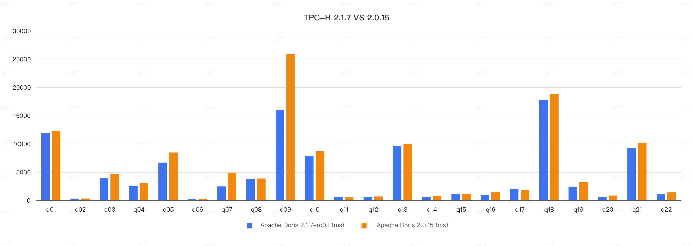

### 1. 硬件环境

| 硬件   | 配置说明                                     |
|------|------------------------------------------|
| 机器数量 | 4 台阿里云主机（1 个 FE，3 个 BE）                  |
| CPU  | Intel Xeon (Ice Lake) Platinum 8369B 32核 |
| 内存   | 128G                                     |
| 磁盘   | 阿里云 ESSD (PL0)                           |

### 2. 软件环境

- Doris 部署 3BE 1FE
- 内核版本：Linux version 5.15.0-101-generic 
- 操作系统版本：Ubuntu 20.04 LTS (Focal Fossa)
- Doris 软件版本：Apache Doris 2.1.7-rc03、Apache Doris 2.0.15.1
- JDK：openjdk version "1.8.0_352-352"

### 3. 测试数据量

整个测试模拟生成 TPC-H 1000G 的数据分别导入到 Apache Doris 2.1.7-rc03 和 Apache Doris 2.0.15.1 版本进行测试，下面是表的相关说明及数据量。

| TPC-H 表名 | 行数     | 备注     |
|:---------|:-------|:-------|
| REGION   | 5      | 区域表    |
| NATION   | 25     | 国家表    |
| SUPPLIER | 1000 万 | 供应商表   |
| PART     | 2 亿    | 零部件表   |
| PARTSUPP | 8 亿    | 零部件供应表 |
| CUSTOMER | 1.5 亿  | 客户表    |
| ORDERS   | 15 亿   | 订单表    |
| LINEITEM | 60 亿   | 订单明细表  |

### 4. 测试 SQL

TPC-H 22 个测试查询语句： [TPCH-Query-SQL](https://github.com/apache/doris/tree/master/tools/tpch-tools/queries)


### 5. 测试结果

这里我们使用 Apache Doris 2.1.7-rc03 和 Apache Doris 2.0.15.1 版本进行对比测试，测试结果如下：

| Query     | Apache Doris 2.1.7-rc03 (ms) | Apache Doris 2.0.15.1-rc01 (ms) |
|-----------|------------------------------|---------------------------------|
| Q1        | 11880                        | 12270                           |
| Q2        | 280                          | 290                             |
| Q3        | 3890                         | 4610                            |
| Q4        | 2570                         | 3040                            |
| Q5        | 6630                         | 8450                            |
| Q6        | 170                          | 180                             |
| Q7        | 2420                         | 4870                            |
| Q8        | 3730                         | 3850                            |
| Q9        | 15910                        | 25860                           |
| Q10       | 7880                         | 8650                            |
| Q11       | 560                          | 490                             |
| Q12       | 500                          | 660                             |
| Q13       | 9540                         | 9920                            |
| Q14       | 590                          | 740                             |
| Q15       | 1170                         | 1150                            |
| Q16       | 910                          | 1520                            |
| Q17       | 1920                         | 1770                            |
| Q18       | 17700                        | 18760                           |
| Q19       | 2370                         | 3240                            |
| Q20       | 560                          | 830                             |
| Q21       | 9150                         | 10150                           |
| Q22       | 1130                         | 1390                            |
| **Total** | **101460**                   | **122690**                      |

### 6. 环境准备

请先参照 [官方文档](#) 进行 Doris 的安装部署，以获得一个正常运行中的 Doris 集群（至少包含 1 FE 1 BE，推荐 1 FE 3 BE）。

### 7. 数据准备

#### 7.1 下载安装 TPC-H 数据生成工具

执行以下脚本下载并编译  [tpch-tools](https://github.com/apache/doris/tree/master/tools/tpch-tools)  工具。

```shell
sh bin/build-tpch-dbgen.sh
```

安装成功后，将在 `TPC-H_Tools_v3.0.0/` 目录下生成 `dbgen` 二进制文件。

#### 7.2 生成 TPC-H 测试集

执行以下脚本生成 TPC-H 数据集：

```shell
sh bin/gen-tpch-data.sh -s 1000
```

> 注 1：通过 `sh gen-tpch-data.sh -h` 查看脚本帮助。
>
> 注 2：数据会以 `.tbl` 为后缀生成在  `tpch-data/` 目录下。文件总大小约 1000GB。生成时间可能在数分钟到 1 小时不等。
>
> 注 3：默认生成 100G 的标准测试数据集

#### 7.3 建表

##### 7.3.1 准备 `doris-cluster.conf` 文件

在调用导入脚本前，需要将 FE 的 ip 端口等信息写在 `doris-cluster.conf` 文件中。

文件位置在 `${DORIS_HOME}/tools/tpch-tools/conf/` 目录下。

文件内容包括 FE 的 ip，HTTP 端口，用户名，密码以及待导入数据的 DB 名称：

```shell
## Any of FE host
export FE_HOST='127.0.0.1'
## http_port in fe.conf
export FE_HTTP_PORT=8030
## query_port in fe.conf
export FE_QUERY_PORT=9030
## Doris username
export USER='root'
## Doris password
export PASSWORD=''
## The database where TPC-H tables located
export DB='tpch'
```

##### 7.3.2 执行以下脚本生成创建 TPC-H 表

```shell
sh bin/create-tpch-tables.sh -s 1000
```
或者复制 [create-tpch-tables.sql](https://github.com/apache/doris/blob/master/tools/tpch-tools/ddl/create-tpch-tables-sf1000.sql) 中的建表语句，在 Doris 中执行。


#### 7.4 导入数据

通过下面的命令执行数据导入：

```shell
sh bin/load-tpch-data.sh
```

#### 7.5 检查导入数据

执行下面的 SQL 语句检查导入的数据与上面的数据量一致。

```sql
select count(*)  from  lineitem;
select count(*)  from  orders;
select count(*)  from  partsupp;
select count(*)  from  part;
select count(*)  from  customer;
select count(*)  from  supplier;
select count(*)  from  nation;
select count(*)  from  region;
select count(*)  from  revenue0;
```

#### 7.6 查询测试

#### 7.6.1 执行查询脚本

执行上面的测试 SQL 或者 执行下面的命令

```shell
sh bin/run-tpch-queries.sh -s 1000
```


#### 7.6.2 单个 SQL 执行

下面是测试时使用的 SQL 语句，你也可以从代码库里获取最新的 SQL。最新测试查询语句地址：[TPC-H 测试查询语句](https://github.com/apache/doris/tree/master/tools/tpch-tools/queries)

```sql
--Q1
select
    l_returnflag,
    l_linestatus,
    sum(l_quantity) as sum_qty,
    sum(l_extendedprice) as sum_base_price,
    sum(l_extendedprice * (1 - l_discount)) as sum_disc_price,
    sum(l_extendedprice * (1 - l_discount) * (1 + l_tax)) as sum_charge,
    avg(l_quantity) as avg_qty,
    avg(l_extendedprice) as avg_price,
    avg(l_discount) as avg_disc,
    count(*) as count_order
from
    lineitem
where
    l_shipdate <= date '1998-12-01' - interval '90' day
group by
    l_returnflag,
    l_linestatus
order by
    l_returnflag,
    l_linestatus;

--Q2
select
    s_acctbal,
    s_name,
    n_name,
    p_partkey,
    p_mfgr,
    s_address,
    s_phone,
    s_comment
from
    part,
    supplier,
    partsupp,
    nation,
    region
where
    p_partkey = ps_partkey
    and s_suppkey = ps_suppkey
    and p_size = 15
    and p_type like '%BRASS'
    and s_nationkey = n_nationkey
    and n_regionkey = r_regionkey
    and r_name = 'EUROPE'
    and ps_supplycost = (
        select
            min(ps_supplycost)
        from
            partsupp,
            supplier,
            nation,
            region
        where
        p_partkey = ps_partkey
        and s_suppkey = ps_suppkey
        and s_nationkey = n_nationkey
        and n_regionkey = r_regionkey
        and r_name = 'EUROPE'
)
order by
    s_acctbal desc,
    n_name,
    s_name,
    p_partkey
limit 100;

--Q3
select
    l_orderkey,
    sum(l_extendedprice * (1 - l_discount)) as revenue,
    o_orderdate,
    o_shippriority
from
    customer,
    orders,
    lineitem
where
    c_mktsegment = 'BUILDING'
    and c_custkey = o_custkey
    and l_orderkey = o_orderkey
    and o_orderdate < date '1995-03-15'
    and l_shipdate > date '1995-03-15'
group by
    l_orderkey,
    o_orderdate,
    o_shippriority
order by
    revenue desc,
    o_orderdate
limit 10;

--Q4
select
    o_orderpriority,
    count(*) as order_count
from
    orders
where
    o_orderdate >= date '1993-07-01'
    and o_orderdate < date '1993-07-01' + interval '3' month
    and exists (
        select
            *
        from
            lineitem
        where
                l_orderkey = o_orderkey
          and l_commitdate < l_receiptdate
    )
group by
    o_orderpriority
order by
    o_orderpriority;

--Q5
select
    n_name,
    sum(l_extendedprice * (1 - l_discount)) as revenue
from
    customer,
    orders,
    lineitem,
    supplier,
    nation,
    region
where
    c_custkey = o_custkey
    and l_orderkey = o_orderkey
    and l_suppkey = s_suppkey
    and c_nationkey = s_nationkey
    and s_nationkey = n_nationkey
    and n_regionkey = r_regionkey
    and r_name = 'ASIA'
    and o_orderdate >= date '1994-01-01'
    and o_orderdate < date '1994-01-01' + interval '1' year
group by
    n_name
order by
    revenue desc;

--Q6
select
    sum(l_extendedprice * l_discount) as revenue
from
    lineitem
where
    l_shipdate >= date '1994-01-01'
    and l_shipdate < date '1994-01-01' + interval '1' year
    and l_discount between .06 - 0.01 and .06 + 0.01
    and l_quantity < 24;

--Q7
select
    supp_nation,
    cust_nation,
    l_year,
    sum(volume) as revenue
from
    (
        select
            n1.n_name as supp_nation,
            n2.n_name as cust_nation,
            extract(year from l_shipdate) as l_year,
            l_extendedprice * (1 - l_discount) as volume
        from
            supplier,
            lineitem,
            orders,
            customer,
            nation n1,
            nation n2
        where
            s_suppkey = l_suppkey
            and o_orderkey = l_orderkey
            and c_custkey = o_custkey
            and s_nationkey = n1.n_nationkey
            and c_nationkey = n2.n_nationkey
            and (
                (n1.n_name = 'FRANCE' and n2.n_name = 'GERMANY')
                or (n1.n_name = 'GERMANY' and n2.n_name = 'FRANCE')
            )
            and l_shipdate between date '1995-01-01' and date '1996-12-31'
    ) as shipping
group by
    supp_nation,
    cust_nation,
    l_year
order by
    supp_nation,
    cust_nation,
    l_year;

--Q8

select
    o_year,
    sum(case
        when nation = 'BRAZIL' then volume
        else 0
    end) / sum(volume) as mkt_share
from
    (
        select
            extract(year from o_orderdate) as o_year,
            l_extendedprice * (1 - l_discount) as volume,
            n2.n_name as nation
        from
            part,
            supplier,
            lineitem,
            orders,
            customer,
            nation n1,
            nation n2,
            region
        where
            p_partkey = l_partkey
            and s_suppkey = l_suppkey
            and l_orderkey = o_orderkey
            and o_custkey = c_custkey
            and c_nationkey = n1.n_nationkey
            and n1.n_regionkey = r_regionkey
            and r_name = 'AMERICA'
            and s_nationkey = n2.n_nationkey
            and o_orderdate between date '1995-01-01' and date '1996-12-31'
            and p_type = 'ECONOMY ANODIZED STEEL'
    ) as all_nations
group by
    o_year
order by
    o_year;

--Q9
select
    nation,
    o_year,
    sum(amount) as sum_profit
from
    (
        select
            n_name as nation,
            extract(year from o_orderdate) as o_year,
            l_extendedprice * (1 - l_discount) - ps_supplycost * l_quantity as amount
        from
            part,
            supplier,
            lineitem,
            partsupp,
            orders,
            nation
        where
            s_suppkey = l_suppkey
            and ps_suppkey = l_suppkey
            and ps_partkey = l_partkey
            and p_partkey = l_partkey
            and o_orderkey = l_orderkey
            and s_nationkey = n_nationkey
            and p_name like '%green%'
    ) as profit
group by
    nation,
    o_year
order by
    nation,
    o_year desc;

--Q10
select
    c_custkey,
    c_name,
    sum(l_extendedprice * (1 - l_discount)) as revenue,
    c_acctbal,
    n_name,
    c_address,
    c_phone,
    c_comment
from
    customer,
    orders,
    lineitem,
    nation
where
    c_custkey = o_custkey
    and l_orderkey = o_orderkey
    and o_orderdate >= date '1993-10-01'
    and o_orderdate < date '1993-10-01' + interval '3' month
    and l_returnflag = 'R'
    and c_nationkey = n_nationkey
group by
    c_custkey,
    c_name,
    c_acctbal,
    c_phone,
    n_name,
    c_address,
    c_comment
order by
    revenue desc
limit 20;


--Q11
select
    ps_partkey,
    sum(ps_supplycost * ps_availqty) as value
from
    partsupp,
    supplier,
    nation
where
    ps_suppkey = s_suppkey
    and s_nationkey = n_nationkey
    and n_name = 'GERMANY'
group by
    ps_partkey having
    sum(ps_supplycost * ps_availqty) > (
        select
        sum(ps_supplycost * ps_availqty) * 0.000002
        from
            partsupp,
            supplier,
            nation
        where
            ps_suppkey = s_suppkey
            and s_nationkey = n_nationkey
            and n_name = 'GERMANY'
    )
order by
    value desc;

--Q12
select
    l_shipmode,
    sum(case
        when o_orderpriority = '1-URGENT'
            or o_orderpriority = '2-HIGH'
            then 1
        else 0
    end) as high_line_count,
    sum(case
        when o_orderpriority <> '1-URGENT'
            and o_orderpriority <> '2-HIGH'
            then 1
        else 0
    end) as low_line_count
from
    orders,
    lineitem
where
    o_orderkey = l_orderkey
    and l_shipmode in ('MAIL', 'SHIP')
    and l_commitdate < l_receiptdate
    and l_shipdate < l_commitdate
    and l_receiptdate >= date '1994-01-01'
    and l_receiptdate < date '1994-01-01' + interval '1' year
group by
    l_shipmode
order by
    l_shipmode;

--Q13
select
    c_count,
    count(*) as custdist
from
    (
        select
            c_custkey,
            count(o_orderkey) as c_count
        from
            customer left outer join orders on
                c_custkey = o_custkey
                and o_comment not like '%special%requests%'
        group by
            c_custkey
    ) as c_orders
group by
    c_count
order by
    custdist desc,
    c_count desc;

--Q14
select
    100.00 * sum(case
        when p_type like 'PROMO%'
            then l_extendedprice * (1 - l_discount)
        else 0
    end) / sum(l_extendedprice * (1 - l_discount)) as promo_revenue
from
    lineitem,
    part
where
    l_partkey = p_partkey
    and l_shipdate >= date '1995-09-01'
    and l_shipdate < date '1995-09-01' + interval '1' month;

--Q15
select
    s_suppkey,
    s_name,
    s_address,
    s_phone,
    total_revenue
from
    supplier,
    revenue0
where
    s_suppkey = supplier_no
    and total_revenue = (
        select
            max(total_revenue)
        from
            revenue0
    )
order by
    s_suppkey;

--Q16
select
    p_brand,
    p_type,
    p_size,
    count(distinct ps_suppkey) as supplier_cnt
from
    partsupp,
    part
where
    p_partkey = ps_partkey
    and p_brand <> 'Brand#45'
    and p_type not like 'MEDIUM POLISHED%'
    and p_size in (49, 14, 23, 45, 19, 3, 36, 9)
    and ps_suppkey not in (
        select
            s_suppkey
        from
            supplier
        where
            s_comment like '%Customer%Complaints%'
    )
group by
    p_brand,
    p_type,
    p_size
order by
    supplier_cnt desc,
    p_brand,
    p_type,
    p_size;

--Q17
select
    sum(l_extendedprice) / 7.0 as avg_yearly
from
    lineitem,
    part
where
    p_partkey = l_partkey
    and p_brand = 'Brand#23'
    and p_container = 'MED BOX'
    and l_quantity < (
        select
            0.2 * avg(l_quantity)
        from
            lineitem
        where
            l_partkey = p_partkey
    );

--Q18
select
    c_name,
    c_custkey,
    o_orderkey,
    o_orderdate,
    o_totalprice,
    sum(l_quantity)
from
    customer,
    orders,
    lineitem
where
    o_orderkey  in  (
        select
            l_orderkey
        from
            lineitem
        group  by
            l_orderkey  having
                sum(l_quantity)  >  300
    )
    and  c_custkey  =  o_custkey
    and  o_orderkey  =  l_orderkey
group  by
    c_name,
    c_custkey,
    o_orderkey,
    o_orderdate,
    o_totalprice
order  by
    o_totalprice  desc,
    o_orderdate
limit  100;


--Q19
select
    sum(l_extendedprice* (1 - l_discount)) as revenue
from
    lineitem,
    part
where
    (
        p_partkey = l_partkey
        and p_brand = 'Brand#12'
        and p_container in ('SM CASE', 'SM BOX', 'SM PACK', 'SM PKG')
        and l_quantity >= 1 and l_quantity <= 1 + 10
        and p_size between 1 and 5
        and l_shipmode in ('AIR', 'AIR REG')
        and l_shipinstruct = 'DELIVER IN PERSON'
    )
    or
    (
        p_partkey = l_partkey
        and p_brand = 'Brand#23'
        and p_container in ('MED BAG', 'MED BOX', 'MED PKG', 'MED PACK')
        and l_quantity >= 10 and l_quantity <= 10 + 10
        and p_size between 1 and 10
        and l_shipmode in ('AIR', 'AIR REG')
        and l_shipinstruct = 'DELIVER IN PERSON'
    )
    or
    (
        p_partkey = l_partkey
        and p_brand = 'Brand#34'
        and p_container in ('LG CASE', 'LG BOX', 'LG PACK', 'LG PKG')
        and l_quantity >= 20 and l_quantity <= 20 + 10
        and p_size between 1 and 15
        and l_shipmode in ('AIR', 'AIR REG')
        and l_shipinstruct = 'DELIVER IN PERSON'
    );

--Q20
select
    s_name,
    s_address
from
    supplier,
    nation
where
    s_suppkey in (
        select
            ps_suppkey
        from
            partsupp
        where
            ps_partkey in (
                select
                    p_partkey
                from
                    part
                where
                        p_name like 'forest%'
            )
            and ps_availqty > (
                select
                    0.5 * sum(l_quantity)
                from
                    lineitem
                where
                    l_partkey = ps_partkey
                    and l_suppkey = ps_suppkey
                    and l_shipdate >= date '1994-01-01'
                    and l_shipdate < date '1994-01-01' + interval '1' year
            )
    )
    and s_nationkey = n_nationkey
    and n_name = 'CANADA'
order by
    s_name;

--Q21
select
    s_name,
    count(*) as numwait
from
    supplier,
    lineitem l1,
    orders,
    nation
where
    s_suppkey = l1.l_suppkey
    and o_orderkey = l1.l_orderkey
    and o_orderstatus = 'F'
    and l1.l_receiptdate > l1.l_commitdate
    and exists (
        select
            *
        from
            lineitem l2
        where
                l2.l_orderkey = l1.l_orderkey
          and l2.l_suppkey <> l1.l_suppkey
    )
    and not exists (
        select
            *
        from
            lineitem l3
        where
                l3.l_orderkey = l1.l_orderkey
          and l3.l_suppkey <> l1.l_suppkey
          and l3.l_receiptdate > l3.l_commitdate
    )
    and s_nationkey = n_nationkey
    and n_name = 'SAUDI ARABIA'
group by
    s_name
order by
    numwait desc,
    s_name
limit 100;

--Q22
select
    cntrycode,
    count(*) as numcust,
    sum(c_acctbal) as totacctbal
from
    (
        select
            substring(c_phone, 1, 2) as cntrycode,
            c_acctbal
        from
            customer
        where
            substring(c_phone, 1, 2) in
            ('13', '31', '23', '29', '30', '18', '17')
            and c_acctbal > (
                select
                    avg(c_acctbal)
                from
                    customer
                where
                    c_acctbal > 0.00
                    and substring(c_phone, 1, 2) in
                      ('13', '31', '23', '29', '30', '18', '17')
            )
            and not exists (
                select
                    *
                from
                    orders
                where
                    o_custkey = c_custkey
            )
    ) as custsale
group by
    cntrycode
order by
    cntrycode;

```


---
{
    "title": "TPC-DS Benchmark",
    "language": "zh-CN"
}
---

## TPC-DS Benchmark
<!--
Licensed to the Apache Software Foundation (ASF) under one
or more contributor license agreements.  See the NOTICE file
distributed with this work for additional information
regarding copyright ownership.  The ASF licenses this file
to you under the Apache License, Version 2.0 (the
"License"); you may not use this file except in compliance
with the License.  You may obtain a copy of the License at

  http://www.apache.org/licenses/LICENSE-2.0

Unless required by applicable law or agreed to in writing,
software distributed under the License is distributed on an
"AS IS" BASIS, WITHOUT WARRANTIES OR CONDITIONS OF ANY
KIND, either express or implied.  See the License for the
specific language governing permissions and limitations
under the License.
-->


TPC-DS（Transaction Processing Performance Council Decision Support Benchmark）是一个以决策支持为重点的基准测试，旨在评估数据仓库和分析系统的性能。它是由 TPC（Transaction Processing Performance Council）组织开发的，用于比较不同系统在处理复杂查询和大规模数据分析方面的能力。

TPC-DS 的设计目标是模拟现实世界中的复杂决策支持工作负载。它通过一系列复杂的查询和数据操作来测试系统的性能，包括联接、聚合、排序、过滤、子查询等。这些查询模式涵盖了从简单到复杂的各种场景，如报表生成、数据挖掘、OLAP（联机分析处理）等。

本文档主要介绍 Doris 在 TPC-DS 1000G 测试集上的性能表现。

在 TPC-DS 标准测试数据集上的 99 个查询上，我们基于 Apache Doris 2.1.7-rc03 和 Apache Doris 2.0.15.1 版本进行了对比测试。


### 1. 硬件环境

| 硬件   | 配置说明                                     |
|------|------------------------------------------|
| 机器数量 | 4 台阿里云主机（1 个 FE，3 个 BE）                  |
| CPU  | Intel Xeon (Ice Lake) Platinum 8369B 32核 |
| 内存   | 128G                                     |
| 磁盘   | 阿里云 ESSD (PL0)                           |

### 2. 软件环境

- Doris 部署 3BE 1FE
- 内核版本：Linux version 5.15.0-101-generic 
- 操作系统版本：Ubuntu 20.04 LTS (Focal Fossa)
- Doris 软件版本：Apache Doris 2.1.7-rc03、Apache Doris 2.0.15.1
- JDK：openjdk version "1.8.0_352-352"

### 3. 测试数据量

整个测试模拟生成 TPC-DS 1000G 的数据分别导入到 Apache Doris 2.1.7-rc03 和 Apache Doris 2.0.15.1 版本进行测试，下面是表的相关说明及数据量。

| TPC-DS 表名              | 行数            |
|------------------------|---------------|
| customer_demographics  | 1,920,800     |
| reason                 | 65            |
| warehouse              | 20            |
| date_dim               | 73,049        |
| catalog_sales          | 1,439,980,416 |
| call_center            | 42            |
| inventory              | 783,000,000   |
| catalog_returns        | 143,996,756   |
| household_demographics | 7,200         |
| customer_address       | 6,000,000     |
| income_band            | 20            |
| catalog_page           | 30,000        |
| item                   | 300,000       |
| web_returns            | 71,997,522    |
| web_site               | 54            |
| promotion              | 1,500         |
| web_sales              | 720,000,376   |
| store                  | 1,002         |
| web_page               | 3,000         |
| time_dim               | 86,400        |
| store_returns          | 287,999,764   |
| store_sales            | 2,879,987,999 |
| ship_mode              | 20            |
| customer               | 12,000,000    |

### 4. 测试 SQL

TPC-DS 99 个测试查询语句： [TPC-DS-Query-SQL](https://github.com/apache/doris/tree/master/tools/tpcds-tools/queries/sf1000)


### 5. 测试结果

这里我们使用 Apache Doris 2.1.7-rc03 和 Apache Doris 2.0.15.1 版本进行对比测试，测试结果如下：(由于缺少最新的内存优化，Apache Doris 2.0.15.1 q78 q79无法执行，在计算总和时被删除)

| Query     | Apache Doris 2.1.7-rc03  (ms) | Apache Doris 2.0.15.1-rc01  (ms) |
|-----------|-------------------------------|----------------------------------|
| query01   | 630                           | 890                              |
| query02   | 4930                          | 6930                             |
| query03   | 360                           | 460                              |
| query04   | 11070                         | 42320                            |
| query05   | 620                           | 15360                            |
| query06   | 220                           | 1020                             |
| query07   | 550                           | 750                              |
| query08   | 330                           | 670                              |
| query09   | 6830                          | 7550                             |
| query10   | 370                           | 2900                             |
| query11   | 6960                          | 27380                            |
| query12   | 100                           | 80                               |
| query13   | 790                           | 2860                             |
| query14   | 13470                         | 42340                            |
| query15   | 510                           | 940                              |
| query16   | 520                           | 550                              |
| query17   | 1310                          | 2650                             |
| query18   | 560                           | 820                              |
| query19   | 200                           | 400                              |
| query20   | 100                           | 190                              |
| query21   | 80                            | 80                               |
| query22   | 2300                          | 3070                             |
| query23   | 38240                         | 75260                            |
| query24   | 8340                          | 26580                            |
| query25   | 780                           | 1190                             |
| query26   | 200                           | 220                              |
| query27   | 530                           | 750                              |
| query28   | 5940                          | 7400                             |
| query29   | 940                           | 1250                             |
| query30   | 270                           | 490                              |
| query31   | 1890                          | 2530                             |
| query32   | 60                            | 70                               |
| query33   | 350                           | 450                              |
| query34   | 750                           | 1380                             |
| query35   | 1370                          | 8970                             |
| query36   | 530                           | 570                              |
| query37   | 60                            | 60                               |
| query38   | 7520                          | 8710                             |
| query39   | 560                           | 1010                             |
| query40   | 150                           | 180                              |
| query41   | 50                            | 40                               |
| query42   | 100                           | 140                              |
| query43   | 1150                          | 1960                             |
| query44   | 2020                          | 3220                             |
| query45   | 430                           | 960                              |
| query46   | 1250                          | 2760                             |
| query47   | 2660                          | 5790                             |
| query48   | 630                           | 2570                             |
| query49   | 730                           | 800                              |
| query50   | 1640                          | 2200                             |
| query51   | 6430                          | 6270                             |
| query52   | 110                           | 160                              |
| query53   | 250                           | 490                              |
| query54   | 1280                          | 7790                             |
| query55   | 110                           | 160                              |
| query56   | 290                           | 410                              |
| query57   | 1480                          | 3510                             |
| query58   | 240                           | 550                              |
| query59   | 7760                          | 11870                            |
| query60   | 380                           | 490                              |
| query61   | 540                           | 670                              |
| query62   | 740                           | 1560                             |
| query63   | 210                           | 460                              |
| query64   | 5790                          | 6840                             |
| query65   | 4900                          | 7960                             |
| query66   | 480                           | 810                              |
| query67   | 27320                         | 46110                            |
| query68   | 1600                          | 2380                             |
| query69   | 380                           | 800                              |
| query70   | 3480                          | 5330                             |
| query71   | 460                           | 790                              |
| query72   | 3160                          | 5390                             |
| query73   | 660                           | 1250                             |
| query74   | 5990                          | 16450                            |
| query75   | 4610                          | 8410                             |
| query76   | 1590                          | 2950                             |
| query77   | 300                           | 480                              |
| query78   | 17970                         | x                                |
| query79   | 3040                          | x                                |
| query80   | 570                           | 910                              |
| query81   | 460                           | 760                              |
| query82   | 270                           | 330                              |
| query83   | 220                           | 290                              |
| query84   | 130                           | 110                              |
| query85   | 520                           | 470                              |
| query86   | 760                           | 1220                             |
| query87   | 800                           | 8760                             |
| query88   | 5560                          | 9690                             |
| query89   | 430                           | 750                              |
| query90   | 150                           | 400                              |
| query91   | 150                           | 120                              |
| query92   | 40                            | 40                               |
| query93   | 2440                          | 2670                             |
| query94   | 340                           | 310                              |
| query95   | 350                           | 1810                             |
| query96   | 660                           | 1680                             |
| query97   | 5020                          | 14990                            |
| query98   | 190                           | 330                              |
| query99   | 1560                          | 3230                             |
| **Total** | **261320**                    | **507380**                       |

### 6. 环境准备

请先参照 [官方文档](#) 进行 Doris 的安装部署，以获得一个正常运行中的 Doris 集群（至少包含 1 FE 1 BE，推荐 1 FE 3 BE）。

### 7. 数据准备

#### 7.1 下载安装 TPC-DS 数据生成工具

执行以下脚本下载并编译  [tpcds-tools](https://github.com/apache/doris/tree/master/tools/tpcds-tools)  工具。

```shell
sh bin/build-tpcds-tools.sh
```

#### 7.2 生成 TPC-DS 测试集

执行以下脚本生成 TPC-DS 数据集：

```shell
sh bin/gen-tpcds-data.sh -s 1000
```

> 注 1：通过 `sh gen-tpcds-data.sh -h` 查看脚本帮助。
>
> 注 2：数据会以 `.dat` 为后缀生成在  `tpcds-data/` 目录下。文件总大小约 1000GB。生成时间可能在数分钟到 1 小时不等。
>
> 注 3：默认生成 100G 的标准测试数据集

#### 7.3 建表

##### 7.3.1 准备 `doris-cluster.conf` 文件

在调用导入脚本前，需要将 FE 的 ip 端口等信息写在 `doris-cluster.conf` 文件中。

文件位置在 `${DORIS_HOME}/tools/tpcds-tools/conf/` 目录下。

文件内容包括 FE 的 ip，HTTP 端口，用户名，密码以及待导入数据的 DB 名称：

```shell
## Any of FE host
export FE_HOST='127.0.0.1'
## http_port in fe.conf
export FE_HTTP_PORT=8030
## query_port in fe.conf
export FE_QUERY_PORT=9030
## Doris username
export USER='root'
## Doris password
export PASSWORD=''
## The database where TPC-DS tables located
export DB='tpcds'
```

##### 7.3.2 执行以下脚本生成创建 TPC-DS 表

```shell
sh bin/create-tpcds-tables.sh -s 1000
```
或者复制 [create-tpcds-tables.sql](https://github.com/apache/doris/blob/master/tools/tpcds-tools/ddl/create-tpcds-tables-sf1000.sql) 中的建表语句，在 Doris 中执行。


#### 7.4 导入数据

通过下面的命令执行数据导入：

```shell
sh bin/load-tpcds-data.sh
```


#### 7.5 查询测试

#### 7.5.1 执行查询脚本

单个 SQL 执行 或者 执行下面的命令

```shell
sh bin/run-tpcds-queries.sh -s 1000
```

#### 7.5.2 单个 SQL 执行

你也可以从代码库里获取最新的 SQL。最新测试查询语句地址：[TPC-DS 测试查询语句](https://github.com/apache/doris/tree/master/tools/tpcds-tools/queries/sf1000)


# 生态扩展

---
{
  "title": "CloudCanal",
  "language": "zh-CN"
}
---

## CloudCanal
<!--
Licensed to the Apache Software Foundation (ASF) under one
or more contributor license agreements.  See the NOTICE file
distributed with this work for additional information
regarding copyright ownership.  The ASF licenses this file
to you under the Apache License, Version 2.0 (the
"License"); you may not use this file except in compliance
with the License.  You may obtain a copy of the License at

  http://www.apache.org/licenses/LICENSE-2.0

Unless required by applicable law or agreed to in writing,
software distributed under the License is distributed on an
"AS IS" BASIS, WITHOUT WARRANTIES OR CONDITIONS OF ANY
KIND, either express or implied.  See the License for the
specific language governing permissions and limitations
under the License.
-->


CloudCanal 是一款全自研、可视化、自动化的数据迁移、同步工具，支持 30+ 款流行关系型数据库、实时数仓、消息中间件、缓存数据库和搜索引擎之间的数据互通，具备实时高效、精确互联、稳定可拓展、一站式、混合部署、复杂数据转换等优点。

### 功能说明
CloudCanal 提供可视化的界面，可轻松实现数据的结构迁移、全量迁移、增量同步、校验与订正等，此外还可通过设置参数，完成更多精细化、自定义的数据同步配置。目前支持从以下数据源集成数据到 Doris。

| 源端数据源                     | 结构迁移 | 全量迁移 | 增量同步 | 校验订正 |
|------------------------------|---------|---------|--------|---------|
| MySQL/MariaDB/AuroraMySQL    | 支持     | 支持     | 支持   | 支持     |
| Oracle                       | 支持     | 支持     | 支持   | 支持     |
| PostgreSQL/AuroraPostgreSQL | 支持     | 支持     | 支持   | 支持     |
| SQL Server                   | 支持     | 支持     | 支持   | 支持     |
| Kafka                        | 不支持   | 不支持    | 支持   | 不支持   |
| AutoMQ                       | 不支持   | 不支持    | 支持   | 不支持   |
| TiDB                         | 支持     | 支持     | 支持   | 支持     |
| Hana                         | 支持     | 支持     | 支持   | 支持     |
| PolarDB-X                    | 支持     | 支持     | 支持   | 支持     |


> 更多功能及参数设置，请参考 [CloudCanal 数据链路说明](https://www.clougence.com/cc-doc/dataMigrationAndSync/connection/mysql2?target=Doris)。


### 下载安装
请参考 [全新安装(Docker Linux/MacOS)](https://www.clougence.com/cc-doc/productOP/docker/install_linux_macos)，前往 [CloudCanal 官网](https://www.clougence.com/) 下载安装私有部署版本。

### 使用示例
以下以 MySQL 为例，演示如何实现 MySQL 到 Doris 的数据迁移同步。

#### 添加数据源
1. 登录 CloudCanal 控制台，点击 **数据源管理** > **新增数据源**。
2. 分别选择 MySQL 和 Doris 数据源，并填写相应信息。

   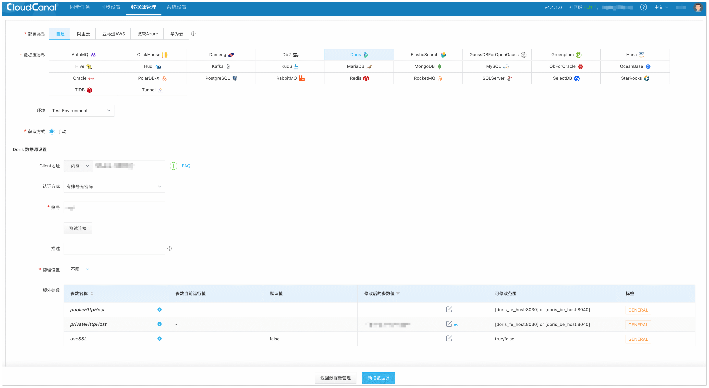

3. 点击 **测试连接**，连接成功后，点击 **新增数据源**，完成数据源添加。

   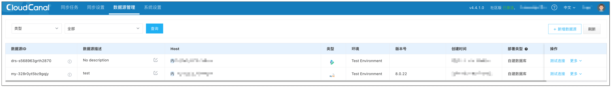

#### 创建任务
1. 点击 **同步任务** > **创建任务**。
2. 选择源和目标数据源，并分别点击 **测试连接**。

   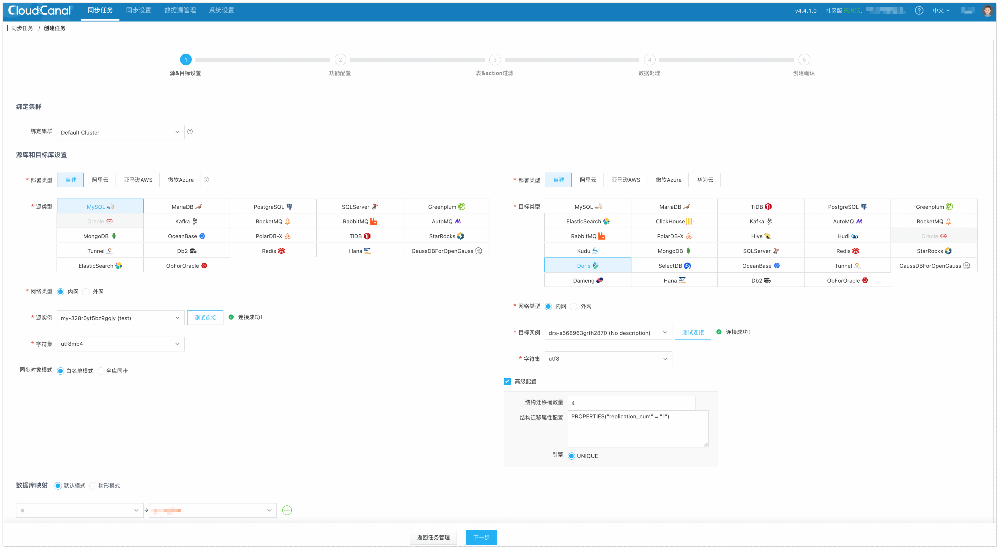

3. 选择 **数据同步** 并勾选 **全量初始化**。

   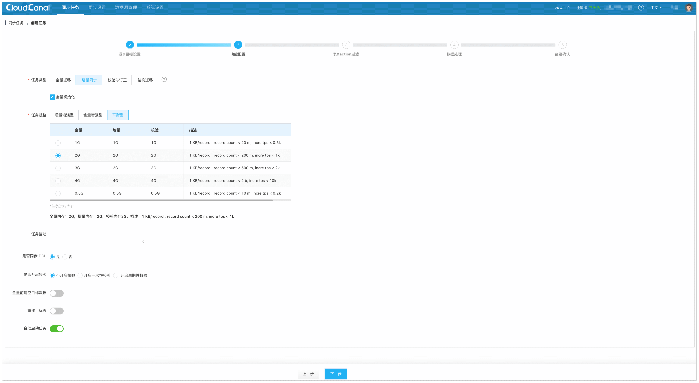

4. 选择需要同步的表。

   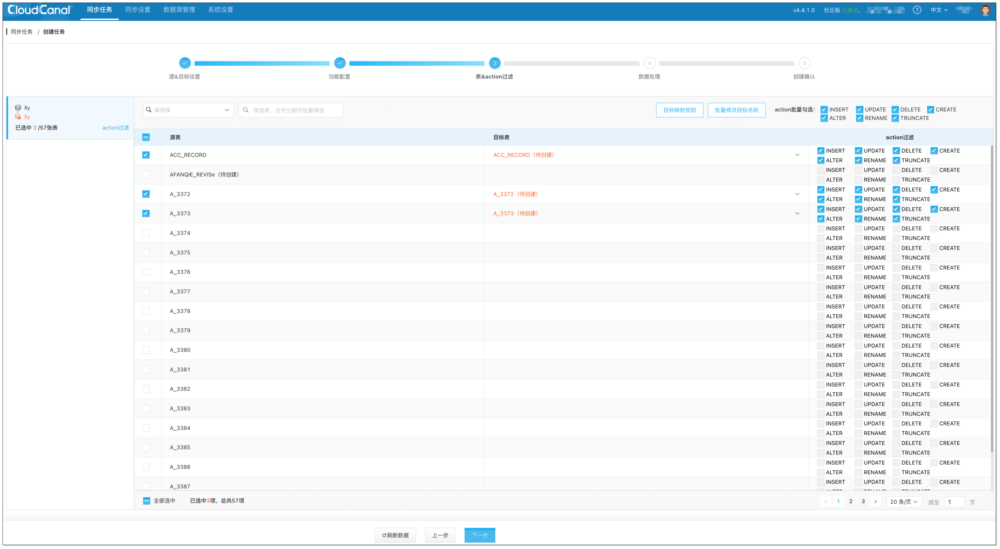

5. 选择需要同步的列。

   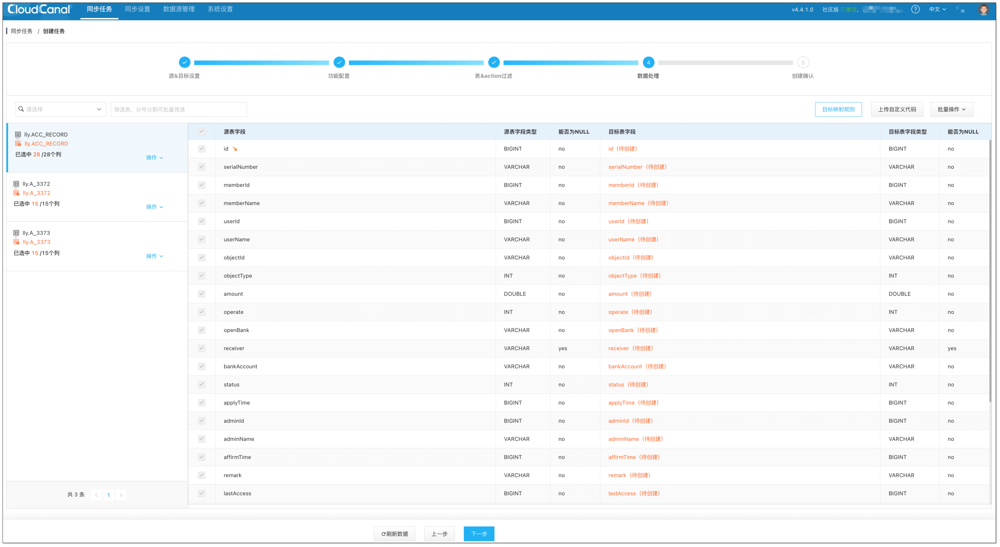

6. 确认创建任务。
7. 任务自动运行。CloudCanal 会自动进行任务流转，其中的步骤包括：
  - 结构迁移: 将源端的表结构迁移到对端，如果同名表在对端已存在，则忽略。
  - 全量数据迁移: 已存在的存量数据将会完整迁移到对端，支持断点续传。
  - 增量数据同步: 增量数据将会持续地同步到对端数据库，并且保持实时（秒级别延迟）。   
  
  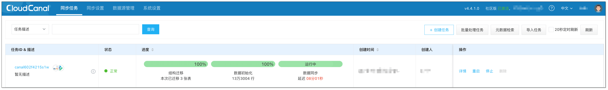


---
{
  "title": "Spark Doris Connector",
  "language": "zh-CN"
}
---

## Spark Doris Connector
<!--
Licensed to the Apache Software Foundation (ASF) under one
or more contributor license agreements.  See the NOTICE file
distributed with this work for additional information
regarding copyright ownership.  The ASF licenses this file
to you under the Apache License, Version 2.0 (the
"License"); you may not use this file except in compliance
with the License.  You may obtain a copy of the License at

  http://www.apache.org/licenses/LICENSE-2.0

Unless required by applicable law or agreed to in writing,
software distributed under the License is distributed on an
"AS IS" BASIS, WITHOUT WARRANTIES OR CONDITIONS OF ANY
KIND, either express or implied.  See the License for the
specific language governing permissions and limitations
under the License.
-->


Spark Doris Connector 可以支持通过 Spark 读取 Doris 中存储的数据，也支持通过 Spark 写入数据到 Doris。

代码库地址：https://github.com/apache/doris-spark-connector

- 支持从`Doris`中读取数据
- 支持`Spark DataFrame`批量/流式 写入`Doris`
- 可以将`Doris`表映射为`DataFrame`或者`RDD`，推荐使用`DataFrame`。
- 支持在`Doris`端完成数据过滤，减少数据传输量。

### 版本兼容

| Connector | Spark               | Doris       | Java | Scala      |
|-----------|---------------------|-------------|------|------------|
| 1.3.1     | 3.4 ~ 3.1, 2.4, 2.3 | 1.0 +       | 8    | 2.12, 2.11 |
| 1.2.0     | 3.2, 3.1, 2.3       | 1.0 +       | 8    | 2.12, 2.11 |
| 1.1.0     | 3.2, 3.1, 2.3       | 1.0 +       | 8    | 2.12, 2.11 |
| 1.0.1     | 3.1, 2.3            | 0.12 - 0.15 | 8    | 2.12, 2.11 |

### 使用

#### Maven
```
<dependency>
    <groupId>org.apache.doris</groupId>
    <artifactId>spark-doris-connector-3.4_2.12</artifactId>
    <version>1.3.2</version>
</dependency>
```

**备注**

1. 请根据不同的 Spark 和 Scala 版本替换相应的 Connector 版本。

2. 也可从[这里](https://repo.maven.apache.org/maven2/org/apache/doris/)下载相关版本 jar 包。

#### 编译

编译时，可直接运行 `sh build.sh`，具体可参考这里。

编译成功后，会在 `dist` 目录生成目标 jar 包，如：spark-doris-connector-3.2_2.12-1.2.0-SNAPSHOT.jar。 将此文件复制到 `Spark` 的 `ClassPath` 中即可使用 `Spark-Doris-Connector`。 例如，`Local` 模式运行的 `Spark`，将此文件放入 `jars/` 文件夹下。`Yarn`集群模式运行的`Spark`，则将此文件放入预部署包中。
也可以


2. 在源码目录下执行：
   `sh build.sh`
   根据提示输入你需要的 Scala 与 Spark 版本进行编译。

编译成功后，会在 `dist` 目录生成目标 jar 包，如：`spark-doris-connector-3.2_2.12-1.2.0-SNAPSHOT.jar`。
将此文件复制到 `Spark` 的 `ClassPath` 中即可使用 `Spark-Doris-Connector`。

例如，`Local` 模式运行的 `Spark`，将此文件放入 `jars/` 文件夹下。`Yarn`集群模式运行的`Spark`，则将此文件放入预部署包中。

例如将 `spark-doris-connector-3.2_2.12-1.2.0-SNAPSHOT.jar` 上传到 hdfs 并在 `spark.yarn.jars` 参数上添加 hdfs 上的 Jar包路径
```shell
1. 上传 `spark-doris-connector-3.2_2.12-1.2.0-SNAPSHOT.jar` 到 hdfs。

hdfs dfs -mkdir /spark-jars/
hdfs dfs -put /your_local_path/spark-doris-connector-3.2_2.12-1.2.0-SNAPSHOT.jar /spark-jars/

2. 在集群中添加 `spark-doris-connector-3.2_2.12-1.2.0-SNAPSHOT.jar` 依赖。
spark.yarn.jars=hdfs:///spark-jars/spark-doris-connector-3.2_2.12-1.2.0-SNAPSHOT.jar

```

### 使用示例

#### 读取

##### SQL

```sql
CREATE
TEMPORARY VIEW spark_doris
USING doris
OPTIONS(
  "table.identifier"="$YOUR_DORIS_DATABASE_NAME.$YOUR_DORIS_TABLE_NAME",
  "fenodes"="$YOUR_DORIS_FE_HOSTNAME:$YOUR_DORIS_FE_RESFUL_PORT",
  "user"="$YOUR_DORIS_USERNAME",
  "password"="$YOUR_DORIS_PASSWORD"
);

SELECT *
FROM spark_doris;
```

##### DataFrame

```java
val dorisSparkDF = spark.read.format("doris")
  .option("doris.table.identifier", "$YOUR_DORIS_DATABASE_NAME.$YOUR_DORIS_TABLE_NAME")
  .option("doris.fenodes", "$YOUR_DORIS_FE_HOSTNAME:$YOUR_DORIS_FE_RESFUL_PORT")
  .option("user", "$YOUR_DORIS_USERNAME")
  .option("password", "$YOUR_DORIS_PASSWORD")
  .load()

dorisSparkDF.show(5)
```

##### RDD

```java
import org.apache.doris.spark._

val dorisSparkRDD = sc.dorisRDD(
  tableIdentifier = Some("$YOUR_DORIS_DATABASE_NAME.$YOUR_DORIS_TABLE_NAME"),
  cfg = Some(Map(
    "doris.fenodes" -> "$YOUR_DORIS_FE_HOSTNAME:$YOUR_DORIS_FE_RESFUL_PORT",
    "doris.request.auth.user" -> "$YOUR_DORIS_USERNAME",
    "doris.request.auth.password" -> "$YOUR_DORIS_PASSWORD"
  ))
)

dorisSparkRDD.collect()
```

##### pySpark

```java
dorisSparkDF = spark.read.format("doris")
  .option("doris.table.identifier", "$YOUR_DORIS_DATABASE_NAME.$YOUR_DORIS_TABLE_NAME")
  .option("doris.fenodes", "$YOUR_DORIS_FE_HOSTNAME:$YOUR_DORIS_FE_RESFUL_PORT")
  .option("user", "$YOUR_DORIS_USERNAME")
  .option("password", "$YOUR_DORIS_PASSWORD")
  .load()
// show 5 lines data 
dorisSparkDF.show(5)
```

#### 写入

##### SQL

```sql
CREATE
TEMPORARY VIEW spark_doris
USING doris
OPTIONS(
  "table.identifier"="$YOUR_DORIS_DATABASE_NAME.$YOUR_DORIS_TABLE_NAME",
  "fenodes"="$YOUR_DORIS_FE_HOSTNAME:$YOUR_DORIS_FE_RESFUL_PORT",
  "user"="$YOUR_DORIS_USERNAME",
  "password"="$YOUR_DORIS_PASSWORD"
);

INSERT INTO spark_doris
VALUES ("VALUE1", "VALUE2", ...);
## or
INSERT INTO spark_doris
SELECT *
FROM YOUR_TABLE
## or
INSERT OVERWRITE 
SELECT *
FROM YOUR_TABLE 
```

##### DataFrame(batch/stream)

```java
// batch sink
val mockDataDF = List(
  (3, "440403001005", "21.cn"),
  (1, "4404030013005", "22.cn"),
  (33, null, "23.cn")
).toDF("id", "mi_code", "mi_name")
mockDataDF.show(5)

mockDataDF.write.format("doris")
  .option("doris.table.identifier", "$YOUR_DORIS_DATABASE_NAME.$YOUR_DORIS_TABLE_NAME")
  .option("doris.fenodes", "$YOUR_DORIS_FE_HOSTNAME:$YOUR_DORIS_FE_RESFUL_PORT")
  .option("user", "$YOUR_DORIS_USERNAME")
  .option("password", "$YOUR_DORIS_PASSWORD")
  //其它选项
  //指定你要写入的字段
  .option("doris.write.fields", "$YOUR_FIELDS_TO_WRITE")
  // 支持设置 Overwrite 模式来覆盖数据
  // .option("save_mode", SaveMode.Overwrite)
  .save()

// stream sink(StructuredStreaming)

// 结果 DataFrame 和 doris 表相同的结构化数据, 配置方式和批量模式一致。
val sourceDf = spark.readStream.
       .format("your_own_stream_source")
       .load()

val resultDf = sourceDf.<transformations>

resultDf.writeStream
      .format("doris")
      .option("checkpointLocation", "$YOUR_CHECKPOINT_LOCATION")
      .option("doris.table.identifier", "$YOUR_DORIS_DATABASE_NAME.$YOUR_DORIS_TABLE_NAME")
      .option("doris.fenodes", "$YOUR_DORIS_FE_HOSTNAME:$YOUR_DORIS_FE_RESFUL_PORT")
      .option("user", "$YOUR_DORIS_USERNAME")
      .option("password", "$YOUR_DORIS_PASSWORD")
      .start()
      .awaitTermination()

// 结果 DataFrame 中存在某一列的数据可以直接写入的，比如符合导入规范的 Kafka 消息中的 value 值

val kafkaSource = spark.readStream
  .format("kafka")
  .option("kafka.bootstrap.servers", "$YOUR_KAFKA_SERVERS")
  .option("startingOffsets", "latest")
  .option("subscribe", "$YOUR_KAFKA_TOPICS")
  .load()
kafkaSource.selectExpr("CAST(value as STRING)")
  .writeStream
  .format("doris")
  .option("checkpointLocation", "$YOUR_CHECKPOINT_LOCATION")
  .option("doris.table.identifier", "$YOUR_DORIS_DATABASE_NAME.$YOUR_DORIS_TABLE_NAME")
  .option("doris.fenodes", "$YOUR_DORIS_FE_HOSTNAME:$YOUR_DORIS_FE_RESFUL_PORT")
  .option("user", "$YOUR_DORIS_USERNAME")
  .option("password", "$YOUR_DORIS_PASSWORD")
  // 设置该选项可以将 Kafka 消息中的 value 列不经过处理直接写入
  .option("doris.sink.streaming.passthrough", "true")
  .option("doris.sink.properties.format", "json")
  // 其他选项
  .start()
  .awaitTermination()
```

#### Java 示例

`samples/doris-demo/spark-demo/` 下提供了 Java
版本的示例，可供参考，[这里](https://github.com/apache/incubator-doris/tree/master/samples/doris-demo/spark-demo)

### 配置

#### 通用配置项

| Key                                   | Default Value           | Comment                                                                                             |
|---------------------------------------|-------------------------|-----------------------------------------------------------------------------------------------------|
| doris.fenodes                         | --                | Doris FE http 地址，支持多个地址，使用逗号分隔                                                                                                                                                                                                                                          |
| doris.table.identifier                | --                | Doris 表名，如：db1.tbl1                                                                                                                                                                                                                                                     |
| doris.request.retries                 | 3                 | 向 Doris 发送请求的重试次数                                                                                                                                                                                                                                                         |
| doris.request.connect.timeout.ms      | 30000             | 向 Doris 发送请求的连接超时时间                                                                                                                                                                                                                                                       |
| doris.request.read.timeout.ms         | 30000             | 向 Doris 发送请求的读取超时时间                                                                                                                                                                                                                                                       |
| doris.request.query.timeout.s         | 3600              | 查询 doris 的超时时间，默认值为 1 小时，-1 表示无超时限制                                                                                                                                                                                                                                          |
| doris.request.tablet.size             | Integer.MAX_VALUE | 一个 RDD Partition 对应的 Doris Tablet 个数。<br />此数值设置越小，则会生成越多的 Partition。从而提升 Spark 侧的并行度，但同时会对 Doris 造成更大的压力。                                                                                                                                                                       |
| doris.read.field                      | --                | 读取 Doris 表的列名列表，多列之间使用逗号分隔                                                                                                                                                                                                                                                |
| doris.batch.size                      | 4064              | 一次从 BE 读取数据的最大行数。增大此数值可减少 Spark 与 Doris 之间建立连接的次数。<br />从而减轻网络延迟所带来的额外时间开销。                                                                                                                                                                                                   |
| doris.exec.mem.limit                  | 2147483648        | 单个查询的内存限制。默认为 2GB，单位为字节                                                                                                                                                                                                                                                 |
| doris.deserialize.arrow.async         | false             | 是否支持异步转换 Arrow 格式到 spark-doris-connector 迭代所需的 RowBatch                                                                                                                                                                                                                      |
| doris.deserialize.queue.size          | 64                | 异步转换 Arrow 格式的内部处理队列，当 doris.deserialize.arrow.async 为 true 时生效                                                                                                                                                                                                               |
| doris.write.fields                    | --                | 指定写入 Doris 表的字段或者字段顺序，多列之间使用逗号分隔。<br />默认写入时要按照 Doris 表字段顺序写入全部字段。                                                                                                                                                                                                          |
| doris.sink.batch.size                 | 100000            | 单次写 BE 的最大行数                                                                                                                                                                                                                                                              |
| doris.sink.max-retries                | 0                 | 写 BE 失败之后的重试次数，从 1.3.0 版本开始， 默认值为 0，即默认不进行重试。当设置该参数大于 0 时，会进行批次级别的失败重试，会在 Spark Executor 内存中缓存 `doris.sink.batch.size` 所配置大小的数据，可能需要适当增大内存分配。                                                    |       
| doris.sink.properties.format          | csv               | Stream Load 的数据格式。<br/>共支持 3 种格式：csv，json，arrow <br/> [更多参数详情](https://doris.apache.org/zh-CN/docs/data-operate/import/stream-load-manual/) |
| doris.sink.properties.*               | --                | Stream Load 的导入参数。<br/>例如:<br/>指定列分隔符：`'doris.sink.properties.column_separator' = ','`等<br/> [更多参数详情](https://doris.apache.org/zh-CN/docs/data-operate/import/stream-load-manual/) |
| doris.sink.task.partition.size        | --                | Doris 写入任务对应的 Partition 个数。Spark RDD 经过过滤等操作，最后写入的 Partition 数可能会比较大，但每个 Partition 对应的记录数比较少，导致写入频率增加和计算资源浪费。<br/>此数值设置越小，可以降低 Doris 写入频率，减少 Doris 合并压力。该参数配合 doris.sink.task.use.repartition 使用。                                                                        |
| doris.sink.task.use.repartition       | false             | 是否采用 repartition 方式控制 Doris 写入 Partition 数。默认值为 false，采用 coalesce 方式控制（注意：如果在写入之前没有 Spark action 算子，可能会导致整个计算并行度降低）。<br/>如果设置为 true，则采用 repartition 方式（注意：可设置最后 Partition 数，但会额外增加 shuffle 开销）。                                                                         |
| doris.sink.batch.interval.ms          | 50                | 每个批次 sink 的间隔时间，单位 ms。                                                                                                                                                                                                                                                    |
| doris.sink.enable-2pc                 | false             | 是否开启两阶段提交。开启后将会在作业结束时提交事务，而部分任务失败时会将所有预提交状态的事务会滚。                                                                                                                                                |
| doris.sink.auto-redirect              | true              | 是否重定向 StreamLoad 请求。开启后 StreamLoad 将通过 FE 写入，不再显式获取 BE 信息。                                                                                                                                                                                                                         |

#### SQL 和 Dataframe 专有配置

| Key                             | Default Value | Comment                                                                |
|---------------------------------|---------------|------------------------------------------------------------------------|
| user                            | --            | 访问 Doris 的用户名                                                            |
| password                        | --            | 访问 Doris 的密码                                                             |
| doris.filter.query.in.max.count | 100           | 谓词下推中，in 表达式 value 列表元素最大数量。超过此数量，则 in 表达式条件过滤在 Spark 侧处理。                    |
| doris.ignore-type               | --            | 指在定临时视图中，读取 schema 时要忽略的字段类型。<br/> 例如，'doris.ignore-type'='bitmap,hll' |

#### Structured Streaming 专有配置

| Key                              | Default Value | Comment                                                          |
| -------------------------------- | ------------- | ---------------------------------------------------------------- |
| doris.sink.streaming.passthrough | false         | 将第一列的值不经过处理直接写入。                                      |

#### RDD 专有配置

| Key                         | Default Value | Comment                                      |
|-----------------------------|---------------|----------------------------------------------|
| doris.request.auth.user     | --            | 访问 Doris 的用户名                                  |
| doris.request.auth.password | --            | 访问 Doris 的密码                                   |
| doris.filter.query          | --            | 过滤读取数据的表达式，此表达式透传给 Doris。Doris 使用此表达式完成源端数据过滤。 |


### Doris 和 Spark 列类型映射关系

| Doris Type | Spark Type                       |
|------------|----------------------------------|
| NULL_TYPE  | DataTypes.NullType               |
| BOOLEAN    | DataTypes.BooleanType            |
| TINYINT    | DataTypes.ByteType               |
| SMALLINT   | DataTypes.ShortType              |
| INT        | DataTypes.IntegerType            |
| BIGINT     | DataTypes.LongType               |
| FLOAT      | DataTypes.FloatType              |
| DOUBLE     | DataTypes.DoubleType             |
| DATE       | DataTypes.DateType               |
| DATETIME   | DataTypes.StringType<sup>1</sup> |
| DECIMAL    | DecimalType                      |
| CHAR       | DataTypes.StringType             |
| LARGEINT   | DecimalType                      |
| VARCHAR    | DataTypes.StringType             |
| TIME       | DataTypes.DoubleType             |
| HLL        | Unsupported datatype             |
| Bitmap     | Unsupported datatype             |

* 注：Connector 中，将`DATETIME`映射为`String`。由于`Doris`底层存储引擎处理逻辑，直接使用时间类型时，覆盖的时间范围无法满足需求。所以使用 `String` 类型直接返回对应的时间可读文本。


### 常见问题
1. **如何写入 Bitmap 类型？**

在 Spark SQL 中，通过 insert into 方式写入数据时，如果 doris 的目标表中包含 `BITMAP` 或 `HLL` 类型的数据时，需要设置参数 `doris.ignore-type` 为对应类型，并通过 `doris.write.fields` 对列进行映射转换，使用方式如下：
> BITMAP
> ```sql
> CREATE TEMPORARY VIEW spark_doris
> USING doris
> OPTIONS(
> "table.identifier"="$YOUR_DORIS_DATABASE_NAME.$YOUR_DORIS_TABLE_NAME",
> "fenodes"="$YOUR_DORIS_FE_HOSTNAME:$YOUR_DORIS_FE_RESFUL_PORT",
> "user"="$YOUR_DORIS_USERNAME",
> "password"="$YOUR_DORIS_PASSWORD"
> "doris.ignore-type"="bitmap",
> "doris.write.fields"="col1,col2,col3,bitmap_col2=to_bitmap(col2),bitmap_col3=bitmap_hash(col3)"
> );
> ```
> HLL
> ```sql
> CREATE TEMPORARY VIEW spark_doris
> USING doris
> OPTIONS(
> "table.identifier"="$YOUR_DORIS_DATABASE_NAME.$YOUR_DORIS_TABLE_NAME",
> "fenodes"="$YOUR_DORIS_FE_HOSTNAME:$YOUR_DORIS_FE_RESFUL_PORT",
> "user"="$YOUR_DORIS_USERNAME",
> "password"="$YOUR_DORIS_PASSWORD"
> "doris.ignore-type"="hll",
> "doris.write.fields"="col1,hll_col1=hll_hash(col1)"
> );
> ```

2. **如何使用overwrite写入？**

从 1.3.0 版本开始，支持 overwrite 模式写入（只支持全表级别的数据覆盖），具体使用方式如下
> DataFrame
> ```java
> resultDf.format("doris")
>   .option("doris.fenodes","$YOUR_DORIS_FE_HOSTNAME:$YOUR_DORIS_FE_RESFUL_PORT")
>   // your own options
>   .option("save_mode", SaveMode.Overwrite)
>   .save()
> ```
>
> SQL
> ```sql
> INSERT OVERWRITE your_target_table
> SELECT * FROM your_source_table
> ```


---
{

    "title": "Flink Doris Connector",
    "language": "zh-CN"

}
---

## Flink Doris Connector
<!--
Licensed to the Apache Software Foundation (ASF) under one
or more contributor license agreements.  See the NOTICE file
distributed with this work for additional information
regarding copyright ownership.  The ASF licenses this file
to you under the Apache License, Version 2.0 (the
"License"); you may not use this file except in compliance
with the License.  You may obtain a copy of the License at

  http://www.apache.org/licenses/LICENSE-2.0

Unless required by applicable law or agreed to in writing, 
software distributed under the License is distributed on an
"AS IS" BASIS, WITHOUT WARRANTIES OR CONDITIONS OF ANY
KIND, either express or implied.  See the License for the
specific language governing permissions and limitations
under the License.
-->


[Flink Doris Connector](https://github.com/apache/doris-flink-connector) 可以支持通过 Flink 操作（读取、插入、修改、删除）Doris 中存储的数据。本文档介绍 Flink 如何通过 Datastream 和 SQL 操作 Doris。

>**注意：**
>
>1. 修改和删除只支持在 Unique Key 模型上
>2. 目前的删除是支持 Flink CDC 的方式接入数据实现自动删除，如果是其他数据接入的方式删除需要自己实现。Flink CDC 的数据删除使用方式参照本文档最后一节

### 版本兼容

| Connector Version | Flink Version       | Doris Version | Java Version | Scala Version |
|-------------------|---------------------| ------ | ---- | ----- |
| 1.0.3             | 1.11,1.12,1.13,1.14 | 0.15+  | 8    | 2.11,2.12 |
| 1.1.1             | 1.14                | 1.0+   | 8    | 2.11,2.12 |
| 1.2.1             | 1.15                | 1.0+   | 8    | -         |
| 1.3.0             | 1.16                | 1.0+   | 8    | -         |
| 1.4.0             | 1.15,1.16,1.17      | 1.0+   | 8   |- |
| 1.5.2             | 1.15,1.16,1.17,1.18 | 1.0+ | 8 |- |
| 1.6.2             | 1.15,1.16,1.17,1.18,1.19 | 1.0+ | 8 |- |
| 24.0.1            | 1.15,1.16,1.17,1.18,1.19,1.20 | 1.0+ | 8 |- |

### 使用

#### Maven

添加 flink-doris-connector

```
<!-- flink-doris-connector -->
<dependency>
  <groupId>org.apache.doris</groupId>
  <artifactId>flink-doris-connector-1.16</artifactId>
  <version>24.0.1</version>
</dependency>  
```

**备注**

1.请根据不同的 Flink 版本替换对应的 Connector 和 Flink 依赖版本。

2.也可从[这里](https://repo.maven.apache.org/maven2/org/apache/doris/)下载相关版本 jar 包。 

#### 编译

编译时，可直接运行`sh build.sh`，具体可参考[这里](https://github.com/apache/doris-flink-connector/blob/master/README.md)。

编译成功后，会在 `dist` 目录生成目标 jar 包，如：`flink-doris-connector-24.0.0-SNAPSHOT.jar`。
将此文件复制到 `Flink` 的 `classpath` 中即可使用 `Flink-Doris-Connector` 。例如， `Local` 模式运行的 `Flink` ，将此文件放入 `lib/` 文件夹下。 `Yarn` 集群模式运行的 `Flink` ，则将此文件放入预部署包中。

### 使用方法

#### 读取

##### SQL

```sql
-- doris source
CREATE TABLE flink_doris_source (
    name STRING,
    age INT,
    price DECIMAL(5,2),
    sale DOUBLE
    ) 
    WITH (
      'connector' = 'doris',
      'fenodes' = 'FE_IP:HTTP_PORT',
      'table.identifier' = 'database.table',
      'username' = 'root',
      'password' = 'password'
);
```
> 备注
> Flink Connector 24.0.0 版本之后支持使用[Arrow Flight SQL](https://doris.apache.org/zh-CN/docs/dev/db-connect/arrow-flight-sql-connect/) 读取数据

```sql
CREATE TABLE doris_source (
name STRING,
age int
) 
WITH (
  'connector' = 'doris',
  'fenodes' = 'FE_IP:HTTP_PORT',
  'table.identifier' = 'database.table',
  'source.use-flight-sql' = 'true',
  'source.flight-sql-port' = '{fe.conf:arrow_flight_sql_port}',
  'username' = 'root',
  'password' = ''
)
```


##### DataStream

```java
DorisOptions.Builder builder = DorisOptions.builder()
        .setFenodes("FE_IP:HTTP_PORT")
        .setTableIdentifier("db.table")
        .setUsername("root")
        .setPassword("password");

DorisSource<List<?>> dorisSource = DorisSource.<List<?>>builder()
        .setDorisOptions(builder.build())
        .setDorisReadOptions(DorisReadOptions.builder().build())
        .setDeserializer(new SimpleListDeserializationSchema())
        .build();

env.fromSource(dorisSource, WatermarkStrategy.noWatermarks(), "doris source").print();
```

#### 写入

##### SQL

```sql
-- enable checkpoint
SET 'execution.checkpointing.interval' = '10s';

-- doris sink
CREATE TABLE flink_doris_sink (
    name STRING,
    age INT,
    price DECIMAL(5,2),
    sale DOUBLE
    ) 
    WITH (
      'connector' = 'doris',
      'fenodes' = 'FE_IP:HTTP_PORT',
      'table.identifier' = 'db.table',
      'username' = 'root',
      'password' = 'password',
      'sink.label-prefix' = 'doris_label'
);

-- submit insert job
INSERT INTO flink_doris_sink select name,age,price,sale from flink_doris_source
```

##### DataStream

DorisSink 是通过 StreamLoad 向 Doris 写入数据，DataStream 写入时，支持不同的序列化方法

**String 数据流 (SimpleStringSerializer)**

```java
// enable checkpoint
env.enableCheckpointing(10000);
// using batch mode for bounded data
env.setRuntimeMode(RuntimeExecutionMode.BATCH);

DorisSink.Builder<String> builder = DorisSink.builder();
DorisOptions.Builder dorisBuilder = DorisOptions.builder();
dorisBuilder.setFenodes("FE_IP:HTTP_PORT")
        .setTableIdentifier("db.table")
        .setUsername("root")
        .setPassword("password");


Properties properties = new Properties();
// 上游是 json 写入时，需要开启配置
//properties.setProperty("format", "json");
//properties.setProperty("read_json_by_line", "true");
DorisExecutionOptions.Builder  executionBuilder = DorisExecutionOptions.builder();
executionBuilder.setLabelPrefix("label-doris") //streamload label prefix
                .setDeletable(false)
                .setStreamLoadProp(properties); 

builder.setDorisReadOptions(DorisReadOptions.builder().build())
        .setDorisExecutionOptions(executionBuilder.build())
        .setSerializer(new SimpleStringSerializer()) //serialize according to string 
        .setDorisOptions(dorisBuilder.build());

//mock csv string source
List<Tuple2<String, Integer>> data = new ArrayList<>();
data.add(new Tuple2<>("doris",1));
DataStreamSource<Tuple2<String, Integer>> source = env.fromCollection(data);
source.map((MapFunction<Tuple2<String, Integer>, String>) t -> t.f0 + "\t" + t.f1)
      .sinkTo(builder.build());

//mock json string source
//env.fromElements("{\"name\":\"zhangsan\",\"age\":1}").sinkTo(builder.build());

```

**RowData 数据流 (RowDataSerializer)**

```java
// enable checkpoint
env.enableCheckpointing(10000);
// using batch mode for bounded data
env.setRuntimeMode(RuntimeExecutionMode.BATCH);

//doris sink option
DorisSink.Builder<RowData> builder = DorisSink.builder();
DorisOptions.Builder dorisBuilder = DorisOptions.builder();
dorisBuilder.setFenodes("FE_IP:HTTP_PORT")
        .setTableIdentifier("db.table")
        .setUsername("root")
        .setPassword("password");

// json format to streamload
Properties properties = new Properties();
properties.setProperty("format", "json");
properties.setProperty("read_json_by_line", "true");
DorisExecutionOptions.Builder  executionBuilder = DorisExecutionOptions.builder();
executionBuilder.setLabelPrefix("label-doris") //streamload label prefix
                .setDeletable(false)
                .setStreamLoadProp(properties); //streamload params

//flink rowdata‘s schema
String[] fields = {"city", "longitude", "latitude", "destroy_date"};
DataType[] types = {DataTypes.VARCHAR(256), DataTypes.DOUBLE(), DataTypes.DOUBLE(), DataTypes.DATE()};

builder.setDorisReadOptions(DorisReadOptions.builder().build())
        .setDorisExecutionOptions(executionBuilder.build())
        .setSerializer(RowDataSerializer.builder()    //serialize according to rowdata 
                           .setFieldNames(fields)
                           .setType("json")           //json format
                           .setFieldType(types).build())
        .setDorisOptions(dorisBuilder.build());

//mock rowdata source
DataStream<RowData> source = env.fromElements("")
    .map(new MapFunction<String, RowData>() {
        @Override
        public RowData map(String value) throws Exception {
            GenericRowData genericRowData = new GenericRowData(4);
            genericRowData.setField(0, StringData.fromString("beijing"));
            genericRowData.setField(1, 116.405419);
            genericRowData.setField(2, 39.916927);
            genericRowData.setField(3, LocalDate.now().toEpochDay());
            return genericRowData;
        }
    });

source.sinkTo(builder.build());
```

**CDC 数据流 (JsonDebeziumSchemaSerializer)**

> 备注
> 上游数据必须符合Debezium数据格式。


```java
// enable checkpoint
env.enableCheckpointing(10000);

Properties props = new Properties();
props.setProperty("format", "json");
props.setProperty("read_json_by_line", "true");
DorisOptions dorisOptions = DorisOptions.builder()
        .setFenodes("127.0.0.1:8030")
        .setTableIdentifier("test.t1")
        .setUsername("root")
        .setPassword("").build();

DorisExecutionOptions.Builder  executionBuilder = DorisExecutionOptions.builder();
executionBuilder.setLabelPrefix("label-prefix")
        .setStreamLoadProp(props).setDeletable(true);

DorisSink.Builder<String> builder = DorisSink.builder();
builder.setDorisReadOptions(DorisReadOptions.builder().build())
        .setDorisExecutionOptions(executionBuilder.build())
        .setDorisOptions(dorisOptions)
        .setSerializer(JsonDebeziumSchemaSerializer.builder().setDorisOptions(dorisOptions).build());

env.fromSource(mySqlSource, WatermarkStrategy.noWatermarks(), "MySQL Source")
        .sinkTo(builder.build());
```
完整代码参考： [CDCSchemaChangeExample](https://github.com/apache/doris-flink-connector/blob/master/flink-doris-connector/src/test/java/org/apache/doris/flink/example/CDCSchemaChangeExample.java)

#### Lookup Join

```sql
CREATE TABLE fact_table (
  `id` BIGINT,
  `name` STRING,
  `city` STRING,
  `process_time` as proctime()
) WITH (
  'connector' = 'kafka',
  ...
);

create table dim_city(
  `city` STRING,
  `level` INT ,
  `province` STRING,
  `country` STRING
) WITH (
  'connector' = 'doris',
  'fenodes' = '127.0.0.1:8030',
  'jdbc-url' = 'jdbc:mysql://127.0.0.1:9030',
  'table.identifier' = 'dim.dim_city',
  'username' = 'root',
  'password' = ''
);

SELECT a.id, a.name, a.city, c.province, c.country,c.level 
FROM fact_table a
LEFT JOIN dim_city FOR SYSTEM_TIME AS OF a.process_time AS c
ON a.city = c.city
```


### 配置

#### 通用配置项

| Key                              | Default Value | Required | Comment                                                      |
| -------------------------------- |---------------| -------- | ------------------------------------------------------------ |
| fenodes                          | --            | Y        | Doris FE http 地址，支持多个地址，使用逗号分隔              |
| benodes                          | --            | N        | Doris BE http 地址，支持多个地址，使用逗号分隔，参考[#187](https://github.com/apache/doris-flink-connector/pull/187) |
| jdbc-url                         | --            | N        | jdbc 连接信息，如：jdbc:mysql://127.0.0.1:9030                |
| table.identifier                 | --            | Y        | Doris 表名，如：db.tbl                                       |
| username                         | --            | Y        | 访问 Doris 的用户名                                          |
| password                         | --            | Y        | 访问 Doris 的密码                                            |
| auto-redirect                    | true          | N        | 是否重定向 StreamLoad 请求。开启后 StreamLoad 将通过 FE 写入，不再显示获取 BE 信息 |
| doris.request.retries            | 3             | N        | 向 Doris 发送请求的重试次数                                  |
| doris.request.connect.timeout | 30s         | N        | 向 Doris 发送请求的连接超时时间                              |
| doris.request.read.timeout    | 30s         | N        | 向 Doris 发送请求的读取超时时间                              |

#### Source 配置项

| Key                           | Default Value      | Required | Comment                                                      |
| ----------------------------- | ------------------ | -------- | ------------------------------------------------------------ |
| doris.request.query.timeout   | 21600s               | N        | 查询 Doris 的超时时间，默认值为 6 小时      |
| doris.request.tablet.size     | 1 | N        | 一个 Partition 对应的 Doris Tablet 个数。此数值设置越小，则会生成越多的 Partition。从而提升 Flink 侧的并行度，但同时会对 Doris 造成更大的压力。 |
| doris.batch.size              | 1024               | N        | 一次从 BE 读取数据的最大行数。增大此数值可减少 Flink 与 Doris 之间建立连接的次数。从而减轻网络延迟所带来的额外时间开销。 |
| doris.exec.mem.limit          | 8192mb         | N        | 单个查询的内存限制。默认为 8GB，单位为字节                   |
| doris.deserialize.arrow.async | FALSE              | N        | 是否支持异步转换 Arrow 格式到 flink-doris-connector 迭代所需的 RowBatch |
| doris.deserialize.queue.size  | 64                 | N        | 异步转换 Arrow 格式的内部处理队列，当 doris.deserialize.arrow.async 为 true 时生效 |
| source.use-flight-sql | FALSE              | N        | 是否使用 Arrow Flight SQL 读取 |
| source.flight-sql-port  | -                 | N        | 使用 Arrow Flight SQL 读取时，FE 的 arrow_flight_sql_port |

##### DataStream 专有配置项
| Key                           | Default Value      | Required | Comment                                                      |
| ----------------------------- | ------------------ | -------- | ------------------------------------------------------------ |
| doris.read.field              | --                 | N        | 读取 Doris 表的列名列表，多列之间使用逗号分隔                |
| doris.filter.query            | --                 | N        | 过滤读取数据的表达式，此表达式透传给 Doris。Doris 使用此表达式完成源端数据过滤。比如 age=18。 |


#### Sink 配置项

| Key                         | Default Value | Required | Comment                                                                                                                                                                                                                                                                                                                         |
| --------------------------- | ------------- | -------- |---------------------------------------------------------------------------------------------------------------------------------------------------------------------------------------------------------------------------------------------------------------------------------------------------------------------------------|
| sink.label-prefix           | --            | Y        | Stream load 导入使用的 label 前缀。2pc 场景下要求全局唯一，用来保证 Flink 的 EOS 语义。                                                                                                                                                                                                                                                                   |
| sink.properties.*           | --            | N        | Stream Load 的导入参数。<br />例如： 'sink.properties.column_separator' = ', ' 定义列分隔符，  'sink.properties.escape_delimiters' = 'true' 特殊字符作为分隔符，`\x01`会被转换为二进制的 0x01 。  <br /><br />JSON 格式导入<br />'sink.properties.format' = 'json' 'sink.properties.read_json_by_line' = 'true'<br />详细参数参考[这里](#)。<br /><br />Group Commit 模式 <br /> 例如：'sink.properties.group_commit' = 'sync_mode' 设置 group commit 为同步模式。flink connector 从 1.6.2 开始支持导入配置 group commit ，详细使用和限制参考 [group commit](https://doris.apache.org/zh-CN/docs/data-operate/import/import-way/group-commit-manual/) 。 
| sink.enable-delete          | TRUE          | N        | 是否启用删除。此选项需要 Doris 表开启批量删除功能 (Doris0.15+ 版本默认开启)，只支持 Unique 模型。                                                                                                                                                                                                                                                                 |
| sink.enable-2pc             | TRUE          | N        | 是否开启两阶段提交 (2pc)，默认为 true，保证 Exactly-Once 语义。关于两阶段提交可参考[这里](#)。                                                                                                                                                                                                                       |
| sink.buffer-size            | 1MB           | N        | 写数据缓存 buffer 大小，单位字节。不建议修改，默认配置即可                                                                                                                                                                                                                                                                                               |
| sink.buffer-count           | 3             | N        | 写数据缓存 buffer 个数。不建议修改，默认配置即可                                                                                                                                                                                                                                                                                                    |
| sink.max-retries            | 3             | N        | Commit 失败后的最大重试次数，默认 3 次                                                                                                                                                                                                                                                                                                        |
| sink.use-cache              | false         | N        | 异常时，是否使用内存缓存进行恢复，开启后缓存中会保留 Checkpoint 期间的数据                                                                                                                                                                                                                                                                                     |
| sink.enable.batch-mode      | false         | N        | 是否使用攒批模式写入 Doris，开启后写入时机不依赖 Checkpoint，通过 sink.buffer-flush.max-rows/sink.buffer-flush.max-bytes/sink.buffer-flush.interval 参数来控制写入时机。<br />同时开启后将不保证 Exactly-once 语义，可借助 Uniq 模型做到幂等                                                                                                                                           |
| sink.flush.queue-size       | 2             | N        | 攒批模式下，缓存的队列大小。                                                                                                                                                                                                                                                                                                                  |
| sink.buffer-flush.max-rows  | 500000         | N        | 攒批模式下，单个批次最多写入的数据行数。                                                                                                                                                                                                                                                                                                            |
| sink.buffer-flush.max-bytes | 100MB          | N        | 攒批模式下，单个批次最多写入的字节数。                                                                                                                                                                                                                                                                                                             |
| sink.buffer-flush.interval  | 10s           | N        | 攒批模式下，异步刷新缓存的间隔                                                                                                                                                                                                                                                                                                                 |
| sink.ignore.update-before   | true          | N        | 是否忽略 update-before 事件，默认忽略。                                                                                                                                                                                                                                                                                                     |

#### Lookup Join 配置项

| Key                               | Default Value | Required | Comment                                    |
| --------------------------------- | ------------- | -------- | ------------------------------------------ |
| lookup.cache.max-rows             | -1            | N        | lookup 缓存的最大行数，默认值 -1，不开启缓存 |
| lookup.cache.ttl                  | 10s           | N        | lookup 缓存的最大时间，默认 10s              |
| lookup.max-retries                | 1             | N        | lookup 查询失败后的重试次数                 |
| lookup.jdbc.async                 | false         | N        | 是否开启异步的 lookup，默认 false            |
| lookup.jdbc.read.batch.size       | 128           | N        | 异步 lookup 下，每次查询的最大批次大小       |
| lookup.jdbc.read.batch.queue-size | 256           | N        | 异步 lookup 时，中间缓冲队列的大小           |
| lookup.jdbc.read.thread-size      | 3             | N        | 每个 task 中 lookup 的 jdbc 线程数               |

### Doris 和 Flink 列类型映射关系

| Doris Type | Flink Type                       |
| ---------- | -------------------------------- |
| NULL_TYPE  | NULL              |
| BOOLEAN    | BOOLEAN       |
| TINYINT    | TINYINT              |
| SMALLINT   | SMALLINT              |
| INT        | INT            |
| BIGINT     | BIGINT               |
| FLOAT      | FLOAT              |
| DOUBLE     | DOUBLE            |
| DATE       | DATE |
| DATETIME   | TIMESTAMP |
| DECIMAL    | DECIMAL                      |
| CHAR       | STRING             |
| LARGEINT   | STRING             |
| VARCHAR    | STRING            |
| STRING     | STRING            |
| DECIMALV2  | DECIMAL                      |
| ARRAY      | ARRAY             |
| MAP        | MAP             |
| JSON       | STRING             |
| VARIANT    | STRING |
| IPV4       | STRING |
| IPV6       | STRING |

> 自 connector-1.6.1 开始支持读取 Variant,IPV6,IPV4 三种数据类型，其中读取 IPV6，Variant 需 Doris 版本 2.1.1 及以上。


### Flink 写入指标
其中 Counter 类型的指标值为导入任务从开始到当前的累加值，可以在 Flink Webui metrics 中观察各表的各项指标。

| Name                      | Metric Type | Description                                |
| ------------------------- | ----------- | ------------------------------------------ |
| totalFlushLoadBytes       | Counter     | 已经刷新导入的总字节数                     |
| flushTotalNumberRows      | Counter     | 已经导入处理的总行数                       |
| totalFlushLoadedRows      | Counter     | 已经成功导入的总行数                       |
| totalFlushTimeMs          | Counter     | 已经成功导入完成的总时间                   |
| totalFlushSucceededNumber | Counter     | 已经成功导入的次数                         |
| totalFlushFailedNumber    | Counter     | 失败导入 的次数                            |
| totalFlushFilteredRows    | Counter     | 数据质量不合格的总行数                     |
| totalFlushUnselectedRows  | Counter     | 被 where 条件过滤的总行数                  |
| beginTxnTimeMs            | Histogram   | 向 Fe 请求开始一个事务所花费的时间，单位毫秒 |
| putDataTimeMs             | Histogram   | 向 Fe 请求获取导入数据执行计划所花费的时间   |
| readDataTimeMs            | Histogram   | 读取数据所花费的时间                       |
| writeDataTimeMs           | Histogram   | 执行写入数据操作所花费的时间               |
| commitAndPublishTimeMs    | Histogram   | 向 Fe 请求提交并且发布事务所花费的时间       |
| loadTimeMs                | Histogram   | 导入完成的时间                             |

### 使用 FlinkSQL 通过 CDC 接入 Doris 示例
```sql
-- enable checkpoint
SET 'execution.checkpointing.interval' = '10s';

CREATE TABLE cdc_mysql_source (
  id int
  ,name VARCHAR
  ,PRIMARY KEY (id) NOT ENFORCED
) WITH (
 'connector' = 'mysql-cdc',
 'hostname' = '127.0.0.1',
 'port' = '3306',
 'username' = 'root',
 'password' = 'password',
 'database-name' = 'database',
 'table-name' = 'table'
);

-- 支持同步 insert/update/delete 事件
CREATE TABLE doris_sink (
id INT,
name STRING
) 
WITH (
  'connector' = 'doris',
  'fenodes' = '127.0.0.1:8030',
  'table.identifier' = 'database.table',
  'username' = 'root',
  'password' = '',
  'sink.properties.format' = 'json',
  'sink.properties.read_json_by_line' = 'true',
  'sink.enable-delete' = 'true',  -- 同步删除事件
  'sink.label-prefix' = 'doris_label'
);

insert into doris_sink select id,name from cdc_mysql_source;
```
### 使用 FlinkSQL 通过 CDC 接入并实现部分列更新示例

```sql
-- enable checkpoint
SET 'execution.checkpointing.interval' = '10s';

CREATE TABLE cdc_mysql_source (
   id int
  ,name STRING
  ,bank STRING
  ,age int
  ,PRIMARY KEY (id) NOT ENFORCED
) WITH (
 'connector' = 'mysql-cdc',
 'hostname' = '127.0.0.1',
 'port' = '3306',
 'username' = 'root',
 'password' = 'password',
 'database-name' = 'database',
 'table-name' = 'table'
);

CREATE TABLE doris_sink (
    id INT,
    name STRING,
    bank STRING,
    age int
) 
WITH (
  'connector' = 'doris',
  'fenodes' = '127.0.0.1:8030',
  'table.identifier' = 'database.table',
  'username' = 'root',
  'password' = '',
  'sink.properties.format' = 'json',
  'sink.properties.read_json_by_line' = 'true',
  'sink.properties.columns' = 'id,name,bank,age',
  'sink.properties.partial_columns' = 'true' -- 开启部分列更新
);


insert into doris_sink select id,name,bank,age from cdc_mysql_source;

```

### 使用 Flink CDC 接入多表或整库 (支持 MySQL,Oracle,PostgreSQL,SQLServer,MongoDB)
#### 语法
```shell
<FLINK_HOME>bin/flink run \
    -c org.apache.doris.flink.tools.cdc.CdcTools \
    lib/flink-doris-connector-1.16-1.6.1.jar \
    <mysql-sync-database|oracle-sync-database|postgres-sync-database|sqlserver-sync-database|mongodb-sync-database> \
    --database <doris-database-name> \
    [--job-name <flink-job-name>] \
    [--table-prefix <doris-table-prefix>] \
    [--table-suffix <doris-table-suffix>] \
    [--including-tables <mysql-table-name|name-regular-expr>] \
    [--excluding-tables <mysql-table-name|name-regular-expr>] \
    --mysql-conf <mysql-cdc-source-conf> [--mysql-conf <mysql-cdc-source-conf> ...] \
    --oracle-conf <oracle-cdc-source-conf> [--oracle-conf <oracle-cdc-source-conf> ...] \
    --postgres-conf <postgres-cdc-source-conf> [--postgres-conf <postgres-cdc-source-conf> ...] \
    --sqlserver-conf <sqlserver-cdc-source-conf> [--sqlserver-conf <sqlserver-cdc-source-conf> ...] \
    --sink-conf <doris-sink-conf> [--table-conf <doris-sink-conf> ...] \
    [--table-conf <doris-table-conf> [--table-conf <doris-table-conf> ...]]
```


| Key                     | Comment                                                                                                                                                                                                                                                                                                                                                                                                                                             |
|-------------------------|-----------------------------------------------------------------------------------------------------------------------------------------------------------------------------------------------------------------------------------------------------------------------------------------------------------------------------------------------------------------------------------------------------------------------------------------------------|
| --job-name              | Flink 任务名称，非必需                                                                                                                                                                                                                                                                                                                                                                                                                                      |
| --database              | 同步到 Doris 的数据库名                                                                                                                                                                                                                                                                                                                                                                                                                                     |
| --table-prefix          | Doris 表前缀名，例如 --table-prefix ods_。                                                                                                                                                                                                                                                                                                                                                                                                                  |
| --table-suffix          | 同上，Doris 表的后缀名。                                                                                                                                                                                                                                                                                                                                                                                                                                     |
| --including-tables      | 需要同步的 MySQL 表，可以使用 `\|` 分隔多个表，并支持正则表达式。比如--including-tables table1                                                                                                                                                                                                                                                                                                                                                                                   |
| --excluding-tables      | 不需要同步的表，用法同上。                                                                                                                                                                                                                                                                                                                                                                                                                                       |
| --mysql-conf            | MySQL CDCSource 配置，例如--mysql-conf hostname=127.0.0.1，您可以在[这里](https://nightlies.apache.org/flink/flink-cdc-docs-release-3.0/docs/connectors/legacy-flink-cdc-sources/mysql-cdc/)查看所有配置 MySQL-CDC，其中 hostname/username/password/database-name 是必需的。同步的库表中含有非主键表时，必须设置 `scan.incremental.snapshot.chunk.key-column`，且只能选择非空类型的一个字段。<br/>例如：`scan.incremental.snapshot.chunk.key-column=database.table:column,database.table1:column...`，不同的库表列之间用`,`隔开。 |
| --oracle-conf           | Oracle CDCSource 配置，例如--oracle-conf hostname=127.0.0.1，您可以在[这里](https://nightlies.apache.org/flink/flink-cdc-docs-release-3.0/docs/connectors/legacy-flink-cdc-sources/oracle-cdc/)查看所有配置 Oracle-CDC，其中 hostname/username/password/database-name/schema-name 是必需的。                                                                                                                                                                                  |
| --postgres-conf         | Postgres CDCSource 配置，例如--postgres-conf hostname=127.0.0.1，您可以在[这里](https://nightlies.apache.org/flink/flink-cdc-docs-release-3.0/docs/connectors/legacy-flink-cdc-sources/postgres-cdc/)查看所有配置 Postgres-CDC，其中 hostname/username/password/database-name/schema-name/slot.name 是必需的。                                                                                                                                                                |
| --sqlserver-conf        | SQLServer CDCSource 配置，例如--sqlserver-conf hostname=127.0.0.1，您可以在[这里](https://nightlies.apache.org/flink/flink-cdc-docs-release-3.0/docs/connectors/legacy-flink-cdc-sources/sqlserver-cdc/)查看所有配置 SQLServer-CDC，其中 hostname/username/password/database-name/schema-name 是必需的。                                                                                                                                                                      |
| --db2-conf        | SQLServer CDCSource 配置，例如--db2-conf hostname=127.0.0.1，您可以在[这里](https://nightlies.apache.org/flink/flink-cdc-docs-release-3.1/docs/connectors/flink-sources/db2-cdc/)查看所有配置 DB2-CDC，其中 hostname/username/password/database-name/schema-name 是必需的。｜
| --sink-conf             | Doris Sink 的所有配置，可以在[这里](https://doris.apache.org/zh-CN/docs/dev/ecosystem/flink-doris-connector/#%E9%80%9A%E7%94%A8%E9%85%8D%E7%BD%AE%E9%A1%B9)查看完整的配置项。                                                                                                                                                                                                                                                                                           |
| --mongodb-conf          | MongoDB CDCSource 配置，例如 --mongodb-conf hosts=127.0.0.1:27017，您可以在[这里](https://nightlies.apache.org/flink/flink-cdc-docs-release-3.0/docs/connectors/flink-sources/mongodb-cdc/)查看所有配置 Mongo-CDC，其中 hosts/username/password/database 是必须的。其中 --mongodb-conf schema.sample-percent 为自动采样 mongodb 数据为 Doris 建表的配置，默认为 0.2|
| --table-conf            | Doris 表的配置项，即 properties 中包含的内容（其中 table-buckets 例外，非 properties 属性）。例如 `--table-conf replication_num=1`，而 `--table-conf table-buckets="tbl1:10,tbl2:20,a.*:30,b.*:40,.*:50"`表示按照正则表达式顺序指定不同表的 buckets 数量，如果没有匹配到则采用 BUCKETS AUTO 建表。                                                                                                                                                                                                               |
| --ignore-default-value  | 关闭同步 MySQL 表结构的默认值。适用于同步 MySQL 数据到 Doris 时，字段有默认值，但实际插入数据为 null 情况。参考[#152](https://github.com/apache/doris-flink-connector/pull/152)                                                                                                                                                                                                                                                                                                               |
| --use-new-schema-change | 是否使用新的 schema change，支持同步 MySQL 多列变更、默认值，1.6.0 开始该参数默认为 true。参考[#167](https://github.com/apache/doris-flink-connector/pull/167)                                                                                                                                                                                                                                                                                                                      |
| --schema-change-mode    | 解析 schema change 的模式，支持 `debezium_structure`、`sql_parser` 两种解析模式，默认采用 `debezium_structure` 模式。<br/><br/> `debezium_structure` 解析上游 CDC 同步数据时所使用的数据结构，通过解析该结构判断 DDL 变更操作。 <br/> `sql_parser` 通过解析上游 CDC 同步数据时的 DDL 语句，从而判断 DDL 变更操作，因此该解析模式更加准确。<br/> 使用例子：`--schema-change-mode debezium_structure`<br/> 本功能将在 1.6.2.1 后的版本中提供                                                                                                                       |
| --single-sink           | 是否使用单个 Sink 同步所有表，开启后也可自动识别上游新创建的表，自动创建表。                                                                                                                                                                                                                                                                                                                                                                                                           |
| --multi-to-one-origin   | 将上游多张表写入同一张表时，源表的配置，比如：`--multi-to-one-origin "a\_.\*\|b_.\*"`，具体参考[#208](https://github.com/apache/doris-flink-connector/pull/208)                                                                                                                                                                                                                                                                                                                   |
| --multi-to-one-target   | 与 multi-to-one-origin 搭配使用，目标表的配置，比如：`--multi-to-one-target "a\`|b"                                                                                                                                                                                                                                                                                                                                                                                   |
| --create-table-only     | 是否只仅仅同步表的结构                                                                                                                                                                                                                                                                                                                                                                                                                                         |

> 备注
> 1. 同步时需要在 `$FLINK_HOME/lib` 目录下添加对应的 Flink CDC 依赖，比如 flink-sql-connector-mysql-cdc-${version}.jar，flink-sql-connector-oracle-cdc-${version}.jar ，flink-sql-connector-mongodb-cdc-${version}.jar
> 2. Connector 24.0.0 之后依赖的 Flink CDC 版本需要在 3.1 以上，如果需使用 Flink CDC 同步 MySQL 和 Oracle，还需要在 `$FLINK_HOME/lib` 下增加相关的 JDBC 驱动。


#### MySQL 多表同步示例
```shell
<FLINK_HOME>bin/flink run \
    -Dexecution.checkpointing.interval=10s \
    -Dparallelism.default=1 \
    -c org.apache.doris.flink.tools.cdc.CdcTools \
    lib/flink-doris-connector-1.16-24.0.1.jar \
    mysql-sync-database \
    --database test_db \
    --mysql-conf hostname=127.0.0.1 \
    --mysql-conf port=3306 \
    --mysql-conf username=root \
    --mysql-conf password=123456 \
    --mysql-conf database-name=mysql_db \
    --including-tables "tbl1|test.*" \
    --sink-conf fenodes=127.0.0.1:8030 \
    --sink-conf username=root \
    --sink-conf password=123456 \
    --sink-conf jdbc-url=jdbc:mysql://127.0.0.1:9030 \
    --sink-conf sink.label-prefix=label \
    --table-conf replication_num=1 
```

#### Oracle 多表同步示例

```shell
<FLINK_HOME>bin/flink run \
     -Dexecution.checkpointing.interval=10s \
     -Dparallelism.default=1 \
     -c org.apache.doris.flink.tools.cdc.CdcTools \
     ./lib/flink-doris-connector-1.16-24.0.1.jar \
     oracle-sync-database \
     --database test_db \
     --oracle-conf hostname=127.0.0.1 \
     --oracle-conf port=1521 \
     --oracle-conf username=admin \
     --oracle-conf password="password" \
     --oracle-conf database-name=XE \
     --oracle-conf schema-name=ADMIN \
     --including-tables "tbl1|tbl2" \
     --sink-conf fenodes=127.0.0.1:8030 \
     --sink-conf username=root \
     --sink-conf password=\
     --sink-conf jdbc-url=jdbc:mysql://127.0.0.1:9030 \
     --sink-conf sink.label-prefix=label \
     --table-conf replication_num=1
```

#### PostgreSQL 多表同步示例

```shell
<FLINK_HOME>/bin/flink run \
     -Dexecution.checkpointing.interval=10s \
     -Dparallelism.default=1\
     -c org.apache.doris.flink.tools.cdc.CdcTools \
     ./lib/flink-doris-connector-1.16-24.0.1.jar \
     postgres-sync-database \
     --database db1\
     --postgres-conf hostname=127.0.0.1 \
     --postgres-conf port=5432 \
     --postgres-conf username=postgres \
     --postgres-conf password="123456" \
     --postgres-conf database-name=postgres \
     --postgres-conf schema-name=public \
     --postgres-conf slot.name=test \
     --postgres-conf decoding.plugin.name=pgoutput \
     --including-tables "tbl1|tbl2" \
     --sink-conf fenodes=127.0.0.1:8030 \
     --sink-conf username=root \
     --sink-conf password=\
     --sink-conf jdbc-url=jdbc:mysql://127.0.0.1:9030 \
     --sink-conf sink.label-prefix=label \
     --table-conf replication_num=1
```

#### SQLServer 多表同步示例

```shell
<FLINK_HOME>/bin/flink run \
     -Dexecution.checkpointing.interval=10s \
     -Dparallelism.default=1 \
     -c org.apache.doris.flink.tools.cdc.CdcTools \
     ./lib/flink-doris-connector-1.16-24.0.1.jar \
     sqlserver-sync-database \
     --database db1\
     --sqlserver-conf hostname=127.0.0.1 \
     --sqlserver-conf port=1433 \
     --sqlserver-conf username=sa \
     --sqlserver-conf password="123456" \
     --sqlserver-conf database-name=CDC_DB \
     --sqlserver-conf schema-name=dbo \
     --including-tables "tbl1|tbl2" \
     --sink-conf fenodes=127.0.0.1:8030 \
     --sink-conf username=root \
     --sink-conf password=\
     --sink-conf jdbc-url=jdbc:mysql://127.0.0.1:9030 \
     --sink-conf sink.label-prefix=label \
     --table-conf replication_num=1
```

#### DB2 多表同步示例

```shell
<FLINK_HOME>bin/flink run \
    -Dexecution.checkpointing.interval=10s \
    -Dparallelism.default=1 \
    -c org.apache.doris.flink.tools.cdc.CdcTools \
    lib/flink-doris-connector-1.16-24.0.1.jar \
    db2-sync-database \
    --database db2_test \
    --db2-conf hostname=127.0.0.1 \
    --db2-conf port=50000 \
    --db2-conf username=db2inst1 \
    --db2-conf password=doris123456 \
    --db2-conf database-name=testdb \
    --db2-conf schema-name=DB2INST1 \
    --including-tables "FULL_TYPES|CUSTOMERS" \
    --single-sink true \
    --use-new-schema-change true \
    --sink-conf fenodes=127.0.0.1:8030 \
    --sink-conf username=root \
    --sink-conf password=123456 \
    --sink-conf jdbc-url=jdbc:mysql://127.0.0.1:9030 \
    --sink-conf sink.label-prefix=label \
    --table-conf replication_num=1 
```

#### MongoDB 多表同步示例

```shell
<FLINK_HOME>/bin/flink run \
    -Dexecution.checkpointing.interval=10s \
    -Dparallelism.default=1 \
    -c org.apache.doris.flink.tools.cdc.CdcTools \
    ./lib/flink-doris-connector-1.18-24.0.1.jar \
    mongodb-sync-database \
    --database doris_db \
    --schema-change-mode debezium_structure \
    --mongodb-conf hosts=127.0.0.1:27017 \
    --mongodb-conf username=flinkuser \
    --mongodb-conf password=flinkpwd \
    --mongodb-conf database=test \
    --mongodb-conf scan.startup.mode=initial \
    --mongodb-conf schema.sample-percent=0.2 \
    --including-tables "tbl1|tbl2" \
    --sink-conf fenodes=127.0.0.1:8030 \
    --sink-conf username=root \
    --sink-conf password= \
    --sink-conf jdbc-url=jdbc:mysql://127.0.0.1:9030 \
    --sink-conf sink.label-prefix=label \
    --sink-conf sink.enable-2pc=false \
    --table-conf replication_num=1
```

### 使用 Flink CDC 更新 Key 列

一般在业务数据库中，会使用编号来作为表的主键，比如 Student 表，会使用编号 (id) 来作为主键，但是随着业务的发展，数据对应的编号有可能是会发生变化的。
在这种场景下，使用 Flink CDC + Doris Connector 同步数据，便可以自动更新 Doris 主键列的数据。
#### 原理
Flink CDC 底层的采集工具是 Debezium，Debezium 内部使用 op 字段来标识对应的操作：op 字段的取值分别为 c、u、d、r，分别对应 create、update、delete 和 read。
而对于主键列的更新，Flink CDC 会向下游发送 DELETE 和 INSERT 事件，同时数据同步到 Doris 中后，就会自动更新主键列的数据。

#### 使用
Flink 程序可参考上面 CDC 同步的示例，成功提交任务后，在 MySQL 侧执行 Update 主键列的语句 (`update  student set id = '1002' where id = '1001'`)，即可修改 Doris 中的数据。

### 使用 Flink 根据指定列删除数据

一般 Kafka 中的消息会使用特定字段来标记操作类型，比如{"op_type":"delete",data:{...}}。针对这类数据，希望将 op_type=delete 的数据删除掉。

DorisSink 默认会根据 RowKind 来区分事件的类型，通常这种在 cdc 情况下可以直接获取到事件类型，对隐藏列`__DORIS_DELETE_SIGN__`进行赋值达到删除的目的，而 Kafka 则需要根据业务逻辑判断，显示的传入隐藏列的值。

#### 使用

```sql
-- 比如上游数据：{"op_type":"delete",data:{"id":1,"name":"zhangsan"}}
CREATE TABLE KAFKA_SOURCE(
  data STRING,
  op_type STRING
) WITH (
  'connector' = 'kafka',
  ...
);

CREATE TABLE DORIS_SINK(
  id INT,
  name STRING,
  __DORIS_DELETE_SIGN__ INT
) WITH (
  'connector' = 'doris',
  'fenodes' = '127.0.0.1:8030',
  'table.identifier' = 'db.table',
  'username' = 'root',
  'password' = '',
  'sink.enable-delete' = 'false',        -- false 表示不从 RowKind 获取事件类型
  'sink.properties.columns' = 'id, name, __DORIS_DELETE_SIGN__'  -- 显示指定 streamload 的导入列
);

INSERT INTO DORIS_SINK
SELECT json_value(data,'$.id') as id,
json_value(data,'$.name') as name, 
if(op_type='delete',1,0) as __DORIS_DELETE_SIGN__ 
from KAFKA_SOURCE;
```

### Java 示例

`samples/doris-demo/` 下提供了 Java 版本的示例，可供参考，查看点击[这里](https://github.com/apache/doris/tree/master/samples/doris-demo/)

### 最佳实践

#### 应用场景

使用 Flink Doris Connector 最适合的场景就是实时/批次同步源数据（MySQL，Oracle，PostgreSQL 等）到 Doris，使用 Flink 对 Doris 中的数据和其他数据源进行联合分析，也可以使用 Flink Doris Connector。

#### 其他

1. Flink Doris Connector 主要是依赖 Checkpoint 进行流式写入，所以 Checkpoint 的间隔即为数据的可见延迟时间。
2. 为了保证 Flink 的 Exactly Once 语义，Flink Doris Connector 默认开启两阶段提交，Doris 在 1.1 版本后默认开启两阶段提交。1.0 可通过修改 BE 参数开启，可参考[two_phase_commit](#)。

### 常见问题

1. **Doris Source 在数据读取完成后，流为什么就结束了？**

目前 Doris Source 是有界流，不支持 CDC 方式读取。

2. **Flink 读取 Doris 可以进行条件下推吗？**

通过配置 doris.filter.query 参数，详情参考配置小节。

3. **如何写入 Bitmap 类型？**

```sql
CREATE TABLE bitmap_sink (
dt int,
page string,
user_id int 
)
WITH (
  'connector' = 'doris',
  'fenodes' = '127.0.0.1:8030',
  'table.identifier' = 'test.bitmap_test',
  'username' = 'root',
  'password' = '',
  'sink.label-prefix' = 'doris_label',
  'sink.properties.columns' = 'dt,page,user_id,user_id=to_bitmap(user_id)'
)
```
4. **errCode = 2, detailMessage = Label [label_0_1] has already been used, relate to txn [19650]**

Exactly-Once 场景下，Flink Job 重启时必须从最新的 Checkpoint/Savepoint 启动，否则会报如上错误。
不要求 Exactly-Once 时，也可通过关闭 2PC 提交（sink.enable-2pc=false）或更换不同的 sink.label-prefix 解决。

5. **errCode = 2, detailMessage = transaction [19650] not found**

发生在 Commit 阶段，checkpoint 里面记录的事务 ID，在 FE 侧已经过期，此时再次 commit 就会出现上述错误。
此时无法从 checkpoint 启动，后续可通过修改 fe.conf 的 streaming_label_keep_max_second 配置来延长过期时间，默认 12 小时。

6. **errCode = 2, detailMessage = current running txns on db 10006 is 100, larger than limit 100**

这是因为同一个库并发导入超过了 100，可通过调整 fe.conf 的参数 `max_running_txn_num_per_db` 来解决，具体可参考 [max_running_txn_num_per_db](https://doris.apache.org/zh-CN/docs/dev/admin-manual/config/fe-config/#max_running_txn_num_per_db)。

同时，一个任务频繁修改 label 重启，也可能会导致这个错误。2pc 场景下 (Duplicate/Aggregate 模型)，每个任务的 label 需要唯一，并且从 checkpoint 重启时，flink 任务才会主动 abort 掉之前已经 precommit 成功，没有 commit 的 txn，频繁修改 label 重启，会导致大量 precommit 成功的 txn 无法被 abort，占用事务。在 Unique 模型下也可关闭 2pc，可以实现幂等写入。

7. **Flink 写入 Uniq 模型时，如何保证一批数据的有序性？**

可以添加 sequence 列配置来保证，具体可参考 [sequence](https://doris.apache.org/zh-CN/docs/dev/data-operate/update/update-of-unique-model/)

8. **Flink 任务没报错，但是无法同步数据？**

Connector1.1.0 版本以前，是攒批写入的，写入均是由数据驱动，需要判断上游是否有数据写入。1.1.0 之后，依赖 Checkpoint，必须开启 Checkpoint 才能写入。

9. **tablet writer write failed, tablet_id=190958, txn_id=3505530, err=-235**

通常发生在 Connector1.1.0 之前，是由于写入频率过快，导致版本过多。可以通过设置 sink.batch.size 和 sink.batch.interval 参数来降低 Streamload 的频率。在Connector1.1.0之后，默认写入时机是由Checkpoint控制，可以通过增加Checkpoint间隔来降低写入频率。

10. **Flink 导入有脏数据，如何跳过？**

Flink 在数据导入时，如果有脏数据，比如字段格式、长度等问题，会导致 StreamLoad 报错，此时 Flink 会不断的重试。如果需要跳过，可以通过禁用 StreamLoad 的严格模式 (strict_mode=false,max_filter_ratio=1) 或者在 Sink 算子之前对数据做过滤。

11. **源表和 Doris 表应如何对应？**
使用 Flink Connector 导入数据时，要注意两个方面，第一是源表的列和类型跟 flink sql 中的列和类型要对应上；第二个是 flink sql 中的列和类型要跟 Doris 表的列和类型对应上，具体可以参考上面的"Doris 和 Flink 列类型映射关系"

12. **TApplicationException: get_next failed: out of sequence response: expected 4 but got 3**

这是由于 Thrift 框架存在并发 bug 导致的，建议你使用尽可能新的 connector 以及与之兼容的 flink 版本。

13. **DorisRuntimeException: Fail to abort transaction 26153 with url http://192.168.0.1:8040/api/table_name/_stream_load_2pc**

你可以在 TaskManager 中搜索日志 `abort transaction response`，根据 http 返回码确定是 client 的问题还是 server 的问题。

14. **使用 doris.filter.query 出现 org.apache.flink.table.api.SqlParserException: SQL parse failed. Encountered "xx" at line x, column xx**

出现这个问题主要是条件 varchar/string 类型，需要加引号导致的，正确写法是 xxx = ''xxx'',这样 Flink SQL 解析器会将两个连续的单引号解释为一个单引号字符，而不是字符串的结束，并将拼接后的字符串作为属性的值。比如说：`t1 >= '2024-01-01'`，可以写成`'doris.filter.query' = 't1 >=''2024-01-01'''`。Connector1.6.0 之后 FlinkSQL 可以实现自动谓词和投影下推。

15. **如果出现 Failed to connect to backend: `http://host:webserver_port`, 并且 Be 还是活着的**

可能是因为你配置的 be 的 ip，外部的 Flink 集群无法访问。这主要是因为当连接 fe 时，会通过 fe 解析出 be 的地址。例如，当你添加的 be 地址为`127.0.0.1`，那么 Flink 通过 fe 获取的 be 地址就为`127.0.0.1:webserver_port`，此时 Flink 就会去访问这个地址。当出现这个问题时，可以通过在 with 属性中增加实际对应的 be 外部 ip 地`'benodes' = "be_ip:webserver_port, be_ip:webserver_port..."`，整库同步则可增加`--sink-conf benodes=be_ip:webserver,be_ip:webserver...`。

16. **如果使用整库同步 MySQL 数据到 Doris，出现 timestamp 类型与源数据相差多个小时**

整库同步默认 timezone="UTC+8"，如果你同步的数据不是该时区，可以尝试如下设置相对应的时区，例如：`--mysql-conf debezium.date.format.timestamp.zone="UTC+3"` 来解决。

17. **攒批写入和流式写入有什么区别**

Connector1.5.0 之后支持攒批写入，攒批写入不依赖 Checkpoint，将数据缓存在内存中，根据 sink.buffer-flush.max-rows/sink.buffer-flush.max-bytes/sink.buffer-flush.interval 参数来控制写入时机。流式写入必须开启 Checkpoint，在整个 Checkpoint 期间持续的将上游数据写入到 Doris 中，不会一直将数据缓存在内存中。


---
{
    "title": "DataX Doriswriter",
    "language": "zh-CN"
}
---

## DataX Doriswriter
<!--
Licensed to the Apache Software Foundation (ASF) under one
or more contributor license agreements.  See the NOTICE file
distributed with this work for additional information
regarding copyright ownership.  The ASF licenses this file
to you under the Apache License, Version 2.0 (the
"License"); you may not use this file except in compliance
with the License.  You may obtain a copy of the License at

  http://www.apache.org/licenses/LICENSE-2.0

Unless required by applicable law or agreed to in writing,
software distributed under the License is distributed on an
"AS IS" BASIS, WITHOUT WARRANTIES OR CONDITIONS OF ANY
KIND, either express or implied.  See the License for the
specific language governing permissions and limitations
under the License.
-->


[DataX](https://github.com/alibaba/DataX) Doriswriter 插件，支持将 MySQL、Oracle、SqlServer 等多种数据源中的数据通过 Stream Load 的方式同步到 Doris 中。

> 注意
> 1. 需要配合 DataX 服务一起使用。
> 2. DataX 支持多种数据源，可参考[这里](https://github.com/alibaba/DataX#support-data-channels)。


### 使用

#### 直接下载 DataX 安装包

DataX 官方提供了安装包，已经包含了 DataX 可直接下载使用，可参考[这里](https://github.com/alibaba/DataX?tab=readme-ov-file#download-datax%E4%B8%8B%E8%BD%BD%E5%9C%B0%E5%9D%80)

#### 自行编译 DorisWriter 插件

下载 DorisWriter 的插件[源码](https://github.com/apache/doris/tree/master/extension/DataX)

1. 运行 `init-env.sh`
2. 编译 doriswriter：

    > 单独编译 doriswriter 插件：

       `mvn clean install -pl plugin-rdbms-util,doriswriter -DskipTests`

    > 如需编译整个 DataX 项目可参考[这里](https://github.com/alibaba/DataX/blob/master/userGuid.md#quick-start)

    > 编译错误

       如遇到如下编译错误：

```
       Could not find artifact com.alibaba.datax:datax-all:pom:0.0.1-SNAPSHOT ...
```

       可尝试以下方式解决：

        1. 下载 [alibaba-datax-maven-m2-20210928.tar.gz](https://doris-thirdparty-repo.bj.bcebos.com/thirdparty/alibaba-datax-maven-m2-20210928.tar.gz)
        2. 解压后，将得到的 `alibaba/datax/` 目录，拷贝到所使用的 maven 对应的 `.m2/repository/com/alibaba/` 下，再次尝试编译。

#### Datax DorisWriter 参数介绍：

* **jdbcUrl**

    - 描述：Doris 的 JDBC 连接串，用户执行 preSql 或 postSQL。
    - 必选：是
    - 默认值：无
* **loadUrl**

  - 描述：作为 Stream Load 的连接目标。格式为 "ip:port"。其中 IP 是 FE 节点 IP，port 是 FE 节点的 http_port。可以填写多个，多个之间使用英文状态的逗号隔开：`,`，doriswriter 将以轮询的方式访问。
  - 必选：是
  - 默认值：无
* **username**

    - 描述：访问 Doris 数据库的用户名
    - 必选：是
    - 默认值：无
* **password**
  
    - 描述：访问 Doris 数据库的密码
    - 必选：否
    - 默认值：空
* **connection.selectedDatabase**
    - 描述：需要写入的 Doris 数据库名称。
    - 必选：是
    - 默认值：无
* **connection.table**
  - 描述：需要写入的 Doris 表名称。
    - 必选：是
    - 默认值：无
* **flushInterval**
    - 描述：数据写入批次的时间间隔。如果这个时间间隔设置的太小会造成 Doris 写阻塞问题，错误代码 -235，同时如果你这个时间设置太小，`maxBatchRows` 和 `batchSize` 参数设置的有很大，那么很可能达不到你这设置的数据量大小，也会执行导入。
    - 必选：否
    - 默认值：30000（ms）
* **column**
    - 描述：目的表需要写入数据的字段，这些字段将作为生成的 Json 数据的字段名。字段之间用英文逗号分隔。例如："column": ["id","name","age"]。
    - 必选：是
    - 默认值：否
* **preSql**

  - 描述：写入数据到目的表前，会先执行这里的标准语句。
  - 必选：否
  - 默认值：无
* **postSql**

  - 描述：写入数据到目的表后，会执行这里的标准语句。
  - 必选：否
  - 默认值：无


* **maxBatchRows**
  - 描述：每批次导入数据的最大行数。和 **batchSize** 共同控制每批次的导入记录行数。每批次数据达到两个阈值之一，即开始导入这一批次的数据。
  - 必选：否
  - 默认值：500000
  
* **batchSize**
  - 描述：每批次导入数据的最大数据量。和 **maxBatchRows** 共同控制每批次的导入数量。每批次数据达到两个阈值之一，即开始导入这一批次的数据。
  - 必选：否
  - 默认值：94371840
  
* **maxRetries**

  - 描述：每批次导入数据失败后的重试次数。
  - 必选：否
  - 默认值：3


* **labelPrefix**

  - 描述：每批次导入任务的 label 前缀。最终的 label 将有 `labelPrefix + UUID` 组成全局唯一的 label，确保数据不会重复导入
  - 必选：否
  - 默认值：`datax_doris_writer_`

* **loadProps**

  - 描述：StreamLoad 的请求参数，详情参照 StreamLoad 介绍页面。[Stream load](#stream-load)

    这里包括导入的数据格式：format 等，导入数据格式默认我们使用 csv，支持 JSON，具体可以参照下面类型转换部分，也可以参照上面 Stream load 官方信息

  - 必选：否

  - 默认值：无

#### 示例

##### 1.Stream 读取数据后导入至 Doris

该示例插件的使用说明请参阅 [这里](https://github.com/apache/incubator-doris/blob/master/extension/DataX/doriswriter/doc/doriswriter.md)

##### 2.Mysql 读取数据后导入至 Doris

1.Mysql 表结构

```sql
CREATE TABLE `t_test`(
 `id`bigint(30) NOT NULL,
 `order_code` varchar(30) DEFAULT NULL COMMENT '',
 `line_code` varchar(30) DEFAULT NULL COMMENT '',
 `remark` varchar(30) DEFAULT NULL COMMENT '',
 `unit_no` varchar(30) DEFAULT NULL COMMENT '',
 `unit_name` varchar(30) DEFAULT NULL COMMENT '',
 `price` decimal(12,2) DEFAULT NULL COMMENT '',
 PRIMARY KEY(`id`) USING BTREE
)ENGINE=InnoDB DEFAULT CHARSET=utf8mb4 ROW_FORMAT=DYNAMIC COMMENT='';
```

2.Doris 表结构

```sql
CREATE TABLE `ods_t_test` (
 `id` bigint(30) NOT NULL,
 `order_code` varchar(30) DEFAULT NULL COMMENT '',
 `line_code` varchar(30) DEFAULT NULL COMMENT '',
 `remark` varchar(30) DEFAULT NULL COMMENT '',
 `unit_no` varchar(30) DEFAULT NULL COMMENT '',
 `unit_name` varchar(30) DEFAULT NULL COMMENT '',
 `price` decimal(12,2) DEFAULT NULL COMMENT ''
) ENGINE=OLAP
UNIQUE KEY(`id`, `order_code`)
DISTRIBUTED BY HASH(`order_code`) BUCKETS 1
PROPERTIES (
"replication_allocation" = "tag.location.default: 3",
"in_memory" = "false",
"storage_format" = "V2"
);
```

3.创建 datax 脚本 

my_import.json

```json
{
    "job": {
        "content": [
            {
                "reader": {
                    "name": "mysqlreader",
                    "parameter": {
                        "column": ["id","order_code","line_code","remark","unit_no","unit_name","price"],
                        "connection": [
                            {
                                "jdbcUrl": ["jdbc:mysql://localhost:3306/demo"],
                                "table": ["employees_1"]
                            }
                        ],
                        "username": "root",
                        "password": "xxxxx",
                        "where": ""
                    }
                },
                "writer": {
                    "name": "doriswriter",
                    "parameter": {
                        "loadUrl": ["127.0.0.1:8030"],
                        "column": ["id","order_code","line_code","remark","unit_no","unit_name","price"],
                        "username": "root",
                        "password": "xxxxxx",
                        "postSql": ["select count(1) from all_employees_info"],
                        "preSql": [],
                        "flushInterval":30000,
                        "connection": [
                          {
                            "jdbcUrl": "jdbc:mysql://127.0.0.1:9030/demo",
                            "selectedDatabase": "demo",
                            "table": ["all_employees_info"]
                          }
                        ],
                        "loadProps": {
                            "format": "json",
                            "strip_outer_array":"true",
                            "line_delimiter": "\\x02"
                        }
                    }
                }
            }
        ],
        "setting": {
            "speed": {
                "channel": "1"
            }
        }
    }
}
```

>备注：
>
>```json
>"loadProps": {
>   "format": "json",
>   "strip_outer_array":"true",
>   "line_delimiter": "\\x02"
>}
>```
>
>1. 这里我们使用了 JSON 格式导入数据
>2.  `line_delimiter` 默认是换行符，可能会和数据中的值冲突，我们可以使用一些特殊字符或者不可见字符，避免导入错误
>3. strip_outer_array：在一批导入数据中表示多行数据，Doris 在解析时会将数组展开，然后依次解析其中的每一个 Object 作为一行数据
>4. 更多 Stream load 参数请参照 [Stream load 文档](#))
>5. 如果是 CSV 格式我们可以这样使用
>
>```json
>"loadProps": {
>    "format": "csv",
>    "column_separator": "\\x01",
>    "line_delimiter": "\\x02"
>}
>```
>
>**CSV 格式要特别注意行列分隔符，避免和数据中的特殊字符冲突，这里建议使用隐藏字符，默认列分隔符是：`\t`，行分隔符：`\n`**

4.执行 DataX 任务，具体参考 [DataX 官网](https://github.com/alibaba/DataX/blob/master/userGuid.md)

```sql
python bin/datax.py my_import.json
```

执行之后我们可以看到下面的信息

```sql
2022-11-16 14:28:54.012 [job-0] INFO  JobContainer - jobContainer starts to do prepare ...
2022-11-16 14:28:54.012 [job-0] INFO  JobContainer - DataX Reader.Job [mysqlreader] do prepare work .
2022-11-16 14:28:54.013 [job-0] INFO  JobContainer - DataX Writer.Job [doriswriter] do prepare work .
2022-11-16 14:28:54.020 [job-0] INFO  JobContainer - jobContainer starts to do split ...
2022-11-16 14:28:54.020 [job-0] INFO  JobContainer - Job set Channel-Number to 1 channels.
2022-11-16 14:28:54.023 [job-0] INFO  JobContainer - DataX Reader.Job [mysqlreader] splits to [1] tasks.
2022-11-16 14:28:54.023 [job-0] INFO  JobContainer - DataX Writer.Job [doriswriter] splits to [1] tasks.
2022-11-16 14:28:54.033 [job-0] INFO  JobContainer - jobContainer starts to do schedule ...
2022-11-16 14:28:54.036 [job-0] INFO  JobContainer - Scheduler starts [1] taskGroups.
2022-11-16 14:28:54.037 [job-0] INFO  JobContainer - Running by standalone Mode.
2022-11-16 14:28:54.041 [taskGroup-0] INFO  TaskGroupContainer - taskGroupId=[0] start [1] channels for [1] tasks.
2022-11-16 14:28:54.043 [taskGroup-0] INFO  Channel - Channel set byte_speed_limit to -1, No bps activated.
2022-11-16 14:28:54.043 [taskGroup-0] INFO  Channel - Channel set record_speed_limit to -1, No tps activated.
2022-11-16 14:28:54.049 [taskGroup-0] INFO  TaskGroupContainer - taskGroup[0] taskId[0] attemptCount[1] is started
2022-11-16 14:28:54.052 [0-0-0-reader] INFO  CommonRdbmsReader$Task - Begin to read record by Sql: [select taskid,projectid,taskflowid,templateid,template_name,status_task from dwd_universal_tb_task 
] jdbcUrl:[jdbc:mysql://localhost:3306/demo?yearIsDateType=false&zeroDateTimeBehavior=convertToNull&tinyInt1isBit=false&rewriteBatchedStatements=true].
Wed Nov 16 14:28:54 GMT+08:00 2022 WARN: Establishing SSL connection without server's identity verification is not recommended. According to MySQL 5.5.45+, 5.6.26+ and 5.7.6+ requirements SSL connection must be established by default if explicit option isn't set. For compliance with existing applications not using SSL the verifyServerCertificate property is set to 'false'. You need either to explicitly disable SSL by setting useSSL=false, or set useSSL=true and provide truststore for server certificate verification.
2022-11-16 14:28:54.071 [0-0-0-reader] INFO  CommonRdbmsReader$Task - Finished read record by Sql: [select taskid,projectid,taskflowid,templateid,template_name,status_task from dwd_universal_tb_task 
] jdbcUrl:[jdbc:mysql://localhost:3306/demo?yearIsDateType=false&zeroDateTimeBehavior=convertToNull&tinyInt1isBit=false&rewriteBatchedStatements=true].
2022-11-16 14:28:54.104 [Thread-1] INFO  DorisStreamLoadObserver - Start to join batch data: rows[2] bytes[438] label[datax_doris_writer_c4e08cb9-c157-4689-932f-db34acc45b6f].
2022-11-16 14:28:54.104 [Thread-1] INFO  DorisStreamLoadObserver - Executing stream load to: 'http://127.0.0.1:8030/api/demo/dwd_universal_tb_task/_stream_load', size: '441'
2022-11-16 14:28:54.224 [Thread-1] INFO  DorisStreamLoadObserver - StreamLoad response :{"Status":"Success","BeginTxnTimeMs":0,"Message":"OK","NumberUnselectedRows":0,"CommitAndPublishTimeMs":17,"Label":"datax_doris_writer_c4e08cb9-c157-4689-932f-db34acc45b6f","LoadBytes":441,"StreamLoadPutTimeMs":1,"NumberTotalRows":2,"WriteDataTimeMs":11,"TxnId":217056,"LoadTimeMs":31,"TwoPhaseCommit":"false","ReadDataTimeMs":0,"NumberLoadedRows":2,"NumberFilteredRows":0}
2022-11-16 14:28:54.225 [Thread-1] INFO  DorisWriterManager - Async stream load finished: label[datax_doris_writer_c4e08cb9-c157-4689-932f-db34acc45b6f].
2022-11-16 14:28:54.249 [taskGroup-0] INFO  TaskGroupContainer - taskGroup[0] taskId[0] is successed, used[201]ms
2022-11-16 14:28:54.250 [taskGroup-0] INFO  TaskGroupContainer - taskGroup[0] completed it's tasks.
2022-11-16 14:29:04.048 [job-0] INFO  StandAloneJobContainerCommunicator - Total 2 records, 214 bytes | Speed 21B/s, 0 records/s | Error 0 records, 0 bytes |  All Task WaitWriterTime 0.000s |  All Task WaitReaderTime 0.000s | Percentage 100.00%
2022-11-16 14:29:04.049 [job-0] INFO  AbstractScheduler - Scheduler accomplished all tasks.
2022-11-16 14:29:04.049 [job-0] INFO  JobContainer - DataX Writer.Job [doriswriter] do post work.
Wed Nov 16 14:29:04 GMT+08:00 2022 WARN: Establishing SSL connection without server's identity verification is not recommended. According to MySQL 5.5.45+, 5.6.26+ and 5.7.6+ requirements SSL connection must be established by default if explicit option isn't set. For compliance with existing applications not using SSL the verifyServerCertificate property is set to 'false'. You need either to explicitly disable SSL by setting useSSL=false, or set useSSL=true and provide truststore for server certificate verification.
2022-11-16 14:29:04.187 [job-0] INFO  DorisWriter$Job - Start to execute preSqls:[select count(1) from dwd_universal_tb_task]. context info:jdbc:mysql://172.16.0.13:9030/demo.
2022-11-16 14:29:04.204 [job-0] INFO  JobContainer - DataX Reader.Job [mysqlreader] do post work.
2022-11-16 14:29:04.204 [job-0] INFO  JobContainer - DataX jobId [0] completed successfully.
2022-11-16 14:29:04.204 [job-0] INFO  HookInvoker - No hook invoked, because base dir not exists or is a file: /data/datax/hook
2022-11-16 14:29:04.205 [job-0] INFO  JobContainer - 
         [total cpu info] => 
                averageCpu                     | maxDeltaCpu                    | minDeltaCpu                    
                -1.00%                         | -1.00%                         | -1.00%
                        

         [total gc info] => 
                 NAME                 | totalGCCount       | maxDeltaGCCount    | minDeltaGCCount    | totalGCTime        | maxDeltaGCTime     | minDeltaGCTime     
                 PS MarkSweep         | 1                  | 1                  | 1                  | 0.017s             | 0.017s             | 0.017s             
                 PS Scavenge          | 1                  | 1                  | 1                  | 0.007s             | 0.007s             | 0.007s             

2022-11-16 14:29:04.205 [job-0] INFO  JobContainer - PerfTrace not enable!
2022-11-16 14:29:04.206 [job-0] INFO  StandAloneJobContainerCommunicator - Total 2 records, 214 bytes | Speed 21B/s, 0 records/s | Error 0 records, 0 bytes |  All Task WaitWriterTime 0.000s |  All Task WaitReaderTime 0.000s | Percentage 100.00%
2022-11-16 14:29:04.206 [job-0] INFO  JobContainer - 
任务启动时刻                    : 2022-11-16 14:28:53
任务结束时刻                    : 2022-11-16 14:29:04
任务总计耗时                    :                 10s
任务平均流量                    :               21B/s
记录写入速度                    :              0rec/s
读出记录总数                    :                   2
读写失败总数                    :                   0

```


---
{
  "title": "DBT Doris Adapter",
  "language": "zh-CN"
}
---

## DBT Doris Adapter
<!--
Licensed to the Apache Software Foundation (ASF) under one
or more contributor license agreements.  See the NOTICE file
distributed with this work for additional information
regarding copyright ownership.  The ASF licenses this file
to you under the Apache License, Version 2.0 (the
"License"); you may not use this file except in compliance
with the License.  You may obtain a copy of the License at

  http://www.apache.org/licenses/LICENSE-2.0

Unless required by applicable law or agreed to in writing,
software distributed under the License is distributed on an
"AS IS" BASIS, WITHOUT WARRANTIES OR CONDITIONS OF ANY
KIND, either express or implied.  See the License for the
specific language governing permissions and limitations
under the License.
-->


[DBT(Data Build Tool)](https://docs.getdbt.com/docs/introduction) 是专注于做 ELT（提取、加载、转换）中的 T（Transform）—— “转换数据”环节的组件
`dbt-doris` adapter 是基于`dbt-core` 1.5.0 开发，依赖于`mysql-connector-python`驱动对 doris 进行数据转换。

代码仓库：https://github.com/apache/doris/tree/master/extension/dbt-doris

### 版本支持

| doris   | python       | dbt-core |
|---------|--------------|----------|
| >=1.2.5 | >=3.8,<=3.10 | >=1.5.0  |


### dbt-doris adapter 使用

#### dbt-doris adapter 安装
使用 pip 安装：
```shell
pip install dbt-doris
```
安装行为会默认安装所有 dbt 运行的依赖，可以使用如下命令查看验证：
```shell
dbt --version
```
如果系统未识别 dbt 这个命令，可以创建一条软连接：
```shell
ln -s /usr/local/python3/bin/dbt /usr/bin/dbt
```

#### dbt-doris adapter 初始化

```shell
dbt init 
```
会出现询问式命令行，输入相应配置如下即可初始化一个 dbt 项目：

| 名称       | 默认值  | 含义                                           |  
|----------|------|----------------------------------------------|
| project  |      | 项目名                                          | 
| database |      | 输入对应编号选择适配器                                  | 
| host     |      | doris 的 host                                 | 
| port     | 9030 | doris 的 MySQL Protocol Port                  |
| schema   |      | 在 dbt-doris 中，等同于 database，库名                |
| username |      | doris 的 username                             |
| password |      | doris 的 password                             |
| threads  | 1    | dbt-doris 中并行度（设置与集群能力不匹配的并行度会增加 dbt 运行失败风险） |


#### dbt-doris adapter 运行

相关 dbt 运行文档，可参考[此处](https://docs.getdbt.com/docs/get-started/run-your-dbt-projects)。
进入到刚刚创建的项目目录下面，执行默认的 dbt 模型：
```shell
dbt run 
```
可以看到运行了两个 model：my_first_dbt_model 和 my_second_dbt_model

他们分别是物化表 table 和视图 view。

可以登陆 doris，查看 my_first_dbt_model 和 my_second_dbt_model 的数据结果及建表语句。

#### dbt-doris adapter 物化方式
dbt-doris 的 物化方式（Materialization）支持以下三种：

1. view

2. table

3. incremental

**View**

使用`view`作为物化模式，在 Models 每次运行时都会通过 create view as 语句重新构建为视图。(默认情况下，dbt 的物化方式为 view)
```
优点：没有存储额外的数据，源数据之上的视图将始终包含最新的记录。
缺点：执行较大转换或嵌套在其他view之上的view查询速度很慢。
建议：通常从模型的视图开始，只有当存在性能问题时才更改为另一个物化方式。view最适合不进行重大转换的模型，例如重命名，列变更。
```

配置项：
```yaml
models:
  <resource-path>:
    +materialized: view
```
或者在 model 文件里面写
```jinja
{{ config(materialized = "view") }}
```

**Table**

使用 `table` 物化模式时，您的模型在每次运行时都会通过 `create table as select` 语句重建为表。
对于 dbt 的 tablet 物化，dbt-doris 采用以下步骤保证数据更迭时候的原子性：

1. `create table this_table_temp as {{ model sql}}`，首先创建临时表。

2. 判断 `this_table` 是否不存在，即是首次创建，执行`rename`，将临时表变更为最终表。

3. 若已经存在，则 `alter table this_table REPLACE WITH TABLE this_table_temp PROPERTIES('swap' = 'False')`，此操作可以交换表名并且删除`this_table_temp`临时表，[此过程](#)通过 Doris 内核的事务机制保证本次操作原子性。
```
优点：table查询速度会比view快。
缺点：table需要较长时间才能构建或重建，会额外存储数据，而且不能够做增量数据同步。
建议：建议对 BI 工具查询的model或下游查询、转换等操作较慢的model使用table物化方式。
```

配置项：

```yaml
models:
  <resource-path>:
    +materialized: table
    +duplicate_key: [ <column-name>, ... ],
    +replication_num: int,
    +partition_by: [ <column-name>, ... ],
    +partition_type: <engine-type>,
    +partition_by_init: [<pertition-init>, ... ]
    +distributed_by: [ <column-name>, ... ],
    +buckets: int | 'auto',
    +properties: {<key>:<value>,...}
```
或者在 model 文件里面写

```jinja
{{ config(
    materialized = "table",
    duplicate_key = [ "<column-name>", ... ],
    replication_num = "<int>"
    partition_by = [ "<column-name>", ... ],
    partition_type = "<engine-type>",
    partition_by_init = ["<pertition-init>", ... ]
    distributed_by = [ "<column-name>", ... ],
    buckets = "<int>" | "auto",
    properties = {"<key>":"<value>",...}
      ...
    ]
) }}
```

上述配置项详情如下：

| 配置项                 | 描述                                   | Required? |
|---------------------|--------------------------------------|-----------|
| `materialized`      | 该表的物化形式（对应创建表模型为明细模型（Duplicate））    | Required  |
| `duplicate_key`     | 明细模型的排序列                             | Optional  |
| `replication_num`   | 表副本数                                 | Optional  |
| `partition_by`      | 表分区列                                 | Optional  |
| `partition_type`    | 表分区类型，range 或 list .(default: `RANGE`) | Optional  |
| `partition_by_init` | 初始化的表分区                              | Optional  |
| `distributed_by`    | 表桶区列                                 | Optional  |
| `buckets`           | 分桶数量                                 | Optional  |
| `properties`        | 建表的其他配置                              | Optional  |


**Incremental**

以上次运行 dbt 的 incremental model 结果为基准，增量的将记录插入或更新到表中。
doris 的增量实现有两种方式，此项设计两种增量（incremental_strategy 设置）的策略：

* `insert_overwrite`：依赖于 unique 模型，如果有增量需求，在初始化该模型的数据时就指定物化为 incremental，通过指定聚合列进行聚合，实现增量数据的覆盖。

* `append`：依赖于`duplicate`模型，仅仅对增量数据做追加，不涉及修改任何历史数据。因此不需要指定 unique_key。

```
优点：只需转换新记录，可显著减少构建时间。
缺点：incremental模式需要额外的配置，是 dbt 的高级用法，需要复杂场景的支持和对应组件的适配。
建议：增量模型最适合基于事件相关的场景或 dbt 运行变得太慢时使用增量模型
```

配置项：

```yaml
models:
  <resource-path>:
    +materialized: incremental
    +incremental_strategy: <strategy>
    +unique_key: [ <column-name>, ... ],
    +replication_num: int,
    +partition_by: [ <column-name>, ... ],
    +partition_type: <engine-type>,
    +partition_by_init: [<pertition-init>, ... ]
    +distributed_by: [ <column-name>, ... ],
    +buckets: int | 'auto',
    +properties: {<key>:<value>,...}
```
或者在 model 文件里面写

```jinja
{{ config(
    materialized = "incremental",
    incremental_strategy = "<strategy>"
    unique_key = [ "<column-name>", ... ],
    replication_num = "<int>"
    partition_by = [ "<column-name>", ... ],
    partition_type = "<engine-type>",
    partition_by_init = ["<pertition-init>", ... ]
    distributed_by = [ "<column-name>", ... ],
    buckets = "<int>" | "auto",
    properties = {"<key>":"<value>",...}
      ...
    )
}}
```

上述配置项详情如下：

| 配置项                        | 描述                                   | Required? |
|----------------------------|--------------------------------------|-----------|
| `materialized`             | 该表的物化形式                              | Required  |
| `incremental_strategy`     | 增量策略                                 | Optional  |
| `unique_key`               | unique 表的 key 列                         | Optional  |
| `replication_num`          | 表副本数                                 | Optional  |
| `partition_by`             | 表分区列                                 | Optional  |
| `partition_type`           | 表分区类型，range 或 list .(default: `RANGE`) | Optional  |
| `partition_by_init`        | 初始化的表分区                              | Optional  |
| `distributed_by`           | 表桶区列                                 | Optional  |
| `buckets`                  | 分桶数量                                 | Optional  |
| `properties`               | 建表的其他配置                              | Optional  |

#### dbt-doris adapter seed

[`seed`](https://docs.getdbt.com/faqs/seeds/build-one-seed) 是用于加载 csv 等数据文件时的功能模块，它是一种加载文件入库参与模型构建的一种方式，但有以下注意事项：

1. seed 不应用于加载原始数据（例如，从生产数据库导出大型 CSV 文件）。

2. 由于 seed 是受版本控制的，因此它们最适合包含特定于业务的逻辑的文件，例如国家/地区代码列表或员工的用户 ID。

3. 对于大文件，使用 dbt 的 seed 功能加载 CSV 的性能不佳。应该考虑使用 streamload 等方式将这些 CSV 加载到 doris 中。

用户可以在 dbt project 的目录下面看到 seeds 的目录，在里面上传 csv 文件和 seed 配置文件并运行

```shell
 dbt seed --select seed_name
```

常见 seed 配置文件写法，支持对列类型的定义：

```yaml
seeds:
  seed_name: # 种子名称，在 seed 构建后，会作为表名
    config: 
      schema: demo_seed # 在 seed 构建后，会作为 database 的一部分
      full_refresh: true
      replication_num: 1
      column_types:
        id: bigint
        phone: varchar(32)
        ip: varchar(15)
        name: varchar(20)
        cost: DecimalV3(19,10)
```
### 使用示例

#### 视图模型样例参考

```sql
{{ config(materialized='view') }}

select
    u.user_id,
    max(o.create_time) as create_time,
    sum (o.cost) as balance
from {{ ref('sell_order') }} as o
left join {{ ref('sell_user') }} as u
on u.account_id=o.account_id
group by u.user_id
order by u.user_id
```

#### 表模型样例参考

```sql
{{ config(materialized='table') }}

select
    u.user_id,
    max(o.create_time) as create_time,
    sum (o.cost) as balance
from {{ ref('sell_order') }} as o
left join {{ ref('sell_user') }} as u
on u.account_id=o.account_id
group by u.user_id
order by u.user_id
```

#### 增量模型样例参考(duplicate 模式)

建表为 duplicate 模式，无数据聚合，不需要指定 unique_key

```sql
{{ config(
    materialized='incremental', 
    replication_num=1
) }}

with source_data as (
    select
        *
    from {{ ref('sell_order2') }}
)

select * from source_data
```

#### 增量模型样例参考(unique 模式)

建表为 unique 模式，数据聚合，必须指定 unique_key

```sql
{{ config(
materialized='incremental', 
unique_key=['account_id','create_time']
) }}

with source_data as (
    select
        *
    from {{ ref('sell_order2') }}
)

select * from source_data
```

#### 增量模型全量刷新样例参考

```sql
{{ config(
    materialized='incremental', 
    full_refresh = true
)}}

select * from
 {{ source('dbt_source', 'sell_user') }}
```

#### 设置分桶规则样例参考

此处 buckets 可以填 auto 或者正整数，分别代表自动分桶和设置固定分桶数

```sql
{{ config(
    materialized='incremental', 
    unique_key=['account_id',"create_time"], 
    distributed_by=['account_id'], 
    buckets='auto' 
) }}

with source_data as (
    select
        *
    from {{ ref('sell_order') }}
)

select
    *
    from source_data


    where
    create_time > (select max(create_time) from {{this}})

```

#### 设置副本数样例参考

```sql
{{ config(
    materialized='table', 
    replication_num=1
)}}

with source_data as (
    select
        *
    from {{ ref('sell_order2') }}
)

select * from source_data
```

#### 动态分区样例参考

```sql
{{ config(
    materialized='incremental', 
    partition_by = 'create_time',
    partition_type = 'range', 
    -- 这里的 properties 是 create table 语句中的 properties，这里面写了动态分区的相关配置
    properties = {
        "dynamic_partition.time_unit":"DAY",
        "dynamic_partition.end":"8",
        "dynamic_partition.prefix":"p",
        "dynamic_partition.buckets":"4",
        "dynamic_partition.create_history_partition":"true",
        "dynamic_partition.history_partition_num":"3"
    }
) }}

with source_data as (
    select
        *
    from {{ ref('sell_order2') }}
)

select
    *
    from source_data


    where    
    create_time = DATE_SUB(CURDATE(), INTERVAL 1 DAY)

```

#### 常规分区样例参考

```sql
{{ config(
    materialized='incremental', 
    partition_by = 'create_time',
    partition_type = 'range',  
    -- 这里的 partition_by_init 是指的 创建分区表的历史分区，当前 doris 版本的历史分区需要手动指定
    partition_by_init = [
        "PARTITION `p20240601` VALUES [(\"2024-06-01\"),  (\"2024-06-02\"))",
        "PARTITION `p20240602` VALUES [(\"2024-06-02\"),  (\"2024-06-03\"))"
    ]
 )}}

with source_data as (
    select
        *
    from {{ ref('sell_order2') }}
)

select
    *
    from source_data


    where    
    -- 如果提供了my_date变量，则使用该通路（通过 dbt run --vars '{"my_date": "\"2024-06-03\""}' 命令） 如果没有提供 my_date 变量(直接 dbt run )，则使用当前日期的前一天 , 这里的增量选择建议直接使用 doris 的 CURDATE() 函数,这个通路也是生产环境经常走的。 
    create_time = {{ var('my_date' , 'DATE_SUB(CURDATE(), INTERVAL 1 DAY)') }} 


```

#### 批处理日期设置参数样例参考

```sql
{{ config(
    materialized='incremental', 
    partition_by = 'create_time',
    partition_type = 'range',
    ...
)}}

with source_data as (
    select
        *
    from {{ ref('sell_order2') }}
)

select
    *
    from source_data


    where    
    -- 如果提供了my_date变量，则使用该通路（通过 dbt run --vars '{"my_date": "\"2024-06-03\""}' 命令） 如果没有提供 my_date 变量(直接 dbt run )，则使用当前日期的前一天 , 这里的增量选择建议直接使用 doris 的 CURDATE() 函数,这个通路也是生产环境经常走的。 
    create_time = {{ var('my_date' , 'DATE_SUB(CURDATE(), INTERVAL 1 DAY)') }} 


```


---
{
    "title": "Seatunnel Doris Sink",
    "language": "zh-CN",
    "toc_min_heading_level": 2,
    "toc_max_heading_level": 4
}
---

## Seatunnel Doris Sink
<!--
Licensed to the Apache Software Foundation (ASF) under one
or more contributor license agreements.  See the NOTICE file
distributed with this work for additional information
regarding copyright ownership.  The ASF licenses this file
to you under the Apache License, Version 2.0 (the
"License"); you may not use this file except in compliance
with the License.  You may obtain a copy of the License at

  http://www.apache.org/licenses/LICENSE-2.0

Unless required by applicable law or agreed to in writing,
software distributed under the License is distributed on an
"AS IS" BASIS, WITHOUT WARRANTIES OR CONDITIONS OF ANY
KIND, either express or implied.  See the License for the
specific language governing permissions and limitations
under the License.
-->


SeaTunnel 是一个非常简单易用的超高性能分布式数据集成平台，支持海量数据的实时同步。每天稳定高效地同步数百亿数据

### Connector-V2

2.3.1 版本的 [Apache SeaTunnel Connector-V2](https://seatunnel.apache.org/docs/2.3.1/category/sink-v2) 支持了 Doris Sink，并且支持 exactly-once 的精准一次写入和 CDC 数据同步

#### 插件代码

SeaTunnel Doris Sink [插件代码](https://github.com/apache/incubator-seatunnel/tree/dev/seatunnel-connectors-v2/connector-doris)

#### 参数列表

|        name        |  type  | required | default value |
|--------------------|--------|----------|---------------|
| fenodes            | string | yes      | -             |
| username           | string | yes      | -             |
| password           | string | yes      | -             |
| table.identifier   | string | yes      | -             |
| sink.label-prefix  | string | yes      | -             |
| sink.enable-2pc    | bool   | no       | true          |
| sink.enable-delete | bool   | no       | false         |
| doris.config       | map    | yes      | -             |

`fenodes [string]`

Doris 集群 FE 节点地址，格式为 `"fe_ip:fe_http_port,..."`

`username [string]`

Doris 用户名

`password [string]`

Doris 用户密码

`table.identifier [string]`

Doris 表名称，格式为 DBName.TableName

`sink.label-prefix [string]`

Stream Load 导入使用的标签前缀。在 2pc 场景下，需要全局唯一性来保证 SeaTunnel 的 EOS 语义

`sink.enable-2pc [bool]`

是否启用两阶段提交 (2pc)，默认为 true，以确保 exact - once 语义。关于两阶段提交，请参考[这里](#)

`sink.enable-delete [bool]`

是否启用删除。该选项需要 Doris 表开启批量删除功能 (默认开启 0.15+ 版本)，且只支持 Unique 表模型。你可以在这个链接获得更多细节：

[批量删除](#)

`doris.config [map]`

Stream Load `data_desc` 的参数，你可以在这个链接获得更多细节：

[更多 Stream Load 参数](#)

#### 使用示例

使用 JSON 格式导入数据

```
sink {
    Doris {
        fenodes = "doris_fe:8030"
        username = root
        password = ""
        table.identifier = "test.table_sink"
        sink.enable-2pc = "true"
        sink.label-prefix = "test_json"
        doris.config = {
            format="json"
            read_json_by_line="true"
        }
    }
}

```

使用 CSV 格式导入数据

```
sink {
    Doris {
        fenodes = "doris_fe:8030"
        username = root
        password = ""
        table.identifier = "test.table_sink"
        sink.enable-2pc = "true"
        sink.label-prefix = "test_csv"
        doris.config = {
          format = "csv"
          column_separator = ","
          line_delimiter = "\n"
        }
    }
}
```

### Connector-V1

2.1.0 的 Apache SeaTunnel 支持 Doris 的连接器，SeaTunnel 可以通过 Spark 引擎和 Flink 引擎同步数据至 Doris 中。

#### Flink Doris Sink 

**插件代码**

Seatunnel Flink Sink Doris [插件代码](https://github.com/apache/incubator-seatunnel)

**参数列表**

| 配置项 | 类型 | 必填 | 默认值 | 支持引擎 |
| --- | --- | --- | --- | --- |
| fenodes | string | yes | - | Flink |
| database | string | yes | - | Flink  |
| table | string | yes | - | Flink  |
| user	 | string | yes | - | Flink  |
| password	 | string | yes | - | Flink  |
| batch_size	 | int | no |  100 | Flink  |
| interval	 | int | no |1000 | Flink |
| max_retries	 | int | no | 1 | Flink|
| doris.*	 | - | no | - | Flink  |

`fenodes [string]`

Doris Fe Http 访问地址，eg: 127.0.01:8030

`database [string]`

写入 Doris 的库名

`table [string]`

写入 Doris 的表名

`user [string]`

Doris 访问用户

`password [string]`

Doris 访问用户密码

`batch_size [int]`

单次写 Doris 的最大行数，默认值 100

`interval [int]`

flush 间隔时间 (毫秒)，超过该时间后异步线程将 缓存中数据写入 Doris。设置为 0 表示关闭定期写入。

`max_retries [int]`

写 Doris 失败之后的重试次数

`doris.* [string]`

Stream load 的导入参数。例如:'doris.column_separator' = ', '等

[更多 Stream Load 参数配置](#)

**Examples**

Socket 数据写入 Doris
```
env {
  execution.parallelism = 1
}
source {
    SocketStream {
      host = 127.0.0.1
      port = 9999
      result_table_name = "socket"
      field_name = "info"
    }
}
transform {
}
sink {
  DorisSink {
      fenodes = "127.0.0.1:8030"
      user = root
      password = 123456
      database = test
      table = test_tbl
      batch_size = 5
      max_retries = 1
      interval = 5000
    }
}

```
**启动命令**
```
sh bin/start-seatunnel-flink.sh --config config/flink.streaming.conf
```

#### Spark Sink Doris

**插件代码**

Spark Sink Doris 的插件代码在[这里](https://github.com/apache/incubator-seatunnel)

**参数列表**

| 参数名 | 参数类型 | 是否必要 | 默认值 | 引擎类型 |
| --- | --- | --- | --- | --- |
| fenodes | string | yes | - | Spark |
| database | string | yes | - | Spark |
| table	 | string | yes | - | Spark |
| user	 | string | yes | - | Spark |
| password	 | string | yes | - | Spark |
| batch_size	 | int | yes | 100 | Spark |
| doris.*	 | string | no | - | Spark |

`fenodes [string]`

Doris Fe 节点地址:8030


`database [string]`

写入 Doris 的库名

`table [string]`

写入 Doris 的表名

`user [string]`

Doris 访问用户

`password [string]`

Doris 访问用户密码

`batch_size [string]`

Spark 通过 Stream Load 方式写入，每个批次提交条数

`doris. [string]`

Stream Load 方式写入的 Http 参数优化，在官网参数前加上'Doris.'前缀

[更多 Stream Load 参数配置](#)

**Examples**

Hive 迁移数据至 Doris
```
env{
  spark.app.name = "hive2doris-template"
}

spark {
  spark.sql.catalogImplementation = "hive"
}

source {
  hive {
    preSql = "select * from tmp.test"
    result_table_name = "test"
  }
}

transform {
}


sink {

Console {

  }

Doris {
   fenodes="xxxx:8030"
   database="tmp"
   table="test"
   user="root"
   password="root"
   batch_size=1000
   doris.column_separator="\t"
   doris.columns="date_key,date_value,day_in_year,day_in_month"
   }
}
```

**启动命令**

```
sh bin/start-waterdrop-spark.sh --master local[4] --deploy-mode client --config ./config/spark.conf
```


---
{
    "title": "Kettle Doris Plugin",
    "language": "zh-CN"
}
---

## Kettle Doris Plugin
<!--
Licensed to the Apache Software Foundation (ASF) under one
or more contributor license agreements.  See the NOTICE file
distributed with this work for additional information
regarding copyright ownership.  The ASF licenses this file
to you under the Apache License, Version 2.0 (the
"License"); you may not use this file except in compliance
with the License.  You may obtain a copy of the License at

  http://www.apache.org/licenses/LICENSE-2.0

Unless required by applicable law or agreed to in writing,
software distributed under the License is distributed on an
"AS IS" BASIS, WITHOUT WARRANTIES OR CONDITIONS OF ANY
KIND, either express or implied.  See the License for the
specific language governing permissions and limitations
under the License.
-->

### Kettle Doris Plugin

[Kettle](https://pentaho.com/) Doris的插件，用于在Kettle中通过 Stream Load 将其他数据源的数据写入到 Doris 中。

这个插件是利用 Doris 的 Stream Load 功能进行数据导入的。需要配合 Kettle 服务一起使用。

### 关于 Kettle

Kettle 是一款开源的ETL（Extract, Transform, Load）工具，最早由 Pentaho 公司开发，Kettle 是 Pentaho 产品套件中的核心组件之一，主要用于数据集成和数据处理，能够轻松完成从各种来源提取数据、对数据进行清洗和转换，并将其加载到目标系统中的任务。


更多信息请参阅：`https://pentaho.com/`

### 使用手册

#### 下载Kettle安装
Kettle 下载地址： https://pentaho.com/download/#download-pentaho
下载后解压，运行spoon.sh即可启动kettle
也可以自行编译，参考[编译章节](https://github.com/pentaho/pentaho-kettle?tab=readme-ov-file#how-to-build)

#### 编译Kettle Doris Plugin
```shell
cd doris/extension/kettle
mvn clean package -DskipTests
```
编译完成后，将插件包解压后拷贝到kettle的plugins目录下
```shell
cd assemblies/plugin/target
unzip doris-stream-loader-plugins-9.4.0.0-343.zip 
cp -r doris-stream-loader ${KETTLE_HOME}/plugins/
mvn clean package -DskipTests
```
#### 构建作业
在Kettle中的批量加载中找到Doris Stream Loader，构建作业


点击开始运行作业即可完成数据同步


#### 参数说明

| Key          | Default Value  | Required | Comment                        |
|--------------|----------------| -------- |--------------------------------|
| Step name         | --             | Y        | 步骤名称                           |
| fenodes      | --             | Y        | Doris FE http 地址，支持多个地址，使用逗号分隔 |
| 数据库          | --             | Y        | Doris 的写入数据库                   |
| 目标表          | --             | Y        | Doris 的写入表                     |
| 用户名          | --             | Y        | 访问 Doris 的用户名                  |
| 密码           | --             | N        | 访问 Doris 的密码                   |
| 单次导入最大行数     | 10000          | N        | 单次导入的最大行数                      |
| 单次导入最大字节     | 10485760(10MB) | N        | 单次导入的最大字节大小                    |
| 导入重试次数       | 3              | N        | 导入失败之后的重试次数                    |
| Stream Load属性 | --             | N        | Stream Load的请求头                 |
| 删除模式 | N             | N        | 是否开启删除模式。默认情况下，Stream Load执行插入操作，开启删除模式后，Stream Load写入均为删除操作                 |

---

{
"title": "Kyuubi",
"language": "zh-CN"
}

---

## Kyuubi
<!--
Licensed to the Apache Software Foundation (ASF) under one
or more contributor license agreements.  See the NOTICE file
distributed with this work for additional information
regarding copyright ownership.  The ASF licenses this file
to you under the Apache License, Version 2.0 (the
"License"); you may not use this file except in compliance
with the License.  You may obtain a copy of the License at

  http://www.apache.org/licenses/LICENSE-2.0

Unless required by applicable law or agreed to in writing,
software distributed under the License is distributed on an
"AS IS" BASIS, WITHOUT WARRANTIES OR CONDITIONS OF ANY
KIND, either express or implied.  See the License for the
specific language governing permissions and limitations
under the License.
-->


### 介绍

[Apache Kyuubi](https://kyuubi.apache.org/) 是一个分布式和多租户网关，用于在 Lakehouse 上提供 Serverless
SQL，可连接包括 Spark、Flink、Hive、JDBC 等引擎，并对外提供 Thrift、Trino 等接口协议供灵活对接。
其中 Apache Kyuubi 实现了 JDBC Engine 并支持 Doris 方言，并可用于对接 Doris 作为数据源。
Apache Kyuubi 可提供高可用、服务发现、租户隔离、统一认证、生命周期管理等一系列特性。

### 下载 Apache Kyuubi

### 配置方法

#### 下载 Apache Kyuubi

从官网下载 Apache Kyuubi 1.6.0 或以上版本的安装包后解压。

Apache Kyuubi 下载地址： <https://kyuubi.apache.org/zh/releases.html>

#### 配置 Doris 作为 Kyuubi 数据源

- 修改配置文件 `$KYUUBI_HOME/conf/kyuubi-defaults.conf`

```properties
kyuubi.engine.type=jdbc
kyuubi.engine.jdbc.type=doris
kyuubi.engine.jdbc.driver.class=com.mysql.cj.jdbc.Driver
kyuubi.engine.jdbc.connection.url=jdbc:mysql://xxx:xxx
kyuubi.engine.jdbc.connection.user=***
kyuubi.engine.jdbc.connection.password=***
```

| 配置项                                    | 说明                                            |
|----------------------------------------|-----------------------------------------------|
| kyuubi.engine.type                     | 引擎类型。请使用 jdbc                                  |
| kyuubi.engine.jdbc.type                | JDBC 服务类型。这里请指定为 doris                         |
| kyuubi.engine.jdbc.driver.class        | 连接 JDBC 服务使用的驱动类名。请使用 com.mysql.cj.jdbc.Driver |
| kyuubi.engine.jdbc.connection.url      | JDBC 服务连接。这里请指定 Doris FE 上的 mysql server 连接地址 |
| kyuubi.engine.jdbc.connection.user     | JDBC 服务用户名                                    |
| kyuubi.engine.jdbc.connection.password | JDBC 服务密码                                     |

- 其他相关配置参考 [Apache Kyuubi 配置说明](https://kyuubi.readthedocs.io/en/master/deployment/settings.html) 。

#### 添加 MySQL 驱动

添加 Mysql JDB C 驱动 `mysql-connector-j-8.X.X.jar` 到 `$KYUUBI_HOME/externals/engines/jdbc` 目录下。

#### 启动 Kyuubi 服务

`$KYUUBI_HOME/bin/kyuubi start`
启动后，Kyuubi 默认监听 10009 端口提供 Thrift 协议。

### 使用方法

以下例子展示通过 Apache Kyuubi 的 beeline 工具经 Thrift 协议查询 Doris。

#### 建立连接

```shell
$ $KYUUBI_HOME/bin/beeline -u "jdbc:hive2://xxxx:10009/"
```

#### 执行查询

执行查询语句 `select * from demo.expamle_tbl;` 并得到结果。

```shell
0: jdbc:hive2://xxxx:10009/> select * from demo.example_tbl;

2023-03-07 09:29:14.771 INFO org.apache.kyuubi.operation.ExecuteStatement: Processing anonymous's query[bdc59dd0-ceea-4c02-8c3a-23424323f5db]: PENDING_STATE -> RUNNING_STATE, statement:
select * from demo.example_tbl
2023-03-07 09:29:14.786 INFO org.apache.kyuubi.operation.ExecuteStatement: Query[bdc59dd0-ceea-4c02-8c3a-23424323f5db] in FINISHED_STATE
2023-03-07 09:29:14.787 INFO org.apache.kyuubi.operation.ExecuteStatement: Processing anonymous's query[bdc59dd0-ceea-4c02-8c3a-23424323f5db]: RUNNING_STATE -> FINISHED_STATE, time taken: 0.015 seconds
+----------+-------------+-------+------+------+------------------------+-------+
| user_id  |    date     | city  | age  | sex  |    last_visit_date     | cost  | max_dwell_time  | min_dwell_time  |
+----------+-------------+-------+------+------+------------------------+-------+
| 10000    | 2017-10-01  | 北京   | 20   | 0    | 2017-10-01 07:00:00.0  | 70    | 10              | 2               |
| 10001    | 2017-10-01  | 北京   | 30   | 1    | 2017-10-01 17:05:45.0  | 4     | 22              | 22              |
| 10002    | 2017-10-02  | 上海   | 20   | 1    | 2017-10-02 12:59:12.0  | 400   | 5               | 5               |
| 10003    | 2017-10-02  | 广州   | 32   | 0    | 2017-10-02 11:20:00.0  | 60    | 11              | 11              |
| 10004    | 2017-10-01  | 深圳   | 35   | 0    | 2017-10-01 10:00:15.0  | 200   | 3               | 3               |
| 10004    | 2017-10-03  | 深圳   | 35   | 0    | 2017-10-03 10:20:22.0  | 22    | 6               | 6               |
+----------+-------------+-------+------+------+------------------------+-------+
6 rows selected (0.068 seconds)
```


---
{
    "title": "Logstash Doris Output Plugin",
    "language": "zh-CN"
}
---

## Logstash Doris Output Plugin
<!-- 
Licensed to the Apache Software Foundation (ASF) under one
or more contributor license agreements.  See the NOTICE file
distributed with this work for additional information
regarding copyright ownership.  The ASF licenses this file
to you under the Apache License, Version 2.0 (the
"License"); you may not use this file except in compliance
with the License.  You may obtain a copy of the License at

  http://www.apache.org/licenses/LICENSE-2.0

Unless required by applicable law or agreed to in writing,
software distributed under the License is distributed on an
"AS IS" BASIS, WITHOUT WARRANTIES OR CONDITIONS OF ANY
KIND, either express or implied.  See the License for the
specific language governing permissions and limitations
under the License.
-->


### 介绍

Logstash 是一个日志ETL框架（采集，预处理，发送到存储系统），它支持自定义输出插件将数据写入存储系统，Logstash Doris output plugin 是输出到 Doris 的插件。

Logstash Doris output plugin 调用 [Doris Stream Load](#) HTTP 接口将数据实时写入 Doris，提供多线程并发，失败重试，自定义 Stream Load 格式和参数，输出写入速度等能力。

使用 Logstash Doris output plugin 主要有三个步骤：
1. 将插件安装到 Logstash 中
2. 配置 Doris 输出地址和其他参数
3. 启动 Logstash 将数据实时写入 Doris

### 安装

#### 获取插件

可以从官网下载或者自行从源码编译 Logstash Doris output plugin。

- 从官网下载
  - 不包含依赖的安装包
https://apache-doris-releases.oss-accelerate.aliyuncs.com/logstash-output-doris-1.0.0.gem
  - 包含依赖的安装包
https://apache-doris-releases.oss-accelerate.aliyuncs.com/logstash-output-doris-1.0.0.zip

- 从源码编译

```
cd extension/logstash/

gem build logstash-output-doris.gemspec
```

#### 安装插件

- 普通安装

${LOGSTASH_HOME} 是 Logstash 的安装目录，运行它下面的 bin/logstash-plugin 命令安装插件
```
${LOGSTASH_HOME}/bin/logstash-plugin install logstash-output-doris-1.0.0.gem

Validating logstash-output-doris-1.0.0.gem
Installing logstash-output-doris
Installation successful
```

普通安装模式会自动安装插件依赖的 ruby 模块，对于网络不通的情况会卡住无法完成，这种情况下可以下载包含依赖的zip安装包进行完全离线安装，注意需要用 file:// 指定本地文件系统。

- 离线安装

```
${LOGSTASH_HOME}/bin/logstash-plugin install file:///tmp/logstash-output-doris-1.0.0.zip

Installing file: logstash-output-doris-1.0.0.zip
Resolving dependencies.........................
Install successful
```

### 参数配置

Logstash Doris output plugin 的配置如下：

配置                     | 说明
----------------------- | -------------------------------------------------------------------------------------------------------------------------
`http_hosts`            | Stream Load HTTP 地址，格式是字符串数组，可以有一个或者多个元素，每个元素是 host:port。 例如：["http://fe1:8030", "http://fe2:8030"]
`user`                  | Doris 用户名，该用户需要有doris对应库表的导入权限
`password`              | Doris 用户的密码
`db`                    | 要写入的 Doris 库名
`table`                 | 要写入的 Doris 表名
`label_prefix`          | Doris Stream Load Label 前缀，最终生成的 Label 为 *{label_prefix}_{db}_{table}_{yyyymmdd_hhmmss}_{uuid}* ，默认值是 logstash
`headers`               | Doris Stream Load 的 headers 参数，语法格式为 ruby map，例如：headers => { "format" => "json" "read_json_by_line" => "true" }
`mapping`               | Logstash 字段到 Doris 表字段的映射， 参考后续章节的使用示例
`message_only`          | 一种特殊的 mapping 形式，只将 Logstash 的 @message 字段输出到 Doris，默认为 false
`max_retries`           | Doris Stream Load 请求失败重试次数，默认为 -1 无限重试保证数据可靠性
`log_request`           | 日志中是否输出 Doris Stream Load 请求和响应元数据，用于排查问题，默认为 false
`log_speed_interval`    | 日志中输出速度的时间间隔，单位是秒，默认为 10，设置为 0 可以关闭这种日志


### 使用示例

#### TEXT 日志采集示例

该示例以 Doris FE 的日志为例展示 TEXT 日志采集。

**1. 数据**

FE 日志文件一般位于 Doris 安装目录下的 fe/log/fe.log 文件，是典型的 Java 程序日志，包括时间戳，日志级别，线程名，代码位置，日志内容等字段。不仅有正常的日志，还有带 stacktrace 的异常日志，stacktrace 是跨行的，日志采集存储需要把主日志和 stacktrace 组合成一条日志。

```
2024-07-08 21:18:01,432 INFO (Statistics Job Appender|61) [StatisticsJobAppender.runAfterCatalogReady():70] Stats table not available, skip
2024-07-08 21:18:53,710 WARN (STATS_FETCH-0|208) [StmtExecutor.executeInternalQuery():3332] Failed to run internal SQL: OriginStatement{originStmt='SELECT * FROM __internal_schema.column_statistics WHERE part_id is NULL  ORDER BY update_time DESC LIMIT 500000', idx=0}
org.apache.doris.common.UserException: errCode = 2, detailMessage = tablet 10031 has no queryable replicas. err: replica 10032's backend 10008 does not exist or not alive
        at org.apache.doris.planner.OlapScanNode.addScanRangeLocations(OlapScanNode.java:931) ~[doris-fe.jar:1.2-SNAPSHOT]
        at org.apache.doris.planner.OlapScanNode.computeTabletInfo(OlapScanNode.java:1197) ~[doris-fe.jar:1.2-SNAPSHOT]
```

**2. 建表**

表结构包括日志的产生时间，采集时间，主机名，日志文件路径，日志类型，日志级别，线程名，代码位置，日志内容等字段。

```
CREATE TABLE `doris_log` (
  `log_time` datetime NULL COMMENT 'log content time',
  `collect_time` datetime NULL COMMENT 'log agent collect time',
  `host` text NULL COMMENT 'hostname or ip',
  `path` text NULL COMMENT 'log file path',
  `type` text NULL COMMENT 'log type',
  `level` text NULL COMMENT 'log level',
  `thread` text NULL COMMENT 'log thread',
  `position` text NULL COMMENT 'log code position',
  `message` text NULL COMMENT 'log message',
  INDEX idx_host (`host`) USING INVERTED COMMENT '',
  INDEX idx_path (`path`) USING INVERTED COMMENT '',
  INDEX idx_type (`type`) USING INVERTED COMMENT '',
  INDEX idx_level (`level`) USING INVERTED COMMENT '',
  INDEX idx_thread (`thread`) USING INVERTED COMMENT '',
  INDEX idx_position (`position`) USING INVERTED COMMENT '',
  INDEX idx_message (`message`) USING INVERTED PROPERTIES("parser" = "unicode", "support_phrase" = "true") COMMENT ''
) ENGINE=OLAP
DUPLICATE KEY(`log_time`)
COMMENT 'OLAP'
PARTITION BY RANGE(`log_time`) ()
DISTRIBUTED BY RANDOM BUCKETS 10
PROPERTIES (
"replication_num" = "1",
"dynamic_partition.enable" = "true",
"dynamic_partition.time_unit" = "DAY",
"dynamic_partition.start" = "-7",
"dynamic_partition.end" = "1",
"dynamic_partition.prefix" = "p",
"dynamic_partition.buckets" = "10",
"dynamic_partition.create_history_partition" = "true",
"compaction_policy" = "time_series"
);
```

**3. Logstash 配置**

Logstash 主要有两类配置文件，一类是整个 Logstash 的配置文件，另一类是某个日志采集的配置文件。

整个 Logstash 的配置文件通常在 config/logstash.yml，为了提升写入 Doris 的性能需要修改 batch 大小和攒批时间，对于平均每条i几百字节的日志，推荐 100 万行和 10s 。
```
pipeline.batch.size: 1000000
pipeline.batch.delay: 10000
```


某个日志采集的配置文件如 logstash_doris_log.conf 主要由 3 部分组成，分别对应 ETL 的各个部分：
1. input 负责读取原始数据
2. filter 负责做数据转换
3. output 负责将数据输出

```

## 1. input 负责读取原始数据
## file input 是一个 input plugin，可以配置读取的日志文件路径，通过 multiline codec 将非时间开头的行拼接到上一行后面，实现 stacktrace 和主日志合并的效果。file input 会将日志内容保存在 @message 字段中，另外还有一些元数据字段比如 host，log.file.path，这里我们还通过 add_field 手动添加了一个字段 type，它的值为 fe.log 。
input {
    file {
        path => "/mnt/disk2/xiaokang/opt/doris_master/fe/log/fe.log"
        add_field => {"type" => "fe.log"}
        codec => multiline {
            # valid line starts with timestamp
            pattern => "^%{TIMESTAMP_ISO8601} "
            # any line not starting with a timestamp should be merged with the previous line
            negate => true
            what => "previous"
        }
    }
}

## 2. filter 部分负责数据转换
## grok 是一个常用的数据转换插件，它内置了一些常见的pattern 比如 TIMESTAMP_ISO8601 解析时间戳，还支持写正则表达式提取字段。
filter {
    grok {
        match => {
            # parse log_time, level, thread, position fields from message
            "message" => "%{TIMESTAMP_ISO8601:log_time} (?<level>[A-Z]+) \((?<thread>[^\[]*)\) \[(?<position>[^\]]*)\]"
        }
    }
}

## 3. output 部分负责数据输出
## doris output 将数据输出到 Doris，使用的是 Stream Load HTTP 接口。通过 headers 参数指定了 Stream Load 的数据格式为 JSON，通过 mapping 参数指定 Logstash 字段到 JSON 字段的映射。由于 headers 指定了 "format" => "json"，Stream Load 会自动解析 JSON 字段写入对应的 Doris 表的字段。
output {
    doris {
        http_hosts => ["http://localhost:8630"]
        user => "root"
        password => ""
        db => "log_db"
        table => "doris_log"
        headers => {
          "format" => "json"
          "read_json_by_line" => "true"
          "load_to_single_tablet" => "true"
        }
        mapping => {
          "log_time" => "%{log_time}"
          "collect_time" => "%{@timestamp}"
          "host" => "%{[host][name]}"
          "path" => "%{[log][file][path]}"
          "type" => "%{type}"
          "level" => "%{level}"
          "thread" => "%{thread}"
          "position" => "%{position}"
          "message" => "%{message}"
        }
        log_request => true
    }
}

```


**4. 运行 Logstash**

```

${LOGSTASH_HOME}/bin/logstash -f config/logstash_doris_log.conf

## log_request 为 true 时日志会输出每次 Stream Load 的请求参数和响应结果

[2024-07-08T22:35:34,772][INFO ][logstash.outputs.doris   ][main][e44d2a24f17d764647ce56f5fed24b9bbf08d3020c7fddcc3298800daface80a] doris stream load response:
{
    "TxnId": 45464,
    "Label": "logstash_log_db_doris_log_20240708_223532_539_6c20a0d1-dcab-4b8e-9bc0-76b46a929bd1",
    "Comment": "",
    "TwoPhaseCommit": "false",
    "Status": "Success",
    "Message": "OK",
    "NumberTotalRows": 452,
    "NumberLoadedRows": 452,
    "NumberFilteredRows": 0,
    "NumberUnselectedRows": 0,
    "LoadBytes": 277230,
    "LoadTimeMs": 1797,
    "BeginTxnTimeMs": 0,
    "StreamLoadPutTimeMs": 18,
    "ReadDataTimeMs": 9,
    "WriteDataTimeMs": 1758,
    "CommitAndPublishTimeMs": 18
}

## 默认每隔 10s 会日志输出速度信息，包括自启动以来的数据量（MB 和 ROWS），总速度（MB/s 和 R/S），最近 10s 速度
[2024-07-08T22:35:38,285][INFO ][logstash.outputs.doris   ][main] total 11 MB 18978 ROWS, total speed 0 MB/s 632 R/s, last 10 seconds speed 1 MB/s 1897 R/s
```


#### JSON 日志采集示例

该样例以 github events archive 的数据为例展示 JSON 日志采集。

**1. 数据**

github events archive 是 github 用户操作事件的归档数据，格式是 JSON，可以从 https://www.gharchive.org/ 下载，比如下载 2024年1月1日15点的数据。

```
wget https://data.gharchive.org/2024-01-01-15.json.gz

```

下面是一条数据样例，实际一条数据一行，这里为了方便展示进行了格式化。

```
{
  "id": "37066529221",
  "type": "PushEvent",
  "actor": {
    "id": 46139131,
    "login": "Bard89",
    "display_login": "Bard89",
    "gravatar_id": "",
    "url": "https://api.github.com/users/Bard89",
    "avatar_url": "https://avatars.githubusercontent.com/u/46139131?"
  },
  "repo": {
    "id": 780125623,
    "name": "Bard89/talk-to-me",
    "url": "https://api.github.com/repos/Bard89/talk-to-me"
  },
  "payload": {
    "repository_id": 780125623,
    "push_id": 17799451992,
    "size": 1,
    "distinct_size": 1,
    "ref": "refs/heads/add_mvcs",
    "head": "f03baa2de66f88f5f1754ce3fa30972667f87e81",
    "before": "85e6544ede4ae3f132fe2f5f1ce0ce35a3169d21"
  },
  "public": true,
  "created_at": "2024-04-01T23:00:00Z"
}
```


**2. Doris 建表**

```
CREATE DATABASE log_db;
USE log_db;


CREATE TABLE github_events
(
  `created_at` DATETIME,
  `id` BIGINT,
  `type` TEXT,
  `public` BOOLEAN,
  `actor.id` BIGINT,
  `actor.login` TEXT,
  `actor.display_login` TEXT,
  `actor.gravatar_id` TEXT,
  `actor.url` TEXT,
  `actor.avatar_url` TEXT,
  `repo.id` BIGINT,
  `repo.name` TEXT,
  `repo.url` TEXT,
  `payload` TEXT,
  `host` TEXT,
  `path` TEXT,
  INDEX `idx_id` (`id`) USING INVERTED,
  INDEX `idx_type` (`type`) USING INVERTED,
  INDEX `idx_actor.id` (`actor.id`) USING INVERTED,
  INDEX `idx_actor.login` (`actor.login`) USING INVERTED,
  INDEX `idx_repo.id` (`repo.id`) USING INVERTED,
  INDEX `idx_repo.name` (`repo.name`) USING INVERTED,
  INDEX `idx_host` (`host`) USING INVERTED,
  INDEX `idx_path` (`path`) USING INVERTED,
  INDEX `idx_payload` (`payload`) USING INVERTED PROPERTIES("parser" = "unicode", "support_phrase" = "true")
)
ENGINE = OLAP
DUPLICATE KEY(`created_at`)
PARTITION BY RANGE(`created_at`) ()
DISTRIBUTED BY RANDOM BUCKETS 10
PROPERTIES (
"replication_num" = "1",
"compaction_policy" = "time_series",
"enable_single_replica_compaction" = "true",
"dynamic_partition.enable" = "true",
"dynamic_partition.create_history_partition" = "true",
"dynamic_partition.time_unit" = "DAY",
"dynamic_partition.start" = "-30",
"dynamic_partition.end" = "1",
"dynamic_partition.prefix" = "p",
"dynamic_partition.buckets" = "10",
"dynamic_partition.replication_num" = "1"
);
```

**3. Logstash 配置**

这个配置文件和之前 TEXT 日志采集不同的有下面几点：

1. file input 的 codec 参数是 json，Logstash 会将每一行文本当作 JSON 格式解析，解析出来的字段用于后续处理
2. 没有用 filter plugin，因为不需要额外的处理转换

```
input {
    file {
        path => "/tmp/github_events/2024-04-01-23.json"
        codec => json
    }
}

output {
    doris {
        http_hosts => ["http://fe1:8630", "http://fe2:8630", "http://fe3:8630"]
        user => "root"
        password => ""
        db => "log_db"
        table => "github_events"
        headers => {
          "format" => "json"
          "read_json_by_line" => "true"
          "load_to_single_tablet" => "true"
        }
        mapping => {
          "created_at" => "%{created_at}"
          "id" => "%{id}"
          "type" => "%{type}"
          "public" => "%{public}"
          "actor.id" => "%{[actor][id]}"
          "actor.login" => "%{[actor][login]}"
          "actor.display_login" => "%{[actor][display_login]}"
          "actor.gravatar_id" => "%{[actor][gravatar_id]}"
          "actor.url" => "%{[actor][url]}"
          "actor.avatar_url" => "%{[actor][avatar_url]}"
          "repo.id" => "%{[repo][id]}"
          "repo.name" => "%{[repo][name]}"
          "repo.url" => "%{[repo][url]}"
          "payload" => "%{[payload]}"
          "host" => "%{[host][name]}"
          "path" => "%{[log][file][path]}"
        }
        log_request => true
    }
}

```

**4. 运行 Logstash**

```
${LOGSTASH_HOME}/bin/logstash -f logstash_github_events.conf
```


---
{
"title": "Beats Doris Output Plugin",
"language": "zh-CN"
}
---

## Beats Doris Output Plugin
<!-- 
Licensed to the Apache Software Foundation (ASF) under one
or more contributor license agreements.  See the NOTICE file
distributed with this work for additional information
regarding copyright ownership.  The ASF licenses this file
to you under the Apache License, Version 2.0 (the
"License"); you may not use this file except in compliance
with the License.  You may obtain a copy of the License at

  http://www.apache.org/licenses/LICENSE-2.0

Unless required by applicable law or agreed to in writing,
software distributed under the License is distributed on an
"AS IS" BASIS, WITHOUT WARRANTIES OR CONDITIONS OF ANY
KIND, either express or implied.  See the License for the
specific language governing permissions and limitations
under the License.
-->


[Beats](https://github.com/elastic/beats) 是一个数据采集 Agent，它支持自定义输出插件将数据写入存储系统，Beats Doris output plugin 是输出到 Doris 的插件。

Beats Doris output plugin 支持 [Filebeat](https://github.com/elastic/beats/tree/master/filebeat), [Metricbeat](https://github.com/elastic/beats/tree/master/metricbeat), [Packetbeat](https://github.com/elastic/beats/tree/master/packetbeat), [Winlogbeat](https://github.com/elastic/beats/tree/master/winlogbeat), [Auditbeat](https://github.com/elastic/beats/tree/master/auditbeat), [Heartbeat](https://github.com/elastic/beats/tree/master/heartbeat) 。

Beats Doris output plugin 调用 [Doris Stream Load](#) HTTP 接口将数据实时写入 Doris，提供多线程并发，失败重试，自定义 Stream Load 格式和参数，输出写入速度等能力。

使用 Beats Doris output plugin 主要有三个步骤：
1. 下载或编译包含 Doris output plugin 的 Beats二进制程序
2. 配置 Beats 输出地址和其他参数
3. 启动 Beats 将数据实时写入 Doris


### 安装

#### 从官网下载

https://apache-doris-releases.oss-accelerate.aliyuncs.com/filebeat-doris-2.0.0


#### 从源码编译

在 extension/beats/ 目录下执行

```
cd doris/extension/beats

go build -o filebeat-doris filebeat/filebeat.go
go build -o metricbeat-doris metricbeat/metricbeat.go
go build -o winlogbeat-doris winlogbeat/winlogbeat.go
go build -o packetbeat-doris packetbeat/packetbeat.go
go build -o auditbeat-doris auditbeat/auditbeat.go
go build -o heartbeat-doris heartbeat/heartbeat.go
```

### 参数配置

Beats Doris output plugin 的配置如下：

配置                      | 说明
------------------------ | -------------------------------------------------------------------------------------------------------------------------
`http_hosts`             | Stream Load HTTP 地址，格式是字符串数组，可以有一个或者多个元素，每个元素是 host:port。 例如：["http://fe1:8030", "http://fe2:8030"]
`user`                   | Doris 用户名，该用户需要有doris对应库表的导入权限
`password`               | Doris 用户的密码
`database`               | 要写入的 Doris 库名
`table`                  | 要写入的 Doris 表名
`label_prefix`           | Doris Stream Load Label 前缀，最终生成的 Label 为 *{label_prefix}_{db}_{table}_{yyyymmdd_hhmmss}_{uuid}* ，默认值是 beats
`headers`                | Doris Stream Load 的 headers 参数，语法格式为 YAML map
`codec_format_string`    | 输出到 Doris Stream Load 的format string，%{[a][b]} 代表输入中的 a.b 字段，参考后续章节的使用示例
`bulk_max_size`          | Doris Stream Load 的 batch size，默认为100000
`max_retries`            | Doris Stream Load 请求失败重试次数，默认为 -1 无限重试保证数据可靠性
`log_request`            | 日志中是否输出 Doris Stream Load 请求和响应元数据，用于排查问题，默认为 true
`log_progress_interval`  | 日志中输出速度的时间间隔，单位是秒，默认为 10，设置为 0 可以关闭这种日志


### 使用示例

#### TEXT 日志采集示例

该示例以 Doris FE 的日志为例展示 TEXT 日志采集。

**1. 数据**

FE 日志文件一般位于 Doris 安装目录下的 fe/log/fe.log 文件，是典型的 Java 程序日志，包括时间戳，日志级别，线程名，代码位置，日志内容等字段。不仅有正常的日志，还有带 stacktrace 的异常日志，stacktrace 是跨行的，日志采集存储需要把主日志和 stacktrace 组合成一条日志。

```
2024-07-08 21:18:01,432 INFO (Statistics Job Appender|61) [StatisticsJobAppender.runAfterCatalogReady():70] Stats table not available, skip
2024-07-08 21:18:53,710 WARN (STATS_FETCH-0|208) [StmtExecutor.executeInternalQuery():3332] Failed to run internal SQL: OriginStatement{originStmt='SELECT * FROM __internal_schema.column_statistics WHERE part_id is NULL  ORDER BY update_time DESC LIMIT 500000', idx=0}
org.apache.doris.common.UserException: errCode = 2, detailMessage = tablet 10031 has no queryable replicas. err: replica 10032's backend 10008 does not exist or not alive
        at org.apache.doris.planner.OlapScanNode.addScanRangeLocations(OlapScanNode.java:931) ~[doris-fe.jar:1.2-SNAPSHOT]
        at org.apache.doris.planner.OlapScanNode.computeTabletInfo(OlapScanNode.java:1197) ~[doris-fe.jar:1.2-SNAPSHOT]
```

**2. 建表**

表结构包括日志的产生时间，采集时间，主机名，日志文件路径，日志类型，日志级别，线程名，代码位置，日志内容等字段。

```
CREATE TABLE `doris_log` (
  `log_time` datetime NULL COMMENT 'log content time',
  `collect_time` datetime NULL COMMENT 'log agent collect time',
  `host` text NULL COMMENT 'hostname or ip',
  `path` text NULL COMMENT 'log file path',
  `type` text NULL COMMENT 'log type',
  `level` text NULL COMMENT 'log level',
  `thread` text NULL COMMENT 'log thread',
  `position` text NULL COMMENT 'log code position',
  `message` text NULL COMMENT 'log message',
  INDEX idx_host (`host`) USING INVERTED COMMENT '',
  INDEX idx_path (`path`) USING INVERTED COMMENT '',
  INDEX idx_type (`type`) USING INVERTED COMMENT '',
  INDEX idx_level (`level`) USING INVERTED COMMENT '',
  INDEX idx_thread (`thread`) USING INVERTED COMMENT '',
  INDEX idx_position (`position`) USING INVERTED COMMENT '',
  INDEX idx_message (`message`) USING INVERTED PROPERTIES("parser" = "unicode", "support_phrase" = "true") COMMENT ''
) ENGINE=OLAP
DUPLICATE KEY(`log_time`)
COMMENT 'OLAP'
PARTITION BY RANGE(`log_time`) ()
DISTRIBUTED BY RANDOM BUCKETS 10
PROPERTIES (
"replication_num" = "1",
"dynamic_partition.enable" = "true",
"dynamic_partition.time_unit" = "DAY",
"dynamic_partition.start" = "-7",
"dynamic_partition.end" = "1",
"dynamic_partition.prefix" = "p",
"dynamic_partition.buckets" = "10",
"dynamic_partition.create_history_partition" = "true",
"compaction_policy" = "time_series"
);
```

**3. 配置**

filebeat 日志采集的配置文件如 filebeat_doris_log.yml 是 YAML 格式，主要由 4 部分组成，分别对应 ETL 的各个部分：
1. input 负责读取原始数据
2. processor 负责做数据转换
3. queue.mem 配置 filebeat 内部的缓冲队列
4. output 负责将数据输出

```
## 1. input 负责读取原始数据
## type: log 是一个 log input plugin，可以配置读取的日志文件路径，通过 multiline 功能将非时间开头的行拼接到上一行后面，实现 stacktrace 和主日志合并的效果。log input 会将日志内容保存在 message 字段中，另外还有一些元数据字段比如 agent.host，log.file.path。
filebeat.inputs:
- type: log
  enabled: true
  paths:
    - /path/to/your/log
  # multiline 可以将跨行的日志（比如Java stacktrace）拼接起来
  multiline:
    type: pattern
    # 效果：以 yyyy-mm-dd HH:MM:SS 开头的行认为是一条新的日志，其他都拼接到上一条日志
    pattern: '^[0-9]{4}-[0-9]{2}-[0-9]{2} [0-9]{2}:[0-9]{2}:[0-9]{2}'
    negate: true
    match: after
    skip_newline: true

## 2. processors 部分负责数据转换
processors:
## 用 js script 插件将日志中的 \t 替换成空格，避免JSON解析报错
- script:
    lang: javascript
    source: >
        function process(event) {
            var msg = event.Get("message");
            msg = msg.replace(/\t/g, "  ");
            event.Put("message", msg);
        }
## 用 dissect 插件做简单的日志解析
- dissect:
    # 2024-06-08 18:26:25,481 INFO (report-thread|199) [ReportHandler.cpuReport():617] begin to handle
    tokenizer: "%{day} %{time} %{log_level} (%{thread}) [%{position}] %{content}"
    target_prefix: ""
    ignore_failure: true
    overwrite_keys: true

## 3. 内部的缓冲队列总条数，flush batch 条数，flush 时间间隔
queue.mem:
  events: 1000000
  flush.min_events: 100000
  flush.timeout: 10s

## 4. output 部分负责数据输出
## doris output 将数据输出到 Doris，使用的是 Stream Load HTTP 接口。通过 headers 参数指定了 Stream Load 的数据格式为 JSON，通过 codec_format_string 参数用类似 printf 的方式格式化输出到 Doris 的数据。比如下面的例子基于 filebeat 内部的字段 format 出一个 JSON，这些字段可以是 filebeat 内置字段如 agent.hostname，也可以是 processor 比如 dissect 生产的字段如 day，通过 %{[a][b]} 的方式引用，，Stream Load 会自动将 JSON 字段写入对应的 Doris 表的字段。
output.doris:
  fenodes: [ "http://fehost1:http_port", "http://fehost2:http_port", "http://fehost3:http_port" ]
  user: "your_username"
  password: "your_password"
  database: "your_db"
  table: "your_table"
  # output string format
  ## %{[agent][hostname]} %{[log][file][path]} 是filebeat自带的metadata
  ## 常用的 filebeat metadata 还是有采集时间戳 %{[@timestamp]}
  ## %{[day]} %{[time]} 是上面 dissect 解析得到字段
  codec_format_string: '{"ts": "%{[day]} %{[time]}", "host": "%{[agent][hostname]}", "path": "%{[log][file][path]}", "message": "%{[message]}"}'
  headers:
    format: "json"
    read_json_by_line: "true"
    load_to_single_tablet: "true"

```


**4. 运行 Filebeat**

```

./filebeat-doris -f config/filebeat_doris_log.yml

## log_request 为 true 时日志会输出每次 Stream Load 的请求参数和响应结果

doris stream load response:
{
    "TxnId": 45464,
    "Label": "logstash_log_db_doris_log_20240708_223532_539_6c20a0d1-dcab-4b8e-9bc0-76b46a929bd1",
    "Comment": "",
    "TwoPhaseCommit": "false",
    "Status": "Success",
    "Message": "OK",
    "NumberTotalRows": 452,
    "NumberLoadedRows": 452,
    "NumberFilteredRows": 0,
    "NumberUnselectedRows": 0,
    "LoadBytes": 277230,
    "LoadTimeMs": 1797,
    "BeginTxnTimeMs": 0,
    "StreamLoadPutTimeMs": 18,
    "ReadDataTimeMs": 9,
    "WriteDataTimeMs": 1758,
    "CommitAndPublishTimeMs": 18
}

## 默认每隔 10s 会日志输出速度信息，包括自启动以来的数据量（MB 和 ROWS），总速度（MB/s 和 R/S），最近 10s 速度
total 11 MB 18978 ROWS, total speed 0 MB/s 632 R/s, last 10 seconds speed 1 MB/s 1897 R/s
```


#### JSON 日志采集示例

该样例以 github events archive 的数据为例展示 JSON 日志采集。

**1. 数据**

github events archive 是 github 用户操作事件的归档数据，格式是 JSON，可以从 https://www.gharchive.org/ 下载，比如下载 2024年1月1日15点的数据。

```
wget https://data.gharchive.org/2024-01-01-15.json.gz

```

下面是一条数据样例，实际一条数据一行，这里为了方便展示进行了格式化。

```
{
  "id": "37066529221",
  "type": "PushEvent",
  "actor": {
    "id": 46139131,
    "login": "Bard89",
    "display_login": "Bard89",
    "gravatar_id": "",
    "url": "https://api.github.com/users/Bard89",
    "avatar_url": "https://avatars.githubusercontent.com/u/46139131?"
  },
  "repo": {
    "id": 780125623,
    "name": "Bard89/talk-to-me",
    "url": "https://api.github.com/repos/Bard89/talk-to-me"
  },
  "payload": {
    "repository_id": 780125623,
    "push_id": 17799451992,
    "size": 1,
    "distinct_size": 1,
    "ref": "refs/heads/add_mvcs",
    "head": "f03baa2de66f88f5f1754ce3fa30972667f87e81",
    "before": "85e6544ede4ae3f132fe2f5f1ce0ce35a3169d21"
  },
  "public": true,
  "created_at": "2024-04-01T23:00:00Z"
}
```


**2. Doris 建表**

```
CREATE DATABASE log_db;
USE log_db;


CREATE TABLE github_events
(
  `created_at` DATETIME,
  `id` BIGINT,
  `type` TEXT,
  `public` BOOLEAN,
  `actor` VARIANT,
  `repo` VARIANT,
  `payload` TEXT,
  INDEX `idx_id` (`id`) USING INVERTED,
  INDEX `idx_type` (`type`) USING INVERTED,
  INDEX `idx_actor` (`actor`) USING INVERTED,
  INDEX `idx_host` (`repo`) USING INVERTED,
  INDEX `idx_payload` (`payload`) USING INVERTED PROPERTIES("parser" = "unicode", "support_phrase" = "true")
)
ENGINE = OLAP
DUPLICATE KEY(`created_at`)
PARTITION BY RANGE(`created_at`) ()
DISTRIBUTED BY RANDOM BUCKETS 10
PROPERTIES (
"replication_num" = "1",
"compaction_policy" = "time_series",
"enable_single_replica_compaction" = "true",
"dynamic_partition.enable" = "true",
"dynamic_partition.create_history_partition" = "true",
"dynamic_partition.time_unit" = "DAY",
"dynamic_partition.start" = "-30",
"dynamic_partition.end" = "1",
"dynamic_partition.prefix" = "p",
"dynamic_partition.buckets" = "10",
"dynamic_partition.replication_num" = "1"
);
```

**3. Filebeat 配置**

这个配置文件和之前 TEXT 日志采集不同的有下面几点：

1. 没有用 processors，因为不需要额外的处理转换
2. output 中的 codec_format_string 很简单，直接输出整个 message，也就是原始内容

```
## input
filebeat.inputs:
- type: log
  enabled: true
  paths:
    - /path/to/your/log

## queue and batch
queue.mem:
  events: 1000000
  flush.min_events: 100000
  flush.timeout: 10s

## output
output.doris:
  fenodes: [ "http://fehost1:http_port", "http://fehost2:http_port", "http://fehost3:http_port" ]
  user: "your_username"
  password: "your_password"
  database: "your_db"
  table: "your_table"
  # output string format
  ## 直接把原始文件每一行的 message 原样输出，由于 headers 指定了 format: "json"，Stream Load 会自动解析 JSON 字段写入对应的 Doris 表的字段。
  codec_format_string: '%{[message]}'
  headers:
    format: "json"
    read_json_by_line: "true"
    load_to_single_tablet: "true"

```

**4. 运行 Filebeat** 

```
./filebeat-doris -f config/filebeat_github_events.yml
```


---
{
  "title": "AutoMQ Load",
  "language": "zh-CN"
}

---

## AutoMQ Load

[AutoMQ](https://github.com/AutoMQ/automq) 是基于云重新设计的云原生 Kafka。通过将存储分离至对象存储，在保持和 Apache Kafka 100% 兼容的前提下，为用户提供高达 10 倍的成本优势以及百倍的弹性优势。通过其创新的共享存储架构，在保证高吞吐、低延迟的性能指标下实现了秒级分区迁移、流量自平衡、秒级自动弹性等能力。


### 环境准备
#### 准备 Apache Doris 和测试数据

确保当前已准备好可用的 Apache Doris 集群。为了便于演示，我们参考 [Docker 部署 Doris](https://doris.apache.org/zh-CN/docs/install/cluster-deployment/run-docker-cluster) 文档在 Linux 上部署了一套测试用的 Apache Doris 环境。
创建库和测试表：
```
create database automq_db;
CREATE TABLE automq_db.users (
                                 id bigint NOT NULL,
                                 name string NOT NULL,
                                 timestamp string NULL,
                                 status string NULL

) DISTRIBUTED BY hash (id) PROPERTIES ('replication_num' = '1');
```
#### 准备 Kafka 命令行工具

从 [AutoMQ Releases](https://github.com/AutoMQ/automq) 下载最新的 TGZ 包并解压。假设解压目录为 $AUTOMQ_HOME，在本文中将会使用 $AUTOMQ_HOME/bin 下的工具命令来创建主题和生成测试数据。

#### 准备 AutoMQ 和测试数据

参考 AutoMQ [官方部署文档](https://docs.automq.com/docs/automq-opensource/EvqhwAkpriAomHklOUzcUtybn7g)部署一套可用的集群，确保 AutoMQ 与 Apache Doris 之间保持网络连通。
在 AutoMQ 中快速创建一个名为 example_topic 的主题，并向其中写入一条测试 JSON 数据，按照以下步骤操作。

**创建 Topic**

使用 Apache Kafka 命令行工具创建主题，需要确保当前拥有 Kafka 环境的访问权限并且 Kafka 服务正在运行。以下是创建主题的命令示例：
```
$AUTOMQ_HOME/bin/kafka-topics.sh --create --topic exampleto_topic --bootstrap-server 127.0.0.1:9092  --partitions 1 --replication-factor 1
```
在执行命令时，需要将 topic 和 bootstarp-server 替换为实际使用的 AutoMQ Bootstarp Server 地址。
创建完主题后，可以使用以下命令来验证主题是否已成功创建。
```
$AUTOMQ_HOME/bin/kafka-topics.sh --describe example_topic --bootstrap-server 127.0.0.1:9092
```
**生成测试数据**

生成一条 JSON 格式的测试数据，和前文的表需要对应。
```
{
  "id": 1,
  "name": "测试用户",
  "timestamp": "2023-11-10T12:00:00",
  "status": "active"
}
```
**写入测试数据**

通过 Kafka 的命令行工具或编程方式将测试数据写入到名为 example_topic 的主题中。下面是一个使用命令行工具的示例：
```
echo '{"id": 1, "name": "测试用户", "timestamp": "2023-11-10T12:00:00", "status": "active"}' | sh kafka-console-producer.sh --broker-list 127.0.0.1:9092 --topic example_topic
```
使用如下命令可以查看刚写入的 topic 数据：
```
sh $AUTOMQ_HOME/bin/kafka-console-consumer.sh --bootstrap-server 127.0.0.1:9092 --topic example_topic --from-beginning
```
> 注意：在执行命令时，需要将 topic 和 bootstarp-server 替换为实际使用的 AutoMQ Bootstarp Server 地址。

### 创建 Routine Load 导入作业

在 Apache Doris 的命令行中创建一个接收 JSON 数据的 Routine Load 作业，用来持续导入 AutoMQ Kafka topic 中的数据。具体 Routine Load 的参数说明请参考 [Doris Routine Load](https://doris.apache.org/zh-CN/docs/data-operate/import/routine-load-manual)。
```
CREATE ROUTINE LOAD automq_example_load ON users
COLUMNS(id, name, timestamp, status)
PROPERTIES
(
    "format" = "json",
    "jsonpaths" = "[\"$.id\",\"$.name\",\"$.timestamp\",\"$.status\"]"
 )
FROM KAFKA
(
    "kafka_broker_list" = "127.0.0.1:9092",
    "kafka_topic" = "example_topic",
    "property.kafka_default_offsets" = "OFFSET_BEGINNING"
);
```
> 注意：在执行命令时，需要将 kafka_broker_list 替换为实际使用的 AutoMQ Bootstarp Server 地址。

### 验证数据导入

首先，检查 Routine Load 导入作业的状态，确保任务正在运行中。
```
show routine load\G;
```
然后查询 Apache Doris 数据库中的相关表，可以看到数据已经被成功导入。
```
select * from users;
+------+--------------+---------------------+--------+
| id   | name         | timestamp           | status |
+------+--------------+---------------------+--------+
|    1 | 测试用户     | 2023-11-10T12:00:00 | active |
|    2 | 测试用户     | 2023-11-10T12:00:00 | active |
+------+--------------+---------------------+--------+
2 rows in set (0.01 sec)
```


---
{
    "title": "Doris Streamloader",
    "language": "zh-CN"
}
---

## Doris Streamloader
<!--
Licensed to the Apache Software Foundation (ASF) under one
or more contributor license agreements.  See the NOTICE file
distributed with this work for additional information
regarding copyright ownership.  The ASF licenses this file
to you under the Apache License, Version 2.0 (the
"License"); you may not use this file except in compliance
with the License.  You may obtain a copy of the License at

  http://www.apache.org/licenses/LICENSE-2.0

Unless required by applicable law or agreed to in writing,
software distributed under the License is distributed on an
"AS IS" BASIS, WITHOUT WARRANTIES OR CONDITIONS OF ANY
KIND, either express or implied.  See the License for the
specific language governing permissions and limitations
under the License.
-->


### 概述
[Doris Streamloader](https://github.com/apache/doris-streamloader) 是一款用于将数据导入 Doris 数据库的专用客户端工具。相比于直接使用 `curl` 的单并发导入，该工具可以提供多并发导入的功能，降低大数据量导入的耗时。拥有以下功能：

- 并发导入，实现 Stream Load 的多并发导入。可以通过 workers 值设置并发数。
- 多文件导入，一次导入可以同时导入多个文件及目录，支持设置通配符以及会自动递归获取文件夹下的所有文件。
- 断点续传，在导入过程中可能出现部分失败的情况，支持在失败点处进行继续传输。 
- 自动重传，在导入出现失败的情况后，无需手动重传，工具会自动重传默认的次数，如果仍然不成功，打印出手动重传的命令。

### 获取与安装

源代码：https://github.com/apache/doris-streamloader
二进制文件：https://doris.incubator.apache.org/zh-CN/download


> 获取结果即为可执行二进制。


### 使用方法

```shell

doris-streamloader --source_file={FILE_LIST} --url={FE_OR_BE_SERVER_URL}:{PORT} --header={STREAMLOAD_HEADER} --db={TARGET_DATABASE} --table={TARGET_TABLE}

```


**1. `FILE_LIST` 支持：**

- 单个文件

    例如：导入单个文件 file.csv

```json
    doris-streamloader --source_file="dir" --url="http://localhost:8330" --header="column_separator:|?columns:col1,col2" --db="testdb" --table="testtbl"
```

- 单个目录

    例如：导入单个目录 dir

```json
    doris-streamloader --source_file="dir" --url="http://localhost:8330" --header="column_separator:|?columns:col1,col2" --db="testdb" --table="testtbl"        
```

- 带通配符的文件名（需要用引号包围）

    例如：导入 file0.csv, file1.csv, file2.csv

```json
    doris-streamloader --source_file="file*" --url="http://localhost:8330" --header="column_separator:|?columns:col1,col2" --db="testdb" --table="testtbl"
```

- 逗号分隔的文件名列表

    例如：导入 file0.csv, file1.csv file2.csv

```json
    doris-streamloader --source_file="file0.csv,file1.csv,file2.csv" --url="http://localhost:8330" --header="column_separator:|?columns:col1,col2" --db="testdb" --table="testtbl"
```

- 逗号分隔的目录列表

  例如：导入 dir1, dir2,dir3

```json
  doris-streamloader --source_file="dir1,dir2,dir3" --url="http://localhost:8330" --header="column_separator:|?columns:col1,col2" --db="testdb" --table="testtbl" 
```


> 当需要多个文件导入时，使用 Doris Streamloader 也只会产生一个版本号 


**2.** `STREAMLOAD_HEADER` **支持 Stream Load 的所有参数，多个参数之间用  '?' 分隔。**

用法举例：

```shell
doris-streamloader --source_file="data.csv" --url="http://localhost:8330" --header="column_separator:|?columns:col1,col2" --db="testdb" --table="testtbl"
```

上述参数均为必要参数，下面介绍可选参数：

| 参数名                  | 含义                                          |  默认值         |  建议                                                                        |
|------------------------|----------------------------------------------|----------------|------------------------------------------------------------------------------|
| --u                    | 数据库用户名      |  root    |      |
| --p                    | 数据库用户对应的密码   |  空字符串    |      |
| --compress             | 导入数据是否在 HTTP 传输时压缩   |  false    |   保持默认，打开后压缩解压会分别增加工具和 Doris BE 的 CPU 压力，所以仅在数据源所在机器网络带宽瓶颈时打开   |
|--timeout               | 向 Doris 发送 HTTP 请求的超时时间，单位：秒   |  60\*60\*10    | 保持默认   |
| --batch                | 文件批量读取和发送的粒度，单位：行      |  4096    |  保持默认    |
| --batch_byte           | 文件批量读取和发送的粒度，单位：byte      |  943718400 (900MB)    |  保持默认    |
| --workers              | 导入的并发数   |  0    |   设置成 0 为自动模式，会根据导入数据的大小，磁盘的吞吐量，Stream Load 导入速度计算一个值。也可以手动设置，性能好的集群可以设置大点，最好不要超过 10。如果观察到导入内存过高（通过观察 Memtracker 或者 Exceed 日志）, 则可适当降低 worker 数量   |
| --disk_throughput      | 磁盘的吞吐量，单位 MB/s   |  800    |  通常保持默认即可。该值参与 --workers 的自动推算过程。如果希望通过工具能计算出一个适当的 workers 数，可以根据实际磁盘吞吐设置。  |
|--streamload_throughput | Stream Load 导入实际的吞吐大小，单位 MB/s | 100 | 通常保持默认即可。该值参与 --workers 的自动推算过程。默认值是通过每日性能测试环境给出的 Stream Load 吞吐量以及性能可预测性得出的。如果希望通过工具能计算出一个适当的 workers 数，可以设置实测的 Stream Load 的吞吐，即：(LoadBytes\*1000)/(LoadTimeMs\*1024\*1024) 计算出实际的吞吐量 |
| --max_byte_per_task    | 每个导入任务数据量的最大大小，超过这个值剩下的数据会被拆分到一个新的导入任务中。  |  107374182400 (100G)    |  建议设置一个很大的值来减少导入的版本数。但如果遇到 body exceed max size 错误且不想调整 streaming_load_max_mb 参数（需重启 be），又或是遇到 -238 TOO MANY SEGMENT 错误，可以临时调小这个配置    |
| --check_utf8           | <p>是否对导入数据的编码进行检查：</p>   <p> 1）false，那么不做检查直接将原始数据导入; 2）true，那么对数据中非 utf-8 编码的字符用 � 进行替代</p> | true |保持默认|
|--debug                 |打印 Debug 日志 | false | 保持默认|
|--auto_retry            | 自动重传失败的 worker 序号和 task 序号的列表 | 空字符串 | 仅导入失败时重传使用，正常导入无需关心。失败时会提示具体参数内容，复制执行即可。例：如果 --auto_retry="1,1,2,1" 则表示：需要重传的 task 为：第一个 worker 的第一个 task，第二个 worker 的第一个 task。 |
|--auto_retry_times      | 自动重传的次数 | 3 | 保持默认，如果不想重传需要把这个值设置为 0 |
|--auto_retry_interval   | 自动重传的间隔 | 60 | 保持默认，如果 Doris 因宕机导致失败，建议根据实际 Doris 重启的时间间隔来设置该值 |
|--log_filename          | 日志存储的位置 | "" | 默认将日志打印到控制台上，如果要打印到日志文件中，可以设置存储日志文件的路径，如--log_filename = "/var/log" |


### 结果说明

无论成功与失败，都会显示最终的结果，结果参数说明：


|参数名            | 描述                           |
|-----------------|-------------------------------|
| Status          |  导入成功（Success）与否（Failed）|
| TotalRows       | 想要导入文件中所有的行数          |
| FailLoadRows    | 想要导入文件中没有导入的行数       |
| LoadedRows      | 实际导入 Doris 的行数           |
| FilteredRows    | 实际导入过程中被 Doris 过滤的行数 |
| UnselectedRows  | 实际导入过程中被 Doris 忽略的行数 |
| LoadBytes       | 实际导入的 byte 大小            |
| LoadTimeMs      | 实际导入的时间                  |
| LoadFiles       | 实际导入的文件列表               |


具体例子如下：

- 导入成功，成功信息如下： 

```Go
  Load Result: {
          "Status": "Success",
          "TotalRows": 120,
          "FailLoadRows": 0,
          "LoadedRows": 120,
          "FilteredRows": 0,
          "UnselectedRows": 0,
          "LoadBytes": 40632,
          "LoadTimeMs": 971,
          "LoadFiles": [
                  "basic.csv",
                  "basic_data1.csv",
                  "basic_data2.csv",
                  "dir1/basic_data.csv",
                  "dir1/basic_data.csv.1",
                  "dir1/basic_data1.csv"
          ]
  }
```
  
- 导入失败：如果导入过程中部分数据没有导入失败了，会给出重传信息，如：
  
```Go
  load has some error, and auto retry failed, you can retry by : 
  ./doris-streamloader --source_file /mnt/disk1/laihui/doris/tools/tpch-tools/bin/tpch-data/lineitem.tbl.1  --url="http://127.0.0.1:8239" --header="column_separator:|?columns: l_orderkey, l_partkey, l_suppkey, l_linenumber, l_quantity, l_extendedprice, l_discount, l_tax, l_returnflag,l_linestatus, l_shipdate,l_commitdate,l_receiptdate,l_shipinstruct,l_shipmode,l_comment,temp" --db="db" --table="lineitem1" -u root -p "" --compress=false --timeout=36000 --workers=3 --batch=4096 --batch_byte=943718400 --max_byte_per_task=1073741824 --check_utf8=true --report_duration=1 --auto_retry="2,1;1,1;0,1" --auto_retry_times=0 --auto_retry_interval=60
```
  
只需复制运行该命令即可，`auto_retry` 说明可参考，并给出失败的结果信息：

```Go
Load Result: {
      "Status": "Failed",
      "TotalRows": 1,
      "FailLoadRows": 1,
      "LoadedRows": 0,
      "FilteredRows": 0,
      "UnselectedRows": 0,
      "LoadBytes": 0,
      "LoadTimeMs": 104,
      "LoadFiles": [
              "/mnt/disk1/laihui/doris/tools/tpch-tools/bin/tpch-data/lineitem.tbl.1"
      ]
}

```


### 最佳实践

#### 1. 参数推荐

1. 必要参数，一定要配置： ```--source_file=FILE_LIST --url=FE_OR_BE_SERVER_URL_WITH_PORT --header=STREAMLOAD_HEADER --db=TARGET_DATABASE --table=TARGET_TABLE``` ，**如果需要导入多个文件时，推荐使用** `source_file` **方式。**

2. `workers`，默认值为 CPU 核数，在 CPU 核数过多的场景（比如 96 核）会产生太多的并发，需要减少这个值，**推荐一般设置为 8 即可。**

3. `max_byte_per_task`，可以设置一个很大的值来减少导入的 version 数。但如果遇到 `body exceed max size` 错误且不想调整 `streaming_load_max_mb` 参数（需重启 BE），又或是遇到 `-238 TOO MANY SEGMENT` 错误，可以临时调小这个配置，**一般使用默认即可。**

4. 影响 version 数的两个参数：
- `workers`：worker 数越多，版本号越多，并发越高，一般使用 8 即可。
- `max_byte_per_task`：`max_byte_per_task` 越大，单个 version 数据量越大，version 数越少，但是这个值过大可能会遇到 `-238 TOO MANY SEGMENT `的问题。一般使用默认值即可。


#### 2. 推荐命令

设置必要参数以及设置 `workers=8` 即可。

```text
./doris-streamloader --source_file="demo.csv,demoFile*.csv,demoDir" --url="http://127.0.0.1:8030" --header="column_separator:," --db="demo" --table="test_load" --u="root" --workers=8
```


#### 3. FAQ

- 在导入过程中，遇到了部分子任务失败的问题，当时没有断点续传的功能，导入失败后重新删表导入，如果遇到这个问题，工具会进行自动重传，如果重传失败会打印出重传命令，复制后可以手动重传。
- 该工具的默认单个导入是 100G，超过了 BE 默认的 `streaming_load_max_mb` 阈值如果不希望重启 BE，可以减少 `max_byte_per_task` 这个参数的大小。
 
  查看 `streaming_load_max_mb` 大小的方法：

  
```Go
  -curl "http://127.0.0.1:8040/api/show_config"
```
  
- 导入过程如果遇到 `-238 TOO MANY SEGMENT` 的问题，可以减少 `max_byte_per_task` 的大小。


---
{
    "title": "Hive Bitmap UDF",
    "language": "zh-CN"
}
---

## Hive Bitmap UDF
<!-- 
Licensed to the Apache Software Foundation (ASF) under one
or more contributor license agreements.  See the NOTICE file
distributed with this work for additional information
regarding copyright ownership.  The ASF licenses this file
to you under the Apache License, Version 2.0 (the
"License"); you may not use this file except in compliance
with the License.  You may obtain a copy of the License at

  http://www.apache.org/licenses/LICENSE-2.0

Unless required by applicable law or agreed to in writing,
software distributed under the License is distributed on an
"AS IS" BASIS, WITHOUT WARRANTIES OR CONDITIONS OF ANY
KIND, either express or implied.  See the License for the
specific language governing permissions and limitations
under the License.
-->


 Hive Bitmap UDF 提供了在 Hive 表中生成 bitmap、bitmap 运算等 UDF，Hive 中的 bitmap 与 Doris bitmap 完全一致，Hive 中的 bitmap 可以直接导入 doris。

 主要目的：
  1. 减少数据导入 doris 时间 , 除去了构建字典、bitmap 预聚合等流程；

  2. 节省 Hive 存储，使用 bitmap 对数据压缩，减少了存储成本；

  3. 提供在 Hive 中 bitmap 的灵活运算，比如：交集、并集、差集运算，计算后的 bitmap 也可以直接导入 doris；

### 使用方法

#### 在 Hive 中创建 Bitmap 类型表

```sql

-- 例子：创建 Hive Bitmap 表
CREATE TABLE IF NOT EXISTS `hive_bitmap_table`(
  `k1`   int       COMMENT '',
  `k2`   String    COMMENT '',
  `k3`   String    COMMENT '',
  `uuid` binary    COMMENT 'bitmap'
) comment  'comment'

-- 例子：创建普通 Hive 表
CREATE TABLE IF NOT EXISTS `hive_table`(
    `k1`   int       COMMENT '',
    `k2`   String    COMMENT '',
    `k3`   String    COMMENT '',
    `uuid` int       COMMENT ''
) comment  'comment'
```

#### Hive Bitmap UDF 使用：

Hive Bitmap UDF 需要在 Hive/Spark 中使用，首先需要编译 fe 得到 hive-udf-jar-with-dependencies.jar。
编译准备工作：如果进行过 ldb 源码编译可直接编译 fe，如果没有进行过 ldb 源码编译，则需要手动安装 thrift，可参考：[FE 开发环境搭建](https://doris.apache.org/zh-CN/community/developer-guide/fe-idea-dev/) 中的编译与安装

```sql
--clone doris 源码
git clone https://github.com/apache/doris.git
cd doris
git submodule update --init --recursive
--安装 thrift
--进入 fe 目录
cd fe
--执行 maven 打包命令（fe 的子 module 会全部打包）
mvn package -Dmaven.test.skip=true
--也可以只打 hive-udf module
mvn package -pl hive-udf -am -Dmaven.test.skip=true
```
打包编译完成进入 hive-udf 目录会有 target 目录，里面就会有打包完成的 hive-udf.jar 包

```sql

-- 加载 hive bitmap udf jar 包  (需要将编译好的 hive-udf jar 包上传至 HDFS)
add jar hdfs://node:9001/hive-udf-jar-with-dependencies.jar;

-- 创建 UDAF 函数
create temporary function to_bitmap as 'org.apache.doris.udf.ToBitmapUDAF' USING JAR 'hdfs://node:9001/hive-udf-jar-with-dependencies.jar';
create temporary function bitmap_union as 'org.apache.doris.udf.BitmapUnionUDAF' USING JAR 'hdfs://node:9001/hive-udf-jar-with-dependencies.jar';

-- 创建 UDF 函数
create temporary function bitmap_count as 'org.apache.doris.udf.BitmapCountUDF' USING JAR 'hdfs://node:9001/hive-udf-jar-with-dependencies.jar';
create temporary function bitmap_and as 'org.apache.doris.udf.BitmapAndUDF' USING JAR 'hdfs://node:9001/hive-udf-jar-with-dependencies.jar';
create temporary function bitmap_or as 'org.apache.doris.udf.BitmapOrUDF' USING JAR 'hdfs://node:9001/hive-udf-jar-with-dependencies.jar';
create temporary function bitmap_xor as 'org.apache.doris.udf.BitmapXorUDF' USING JAR 'hdfs://node:9001/hive-udf-jar-with-dependencies.jar';

-- 例子：通过 to_bitmap 生成 bitmap 写入 Hive Bitmap 表
insert into hive_bitmap_table
select 
    k1,
    k2,
    k3,
    to_bitmap(uuid) as uuid
from 
    hive_table
group by 
    k1,
    k2,
    k3

-- 例子：bitmap_count 计算 bitmap 中元素个数
select k1,k2,k3,bitmap_count(uuid) from hive_bitmap_table

-- 例子：bitmap_union 用于计算分组后的 bitmap 并集
select k1,bitmap_union(uuid) from hive_bitmap_table group by k1

```


### Hive bitmap 导入 doris

创建 Hive 表指定为 TEXT 格式，此时，对于 Binary 类型，Hive 会以 bash64 编码的字符串形式保存，此时可以通过 Hive Catalog 的形式，直接将位图数据通过 bitmap_from_bash64 函数插入到 Doris 内部。

以下是一个完整的例子：

1. 在 Hive 中创建 Hive 表

```sql
CREATE TABLE IF NOT EXISTS `test`.`hive_bitmap_table`(
`k1`   int       COMMENT '',
`k2`   String    COMMENT '',
`k3`   String    COMMENT '',
`uuid` binary    COMMENT 'bitmap'
) stored as textfile 
```

2. [在 Doris 中创建 Catalog](#)

```sql
CREATE CATALOG hive PROPERTIES (
    'type'='hms',
    'hive.metastore.uris' = 'thrift://127.0.0.1:9083'
);
```

3. 创建 Doris 内表

```sql
CREATE TABLE IF NOT EXISTS `test`.`doris_bitmap_table`(
    `k1`   int                   COMMENT '',
    `k2`   String                COMMENT '',
    `k3`   String                COMMENT '',
    `uuid` BITMAP  BITMAP_UNION  COMMENT 'bitmap'
)
AGGREGATE KEY(k1, k2, k3)
DISTRIBUTED BY HASH(`user_id`) BUCKETS 1
PROPERTIES (
    "replication_allocation" = "tag.location.default: 1"
);
```

4. 从 Hive 插入数据到 Doris 中

```sql
insert into doris_bitmap_table select k1, k2, k3, bitmap_from_base64(uuid) from hive.test.hive_bitmap_table;
```


---
{
    "title": "Hive HLL UDF",
    "language": "zh-CN"
}
---

## Hive HLL UDF
<!-- 
Licensed to the Apache Software Foundation (ASF) under one
or more contributor license agreements.  See the NOTICE file
distributed with this work for additional information
regarding copyright ownership.  The ASF licenses this file
to you under the Apache License, Version 2.0 (the
"License"); you may not use this file except in compliance
with the License.  You may obtain a copy of the License at

  http://www.apache.org/licenses/LICENSE-2.0

Unless required by applicable law or agreed to in writing,
software distributed under the License is distributed on an
"AS IS" BASIS, WITHOUT WARRANTIES OR CONDITIONS OF ANY
KIND, either express or implied.  See the License for the
specific language governing permissions and limitations
under the License.
-->


 Hive HLL UDF 提供了在 hive 表中生成 HLL 运算等 UDF，Hive 中的 HLL 与 Doris HLL 完全一致，Hive 中的 HLL 可以通过 Spark HLL Load 导入 Doris。关于 HLL 更多介绍可以参考：[使用 HLL 近似去重](https://doris.apache.org/zh-CN/docs/query-acceleration/distinct-counts/using-hll/)

 函数简介：
  1. UDAF
 
    · to_hll：聚合函数，返回一个 Doris HLL 列，类似于 to_bitmap 函数
 
    · hll_union：聚合函数，功能同 Doris 的 BE 同名函数，计算分组的并集，返回一个 Doris HLL 列，类似于 bitmap_union 函数

  2. UDF

    · hll_cardinality：返回添加到 HLL 的不同元素的数量，类似于 bitmap_count 函数

 主要目的：
  1. 减少数据导入 Doris 时间 , 除去了构建字典、HLL 预聚合等流程；
  2. 节省 Hive 存储，使用 HLL 对数据压缩，极大减少了存储成本，相对于 Bitmap 的统计更加节省存储；
  3. 提供在 Hive 中 HLL 的灵活运算：并集、基数统计，计算后的 HLL 也可以直接导入 Doris；
 
 注意事项：
 HLL 统计为近似计算有一定误差，大概 1%~2% 左右。

### 使用方法

#### 在 Hive 中创建 HLL 类型和普通表，往普通表插入测试数据

```sql
-- 创建一个测试数据库，以 hive_test 为例：
use hive_test;

-- 例子：创建 Hive HLL 表
CREATE TABLE IF NOT EXISTS `hive_hll_table`(
  `k1`   int       COMMENT '',
  `k2`   String    COMMENT '',
  `k3`   String    COMMENT '',
  `uuid` binary    COMMENT 'hll'
) comment  'comment'

-- 例子：创建普通 Hive 表，插入测试数据
CREATE TABLE IF NOT EXISTS `hive_table`(
    `k1`   int       COMMENT '',
    `k2`   String    COMMENT '',
    `k3`   String    COMMENT '',
    `uuid` int       COMMENT ''
) comment  'comment'

insert into hive_table select 1, 'a', 'b', 12345;
insert into hive_table select 1, 'a', 'c', 12345;
insert into hive_table select 2, 'b', 'c', 23456;
insert into hive_table select 3, 'c', 'd', 34567;
```

#### Hive HLL UDF 使用：

Hive HLL UDF 需要在 Hive/Spark 中使用，首先需要编译 fe 得到 hive-udf.jar。
编译准备工作：如果进行过 ldb 源码编译可直接编译 fe，如果没有进行过 ldb 源码编译，则需要手动安装 thrift，可参考：[FE 开发环境搭建](https://doris.apache.org/zh-CN/community/developer-guide/fe-idea-dev/) 中的编译与安装

```sql
--clone doris 源码
git clone https://github.com/apache/doris.git
cd doris
git submodule update --init --recursive

--安装 thrift，已安装可略过
--进入 fe 目录
cd fe

--执行 maven 打包命令（fe 的子 module 会全部打包）
mvn package -Dmaven.test.skip=true
--也可以只打 hive-udf module
mvn package -pl hive-udf -am -Dmaven.test.skip=true

-- 打包编译完成进入 hive-udf 目录会有 target 目录，里面就会有打包完成的 hive-udf.jar 包
-- 需要将编译好的 hive-udf.jar 包上传至 HDFS，这里以传至 hdfs 的根目录为示例：
hdfs dfs -put hive-udf/target/hive-udf.jar /

```

下面进入 Hive 中进行 SQL 语句操作：

```sql
-- 加载 hive hll udf jar 包，根据实际情况更改 hostname 和 port  
add jar hdfs://hostname:port/hive-udf.jar;

-- 创建 UDAF 函数
create temporary function to_hll as 'org.apache.doris.udf.ToHllUDAF' USING JAR 'hdfs://hostname:port/hive-udf.jar';
create temporary function hll_union as 'org.apache.doris.udf.HllUnionUDAF' USING JAR 'hdfs://hostname:port/hive-udf.jar';


-- 创建 UDF 函数
create temporary function hll_cardinality as 'org.apache.doris.udf.HllCardinalityUDF' USING JAR 'hdfs://node:9000/hive-udf.jar';


-- 例子：通过 to_hll 这个 UDAF 进行聚合生成 hll 写入 Hive HLL 表
insert into hive_hll_table
select 
    k1,
    k2,
    k3,
    to_hll(uuid) as uuid
from 
    hive_table
group by 
    k1,
    k2,
    k3

-- 例子：hll_cardinality 计算 hll 中元素个数
select k1, k2, k3, hll_cardinality(uuid) from hive_hll_table;
+-----+-----+-----+------+
| k1  | k2  | k3  | _c3  |
+-----+-----+-----+------+
| 1   | a   | b   | 1    |
| 1   | a   | c   | 1    |
| 2   | b   | c   | 1    |
| 3   | c   | d   | 1    |
+-----+-----+-----+------+

-- 例子：hll_union 用于计算分组后的 hll 并集，将返回 3 行
select k1, hll_union(uuid) from hive_hll_table group by k1;

-- 例子：也可以合并后继续统计
select k3, hll_cardinality(hll_union(uuid)) from hive_hll_table group by k3;
+-----+------+
| k3  | _c1  |
+-----+------+
| b   | 1    |
| c   | 2    |
| d   | 1    |
+-----+------+
```

####  Hive HLL UDF  说明

### Hive HLL 导入 doris

#### 方法一：Catalog（推荐）

创建 Hive 表指定为 TEXT 格式，对于 Binary 类型，Hive 会以 base64 编码的字符串形式保存，此时可以通过 Hive Catalog 的形式，直接将 HLL 数据通过 [hll_from_base64](#) 函数插入到 Doris 内部。

以下是一个完整的例子：

1. 在 Hive 中创建 Hive 表

```sql
CREATE TABLE IF NOT EXISTS `hive_hll_table`(
`k1`   int       COMMENT '',
`k2`   String    COMMENT '',
`k3`   String    COMMENT '',
`uuid` binary    COMMENT 'hll'
) stored as textfile 

-- 然后可以沿用前面的步骤基于普通表使用 to_hll 函数往 hive_hll_table 插入数据，这里不再赘述
```

2. [在 Doris 中创建 Catalog](#)

```sql
CREATE CATALOG hive PROPERTIES (
    'type'='hms',
    'hive.metastore.uris' = 'thrift://127.0.0.1:9083'
);
```

3. 创建 Doris 内表

```sql
CREATE TABLE IF NOT EXISTS `doris_test`.`doris_hll_table`(
    `k1`   int                   COMMENT '',
    `k2`   varchar(10)           COMMENT '',
    `k3`   varchar(10)           COMMENT '',
    `uuid` HLL  HLL_UNION  COMMENT 'hll'
)
AGGREGATE KEY(k1, k2, k3)
DISTRIBUTED BY HASH(`k1`) BUCKETS 1
PROPERTIES (
    "replication_allocation" = "tag.location.default: 1"
);
```

4. 从 Hive 插入数据到 Doris 中

```sql
insert into doris_hll_table select k1, k2, k3, hll_from_base64(uuid) from hive.hive_test.hive_hll_table;

-- 可以查看导入后的数据，结合 hll_to_base64 进行解码
select *, hll_to_base64(uuid) from doris_hll_table;
+------+------+------+------+---------------------+
| k1   | k2   | k3   | uuid | hll_to_base64(uuid) |
+------+------+------+------+---------------------+
|    1 | a    | b    | NULL | AQFw+a9MhpKhoQ==    |
|    1 | a    | c    | NULL | AQFw+a9MhpKhoQ==    |
|    2 | b    | c    | NULL | AQGyB7kbWBxh+A==    |
|    3 | c    | d    | NULL | AQFYbJB5VpNBhg==    |
+------+------+------+------+---------------------+

-- 也可以进一步使用 Doris 原生的 HLL 函数进行统计，可以看到和前面在 Hive 中统计的结果一致
select k3, hll_cardinality(hll_union(uuid)) from doris_hll_table group by k3;
+------+----------------------------------+
| k3   | hll_cardinality(hll_union(uuid)) |
+------+----------------------------------+
| b    |                                1 |
| d    |                                1 |
| c    |                                2 |
+------+----------------------------------+

-- 此时，查外表的数据，也就是查导入前的数据进行统计、对比也能校验数据正确性
select k3, hll_cardinality(hll_union(hll_from_base64(uuid))) from hive.hive_test.hive_hll_table group by k3;
+------+---------------------------------------------------+
| k3   | hll_cardinality(hll_union(hll_from_base64(uuid))) |
+------+---------------------------------------------------+
| d    |                                                 1 |
| b    |                                                 1 |
| c    |                                                 2 |
+------+---------------------------------------------------+
```

#### 方法二：Spark Load

 详见：[Spark Load](https://doris.apache.org/zh-CN/docs/1.2/data-operate/import/import-way/spark-load-manual) -> 基本操作  -> 创建导入 (示例 3：上游数据源是 hive binary 类型情况) 


## BI

---
{
"title": "Apache Superset",
"language": "zh-CN"
}
---

### Apache Superset
<!--
Licensed to the Apache Software Foundation (ASF) under one
or more contributor license agreements.  See the NOTICE file
distributed with this work for additional information
regarding copyright ownership.  The ASF licenses this file
to you under the Apache License, Version 2.0 (the
"License"); you may not use this file except in compliance
with the License.  You may obtain a copy of the License at

  http://www.apache.org/licenses/LICENSE-2.0

Unless required by applicable law or agreed to in writing,
software distributed under the License is distributed on an
"AS IS" BASIS, WITHOUT WARRANTIES OR CONDITIONS OF ANY
KIND, either express or implied.  See the License for the
specific language governing permissions and limitations
under the License.
-->


#### 介绍
Apache Superset 是一个开源的数据挖掘平台，支持丰富的数据源连接，多种可视化方式，并能够对用户实现细粒度的权限控制。该工具主要特点是可自助分析、自定义仪表盘、分析结果可视化（导出）、用户/角色权限控制，还集成了一个 SQL 编辑器，可以进行 SQL 编辑查询等。

在 Apache Superset 3.1 版本中正式支持了 Apache Doris 的内部数据和外部数据进行查询和可视化处理。
#### 前置条件
确保您已完成如下工具安装：
1. 在 Apache Superset 服务器上安装 Apache Doris 的 Python 客户端。
```
   pip install pydoris
```

2. 安装 Apache Superset 3.1 及其以上的版本。具体参见 [安装 Superset 从 PyPI 库](https://superset.apache.org/docs/installation/installing-superset-from-pypi) 或者 [通过 Docker 容器的方式安装](https://hub.docker.com/r/apache/superset)。

#### 添加数据源
1. 通过对应的启动端口对 Apache Superset 进行访问。

   

2. 登陆后选择添加数据库连接。

   

3. 在连接的弹窗页面中选择 Apache Doris。

   

4. 在连接信息中填写 SQLAlchemy URI，并进行相关的连接验证。

   

当你在 Apache Superset 中创建数据源时，需要注意以下两点：

- 在 SUPPORTED DATABASES 里选择 Apache Doris 作为数据源。

- 在 SQLAlchemy URI 里，按如下 Apache Doris SQLAlchemy URI 格式填写 URI：

```doris://<User>:<Password>@<Host>:<Port>/<Catalog>.<Database>```

- URI 参数说明如下：

    - User：用于登录 Apache Doris 集群的用户名，如 Admin。

    - Password：用于登录 Apache Doris 集群的用户密码。

    - Host：Apache Doris 集群的 FE 主机 IP 地址。

    - Port：Apache Doris 集群的 FE 查询端口，如 9030。

    - Catalog：Apache Doris 集群中的目标 Catalog。Internal Catalog 和 External Catalog 均支持。

    - Database：Apache Doris 集群中的目标数据库。内部数据库和外部数据库均支持。


> 1. 当你使用最新的 Docker 镜像部署 Superset 时，如果发现找不到 Apache Doris 数据源，这个可能是因为 Apache Superset Docker Image 默认只包含基本的数据源构建，需要手动将 pydoris 包安装进来，您可以参考 [Superset Docker 教程](https://hub.docker.com/r/apache/superset) 中的 How to extend this image 步骤进行 Apache Superset 的部署。
> 
> 2. 推荐使用 Apache Doris 2.0.4 及以上版本。


---
{
    "title": "DBeaver",
    "language": "zh-CN"
}
---

### DBeaver
<!--
Licensed to the Apache Software Foundation (ASF) under one
or more contributor license agreements.  See the NOTICE file
distributed with this work for additional information
regarding copyright ownership.  The ASF licenses this file
to you under the Apache License, Version 2.0 (the
"License"); you may not use this file except in compliance
with the License.  You may obtain a copy of the License at

  http://www.apache.org/licenses/LICENSE-2.0

Unless required by applicable law or agreed to in writing,
software distributed under the License is distributed on an
"AS IS" BASIS, WITHOUT WARRANTIES OR CONDITIONS OF ANY
KIND, either express or implied.  See the License for the
specific language governing permissions and limitations
under the License.
-->

#### 介绍

DBeaver 是一款跨平台数据库工具，适用于开发人员、数据库管理员、分析师和所有处理数据的人。

Apache Doris 高度兼容 MySQL 协议，可以使用 DBeaver 的 MySQL 驱动器连接 Apache Doris，并查询 internal catalog 和 external catalog 中的数据。

#### 前置条件

已安装 Dbeaver
可以访问 https://dbeaver.io 下载安装 DBeaver

#### 添加数据源

> 备注
> 当前验证使用 DBeaver 24.0.0 版本


1. 启动 DBeaver
2. 在 DBeaver 窗口左上角单击加号 (**+**) 图标，或者在菜单栏选择 **Database > New Database Connection**，打开 **Connect to a database** 界面。
   
    

    

3. 选择 MySQL 驱动器

    在 **Select your database** 窗口，选择 **MySQL** 。

    

4. 配置 Doris 连接 

    在 **Connection Settings** 窗口的 **main** 标签页，配置以下连接信息：

  - Server Host：Doris 集群的 FE 主机 IP 地址。
  - Port：Doris 集群的 FE 查询端口，如 9030。
  - Database：Doris 集群中的目标数据库。
  - Username：用于登录 Doris 集群的用户名，如 admin。
  - Password：用于登录 Doris 集群的用户密码。


>     Database 可以用于区别 internal catalog 和 external catalog，如仅填写 Database 名称，则当前数据源默认连接 internal catalog，如填写格式为 catalog.db，则当前数据源默认连接 Database 中所填写的 catalog，DBeaver 中展示的库表也为所连接 catalog 中的库表，因此可以使用 DBeaver 的 MySQL 驱动器来创建多个 Doris 数据源来管理 Doris 中不同的 Catalog。


> 备注
>     通过 catalog.db 的 Database 形式来管理连接 Doris 的 external catalog 需要 Doris 版本在 2.1.0 及以上


  - internal catalog

  

  - external catalog

  

5. 测试数据源连接

    在填写完连接信息后，单击左下角 Test Connection 验证数据库连接信息的准确性。DBeaver 返回如下对话框，确认配置连接信息。单击 OK 即确认配置连接信息无误。然后单击右下角 Finish 完成连接配置。

    

6. 连接数据库

    数据库连接建立以后，可以在左侧的数据库连接导航看到已创建的数据源连接，并且可以通过 DBeaver 连接并管理数据库。

    

#### 功能支持

- 完全支持
  - 可视化查看类
    - Databases
      - Tables
      - Views
  - Users
  - Administer
      - Session Manager
  - System Info
      - Session Variables
      - Global Variables
      - Engines
      - Charsets
      - User Priviages
      - Plugin
  - 操作类
      - SQL 编辑器
      - SQL 控制台
- 基本支持

    基本支持的部分意为可以点击查看不会报错，但由于存在协议兼容问题，可能存在显示不全

  - 可视化查看类
    - 仪表盘
    - Users/user/properties
    - Session Status
    - Global Status
- 不支持

    不支持部分意为使用 DBeaver 管理 Doris 进行某些可视化操作时可能会报错，或者某些可视化操作未经验证
    如可视化创建库表、schema change、增删改数据等


---
{
    "title": "DataGrip",
    "language": "zh-CN"
}
---

### DataGrip
<!--
Licensed to the Apache Software Foundation (ASF) under one
or more contributor license agreements.  See the NOTICE file
distributed with this work for additional information
regarding copyright ownership.  The ASF licenses this file
to you under the Apache License, Version 2.0 (the
"License"); you may not use this file except in compliance
with the License.  You may obtain a copy of the License at

  http://www.apache.org/licenses/LICENSE-2.0

Unless required by applicable law or agreed to in writing,
software distributed under the License is distributed on an
"AS IS" BASIS, WITHOUT WARRANTIES OR CONDITIONS OF ANY
KIND, either express or implied.  See the License for the
specific language governing permissions and limitations
under the License.
-->

#### 介绍

DataGrip 是 JetBrains 出品的适用于关系数据库和 NoSQL 数据库的强大跨平台数据库工具。

Apache Doris 高度兼容 MySQL 协议，可以使用 DataGrip 的 MySQL 数据源连接 Apache Doris，并查询 internal catalog 和 external catalog 中的数据。

#### 前置条件

已安装 DataGrip
可以访问 www.jetbrains.com/datagrip/ 下载安装 DataGrip

#### 添加数据源

> 备注
> 当前验证使用 DataGrip 2023.3.4 版本


1. 启动 DataGrip
2. 在 DataGrip 窗口左上角单击加号 (**+**) 图标，选择 MySQL 数据源

    

3. 配置 Doris 连接

    在 Data Sources and Drivers 窗口的 General 标签页，配置以下连接信息：

  - Host：Doris 集群的 FE 主机 IP 地址。
  - Port：Doris 集群的 FE 查询端口，如 9030。
  - Database：Doris 集群中的目标数据库。
  - User：用于登录 Doris 集群的用户名，如 admin。
  - Password：用于登录 Doris 集群的用户密码。


>     Database 可以用于区别 internal catalog 和 external catalog，如仅填写 Database 名称，则当前数据源默认连接 internal catalog，如填写格式为 catalog.db，则当前数据源默认连接 Database 中所填写的 catalog，DataGrip 中展示的库表也为所连接 catalog 中的库表，以此可以使用 DataGrip 的 MySQL 数据源来创建多个 Doris 数据源来管理 Doris 中不同的 Catalog。


> 备注
>     通过 catalog.db 的 Database 形式来管理连接 Doris 的 external catalog 需要 Doris 版本在 2.1.0 及以上


  - internal catalog

    

  - external catalog

    

5. 测试数据源连接

    在填写完连接信息后，单击左下角 Test Connection 验证数据库连接信息的准确性。DBeaver 返回如下对弹窗则测试连接成功。然后单击右下角 OK 完成连接配置。

   

6. 连接数据库

    数据库连接建立以后，可以在左侧的数据库连接导航看到已创建的数据源连接，并且可以通过 DataGrip 连接并管理数据库。

   

#### 功能支持

基本支持大部分可视化查看操作，以及 SQL 控制台编写 SQL 操作 Doris，不支持或未经验证各种创建库表、schema change、增删改数据操作。


---
{
    "title": "FineBI",
    "language": "zh-CN"
}
---

### FineBI
<!--
Licensed to the Apache Software Foundation (ASF) under one
or more contributor license agreements.  See the NOTICE file
distributed with this work for additional information
regarding copyright ownership.  The ASF licenses this file
to you under the Apache License, Version 2.0 (the
"License"); you may not use this file except in compliance
with the License.  You may obtain a copy of the License at

  http://www.apache.org/licenses/LICENSE-2.0

Unless required by applicable law or agreed to in writing,
software distributed under the License is distributed on an
"AS IS" BASIS, WITHOUT WARRANTIES OR CONDITIONS OF ANY
KIND, either express or implied.  See the License for the
specific language governing permissions and limitations
under the License.
-->

#### FineBI 介绍

FineBI 是一款商业智能产品，其具有数据处理、即时分析、多维度分析Dashboard 等多种功能系统架构，FineBI支持丰富的数据源连接、多种视图对表的分析管理。FineBI 可以顺利支持Apache Doris 的内部数据和外部数据的建模与可视化处理。

#### 前置条件

安装FineBI 5.0及以上版本，下载链接：https://www.finebi.com/

#### 登录与连接

1. 创建登录的账户，并使用该账户登录FineBI

   

2. 这里选择内置数据库，若需要选择外部数据库配置文档可参考：https://help.fanruan.com/finebi/doc-view-437.html

> Note
>    这里建议选择内置数据库作为帆软BI 的信息存储库，这里选择的数据库类型不是查询分析数据的目标库，而是存储维护帆软BI 模型、仪表盘等信息的数据库，帆软需要对其进行增删改查的操作。


   

3. 点击管理系统按钮之后选择数据连接中的数据库连接，进而创建一个新的数据库连接

   

4. 在新数据库连接选择界面选择MySQL

   

5. 填写Doris数据库的相关连接信息

    - 参数说明如下：

        - Username：用于登录 Doris 集群的用户名，如 admin。

        - Password：用于登录 Doris 集群的用户密码。

        - Host：Doris 集群的 FE 主机 IP 地址。

        - Port：Doris 集群的 FE 查询端口，如 9030。

        - Coding：Doris 集群中的编码格式。

        - Name Database：Doris 集群中的目标数据库。

   

6. 点击测试链接。如果输入的连接信息正确则会弹出连接成功

   

#### 创建数据模型

1. 在公共数据中点击创建一个新的数据集，添加Doris 数据集时可点击数据库表

   

2. 选择已有数据库连接下需要导入的表

   

3. 导入表后需要对每个导入的表进行刷新，只有刷新后才可以在主题中对该表进行数据分析

   

4. 在编辑的主题中添加导入的公共数据，然后即可按照业务逻辑进行罗盘分析与配置。

   

---
{
    "title": "Power BI",
    "language": "zh-CN"
}
---

### Power BI
<!--
Licensed to the Apache Software Foundation (ASF) under one
or more contributor license agreements.  See the NOTICE file
distributed with this work for additional information
regarding copyright ownership.  The ASF licenses this file
to you under the Apache License, Version 2.0 (the
"License"); you may not use this file except in compliance
with the License.  You may obtain a copy of the License at

  http://www.apache.org/licenses/LICENSE-2.0

Unless required by applicable law or agreed to in writing,
software distributed under the License is distributed on an
"AS IS" BASIS, WITHOUT WARRANTIES OR CONDITIONS OF ANY
KIND, either express or implied.  See the License for the
specific language governing permissions and limitations
under the License.
-->

#### Power BI 介绍

Power BI 是软件服务、应用连接器的集合，其可以连接到多种数据源，包括 Excel、SQL Server、Azure、Google Analytics 等，以便用户可以轻松得整合和清洗数据。通过 Power BI 的数据建模，用户可以创建关系模型、数据分析表达式和数据关系，以支持高级的数据分析和可视化。 Power BI 提供了丰富的可视化选项，包括图标、地图、仪表盘和自定义可视化工具，以帮助用户更直观地理解数据。

Apache Doris 高度兼容 MySQL 协议，可以通过 MySQL 驱动器连接 Power BI 与 Apache Doris，当前 Power BI 中已经正式支持了 Apache Doris 的内部数据建模以及数据查询与可视化处理。

#### 前置条件

未安装 Power BI Desktop 可以访问 https://www.microsoft.com/zh-cn/power-platform/products/power-bi/desktop 下载安装 Power BI。

#### Power BI与Doris的Connector配置

> Note
> 选择8.0.26版本的 MySQL JDBC Connector


MySQL Connector 下载

下载链接：https://downloads.mysql.com/archives/c-net/ 

#### 本地加载数据与创建模型

1. 启动 Power BI Desktop
2. 在 Power BI Desktop 打开界面点击新建报表。若已有本地报表可以选择打开已有报表

   

3. 点击获取数据，在弹出窗口中选择MySQL数据库

   

4. 配置数据库连接信息，在服务器输入框中输入ip:port。Doris默认的端口号为9030

   

5. 上一步点击确定后在新的连接窗口处选择"数据库"连接，并在用户名与密码处填写Doris的连接信息。

   

6. 加载选中的表，使其表中数据至 Power BI Desktop

   

7. 配置需要的统计罗盘

   

8. 把创建好的统计罗盘保存至本地

   

#### 设置数据自动刷新

1. 下载On-premises data gateway。下载地址：https://learn.microsoft.com/en-us/power-bi/connect-data/service-gateway-personal-mode
2. 安装On-premises data gateway

   

3. 登陆 Power BI Online，在个人的工作区中把刚保存的本地模型进行导入

   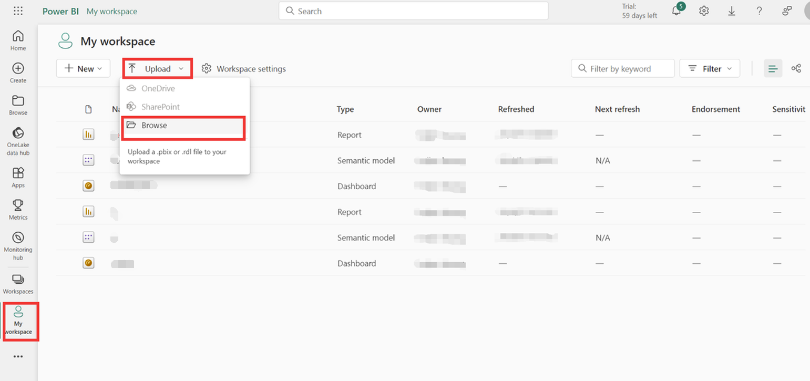

4. 点击模型配置自动刷新时间

   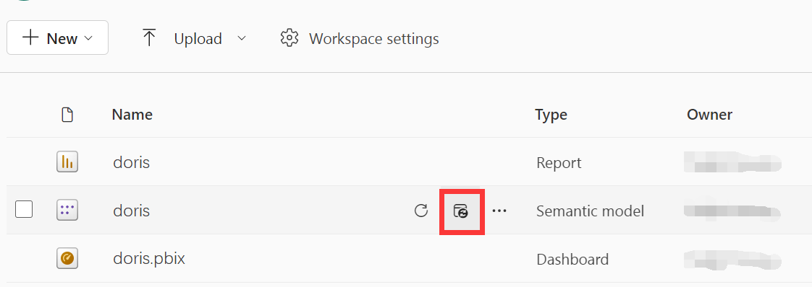

5. 数据刷新的配置需要有gataway连接，本地开启网关后可以在网关连接中看到本地启动的网关，选取本地的网关即可。更多关于gateway：https://learn.microsoft.com/zh-cn/power-bi/connect-data/service-gateway-onprem

   

6. 配置相关刷新计划即可完成 Power BI自动数据刷新

   


---
{
   "title": "Tableau",
   "language": "zh-CN"
}
---

### Tableau
<!--
Licensed to the Apache Software Foundation (ASF) under one
or more contributor license agreements.  See the NOTICE file
distributed with this work for additional information
regarding copyright ownership.  The ASF licenses this file
to you under the Apache License, Version 2.0 (the
"License"); you may not use this file except in compliance
with the License.  You may obtain a copy of the License at

  http://www.apache.org/licenses/LICENSE-2.0

Unless required by applicable law or agreed to in writing,
software distributed under the License is distributed on an
"AS IS" BASIS, WITHOUT WARRANTIES OR CONDITIONS OF ANY
KIND, either express or implied.  See the License for the
specific language governing permissions and limitations
under the License.
-->


#### 介绍
Tableau 是一款轻量级数据可视化分析平台，它将数据运算与美观的图表完美地结合在一起，不要求用户编写代码，仅仅通过拖拽的方式就可以快速洞察数据；探索不同的视图，甚至可以轻松地将多个数据源组合在一起，完成数据展示、探索和分析工作。
#### 前置条件
Tableau Desktop 可通过如下链接进行下载：https://www.tableau.com/products/desktop/download
#### 驱动安装
1. iODBC 安装
    1. 关闭 Tableau Desktop
    2. 安装 iODBC Driver Manager，可从 iODBC.org 网站获取最新版本 (mxkozzz.dmg)
    3. 安装下载的dmg文件
2. MySQL 驱动安装

选择 MySQL 5.x 的 ODBC 驱动安装，最新的 MySQL 驱动连接 Doris 会报错 Unsupported command 错误。
#### 连接配置与使用
1. 点击 Tableau Desktop 主页，在连接数据源处选择MySQL

   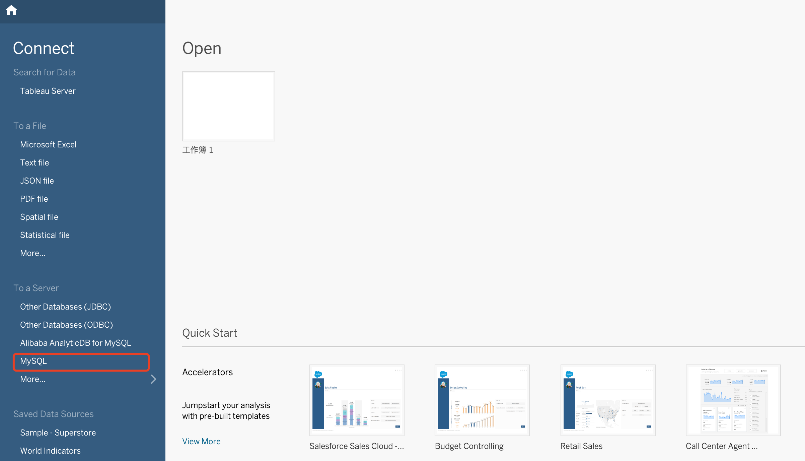

2. 填写 Doris 服务器地址，端口等相关信息，正确填写后点击登录即可。

   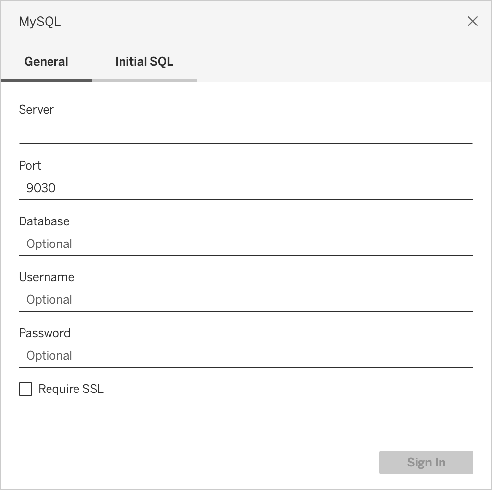

3. 进入 Tableau 后选择对应的库表即可进行相关的罗盘处理。

   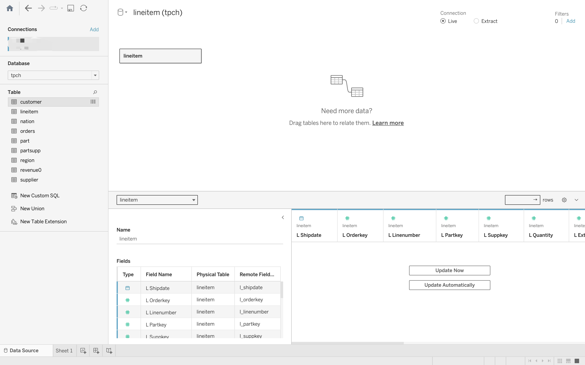

---
{
    "title": "QuickSight",
    "language": "zh-CN"
}
---

### QuickSight
<!--
Licensed to the Apache Software Foundation (ASF) under one
or more contributor license agreements.  See the NOTICE file
distributed with this work for additional information
regarding copyright ownership.  The ASF licenses this file
to you under the Apache License, Version 2.0 (the
"License"); you may not use this file except in compliance
with the License.  You may obtain a copy of the License at

  http://www.apache.org/licenses/LICENSE-2.0

Unless required by applicable law or agreed to in writing,
software distributed under the License is distributed on an
"AS IS" BASIS, WITHOUT WARRANTIES OR CONDITIONS OF ANY
KIND, either express or implied.  See the License for the
specific language governing permissions and limitations
under the License.
-->


#### QuickSight 介绍
QuickSight 是一个强大的数据可视化分析平台，致力于将数据计算与美观的图表完美融合。它不要求用户具备编程技能，仅需通过拖放操作，就能迅速获取数据洞察。QuickSight 提供了多种视图选项，方便用户从不同角度探索数据。此外，它还支持轻松整合多个数据源，使得数据展示、探索和分析变得更加简单高效。这个平台不仅让数据处理变得快捷，还使分析过程更加直观和易于理解，极大地提升了用户的工作效率和分析能力。

#### 数据配置

1. 注册账号后登录 QuickSight，然后选择数据集。

   

2. 在数据集选择的页面中选择 MySQL。

   

3. 在数据连接页面中填写对应 Doris 的 IP、端口、数据库名称、登录的用户名和密码。填写后点击连接测试，测试成功后创建链接。

   

4. 创建数据源之后选择需要产生看板的表。

   

5. QuickSight 有两种导入表的方式，可以根据自己的需求选择对应的导入方式。

   

6. 导入表之后，即可以创建所需要的看板。

   


---
{
"title": "Quick BI",
"language": "zh-CN"
}
---

### Quick BI
<!--
Licensed to the Apache Software Foundation (ASF) under one
or more contributor license agreements.  See the NOTICE file
distributed with this work for additional information
regarding copyright ownership.  The ASF licenses this file
to you under the Apache License, Version 2.0 (the
"License"); you may not use this file except in compliance
with the License.  You may obtain a copy of the License at
  http://www.apache.org/licenses/LICENSE-2.0
Unless required by applicable law or agreed to in writing,
software distributed under the License is distributed on an
"AS IS" BASIS, WITHOUT WARRANTIES OR CONDITIONS OF ANY
KIND, either express or implied.  See the License for the
specific language governing permissions and limitations
under the License.
-->

#### Quick BI介绍
Quick BI 是一款基于数据仓库的商业智能工具，它可以帮助企业快速搭建起酷炫的可视化分析罗盘。Quick BI 支持多种数据源，包括 MySQL、Oracle、SQL Server、Apache Doris 等数据库，以及 Excel、CSV、JSON 等文件格式。它提供了丰富的可视化组件，如表格、图表、地图等，用户可以通过简单的拖拽操作，轻松实现数据的可视化分析。
#### 数据连接与应用
1. 登录 Quick BI 并建立一个工作区。
2. 在当前的工作区下点击新建数据源

   

3. 在新建的数据源中选择 Apache Doris ，并填写对应 Doris 的连接信息。

   

4. 连接成功后，可在数据源列表中看到我们创建的数据源。

   

5. 在创建的数据源中创建一个数据集，此处以 TPC-H 数据集为例。创建数据集后即可设置对应的报表。

   


---
{
    "title": "Smartbi",
    "language": "zh-CN"
}
---

### Smartbi
<!--
Licensed to the Apache Software Foundation (ASF) under one
or more contributor license agreements.  See the NOTICE file
distributed with this work for additional information
regarding copyright ownership.  The ASF licenses this file
to you under the Apache License, Version 2.0 (the
"License"); you may not use this file except in compliance
with the License.  You may obtain a copy of the License at

  http://www.apache.org/licenses/LICENSE-2.0

Unless required by applicable law or agreed to in writing,
software distributed under the License is distributed on an
"AS IS" BASIS, WITHOUT WARRANTIES OR CONDITIONS OF ANY
KIND, either express or implied.  See the License for the
specific language governing permissions and limitations
under the License.
-->

#### Smartbi 介绍

Smartbi 是软件服务、应用连接器的集合，其可以连接到多种数据源，包括 Oracle、SQL Server、MySQL 和 Doris 等，以便用户可以轻松地整合和清洗数据。借助 Smartbi 的数据建模功能，用户不仅可以创建复杂的关系模型，还能编写数据分析表达式并建立数据关系，从而为高级的数据分析和可视化奠定基础。Smartbi 提供了丰富多样的可视化选项，包括各种类型的图表、地理地图、交互式仪表板，以及支持用户自定义的可视化工具。这些功能强大的工具帮助用户更直观、更全面地理解和展示他们的数据，提升数据分析的效果和效率。

#### 数据连接与应用

1. 登录 Smartbi 之后点击数据连接。

   

2. 在数据连接页面中可以看到各个待连接的数据库列表，选择 Doris 数据库。

   

3. 在选择数据库之后，填写 Doris 数据库的连接信息。

   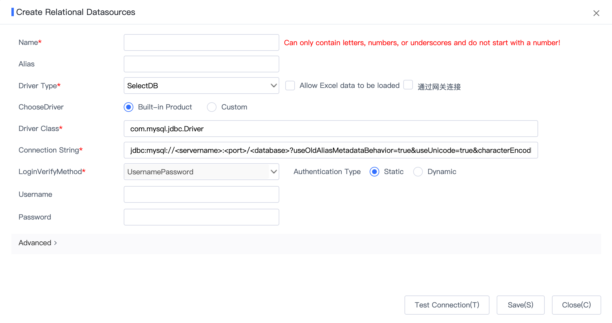

4. 若填写信息无误，且连接成功后会显示测试通过。

   

5. 连接成功后，在数据分析模块电子服务看板，可以自定义设置所需要的报表信息。

   


# 常见问题

---
{
    "title": "常见运维问题",
    "language": "zh-CN"
}
---

## 常见运维问题
<!--
Licensed to the Apache Software Foundation (ASF) under one
or more contributor license agreements.  See the NOTICE file
distributed with this work for additional information
regarding copyright ownership.  The ASF licenses this file
to you under the Apache License, Version 2.0 (the
"License"); you may not use this file except in compliance
with the License.  You may obtain a copy of the License at

  http://www.apache.org/licenses/LICENSE-2.0

Unless required by applicable law or agreed to in writing,
software distributed under the License is distributed on an
"AS IS" BASIS, WITHOUT WARRANTIES OR CONDITIONS OF ANY
KIND, either express or implied.  See the License for the
specific language governing permissions and limitations
under the License.
-->


本文档主要用于记录 Doris 使用过程中的运维常见问题。会不定期更新。

**文中的出现的 BE 二进制文件名称 `doris_be`，在之前的版本中为 `palo_be`。**

#### Q1. 通过 DECOMMISSION 下线 BE 节点时，为什么总会有部分 tablet 残留？

在下线过程中，通过 show backends 查看下线节点的 tabletNum，会观察到 tabletNum 数量在减少，说明数据分片正在从这个节点迁移走。当数量减到 0 时，系统会自动删除这个节点。但某些情况下，tabletNum 下降到一定数值后就不变化。这通常可能有以下两种原因：

1. 这些 tablet 属于刚被删除的表、分区或物化视图。而刚被删除的对象会保留在回收站中。而下线逻辑不会处理这些分片。可以通过修改 FE 的配置参数 catalog_trash_expire_second 来修改对象在回收站中驻留的时间。当对象从回收站中被删除后，这些 tablet 就会被处理了。

2. 这些 tablet 的迁移任务出现了问题。此时需要通过 `show proc "/cluster_balance"` 来查看具体任务的错误了。

对于以上情况，可以先通过 `show proc "/cluster_health/tablet_health";` 查看集群是否还有 unhealthy 的分片，如果为 0，则可以直接通过 drop backend 语句删除这个 BE。否则，还需要具体查看不健康分片的副本情况。

#### Q2. priorty_network 应该如何设置？

priorty_network 是 FE、BE 都有的配置参数。这个参数主要用于帮助系统选择正确的网卡 IP 作为自己的 IP。建议任何情况下，都显式的设置这个参数，以防止后续机器增加新网卡导致 IP 选择不正确的问题。

priorty_network 的值是 CIDR 格式表示的。分为两部分，第一部分是点分十进制的 IP 地址，第二部分是一个前缀长度。比如 10.168.1.0/8 会匹配所有 10.xx.xx.xx 的 IP 地址，而 10.168.1.0/16 会匹配所有 10.168.xx.xx 的 IP 地址。

之所以使用 CIDR 格式而不是直接指定一个具体 IP，是为了保证所有节点都可以使用统一的配置值。比如有两个节点：10.168.10.1 和 10.168.10.2，则我们可以使用 10.168.10.0/24 来作为 priorty_network 的值。

#### Q3. FE 的 Master、Follower、Observer 都是什么？

首先明确一点，FE 只有两种角色：Follower 和 Observer。而 Master 只是一组 Follower 节点中选择出来的一个 FE。Master 可以看成是一种特殊的 Follower。所以当我们被问及一个集群有多少 FE，都是什么角色时，正确的回答当时应该是所有 FE 节点的个数，以及 Follower 角色的个数和 Observer 角色的个数。

所有 Follower 角色的 FE 节点会组成一个可选择组，类似 Paxos 一致性协议里的组概念。组内会选举出一个 Follower 作为 Master。当 Master 挂了，会自动选择新的 Follower 作为 Master。而 Observer 不会参与选举，因此 Observer 也不会成为 Master。

一条元数据日志需要在多数 Follower 节点写入成功，才算成功。比如 3 个 FE，2 个写入成功才可以。这也是为什么 Follower 角色的个数需要是奇数的原因。

Observer 角色和这个单词的含义一样，仅仅作为观察者来同步已经成功写入的元数据日志，并且提供元数据读服务。他不会参与多数写的逻辑。

通常情况下，可以部署 1 Follower + 2 Observer 或者 3 Follower + N Observer。前者运维简单，几乎不会出现 Follower 之间的一致性协议导致这种复杂错误情况（企业大多使用这种方式）。后者可以保证元数据写的高可用，如果是高并发查询场景，可以适当增加 Observer。

#### Q4. 节点新增加了新的磁盘，为什么数据没有均衡到新的磁盘上？

当前 Doris 的均衡策略是以节点为单位的。也就是说，是按照节点整体的负载指标（分片数量和总磁盘利用率）来判断集群负载。并且将数据分片从高负载节点迁移到低负载节点。如果每个节点都增加了一块磁盘，则从节点整体角度看，负载并没有改变，所以无法触发均衡逻辑。

此外，Doris 目前并不支持单个节点内部，各个磁盘间的均衡操作。所以新增磁盘后，不会将数据均衡到新的磁盘。

但是，数据在节点之间迁移时，Doris 会考虑磁盘的因素。比如一个分片从 A 节点迁移到 B 节点，会优先选择 B 节点中，磁盘空间利用率较低的磁盘。

这里我们提供 3 种方式解决这个问题：

1. 重建新表

   通过 create table like 语句建立新表，然后使用 insert into select 的方式将数据从老表同步到新表。因为创建新表时，新表的数据分片会分布在新的磁盘中，从而数据也会写入新的磁盘。这种方式适用于数据量较小的情况（几十 GB 以内）。

2. 通过 Decommission 命令

   decommission 命令用于安全下线一个 BE 节点。该命令会先将该节点上的数据分片迁移到其他节点，然后在删除该节点。前面说过，在数据迁移时，会优先考虑磁盘利用率低的磁盘，因此该方式可以“强制”让数据迁移到其他节点的磁盘上。当数据迁移完成后，我们在 cancel 掉这个 decommission 操作，这样，数据又会重新均衡回这个节点。当我们对所有 BE 节点都执行一遍上述步骤后，数据将会均匀的分布在所有节点的所有磁盘上。

   注意，在执行 decommission 命令前，先执行以下命令，以避免节点下线完成后被删除。

   `admin set frontend config("drop_backend_after_decommission" = "false");`

3. 使用 API 手动迁移数据

   Doris 提供了[HTTP API](https://doris.apache.org/docs/dev/admin-manual/be/tablet-migration)，可以手动指定一个磁盘上的数据分片迁移到另一个磁盘上。

#### Q5. 如何正确阅读 FE/BE 日志？

很多情况下我们需要通过日志来排查问题。这里说明一下 FE/BE 日志的格式和查看方式。

1. FE

   FE 日志主要有：

   - fe.log：主日志。包括除 fe.out 外的所有内容。

   - fe.warn.log：主日志的子集，仅记录 WARN 和 ERROR 级别的日志。

   - fe.out：标准/错误输出的日志（stdout 和 stderr）。

   - fe.audit.log：审计日志，记录这个 FE 接收的所有 SQL 请求。

   一条典型的 FE 日志如下：

```text
   2021-09-16 23:13:22,502 INFO (tablet scheduler|43) [BeLoadRebalancer.selectAlternativeTabletsForCluster():85] cluster is balance: default_cluster with medium: HDD. skip
```

   - `2021-09-16 23:13:22,502`：日志时间。

   - `INFO：日志级别，默认是INFO`。

   - `(tablet scheduler|43)`：线程名称和线程 id。通过线程 id，就可以查看这个线程上下文信息，方面排查这个线程发生的事情。

   - `BeLoadRebalancer.selectAlternativeTabletsForCluster():85`：类名、方法名和代码行号。

   - `cluster is balance xxx`：日志内容。

   通常情况下我们主要查看 fe.log 日志。特殊情况下，有些日志可能输出到了 fe.out 中。

2. BE

   BE 日志主要有：

   - be.INFO：主日志。这其实是个软连，连接到最新的一个 be.INFO.xxxx 上。

   - be.WARNING：主日志的子集，仅记录 WARN 和 FATAL 级别的日志。这其实是个软连，连接到最新的一个 be.WARN.xxxx 上。

   - be.out：标准/错误输出的日志（stdout 和 stderr）。

   一条典型的 BE 日志如下：

```text
   I0916 23:21:22.038795 28087 task_worker_pool.cpp:1594] finish report TASK. master host: 10.10.10.10, port: 9222
```

   - `I0916 23:21:22.038795`：日志等级和日期时间。大写字母 I 表示 INFO，W 表示 WARN，F 表示 FATAL。

   - `28087`：线程 id。通过线程 id，就可以查看这个线程上下文信息，方面排查这个线程发生的事情。

   - `task_worker_pool.cpp:1594`：代码文件和行号。

   - `finish report TASK xxx`：日志内容。

   通常情况下我们主要查看 be.INFO 日志。特殊情况下，如 BE 宕机，则需要查看 be.out。

#### Q6. FE/BE 节点挂了应该如何排查原因？

1. BE

   BE 进程是 C/C++ 进程，可能会因为一些程序 Bug（内存越界，非法地址访问等）或 Out Of Memory（OOM）导致进程挂掉。此时我们可以通过以下几个步骤查看错误原因：

   1. 查看 be.out

      BE 进程实现了在程序因异常情况退出时，会打印当前的错误堆栈到 be.out 里（注意是 be.out，不是 be.INFO 或 be.WARNING）。通过错误堆栈，通常能够大致获悉程序出错的位置。

      注意，如果 be.out 中出现错误堆栈，通常情况下是因为程序 bug，普通用户可能无法自行解决，欢迎前往微信群、github discussion 或 dev 邮件组寻求帮助，并贴出对应的错误堆栈，以便快速排查问题。

   2. dmesg

      如果 be.out 没有堆栈信息，则大概率是因为 OOM 被系统强制 kill 掉了。此时可以通过 dmesg -T 这个命令查看 linux 系统日志，如果最后出现 Memory cgroup out of memory: Kill process 7187 (doris_be) score 1007 or sacrifice child 类似的日志，则说明是 OOM 导致的。

      内存问题可能有多方面原因，如大查询、导入、compaction 等。Doris 也在不断优化内存使用。欢迎前往微信群、github discussion 或 dev 邮件组寻求帮助。

   3. 查看 be.INFO 中是否有 F 开头的日志。

      F 开头的日志是 Fatal 日志。如 F0916，表示 9 月 16 号的 Fatal 日志。Fatal 日志通常表示程序断言错误，断言错误会直接导致进程退出（说明程序出现了 Bug）。欢迎前往微信群、github discussion 或 dev 邮件组寻求帮助。

2. FE

   FE 是 java 进程，健壮程度要优于 C/C++ 程序。通常 FE 挂掉的原因可能是 OOM（Out-of-Memory）或者是元数据写入失败。这些错误通常在 fe.log 或者 fe.out 中有错误堆栈。需要根据错误堆栈信息进一步排查。

#### Q7. 关于数据目录 SSD 和 HDD 的配置，建表有时候会遇到报错`Failed to find enough host with storage medium and tag`

Doris 支持一个 BE 节点配置多个存储路径。通常情况下，每块盘配置一个存储路径即可。同时，Doris 支持指定路径的存储介质属性，如 SSD 或 HDD。SSD 代表高速存储设备，HDD 代表低速存储设备。

如果集群只有一种介质比如都是 HDD 或者都是 SSD，最佳实践是不用在 be.conf 中显式指定介质属性。如果遇到上述报错```Failed to find enough host with storage medium and tag```，一般是因为 be.conf 中只配置了 SSD 的介质，而建表阶段中显式指定了```properties {"storage_medium" = "hdd"}```；同理如果 be.conf 只配置了 HDD 的介质，而而建表阶段中显式指定了```properties {"storage_medium" = "ssd"}```也会出现上述错误。解决方案可以修改建表的 properties 参数与配置匹配；或者将 be.conf 中 SSD/HDD 的显式配置去掉即可。

通过指定路径的存储介质属性，我们可以利用 Doris 的冷热数据分区存储功能，在分区级别将热数据存储在 SSD 中，而冷数据会自动转移到 HDD 中。

需要注意的是，Doris 并不会自动感知存储路径所在磁盘的实际存储介质类型。这个类型需要用户在路径配置中显式的表示。比如路径 "/path/to/data1.SSD" 即表示这个路径是 SSD 存储介质。而 "data1.SSD" 就是实际的目录名称。Doris 是根据目录名称后面的 ".SSD" 后缀来确定存储介质类型的，而不是实际的存储介质类型。也就是说，用户可以指定任意路径为 SSD 存储介质，而 Doris 仅识别目录后缀，不会去判断存储介质是否匹配。如果不写后缀，则默认为 HDD。

换句话说，".HDD" 和 ".SSD" 只是用于标识存储目录“相对”的“低速”和“高速”之分，而并不是标识实际的存储介质类型。所以如果 BE 节点上的存储路径没有介质区别，则无需填写后缀。

#### Q8. 多个 FE，在使用 Nginx 实现 web UI 负载均衡时，无法登录

Doris 可以部署多个 FE，在访问 Web UI 的时候，如果使用 Nginx 进行负载均衡，因为 Session 问题会出现不停的提示要重新登录，这个问题其实是 Session 共享的问题，Nginx 提供了集中 Session 共享的解决方案，这里我们使用的是 nginx 中的 ip_hash 技术，ip_hash 能够将某个 ip 的请求定向到同一台后端，这样一来这个 ip 下的某个客户端和某个后端就能建立起稳固的 session，ip_hash 是在 upstream 配置中定义的：

```text
upstream  doris.com {
   server    172.22.197.238:8030 weight=3;
   server    172.22.197.239:8030 weight=4;
   server    172.22.197.240:8030 weight=4;
   ip_hash;
}
```

完整的 Nginx 示例配置如下：

```text
user nginx;
worker_processes auto;
error_log /var/log/nginx/error.log;
pid /run/nginx.pid;


include /usr/share/nginx/modules/*.conf;

events {
    worker_connections 1024;
}

http {
    log_format  main  '$remote_addr - $remote_user [$time_local] "$request" '
                      '$status $body_bytes_sent "$http_referer" '
                      '"$http_user_agent" "$http_x_forwarded_for"';

    access_log  /var/log/nginx/access.log  main;

    sendfile            on;
    tcp_nopush          on;
    tcp_nodelay         on;
    keepalive_timeout   65;
    types_hash_max_size 2048;

    include             /etc/nginx/mime.types;
    default_type        application/octet-stream;

    # Load modular configuration files from the /etc/nginx/conf.d directory.
    # See http://nginx.org/en/docs/ngx_core_module.html#include
    # for more information.
    include /etc/nginx/conf.d/*.conf;
    #include /etc/nginx/custom/*.conf;
    upstream  doris.com {
      server    172.22.197.238:8030 weight=3;
      server    172.22.197.239:8030 weight=4;
      server    172.22.197.240:8030 weight=4;
      ip_hash;
    }

    server {
        listen       80;
        server_name  gaia-pro-bigdata-fe02;
        if ($request_uri ~ _load) {
           return 307 http://$host$request_uri ;
        }

        location / {
            proxy_pass http://doris.com;
            proxy_redirect default;
        }
        error_page   500 502 503 504  /50x.html;
        location = /50x.html {
            root   html;
        }
    }
 }
```

#### Q9. FE 启动失败，fe.log 中一直滚动 "wait catalog to be ready. FE type UNKNOWN"

这种问题通常有两个原因：

1. 本次 FE 启动时获取到的本机 IP 和上次启动不一致，通常是因为没有正确设置 `priority_network` 而导致 FE 启动时匹配到了错误的 IP 地址。需修改 `priority_network` 后重启 FE。

2. 集群内多数 Follower FE 节点未启动。比如有 3 个 Follower，只启动了一个。此时需要将另外至少一个 FE 也启动，FE 可选举组方能选举出 Master 已提供服务。

如果以上情况都不能解决，可以按照 Doris 官网文档中的[元数据运维文档](#)进行恢复。

#### Q10. Lost connection to MySQL server at 'reading initial communication packet', system error: 0

如果使用 MySQL 客户端连接 Doris 时出现如下问题，这通常是因为编译 FE 时使用的 jdk 版本和运行 FE 时使用的 jdk 版本不同导致的。注意使用 docker 编译镜像编译时，默认的 JDK 版本是 openjdk 11，可以通过命令切换到 openjdk 8（详见编译文档）。

#### Q11. recoveryTracker should overlap or follow on disk last VLSN of 4,422,880 recoveryFirst= 4,422,882 UNEXPECTED_STATE_FATAL

有时重启 FE，会出现如上错误（通常只会出现在多 Follower 的情况下）。并且错误中的两个数值相差 2。导致 FE 启动失败。

这是 bdbje 的一个 bug，尚未解决。遇到这种情况，只能通过[元数据运维文档](#) 中的 故障恢复 进行操作来恢复元数据了。

#### Q12. Doris 编译安装 JDK 版本不兼容问题

在自己使用 Docker 编译 Doris 的时候，编译完成安装以后启动 FE，出现 `java.lang.Suchmethoderror: java.nio. ByteBuffer. limit (I)Ljava/nio/ByteBuffer;` 异常信息，这是因为 Docker 里默认是 JDK 11，如果你的安装环境是使用 JDK8，需要在 Docker 里 JDK 环境切换成 JDK8，具体切换方法参照[编译文档](https://doris.apache.org/zh-CN/community/source-install/compilation-with-docker)

#### Q13. 本地启动 FE 或者启动单元测试报错 Cannot find external parser table action_table.dat
执行如下命令
```
cd fe && mvn clean install -DskipTests
```
如果还报同样的错误，手动执行如下命令
```
cp fe-core/target/generated-sources/cup/org/apache/doris/analysis/action_table.dat fe-core/target/classes/org/apache/doris/analysis
```

#### Q14. Doris 升级到 1.0 以后版本通过 ODBC 访问 MySQL 外表报错 `Failed to set ciphers to use (2026)`
这个问题出现在 doris 升级到 1.0 版本以后，且使用 Connector/ODBC 8.0.x 以上版本，Connector/ODBC 8.0.x 有多种获取方式，比如通过 yum 安装的方式获取的 `/usr/lib64/libmyodbc8w.so` 依赖的是 `libssl.so.10` 和 `libcrypto.so.10`
而 doris 1.0 以后版本中 openssl 已经升级到 1.1 且内置在 doris 二进制包中，因此会导致 openssl 的冲突进而出现 类似 如下的错误
```
ERROR 1105 (HY000): errCode = 2, detailMessage = driver connect Error: HY000 [MySQL][ODBC 8.0(w) Driver]SSL connection error: Failed to set ciphers to use (2026)
```
解决方式是使用`Connector/ODBC 8.0.28` 版本的 ODBC Connector，并且在操作系统处选择 `Linux - Generic`, 这个版本的 ODBC Driver 使用 openssl 1.1 版本。或者使用低版本的 ODBC Connector，比如[Connector/ODBC 5.3.14](https://dev.mysql.com/downloads/connector/odbc/5.3.html)。具体使用方式见 [ODBC 外表使用文档](https://doris.apache.org/zh-CN/docs/1.2/lakehouse/external-table/odbc)。

可以通过如下方式验证 MySQL ODBC Driver 使用的 openssl 版本

```
ldd /path/to/libmyodbc8w.so |grep libssl.so
```
如果输出包含 `libssl.so.10` 则使用过程中可能出现问题，如果包含`libssl.so.1.1` 则与 doris 1.0 兼容

#### Q15. 升级到 1.2 版本，BE NoClassDefFoundError 问题启动失败


> Java UDF 依赖错误从 Doris 1.2 版本后开始支持


如果升级后启动 be 出现下面这种 Java `NoClassDefFoundError` 错误

```
Exception in thread "main" java.lang.NoClassDefFoundError: org/apache/doris/udf/JniUtil
Caused by: java.lang.ClassNotFoundException: org.apache.doris.udf.JniUtil
```
需要从官网下载 `apache-doris-java-udf-jar-with-dependencies-1.2.0` 的 Java UDF 函数依赖包，放到 BE 安装目录下的 lib 目录，然后重新启动 BE

#### Q16. 升级到 1.2 版本，BE 启动显示 Failed to initialize JNI 问题


> Java 环境问题从 Doris 1.2 版本后开始支持


如果升级后启动 BE 出现下面这种 `Failed to initialize JNI` 错误

```
Failed to initialize JNI: Failed to find the library libjvm.so.
```
需要在系统设置 `JAVA_HOME` 环境变量，或者在 be.conf 中设置 `JAVA_HOME` 变量，然后重新启动 BE 节点。


---
{
    "title": "数据操作问题",
    "language": "zh-CN"
}
---

## 数据操作问题
<!--
Licensed to the Apache Software Foundation (ASF) under one
or more contributor license agreements.  See the NOTICE file
distributed with this work for additional information
regarding copyright ownership.  The ASF licenses this file
to you under the Apache License, Version 2.0 (the
"License"); you may not use this file except in compliance
with the License.  You may obtain a copy of the License at

  http://www.apache.org/licenses/LICENSE-2.0

Unless required by applicable law or agreed to in writing,
software distributed under the License is distributed on an
"AS IS" BASIS, WITHOUT WARRANTIES OR CONDITIONS OF ANY
KIND, either express or implied.  See the License for the
specific language governing permissions and limitations
under the License.
-->


本文档主要用于记录 Doris 使用过程中的数据操作常见问题。会不定期更新。

#### Q1. 使用 Stream Load 访问 FE 的公网地址导入数据，被重定向到内网 IP？

当 stream load 的连接目标为 FE 的 http 端口时，FE 仅会随机选择一台 BE 节点做 http 307 redirect 操作，因此用户的请求实际是发送给 FE 指派的某一个 BE 的。而 redirect 返回的是 BE 的 ip，也即内网 IP。所以如果你是通过 FE 的公网 IP 发送的请求，很有可能因为 redirect 到内网地址而无法连接。

通常的做法，一种是确保自己能够访问内网 IP 地址，或者是给所有 BE 上层架设一个负载均衡，然后直接将 stream load 请求发送到负载均衡器上，由负载均衡将请求透传到 BE 节点。

#### Q2. Doris 是否支持修改列名？

在 1.2.0 版本之后，开启 `"light_schema_change"="true"` 选项时，可以支持修改列名。

在 1.2.0 版本之前或未开启 `"light_schema_change"="true"` 选项时，不支持修改列名，原因如下：

Doris 支持修改数据库名、表名、分区名、物化视图（Rollup）名称，以及列的类型、注释、默认值等等。但遗憾的是，目前不支持修改列名。

因为一些历史原因，目前列名称是直接写入到数据文件中的。Doris 在查询时，也是通过列名查找到对应的列的。所以修改列名不仅是简单的元数据修改，还会涉及到数据的重写，是一个非常重的操作。

我们不排除后续通过一些兼容手段来支持轻量化的列名修改操作。

#### Q3. Unique Key 模型的表是否支持创建物化视图？

不支持。

Unique Key 模型的表是一个对业务比较友好的表，因为其特有的按照主键去重的功能，能够很方便的同步数据频繁变更的业务数据库。因此，很多用户在将数据接入到 Doris 时，会首先考虑使用 Unique Key 模型。

但遗憾的是，Unique Key 模型的表是无法建立物化视图的。原因在于，物化视图的本质，是通过预计算来将数据“预先算好”，这样在查询时直接返回已经计算好的数据，来加速查询。在物化视图中，“预计算”的数据通常是一些聚合指标，比如求和、求 count。这时，如果数据发生变更，如 update 或 delete，因为预计算的数据已经丢失了明细信息，因此无法同步的进行更新。比如一个求和值 5，可能是 1+4，也可能是 2+3。因为明细信息的丢失，我们无法区分这个求和值是如何计算出来的，因此也就无法满足更新的需求。

#### Q4. tablet writer write failed, tablet_id=27306172, txn_id=28573520, err=-235 or -238

这个错误通常发生在数据导入操作中。错误码为 -235。这个错误的含义是，对应 tablet 的数据版本超过了最大限制（默认 500，由 BE 参数 `max_tablet_version_num` 控制），后续写入将被拒绝。比如问题中这个错误，即表示 27306172 这个 tablet 的数据版本超过了限制。

这个错误通常是因为导入的频率过高，大于后台数据的 compaction 速度，导致版本堆积并最终超过了限制。此时，我们可以先通过 show tablet 27306172 语句，然后执行结果中的 show proc 语句，查看 tablet 各个副本的情况。结果中的 versionCount 即表示版本数量。如果发现某个副本的版本数量过多，则需要降低导入频率或停止导入，并观察版本数是否有下降。如果停止导入后，版本数依然没有下降，则需要去对应的 BE 节点查看 be.INFO 日志，搜索 tablet id 以及 compaction 关键词，检查 compaction 是否正常运行。关于 compaction 调优相关，可以参阅 ApacheDoris 公众号文章：[Doris 最佳实践-Compaction 调优 (3)](https://mp.weixin.qq.com/s/cZmXEsNPeRMLHp379kc2aA)

-238 错误通常出现在同一批导入数据量过大的情况，从而导致某一个 tablet 的 Segment 文件过多（默认是 200，由 BE 参数 `max_segment_num_per_rowset` 控制）。此时建议减少一批次导入的数据量，或者适当提高 BE 配置参数值来解决。在 2.0 版本及以后，可以通过打开 segment compaction 功能来减少 Segment 文件数量 (BE config 中 `enable_segcompaction=true`)。

#### Q5. tablet 110309738 has few replicas: 1, alive backends: [10003]

这个错误可能发生在查询或者导入操作中。通常意味着对应 tablet 的副本出现了异常。

此时，可以先通过 show backends 命令检查 BE 节点是否有宕机，如 isAlive 字段为 false，或者 LastStartTime 是最近的某个时间（表示最近重启过）。如果 BE 有宕机，则需要去 BE 对应的节点，查看 be.out 日志。如果 BE 是因为异常原因宕机，通常 be.out 中会打印异常堆栈，帮助排查问题。如果 be.out 中没有错误堆栈。则可以通过 linux 命令 dmesg -T 检查是否是因为 OOM 导致进程被系统 kill 掉。

如果没有 BE 节点宕机，则需要通过 show tablet 110309738 语句，然后执行结果中的 show proc 语句，查看 tablet 各个副本的情况，进一步排查。

#### Q6. disk xxxxx on backend xxx exceed limit usage

通常出现在导入、Alter 等操作中。这个错误意味着对应 BE 的对应磁盘的使用量超过了阈值（默认 95%）此时可以先通过 show backends 命令，其中 MaxDiskUsedPct 展示的是对应 BE 上，使用率最高的那块磁盘的使用率，如果超过 95%，则会报这个错误。

此时需要前往对应 BE 节点，查看数据目录下的使用量情况。其中 trash 目录和 snapshot 目录可以手动清理以释放空间。如果是 data 目录占用较大，则需要考虑删除部分数据以释放空间了。具体可以参阅[磁盘空间管理](#磁盘空间管理)。

#### Q7. 通过 Java 程序调用 stream load 导入数据，在一批次数据量较大时，可能会报错 Broken Pipe

除了 Broken Pipe 外，还可能出现一些其他的奇怪的错误。

这个情况通常出现在开启 httpv2 后。因为 httpv2 是使用 spring boot 实现的 http 服务，并且使用 tomcat 作为默认内置容器。但是 tomcat 对 307 转发的处理似乎有些问题，所以后面将内置容器修改为了 jetty。此外，在 java 程序中的 apache http client 的版本需要使用 4.5.13 以后的版本。之前的版本，对转发的处理也存在一些问题。

所以这个问题可以有两种解决方式：

1. 关闭 httpv2

   在 fe.conf 中添加 enable_http_server_v2=false 后重启 FE。但是这样无法再使用新版 UI 界面，并且之后的一些基于 httpv2 的新接口也无法使用。（正常的导入查询不受影响）。

2. 升级

   可以升级到 Doris 0.15 及之后的版本，已修复这个问题。

#### Q8. 执行导入、查询时报错 -214

在执行导入、查询等操作时，可能会遇到如下错误：

```text
failed to initialize storage reader. tablet=63416.1050661139.aa4d304e7a7aff9c-f0fa7579928c85a0, res=-214, backend=192.168.100.10
```

-214 错误意味着对应 tablet 的数据版本缺失。比如如上错误，表示 tablet 63416 在 192.168.100.10 这个 BE 上的副本的数据版本有缺失。（可能还有其他类似错误码，都可以用如下方式进行排查和修复）。

通常情况下，如果你的数据是多副本的，那么系统会自动修复这些有问题的副本。可以通过以下步骤进行排查：

首先通过 `show tablet 63416` 语句并执行结果中的 `show proc xxx` 语句来查看对应 tablet 的各个副本情况。通常我们需要关心 `Version` 这一列的数据。

正常情况下，一个 tablet 的多个副本的 Version 应该是相同的。并且和对应分区的 VisibleVersion 版本相同。

你可以通过 `show partitions from tblx` 来查看对应的分区版本（tablet 对应的分区可以在 `show tablet` 语句中获取。）

同时，你也可以访问 `show proc` 语句中的 CompactionStatus 列中的 URL（在浏览器打开即可）来查看更具体的版本信息，来检查具体丢失的是哪些版本。

如果长时间没有自动修复，则需要通过 `show proc "/cluster_balance"` 语句，查看当前系统正在执行的 tablet 修复和调度任务。可能是因为有大量的 tablet 在等待被调度，导致修复时间较长。可以关注 `pending_tablets` 和 `running_tablets` 中的记录。

更进一步的，可以通过 `admin repair` 语句来指定优先修复某个表或分区，具体可以参阅 `help admin repair`;

如果依然无法修复，那么在多副本的情况下，我们使用 `admin set replica status` 命令强制将有问题的副本下线。具体可参阅 `help admin set replica status` 中将副本状态置为 bad 的示例。（置为 bad 后，副本将不会再被访问。并且会后续自动修复。但在操作前，应先确保其他副本是正常的）

#### Q9. Not connected to 192.168.100.1:8060 yet, server_id=384

在导入或者查询时，我们可能遇到这个错误。如果你去对应的 BE 日志中查看，也可能会找到类似错误。

这是一个 RPC 错误，通常有两种可能：1. 对应的 BE 节点宕机。2. rpc 拥塞或其他错误。

如果是 BE 节点宕机，则需要查看具体的宕机原因。这里只讨论 rpc 拥塞的问题。

一种情况是 OVERCROWDED，即表示 rpc 源端有大量未发送的数据超过了阈值。BE 有两个参数与之相关：

1. `brpc_socket_max_unwritten_bytes`：默认 1GB，如果未发送数据超过这个值，则会报错。可以适当修改这个值以避免 OVERCROWDED 错误。（但这个治标不治本，本质上还是有拥塞发生）。
2. `tablet_writer_ignore_eovercrowded`：默认为 false。如果设为 true，则 Doris 会忽略导入过程中出现的 OVERCROWDED 错误。这个参数主要为了避免导入失败，以提高导入的稳定性。

第二种是 rpc 的包大小超过 max_body_size。如果查询中带有超大 String 类型，或者 bitmap 类型时，可能出现这个问题。可以通过修改以下 BE 参数规避：

```
brpc_max_body_size：默认 3GB.
```

#### Q10. [ Broker load ] org.apache.thrift.transport.TTransportException: java.net.SocketException: Broken pipe

出现这个问题的原因可能是到从外部存储（例如 HDFS）导入数据的时候，因为目录下文件太多，列出文件目录的时间太长，这里 Broker RPC Timeout 默认是 10 秒，这里需要适当调整超时时间。

修改 `fe.conf` 配置文件，添加下面的参数：

```
broker_timeout_ms = 10000
###这里默认是10秒，需要适当加大这个参数
```

这里添加参数，需要重启 FE 服务。

#### Q11.[ Routine load ] ReasonOfStateChanged: ErrorReason{code=errCode = 104, msg='be 10004 abort task with reason: fetch failed due to requested offset not available on the broker: Broker: Offset out of range'}

出现这个问题的原因是因为 kafka 的清理策略默认为 7 天，当某个 routine load 任务因为某种原因导致任务暂停，长时间没有恢复，当重新恢复任务的时候 routine load 记录了消费的 offset，而 kafka 的清理策略已经清理了对应的 offset，就会出现这个问题

所以这个问题可以用 alter routine load 解决方式：

查看 kafka 最小的 offset ,使用 ALTER ROUTINE LOAD 命令修改 offset，重新恢复任务即可

```sql
ALTER ROUTINE LOAD FOR db.tb
FROM kafka
(
 "kafka_partitions" = "0",
 "kafka_offsets" = "xxx",
 "property.group.id" = "xxx"
);
```

#### Q12. ERROR 1105 (HY000): errCode = 2, detailMessage = (192.168.90.91)[CANCELLED][INTERNAL_ERROR]error setting certificate verify locations:  CAfile: /etc/ssl/certs/ca-certificates.crt CApath: none

```
yum install -y ca-certificates
ln -s /etc/pki/ca-trust/extracted/openssl/ca-bundle.trust.crt /etc/ssl/certs/ca-certificates.crt
```

#### Q13. create partition failed. partition numbers will exceed limit variable max_auto_partition_num

对自动分区表导入数据时，为防止意外创建过多分区，我们使用了 FE 配置项`max_auto_partition_num`管控此类表自动创建时的最大分区数。如果确需创建更多分区，请修改 FE master 节点的该配置项。

#### Q14. Doris 在使用 Select Into Outfile 导出文件到本地时，是否可以导出到指定 BE 所在服务器？

不可以。使用 Select Into Outfile 导出文件到本地时，会随机导出到某个本地路径，不支持导出到指定路径。更多关于 Select Into Outfile 的信息，可参考 [Select Into Outfile](#导出查询结果集)。

---
{
    "title": "常见查询问题",
    "language": "zh-CN"
}
---

## 常见查询问题
<!--
Licensed to the Apache Software Foundation (ASF) under one
or more contributor license agreements.  See the NOTICE file
distributed with this work for additional information
regarding copyright ownership.  The ASF licenses this file
to you under the Apache License, Version 2.0 (the
"License"); you may not use this file except in compliance
with the License.  You may obtain a copy of the License at

  http://www.apache.org/licenses/LICENSE-2.0

Unless required by applicable law or agreed to in writing,
software distributed under the License is distributed on an
"AS IS" BASIS, WITHOUT WARRANTIES OR CONDITIONS OF ANY
KIND, either express or implied.  See the License for the
specific language governing permissions and limitations
under the License.
-->


#### Q1. 查询报错：Failed to get scan range, no queryable replica found in tablet: xxxx

这种情况是因为对应的 tablet 没有找到可以查询的副本，通常原因可能是 BE 宕机、副本缺失等。可以先通过 `show tablet tablet_id` 语句，然后执行后面的 `show proc` 语句，查看这个 tablet 对应的副本信息，检查副本是否完整。同时还可以通过 `show proc "/cluster_balance"` 信息来查询集群内副本调度和修复的进度。

关于数据副本管理相关的命令，可以参阅 [数据副本管理](#数据副本管理)。

#### Q2. show backends/frontends 查看到的信息不完整

在执行如`show backends/frontends` 等某些语句后，结果中可能会发现有部分列内容不全。比如 show backends 结果中看不到磁盘容量信息等。

通常这个问题会出现在集群有多个 FE 的情况下，如果用户连接到非 Master FE 节点执行这些语句，就会看到不完整的信息。这是因为，部分信息仅存在于 Master FE 节点。比如 BE 的磁盘使用量信息等。所以只有在直连 Master FE 后，才能获得完整信息。

当然，用户也可以在执行这些语句前，先执行 `set forward_to_master=true;` 这个会话变量设置为 true 后，后续执行的一些信息查看类语句会自动转发到 Master FE 获取结果。这样，不论用户连接的是哪个 FE，都可以获取到完整结果了。

#### Q3. invalid cluster id: xxxx

这个错误可能会在 show backends 或 show frontends 命令的结果中出现。通常出现在某个 FE 或 BE 节点的错误信息列中。这个错误的含义是，Master FE 向这个节点发送心跳信息后，该节点发现心跳信息中携带的 cluster id 和本地存储的 cluster id 不同，所以拒绝回应心跳。

Doris 的 Master FE 节点会主动发送心跳给各个 FE 或 BE 节点，并且在心跳信息中会携带一个 cluster_id。cluster_id 是在一个集群初始化时，由 Master FE 生成的唯一集群标识。当 FE 或 BE 第一次收到心跳信息后，则会将 cluster_id 以文件的形式保存在本地。FE 的该文件在元数据目录的 image/目录下，BE 则在所有数据目录下都有一个 cluster_id 文件。之后，每次节点收到心跳后，都会用本地 cluster_id 的内容和心跳中的内容作比对，如果不一致，则拒绝响应心跳。

该机制是一个节点认证机制，以防止接收到集群外的节点发送来的错误的心跳信息。

如果需要恢复这个错误。首先要先确认所有节点是否都是正确的集群中的节点。之后，对于 FE 节点，可以尝试修改元数据目录下的 image/VERSION 文件中的 cluster_id 值后重启 FE。对于 BE 节点，则可以删除所有数据目录下的 cluster_id 文件后重启 BE。

#### Q4. Unique Key 模型查询结果不一致

某些情况下，当用户使用相同的 SQL 查询一个 Unique Key 模型的表时，可能会出现多次查询结果不一致的现象。并且查询结果总在 2-3 种之间变化。

这可能是因为，在同一批导入数据中，出现了 key 相同但 value 不同的数据，这会导致，不同副本间，因数据覆盖的先后顺序不确定而产生的结果不一致的问题。

比如表定义为 k1, v1。一批次导入数据如下：

```text
1, "abc"
1, "def"
```

那么可能副本 1 的结果是 `1, "abc"`，而副本 2 的结果是 `1, "def"`。从而导致查询结果不一致。

为了确保不同副本之间的数据先后顺序唯一，可以参考 [Sequence Column](#) 功能。

#### Q5. 查询 bitmap/hll 类型的数据返回 NULL 的问题

在 1.1.x 版本中，在开启向量化的情况下，执行查询数据表中 bitmap 类型字段返回结果为 NULL 的情况下，

1. 首先你要 `set return_object_data_as_binary=true;`

2. 关闭向量化 `set enable_vectorized_engine=false;`

3. 关闭 SQL 缓存 `set [global] enable_sql_cache = false;`

这里是因为 bitmap / hll 类型在向量化执行引擎中：输入均为 NULL，则输出的结果也是 NULL 而不是 0

#### Q6. 访问对象存储时报错：curl 77: Problem with the SSL CA cert

如果 be.INFO 日志中出现 `curl 77: Problem with the SSL CA cert` 错误。可以尝试通过以下方式解决：

1. 在 [https://curl.se/docs/caextract.html](https://curl.se/docs/caextract.html) 下载证书：cacert.pem

2. 拷贝证书到指定位置：`sudo cp /tmp/cacert.pem /etc/ssl/certs/ca-certificates.crt`

3. 重启 BE 节点。

#### Q7. 导入报错："Message": "[INTERNAL_ERROR]single replica load is disabled on BE."

1. be.conf 中增加 enable_single_replica_load = true

2. 重启 BE 节点。

---
{
    "title": "常见数据湖问题",
    "language": "zh-CN"
}
---

## 常见数据湖问题
<!-- 
Licensed to the Apache Software Foundation (ASF) under one
or more contributor license agreements.  See the NOTICE file
distributed with this work for additional information
regarding copyright ownership.  The ASF licenses this file
to you under the Apache License, Version 2.0 (the
"License"); you may not use this file except in compliance
with the License.  You may obtain a copy of the License at

  http://www.apache.org/licenses/LICENSE-2.0

Unless required by applicable law or agreed to in writing,
software distributed under the License is distributed on an
"AS IS" BASIS, WITHOUT WARRANTIES OR CONDITIONS OF ANY
KIND, either express or implied.  See the License for the
specific language governing permissions and limitations
under the License.
-->

### 证书问题

1. 查询时报错 `curl 77: Problem with the SSL CA cert.`。说明当前系统证书过旧，需要更新本地证书。
   - 可以从 `https://curl.haxx.se/docs/caextract.html` 下载最新的 CA 证书。
   - 将下载后的 cacert-xxx.pem 放到`/etc/ssl/certs/`目录，例如：`sudo cp cacert-xxx.pem  /etc/ssl/certs/ca-certificates.crt`。

2. 查询时报错：`ERROR 1105 (HY000): errCode = 2, detailMessage = (x.x.x.x)[CANCELLED][INTERNAL_ERROR]error setting certificate verify locations:  CAfile: /etc/ssl/certs/ca-certificates.crt CApath: none`.

```
yum install -y ca-certificates
ln -s /etc/pki/ca-trust/extracted/openssl/ca-bundle.trust.crt /etc/ssl/certs/ca-certificates.crt
```

### Kerberos

1. 连接 Kerberos 认证的 Hive Metastore 报错：`GSS initiate failed`

   通常是因为 Kerberos 认证信息填写不正确导致的，可以通过以下步骤排查：

    1. 1.2.1 之前的版本中，Doris 依赖的 libhdfs3 库没有开启 gsasl。请更新至 1.2.2 之后的版本。
    2. 确认对各个组件，设置了正确的 keytab 和 principal，并确认 keytab 文件存在于所有 FE、BE 节点上。

        1. `hadoop.kerberos.keytab`/`hadoop.kerberos.principal`：用于 Hadoop hdfs 访问，填写 hdfs 对应的值。
        2. `hive.metastore.kerberos.principal`：用于 hive metastore。

    3. 尝试将 principal 中的 ip 换成域名（不要使用默认的 `_HOST` 占位符）
    4. 确认 `/etc/krb5.conf` 文件存在于所有 FE、BE 节点上。

2. 通过 Hive Catalog 连接 Hive 数据库报错：`RemoteException: SIMPLE authentication is not enabled.  Available:[TOKEN, KERBEROS]`.

    如果在 `show databases` 和 `show tables` 都是没问题的情况下，查询的时候出现上面的错误，我们需要进行下面两个操作：
    - fe/conf、be/conf 目录下需放置 core-site.xml 和 hdfs-site.xml
    - BE 节点执行 Kerberos 的 kinit 然后重启 BE，然后再去执行查询即可。

3. 查询配置了 Kerberos 的外表，遇到该报错：`GSSException: No valid credentials provided (Mechanism level: Failed to find any Kerberos Ticket)`，一般重启 FE 和 BE 能够解决该问题。

    - 重启所有节点前可在`"${DORIS_HOME}/be/conf/be.conf"`中的 JAVA_OPTS 参数里配置`-Djavax.security.auth.useSubjectCredsOnly=false`，通过底层机制去获取 JAAS credentials 信息，而不是应用程序。
    - 在[JAAS Troubleshooting](https://docs.oracle.com/javase/8/docs/technotes/guides/security/jgss/tutorials/Troubleshooting.html)中可获取更多常见 JAAS 报错的解决方法。

4. 在 Catalog 中配置 Kerberos 时，报错`Unable to obtain password from user`的解决方法：

    - 用到的 principal 必须在 klist 中存在，使用`klist -kt your.keytab`检查。
    - 检查 catalog 配置是否正确，比如漏配`yarn.resourcemanager.principal`。
    - 若上述检查没问题，则当前系统 yum 或者其他包管理软件安装的 JDK 版本存在不支持的加密算法，建议自行安装 JDK 并设置`JAVA_HOME`环境变量。
    - Kerberos 默认使用 AES-256 来进行加密。如果使用 Oracle JDK，则必须安装 JCE。如果是 OpenJDK，OpenJDK 的某些发行版会自动提供无限强度的 JCE，因此不需要安装 JCE。
    - JCE 与 JDK 版本是对应的，需要根据 JDK 的版本来选择 JCE 版本，下载 JCE 的 zip 包并解压到`$JAVA_HOME/jre/lib/security`目录下：
      - JDK6：[JCE6](http://www.oracle.com/technetwork/java/javase/downloads/jce-6-download-429243.html)
      - JDK7：[JCE7](http://www.oracle.com/technetwork/java/embedded/embedded-se/downloads/jce-7-download-432124.html)
      - JDK8：[JCE8](http://www.oracle.com/technetwork/java/javase/downloads/jce8-download-2133166.html)

5. 使用 KMS 访问 HDFS 时报错：`java.security.InvalidKeyException: Illegal key size`

   升级 JDK 版本到 >= Java 8 u162 的版本。或者下载安装 JDK 相应的 JCE Unlimited Strength Jurisdiction Policy Files。

6. 在 Catalog 中配置 Kerberos 时，如果报错`SIMPLE authentication is not enabled. Available:[TOKEN, KERBEROS]`，那么需要将`core-site.xml`文件放到`"${DORIS_HOME}/be/conf"`目录下。

    如果访问 HDFS 报错`No common protection layer between client and server`，检查客户端和服务端的`hadoop.rpc.protection`属性，使他们保持一致。

```
        <?xml version="1.0" encoding="UTF-8"?>
        <?xml-stylesheet type="text/xsl" href="configuration.xsl"?>
        
        <configuration>
        
            <property>
                <name>hadoop.security.authentication</name>
                <value>kerberos</value>
            </property>
            
        </configuration>
```

7. 在使用 Broker Load 时，配置了 Kerberos，如果报错`Cannot locate default realm.`。

   将 `-Djava.security.krb5.conf=/your-path` 配置项添加到 Broker Load 启动脚本的 `start_broker.sh` 的 `JAVA_OPTS`里。

8. 当在 Catalog 里使用 Kerberos 配置时，不能同时使用`hadoop.username`属性。

9. 使用 JDK 17 访问 Kerberos

    如果使用 JDK 17 运行 Doris 并访问 Kerberos 服务，可能会出现因使用已废弃的加密算法而导致无法访问的现象。需要在 krb5.conf 中添加 `allow_weak_crypto=true` 属性。或升级 Kerberos 的加密算法。

    详情参阅：<https://seanjmullan.org/blog/2021/09/14/jdk17#kerberos>

### JDBC Catalog

1. 通过 JDBC Catalog 连接 SQLServer 报错：`unable to find valid certification path to requested target`

   请在 `jdbc_url` 中添加 `trustServerCertificate=true` 选项。

2. 通过 JDBC Catalog 连接 MySQL 数据库，中文字符乱码，或中文字符条件查询不正确

   请在 `jdbc_url` 中添加 `useUnicode=true&characterEncoding=utf-8`

   > 注：1.2.3 版本后，使用 JDBC Catalog 连接 MySQL 数据库，会自动添加这些参数。

3. 通过 JDBC Catalog 连接 MySQL 数据库报错：`Establishing SSL connection without server's identity verification is not recommended`

   请在 `jdbc_url` 中添加 `useSSL=true`

4. 使用 JDBC Catalog 将 MySQL 数据同步到 Doris 中，日期数据同步错误。需要校验下 MySQL 的版本是否与 MySQL 的驱动包是否对应，比如 MySQL8 以上需要使用驱动 com.mysql.cj.jdbc.Driver。

### Hive Catalog

1. 通过 Hive Metastore 访问 Iceberg 表报错：`failed to get schema` 或 `Storage schema reading not supported`

   在 Hive 的 lib/ 目录放上 `iceberg` 运行时有关的 jar 包。

   在 `hive-site.xml` 配置：

```
   metastore.storage.schema.reader.impl=org.apache.hadoop.hive.metastore.SerDeStorageSchemaReader
```

   配置完成后需要重启 Hive Metastore。

2. 连接 Hive Catalog 报错：`Caused by: java.lang.NullPointerException`

   如 fe.log 中有如下堆栈：

```
    Caused by: java.lang.NullPointerException
        at org.apache.hadoop.hive.ql.security.authorization.plugin.AuthorizationMetaStoreFilterHook.getFilteredObjects(AuthorizationMetaStoreFilterHook.java:78) ~[hive-exec-3.1.3-core.jar:3.1.3]
        at org.apache.hadoop.hive.ql.security.authorization.plugin.AuthorizationMetaStoreFilterHook.filterDatabases(AuthorizationMetaStoreFilterHook.java:55) ~[hive-exec-3.1.3-core.jar:3.1.3]
        at org.apache.hadoop.hive.metastore.HiveMetaStoreClient.getAllDatabases(HiveMetaStoreClient.java:1548) ~[doris-fe.jar:3.1.3]
        at org.apache.hadoop.hive.metastore.HiveMetaStoreClient.getAllDatabases(HiveMetaStoreClient.java:1542) ~[doris-fe.jar:3.1.3]
        at sun.reflect.NativeMethodAccessorImpl.invoke0(Native Method) ~[?:1.8.0_181]
```

   可以尝试在 `create catalog` 语句中添加 `"metastore.filter.hook" = "org.apache.hadoop.hive.metastore.DefaultMetaStoreFilterHookImpl"` 解决。

3. 如果创建 Hive Catalog 后能正常`show tables`，但查询时报`java.net.UnknownHostException: xxxxx`

    可以在 CATALOG 的 PROPERTIES 中添加

```
    'fs.defaultFS' = 'hdfs://<your_nameservice_or_actually_HDFS_IP_and_port>'
```

4. Hive 1.x 的 orc 格式的表可能会遇到底层 orc 文件 schema 中列名为 `_col0`，`_col1`，`_col2`... 这类系统列名，此时需要在 catalog 配置中添加 `hive.version` 为 1.x.x，这样就会使用 hive 表中的列名进行映射。

```sql
    CREATE CATALOG hive PROPERTIES (
        'hive.version' = '1.x.x'
    );
```

5. 使用 Catalog 查询表数据时发现与 Hive Metastore 相关的报错：`Invalid method name`，需要设置`hive.version`参数。

```sql
    CREATE CATALOG hive PROPERTIES (
        'hive.version' = '2.x.x'
    );
```

6. 查询 ORC 格式的表，FE 报错 `Could not obtain block` 或 `Caused by: java.lang.NoSuchFieldError: types`

   对于 ORC 文件，在默认情况下，FE 会访问 HDFS 获取文件信息，进行文件切分。部分情况下，FE 可能无法访问到 HDFS。可以通过添加以下参数解决：

   `"hive.exec.orc.split.strategy" = "BI"`

   其他选项：HYBRID（默认），ETL。

7. 在 hive 上可以查到 hudi 表分区字段的值，但是在 doris 查不到。

    doris 和 hive 目前查询 hudi 的方式不一样，doris 需要在 hudi 表结构的 avsc 文件里添加上分区字段，如果没加，就会导致 doris 查询 partition_val 为空（即使设置了 hoodie.datasource.hive_sync.partition_fields=partition_val 也不可以）

```
    {
        "type": "record",
        "name": "record",
        "fields": [{
            "name": "partition_val",
            "type": [
                "null",
                "string"
                ],
            "doc": "Preset partition field, empty string when not partitioned",
            "default": null
            },
            {
            "name": "name",
            "type": "string",
            "doc": "Name"
            },
            {
            "name": "create_time",
            "type": "string",
            "doc": "Creation time"
            }
        ]
    }
```

8. 查询 hive 外表，遇到该报错：`java.lang.ClassNotFoundException: Class com.hadoop.compression.lzo.LzoCodec not found`

   去 hadoop 环境搜索`hadoop-lzo-*.jar`放在`"${DORIS_HOME}/fe/lib/"`目录下并重启 fe。

   从 2.0.2 版本起，可以将这个文件放置在 FE 的 `custom_lib/` 目录下（如不存在，手动创建即可），以防止升级集群时因为 lib 目录被替换而导致文件丢失。

9. 创建 hive 表指定 serde 为 `org.apache.hadoop.hive.contrib.serde2.MultiDelimitserDe`，访问表时报错：`storage schema reading not supported`

   在 hive-site.xml 文件中增加以下配置，并重启 hms 服务：

```
   <property>
      <name>metastore.storage.schema.reader.impl</name>
      <value>org.apache.hadoop.hive.metastore.SerDeStorageSchemaReader</value>
   </property> 
```

10. 报错：java.security.InvalidAlgorithmParameterException: the trustAnchors parameter must be non-empty

    FE日志中完整报错信息如下：

```
    org.apache.doris.common.UserException: errCode = 2, detailMessage = S3 list path failed. path=s3://bucket/part-*,msg=errors while get file status listStatus on s3://bucket: com.amazonaws.SdkClientException: Unable to execute HTTP request: Unexpected error: java.security.InvalidAlgorithmParameterException: the trustAnchors parameter must be non-empty: Unable to execute HTTP request: Unexpected error: java.security.InvalidAlgorithmParameterException: the trustAnchors parameter must be non-empty
    org.apache.doris.common.UserException: errCode = 2, detailMessage = S3 list path exception. path=s3://bucket/part-*, err: errCode = 2, detailMessage = S3 list path failed. path=s3://bucket/part-*,msg=errors while get file status listStatus on s3://bucket: com.amazonaws.SdkClientException: Unable to execute HTTP request: Unexpected error: java.security.InvalidAlgorithmParameterException: the trustAnchors parameter must be non-empty: Unable to execute HTTP request: Unexpected error: java.security.InvalidAlgorithmParameterException: the trustAnchors parameter must be non-empty
    org.apache.hadoop.fs.s3a.AWSClientIOException: listStatus on s3://bucket: com.amazonaws.SdkClientException: Unable to execute HTTP request: Unexpected error: java.security.InvalidAlgorithmParameterException: the trustAnchors parameter must be non-empty: Unable to execute HTTP request: Unexpected error: java.security.InvalidAlgorithmParameterException: the trustAnchors parameter must be non-empty
    Caused by: com.amazonaws.SdkClientException: Unable to execute HTTP request: Unexpected error: java.security.InvalidAlgorithmParameterException: the trustAnchors parameter must be non-empty
    Caused by: javax.net.ssl.SSLException: Unexpected error: java.security.InvalidAlgorithmParameterException: the trustAnchors parameter must be non-empty
    Caused by: java.lang.RuntimeException: Unexpected error: java.security.InvalidAlgorithmParameterException: the trustAnchors parameter must be non-empty
    Caused by: java.security.InvalidAlgorithmParameterException: the trustAnchors parameter must be non-empty
```

    尝试更新FE节点CA证书，使用 `update-ca-trust（CentOS/RockyLinux）`，然后重启FE进程即可。

11. BE 报错：`java.lang.InternalError`

    如果在 `be.INFO` 中看到类似如下错误：

```
    W20240506 15:19:57.553396 266457 jni-util.cpp:259] java.lang.InternalError
            at org.apache.hadoop.io.compress.zlib.ZlibDecompressor.init(Native Method)
            at org.apache.hadoop.io.compress.zlib.ZlibDecompressor.<init>(ZlibDecompressor.java:114)
            at org.apache.hadoop.io.compress.GzipCodec$GzipZlibDecompressor.<init>(GzipCodec.java:229)
            at org.apache.hadoop.io.compress.GzipCodec.createDecompressor(GzipCodec.java:188)
            at org.apache.hadoop.io.compress.CodecPool.getDecompressor(CodecPool.java:183)
            at org.apache.parquet.hadoop.CodecFactory$HeapBytesDecompressor.<init>(CodecFactory.java:99)
            at org.apache.parquet.hadoop.CodecFactory.createDecompressor(CodecFactory.java:223)
            at org.apache.parquet.hadoop.CodecFactory.getDecompressor(CodecFactory.java:212)
            at org.apache.parquet.hadoop.CodecFactory.getDecompressor(CodecFactory.java:43)
```

    是因为 Doris 自带的 libz.a 和系统环境中的 libz.so 冲突了。

    为了解决这个问题，需要先执行 `export LD_LIBRARY_PATH=/path/to/be/lib:$LD_LIBRARY_PATH` 然后重启 BE 进程。

### HDFS

1. 访问 HDFS 3.x 时报错：`java.lang.VerifyError: xxx`

   1.2.1 之前的版本中，Doris 依赖的 Hadoop 版本为 2.8。需更新至 2.10.2。或更新 Doris 至 1.2.2 之后的版本。

2. 使用 Hedged Read 优化 HDFS 读取慢的问题。

    在某些情况下，HDFS 的负载较高可能导致读取某个 HDFS 上的数据副本的时间较长，从而拖慢整体的查询效率。HDFS Client 提供了 Hedged Read 功能。
    该功能可以在一个读请求超过一定阈值未返回时，启动另一个读线程读取同一份数据，哪个先返回就是用哪个结果。

    注意：该功能可能会增加 HDFS 集群的负载，请酌情使用。

    可以通过以下两种方式开启这个功能：

    - 在创建 Catalog 的参数中指定：

```
        create catalog regression properties (
            'type'='hms',
            'hive.metastore.uris' = 'thrift://172.21.16.47:7004',
            'dfs.client.hedged.read.threadpool.size' = '128',
            'dfs.client.hedged.read.threshold.millis' = "500"
        );
```

        `dfs.client.hedged.read.threadpool.size` 表示用于 Hedged Read 的线程数，这些线程由一个 HDFS Client 共享。通常情况下，针对一个 HDFS 集群，BE 节点会共享一个 HDFS Client。

        `dfs.client.hedged.read.threshold.millis` 是读取阈值，单位毫秒。当一个读请求超过这个阈值未返回时，会触发 Hedged Read。

    开启后，可以在 Query Profile 中看到相关参数：

    `TotalHedgedRead`: 发起 Hedged Read 的次数。

    `HedgedReadWins`：Hedged Read 成功的次数（发起并且比原请求更快返回的次数）

    注意，这里的值是单个 HDFS Client 的累计值，而不是单个查询的数值。同一个 HDFS Client 会被多个查询复用。

3. `Couldn't create proxy provider class org.apache.hadoop.hdfs.server.namenode.ha.ConfiguredFailoverProxyProvider`

    在 FE 和 BE 的 start 脚本中，会将环境变量 `HADOOP_CONF_DIR` 加入 CLASSPATH。如果 `HADOOP_CONF_DIR` 设置错误，比如指向了不存在的路径或错误路径，则可能加载到错误的 xxx-site.xml 文件，从而读取到错误的信息。

    需检查 `HADOOP_CONF_DIR` 是否配置正确，或将这个环境变量删除。

4. `BlockMissingExcetpion: Could not obtain block: BP-XXXXXXXXX No live nodes contain current block`

    可能的处理方式有：
    - 通过 `hdfs fsck file -files -blocks -locations` 来查看具体该文件是否健康。
    - 通过 `telnet` 来检查与 datanode 的连通性。
    - 查看 datanode 日志。

    如果出现以下错误：

    `org.apache.hadoop.hdfs.server.datanode.DataNode: Failed to read expected SASL data transfer protection handshake from client at /XXX.XXX.XXX.XXX:XXXXX. Perhaps the client is running an older version of Hadoop which does not support SASL data transfer protection`
    则为当前 hdfs 开启了加密传输方式，而客户端未开启导致的错误。

    使用下面的任意一种解决方案即可：
    - 拷贝 hdfs-site.xml 以及 core-site.xml 到 be/conf 和 fe/conf 目录。(推荐)
    - 在 hdfs-site.xml 找到相应的配置 `dfs.data.transfer.protection`，并且在 catalog 里面设置该参数。

### DLF Catalog

1. 使用 DLF Catalog 时，BE 读在取 JindoFS 数据出现`Invalid address`，需要在`/ets/hosts`中添加日志中出现的域名到 IP 的映射。

2. 读取数据无权限时，使用`hadoop.username`属性指定有权限的用户。

3. DLF Catalog 中的元数据和 DLF 保持一致。当使用 DLF 管理元数据时，Hive 新导入的分区，可能未被 DLF 同步，导致出现 DLF 和 Hive 元数据不一致的情况，对此，需要先保证 Hive 元数据被 DLF 完全同步。

### 其他问题

1. Binary 类型映射到 Doris 后，查询乱码

    Doris 原生不支持 Binary 类型，所以各类数据湖或数据库中的 Binary 类型映射到 Doris 中，通常使用 String 类型进行映射。String 类型只能展示可打印字符。如果需要查询 Binary 的内容，可以使用 `TO_BASE64()` 函数转换为 Base64 编码后，在进行下一步处理。

2. 分析 Parquet 文件

    在查询 Parquet 文件时，由于不同系统生成的 Parquet 文件格式可能有所差异，比如 RowGroup 的数量，索引的值等，有时需要检查 Parquet 文件的元数据进行问题定位或性能分析。这里提供一个工具帮助用户更方便的分析 Parquet 文件：

    1. 下载并解压 [Apache Parquet Cli 1.14.0](https://github.com/morningman/tools/releases/download/apache-parquet-cli-1.14.0/apache-parquet-cli-1.14.0.tar.xz)
    2. 将需要分析的 Parquet 文件下载到本地，假设路径为 `/path/to/file.parquet`
    3. 使用如下命令分析 Parquet 文件元信息：

        `./parquet-tools meta /path/to/file.parquet`

    4. 更多功能，可参阅 [Apache Parquet Cli 文档](https://github.com/apache/parquet-java/tree/apache-parquet-1.14.0/parquet-cli)


---
{
    "title": "常见BI问题",
    "language": "zh-CN"
}
---

## 常见BI问题
<!--
Licensed to the Apache Software Foundation (ASF) under one
or more contributor license agreements.  See the NOTICE file
distributed with this work for additional information
regarding copyright ownership.  The ASF licenses this file
to you under the Apache License, Version 2.0 (the
"License"); you may not use this file except in compliance
with the License.  You may obtain a copy of the License at

  http://www.apache.org/licenses/LICENSE-2.0

Unless required by applicable law or agreed to in writing,
software distributed under the License is distributed on an
"AS IS" BASIS, WITHOUT WARRANTIES OR CONDITIONS OF ANY
KIND, either express or implied.  See the License for the
specific language governing permissions and limitations
under the License.
-->


### Power BI

#### Q1. JDBC 拉取表到 Desktop Power BI 时报错 Timeout expired. The timeout period elapsed prior to completion of the operation or the server is not responding.

通常这是 Power BI 在拉取数据源的时间超时，在填写数据源服务器和数据库时点击高级选项，其中有个超时时间，把该时间配置的较高。

#### Q2. 2.1.x 版本 JDBC 连接 Power BI 时报错读取数据时报错，给定的关键字目前不在字典中。

先在数据库中执行 show collation，一般情况下会只有 utf8mb4_900_bin，charset 为 utf8mb4 这一行结果。该报错的主要原因是在连接 Power BI 时需要找33号 ID，即需要该表中有33 ID 的行，需要升级至2.1.5版本以上。

#### Q3. 连接时报错从提供程序读取数据时出错：索引和计数必须引用该字符串内的位置。

该问题原因是连接过程会加载全局参数，该 SQL 出现了列名和 values 相同的情况

```
SELECT
@@max_allowed_packet  as max_allowed_packet, @@character_set_client ,@@character_set_connection ,
@@license,@@sql_mode ,@@lower_case_table_names , @@autocommit ;
```

可以在当前版本关闭新优化器也可以升级到2.0.7或者2.1.6及以上版本。

#### Q4. JDBC 连接2.1.x 版本报错从提供读取数据时出错："Character set 'utf8mb3' is not supported by .Net.Framework"。

该问题易在2.1.x 版本遇到，如果遇到该问题则需要把 JDBC Driver 升级到8.0.32。

### Tableau

#### Q1. 2.0.x报错Tableau无法连接到数据源，错误代码：37CE01A3。

在当前版本关闭新优化器或者升级至2.0.7及以上版本。

#### Q2. 报错 SSL connection error:protocol version mismatch 无法连接到 MySQL 服务器。

该报错原因是 Doris 开启了 SSL 验证，但是连接过程中未使用 SSL 连接，需要在 fe.conf 里面关闭 enable_ssl 变量。

#### Q3. 连接时报错 Unsupported command ( COM_STMT_PREPARED )。

MySQL 驱动版本安装不恰当，需要改安装为 MySQL5.1.x 版本的连接驱动。

# 版本发布

## v1.2

---
{
    "title": "Release 1.2.8",
    "language": "zh-CN"
}
---

### Release 1.2.8
<!--
Licensed to the Apache Software Foundation (ASF) under one
or more contributor license agreements.  See the NOTICE file
distributed with this work for additional information
regarding copyright ownership.  The ASF licenses this file
to you under the Apache License, Version 2.0 (the
"License"); you may not use this file except in compliance
with the License.  You may obtain a copy of the License at

  http://www.apache.org/licenses/LICENSE-2.0

Unless required by applicable law or agreed to in writing,
software distributed under the License is distributed on an
"AS IS" BASIS, WITHOUT WARRANTIES OR CONDITIONS OF ANY
KIND, either express or implied.  See the License for the
specific language governing permissions and limitations
under the License.
-->


亲爱的社区小伙伴们，[Apache Doris 1.2.8](https://doris.apache.org/download/) 版本已于 2024 年 3 月 09 日正式与大家见面。该版本对多个功能进行了更新优化，旨在更好地满足用户的需求, 欢迎大家下载体验。

**官网下载：** [https://doris.apache.org/download/](https://doris.apache.org/download/)

**GitHub 下载：** [https://github.com/apache/doris/releases](https://github.com/apache/doris/releases)


#### 改进和优化
- 修复若干查询执行的问题
- 修复若干 Spark Load 相关的问题
- 修复若干 Parquet/ORC 文件读取的问题。
- 修复 Broker 进行因为 "FileSystem closed" 错误导致运行失败的问题。
- 修复若干 Broker Load 相关的问题。
- 修复若干 CTAS 操作相关的问题。
- 修复若干备份恢复功能相关的问题。
- 修复若干导出（Export/Outfile）相关的问题。
- 修复 `replayEraseTable` 方法导致 FE 无法启动的问题。
- 优化 Iceberg Catalog 元数据缓存的性能。
- Audit Log 中新增 Catalog 列。


---
{
    "title": "Release 1.2.7",
    "language": "zh-CN"
}
---

### Release 1.2.7
<!--
Licensed to the Apache Software Foundation (ASF) under one
or more contributor license agreements.  See the NOTICE file
distributed with this work for additional information
regarding copyright ownership.  The ASF licenses this file
to you under the Apache License, Version 2.0 (the
"License"); you may not use this file except in compliance
with the License.  You may obtain a copy of the License at

  http://www.apache.org/licenses/LICENSE-2.0

Unless required by applicable law or agreed to in writing,
software distributed under the License is distributed on an
"AS IS" BASIS, WITHOUT WARRANTIES OR CONDITIONS OF ANY
KIND, either express or implied.  See the License for the
specific language governing permissions and limitations
under the License.
-->


- 修复了一些查询问题。
- 修复了一些存储问题。
- 修复一些小数精度问题。
- 修复由无效的 sql_select_limit 会话变量值引起的查询错误。
- 修复了无法使用 hdfs 短路读取的问题。
- 修复了腾讯云 cosn 无法访问的问题。
- 修复了一些 Hive Catalog kerberos 访问的问题。
- 修复 Stream load Profile 无法使用的问题。
- 修复 Promethus 监控参数格式问题。
- 修复了创建大量 Tablet 时建表超时的问题。


### 最新特性

- Unique Key 模型支持将数组类型作为 Key 列；
-添加了 have_query_cache 变量以保证与 MySQL 生态系统兼容。
-添加 enable_strong _consistency_read 以支持会话之间的强一致性读取。
-FE 指标支持用户级的查询计数器。

---
{
    "title": "Release 1.2.6",
    "language": "zh-CN"
}
---

### Release 1.2.6
<!--
Licensed to the Apache Software Foundation (ASF) under one
or more contributor license agreements.  See the NOTICE file
distributed with this work for additional information
regarding copyright ownership.  The ASF licenses this file
to you under the Apache License, Version 2.0 (the
"License"); you may not use this file except in compliance
with the License.  You may obtain a copy of the License at

  http://www.apache.org/licenses/LICENSE-2.0

Unless required by applicable law or agreed to in writing,
software distributed under the License is distributed on an
"AS IS" BASIS, WITHOUT WARRANTIES OR CONDITIONS OF ANY
KIND, either express or implied.  See the License for the
specific language governing permissions and limitations
under the License.
-->


- 新增 BE 配置项 `allow_invalid_decimalv2_triteral` 以控制是否可以导入超过小数精度的 Decimal 类型数据，用于兼容之前的逻辑。

### Bug Fixes

#### 查询

- 修复了部分查询计划的问题；
- 支持会话变量 `sql_select_limit` 和 `have_query_cache` 用于与老版本的 MySQL 客户端兼容；
- 优化 Cold Run 查询性能；
- 修复 Expr Context 类内存泄漏的问题；
- 修复 `explode_split` 函数在某些情况下执行错误的问题。

#### 多源数据目录

- 修复了同步 Hive 元数据时 FE 回放元数据日志失败的问题；
- 修复了 `refresh catalog` 操作可能导致 FE OOM 的问题；
- 修复了 JDBC Catalog 无法正确处理 `0000-00-00` 日期格式的问题；
- 修复了 kerberos ticket 无法自动刷新的问题；
- 优化了 Hive Partition 裁剪性能；
- 修复 JDBC Catalog 中 Trino 和 Presto 不一致的行为；
- 修复了在某些环境中无法使用 HDFS 短路读取来提高查询效率的问题；
- 修复无法读取 CHDFS Iceberg 表的问题。

#### 存储

- 修复 Merge-on-Write 表中删除 bitmap 逻辑计算错误的问题；
- 修复了若干 BE 内存问题；
- 修复了表数据 Snappy 压缩的问题；
- 修复 jemalloc 在某些情况下可能导致 BE 崩溃的问题。

#### 其他

- 修复了部分 Java UDF 相关问题；
- 修复了 `recover table` 操作错误地触发动态分区创建的问题；
- 修复了通过 Broker Load 导入 orc 文件时的时区问题；
- 修复新添加的 `PERCENT` 关键字导致 Routine Load 作业的回放元数据失败的问题；
- 修复了 `truncate` 操作无法作用于非分区表的问题；
- 修复了由于 `show snapshot` 操作导致 MySQL 连接丢失的问题；
- 优化锁逻辑以降低创建表时发生锁超时错误的概率；
- 优化了导入发生错误时的报错信息。

### 致谢

感谢以下开发者在 Apache Doris 1.2.6 版本中所做的贡献；

@amorynan

@BiteTheDDDDt

@caoliang-web

@dataroaring

@Doris-Extras

@dutyu

@Gabriel39

@HHoflittlefish777

@htyoung

@jacktengg

@jeffreys-cat

@kaijchen

@kaka11chen

@Kikyou1997

@KnightLiJunLong

@liaoxin01

@LiBinfeng-01

@morningman

@mrhhsg

@sohardforaname

@starocean999

@vinlee19

@wangbo

@wsjz

@xiaokang

@xinyiZzz

@yiguolei

@yujun777

@Yulei-Yang

@zhangstar333

@zy-kkk


---
{
    "title": "Release 1.2.5",
    "language": "zh-CN"
}
---

### Release 1.2.5
<!--
Licensed to the Apache Software Foundation (ASF) under one
or more contributor license agreements.  See the NOTICE file
distributed with this work for additional information
regarding copyright ownership.  The ASF licenses this file
to you under the Apache License, Version 2.0 (the
"License"); you may not use this file except in compliance
with the License.  You may obtain a copy of the License at

  http://www.apache.org/licenses/LICENSE-2.0

Unless required by applicable law or agreed to in writing,
software distributed under the License is distributed on an
"AS IS" BASIS, WITHOUT WARRANTIES OR CONDITIONS OF ANY
KIND, either express or implied.  See the License for the
specific language governing permissions and limitations
under the License.
-->

在 1.2.5 版本中，Doris 团队已经修复了自 1.2.4 版本发布以来近 210 个问题或性能改进项。同时，1.2.5 版本也作为 1.2.4 的迭代版本，具备更高的稳定性，建议所有用户升级到这个版本。


- BE 启动脚本会检查系统的最大文件句柄数需大于等于 65536，否则启动失败。

- BE 配置项 `enable_quick_compaction` 默认设为 true。即默认开启 Quick Compaction 功能。该功能用于优化大批量导入情况下的小文件问题。

- 修改表的动态分区属性后，将不再立即生效，而是统一等待下一次动态分区表的任务调度，以避免一些死锁问题。

### Improvement

- 优化 bthread 和 pthread 的使用，减少查询过程中的 RPC 阻塞问题。

- FE 前端页面的 Profile 页面增加下载 Profile 的按钮。

- 新增 FE 配置 `recover_with_skip_missing_version`，用于在某些故障情况下，查询跳过有问题的数据副本。

- 行级权限功能支持 Catalog 外表。

- Hive Catalog 支持 BE 端自动刷新 kerberos 票据，无需手动刷新。

- JDBC Catalog 支持通过 MySQL/ClickHouse 系统库（`information_schema`）下的表。

### Bug Fixes

- 修复低基数列优化导致的查询结果不正确的问题

- 修复若干访问 HDFS 的认证和兼容性问题。

- 修复若干浮点和 decimal 类型的问题。

- 修复若干 date/datetimev2 类型的问题。

- 修复若干查询执行和规划的问题。

- 修复 JDBC Catalog 的若干问题。

- 修复 Hive Catalog 的若干查询相关问题，以及 Hive Metastore 元数据同步的问题。

- 修复 `show load profile` 结果不正确的问题。

- 修复若干内存相关问题。

- 修复 `CREATE TABLE AS SELECT` 功能的若干问题。

- 修复 JSONB 类型在不支持 avx2 的机型上导致 BE 宕机的问题。

- 修复动态分区的若干问题。

- 修复 TopN 查询优化的若干问题。

- 修复 Unique Key Merge-on-Write 表模型的若干问题。


### 致谢

有 58 贡献者参与到 1.2.5 的完善和发布中，感谢他们的辛劳付出：

@adonis0147

@airborne12

@AshinGau

@BePPPower

@BiteTheDDDDt

@caiconghui

@CalvinKirs

@cambyzju

@caoliang-web

@dataroaring

@Doris-Extras

@dujl

@dutyu

@fsilent

@Gabriel39

@gitccl

@gnehil

@GoGoWen

@gongzexin

@HappenLee

@herry2038

@jacktengg

@Jibing-Li

@kaka11chen

@Kikyou1997

@LemonLiTree

@liaoxin01

@LiBinfeng-01

@luwei16

@Moonm3n

@morningman

@mrhhsg

@Mryange

@nextdreamblue

@nsnhuang

@qidaye

@Shoothzj

@sohardforaname

@stalary

@starocean999

@SWJTU-ZhangLei

@wsjz

@xiaokang

@xinyiZzz

@yangzhg

@yiguolei

@yixiutt

@yujun777

@Yulei-Yang

@yuxuan-luo

@zclllyybb

@zddr

@zenoyang

@zhangstar333

@zhannngchen

@zxealous

@zy-kkk

@zzzzzzzs


---
{
    "title": "Release 1.2.4",
    "language": "zh-CN"
}
---

### Release 1.2.4
<!--
Licensed to the Apache Software Foundation (ASF) under one
or more contributor license agreements.  See the NOTICE file
distributed with this work for additional information
regarding copyright ownership.  The ASF licenses this file
to you under the Apache License, Version 2.0 (the
"License"); you may not use this file except in compliance
with the License.  You may obtain a copy of the License at

  http://www.apache.org/licenses/LICENSE-2.0

Unless required by applicable law or agreed to in writing,
software distributed under the License is distributed on an
"AS IS" BASIS, WITHOUT WARRANTIES OR CONDITIONS OF ANY
KIND, either express or implied.  See the License for the
specific language governing permissions and limitations
under the License.
-->

在 1.2.4 版本中，Doris 团队已经修复了自 1.2.3 版本发布以来近 150 个问题或性能改进项。同时，1.2.4 版本也作为 1.2.3 的迭代版本，具备更高的稳定性，建议所有用户升级到这个版本。


- 针对 Date/DatetimeV2 和 DecimalV3 类型，在 `DESCRIBLE` 和 `SHOW CREATE TABLE` 语句的结果中，将不再显示为 Date/DatetimeV2 或 DecimalV3，而直接显示为 Date/Datetime 或 Decimal。
  - 这个改动用于兼容部分 BI 系统。如果想查看列的实际类型，可以通过 `DESCRIBE ALL` 语句查看。

- 查询 `information_schema` 库中的表时，默认不再返回 External Catalog 中的元信息。
  - 这个改动避免了因 External Catalog 的连接问题导致的 information_schema 库不可查的问题，从而解决部分 BI 系统与 Doris 配合使用的问题。可以通过 FE 的配置项 `infodb_support_ext_catalog `控制，默认为 false，即不返回 External Catalog 中的元信息。

### Improvement

##### JDBC Catalog

- 支持通过 JDBC Catalog 连接其他 Trino/Presto 集群

​        参考文档：[https://doris.apache.org/zh-CN/docs/dev/lakehouse/multi-catalog/jdbc#trino](https://doris.apache.org/zh-CN/docs/dev/lakehouse/multi-catalog/jdbc#trino)

- JDBC Catalog 连接 Clickhouse 数据源支持 Array 类型映射

​        参考文档：[https://doris.apache.org/zh-CN/docs/dev/lakehouse/multi-catalog/jdbc#clickhouse](https://doris.apache.org/zh-CN/docs/dev/lakehouse/multi-catalog/jdbc#clickhouse)

##### Spark Load

- Spark Load 支持 Resource Manager HA 相关配置

​        参考 PR： [https://github.com/apache/doris/pull/15000](https://github.com/apache/doris/pull/15000)

### Bug Fixes

- 修复 Hive Catalog 的若干连通性问题。

- 修复 Hudi Catalog 的若干问题。

- 优化 JDBC Catalog 的连接池，避免过多的连接。

- 修复通过 JDBC Catalog 从另一个 Doris 集群导入数据是会发生 OOM 的问题。

- 修复若干查询和导入的规划问题。

- 修复 Unique Key Merge-On-Write 表的若干问题。

- 修复若干 BDBJE 问题，解决某些情况下 FE 元数据异常的问题。

- 修复 `CREATE VIEW` 语句不支持 Table Valued Function 的问题。

- 修复若干内存统计的问题。

- 修复读取 Parquet/ORC 表的若干问题。

- 修复 DecimalV3 的若干问题。

- 修复 `SHOW QUERY/LOAD PROFILE` 的若干问题。

### 致谢

有 47 位贡献者参与到 1.2.4 的完善和发布中，感谢他们的辛劳付出：

@zy-kkk

@zhannngchen

@zhangstar333

@yixiutt

@yiguolei

@xinyiZzz

@xiaokang

@wsjz

@wangbo

@starocean999

@sohardforaname

@siriume

@pingchunzhang

@nextdreamblue

@mymeiyi

@mrhhsg

@morrySnow

@morningman

@luwei16

@luozenglin

@liujinhui1994

@liaoxin01

@kaka11chen

@jeffreys-cat

@jacktengg

@gavinchou

@dutyu

@dataroaring

@chenlinzhong

@caoliang-web

@cambyzju

@adonis0147

@Yulei-Yang

@Yukang-Lian

@SWJTU-ZhangLei

@Kikyou1997

@Jibing-Li

@JackDrogon

@HappenLee

@GoGoWen

@Gabriel39

@Doris-Extras

@CalvinKirs

@Cai-Yao

@ByteYue

@BiteTheDDDDt

@BePPPower


---
{
    "title": "Release 1.2.3",
    "language": "zh-CN"
}
---

### Release 1.2.3
<!--
Licensed to the Apache Software Foundation (ASF) under one
or more contributor license agreements.  See the NOTICE file
distributed with this work for additional information
regarding copyright ownership.  The ASF licenses this file
to you under the Apache License, Version 2.0 (the
"License"); you may not use this file except in compliance
with the License.  You may obtain a copy of the License at

  http://www.apache.org/licenses/LICENSE-2.0

Unless required by applicable law or agreed to in writing,
software distributed under the License is distributed on an
"AS IS" BASIS, WITHOUT WARRANTIES OR CONDITIONS OF ANY
KIND, either express or implied.  See the License for the
specific language governing permissions and limitations
under the License.
-->

在 1.2.3 版本中，Doris 团队已经修复了自 1.2.2 版本发布以来超过 200 个问题或性能改进项。同时，1.2.3 版本也作为 1.2.2 的迭代版本，具备更高的稳定性，建议所有用户升级到这个版本。


##### JDBC Catalog 

- 支持通过 JDBC Catalog 连接到另一个 Doris 数据库。

目前 JDBC Catalog 连接 Doris 只支持用 5.x 版本的 JDBC jar 包。如果使用 8.x JDBC jar 包可能会出现列类型无法匹配问题。

参考文档：[https://doris.apache.org/docs/dev/lakehouse/multi-catalog/jdbc/#doris](https://doris.apache.org/docs/dev/lakehouse/multi-catalog/jdbc/#doris)

- 支持通过参数 `only_specified_database` 来同步指定的数据库。

- 支持通过 `lower_case_table_names` 参数控制是否以小写形式同步表名，解决表名区分大小写的问题。

参考文档：[https://doris.apache.org/docs/dev/lakehouse/multi-catalog/jdbc](https://doris.apache.org/docs/dev/lakehouse/multi-catalog/jdbc)

- 优化 JDBC Catalog 的读取性能。

##### Elasticsearch Catalog

- 支持 Array 类型映射。

- 支持通过 `like_push_down` 属性下推 like 表达式来控制 ES 集群的 CPU 开销。

参考文档：[https://doris.apache.org/docs/dev/lakehouse/multi-catalog/es](https://doris.apache.org/docs/dev/lakehouse/multi-catalog/es)

##### Hive Catalog

- 支持 Hive 表默认分区 `__Hive_default_partition__`。

- Hive Metastore 元数据自动同步支持压缩格式的通知事件。

##### 动态分区优化

- 支持通过 storage_medium 参数来控制创建动态分区的默认存储介质。

参考文档：[https://doris.apache.org/docs/dev/advanced/partition/dynamic-partition](https://doris.apache.org/docs/dev/advanced/partition/dynamic-partition)


##### 优化 BE 的线程模型

- 优化 BE 的线程模型，以避免频繁创建和销毁线程所带来的稳定性问题。

### Bug 修复

- 修复了部分 Unique Key 模型 Merge-on-Write 表的问题；

- 修复了部分 Compaction 相关问题；

- 修复了部分 Delete 语句导致的数据问题；

- 修复了部分 Query 执行问题；

- 修复了在某些操作系统上使用 JDBC Catalog 导致 BE 宕机的问题；

- 修复了部分 Multi-Catalog 的问题；

- 修复了部分内存统计和优化问题；

- 修复了部分 DecimalV3 和 date/datetimev2 的相关问题。

- 修复了部分导入过程中的稳定性问题；

- 修复了部分 Light Schema Change 的问题；

- 修复了使用 `datetime` 类型创建批处理分区的问题；

- 修复了 Broker Load 大数据量导入失败而导致的 FE 内存使用过高的问题；

- 修复了删除表后无法取消 Stream Load 的问题；

- 修复了某些情况下查询 `information_schema` 超时的问题；

- 修复了使用 `select outfile` 并发数据导出导致 BE 宕机的问题；

- 修复了事务性插入操作导致内存泄漏的问题；

- 修复了部分查询和导入 Profile 的问题，并支持通过 FE web ui 直接下载 Profile 文件；

- 修复了 BE Tablet GC 线程导致 IO 负载过高的问题；

- 修复了 Kafka Routine Load 中提交 Offset 不准确的问题。


---
{
    "title": "Release 1.2.2",
    "language": "zh-CN"
}
---

### Release 1.2.2
<!--
Licensed to the Apache Software Foundation (ASF) under one
or more contributor license agreements.  See the NOTICE file
distributed with this work for additional information
regarding copyright ownership.  The ASF licenses this file
to you under the Apache License, Version 2.0 (the
"License"); you may not use this file except in compliance
with the License.  You may obtain a copy of the License at

  http://www.apache.org/licenses/LICENSE-2.0

Unless required by applicable law or agreed to in writing,
software distributed under the License is distributed on an
"AS IS" BASIS, WITHOUT WARRANTIES OR CONDITIONS OF ANY
KIND, either express or implied.  See the License for the
specific language governing permissions and limitations
under the License.
-->

在 1.2.2 版本中，Doris 团队已经修复了自 1.2.1 版本发布以来超过 200 个问题或性能改进项。同时，1.2.2 版本也作为 1.2.1 的迭代版本，具备更高的稳定性，建议所有用户升级到这个版本。


##### 数据湖分析 

- **支持自动同步 Hive Metastore 元数据信息。** 默认情况下外部数据源的元数据变更，如创建或删除表、加减列等操作不会同步给 Doris，用户需要使用 `REFRESH CATALOG` 命令手动刷新元数据。在 1.2.2 版本中支持自动刷新 Hive Metastore 元数据信息，通过让 FE 节点定时读取 HMS 的 notification event 来感知 Hive 表元数据的变更情况。

参考文档：[https://doris.apache.org/docs/dev/lakehouse/multi-catalog/](https://doris.apache.org/docs/dev/lakehouse/multi-catalog/)

- **支持读取 Iceberg Snapshot 以及查询 Snapshot 历史。**  在执行 Iceberg 数据写入时，每一次写操作都会产生一个新的快照。默认情况下通过 Apache Doris 读取 Iceberg 表仅会读取最新版本的快照。在 1.2.2 版本中可以使用 `FOR TIME AS OF` 和 `FOR VERSION AS OF` 语句，根据快照 ID 或者快照产生的时间读取历史版本的数据，也可以使用 iceberg_meta 表函数查询指定表的快照信息。

参考文档：[https://doris.apache.org/docs/dev/lakehouse/multi-catalog/iceberg](https://doris.apache.org/docs/dev/lakehouse/multi-catalog/iceberg)

- JDBC Catalog 支持 PostgreSQL、Clickhouse、Oracle、SQLServer。

- **JDBC Catalog 支持 insert into 操作。** 在 Doris 中建立 JDBC Catalog 后，可以通过 insert into 语句直接写入数据，也可以将 Doris 执行完查询之后的结果写入 JDBC Catalog，或者是从一个 JDBC 外表将数据导入另一个 JDBC 外表。

参考文档：[https://doris.apache.org/docs/dev/lakehouse/multi-catalog/jdbc/](https://doris.apache.org/docs/dev/lakehouse/multi-catalog/jdbc/)


##### 自动分桶推算

支持通过 `DISTRIBUTED BY HASH(……) BUCKETS AUTO` 语句设置自动分桶，系统帮助用户设定以及伸缩不同分区的分桶数，使分桶数保持在一个相对合适的范围内。

参考文档：[https://mp.weixin.qq.com/s/DSyZGJtjQZUYUsvfK0IcCg](https://mp.weixin.qq.com/s/DSyZGJtjQZUYUsvfK0IcCg)


##### 新增函数

增加归类分析函数 `width_bucket` 。

参考文档：[https://doris.apache.org/zh-CN/docs/dev/sql-manual/sql-functions/width-bucket/#description](https://doris.apache.org/zh-CN/docs/dev/sql-manual/sql-functions/width-bucket/#description)


### Behavior Changes

##### 默认情况下禁用 BE 的 Page Cache

关闭此配置以优化内存使用并降低内存 OOM 的风险，但有可能增加一些小查询的查询延迟。如果您对查询延迟敏感，或者具有高并发小查询场景，可以配置 `disable_storage_page_cache=false` 以再次启用 Page Cache。

##### 增加新 Session 变量 `group_by_and_having_use_alias_first`

用于控制 group by 和 having 语句是否优先使用列的别名，而非从 From 语句里寻找列的名字，默认为false。

### Improvement

##### Compaction 优化

- **支持 Vetical Compaction**。在过去版本中，宽列场景 Compaction 往往会带来大量的内存开销。在 1.2.2 版本中，Vertical Compaction 采用了按列组的方式进行数据合并，单次合并只需要加载部分列的数据，能够极大减少合并过程中的内存占用。在实际测试中，Vertical compaction 使用内存仅为原有 compaction 算法的 1/10，同时 Compaction 速率提升15%。

- 支持 **Segment Compaction**。在过去版本中，当用户大数据量高频导入时可能会遇到 -238 以及 -235 问题，Segment Compaction 允许在导入数据的同时进行数据的合并，以有效控制 Segment 文件的数量，提升高频导入的系统稳定性。

参考文档：[https://doris.apache.org/docs/dev/advanced/best-practice/compaction](https://doris.apache.org/docs/dev/advanced/best-practice/compaction)


##### 数据湖分析

- Hive Catalog 支持访问 Hive 1/2/3 版本。

- Hive Catalog 可以使用 Broker 访问数据存储在 JuiceFS 的 Hive。

- Iceberg Catalog 支持 Hive Metastore 和 Rest 作为元数据服务。

- ES Catalog 支持 元数据字段 _id 列映射。

参考文档：[https://doris.apache.org/zh-CN/docs/dev/lakehouse/multi-catalog/hive](https://doris.apache.org/zh-CN/docs/dev/lakehouse/multi-catalog/hive)

- 优化 Iceberg V2 表有大量删除行诗时的读取性能。

- 支持读取 Schema Evolution 后 Iceberg 表。

- Parquet Reader 正确处理列名大小写。


##### 其他

- 支持访问 Hadoop KMS 加密的 HDFS 。 

- 支持取消正在执行的导出任务。

参考文档：[https://doris.apache.org/docs/dev/sql-manual/sql-reference/Data-Manipulation-Statements/Manipulation/CANCEL-EXPORT](https://doris.apache.org/docs/dev/sql-manual/sql-reference/Data-Manipulation-Statements/Manipulation/CANCEL-EXPORT)

- 将`explode_split` 函数执行效率优化 1 倍。

- 将 nullable 列的读取性能优化 3 倍。

- 优化 Memtracker 的部分问题，提高内存管理精度，优化内存应用。


### BugFix

- 修复了使用 Doris-Flink-Connector 导入数据时的内存泄漏问题；[#16430](https://github.com/apache/doris/pull/16430)

- 修复了 BE 可能的线程调度问题，并减少了 BE 线程耗尽导致的 Fragment_sent_timeout。

- 修复了 datetimev2/decivalv3 的部分正确性和精度问题。

- 修复了 Light Schema Change 功能的各种已知问题。

- 修复了 bitmap 类型 Runtime Filter 的各种数据正确性问题。

- 修复了 1.2.1 版本中引入的 CSV 读取性能差的问题。

- 修复了 Spark Load 数据下载阶段导致的 BE OOM 问题。

- 修复了从 1.1.x 版升级到 1.2.x 版时可能出现的元数据兼容性问题。

- 修复了创建 JDBC Catalog 时的元数据问题。

- 修复了由于导入操作导致的 CPU 使用率高的问题。

- 修复了大量失败 Broker Load 作业导致的 FE OOM 问题。

- 修复了加载浮点类型时精度丢失的问题。

- 修复了 Stream Load 使用两阶段提交时出现的内存泄漏问题。

### 其他

添加指标以查看 BE 上的 Rowset 和 Segment 总数字 `doris_be_all_rowsets_num` 和 `doris_be_all_segments_num`

### 致谢

有 53 位贡献者参与到 1.2.2 版本的开发与完善中，感谢他们的付出，他们分别是：

@adonis0147

@AshinGau

@BePPPower

@BiteTheDDDDt

@ByteYue

@caiconghui

@cambyzju

@chenlinzhong

@DarvenDuan

@dataroaring

@Doris-Extras

@dutyu

@englefly

@freemandealer

@Gabriel39

@HappenLee

@Henry2SS

@htyoung

@isHuangXin

@JackDrogon

@jacktengg

@Jibing-Li

@kaka11chen

@Kikyou1997

@Lchangliang

@LemonLiTree

@liaoxin01

@liqing-coder

@luozenglin

@morningman

@morrySnow

@mrhhsg

@nextdreamblue

@qidaye

@qzsee

@spaces-X

@stalary


@starocean999

@weizuo93

@wsjz

@xiaokang

@xinyiZzz

@xy720

@yangzhg

@yiguolei

@yixiutt

@Yukang-Lian

@Yulei-Yang

@zclllyybb

@zddr

@zhangstar333

@zhannngchen

@zy-kkk


---
{
    "title": "Release 1.2.1",
    "language": "zh-CN"
}
---

### Release 1.2.1
<!--
Licensed to the Apache Software Foundation (ASF) under one
or more contributor license agreements.  See the NOTICE file
distributed with this work for additional information
regarding copyright ownership.  The ASF licenses this file
to you under the Apache License, Version 2.0 (the
"License"); you may not use this file except in compliance
with the License.  You may obtain a copy of the License at

  http://www.apache.org/licenses/LICENSE-2.0

Unless required by applicable law or agreed to in writing,
software distributed under the License is distributed on an
"AS IS" BASIS, WITHOUT WARRANTIES OR CONDITIONS OF ANY
KIND, either express or implied.  See the License for the
specific language governing permissions and limitations
under the License.
-->

在 1.2.1 版本中，Doris 团队已经修复了自 1.2.0 版本发布以来约 200 个问题或性能改进项。同时，1.2.1 版本也作为 1.2 的第一个迭代版本，具备更高的稳定性，建议所有用户升级到这个版本。


##### 支持高精度小数 DecimalV3

支持精度更高和性能更好的 DecimalV3，相较于过去版本具有以下优势：

- 可表示范围更大，取值范围都进行了明显扩充，有效数字范围 [1,38]。

- 性能更高，根据不同精度，占用存储空间可自适应调整。

- 支持更完备的精度推演，对于不同的表达式，应用不同的精度推演规则对结果的精度进行推演。

[DecimalV3](https://doris.apache.org/zh-CN/docs/dev/sql-manual/sql-reference/Data-Types/DECIMALV3)

##### 支持 Iceberg V2

支持 Iceberg V2 (仅支持 Position Delete， Equality Delete 会在后续版本支持)，可以通过 Multi-Catalog 功能访问 Iceberg V2 格式的表。


##### 支持 OR 条件转 IN 

支持将 where 条件表达式后的 or 条件转换成 in 条件，在部分场景中可以提升执行效率。 [#15437](https://github.com/apache/doris/pull/15437) [#12872](https://github.com/apache/doris/pull/12872)


##### 优化 JSONB 类型的导入和查询性能

优化 JSONB 类型的导入和查询性能，在测试数据上约有 70% 的性能提升。  [#15219](https://github.com/apache/doris/pull/15219)  [#15219](https://github.com/apache/doris/pull/15219)

##### Stream load 支持带引号的 CSV 数据 

通过导入任务参数 `trim_double_quotes` 来控制，默认值为 false，为 true 时表示裁剪掉 CSV 文件每个字段最外层的双引号。  [#15241](https://github.com/apache/doris/pull/15241)

##### Broker 支持腾讯云 CHDFS 和 百度云 BOS 、AFS 

可以通过 Broker 访问存储在腾讯云 CHDFS 和 百度智能云 BOS、AFS 上的数据。 [#15297](https://github.com/apache/doris/pull/15297) [#15448](https://github.com/apache/doris/pull/15448)

##### 新增函数

新增函数 `substring_index`。 [#15373](https://github.com/apache/doris/pull/15373)


### 问题修复

- 修复部分情况下，从 1.1.x 版本升级到 1.2.0 版本后，用户权限信息丢失的问题。 [#15144](https://github.com/apache/doris/pull/15144)

- 修复使用 date/datetimev2 类型进行分区时，分区值错误的问题。 [#15094](https://github.com/apache/doris/pull/15094)

- 修复部分已发布功能的 Bug，具体列表可参阅：[PR List](https://github.com/apache/doris/pulls?q=is%3Apr+label%3Adev%2F1.2.1-merged+is%3Aclosed)


### 升级注意事项

##### 已知问题

- 请勿使用 JDK11 作为 BE 的运行时 JDK，会导致 BE Crash。

- 该版本对csv格式的读取性能有下降，会影响csv格式的导入和读取效率，我们会在下一个三位版本尽快修复

##### 行为改变

- BE 配置项 `high_priority_flush_thread_num_per_store` 默认值由 1 改成 6 ，以提升 Routine Load 的写入效率。[#14775](https://github.com/apache/doris/pull/14775)

- FE 配置项 `enable_new_load_scan_node` 默认值改为 true ，将使用新的 File Scan Node 执行导入任务，对用户无影响。 [#14808](https://github.com/apache/doris/pull/14808)

- 删除 FE 配置项 `enable_multi_catalog`，默认开启 Multi-Catalog 功能。

- 默认强制开启向量化执行引擎。会话变量 `enable_vectorized_engine` 将不再生效，如需重新生效，需将 FE 配置项 `disable_enable_vectorized_engine` 设为 false，并重启 FE。 [#15213](https://github.com/apache/doris/pull/15213)

### 致谢

有 45 位贡献者参与到 1.2.1 版本的开发与完善中，感谢他们的付出，他们分别是：

@adonis0147

@AshinGau

@BePPPower

@BiteTheDDDDt

@ByteYue

@caiconghui

@cambyzju

@chenlinzhong

@dataroaring

@Doris-Extras

@dutyu

@eldenmoon

@englefly

@freemandealer

@Gabriel39

@HappenLee

@Henry2SS

@hf200012

@jacktengg

@Jibing-Li

@Kikyou1997

@liaoxin01

@luozenglin

@morningman

@morrySnow

@mrhhsg

@nextdreamblue

@qidaye

@spaces-X

@starocean999

@wangshuo128

@weizuo93

@wsjz

@xiaokang

@xinyiZzz

@xutaoustc

@yangzhg

@yiguolei

@yixiutt

@Yulei-Yang

@yuxuan-luo

@zenoyang

@zhangstar333

@zhannngchen

@zhengshengjun


---
{
    "title": "Release 1.2.0",
    "language": "zh-CN"
}
---

### Release 1.2.0
<!--
Licensed to the Apache Software Foundation (ASF) under one
or more contributor license agreements.  See the NOTICE file
distributed with this work for additional information
regarding copyright ownership.  The ASF licenses this file
to you under the Apache License, Version 2.0 (the
"License"); you may not use this file except in compliance
with the License.  You may obtain a copy of the License at

  http://www.apache.org/licenses/LICENSE-2.0

Unless required by applicable law or agreed to in writing,
software distributed under the License is distributed on an
"AS IS" BASIS, WITHOUT WARRANTIES OR CONDITIONS OF ANY
KIND, either express or implied.  See the License for the
specific language governing permissions and limitations
under the License.
-->

亲爱的社区小伙伴们，再一次经历数月的等候后，我们很高兴地宣布，Apache Doris 于 2022 年 12 月 7 日迎来 1.2.0 Release 版本的正式发布！有近 118 位 Contributor 为 Apache Doris 提交了超 2400 项优化和修复，感谢每一位让 Apache Doris 更好的你！

自从社区正式确立 LTS 版本管理机制后，在 1.1.x 系列版本中不再合入大的功能，仅提供问题修复和稳定性改进，力求满足更多社区用户在稳定性方面的高要求。而在综合考虑版本迭代节奏和用户需求后，我们决定将众多新特性在 1.2 版本中发布，这无疑承载了众多社区用户和开发者的深切期盼，同时这也是一场厚积而薄发后的全面进化！

在 1.2 版本中，我们实现了全面的向量化、**实现多场景查询性能 3-11 倍的提升**，在 Unique Key 模型上实现了 Merge-on-Write 的数据更新模式、**数据高频更新时查询性能提升达 3-6 倍**，增加了 Multi-Catalog 多源数据目录、**提供了无缝接入 Hive、ES、Hudi、Iceberg 等外部数据源的能力**，引入了 Light Schema Change 轻量表结构变更、**实现毫秒级的 Schema Change 操作并可以借助 Flink CDC 自动同步上游数据库的 DML 和 DDL 操作**，以 JDBC 外部表替换了过去的 ODBC 外部表，支持了 Java UDF 和 Romote UDF 以及 Array 数组类型和 JSONB 类型，修复了诸多之前版本的性能和稳定性问题，推荐大家下载和使用！


GitHub下载：[https://github.com/apache/doris/releases](https://github.com/apache/doris/releases)

官网下载页：[https://doris.apache.org/download](https://doris.apache.org/download)

源码地址：[https://github.com/apache/doris/releases/tag/1.2.0-rc04](https://github.com/apache/doris/releases/tag/1.2.0-rc04)

##### 下载说明：

由于 Apache 服务器文件大小限制，官网下载页的 1.2.0 版本的二进制程序分为三个包：

1. apache-doris-fe

2. apache-doris-be

3. apache-doris-java-udf-jar-with-dependencies

其中新增的 `apache-doris-java-udf-jar-with-dependencies` 包用于支持 1.2.0 版本中的 JDBC 外表和 JAVA UDF 。下载后，需要将其中的 `java-udf-jar-with-dependencies.jar` 文件放到 `be/lib` 目录下，方可启动 BE，否则无法启动成功。

##### 部署说明：

从历史版本升级到 1.2.0 版本，需完整更新 fe、be 下的 bin 和 lib 目录。

其他升级注意事项，请完整阅读本发版通告最后一节“升级注意事项”以及安装部署文档 [https://doris.apache.org/zh-CN/docs/dev/install/install-deploy](https://doris.apache.org/zh-CN/docs/dev/install/install-deploy)  和集群升级文档 [https://doris.apache.org/zh-CN/docs/dev/admin-manual/cluster-management/upgrade](https://doris.apache.org/zh-CN/docs/dev/admin-manual/cluster-management/upgrade)

### 重要更新

##### 1. 全面向量化支持，性能大幅提升

在 Apache Doris 1.2.0 版本中，系统所有模块都实现了向量化，包括数据导入、Schema Change、Compaction、数据导出、UDF 等。新版向量化执行引擎具备了完整替换原有非向量化引擎的能力，后续我们也将考虑在未来版本中去除原有非向量化引擎的代码。

与此同时，在全面向量化的基础上，我们对数据扫描、谓词计算、Aggregation 算子、HashJoin 算子、算子之间 Shuffle 效率等进行了全链路的优化，使得查询性能有了大幅提升。

我们对 Apache Doris 1.2.0 新版本进行了多个标准测试集的测试，同时选择了 1.1.3 版本和 0.15.0 版本作为对比参照项。经测，1.2.0 **在 SSB-Flat 宽表场景上相对 1.1.3 版本整体性能提升了近 4 倍、相对于 0.15.0 版本性能提升了近 10 倍，在 TPC-H 多表关联场景上较 1.1.3 版本上有近 3 倍的提升、较 0.15.0 版本性能至少提升了 11 倍。**

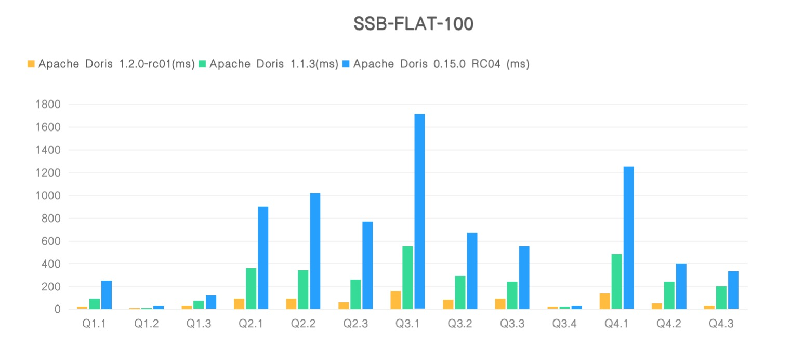

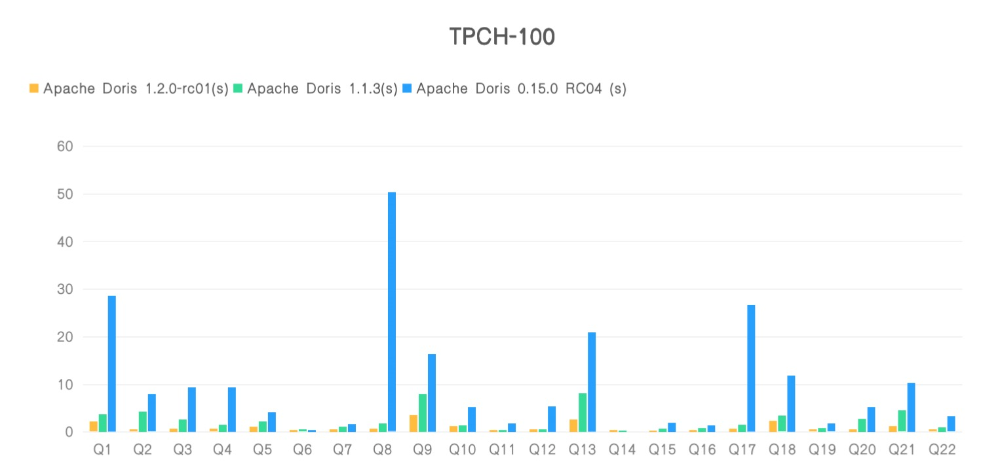

同时，我们将 1.2.0 版本的测试数据提交到了全球知名的数据库测试排行榜 ClickBench，在最新的排行榜中，Apache Doris 1.2.0 新版本取得了通用机型（c6a.4xlarge, 500gb gp2）下**查询性能 Cold Run 第二和 Hot Run 第三的醒目成绩，共有 8 个 SQL 刷新榜单最佳成绩、成为新的性能标杆**。导入性能方面，1.2.0 新版本数据写入效率在同机型所有产品中位列第一，压缩前 70G 数据写入仅耗时 415s、单节点写入速度超过 170 MB/s，在实现极致查询性能的同时也保证了高效的写入效率！


##### 2. 在 Unique Key 模型上实现了 Merge-on-Write 的数据更新模式

在过去版本中， Apache Doris 主要是通过 Unique Key 数据模型来实现数据实时更新的。但由于采用的是 Merge-on-Read 的实现方式，查询存在着效率瓶颈，有大量非必要的 CPU 计算资源消耗和 IO 开销，且可能将出现查询性能抖动等问题。

在 1.2.0 版本中，我们在原有的 Unique Key 数据模型上，增加了 Merge-on-Write 的数据更新模式。该模式在数据写入时即对需要删除或更新的数据进行标记，始终保证有效的主键只出现在一个文件中（即在写入的时候保证了主键的唯一性），不需要在读取的时候通过归并排序来对主键进行去重，这对于高频写入的场景来说，大大减少了查询执行时的额外消耗。此外还能够支持谓词下推，并能够很好利用 Doris 丰富的索引，在数据  IO 层面就能够进行充分的数据裁剪，大大减少数据的读取量和计算量，因此在很多场景的查询中都有非常明显的性能提升。

在比较有代表性的 SSB-Flat 数据集上，通过模拟多个持续导入场景，**新版本的大部分查询取得了 3-6 倍的性能提升**。


使用场景：所有对主键唯一性有需求，需要频繁进行实时 Upsert 更新的用户建议打开。

使用说明：作为新的 Feature 默认关闭，用户可以通过在建表时添加下面的 Property 来开启：

```
“enable_unique_key_merge_on_write” = “true”
```

另外新版本 Merge-on-Write 数据更新模式与旧版本 Merge-on-Read 实现方式存在差异，因此已经创建的 Unique Key 表无法直接通过 Alter Table 添加 Property 来支持，只能在新建表的时候指定。如果用户需要将旧表转换到新表，可以使用 `insert into new_table select * from old_table` 的方式来实现。

##### 3. Multi Catalog 多源数据目录

Multi-Catalog 多源数据目录功能的目标在于能够帮助用户更方便对接外部数据目录，以增强 Apache Doris 的数据湖分析和联邦数据查询能力。

在过去版本中，当我们需要对接外部数据源时，只能在 Database 或 Table 层级对接。当外部数据目录 Schema 发生变化、或者外部数据目录的 Database 或 Table 非常多时，需要用户手工进行一一映射，维护量非常大。1.2.0 版本新增的多源数据目录功能为 Apache Doris 提供了快速接入外部数据源进行访问的能力，用户可以通过 `CREATE CATALOG` 命令连接到外部数据源，Doris 会自动映射外部数据源的库、表信息。之后，用户就可以像访问普通表一样，对这些外部数据源中的数据进行访问，避免了之前用户需要对每张表手动建立外表映射的复杂操作。

目前能支持以下数据源：

1. Hive Metastore：可以访问包括 Hive、Iceberg、Hudi 在内的数据表，也可对接兼容 Hive Metastore 的数据源，如阿里云的 DataLake Formation，同时支持 HDFS 和对象存储上的数据访问。

2. Elasticsearch：访问 ES 数据源。

3. JDBC：支持通过 JDBC 访问 MySQL 数据源。

注：相应的权限层级也会自动变更，详见“升级注意事项”部分

文档：[https://doris.apache.org/zh-CN/docs/dev/lakehouse/multi-catalog](https://doris.apache.org/zh-CN/docs/dev/lakehouse/multi-catalog)

##### 4. 轻量表结构变更 Light Schema Change

在过去版本中，Schema Change 是一项相对消耗比较大的工作，需要对数据文件进行修改，在集群规模和表数据量较大时执行效率会明显降低。同时由于是异步作业，当上游 Schema 发生变更时，需要停止数据同步任务并手动执行 Schema Change，增加开发和运维成本的同时还可能造成消费数据的积压。

在 1.2.0 新版本中，对数据表的加减列操作，不再需要同步更改数据文件，仅需在 FE 中更新元数据即可，从而实现毫秒级的 Schema Change 操作，且存在导入任务时效率的提升更为显著。与此同时，使得 Apache Doris 在面对上游数据表维度变化时，可以更加快速稳定实现表结构同步，保证系统的高效且平稳运转。如用户可以通过 Flink CDC，可实现上游数据库到 Doris 的 DML 和 DDL 同步，进一步提升了实时数仓数据处理和分析链路的时效性与便捷性。


使用说明：作为新的 Feature 默认关闭，用户可以通过在建表时添加下面的 Property 来开启：

```
"light_schema_change" = "true"
```

文档：[https://doris.apache.org/zh-CN/docs/dev/sql-manual/sql-reference/Data-Definition-Statements/Create/CREATE-TABLE](https://doris.apache.org/zh-CN/docs/dev/sql-manual/sql-reference/Data-Definition-Statements/Create/CREATE-TABLE)

##### 5. JDBC 外部表

在过去版本中，Apache Doris 提供了 ODBC 外部表的方式来访问 MySQL、Oracle、SQL Server、PostgreSQL 等数据源，但由于 ODBC 驱动版本问题可能造成系统的不稳定。相对于 ODBC，JDBC 接口更为统一且支持数据库众多，因此在 1.2.0 版本中我们实现了 JDBC 外部表以替换原有的 ODBC 外部表。在新版本中，用户可以通过 JDBC 连接支持 JDBC 协议的外部数据源，

当前已适配的数据源包括：

- MySQL
- PostgreSQL
- Oracle
- SQLServer
- ClickHouse

更多数据源的适配已经在规划之中，原则上任何支持 JDBC 协议访问的数据库均能通过 JDBC 外部表的方式来访问。而之前的 ODBC 外部表功能将会在后续的某个版本中移除，还请尽量切换到 JDBC 外表功能。

文档：[https://doris.apache.org/zh-CN/docs/dev/lakehouse/multi-catalog/jdbc](https://doris.apache.org/zh-CN/docs/dev/lakehouse/multi-catalog/jdbc)

##### 6. JAVA UDF

在过去版本中，Apache Doris 提供了 C++ 语言的原生 UDF，便于用户通过自己编写自定义函数来满足特定场景的分析需求。但由于原生 UDF 与 Doris 代码耦合度高、当 UDF 出现错误时可能会影响集群稳定性，且只支持 C++ 语言，对于熟悉 Hive、Spark 等大数据技术栈的用户而言存在较高门槛，因此在 1.2.0 新版本我们增加了 Java 语言的自定义函数，支持通过 Java 编写 UDF/UDAF，方便用户在 Java 生态中使用。同时，通过堆外内存、Zero Copy 等技术，使得跨语言的数据访问效率大幅提升。

文档：[https://doris.apache.org/zh-CN/docs/dev/ecosystem/udf/java-user-defined-function](https://doris.apache.org/zh-CN/docs/dev/ecosystem/udf/java-user-defined-function)

示例：[https://github.com/apache/doris/tree/master/samples/doris-demo](https://github.com/apache/doris/tree/master/samples/doris-demo)

##### 7. Remote UDF

远程 UDF 支持通过 RPC 的方式访问远程用户自定义函数服务，从而彻底消除用户编写 UDF 的语言限制，用户可以使用任意编程语言实现自定义函数，完成复杂的数据分析工作。

文档：[https://doris.apache.org/zh-CN/docs/ecosystem/udf/remote-user-defined-function](https://doris.apache.org/zh-CN/docs/ecosystem/udf/remote-user-defined-function)

示例：[https://github.com/apache/doris/tree/master/samples/doris-demo](https://github.com/apache/doris/tree/master/samples/doris-demo)

##### 8. Array/JSONB 复合数据类型 

- Array 类型

支持了数组类型，同时也支持多级嵌套的数组类型。在一些用户画像，标签等场景，可以利用 Array 类型更好的适配业务场景。同时在新版本中，我们也实现了大量数组相关的函数，以更好的支持该数据类型在实际场景中的应用。

文档：[https://doris.apache.org/zh-CN/docs/dev/sql-manual/sql-reference/Data-Types/ARRAY](https://doris.apache.org/zh-CN/docs/dev/sql-manual/sql-reference/Data-Types/ARRAY)

相关函数：[https://doris.apache.org/zh-CN/docs/dev/sql-manual/sql-functions/array-functions/array](https://doris.apache.org/zh-CN/docs/dev/sql-manual/sql-functions/array-functions/array)

- JSONB 类型

支持二进制的 JSON 数据类型 JSONB。该类型提供更紧凑的 JSONB 编码格式，同时提供在编码格式上的数据访问，相比于使用字符串存储的 JSON 数据，有数倍的性能提升。

文档：[https://doris.apache.org/zh-CN/docs/dev/sql-manual/sql-reference/Data-Types/JSONB](https://doris.apache.org/zh-CN/docs/dev/sql-manual/sql-reference/Data-Types/JSONB)

相关函数：[https://doris.apache.org/zh-CN/docs/dev/sql-manual/sql-functions/json-functions/jsonb_parse](https://doris.apache.org/zh-CN/docs/dev/sql-manual/sql-functions/json-functions/jsonb_parse)

##### 9. DateV2/DatatimeV2 新版日期/日期时间数据类型 

支持 DateV2 日期类型和 DatetimeV2 日期时间类型，相较于原有的 Date 和 Datetime 效率更高且支持最多到微秒的时间精度，建议使用新版日期类型。

文档：[https://doris.apache.org/zh-CN/docs/1.2/sql-manual/sql-reference/Data-Types/DATETIMEV2](https://doris.apache.org/zh-CN/docs/1.2/sql-manual/sql-reference/Data-Types/DATETIMEV2)

  [https://doris.apache.org/zh-CN/docs/1.2/sql-manual/sql-reference/Data-Types/DATEV2](https://doris.apache.org/zh-CN/docs/1.2/sql-manual/sql-reference/Data-Types/DATEV2)

影响范围：
  1. 用户需要在建表时指定 DateV2 和 DatetimeV2，原有表的 Date 以及 Datetime 不受影响。
  2. Datev2 和 Datetimev2 在与原来的 Date 和 Datetime 做计算时（例如等值连接），原有类型会被cast 成新类型做计算
  3. Example 参考文档中说明

##### 10. 全新内存管理框架

在 Apache Doris 1.2.0 版本中我们增加了全新的内存跟踪器（Memory Tracker），用以记录 Doris BE 进程内存使用，包括查询、导入、Compaction、Schema Change 等任务生命周期中使用的内存以及各项缓存。通过 Memory Tracker 实现了更加精细的内存监控和控制，大大减少了因内存超限导致的 OOM 问题，使系统稳定性进一步得到提升。

文档：[https://doris.apache.org/zh-CN/docs/dev/admin-manual/maint-monitor/memory-management/memory-tracker](https://doris.apache.org/zh-CN/docs/dev/admin-manual/maint-monitor/memory-management/memory-tracker)

##### 11. Table Valued Function 表函数

增加了 Table Valued Function（TVF，表函数），TVF 可以视作一张普通的表，可以出现在 SQL 中所有“表”可以出现的位置，让用户像访问关系表格式数据一样，读取或访问来自 HDFS 或 S3 上的文件内容，

例如使用 S3 TVF 实现对象存储上的数据导入：
```
insert into tbl select * from s3("s3://bucket/file.*", "ak" = "xx", "sk" = "xxx") where c1 > 2;
```

或者直接查询 HDFS 上的数据文件：
```
insert into tbl select * from hdfs("hdfs://bucket/file.*") where c1 > 2;
```
TVF 可以帮助用户充分利用 SQL 丰富的表达能力，灵活处理各类数据。

文档：
[https://doris.apache.org/zh-CN/docs/dev/sql-manual/sql-functions/table-functions/s3](https://doris.apache.org/zh-CN/docs/dev/sql-manual/sql-functions/table-functions/s3)

[https://doris.apache.org/zh-CN/docs/dev/sql-manual/sql-functions/table-functions/hdfs](https://doris.apache.org/zh-CN/docs/dev/sql-manual/sql-functions/table-functions/hdfs)

### 更多功能        

##### 1. 更便捷的分区创建方式

支持通过 `FROM TO` 命令创建一个时间范围内的多个分区。

文档搜索“MULTI RANGE”：
[https://doris.apache.org/zh-CN/docs/dev/sql-manual/sql-reference/Data-Definition-Statements/Create/CREATE-TABLE](https://doris.apache.org/zh-CN/docs/dev/sql-manual/sql-reference/Data-Definition-Statements/Create/CREATE-TABLE)

示例：
```
// 根据时间date 创建分区，支持多个批量逻辑和单独创建分区的混合使用

PARTITION BY RANGE(event_day)(
        FROM ("2000-11-14") TO ("2021-11-14") INTERVAL 1 YEAR,
        FROM ("2021-11-14") TO ("2022-11-14") INTERVAL 1 MONTH,
        FROM ("2022-11-14") TO ("2023-01-03") INTERVAL 1 WEEK,
        FROM ("2023-01-03") TO ("2023-01-14") INTERVAL 1 DAY,
        PARTITION p_20230114 VALUES [('2023-01-14'), ('2023-01-15'))
)
```
```
// 根据时间datetime 创建分区
PARTITION BY RANGE(event_time)(
        FROM ("2023-01-03 12") TO ("2023-01-14 22") INTERVAL 1 HOUR
)
```

##### 2. 列重命名

对于开启了 Light Schema Change 的表，支持对列进行重命名。

文档：[https://doris.apache.org/zh-CN/docs/dev/sql-manual/sql-reference/Data-Definition-Statements/Alter/ALTER-TABLE-RENAME  ](https://doris.apache.org/zh-CN/docs/dev/sql-manual/sql-reference/Data-Definition-Statements/Alter/ALTER-TABLE-RENAME  )

##### 3. 更丰富权限管理

- 支持行级权限

可以通过 `CREATE ROW POLICY` 命令创建行级权限。

文档：[https://doris.apache.org/zh-CN/docs/dev/sql-manual/sql-reference/Data-Definition-Statements/Create/CREATE-POLICY](https://doris.apache.org/zh-CN/docs/dev/sql-manual/sql-reference/Data-Definition-Statements/Create/CREATE-POLICY)

- 支持指定密码强度、过期时间等。

- 支持在多次失败登录后锁定账户。

文档：[https://doris.apache.org/zh-CN/docs/dev/sql-manual/sql-reference/Account-Management-Statements/ALTER-USER](https://doris.apache.org/zh-CN/docs/dev/sql-manual/sql-reference/Account-Management-Statements/ALTER-USER)

##### 4. 导入相关

- CSV 导入支持带 header 的 CSV 文件。

在文档中搜索 `csv_with_names`：[https://doris.apache.org/zh-CN/docs/dev/sql-manual/sql-reference/Data-Manipulation-Statements/Load/STREAM-LOAD/](https://doris.apache.org/zh-CN/docs/dev/sql-manual/sql-reference/Data-Manipulation-Statements/Load/STREAM-LOAD/)

- Stream Load 新增 `hidden_columns`，可以显式指定 delete flag 列和 sequence 列。

在文档中搜索 `hidden_columns`：[https://doris.apache.org/zh-CN/docs/dev/sql-manual/sql-reference/Data-Manipulation-Statements/Load/STREAM-LOAD](https://doris.apache.org/zh-CN/docs/dev/sql-manual/sql-reference/Data-Manipulation-Statements/Load/STREAM-LOAD)

- Spark Load 支持 Parquet 和 ORC 文件导入。
- 支持清理已完成的导入的 Label
  文档：[https://doris.apache.org/zh-CN/docs/dev/sql-manual/sql-reference/Data-Manipulation-Statements/Load/CLEAN-LABEL](https://doris.apache.org/zh-CN/docs/dev/sql-manual/sql-reference/Data-Manipulation-Statements/Load/CLEAN-LABEL)

- 支持通过状态批量取消导入作业
文档：[https://doris.apache.org/zh-CN/docs/dev/sql-manual/sql-reference/Data-Manipulation-Statements/Load/CANCEL-LOAD](https://doris.apache.org/zh-CN/docs/dev/sql-manual/sql-reference/Data-Manipulation-Statements/Load/CANCEL-LOAD)

- Broker Load 新增支持阿里云 OSS，腾讯 CHDFS 和华为云 OBS。

文档：[https://doris.apache.org/zh-CN/docs/dev/advanced/broker](https://doris.apache.org/zh-CN/docs/dev/advanced/broker)

- 支持通过 hive-site.xml 文件配置访问 HDFS。

文档：[https://doris.apache.org/zh-CN/docs/dev/admin-manual/config/config-dir](https://doris.apache.org/zh-CN/docs/dev/admin-manual/config/config-dir)

##### 5. 支持通过 `SHOW CATALOG RECYCLE BIN` 功能查看回收站中的内容。

文档：[https://doris.apache.org/zh-CN/docs/dev/sql-manual/sql-reference/Show-Statements/SHOW-CATALOG-RECYCLE-BIN](https://doris.apache.org/zh-CN/docs/dev/sql-manual/sql-reference/Show-Statements/SHOW-CATALOG-RECYCLE-BIN)

##### 6. 支持 `SELECT * EXCEPT` 语法。

文档：[https://doris.apache.org/zh-CN/docs/dev/data-table/basic-usage](https://doris.apache.org/zh-CN/docs/dev/data-table/basic-usage)

##### 7. OUTFILE 支持 ORC 格式导出，并且支持多字节分隔符。

文档：[https://doris.apache.org/zh-CN/docs/dev/sql-manual/sql-reference/Data-Manipulation-Statements/OUTFILE](https://doris.apache.org/zh-CN/docs/dev/sql-manual/sql-reference/Data-Manipulation-Statements/OUTFILE)

文档：[https://doris.apache.org/zh-CN/docs/dev/sql-manual/sql-reference/Data-Manipulation-Statements/OUTFILE](https://doris.apache.org/zh-CN/docs/dev/sql-manual/sql-reference/Data-Manipulation-Statements/OUTFILE)

##### 8. 支持通过配置修改可保存的 Query Profile 的数量。

文档搜索 FE 配置项：`max_query_profile_num`

##### 9. DELETE 语句支持 IN 谓词条件。并且支持分区裁剪。

文档：[https://doris.apache.org/zh-CN/docs/dev/sql-manual/sql-reference/Data-Manipulation-Statements/Manipulation/DELETE](https://doris.apache.org/zh-CN/docs/dev/sql-manual/sql-reference/Data-Manipulation-Statements/Manipulation/DELETE)

##### 10. 时间列的默认值支持使用 `CURRENT_TIMESTAMP`

文档中搜索 "CURRENT_TIMESTAMP"：[https://doris.apache.org/zh-CN/docs/dev/sql-manual/sql-reference/Data-Definition-Statements/Create/CREATE-TABLE](https://doris.apache.org/zh-CN/docs/dev/sql-manual/sql-reference/Data-Definition-Statements/Create/CREATE-TABLE)

##### 11. 添加两张系统表：backends、rowsets

backends 是 Doris 中内置系统表，存放在 information_schema 数据库下，通过该系统表可以查看当前 Doris 集群中的 BE 节点信息。

rowsets 是 Doris 中内置系统表，存放在 information_schema 数据库下，通过该系统表可以查看 Doris 集群中各个 BE 节点当前 rowsets 情况。

文档：

[https://doris.apache.org/zh-CN/docs/dev/admin-manual/system-table/backends](https://doris.apache.org/zh-CN/docs/dev/admin-manual/system-table/backends)

[https://doris.apache.org/zh-CN/docs/dev/admin-manual/system-table/rowsets](https://doris.apache.org/zh-CN/docs/dev/admin-manual/system-table/rowsets)

##### 12. 备份恢复

  - Restore作业支持 `reserve_replica` 参数，使得恢复后的表的副本数和备份时一致。
  - Restore 作业支持 `reserve_dynamic_partition_enable` 参数，使得恢复后的表保持动态分区开启状态。

  文档：[https://doris.apache.org/zh-CN/docs/dev/sql-manual/sql-reference/Data-Definition-Statements/Backup-and-Restore/RESTORE](https://doris.apache.org/zh-CN/docs/dev/sql-manual/sql-reference/Data-Definition-Statements/Backup-and-Restore/RESTORE)

  - 支持通过内置的 libhdfs 进行备份恢复操作，不再依赖 broker。

  文档：[https://doris.apache.org/zh-CN/docs/dev/sql-manual/sql-reference/Data-Definition-Statements/Backup-and-Restore/CREATE-REPOSITORY](https://doris.apache.org/zh-CN/docs/dev/sql-manual/sql-reference/Data-Definition-Statements/Backup-and-Restore/CREATE-REPOSITORY)

##### 13. 支持同机多磁盘之间的数据均衡

文档：

[https://doris.apache.org/zh-CN/docs/dev/sql-manual/sql-reference/Database-Administration-Statements/ADMIN-REBALANCE-DISK](https://doris.apache.org/zh-CN/docs/dev/sql-manual/sql-reference/Database-Administration-Statements/ADMIN-REBALANCE-DISK)

[https://doris.apache.org/zh-CN/docs/dev/sql-manual/sql-reference/Database-Administration-Statements/ADMIN-CANCEL-REBALANCE-DISK](https://doris.apache.org/zh-CN/docs/dev/sql-manual/sql-reference/Database-Administration-Statements/ADMIN-CANCEL-REBALANCE-DISK)

##### 14. Routine Load 支持订阅 Kerberos 认证的 Kafka 服务。

文档中搜索 kerberos：[https://doris.apache.org/zh-CN/docs/dev/data-operate/import/import-way/routine-load-manual](https://doris.apache.org/zh-CN/docs/dev/data-operate/import/import-way/routine-load-manual)

##### 15. New built-in-function 新增内置函数

  新增以下内置函数:

  - cbrt
  - sequence_match/sequence_count 
  - mask/mask_first_n/mask_last_n
  - elt
  - any/any_value
  - group_bitmap_xor
  - ntile
  - nvl
  - uuid
  - initcap
  - regexp_replace_one/regexp_extract_all
  - multi_search_all_positions/multi_match_any
  - domain/domain_without_www/protocol
  - running_difference
  - bitmap_hash64
  - murmur_hash3_64
  - to_monday
  - not_null_or_empty
  - window_funnel
  - outer combine
  以及所有 Array 函数

### 升级注意事项

##### FE 元数据版本变更 【重要】

FE Meta Version 由 107 变更为 114，因此从 1.1.x 以及更早版本升级至 1.2.0 版本后，不可回滚到之前版本。
升级过程中，建议通过灰度升级的方式，先升级部分节点并观察业务运行情况，以降低升级风险，若执行非法的回滚操作将可能导致数据丢失与损坏。

##### 行为改变

- 权限层级变更。

	因为引入了 Catalog 层级，所以相应的用户权限层级也会自动变更。规则如下：

  - GlobalPrivs 和 ResourcePrivs 保持不变
  - 新增 CatalogPrivs 层级。
  - 原 DatabasePrivs 层级增加 internal 前缀（表示 internal catalog 中的 db）
  - 原 TablePrivs 层级增加 internal 前缀（表示internal catalog中的 tbl）
- GroupBy 和 Having 子句中，优先使用列名而不是别名进行匹配。
- 不再支持创建以 "mv_" 开头的列。"mv_" 是物化视图中的保留关键词
- 移除了 order by 语句默认添加的 65535 行的 Limit 限制，并增加 Session 变量 `default_order_by_limit` 可以自定配置这个限制。
- "Create Table As Select" 生成的表，所有字符串列统一使用 String类型，不再区分 varchar/char/string 
- audit log 中，移除 db 和 user 名称前的 `default_cluster` 字样。
- audit log 中增加 sql digest 字段
- union 子句总 order by 逻辑变动。新版本中，order by 子句将在 union 执行完成后执行，除非通过括号进行显式的关联。
- 进行 decommission 操作时，会忽略回收站中的 tablet，确保 decomission 能够完成。
- Decimal 的返回结果将按照原始列中声明的精度进行显示 ，或者按照显式指定的 cast 函数中的精度进行展示。
- 列名的长度限制由 64 变更为 256
- FE 配置项变动
  - 默认开启 `enable_vectorized_load` 参数。
  - 增大了 `create_table_timeout` 值。建表操作的默认超时时间将增大。 
  - 修改 `stream_load_default_timeout_second` 默认值为 3天。
  - 修改`alter_table_timeout_second` 的默认值为 一个月。
  - 增加参数 `max_replica_count_when_schema_change` 用于限制 alter 作业中涉及的 replica数量，默认为100000。
  - 添加 `disable_iceberg_hudi_table`。默认禁用了 iceberg 和 hudi 外表，推荐使用 multi catalog功能。
- BE 配置项变动
  - 移除了 `disable_stream_load_2pc` 参数。2PC的stream load可直接使用。
  - 修改`tablet_rowset_stale_sweep_time_sec` ，从1800秒修改为 300 秒。
- Session变量变动
  - 修改变量 `enable_insert_strict` 默认为 true。这会导致一些之前可以执行，但是插入了非法值的insert操作，不再能够执行。
  - 修改变量 `enable_local_exchange` 默认为 true 
  - 默认通过 lz4 压缩进行数据传输，通过变量 `fragment_transmission_compression_codec` 控制 
  - 增加 `skip_storage_engine_merge` 变量，用于调试 unique 或 agg 模型的数据 
    文档：https://doris.apache.org/zh-CN/docs/dev/advanced/variables
- BE 启动脚本会通过 `/proc/sys/vm/max_map_count` 检查数值是否大于200W，否则启动失败。
- 移除了 mini load 接口

##### 升级过程中需注意

1. 升级准备
  - 需替换：lib, bin 目录（start/stop 脚本均有修改）
  - BE 也需要配置 JAVA_HOME，已支持 JDBC Table 和 Java UDF。
  - fe.conf 中默认 JVM Xmx 参数修改为 8GB。

2. 升级过程中可能的错误
  - repeat 函数不可使用并报错：`vectorized repeat function cannot be executed`，可以在升级前先关闭向量化执行引擎。
  - schema change 失败并报错：`desc_tbl is not set. Maybe the FE version is not equal to the BE`
  - 向量化 hash join 不可使用并报错。`vectorized hash join cannot be executed`。可以在升级前先关闭向量化执行引擎。

以上错误在完全升级后会恢复正常。

##### 性能影响

- 默认使用 JeMalloc 作为新版本 BE 的内存分配器，替换 TcMalloc 。

JeMalloc 相比 TcMalloc 使用的内存更少、高并发场景性能更高，但在内存充足的性能测试时，TcMalloc 比 JeMalloc 性能高5%-10%，详细测试见: https://github.com/apache/doris/pull/12496

- tablet sink 中的 batch size 修改为至少 8K。
- 默认关闭 Page Cache 和 减少 Chunk Allocator 预留内存大小

Page Cache 和 Chunk Allocator 分别缓存用户数据块和内存预分配，这两个功能会占用一定比例的内存并且不会释放。由于这部分内存占用无法灵活调配，导致在某些场景下可能因这部分内存占用而导致其他任务内存不足，影响系统稳定性和可用性，因此新版本中默认关闭了这两个功能。

但在某些延迟敏感的报表场景下，关闭该功能可能会导致查询延迟增加。如用户担心升级后该功能对业务造成影响，可以通过在 be.conf 中增加以下参数以保持和之前版本行为一致。
```
disable_storage_page_cache=false
chunk_reserved_bytes_limit=10%
```

##### API 变化

- BE 的 http api 错误返回信息，由 `{"status": "Fail", "msg": "xxx"}` 变更为更具体的 ``{"status": "Not found", "msg": "Tablet not found. tablet_id=1202"}``

- `SHOW CREATE TABLE` 中， comment的内容由双引号包裹变为单引号包裹

- 支持普通用户通过 http 命令获取 query profile。

文档：[https://doris.apache.org/zh-CN/docs/dev/admin-manual/http-actions/fe/manager/query-profile-action](https://doris.apache.org/zh-CN/docs/dev/admin-manual/http-actions/fe/manager/query-profile-action)

- 优化了 sequence 列的指定方式，可以直接指定列名。

文档：[https://doris.apache.org/zh-CN/docs/dev/data-operate/update-delete/sequence-column-manual](https://doris.apache.org/zh-CN/docs/dev/data-operate/update-delete/sequence-column-manual)

- `show backends` 和 `show tablets` 返回结果中，增加远端存储的空间使用情况 (#11450)
- 移除了 Num-Based Compaction 相关代码(#13409)
- 重构了BE的错误码机制，部分返回的错误信息会发生变化(#8855)

### 其他

- 支持Docker 官方镜像。
- 支持在 MacOS(x86/M1) 和 ubuntu-22.04 上编译 Doris
- 支持进行image 文件的校验。
 
文档搜索“--image”：[https://doris.apache.org/zh-CN/docs/dev/admin-manual/maint-monitor/metadata-operation](https://doris.apache.org/zh-CN/docs/dev/admin-manual/maint-monitor/metadata-operation)
- 脚本相关
  - FE、BE 的 stop 脚本支持通过 `--grace` 参数退出FE、BE（使用 kill -15 信号代替 kill -9）
  - FE start 脚本支持通过 --version 查看当前FE 版本(#11563)
- 支持通过 `ADMIN COPY TABLET` 命令获取某个 tablet 的数据和相关建表语句，用于本地问题调试 

文档：[https://doris.apache.org/zh-CN/docs/dev/sql-manual/sql-reference/Database-Administration-Statements/ADMIN-COPY-TABLET](https://doris.apache.org/zh-CN/docs/dev/sql-manual/sql-reference/Database-Administration-Statements/ADMIN-COPY-TABLET)

- 支持通过 http api，获取一个SQL语句相关的 建表语句，用于本地问题复现

文档：[https://doris.apache.org/zh-CN/docs/dev/admin-manual/http-actions/fe/query-schema-action](https://doris.apache.org/zh-CN/docs/dev/admin-manual/http-actions/fe/query-schema-action)

- 支持建表时关闭这个表的 compaction 功能，用于测试 

文档中搜索 "disble_auto_compaction"：[https://doris.apache.org/zh-CN/docs/dev/sql-manual/sql-reference/Data-Definition-Statements/Create/CREATE-TABLE](https://doris.apache.org/zh-CN/docs/dev/sql-manual/sql-reference/Data-Definition-Statements/Create/CREATE-TABLE)

### 致谢

Apache Doris 1.2.0 版本的发布离不开所有社区用户的支持，在此向所有参与版本设计、开发、测试、讨论的社区贡献者们表示感谢，他们分别是（首字母排序）：

```
@924060929
@a19920714liou
@adonis0147
@Aiden-Dong
@aiwenmo
@AshinGau
@b19mud
@BePPPower
@BiteTheDDDDt
@bridgeDream
@ByteYue
@caiconghui
@CalvinKirs
@cambyzju
@caoliang-web
@carlvinhust2012
@catpineapple
@ccoffline
@chenlinzhong
@chovy-3012
@coderjiang
@cxzl25
@dataalive
@dataroaring
@dependabot
@dinggege1024
@DongLiang-0
@Doris-Extras
@eldenmoon
@EmmyMiao87
@englefly
@FreeOnePlus
@Gabriel39
@gaodayue
@geniusjoe
@gj-zhang
@gnehil
@GoGoWen
@HappenLee
@hello-stephen
@Henry2SS
@hf200012
@huyuanfeng2018
@jacktengg
@jackwener
@jeffreys-cat
@Jibing-Li
@JNSimba
@Kikyou1997
@Lchangliang
@LemonLiTree
@lexoning
@liaoxin01
@lide-reed
@link3280
@liutang123
@liuyaolin
@LOVEGISER
@lsy3993
@luozenglin
@luzhijing
@madongz
@morningman
@morningman-cmy
@morrySnow
@mrhhsg
@Myasuka
@myfjdthink
@nextdreamblue
@pan3793
@pangzhili
@pengxiangyu
@platoneko
@qidaye
@qzsee
@SaintBacchus
@SeekingYang
@smallhibiscus
@sohardforaname
@song7788q
@spaces-X
@ssusieee
@stalary
@starocean999
@SWJTU-ZhangLei
@TaoZex
@timelxy
@Wahno
@wangbo
@wangshuo128
@wangyf0555
@weizhengte
@weizuo93
@wsjz
@wunan1210
@xhmz
@xiaokang
@xiaokangguo
@xinyiZzz
@xy720
@yangzhg
@Yankee24
@yeyudefeng
@yiguolei
@yinzhijian
@yixiutt
@yuanyuan8983
@zbtzbtzbt
@zenoyang
@zhangboya1
@zhangstar333
@zhannngchen
@ZHbamboo
@zhengshiJ
@zhenhb
@zhqu1148980644
@zuochunwei
@zy-kkk
```


