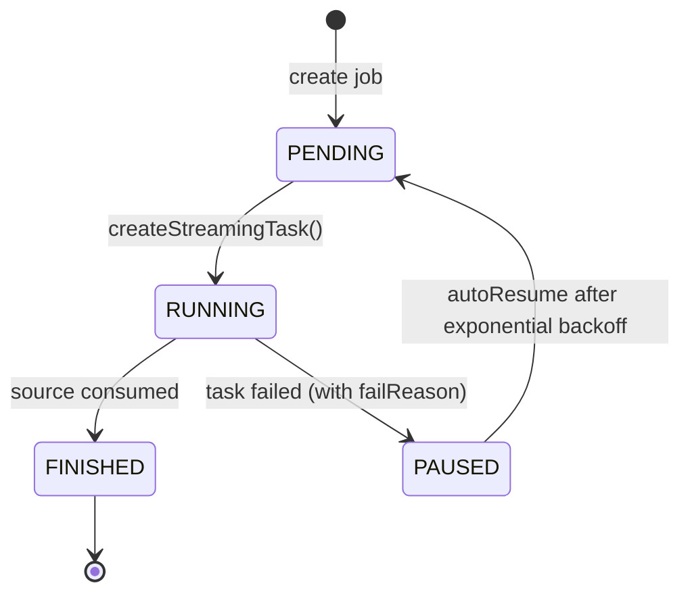

---
{
    "title": "Continuous Load Overview",
    "sidebar_label": "Overview",
    "language": "en",
    "description": "Doris supports continuously loading data from multiple data sources into Doris tables via Streaming Job."
}
---

## Overview

Doris supports continuously loading data from multiple data sources into Doris tables via Streaming Job. After submitting a Job, Doris continuously runs the import job, reading data from the source in real time and writing it into Doris tables.

Continuous Load supports the following data sources and import modes:

| Data Source | Supported Versions | Table-level Sync | Database-level Sync | Setup Guide |
|:------|:--------|:--------|:--------|:--------|
| MySQL | 5.6, 5.7, 8.0.x | [MySQL Table-level Sync](./continuous-load-mysql-table.md) | [MySQL Database-level Sync](./continuous-load-mysql-database.md) | [Amazon RDS MySQL](./prerequisites/amazon-rds-mysql.md) · [Amazon Aurora MySQL](./prerequisites/amazon-aurora-mysql.md) |
| PostgreSQL | 14, 15, 16, 17 | [PostgreSQL Table-level Sync](./continuous-load-postgresql-table.md) | [PostgreSQL Database-level Sync](./continuous-load-postgresql-database.md) | [Amazon RDS PostgreSQL](./prerequisites/amazon-rds-postgresql.md) · [Amazon Aurora PostgreSQL](./prerequisites/amazon-aurora-postgresql.md) |
| S3 | - | [S3 Continuous Load](./continuous-load-s3.md) | - | - |

## How to Choose

Table-level Sync and Database-level Sync are **two fundamentally different mechanisms**, not a distinction by "number of tables". **Database-level Sync can also sync just one table via `include_tables`**, so the choice should be driven by capability requirements:

| Capability | Table-level Sync | Database-level Sync |
|:--------|:--------|:--------|
| Underlying mechanism | Job + TVF (`INSERT INTO tbl SELECT * FROM tvf()`) | Job + native database DDL (`FROM src TO DATABASE db`) |
| Target granularity | One existing Doris table | A Doris database container |
| Sync scope | A single table | One to many to all tables (controlled by `include_tables`) |
| Auto-create tables | ❌ Requires pre-creation | ✅ Automatically creates primary-key tables on first sync |
| SQL expressiveness | ✅ Column mapping, filtering, transformation (via SELECT) | ❌ Direct replication, no ETL |
| Delivery semantics | exactly-once | at-least-once |
| Required privileges | Load | Load + Create (when auto-creating) |
| Typical scenarios | Real-time sync needing column pruning, renaming, type conversion, or conditional filtering | Mirror replication of a database or group of tables, where downstream schema should track upstream automatically |

- **Need SQL transformations or strict exactly-once semantics** → Choose **Table-level Sync**
- **Want Doris to auto-create tables and sync a group of tables with one config** → Choose **Database-level Sync**
- **Source is S3 object storage** → Only Table-level Sync is supported (via S3 TVF)

## Job Lifecycle

A Streaming Job transitions between the following states during its lifecycle. Both Table-level Sync and Database-level Sync follow the same state machine:



| State | Description |
|:----|:----|
| **PENDING** | The job has been created but no `StreamingTask` has been dispatched yet; awaiting the next scheduling round |
| **RUNNING** | A child task has been dispatched and is running, reading incremental data from the source and writing into Doris |
| **FINISHED** | The source has been fully consumed and the job has terminated. S3 TVF jobs enter this state once all files have been imported |
| **PAUSED** | A child task failed; the job is automatically paused and a `failReason` is recorded. Check the `ErrorMsg` column in `select * from jobs(...)` for details |

**Auto-resume:** After entering `PAUSED`, the scheduler periodically retries with an exponential backoff strategy and transitions the job back to `PENDING` to dispatch a new task. **Transient failures (network jitter, brief upstream unavailability, etc.) are absorbed automatically without manual intervention.** To resume immediately after diagnosing a failure, use [`RESUME JOB`](#resume-import-job); to stop scheduling entirely, use [`PAUSE JOB`](#pause-import-job) (manually paused jobs are NOT woken up by auto-resume) or [`DROP JOB`](#delete-import-job).

## Common Operations

### Check Import Status

```sql
select * from jobs("type"="insert") where ExecuteType = "STREAMING";
```

| Column            | Description                                                  |
| ----------------- | ------------------------------------------------------------ |
| ID                | Job ID                                                       |
| NAME              | Job name                                                     |
| Definer           | Job definer                                                  |
| ExecuteType       | Job type: *ONE_TIME/RECURRING/STREAMING/MANUAL*              |
| RecurringStrategy | Recurring strategy, empty for Streaming                      |
| Status            | Job status                                                   |
| ExecuteSql        | Job's Insert SQL statement                                   |
| CreateTime        | Job creation time                                            |
| SucceedTaskCount  | Number of successful tasks                                   |
| FailedTaskCount   | Number of failed tasks                                       |
| CanceledTaskCount | Number of canceled tasks                                     |
| Comment           | Job comment                                                  |
| Properties        | Job properties                                               |
| CurrentOffset     | Current offset, only for Streaming jobs                      |
| EndOffset         | Max end offset from source, only for Streaming jobs          |
| LoadStatistic     | Job statistics                                               |
| ErrorMsg          | Job error message                                            |
| JobRuntimeMsg     | Job runtime info                                             |

### Check Task Status

```sql
select * from tasks("type"="insert") where jobId='<job_id>';
```

| Column        | Description                                          |
| ------------- | ---------------------------------------------------- |
| TaskId        | Task ID                                              |
| JobID         | Job ID                                               |
| JobName       | Job name                                             |
| Label         | Task label                                           |
| Status        | Task status                                          |
| ErrorMsg      | Task error message                                   |
| CreateTime    | Task creation time                                   |
| StartTime     | Task start time                                      |
| FinishTime    | Task finish time                                     |
| LoadStatistic | Task statistics                                      |
| User          | Task executor                                        |
| RunningOffset | Current offset, only for Streaming jobs              |

### Pause Import Job

```sql
PAUSE JOB WHERE jobname = <job_name>;
```

### Resume Import Job

```sql
RESUME JOB WHERE jobName = <job_name>;
```

### Delete Import Job

```sql
DROP JOB WHERE jobName = <job_name>;
```

## Common Parameters

### FE Configuration Parameters

| Parameter                            | Default | Description                                |
| ------------------------------------ | ------- | ------------------------------------------ |
| max_streaming_job_num              | 1024    | Maximum number of Streaming jobs           |
| job_streaming_task_exec_thread_num | 10      | Number of threads for StreamingTask        |
| max_streaming_task_show_count      | 100     | Max number of StreamingTask records in memory |

### General Job Import Parameters

| Parameter    | Default | Description                                    |
| ------------ | ------- | ---------------------------------------------- |
| max_interval | 10s     | Idle scheduling interval when no new data      |

## FAQ

### MySQL connection error: Public Key Retrieval is not allowed

**Cause:** The MySQL user uses SHA256 password authentication, which requires TLS or other protocols to transmit the password.

**Solution 1:** Add `allowPublicKeyRetrieval=true` to the JDBC URL:

```
jdbc:mysql://127.0.0.1:3306?allowPublicKeyRetrieval=true
```

**Solution 2:** Change the MySQL user's authentication method to `mysql_native_password`:

```sql
ALTER USER 'username'@'%' IDENTIFIED WITH mysql_native_password BY 'password';
FLUSH PRIVILEGES;
```
