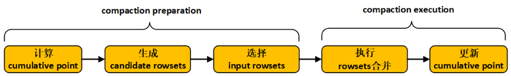
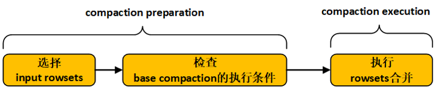
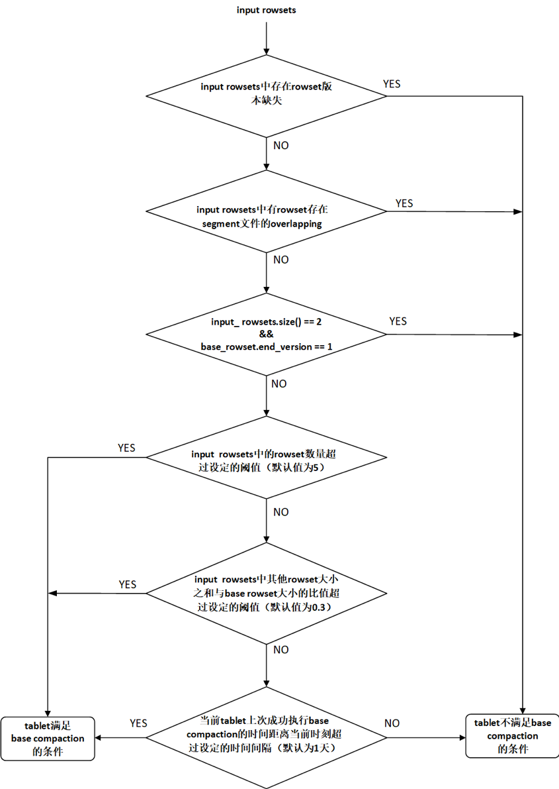

---
{
'title': 'Doris全面解析：Doris Compaction机制解析',
'summary': "本文详细地介绍了Doris的compaction机制。Doris通过compaction机制将不同的数据版本进行聚合，将小文件合并成大文件，进而有效地提升了查询性能。",
'date': '2022-09-12',
'author': 'Apache Doris',
'tags': ['技术解析'],
}
---

<!-- 
Licensed to the Apache Software Foundation (ASF) under one
or more contributor license agreements.  See the NOTICE file
distributed with this work for additional information
regarding copyright ownership.  The ASF licenses this file
to you under the Apache License, Version 2.0 (the
"License"); you may not use this file except in compliance
with the License.  You may obtain a copy of the License at

  http://www.apache.org/licenses/LICENSE-2.0

Unless required by applicable law or agreed to in writing,
software distributed under the License is distributed on an
"AS IS" BASIS, WITHOUT WARRANTIES OR CONDITIONS OF ANY
KIND, either express or implied.  See the License for the
specific language governing permissions and limitations
under the License.
-->

**导读：**
本文详细地介绍了Doris的compaction机制。

首先，从producer-consumer模式以及compaction任务提交的permission机制对compaction的总体设计和架构原理进行了剖析；然后，针对cumulative compaction的size_based策略进行了详细地介绍；最后，对base compaction的流程进行了深入地讲解。

Doris通过compaction机制将不同的数据版本进行聚合，将小文件合并成大文件，进而有效地提升了查询性能。

# 1 Foreword

Doris的存储引擎通过类似LSM的数据结构提供快速的数据导入支持。对于单一的数据分片（Tablet），新的数据先写入内存结构，随后刷入磁盘，形成一个个不可变更的数据文件，这些数据文件保存在一个rowset中。而Doris的Compaction机制主要负责根据一定的策略对这些Rowset进行合并，将小文件合并成大文件，进而提升查询性能。

每一个rowset都对应一个版本信息，表示当前rowset的版本范围，版本信息中包含了两个字段first和second，first表示当前rowset的起始版本（start version），second表示当前rowset的结束版本（end version），如图1-1所示。每一次数据导入都会生成一个新的数据版本，保存在一个rowset中。未发生过compaction的rowset的版本信息中first字段和second字段相等；执行compaction时，相邻的多个rowset会进行合并，生成一个版本范围更大的rowset，合并生成的rowset的版本信息会包含合并前的所有rowset的版本信息。

Compaction分为两种类型：base compaction和cumulative compaction。其中cumulative compaction则主要负责将多个最新导入的rowset合并成较大的rowset，而base compaction会将cumulative compaction产生的rowset合入到start version为0的基线数据版本（Base Rowset）中，是一种开销较大的compaction操作。这两种compaction的边界通过cumulative point来确定。base compaction会将cumulative point之前的所有rowset进行合并，cumulative compaction会在cumulative point之后选择相邻的数个rowset进行合并，如图1-2所示。

# 2 总体架构

## 2.1 “生产者-消费者”模式
Compaction机制要解决的第一个问题，就是如何选取合适的Tablet进行Compaction。Doris的compaction机制采用“生产者-消费者”（producer-consumer）模式，由producer线程持续生产compaction任务，并将生产出的compaction任务提交给compaction线程池进行消费执行，如图2-1所示。

Doris BE启动时，会在后台启动一个compaction producer线程，同时会创建一个compaction线程池。producer线程持续地生产compaction任务。

在一轮任务生产过程中，会从每个磁盘各选择出一个tablet执行compaction任务。如果compaction线程池中某个磁盘的compaction任务数达到了上限（通过compaction_task_num_per_disk配置，默认值为2），则这一轮任务生产会跳过该磁盘。如果某一轮生产过程从所有磁盘均没有生产出compaction任务（即compaction线程池中每个磁盘的任务数都已达到上限），则producer线程会进入休眠状态，直到2秒超时唤醒，或线程池中某个compaction任务执行完成被唤醒。

在一轮compaction任务生产过程中，进行单个磁盘的任务生产时，需要遍历BE节点上所有的tablet，首先过滤掉不满足条件的tablet，比如：其他磁盘上的tablet、已经提交给compaction线程池的tablet、正在执行alter操作的tablet、初始化失败的tablet、上次compaction任务失败距离当前时刻的时间间隔小于设定阈值（通过min_compaction_failure_interval_sec配置，默认值为600秒）的tablet，然后从剩余的满足条件的tablet中选择tablet score最高的tablet执行compaction任务。

**tablet score通过如下公式计算：**

`tablet_score = k1 * scan_frequency + k2 * compaction_score`

其中，k1和k2分别可以通过参数compaction_tablet_scan_frequency_factor（默认值为0）和参数compaction_tablet_compaction_score_factor（默认值为1）动态配置。scan_frequency 表示tablet当前一段时间的scan频率。compaction score的计算方法会在本文的后面进行详细地介绍。

可以通过参数generate_compaction_tasks_min_interval_ms动态配置任务生产的频率，默认值为10ms，即每生产一轮compaction任务，producer线程会休眠10ms。

可以通过参数cumulative_compaction_rounds_for_each_base_compaction_round动态配置cumulative compaction和base compaction的生产周期，默认值为9，即每生产9轮cumulative compaction任务，然后会生产1轮base compaction任务。

可以通过参数disable_auto_compaction动态配置是否关闭compaction producer的任务生产，默认值为false，即不关闭producer的任务生产。

## 2.2 permission机制

producer生产出的compaction任务需要提交给compaction线程池执行。为了调节BE节点compaction的内存使用量，Doris增加了对compaction任务提交的permission机制，如图2-2所示。

系统维持一定数量的compaction permits（通过参数total_permits_for_compaction_score配置），每一个compaction任务提交给线程池之前都需要向系统申请permits（permits request），只有获得系统分配的permits之后任务才能被提交给compaction线程池，compaction任务在线程池中执行结束之后需要将自己持有permits归还给系统（permits release）。如果系统当前剩余的可分配的compaction permits数量小于本次compaction任务需要的permits数量，则本次任务提交会被阻塞（compaction任务提交是串行执行的，其他需要提交的任务也会被阻塞），直到有其他compaction任务执行结束并释放permits，使得系统有足够数量的permits分配给当前compaction任务。如果某一个compaction任务需要的permits数量超过系统维持的permits总数，则允许当线程池中所有的任务都执行结束之后，将该compaction任务提交给线程池执行。

Doris中单个compaction任务执行过程中的内存使用量与本次compaction任务合并的segment文件数量有关。一个rowset会包含多个segment文件，而一个compaction任务可能包含多个rowset。因此，使用compaction任务中需要合并的segment文件数量作为compaction任务的permits。通过调整系统维持的compaction permits总量可以对BE节点compaction的内存使用量进行调节。

Compaction任务可以概括为两个阶段：compaction preparation和compaction execution，如图2-3所示。compaction preparation阶段主要是从tablet中选出需要进行版本合并的rowsets，compaction execution阶段主要进行rowsets的版本合并操作。

在Doris中，compaction任务的preparation阶段在permits request之前执行，从tablet中选出需要进行版本合并的rowsets，通过需要合并的segment文件数量计算compaction permits。compaction任务的execution阶段会真正在线程池中执行，进行版本的合并，如图2-4所示。

Compaction任务提交到线程池之后，可能会在线程池的等待队列中等待较长的时间都没有被调度，当前tablet在这期间可能发生过clone操作，导致compaction preparation阶段选出的需要进行版本合并的rowset发生了改变，因此，在compaction execution阶段一开始需要判断任务等待调度期间tablet是否发生过clone操作，如果发生过clone操作，则本次compaction任务退出，否则，正常执行rowsets的合并。

Doris也提供了http接口，支持手动触发单个tablet的cumulative compaction或base compaction。

# 3 Cumulative Compaction
Doris的cumulative compaction每次会在cumulative point之后选择相邻的数个rowset进行合并，主要包含5个步骤，分别是计算cumulative point、生成candidate rowsets、选择input rowsets、执行rowsets合并以及更新cumulative point，如图3-1。其中，前面三个步骤属于compaction preparation阶段，后面两个步骤属于compaction execution阶段。

 
图3-1 cumulative compaction执行流程图

目前可供选择的cumulative compaction策略有两种：num_based cumulative compaction和size_based cumulative compaction。cumulative compaction的策略选择可以通过参数cumulative_compaction_policy进行配置（默认为size_based）。num_based cumulative compaction是基于rowset的文件数量进行compaction的选择，该策略会在后面的版本中被丢弃。Size_based cumulative compaction策略通过计算每个rowset的大小来决定compaction的选择，可以显著地减少写放大的系数。

下面将详细地对size_based cumulative compaction策略进行介绍。

## 3.1  计算cumulative point

版本号比cumulative point小的rowset仅会执行base compaction，而版本号比cumulative point大的rowset仅会执行cumulutive compaction。将一个rowset从cumulative 侧移动到base侧（即增大cumulative point）的行为称为一次Promotion。

如果tablet当前的cumulative point值为-1（初始值），则本次计算的cumulative point值不变，仍为-1；否则，执行以下操作进行cumulative point的计算：
1. 对tablet下所有的rowset按照版本先后进行排序；

2. Doris会通过计算promotion size来决定是否要对一个rowset执行Promotion。根据base rowset（start version为0）的大小计算tablet当前的promotion_size：
   
<b><i>promotion_size = base_rowset_size * ratio</b></i>

   其中，ratio值可以通过cumulative_size_based_promotion_ratio配置，默认值为0.05。promotion_size被限定在cumulative_size_based_promotion_size_mbytes（默认值为1024MB）与cumulative_size_based_promotion_min_size_mbytes（默认值为64MB）之间，promotion size的计算流程如图3-2所示。

3. 从base rowset开始，依次遍历每一个rowset，当遇到以下情况，则停止遍历，更新tablet的cumulative point：
   1. 当前rowset与前一个rowset之间出现版本缺失，则更新cumulative point为前一个rowset的end_version+1；
   2. 当前rowset不是数据删除版本，同时当前rowset没有发生过版本合并，或当前rowset中的segment文件之间存在overlapping，则更新cumulative point为当前rowset的start_version；
   3. 当前rowset不是数据删除版本，同时当前rowset的大小小于promotion_size，则更新cumulative point为当前rowset的start_version。

## 3.2  生成candidate rowsets
依次遍历tablet中按照版本先后排序好的每一个rowset，如果某一个rowset的版本位于cumulative point之后；并且该rowset的创建时间距离当前时刻超过设定的时间间隔（可以通过cumulative_compaction_skip_window_seconds配置，默认值为30秒），或者该rowset参与过版本合并（rowset的start_version与end_version不相等），则将该rowset作为一个候选rowset。将所有候选rowset依次保存在向量candidate rowsets中。

## 3.3  选择input rowsets
1. 寻找candidate rowsets中最大的连续版本序列。
   
   遍历candidate rowsets中的每一个rowset，如果某两个相邻的rowset之间出现版本缺失，则将candidate rowsets中第一个缺失版本之前的所有rowset作为新的candidate rowsets；
3. 生成input rowsets。

   遍历candidate rowsets中的每一个rowset，将访问完成的rowset保存在向量input rowsets中，当遇到以下情况，遍历结束：
   1. 某一个rowset为数据删除版本（并使用last_delete_version记录当前数据删除版本，last_delete_version初始值为-1），并且input rowsets中的rowset数量不为0（如果input rowsets中的rowset数量为0，则跳过当前rowset，继续访问下一个rowset）；
   2. input rowsets中的rowset score（表示rowset中的segment文件数目）之和达到上限阈值（通过max_cumulative_compaction_num_singleton_deltas配置，默认值为1000）；
   3. 遍历过程正常完成，input rowsets中包含了candidate rowsets中所有的rowset。
3. 调整input rowsets。
   1. 如果input rowsets中所有的rowset大小之和达到promotion_size，则不需要调整input rowsets。
   2. 如果存在数据删除版本的记录（last_delete_version 不为-1，即生成input rowsets的遍历过程因为存在删除数据版本而结束），并且input rowsets中的rowset数量不为1，则不需要调整input rowsets；如果存在数据删除版本的记录，并且input rowsets中的rowset数量为1，同时该rowset中的segment文件之间存在overlapping，则不需要调整input rowsets；如果存在数据删除版本的记录，并且input rowsets中的rowset数量为1，同时该rowset中的segment文件之间不存在overlapping，则清空input rowsets。
   3. 如果不存在数据删除版本的记录（last_delete_version 为-1），则遍历input rowsets中的rowset。从第一个rowset开始，计算当前rowset的大小等级（current_level），同时计算input rowsets中除当前rowset之外的其他rowset大小之和的等级（remain_level），如果current_level > remain_level，则从input rowsets中删除当前rowset，否则，停止遍历。

**【注】** level等级划分由参数cumulative_size_based_promotion_size_mbytes （默认值为1024MB）和cumulative_size_based_compaction_lower_size_mbytes （默认值为64MB）确定。最高的level值为cumulative_size_based_promotion_size_mbytes / 2，下一级level值为上一级level值的1/2，直到level值小于cumulative_size_based_compaction_lower_size_mbytes，则设置该级level值为0，level等级划分流程如图3-3所示。

计算某一个rowset的level值时，如果level[n-1] > rowset_size >= level[n]，则该rowset的level值为level[n]。

## 3.4  执行rowsets合并
将input rowsets中的所有rowset进行合并，生成一个output rowset。在执行rowsets合并时，会创建一个Reader和一个Rowset Writer，Rowset Writer与output rowset相对应。

在Reader底层逻辑中，input rowsets中的每一个rowset都会对应一个Rowset Reader。Reader按照key的排序规则逐行读出input rowsets中的数据，然后通过Rowset Writer写入output rowset。aggregation key数据模型和unique key数据模型中，key相同但分散在不同Rowset中的数据行会在rowsets合并后完成聚合。cumulative compaction不会将delete操作删除的数据行进行真正地删除，这部分工作会在base compaction中进行。

## 3.5  更新cumulative point
cumulative compaction执行结束之后，需要更新cumulative point。

1. 如果存在数据删除版本的记录（last_delete_version 不为-1，即生成input rowsets的遍历过程因为存在删除数据版本而结束），则更新cumulative point为output_rowset的end_version+1；
2. 如果不存在数据删除版本的记录（last_delete_version 为-1），判断output rowset的大小是否超过promotion_size，如果超过，则更新cumulative point为output_rowset的end_version+1，否则，不更新cumulative point。

**【注】** cumulative compaction执行之前需要计算一次cumulative point，因为上一次cumulative compaction之后可能发生过base compaction，base rowset发生了变化，因此，promotion size发生了变化，cumulative point也会变化。cumulative compaction执行之前计算cumulative point，是为了确定本次 cumulative compaction的边界；cumulative compaction执行之后更新cumulative point，是为了确定下一次可能发生的base compaction的边界。

## 3.6  计算cumulative compaction score
在compaction producer线程中，需要依据cumulative compaction score生产cumulative compaction任务。依次遍历tablet中的所有rowset，如果某一个rowset的版本位于cumulative point之后，则将该rowset添加到向量rowset_to_compact。
1. 如果rowset_to_compact中所有rowset的大小之和超过promotion_size，则rowset_to_compact中所有rowset的score之和为当前tablet的cumulative compaction score，即rowset_to_compact中所有rowset的segment文件数目之和。
2. 如果rowset_to_compact中所有rowset的大小之和小于promotion_size，则按照版本先后对rowset_to_compact中的rowset进行排序，然后遍历rowset_to_compact中的每一个rowset。计算当前rowset的大小等级（current_level），同时计算rowset_to_compact中除当前rowset之外的其他rowset大小之和的等级（remain_level），如果current_level > remain_level，则从向量rowset_to_compact中删除当前rowset，否则，停止遍历。rowset_to_compact中所有rowset的score之和为当前tablet的cumulative compaction score。

# 4 Base Compaction
Doris的base compaction会将cumulative point之前的所有rowset进行合并，主要包含3个步骤，分别是选择input rowsets、检查base compaction的执行条件以及执行rowsets合并，如图4-1所示。其中，前面两个步骤属于compaction preparation阶段，最后一个步骤属于compaction execution阶段。

   
   

    
图4-1 base compaction执行流程图

## 4.1 选择input rowsets
1. 选择input rowsets。依次遍历tablet中的每一个rowset，获取所有版本位于cumulative point之前的rowset作为input rowsets。
2. 对input rowsets中的所有rowset按照版本先后进行排序。

## 4.2 检查base compaction的执行条件
依次检查以下条件（如图4-2所示）：
1. 版本连续性条件

   遍历input rowsets，判断是否有相邻的两个rowset之间存在版本缺失，如果存在版本缺失，则当前tablet不满足base compaction的执行条件，本次base compaction任务结束；否则，检查下一个条件。
2. rowset overlapping条件

   遍历input rowsets，如果有rowset中不同segment文件之间存在overlapping，则当前tablet不满足base compaction的执行条件，本次base compaction任务结束；否则，检查检查下一个条件。
3. base rowset条件

   如果input rowsets中只有两个rowset，并且base rowset（start version为0）的end version为1，则当前tablet不满足base compaction的执行条件，本次base compaction任务结束；否则，检查下一个条件。
4. rowset的数量条件

   如果input rowsets中rowset的数量超过设定的阈值（通过base_compaction_num_cumulative_deltas配置，默认值为5），则当前tablet满足base compaction的执行条件；否则，检查下一个条件。
5. rowset size条件

   如果input rowsets中除base rowset（start version为0）之外的其他rowset大小之和与base rowset大小之比超过设定的阈值（通过base_cumulative_delta_ratio配置，默认值为0.3），则当前tablet满足base compaction的执行条件；否则，检查检查下一个条件。
6. 时间条件

   如果当前tablet上一次成功执行base compaction的时间距离当前时刻超过指定的时间间隔（通过base_compaction_interval_seconds_since_last_operation配置，默认值为86400秒，即1天），则当前tablet满足base compaction的执行条件；否则，当前tablet不满足base compaction的执行条件，本次base compaction任务结束。

   
   

    
图4-2 检查base compaction执行条件的流程图

## 4.3 执行rowsets合并
将input rowsets中的所有rowset进行合并，生成一个output rowset。与cumulative compaction过程中执行rowsets合并的流程相同，不再赘述。值得一提的是，base compaction过程中会将delete操作删除的数据行真正地删除。

## 4.4 计算base compaction score
在compaction producer线程中，需要依据base compaction score生产base compaction任务。依次遍历tablet中的每一个rowset，所有位于cumulative point之前的rowset的 score之和为tablet当前的base compaction score，即cumulative point之前的rowset中的segment文件数目之和。

# 5 总结
本文详细地介绍了Doris的compaction机制。

首先，从producer-consumer模式以及compaction任务提交的permission机制对compaction的总体设计和架构原理进行了剖析；然后，针对cumulative compaction的size_based策略进行了详细地介绍；最后，对base compaction的流程进行了深入地讲解。

Doris通过compaction机制将不同的数据版本进行聚合，将小文件合并成大文件，进而有效地提升了查询性能。

<b>【TODO】</b>

目前在compaction的producer逻辑中，每次都会遍历所有的tablet来选取合适的compaction对象，这会带来一些不必要的系统开销。因为大多数tablet的版本信息并不会频繁变化，没有必要每次都重新计算。后续我们也会针对这一问题进行优化。
