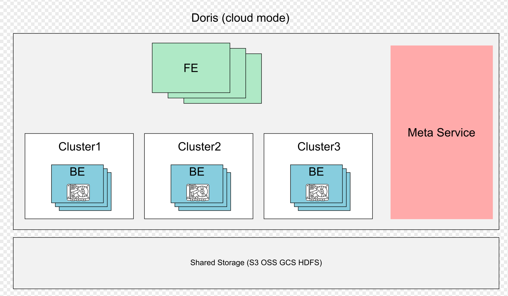
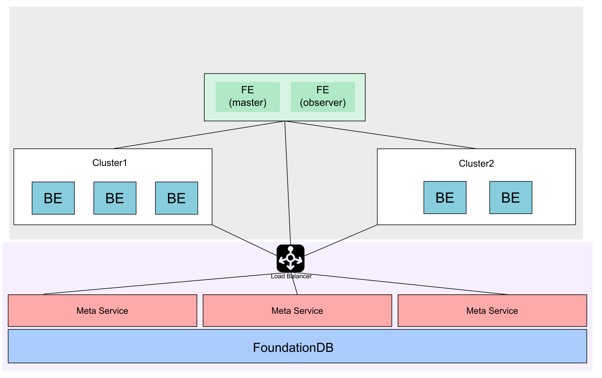
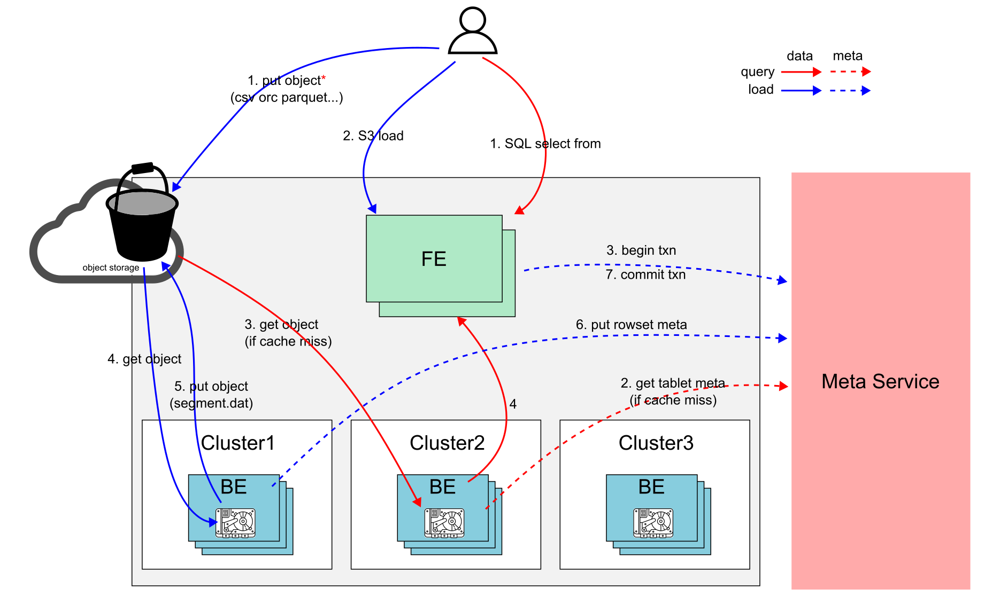
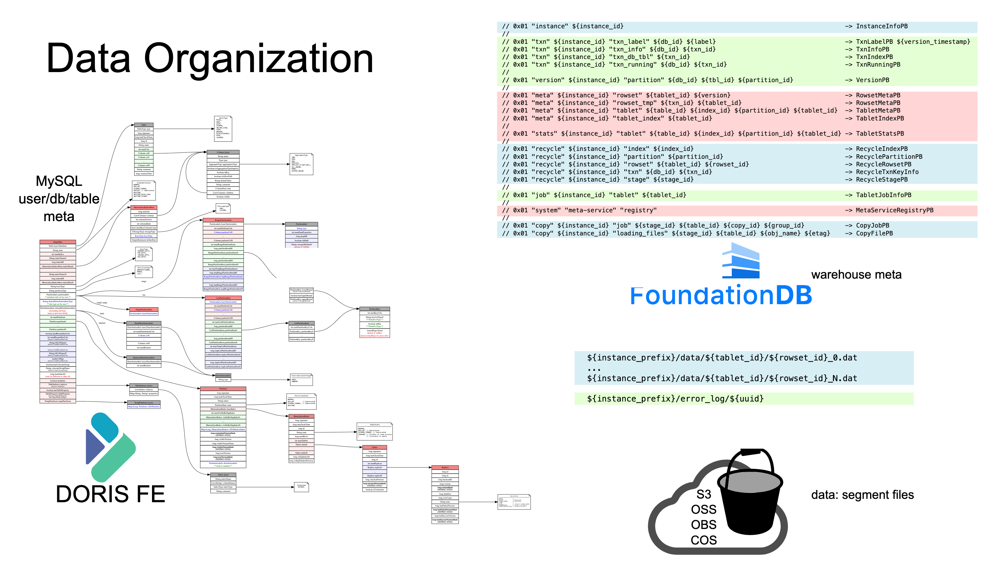

## 动机

1. 弹性的计算资源: 不同时间点使用不同规模的计算资源服务业务请求, 按需使用计算资源, 节约成本.
2. 负载(完全)隔离: 不同业务之间既要共享数据又不想共享计算资源, 数据共享和稳定性二者兼得.
3. 更低的存储成本: 可以使用更低成本的对象存储, HDFS等低成本存储.

上述3点最终核心还是降本增效, 弹性实现按需使用资源, 资源隔离.

## 架构, 整体方案

术语

- FE: doris FE 节点
- BE: 无状态化的doris BE 节点, BE上会cache一部分tablet元数据和数据以提高查询性能.
- Cluster: 无状态的计算资源(BE节点)集合, 多个cluster共享一份数据, cluster可以随时弹性加减节点.
- Meta service: doris存算分离元数据服务, 主要负责处理导入事务, tablet meta, rowset meta 以及集群资源管理. 这是一个可以横向扩展的无状态服务.
- Foundationdb: 实际存储元数据的分布式事务kv.

存算分离首先要剥离计算节点的状态(主要是存储在BE rocksdb里的tablet/rowset的元数据以及数据).

为了实现计算资源的物理隔离, 将计算节点分组管理(cluster), 更合理的组织计算资源. 

下图为存算分离架构部署方式示意图, 除了FE, BE, 还引入一个新模块(meta-service+foundationdb)用来管理offload的元数据信息, 实现机节点无状态化.

下图展示了各个模块之间的连接关系, 需要注意的是 meta-service 依赖了一个高性能分布式事务kv [foundationdb](https://github.com/apple/foundationdb) 来存储实际的数据, 这样大大简化了元数据管理的流程, 同时也提供足够的横向的扩展能力. 实际上meta-service也是一无状态化的服务

## 读写

下图展示了存算分离架构下读写数据流转的流程

导入(s3 load为例): 

1. 将需要导入的数据(事先)存放在对象存储上
2. 通过s3 load 语句创建导入任务 
3. FE 创建导入规划(具体导入哪些数据到那些表), 启动导入事务
4. BE 根据执行导入规划从对象上获取需要导入的数据转换成内doris内部格式
5. BE 将转换完成的数据(segment文件) 上传到对象存储, 数据持久化完成
6. BE 将对应的rowset meta 通过meta service 持久化
7. FE 完成该次导入事务, 导入流程完成

注意: 除了s3load, 存算分离架构支持所有的doris导入方式: stream load, insert into, routine load 等等.

查询:

1. 用户发起查询语句(select), FE 生成对应的查询规划 发往指定cluster的某个BE
2. BE按照执行规划执行, 查询对应的表的元数据, 获取到数据分布. 这一步会可能会和meta-service交互获取tablet元数据, 如果BE上没有这些元数据的缓存.
3. BE 根据规划读取数据进行扫描/过滤. 这一步会优先查找本地数据缓存, 如果不命中本地缓存, 则从S3上获取到对应的数据进行处理.
4. BE 完成查询规划, 返回数据

注意:

- 如果查询的数据能全部命中缓存, 查询性能和doris 存算一体保持一致.
- 用户可以通过新增的`use @<cluster_name>` 的语句来指定sql在特定cluster(物理资源组)上执行

## 隔离

通过灵活应用cluster (`use @<cluster_name>` 语句) , 可以实现多导入以及查询的物理隔离.

假设当前有2个cluster: c1, c2

读读隔离: 两个(类)大查询发起之前分别 `use @c1`, `use @c2`, 可以实现这两个(类)查询使用不同的计算节点完成对相同数据集的, CPU, 内存 查询等长尾不相互竞争, 不相互影响.

读写隔离: doris导入也会消耗一些资源, 特别是在大数据量 高频导入场景. 为了避免查询和导入之间的资源竞争, 导入和查询分别 `use @c1`, `use @c2`, 可以实现查询请求完全在c1上执行, 导入请求完全在c2上执行, 并且c1使用到全量的新导入的数据.

写写隔离: 和读写隔离同理, 导入和导入之间也可以进行隔离, 常用的场景是不同表的导入进行隔离, 比如高频小导入, 大批量导入的隔离. 批量导入往往耗时长, 重试成本高, 高频小导入单次耗时短, 重试成本低, 如果小导入影响到了批量导入, 使用体验会大打折扣. 这个场景可以高频导入和的大批量导入分别`use @c1`, `use @c2`. 达到小导入完全在c1上执行, 批量导入在c2上执行, 互不影响.

## 数据布局

存算分离架构下, 数据(包括元数据和数据文件) 存储在3个位置: FE(bdbJE), fdb 以及 共享存储(对象,HDFS等)

FE 主要存放库表元数据, job 以及权限等mysql协议依赖的信息.

Fdb 主要存放  (存算一体BE offload出来的)tablet meta, rowset meta等信息, 以及导入事务的信息

共享存储 主要存放 数据文件, 包括 segment 文件, 反向索引的索引文件

## 开源实现方案

FE库表元数据保留, 将计算节点的元数据offload到单独的模块 (meta-service). 主要修改

- meta-service
- FE 导入事务
- FE 请求Tablet路由 (cluster/读写路径)
- BE tablet 元数据管理(按需cache)
- BE 读写路径支持存算分离架构
- BE Compaction
- Schema change
- 多cluster管理
- Balance, rebalance
- BE file cache 策略: warmup, ttl, hotspot