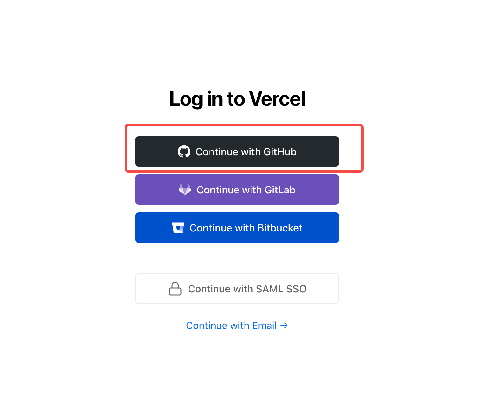

# How to deploy your own Doris Website by Vercel

## Step1: Fork Doris-Website 仓库 https://github.com/apache/doris-website
## Step2: 打开 https://vercel.com 点击 Login，使用 Github 登录

## Step3: 创建新项目

## Step4: 选择 Fork 的组织

## Step5: 部署项目

## 完成并获取官网链接

### 文档数量较多，部署时间大概在20min左右，请耐心等待。

### 部署完成后会获得一个域名，点击就可以直接访问了

### 注意：fork 的站点不能和Doris官网同步，需要手动 Merge Upstream 或者编写自动同步脚本，当commit 被合入到 fork 的仓库后，Vercel 会自动部署包含最新 commit 的网站。

# 使用 Vercel 部署你自己的 Doris 官网