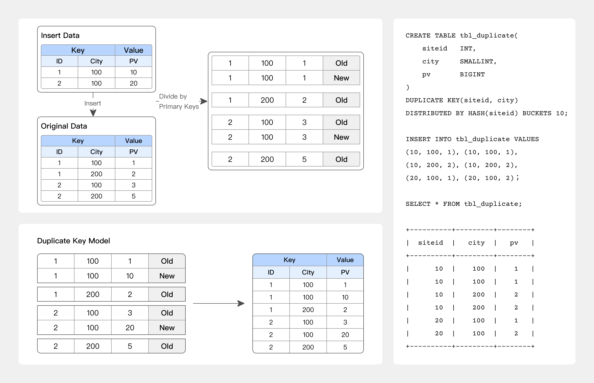
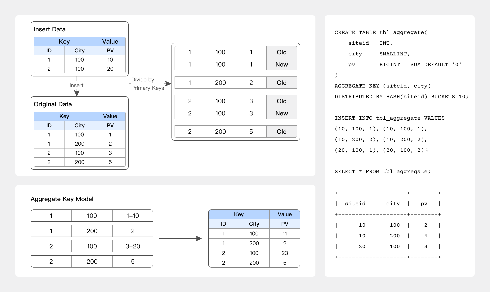
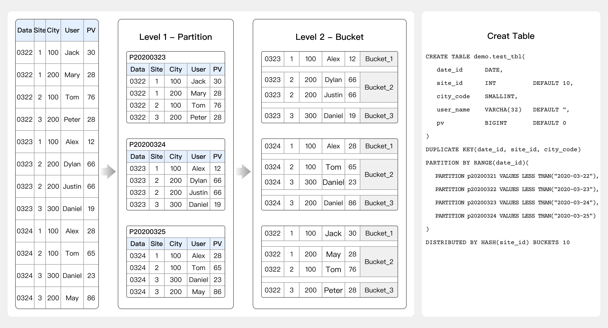

---
{
    "title": "Best Practices",
    "language": "en"
}
---

<!-- 
Licensed to the Apache Software Foundation (ASF) under one
or more contributor license agreements.  See the NOTICE file
distributed with this work for additional information
regarding copyright ownership.  The ASF licenses this file
to you under the Apache License, Version 2.0 (the
"License"); you may not use this file except in compliance
with the License.  You may obtain a copy of the License at

  http://www.apache.org/licenses/LICENSE-2.0

Unless required by applicable law or agreed to in writing,
software distributed under the License is distributed on an
"AS IS" BASIS, WITHOUT WARRANTIES OR CONDITIONS OF ANY
KIND, either express or implied.  See the License for the
specific language governing permissions and limitations
under the License.
-->


# Best Practices

## Data models

> Doris arranges data in three models: DUPLICATE KEY model, UNIQUE KEY model, and AGGREGATE KEY model.

:::tip
**Recommendations**

Because the data model is determined and **immutable** during table creation, it is important to select the most suitable data model.

1. The Duplicate Key model is a good fit for ad-hoc queries across any dimensions. It cannot leverage the benefits of pre-aggregation, but it is also not constrained by the limitations of an aggregation model, so it can take advantage of columnar storage (only reading the relevant columns without the need to read all key columns).
2. The Aggregate Key model, through pre-aggregation, can largely reduce the amount of data scanned and the computational workload for aggregate queries. It is particularly suitable for reporting queries with fixed patterns. However, this model is not friendly for count(*) queries. Additionally, since the aggregation method on the Value columns are fixed, users should pay extra attention to semantic correctness when performing other types of aggregate queries.
3. The Unique Key model is designed for scenarios that require unique primary key constraints. It can ensure the uniqueness of primary keys. The downside is that it cannot reap the benefits brought by materialization and pre-aggregation. For users with high-performance requirements for aggregate queries, it is recommended to use the Merge-on-Write feature of the Unique Key model since Doris 1.2.
4. Users with partial column update requirements might select from the following data models:
   1. Unique Key model (Merge-on-Write mode)
   2. Aggregate Key model (aggregated by REPLACE_IF_NOT_NULL)
:::

### DUPLICATE KEY model



When only the sorting columns are specified, rows with the same key will not be merged.

This is applicable to analytical business scenarios where data does not require pre-aggregation:

- Analysis of raw data
- Analysis of log or time series data where only new data is appended.

**Best practice**

```SQL
-- For example, log analysis that allows only appending new data with replicated KEYs.
CREATE TABLE session_data
(
    visitorid   SMALLINT,
    sessionid   BIGINT,
    visittime   DATETIME,
    city        CHAR(20),
    province    CHAR(20),
    ip          varchar(32),
    brower      CHAR(20),
    url         VARCHAR(1024)
)
DUPLICATE KEY(visitorid, sessionid) -- Used solely for specifying sorting columns, rows with the same KEY will not be merged.
DISTRIBUTED BY HASH(sessionid, visitorid) BUCKETS 10;
```

### AGGREGATE KEY model



Old and new records with the same AGGREGATE KEY will be aggregated. The currently supported aggregation methods are as follows:

1. SUM: calculates the sum by accumulating the values of multiple rows;
2. REPLACE: replaces the value in the previously imported rows with the value from the next batch of data;
3. MAX: retains the maximum value;
4. MIN: retains the minimum value;
5. REPLACE_IF_NOT_NULL: replaces non-null values. Unlike REPLACE, it does not replace null values;
6. HLL_UNION: aggregates columns of HLL type using the HyperLogLog algorithm;
7. BITMAP_UNION: aggregates columns of BITMAP type using bitmap union aggregation;

This is suitable for reporting and multi-dimensional analysis scenarios such as:

- Website traffic analysis
- Multi-dimensional analysis of data reports.

**Best practice**

```SQL
-- Example of website traffic analysis
CREATE TABLE site_visit
(
    siteid      INT,
    city        SMALLINT,
    username    VARCHAR(32),
    pv BIGINT   SUM DEFAULT '0' -- PV caculation
)
AGGREGATE KEY(siteid, city, username) -- Rows with the same KEY will be merged, and non-key columns will be aggregated based on the specified aggregation function.
DISTRIBUTED BY HASH(siteid) BUCKETS 10;
```

### UNIQUE KEY model

The new record will replace the old record that has the same UNIQUE KEY with it. Before Doris 1.2, the UNIQUE KEY model was implemented the same way as the REPLACE aggregation of the AGGREGATE KEY model. However, Since Doris 1.2, we have introduced the Merge-on-Write implementation for the UNIQUE KEY model, which provides better performance for aggregate queries.

This is suitable for analytical business scenarios that require updates, such as:

- Deduplicated order analysis
- Real-time synchronization of inserts, updates, and deletes.

**Best practice**

```SQL
-- Example of deduplicated order analysis
CREATE TABLE sales_order
(
    orderid     BIGINT,
    status      TINYINT,
    username    VARCHAR(32),
    amount      BIGINT DEFAULT '0'
)
UNIQUE KEY(orderid) -- Rows of the same KEY will be merged
DISTRIBUTED BY HASH(orderid) BUCKETS 10;
```

## Index

> Indexes can facilitate quick filtering and searching of data. Currently, Doris supports two types of indexes:
>
> 1. Built-in smart indexes, including prefix index and ZoneMap index.
> 2. User-created secondary indexes, including inverted index, BloomFilter index, Ngram BloomFilter index, and Bitmap index.

### **Prefix index**

Prefix indexes are built-in indexes in the Aggregate, Unique, and Duplicate data models. The underlying data storage is sorted and stored based on the columns specified as the AGGREGATE KEY, UNIQUE KEY, or DUPLICATE KEY in their respective table creation statements. Prefix index, built on top of the sorted data, allows for quick data querying based on given prefix columns.

Prefix indexes are sparse indexes and cannot locate the exact row where a key is present. Instead, they can only roughly identify the range where the key may exist, and then use binary search algorithms to accurately locate the position of the key.

:::tip
**Recommendations**

1. When creating a table, **the correct column order can greatly improve query efficiency**.
   1.  Since the column order is specified during table creation, a table can only have one type of prefix index. However, this may not be efficient enough for queries based on the columns without prefix index. In such cases, users can adjust the column order by creating materialized views.
2. The first field in a prefix index should always be the field of the longest query conditions and should be a high-cardinality field.
   1. Bucketing field: It should have relatively even data distribution and be frequently used, preferably a high-cardinality field.
   2. Int(4) + Int(4) + varchar(50): The prefix index length is only 28.
   3. Int(4) + varchar(50) + Int(4): The prefix index length is only 24.
   4. varchar(10) + varchar(50): The prefix index length is only 30.
   5. Prefix index (36 characters): The first field delivers the best query performance. If a varchar field is encountered, the prefix index will automatically truncate it to the first 20 characters.
   6. If possible, include the most frequently used query fields in the prefix index. Otherwise, specify them as the bucketing fields.
3. The field lengths in the prefix index should be as explicit as possible because Doris can only utilize the prefix index for the first 36 bytes.
4. If it is difficult to design a partitioning, bucketing, and prefix index strategy for your data range, consider introducing inverted indexes for acceleration.
:::

### **ZoneMap index**

ZoneMap index is index information automatically maintained on a per-column basis in the columnar storage format. It includes information such as Min/Max values and the number of Null values. During data querying, the ZoneMap index is utilized to select the data range to scan based on the filtered fields using range conditions.

For example, when filtering the "age" field with the following query statement:

```Shell
SELECT * FROM table WHERE age > 0 and age < 51;
```

If the Short Key Index is not hit, the ZoneMap index will be used to determine the data range, known as the "ordinary" range, that needs to be scanned based on the query conditions for the "age" field. This reduces the number of pages that need to be scanned.

### **Inverted index**

Doris supports inverted indexes since version 2.0.0. Inverted index can be used for full-text searches on text data and range queries on regular numeric and date types. It enables fast filtering of rows that meet the conditions from massive amounts of data.

**Best practice**

```SQL
-- Inverted index can be specified during table creation or added later. This is an example of specifying it during table creation:
CREATE TABLE table_name
(
  columns_difinition,
  INDEX idx_name1(column_name1) USING INVERTED [PROPERTIES("parser" = "english|unicode|chinese")] [COMMENT 'your comment']
  INDEX idx_name2(column_name2) USING INVERTED [PROPERTIES("parser" = "english|unicode|chinese")] [COMMENT 'your comment']
  INDEX idx_name3(column_name3) USING INVERTED [PROPERTIES("parser" = "chinese", "parser_mode" = "fine_grained|coarse_grained")] [COMMENT 'your comment']
  INDEX idx_name4(column_name4) USING INVERTED [PROPERTIES("parser" = "english|unicode|chinese", "support_phrase" = "true|false")] [COMMENT 'your comment']
  INDEX idx_name5(column_name4) USING INVERTED [PROPERTIES("char_filter_type" = "char_replace", "char_filter_pattern" = "._"), "char_filter_replacement" = " "] [COMMENT 'your comment']
  INDEX idx_name5(column_name4) USING INVERTED [PROPERTIES("char_filter_type" = "char_replace", "char_filter_pattern" = "._")] [COMMENT 'your comment']
)
table_properties;

-- Example: keyword matching in full-text searches, implemented by MATCH_ANY MATCH_ALL
SELECT * FROM table_name WHERE column_name MATCH_ANY | MATCH_ALL 'keyword1 ...';
```

:::tip
**Recommendations**

1. If it is difficult to design a partitioning, bucketing, and prefix index strategy for your data range, consider introducing inverted indexes for acceleration.
:::


:::caution
**Restrictions**

1. Different data models have different restrictions on inverted index.
   1. Aggregate KEY model: only allows inverted index for Key columns
   2. Unique KEY model: allows inverted index for any column after enabling Merge-on-Write
   3. Duplicate KEY model: allows inverted index for any column
:::

### **BloomFilter index**

Doris supports adding BloomFilter indexes to fields with high value distinctiveness, making it suitable for scenarios that involve equivalence queries on columns with high cardinality.

**Best practice**

```SQL
-- Example: add "bloom_filter_columns"="k1,k2,k3" in the PROPERTIES of the table creation statement.
-- To create BloomFilter index for saler_id and category_id in the table.
CREATE TABLE IF NOT EXISTS sale_detail_bloom  (
    sale_date date NOT NULL COMMENT "Sale data",
    customer_id int NOT NULL COMMENT "Customer ID",
    saler_id int NOT NULL COMMENT "Saler ID",
    sku_id int NOT NULL COMMENT "SKU ID",
    category_id int NOT NULL COMMENT "Category ID",
    sale_count int NOT NULL COMMENT "Sale count",
    sale_price DECIMAL(12,2) NOT NULL COMMENT "Sale price",
    sale_amt DECIMAL(20,2)  COMMENT "Sale amount"
)
Duplicate  KEY(sale_date, customer_id,saler_id,sku_id,category_id)
DISTRIBUTED BY HASH(saler_id) BUCKETS 10
PROPERTIES (
"bloom_filter_columns"="saler_id,category_id"
);
```

:::caution
**Restrictions**

1. BloomFilter indexes are not supported for columns of type Tinyint, Float, and Double.
2. BloomFilter indexes can only accelerate filtering using "in" and "=" operators.
3. BloomFilter indexes must be built on high-cardinality columns (above 5000) in query conditions that involve "in" or "=" operators.
   1. BloomFilter indexes are suitable for non-prefix filtering.
   2. Queries will filter based on the high-frequency values in the column, and the filtering conditions are mostly "in" and "=".
   3. Unlike Bitmap indexes, BloomFilter indexes are suitable for high-cardinality columns, such as UserID. If created on low-cardinality columns like "gender", each block will contain almost all values, rendering the BloomFilter index meaningless.
   4. It is suitable for cases with data cardinality around half of the total range.
   5. For high-cardinality columns with equality (=) queries, such as ID numbers, using Bitmap indexes can greatly accelerate performance.
:::

### **Ngram BloomFilter index**

Since 2.0.0, Doris has introduced the NGram BloomFilter index to improve the performance of "**LIKE**" queries.

**Best practice**

```SQL
-- Example of creating NGram BloomFilter index in table creation statement
CREATE TABLE `nb_table` (
  `siteid` int(11) NULL DEFAULT "10" COMMENT "",
  `citycode` smallint(6) NULL COMMENT "",
  `username` varchar(32) NULL DEFAULT "" COMMENT "",
  INDEX idx_ngrambf (`username`) USING NGRAM_BF PROPERTIES("gram_size"="3", "bf_size"="256") COMMENT 'username ngram_bf index'
) ENGINE=OLAP
AGGREGATE KEY(`siteid`, `citycode`, `username`) COMMENT "OLAP"
DISTRIBUTED BY HASH(`siteid`) BUCKETS 10;

-- PROPERTIES("gram_size"="3", "bf_size"="256"), representing the number of grams and the byte size of the BloomFilter
-- The number of grams is determined according to the query cases and is typically set to the length of the majority of query strings. The number of bytes in the BloomFilter can be determined after testing. Generally, a larger number of bytes leads to better filtering results, and it is recommended to start with a value of 256 for testing and evaluating the effectiveness. However, it's important to note that a larger number of bytes also increases the storage cost of the index.
-- With high data cardinality, there is no need to set a large BloomFilter size. Conversely, with low data cardinality, increase the BloomFilter size to enhance filtering efficiency.
```

:::caution
**Restrictions**

1. NGram BloomFilter index only supports string columns.
2. NGram BloomFilter indexes and BloomFilter indexes are mutually exclusive, meaning that only one of them can be set for the same column.
3. The sizes of the NGram and the BloomFilter can both be optimized based on the actual situation. If the NGram size is relatively small, you may increase the BloomFilter size.
4. For data at the scale of billions or above, if there is a need for fuzzy matching, it is recommended to use inverted indexes or NGram BloomFilter.
:::

### **Bitmap index**

To accelerate data queries, Doris supports users in adding Bitmap indexes to certain fields. This is suitable for scenarios involving equivalence or range queries on columns with lower cardinality.

**Best practice**

```SQL
-- Example: create Bitmap index for siteid on bitmap_table
CREATE INDEX [IF NOT EXISTS] bitmap_index_name ON
bitmap_table (siteid)
USING BITMAP COMMENT 'bitmap_siteid';
```

:::caution
**Restrictions**

1. Bitmap indexes can only be created on a single column.
2. Bitmap indexes can be applied to all columns in the `Duplicate` and `Unique` Key models, as well as the key columns in the `Aggregate` Key model.
3. Bitmap indexes support the following data types:
   1. `TINYINT`
   2. `SMALLINT`
   3. `INT`
   4. `BIGINT`
   5. `CHAR`
   6. `VARCHAR`
   7. `DATE`
   8. `DATETIME`
   9. `LARGEINT`
   10. `DECIMAL`
   11. `BOOL`
4. Bitmap indexes only take effect under Segment V2. The storage format of tables with Bitmap indexes will be automatically converted to V2 format by default.
5. Bitmap indexes should be constructed within a certain cardinality range. It is not suitable for extremely high or low cardinality cases.
   1. It is recommended for columns with a cardinality between 100 and 100,000, such as the occupation field or city field. If the duplication rate is too high, there won't be significant advantages to build Bitmap indexes compared to other types of indexes. If the duplication rate is too low, Bitmap indexes can significantly reduce space efficiency and performance. Specific types of queries, such as count, OR, and AND operations, only require bitwise operations.
   2. Bitmap indexes are more suitable for orthogonal queries.
:::

## Field type

Doris supports various field types, including precise deduplication with BITMAP, fuzzy deduplication with HLL, semi-structured data types such as ARRAY/MAP/JSON, as well as common numeric, string, and time types.

:::tip
**Recommendations**

1. VARCHAR 
   1. Variable-length string with a length range of 1-65533 bytes. It is stored in UTF-8 encoding, where English characters typically occupy 1 byte.
   2. There is often a misunderstanding about the performance difference between varchar(255) and varchar(65533). If the data stored in both cases is the same, the performance will be the same as well. When creating a table, if you are unsure about the maximum length of the field, it is recommended to use varchar(65533) to prevent import errors caused by excessively long strings.
2. STRING 
   1. Variable-length string with a default size of 1048576 bytes (1MB), which can be increased to 2147483643 bytes (2GB). It is stored in UTF-8 encoding, where English characters typically occupy 1 byte.
   2. It can only be used in value columns but not key columns or partitioning columns.
   3. It is suitable for storing large text content. However, if such a requirement does not exist, it is recommended to use VARCHAR. STRING columns have limitations as they cannot be used in key columns or partitioning columns.
3. Numeric fields: Choose the appropriate data type based on the required precision. There is no special restrictions on this.
4. Time fields: Note that if there is a high precision requirement (timestamp accurate to milliseconds), you need to specify the use of datetime(6). Otherwise, such timestamps are not supported by default.
5. It is recommended to use the JSON data type instead of string type for storing JSON data.
:::

## Create table



Considerations in creating a table include the setting of data partitions and buckets in addition to data model, index, and field types.

**Best practice**

```SQL
-- Take Merge-on-Write tables in the Unique Key model as an example:
-- Merge-on-Write in the Unique Key model is implemented in a different way from the Aggregate Key model. The performance of it is similar to that on the Duplicate Key model.
-- In use cases requiring primary key constraints, the Aggregate Key model can deliver much better query performance compared to the Duplicate Key model, especially in aggregate queries and queries that involve filtering a large amount of data using indexes.

-- For non-partitioned tables
CREATE TABLE IF NOT EXISTS tbl_unique_merge_on_write
(
    `user_id` LARGEINT NOT NULL COMMENT "Use ID",
    `username` VARCHAR(50) NOT NULL COMMENT "Username",
    `register_time` DATE COMMENT "User registration time",
    `city` VARCHAR(20) COMMENT "User city",
    `age` SMALLINT COMMENT "User age",
    `sex` TINYINT COMMENT "User gender",
    `phone` LARGEINT COMMENT "User phone number",
    `address` VARCHAR(500) COMMENT "User address"
)
UNIQUE KEY(`user_id`, `username`)
-- Data volume of 3~5G
DISTRIBUTED BY HASH(`user_id`) BUCKETS 10 
PROPERTIES (
-- In Doris 1.2.0, as a new feature, Merge-on-Write is disabled by default. Users can enable it by adding the following property.
"enable_unique_key_merge_on_write" = "true" 
);

-- For partitioned tables
CREATE TABLE IF NOT EXISTS tbl_unique_merge_on_write_p
(
    `user_id` LARGEINT NOT NULL COMMENT "Use ID",
    `username` VARCHAR(50) NOT NULL COMMENT "Username",
    `register_time` DATE COMMENT "User registration time",
    `city` VARCHAR(20) COMMENT "User city",
    `age` SMALLINT COMMENT "User age",
    `sex` TINYINT COMMENT "User gender",
    `phone` LARGEINT COMMENT "User phone number",
    `address` VARCHAR(500) COMMENT "User address"
)
UNIQUE KEY(`user_id`, `username`, `register_time`)
PARTITION BY RANGE(`register_time`) (
    PARTITION p00010101_1899 VALUES [('0001-01-01'), ('1900-01-01')), 
    PARTITION p19000101 VALUES [('1900-01-01'), ('1900-01-02')), 
    PARTITION p19000102 VALUES [('1900-01-02'), ('1900-01-03')),
    PARTITION p19000103 VALUES [('1900-01-03'), ('1900-01-04')),
    PARTITION p19000104_1999 VALUES [('1900-01-04'), ('2000-01-01')),
    FROM ("2000-01-01") TO ("2022-01-01") INTERVAL 1 YEAR, 
    PARTITION p30001231 VALUES [('3000-12-31'), ('3001-01-01')), 
    PARTITION p99991231 VALUES [('9999-12-31'), (MAXVALUE)) 
) 
-- Data volume of 3~5G
DISTRIBUTED BY HASH(`user_id`) BUCKETS 10 
PROPERTIES ( 
-- In Doris 1.2.0, as a new feature, Merge-on-Write is disabled by default. Users can enable it by adding the following property.
"enable_unique_key_merge_on_write" = "true", 
-- The unit for dynamic partition scheduling can be specified as HOUR, DAY, WEEK, MONTH, or YEAR.
"dynamic_partition.time_unit" = "MONTH",
-- The starting offset for dynamic partitioning is specified as a negative number. Depending on the value of the time_unit, it uses the current day (week/month) as the reference point, partitions prior to this offset will be deleted (TTL). If not specified, the default value is -2147483648, indicating that historical partitions will not be deleted.
"dynamic_partition.start" = "-3000",
-- The ending offset for dynamic partitioning is specified as a positive number. Depending on the value of the time_unit, it uses the current day (week/month) as the reference point. Create the corresponding partitions of the specified range in advance.
"dynamic_partition.end" = "10",
-- The prefix for names of the dynamically created partitions (required).
"dynamic_partition.prefix" = "p",
-- The number of buckets corresponding to the dynamically created partitions.
"dynamic_partition.buckets" = "10", 
"dynamic_partition.enable" = "true", 
-- The following is the number of replicas corresponding to dynamically created partitions. If not specified, the default value will be the replication factor specified when creating the table, which is typically 3.
"dynamic_partition.replication_num" = "3",
"replication_num" = "3"
);  

-- View existing partitions
-- The actual number of created partitions is determined by a combination of dynamic_partition.start, dynamic_partition.end, and the settings of PARTITION BY RANGE.
show partitions from tbl_unique_merge_on_write_p;
```

:::tip
**Recommendations**

1. The database name should be in lowercase, separated by underscores (_) with a maximum length of 62 bytes.
2. Table names are case-sensitive and should be in lowercase, separated by underscores (_) with a maximum length of 64 bytes.
3. Manual bucketing is preferred over auto bucketing. It is recommended to partition and bucket your data based on your specific data volume, as this can improve data writing and query performance. Auto bucketing can result in a large number of tablets and an abundance of small files.
4. For data volumes ranging from 10 million to 200 million rows, you can directly set a bucketing strategy and skip the partition configurations. (Doris internally has default partitions for the table).
5. In **time-series scenarios**, it is recommended to include `compaction_policy" = "time_series` in the table properties when creating the table. This effectively reduces the write amplification of compaction, especially in continuous data ingestion scenarios. Note that it should be used in conjunction with inverted indexes.
:::


:::caution
**Restrictions**

1. The database character set should be specified as UTF-8 since only UTF-8 is supported.
2. The replication factor for tables must be 3 (if not specified, it defaults to 3).
3. The data volume of an individual tablet (**Tablet Count = Partition Count \* Bucket Count \* Replication Factor**) theoretically has no upper or lower bounds, except for small tables (in the range of hundreds of megabytes to one gigabyte), where it should be ensured to be within the range of 1 GB to 10 GB:
   1. If the data volume of an individual tablet is too small, it can result in poor data aggregation performance and increased metadata management overhead.
   2. If the data volume is too large, it hinders replica migration, synchronization, and increases the cost of schema changes or materialization operations (these operations are retried at the granularity of a tablet).
4. For data exceeding 500 million records, **partitioning and bucketing** strategies must be implemented:
   1. **Recommendations for bucketing:**
      1. For large tables, each tablet should be in the range of 1 GB to 10 GB to prevent the generation of too many small files.
      2. For dimension tables of approximately 100 megabytes, the number of tablets should be controlled within the range of 3 to 5. This ensures a certain level of concurrency without generating excessive small files.
   2. If partitioning is not feasible and the data grows rapidly without the possibility of dynamic time-based partitioning, it is advisable to increase the number of buckets to accommodate the data volume based on the data retention period (180 days). It is still recommended to keep the size of each bucket between 1 GB and 10 GB.
   3. Apply salting to the bucketing field and use the same salting strategy for queries in order to leverage bucket pruning capabilities.
   4. Random bucketing:
      1. If an OLAP table does not have fields that need to be updated, setting the data bucketing mode to RANDOM can avoid severe data skew. During data ingestion, each batch of data is randomly assigned to a tablet for writing.
      2. When the bucketing mode for a table is set to RANDOM, since there is no bucketing column, querying the table will scan all buckets in the hit partitions instead of querying specific buckets based on the values of the bucketing column. This setting is suitable for overall aggregation and analysis queries rather than high-concurrency point queries.
      3. If an OLAP table has a random distribution of data, setting the `load_to_single_tablet` parameter to true during data ingestion allows each task to write to a single tablet. This improves concurrency and throughput during large-scale data ingestion. It can also reduce the write amplification caused by data ingestion and compaction and ensure cluster stability.
   5. Dimension tables, which grow slowly, can use a single partition and apply bucketing based on commonly used query conditions (where the data distribution of the bucketing field is relatively even).
   6. Fact tables.
5. If the bucketing field exhibits more than 30% data skew, it is recommended to avoid using the Hash bucketing strategy and instead use the RANDOM bucketing strategy.
6. Dynamic partitioning should not be used for tables of a data size less than 20 million rows. Because the dynamic partitioning method automatically creates partitions, and for small tables, it might unnecessarily create lots of partitions and buckets).
7. For scenarios where there is a large amount of historical partitioned data but the historical data is relatively small, unbalanced, or queried infrequently, you can use the following approach to place the data in special partitions. You can create historical partitions for historical data of small sizes (e.g., yearly partitions, monthly partitions). For example, you can create historical partitions for data `FROM ("2000-01-01") TO ("2022-01-01") INTERVAL 1 YEAR`:
   1. ( 

   2.   PARTITION p00010101_1899 VALUES [('0001-01-01'), ('1900-01-01')), 

   3.   PARTITION p19000101 VALUES [('1900-01-01'), ('1900-01-02')), 

   4.   ... 

   5.   PARTITION p19000104_1999 VALUES [('1900-01-04'), ('2000-01-01')),

   6.   FROM ("2000-01-01") TO ("2022-01-01") INTERVAL 1 YEAR, 

   7.   PARTITION p30001231 VALUES [('3000-12-31'), ('3001-01-01')), 

   8.   PARTITION p99991231 VALUES [('9999-12-31'), (MAXVALUE)) 

   9.  )
8. The number of single-table materialized views should not exceed 6:
   1. Single-table materialized views are built in real time.
   2. On the Unique Key model, materialized views can only be used to reorder keys and cannot be used for data aggregation, as the aggregation model for the Unique Key model is Replace.
:::
